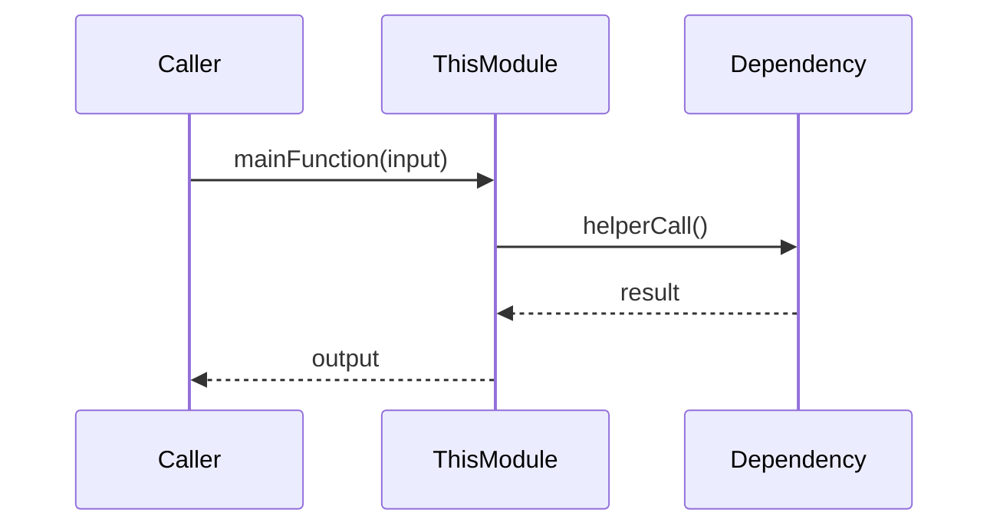

# Module Design Card: <ModuleName>

> **Relevant source files**
>
> - [path/to/primary_file.ts](src:path/to/primary_file.ts)
> - [path/to/dep1.ts](src:path/to/dep1.ts)
> - [path/to/dep2.ts](src:path/to/dep2.ts)

<!-- H1 바로 아래에 'Relevant source files' blockquote 블록을 둔다(모든 .md 필수, wikiStructure 검증). -->
<!-- 이 문서를 작성하기 위해 읽은 모든 소스 파일 + Mermaid에 포함된 모듈을 파일 단위 링크로 나열. -->
<!-- ⚠️ 인용은 code2spec deep-link 규율을 따른다(agent/skills/code2spec-doc-generation/references/grounding-and-deep-links.md): -->
<!--    코드 심볼은 백틱 deep-link [`Sym`](src:path#L<n>) 로 인용하고, 라인은 .ast/api.json 에서, -->
<!--    링크는 src:<경로> 축약형으로 쓴다 — host 접두사는 렌더 시 repo.json.deepLink.base 가 붙는다. 경로는 analysis-target 기준 전체 상대경로. -->

**파일**: [`primary_file.ts`](src:path/to/file.ts)   <!-- 파일 포인터(라인 없음) -->
**한줄 역할**: [코드에서 직접 확인된 동작만. 추측 금지.] [`Symbol`](src:path/to/file.ts#L<n>)   <!-- 백틱 라벨 필수. 근거의 실제 라인 -->
**Core 선정 근거**: 파일 in-degree = N (전체 파일 상위 20%)
**생성일**: YYYY-MM-DD

---

## Public Interface (외부 호출 진입점)

> 이 모듈을 외부에서 호출하는 함수/컴포넌트 목록.

| 함수/컴포넌트                              | 시그니처                    | 주요 호출자      |
| ------------------------------------------ | --------------------------- | ---------------- |
| [`funcA`](src:path/to/file.ts#L12)   | `(param: Type): ReturnType` | moduleB, moduleC |
| [`funcB`](src:path/to/file.ts#L34)   | `(param: Type): void`       | moduleD          |

---

## IPC / Message / Interface Contracts

> **참고**: 정적 분석 결과가 있으면 `/.analysis/interface-candidates/by-module/<module-name>.json` 참고

| Action/Channel | Role | Peer | Type | Confidence | Evidence |
| -------------- | ---- | ---- | ---- | ---------- | -------- |
| (IPC 항목들)   |      |      |      |            |          |

## Key Flow (핵심 실행 흐름)

> 중요한 흐름 개수 제한 없이 작성. 코드 근거 있는 호출 관계만 진행하도록 명시

핵심 흐름은 [`mainFunction`](src:path/to/file.ts#L40) 에서 시작한다.

---

## Architectural Rules (수정 시 반드시 준수)

> 이 모듈에 적용되는 아키텍처 제약. 코드 또는 패턴에서 확인된 것만.

- [ ] [규칙 1: 예) 상태변경은 반드시 X를 통해서만] [`dispatch`](src:path/to/file.ts#L50)
- [ ] [규칙 2: 예) 외부 API 호출은 Y 경유 필수] [`apiClient`](src:path/to/file.ts#L60)
- [ ] [규칙 3: 예) Z 레이어에만 위치해야 함] — 코드에서 확인 불가

---

## Dependencies

### 내부 모듈

| 모듈                                     | 파일        | 용도          |
| ---------------------------------------- | ----------- | ------------- |
| [`moduleA`](src:path/a.ts#L<n>)      | `path/a.ts` | [확인된 용도] |

### 외부 라이브러리

| 라이브러리 | 버전    | 용도          |
| ---------- | ------- | ------------- |
| `lib-name` | `x.y.z` | [확인된 용도] |

---

## Quick Navigation (바이브 코딩용 색인)

> "이걸 수정하려면 어디?" — 심볼 deep-link

| 수정 목적        | 위치                                        |
| ---------------- | ------------------------------------------- |
| [동작 A 변경]    | [`file.ts`](src:path/to/file.ts#L12)  |
| [동작 B 변경]    | [`file.ts`](src:path/to/file.ts#L34)  |
| [에러 처리 수정] | [`file.ts`](src:path/to/file.ts#L50)  |
| [설정값 변경]    | [`file.ts`](src:path/to/file.ts#L60)  |

---

## FR Linkage

> 이 모듈이 구현하는 Functional Requirements (위키 내부 이동 링크 — 백틱 없이 일반 Markdown 링크)

- [FR-XXX-001](../functional-requirements/xxx-fr.md#fr-xxx-001): [FR 제목]
- [FR-XXX-002](../functional-requirements/xxx-fr.md#fr-xxx-002): [FR 제목]
