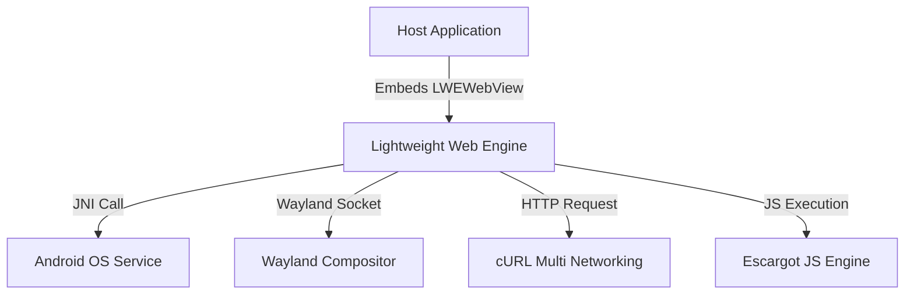

**Related Documents**: [README](README.md) | [Quick Reference](code2spec-quick-reference.md) | [Modules Index](modules/README.md) | [FR Index](functional-requirements/index.md)

# Chapter 1: Introduction

> **Relevant source files:**
> - [`Starfish.h`](src:src/Starfish.h#L1)
> - [`StarfishInfo.h`](src:src/StarfishInfo.h#L1)
> - [`StarfishPlatform.h`](src:src/StarfishPlatform.h#L1)
> - [`LWEWebView.h`](src:inc/LWEWebView.h#L1)

---

## System Purpose
The **Lightweight Web Engine (LWE)**, code-named **Starfish**, is a high-performance, embedded-first HTML5 and JavaScript rendering engine designed for constrained devices, smart TVs, and mobile operating systems (including Tizen, Android, EFL, and Flutter) [`StarfishInfo.h`](src:src/StarfishInfo.h#L26).

## System Scope
- **Included Functions:** HTML5/CSS3 parsing, DOM hierarchy building, JavaScript execution environment via Samsung's Escargot JavaScript engine, 2D and WebGL hardware-accelerated canvas rendering, service/shared workers, cURL-backed networking, and native platform embedding wrappers.
- **Excluded Functions:** Built-in web browser UI (tabs, address bars, bookmarks are managed by client application containers).

## User and Actor Definition
| Actor | Type | Role | Source |
|-------|------|------|--------|
| Application Container | System | Embeds `LWEWebView` and receives delegates | [`LWEWebView.h`](src:inc/LWEWebView.h#L58) |
| Web Application Developer | Human | Deploys HTML/JS/CSS assets to run inside LWE | [`PlatformIntegrationData.h`](src:inc/PlatformIntegrationData.h#L7) |
| Internal Test Runner | System | Executes Web Platform Tests (WPT) automated suites | [`test_runner.py`](src:tool/runner/test_runner.py#L252) |

## System Context Diagram

## Technology Stack
| Layer | Technology | License | Source |
|-------|------------|---------|--------|
| Language | C++11 | N/A | [`Starfish.cpp`](src:src/Starfish.cpp#L1) |
| JS Runtime | Escargot | Samsung Proprietary | [`ScriptEngineInstance.h`](src:src/binding/ScriptEngineInstance.h#L1) |
| 2D Graphics | Cairo | LGPL 2.1 | [`PathCairo.h`](src:src/platform/canvas/PathCairo.h#L26) |
| Network | cURL | MIT-like | [`NetworkSharedResourceManager.cpp`](src:src/platform/network/curl/NetworkSharedResourceManager.cpp#L1) |
| Platform | Tizen / EFL | BSD | [`LWEWebViewEcoreWl2.cpp`](src:src/public/bridge/ecore_wl2/LWEWebViewEcoreWl2.cpp#L1) |

## Document Overview
This document specifies the technical design, architectural layout, design patterns, and platform integrations of the Starfish Web Engine.
