# System Architecture

> **Relevant source files**
>
> - [src/Starfish.h](src:src/Starfish.h)
> - [src/StarfishPlatform.h](src:src/StarfishPlatform.h)
> - [inc/LWEWebView.h](src:inc/LWEWebView.h)
> - [src/public/LWEWebView.cpp](src:src/public/LWEWebView.cpp)
> - [src/core/page/WebView.h](src:src/core/page/WebView.h)
> - [src/core/dom/Document.h](src:src/core/dom/Document.h)
> - [src/core/style/ComputedStyle.h](src:src/core/style/ComputedStyle.h)
> - [src/core/layout/Frame.h](src:src/core/layout/Frame.h)
> - [src/core/cdp/CDPServer.h](src:src/core/cdp/CDPServer.h)
> - [src/core/modules/message_loop/MessageLoop.h](src:src/core/modules/message_loop/MessageLoop.h)
> - [src/binding/ScriptWrappable.h](src:src/binding/ScriptWrappable.h)
> - [src/shell/MiniBrowser.cpp](src:src/shell/MiniBrowser.cpp)

Starfish is "a lightweight Web browser engine for TV, mobile, headless and wearable devices" ([`README.md`](src:README.md#L3)). This chapter describes the architecture observable from the repository structure and source code, using the 32 human-approved logical modules as the unit of analysis.

## Architecture Pattern

The directory layout shows a **layered separation** between a public embedder API, the core web engine, a platform abstraction layer, and per-backend shell ports:

- **Public embedder API** — `inc/` (installed headers) and `src/public/` (implementation), plus `compat/`. The exported facade classes are declared with the `LWE_EXPORT` macro in the `LWE` namespace: [`LWE`](src:inc/LWEWebView.h#L97) (engine lifecycle, with [`LWE::Initialize`](src:inc/LWEWebView.h#L137)) and [`WebContainer`](src:inc/LWEWebView.h#L290). The implementation [`WebContainer::Create`](src:src/public/LWEWebView.cpp#L549) does not touch engine internals directly; it forwards to a delegate object (`LWEDelegate::WebContainer::Create`, called at [`LWEWebView.cpp`](src:src/public/LWEWebView.cpp#L563)), and the delegate code in `src/public/delegate/` is what constructs the core engine object (`::Starfish::WebView::create(...)` at [`LWEWebContainerDelegate.cpp`](src:src/public/delegate/LWEWebContainerDelegate.cpp#L187)). This is a facade-plus-delegate indirection between the API layer and the engine core.
- **Core web engine** — `src/core/` (dom, style, layout, page, fetch, cdp, csp, animation, storage, fileapi, util, and feature modules under `src/core/modules/`), with the JavaScript binding layer in `src/binding/` (base class [`ScriptWrappable`](src:src/binding/ScriptWrappable.h#L419)). The engine-wide root object is [`Starfish`](src:src/Starfish.h#L58), configured through [`StarfishConfiguration`](src:src/Starfish.h#L49).
- **Platform abstraction** — `src/platform/` (canvas, loader, network, message_loop, multimedia, file, process, tts, windows, ...). Backend selection is compile-time: [`StarfishPlatform.h`](src:src/StarfishPlatform.h#L23) maps build flavors (`STARFISH_GLIB_CAIRO_GL`, `STARFISH_UV_CAIRO_GL`, `STARFISH_GLIB_HEADLESS`, `STARFISH_ANDROID`, `STARFISH_WINDOWS`, `STARFISH_FLUTTER`) to `PORT_CANVAS_BACKEND_*`, `PORT_EVENTLOOP_BACKEND_*`, and `PORT_IMAGEDECODER_BACKEND_*` macros. Concrete port classes subclass core interfaces, e.g. [`MessageLoopGLib`](src:src/platform/message_loop/MessageLoopGLib.h#L30) extends [`MessageLoop`](src:src/core/modules/message_loop/MessageLoop.h#L36). Renderer variants are also enumerated in the entry layer as [`StarfishRendererType`](src:src/Starfish.h#L43) (`kOpenGL`, `kSoftware`, `kHeadless`), with matching implementation files `RendererGL.cpp`, `RendererSoftware.cpp`, and `RendererHeadless.cpp` in `src/core/modules/renderer/`.
- **Shell ports** — `src/shell/` contains per-backend port directories (`ecore`, `efl`, `glib`, `libuv`, `tcore_wl`, `windows`, `x11_webcontainer`, `headless`, `dummy`) plus the driver classes [`Shell`](src:src/shell/Shell.h#L31) (with [`Shell::run`](src:src/shell/Shell.h#L36)) and `MiniBrowser`. The shell consumes only the public API — for example `LWE::LWE::Initialize(...)` at [`MiniBrowser.cpp`](src:src/shell/MiniBrowser.cpp#L224) — which matches the single AST dependency edge `shell -> public-embedder-api`.

## Layer Structure

The following diagram is embedded verbatim from `code2spec/diagrams/architecture.mmd`; its nodes are the 32 approved logical modules and its edges are aggregated file-level IMPORTS_FROM relations from the code2spec AST export.

```mermaid
graph TD
%% Starfish system architecture — W1 initial architecture / system-context diagram
%% Nodes: 32 confirmed Core logical modules from .analysis/analysis-notes/module-priority-reviewed.md
%% Edges: aggregated file-level IMPORTS_FROM relations from .analysis/cache/code-to-ast/graph-raw.json
%%        direction preserved: A --> B means files in module A import files in module B

  subgraph api_layer["Embedder API and Entry"]
    public_embedder_api["public-embedder-api (src/public, inc)"]
    engine_entry["engine-entry (src/Starfish.cpp, StarfishConfig.h)"]
    shell["shell (src/shell ports)"]
    binding["binding (src/binding JS bindings)"]
  end

  subgraph dom_layer["Core DOM"]
    core_dom["core-dom (src/core/dom)"]
    core_dom_svg["core-dom-svg"]
    core_dom_canvas["core-dom-canvas (canvas, webgl)"]
    core_dom_parser["core-dom-parser (HTML parser)"]
  end

  subgraph engine_layer["Core Engine"]
    core_style["core-style (CSS)"]
    core_layout["core-layout"]
    core_page["core-page (WebView, Window)"]
    core_animation["core-animation"]
    core_fetch["core-fetch"]
    core_cdp["core-cdp (DevTools protocol)"]
    core_util["core-util"]
    core_storage_fileapi["core-storage-fileapi"]
    core_csp["core-csp"]
    core_extras["core-extras (serialize, xml, inspector)"]
  end

  subgraph modules_layer["Web Feature Modules"]
    modules_serviceworker["modules-serviceworker"]
    modules_workers["modules-workers (worker, sharedworker)"]
    modules_mediastream["modules-mediastream (WebRTC)"]
    modules_canvas["modules-canvas (compositing, filters)"]
    modules_indexeddb["modules-indexeddb"]
    modules_media["modules-media (webaudio, mediasource)"]
    modules_runtime["modules-runtime (threading, message_loop)"]
    modules_web_apis["modules-web-apis (cast, location, networking)"]
  end

  subgraph platform_layer["Platform Layer"]
    platform_multimedia["platform-multimedia"]
    platform_canvas["platform-canvas (graphics backend)"]
    platform_network_loader["platform-network-loader (curl, loader)"]
    platform_base["platform-base (file, process, tts)"]
  end

  subgraph support_layer["Support Artifacts"]
    support_tools["support-tools (tool, docs)"]
    support_vendor_robin_map["support-vendor-robin-map (third_party)"]
  end

  core_dom --> engine_entry
  core_layout --> core_dom
  core_dom_svg --> engine_entry
  core_layout --> core_style
  core_dom --> core_page
  core_page --> core_dom
  core_style --> core_dom
  modules_serviceworker --> core_util
  core_style --> engine_entry
  modules_mediastream --> core_dom
  modules_serviceworker --> engine_entry
  core_layout --> engine_entry
  modules_mediastream --> engine_entry
  core_dom --> binding
  modules_serviceworker --> modules_workers
  modules_workers --> engine_entry
  core_cdp --> engine_entry
  core_dom_svg --> core_dom
  modules_serviceworker --> core_dom
  core_layout --> modules_canvas
  modules_web_apis --> core_dom
  platform_multimedia --> modules_runtime
  core_cdp --> core_dom
  core_dom --> core_style
  platform_canvas --> modules_canvas
  core_dom_svg --> core_style
  modules_media --> core_dom
  binding --> core_dom
  core_dom_canvas --> core_dom
  core_util --> engine_entry
  core_animation --> core_style
  core_dom_parser --> core_dom
  platform_base --> modules_runtime
  public_embedder_api --> engine_entry
  modules_canvas --> engine_entry
  modules_indexeddb --> core_dom
  modules_runtime --> engine_entry
  platform_network_loader --> engine_entry
  core_extras --> core_dom
  core_fetch --> binding
  core_storage_fileapi --> engine_entry
  support_tools --> public_embedder_api
  engine_entry --> core_util
  core_csp --> engine_entry
  shell --> public_embedder_api
  engine_entry --> support_vendor_robin_map
```

## Core Components

One row per approved logical module. Responsibilities are limited to what the directory contents show; each "Main entry point" links to a class/function definition line verified in source.

| Component (module) | Responsibility | Main entry point | Source |
|---|---|---|---|
| core-dom | DOM tree: Document, Node, Element and HTML element classes | [`Document`](src:src/core/dom/Document.h#L102), [`Node`](src:src/core/dom/Node.h#L140) | `src/core/dom` (excl. svg/canvas/parser) |
| core-dom-svg | SVG element classes and SVG animation tasks | [`SVGElement`](src:src/core/dom/svg/SVGElement.h#L97) | `src/core/dom/svg` |
| core-dom-canvas | Canvas and WebGL rendering context elements, gradients | [`HTMLCanvasElement`](src:src/core/dom/canvas/HTMLCanvasElement.h#L39) | `src/core/dom/canvas` (incl. webgl) |
| core-dom-parser | HTML parsing: tokenizer, entities, construction site, element stack | [`HTMLParser`](src:src/core/dom/parser/HTMLParser.h#L35) | `src/core/dom/parser` |
| core-style | CSS computed style storage and style resolution | [`ComputedStyle`](src:src/core/style/ComputedStyle.h#L795) | `src/core/style` |
| core-layout | Layout frame tree: Frame, block, flexible, grid boxes | [`Frame`](src:src/core/layout/Frame.h#L1203) | `src/core/layout` |
| core-cdp | Chrome DevTools Protocol server, dispatcher, protocol domains | [`CDPServer`](src:src/core/cdp/CDPServer.h#L38) | `src/core/cdp` |
| core-util | String, AtomicString, archiving, hashing, allocator utilities | [`String`](src:src/core/util/String.h#L694), [`AtomicString`](src:src/core/util/AtomicString.h#L32) | `src/core/util` |
| core-page | WebView, Window, Navigator, History, BrowsingContext page objects | [`WebView`](src:src/core/page/WebView.h#L98) | `src/core/page` |
| core-fetch | Fetch API: Fetch, Request, Headers, Body | [`Fetch`](src:src/core/fetch/Fetch.h#L39) | `src/core/fetch` |
| core-animation | Animation objects, animated values, appliers, executors | [`Animation`](src:src/core/animation/Animation.h#L154) | `src/core/animation` |
| core-storage-fileapi | Web Storage plus File API: Storage, Blob, FileReader | [`Storage`](src:src/core/storage/Storage.h#L34) | `src/core/storage`, `src/core/fileapi` |
| core-csp | Content Security Policy parsing and directive lists | [`ContentSecurityPolicy`](src:src/core/csp/ContentSecurityPolicy.h#L56) | `src/core/csp` |
| core-extras | Performance, Console, MimeType, serializer, XML, Inspector extras | [`Inspector`](src:src/core/inspector/Inspector.h#L29) | `src/core/extra`, `serialize`, `xml`, `inspector`, `event` |
| modules-serviceworker | Service worker registration, job queue, fetch events, host scope | [`ServiceWorkerContainer`](src:src/core/modules/serviceworker/ServiceWorkerContainer.h#L51) | `src/core/modules/serviceworker` |
| modules-workers | Dedicated and shared workers: threads, hosts, proxies, scopes | [`Worker`](src:src/core/modules/worker/Worker.h#L33) | `src/core/modules/worker`, `sharedworker` |
| modules-mediastream | MediaStream, MediaDevices, RTCPeerConnection and constraints | [`MediaStream`](src:src/core/modules/mediastream/MediaStream.h#L42) | `src/core/modules/mediastream` |
| modules-canvas | Canvas state, surfaces, compositor, blend modes | [`Compositor`](src:src/core/modules/canvas/Compositor.h#L48) | `src/core/modules/canvas` |
| modules-indexeddb | IndexedDB databases, cursors, connections, backing store | [`IDBDatabase`](src:src/core/modules/indexeddb/IDBDatabase.h#L57) | `src/core/modules/indexeddb` |
| modules-media | MediaSource, SourceBuffer and WebAudio buffers | [`MediaSource`](src:src/core/modules/mediasource/MediaSource.h#L44) | `src/core/modules/webaudio`, `mediasource` |
| modules-runtime | Message loop, timers, threading, renderer backends, profiling | [`MessageLoop`](src:src/core/modules/message_loop/MessageLoop.h#L36) | `src/core/modules/message_loop`, `threading`, `profiling`, `renderer` |
| modules-web-apis | Cast, geolocation, networking, TTS, resource request, battery, crypto | [`Geolocation`](src:src/core/modules/location/Geolocation.h#L36) | `src/core/modules/cast`, `location`, `networking`, `tts`, `resize_observer`, `resource_request`, `battery`, `crypto` |
| platform-multimedia | Media players and MP4/WebM demuxers | [`MediaPlayer`](src:src/platform/multimedia/MediaPlayer.h#L62) | `src/platform/multimedia` |
| platform-canvas | Cairo, GL and mock canvas, compositor, path backends | [`PathCairo`](src:src/platform/canvas/PathCairo.h#L28) | `src/platform/canvas` |
| platform-network-loader | Resource loading: loader, image, font, text resources | [`ResourceLoader`](src:src/platform/loader/ResourceLoader.h#L40) | `src/platform/loader`, `src/platform/network` |
| platform-base | Platform file, directory, process, TTS primitives | [`PlatformFile`](src:src/platform/file/PlatformFile.h#L33) | `src/platform/file`, `process`, `tts` |
| public-embedder-api | Exported LWE classes and delegate implementations | [`WebContainer`](src:inc/LWEWebView.h#L290) | `src/public`, `inc`, `compat` |
| binding | JavaScript binding bases and custom bindings | [`ScriptWrappable`](src:src/binding/ScriptWrappable.h#L419) | `src/binding` |
| shell | Sample shells and per-backend window ports | [`Shell`](src:src/shell/Shell.h#L31) | `src/shell` |
| engine-entry | Engine instance, configuration, static strings, storage paths | [`Starfish`](src:src/Starfish.h#L58) | `src` root files, `src/browser`, `src/launcher` |
| support-tools | Build, test, lint tooling and documentation | [`main`](src:tool/imgdiff/imgdiff.cpp#L217) | `tool`, `docs` |
| support-vendor-robin-map | Vendored tsl robin-map hash containers | [`robin_map`](src:third_party/robin_map/include/tsl/robin_map.h#L91) | `third_party/robin_map` |

## Component Dependency Directions

Data source: aggregated file-level IMPORTS_FROM counts from the code2spec AST export (direction: importer -> imported). The top edges by import count:

| From | To | Import count |
|---|---|---|
| core-dom | engine-entry | 215 |
| core-layout | core-dom | 145 |
| core-dom-svg | engine-entry | 110 |
| core-layout | core-style | 103 |
| core-dom | core-page | 95 |
| core-page | core-dom | 92 |
| core-style | core-dom | 76 |
| modules-serviceworker | core-util | 71 |
| core-style | engine-entry | 70 |
| modules-mediastream | core-dom | 65 |
| modules-serviceworker | engine-entry | 62 |
| core-dom | binding | 57 |
| modules-serviceworker | modules-workers | 57 |
| modules-workers | engine-entry | 55 |
| core-cdp | engine-entry | 54 |
| core-dom-svg | core-dom | 50 |
| modules-serviceworker | core-dom | 50 |
| core-layout | modules-canvas | 48 |
| modules-web-apis | core-dom | 46 |
| platform-multimedia | modules-runtime | 44 |
| core-cdp | core-dom | 44 |
| core-dom | core-style | 44 |

Three direction rules are directly observable in the include lines. First, nearly every layer imports the engine-entry root headers: [`Document.cpp`](src:src/core/dom/Document.cpp#L22) begins with `#include "StarfishConfig.h"` followed by `#include "Starfish.h"` on [`Document.cpp`](src:src/core/dom/Document.cpp#L23). Second, feature and platform code imports runtime interfaces from `src/core/modules`, e.g. [`MediaPlayerTV.cpp`](src:src/platform/multimedia/MediaPlayerTV.cpp#L31) includes `core/modules/message_loop/MessageLoop.h`, and modules-serviceworker reuses worker types via `#include "core/modules/worker/WorkerType.h"` at [`ServiceWorkerJobData.h`](src:src/core/modules/serviceworker/ServiceWorkerJobData.h#L24). Third, core-dom and core-page depend on each other (95 vs. 92 imports), while the shell reaches the engine only through public-embedder-api (`LWE::LWE::Initialize` at [`MiniBrowser.cpp`](src:src/shell/MiniBrowser.cpp#L224)).

## Component Interfaces

Cross-module call and type interfaces verified in source:

| Sender | Receiver | Interface (function/type) | Data | Source |
|---|---|---|---|---|
| shell | public-embedder-api | [`LWE::Initialize`](src:inc/LWEWebView.h#L137) | Storage directory path, `InitializeOption` | Call site [`MiniBrowser.cpp`](src:src/shell/MiniBrowser.cpp#L224) |
| public-embedder-api | core-page | [`WebView::create`](src:src/core/page/WebView.h#L106) | `Starfish*`, locale/timezone, window size, font, `ScreenInfo` | Call site [`LWEWebContainerDelegate.cpp`](src:src/public/delegate/LWEWebContainerDelegate.cpp#L187) |
| core-page | platform-base (`src/platform/public`) | [`ScreenInfo`](src:src/platform/public/ScreenInfo.h#L55) struct | Device pixel ratio, screen depth | Include at [`WebView.h`](src:src/core/page/WebView.h#L26) |
| core-cdp | core-page | [`CDPServer`](src:src/core/cdp/CDPServer.h#L40) constructor | `WebView*` and TCP port | Definition [`CDPServer.h`](src:src/core/cdp/CDPServer.h#L40) |
| core-cdp | core-cdp domains (DOM inspection) | [`DOMDomain::processMessage`](src:src/core/cdp/domains/DOMDomain.h#L36) | `CDPCommand`, method name string | Definition [`DOMDomain.h`](src:src/core/cdp/domains/DOMDomain.h#L30) |
| modules-serviceworker | modules-workers | `WorkerType` type import | Worker type value in `ServiceWorkerJobData` | Include at [`ServiceWorkerJobData.h`](src:src/core/modules/serviceworker/ServiceWorkerJobData.h#L24) |
| core-fetch | modules-web-apis | [`Fetch::success`](src:src/core/fetch/Fetch.h#L50) | [`ResourceRequest`](src:src/core/modules/resource_request/ResourceRequest.h#L111) object | Signature [`Fetch.h`](src:src/core/fetch/Fetch.h#L50) |
| core-fetch | binding | [`toRequestOrUSVStringFromValueRef`](src:src/core/fetch/Fetch.h#L34) | `RequestOrUSVString` union from `Escargot::ValueRef` | Generated-union include at [`Fetch.h`](src:src/core/fetch/Fetch.h#L23) |
| platform-multimedia | modules-runtime | [`WebBase::messageLoop`](src:src/core/page/WebBase.h#L210) returning [`MessageLoop`](src:src/core/modules/message_loop/MessageLoop.h#L36) | `MessageLoop*` | Call site [`MediaPlayerTV.cpp`](src:src/platform/multimedia/MediaPlayerTV.cpp#L118) |
| core-layout | core-style | [`Frame::style`](src:src/core/layout/Frame.h#L1611) | [`ComputedStyle`](src:src/core/style/ComputedStyle.h#L795) pointer | Definition [`Frame.h`](src:src/core/layout/Frame.h#L1611) |
