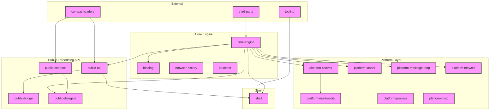

# 02 — Architecture

> **Relevant source files**
> - [`src/Starfish.h`](src:src/Starfish.h)
> - [`src/Starfish.cpp`](src:src/Starfish.cpp)
> - [`src/StarfishBase.h`](src:src/StarfishBase.h)
> - [`inc/LWEWebView.h`](inc:LWEWebView.h)
> - [`diagrams/architecture.mmd`](diagrams/architecture.mmd)

## Architecture Overview

Starfish follows a layered architecture with clear separation between the engine core, platform abstractions, public embedding API, and shell.

## Layer Descriptions

### Core Engine Layer

The `Starfish` class ([`Starfish.h`](src:src/Starfish.h#L58)) is the root engine object. It is GC-managed (inherits `gc`) and owns `StaticStrings`, `StoragePathProvider`, `WorkerManager`, and optionally `HTTPCache`.

Configured via `StarfishConfiguration` struct [`Starfish.h`](src:src/Starfish.h#L49) with `storageDirectoryPath`, `gcFrequency` (BDWGC free space divisor, default 12), `isThreadMode`, `backend`, and `rendererType` (OpenGL/Software/Headless).

### Binding Layer

Integrates Escargot JS engine with DOM. Key: `ScriptEngineInstance`, `ScriptBindingInstance`, `ScriptBindingSecurity`, and custom bindings for DOM interfaces.

### Platform Layer

- **Canvas** — Cairo and OpenGL backends, HarfBuzz/ICU font shaping, image data
- **Loader** — Resource loading (font, image, text, header)
- **Message Loop** — GLib and libUV event loop backends
- **Multimedia** — Media players for Linux, Tizen, TV, WebRTC
- **Network** — HTTP client (libcurl), caching, transactions
- **Process** — Process type management
- **Misc** — File I/O, device info, TTS, key events

### Public Embedding API

- **LWEWebView** — primary web view control [`inc/LWEWebView.h`](inc:LWEWebView.h)
- **LWEWorker** — web worker control [`inc/LWEWorker.h`](inc:LWEWorker.h)
- **Contract** — pure-virtual interfaces across `.so` boundary
- **Delegate** — concrete delegate implementations
- **Bridge** — per-platform window integration (Android, EFL, Ecore, Flutter, X11)

### Shell Layer

`MiniBrowser` (entry point), `Shell` (engine lifecycle), `Console`, `Window` (platform-specific), `UnitTestRunner`.

## Module Summary

| Module | Files | Centrality | Role |
|---|---|---|---|
| tooling | 55 | 0.197 | Build, test, CI tools |
| shell | 39 | 0.155 | Browser shell |
| binding | 38 | 0.153 | JS engine binding |
| platform-multimedia | 32 | 0.145 | Media playback |
| platform-canvas | 25 | 0.142 | Canvas rendering |
| public-bridge | 20 | 0.131 | Platform bridges |
| platform-network | 17 | 0.126 | HTTP networking |
| platform-loader | 17 | 0.121 | Resource loading |
| platform-misc | 15 | 0.116 | Misc platform |
| public-delegate | 14 | 0.089 | Delegates |
| platform-message-loop | 12 | 0.084 | Event loop |
| core-engine | 10 | 0.079 | Engine core |
| public-api | 10 | 0.079 | Embedding API |
| public-contract | 9 | 0.076 | Contracts |
| third-party | 5 | 0.066 | Third-party |
| compat-headers | 4 | 0.063 | Compat headers |
| platform-process | 3 | 0.061 | Process mgmt |
| browser-history | 2 | 0.058 | History |
| launcher | 2 | 0.058 | Worker launchers |
