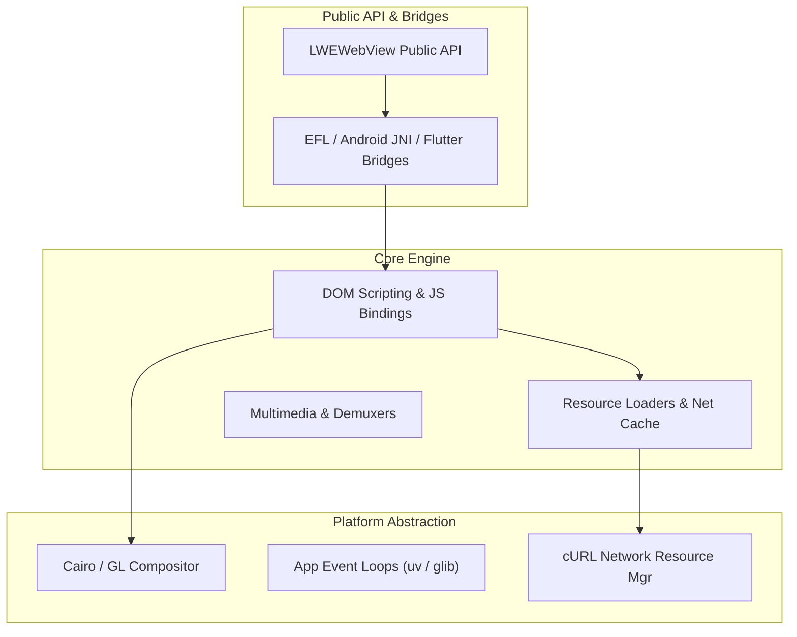
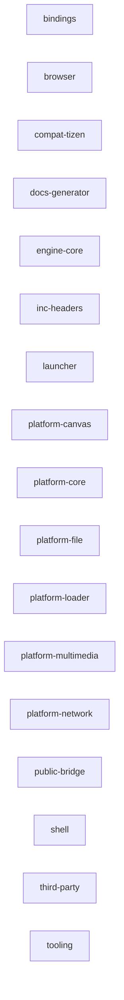

**Related Documents**: [README](README.md) | [Quick Reference](code2spec-quick-reference.md) | [Modules Index](modules/README.md) | [FR Index](functional-requirements/index.md)

# Chapter 2: System Architecture

> **Relevant source files:**
> - [`Starfish.cpp`](src:src/Starfish.cpp#L1)
> - [`LWEWebView.h`](src:inc/LWEWebView.h#L1)
> - [`ScriptBindingInstance.cpp`](src:src/binding/ScriptBindingInstance.cpp#L1)
> - [`LWEWebViewEcoreWl2.cpp`](src:src/public/bridge/ecore_wl2/LWEWebViewEcoreWl2.cpp#L1)

---

## Architectural Patterns
Starfish employs a multi-layered, micro-component web engine architecture featuring a clean separation of the rendering pipeline, scripting bindings, and platform-specific window managers.

## Layer Structure

## Core Components Description
| Component | Responsibility | Major Entry Point | Source |
|-----------|----------------|-------------------|--------|
| `LWEWebView` | Public API wrapper for host application integration | `LWEWebView::create()` | [`LWEWebView.h`](src:inc/LWEWebView.h#L58) |
| `ScriptBindingInstance` | Manages JS DOM context and binds custom objects to Escargot context | `initBinding()` | [`ScriptBindingInstance.cpp`](src:src/binding/ScriptBindingInstance.cpp#L34) |
| `CompositorGL` | Provides hardware-accelerated WebGL compositing pipeline | `CompositorContextGL` | [`CompositorGL.cpp`](src:src/platform/canvas/CompositorGL.cpp#L320) |
| `NetworkSharedResourceManager` | Governs multi-threaded cURL download managers | `init()` | [`NetworkSharedResourceManager.cpp`](src:src/platform/network/curl/NetworkSharedResourceManager.cpp#L436) |

## Component-to-Component Interfaces
| Sender Component | Receiver Component | Interface (Function/Event) | Data | Source |
|------------------|--------------------|----------------------------|------|--------|
| `AndroidBridge` | `LWEWebViewImpl` | `Java_init()` | JavaVM context | [`AndroidBridge.cpp`](src:src/public/bridge/android/AndroidBridge.cpp#L443) |
| `A11yAtspiBridge` | `D-Bus Daemon` | `a11yDbusFilter()` | DBus Message | [`A11yAtspiBridge.cpp`](src:src/public/bridge/efl/A11yAtspiBridge.cpp#L462) |

## Module Dependencies

<!-- code2spec:module-dependency:start -->

<!-- code2spec:module-dependency:end -->
