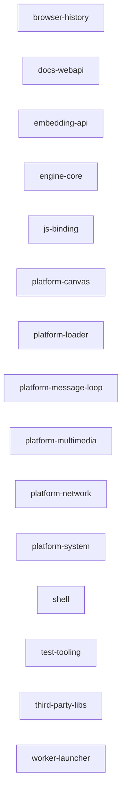

# 02 - Architecture

> **Relevant source files**
> - `AGENTS.md`
> - `src/`
> - `code2spec/diagrams/architecture.mmd`

## System Overview

Starfish is a layered web browser engine. The architecture follows a platform abstraction pattern where the engine core sits above platform-specific implementations, with a public embedding API separating the engine from host applications (shells).

## Architecture Diagram

See `diagrams/architecture.mmd` for the full system context diagram.

## Layer Description

### Shell Layer (`src/shell/`)
Host applications that embed the engine. Includes MiniBrowser, Console, and platform-specific window implementations (EFL, X11, Windows, headless). `src/shell/`

### Embedding API Layer (`src/public/`, `inc/`)
The public API surface for embedders. Contains:
- **WebView/Worker API** (`inc/LWEWebView.h`, `inc/LWEWorker.h`)
- **Delegate contracts** (`src/public/contract/`) - pure-virtual interfaces shared across the `.so` boundary
- **Delegate implementations** (`src/public/delegate/`)
- **Per-platform bridges** (`src/public/bridge/`) - Android (JNI), EFL, Ecore, Flutter, X11

`AGENTS.md`, `src/public/`

### Engine Core (`src/Starfish.cpp`, `src/StarfishBase.h`)
Foundation classes: GC configuration (Boehm GC), platform detection macros, static strings, storage path provider. `src/Starfish.h`, `src/StarfishBase.h`

### JS Binding Layer (`src/binding/`)
JavaScript engine integration via Escargot. Contains custom DOM bindings, script engine instance, security checks, window/worker proxy, and GC holdable references. `src/binding/`

### Platform Abstraction Layer (`src/platform/`)
Platform-specific implementations:
- **Canvas** (`src/platform/canvas/`): Cairo and GL compositing backends, font rendering (HarfBuzz/ICU)
- **Network** (`src/platform/network/`): curl-based HTTP client, caching, transactions
- **Loader** (`src/platform/loader/`): Resource loading pipeline (font, image, text, header resources)
- **Multimedia** (`src/platform/multimedia/`): Media player (Linux/Tizen/TV/WebRTC), demuxers (MP4/WebM)
- **Message Loop** (`src/platform/message_loop/`): Event loop with GLib and libUV backends
- **System** (`src/platform/file/`, `src/platform/process/`, `src/platform/tts/`): File I/O, process management, TTS, device info

`src/platform/ directory structure`

## Module Summary

| Module | Files | Centrality | Description |
|--------|-------|-----------|-------------|
| embedding-api | 57 | 0.257 | Public embedding API, delegates, bridges |
| shell | 39 | 0.237 | Browser shell application |
| test-tooling | 51 | 0.237 | Test framework and tooling |
| js-binding | 38 | 0.210 | JavaScript engine bindings |
| platform-multimedia | 33 | 0.170 | Media playback |
| platform-canvas | 25 | 0.150 | Canvas/compositing |
| platform-system | 18 | 0.130 | Platform system services |
| platform-loader | 17 | 0.123 | Resource loading |
| platform-network | 17 | 0.123 | Network stack |
| platform-message-loop | 12 | 0.107 | Event loop/timers |
| engine-core | 11 | 0.103 | Engine foundation |
| third-party-libs | 5 | 0.083 | Third-party libraries |
| docs-webapi | 3 | 0.077 | Documentation tools |
| browser-history | 2 | 0.073 | History management |
| worker-launcher | 2 | 0.073 | Worker entry points |

`module-priority-reviewed.md`

## Key Architectural Decisions

1. **GC-based object graph:** The engine uses Boehm GC with `GCVector`/`GCTightVector` for containers of GC-managed pointers. `AGENTS.md`
2. **Optional features default off:** Heavy capabilities (WebGL, WebRTC, Workers, IndexedDB, WASM) are compile-time gated. `AGENTS.md`, `docs/Spec.md`
3. **Delegate contract pattern:** Pure-virtual interfaces in `src/public/contract/` separate the API layer from the implementation across the `.so` boundary. `AGENTS.md`
4. **Per-platform bridges:** Each platform (Android, EFL, Ecore, Flutter, X11) has its own bridge implementation. `src/public/bridge/`

## Module Dependencies

<!-- code2spec:module-dependency:start -->

<!-- code2spec:module-dependency:end -->
