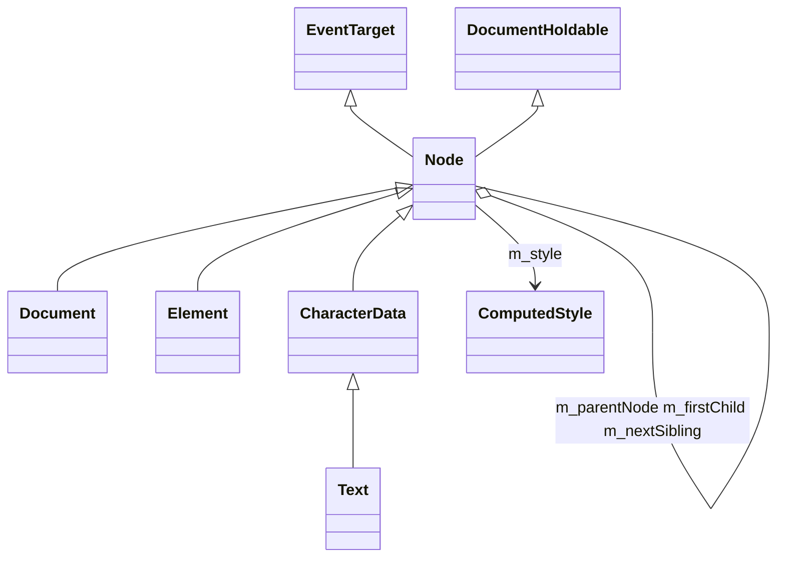

# Data Layer

> **Relevant source files**
>
> - [src/StoragePathProvider.cpp](src:src/StoragePathProvider.cpp)
> - [src/core/storage/StorageInternal.h](src:src/core/storage/StorageInternal.h)
> - [src/core/storage/StoragePersistent.cpp](src:src/core/storage/StoragePersistent.cpp)
> - [src/core/storage/StorageNamespaceImpl.cpp](src:src/core/storage/StorageNamespaceImpl.cpp)
> - [src/core/modules/indexeddb/IDBBackingStore.h](src:src/core/modules/indexeddb/IDBBackingStore.h)
> - [src/core/modules/indexeddb/MemoryBackingStore.cpp](src:src/core/modules/indexeddb/MemoryBackingStore.cpp)
> - [src/platform/network/http/HTTPCache.h](src:src/platform/network/http/HTTPCache.h)
> - [src/platform/network/curl/NetworkSharedResourceManager.h](src:src/platform/network/curl/NetworkSharedResourceManager.h)
> - [src/core/fileapi/Blob.h](src:src/core/fileapi/Blob.h)
> - [src/core/dom/Node.h](src:src/core/dom/Node.h)
> - [src/core/serialize/Serializer.h](src:src/core/serialize/Serializer.h)
> - [src/core/modules/serviceworker/RegistrationStore.h](src:src/core/modules/serviceworker/RegistrationStore.h)

Starfish has no server database. Its data layer consists of web-platform stores that are either plain files under an engine-supplied storage directory or garbage-collected in-memory structures. All file locations for the main stores are centralized in [`StoragePathProvider`](src:src/StoragePathProvider.h#L25), which is constructed with a `storageDirectoryPath` and creates that directory on construction ([`StoragePathProvider`](src:src/StoragePathProvider.cpp#L33) constructor). The IndexedDB module resolves its own path independently (see below).

## Data Stores

| Store | Mechanism | Location/Path | Source |
|---|---|---|---|
| `localStorage` (Web Storage, `StorageType::Local`) | Whole store held as one rapidjson document, keyed by serialized origin, rewritten to a single JSON file on every mutation; a per-origin in-memory map (`m_cache`) fronts the file | `<storageDir>/localStorage.txt` (`STARFISH_LOCAL_STORAGE_FILE_NAME`) | [`StoragePersistent`](src:src/core/storage/StoragePersistent.h#L34), [`StorageDiskWriter`](src:src/core/storage/StoragePersistent.h#L54), [`getLocalStorageDataFilePath`](src:src/StoragePathProvider.cpp#L42) |
| `sessionStorage` (Web Storage, `StorageType::Session`) | **In-memory only**: a GC hash map `GCUnorderedMap<String*, String*> m_map`; the session namespace is created with a `nullptr` path, so `StorageMemory` is always chosen | none (memory) | [`StorageMemory`](src:src/core/storage/StorageInternal.h#L56), [`createSessionStorageNamespace`](src:src/core/storage/WebStorageNamespaceProvider.cpp#L59), [`storageInternal`](src:src/core/storage/StorageNamespaceImpl.cpp#L36) |
| IndexedDB records (`STARFISH_ENABLE_IDB`) | One file per record: despite its name, `MemoryBackingStore` writes each serialized value to a file named by the key string's hash, under `<db name>/<object store name>/` directories | `$HOME/starfish-data/indexedDB/...` (falls back to `/tmp/starfish-data/indexedDB/...` when `HOME` is unset); path is *not* taken from `StoragePathProvider` (marked `TODO` in code) | [`MemoryBackingStore::addOrPut`](src:src/core/modules/indexeddb/MemoryBackingStore.cpp#L56), [`IDBStorageManager::getLocalStoragePath`](src:src/core/modules/indexeddb/IDBStorageManager.cpp#L83), [`IDB_LOCAL_STORAGE_DIR_PATH`](src:src/core/modules/indexeddb/IDBConfig.h#L27) |
| HTTP cache (`STARFISH_ENABLE_HTTPCACHE`) | One entry file per response plus an index file `index.txt`; in-memory entry table + LRU list; directory locked with an exclusive `flock`; default size limit 50 MB (`DEFAULT_HTTP_CACHE_SIZE`) | `<storageDir>/cache/` (`STARFISH_CACHE_DIR_NAME`), index at `<storageDir>/cache/index.txt` | [`HTTPCache`](src:src/platform/network/http/HTTPCache.h#L31), [`HTTPCache::lock`](src:src/platform/network/http/HTTPCache.cpp#L82), [`getHttpCacheDataDirectoryPath`](src:src/StoragePathProvider.cpp#L54) |
| Cookies | libcurl cookie engine on a master easy handle (`CURLOPT_COOKIEFILE`/`CURLOPT_COOKIEJAR` set to the store file); flushed with `COOKIELIST "FLUSH"`; when the path is empty the engine runs **in-memory only**; per-transfer private cookie engines are seeded from and merged back into the master store | `<storageDir>/cookies.txt` (`STARFISH_COOKIES_FILE_NAME`) | [`masterCookieHandleLocked`](src:src/platform/network/curl/NetworkSharedResourceManager.cpp#L476), [`flushMasterCookiesLocked`](src:src/platform/network/curl/NetworkSharedResourceManager.cpp#L501), [`getCookieStoreDataFilePath`](src:src/StoragePathProvider.cpp#L48) |
| Blob / File data | **In-memory only**: raw byte buffer + size + MIME type held in `Blob::BlobData`; blob URLs are tracked per `WebBase` in a `GCUnorderedSet<BlobURLStore> m_urlBlobStore` | none (memory) | [`Blob`](src:src/core/fileapi/Blob.h#L33), [`BlobURLStore`](src:src/core/page/WebBase.h#L30), [`addBlobInBlobURLStore`](src:src/core/page/WebBase.h#L143) |
| Service Worker registrations (`STARFISH_ENABLE_SERVICE_WORKER`) | Registration list + installed worker scripts persisted as files via `RegistrationStoreLocalStorage` (JSON via `JsonWriter`/`JsonReader` archivers) | `<storageDir>/service_worker/` (`STARFISH_SERVICE_WORKER_DIR_NAME`) | [`RegistrationStoreLocalStorage`](src:src/core/modules/serviceworker/RegistrationStore.h#L66), [`getServiceWorkerDataDirectoryPath`](src:src/StoragePathProvider.cpp#L66) |
| Service Worker Cache API responses | Response MIME type + body + cache path written per URL-hash by `FetchCacheStream` | `<storageDir>/service_worker/` (root passed to `FetchCacheStream`) | [`FetchCacheStream`](src:src/core/modules/serviceworker/FetchCacheStream.h#L43), [`Internal`](src:src/core/modules/serviceworker/host/Internal.cpp#L111) constructor |
| Shared worker data directory | Directory path provided to the shared-worker components | `<storageDir>/shared_worker/` (`STARFISH_SHARED_WORKER_DIR_NAME`) | [`getSharedWorkerDataDirectoryPath`](src:src/StoragePathProvider.cpp#L60) |

The file/directory name constants (`localStorage.txt`, `cookies.txt`, `cache`, `shared_worker`, `service_worker`) are defined as macros at the top of [src/StoragePathProvider.cpp](src:src/StoragePathProvider.cpp) (lines 27-31).

For `localStorage`, persistence is conditional: [`StorageNamespaceImpl::storageInternal`](src:src/core/storage/StorageNamespaceImpl.cpp#L36) creates a [`StoragePersistent`](src:src/core/storage/StoragePersistent.h#L34) only when the type is `Local` **and** a path was supplied; otherwise it falls back to the in-memory [`StorageMemory`](src:src/core/storage/StorageInternal.h#L56).

## Core Data Models

| Model | Role | Key fields/relations | Source |
|---|---|---|---|
| `Node` | Base of the DOM tree | Intrusive tree links `m_nextSibling`, `m_previousSibling`, `m_firstChild`, `m_lastChild`, `m_parentNode` (all `Node*`), plus `ComputedStyle* m_style` and `Frame* m_frame`; inherits `EventTarget` and `DocumentHoldable` | [`Node`](src:src/core/dom/Node.h#L140), members at [src/core/dom/Node.h](src:src/core/dom/Node.h) lines 995-1001 |
| `Document` | Root node of a document; owner of per-document services | `Window* m_window`, `ResourceLoader* m_resourceLoader`, `StyleResolver* m_styleResolver`; `documentElement()` accessor | [`Document`](src:src/core/dom/Document.h#L102), [`resourceLoader`](src:src/core/dom/Document.h#L303), [`styleResolver`](src:src/core/dom/Document.h#L308) |
| `Element` | Named element node with attributes | `m_inlineStyle`, `QualifiedName m_name`, `AtomicString m_id` (constructor init list) | [`Element`](src:src/core/dom/Element.h#L125) |
| `CharacterData` / `Text` | Text-bearing nodes | `String* m_data` payload; `Text` derives from `CharacterData` | [`CharacterData`](src:src/core/dom/CharacterData.h#L29), [`Text`](src:src/core/dom/Text.h#L29) |
| `ComputedStyle` | Resolved style attached to each `Node` | GC object; rare-data structs (e.g. `InheritedStylesRareData`); mutated only by friends such as `StyleResolver` | [`ComputedStyle`](src:src/core/style/ComputedStyle.h#L795) |
| `Resource` | A loadable resource (text/image/font) with lifecycle state | `State m_state` (`BeforeSend`..`Canceled`), `ResourceURL* m_url`, `ResourceLoader* m_loader`, `GCVector<ResourceClient*> m_resourceClients` | [`Resource`](src:src/platform/loader/Resource.h#L36) |
| `WebOrigin` | Storage key / origin identity for Web Storage and IDB | `serialize()`, `isOpaque()`; aliased as `StorageKey` | [`WebOrigin`](src:src/core/dom/WebOrigin.h#L27), `using StorageKey = WebOrigin` at [`StorageInternal.h`](src:src/core/storage/StorageInternal.h#L30) |
| `IDBDatabase` / `IDBObjectStore` | IndexedDB database and object-store metadata | `IDBDatabase`: `m_name`, `m_version`, `m_connection`, `m_objectStoreNames`; `IDBObjectStore`: `m_name`, `m_keyPath` (`Optional<IDBKeyPath*>`), `m_autoIncrement`, `m_transaction` | [`IDBDatabase`](src:src/core/modules/indexeddb/IDBDatabase.h#L57), [`IDBObjectStore`](src:src/core/modules/indexeddb/IDBObjectStore.h#L34) |
| `IDBKey` / `IDBDatabaseIdentifier` | Record key and database identity | `IDBKey`: tagged union of `String*`/`double` with `Type` enum (`Invalid`, `Array`, `Binary`, `String`, `Date`, `Number`, `Null`); identifier is a hash of origin + name | [`IDBKey`](src:src/core/modules/indexeddb/IDBKey.h#L29), [`IDBDatabaseIdentifier`](src:src/core/modules/indexeddb/IDBDatabaseIdentifier.h#L30) |
| `HTTPCacheEntry` | One cached HTTP response | `CacheControl`, `HTTPContentInfo`, `HTTPFreshnessInfo`, `EntryFileInfo` (path, last-modification time, byte length) | [`HTTPCacheEntry`](src:src/platform/network/http/HTTPCacheEntry.h#L44), [`EntryFileInfo`](src:src/platform/network/http/HTTPCacheEntry.h#L31) |
| `Blob` / `File` | File API values | `BlobData` (size, type, data pointer, closed/URL-store/malloc flags); `File` adds `m_name`, `m_lastModified` | [`BlobData`](src:src/core/fileapi/Blob.h#L35), [`File`](src:src/core/fileapi/File.h#L29) |
| `SerializedTypedData` | Structured-clone intermediate representation | `uint8_t m_type` (enum `Undefined`..`RawScriptValue`) + `SerializedData* m_data`; subtype hierarchy for primitives, strings, arrays, maps, sets, array buffers, platform objects | [`SerializedTypedData`](src:src/core/serialize/Serializer.h#L541), [`SerializedData`](src:src/core/serialize/Serializer.h#L71) |
| `RegistrationStoreData` | Persisted service-worker registration record | `registrationDataPath`, `scopeURL`, `scriptURL`, `scriptPath` with JSON read/write methods | [`RegistrationStoreData`](src:src/core/modules/serviceworker/RegistrationStore.h#L34) |

DOM core inheritance, verified from the headers cited above:

## Data Access Patterns

**Web Storage is layered behind an abstract per-origin interface.** The script-facing [`Storage`](src:src/core/storage/Storage.h#L34) object is a thin facade that forwards every operation to a [`StorageInternal`](src:src/core/storage/StorageInternal.h#L32) (see [`Storage::setItem`](src:src/core/storage/Storage.cpp#L51)). [`WebView::initStorage`](src:src/core/page/WebView.cpp#L789) creates a [`WebStorageNamespaceProvider`](src:src/core/storage/WebStorageNamespaceProvider.h#L29) from [`Starfish::localStorageFilePath`](src:src/Starfish.cpp#L269) and materializes one local and one session [`StorageNamespace`](src:src/core/storage/StorageNamespace.h#L31). [`Window::localStorage`](src:src/core/page/Window.cpp#L281) and [`Window::sessionStorage`](src:src/core/page/Window.cpp#L289) fetch the per-origin `StorageInternal` from the namespace using the document's `WebOrigin`; [`StorageNamespaceImpl`](src:src/core/storage/StorageNamespaceImpl.h#L40) caches instances in an origin-keyed map (`m_originToStorage`).

**Persistent Web Storage is write-through.** [`StoragePersistent::setItem`](src:src/core/storage/StoragePersistent.cpp#L80) updates its in-memory `m_cache` and immediately calls the disk writer, which mutates the shared JSON document and rewrites the whole file ([`writeJsonDocumentAsFile`](src:src/core/storage/StoragePersistent.cpp#L250)); the file is also re-flushed by a GC finalizer registered in the [`StorageDiskWriter`](src:src/core/storage/StoragePersistent.cpp#L108) constructor. Loading parses the entire file into the document and copies the current origin's members into the cache ([`load`](src:src/core/storage/StoragePersistent.cpp#L143)).

**IndexedDB uses a backing-store interface plus a task queue.** [`IDBBackingStore`](src:src/core/modules/indexeddb/IDBBackingStore.h#L31) abstracts `open`/`addOrPut`/`get`; the only implementation is [`MemoryBackingStore`](src:src/core/modules/indexeddb/MemoryBackingStore.h#L36), instantiated per connection in the [`IDBConnection`](src:src/core/modules/indexeddb/IDBConnection.cpp#L98) constructor (`std::unique_ptr<IDBBackingStore> m_backingStore`). [`IDBObjectStore::addOrPut`](src:src/core/modules/indexeddb/IDBObjectStore.cpp#L78) serializes the value with [`MemorySerializer`](src:src/core/serialize/MemorySerializer.h#L150) into a `SerializedRawScriptValueData` and posts a work item to the `IDBTaskQueue`; the worker thread then calls [`IDBConnection::storeRecode`](src:src/core/modules/indexeddb/IDBConnection.cpp#L107) / [`retrieveValue`](src:src/core/modules/indexeddb/IDBConnection.cpp#L116), which delegate to the backing store. The singleton [`IDBStorageManager`](src:src/core/modules/indexeddb/IDBStorageManager.h#L32) owns the task queue and all connections. Comments in [`MemoryBackingStore.h`](src:src/core/modules/indexeddb/MemoryBackingStore.h#L33) and [`IDBConnection.h`](src:src/core/modules/indexeddb/IDBConnection.h#L46) restrict these classes to the IDBTaskQueue work thread.

**The DOM tree is owned through intrusive pointers rooted at `Document`.** Every `Node` links to its parent, siblings, and children directly (Node.h lines 995-999); `Document` itself is a `Node` and additionally owns the per-document [`ResourceLoader`](src:src/platform/loader/ResourceLoader.h#L40) and [`StyleResolver`](src:src/core/style/Style.h#L3401) (members `m_resourceLoader`, `m_styleResolver` in [src/core/dom/Document.h](src:src/core/dom/Document.h)).

**Style resolution produces `ComputedStyle` values stored on nodes.** [`StyleResolver::resolveDOMStyle`](src:src/core/style/Style.h#L3517) and [`resolveDocumentStyle`](src:src/core/style/Style.h#L3522) compute styles; the result is attached via [`Node::setStyle`](src:src/core/dom/Node.h#L645) and read back with [`Node::style`](src:src/core/dom/Node.h#L653).

**Resources notify observers.** A [`Resource`](src:src/platform/loader/Resource.h#L36) keeps a `GCVector<ResourceClient*>` client list (`addResourceClient`), while the loader tracks in-flight resources in `m_currentLoadingResources` ([`ResourceLoader`](src:src/platform/loader/ResourceLoader.h#L40)).

**The HTTP cache is engine-scoped and main-thread-only.** The engine root object creates it in the [`Starfish`](src:src/Starfish.cpp#L52) constructor from the provider path, and [`Starfish::httpCache`](src:src/Starfish.cpp#L277) returns it only when called on the main thread; [`Starfish::destroy`](src:src/Starfish.cpp#L136) flushes it. Lookups go through an in-memory entry table with an LRU list ([`HTTPCache::get`](src:src/platform/network/http/HTTPCache.cpp#L257), [`HTTPCache::put`](src:src/platform/network/http/HTTPCache.cpp#L323)); the index is reloaded at startup by [`initFromIndexFileIfPossible`](src:src/platform/network/http/HTTPCache.cpp#L137) and written by [`flush`](src:src/platform/network/http/HTTPCache.cpp#L464).

**Cookies are process-global with per-transfer isolation.** [`Starfish::initNetworkSharedResourceManager`](src:src/Starfish.cpp#L166) injects the cookie file path into the singleton [`NetworkSharedResourceManager`](src:src/platform/network/curl/NetworkSharedResourceManager.h#L53). Each credentialed transfer runs a private in-memory cookie engine seeded from the master store and merged back afterwards ([`setupPrivateCookieEngine`](src:src/platform/network/curl/NetworkSharedResourceManager.cpp#L508), `mergeTransferCookies`) — the header comment explains this avoids a libcurl shared-store race. `document.cookie` is served by `cookies()` / `setCookies()` on the same singleton ([declarations](src:src/platform/network/curl/NetworkSharedResourceManager.h#L93)).

**Two serialization frameworks exist for different purposes.** [`Serializer`](src:src/core/serialize/Serializer.h#L800) implements HTML structured clone (`serialize`/`deserialize`/`serializeWithTransfer`) over the `SerializedData` hierarchy, with [`Serializable`](src:src/core/serialize/Serializer.h#L61) and [`Transferable`](src:src/core/serialize/Serializer.h#L711) as object capabilities (e.g. [`Blob`](src:src/core/fileapi/Blob.h#L33) implements `Serializable` and defines [`SerializedBlobData`](src:src/core/fileapi/Blob.h#L151)); [`MemorySerializer`](src:src/core/serialize/MemorySerializer.h#L150) flattens values into a raw char buffer for IPC/IDB. Separately, the service-worker module uses the [`Archiver`](src:src/core/util/Archiver.h#L60) visitor (`JsonReader`/`JsonWriter` backed by rapidjson) over [`Archivable`](src:src/core/util/Archivable.h#L28) objects for its JSON message/registration data; [`RegistrationStore`](src:src/core/modules/serviceworker/RegistrationStore.h#L44) loads and saves registrations through this path (wired up in the [`ServiceWorkerHostJobHandler`](src:src/core/modules/serviceworker/host/ServiceWorkerHostJobHandler.cpp#L205) constructor).

## Data Integrity Rules

- **Opaque-origin storage denial (Web Storage).** [`StorageInternal::getStorageKey`](src:src/core/storage/StorageInternal.cpp#L39) implements the spec's "obtain a storage key" step and returns failure (`nullptr`) when the context's `WebOrigin` is opaque.
- **IndexedDB key validation.** [`IDBKey::convertValueToKey`](src:src/core/modules/indexeddb/IDBKey.cpp#L29) yields `Type::Invalid` for NaN/Infinity numbers and for unsupported types (Date, buffer source, array are `TODO`); [`IDBKey::checkInvalid`](src:src/core/modules/indexeddb/IDBKey.cpp#L97) throws a `DataError` `DOMException` for invalid keys. [`IDBKeyRange::only`-style conversion](src:src/core/modules/indexeddb/IDBKeyRange.cpp#L52) also throws `DataError` for null/invalid keys.
- **IndexedDB store/transaction constraints.** [`IDBObjectStore::addOrPut`](src:src/core/modules/indexeddb/IDBObjectStore.cpp#L78) throws `INVALID_STATE_ERR` on a deleted store, `TransactionInactiveError` when the transaction is not `Active`, `ReadOnlyError` for read-only transactions, and `DataError` when an explicit key is passed to an in-line-key store. [`IDBDatabase::createObjectStore`](src:src/core/modules/indexeddb/IDBDatabase.cpp#L80) requires an active version-change transaction and throws `SYNTAX_ERR` when [`IDBKeyPath::isValid`](src:src/core/modules/indexeddb/IDBKeyPath.h#L42) fails. At the storage level, [`MemoryBackingStore::addOrPut`](src:src/core/modules/indexeddb/MemoryBackingStore.cpp#L56) returns `OverWriteError` when `noOverwrite` (i.e. `add`) hits an existing non-empty record file.
- **HTTP cache consistency and bounds.** The cache directory is guarded by a non-blocking exclusive `flock` ([`HTTPCache::lock`](src:src/platform/network/http/HTTPCache.cpp#L82)); an entry is used only if [`HTTPCacheEntry::isConsistent`](src:src/platform/network/http/HTTPCacheEntry.cpp#L336) confirms the on-disk file still matches the recorded modification time and byte length. [`HTTPCache::put`](src:src/platform/network/http/HTTPCache.cpp#L323) refuses zero-length bodies, entries larger than `MAX_ENTRY_FILE_SIZE` (4% of the 50 MB `DEFAULT_HTTP_CACHE_SIZE`, macros at [src/platform/network/http/HTTPCache.cpp](src:src/platform/network/http/HTTPCache.cpp) lines 43-45), and `no-store`/non-revalidatable responses; [`pruneAsNeededForCacheSpace`](src:src/platform/network/http/HTTPCache.cpp#L509) evicts LRU entries (skipping ones still referenced) to keep the total under `m_cacheSizeLimit`.
- **Cookie session hygiene.** [`initCookieSession`](src:src/platform/network/curl/NetworkSharedResourceManager.cpp#L466) issues `CURLOPT_COOKIELIST "SESS"` on the master handle to drop session cookies at engine startup.
- **Serialization buffer bound.** [`MemorySerializeWriter`](src:src/core/serialize/MemorySerializer.h#L33) caps the serialized buffer at `kBufferMaxSize = 128000` bytes ([constant](src:src/core/serialize/MemorySerializer.h#L35)) and sets an error flag on overflow; `MemorySerializeReader` likewise guards reads against overrun.
- **Storage quotas:** Not specified in code. No quota check exists in the Web Storage, IndexedDB, or cookie modules; the [`QUOTA_EXCEEDED_ERR`](src:src/core/dom/DOMException.h#L50) exception code is raised only by the Media Source and Crypto modules, not by any storage store.
