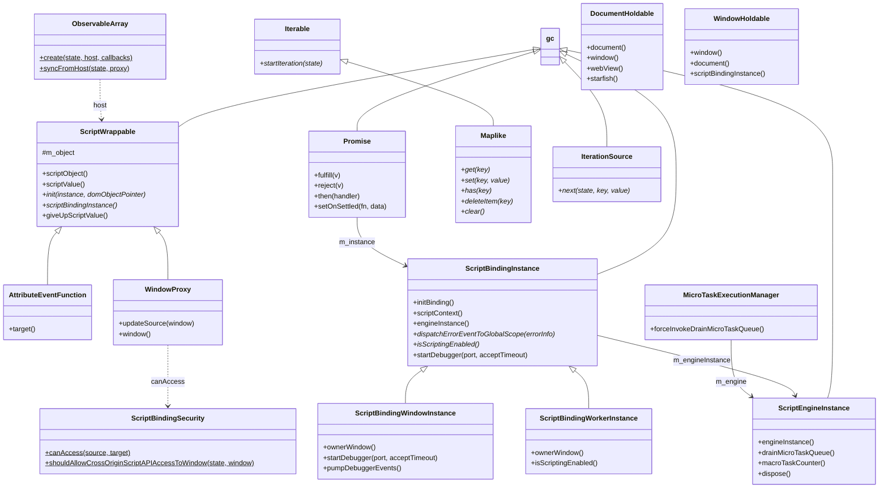
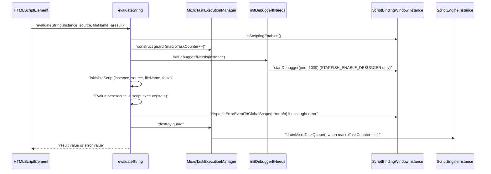

# Functional Requirements: binding

> **Relevant source files**
>
> - [src/binding/ScriptWrappable.h](src:src/binding/ScriptWrappable.h)
> - [src/binding/ScriptWrappable.cpp](src:src/binding/ScriptWrappable.cpp)
> - [src/binding/ScriptBindingInstance.h](src:src/binding/ScriptBindingInstance.h)
> - [src/binding/ScriptBindingInstance.cpp](src:src/binding/ScriptBindingInstance.cpp)
> - [src/binding/ScriptBindingWindowInstance.cpp](src:src/binding/ScriptBindingWindowInstance.cpp)
> - [src/binding/ScriptBindingWorkerInstance.cpp](src:src/binding/ScriptBindingWorkerInstance.cpp)
> - [src/binding/ScriptEngineInstance.h](src:src/binding/ScriptEngineInstance.h)
> - [src/binding/ScriptEngineInstance.cpp](src:src/binding/ScriptEngineInstance.cpp)
> - [src/binding/ScriptBindingSecurity.cpp](src:src/binding/ScriptBindingSecurity.cpp)
> - [src/binding/WindowProxy.cpp](src:src/binding/WindowProxy.cpp)
> - [src/binding/WindowCustomBinding.cpp](src:src/binding/WindowCustomBinding.cpp)
> - [src/binding/ObservableArray.cpp](src:src/binding/ObservableArray.cpp)

**Module**: [`ScriptWrappable.h`](src:src/binding/ScriptWrappable.h)
**Version**: 2026-09-10
**Linked Design Card**: [modules/binding.md](../modules/binding.md)
**Analysis basis**: AST export and direct source reading

## Overview

The binding module connects the engine's native objects to the Escargot JavaScript engine: [`ScriptWrappable`](src:src/binding/ScriptWrappable.h#L419) is the base of every script-exposed native object, [`ScriptBindingInstance`](src:src/binding/ScriptBindingInstance.h#L68) owns one Escargot context per window or worker global scope, and [`ScriptEngineInstance`](src:src/binding/ScriptEngineInstance.h#L33) owns one Escargot VM per `WebView` or worker. It also provides the script-evaluation entry points ([`evaluateString`](src:src/binding/ScriptWrappable.cpp#L1529), [`executeModule`](src:src/binding/ScriptWrappable.cpp#L1652)), microtask and promise helpers ([`MicroTaskExecutionManager`](src:src/binding/ScriptEngineInstance.h#L62), [`Promise`](src:src/binding/ScriptWrappable.h#L544)), same-origin checks ([`ScriptBindingSecurity`](src:src/binding/ScriptBindingSecurity.h#L33)) and the hand-written bindings that complement the generated ones (e.g. [`setTimeoutWindowFunction`](src:src/binding/WindowCustomBinding.cpp#L111)).

## Functional Requirements

### FR-BINDING-001
**Initialize the JavaScript engine and per-owner VM instances**

| Item | Content |
|------|---------|
| **Description** | The module initializes the process-wide JavaScript engine once with a platform object that routes engine logs to the engine logger and resolves module requests, and creates one VM instance per owner (`WebView` or worker) with locale, time zone and code-cache settings. |
| **Input** | Platform object; `locale`, `timezone` strings; on Tizen the application cache path. |
| **Output** | A live `Escargot::VMInstanceRef` reachable through `ScriptEngineInstance::engineInstance()`; code cache limits set (`8 MiB`/`16 MiB` compiled byte code with cache, `4 MiB` without; min source length `1024`; max cache count `16`); the `CompressCompressibleStringsWhileGC` flag cleared. |
| **Preconditions** | `staticallyInitScriptEngine()` has been called by the embedder before any VM is created. |
| **Postconditions** | `dispose()` nulls the VM pointer; `enterIdleMode()` forwards to the VM. |
| **Source** | [`staticallyInitScriptEngine`](src:src/binding/ScriptWrappable.cpp#L208), [`ScriptEngineInstance::ScriptEngineInstance`](src:src/binding/ScriptEngineInstance.cpp#L33), [`EscargotStarfishPlatform`](src:src/binding/ScriptWrappable.cpp#L52) |

**Acceptance criteria**:
- [ ] Creating a `ScriptEngineInstance` on a 64-bit build with code cache enabled sets the compiled byte-code limit to `1024 * 1024 * 8 * 2`; without code cache it is `1024 * 1024 * 4`. [`ScriptEngineInstance.cpp`](src:src/binding/ScriptEngineInstance.cpp#L49)
- [ ] Engine info/error log callbacks are forwarded to `STARFISH_LOG_INFO` / `STARFISH_LOG_ERROR`. [`ScriptWrappable.cpp`](src:src/binding/ScriptWrappable.cpp#L58)
- [ ] `staticallyDestroyScriptEngine()` finalizes the engine globals. [`staticallyDestroyScriptEngine`](src:src/binding/ScriptWrappable.cpp#L213)

### FR-BINDING-002
**Initialize a script context for a window or worker global scope**

| Item | Content |
|------|---------|
| **Description** | For each window or worker global scope the module creates a binding instance, installs the `console` object, defines accessor properties for every unimplemented interface name (which log an unsupported message), lazily-resolved accessors for every implemented interface constructor, and the owner-specific globals; window contexts additionally install a virtual identifier callback that resolves `self`, indexed frames and named collections, and (on Tizen TV with AVPlay) a `webapis.avplay` object. |
| **Input** | `ScriptEngineInstance*`, owner `Window*` or worker global scope pointer. |
| **Output** | Escargot context with global bindings; owner object bound via `init(this, owner)`; for workers the owner's `initJavaScriptGlobalBinding` is invoked. |
| **Preconditions** | Engine instance exists; owner pointer non-null (asserted). |
| **Postconditions** | `destroy()` clears queued jobs and the virtual identifier callback; for a top-level window it also clears VM caches related to the context. |
| **Source** | [`ScriptBindingInstance::initBinding`](src:src/binding/ScriptBindingInstance.cpp#L288), [`ScriptBindingInstance::initJavaScriptBinding`](src:src/binding/ScriptBindingInstance.cpp#L525), [`ScriptBindingWindowInstance::initJavaScriptBinding`](src:src/binding/ScriptBindingWindowInstance.cpp#L245), [`ScriptBindingWorkerInstance::initJavaScriptBinding`](src:src/binding/ScriptBindingWorkerInstance.cpp#L144) |

**Acceptance criteria**:
- [ ] After `initBinding()`, the global object has a `console` data property whose methods forward to the owning `WebBase`'s console (`log`, `info`, `error`, `warn`, `debug`, `time`, `timeLog`, `timeEnd`, `group`, `groupCollapsed`, `groupEnd`, `assert`). [`ScriptBindingInstance.cpp`](src:src/binding/ScriptBindingInstance.cpp#L553), [`_logConsoleFunction`](src:src/binding/ScriptBindingInstance.cpp#L465)
- [ ] Reading an interface constructor name for the first time invokes `binding<Name>(this)` and caches the function object. [`FOR_EACH_BINDING_DECLARATION`](src:src/binding/ScriptBindingInstance.h#L116), [`GlobalBindingNameAccessorPropertyData`](src:src/binding/ScriptBindingInstance.cpp#L240)
- [ ] In a window context, an unresolved identifier `self` evaluates to the window object; an integer identifier resolves through `Window::defaultIndexedGetter`. [`virtualIdentifierCallback`](src:src/binding/ScriptBindingWindowInstance.cpp#L39)
- [ ] In a worker context, `ownerWindow()` and `ownerDocument()` are unreachable (asserted) and `isScriptingEnabled()` is always true. [`ScriptBindingWorkerInstance::ownerWindow`](src:src/binding/ScriptBindingWorkerInstance.cpp#L168), [`ScriptBindingWorkerInstance.h`](src:src/binding/ScriptBindingWorkerInstance.h#L36)
- [ ] `destroy()` on a top-level window context calls `clearCachesRelatedWithContext()` before the base `destroy()`. [`ScriptBindingWindowInstance::destroy`](src:src/binding/ScriptBindingWindowInstance.cpp#L295)

### FR-BINDING-003
**Expose native objects to script through lazily created wrappers**

| Item | Content |
|------|---------|
| **Description** | Every script-exposed native object derives from `ScriptWrappable`; the script wrapper is created on the first `scriptObject()` call by invoking the subclass `init()`, and the wrapper's `extraData` points back to the native object so native functions can recover and type-check `this`. |
| **Input** | Native object pointer passed to the constructor (must have bit 1 clear). |
| **Output** | `ScriptObject` / `ScriptValue` for the object; `toScriptWrappable(value)` returns the native object or `nullptr`. |
| **Preconditions** | Subclass implements `init`, `is<Name>`, `scriptBindingInstance` ([`DECLARE_SCRIPT_BINDING_REQUIRED_FUNCTIONS`](src:src/binding/ScriptWrappable.h#L365)). |
| **Postconditions** | After `generateScriptObject()`, `isGivenUpScriptValue()` is false; `giveUpScriptValue()` resets the object to the "not yet wrapped" state. |
| **Source** | [`ScriptWrappable::scriptObject`](src:src/binding/ScriptWrappable.h#L445), [`ScriptWrappable::generateScriptObject`](src:src/binding/ScriptWrappable.cpp#L744), [`toScriptWrappable`](src:src/binding/ScriptWrappable.cpp#L772) |

**Acceptance criteria**:
- [ ] Constructing a `ScriptWrappable` with a pointer whose low bit is set fails an assertion. [`ScriptWrappable::ScriptWrappable`](src:src/binding/ScriptWrappable.cpp#L738)
- [ ] For a global scope (`isGlobalScope()` true), `init` receives `this` as the DOM object pointer; otherwise it receives the untagged pointer stored at construction. [`ScriptWrappable::generateScriptObject`](src:src/binding/ScriptWrappable.cpp#L744)
- [ ] A native function invoked with a `this` value whose `extraData` is null or of another type throws `TypeError("Illegal invocation")`. [`CHECK_TYPEOF`](src:src/binding/ScriptWrappable.h#L386), [`GENERATE_THIS_AND_CHECK_TYPE`](src:src/binding/ScriptWrappable.h#L391)
- [ ] `is<Name>()` returns false by default for every generated class and `as<Name>()` asserts the matching `is<Name>()`. [`ScriptWrappable.h`](src:src/binding/ScriptWrappable.h#L421)

### FR-BINDING-004
**Evaluate classic scripts and modules and report uncaught errors**

| Item | Content |
|------|---------|
| **Description** | The module parses and executes a script source string (or a module) in the owner's context, reports parse failures to the log, and converts an uncaught runtime error into an `ErrorEventInit` (message, filename, line, column, error value) dispatched to the owning global scope, followed by a logged stack trace with a 40-character source excerpt per frame. |
| **Input** | `ScriptBindingInstance*`, source `String*`, optional file name, optional `bool* result`. |
| **Output** | `evaluateString`: script result or the error value; `*result` false on scripting-disabled or parse error, true otherwise. `initModule`: `Optional<ScriptModule>`; `executeModule`: `true` on success, `false` on uncaught error. |
| **Preconditions** | `instance->isScriptingEnabled()` true, otherwise evaluation is skipped and `undefined` returned. |
| **Postconditions** | Microtasks queued during execution are drained when the outermost `MicroTaskExecutionManager` exits; native stack is cleared via `clearStack`. |
| **Source** | [`evaluateString`](src:src/binding/ScriptWrappable.cpp#L1529), [`initModule`](src:src/binding/ScriptWrappable.cpp#L1612), [`executeModule`](src:src/binding/ScriptWrappable.cpp#L1652), [`loggingJSErrorInfo`](src:src/binding/ScriptWrappable.cpp#L465) |

**Acceptance criteria**:
- [ ] A source with a syntax error logs `Script parse error: <file> <message>` and returns `undefined` with `*result == false`. [`ScriptWrappable.cpp`](src:src/binding/ScriptWrappable.cpp#L1550)
- [ ] A source that throws dispatches an error event to the global scope with the innermost stack frame's file, line and column, and returns the error value with `*result == true`. [`ScriptWrappable.cpp`](src:src/binding/ScriptWrappable.cpp#L1587)
- [ ] `isExecutableModule` is true only when the module status is below `Evaluating` and not `Instantiating`. [`isExecutableModule`](src:src/binding/ScriptWrappable.cpp#L1699)
- [ ] Without the debugger build flag, sources longer than `1024 * 512` characters are created as compressible strings when the engine supports them. [`initializeScript`](src:src/binding/ScriptWrappable.cpp#L1492)
- [ ] Module requests are resolved through the document's import map when available, otherwise against the requesting script's source URL or the execution context's base URL. [`EscargotStarfishPlatform::loadModule`](src:src/binding/ScriptWrappable.cpp#L92)

### FR-BINDING-005
**Create and invoke script functions from native code**

| Item | Content |
|------|---------|
| **Description** | Native code can build a script function from argument names and a body string (used for string timer handlers and `on*` attribute handlers), wrap a native function pointer as a script function, and call any callable with a `this` value and arguments; uncaught errors during these operations are reported like FR-BINDING-004 instead of propagating. |
| **Input** | `ScriptBindingInstance*`; either (`argNames`, `argc`, `functionBody`) or (`name`, native pointer, `argc`, strict/constructor flags); for calls: `fn`, `argv`, `argc`, `thisValue`. |
| **Output** | `ScriptValue` function or call result; `undefined` when `fn` is not callable; `error` flag set on failure. |
| **Preconditions** | Context available through the instance. |
| **Postconditions** | Attribute event functions carry an `AttributeEventFunction` in their `extraData` and are marked for slow virtual identifier lookup so element properties shadow globals inside the handler. |
| **Source** | [`createScriptFunction`](src:src/binding/ScriptWrappable.cpp#L915), [`createAttributeStringEventFunction`](src:src/binding/ScriptWrappable.cpp#L977), [`callScriptFunction`](src:src/binding/ScriptWrappable.cpp#L995) |

**Acceptance criteria**:
- [ ] `callScriptFunction` with a non-callable `fn` returns `undefined` without entering the engine. [`ScriptWrappable.cpp`](src:src/binding/ScriptWrappable.cpp#L1002)
- [ ] `createScriptFunction(argNames…)` builds the function by calling the context's `Function` constructor with the names followed by the body. [`ScriptWrappable.cpp`](src:src/binding/ScriptWrappable.cpp#L923)
- [ ] An attribute handler created by `createAttributeStringEventFunction` has a single parameter named `event`. [`ScriptWrappable.cpp`](src:src/binding/ScriptWrappable.cpp#L981)
- [ ] Inside an attribute handler, an identifier that is an own property of the target element resolves to that property. [`ScriptBindingWindowInstance.cpp`](src:src/binding/ScriptBindingWindowInstance.cpp#L44)

### FR-BINDING-006
**Schedule microtasks and settle promises from native code**

| Item | Content |
|------|---------|
| **Description** | The module tracks macro-task nesting per VM and drains the engine's job queue when the outermost native entry finishes; it lets native code enqueue a microtask callback and create, resolve, reject and chain promises that are visible to script. |
| **Input** | `ScriptEngineInstance*` for the guard; callback + data for `enqueueMicrotask`; `ScriptValue` for `fulfill`/`reject`/`then`. |
| **Output** | Pending jobs executed (errors logged as `Uncaught Error in JS job`); `Promise` object with `scriptValue()`, settled-callback notification via `setOnSettled`. |
| **Preconditions** | `enqueueMicrotask` requires `macroTaskCounter() != 0` (asserted). |
| **Postconditions** | `drainMicroTaskQueue` is re-entrancy guarded by `m_inDrainMicroTaskQueue`; `macroTaskCounter` is decremented when the guard is destroyed. |
| **Source** | [`MicroTaskExecutionManager`](src:src/binding/ScriptEngineInstance.h#L62), [`ScriptEngineInstance::drainMicroTaskQueue`](src:src/binding/ScriptEngineInstance.cpp#L76), [`enqueueMicrotask`](src:src/binding/ScriptWrappable.cpp#L2273), [`Promise::fulfill`](src:src/binding/ScriptWrappable.cpp#L2317) |

**Acceptance criteria**:
- [ ] Destroying the guard drains the queue only when `macroTaskCounter() == 1` and `forceInvokeDrainMicroTaskQueue()` was not already called. [`MicroTaskExecutionManager::~MicroTaskExecutionManager`](src:src/binding/ScriptEngineInstance.cpp#L98)
- [ ] A nested `drainMicroTaskQueue` call returns immediately. [`ScriptEngineInstance.cpp`](src:src/binding/ScriptEngineInstance.cpp#L78)
- [ ] `Promise::fulfill` / `reject` / `then` each run under their own `MicroTaskExecutionManager`. [`Promise::fulfill`](src:src/binding/ScriptWrappable.cpp#L2317), [`Promise::then`](src:src/binding/ScriptWrappable.cpp#L2347)
- [ ] A `Promise` constructed from an existing script promise stores itself in that object's `extraData`. [`Promise::Promise`](src:src/binding/ScriptWrappable.cpp#L2310)

### FR-BINDING-007
**Attach the remote script debugger on demand**

| Item | Content |
|------|---------|
| **Description** | When built with `STARFISH_ENABLE_DEBUGGER`, the first script evaluation in a window context with scripting enabled and no running debugger asks the embedder whether to start, starts the engine's remote debugger on the current port with a 1000 ms accept timeout, and on success schedules a 100 ms interval that pumps debugger events; on failure it asks the embedder whether to keep waiting and retries. The port is reset to `6501` for a top-level browsing context and incremented after each successful start so nested contexts get distinct ports. Console output is mirrored to the debugger. |
| **Input** | `ScriptBindingInstance*` of the evaluating window; embedder answers to `DebuggerShouldInit` / `DebuggerShouldContinueWaiting` (URL and port passed as parameters). |
| **Output** | Listening debugger session; `isDebuggerEnabled()` true; scripts marked `setAsAlwaysStopState` before execution. |
| **Preconditions** | `instance->hasWindow()`, `isScriptingEnabled()`, `!isDebuggerEnabled()`. |
| **Postconditions** | `pumpDebuggerEvents()` runs every 100 ms for the lifetime of the window's interval timer. |
| **Source** | [`initDebuggerIfNeeds`](src:src/binding/ScriptWrappable.cpp#L1431), [`ScriptBindingWindowInstance::startDebugger`](src:src/binding/ScriptBindingWindowInstance.cpp#L330), [`ScriptBindingWindowInstance::isDebuggerEnabled`](src:src/binding/ScriptBindingWindowInstance.cpp#L345), [`printToDebuggerInConsole`](src:src/binding/ScriptBindingInstance.cpp#L338) |

**Acceptance criteria**:
- [ ] The option string passed to the engine is `--port=<port>;--accept-timeout=<ms>`. [`ScriptBindingWindowInstance.cpp`](src:src/binding/ScriptBindingWindowInstance.cpp#L333)
- [ ] A top-level browsing context always starts at port `6501`. [`ScriptWrappable.cpp`](src:src/binding/ScriptWrappable.cpp#L1440)
- [ ] If the embedder's `DebuggerShouldInit` handler sets the result to false, no debugger is started. [`ScriptWrappable.cpp`](src:src/binding/ScriptWrappable.cpp#L1457)
- [ ] If a start attempt does not yield a running debugger and the embedder answers "do not continue waiting", the loop exits without a debugger. [`ScriptWrappable.cpp`](src:src/binding/ScriptWrappable.cpp#L1482)
- [ ] Worker contexts never start a debugger (base-class `startDebugger` is a no-op and `hasWindow()` is false). [`ScriptBindingInstance::startDebugger`](src:src/binding/ScriptBindingInstance.h#L92), [`ScriptBindingInstance::hasWindow`](src:src/binding/ScriptBindingInstance.h#L103)

### FR-BINDING-008
**Enforce same-origin access to Window and Location**

| Item | Content |
|------|---------|
| **Description** | The module decides whether a source document may access a target document (web security disabled, same origin-domain, or an opaque-origin child reaching an ancestor document; file URLs on either side are denied), throws `SECURITY_ERR` for cross-origin `Window`/`Location` API access from script, and wraps each window's global object in a `WindowProxy` that denies cross-origin property access except a fixed allow-list. |
| **Input** | Source and target `Document*`; `ExecutionStateRef*` (caller's lexical global object identifies the source window); property name and access type on the proxy. |
| **Output** | `bool` decision; `DOMException(SECURITY_ERR)` thrown (native or script) on denial. |
| **Preconditions** | Both windows have documents; the proxy's `extraData` is the target `Window`. |
| **Postconditions** | `WindowProxy::updateSource` re-points the proxy at a new `Window` after navigation and registers it as the context's global object proxy. |
| **Source** | [`ScriptBindingSecurity::canAccess`](src:src/binding/ScriptBindingSecurity.cpp#L35), [`ScriptBindingSecurity::shouldAllowCrossOriginScriptAPIAccessToWindow`](src:src/binding/ScriptBindingSecurity.cpp#L67), [`WindowProxy::init`](src:src/binding/WindowProxy.cpp#L53), [`WindowProxy::updateSource`](src:src/binding/WindowProxy.cpp#L43) |

**Acceptance criteria**:
- [ ] `canAccess` returns true when the source view's web security mode is `Disable`, regardless of origins. [`ScriptBindingSecurity.cpp`](src:src/binding/ScriptBindingSecurity.cpp#L37)
- [ ] `canAccess` returns false when either origin URL is a file URL and the origins differ. [`ScriptBindingSecurity.cpp`](src:src/binding/ScriptBindingSecurity.cpp#L46)
- [ ] Cross-origin read of `window`, `closed`, `frames`, `length`, `opener`, `parent`, `self`, `top`, `postMessage`, `blur`, `close`, `focus`, `picker` and read/write of `location`, `pagePopupController` is allowed on a `WindowProxy`; any other cross-origin access throws `SECURITY_ERR`. [`WindowProxy.cpp`](src:src/binding/WindowProxy.cpp#L97)
- [ ] `shouldAllowCrossOriginScriptAPIAccessToLocation` returns false when the source window or location is null and throws `DOMException` when access is denied. [`ScriptBindingSecurity::shouldAllowCrossOriginScriptAPIAccessToLocation`](src:src/binding/ScriptBindingSecurity.cpp#L83)

### FR-BINDING-009
**Provide timer, messaging and animation-frame bindings for global scopes**

| Item | Content |
|------|---------|
| **Description** | Hand-written bindings implement `setTimeout`, `setInterval`, `postMessage` and `requestAnimationFrame` on `Window`, and `setTimeout` / `setInterval` on `WorkerGlobalScope`; a callable first argument is stored directly, a string first argument is compiled into a function, extra arguments are forwarded to the handler, and the delay is coerced with `toInt32`. In test builds, `Window::postInit` additionally installs test helpers on `window`. |
| **Input** | Script arguments (`handler`, `delay`, `...args`); for `postMessage`: `message`, `targetOrigin`, optional `transfer` array. |
| **Output** | Timer id (`int32`) / animation frame id; `postMessage` returns `undefined` and rethrows native `DOMException` as a script exception. |
| **Preconditions** | `this` is the window (or undefined/null resolving to the caller's global) — otherwise `Illegal invocation`; required argument count met — otherwise `TypeError` composed from `ARGS_NOT_ENOUGH`. |
| **Postconditions** | On the window, a string handler is only compiled when `checkSecurityPolicy()` allows it (otherwise id `0` is returned); a worker timer whose scope is closing does not invoke the handler. |
| **Source** | [`setTimeoutWindowFunction`](src:src/binding/WindowCustomBinding.cpp#L111), [`setIntervalWindowFunction`](src:src/binding/WindowCustomBinding.cpp#L159), [`postMessageWindowFunction`](src:src/binding/WindowCustomBinding.cpp#L228), [`requestAnimationFrameWindowFunction`](src:src/binding/WindowCustomBinding.cpp#L294), [`setTimeoutWorkerGlobalScopeFunction`](src:src/binding/WorkerGlobalScopeCustomBinding.cpp#L62), [`Window::postInit`](src:src/binding/WindowCustomBinding.cpp#L1285) |

**Acceptance criteria**:
- [ ] `setTimeout()` with no arguments throws `TypeError` (`FAILED_TO_EXECUTE` / `ARGS_NOT_ENOUGH`); `setInterval` requires two arguments. [`WindowCustomBinding.cpp`](src:src/binding/WindowCustomBinding.cpp#L117), [`WindowCustomBinding.cpp`](src:src/binding/WindowCustomBinding.cpp#L165)
- [ ] `setTimeout("code", 10)` on a window whose `checkSecurityPolicy()` is false returns `0` and schedules nothing. [`WindowCustomBinding.cpp`](src:src/binding/WindowCustomBinding.cpp#L142)
- [ ] When the timer fires, the stored handler is called with the forwarded extra arguments and `undefined` as `this`. [`timeoutHandler`](src:src/binding/WindowCustomBinding.cpp#L100)
- [ ] `postMessage` with a non-array third argument throws `Illegal invocation`; the caller's lexical global window is passed as the source. [`WindowCustomBinding.cpp`](src:src/binding/WindowCustomBinding.cpp#L252)
- [ ] A worker timer handler is skipped when the global scope `isClosing()`. [`timeoutHandler`](src:src/binding/WorkerGlobalScopeCustomBinding.cpp#L45)
- [ ] Under `STARFISH_ENABLE_TEST`, `window` exposes `screenShot`, `simulateClick`, `testAssert`, `testEnd`, `wptTestEnd`, `checkPixelColor` and the other helpers listed in `Window::postInit`. [`WindowCustomBinding.cpp`](src:src/binding/WindowCustomBinding.cpp#L1303)

### FR-BINDING-010
**Provide hand-written constructors and accessors for selected interfaces**

| Item | Content |
|------|---------|
| **Description** | For interfaces whose behavior the generator cannot express, the module hand-writes constructors (`EventTarget`, `HTMLElement` for custom elements, `MediaStream`, `ImageData`, `URLSearchParams`) and accessors/methods (`Document.defaultView`, `CharacterData.length`, `HTMLInputElement.files` / `size`, `XMLHttpRequest.send`, `Geolocation.getCurrentPosition` / `watchPosition` / `clearWatch`). |
| **Input** | Script `this`, arguments and `newTarget`. |
| **Output** | New wrapped native object with prototype taken from `newTarget`; or converted attribute value; `TypeError` on misuse. |
| **Preconditions** | Constructors require `new` (`CALLED_CONSTRUCTOR_WITHOUT_NEW` otherwise). |
| **Postconditions** | `HTMLElement` construction follows the custom-element construction stack: returns the element being upgraded, throws when `super()` is called twice, creates a new element only when `newTarget.prototype` chains to `HTMLElement.prototype`. |
| **Source** | [`eventtargetConstructor`](src:src/binding/EventTargetCustomBinding.cpp#L30), [`htmlelementConstructor`](src:src/binding/HTMLElementCustomBinding.cpp#L32), [`mediastreamConstructor`](src:src/binding/MediaStreamCustomBinding.cpp#L30), [`imagedataConstructor`](src:src/binding/ImageDataCustomBinding.cpp#L29), [`urlsearchparamsConstructor`](src:src/binding/URLSearchParamsCustomBinding.cpp#L28), [`sendXMLHttpRequestFunction`](src:src/binding/XMLHttpRequestCustomBinding.cpp#L30), [`getCurrentPositionGeolocationFunction`](src:src/binding/GeolocationCustomBinding.cpp#L56) |

**Acceptance criteria**:
- [ ] `EventTarget()` without `new` throws `TypeError` "Constructor 'EventTarget' requires 'new'"; with a subclass `newTarget` the created object's prototype is `newTarget.prototype`. [`EventTargetCustomBinding.cpp`](src:src/binding/EventTargetCustomBinding.cpp#L34)
- [ ] `new HTMLElement()` from a constructor not registered as a custom element throws `Illegal invocation`. [`HTMLElementCustomBinding.cpp`](src:src/binding/HTMLElementCustomBinding.cpp#L125)
- [ ] `document.defaultView` returns the window object or `null` when the document has no window. [`defaultViewDocumentGetterFunction`](src:src/binding/DocumentCustomBinding.cpp#L29)
- [ ] `CharacterData.length` for non-ASCII data is measured in UTF-16 code units. [`lengthCharacterDataGetterFunction`](src:src/binding/CharacterDataCustomBinding.cpp#L28)
- [ ] `input.files` returns `null` when no files are selected, otherwise a fresh array of `File` objects. [`filesHTMLInputElementGetterFunction`](src:src/binding/HTMLInputElementCustomBinding.cpp#L33)
- [ ] `xhr.send(arrayBufferOrView)` sets a binary request body from the buffer's raw bytes. [`XMLHttpRequestCustomBinding.cpp`](src:src/binding/XMLHttpRequestCustomBinding.cpp#L38)
- [ ] `getCurrentPosition` options: negative or NaN `maximumAge` becomes `0`; NaN `timeout` becomes `INT32_MAX`, negative `timeout` becomes `0`. [`GeolocationCustomBinding.cpp`](src:src/binding/GeolocationCustomBinding.cpp#L63)
- [ ] `new ImageData(w)` with fewer than two arguments throws `TypeError` (`FAILED_TO_CONSTRUCT`). [`ImageDataCustomBinding.cpp`](src:src/binding/ImageDataCustomBinding.cpp#L38)

### FR-BINDING-011
**Provide observable-array, iterable and maplike helpers**

| Item | Content |
|------|---------|
| **Description** | The module builds a Proxy-backed array whose `set`, `defineProperty` and `deleteProperty` operations are validated and written through to a host-provided callback set before being mirrored on the backing array, can re-seed the array from the host, and defines abstract `Iterable`, `IterationSource` and `Maplike` interfaces that native collections implement for script iteration. |
| **Input** | `ScriptWrappable* host`, static `ObservableArrayCallbacks*` (`setIndexedValue`, `deleteIndexedValue`, `getIndexedValue`, `length`, `setLength`). |
| **Output** | `ScriptProxyObject`; trap results `true`/`false`. |
| **Preconditions** | Callback storage outlives the proxy; index keys are array indices, `length` is handled specially. |
| **Postconditions** | The handler object's `extraData` holds an `ObservableArrayBackend` keeping the host alive. |
| **Source** | [`ObservableArray::create`](src:src/binding/ObservableArray.cpp#L176), [`ObservableArray::syncFromHost`](src:src/binding/ObservableArray.cpp#L195), [`Iterable`](src:src/binding/Iterable.h#L28), [`Maplike`](src:src/binding/Maplike.h#L28), [`IterationSource`](src:src/binding/IterationSource.h#L28) |

**Acceptance criteria**:
- [ ] Assigning `arr[i] = v` calls `setIndexedValue`; when it returns false the trap returns false and the backing array is untouched. [`setTrap`](src:src/binding/ObservableArray.cpp#L70)
- [ ] Assigning `arr.length = n` calls `setLength` then truncates the backing array. [`ObservableArray.cpp`](src:src/binding/ObservableArray.cpp#L88)
- [ ] `Object.defineProperty(arr, i, desc)` without a `value` field is rejected for index keys. [`ObservableArray.cpp`](src:src/binding/ObservableArray.cpp#L114)
- [ ] `delete arr[i]` calls `deleteIndexedValue` before deleting from the backing array. [`deletePropertyTrap`](src:src/binding/ObservableArray.cpp#L142)
- [ ] `create` seeds the backing array from `length` and `getIndexedValue`. [`seedTarget`](src:src/binding/ObservableArray.cpp#L57)

### FR-BINDING-012
**Give native objects access to their owning document, window, view and engine**

| Item | Content |
|------|---------|
| **Description** | Mixin classes let a native object reach its owner chain: `DocumentHoldable` (document → window → view → engine root), `WindowHoldable` (window → document, engine root, binding instance), `WebViewHoldable` (view → engine root) and `StarfishHoldable` (engine root); free functions recover the execution context, binding instance, window and document from an Escargot context. |
| **Input** | Owner pointer at construction (`Document*` asserted non-null); `Escargot::ContextRef*` / `ExecutionStateRef*` for the fetch helpers. |
| **Output** | Owner pointers. |
| **Preconditions** | The context's global object `extraData` is the owning `EventTarget` (window or worker scope). |
| **Postconditions** | Not specified in code. |
| **Source** | [`DocumentHoldable`](src:src/binding/DocumentHoldable.h#L31), [`WindowHoldable`](src:src/binding/WindowHoldable.h#L30), [`WebViewHoldable`](src:src/binding/WebViewHoldable.h#L27), [`StarfishHoldable`](src:src/binding/StarfishHoldable.h#L27), [`fetchExecutionContext`](src:src/binding/ScriptWrappable.cpp#L536) |

**Acceptance criteria**:
- [ ] `DocumentHoldable::webView()` resolves through `document()->window()->browsingContext()->webView()`. [`DocumentHoldable::webView`](src:src/binding/DocumentHoldable.cpp#L39)
- [ ] `WindowHoldable::scriptBindingInstance()` returns the window's binding instance. [`WindowHoldable::scriptBindingInstance`](src:src/binding/WindowHoldable.cpp#L38)
- [ ] `fetchResponsibleDocument(state)` uses the caller's lexical global object, not the current context. [`fetchResponsibleDocument`](src:src/binding/ScriptWrappable.cpp#L572)
- [ ] `fetchWindow` / `fetchDocument` / `fetchWebView` are only available in non-worker-host builds (`STARFISH_WEBWORKER_NOT_HOST`). [`ScriptWrappable.cpp`](src:src/binding/ScriptWrappable.cpp#L553)

## Non-Functional Requirements

| Item | Requirement | Source |
|------|-------------|--------|
| Performance | Script parse/execute and function calls are wrapped in recordable profile timers (`ProfileKind::kScript`); with `STARFISH_ENABLE_SCRIPT_PROFILING`, parse and execute durations are logged in ms. VM code cache limits: 8/16 MiB byte code, min source length 1024, max 16 cache entries. | [`ScriptWrappable.cpp`](src:src/binding/ScriptWrappable.cpp#L1532), [`ScriptEngineInstance.cpp`](src:src/binding/ScriptEngineInstance.cpp#L47) |
| Performance | Sources larger than 512 Ki characters use compressible engine strings when supported (non-debugger builds). | [`ScriptWrappable.cpp`](src:src/binding/ScriptWrappable.cpp#L1518) |
| Security | Cross-document `Window`/`Location` access is gated by `ScriptBindingSecurity::canAccess`; the `WindowProxy` allow-list is fixed in code; string timer handlers require `checkSecurityPolicy()`. | [`ScriptBindingSecurity::canAccess`](src:src/binding/ScriptBindingSecurity.cpp#L35), [`WindowProxy::init`](src:src/binding/WindowProxy.cpp#L53), [`WindowCustomBinding.cpp`](src:src/binding/WindowCustomBinding.cpp#L142) |
| Security | The remote debugger listener exists only in `STARFISH_ENABLE_DEBUGGER` builds and only after embedder consent. | [`ScriptWrappable.cpp`](src:src/binding/ScriptWrappable.cpp#L1433) |
| Error handling | Uncaught script errors become `ErrorEvent`s on the owning global scope; native `DOMException*` thrown inside bindings are converted to script exceptions; misuse throws `TypeError`. | [`dispatchErrorEventToWindow`](src:src/binding/ScriptWrappable.cpp#L894), [`THROW_EXCEPTION`](src:src/binding/ScriptWrappable.h#L375) |
| Error handling | Failed microtask jobs are logged and draining continues with the next job. | [`ScriptEngineInstance.cpp`](src:src/binding/ScriptEngineInstance.cpp#L83) |
| Logging | Uncaught errors log `Uncaught <error>` plus `at <file>(<line>:<col>)` per frame and a source excerpt of up to 40 characters before/after the position with a caret line. | [`loggingJSErrorInfo`](src:src/binding/ScriptWrappable.cpp#L465) |
| Logging | Access to an unimplemented interface name logs `STARFISH_UNSUPPORTED("module \"<Name>\"")`. | [`ScriptBindingInstance.cpp`](src:src/binding/ScriptBindingInstance.cpp#L533) |

## Constraints

- Every hand-written native function must recover `this` through the `extraData` back-pointer; objects created outside the binding (plain script objects) have no `extraData` and are rejected with `Illegal invocation`. [`CHECK_TYPEOF`](src:src/binding/ScriptWrappable.h#L386)
- `enqueueMicrotask` may only be called while a `MicroTaskExecutionManager` is active (asserted); test builds abort when the engine enqueues a job with no active macro task. [`ScriptWrappable.cpp`](src:src/binding/ScriptWrappable.cpp#L2286), [`ScriptWrappable.cpp`](src:src/binding/ScriptWrappable.cpp#L72)
- The debugger is only supported for window contexts (`ScriptBindingWindowInstance`); a comment in code states this explicitly. [`ScriptWrappable.cpp`](src:src/binding/ScriptWrappable.cpp#L1434)
- Interface lists (`STARFISH_ENUM_BINDING_CLASSES`, `STARFISH_ENUM_BINDING_NAMES`, `STARFISH_ENUM_GLOBAL_BINDING_*_NAMES`) come from generated `binding/generated/Interfaces.h`; changing the exposed interface set requires regenerating from `.idl` files. [`ScriptWrappable.h`](src:src/binding/ScriptWrappable.h#L23), [`binding.cmake`](src:build/binding.cmake#L19)
- `ObservableArrayCallbacks` storage must outlive the proxy (documented requirement; a static const is used by the caller). [`ObservableArray::create`](src:src/binding/ObservableArray.h#L72)
- In `STARFISH_WEBWORKER_HOST` builds, `CSS`, `EventSource`, `FormData`, `Option`, `Image` and `Worker` binding functions are stubs that assert not reached. [`ScriptBindingWorkerInstance.cpp`](src:src/binding/ScriptBindingWorkerInstance.cpp#L198)

## Module Design Card Linkage

| FR | Implementation | Design Card section |
|----|----------------|---------------------|
| FR-BINDING-001 | [`staticallyInitScriptEngine`](src:src/binding/ScriptWrappable.cpp#L208), [`ScriptEngineInstance`](src:src/binding/ScriptEngineInstance.h#L33) | [Public Interface](../modules/binding.md#public-interface) |
| FR-BINDING-002 | [`ScriptBindingInstance::initBinding`](src:src/binding/ScriptBindingInstance.cpp#L288) | [Key Flow](../modules/binding.md#key-flow) |
| FR-BINDING-003 | [`ScriptWrappable::generateScriptObject`](src:src/binding/ScriptWrappable.cpp#L744) | [Architectural Rules](../modules/binding.md#architectural-rules) |
| FR-BINDING-004 | [`evaluateString`](src:src/binding/ScriptWrappable.cpp#L1529) | [Key Flow](../modules/binding.md#key-flow) |
| FR-BINDING-005 | [`callScriptFunction`](src:src/binding/ScriptWrappable.cpp#L995) | [Public Interface](../modules/binding.md#public-interface) |
| FR-BINDING-006 | [`MicroTaskExecutionManager`](src:src/binding/ScriptEngineInstance.h#L62) | [Architectural Rules](../modules/binding.md#architectural-rules) |
| FR-BINDING-007 | [`initDebuggerIfNeeds`](src:src/binding/ScriptWrappable.cpp#L1431) | [IPC / Message / Interface Contracts](../modules/binding.md#ipc--message--interface-contracts) |
| FR-BINDING-008 | [`ScriptBindingSecurity::canAccess`](src:src/binding/ScriptBindingSecurity.cpp#L35), [`WindowProxy::init`](src:src/binding/WindowProxy.cpp#L53) | [Architectural Rules](../modules/binding.md#architectural-rules) |
| FR-BINDING-009 | [`setTimeoutWindowFunction`](src:src/binding/WindowCustomBinding.cpp#L111) | [Quick Navigation](../modules/binding.md#quick-navigation) |
| FR-BINDING-010 | [`htmlelementConstructor`](src:src/binding/HTMLElementCustomBinding.cpp#L32) | [Quick Navigation](../modules/binding.md#quick-navigation) |
| FR-BINDING-011 | [`ObservableArray::create`](src:src/binding/ObservableArray.cpp#L176) | [Public Interface](../modules/binding.md#public-interface) |
| FR-BINDING-012 | [`DocumentHoldable`](src:src/binding/DocumentHoldable.h#L31) | [Public Interface](../modules/binding.md#public-interface) |

## ENUM Definitions

None found in code.

## Error Code Definitions

| Error code | Value | Trigger | Recovery | Source |
|------------|-------|---------|----------|--------|
| `EXIT_CODE` (environment variable, test builds) | String form of the `returnCode` passed to `customExit`, set only if no non-zero code was recorded before | A test helper on `window` ends the test with a non-zero code | `starfishRecordTestFailure()` is called and `SIGINT` is raised; skipped entirely when `DISABLE_TEST_EXIT` is set | [`customExit`](src:src/binding/WindowCustomBinding.cpp#L57) |

## Constant Definitions

No entries for this module were produced by the constant extraction; the following values are taken from the source files.

| Constant | Value | Purpose | Source |
|----------|-------|---------|--------|
| Debugger base port | `6501` | Starting port for the remote debugger of a top-level browsing context | [`ScriptWrappable.cpp`](src:src/binding/ScriptWrappable.cpp#L1440) |
| Debugger accept timeout | `1000` | Milliseconds passed as `--accept-timeout` | [`ScriptWrappable.cpp`](src:src/binding/ScriptWrappable.cpp#L1459) |
| Debugger pump interval | `100` | Milliseconds between `pumpDebuggerEvents()` calls | [`ScriptWrappable.cpp`](src:src/binding/ScriptWrappable.cpp#L1468) |
| Max compiled byte code (64-bit, code cache) | `1024 * 1024 * 8 * 2` | VM limit | [`ScriptEngineInstance.cpp`](src:src/binding/ScriptEngineInstance.cpp#L49) |
| Max compiled byte code (32-bit, code cache) | `1024 * 1024 * 8` | VM limit | [`ScriptEngineInstance.cpp`](src:src/binding/ScriptEngineInstance.cpp#L51) |
| Max compiled byte code (no code cache) | `1024 * 1024 * 4` | VM limit | [`ScriptEngineInstance.cpp`](src:src/binding/ScriptEngineInstance.cpp#L57) |
| Code cache min source length | `1024` | Minimum script length eligible for code cache | [`ScriptEngineInstance.cpp`](src:src/binding/ScriptEngineInstance.cpp#L53) |
| Code cache max count | `16` | Maximum cached scripts | [`ScriptEngineInstance.cpp`](src:src/binding/ScriptEngineInstance.cpp#L54) |
| Compressible-string threshold | `1024 * 512` | Source length above which a compressible string is used | [`ScriptWrappable.cpp`](src:src/binding/ScriptWrappable.cpp#L1519) |
| `preLineMax` / `afterLineMax` | `40` / `40` | Source excerpt width in error logs | [`ScriptWrappable.cpp`](src:src/binding/ScriptWrappable.cpp#L485) |
| Debugger file prefix stripped | `"file://"` | Removed from file names sent to the debugger | [`ScriptWrappable.cpp`](src:src/binding/ScriptWrappable.cpp#L1502) |
| Console mirror prefixes | `"console.info : "`, `"console.error : "`, `"console.warn : "`, `"console.debug : "` | Prefix for messages mirrored to the debugger | [`ScriptBindingInstance.cpp`](src:src/binding/ScriptBindingInstance.cpp#L484) |
| Commonly used script strings | `prototype`, `constructor`, `__proto__`, `length`, `done`, `value`, `next` | Pre-interned atomic strings per binding instance | [`STARFISH_COMMONLY_USED_SCRIPT_STRINGS`](src:src/binding/ScriptBindingInstance.h#L158) |
| `WindowProxy` cross-origin allow-list | read: `window`, `closed`, `frames`, `length`, `opener`, `parent`, `self`, `top`, `postMessage`, `blur`, `close`, `focus`, `picker`; read/write: `location`, `pagePopupController` | Properties reachable across origins | [`WindowProxy.cpp`](src:src/binding/WindowProxy.cpp#L97) |
| Geolocation default `timeout` | `INT32_MAX` (`std::numeric_limits<int32_t>::max()`) | Used when the option is absent or NaN | [`GeolocationCustomBinding.cpp`](src:src/binding/GeolocationCustomBinding.cpp#L65) |
| Worker-host stub interfaces | `CSS`, `EventSource`, `FormData`, `Option`, `Image`, `Worker` | Binding functions that assert not reached in worker-host builds | [`ScriptBindingWorkerInstance.cpp`](src:src/binding/ScriptBindingWorkerInstance.cpp#L190) |

## Message Protocol

| Message ID | Direction | Payload | Handler | Mechanism | Source |
|------------|-----------|---------|---------|-----------|--------|
| Remote script debugger session start | Engine (window script context) → remote debugger client | Option string `--port=<port>;--accept-timeout=<ms>`; subsequent wire messages are defined by the Escargot library (not specified in this repository) | [`ScriptBindingWindowInstance::startDebugger`](src:src/binding/ScriptBindingWindowInstance.cpp#L330) | socket (compile-time `STARFISH_ENABLE_DEBUGGER`) | [`initDebuggerIfNeeds`](src:src/binding/ScriptWrappable.cpp#L1431) |
| Console mirror to debugger | Engine → attached debugger | `"<prefix><concatenated console arguments>"` | [`printToDebuggerInConsole`](src:src/binding/ScriptBindingInstance.cpp#L338) | debugger channel (`printDebugger`) | [`_logConsoleFunction`](src:src/binding/ScriptBindingInstance.cpp#L465) |
| `DebuggerShouldInit` / `DebuggerShouldContinueWaiting` | Engine → embedder (in-process callback, not IPC) | `{ url: std::string, port: int, ret: bool* }` | Embedder handler registered via `RegisterDebuggerShouldInitHandler` | public WebView handler call | [`ScriptWrappable.cpp`](src:src/binding/ScriptWrappable.cpp#L1453) |

## Class Diagram

## Sequence Diagram

## Test Cases

### Positive
- Constructing `ScriptEngineInstance("en_US", "UTC")` on a code-cache-enabled 64-bit build → VM created with byte-code limit `16 MiB`, min source length `1024`, max cache count `16`. [`ScriptEngineInstance::ScriptEngineInstance`](src:src/binding/ScriptEngineInstance.cpp#L33)
- `initBinding()` on a window instance → `console.log("a", 1)` forwards the string `"a 1"` to the `WebBase` console. [`_createConcatenatedStringForConsole`](src:src/binding/ScriptBindingInstance.cpp#L348)
- `evaluateString(instance, "1+1")` with scripting enabled → returns the value `2`, `*result == true`. [`evaluateString`](src:src/binding/ScriptWrappable.cpp#L1529)
- `callScriptFunction(instance, fn, argv, 2, thisValue)` with a callable `fn` → `fn` invoked with both arguments; microtasks drained on return. [`callScriptFunction`](src:src/binding/ScriptWrappable.cpp#L995)
- `Promise p(instance); p.fulfill(v)` → the script promise is fulfilled with `v` and `p.promiseResult()` yields it. [`Promise::fulfill`](src:src/binding/ScriptWrappable.cpp#L2317)
- `setTimeout(fn, 10, "x")` on `window` → returns a non-zero id; when fired, `fn("x")` is called with `this === undefined`. [`setTimeoutWindowFunction`](src:src/binding/WindowCustomBinding.cpp#L111)
- Same-origin `canAccess(docA, docA2)` → `true`. [`ScriptBindingSecurity.cpp`](src:src/binding/ScriptBindingSecurity.cpp#L42)
- Cross-origin `iframe.contentWindow.postMessage` read through a `WindowProxy` → allowed. [`WindowProxy.cpp`](src:src/binding/WindowProxy.cpp#L106)
- `ObservableArray::create` for a host with 2 elements → proxy with `length == 2` and `Array.isArray(proxy) === true` (backed by a real array). [`ObservableArray::create`](src:src/binding/ObservableArray.cpp#L176)
- `class X extends HTMLElement {}` registered, then `new X()` → element created via `createCustomElement` with prototype `X.prototype`. [`HTMLElementCustomBinding.cpp`](src:src/binding/HTMLElementCustomBinding.cpp#L107)
- Debugger build, top-level window, embedder `DebuggerShouldInit` → true → debugger started on port `6501`, `isDebuggerEnabled()` true, pump interval scheduled. [`ScriptWrappable.cpp`](src:src/binding/ScriptWrappable.cpp#L1457)

### Negative
- `evaluateString` on a window whose browsing context has scripting disabled → returns `undefined`, `*result == false`, nothing executed. [`ScriptWrappable.cpp`](src:src/binding/ScriptWrappable.cpp#L1534)
- `evaluateString(instance, "function (")` → log `Script parse error: ...`, `undefined`, `*result == false`. [`ScriptWrappable.cpp`](src:src/binding/ScriptWrappable.cpp#L1550)
- `evaluateString(instance, "throw new Error('x')")` → error event dispatched to the window with message `Error: x`, `*result == true`, error value returned. [`ScriptWrappable.cpp`](src:src/binding/ScriptWrappable.cpp#L1587)
- `EventTarget()` called without `new` → `TypeError` "Constructor 'EventTarget' requires 'new'". [`EventTargetCustomBinding.cpp`](src:src/binding/EventTargetCustomBinding.cpp#L34)
- `Document.prototype.__lookupGetter__("defaultView").call({})` → `TypeError` "Illegal invocation". [`GENERATE_THIS_AND_CHECK_TYPE`](src:src/binding/ScriptWrappable.h#L391)
- `window.setTimeout()` → `TypeError` composed from `FAILED_TO_EXECUTE` / `ARGS_NOT_ENOUGH`. [`WindowCustomBinding.cpp`](src:src/binding/WindowCustomBinding.cpp#L117)
- `postMessage(msg, "*", 42)` (non-array transfer list) → `TypeError` "Illegal invocation". [`WindowCustomBinding.cpp`](src:src/binding/WindowCustomBinding.cpp#L252)
- Cross-origin read of `iframe.contentWindow.document` → `DOMException` `SECURITY_ERR` thrown by the proxy. [`WindowProxy.cpp`](src:src/binding/WindowProxy.cpp#L114)
- `canAccess(fileDoc, httpDoc)` → `false` (file URL involved, different origins). [`ScriptBindingSecurity.cpp`](src:src/binding/ScriptBindingSecurity.cpp#L46)
- `new HTMLElement()` directly (no custom element definition for `newTarget`) → `TypeError` "Illegal invocation". [`HTMLElementCustomBinding.cpp`](src:src/binding/HTMLElementCustomBinding.cpp#L125)
- `enqueueMicrotask` with no active `MicroTaskExecutionManager` → assertion failure (`macroTaskCounter() == 0`). [`ScriptWrappable.cpp`](src:src/binding/ScriptWrappable.cpp#L2286)
- Observable array `arr[0] = badValue` where `setIndexedValue` returns false → assignment rejected, backing array unchanged. [`ObservableArray.cpp`](src:src/binding/ObservableArray.cpp#L80)

### Edge
- `ScriptWrappable::scriptObject()` called twice → `init` runs only on the first call; the second returns the cached `m_object`. [`ScriptWrappable::scriptObject`](src:src/binding/ScriptWrappable.h#L445)
- Nested `MicroTaskExecutionManager` guards → only the outermost destructor drains; inner destructors just decrement the counter. [`MicroTaskExecutionManager::~MicroTaskExecutionManager`](src:src/binding/ScriptEngineInstance.cpp#L98)
- `drainMicroTaskQueue()` invoked re-entrantly from a job → inner call returns immediately. [`ScriptEngineInstance.cpp`](src:src/binding/ScriptEngineInstance.cpp#L78)
- `setTimeout("code", 5)` on a window with a security policy that forbids inline code → returns `0`, no timer. [`WindowCustomBinding.cpp`](src:src/binding/WindowCustomBinding.cpp#L142)
- Worker `setTimeout` fires after the global scope started closing → handler not invoked. [`WorkerGlobalScopeCustomBinding.cpp`](src:src/binding/WorkerGlobalScopeCustomBinding.cpp#L50)
- `getCurrentPosition(cb, err, { maximumAge: -5, timeout: NaN })` → `maximumAge` `0`, `timeout` `INT32_MAX`. [`GeolocationCustomBinding.cpp`](src:src/binding/GeolocationCustomBinding.cpp#L67)
- Opaque-origin child frame accessing an ancestor document → `canAccess` true if the target is on the parent chain. [`ScriptBindingSecurity.cpp`](src:src/binding/ScriptBindingSecurity.cpp#L54)
- Debugger build, nested frame after the top-level frame attached → next port (`6502`) is used; top-level frame resets back to `6501`. [`ScriptWrappable.cpp`](src:src/binding/ScriptWrappable.cpp#L1439)
- Debugger start fails and the embedder's `DebuggerShouldContinueWaiting` returns false → loop exits with no debugger; script still executes. [`ScriptWrappable.cpp`](src:src/binding/ScriptWrappable.cpp#L1482)
- Source of exactly `1024 * 512` characters (non-debugger build) → regular string; one character more → compressible string when enabled. [`ScriptWrappable.cpp`](src:src/binding/ScriptWrappable.cpp#L1518)
- `CharacterData.length` for data containing a non-BMP character → counts two UTF-16 units. [`CharacterDataCustomBinding.cpp`](src:src/binding/CharacterDataCustomBinding.cpp#L35)
- Observable array `arr.length = 0` → `setLength(0)` called, backing array truncated. [`ObservableArray.cpp`](src:src/binding/ObservableArray.cpp#L88)
