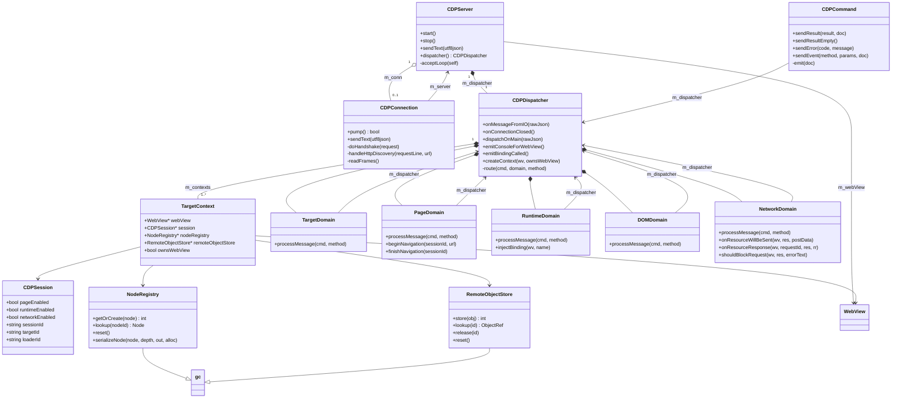
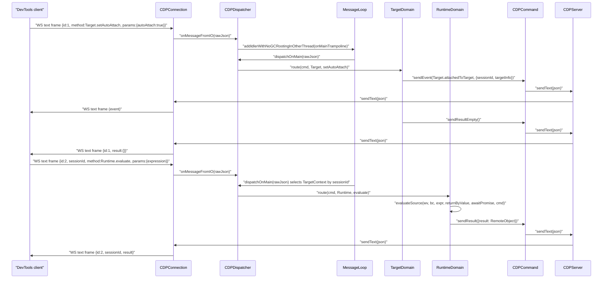

# Functional Requirements: core-cdp

> **Relevant source files**
>
> - [src/core/cdp/CDPServer.cpp](src:src/core/cdp/CDPServer.cpp)
> - [src/core/cdp/CDPServer.h](src:src/core/cdp/CDPServer.h)
> - [src/core/cdp/CDPConnection.cpp](src:src/core/cdp/CDPConnection.cpp)
> - [src/core/cdp/CDPDispatcher.cpp](src:src/core/cdp/CDPDispatcher.cpp)
> - [src/core/cdp/CDPDispatcher.h](src:src/core/cdp/CDPDispatcher.h)
> - [src/core/cdp/CDPCommand.cpp](src:src/core/cdp/CDPCommand.cpp)
> - [src/core/cdp/CDPSession.h](src:src/core/cdp/CDPSession.h)
> - [src/core/cdp/NodeRegistry.cpp](src:src/core/cdp/NodeRegistry.cpp)
> - [src/core/cdp/domains/TargetDomain.cpp](src:src/core/cdp/domains/TargetDomain.cpp)
> - [src/core/cdp/domains/RuntimeDomain.cpp](src:src/core/cdp/domains/RuntimeDomain.cpp)
> - [src/core/cdp/domains/PageDomain.cpp](src:src/core/cdp/domains/PageDomain.cpp)
> - [src/core/cdp/domains/NetworkDomain.cpp](src:src/core/cdp/domains/NetworkDomain.cpp)

**Module**: [`CDPServer.cpp`](src:src/core/cdp/CDPServer.cpp)
**Version**: 2026-09-10
**Linked Design Card**: [modules/core-cdp.md](../modules/core-cdp.md)
**Analysis basis**: AST export and direct source reading

## Overview

The module implements a Chrome DevTools Protocol server: [`CDPServer::acceptLoop`](src:src/core/cdp/CDPServer.cpp#L97) accepts TCP clients on an IO thread, [`CDPConnection::doHandshake`](src:src/core/cdp/CDPConnection.cpp#L134) answers HTTP discovery requests or upgrades the socket to a WebSocket, and [`CDPDispatcher::dispatchOnMain`](src:src/core/cdp/CDPDispatcher.cpp#L264) parses each JSON command on the main thread and routes it to one of twenty domain handler classes via [`CDPDispatcher::route`](src:src/core/cdp/CDPDispatcher.cpp#L390). Engine-side bridges such as [`CDPDispatcher::emitConsoleForWebView`](src:src/core/cdp/CDPDispatcher.cpp#L1594) and [`NetworkDomain::onResourceWillBeSent`](src:src/core/cdp/domains/NetworkDomain.cpp#L461) turn console output and real network traffic into protocol events for the attached client. The whole module is compiled only when `STARFISH_ENABLE_CDP` is defined ([`config.cmake`](src:build/config.cmake#L163)).

## Functional Requirements

### FR-CORE-CDP-001
**Accept DevTools clients on a TCP port**

| Item | Content |
|------|---------|
| **Description** | The module listens on a TCP port and accepts one client connection at a time, handing each accepted socket to a per-connection handler that is pumped until the peer closes. |
| **Input** | `WebView*` owner and `uint16_t` port given to the constructor; the port is read from `STARFISH_CDP_PORT` (default `9222`) by the first `WebView` when `STARFISH_ENABLE_CDP` is set in the environment. |
| **Output** | Listening socket (`AF_INET`, `SOCK_STREAM`, `SO_REUSEADDR`, `INADDR_ANY`, backlog 1); log line `cdp: devtools server listening on port %d`; a live `CDPConnection` per accepted client; `onConnectionClosed()` notification to the dispatcher after each client leaves. |
| **Preconditions** | `start()` called on the main thread; an IO `Thread` can be created from the WebView's thread pool. |
| **Postconditions** | `m_isRunning` is true while the loop runs; `stop()` shuts down the listen socket and joins the IO thread; on `socket`/`bind`/`listen` failure the loop logs and exits without serving. |
| **Source** | [`CDPServer::acceptLoop`](src:src/core/cdp/CDPServer.cpp#L97), [`CDPServer::start`](src:src/core/cdp/CDPServer.cpp#L59), [`CDPServer::stop`](src:src/core/cdp/CDPServer.cpp#L70), [`WebView.cpp`](src:src/core/page/WebView.cpp#L394) |

**Acceptance criteria**:
- [ ] With `STARFISH_ENABLE_CDP` set and no `STARFISH_CDP_PORT`, the server binds port 9222; with `STARFISH_CDP_PORT=9333` it binds 9333.
- [ ] A second `WebView` in the same process does not attempt to bind the port again (`s_cdpServerStarted` guard).
- [ ] When the port is already in use, `bind()` fails, the message `cdp: bind() failed (port in use?)` is logged and the IO thread ends.
- [ ] After a client disconnects, the loop accepts the next client and the dispatcher's connection-scoped state has been reset.

### FR-CORE-CDP-002
**Serve HTTP discovery endpoints**

| Item | Content |
|------|---------|
| **Description** | A plain HTTP `GET` on the CDP port (no WebSocket upgrade) is answered with the browser/version descriptor or the target list so that clients can locate the WebSocket URL. |
| **Input** | HTTP request line `GET <url> HTTP/1.1` and headers, terminated by `\r\n\r\n`. |
| **Output** | `/json/version`: `{"Browser":"Starfish/1.0","Protocol-Version":"1.3","User-Agent":"Starfish/1.0","webSocketDebuggerUrl":"ws://127.0.0.1:<port>/"}`; `/json`, `/json/list`, `/json/list/`: one-element array with `id` `TID-0000000001`, `title` `Starfish`, `type` `page`, `url` `about:blank`, `webSocketDebuggerUrl` `ws://127.0.0.1:<port>/devtools/page/TID-0000000001`; any other path: `{}`. All responses are `HTTP/1.1 200 OK` with `Content-Length`, `Connection: Close`, `Content-Type: application/json; charset=UTF-8`. |
| **Preconditions** | Connection is in `State::Handshaking` and the request does not contain `Upgrade: websocket` with a `Sec-WebSocket-Key`. |
| **Postconditions** | The connection is closed after the response (`pump()` returns false). |
| **Source** | [`CDPConnection::handleHttpDiscovery`](src:src/core/cdp/CDPConnection.cpp#L103), [`CDPConnection::sendHttp`](src:src/core/cdp/CDPConnection.cpp#L66), [`CDPConnection::pump`](src:src/core/cdp/CDPConnection.cpp#L270) |

**Acceptance criteria**:
- [ ] `GET /json/version` returns a JSON object whose `Protocol-Version` is `1.3` and whose `webSocketDebuggerUrl` contains the configured port.
- [ ] `GET /json/list` returns an array of exactly one page target with id `TID-0000000001`.
- [ ] `GET /unknown` returns `{}` and the socket is closed by the server.

### FR-CORE-CDP-003
**Upgrade a connection to WebSocket**

| Item | Content |
|------|---------|
| **Description** | When a request carries an `Upgrade: websocket` header and a `Sec-WebSocket-Key`, the module completes the WebSocket opening handshake and switches the connection to live frame mode. |
| **Input** | HTTP request headers (case-insensitive lookup of `Upgrade` and `Sec-WebSocket-Key`). |
| **Output** | `HTTP/1.1 101 Switching Protocols`, `Upgrade: websocket`, `Connection: Upgrade`, `Sec-WebSocket-Accept: base64(sha1(key + "258EAFA5-E914-47DA-95CA-C5AB0DC85B11"))`. |
| **Preconditions** | Connection in `State::Handshaking`; request line contains two spaces (method, url, version). |
| **Postconditions** | `m_state == State::Live`; any bytes already buffered after the headers are processed as frames. |
| **Source** | [`CDPConnection::doHandshake`](src:src/core/cdp/CDPConnection.cpp#L134), [`kWsGuid`](src:src/core/cdp/CDPConnection.cpp#L37), [`cdpSha1`](src:src/core/cdp/Sha1.cpp#L32), [`cdpBase64Encode`](src:src/core/cdp/Base64.cpp#L29) |

**Acceptance criteria**:
- [ ] A request with `Sec-WebSocket-Key: dGhlIHNhbXBsZSBub25jZQ==` receives `Sec-WebSocket-Accept` equal to the base64 of the SHA1 of the key concatenated with the fixed GUID.
- [ ] A request whose request line lacks a URL token is rejected (`doHandshake` returns false and the connection closes).
- [ ] A request with `Upgrade: websocket` but no `Sec-WebSocket-Key` is treated as an HTTP discovery request.

### FR-CORE-CDP-004
**Decode and encode WebSocket frames**

| Item | Content |
|------|---------|
| **Description** | The module decodes client frames (with 7-, 16- or 64-bit payload length and optional masking), forwards text payloads to the dispatcher, answers pings, honours close frames, and encodes server messages as single unmasked text frames. |
| **Input** | Raw bytes appended to `m_recvBuf` by `recv()` (4096-byte reads); UTF-8 JSON strings from `CDPServer::sendText`. |
| **Output** | Opcode `0x1`: payload passed to `CDPDispatcher::onMessageFromIO`; `0x9`: pong frame `0x8A` echoing the payload; `0x8`: close frame `0x88 0x00`, state `Closed`, connection ends; `0x0`/`0xA`: ignored. Outbound: `0x81` header, length byte / `126`+2 bytes / `127`+8 bytes, then payload. |
| **Preconditions** | Connection in `State::Live`. |
| **Postconditions** | Consumed bytes are erased from `m_recvBuf`; incomplete frames stay buffered until more bytes arrive. |
| **Source** | [`CDPConnection::readFrames`](src:src/core/cdp/CDPConnection.cpp#L176), [`CDPConnection::sendText`](src:src/core/cdp/CDPConnection.cpp#L248), [`CDPConnection::writeAll`](src:src/core/cdp/CDPConnection.cpp#L54) |

**Acceptance criteria**:
- [ ] A masked text frame is unmasked with the 4-byte key and delivered to the dispatcher as the original JSON string.
- [ ] A frame split across two `recv()` calls is delivered once complete, not twice and not truncated.
- [ ] A ping frame produces a pong frame carrying the same payload; a close frame produces a close reply and ends the connection.
- [ ] A 70,000-byte outbound message is framed with the `127` length marker and an 8-byte big-endian length.

### FR-CORE-CDP-005
**Parse command envelopes and route by domain and method**

| Item | Content |
|------|---------|
| **Description** | Each inbound JSON text is parsed into `id`, `sessionId`, `method` and `params`; the target context is selected from `sessionId`; the method is split at the first `.` and dispatched to the matching domain handler, which replies with a result or an error. |
| **Input** | JSON object `{ "id"?: int, "sessionId"?: string, "method": "Domain.method", "params"?: object }`. |
| **Output** | `{"id":<id>,"result":{...}}` or `{"id":<id>,"error":{"code":<n>,"message":"..."}}` (with `sessionId` echoed when present). Top-level errors: `-32600` missing method, `-32601` method without a domain separator or unknown method inside a handler, `-32001` unknown `sessionId`, `-32602` invalid parameters, `-32000` handler-specific failures. |
| **Preconditions** | Running on the main thread; the JSON parses to an object (otherwise the message is dropped silently). |
| **Postconditions** | `m_current` points at the selected `TargetContext` for the duration of the handler; `sessionId == "STARTUP"` answers `Page.getFrameTree` with a start-up frame and every other method with an empty result. |
| **Source** | [`CDPDispatcher::dispatchOnMain`](src:src/core/cdp/CDPDispatcher.cpp#L264), [`CDPDispatcher::route`](src:src/core/cdp/CDPDispatcher.cpp#L390), [`CDPCommand::sendResult`](src:src/core/cdp/CDPCommand.cpp#L58), [`CDPCommand::sendError`](src:src/core/cdp/CDPCommand.cpp#L82), [`LogDomain::processMessage`](src:src/core/cdp/domains/LogDomain.cpp#L31) |

**Acceptance criteria**:
- [ ] `{"id":1,"method":"Log.enable"}` yields `{"id":1,"result":{}}` and sets `logEnabled` on the initial session.
- [ ] `{"id":2}` yields error code `-32600`; `{"id":3,"method":"Ping"}` yields `-32601`; `{"id":4,"sessionId":"SID-XYZ","method":"Page.enable"}` yields `-32001` when no context has that session id.
- [ ] `{"id":5,"method":"Log.frobnicate"}` yields `-32601` with message `'method' wasn't found`.
- [ ] `Browser.getVersion` returns `protocolVersion` `1.3` and `product` `Starfish/1.0`; `Schema.getDomains` lists every name in `kDomains`.

### FR-CORE-CDP-006
**Marshal work to the main thread and reset state on disconnect**

| Item | Content |
|------|---------|
| **Description** | Frames received on the IO thread are queued to the initial WebView's main-thread message loop for processing; when the client disconnects, connection-scoped session state is recreated on the main thread so a reconnecting client starts with a fresh attach handshake. |
| **Input** | Raw JSON string from the IO thread; connection-closed notification from the accept loop. |
| **Output** | A `CDPMessageReq` posted with `addIdlerWithNoGCRootingInOtherThread` and consumed by `onMainTrampoline`; on disconnect, spawned targets are destroyed (their WebViews destroyed when owned), any active screencast is stopped, the initial `CDPSession` is replaced by a new one and `m_browserSessionId` is cleared. |
| **Preconditions** | At least one `TargetContext` exists (`m_contexts.front()`). |
| **Postconditions** | Domain handlers never run on the IO thread; `m_current` is the initial context after a reset. |
| **Source** | [`CDPDispatcher::onMessageFromIO`](src:src/core/cdp/CDPDispatcher.cpp#L195), [`CDPDispatcher::onMainTrampoline`](src:src/core/cdp/CDPDispatcher.cpp#L207), [`CDPDispatcher::onConnectionClosed`](src:src/core/cdp/CDPDispatcher.cpp#L214), [`CDPDispatcher::resetConnectionState`](src:src/core/cdp/CDPDispatcher.cpp#L229), [`CDPServer::sendText`](src:src/core/cdp/CDPServer.cpp#L87) |

**Acceptance criteria**:
- [ ] A command received on the IO thread is executed on the main thread (the handler observes `isMainThread()`).
- [ ] After disconnect and reconnect, `Target.setAutoAttach` emits `Target.attachedToTarget` again (the `attachEmitted` flag was reset).
- [ ] Targets created with `Target.createTarget` by the previous client are no longer listed by `Target.getTargets` after reconnect.
- [ ] `CDPServer::sendText` is a no-op while no connection is alive (`m_connAlive` false).

### FR-CORE-CDP-007
**Manage targets and sessions**

| Item | Content |
|------|---------|
| **Description** | The module maintains one `TargetContext` per WebView (session state, node registry, remote-object store) and issues session identifiers when a client attaches, so that later commands carrying a `sessionId` operate on the right WebView. |
| **Input** | `Target.setAutoAttach {autoAttach}`, `Target.attachToTarget`, `Target.attachToBrowserTarget`, `Target.createTarget`, `Target.closeTarget`, `Target.setDiscoverTargets {discover}`. |
| **Output** | Session id `SID-<n>0000000` for the initial target (or `SID-<n>1111111` for created targets); event `Target.attachedToTarget {sessionId, targetInfo, waitingForDebugger:false}` emitted before the command result; `Target.targetCreated` when discovery is enabled; new contexts registered and GC-rooted by `createContext`. |
| **Preconditions** | `setAutoAttach` emits the attach event only for a connection-level command (empty `sessionId`) and only once per connection (`attachEmitted`). |
| **Postconditions** | `contextForSession(sessionId)` resolves the new session; the browser-target session id resolves to the initial context. |
| **Source** | [`TargetDomain::processMessage`](src:src/core/cdp/domains/TargetDomain.cpp#L95), [`TargetDomain.cpp`](src:src/core/cdp/domains/TargetDomain.cpp#L143), [`CDPDispatcher::createContext`](src:src/core/cdp/CDPDispatcher.cpp#L134), [`CDPDispatcher::contextForSession`](src:src/core/cdp/CDPDispatcher.cpp#L174), [`TargetContext`](src:src/core/cdp/TargetContext.h#L34), [`CDPSession::CDPSession`](src:src/core/cdp/CDPSession.h#L104) |

**Acceptance criteria**:
- [ ] The first connection-level `Target.setAutoAttach {autoAttach:true}` produces exactly one `Target.attachedToTarget` event whose `sessionId` starts with `SID-`; a second call on the page session produces none.
- [ ] `Target.attachToTarget` returns `{sessionId}` matching the preceding `Target.attachedToTarget` event.
- [ ] A command sent with the issued `sessionId` is executed against the initial WebView; `Target.createTarget` yields a context whose commands act on the spawned WebView.
- [ ] Default identifiers of a fresh session are `targetId`/`frameId` `TID-0000000001`, `browserContextId` `BID-0000000001`, `loaderId` `LID-0000000001`.

### FR-CORE-CDP-008
**Evaluate JavaScript and serialize remote objects**

| Item | Content |
|------|---------|
| **Description** | The Runtime domain enables execution-context reporting, evaluates expressions in the page's script context and returns results as protocol RemoteObjects, storing object handles for later `getProperties`/`callFunctionOn`/`releaseObject`. |
| **Input** | `Runtime.enable`; `Runtime.evaluate {expression, returnByValue?, awaitPromise?, contextId?}`; `Runtime.callFunctionOn`, `Runtime.getProperties {objectId}`, `Runtime.compileScript`, `Runtime.runScript`, `Runtime.addBinding {name}`. |
| **Output** | `Runtime.executionContextCreated {context:{id, origin, name, uniqueId, auxData:{isDefault, type, frameId}}}` on enable; `result` RemoteObject or `exceptionDetails`; object ids issued by `RemoteObjectStore::store`; for `addBinding`, a native `window[name]` function whose calls emit `Runtime.bindingCalled {name, payload, executionContextId}`. |
| **Preconditions** | The browsing context has a `ScriptBindingInstance` with scripting enabled (ignoring the CDP script-disable override); otherwise error `-32000` (`No scripting context` / `Scripting disabled`). `expression` must be a string (else `-32602`). |
| **Postconditions** | Parse errors are reported as `exceptionDetails` without dispatching a window `error` event; evaluation runs inside a microtask scope. |
| **Source** | [`RuntimeDomain::processMessage`](src:src/core/cdp/domains/RuntimeDomain.cpp#L67), [`RuntimeDomain::evaluateSource`](src:src/core/cdp/domains/RuntimeDomain.cpp#L892), [`RuntimeDomain::injectBinding`](src:src/core/cdp/domains/RuntimeDomain.cpp#L320), [`bindingNativeCallback`](src:src/core/cdp/domains/RuntimeDomain.cpp#L289), [`RemoteObjectStore`](src:src/core/cdp/RemoteObject.h#L36), [`serializeRemoteObject`](src:src/core/cdp/RemoteObject.h#L51) |

**Acceptance criteria**:
- [ ] `Runtime.enable` returns an empty result and is followed by `Runtime.executionContextCreated` with `context.id` equal to the session's `executionContextId` (1 by default).
- [ ] `Runtime.evaluate {expression:"1+1", returnByValue:true}` returns a RemoteObject value 2; `Runtime.evaluate {}` returns error `-32602`.
- [ ] `Runtime.evaluate {expression:"("}` returns `exceptionDetails` describing the parse error.
- [ ] After `Runtime.addBinding {name:"cb"}`, calling `window.cb("x")` in the page emits `Runtime.bindingCalled` with `payload` `"x"` when `runtimeEnabled` is set.

### FR-CORE-CDP-009
**Expose the DOM tree through node handles**

| Item | Content |
|------|---------|
| **Description** | The DOM domain serializes the live document into protocol Node objects, assigning stable integer `nodeId`s through a per-target registry, and supports querying, mutating and describing nodes by id. |
| **Input** | `DOM.enable`; `DOM.getDocument {depth?}` (default depth 3); `DOM.requestChildNodes {nodeId, depth?}`; `DOM.querySelector`, `DOM.setAttributeValue`, `DOM.getOuterHTML`, `DOM.performSearch` and the other methods listed in the Design Card. |
| **Output** | `{root: Node}` where each Node carries `nodeId`, `backendNodeId`, `parentId`, `nodeType`, `nodeName`, `localName`, `nodeValue` and children up to the requested depth; `DOM.setChildNodes` events for `requestChildNodes`; error `-32000` `No document` / `Could not find node with given id`. |
| **Preconditions** | `mainDocument(wv)` is non-null; a `nodeId` must have been issued by the registry in the current document. |
| **Postconditions** | `NodeRegistry::getOrCreate` returns the same id for the same `Node*` until `reset()`; ids start at 1 and are reset on navigation. |
| **Source** | [`DOMDomain::processMessage`](src:src/core/cdp/domains/DOMDomain.cpp#L87), [`NodeRegistry::getOrCreate`](src:src/core/cdp/NodeRegistry.cpp#L37), [`NodeRegistry::lookup`](src:src/core/cdp/NodeRegistry.cpp#L49), [`NodeRegistry::reset`](src:src/core/cdp/NodeRegistry.cpp#L63), [`NodeRegistry::serializeNode`](src:src/core/cdp/NodeRegistry.cpp#L78) |

**Acceptance criteria**:
- [ ] `DOM.getDocument` on a loaded page returns a root whose `nodeId` is 1 and whose `nodeType` is the document node type.
- [ ] Two consecutive `DOM.getDocument` calls without navigation return identical `nodeId`s for the same nodes.
- [ ] `DOM.requestChildNodes {nodeId:9999}` returns error `-32000` when no such id exists.
- [ ] After `Page.navigate`, previously issued node ids are invalid (registry reset).

### FR-CORE-CDP-010
**Announce navigation lifecycle to the client**

| Item | Content |
|------|---------|
| **Description** | For each top-level navigation the Page domain issues a new loader id, resets per-document state, and emits the frame, lifecycle, DOM and execution-context events that clients use to wait for load completion. |
| **Input** | `Page.navigate {url}`, `Page.reload`, `Page.setDocumentContent {html}`, and document rewrites detected after evaluation. |
| **Output** | `Page.frameStartedLoading {frameId}` (if `pageEnabled`), `Page.lifecycleEvent` `init`, synthetic Network events for `data:`/unknown schemes, then after load: scripts registered with `Page.addScriptToEvaluateOnNewDocument` evaluated, bindings re-injected, `Page.frameNavigated {frame}`, `DOM.documentUpdated` (if `domEnabled`), `Runtime.executionContextsCleared` and `Runtime.executionContextCreated` (if `runtimeEnabled`), re-announced isolated worlds, `Page.loadEventFired`. |
| **Preconditions** | A session with the navigating WebView selected; for `http(s)` URLs the real network hook emits the document request events instead of the synthetic triple; when `fetchEnabled` is set the navigation is parked until `Fetch.continueRequest`/`fulfillRequest`/`failRequest`. |
| **Postconditions** | `loaderId` becomes `LID-<n>000000`; `resources`, `childFrames`, node registry and remote-object store are cleared; network-idle tracking is reset. |
| **Source** | [`PageDomain::beginNavigation`](src:src/core/cdp/domains/PageDomain.cpp#L1058), [`PageDomain::finishNavigation`](src:src/core/cdp/domains/PageDomain.cpp#L1120), [`PageDomain::emitLifecycle`](src:src/core/cdp/domains/PageDomain.cpp#L524), [`PageDomain::completeDeferredNavigation`](src:src/core/cdp/domains/PageDomain.cpp#L1260), [`FetchDomain::emitNavigationPaused`](src:src/core/cdp/domains/FetchDomain.cpp#L78) |

**Acceptance criteria**:
- [ ] With `Page.enable` active, `Page.navigate` produces `Page.frameStartedLoading`, a `Page.lifecycleEvent` named `init`, and `Page.frameNavigated` whose `frame.loaderId` differs from the previous one.
- [ ] With `Runtime.enable` active, navigation emits `Runtime.executionContextsCleared` followed by `Runtime.executionContextCreated`.
- [ ] A script registered via `Page.addScriptToEvaluateOnNewDocument` runs in the new document before the page's inline scripts.
- [ ] With `Fetch.enable` active, `Page.navigate` emits `Fetch.requestPaused` and the document is not loaded until `Fetch.continueRequest` arrives.

### FR-CORE-CDP-011
**Forward engine console, dialog, binding and animation events**

| Item | Content |
|------|---------|
| **Description** | Engine components report console output, window dialogs, binding invocations, child-frame loads and keyframe animation starts to the dispatcher, which converts them to protocol events on the session owning the originating WebView. |
| **Input** | `emitConsoleForWebView(webView, level, text, argv, argc)` from the console implementation; `emitJavaScriptDialogOpening(webView, url, message, type, defaultText)` from `Window`; `emitBindingCalled(webView, name, payload)`; `emitChildFrameLoaded(webView)` from the resource loader; `AnimationDomain::emitAnimationStarted(webView, animationName, durationMs)`. |
| **Output** | `Log.entryAdded` (levels verbose/info/warning/error) when `logEnabled`; `Runtime.consoleAPICalled` (types log/debug/info/error/warning with per-argument RemoteObjects) when `runtimeEnabled`; `Page.javascriptDialogOpening` when `pageEnabled`; `Runtime.bindingCalled` when `runtimeEnabled`; `Page.frameAttached`/`frameNavigated`/`Runtime.executionContextCreated` for late child frames; `Animation.animationCreated` and `Animation.animationStarted` when `animationEnabled`. |
| **Preconditions** | The WebView has a `CDPServer` (own or shared via `setSharedCDPServer`) and a registered `TargetContext`; otherwise the call is a no-op. |
| **Postconditions** | Events carry the owning session's `sessionId`; no event is sent for WebViews without a context or with the relevant domain disabled. |
| **Source** | [`CDPDispatcher::emitConsoleForWebView`](src:src/core/cdp/CDPDispatcher.cpp#L1594), [`CDPDispatcher::emitBindingCalled`](src:src/core/cdp/CDPDispatcher.cpp#L1701), [`CDPDispatcher::emitChildFrameLoaded`](src:src/core/cdp/CDPDispatcher.cpp#L1735), [`CDPDispatcher::emitJavaScriptDialogOpening`](src:src/core/cdp/CDPDispatcher.cpp#L1763), [`AnimationDomain::emitAnimationStarted`](src:src/core/cdp/domains/AnimationDomain.cpp#L111), [`emitCDPConsole`](src:src/core/extra/Console.cpp#L39), [`Window::emitCDPDialog`](src:src/core/page/Window.cpp#L824) |

**Acceptance criteria**:
- [ ] `console.error("x")` in the page produces `Runtime.consoleAPICalled` with `type` `error` when Runtime is enabled and `Log.entryAdded` with `level` `error` when Log is enabled; nothing is sent when both are disabled.
- [ ] `console.debug` maps to `Log.entryAdded.level` `verbose` and `Runtime.consoleAPICalled.type` `debug`.
- [ ] `window.alert("hi")` with Page enabled emits `Page.javascriptDialogOpening` with `type` `alert` and `message` `hi`.
- [ ] Console output from a WebView spawned by `Target.createTarget` is delivered on that target's session, not on the initial session.

### FR-CORE-CDP-012
**Report real network activity and apply network overrides**

| Item | Content |
|------|---------|
| **Description** | The Network domain hooks the resource loader to emit request/response/completion events with real URLs, status and bodies, tracks in-flight requests for network-idle lifecycle events, and enforces client-set overrides (extra headers, blocked URLs, offline mode, cache bypass). |
| **Input** | Loader callbacks `onResourceWillBeSent(wv, res, postData)`, `onResourceResponse`, `onResourceData`, `onResourceFinished`, `onResourceFailed`; commands `Network.enable`, `Network.setExtraHTTPHeaders`, `Network.setBlockedURLs`, `Network.emulateNetworkConditions {offline,...}`, `Network.setCacheDisabled`, `Network.getResponseBody {requestId}`, `Network.getRequestPostData`. |
| **Output** | `Network.requestWillBeSent`, `Network.responseReceived`, `Network.loadingFinished`, `Network.loadingFailed` events; requestId `== loaderId` for the document and `REQ-n` for subresources; stored bodies served by `getResponseBody`; `Page.lifecycleEvent` `networkAlmostIdle`/`networkIdle` after a 500 ms quiet period; blocked requests fail with `net::ERR_INTERNET_DISCONNECTED` (offline) or `net::ERR_BLOCKED_BY_CLIENT` (pattern match). |
| **Preconditions** | The resource's document belongs to a WebView with a session whose `networkEnabled` is true; blocking applies only to `http(s)` URLs. |
| **Postconditions** | `networkInFlight` is incremented on request and decremented on finish/fail; `extraHTTPHeaders` are injected into outgoing `ResourceRequest`s; the process HTTP cache mode is switched when `setCacheDisabled` changes. |
| **Source** | [`NetworkDomain::onResourceWillBeSent`](src:src/core/cdp/domains/NetworkDomain.cpp#L461), [`NetworkDomain::onResourceResponse`](src:src/core/cdp/domains/NetworkDomain.cpp#L587), [`NetworkDomain::onResourceFinished`](src:src/core/cdp/domains/NetworkDomain.cpp#L693), [`NetworkDomain::shouldBlockUrl`](src:src/core/cdp/domains/NetworkDomain.cpp#L751), [`NetworkDomain::applyExtraHTTPHeaders`](src:src/core/cdp/domains/NetworkDomain.cpp#L826), [`NetworkDomain::scheduleNetworkIdleCheck`](src:src/core/cdp/domains/NetworkDomain.cpp#L932), [`NetworkDomain::processMessage`](src:src/core/cdp/domains/NetworkDomain.cpp#L978), [`cdpNetwork`](src:src/platform/loader/Resource.cpp#L40) |

**Acceptance criteria**:
- [ ] With `Network.enable` active, loading an `http(s)` page emits `Network.requestWillBeSent` whose `requestId` equals the session's `loaderId`, followed by `responseReceived` and `loadingFinished`.
- [ ] `Network.getResponseBody {requestId}` returns the captured body for a finished request; a request without a body leaves no `getRequestPostData` entry.
- [ ] After `Network.setBlockedURLs {urls:["*.png"]}`, a matching image request fails with `Network.loadingFailed` `errorText` `net::ERR_BLOCKED_BY_CLIENT`; after `emulateNetworkConditions {offline:true}` every `http(s)` request fails with `net::ERR_INTERNET_DISCONNECTED` while `data:` URLs still load.
- [ ] `Network.setExtraHTTPHeaders {headers:{"X-Test":"1"}}` results in the header being present on subsequent real requests.

## Non-Functional Requirements

| Item | Requirement | Source |
|---|---|---|
| Performance | IO thread reads in 4096-byte chunks; `IO.read` serves stream data in chunks of at most 1 MiB (`kChunk = 1 << 20`); network-idle events are debounced by a 500 ms timer. | [`CDPConnection.cpp`](src:src/core/cdp/CDPConnection.cpp#L272), [`CDPDispatcher.cpp`](src:src/core/cdp/CDPDispatcher.cpp#L452), [`CDPSession.h`](src:src/core/cdp/CDPSession.h#L271) |
| Security | The listener binds `INADDR_ANY` with no authentication in the handshake path; the feature is compiled in only with `STARFISH_ENABLE_CDP` and started only when the environment variable is set. `Security.setIgnoreCertificateErrors` toggles a process-wide TLS override. | [`CDPServer.cpp`](src:src/core/cdp/CDPServer.cpp#L115), [`config.cmake`](src:build/config.cmake#L161), [`setGlobalIgnoreSSLVerify`](src:src/core/cdp/CDPDispatcher.cpp#L69) |
| Error handling | Socket failures log and terminate the IO thread; unparseable JSON is dropped; protocol errors are returned as JSON-RPC-style error objects (`-32600`, `-32601`, `-32602`, `-32000`, `-32001`); partial `send()` failures abort the write. | [`CDPServer.cpp`](src:src/core/cdp/CDPServer.cpp#L103), [`CDPDispatcher.cpp`](src:src/core/cdp/CDPDispatcher.cpp#L268), [`CDPConnection::writeAll`](src:src/core/cdp/CDPConnection.cpp#L54) |
| Logging | `STARFISH_LOG_INFO` on socket/bind/listen failure, on successful listen (`cdp: devtools server listening on port %d`) and on IO thread exit (`cdp: devtools io thread end`). | [`CDPServer.cpp`](src:src/core/cdp/CDPServer.cpp#L133), [`CDPServer.cpp`](src:src/core/cdp/CDPServer.cpp#L171) |
| Concurrency | `m_connMutex` and `std::atomic<bool> m_connAlive` serialize main-thread writes against IO-thread connection teardown; all handler execution is main-thread only. | [`CDPServer.h`](src:src/core/cdp/CDPServer.h#L73), [`CDPServer::sendText`](src:src/core/cdp/CDPServer.cpp#L87) |

## Constraints

- Compiled only when `STARFISH_ENABLE_CDP` is defined (off by default, `-DSTARFISH_ENABLE_CDP=1` at configure time); every header guard includes the flag. [`config.cmake`](src:build/config.cmake#L161), [`CDPServer.h`](src:src/core/cdp/CDPServer.h#L20)
- One live client connection at a time (`m_conn` is a single pointer; listen backlog is 1). [`CDPServer.h`](src:src/core/cdp/CDPServer.h#L68), [`CDPServer.cpp`](src:src/core/cdp/CDPServer.cpp#L125)
- Only the first `WebView` in the process starts a server; additional WebViews share it through `setSharedCDPServer`. [`WebView.cpp`](src:src/core/page/WebView.cpp#L393), [`CDPDispatcher.cpp`](src:src/core/cdp/CDPDispatcher.cpp#L148)
- WebSocket continuation frames are ignored (single-frame messages only). [`CDPConnection.cpp`](src:src/core/cdp/CDPConnection.cpp#L244)
- Isolated worlds all map to the single real script context (no true world isolation); Profiler/Tracing/Overlay return minimal synthesized results because the engine has no sampler, trace recorder or visual overlay. [`CDPSession.h`](src:src/core/cdp/CDPSession.h#L181), [`CDPDispatcher.cpp`](src:src/core/cdp/CDPDispatcher.cpp#L516)
- Browser contexts provide grouping only; cookie/storage state is shared across them. [`CDPSession.h`](src:src/core/cdp/CDPSession.h#L209)

## Module Design Card Linkage

| FR | Implementation | Design Card section |
|---|---|---|
| FR-CORE-CDP-001 | [`CDPServer::acceptLoop`](src:src/core/cdp/CDPServer.cpp#L97) | [IPC / Message / Interface Contracts](../modules/core-cdp.md#ipc--message--interface-contracts), [Key Flow](../modules/core-cdp.md#key-flow) |
| FR-CORE-CDP-002 | [`CDPConnection::handleHttpDiscovery`](src:src/core/cdp/CDPConnection.cpp#L103) | [IPC / Message / Interface Contracts](../modules/core-cdp.md#ipc--message--interface-contracts) |
| FR-CORE-CDP-003 | [`CDPConnection::doHandshake`](src:src/core/cdp/CDPConnection.cpp#L134) | [IPC / Message / Interface Contracts](../modules/core-cdp.md#ipc--message--interface-contracts) |
| FR-CORE-CDP-004 | [`CDPConnection::readFrames`](src:src/core/cdp/CDPConnection.cpp#L176) | [IPC / Message / Interface Contracts](../modules/core-cdp.md#ipc--message--interface-contracts) |
| FR-CORE-CDP-005 | [`CDPDispatcher::dispatchOnMain`](src:src/core/cdp/CDPDispatcher.cpp#L264) | [Public Interface](../modules/core-cdp.md#public-interface), [Key Flow](../modules/core-cdp.md#key-flow) |
| FR-CORE-CDP-006 | [`CDPDispatcher::onMessageFromIO`](src:src/core/cdp/CDPDispatcher.cpp#L195) | [Architectural Rules](../modules/core-cdp.md#architectural-rules) |
| FR-CORE-CDP-007 | [`TargetDomain::processMessage`](src:src/core/cdp/domains/TargetDomain.cpp#L95) | [IPC / Message / Interface Contracts](../modules/core-cdp.md#ipc--message--interface-contracts) |
| FR-CORE-CDP-008 | [`RuntimeDomain::evaluateSource`](src:src/core/cdp/domains/RuntimeDomain.cpp#L892) | [Public Interface](../modules/core-cdp.md#public-interface) |
| FR-CORE-CDP-009 | [`NodeRegistry::serializeNode`](src:src/core/cdp/NodeRegistry.cpp#L78) | [Quick Navigation](../modules/core-cdp.md#quick-navigation) |
| FR-CORE-CDP-010 | [`PageDomain::finishNavigation`](src:src/core/cdp/domains/PageDomain.cpp#L1120) | [Key Flow](../modules/core-cdp.md#key-flow) |
| FR-CORE-CDP-011 | [`CDPDispatcher::emitConsoleForWebView`](src:src/core/cdp/CDPDispatcher.cpp#L1594) | [Public Interface](../modules/core-cdp.md#public-interface), [Key Flow](../modules/core-cdp.md#key-flow) |
| FR-CORE-CDP-012 | [`NetworkDomain::onResourceWillBeSent`](src:src/core/cdp/domains/NetworkDomain.cpp#L461) | [Public Interface](../modules/core-cdp.md#public-interface) |

## ENUM Definitions

No entries for this module exist in the extraction results; the following enumeration is taken directly from the source.

| ENUM | Values | Used in | Source |
|---|---|---|---|
| `CDPConnection::State` | `Handshaking`, `Live`, `Closed` | Connection state machine in `pump()`, `doHandshake()`, `readFrames()` | [`State`](src:src/core/cdp/CDPConnection.h#L34) |

## Error Code Definitions

| Error code | Value | Trigger | Recovery | Source |
|---|---|---|---|---|
| Invalid request | `-32600` | Envelope without a string `method` | Client resends a well-formed command | [`CDPDispatcher.cpp`](src:src/core/cdp/CDPDispatcher.cpp#L292) |
| Method not found | `-32601` | `method` lacks `Domain.` prefix, or a handler does not implement the method | Client uses a supported method (see Design Card handler table) | [`CDPDispatcher.cpp`](src:src/core/cdp/CDPDispatcher.cpp#L329), [`LogDomain.cpp`](src:src/core/cdp/domains/LogDomain.cpp#L50) |
| Unknown session | `-32001` | Non-empty `sessionId` that matches no `TargetContext` | Client re-attaches (`Target.attachToTarget` / `setAutoAttach`) | [`CDPDispatcher.cpp`](src:src/core/cdp/CDPDispatcher.cpp#L311) |
| Invalid params | `-32602` | Missing/ill-typed parameter (e.g. `expression`, `IO.read` handle) | Client supplies the required parameter | [`RuntimeDomain.cpp`](src:src/core/cdp/domains/RuntimeDomain.cpp#L127), [`CDPDispatcher.cpp`](src:src/core/cdp/CDPDispatcher.cpp#L446) |
| Server error | `-32000` | Handler-specific failure (e.g. `No document`, `No scripting context`, `Scripting disabled`, unknown node id) | Depends on message; typically re-query after navigation/attach | [`DOMDomain.cpp`](src:src/core/cdp/domains/DOMDomain.cpp#L107), [`RuntimeDomain.cpp`](src:src/core/cdp/domains/RuntimeDomain.cpp#L899) |
| `net::ERR_INTERNET_DISCONNECTED` | string `errorText` | `Network.emulateNetworkConditions {offline:true}` and an `http(s)` request is issued | `emulateNetworkConditions {offline:false}` | [`NetworkDomain.cpp`](src:src/core/cdp/domains/NetworkDomain.cpp#L766) |
| `net::ERR_BLOCKED_BY_CLIENT` | string `errorText` | Request URL matches a `Network.setBlockedURLs` pattern | `setBlockedURLs {urls:[]}` | [`NetworkDomain.cpp`](src:src/core/cdp/domains/NetworkDomain.cpp#L771) |

## Constant Definitions

No entries for this module exist in the extraction results; the following constants are taken directly from the source (16 rows).

| Constant | Value | Purpose | Source |
|---|---|---|---|
| `kWsGuid` | `"258EAFA5-E914-47DA-95CA-C5AB0DC85B11"` | GUID appended to `Sec-WebSocket-Key` before hashing | [`kWsGuid`](src:src/core/cdp/CDPConnection.cpp#L37) |
| `kBase64Chars` | `A-Z a-z 0-9 + /` | Base64 alphabet | [`kBase64Chars`](src:src/core/cdp/Base64.cpp#L26) |
| SHA1 initial state | `0x67452301, 0xEFCDAB89, 0x98BADCFE, 0x10325476, 0xC3D2E1F0` | Digest initialization | [`Sha1.cpp`](src:src/core/cdp/Sha1.cpp#L34) |
| Discovery browser descriptor | `"Browser":"Starfish/1.0"`, `"Protocol-Version":"1.3"` | `/json/version` body | [`CDPConnection.cpp`](src:src/core/cdp/CDPConnection.cpp#L109) |
| Default CDP port | `9222` | Port used when `STARFISH_CDP_PORT` is unset | [`WebView.cpp`](src:src/core/page/WebView.cpp#L395) |
| Listen backlog | `1` | `::listen(listenFd, 1)` | [`CDPServer.cpp`](src:src/core/cdp/CDPServer.cpp#L125) |
| Receive buffer | `4096` bytes | `recv()` chunk size | [`CDPConnection.cpp`](src:src/core/cdp/CDPConnection.cpp#L272) |
| `kChunk` | `1 << 20` | Maximum raw bytes per `IO.read` reply | [`CDPDispatcher.cpp`](src:src/core/cdp/CDPDispatcher.cpp#L452) |
| `kDomains` | `Target, Page, Runtime, DOM, ...` | Domain names reported by `Schema.getDomains` | [`kDomains`](src:src/core/cdp/CDPDispatcher.cpp#L1387) |
| Default session identifiers | `TID-0000000001`, `BID-0000000001`, `LID-0000000001` | Target/frame, browser context and loader ids of the initial session | [`CDPSession::CDPSession`](src:src/core/cdp/CDPSession.h#L104) |
| `executionContextId` | `1` | Main-world execution context id | [`CDPSession.h`](src:src/core/cdp/CDPSession.h#L180) |
| `nextIsolatedContextId` | `100` | First context id issued to isolated worlds | [`CDPSession.h`](src:src/core/cdp/CDPSession.h#L184) |
| `nextChildContextId` | `2000` | First context id issued to child frames | [`CDPSession.h`](src:src/core/cdp/CDPSession.h#L191) |
| `DOM.getDocument` default depth | `3` | Depth when `params.depth` is absent | [`DOMDomain.cpp`](src:src/core/cdp/domains/DOMDomain.cpp#L110) |
| `screencastQuality` default | `80` | Default JPEG quality for `Page.startScreencast` | [`CDPSession.h`](src:src/core/cdp/CDPSession.h#L321) |
| `Browser.getVersion` product | `"Starfish/1.0"`, `protocolVersion` `"1.3"` | Version reported to clients | [`CDPDispatcher.cpp`](src:src/core/cdp/CDPDispatcher.cpp#L502) |

## Message Protocol

| Message ID | Direction | Payload | Handler | Mechanism | Source |
|---|---|---|---|---|---|
| Command envelope `{id, sessionId?, method, params?}` | Client to server | JSON object per WebSocket text frame | [`CDPDispatcher::dispatchOnMain`](src:src/core/cdp/CDPDispatcher.cpp#L264) | TCP / WebSocket text frame | [`CDPConnection.cpp`](src:src/core/cdp/CDPConnection.cpp#L230) |
| Response `{id, result}` / `{id, error{code,message}}` | Server to client | JSON, `sessionId` appended when present | [`CDPCommand::sendResult`](src:src/core/cdp/CDPCommand.cpp#L58), [`CDPCommand::sendError`](src:src/core/cdp/CDPCommand.cpp#L82) | WebSocket text frame | [`CDPCommand::emit`](src:src/core/cdp/CDPCommand.cpp#L42) |
| `Target.attachedToTarget` | Server to client | `sessionId`, `targetInfo`, `waitingForDebugger:false` | [`TargetDomain.cpp`](src:src/core/cdp/domains/TargetDomain.cpp#L165) | WebSocket event | [`TargetDomain.cpp`](src:src/core/cdp/domains/TargetDomain.cpp#L329) |
| `Target.targetCreated` | Server to client | `targetInfo` | [`TargetDomain.cpp`](src:src/core/cdp/domains/TargetDomain.cpp#L118) | WebSocket event | [`TargetDomain.cpp`](src:src/core/cdp/domains/TargetDomain.cpp#L118) |
| `Runtime.executionContextCreated` | Server to client | `context{id, origin, name, uniqueId, auxData}` | [`RuntimeDomain.cpp`](src:src/core/cdp/domains/RuntimeDomain.cpp#L104), [`PageDomain::emitExecutionContextCreated`](src:src/core/cdp/domains/PageDomain.cpp#L546) | WebSocket event | [`RuntimeDomain.cpp`](src:src/core/cdp/domains/RuntimeDomain.cpp#L104) |
| `Runtime.executionContextsCleared` | Server to client | empty | [`PageDomain.cpp`](src:src/core/cdp/domains/PageDomain.cpp#L1191) | WebSocket event | [`PageDomain.cpp`](src:src/core/cdp/domains/PageDomain.cpp#L1191) |
| `Runtime.consoleAPICalled` | Server to client | `type`, `args[]` RemoteObjects, `executionContextId`, `timestamp` | [`CDPDispatcher::emitConsoleForWebView`](src:src/core/cdp/CDPDispatcher.cpp#L1594) | WebSocket event | [`CDPDispatcher.cpp`](src:src/core/cdp/CDPDispatcher.cpp#L1697) |
| `Log.entryAdded` | Server to client | `entry{level, text, ...}` | [`CDPDispatcher::emitConsoleForWebView`](src:src/core/cdp/CDPDispatcher.cpp#L1594) | WebSocket event | [`CDPDispatcher.cpp`](src:src/core/cdp/CDPDispatcher.cpp#L1659) |
| `Runtime.bindingCalled` | Server to client | `name`, `payload`, `executionContextId` | [`CDPDispatcher::emitBindingCalled`](src:src/core/cdp/CDPDispatcher.cpp#L1701) | WebSocket event | [`CDPDispatcher.cpp`](src:src/core/cdp/CDPDispatcher.cpp#L1732) |
| `Page.javascriptDialogOpening` | Server to client | `url`, `message`, `type`, default text | [`CDPDispatcher::emitJavaScriptDialogOpening`](src:src/core/cdp/CDPDispatcher.cpp#L1763) | WebSocket event | [`CDPDispatcher.cpp`](src:src/core/cdp/CDPDispatcher.cpp#L1802) |
| `Page.frameStartedLoading` | Server to client | `frameId` | [`PageDomain::beginNavigation`](src:src/core/cdp/domains/PageDomain.cpp#L1058) | WebSocket event | [`PageDomain.cpp`](src:src/core/cdp/domains/PageDomain.cpp#L1085) |
| `Page.lifecycleEvent` | Server to client | `frameId`, `loaderId`, `name`, `timestamp` | [`PageDomain::emitLifecycle`](src:src/core/cdp/domains/PageDomain.cpp#L524), [`NetworkDomain::onNetworkIdleTimer`](src:src/core/cdp/domains/NetworkDomain.cpp#L881) | WebSocket event | [`PageDomain.cpp`](src:src/core/cdp/domains/PageDomain.cpp#L543) |
| `Page.frameNavigated` | Server to client | `frame` | [`PageDomain::finishNavigation`](src:src/core/cdp/domains/PageDomain.cpp#L1120) | WebSocket event | [`PageDomain.cpp`](src:src/core/cdp/domains/PageDomain.cpp#L1171) |
| `Page.frameAttached` | Server to client | child `frameId`, `parentFrameId` | [`PageDomain::discoverChildFrames`](src:src/core/cdp/domains/PageDomain.cpp#L803) | WebSocket event | [`PageDomain.cpp`](src:src/core/cdp/domains/PageDomain.cpp#L857) |
| `Page.loadEventFired` | Server to client | `timestamp` | [`PageDomain::finishNavigation`](src:src/core/cdp/domains/PageDomain.cpp#L1120) | WebSocket event | [`PageDomain.cpp`](src:src/core/cdp/domains/PageDomain.cpp#L1247) |
| `Page.screencastFrame` | Server to client | image data, metadata, `sessionId` frame number | [`PageDomain::emitScreencastFrame`](src:src/core/cdp/domains/PageDomain.cpp#L983) | WebSocket event | [`PageDomain.cpp`](src:src/core/cdp/domains/PageDomain.cpp#L1016) |
| `DOM.documentUpdated` | Server to client | empty | [`PageDomain::finishNavigation`](src:src/core/cdp/domains/PageDomain.cpp#L1120) | WebSocket event | [`PageDomain.cpp`](src:src/core/cdp/domains/PageDomain.cpp#L1179) |
| `DOM.setChildNodes` | Server to client | `parentId`, `nodes[]` | [`DOMDomain.cpp`](src:src/core/cdp/domains/DOMDomain.cpp#L125) | WebSocket event | [`DOMDomain.cpp`](src:src/core/cdp/domains/DOMDomain.cpp#L153) |
| `Network.requestWillBeSent` | Server to client | `requestId`, `loaderId`, `request{url, method, headers, postData?}`, `type` | [`NetworkDomain::onResourceWillBeSent`](src:src/core/cdp/domains/NetworkDomain.cpp#L461) | WebSocket event | [`NetworkDomain.cpp`](src:src/core/cdp/domains/NetworkDomain.cpp#L578) |
| `Network.responseReceived` | Server to client | `requestId`, `response{url, status, headers, mimeType}` | [`NetworkDomain::onResourceResponse`](src:src/core/cdp/domains/NetworkDomain.cpp#L587) | WebSocket event | [`NetworkDomain.cpp`](src:src/core/cdp/domains/NetworkDomain.cpp#L653) |
| `Network.loadingFinished` | Server to client | `requestId`, `timestamp`, `encodedDataLength` | [`NetworkDomain::onResourceFinished`](src:src/core/cdp/domains/NetworkDomain.cpp#L693) | WebSocket event | [`NetworkDomain.cpp`](src:src/core/cdp/domains/NetworkDomain.cpp#L716) |
| `Network.loadingFailed` | Server to client | `requestId`, `errorText` | [`NetworkDomain::onResourceFailed`](src:src/core/cdp/domains/NetworkDomain.cpp#L724), [`NetworkDomain::emitLoadingFailed`](src:src/core/cdp/domains/NetworkDomain.cpp#L791) | WebSocket event | [`NetworkDomain.cpp`](src:src/core/cdp/domains/NetworkDomain.cpp#L743) |
| `Fetch.requestPaused` | Server to client | `requestId`, `request`, `frameId`, `networkId` | [`FetchDomain::emitNavigationPaused`](src:src/core/cdp/domains/FetchDomain.cpp#L78) | WebSocket event | [`FetchDomain.cpp`](src:src/core/cdp/domains/FetchDomain.cpp#L115) |
| `Animation.animationStarted` | Server to client | `animation{id, name, ...}` | [`AnimationDomain::emitAnimationStarted`](src:src/core/cdp/domains/AnimationDomain.cpp#L111) | WebSocket event | [`AnimationDomain.cpp`](src:src/core/cdp/domains/AnimationDomain.cpp#L181) |

## Class Diagram

The dispatcher additionally owns the fifteen other domain handler classes listed in the Design Card ([`CDPDispatcher::CDPDispatcher`](src:src/core/cdp/CDPDispatcher.cpp#L77)); `gc` inheritance is declared at [`NodeRegistry`](src:src/core/cdp/NodeRegistry.h#L31) and [`RemoteObjectStore`](src:src/core/cdp/RemoteObject.h#L36).

## Sequence Diagram

Primary flow: [`CDPConnection::readFrames`](src:src/core/cdp/CDPConnection.cpp#L176) → [`CDPDispatcher::onMessageFromIO`](src:src/core/cdp/CDPDispatcher.cpp#L195) → [`CDPDispatcher::dispatchOnMain`](src:src/core/cdp/CDPDispatcher.cpp#L264) → [`TargetDomain.cpp`](src:src/core/cdp/domains/TargetDomain.cpp#L123) / [`RuntimeDomain.cpp`](src:src/core/cdp/domains/RuntimeDomain.cpp#L124) → [`CDPCommand::emit`](src:src/core/cdp/CDPCommand.cpp#L42) → [`CDPServer::sendText`](src:src/core/cdp/CDPServer.cpp#L87).

## Test Cases

### Positive
- Start with `STARFISH_ENABLE_CDP=1` and connect a TCP client to port 9222 → connection accepted, log `cdp: devtools server listening on port 9222` emitted. [`CDPServer::acceptLoop`](src:src/core/cdp/CDPServer.cpp#L97)
- `GET /json/version HTTP/1.1` → `200 OK` JSON with `Protocol-Version` `1.3` and `webSocketDebuggerUrl` `ws://127.0.0.1:9222/`; socket closed. [`CDPConnection.cpp`](src:src/core/cdp/CDPConnection.cpp#L106)
- WebSocket upgrade with a valid `Sec-WebSocket-Key` → `101 Switching Protocols` with correct `Sec-WebSocket-Accept`; state `Live`. [`CDPConnection.cpp`](src:src/core/cdp/CDPConnection.cpp#L160)
- `{"id":1,"method":"Target.setAutoAttach","params":{"autoAttach":true}}` → `Target.attachedToTarget` event then `{"id":1,"result":{}}`. [`TargetDomain.cpp`](src:src/core/cdp/domains/TargetDomain.cpp#L143)
- `{"id":2,"sessionId":"<SID>","method":"Runtime.evaluate","params":{"expression":"1+1","returnByValue":true}}` → result RemoteObject with value 2 and `sessionId` echoed. [`RuntimeDomain::evaluateSource`](src:src/core/cdp/domains/RuntimeDomain.cpp#L892)
- `DOM.getDocument` after `DOM.enable` → `root.nodeId == 1`, children to depth 3. [`NodeRegistry::serializeNode`](src:src/core/cdp/NodeRegistry.cpp#L78)
- `Page.navigate` with Page and Runtime enabled → `Page.frameStartedLoading`, `Page.lifecycleEvent(init)`, `Page.frameNavigated`, `Runtime.executionContextsCleared`, `Runtime.executionContextCreated`. [`PageDomain::finishNavigation`](src:src/core/cdp/domains/PageDomain.cpp#L1120)
- `console.log("a", 1)` with Runtime enabled → `Runtime.consoleAPICalled` with two typed args. [`CDPDispatcher::emitConsoleForWebView`](src:src/core/cdp/CDPDispatcher.cpp#L1594)
- `Network.enable` then load an `http(s)` page → `Network.requestWillBeSent` with `requestId == loaderId`, `responseReceived`, `loadingFinished`. [`NetworkDomain::onResourceWillBeSent`](src:src/core/cdp/domains/NetworkDomain.cpp#L461)

### Negative
- Port already bound by another process → `bind()` fails, log `cdp: bind() failed (port in use?)`, IO thread exits. [`CDPServer.cpp`](src:src/core/cdp/CDPServer.cpp#L118)
- Request line `GARBAGE\r\n\r\n` (fewer than two spaces) → handshake fails, connection closed. [`CDPConnection.cpp`](src:src/core/cdp/CDPConnection.cpp#L140)
- Text frame `not json` → dropped silently, no response. [`CDPDispatcher.cpp`](src:src/core/cdp/CDPDispatcher.cpp#L268)
- `{"id":3}` → `{"id":3,"error":{"code":-32600,"message":"'method' is missing"}}`. [`CDPDispatcher.cpp`](src:src/core/cdp/CDPDispatcher.cpp#L292)
- `{"id":4,"sessionId":"SID-none","method":"Page.enable"}` → error `-32001 Unknown sessionId`. [`CDPDispatcher.cpp`](src:src/core/cdp/CDPDispatcher.cpp#L311)
- `{"id":5,"method":"Log.frobnicate"}` → error `-32601 'method' wasn't found`. [`LogDomain.cpp`](src:src/core/cdp/domains/LogDomain.cpp#L50)
- `Runtime.evaluate` without `expression` → error `-32602 'expression' is required`. [`RuntimeDomain.cpp`](src:src/core/cdp/domains/RuntimeDomain.cpp#L127)
- `DOM.requestChildNodes {nodeId:424242}` → error `-32000 Could not find node with given id`. [`DOMDomain.cpp`](src:src/core/cdp/domains/DOMDomain.cpp#L129)
- `IO.read {handle:"nope"}` → error `-32602 Invalid stream handle`. [`CDPDispatcher.cpp`](src:src/core/cdp/CDPDispatcher.cpp#L446)

### Edge
- A WebSocket frame arriving in two TCP segments → buffered until complete, then delivered exactly once. [`CDPConnection.cpp`](src:src/core/cdp/CDPConnection.cpp#L210)
- Outbound payload of exactly 125 bytes → single length byte; 126 bytes → `126` marker plus 2-byte length; 65,536 bytes → `127` marker plus 8-byte length. [`CDPConnection.cpp`](src:src/core/cdp/CDPConnection.cpp#L254)
- Ping frame received → pong `0x8A` with same payload, connection remains live. [`CDPConnection.cpp`](src:src/core/cdp/CDPConnection.cpp#L232)
- Client disconnects then reconnects → `Target.setAutoAttach` emits `Target.attachedToTarget` again; targets from the previous client are gone. [`CDPDispatcher::resetConnectionState`](src:src/core/cdp/CDPDispatcher.cpp#L229)
- `sessionId:"STARTUP"` with `Page.getFrameTree` → frame `TID-STARTUP`/`LID-STARTUP`, `url` `about:blank`; any other method → empty result. [`CDPDispatcher.cpp`](src:src/core/cdp/CDPDispatcher.cpp#L318), [`PageDomain.cpp`](src:src/core/cdp/domains/PageDomain.cpp#L1401)
- Second connection-level `Target.setAutoAttach` on the same connection → no second `Target.attachedToTarget` (`attachEmitted` guard). [`TargetDomain.cpp`](src:src/core/cdp/domains/TargetDomain.cpp#L143)
- `Network.emulateNetworkConditions {offline:true}` then navigate to a `data:` URL → the page loads (non-network schemes are never blocked). [`NetworkDomain::shouldBlockUrl`](src:src/core/cdp/domains/NetworkDomain.cpp#L751)
- Console output from a WebView without a `TargetContext` → no event, no error. [`CDPDispatcher.cpp`](src:src/core/cdp/CDPDispatcher.cpp#L1609)
- `Page.navigate` while `Fetch.enable` is active → `Fetch.requestPaused` emitted and the load parked until `Fetch.continueRequest`. [`PageDomain.cpp`](src:src/core/cdp/domains/PageDomain.cpp#L1108), [`PageDomain::completeDeferredNavigation`](src:src/core/cdp/domains/PageDomain.cpp#L1260)
