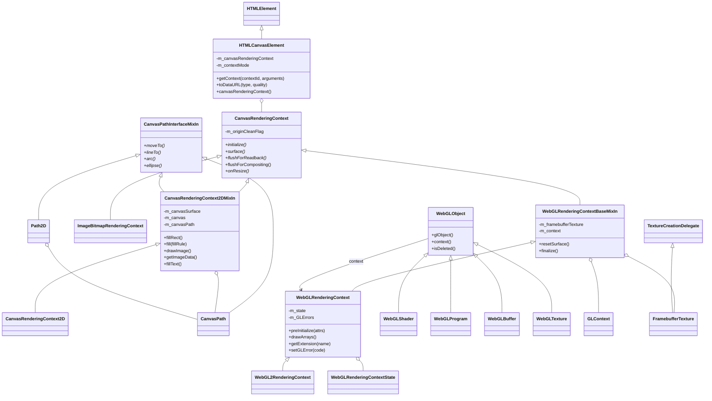
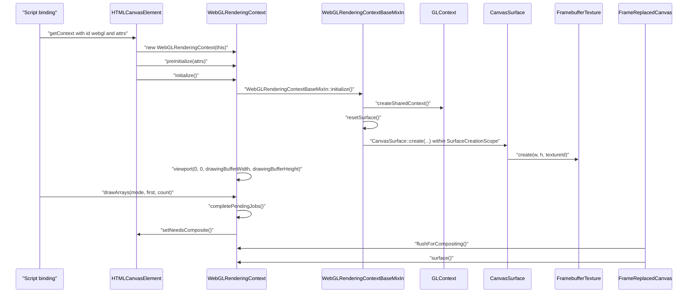

# Functional Requirements: core-dom-canvas

> **Relevant source files**
>
> - [src/core/dom/canvas/HTMLCanvasElement.cpp](src:src/core/dom/canvas/HTMLCanvasElement.cpp)
> - [src/core/dom/canvas/HTMLCanvasElement.h](src:src/core/dom/canvas/HTMLCanvasElement.h)
> - [src/core/dom/canvas/CanvasRenderingContext.h](src:src/core/dom/canvas/CanvasRenderingContext.h)
> - [src/core/dom/canvas/CanvasRenderingContext.cpp](src:src/core/dom/canvas/CanvasRenderingContext.cpp)
> - [src/core/dom/canvas/CanvasRenderingContext2DMixIn.h](src:src/core/dom/canvas/CanvasRenderingContext2DMixIn.h)
> - [src/core/dom/canvas/CanvasRenderingContext2DMixIn.cpp](src:src/core/dom/canvas/CanvasRenderingContext2DMixIn.cpp)
> - [src/core/dom/canvas/CanvasImageSource.cpp](src:src/core/dom/canvas/CanvasImageSource.cpp)
> - [src/core/dom/canvas/ImageData.cpp](src:src/core/dom/canvas/ImageData.cpp)
> - [src/core/dom/canvas/webgl/WebGLRenderingContext.h](src:src/core/dom/canvas/webgl/WebGLRenderingContext.h)
> - [src/core/dom/canvas/webgl/WebGLRenderingContext.cpp](src:src/core/dom/canvas/webgl/WebGLRenderingContext.cpp)
> - [src/core/dom/canvas/webgl/WebGLRenderingContextBaseMixIn.cpp](src:src/core/dom/canvas/webgl/WebGLRenderingContextBaseMixIn.cpp)
> - [src/core/dom/canvas/webgl/WebGL2RenderingContext.h](src:src/core/dom/canvas/webgl/WebGL2RenderingContext.h)

**Module**: [`CanvasRenderingContext2DMixIn.h`](src:src/core/dom/canvas/CanvasRenderingContext2DMixIn.h)
**Version**: 2026-09-10
**Linked Design Card**: [modules/core-dom-canvas.md](../modules/core-dom-canvas.md)
**Analysis basis**: AST export and direct source reading

## Overview

The module implements the `<canvas>` element ([`HTMLCanvasElement`](src:src/core/dom/canvas/HTMLCanvasElement.h#L39)) and the rendering contexts it can hand out: a 2D context ([`CanvasRenderingContext2D`](src:src/core/dom/canvas/CanvasRenderingContext2D.h#L29)), a bitmap-renderer placeholder ([`ImageBitmapRenderingContext`](src:src/core/dom/canvas/ImageBitmapRenderingContext.h#L30)), and WebGL / WebGL2 contexts ([`WebGLRenderingContext`](src:src/core/dom/canvas/webgl/WebGLRenderingContext.h#L68), [`WebGL2RenderingContext`](src:src/core/dom/canvas/webgl/WebGL2RenderingContext.h#L95)). All contexts share the abstract [`CanvasRenderingContext`](src:src/core/dom/canvas/CanvasRenderingContext.h#L29) base, whose `surface()` and `flushForCompositing()` are the only hooks the layout code uses to present canvas content ([`FrameReplacedCanvas::willCompositeStackingContext`](src:src/core/layout/FrameReplacedCanvas.cpp#L66)). 2D drawing is delegated to the platform `Canvas` abstraction ([`Canvas`](src:src/core/modules/canvas/Canvas.h#L296)), while WebGL drives a shared GL context through the renderer ([`GLContext::createSharedContext`](src:src/core/dom/canvas/webgl/gl/GLContext.cpp#L41)).

## Functional Requirements

### FR-CORE-DOM-CANVAS-001
**Rendering context acquisition on a canvas element**

| Item | Content |
|------|---------|
| **Description** | A canvas element returns a rendering context for a requested context id and remembers which kind it handed out. Supported ids are `"2d"`, `"bitmaprenderer"`, and (when WebGL is enabled) `"webgl"`, `"experimental-webgl"`, and `"webgl2"`. The first successful request fixes the element's context mode; later requests for the same kind return the same context, and requests for a different kind return null. |
| **Input** | `contextId` string and the optional script arguments list (first argument is passed to WebGL as context attributes). |
| **Output** | A union value wrapping the created or existing context, or `nullptr`; side effect: `m_contextMode` and `m_canvasRenderingContext` are set and the origin-clean flag is set to true on a new context. |
| **Preconditions** | Element is attached to a document with an execution context; for WebGL, the build defines `STARFISH_ENABLE_WEBGL`. |
| **Postconditions** | `canvasRenderingContext()` returns the created context; WebGL contexts have run `preInitialize` and `initialize`. |
| **Source** | [`HTMLCanvasElement::getContext`](src:src/core/dom/canvas/HTMLCanvasElement.cpp#L125), [`CanvasContextMode`](src:src/core/dom/canvas/HTMLCanvasElement.h#L43) |

**Acceptance criteria**:
- [ ] `getContext("2d")` on a fresh element creates a `CanvasRenderingContext2D`, sets mode `CanvasContextMode2D`, and sets the origin-clean flag to true. [`HTMLCanvasElement::getContext`](src:src/core/dom/canvas/HTMLCanvasElement.cpp#L125)
- [ ] A second `getContext("2d")` returns a union wrapping the same stored context object. [`HTMLCanvasElement::getContext`](src:src/core/dom/canvas/HTMLCanvasElement.cpp#L125)
- [ ] `getContext("webgl")` after `getContext("2d")` returns `nullptr`. [`HTMLCanvasElement::getContext`](src:src/core/dom/canvas/HTMLCanvasElement.cpp#L125)
- [ ] For `"webgl"` / `"webgl2"`, `preInitialize` receives `arguments[0]` or `scriptUndefined()` when no argument was given, and `initialize()` is called before the context is stored. [`HTMLCanvasElement::getContext`](src:src/core/dom/canvas/HTMLCanvasElement.cpp#L125)

### FR-CORE-DOM-CANVAS-002
**Canvas dimensions, defaults, and resize propagation**

| Item | Content |
|------|---------|
| **Description** | The element exposes `width`/`height` backed by its attributes with defaults of 300x150, reflects them into presentation style, and notifies the active context when either attribute changes so the context can rebuild its drawing buffer. Drawing-buffer dimensions are clamped: zero becomes 1 and sizes are limited by the compositor's maximum texture size. |
| **Input** | `width`/`height` attribute values (parsed as integers); attribute-change notifications. |
| **Output** | `width()`/`height()` values; CSS width/height style pairs; `onResize()` invoked on the context; style-recalc and layout flags set on the element. |
| **Preconditions** | For resize propagation, a context must already exist. |
| **Postconditions** | 2D context: surface and canvas are finalized and re-created, then `setNeedsComposite()`; WebGL: `resetSurface()` re-creates the framebuffer texture and rebinds the default framebuffer. |
| **Source** | [`HTMLCanvasElement::didAttributeChanged`](src:src/core/dom/canvas/HTMLCanvasElement.cpp#L40), [`CanvasRenderingContext::calculateDimension`](src:src/core/dom/canvas/CanvasRenderingContext.cpp#L35) |

**Acceptance criteria**:
- [ ] Without a `width` attribute, `width()` returns `STARFISH_CANVAS_DEFAULT_WIDTH` (300); without `height`, `height()` returns 150. [`HTMLCanvasElement::width`](src:src/core/dom/canvas/HTMLCanvasElement.cpp#L95), [`HTMLCanvasElement.h`](src:src/core/dom/canvas/HTMLCanvasElement.h#L29)
- [ ] `setWidth(v)` writes the `width` attribute as a string; a change to `width` or `height` calls `onResize()` on the context and marks style and layout dirty. [`HTMLCanvasElement::setWidth`](src:src/core/dom/canvas/HTMLCanvasElement.cpp#L105), [`HTMLCanvasElement::didAttributeChanged`](src:src/core/dom/canvas/HTMLCanvasElement.cpp#L40)
- [ ] `styleForPresentationAttribute` adds `Width`/`Height` CSS pairs from the attributes, treating the unit as px. [`HTMLCanvasElement::styleForPresentationAttribute`](src:src/core/dom/canvas/HTMLCanvasElement.cpp#L58)
- [ ] `calculateDimension` maps a 0 (or non-finite) dimension to 1 and never exceeds `Compositor::maximumTextureSize` on either axis. [`CanvasRenderingContext::calculateDimension`](src:src/core/dom/canvas/CanvasRenderingContext.cpp#L35)
- [ ] 2D `onResize` runs `finalize()` then `initialize()` and requests compositing. [`CanvasRenderingContext2DMixIn::onResize`](src:src/core/dom/canvas/CanvasRenderingContext2DMixIn.cpp#L361)

### FR-CORE-DOM-CANVAS-003
**2D drawing-state defaults, save/restore, and transforms**

| Item | Content |
|------|---------|
| **Description** | On creation the 2D context establishes the default drawing state (line width 1, butt caps, miter joins, miter limit 10, empty dash list, smoothing enabled/low, font "10px sans-serif", zero shadows, black fill/stroke, alpha 1) and offers a state stack plus affine transform operations. Invalid attribute values are ignored rather than applied. |
| **Input** | Attribute setters (`setLineWidth`, `setGlobalAlpha`, `setLineDash`, `setGlobalCompositeOperation`, ...) and transform calls (`scale`, `rotate`, `translate`, `transform`, `setTransform`, `resetTransform`). |
| **Output** | State forwarded to the platform `Canvas`; `save()` pushes the current state including the path transform, `restore()` pops it and re-applies the path matrix. |
| **Preconditions** | `m_canvas` has been created by `initialize()`. |
| **Postconditions** | Subsequent drawing uses the updated state; transforms are skipped when the current matrix is non-invertible. |
| **Source** | [`CanvasRenderingContext2DMixIn::initialize`](src:src/core/dom/canvas/CanvasRenderingContext2DMixIn.cpp#L289), [`CanvasRenderingContext2DMixIn::save`](src:src/core/dom/canvas/CanvasRenderingContext2DMixIn.cpp#L468) |

**Acceptance criteria**:
- [ ] After `initialize()`, the canvas has fill and stroke color black (0,0,0,255), global alpha 1.0, and the surface cleared to transparent. [`CanvasRenderingContext2DMixIn::initialize`](src:src/core/dom/canvas/CanvasRenderingContext2DMixIn.cpp#L289)
- [ ] `setGlobalAlpha` ignores non-finite values and values outside [0, 1]. [`CanvasRenderingContext2DMixIn::setGlobalAlpha`](src:src/core/dom/canvas/CanvasRenderingContext2DMixIn.cpp#L600)
- [ ] `setLineDash` ignores lists containing negative or non-finite entries and duplicates odd-length lists before applying them. [`CanvasRenderingContext2DMixIn::setLineDash`](src:src/core/dom/canvas/CanvasRenderingContext2DMixIn.cpp#L434)
- [ ] `setGlobalCompositeOperation` matches the value against the composite-operator name table first, then the blend-mode table; unknown names leave the state unchanged. [`CanvasRenderingContext2DMixIn::setGlobalCompositeOperation`](src:src/core/dom/canvas/CanvasRenderingContext2DMixIn.cpp#L625)
- [ ] `save()` stores the path CTM in the canvas before `Canvas::save()`, and `restore()` restores it into the path after `Canvas::restore()`. [`CanvasRenderingContext2DMixIn::restore`](src:src/core/dom/canvas/CanvasRenderingContext2DMixIn.cpp#L484)
- [ ] `scale` is a no-op when the CTM is non-invertible. [`CanvasRenderingContext2DMixIn::scale`](src:src/core/dom/canvas/CanvasRenderingContext2DMixIn.cpp#L490)

### FR-CORE-DOM-CANVAS-004
**Path construction and fill/stroke/clip with fill rules**

| Item | Content |
|------|---------|
| **Description** | The context maintains a current path (`CanvasPath`) built from segment commands shared with `Path2D` through `CanvasPathInterfaceMixIn`, and fills, strokes, clips, or hit-tests either the current path or an explicit `Path2D`. Fill rules `"nonzero"` and `"evenodd"` are honored; unknown strings fall back to non-zero. Rectangle helpers (`fillRect`, `strokeRect`, `clearRect`) draw directly. |
| **Input** | Segment commands (`moveTo`, `lineTo`, `arc`, `ellipse`, `bezierCurveTo`, ...), an optional `Path2D`, a fill-rule string, rectangle coordinates. |
| **Output** | Pixels drawn into the canvas surface via `Canvas::fillPath` / `drawRect`; `isPointInPath` / `isPointInStroke` return booleans. |
| **Preconditions** | CTM invertible; fill style not a zero-size gradient or empty pattern (otherwise the call returns without drawing). |
| **Postconditions** | `willCanvasSurfaceUpdate()` has flagged the element for compositing; `beginPath()` resets the current path. |
| **Source** | [`CanvasRenderingContext2DMixIn::fill`](src:src/core/dom/canvas/CanvasRenderingContext2DMixIn.cpp#L1806), [`CanvasPath`](src:src/core/dom/canvas/CanvasPath.h#L32), [`CanvasFillRule`](src:src/core/dom/canvas/CanvasFillRule.h#L24) |

**Acceptance criteria**:
- [ ] `fill(fillRule)` operates on the current `CanvasPath`, and `fill(Path2D*, fillRule)` on the given path's `CanvasPath`. [`CanvasRenderingContext2DMixIn::fill`](src:src/core/dom/canvas/CanvasRenderingContext2DMixIn.cpp#L948), [`Path2D::canvasPath`](src:src/core/dom/canvas/Path2D.h#L57)
- [ ] An unrecognized fill-rule string is treated as `CanvasFillRule::NonZero`; `EvenOdd` sets the canvas fill rule to false. [`CanvasRenderingContext2DMixIn::fill`](src:src/core/dom/canvas/CanvasRenderingContext2DMixIn.cpp#L1806)
- [ ] `fillRect` returns without drawing when any coordinate is non-finite, when `w == 0 || h == 0`, or when the fill style is a zero-size gradient or empty pattern. [`CanvasRenderingContext2DMixIn::fillRect`](src:src/core/dom/canvas/CanvasRenderingContext2DMixIn.cpp#L875)
- [ ] With composite operator `Copy`, `fillRect` and `fill` clear the surface to transparent before drawing. [`CanvasRenderingContext2DMixIn::fillRect`](src:src/core/dom/canvas/CanvasRenderingContext2DMixIn.cpp#L875)
- [ ] `Path2D` and `CanvasRenderingContext2DMixIn` both implement every segment method of `CanvasPathInterfaceMixIn`. [`CanvasPathInterfaceMixIn`](src:src/core/dom/canvas/CanvasPathInterfaceMixIn.h#L29), [`Path2D`](src:src/core/dom/canvas/Path2D.h#L33)

### FR-CORE-DOM-CANVAS-005
**Fill and stroke styles: colors, gradients, patterns**

| Item | Content |
|------|---------|
| **Description** | Fill and stroke styles accept a CSS color string, a `CanvasGradient`, or a `CanvasPattern`. Gradients are created by the context (linear or radial) and receive validated color stops; patterns are created from a usable image source with a validated repetition keyword and inherit the source's origin-clean status. |
| **Input** | `CanvasStyle` union (string / gradient / pattern); gradient coordinates; `addColorStop(offset, color)`; `createPattern(image, repetition)`. |
| **Output** | Canvas fill/stroke color or `CanvasFillStrokeSource`; new `CanvasGradient` / `CanvasPattern` objects backed by `NativeGradient` / `NativePattern`. |
| **Preconditions** | Color strings must parse as CSS colors; offsets must be within [0, 1]; the image source must pass `checkUsability`. |
| **Postconditions** | Unparseable color strings leave the current style untouched; invalid inputs to gradients/patterns throw `DOMException`. |
| **Source** | [`CanvasRenderingContext2DMixIn::setFillStyle`](src:src/core/dom/canvas/CanvasRenderingContext2DMixIn.cpp#L695), [`CanvasGradient::addColorStop`](src:src/core/dom/canvas/CanvasGradient.cpp#L81), [`CanvasRenderingContext2DMixIn::createPattern`](src:src/core/dom/canvas/CanvasRenderingContext2DMixIn.cpp#L751) |

**Acceptance criteria**:
- [ ] `setFillStyle` with a string sets the fill color only when `stringToColor` succeeds; a gradient or pattern value installs a `CanvasFillStrokeSource`. [`CanvasRenderingContext2DMixIn::setFillStyle`](src:src/core/dom/canvas/CanvasRenderingContext2DMixIn.cpp#L695)
- [ ] `addColorStop` throws `INDEX_SIZE_ERR` for offsets outside [0, 1] and `SYNTAX_ERR` for an empty or unparseable color. [`CanvasGradient::addColorStop`](src:src/core/dom/canvas/CanvasGradient.cpp#L81)
- [ ] `createPattern` treats an empty repetition as `"repeat"`, accepts `"repeat"`, `"repeat-x"`, `"repeat-y"`, `"no-repeat"`, and throws `SYNTAX_ERR` otherwise. [`CanvasRenderingContext2DMixIn::createPattern`](src:src/core/dom/canvas/CanvasRenderingContext2DMixIn.cpp#L751)
- [ ] A pattern created from a non-same-origin source has its origin-clean flag set to false. [`CanvasPattern::setOriginCleanFlag`](src:src/core/dom/canvas/CanvasPattern.h#L52)
- [ ] `createLinearGradient` / `createRadialGradient` return new `CanvasGradient` objects bound to the context's execution context. [`CanvasRenderingContext2DMixIn::createLinearGradient`](src:src/core/dom/canvas/CanvasRenderingContext2DMixIn.cpp#L731)

### FR-CORE-DOM-CANVAS-006
**Image drawing with source usability and origin tainting**

| Item | Content |
|------|---------|
| **Description** | `drawImage` renders an `HTMLImageElement`, `SVGImageElement`, `HTMLCanvasElement`, or `ImageBitmap` onto the canvas after checking that the source is usable, converting it to native image data, normalizing and clipping source/destination rectangles, and marking the canvas as origin-tainted when the source is not same-origin. |
| **Input** | `CanvasImageSource` union plus 2, 4, or 8 rectangle parameters. |
| **Output** | Image pixels drawn through `Canvas`; `setOriginCleanFlag(false)` when the source is cross-origin; `DOMException` for broken or invalid sources. |
| **Preconditions** | CTM invertible; all coordinates finite. |
| **Postconditions** | Zero-sized source rects default to the image's natural size; zero destination sizes default to the source size; the element is flagged for compositing. |
| **Source** | [`CanvasRenderingContext2DMixIn::drawImage`](src:src/core/dom/canvas/CanvasRenderingContext2DMixIn.cpp#L1432), [`CanvasImageSourceUtils::checkUsability`](src:src/core/dom/canvas/CanvasImageSource.cpp#L41) |

**Acceptance criteria**:
- [ ] An image whose data equals the document's broken image throws `INVALID_STATE_ERR`; an image with a request error or zero-sized data returns without drawing. [`CanvasImageSourceUtils::checkUsability`](src:src/core/dom/canvas/CanvasImageSource.cpp#L41)
- [ ] A canvas source with width or height 0, or a detached `ImageBitmap`, throws `INVALID_STATE_ERR`. [`CanvasImageSourceUtils::checkUsability`](src:src/core/dom/canvas/CanvasImageSource.cpp#L41)
- [ ] `drawImage` with 8 arguments clips the source rectangle to the image bounds and the destination rectangle to the surface bounds before drawing. [`CanvasRenderingContext2DMixIn::drawImage`](src:src/core/dom/canvas/CanvasRenderingContext2DMixIn.cpp#L1432)
- [ ] When `toNativeImageData` reports the source as not same-origin (`pair.second == false`), the context's origin-clean flag is cleared. [`CanvasImageSourceUtils::toNativeImageData`](src:src/core/dom/canvas/CanvasImageSource.cpp#L107)
- [ ] `createImageBitmap` in the global scope reuses the same usability and conversion helpers. [`WindowOrWorkerGlobalScope.cpp`](src:src/core/page/WindowOrWorkerGlobalScope.cpp#L349)

### FR-CORE-DOM-CANVAS-007
**Pixel access (ImageData) and data-URL export**

| Item | Content |
|------|---------|
| **Description** | Scripts can create `ImageData` objects, read canvas pixels into a new `ImageData` (`getImageData`), write pixels back (`putImageData`), and export the canvas as a PNG or JPEG data URL (`toDataURL`). Read-back is blocked on origin-tainted canvases. `ImageData` validates its dimensions and buffer length and is structured-cloneable. |
| **Input** | Rectangle coordinates; `ImageData` (width, height, optional `Uint8ClampedArray`); image MIME type string and quality for `toDataURL`. |
| **Output** | `ImageData` with an RGBA `Uint8ClampedArray`; pixels written into the surface; a `data:` URL string (or `"data:,"` when no surface). |
| **Preconditions** | Origin-clean flag true for `getImageData` / `toDataURL`; `sw`/`sh` non-zero and `4*sw*sh` not overflowing. |
| **Postconditions** | `getImageData` flushes pending drawing first (`flushForReadback`) and un-premultiplies alpha when the port requires it; `toDataURL` encodes with the port's pixel order. |
| **Source** | [`CanvasRenderingContext2DMixIn::getImageData`](src:src/core/dom/canvas/CanvasRenderingContext2DMixIn.cpp#L1554), [`ImageData`](src:src/core/dom/canvas/ImageData.cpp#L42), [`HTMLCanvasElement::toDataURL`](src:src/core/dom/canvas/HTMLCanvasElement.cpp#L193) |

**Acceptance criteria**:
- [ ] `getImageData` throws `INDEX_SIZE_ERR` when `sw == 0 || sh == 0` or when `4*sw*sh` overflows, and `SECURITY_ERR` when the origin-clean flag is false; negative `sw`/`sh` are normalized by shifting the origin. [`CanvasRenderingContext2DMixIn::getImageData`](src:src/core/dom/canvas/CanvasRenderingContext2DMixIn.cpp#L1554)
- [ ] `ImageData(sw, sh)` throws `INDEX_SIZE_ERR` for zero or overflowing sizes; `ImageData(data, sw, sh?)` throws `INVALID_STATE_ERR` when the byte length is 0 or not a multiple of 4 and `INDEX_SIZE_ERR` when the length does not divide by `sw` or disagrees with `sh`. [`ImageData`](src:src/core/dom/canvas/ImageData.cpp#L42), [`ImageData`](src:src/core/dom/canvas/ImageData.cpp#L63)
- [ ] `putImageData` throws `INVALID_STATE_ERR` when the `ImageData` buffer is detached and normalizes negative dirty width/height. [`CanvasRenderingContext2DMixIn::putImageData`](src:src/core/dom/canvas/CanvasRenderingContext2DMixIn.cpp#L1670)
- [ ] `toDataURL` throws `SECURITY_ERR` on a tainted context, supports `"image/png"` and `"image/jpeg"`, and defaults quality to `DefaultQuality` (0.92). [`HTMLCanvasElement::toDataURL`](src:src/core/dom/canvas/HTMLCanvasElement.cpp#L187), [`HTMLCanvasElement.h`](src:src/core/dom/canvas/HTMLCanvasElement.h#L41)
- [ ] `ImageData` implements `serialize` / `deserialize` and `SerializedImageData::createDeserializingInstance`. [`ImageData::serialize`](src:src/core/dom/canvas/ImageData.cpp#L134), [`SerializedImageData`](src:src/core/dom/canvas/ImageData.h#L73)

### FR-CORE-DOM-CANVAS-008
**Text drawing and measurement**

| Item | Content |
|------|---------|
| **Description** | The 2D context parses the CSS `font` shorthand into a loaded `Font`, draws filled or stroked text at a position with optional `maxWidth` compression, honors `textAlign`, `textBaseline`, and `direction`, and reports text width through `TextMetrics`. A fast path is used when eligible; otherwise the general text-layout path is taken. |
| **Input** | `font` string; text string; `x`, `y`; optional `maxWidth`; `textAlign` / `textBaseline` / `direction` strings. |
| **Output** | Glyphs drawn into the surface; `TextMetrics` whose `width` is the measured advance (other metrics are reported as 0). |
| **Preconditions** | `x` and `y` finite; a `FontSelector` exists on the document. |
| **Postconditions** | `Canvas::setFont` and `setOriginalFontStr` reflect the parsed font; when the family is missing the WebView's initial font family is used. |
| **Source** | [`CanvasRenderingContext2DMixIn::setFont`](src:src/core/dom/canvas/CanvasRenderingContext2DMixIn.cpp#L1953), [`CanvasRenderingContext2DMixIn::fillText`](src:src/core/dom/canvas/CanvasRenderingContext2DMixIn.cpp#L1331), [`CanvasRenderingContext2DMixIn::measureText`](src:src/core/dom/canvas/CanvasRenderingContext2DMixIn.cpp#L1382) |

**Acceptance criteria**:
- [ ] `setFont` tokenizes the string, parses the font shorthand, maps weights 100–900/normal/bold to 1–9, and falls back to a 10px size and the initial family when absent. [`CanvasRenderingContext2DMixIn::setFont`](src:src/core/dom/canvas/CanvasRenderingContext2DMixIn.cpp#L1953)
- [ ] `fillText` returns without drawing when `x` or `y` is non-finite; when `maxWidth` is provided and the measured length exceeds it, compression is enabled. [`CanvasRenderingContext2DMixIn::fillText`](src:src/core/dom/canvas/CanvasRenderingContext2DMixIn.cpp#L1331)
- [ ] `measureText` refreshes the font if needed and returns a `TextMetrics` whose `width` equals `Font::measureText` of the input. [`CanvasRenderingContext2DMixIn::measureText`](src:src/core/dom/canvas/CanvasRenderingContext2DMixIn.cpp#L1382), [`TextMetrics`](src:src/core/dom/canvas/TextMetrics.h#L28)
- [ ] `textAlign`, `textBaseline`, and `direction` setters accept only the enumerated values (`CanvasTextAlign`, `CanvasTextBaseline`, `CanvasDirection`). [`CanvasRenderingContext2DMixIn::setTextAlign`](src:src/core/dom/canvas/CanvasRenderingContext2DMixIn.cpp#L2075), [`CanvasTextAlign`](src:src/core/dom/canvas/CanvasTextAlign.h#L24)

### FR-CORE-DOM-CANVAS-009
**WebGL context creation on a shared GL context with an offscreen framebuffer**

| Item | Content |
|------|---------|
| **Description** | A WebGL context parses script-provided context attributes, creates a GL context shared with the renderer, allocates a `CanvasSurface` whose texture is backed by a `FramebufferTexture` (color texture plus optional depth/stencil attachments), registers a disposer so GL resources are released with the window, and initializes the viewport to the drawing-buffer size. |
| **Input** | Optional attributes object (`alpha`, `depth`, `stencil`, `antialias`, `premultipliedAlpha`, `preserveDrawingBuffer`, `failIfMajorPerformanceCaveat`, `desynchronized`, `powerPreference`); element width/height. |
| **Output** | A live `GLContext`, `m_canvasSurface` with `FlipYNeeded` set, `m_framebufferTexture` with a bound FBO, viewport `(0, 0, drawingBufferWidth, drawingBufferHeight)`. |
| **Preconditions** | `preInitialize` has run exactly once before `initialize`; the renderer can create a shared context. |
| **Postconditions** | `surface()` returns the GL-backed surface; `getContextAttributes()` reflects the parsed values; the element is flagged for compositing. |
| **Source** | [`WebGLRenderingContext::preInitialize`](src:src/core/dom/canvas/webgl/WebGLRenderingContext.cpp#L121), [`WebGLRenderingContextBaseMixIn::initialize`](src:src/core/dom/canvas/webgl/WebGLRenderingContextBaseMixIn.cpp#L50), [`WebGLRenderingContextBaseMixIn::resetSurface`](src:src/core/dom/canvas/webgl/WebGLRenderingContextBaseMixIn.cpp#L77) |

**Acceptance criteria**:
- [ ] Boolean attributes are only applied when the script value is a boolean; `powerPreference` only when it is a string; the framebuffer attributes copy `alpha`, `antialias`, `depth`, `stencil`. [`WebGLRenderingContext::preInitialize`](src:src/core/dom/canvas/webgl/WebGLRenderingContext.cpp#L121), [`WebGLContextAttributes`](src:src/core/dom/canvas/webgl/WebGLContextAttributes.h#L35)
- [ ] `initialize` asserts that attributes were checked, creates a shared context via `Renderer::createSharedContext`, and logs an error if that fails. [`WebGLRenderingContextBaseMixIn::initialize`](src:src/core/dom/canvas/webgl/WebGLRenderingContextBaseMixIn.cpp#L50), [`GLContext::createSharedContext`](src:src/core/dom/canvas/webgl/gl/GLContext.cpp#L41)
- [ ] `resetSurface` creates the `CanvasSurface` inside a `SurfaceCreationScope` holding the `FramebufferTexture`, so the compositor's surface calls `FramebufferTexture::create` to obtain the texture id. [`WebGLRenderingContextBaseMixIn::resetSurface`](src:src/core/dom/canvas/webgl/WebGLRenderingContextBaseMixIn.cpp#L77), [`FramebufferTexture::create`](src:src/core/dom/canvas/webgl/gl/FramebufferTexture.cpp#L125), [`CanvasSurfaceGL`](src:src/platform/canvas/CompositorGL.cpp#L2795)
- [ ] `FramebufferTexture::create` fails (returns false with an error log) when the FBO is incomplete or a requested depth/stencil attachment was not allocated. [`FramebufferTexture::create`](src:src/core/dom/canvas/webgl/gl/FramebufferTexture.cpp#L125)
- [ ] After base initialization, `WebGLRenderingContext::initialize` sets the viewport to the drawing-buffer size and binds the framebuffer texture's FBO. [`WebGLRenderingContext::initialize`](src:src/core/dom/canvas/webgl/WebGLRenderingContext.cpp#L182)
- [ ] `finalize` makes the context current, drops the framebuffer texture, destroys the GL context, and clears the surface pointer; it is registered both as a GC finalizer and as a window disposer. [`WebGLRenderingContextBaseMixIn::finalize`](src:src/core/dom/canvas/webgl/WebGLRenderingContextBaseMixIn.cpp#L133)

### FR-CORE-DOM-CANVAS-010
**WebGL object lifecycle, validation, and error reporting**

| Item | Content |
|------|---------|
| **Description** | The context creates script-visible wrappers (`WebGLBuffer`, `WebGLShader`, `WebGLProgram`, `WebGLTexture`, `WebGLFramebuffer`, `WebGLRenderbuffer`, ...) around GL object names, validates that objects passed back belong to the same context and are not deleted, tracks bindings and enabled attribute arrays in `WebGLRenderingContextState`, and records errors in a queue that `getError` drains one code at a time. |
| **Input** | GL enums and parameters from script; `WebGLObject`-derived arguments. |
| **Output** | New `WebGLObject` wrappers; GL calls through the `GL` dispatch object; queued `GLenum` error codes. |
| **Preconditions** | Every entry point enters `ENTER_CONTEXT_SCOPE`, which returns the bail-out value if the GL context cannot be made current. |
| **Postconditions** | Deleted objects are marked via `markDeleted`; `linkProgram` records link failure on the program, including attribute-location overlap or overflow checks. |
| **Source** | [`WebGLObject`](src:src/core/dom/canvas/webgl/WebGLObject.h#L33), [`WebGLRenderingContext::setGLError`](src:src/core/dom/canvas/webgl/WebGLRenderingContext.cpp#L3775), [`WebGLRenderingContext::linkProgram`](src:src/core/dom/canvas/webgl/WebGLRenderingContext.cpp#L2167) |

**Acceptance criteria**:
- [ ] `createShader` with a type other than `GL_VERTEX_SHADER` / `GL_FRAGMENT_SHADER` records `GL_INVALID_ENUM` and returns `nullptr`. [`WebGLRenderingContext::createShader`](src:src/core/dom/canvas/webgl/WebGLRenderingContext.cpp#L780)
- [ ] `compileShader`, `linkProgram`, `useProgram`, and the `delete*` functions record `GL_INVALID_OPERATION` when the object was created by another context. [`WebGLRenderingContext::compileShader`](src:src/core/dom/canvas/webgl/WebGLRenderingContext.cpp#L703), [`WebGLRenderingContext::isFromCurrentContext`](src:src/core/dom/canvas/webgl/WebGLRenderingContext.cpp#L3842), [`WebGLRenderingContext.cpp`](src:src/core/dom/canvas/webgl/WebGLRenderingContext.cpp#L833)
- [ ] `bindBuffer` rejects binding a buffer to a target different from the one it was first bound to (`GL_INVALID_OPERATION`), records the binding in the state, and fixes the buffer's target once. [`WebGLRenderingContext::bindBuffer`](src:src/core/dom/canvas/webgl/WebGLRenderingContext.cpp#L479), [`WebGLBuffer::setTargetOnce`](src:src/core/dom/canvas/webgl/WebGLBuffer.cpp#L33)
- [ ] `linkProgram` sets `linkFailed` when `GL_LINK_STATUS` is not `GL_TRUE`, when an attribute's locations exceed `GL_MAX_VERTEX_ATTRIBS`, or when two active attributes overlap in location. [`WebGLRenderingContext::linkProgram`](src:src/core/dom/canvas/webgl/WebGLRenderingContext.cpp#L2167), [`WebGLProgram::setLinkFailed`](src:src/core/dom/canvas/webgl/WebGLProgram.h#L45)
- [ ] `getError` first pulls any pending GL error into the queue, then returns and removes one queued code, or `GL_NO_ERROR` when empty. [`WebGLRenderingContext::getError`](src:src/core/dom/canvas/webgl/WebGLRenderingContext.cpp#L333), [`WebGLRenderingContext::hasNewGLError`](src:src/core/dom/canvas/webgl/WebGLRenderingContext.cpp#L3795)
- [ ] Enabled attribute arrays and buffer-to-attribute bindings are tracked per vertex-array object in `WebGLRenderingContextState`. [`WebGLRenderingContextState::enableVertexAttribArray`](src:src/core/dom/canvas/webgl/WebGLRenderingContextState.cpp#L45), [`WebGLRenderingContextState::getBufferBoundToVertexAttributes`](src:src/core/dom/canvas/webgl/WebGLRenderingContextState.cpp#L52)

### FR-CORE-DOM-CANVAS-011
**WebGL draw submission, per-frame presentation, and read-back**

| Item | Content |
|------|---------|
| **Description** | Draw calls validate the current program and attribute/buffer state, run any pending between-frame job (clearing the drawing buffer unless `preserveDrawingBuffer` is set), issue the GL draw, and request compositing. Presentation hands the GPU texture to the compositor without CPU read-back; explicit read-back (`toDataURL`, `getImageData` on the surface) reads the framebuffer into the surface buffer, flips it vertically, and swaps to the port's pixel order. `readPixels` validates typed-array/type and format/type combinations. |
| **Input** | Draw mode, first/count or element type/offset; `readPixels` rectangle, format, type, destination view. |
| **Output** | GL draw commands; `HTMLCanvasElement::setNeedsComposite()`; surface buffer filled by `flushForReadback`; pixels written into the script view. |
| **Preconditions** | A program is current; every enabled attribute array has a buffer bound. |
| **Postconditions** | After `flushForCompositing`, `m_hasPendingJobsBetweenFrames` is true so the next draw clears the buffer as required. |
| **Source** | [`WebGLRenderingContext::drawArrays`](src:src/core/dom/canvas/webgl/WebGLRenderingContext.cpp#L906), [`WebGLRenderingContext::completePendingJobs`](src:src/core/dom/canvas/webgl/WebGLRenderingContext.cpp#L3907), [`WebGLRenderingContext::flushForReadback`](src:src/core/dom/canvas/webgl/WebGLRenderingContext.cpp#L210) |

**Acceptance criteria**:
- [ ] `drawArrays` records `GL_INVALID_VALUE` for a negative `first`, `GL_INVALID_OPERATION` when no program is current or when an enabled attribute array has no bound buffer, and otherwise draws and requests compositing. [`WebGLRenderingContext::drawArrays`](src:src/core/dom/canvas/webgl/WebGLRenderingContext.cpp#L906)
- [ ] When `preserveDrawingBuffer` is false, the first draw after compositing clears color (and depth/stencil if enabled by the attributes) to default values, unless the script already set the corresponding clear value (`m_pendingClearMask`). [`WebGLRenderingContext::completePendingJobs`](src:src/core/dom/canvas/webgl/WebGLRenderingContext.cpp#L3907)
- [ ] `flushForCompositing` only flushes drawing commands and marks pending jobs; it does not read back pixels. [`WebGLRenderingContext::flushForCompositing`](src:src/core/dom/canvas/webgl/WebGLRenderingContext.cpp#L279)
- [ ] `flushForReadback` reads `GL_RGBA`/`GL_UNSIGNED_BYTE` from the framebuffer texture's FBO into the mapped surface buffer, restores the previous pack state and read-framebuffer binding, and flips rows vertically. [`WebGLRenderingContext::flushForReadback`](src:src/core/dom/canvas/webgl/WebGLRenderingContext.cpp#L210)
- [ ] `readPixels` records `GL_INVALID_OPERATION` when the view type does not match `type`, `GL_INVALID_ENUM` for luminance formats with `GL_UNSIGNED_BYTE`, and `GL_INVALID_OPERATION` for format/type pairs other than RGBA/UNSIGNED_BYTE or the implementation-chosen pair. [`WebGLRenderingContext::readPixels`](src:src/core/dom/canvas/webgl/WebGLRenderingContext.cpp#L2833)

### FR-CORE-DOM-CANVAS-012
**WebGL extensions and WebGL2 feature set**

| Item | Content |
|------|---------|
| **Description** | A process-wide registry inspects the device's GL extension string once and exposes generators for the supported WebGL extension objects; `getExtension` returns the same object for repeated case-insensitive requests. `WebGL2RenderingContext` extends the WebGL1 context with WebGL2 objects (query, sampler, sync, transform feedback, vertex array) and entry points such as sync objects, indexed buffer bindings, unsigned-integer uniforms, integer vertex attributes, and offset/length overloads of buffer and uniform functions. |
| **Input** | Extension name string; WebGL2 parameters (sync conditions, buffer indices, `srcOffset`/`length`, ...). |
| **Output** | Script objects for extensions (or none when unsupported); `WebGLSync`, `WebGLVertexArrayObject`, and other WebGL2 wrappers. |
| **Preconditions** | The registry is initialized from the renderer's `GL` on first `WebGLRenderingContext` construction. |
| **Postconditions** | Enabled extensions are cached in `m_enabledExtensions`; `getSupportedExtensions` lists exactly the registered generators. |
| **Source** | [`WebGLExtensionRegistry::initialize`](src:src/core/dom/canvas/webgl/WebGLExtensions.cpp#L51), [`WebGLRenderingContext::getExtension`](src:src/core/dom/canvas/webgl/WebGLRenderingContext.cpp#L411), [`WebGL2RenderingContext`](src:src/core/dom/canvas/webgl/WebGL2RenderingContext.h#L95) |

**Acceptance criteria**:
- [ ] The registry registers `OES_texture_float`, `OES_texture_half_float`, `OES_standard_derivatives`, `WEBGL_depth_texture` (from `OES_depth_texture`), `EXT_texture_filter_anisotropic`, `OES_texture_float_linear`, `EXT_blend_minmax`, and `OES_vertex_array_object` only when the device's extension string contains the corresponding GL extension. [`WebGLExtensionRegistry::initialize`](src:src/core/dom/canvas/webgl/WebGLExtensions.cpp#L51)
- [ ] `getExtension` returns the cached object for a name already enabled (case-insensitive map) and an empty optional when no generator exists. [`WebGLRenderingContext::getExtension`](src:src/core/dom/canvas/webgl/WebGLRenderingContext.cpp#L411), [`CaseInsensitiveHash`](src:src/core/dom/canvas/webgl/WebGLUtils.h#L29)
- [ ] `OES_vertex_array_object::bindVertexArrayOES` records `GL_INVALID_OPERATION` for a foreign or deleted object and updates the state's current OES vertex array. [`OES_vertex_array_object::bindVertexArrayOES`](src:src/core/dom/canvas/webgl/WebGLOES_VertexArrayObject.cpp#L105)
- [ ] `WebGL2RenderingContext::bindVertexArray` rejects foreign or deleted objects, binds the GL VAO, marks it as ever bound, and records it in state. [`WebGL2RenderingContext::bindVertexArray`](src:src/core/dom/canvas/webgl/WebGL2RenderingContext.cpp#L1440)
- [ ] `fenceSync` wraps the GL sync object in a `WebGLSync` bound to the context. [`WebGL2RenderingContext::fenceSync`](src:src/core/dom/canvas/webgl/WebGL2RenderingContext.cpp#L1120), [`WebGLSync`](src:src/core/dom/canvas/webgl/WebGL2RenderingContext.h#L50)
- [ ] WebGL2 texture uploads validate internal format/format/type with the WebGL2 table and accept typed arrays matching the GL type list in `isSrcDataValid`. [`WebGL2RenderingContext::checkInternalFormat`](src:src/core/dom/canvas/webgl/WebGL2RenderingContext.cpp#L1577), [`WebGL2RenderingContext::isSrcDataValid`](src:src/core/dom/canvas/webgl/WebGL2RenderingContext.cpp#L1592)
- [ ] Entry points marked `[Unimplemented]` in the WebGL2 interface definition (for example `texStorage2D`, `texStorage3D`, `renderbufferStorageMultisample`) have no C++ implementation in this module. [`WebGL2RenderingContext.idl`](src:src/core/dom/canvas/webgl/WebGL2RenderingContext.idl#L339)

## Non-Functional Requirements

| Item | Requirement | Source |
|------|-------------|--------|
| Performance | WebGL presentation avoids CPU read-back per frame: `flushForCompositing` only flushes GL commands because the compositor consumes the GPU texture directly. | [`WebGLRenderingContext::flushForCompositing`](src:src/core/dom/canvas/webgl/WebGLRenderingContext.cpp#L279) |
| Performance | `GLContext::setCurrent` skips `makeCurrent` when the requested context is already current. | [`GLContext::setCurrent`](src:src/core/dom/canvas/webgl/gl/GLContext.cpp#L54) |
| Performance | 2D text drawing uses a fast path when `canUseFastPathText` holds. | [`CanvasRenderingContext2DMixIn::canUseFastPathText`](src:src/core/dom/canvas/CanvasRenderingContext2DMixIn.cpp#L1131) |
| Security | Origin-clean tracking blocks `toDataURL` and `getImageData` with `SECURITY_ERR` after a cross-origin image is drawn or used as a pattern. | [`HTMLCanvasElement::toDataURL`](src:src/core/dom/canvas/HTMLCanvasElement.cpp#L193), [`CanvasRenderingContext2DMixIn::getImageData`](src:src/core/dom/canvas/CanvasRenderingContext2DMixIn.cpp#L1554) |
| Security | WebGL objects from a different context are rejected with `GL_INVALID_OPERATION`. | [`WebGLRenderingContext::isFromCurrentContext`](src:src/core/dom/canvas/webgl/WebGLRenderingContext.cpp#L3842) |
| Error handling | Size computations for pixel buffers use overflow-checked arithmetic and throw `INDEX_SIZE_ERR` on overflow. | [`CanvasRenderingContext2DMixIn::getImageData`](src:src/core/dom/canvas/CanvasRenderingContext2DMixIn.cpp#L1554), [`ImageData`](src:src/core/dom/canvas/ImageData.cpp#L42) |
| Error handling | Each WebGL entry point bails out early when the GL context cannot be made current. | [`WebGLRenderingContext.cpp`](src:src/core/dom/canvas/webgl/WebGLRenderingContext.cpp#L307) |
| Error handling | GL resources are released via a window disposer in addition to the GC finalizer, so GL calls are not made after the display is disconnected. | [`WebGLRenderingContextBaseMixIn::initialize`](src:src/core/dom/canvas/webgl/WebGLRenderingContextBaseMixIn.cpp#L50) |
| Logging | WebGL errors and context-scope failures are traced under the `WEBGL` trace category; GL context creation failure logs an error. | [`WebGLRenderingContext::setGLError`](src:src/core/dom/canvas/webgl/WebGLRenderingContext.cpp#L3775), [`WebGLRenderingContextBaseMixIn::initialize`](src:src/core/dom/canvas/webgl/WebGLRenderingContextBaseMixIn.cpp#L50) |
| Logging | The registry logs each WebGL extension the device lacks. | [`WebGLExtensionRegistry::initialize`](src:src/core/dom/canvas/webgl/WebGLExtensions.cpp#L51) |

## Constraints

- The module compiles only with `STARFISH_ENABLE_CANVAS`; WebGL sources additionally require `STARFISH_ENABLE_WEBGL`. [`CanvasRenderingContext.h`](src:src/core/dom/canvas/CanvasRenderingContext.h#L23), [`WebGLRenderingContext.h`](src:src/core/dom/canvas/webgl/WebGLRenderingContext.h#L23), [`config.cmake`](src:build/config.cmake#L362)
- 2D geometry is computed in `float` rather than `double` (header note about a cairo defect). [`CanvasRenderingContext2DMixIn.h`](src:src/core/dom/canvas/CanvasRenderingContext2DMixIn.h#L82)
- Drawing-buffer dimensions are capped by `Compositor::maximumTextureSize`. [`CanvasRenderingContext::calculateDimension`](src:src/core/dom/canvas/CanvasRenderingContext.cpp#L35)
- A `WebGLBuffer` may be bound to only one target in its lifetime. [`WebGLRenderingContext::bindBuffer`](src:src/core/dom/canvas/webgl/WebGLRenderingContext.cpp#L479)
- `ImageBitmapRenderingContext` is a placeholder: `initialize`, `flushForReadback`, `onResize`, and `surface` hit `STARFISH_UNSUPPORTED_METHOD`. [`ImageBitmapRenderingContext`](src:src/core/dom/canvas/ImageBitmapRenderingContext.h#L30)
- `HTMLVideoElement` is not accepted as a canvas image source (`STARFISH_UNSUPPORTED`). [`CanvasImageSourceUtils::checkUsability`](src:src/core/dom/canvas/CanvasImageSource.cpp#L41)
- `toDataURL` encoding is compiled out under `STARFISH_HEADLESS` (returns `"data:,"`). [`HTMLCanvasElement::toDataURL`](src:src/core/dom/canvas/HTMLCanvasElement.cpp#L193)
- Only one `SurfaceCreationScope` may be active at a time (static delegate, asserted null on entry). [`SurfaceCreationScope`](src:src/core/dom/canvas/webgl/gl/SurfaceCreationScope.cpp#L27)

## Module Design Card Linkage

| FR | Implementation | Design Card section |
|----|----------------|---------------------|
| FR-CORE-DOM-CANVAS-001 | [`HTMLCanvasElement::getContext`](src:src/core/dom/canvas/HTMLCanvasElement.cpp#L125) | [Key Flow – 2D context creation](../modules/core-dom-canvas.md#key-flow) |
| FR-CORE-DOM-CANVAS-002 | [`HTMLCanvasElement::didAttributeChanged`](src:src/core/dom/canvas/HTMLCanvasElement.cpp#L40) | [Quick Navigation](../modules/core-dom-canvas.md#quick-navigation) |
| FR-CORE-DOM-CANVAS-003 | [`CanvasRenderingContext2DMixIn::initialize`](src:src/core/dom/canvas/CanvasRenderingContext2DMixIn.cpp#L289) | [Architectural Rules](../modules/core-dom-canvas.md#architectural-rules) |
| FR-CORE-DOM-CANVAS-004 | [`CanvasRenderingContext2DMixIn::fill`](src:src/core/dom/canvas/CanvasRenderingContext2DMixIn.cpp#L1806) | [Key Flow – 2D drawing and presentation](../modules/core-dom-canvas.md#key-flow) |
| FR-CORE-DOM-CANVAS-005 | [`CanvasRenderingContext2DMixIn::createPattern`](src:src/core/dom/canvas/CanvasRenderingContext2DMixIn.cpp#L751) | [Public Interface](../modules/core-dom-canvas.md#public-interface) |
| FR-CORE-DOM-CANVAS-006 | [`CanvasRenderingContext2DMixIn::drawImage`](src:src/core/dom/canvas/CanvasRenderingContext2DMixIn.cpp#L1432) | [Public Interface](../modules/core-dom-canvas.md#public-interface) |
| FR-CORE-DOM-CANVAS-007 | [`CanvasRenderingContext2DMixIn::getImageData`](src:src/core/dom/canvas/CanvasRenderingContext2DMixIn.cpp#L1554) | [IPC / Message / Interface Contracts](../modules/core-dom-canvas.md#ipc--message--interface-contracts) |
| FR-CORE-DOM-CANVAS-008 | [`CanvasRenderingContext2DMixIn::setFont`](src:src/core/dom/canvas/CanvasRenderingContext2DMixIn.cpp#L1953) | [Dependencies](../modules/core-dom-canvas.md#dependencies) |
| FR-CORE-DOM-CANVAS-009 | [`WebGLRenderingContextBaseMixIn::resetSurface`](src:src/core/dom/canvas/webgl/WebGLRenderingContextBaseMixIn.cpp#L77) | [Key Flow – WebGL context creation](../modules/core-dom-canvas.md#key-flow) |
| FR-CORE-DOM-CANVAS-010 | [`WebGLRenderingContext::setGLError`](src:src/core/dom/canvas/webgl/WebGLRenderingContext.cpp#L3775) | [Architectural Rules](../modules/core-dom-canvas.md#architectural-rules) |
| FR-CORE-DOM-CANVAS-011 | [`WebGLRenderingContext::drawArrays`](src:src/core/dom/canvas/webgl/WebGLRenderingContext.cpp#L906) | [Key Flow – WebGL draw call](../modules/core-dom-canvas.md#key-flow) |
| FR-CORE-DOM-CANVAS-012 | [`WebGLExtensionRegistry::initialize`](src:src/core/dom/canvas/webgl/WebGLExtensions.cpp#L51) | [Quick Navigation](../modules/core-dom-canvas.md#quick-navigation) |

## ENUM Definitions

| ENUM | Values | Used in | Source |
|------|--------|---------|--------|
| `HTMLCanvasElement::CanvasContextMode` | `CanvasContextModeNone`, `CanvasContextModePlaceHolder`, `CanvasContextMode2D`, `CanvasContextModeBitmapRenderer`, `CanvasContextModeWebGL`, `CanvasContextModeWebGL2` | [`HTMLCanvasElement::getContext`](src:src/core/dom/canvas/HTMLCanvasElement.cpp#L125) | [`CanvasContextMode`](src:src/core/dom/canvas/HTMLCanvasElement.h#L43) |
| `CanvasFillRule` | `NonZero`, `EvenOdd` | [`CanvasRenderingContext2DMixIn::fill`](src:src/core/dom/canvas/CanvasRenderingContext2DMixIn.cpp#L1806) | [`CanvasFillRule`](src:src/core/dom/canvas/CanvasFillRule.h#L24) |
| `CanvasTextAlign` | `Start`, `End`, `Left`, `Right`, `Center` | [`CanvasRenderingContext2DMixIn::setTextAlign`](src:src/core/dom/canvas/CanvasRenderingContext2DMixIn.cpp#L2075) | [`CanvasTextAlign`](src:src/core/dom/canvas/CanvasTextAlign.h#L24) |
| `CanvasTextBaseline` | `Top`, `Hanging`, `Middle`, `Alphabetic`, `Ideographic`, `Bottom` | [`CanvasRenderingContext2DMixIn::setTextBaseline`](src:src/core/dom/canvas/CanvasRenderingContext2DMixIn.cpp#L2089) | [`CanvasTextBaseline`](src:src/core/dom/canvas/CanvasTextBaseline.h#L24) |
| `CanvasDirection` | `Ltr`, `Rtl`, `Inherit` | [`CanvasRenderingContext2DMixIn::setDirection`](src:src/core/dom/canvas/CanvasRenderingContext2DMixIn.cpp#L2108) | [`CanvasDirection`](src:src/core/dom/canvas/CanvasDirection.h#L24) |
| `ImageSmoothingQuality` | `Low`, `Medium`, `High` | [`CanvasRenderingContext2DMixIn::setImageSmoothingQuality`](src:src/core/dom/canvas/CanvasRenderingContext2DMixIn.cpp#L667), [`toImageRenderingValue`](src:src/core/dom/canvas/ImageSmoothingQuality.cpp#L26) | [`ImageSmoothingQuality`](src:src/core/dom/canvas/ImageSmoothingQuality.h#L24) |
| `WebGLPowerPreference` | `DEFAULT`, `LOW_POWER`, `HIGH_PERFORMANCE` | [`WebGLContextAttributes::setPowerPreference`](src:src/core/dom/canvas/webgl/WebGLContextAttributes.cpp#L42) | [`WebGLPowerPreference`](src:src/core/dom/canvas/webgl/WebGLContextAttributes.h#L33) |
| `TextureCreationDelegate::Type` | `FrameBuffer` | [`CanvasSurfaceGL`](src:src/platform/canvas/CompositorGL.cpp#L2795) | [`TextureCreationDelegate`](src:src/core/dom/canvas/webgl/gl/SurfaceCreationScope.h#L29) |

## Error Code Definitions

None found in code (errors are reported as `DOMException` codes and queued GL `GLenum` values; no `error_code`-typed or `ERR_`/`ERROR_`/`EXIT_` constants are defined in this module).

## Constant Definitions

| Constant | Value | Purpose | Source |
|----------|-------|---------|--------|
| `STARFISH_CANVAS_DEFAULT_WIDTH` | `300` | Default canvas width when the `width` attribute is absent | [`HTMLCanvasElement.h`](src:src/core/dom/canvas/HTMLCanvasElement.h#L29) |
| `STARFISH_CANVAS_DEFAULT_HEIGHT` | `150` | Default canvas height when the `height` attribute is absent | [`HTMLCanvasElement.h`](src:src/core/dom/canvas/HTMLCanvasElement.h#L30) |
| `HTMLCanvasElement::DefaultQuality` | `0.92` | Default encoder quality for `toDataURL` | [`HTMLCanvasElement.h`](src:src/core/dom/canvas/HTMLCanvasElement.h#L41) |
| `CRASH` | `STARFISH_CRASH` | Local crash macro used by the 2D context implementation | [`CanvasRenderingContext2DMixIn.cpp`](src:src/core/dom/canvas/CanvasRenderingContext2DMixIn.cpp#L62) |
| `NEEDS_UNPREMULTIPLIED` | (defined, no value) | Enables un-premultiplication of alpha in `getImageData` | [`CanvasRenderingContext2DMixIn.cpp`](src:src/core/dom/canvas/CanvasRenderingContext2DMixIn.cpp#L67) |
| `CRASH` | `STARFISH_RELEASE_ASSERT_SHOULD_NOT_BE_HERE` | Local crash macro in `ImageData.cpp` | [`ImageData.cpp`](src:src/core/dom/canvas/ImageData.cpp#L31) |
| `kMaximumUniformAndAttributeLocationLengths` | `256` | Maximum accepted uniform/attribute name length | [`WebGLRenderingContext.cpp`](src:src/core/dom/canvas/webgl/WebGLRenderingContext.cpp#L63) |
| `kMaximumSupportedStride` | `255` | Maximum accepted vertex attribute stride | [`WebGLRenderingContext.cpp`](src:src/core/dom/canvas/webgl/WebGLRenderingContext.cpp#L64) |
| `kBROWSER_DEFAULT_WEBGL` | `0x9244` | Default `UNPACK_COLORSPACE_CONVERSION_WEBGL` value | [`WebGLRenderingContext.cpp`](src:src/core/dom/canvas/webgl/WebGLRenderingContext.cpp#L71) |
| `kIMPLEMENTATION_COLOR_READ_TYPE` | `0x8B9A` | Implementation-chosen read type reported to script | [`WebGLRenderingContext.cpp`](src:src/core/dom/canvas/webgl/WebGLRenderingContext.cpp#L72) |
| `kIMPLEMENTATION_COLOR_READ_FORMAT` | `0x8B9B` | Implementation-chosen read format reported to script | [`WebGLRenderingContext.cpp`](src:src/core/dom/canvas/webgl/WebGLRenderingContext.cpp#L73) |

## Message Protocol

None found in code.

## Class Diagram

Inheritance and containment shown here are taken from the class declarations: [`HTMLCanvasElement`](src:src/core/dom/canvas/HTMLCanvasElement.h#L39), [`CanvasRenderingContext2DMixIn`](src:src/core/dom/canvas/CanvasRenderingContext2DMixIn.h#L53), [`WebGLRenderingContextBaseMixIn`](src:src/core/dom/canvas/webgl/WebGLRenderingContextBaseMixIn.h#L35), [`WebGLRenderingContext`](src:src/core/dom/canvas/webgl/WebGLRenderingContext.h#L68), [`WebGLObject`](src:src/core/dom/canvas/webgl/WebGLObject.h#L33), [`FramebufferTexture`](src:src/core/dom/canvas/webgl/gl/FramebufferTexture.h#L44).

## Sequence Diagram

Entry symbol: [`HTMLCanvasElement::getContext`](src:src/core/dom/canvas/HTMLCanvasElement.cpp#L125); subsequent steps are [`WebGLRenderingContextBaseMixIn::initialize`](src:src/core/dom/canvas/webgl/WebGLRenderingContextBaseMixIn.cpp#L50), [`WebGLRenderingContext::initialize`](src:src/core/dom/canvas/webgl/WebGLRenderingContext.cpp#L182), [`WebGLRenderingContext::drawArrays`](src:src/core/dom/canvas/webgl/WebGLRenderingContext.cpp#L906), and [`FrameReplacedCanvas::willCompositeStackingContext`](src:src/core/layout/FrameReplacedCanvas.cpp#L66).

## Test Cases

### Positive
- `getContext("2d")` on a new canvas → returns a `CanvasRenderingContext2D`; a second call returns the same object. [`HTMLCanvasElement::getContext`](src:src/core/dom/canvas/HTMLCanvasElement.cpp#L125)
- Canvas without `width`/`height` attributes → `width()` is 300 and `height()` is 150. [`HTMLCanvasElement::width`](src:src/core/dom/canvas/HTMLCanvasElement.cpp#L95)
- `fillRect(10, 10, 50, 50)` with default state → `Canvas::drawRect` is called with that rect after `willCanvasSurfaceUpdate`. [`CanvasRenderingContext2DMixIn::fillRect`](src:src/core/dom/canvas/CanvasRenderingContext2DMixIn.cpp#L875)
- `createPattern(image, "")` → repetition treated as `"repeat"`, both repeat flags true. [`CanvasRenderingContext2DMixIn::createPattern`](src:src/core/dom/canvas/CanvasRenderingContext2DMixIn.cpp#L751)
- `getImageData(0, 0, 2, 2)` on an origin-clean canvas → `ImageData` 2x2 with a 16-byte RGBA buffer. [`CanvasRenderingContext2DMixIn::getImageData`](src:src/core/dom/canvas/CanvasRenderingContext2DMixIn.cpp#L1554)
- `getContext("webgl", { alpha: false })` → `getContextAttributes().alpha()` is false and the framebuffer attributes carry `alpha = false`. [`WebGLRenderingContext::preInitialize`](src:src/core/dom/canvas/webgl/WebGLRenderingContext.cpp#L121)
- `createShader(GL_VERTEX_SHADER)` → returns a `WebGLShader` whose `context()` is the creating context. [`WebGLRenderingContext::createShader`](src:src/core/dom/canvas/webgl/WebGLRenderingContext.cpp#L780)
- `getExtension("oes_vertex_array_object")` twice on a device that supports it → both calls return the same script object. [`WebGLRenderingContext::getExtension`](src:src/core/dom/canvas/webgl/WebGLRenderingContext.cpp#L411)

### Negative
- `getContext("webgl")` after `getContext("2d")` → `nullptr`. [`HTMLCanvasElement::getContext`](src:src/core/dom/canvas/HTMLCanvasElement.cpp#L125)
- `getImageData(0, 0, 0, 10)` → `DOMException` `INDEX_SIZE_ERR`. [`CanvasRenderingContext2DMixIn::getImageData`](src:src/core/dom/canvas/CanvasRenderingContext2DMixIn.cpp#L1554)
- `toDataURL("image/png")` after drawing a cross-origin image → `DOMException` `SECURITY_ERR`. [`HTMLCanvasElement::toDataURL`](src:src/core/dom/canvas/HTMLCanvasElement.cpp#L193)
- `addColorStop(1.5, "red")` → `INDEX_SIZE_ERR`; `addColorStop(0.5, "not-a-color")` → `SYNTAX_ERR`. [`CanvasGradient::addColorStop`](src:src/core/dom/canvas/CanvasGradient.cpp#L81)
- `createPattern(image, "mirror")` → `SYNTAX_ERR`. [`CanvasRenderingContext2DMixIn::createPattern`](src:src/core/dom/canvas/CanvasRenderingContext2DMixIn.cpp#L751)
- `drawImage(canvasWithZeroWidth, 0, 0)` → `INVALID_STATE_ERR`. [`CanvasImageSourceUtils::checkUsability`](src:src/core/dom/canvas/CanvasImageSource.cpp#L41)
- `createShader(GL_TEXTURE_2D)` → `nullptr` and `getError()` returns `GL_INVALID_ENUM`. [`WebGLRenderingContext::createShader`](src:src/core/dom/canvas/webgl/WebGLRenderingContext.cpp#L780)
- `compileShader(shaderFromOtherContext)` → `getError()` returns `GL_INVALID_OPERATION`. [`WebGLRenderingContext::compileShader`](src:src/core/dom/canvas/webgl/WebGLRenderingContext.cpp#L703)
- `drawArrays(GL_TRIANGLES, -1, 3)` → `GL_INVALID_VALUE`; `drawArrays` with no current program → `GL_INVALID_OPERATION`. [`WebGLRenderingContext::drawArrays`](src:src/core/dom/canvas/webgl/WebGLRenderingContext.cpp#L906)
- `bindBuffer(GL_ELEMENT_ARRAY_BUFFER, bufferPreviouslyBoundToArrayBuffer)` → `GL_INVALID_OPERATION`, binding unchanged. [`WebGLRenderingContext::bindBuffer`](src:src/core/dom/canvas/webgl/WebGLRenderingContext.cpp#L479)
- `readPixels(..., GL_LUMINANCE, GL_UNSIGNED_BYTE, uint8Array)` → `GL_INVALID_ENUM`. [`WebGLRenderingContext::readPixels`](src:src/core/dom/canvas/webgl/WebGLRenderingContext.cpp#L2833)

### Edge
- Canvas `width="0"` → drawing buffer becomes 1 pixel wide via `calculateDimension`. [`CanvasRenderingContext::calculateDimension`](src:src/core/dom/canvas/CanvasRenderingContext.cpp#L35)
- `getImageData(10, 10, -5, -5)` → origin shifted to (5, 5) and size 5x5. [`CanvasRenderingContext2DMixIn::getImageData`](src:src/core/dom/canvas/CanvasRenderingContext2DMixIn.cpp#L1554)
- `setLineDash([5])` → dash list applied as `[5, 5]`; `setLineDash([5, -1])` → ignored. [`CanvasRenderingContext2DMixIn::setLineDash`](src:src/core/dom/canvas/CanvasRenderingContext2DMixIn.cpp#L434)
- `fillRect` with `w == 0` or a NaN coordinate → no drawing and no compositing request. [`CanvasRenderingContext2DMixIn::fillRect`](src:src/core/dom/canvas/CanvasRenderingContext2DMixIn.cpp#L875)
- `fill("bogus")` → treated as `"nonzero"`. [`CanvasRenderingContext2DMixIn::fill`](src:src/core/dom/canvas/CanvasRenderingContext2DMixIn.cpp#L1806)
- `ImageData(new Uint8ClampedArray(8), 2)` → height inferred as 1; `ImageData(new Uint8ClampedArray(6), 2)` → `INVALID_STATE_ERR`. [`ImageData`](src:src/core/dom/canvas/ImageData.cpp#L63)
- WebGL context with `preserveDrawingBuffer: false` → first draw after compositing clears color to (0,0,0,0), and depth to 1.0 when `depth` is enabled. [`WebGLRenderingContext::completePendingJobs`](src:src/core/dom/canvas/webgl/WebGLRenderingContext.cpp#L3907)
- `deleteShader(shader)` twice → the second call returns without issuing a GL delete (`isDeleted`). [`WebGLRenderingContext.cpp`](src:src/core/dom/canvas/webgl/WebGLRenderingContext.cpp#L833), [`WebGLObject::isDeleted`](src:src/core/dom/canvas/webgl/WebGLObject.h#L59)
- `bindVertexArray(null)` on WebGL2 → binds VAO 0 and clears the recorded vertex array object. [`WebGL2RenderingContext::bindVertexArray`](src:src/core/dom/canvas/webgl/WebGL2RenderingContext.cpp#L1440)
