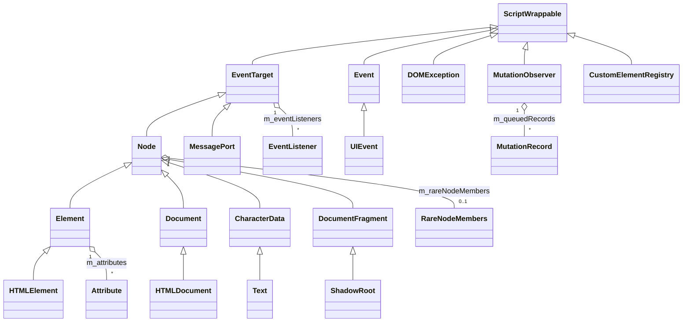
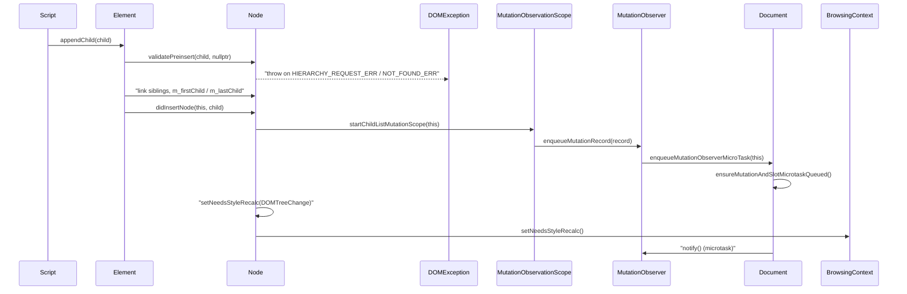

# Functional Requirements: core-dom

> **Relevant source files**
>
> - [src/core/dom/Node.h](src:src/core/dom/Node.h)
> - [src/core/dom/Node.cpp](src:src/core/dom/Node.cpp)
> - [src/core/dom/Element.h](src:src/core/dom/Element.h)
> - [src/core/dom/Element.cpp](src:src/core/dom/Element.cpp)
> - [src/core/dom/Document.h](src:src/core/dom/Document.h)
> - [src/core/dom/Document.cpp](src:src/core/dom/Document.cpp)
> - [src/core/dom/EventTarget.h](src:src/core/dom/EventTarget.h)
> - [src/core/dom/EventTarget.cpp](src:src/core/dom/EventTarget.cpp)
> - [src/core/dom/DOMException.h](src:src/core/dom/DOMException.h)
> - [src/core/dom/CustomElementRegistry.cpp](src:src/core/dom/CustomElementRegistry.cpp)
> - [src/core/dom/MutationObserver.cpp](src:src/core/dom/MutationObserver.cpp)
> - [src/core/dom/MessagePort.cpp](src:src/core/dom/MessagePort.cpp)

**Module**: [`Node.h`](src:src/core/dom/Node.h)
**Version**: 2026-09-10
**Linked Design Card**: [modules/core-dom.md](../modules/core-dom.md)
**Analysis basis**: AST export and direct source reading

## Overview
The core-dom module implements the document object tree rooted in [`Node`](src:src/core/dom/Node.h#L140), which derives from [`EventTarget`](src:src/core/dom/EventTarget.h#L137) and is specialized by [`Element`](src:src/core/dom/Element.h#L125), [`Document`](src:src/core/dom/Document.h#L102) and [`CharacterData`](src:src/core/dom/CharacterData.h#L29). Tree mutations validate structure before linking siblings ([`Node::validatePreinsert`](src:src/core/dom/Node.cpp#L1367)), notify registered observers ([`Node::registerOrUpdateMutationObserver`](src:src/core/dom/Node.h#L925)) and schedule style, frame-tree and layout work ([`Node::setNeedsStyleRecalc`](src:src/core/dom/Node.cpp#L2393)). Failures are reported as [`DOMException`](src:src/core/dom/DOMException.h#L27) objects with the codes enumerated in [`DOMException::Code`](src:src/core/dom/DOMException.h#L29).

## Functional Requirements

### FR-CORE-DOM-001
**Maintain the node tree with validated insertion and removal**

| Item | Content |
|------|---------|
| **Description** | The module keeps each node's parent, first/last child and previous/next sibling links and exposes `appendChild`, `insertBefore`, `replaceChild` and `removeChild`. Before linking, the module checks the pre-insertion rules: the parent must be a Document, DocumentFragment or Element; the inserted node must not be an inclusive ancestor of the parent; the reference child must belong to the parent; only DocumentType, Element, Text, ProcessingInstruction, Comment or DocumentFragment nodes may be inserted; Text nodes may not be children of a Document and DocumentType nodes may only be children of a Document. A DocumentFragment is inserted by moving its children one by one. A node that already has a parent is first removed from that parent. |
| **Input** | Parent `Node`, child `Node*`, optional reference child (`Optional<Node*>`). |
| **Output** | Returns the inserted or removed node; updates sibling/child pointers; runs `didInsertNode` / `didNodeRemoved` hooks up the ancestor chain; opens a child-list mutation scope; on removal tells the document `willNodeBeRemoved` and, when the child had a layout frame, either detaches the frame directly or marks the child for frame-tree rebuild. |
| **Preconditions** | Caller passes a non-null child (asserted); for `appendChild` the parent must satisfy `isContainerNode()`. |
| **Postconditions** | Child's `parentNode()` is the new parent (insert) or null with cleared sibling links (remove); when the node was in a rendering document, `notifyNodeRemoveFromDocumentTree` has run and remaining first-child siblings are marked for style recalc with `DOMTreeChange`. |
| **Source** | [`Node::appendChild`](src:src/core/dom/Node.cpp#L1620), [`Node::insertBefore`](src:src/core/dom/Node.cpp#L1669), [`Node::replaceChild`](src:src/core/dom/Node.cpp#L1847), [`Node::removeChild`](src:src/core/dom/Node.cpp#L1897), [`Node::validatePreinsert`](src:src/core/dom/Node.cpp#L1367) |

**Acceptance criteria**:
- [ ] Appending a child to an Element makes it `lastChild()` and, when there was a previous last child, links `previousSibling()`/`nextSibling()` between them.
- [ ] Appending a node that is an ancestor of the target throws `DOMException` with `HIERARCHY_REQUEST_ERR`.
- [ ] `insertBefore(child, ref)` where `ref->parentNode() != this` throws `DOMException` with `NOT_FOUND_ERR`.
- [ ] `insertBefore(child, nullptr)` behaves as `appendChild(child)`; `insertBefore(child, child)` returns the child unchanged.
- [ ] Appending a DocumentFragment moves each of its children into the parent and returns the (now empty) fragment.
- [ ] `removeChild` on a node whose parent is not this throws `DOMException` with `NOT_FOUND_ERR`.

### FR-CORE-DOM-002
**Create elements and nodes from a document**

| Item | Content |
|------|---------|
| **Description** | A document creates elements by local name or by namespace-qualified name, plus text, comment, CDATA, processing-instruction, fragment and attribute nodes, and can import or adopt nodes from another document. `createElement` validates the name production rule; in an HTML document it builds the element through `HTMLDocument::createHTMLElement` in the HTML namespace, otherwise it creates a `NamedElement` (with the HTML namespace when the content type is `application/xhtml+xml`). `createElementNS` validates and splits the qualified name (prefix, namespace, xml/xmlns constraints) and routes HTML-namespace names to `HTMLDocument::createHTMLElement`, SVG-namespace names to `SVGDocument::createSVGElement`, and anything else to `NamedElement`. `cloneNode(true)` recursively clones children and, for elements that keep their children in a separate content fragment, clones that fragment's children as well. |
| **Input** | Local name or (namespace, qualified name) strings; node data strings; a `Node*` for import/adopt with a `deep` flag. |
| **Output** | Newly allocated `Element` / `Text` / `Comment` / etc. bound to the document; imported or adopted node. |
| **Preconditions** | Name passes `QualifiedName::checkNameProductionRule` (createElement) or `QualifiedName::validateQualifiedName` (createElementNS). |
| **Postconditions** | Returned node has this document as `document()` and no parent. |
| **Source** | [`Document::createElement`](src:src/core/dom/Document.cpp#L1037), [`Document::createElementNS`](src:src/core/dom/Document.cpp#L1144), [`Document::validateAndExtractQualifiedName`](src:src/core/dom/Document.cpp#L1067), [`Document::createTextNode`](src:src/core/dom/Document.cpp#L1161), [`Document::importNode`](src:src/core/dom/Document.cpp#L1206), [`Document::adoptNode`](src:src/core/dom/Document.cpp#L1249), [`Node::cloneNode`](src:src/core/dom/Node.cpp#L480), [`HTMLDocument::createHTMLElement`](src:src/core/dom/HTMLDocument.cpp#L108) |

**Acceptance criteria**:
- [ ] `createElement` with a name failing the name production rule throws `DOMException` with `INVALID_CHARACTER_ERR`.
- [ ] `createElementNS` with a prefix but null namespace, with prefix `xml` and a non-XML namespace, or with an `xmlns` prefix/name and a non-XMLNS namespace throws `DOMException` with `NAMESPACE_ERR`.
- [ ] `createElementNS` with more than one `:` or an empty prefix/local part throws `DOMException` with `INVALID_CHARACTER_ERR`.
- [ ] `importNode` or `adoptNode` on a Document node throws `DOMException` with `NOT_SUPPORTED_ERR`.
- [ ] `cloneNode(false)` returns a node with no children; `cloneNode(true)` returns a node whose children are deep clones in the same order.

### FR-CORE-DOM-003
**Store element attributes and react to their changes**

| Item | Content |
|------|---------|
| **Description** | Elements store attributes in an ordered vector of `Attribute` (qualified name + value). Setting an attribute either appends a new entry or updates the existing value (copying the prefix for namespace-aware matches); removal erases the entry. Every change is routed through `invokeDidAttributeChanged`, which opens an attribute mutation scope and calls the virtual `didAttributeChanged`. The base implementation updates the cached atomic id and class-name list, invalidates the document's named-access cache, and marks the element for style recalc with `IdChange`, `ClassChange`, `InlineStyleChange` or `AttributeChange`. `toggleAttribute`, `getAttributeNames`, `hasAttribute`, `getAttributeNode` and `setAttributeNode` operate on the same vector. |
| **Input** | Qualified name (string, `QualifiedName` or `AttributeName`), optional namespace, value string, or `Attr*` node. |
| **Output** | Updated `m_attributes`; observer records; style recalc scheduling; `Optional<String*>` for reads. |
| **Preconditions** | Value is non-null (asserted); for the string form the name must pass the name production rule. |
| **Postconditions** | `getAttribute(name)` returns the new value; `m_didAttributeChangedCorrectlyInvoked` is set in debug builds, proving the subclass chained to the base hook. |
| **Source** | [`Element::setAttribute`](src:src/core/dom/Element.cpp#L347), [`Element::setAttributeNS`](src:src/core/dom/Element.cpp#L387), [`Element::removeAttribute`](src:src/core/dom/Element.cpp#L458), [`Element::toggleAttribute`](src:src/core/dom/Element.cpp#L522), [`Element::invokeDidAttributeChanged`](src:src/core/dom/Element.cpp#L323), [`Element::didAttributeChanged`](src:src/core/dom/Element.cpp#L596), [`Attribute`](src:src/core/dom/Attribute.h#L44) |

**Acceptance criteria**:
- [ ] `setAttribute("id", "x")` on an element with no id appends an attribute, sets `atomicId()` to `x` and schedules a style recalc with `IdChange`.
- [ ] `setAttribute` on an existing attribute updates the value in place and does not change `attributeCount()`.
- [ ] `setAttribute(name, value)` with an invalid name string throws `DOMException` with `INVALID_CHARACTER_ERR`.
- [ ] `setAttributeNS` delegates name validation to `Document::validateAndExtractQualifiedName` and matches existing attributes by namespace and local name.
- [ ] Changing the `class` attribute replaces the cached `classNames()` list and schedules a style recalc with `ClassChange` when the list differs.

### FR-CORE-DOM-004
**Register event listeners and dispatch events along the tree path**

| Item | Content |
|------|---------|
| **Description** | Any `EventTarget` keeps a list of (event type → listener vector) pairs. `addEventListener` rejects null listeners and duplicates (same callback, attribute flag and capture flag); `removeEventListener` flags the listener removed and erases it. Dispatch builds the event path from the target through its ancestors (with shadow-tree retargeting, slot bookkeeping and relatedTarget path shortening), then runs capturing, at-target and bubbling phases, honouring `stopPropagation` / `stopImmediatePropagation`, before calling `handleDefaultEvent` on each path entry and the activation behaviour of the activation target. Engine-originated events go through `dispatchEventByUA` (trusted); script-originated events go through `dispatchEvent` (untrusted). `dispatchEventIdleTimeByUA` defers dispatch to idle time. |
| **Input** | Event type string, `EventListener*`, capture flag; `Event*` with initialized type; optional origin target and `onlyTarget` flag. |
| **Output** | `bool` for add/remove success; dispatch returns `false` only when the event is cancelable and `defaultPrevented()`; event's `target`, `currentTarget`, `eventPhase`, `isTrusted`, `eventPath()` are updated. |
| **Preconditions** | Event type must be initialized (`isTypeInitialized()`), otherwise `INVALID_STATE_ERR` is thrown. |
| **Postconditions** | `eventPhase()` is `NONE` after dispatch; listeners removed during dispatch are not invoked (iteration over a copy plus `isRemoved()` check). |
| **Source** | [`EventTarget::addEventListener`](src:src/core/dom/EventTarget.cpp#L135), [`EventTarget::removeEventListener`](src:src/core/dom/EventTarget.cpp#L176), [`EventTarget::dispatchEvent`](src:src/core/dom/EventTarget.cpp#L286), [`EventTarget::dispatchEventByUA`](src:src/core/dom/EventTarget.cpp#L255), [`EventTarget::dispatchEventForTarget`](src:src/core/dom/EventTarget.cpp#L842), [`Event::PhaseType`](src:src/core/dom/Event.h#L69), [`Event::preventDefault`](src:src/core/dom/Event.h#L227), [`EventListener::call`](src:src/core/dom/EventTarget.cpp#L64) |

**Acceptance criteria**:
- [ ] `addEventListener(type, listener)` returns `true` the first time and `false` for a second listener that `compare()`s equal.
- [ ] `addEventListener(type, nullptr)` returns `false` and registers nothing.
- [ ] `removeEventListener` for an unregistered type returns `false`.
- [ ] Dispatching an event with an uninitialized type throws `DOMException` with `INVALID_STATE_ERR`.
- [ ] `dispatchEvent` sets `isTrusted()` to `false`; `dispatchEventByUA` sets it to `true`.
- [ ] A cancelable event on which a listener calls `preventDefault()` makes `dispatchEventForTarget` return `false`; a non-cancelable event returns `true` regardless.
- [ ] After `stopImmediatePropagation()` in one listener, the remaining listeners on the same target are not called.

### FR-CORE-DOM-005
**Report DOM failures as typed exceptions**

| Item | Content |
|------|---------|
| **Description** | The module reports failures by throwing a `DOMException` carrying a numeric code from `DOMException::Code`, an optional message and a name. `name()` maps legacy codes (0–25) to the standard error names through a 26-entry table; codes at or above the table size (`ENCODING_ERR`, `NOT_ALLOWED_ERROR`, `SCRIPT_*_ERR`) return the stored name. `DOMExceptionOr<T>` lets internal APIs return either a value or an exception on the stack without throwing. |
| **Input** | `ExecutionContext*`, `Code`, optional C-string message; or (script constructor) message and name strings. |
| **Output** | Script-visible exception object with `code()`, `message()` and `name()`. |
| **Preconditions** | Not specified in code. |
| **Postconditions** | `code()` equals the constructor code; `name()` is non-empty for every legacy code with a table entry. |
| **Source** | [`DOMException`](src:src/core/dom/DOMException.h#L27), [`DOMException::Code`](src:src/core/dom/DOMException.h#L29), [`DOMException::name`](src:src/core/dom/DOMException.cpp#L153), [`DOMExceptionOr`](src:src/core/dom/DOMExceptionOr.h#L29) |

**Acceptance criteria**:
- [ ] `DOMException(ctx, HIERARCHY_REQUEST_ERR)` reports `code() == 3` and `name()` `"HierarchyRequestError"`.
- [ ] `DOMException(ctx, NOT_FOUND_ERR)` reports `code() == 8` and `name()` `"NotFoundError"`.
- [ ] A `DOMExceptionOr<T>` constructed from a value reports `isDOMException() == false` and `asOtherType()` returns the value; constructed from an exception it reports `true` and `asDOMException()` returns it.
- [ ] `DOMExceptionOr<void>` default-constructed reports `isDOMException() == false`.

### FR-CORE-DOM-006
**Query nodes by selector, id, tag and class**

| Item | Content |
|------|---------|
| **Description** | Nodes can be located by CSS selector (`querySelector` / `querySelectorAll` parse the selector list with `CSSParser` and evaluate it with `SelectorQuery`), by id (`Document::getElementById` walks descendants comparing `atomicId()`), by tag name / namespaced tag name / class name (`HTMLCollection` results cached in `RareNodeMembers`), and by generic traversal helpers in `Traverse`. `Element::matches` and `closest` reuse the selector machinery. Range, TreeWalker and NodeIterator provide positional and filtered traversal. |
| **Input** | Selector string, id string, tag/class strings, traversal root and filter. |
| **Output** | `Element*` (first match or null), `NodeList*`, `HTMLCollection*`, traversal results. |
| **Preconditions** | Selector string is non-empty and parses to at least one selector list. |
| **Postconditions** | Collections stored in `RareNodeMembers` are invalidated on child insertion/removal via `invalidateActiveActiveNodeListCacheIfNeeded`. |
| **Source** | [`Node::parseSelector`](src:src/core/dom/Node.cpp#L2216), [`Node::querySelector`](src:src/core/dom/Node.cpp#L2240), [`Node::querySelectorAll`](src:src/core/dom/Node.cpp#L2249), [`SelectorQuery::queryFirst`](src:src/core/dom/SelectorQuery.cpp#L109), [`Document::getElementById`](src:src/core/dom/Document.cpp#L956), [`Node::getElementsByTagName`](src:src/core/dom/Node.cpp#L2123), [`Traverse::findDescendant`](src:src/core/dom/Traverse.h#L69), [`Element::matches`](src:src/core/dom/Element.cpp#L586), [`Element::closest`](src:src/core/dom/Element.cpp#L566), [`Range`](src:src/core/dom/Range.h#L60), [`TreeWalker::nextNode`](src:src/core/dom/TreeWalker.cpp#L216) |

**Acceptance criteria**:
- [ ] `querySelector("")` throws `DOMException` with `SYNTAX_ERR` ("The provided selector is empty").
- [ ] `querySelector` with a selector that yields no selector list throws `DOMException` with `SYNTAX_ERR` ("The provided selector is invalid").
- [ ] `getElementById("")` returns null without traversing.
- [ ] `getElementById(id)` returns the first descendant element in tree order whose `atomicId()` equals the id.
- [ ] `querySelectorAll` returns a `NodeList` whose `length()` equals the number of matching descendants.

### FR-CORE-DOM-007
**Observe tree, attribute and character-data mutations**

| Item | Content |
|------|---------|
| **Description** | A `MutationObserver` is registered on a node with `observe(node, options)`; the options are folded into a `MutationObserverOptionType` bit set (childList, attributes, characterData, subtree, old-value and attribute-filter flags) after consistency checks. The registration is stored on the node's rare members (`registerOrUpdateMutationObserver`) and the document records which mutation types are observed. Tree, attribute and character-data mutations open `MutationObservationScope` / `ChildListMutationObservationScope` objects that create `MutationRecord`s for interested observers (found by walking the target's ancestors). Records are queued on the observer, which asks the document to schedule one microtask; the microtask delivers all active observers' records via `notify()` and then fires `slotchange` for signalled slots. `takeRecords()` returns and clears queued records; `disconnect()` removes registrations. |
| **Input** | Target `Node*`, `MutationObserverInit` options, script callback. |
| **Output** | Array of `MutationRecord` delivered to the callback; `GCVector<MutationRecord*>` from `takeRecords()`. |
| **Preconditions** | At least one of childList, attributes or characterData must be requested (directly or implied by old-value/filter options). |
| **Postconditions** | `m_queuedRecords` is empty after `notify()` or `takeRecords()`; the document's `m_isMutationObserverMicroTaskQueued` flag is reset when the microtask runs. |
| **Source** | [`MutationObserver::observe`](src:src/core/dom/MutationObserver.cpp#L118), [`MutationObserver::takeRecords`](src:src/core/dom/MutationObserver.cpp#L213), [`MutationObserver::enqueueMutationRecord`](src:src/core/dom/MutationObserver.cpp#L221), [`MutationObserver::notify`](src:src/core/dom/MutationObserver.cpp#L227), [`MutationObserverOptionType`](src:src/core/dom/MutationObserver.h#L30), [`MutationObserverRegistration::isInterestedIn`](src:src/core/dom/MutationObserver.cpp#L69), [`Node::registerOrUpdateMutationObserver`](src:src/core/dom/Node.h#L925), [`Node::interestedObservers`](src:src/core/dom/Node.cpp#L2715), [`Document::ensureMutationAndSlotMicrotaskQueued`](src:src/core/dom/Document.cpp#L2692), [`ChildListMutationObservationScope`](src:src/core/dom/MutationObservationScope.h#L68) |

**Acceptance criteria**:
- [ ] `observe(node, {})` with none of childList/attributes/characterData throws `DOMException` with `SCRIPT_TYPE_ERR`.
- [ ] `observe(node, {attributeOldValue: true, attributes: false})` throws `DOMException` with `SCRIPT_TYPE_ERR`; `{attributeOldValue: true}` alone implies attributes.
- [ ] Observing the same node twice with the same observer updates the existing registration instead of adding a second one (`registerOrUpdateMutationObserver` returns `first == false`).
- [ ] After a mutation, `takeRecords()` returns the pending records and a second call returns an empty vector.
- [ ] Several observers mutated in the same task are notified from a single microtask; `slotchange` events fire after all observer callbacks in that microtask.

### FR-CORE-DOM-008
**Define, create and upgrade custom elements**

| Item | Content |
|------|---------|
| **Description** | `CustomElementRegistry::define` validates the custom element name, rejects names or constructors already defined, rejects `extends` values that are themselves custom element names or that resolve to an unknown element, and rejects re-entrant definition; it then records the definition, upgrades existing candidates and resolves `whenDefined` promises. `createCustomElement` builds an `HTMLCustomElement` from a definition; `upgrade` applies a definition to an existing element. Lifecycle callbacks (`kConnected`, `kDisconnected`, `kAdoptped`, `kAttributeChanged`, upgrade variants) are enqueued onto the current `CustomElementReactionStack`, whose destructor processes the queue. |
| **Input** | Name string, `CustomElementConstructor*`, `ElementDefinitionOptions` (extends); element/node to upgrade. |
| **Output** | Registry entry (`CustomElementRegistryData`), constructed/upgraded `HTMLCustomElement*`, `Promise*` from `whenDefined`. |
| **Preconditions** | `isValidCustomElementName(name)` is true; no definition is currently running. |
| **Postconditions** | `get(name)` returns the constructor; `find(name)` returns the definition data; the construction stack for the definition is balanced (push/pop/"already constructed" sentinel). |
| **Source** | [`CustomElementRegistry::define`](src:src/core/dom/CustomElementRegistry.cpp#L222), [`CustomElementRegistry::isValidCustomElementName`](src:src/core/dom/CustomElementRegistry.cpp#L125), [`CustomElementRegistry::upgrade`](src:src/core/dom/CustomElementRegistry.cpp#L522), [`CustomElementRegistry::whenDefined`](src:src/core/dom/CustomElementRegistry.cpp#L596), [`CustomElementRegistry::enqueueToCustomElementsReactionStack`](src:src/core/dom/CustomElementRegistry.cpp#L719), [`CustomElementCallbackType`](src:src/core/dom/CustomElementRegistry.h#L101), [`CustomElementReactionStack`](src:src/core/dom/CustomElementRegistry.h#L115), [`HTMLCustomElement`](src:src/core/dom/HTMLCustomElement.h#L30) |

**Acceptance criteria**:
- [ ] `define("notvalid", ctor)` where the name fails `isValidCustomElementName` throws `DOMException` with `SYNTAX_ERR`.
- [ ] Defining a name that already exists in the registry, or a constructor already used by another name, throws `DOMException` with `NOT_SUPPORTED_ERR`.
- [ ] `define(name, ctor, {extends: "another-custom"})` throws `DOMException` with `NOT_SUPPORTED_ERR`.
- [ ] Calling `define` while another definition is running throws `DOMException` with `NOT_SUPPORTED_ERR`.
- [ ] Reactions enqueued during a `CustomElementReactionStack` scope are processed when the scope ends.

### FR-CORE-DOM-009
**Schedule style, frame-tree and layout work from DOM changes**

| Item | Content |
|------|---------|
| **Description** | Nodes carry dirty bits for style recalc (self, child, animation-only), frame-tree build (self, child) and expose `setNeedsStyleRecalc`, `setNeedsFrameTreeBuild`, `setNeedsLayout`, `setNeedsPainting` and `setNeedsComposite`. `setNeedsStyleRecalc(reason)` only acts when the node is in a rendering document; for reasons up to `AttributeChange` (or on shadow roots) it marks the node unconditionally, otherwise it consults the computed style's damage source bits; it then propagates to siblings and children as needed and asks the browsing context to schedule (or not schedule) rendering. `setNeedsFrameTreeBuild` marks ancestors up to the nearest block start and detaches stale frames; `setNeedsLayout` propagates to the layout frame. `didNodeRemovedFromDocumentTree` releases focus, finalizes observation, clears style and frame subtree. |
| **Input** | `StyleChangeReason` bit, `scheduleRendering` flag, optional new `ComputedStyle*`. |
| **Output** | Dirty bits on this node and ancestors; `BrowsingContext::setNeedsStyleRecalc` / `setNeedsFrameTreeBuild` / `setNeedsLayout` calls; frame detachment. |
| **Preconditions** | `isInDocumentScopeAndDocumentParticipateInRendering()` (style, layout) or `document()->doesParticipateInRendering()` (frame tree). |
| **Postconditions** | `needsStyleRecalc()` true on the marked node and `childNeedsStyleRecalc()` true on every rendering ancestor up to the first already-marked one. |
| **Source** | [`Node::setNeedsStyleRecalc`](src:src/core/dom/Node.cpp#L2393), [`Node::StyleChangeReason`](src:src/core/dom/Node.h#L533), [`Node::setChildNeedsStyleRecalc`](src:src/core/dom/Node.h#L575), [`Node::setNeedsFrameTreeBuild`](src:src/core/dom/Node.cpp#L2267), [`Node::setNeedsLayout`](src:src/core/dom/Node.cpp#L2492), [`Node::didNodeRemovedFromDocumentTree`](src:src/core/dom/Node.cpp#L2617), [`Node::NodeState`](src:src/core/dom/Node.h#L451) |

**Acceptance criteria**:
- [ ] `setNeedsStyleRecalc` on a node not attached to a rendering document leaves all dirty bits unchanged.
- [ ] `setNeedsStyleRecalc(IdChange)` on a rendering node sets `needsStyleRecalc()` and marks each rendering ancestor's child-needs-recalc bit until an already-marked ancestor is found.
- [ ] `setNeedsStyleRecalc(reason, false)` calls `setNeedsStyleRecalcWithoutSchedulingRendering` on the browsing context instead of `setNeedsStyleRecalc`.
- [ ] Removing a node from a rendering document clears its `style()` and its element descendants' styles and clears the frame subtree.

### FR-CORE-DOM-010
**Track document parsing and ready state**

| Item | Content |
|------|---------|
| **Description** | The document owns a `DocumentBuilder` (HTML implementation `HTMLDocumentBuilder`) that starts parsing from a URL or a string and can resume after script blocking. `endDocumentParsing` releases the builder and any pending parsing idler and, for the top-level browsing context, records the `ParsingEnd` load-progress state. `notifyDomContentLoaded` waits until deferred scripts and pending modules are done, executes module scripts, and fires `DOMContentLoaded` exactly once. `setReadyState` stores the new state and fires `readystatechange` when it changed; `readyState()` exposes `loading` / `interactive` / `complete`. `open`, `write`, `writeln` and `close` implement script-driven document (re)writing. |
| **Input** | `ResourceURL*` + `ReferrerURL*` or markup `String*`; `DocumentReadyState` value. |
| **Output** | Populated tree; `readystatechange` and `DOMContentLoaded` events; load-progress state on the resource loader. |
| **Preconditions** | Document has a browsing context and window. |
| **Postconditions** | `documentBuilder()` is null after `endDocumentParsing`; `m_domContentLoadedFired` is true after the first `DOMContentLoaded`. |
| **Source** | [`Document::setReadyState`](src:src/core/dom/Document.cpp#L1502), [`DocumentReadyState`](src:src/core/dom/Document.h#L85), [`Document::endDocumentParsing`](src:src/core/dom/Document.cpp#L686), [`Document::notifyDomContentLoaded`](src:src/core/dom/Document.cpp#L758), [`Document::open`](src:src/core/dom/Document.cpp#L379), [`Document::write`](src:src/core/dom/Document.cpp#L602), [`DocumentBuilder`](src:src/core/dom/builder/DocumentBuilder.h#L30), [`HTMLDocumentBuilder::build`](src:src/core/dom/builder/html/HTMLDocumentBuilder.cpp#L563) |

**Acceptance criteria**:
- [ ] `setReadyState(x)` with `x` equal to the current state dispatches no event; with a different state it dispatches a trusted `readystatechange` event on the document.
- [ ] `readyState()` returns `"loading"`, `"interactive"` or `"complete"` for the three enum values.
- [ ] `notifyDomContentLoaded` returns early while deferred script elements or pending dynamically loaded modules remain.
- [ ] `DOMContentLoaded` is dispatched at most once per document.

### FR-CORE-DOM-011
**Edit character data and text nodes**

| Item | Content |
|------|---------|
| **Description** | `CharacterData` nodes (Text, Comment, CDATASection, ProcessingInstruction) hold a string and support `substringData`, `appendData`, `insertData`, `deleteData`, `replaceData` and `setData`; offsets are validated against the node length. `Text::splitText` splits a text node at an offset into two siblings; `wholeText` concatenates adjacent text siblings; `mergeWithTextSiblings` joins them. `Node::textContent` / `setTextContent` and `Node::normalize` operate on text content across a subtree. |
| **Input** | Offset/count integers, data strings. |
| **Output** | Updated data string; new `Text*` from `splitText`; `String*` from `substringData`/`wholeText`. |
| **Preconditions** | `offset <= length()` for `substringData` and `splitText`. |
| **Postconditions** | `length()` reflects the edited data; character-data mutation observers receive a record (via `startCharacterDataMutationScope`). |
| **Source** | [`CharacterData`](src:src/core/dom/CharacterData.h#L29), [`CharacterData::substringData`](src:src/core/dom/CharacterData.cpp#L67), [`CharacterData::setData`](src:src/core/dom/CharacterData.cpp#L98), [`CharacterData::replaceData`](src:src/core/dom/CharacterData.cpp#L197), [`Text::splitText`](src:src/core/dom/Text.cpp#L42), [`Text::wholeText`](src:src/core/dom/Text.cpp#L78), [`Node::textContent`](src:src/core/dom/Node.cpp#L400), [`Node::normalize`](src:src/core/dom/Node.cpp#L687) |

**Acceptance criteria**:
- [ ] `substringData(offset, count)` with `offset > length()` throws `DOMException` with `INDEX_SIZE_ERR`.
- [ ] `substringData(offset, count)` with `offset + count > length()` returns the data from `offset` to the end.
- [ ] `splitText(offset)` with `offset > length()` throws `DOMException` with `INDEX_SIZE_ERR`.
- [ ] `splitText(offset)` leaves the first `offset` code units in the original node and returns a new sibling holding the remainder.

### FR-CORE-DOM-012
**Pass messages between entangled message ports**

| Item | Content |
|------|---------|
| **Description** | A `MessageChannel` creates two `MessagePort`s and entangles them. `postMessage(message, transfer)` serializes the message with its transfer list using the port's serializer; if the port itself is in the transfer list a `DATA_CLONE_ERR` is thrown; if the entangled target port is being transferred the message is dropped ("doomed"); otherwise the serialized record is handed to the target port, which schedules a message-loop idler that creates a `MessageEvent` and dispatches it as a trusted event. `start()` enables the port's queue, `close()` disentangles, and assigning `onmessage` enables delivery. Ports implement `Transferable` so they can be shipped to another context. |
| **Input** | `ScriptValue` message, `GCVector<ScriptObject>` transfer list. |
| **Output** | `MessageEvent` dispatched on the entangled port; `TransferedData*` from `transfer()`. |
| **Preconditions** | Port is entangled (`m_entangledPort != nullptr`); otherwise the message is serialized and discarded. |
| **Postconditions** | Message delivery happens on a later message-loop turn, not synchronously inside `postMessage`. |
| **Source** | [`MessageChannel`](src:src/core/dom/MessageChannel.h#L29), [`MessagePort`](src:src/core/dom/MessagePort.h#L61), [`MessagePort::entangle`](src:src/core/dom/MessagePort.cpp#L67), [`MessagePort::postMessage`](src:src/core/dom/MessagePort.cpp#L99), [`MessagePort::registerDispatchMessageTask`](src:src/core/dom/MessagePort.cpp#L143), [`MessagePort::setOnmessage`](src:src/core/dom/MessagePort.cpp#L178), [`PortMessageQueue`](src:src/core/dom/MessagePort.h#L32) |

**Acceptance criteria**:
- [ ] `port1.postMessage(v)` results in a `MessageEvent` dispatched on `port2` on a subsequent message-loop idle callback.
- [ ] `port.postMessage(v, [port])` throws `DOMException` with `DATA_CLONE_ERR`.
- [ ] `port1.postMessage(v, [port2])` (transferring the entangled target) delivers nothing.
- [ ] `postMessage` on a port with no entangled peer serializes the message and returns without dispatch.

## Non-Functional Requirements
| Item | Requirement | Source |
|------|-------------|--------|
| Performance | `hasListenerForTypeOnPath` scans the ancestor chain without allocating or copying listener vectors so callers can skip a redundant dispatch. | [`EventTarget::hasListenerForTypeOnPath`](src:src/core/dom/EventTarget.cpp#L293) |
| Performance | Rarely used per-node data is allocated lazily in `RareNodeMembers`; tag/class collection results are cached per query string and invalidated on tree change. | [`RareNodeMembers`](src:src/core/dom/Node.h#L59) |
| Performance | `interestedObservers` returns early when the document has no observers of the requested mutation type. | [`Node::interestedObservers`](src:src/core/dom/Node.cpp#L2715) |
| Performance | Mutation observer callbacks and slotchange events are coalesced into one microtask per document. | [`Document::ensureMutationAndSlotMicrotaskQueued`](src:src/core/dom/Document.cpp#L2692) |
| Security | `WebOrigin` provides same-origin and same-origin-domain comparison used by callers across the engine. | [`WebOrigin::isSameOrigin`](src:src/core/dom/WebOrigin.h#L45) |
| Security | Engine-dispatched events are marked trusted and script-dispatched events untrusted. | [`EventTarget::dispatchEventByUA`](src:src/core/dom/EventTarget.cpp#L255) |
| Error handling | Invalid operations throw `DOMException` with a spec code; internal invariants are checked with `STARFISH_ASSERT`. | [`DOMException::Code`](src:src/core/dom/DOMException.h#L29) |
| Memory | DOM objects are allocated with explicit GC type descriptors (`fillGCDescriptor`) so only pointer fields are scanned. | [`Node::fillGCDescriptor`](src:src/core/dom/Node.h#L948) |
| Logging | Attribute-change logging exists only under `STARFISH_TC_COVERAGE`; listener add/remove log lines are commented out. | [`Element::didAttributeChanged`](src:src/core/dom/Element.cpp#L596) |

## Constraints
- `Node::StyleChangeReason` bit values must match `StyleResolver::StyleDamageFrom` (comment "MUST uses same bit with StyleResolver::StyleDamageFrom"). [`Node::StyleChangeReason`](src:src/core/dom/Node.h#L533)
- Adding a `NodeState` requires updating `ComputedStyle::m_styleDamageSourceNodeStateMap` and `Node::m_state`. [`Node::NodeState`](src:src/core/dom/Node.h#L451)
- Attributes must not be modified except through the `Element` attribute functions (comment "DO NOT MODIFY ATTRIBUTES WITHOUT THESE FUNCTIONS"). [`Element::attributeCount`](src:src/core/dom/Element.h#L173)
- `DOMExceptionOr` and `EventInit` are stack-allocated only (`STARFISH_MAKE_STACK_ALLOCATED`). [`DOMExceptionOr`](src:src/core/dom/DOMExceptionOr.h#L29)
- The `DOMException` legacy name table must contain exactly 26 entries (`static_assert`). [`DOMException::name`](src:src/core/dom/DOMException.cpp#L153)
- `MutationObserver` uses a custom `operator new` with a GC descriptor and forbids array allocation. [`MutationObserver`](src:src/core/dom/MutationObserver.h#L193)

## Module Design Card Linkage
| FR | Implementation | Design Card section |
|----|----------------|---------------------|
| FR-CORE-DOM-001 | `Node::appendChild` / `insertBefore` / `removeChild` / `validatePreinsert` | [Key Flow: Child insertion](../modules/core-dom.md#key-flow) |
| FR-CORE-DOM-002 | `Document::createElement` / `createElementNS` / `HTMLDocument::createHTMLElement` | [Public Interface](../modules/core-dom.md#public-interface) |
| FR-CORE-DOM-003 | `Element::setAttribute` / `didAttributeChanged` | [Key Flow: Attribute change](../modules/core-dom.md#key-flow) |
| FR-CORE-DOM-004 | `EventTarget::addEventListener` / `dispatchEvent` / `dispatchEventByUA` | [Key Flow: Event dispatch](../modules/core-dom.md#key-flow) |
| FR-CORE-DOM-005 | `DOMException`, `DOMExceptionOr` | [Quick Navigation](../modules/core-dom.md#quick-navigation) |
| FR-CORE-DOM-006 | `Node::querySelector`, `SelectorQuery`, `Document::getElementById`, `Traverse` | [Quick Navigation](../modules/core-dom.md#quick-navigation) |
| FR-CORE-DOM-007 | `MutationObserver`, `MutationObservationScope`, `Document::ensureMutationAndSlotMicrotaskQueued` | [Key Flow: Mutation observer delivery](../modules/core-dom.md#key-flow) |
| FR-CORE-DOM-008 | `CustomElementRegistry` | [Public Interface](../modules/core-dom.md#public-interface) |
| FR-CORE-DOM-009 | `Node::setNeedsStyleRecalc` / `setNeedsFrameTreeBuild` / `setNeedsLayout` | [Architectural Rules](../modules/core-dom.md#architectural-rules) |
| FR-CORE-DOM-010 | `Document::setReadyState` / `notifyDomContentLoaded`, `HTMLDocumentBuilder` | [Dependencies](../modules/core-dom.md#dependencies) |
| FR-CORE-DOM-011 | `CharacterData`, `Text` | [Public Interface](../modules/core-dom.md#public-interface) |
| FR-CORE-DOM-012 | `MessagePort`, `MessageChannel` | [IPC / Message / Interface Contracts](../modules/core-dom.md#ipc--message--interface-contracts) |

## ENUM Definitions
| ENUM | Values | Used in | Source |
|------|--------|---------|--------|
| `DOMException::Code` | DOM_EXCEPTION=0, INDEX_SIZE_ERR=1, HIERARCHY_REQUEST_ERR=3, WRONG_DOCUMENT_ERR=4, INVALID_CHARACTER_ERR=5, NO_MODIFICATION_ALLOWED_ERR=7, NOT_FOUND_ERR=8, NOT_SUPPORTED_ERR=9, INUSE_ATTRIBUTE_ERR=10, INVALID_STATE_ERR=11, SYNTAX_ERR=12, INVALID_MODIFICATION_ERR=13, NAMESPACE_ERR=14, INVALID_ACCESS_ERR=15, TYPE_MISMATCH_ERR=17, SECURITY_ERR=18, NETWORK_ERR=19, ABORT_ERR=20, URL_MISMATCH_ERR=21, QUOTA_EXCEEDED_ERR=22, TIMEOUT_ERR=23, INVALID_NODE_TYPE_ERR=24, DATA_CLONE_ERR=25, ENCODING_ERR, NOT_ALLOWED_ERROR, SCRIPT_ERROR=101, SCRIPT_EVAL_ERR=102, SCRIPT_RANGE_ERR=103, SCRIPT_REFERENCE_ERR=104, SCRIPT_TYPE_ERR=105, SCRIPT_URI_ERR=106 | Exception construction throughout the module | [`DOMException::Code`](src:src/core/dom/DOMException.h#L29) |
| `VisibilityState` | VisibilityStateHidden, VisibilityStateVisible, VisibilityStatePrerender, VisibilityStateUnloaded | `Document::visibilityState` | [`VisibilityState`](src:src/core/dom/Document.h#L78) |
| `DocumentReadyState` | DocumentReadyStateLoading, DocumentReadyStateInteractive, DocumentReadyStateComplete | `Document::readyState` / `setReadyState` | [`DocumentReadyState`](src:src/core/dom/Document.h#L85) |
| `Document::CompatibilityMode` | QuirksMode, LimitedQuirksMode, NoQuirksMode, NoQuirksModeForce | `Document::compatibilityMode`, `compatMode` | [`Document::CompatibilityMode`](src:src/core/dom/Document.h#L122) |
| `ErrorArgumentSequence` | ERROR_ARG_MESSAGE, ERROR_ARG_SRC, ERROR_ARG_LINENO, ERROR_ARG_COLNO, ERROR_ARG_ERROR, ERROR_ARG_SIZE | Attribute event listener argument layout | [`EventTarget.cpp`](src:src/core/dom/EventTarget.cpp#L53) |
| `DefaultArgumentSequence` | DEFAULT_ARG_EVENT, DEFAULT_ARG_SIZE | Attribute event listener argument layout | [`EventTarget.cpp`](src:src/core/dom/EventTarget.cpp#L62) |
| `EventTarget::GlobalPointingEventKind` | GlobalPointingEventKindDown, GlobalPointingEventKindUp, GlobalPointingEventKindMove | `EventTarget::onGlobalPointingEvent` | [`EventTarget::GlobalPointingEventKind`](src:src/core/dom/EventTarget.h#L239) |
| `HTMLMediaElement::NetworkState` | NETWORK_EMPTY, NETWORK_IDLE, NETWORK_LOADING, NETWORK_NO_SOURCE | `HTMLMediaElement` | [`HTMLMediaElement.h`](src:src/core/dom/HTMLMediaElement.h#L241) |
| `HTMLMediaElement::ReadyState` | HAVE_NOTHING, HAVE_METADATA, HAVE_CURRENT_DATA, HAVE_FUTURE_DATA, HAVE_ENOUGH_DATA | `HTMLMediaElement` | [`HTMLMediaElement.h`](src:src/core/dom/HTMLMediaElement.h#L248) |
| `HTMLMediaElement::PreloadState` | PRELOAD_NONE, PRELOAD_METADATA, PRELOAD_AUTOMATIC | `HTMLMediaElement` | [`HTMLMediaElement.h`](src:src/core/dom/HTMLMediaElement.h#L256) |
| `HTMLTableElement::Rules` | UnsetRules, NoneRules, GroupsRules, RowsRules, ColsRules, AllRules | `HTMLTableElement` | [`HTMLTableElement.h`](src:src/core/dom/HTMLTableElement.h#L32) |
| `HTMLTableElement::CellBorders` | NoBorders, InsetBorders, SolidBordersRowsOnly, SolidBordersColsOnly, SolidBorders | `HTMLTableElement` | [`HTMLTableElement.h`](src:src/core/dom/HTMLTableElement.h#L41) |
| `HTMLTextEditable::EditStatus` | None, PreeditStart, PreeditEnd, Commit | `HTMLTextEditable` | [`HTMLTextEditable.h`](src:src/core/dom/HTMLTextEditable.h#L27) |
| `Node::NodeType` | ELEMENT_NODE=1, ATTRIBUTE_NODE=2, TEXT_NODE=3, CDATA_SECTION_NODE=4, ENTITY_REFERENCE_NODE=5, ENTITY_NODE=6, PROCESSING_INSTRUCTION_NODE=7, COMMENT_NODE=8, DOCUMENT_NODE=9, DOCUMENT_TYPE_NODE=10, DOCUMENT_FRAGMENT_NODE=11, NOTATION_NODE=12 | `Node::nodeType`, `validatePreinsert` | [`Node::NodeType`](src:src/core/dom/Node.h#L181) |
| `Node::DocumentPosition` | DOCUMENT_POSITION_DISCONNECTED=0x01, DOCUMENT_POSITION_PRECEDING=0x02, DOCUMENT_POSITION_FOLLOWING=0x04, DOCUMENT_POSITION_CONTAINS=0x08, DOCUMENT_POSITION_CONTAINED_BY=0x10, DOCUMENT_POSITION_IMPLEMENTATION_SPECIFIC=0x20 | `Node::compareDocumentPosition` | [`Node::DocumentPosition`](src:src/core/dom/Node.h#L196) |
| `Node::NodeState` | NodeStateNormal=0, NodeStateActive=1<<0, NodeStateFocused=1<<1, NodeStateHovered=1<<2, NodeStateTarget=1<<3, NodeStateLink=1<<4 | `Node::setState` / `state` | [`Node::NodeState`](src:src/core/dom/Node.h#L451) |
| `Range::ProcessingType` | Extract, Clone, Delete | `Range::processContents` | [`Range.h`](src:src/core/dom/Range.h#L129) |
| `ClassElementListBehavior` | AllElements, OnlyRoots | `SelectorQuery` | [`SelectorQuery.cpp`](src:src/core/dom/SelectorQuery.cpp#L43) |
| `MatchTraverseRootState` | DoesNotMatchTraverseRoots, MatchesTraverseRoots | `SelectorQuery` | [`SelectorQuery.h`](src:src/core/dom/SelectorQuery.h#L32) |
| `TextTrack::Mode` | InvalidMode, Off, Hidden, Showing | `TextTrack` | [`TextTrack.h`](src:src/core/dom/TextTrack.h#L36) |
| `TextTrack::Kind` | InvalidKind, Subtitles, Captions, Descriptions, Chapters, Metadata | `TextTrack` | [`TextTrack.h`](src:src/core/dom/TextTrack.h#L43) |

Additional enums declared in the module and read directly: [`Node::StyleChangeReason`](src:src/core/dom/Node.h#L533) (JustNeedsRecalcSelf=0, InlineStyleChange=0, IdChange=1, ClassChange=1<<1, AttributeChange=1<<2, ElementStateChange=1<<3, DOMTreeChange=1<<4, ElementStateChangeDomTree=1<<5), [`Event::PhaseType`](src:src/core/dom/Event.h#L69) (NONE=0, CAPTURING_PHASE=1, AT_TARGET=2, BUBBLING_PHASE=3), [`MutationObserverOptionType`](src:src/core/dom/MutationObserver.h#L30) (kNone, kChildList, kAttributes, kCharacterData, kAllMutationType, kSubtree, kAttributeOldValue, kCharacterDataOldValue, kAllDeliveryOptions, kAttributeFilter), [`CustomElementCallbackType`](src:src/core/dom/CustomElementRegistry.h#L101) (kUpgradedWhenDefined, kUpgradedWhenConnected, kConnected, kDisconnected, kAdoptped, kAttributeChanged), [`Range::How`](src:src/core/dom/Range.h#L62) (START_TO_START, START_TO_END, END_TO_END, END_TO_START).

## Error Code Definitions
| Error code | Value | Trigger | Recovery | Source |
|------------|-------|---------|----------|--------|
| `INDEX_SIZE_ERR` | 1 | `CharacterData::substringData` / `Text::splitText` with offset greater than length | Thrown to the caller as `DOMException` | [`CharacterData::substringData`](src:src/core/dom/CharacterData.cpp#L67) |
| `HIERARCHY_REQUEST_ERR` | 3 | Pre-insertion rule violation (bad parent type, ancestor cycle, disallowed node type, Text under Document, doctype outside Document, null node) | Thrown to the caller as `DOMException` | [`Node::validatePreinsert`](src:src/core/dom/Node.cpp#L1367) |
| `INVALID_CHARACTER_ERR` | 5 | Name fails the name production rule in `createElement` / `setAttribute`; malformed qualified name in `validateAndExtractQualifiedName` | Thrown to the caller as `DOMException` | [`Document::createElement`](src:src/core/dom/Document.cpp#L1037) |
| `NOT_FOUND_ERR` | 8 | `removeChild` / `insertBefore` reference child whose parent is not this node | Thrown to the caller as `DOMException` | [`Node::removeChild`](src:src/core/dom/Node.cpp#L1897) |
| `NOT_SUPPORTED_ERR` | 9 | `importNode` / `adoptNode` on a Document; duplicate or invalid custom element definition; `attachShadow` on a non-HTML or invalid host | Thrown to the caller as `DOMException` | [`Document::importNode`](src:src/core/dom/Document.cpp#L1206) |
| `INVALID_STATE_ERR` | 11 | `dispatchEvent` on an event whose type is not initialized | Thrown to the caller as `DOMException` | [`EventTarget::dispatchEvent`](src:src/core/dom/EventTarget.cpp#L422) |
| `SYNTAX_ERR` | 12 | Empty or unparsable selector in `parseSelector`; invalid custom element name in `define` | Thrown to the caller as `DOMException` | [`Node::parseSelector`](src:src/core/dom/Node.cpp#L2216) |
| `NAMESPACE_ERR` | 14 | Prefix/namespace mismatch in `validateAndExtractQualifiedName` | Thrown to the caller as `DOMException` | [`Document::validateAndExtractQualifiedName`](src:src/core/dom/Document.cpp#L1067) |
| `DATA_CLONE_ERR` | 25 | `MessagePort::postMessage` with the port itself in the transfer list | Thrown to the caller as `DOMException` | [`MessagePort::postMessage`](src:src/core/dom/MessagePort.cpp#L99) |
| `SCRIPT_TYPE_ERR` | 105 | `MutationObserver::observe` with inconsistent or empty options | Thrown to the caller as `DOMException` | [`MutationObserver::observe`](src:src/core/dom/MutationObserver.cpp#L118) |

All values are declared in [`DOMException::Code`](src:src/core/dom/DOMException.h#L29). The remaining codes in that enum are declared but their triggers inside this module were not traced.

## Constant Definitions
| Constant | Value | Purpose | Source |
|----------|-------|---------|--------|
| `STARFISH_NATIVEGRADIENT_CACHE_SIZE` | `1920 * 1080 * 4 * 2` | Native gradient cache budget on the document | [`Document.h`](src:src/core/dom/Document.h#L33) |
| `HTML_NAMESPACE` | `"http://www.w3.org/1999/xhtml"` | HTML namespace for element creation | [`Document.h`](src:src/core/dom/Document.h#L92) |
| `SVG_NAMESPACE` | `"http://www.w3.org/2000/svg"` | SVG namespace routing in `createElementNS` | [`Document.h`](src:src/core/dom/Document.h#L94) |
| `XML_NAMESPACE` | `"http://www.w3.org/XML/1998/namespace"` | XML namespace validation | [`Document.h`](src:src/core/dom/Document.h#L95) |
| `XMLNS_NAMESPACE` | `"http://www.w3.org/2000/xmlns/"` | XMLNS namespace validation | [`Document.h`](src:src/core/dom/Document.h#L96) |
| `VIRTUAL` / `OVERRIDE` | (empty) then `virtual` / `override` | Toggle used with `DECLARE_EVENT_LISTENER` to declare event-handler attributes as virtual or non-virtual | [`Document.h`](src:src/core/dom/Document.h#L709) |
| `VIRTUAL` / `OVERRIDE` | `virtual` / `override`, then redefined empty | Same toggle in `HTMLBodyElement` | [`HTMLBodyElement.h`](src:src/core/dom/HTMLBodyElement.h#L40) |
| `VIRTUAL` / `OVERRIDE` | (empty) then `virtual` / (empty) | Same toggle in `HTMLElement` | [`HTMLElement.h`](src:src/core/dom/HTMLElement.h#L97) |
| `VIRTUAL` / `OVERRIDE` | (empty) | Same toggle in `ShadowRoot` | [`ShadowRoot.h`](src:src/core/dom/ShadowRoot.h#L166) |
| `VIRTUAL` / `OVERRIDE` | (empty) | Same toggle in `TextTrackCue` | [`TextTrackCue.h`](src:src/core/dom/TextTrackCue.h#L103) |
| `STARFISH_DEFAULT_IFRAME_WIDTH` | `300` | Default iframe width | [`HTMLIFrameElement.h`](src:src/core/dom/HTMLIFrameElement.h#L27) |
| `STARFISH_DEFAULT_IFRAME_HEIGHT` | `150` | Default iframe height | [`HTMLIFrameElement.h`](src:src/core/dom/HTMLIFrameElement.h#L28) |
| `STARFISH_OBJECT_ELEMENT_DEFAULT_WIDTH` | `300` | Default object element width | [`HTMLObjectElement.h`](src:src/core/dom/HTMLObjectElement.h#L25) |
| `STARFISH_OBJECT_ELEMENT_DEFAULT_HEIGHT` | `150` | Default object element height | [`HTMLObjectElement.h`](src:src/core/dom/HTMLObjectElement.h#L26) |
| `STARFISH_SCROLL_START_THRESHOLD` | `10` | Scroll gesture start threshold | [`Scrolling.cpp`](src:src/core/dom/Scrolling.cpp#L40) |
| `STARFISH_SCROLL_START_FLING_THRESHOLD` | `100` | Fling start threshold | [`Scrolling.cpp`](src:src/core/dom/Scrolling.cpp#L41) |
| `STARFISH_SCROLL_FLING_LENGTH_MULTIPLY_BASE` | `500` | Fling length base multiplier | [`Scrolling.cpp`](src:src/core/dom/Scrolling.cpp#L42) |
| `STARFISH_SCROLL_FLING_LENGTH_MULTIPLY_RATIO` | `1500` | Fling length ratio | [`Scrolling.cpp`](src:src/core/dom/Scrolling.cpp#L43) |
| `STARFISH_SCROLL_FLING_BASE_TIME_IN_MS` | `1000` | Fling base duration | [`Scrolling.cpp`](src:src/core/dom/Scrolling.cpp#L44) |
| `STARFISH_SCROLL_FLING_SPEED_RATIO` | `1` | Fling speed ratio | [`Scrolling.cpp`](src:src/core/dom/Scrolling.cpp#L45) |
| `STARFISH_SCROLL_ACTIVE_TIME_IN_MS` | `500` | Scroll active window | [`Scrolling.cpp`](src:src/core/dom/Scrolling.cpp#L46) |
| `STARFISH_SCROLLBAR_THICKNESS` | `4` | Scrollbar thickness | [`Scrolling.cpp`](src:src/core/dom/Scrolling.cpp#L579) |
| `TEXTTRACK_INVALID_TIMEVALUE` | `-1` | Sentinel for invalid text-track times | [`TextTrack.h`](src:src/core/dom/TextTrack.h#L32) |

32 constant entries were extracted for this module's files; the 14 `VIRTUAL`/`OVERRIDE` redefinitions are grouped per file above.

## Message Protocol
| Message ID | Direction | Payload | Handler | Mechanism | Source |
|------------|-----------|---------|---------|-----------|--------|
| `message` (MessageEvent) | `MessagePort` → entangled `MessagePort` | `SerializeWithTransferResult` (structured-serialized value plus transferred objects) | `MessagePort::dispatchMessageEvent` → `registerDispatchMessageTask` → `dispatchEventByUA(MessageEvent)` | Entangled port pair; delivery deferred through a message-loop idler | [`MessagePort::postMessage`](src:src/core/dom/MessagePort.cpp#L99) |
| `message` (attribute listener) | Peer port → this port's `onmessage` | `MessageEvent` | Listener set by `MessagePort::setOnmessage`; first assignment enables the port queue | Attribute event listener | [`MessagePort::setOnmessage`](src:src/core/dom/MessagePort.cpp#L178) |
| Active WebSocket tracking | `WebSocket` ↔ `ExecutionContext` | `WebSocket*` handle | `addActiveWebSockets` / `disposeActiveWebSockets` (guarded by `STARFISH_ENABLE_WEBSOCKET`) | Lifecycle registration; on context teardown each remaining socket is disposed | [`ExecutionContext::addActiveWebSockets`](src:src/core/dom/ExecutionContext.cpp#L182) |
| Picker argument message | `picker.js` → iframe `contentWindow` | `JSON.stringify(args)` string, target origin `'*'` | Not found in this module | `window.postMessage` from an embedded script string (low-confidence lead) | [`picker.js`](src:src/core/dom/picker.js#L48) |

## Class Diagram

Inheritance verified at [`EventTarget`](src:src/core/dom/EventTarget.h#L137), [`Node`](src:src/core/dom/Node.h#L140), [`Element`](src:src/core/dom/Element.h#L125), [`HTMLElement`](src:src/core/dom/HTMLElement.h#L27), [`Document`](src:src/core/dom/Document.h#L102), [`HTMLDocument`](src:src/core/dom/HTMLDocument.h#L29), [`CharacterData`](src:src/core/dom/CharacterData.h#L29), [`Text`](src:src/core/dom/Text.h#L29), [`DocumentFragment`](src:src/core/dom/DocumentFragment.h#L27), [`ShadowRoot`](src:src/core/dom/ShadowRoot.h#L38), [`Event`](src:src/core/dom/Event.h#L66), [`UIEvent`](src:src/core/dom/UIEvent.h#L110), [`DOMException`](src:src/core/dom/DOMException.h#L27), [`MutationObserver`](src:src/core/dom/MutationObserver.h#L193), [`CustomElementRegistry`](src:src/core/dom/CustomElementRegistry.h#L141), [`MessagePort`](src:src/core/dom/MessagePort.h#L61).

## Sequence Diagram

Primary flow: [`Node::appendChild`](src:src/core/dom/Node.cpp#L1620) → [`Node::validatePreinsert`](src:src/core/dom/Node.cpp#L1367) → [`didInsertNode`](src:src/core/dom/Node.cpp#L1593) → [`MutationObserver::enqueueMutationRecord`](src:src/core/dom/MutationObserver.cpp#L221) → [`Document::ensureMutationAndSlotMicrotaskQueued`](src:src/core/dom/Document.cpp#L2692) → [`MutationObserver::notify`](src:src/core/dom/MutationObserver.cpp#L227).

## Test Cases
### Positive
- Element with no children, `appendChild(text)` → `firstChild() == lastChild() == text`, `text->parentNode() == element`. [`Node::appendChild`](src:src/core/dom/Node.cpp#L1620)
- `insertBefore(newChild, existingFirstChild)` → `firstChild() == newChild`, `newChild->nextSibling() == existingFirstChild`. [`Node::insertBefore`](src:src/core/dom/Node.cpp#L1669)
- HTML document, `createElement("div")` → element created through `HTMLDocument::createHTMLElement` in the HTML namespace. [`Document::createElement`](src:src/core/dom/Document.cpp#L1037)
- `setAttribute("class", "a b")` → `classNames()` has two entries and a style recalc with `ClassChange` is scheduled. [`Element::didAttributeChanged`](src:src/core/dom/Element.cpp#L596)
- `addEventListener("click", l)` then `dispatchEventByUA(clickEvent)` → `l` called with `isTrusted() == true`, return value `true`. [`EventTarget::dispatchEventByUA`](src:src/core/dom/EventTarget.cpp#L255)
- `querySelector("div")` on a tree with a `div` descendant → returns the first `div` in tree order. [`Node::querySelector`](src:src/core/dom/Node.cpp#L2240)
- `observe(node, {childList: true})`, then `node->appendChild(x)` → one `MutationRecord` delivered in the next microtask. [`MutationObserver::observe`](src:src/core/dom/MutationObserver.cpp#L118)
- `define("x-foo", ctor)` → `get("x-foo") == ctor`; `whenDefined("x-foo")` promise resolves. [`CustomElementRegistry::define`](src:src/core/dom/CustomElementRegistry.cpp#L222)
- `setReadyState(DocumentReadyStateComplete)` from `Interactive` → `readystatechange` event dispatched, `readyState() == "complete"`. [`Document::setReadyState`](src:src/core/dom/Document.cpp#L1502)
- `MessageChannel` created, `port1->postMessage(v)` → `MessageEvent` dispatched on `port2` from the message-loop idler. [`MessagePort::registerDispatchMessageTask`](src:src/core/dom/MessagePort.cpp#L143)

### Negative
- `appendChild(ancestor)` → `DOMException` `HIERARCHY_REQUEST_ERR`. [`Node::validatePreinsert`](src:src/core/dom/Node.cpp#L1367)
- `document->appendChild(textNode)` → `DOMException` `HIERARCHY_REQUEST_ERR`. [`Node::validatePreinsert`](src:src/core/dom/Node.cpp#L1367)
- `removeChild(nodeWithOtherParent)` → `DOMException` `NOT_FOUND_ERR`. [`Node::removeChild`](src:src/core/dom/Node.cpp#L1897)
- `createElement("1bad")` (fails name production rule) → `DOMException` `INVALID_CHARACTER_ERR`. [`Document::createElement`](src:src/core/dom/Document.cpp#L1037)
- `createElementNS(null, "p:x")` → `DOMException` `NAMESPACE_ERR`. [`Document::validateAndExtractQualifiedName`](src:src/core/dom/Document.cpp#L1067)
- `dispatchEvent(new Event(ctx))` with uninitialized type → `DOMException` `INVALID_STATE_ERR`. [`EventTarget::dispatchEvent`](src:src/core/dom/EventTarget.cpp#L422)
- `querySelector("")` → `DOMException` `SYNTAX_ERR`. [`Node::parseSelector`](src:src/core/dom/Node.cpp#L2216)
- `observe(node, {subtree: true})` only → `DOMException` `SCRIPT_TYPE_ERR`. [`MutationObserver::observe`](src:src/core/dom/MutationObserver.cpp#L118)
- `define("x-foo", ctor)` twice → second call throws `DOMException` `NOT_SUPPORTED_ERR`. [`CustomElementRegistry::define`](src:src/core/dom/CustomElementRegistry.cpp#L222)
- `importNode(document)` → `DOMException` `NOT_SUPPORTED_ERR`. [`Document::importNode`](src:src/core/dom/Document.cpp#L1206)
- `port->postMessage(v, [port])` → `DOMException` `DATA_CLONE_ERR`. [`MessagePort::postMessage`](src:src/core/dom/MessagePort.cpp#L99)
- `splitText(length + 1)` → `DOMException` `INDEX_SIZE_ERR`. [`Text::splitText`](src:src/core/dom/Text.cpp#L42)

### Edge
- `insertBefore(child, child)` → returns `child` without relinking. [`Node::insertBefore`](src:src/core/dom/Node.cpp#L1669)
- `appendChild(emptyFragment)` → returns the fragment, parent unchanged. [`Node::appendChild`](src:src/core/dom/Node.cpp#L1620)
- `appendChild(childAlreadyLast)` → child is removed from and re-appended to the same parent, ending as `lastChild()`. [`Node::appendChild`](src:src/core/dom/Node.cpp#L1620)
- `addEventListener(type, sameListener)` twice → second call returns `false`, listener invoked once per dispatch. [`EventTarget::addEventListener`](src:src/core/dom/EventTarget.cpp#L135)
- Listener removes itself during dispatch → remaining copied listeners still run, removed one is skipped via `isRemoved()`. [`EventTarget::dispatchEventForTarget`](src:src/core/dom/EventTarget.cpp#L842)
- `getElementById("")` → `nullptr` without traversal. [`Document::getElementById`](src:src/core/dom/Document.cpp#L956)
- `substringData(offset, hugeCount)` with `offset <= length` → returns data from `offset` to end. [`CharacterData::substringData`](src:src/core/dom/CharacterData.cpp#L67)
- `setReadyState(current)` → no `readystatechange` event. [`Document::setReadyState`](src:src/core/dom/Document.cpp#L1502)
- `setNeedsStyleRecalc` on a detached node → no dirty bits changed, no browsing-context call. [`Node::setNeedsStyleRecalc`](src:src/core/dom/Node.cpp#L2393)
- `postMessage` on a port with no entangled peer → serialized and dropped, no event. [`MessagePort::postMessage`](src:src/core/dom/MessagePort.cpp#L99)
- `DOMException(ctx, ENCODING_ERR)` (code ≥ table size) → `name()` returns the stored `m_name` rather than a table entry. [`DOMException::name`](src:src/core/dom/DOMException.cpp#L153)
