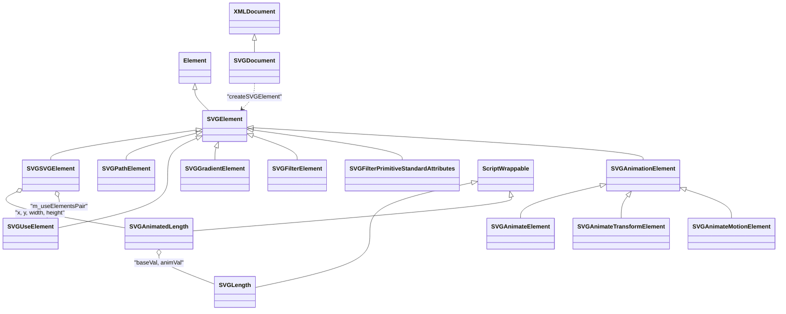
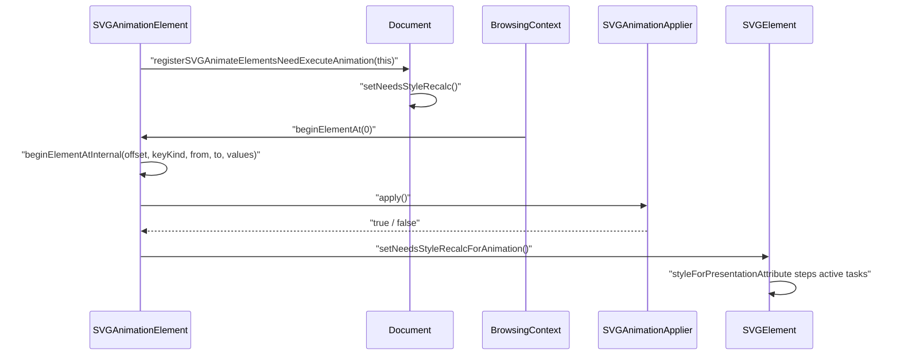

# Functional Requirements: core-dom-svg

> **Relevant source files**
>
> - [src/core/dom/svg/SVGElement.h](src:src/core/dom/svg/SVGElement.h)
> - [src/core/dom/svg/SVGElement.cpp](src:src/core/dom/svg/SVGElement.cpp)
> - [src/core/dom/svg/SVGDocument.cpp](src:src/core/dom/svg/SVGDocument.cpp)
> - [src/core/dom/svg/SVGSVGElement.h](src:src/core/dom/svg/SVGSVGElement.h)
> - [src/core/dom/svg/SVGSVGElement.cpp](src:src/core/dom/svg/SVGSVGElement.cpp)
> - [src/core/dom/svg/SVGPathElement.cpp](src:src/core/dom/svg/SVGPathElement.cpp)
> - [src/core/dom/svg/SVGLength.h](src:src/core/dom/svg/SVGLength.h)
> - [src/core/dom/svg/SVGLength.cpp](src:src/core/dom/svg/SVGLength.cpp)
> - [src/core/dom/svg/SVGAnimatedLength.h](src:src/core/dom/svg/SVGAnimatedLength.h)
> - [src/core/dom/svg/SVGAnimatedEnumeration.cpp](src:src/core/dom/svg/SVGAnimatedEnumeration.cpp)
> - [src/core/dom/svg/SVGAnimationElement.h](src:src/core/dom/svg/SVGAnimationElement.h)
> - [src/core/dom/svg/SVGAnimationElement.cpp](src:src/core/dom/svg/SVGAnimationElement.cpp)

**Module**: [`SVGElement.h`](src:src/core/dom/svg/SVGElement.h)
**Version**: 2026-09-10
**Linked Design Card**: [modules/core-dom-svg.md](../modules/core-dom-svg.md)
**Analysis basis**: AST export and direct source reading

## Overview

The module provides the SVG branch of the DOM: [`SVGElement`](src:src/core/dom/svg/SVGElement.h#L97) extends `Element` with attribute-damage tracking, presentation-attribute styling and paint-server reference resolution, and [`SVGDocument::createSVGElement`](src:src/core/dom/svg/SVGDocument.cpp#L67) maps SVG tag names to the concrete `SVG*Element` classes. Script-facing value objects such as [`SVGLength`](src:src/core/dom/svg/SVGLength.h#L30) and [`SVGAnimatedLength`](src:src/core/dom/svg/SVGAnimatedLength.h#L28) mirror element attributes, and [`SVGAnimationElement`](src:src/core/dom/svg/SVGAnimationElement.h#L52) turns `animate`-family elements into keyframe animations applied to a target element.

## Functional Requirements

### FR-CORE-DOM-SVG-001
**Create SVG elements from qualified tag names**

| Item | Content |
|------|---------|
| **Description** | The module instantiates the concrete SVG element class that corresponds to an SVG-namespace tag name (`svg`, `rect`, `g`, `path`, `circle`, `polygon`, `polyline`, `image`, `text`, `style`, `line`, `ellipse`, `use`, `defs`, `linearGradient`, `radialGradient`, `stop`, `clipPath`, `script`, `mask`, `tspan`, `marker`, `switch`, `symbol`, `animate`, `animateTransform`, `filter`, filter primitives, ...). Mixed-case names such as `linearGradient`/`lineargradient` and `clipPath`/`clippath` are both accepted. |
| **Input** | Owner `Document*`, `QualifiedName` of the tag |
| **Output** | A newly allocated `Element*` of the matching `SVG*Element` subclass |
| **Preconditions** | The qualified name carries the SVG namespace (asserted in the base constructor) |
| **Postconditions** | The element is allocated through its typed GC `operator new`; `isSVGElement()` returns true |
| **Source** | [`SVGDocument::createSVGElement`](src:src/core/dom/svg/SVGDocument.cpp#L67), [`SVGElement::SVGElement`](src:src/core/dom/svg/SVGElement.cpp#L36) |

**Acceptance criteria**:
- [ ] Given tag `path` in the SVG namespace, the factory returns an object for which `isSVGPathElement()` is true. [`SVGPathElement::isSVGPathElement`](src:src/core/dom/svg/SVGPathElement.h#L40)
- [ ] Given either `lineargradient` or `linearGradient`, the factory returns an `SVGLinearGradientElement` whose name is the canonical `linearGradient` atom. [`SVGDocument::createSVGElement`](src:src/core/dom/svg/SVGDocument.cpp#L67)
- [ ] Elements created by the HTML parser, `createElementNS` and `Element::clone` all go through the same factory. [`HTMLConstructionSite::createElement`](src:src/core/dom/parser/HTMLConstructionSite.cpp#L928), [`Document::createElementNS`](src:src/core/dom/Document.cpp#L1144), [`Element::clone`](src:src/core/dom/Element.cpp#L2148)

### FR-CORE-DOM-SVG-002
**Translate attribute changes into style, layout and paint invalidation**

| Item | Content |
|------|---------|
| **Description** | When an SVG attribute value changes, the module marks the element for style recalculation and, depending on the attribute family (geometry, sizing, fill, stroke, opacity, clip-path, display, mask, filter, transform), for layout and/or painting. Which families apply is decided by per-class predicates (`needsGeometryAttributes`, `needsSizingAttributes`, `needsFillAttributes`, `needsStrokeAttributes`, `needsTransparentAttributes`, `needsTransformAttributes`, `needsClipPathAttributes`, `isRenderableElement`). Transform changes also mark every descendant (including shadow DOM) for painting, and changes inside a `mask` or `clipPath` ancestor notify that ancestor's paint clients. |
| **Input** | Attribute `QualifiedName`, previous value, new value, created/removed flags |
| **Output** | Calls to `setNeedsStyleRecalc`, `setNeedsLayout`, `setNeedsPainting`, `attributeOfPaintServerLikeUpdated` on the affected elements |
| **Preconditions** | The new value differs from the old value (equal values are skipped) |
| **Postconditions** | `onload`/`onerror` attributes are installed as `load`/`error` event listeners; paint-server `id` changes notify clients registered under the old and new id |
| **Source** | [`SVGElement::didAttributeChanged`](src:src/core/dom/svg/SVGElement.cpp#L197), [`SVGElement::computeAttributeChangeDamage`](src:src/core/dom/svg/SVGElement.cpp#L61) |

**Acceptance criteria**:
- [ ] Changing `stroke-width` on an element with stroke attributes triggers style recalc, layout and painting. [`SVGElement::computeAttributeChangeDamage`](src:src/core/dom/svg/SVGElement.cpp#L61)
- [ ] Changing `x` on an element whose `needsGeometryAttributes()` is false triggers no geometry damage. [`SVGElement::needsGeometryAttributes`](src:src/core/dom/svg/SVGElement.h#L142)
- [ ] Changing `d` on a `path` element triggers style recalc, layout and painting. [`SVGPathElement::computeAttributeChangeDamage`](src:src/core/dom/svg/SVGPathElement.cpp#L725)
- [ ] Setting an attribute to the value it already holds does not invoke damage computation. [`SVGElement::didAttributeChanged`](src:src/core/dom/svg/SVGElement.cpp#L197)

### FR-CORE-DOM-SVG-003
**Expose presentation attributes as CSS style values**

| Item | Content |
|------|---------|
| **Description** | During style resolution the module converts SVG presentation attributes (`x`, `y`, `x1`..`y2`, `width`, `height`, `fill`, `fill-rule`, `fill-opacity`, `stroke*`, `opacity`, `transform`, `transform-origin`, `clip-path`, `display`, `mask`, `mask-type`, `filter`, and `d` for paths) into `CSSStyleValuePair` entries. If an active animation has produced a value for an attribute, that value is used instead of the attribute string. Pending SVG animation tasks are stepped at the start of this conversion. |
| **Input** | `CSSStyleValuePairVectorHolder& cssValues`, matched rules, optional custom property values |
| **Output** | Appended `CSSStyleValuePair` entries in `cssValues` |
| **Preconditions** | The corresponding `needs*Attributes()` predicate returns true for the attribute family |
| **Postconditions** | Only a `mask` value that parses to a single URL value is emitted; `display` is emitted only for renderable elements |
| **Source** | [`SVGElement::styleForPresentationAttribute`](src:src/core/dom/svg/SVGElement.cpp#L364), [`SVGElement::animatedAttributeAsStyleValue`](src:src/core/dom/svg/SVGElement.cpp#L645) |

**Acceptance criteria**:
- [ ] A `fill="red"` attribute results in a `Fill` style pair. [`SVGElement::styleForPresentationAttribute`](src:src/core/dom/svg/SVGElement.cpp#L364)
- [ ] When `animatedLengthAttribute(x)` holds a fixed value, the emitted `X` pair carries that number rather than the attribute text. [`SVGElement::animatedAttributeAsStyleValue`](src:src/core/dom/svg/SVGElement.cpp#L645)
- [ ] A `path` element's `d` attribute produces a `D` pair holding the path function string. [`SVGPathElement::styleForPresentationAttribute`](src:src/core/dom/svg/SVGPathElement.cpp#L757)

### FR-CORE-DOM-SVG-004
**Parse `viewBox` and `preserveAspectRatio` on the root `svg` element**

| Item | Content |
|------|---------|
| **Description** | The `svg` element parses its `viewBox` attribute into a rectangle (four comma/space separated numbers; x and y may be negative, width and height may not) and its `preserveAspectRatio` attribute into an alignment (`none`, `xMinYMin` ... `xMaxYMax`) plus `meet`/`slice`. When `preserveAspectRatio` is absent, the alignment defaults to `xMidYMid` if a `viewBox` exists and `none` otherwise. When both `width` and `height` are absent but a `viewBox` exists, percentage width/height style values preserving the viewBox ratio are emitted. |
| **Input** | Attribute strings for `viewBox`, `preserveAspectRatio`, `width`, `height` |
| **Output** | `hasViewBox()`, `viewBox()`, `preserveAspectRatioAlign()`, `preserveAspectRatioMeetOrSlice()`; style recalc/layout/paint invalidation on `viewBox` change |
| **Preconditions** | Element is an `SVGSVGElement` (or another class returning true from `needsPreserveAspectRatioValue`) |
| **Postconditions** | An unparseable `viewBox` leaves `hasViewBox()` false; an unknown alignment keyword is reported through `STARFISH_UNSUPPORTED` |
| **Source** | [`SVGSVGElement::parseViewBox`](src:src/core/dom/svg/SVGSVGElement.cpp#L59), [`SVGSVGElement::didAttributeChanged`](src:src/core/dom/svg/SVGSVGElement.cpp#L83), [`SVGElement::didAttributeChanged`](src:src/core/dom/svg/SVGElement.cpp#L197), [`SVGSVGElement::preserveAspectRatioAlign`](src:src/core/dom/svg/SVGSVGElement.cpp#L145) |

**Acceptance criteria**:
- [ ] `viewBox="0 0 100 50"` yields `hasViewBox()==true` and a 100x50 rectangle. [`SVGSVGElement::parseViewBox`](src:src/core/dom/svg/SVGSVGElement.cpp#L59)
- [ ] `viewBox="0 0 100"` (three tokens) yields `hasViewBox()==false`. [`SVGSVGElement::parseViewBox`](src:src/core/dom/svg/SVGSVGElement.cpp#L59)
- [ ] `preserveAspectRatio="xMinYMax slice"` yields align `xMinYMax` and `Slice`. [`SVGElement::didAttributeChanged`](src:src/core/dom/svg/SVGElement.cpp#L197)
- [ ] With no `width`/`height` and `viewBox="0 0 200 100"`, width 100% and height 50% style pairs are emitted. [`SVGSVGElement::styleForPresentationAttribute`](src:src/core/dom/svg/SVGSVGElement.cpp#L113)

### FR-CORE-DOM-SVG-005
**Parse path data into a geometric `Path`**

| Item | Content |
|------|---------|
| **Description** | The module converts SVG path data (`d`) into `Path` segments. The parser is a state machine over lexed tokens that handles absolute and relative commands, implicit command repetition (lookahead for a following number), separate lexing of arc flags, and conversion of elliptical arcs into cubic Bezier segments. The `path` element rebuilds its `Path` whenever its computed style's `d` changes, and `animateMotion` reuses the same parser for its motion path. |
| **Input** | `String* d`, an empty `Path*` |
| **Output** | `Path` populated with move/line/curve segments; on a parse error at a hard failure the path is cleared |
| **Preconditions** | The target `Path` is empty (asserted) |
| **Postconditions** | `SVGPathElement::path()` returns the rebuilt path for layout |
| **Source** | [`SVGPathElement::parsePath`](src:src/core/dom/svg/SVGPathElement.cpp#L396), [`lex`](src:src/core/dom/svg/SVGPathElement.cpp#L316), [`lexArcFlag`](src:src/core/dom/svg/SVGPathElement.cpp#L292), [`paintPathArcCommand`](src:src/core/dom/svg/SVGPathElement.cpp#L75), [`SVGPathElement::didComputedStyleChanged`](src:src/core/dom/svg/SVGPathElement.cpp#L747) |

**Acceptance criteria**:
- [ ] An empty `d` string leaves the path empty without error. [`SVGPathElement::parsePath`](src:src/core/dom/svg/SVGPathElement.cpp#L396)
- [ ] An arc command whose start and end points coincide adds no segment; an arc with a zero radius degenerates to a line. [`paintPathArcCommand`](src:src/core/dom/svg/SVGPathElement.cpp#L75)
- [ ] After a computed-style change the old path is cleared before re-parsing. [`SVGPathElement::didComputedStyleChanged`](src:src/core/dom/svg/SVGPathElement.cpp#L747)

### FR-CORE-DOM-SVG-006
**Provide script-facing length values with unit conversion and read-only protection**

| Item | Content |
|------|---------|
| **Description** | `SVGLength` mirrors a length attribute of a source element. It parses attribute strings into a unit type (`SVG_LENGTHTYPE_NUMBER`, `PERCENTAGE`, `PX`, `CM`, `MM`, `IN`, `PT`, `PC`) and a numeric value, converts to user units on demand (forcing layout if requested), and writes changes back to the attribute. Writes to a read-only length throw `NoModificationAllowedError`; unparseable input throws `SyntaxError`; unsupported unit kinds throw `NotSupportedError`. |
| **Input** | Attribute string or `(unitType, value)` pairs from script; `layoutIfNeeded` flag |
| **Output** | `unitType()`, `value()`, `valueInSpecifiedUnits()`, `valueAsString()`; attribute updates on the source element |
| **Preconditions** | The length is attached to a source element and attribute (detached lengths carry their own value) |
| **Postconditions** | For an `animVal` length (`m_sourceObject` set) the currently animated attribute value, if any, is returned instead of the base value |
| **Source** | [`SVGLength`](src:src/core/dom/svg/SVGLength.h#L30), [`SVGLength::setValueAsString`](src:src/core/dom/svg/SVGLength.cpp#L280), [`SVGLength::value`](src:src/core/dom/svg/SVGLength.cpp#L113), [`SVGLength::throwIfReadOnly`](src:src/core/dom/svg/SVGLength.cpp#L62) |

**Acceptance criteria**:
- [ ] `setValueAsString("10")` sets unit `SVG_LENGTHTYPE_NUMBER` and value 10. [`SVGLength::setValueAsString`](src:src/core/dom/svg/SVGLength.cpp#L280)
- [ ] `setValueAsString("50%")` sets unit `SVG_LENGTHTYPE_PERCENTAGE` and value 50. [`SVGLength::setValueAsString`](src:src/core/dom/svg/SVGLength.cpp#L280)
- [ ] `setValueAsString("abc")` with exceptions enabled throws a `SYNTAX_ERR` `DOMException`. [`SVGLength::setValueAsString`](src:src/core/dom/svg/SVGLength.cpp#L280)
- [ ] Any setter on a read-only length throws `NO_MODIFICATION_ALLOWED_ERR`. [`SVGLength::throwIfReadOnly`](src:src/core/dom/svg/SVGLength.cpp#L62)

### FR-CORE-DOM-SVG-007
**Expose base/animated value pairs (`SVGAnimated*`)**

| Item | Content |
|------|---------|
| **Description** | For animatable attributes the module exposes `baseVal`/`animVal` pairs: `SVGAnimatedLength` wraps two `SVGLength` objects created lazily per attribute by the `STARFISH_SVG_ANIMATED_LENGTH_GETTER` macros; `SVGAnimatedEnumeration` holds a bounded integer and rewrites the source attribute string when `baseVal` is set (e.g. `clipPathUnits`, `orient`, `markerUnits`, `spreadMethod`, `edgeMode`); list variants (`SVGAnimatedLengthList`, `SVGAnimatedNumberList`, `SVGAnimatedTransformList`) wrap list objects that synchronize with the attribute in both directions. |
| **Input** | Getter calls from script or engine code; `setBaseVal(unsigned short)` |
| **Output** | `baseVal()` / `animVal()` objects; attribute updates on the source element |
| **Preconditions** | For enumerations, `baseVal` must be in `1..maxEnumValue` |
| **Postconditions** | Out-of-range enumeration values throw a `DOMException`; the `SVGAnimatedLength` for an attribute is created at most once per element |
| **Source** | [`SVGAnimatedLength`](src:src/core/dom/svg/SVGAnimatedLength.h#L28), [`SVGElement.h`](src:src/core/dom/svg/SVGElement.h#L31), [`SVGAnimatedEnumeration::setBaseVal`](src:src/core/dom/svg/SVGAnimatedEnumeration.cpp#L60), [`SVGAnimatedEnumeration::updateAttribute`](src:src/core/dom/svg/SVGAnimatedEnumeration.cpp#L97), [`SVGTransformList::updateListByAttribute`](src:src/core/dom/svg/SVGTransformList.cpp#L314) |

**Acceptance criteria**:
- [ ] Calling `x()` twice on an `svg` element returns the same `SVGAnimatedLength` object. [`SVGSVGElement.h`](src:src/core/dom/svg/SVGSVGElement.h#L96)
- [ ] `setBaseVal(0)` or a value above `maxEnumValue` throws. [`SVGAnimatedEnumeration::setBaseVal`](src:src/core/dom/svg/SVGAnimatedEnumeration.cpp#L60)
- [ ] Setting `spreadMethod` `baseVal` to `SVG_SPREADMETHOD_REFLECT` writes attribute text `reflect`. [`SVGAnimatedEnumeration::updateAttribute`](src:src/core/dom/svg/SVGAnimatedEnumeration.cpp#L97)
- [ ] Appending to a transform list writes the serialized list back to the `transform` attribute. [`SVGTransformList::updateAttributeByList`](src:src/core/dom/svg/SVGTransformList.cpp#L309)

### FR-CORE-DOM-SVG-008
**Start declarative animations from `animate`, `animateTransform` and `animateMotion`**

| Item | Content |
|------|---------|
| **Description** | Animation elements parse `attributeName`, `from`, `to`, `values`, `dur`, `begin`, `fill` (`freeze`/`remove`), `repeatCount` (number or `indefinite`), `calcMode` (`discrete`/`linear`/`paced`/`spline`), `keySplines` and `href`/`xlink:href`. On insertion into the document they queue themselves on the `Document`; during the next style resolution `beginElementAt(0)` builds `AnimationKeyframes` (duration, delay, iteration count, fill mode, timing function, keyframes) and applies them to the target element (the `href` target or the parent). `animateTransform` additionally parses `type` and converts values to CSS transform functions; `animateMotion` samples a path from a child `mpath` reference or its `path` attribute. Removal from the document cancels the active tasks. |
| **Input** | Element attributes listed above; target element |
| **Output** | `AnimationKeyframes` stored on the element, animation applied through `SVGAnimationApplier`, `setNeedsStyleRecalcForAnimation()` on the element |
| **Preconditions** | `attributeName` parsed; `dur` present; at least two values (`values`, or both `from` and `to`); a resolvable target element |
| **Postconditions** | With `calcMode="spline"` and a mismatched number of `keySplines`, values are converted to fallback values and the mode falls back to linear; `onbegin`/`onend`/`onrepeat` attributes are installed as `beginEvent`/`endEvent`/`repeatEvent` listeners |
| **Source** | [`SVGAnimationElement::didAttributeChanged`](src:src/core/dom/svg/SVGAnimationElement.cpp#L114), [`SVGAnimationElement::beginElement`](src:src/core/dom/svg/SVGAnimationElement.cpp#L252), [`SVGAnimationElement::beginElementAtInternal`](src:src/core/dom/svg/SVGAnimationElement.cpp#L268), [`SVGAnimationElement::targetElement`](src:src/core/dom/svg/SVGAnimationElement.cpp#L237), [`SVGAnimateTransformElement::beginElementAt`](src:src/core/dom/svg/SVGAnimateTransformElement.cpp#L78), [`SVGAnimateMotionElement::beginElementAt`](src:src/core/dom/svg/SVGAnimateMotionElement.cpp#L69), [`SVGAnimationElement::didNodeRemovedFromDocumentTree`](src:src/core/dom/svg/SVGAnimationElement.cpp#L97) |

**Acceptance criteria**:
- [ ] `dur="2s"` and `dur="2000"` both yield a 2000 ms duration. [`SVGAnimationElement::parseDur`](src:src/core/dom/svg/SVGAnimationElement.cpp#L495)
- [ ] `repeatCount="indefinite"` yields an infinite iteration count; `fill="freeze"` maps to fill mode `Forwards`. [`SVGAnimationElement::parseRepeatCount`](src:src/core/dom/svg/SVGAnimationElement.cpp#L533), [`svgAnimationFillToAnimationFillModeValue`](src:src/core/dom/svg/SVGAnimationElement.cpp#L39)
- [ ] An animation with only `from` (no `to`, no `values`) does not start. [`SVGAnimationElement::beginElementAtInternal`](src:src/core/dom/svg/SVGAnimationElement.cpp#L268)
- [ ] `animateTransform` with `type="rotate"` and `from="0"` produces a `Transform` style pair. [`SVGAnimateTransformElement::parseFromTo`](src:src/core/dom/svg/SVGAnimateTransformElement.cpp#L117)
- [ ] Removing an active animation element cancels its tasks on the target. [`SVGAnimationElement::didNodeRemovedFromDocumentTree`](src:src/core/dom/svg/SVGAnimationElement.cpp#L97)

### FR-CORE-DOM-SVG-009
**Resolve `clip-path`, `mask` and `filter` references and track paint clients**

| Item | Content |
|------|---------|
| **Description** | An SVG element resolves the URL in its computed `clip-path`, `mask-image` or `filter` style to the referenced `clipPath`, `mask` or `filter` element in the same document (using the referrer as base when the document was loaded from a data URL), and registers itself on the `Document` as a paint client of that id. Paint-server-like elements (gradients, clip paths, masks, filters) notify their clients when their `id` changes, when their own attributes change, or when they are removed from the document. `href` references are resolved to SVG elements by fragment id. |
| **Input** | Computed style values (`clipPath()`, `maskImage(0)`, `filter()`), `href` strings |
| **Output** | `Optional<SVGClipPathElement*>`, `Optional<SVGMaskElement*>`, `Optional<SVGFilterElement*>`, `Optional<SVGElement*>`; client registrations and layout/paint notifications on the `Document` |
| **Preconditions** | The element participates in rendering; the referenced element exists and is of the expected class |
| **Postconditions** | References to elements of a different class return an empty `Optional` |
| **Source** | [`SVGElement::clipPathElement`](src:src/core/dom/svg/SVGElement.cpp#L536), [`SVGElement::maskElement`](src:src/core/dom/svg/SVGElement.cpp#L551), [`SVGElement::filterElement`](src:src/core/dom/svg/SVGElement.cpp#L569), [`getElementByURLAndRegisterUsageToDocument`](src:src/core/dom/svg/SVGElement.cpp#L518), [`SVGElement::findHrefTarget`](src:src/core/dom/svg/SVGElement.cpp#L608), [`SVGElement::attributeOfPaintServerLikeUpdated`](src:src/core/dom/svg/SVGElement.cpp#L636), [`SVGElement::didNodeRemovedFromDocumentTree`](src:src/core/dom/svg/SVGElement.cpp#L310) |

**Acceptance criteria**:
- [ ] `clip-path: url(#c)` where `#c` is a `clipPath` element returns that element and registers the caller as a client of id `c`. [`SVGElement::clipPathElement`](src:src/core/dom/svg/SVGElement.cpp#L536)
- [ ] `clip-path: url(#r)` where `#r` is a `rect` returns an empty result. [`SVGElement::clipPathElement`](src:src/core/dom/svg/SVGElement.cpp#L536)
- [ ] Removing a gradient element with an `id` from the document notifies clients of that id and unregisters the element. [`SVGElement::didNodeRemovedFromDocumentTree`](src:src/core/dom/svg/SVGElement.cpp#L310)

### FR-CORE-DOM-SVG-010
**Instantiate `use` element targets in a shadow tree**

| Item | Content |
|------|---------|
| **Description** | The root `svg` element walks its subtree, and for each `use` element resolves the `href` target, clones it into the `use` element's shadow root (replacing previous contents only when the target or cloned content changed), and records the `(use, target)` pair. Node removals that touch a recorded pair trigger a style recalculation of the parent. |
| **Input** | `use` elements' `href`; document tree |
| **Output** | Shadow-root contents of each `use`; `useElementsPair()` list on the `svg` element |
| **Preconditions** | The target does not contain the `use` element itself (self-reference is skipped) |
| **Postconditions** | `SVGUseElement::target()` returns the resolved target or empty |
| **Source** | [`SVGSVGElement::connectUseElements`](src:src/core/dom/svg/SVGSVGElement.cpp#L192), [`SVGUseElement::updateShadowTree`](src:src/core/dom/svg/SVGUseElement.cpp#L68), [`SVGElement::didNodeRemoved`](src:src/core/dom/svg/SVGElement.cpp#L289) |

**Acceptance criteria**:
- [ ] A `use` whose `href` points to a `rect` gets a cloned `rect` as the first child of its shadow root. [`SVGUseElement::updateShadowTree`](src:src/core/dom/svg/SVGUseElement.cpp#L68)
- [ ] A `use` whose `href` points to an ancestor of itself gets no target. [`SVGUseElement::updateShadowTree`](src:src/core/dom/svg/SVGUseElement.cpp#L68)
- [ ] Calling `connectUseElements()` twice with unchanged targets does not rebuild shadow-root contents. [`SVGUseElement::updateShadowTree`](src:src/core/dom/svg/SVGUseElement.cpp#L68)

## Non-Functional Requirements

| Item | Requirement | Source |
|------|-------------|--------|
| Performance | `SVGAnimatedLength` objects are created lazily on first access; `SVGLength::value()` only forces layout when `layoutIfNeeded` is true; `use` shadow contents are rebuilt only when the target or clone differs | [`SVGElement.h`](src:src/core/dom/svg/SVGElement.h#L31), [`SVGLength::value`](src:src/core/dom/svg/SVGLength.cpp#L113), [`SVGUseElement::updateShadowTree`](src:src/core/dom/svg/SVGUseElement.cpp#L68) |
| Security | `script` elements consult the content security policy and nonce before execution; `use` refuses to clone a target that contains the `use` element | [`SVGScriptElement.cpp`](src:src/core/dom/svg/SVGScriptElement.cpp#L34), [`SVGUseElement::updateShadowTree`](src:src/core/dom/svg/SVGUseElement.cpp#L68) |
| Error handling | Script-facing setters throw `DOMException` (`NO_MODIFICATION_ALLOWED_ERR`, `SYNTAX_ERR`, `NOT_SUPPORTED_ERR`, `SCRIPT_TYPE_ERR`); animation start aborts with a log message when duration, values or target are invalid; unsupported keywords are reported through `STARFISH_UNSUPPORTED` | [`SVGLength::setValueAsString`](src:src/core/dom/svg/SVGLength.cpp#L280), [`SVGAnimatedEnumeration::setBaseVal`](src:src/core/dom/svg/SVGAnimatedEnumeration.cpp#L60), [`SVGAnimationElement::beginElementAtInternal`](src:src/core/dom/svg/SVGAnimationElement.cpp#L268), [`SVGElement::didAttributeChanged`](src:src/core/dom/svg/SVGElement.cpp#L197) |
| Logging | `STARFISH_LOG_WARN` on unknown `fill` values; `STARFISH_LOG_ERROR` when fallback conversion or animation application fails | [`SVGAnimationElement::parseFill`](src:src/core/dom/svg/SVGAnimationElement.cpp#L517), [`SVGAnimationElement::beginElementAtInternal`](src:src/core/dom/svg/SVGAnimationElement.cpp#L268) |
| Memory | Every element and value object is allocated with an explicit GC type descriptor listing its pointer members | [`SVGElement::operator new`](src:src/core/dom/svg/SVGElement.cpp#L47), [`SVGAnimationElement::fillGCDescriptor`](src:src/core/dom/svg/SVGAnimationElement.h#L54) |

## Constraints

- `pauseAnimations()` and `unpauseAnimations()` on the `svg` element are unsupported and only report through `STARFISH_UNSUPPORTED_METHOD`. [`SVGSVGElement::pauseAnimations`](src:src/core/dom/svg/SVGSVGElement.cpp#L182)
- `SVGLength` does not implement the `EMS`/`EXS` unit types when parsing; unknown CSS length kinds fall back to `PX`. [`SVGLength::setValueAsString`](src:src/core/dom/svg/SVGLength.cpp#L280)
- `animateTransform` ignores the `values` attribute and uses only `from`/`to`. [`SVGAnimateTransformElement::beginElementAt`](src:src/core/dom/svg/SVGAnimateTransformElement.cpp#L78)
- The `begin` offset passed to `beginElementAt` is not applied inside `beginElementAtInternal` (marked as a TODO in code). [`SVGAnimationElement::beginElementAtInternal`](src:src/core/dom/svg/SVGAnimationElement.cpp#L268)
- The `mask` presentation attribute accepts only a single URL value. [`SVGElement::styleForPresentationAttribute`](src:src/core/dom/svg/SVGElement.cpp#L364)
- `SVGAnimateElement`, `SVGAnimateTransformElement` and `SVGAnimationElement` do not respond to `clip-path` or `opacity` attribute changes (`needsClipPathAttributes`/`needsTransparentAttributes` return false). [`SVGAnimationElement::needsClipPathAttributes`](src:src/core/dom/svg/SVGAnimationElement.h#L80)

## Module Design Card Linkage

| FR | Implementation | Design Card section |
|----|----------------|---------------------|
| FR-CORE-DOM-SVG-001 | [`SVGDocument::createSVGElement`](src:src/core/dom/svg/SVGDocument.cpp#L67) | [Public Interface](../modules/core-dom-svg.md#public-interface), [Key Flow](../modules/core-dom-svg.md#key-flow) |
| FR-CORE-DOM-SVG-002 | [`SVGElement::computeAttributeChangeDamage`](src:src/core/dom/svg/SVGElement.cpp#L61) | [Architectural Rules](../modules/core-dom-svg.md#architectural-rules) |
| FR-CORE-DOM-SVG-003 | [`SVGElement::styleForPresentationAttribute`](src:src/core/dom/svg/SVGElement.cpp#L364) | [Architectural Rules](../modules/core-dom-svg.md#architectural-rules) |
| FR-CORE-DOM-SVG-004 | [`SVGSVGElement::parseViewBox`](src:src/core/dom/svg/SVGSVGElement.cpp#L59) | [Quick Navigation](../modules/core-dom-svg.md#quick-navigation) |
| FR-CORE-DOM-SVG-005 | [`SVGPathElement::parsePath`](src:src/core/dom/svg/SVGPathElement.cpp#L396) | [Key Flow](../modules/core-dom-svg.md#key-flow) |
| FR-CORE-DOM-SVG-006 | [`SVGLength::setValueAsString`](src:src/core/dom/svg/SVGLength.cpp#L280) | [Architectural Rules](../modules/core-dom-svg.md#architectural-rules) |
| FR-CORE-DOM-SVG-007 | [`SVGAnimatedLength`](src:src/core/dom/svg/SVGAnimatedLength.h#L28) | [Public Interface](../modules/core-dom-svg.md#public-interface) |
| FR-CORE-DOM-SVG-008 | [`SVGAnimationElement::beginElementAtInternal`](src:src/core/dom/svg/SVGAnimationElement.cpp#L268) | [Key Flow](../modules/core-dom-svg.md#key-flow) |
| FR-CORE-DOM-SVG-009 | [`SVGElement::clipPathElement`](src:src/core/dom/svg/SVGElement.cpp#L536) | [Architectural Rules](../modules/core-dom-svg.md#architectural-rules) |
| FR-CORE-DOM-SVG-010 | [`SVGSVGElement::connectUseElements`](src:src/core/dom/svg/SVGSVGElement.cpp#L192) | [Key Flow](../modules/core-dom-svg.md#key-flow) |

## ENUM Definitions

| ENUM | Values | Used in | Source |
|------|--------|---------|--------|
| `SVGLength::UnitType` | `SVG_LENGTHTYPE_UNKNOWN`, `SVG_LENGTHTYPE_NUMBER`, `SVG_LENGTHTYPE_PERCENTAGE`, `SVG_LENGTHTYPE_EMS`, `SVG_LENGTHTYPE_EXS`, `SVG_LENGTHTYPE_PX`, `SVG_LENGTHTYPE_CM`, `SVG_LENGTHTYPE_MM`, `SVG_LENGTHTYPE_IN`, `SVG_LENGTHTYPE_PT`, `SVG_LENGTHTYPE_PC` | `SVGLength` unit parsing and conversion | [`SVGLength::UnitType`](src:src/core/dom/svg/SVGLength.h#L32) |
| `SVGTransform::Type` | `SVG_TRANSFORM_UNKOWN`, `SVG_TRANSFORM_MATRIX`, `SVG_TRANSFORM_TRANSLATE`, `SVG_TRANSFORM_SCALE`, `SVG_TRANSFORM_ROTATE`, `SVG_TRANSFORM_SKEWX`, `SVG_TRANSFORM_SKEWY` | `SVGTransform::type()` | [`SVGTransform::Type`](src:src/core/dom/svg/SVGTransform.h#L34) |
| `SVGUnitTypes::UnitTypes` | `SVG_UNIT_TYPE_UNKNOWN`, `SVG_UNIT_TYPE_USERSPACEONUSE`, `SVG_UNIT_TYPE_OBJECTBOUNDINGBOX` | `clipPathUnits`, `filterUnits`, `primitiveUnits`, `gradientUnits` enumerations | [`SVGUnitTypes::UnitTypes`](src:src/core/dom/svg/SVGUnitTypes.h#L27) |
| `SVGMarkerElement::UNIT` | `SVG_MARKERUNTIS_UNKNOWN`, `SVG_MARKERUNITS_USERSPACEONUSE`, `SVG_MARKERUNITS_STROKEWIDTH` | `markerUnits` enumeration | [`SVGMarkerElement::UNIT`](src:src/core/dom/svg/SVGMarkerElement.h#L37) |
| `SVGMarkerElement::ORIENT` | `SVG_MARKER_ORIENT_UNKNOWN`, `SVG_MARKER_ORIENT_AUTO`, `SVG_MARKER_ORIENT_ANGLE` | `orient` enumeration | [`SVGMarkerElement::ORIENT`](src:src/core/dom/svg/SVGMarkerElement.h#L43) |
| `SVGComponentTransferFunctionElement::ComponentTransferType` | `SVG_FECOMPONENTTRANSFER_TYPE_UNKNOWN`, `SVG_FECOMPONENTTRANSFER_TYPE_IDENTITY`, `SVG_FECOMPONENTTRANSFER_TYPE_TABLE`, `SVG_FECOMPONENTTRANSFER_TYPE_DISCRETE`, `SVG_FECOMPONENTTRANSFER_TYPE_LINEAR`, `SVG_FECOMPONENTTRANSFER_TYPE_GAMMA` | `feFunc*` element `type` | [`SVGComponentTransferFunctionElement::ComponentTransferType`](src:src/core/dom/svg/SVGComponentTransferFunctionElement.h#L29) |
| `SVGFETurbulenceElement::TurbulenceType` | `SVG_TURBULENCE_TYPE_UNKNOWN`, `SVG_TURBULENCE_TYPE_FRACTALNOISE`, `SVG_TURBULENCE_TYPE_TURBULENCE` | `feTurbulence` `type` | [`SVGFETurbulenceElement::TurbulenceType`](src:src/core/dom/svg/SVGFETurbulenceElement.h#L42) |
| `SVGFETurbulenceElement::StitchType` | `SVG_STITCHTYPE_UNKNOWN`, `SVG_STITCHTYPE_STITCH`, `SVG_STITCHTYPE_NOSTITCH` | `feTurbulence` `stitchTiles` | [`SVGFETurbulenceElement::StitchType`](src:src/core/dom/svg/SVGFETurbulenceElement.h#L52) |
| `SVGPathElement::parsePath` local `Mode` | `WaitCommand`, `WaitCoordsX`, `WaitCoordsY`, `WaitCoordsX2`, `WaitCoordsY2`, `WaitCoordsX3`, `WaitCoordsY3`, `WaitCoordsX4`, `WaitCoordsY4` | Path data state machine | [`SVGPathElement.cpp`](src:src/core/dom/svg/SVGPathElement.cpp#L401) |
| `SVGAnimationFill` | `Freeze`, `Remove` | `fill` attribute of animation elements | [`SVGAnimationFill`](src:src/core/dom/svg/SVGAnimationElement.h#L33) |
| `SVGAnimationCalcMode` | `Discrete`, `Linear`, `Paced`, `Spline` | `calcMode` attribute of animation elements | [`SVGAnimationCalcMode`](src:src/core/dom/svg/SVGAnimationElement.h#L42) |
| `TransformType` | `Translate`, `Scale`, `Rotate`, `SkewX`, `SkewY` | `animateTransform` `type` | [`TransformType`](src:src/core/dom/svg/SVGAnimateTransformElement.h#L27) |
| `SVGAngle::UnitType` | `SVG_ANGLETYPE_UNKNOWN`, `SVG_ANGLETYPE_UNSPECIFIED`, `SVG_ANGLETYPE_DEG`, `SVG_ANGLETYPE_RAD`, `SVG_ANGLETYPE_GRAD` | `SVGAngle` | [`SVGAngle::UnitType`](src:src/core/dom/svg/SVGAngle.h#L32) |
| `SVGGradientElement::SpreadMethod` | `SVG_SPREADMETHOD_UNKNOWN`, `SVG_SPREADMETHOD_PAD`, `SVG_SPREADMETHOD_REFLECT`, `SVG_SPREADMETHOD_REPEAT` | `spreadMethod` enumeration | [`SVGGradientElement::SpreadMethod`](src:src/core/dom/svg/SVGGradientElement.h#L34) |

## Error Code Definitions

None found in code (no `error_code`, `ERR_`, `ERROR_` or `EXIT_` constants are defined in this module; failures are reported through `DOMException` codes defined in core-dom).

## Constant Definitions

| Constant | Value | Purpose | Source |
|----------|-------|---------|-------|
| `filter` region defaults (`x`, `y`) | `-10` (`SVG_LENGTHTYPE_PERCENTAGE`) | Default filter region origin when the attribute is absent | [`SVGFilterElement.h`](src:src/core/dom/svg/SVGFilterElement.h#L79) |
| `filter` region defaults (`width`, `height`) | `120` (`SVG_LENGTHTYPE_PERCENTAGE`) | Default filter region size when the attribute is absent | [`SVGFilterElement.h`](src:src/core/dom/svg/SVGFilterElement.h#L85) |
| Default `repeatCount` | `1.0f` | Iteration count when `repeatCount` is absent | [`SVGAnimationElement::beginElementAtInternal`](src:src/core/dom/svg/SVGAnimationElement.cpp#L268) |

No constant entries were recorded for this module's files in the constant extraction results; the rows above are taken from the source.

## Message Protocol

None found in code.

## Class Diagram

## Sequence Diagram

## Test Cases

### Positive
- `createSVGElement(doc, svg:path)` → returns an element for which `isSVGPathElement()` is true. [`SVGDocument::createSVGElement`](src:src/core/dom/svg/SVGDocument.cpp#L67)
- `viewBox="0 0 100 50"` on `svg` → `hasViewBox()` true, `viewBox()` is (0, 0, 100, 50). [`SVGSVGElement::parseViewBox`](src:src/core/dom/svg/SVGSVGElement.cpp#L59)
- `SVGLength::setValueAsString("2.5cm")` → unit `SVG_LENGTHTYPE_CM`, value 2.5. [`SVGLength::setValueAsString`](src:src/core/dom/svg/SVGLength.cpp#L280)
- `animate` with `attributeName`, `from`, `to`, `dur="1s"` inserted into a rendered document → keyframes with a 1000 ms duration are created and applied on the next style resolution. [`SVGAnimationElement::beginElementAtInternal`](src:src/core/dom/svg/SVGAnimationElement.cpp#L268)
- `use href="#r"` where `#r` is a `rect` → shadow root contains a cloned `rect`; `target()` returns the `rect`. [`SVGUseElement::updateShadowTree`](src:src/core/dom/svg/SVGUseElement.cpp#L68)
- `d="M0 0 L10 10"` on `path` → the `Path` contains a move and a line segment. [`SVGPathElement::parsePath`](src:src/core/dom/svg/SVGPathElement.cpp#L396)

### Negative
- `SVGLength::setValueAsString("abc")` with exceptions enabled → `DOMException` `SYNTAX_ERR`. [`SVGLength::setValueAsString`](src:src/core/dom/svg/SVGLength.cpp#L280)
- `SVGLength::setValue` on a read-only length → `DOMException` `NO_MODIFICATION_ALLOWED_ERR`. [`SVGLength::throwIfReadOnly`](src:src/core/dom/svg/SVGLength.cpp#L62)
- `SVGAnimatedEnumeration::setBaseVal(0)` → `DOMException` `SCRIPT_TYPE_ERR`. [`SVGAnimatedEnumeration::setBaseVal`](src:src/core/dom/svg/SVGAnimatedEnumeration.cpp#L60)
- `animate` without `dur` → no keyframes created, animation does not start. [`SVGAnimationElement::beginElementAtInternal`](src:src/core/dom/svg/SVGAnimationElement.cpp#L268)
- `clip-path: url(#x)` where `#x` is not a `clipPath` → `clipPathElement()` returns empty. [`SVGElement::clipPathElement`](src:src/core/dom/svg/SVGElement.cpp#L536)
- `fill="middle"` on an animation element → warning logged, `m_fill` reset. [`SVGAnimationElement::parseFill`](src:src/core/dom/svg/SVGAnimationElement.cpp#L517)

### Edge
- `viewBox="0 0 100"` (three numbers) → `hasViewBox()` false, no rectangle stored. [`SVGSVGElement::parseViewBox`](src:src/core/dom/svg/SVGSVGElement.cpp#L59)
- `svg` without `preserveAspectRatio` but with `viewBox` → `preserveAspectRatioAlign()` returns `xMidYMid`; without `viewBox` returns `None`. [`SVGSVGElement::preserveAspectRatioAlign`](src:src/core/dom/svg/SVGSVGElement.cpp#L145)
- Arc command with identical start and end points → no segment added; arc with `rx=0` → straight line to the end point. [`paintPathArcCommand`](src:src/core/dom/svg/SVGPathElement.cpp#L75)
- `calcMode="spline"` with a `keySplines` count not equal to values-1 → values converted to fallback values and mode falls back to linear. [`SVGAnimationElement::beginElementAtInternal`](src:src/core/dom/svg/SVGAnimationElement.cpp#L268)
- `repeatCount="indefinite"` → infinite iteration count. [`SVGAnimationElement::parseRepeatCount`](src:src/core/dom/svg/SVGAnimationElement.cpp#L533)
- `SVGLength::setValueAsString("")` with exceptions disabled → unit `SVG_LENGTHTYPE_NUMBER`, value 0. [`SVGLength::setValueAsString`](src:src/core/dom/svg/SVGLength.cpp#L280)
- `use` whose `href` targets its own ancestor → no clone, `target()` empty. [`SVGUseElement::updateShadowTree`](src:src/core/dom/svg/SVGUseElement.cpp#L68)
