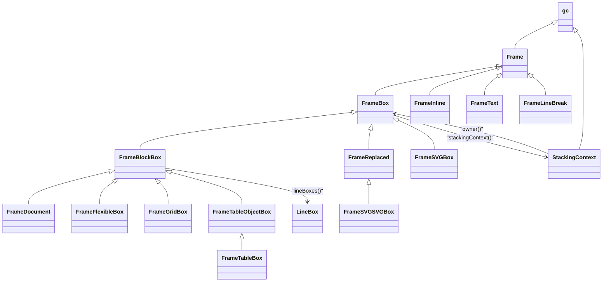
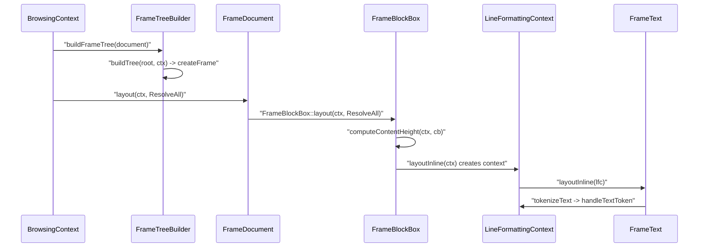

# Functional Requirements: core-layout

> **Relevant source files**
>
> - [src/core/layout/Frame.h](src:src/core/layout/Frame.h)
> - [src/core/layout/Frame.cpp](src:src/core/layout/Frame.cpp)
> - [src/core/layout/FrameBox.h](src:src/core/layout/FrameBox.h)
> - [src/core/layout/FrameBox.cpp](src:src/core/layout/FrameBox.cpp)
> - [src/core/layout/FrameBlockBox.h](src:src/core/layout/FrameBlockBox.h)
> - [src/core/layout/FrameBlockBox.cpp](src:src/core/layout/FrameBlockBox.cpp)
> - [src/core/layout/FrameBlockBoxBlockLayout.cpp](src:src/core/layout/FrameBlockBoxBlockLayout.cpp)
> - [src/core/layout/FrameBlockBoxInlineLayout.cpp](src:src/core/layout/FrameBlockBoxInlineLayout.cpp)
> - [src/core/layout/FrameDocument.cpp](src:src/core/layout/FrameDocument.cpp)
> - [src/core/layout/FrameTreeBuilder.cpp](src:src/core/layout/FrameTreeBuilder.cpp)
> - [src/core/layout/StackingContext.cpp](src:src/core/layout/StackingContext.cpp)
> - [src/core/layout/svg/FrameSVGSVGBox.cpp](src:src/core/layout/svg/FrameSVGSVGBox.cpp)

**Module**: [`Frame.h`](src:src/core/layout/Frame.h)
**Version**: 2026-09-10
**Linked Design Card**: [modules/core-layout.md](../modules/core-layout.md)
**Analysis basis**: AST export and direct source reading

## Overview

The layout module turns a styled DOM into a tree of garbage-collected [`Frame`](src:src/core/layout/Frame.h#L1203) objects created by [`FrameTreeBuilder::createFrame`](src:src/core/layout/FrameTreeBuilder.cpp#L798). Each frame resolves its geometry through the virtual [`Frame::layout`](src:src/core/layout/Frame.h#L1847) entry point using fixed-point [`LayoutUnit`](src:src/core/layout/LayoutUtil.h#L142) values, and boxes that need one own a [`StackingContext`](src:src/core/layout/StackingContext.h#L146) that paints, composites and hit-tests their subtree.

## Functional Requirements

### FR-CORE-LAYOUT-001
**Build the frame tree from the DOM according to node type and display value**

| Item | Content |
|------|---------|
| **Description** | The module creates a frame for every visible DOM node, choosing the frame class from the node type (video, canvas, image, iframe, br, object, select, optgroup, option, button, input/textarea, text, comment) or, otherwise, from the computed `display` value (box/inline-box and flex → flexible box; grid → grid box; table family → table boxes; block/inline-block/list-item → block box; inline → text or inline frame). |
| **Input** | `Document*` whose root element has a computed style; per node a `Node*` and `FrameTreeBuilderContext&`. |
| **Output** | A frame subtree rooted at the document's `FrameDocument`; `nullptr` (and cleared subtree) for `display: none` nodes, comments, and collapsed table-display nodes. Counter and quote text is filled afterwards when flagged. |
| **Preconditions** | `document->frame()` exists; root element style resolved. |
| **Postconditions** | `needsFrameTreeBuild` / `childNeedsFrameTreeBuild` flags cleared on the root and document; if counting or quote flags were outdated, `traverseFrameTreeToFillText` has run. |
| **Source** | [`FrameTreeBuilder::buildFrameTree`](src:src/core/layout/FrameTreeBuilder.cpp#L1241), [`FrameTreeBuilder::createFrame`](src:src/core/layout/FrameTreeBuilder.cpp#L798) |

**Acceptance criteria**:
- [ ] A node with `display: none` yields no frame and its previous subtree is cleared via [`FrameTreeBuilder::clearTree`](src:src/core/layout/FrameTreeBuilder.cpp#L152).
- [ ] A node with `display: flex` or `display: inline-flex` yields a [`FrameFlexibleBox`](src:src/core/layout/FrameFlexibleBox.h#L121); `display: grid` yields a [`FrameGridBox`](src:src/core/layout/FrameGridBox.h#L504); `display: table` yields a [`FrameTableBox`](src:src/core/layout/FrameTableBox.h#L254).
- [ ] An inline text node yields a [`FrameText`](src:src/core/layout/FrameText.h#L52); a non-text inline element yields a [`FrameInline`](src:src/core/layout/FrameInline.h#L27).
- [ ] A `display` value with no matching branch reaches the unreachable assertion at the end of `createFrame`.

### FR-CORE-LAYOUT-002
**Lay out the document root to the window viewport size**

| Item | Content |
|------|---------|
| **Description** | The document frame sets its own width and height to the window's inner width and height, adopts the root element's direction, marks the viewport as damaged when the size changed, forces a full root relayout on height change, and then runs the generic block layout. |
| **Input** | `LayoutContext&`, `LayoutWantToResolve`. Window `innerWidth()` / `innerHeight()`. |
| **Output** | Document frame geometry equal to the viewport; child frames laid out. |
| **Preconditions** | The document frame has at most one child, which is the root element frame. |
| **Postconditions** | `ctx.viewportWidthDamaged()` / `viewportHeightDamaged()` set when the size changed since the last layout. |
| **Source** | [`FrameDocument::layout`](src:src/core/layout/FrameDocument.cpp#L46) |

**Acceptance criteria**:
- [ ] After layout, the document frame style width and height are `Length::Fixed` values equal to the window inner size.
- [ ] When the inner height differs from the previously stored fixed height, the root element frame has `needsLayout()` true before `FrameBlockBox::layout` runs ([`Frame::markNeedsLayout`](src:src/core/layout/Frame.h#L2002)).
- [ ] A document with no root child performs no child layout.

### FR-CORE-LAYOUT-003
**Resolve block box size and select the inner formatting context**

| Item | Content |
|------|---------|
| **Description** | A block box resolves its horizontal margins and width against its containing block (with dedicated handling for absolutely positioned boxes and modal dialogs), then resolves height by delegating to the table, flex, grid, block-flow, or inline-flow algorithm depending on its kind and children. |
| **Input** | `LayoutContext&`, `LayoutWantToResolve` (`ResolveWidth`, `ResolveHeight`, or `ResolveAll`); containing block content width and style. |
| **Output** | Box `x`, `width`, `height`, margins/borders/padding set; content height registered in the context for table cells, flex items and buttons. |
| **Preconditions** | A `BlockFormattingContextBlock` is established for the duration of the call; a containing block exists. |
| **Postconditions** | `contentWidthDamaged` cleared when width was resolved. |
| **Source** | [`FrameBlockBox::layout`](src:src/core/layout/FrameBlockBox.cpp#L601), [`FrameBlockBox::computeContentHeight`](src:src/core/layout/FrameBlockBox.cpp#L195) |

**Acceptance criteria**:
- [ ] A `FrameTableBox` child layout is performed by [`FrameTableBox::layoutTable`](src:src/core/layout/FrameTableBox.cpp#L79); a `FrameFlexibleBox` by [`FrameFlexibleBox::layoutFlex`](src:src/core/layout/FrameFlexibleBox.cpp#L1933); a `FrameGridBox` by [`FrameGridBox::layoutGrid`](src:src/core/layout/FrameGridBox.cpp#L2308).
- [ ] When [`FrameBlockBox::hasBlockFlow`](src:src/core/layout/FrameBlockBox.h#L859) is true (first child is block-level and in normal flow) the height comes from `layoutBlock`, otherwise from `layoutInline`.
- [ ] A modal `<dialog>` uses the document frame as its containing block.

### FR-CORE-LAYOUT-004
**Place block-flow children with margin collapsing**

| Item | Content |
|------|---------|
| **Description** | For a block box whose children are block-level, the module lays each child out for width, determines whether it is self-collapsing, estimates its vertical position through the context's `MarginInfo` and margin-collapse result, positions it for the parent's direction, and accumulates the normal-flow height. |
| **Input** | `LayoutContext&`; children in document order (all in normal flow). |
| **Output** | Returns the block's content height (`LayoutUnit`); each child has `x`/`y` set. Existing line boxes are cleared first. |
| **Preconditions** | Every child satisfies `isNormalFlow()`. |
| **Postconditions** | Context `MarginInfo` for this block reflects the last child's margins. |
| **Source** | [`FrameBlockBox::layoutBlock`](src:src/core/layout/FrameBlockBoxBlockLayout.cpp#L127) |

**Acceptance criteria**:
- [ ] A block with no children sets its `MarginInfo` margins to 0 and returns a height derived only from padding and border.
- [ ] Each child is laid out with `ResolveWidth` before its vertical position is estimated.
- [ ] `m_lineBoxes` is emptied at the start of block-flow layout ([`FrameBlockBox::clearLineBoxes`](src:src/core/layout/FrameBlockBox.cpp#L515)).

### FR-CORE-LAYOUT-005
**Lay out inline content into line boxes**

| Item | Content |
|------|---------|
| **Description** | For a block whose children are inline-level, the module creates a `LineFormattingContext`, computes bidirectional text direction, walks the children calling each child's `layoutInline`, flushes any pending word, removes a trailing empty line box, finishes the last line, and applies `text-overflow` handling when required. Text frames, inline frames, replaced frames, line breaks and inline-block boxes each contribute through their own `layoutInline` override. |
| **Input** | `LayoutContext&`; the block's inline children and their computed styles (`direction`, `word-wrap`, `text-overflow`). |
| **Output** | Returns the content height; the block's `lineBoxes()` contain `LineBox` objects holding `InlineTextBox` / `InlineNonReplacedBox` / atomic inline boxes. Returns 0 for an unnecessary anonymous block. |
| **Preconditions** | `isNecessaryBlockBox()` true. |
| **Postconditions** | No pending floating boxes, pending inline boxes, absolute boxes, or unfinished word remain in the context. |
| **Source** | [`FrameBlockBox::layoutInline`](src:src/core/layout/FrameBlockBoxInlineLayout.cpp#L4004), [`LineFormattingContext::layoutInline`](src:src/core/layout/FrameBlockBoxInlineLayout.cpp#L3466) |

**Acceptance criteria**:
- [ ] A ` ` child inserts the current word and breaks the line ([`FrameLineBreak::layoutInline`](src:src/core/layout/FrameBlockBoxInlineLayout.cpp#L3426)).
- [ ] A floating inline-level block is laid out with `ResolveAll` and inserted as a floating box; a non-floating one is pushed as an inline-block and its ascender registered ([`FrameBlockBox::layoutInline`](src:src/core/layout/FrameBlockBoxInlineLayout.cpp#L3387)).
- [ ] An absolutely positioned box child is handled via `handleAbsoluteBox` instead of `layoutInline`.
- [ ] An inline element produces an `InlineNonReplacedBox` under the current layout parent ([`FrameInline::layoutInline`](src:src/core/layout/FrameBlockBoxInlineLayout.cpp#L3432)).

### FR-CORE-LAYOUT-006
**Tokenize text for inline layout**

| Item | Content |
|------|---------|
| **Description** | A text frame's content is split into `TextToken`s using an ICU line-break iterator, respecting the frame's white-space collapsing and newline handling, and each token is handed to the formatting context, which breaks tokens further for non-breaking spaces and `word-break: break-all`, skips collapsible white space after white space, and inserts words. |
| **Input** | `FrameText*` with its `String*` text and style (`white-space`, `word-break`); `Starfish*` for the line-break iterator pool. |
| **Output** | `TextToken` sequence consumed by [`LineFormattingContext::handleTextToken`](src:src/core/layout/FrameBlockBoxInlineLayout.cpp#L2976) or, for preferred widths, [`PreferredWidthContext::handleTextToken`](src:src/core/layout/FrameBlockBoxInlineLayout.cpp#L4182). |
| **Preconditions** | Text frame reachable from an inline layout or preferred-width pass. |
| **Postconditions** | Inline text boxes generated for the tokens ([`LineFormattingContext::generateInlineTextBox`](src:src/core/layout/FrameBlockBoxInlineLayout.cpp#L2828)). |
| **Source** | [`tokenizeText`](src:src/core/layout/FrameBlockBoxInlineLayout.cpp#L3055), [`FrameText::layoutInline`](src:src/core/layout/FrameBlockBoxInlineLayout.cpp#L3362) |

**Acceptance criteria**:
- [ ] A token whose type is not `WordType::General` first inserts the pending word.
- [ ] A `CollapsibleWhiteSpace` token immediately following white space is dropped.
- [ ] With `word-break: break-all`, each character becomes its own token.

### FR-CORE-LAYOUT-007
**Compute preferred widths for shrink-to-fit sizing**

| Item | Content |
|------|---------|
| **Description** | Every frame class reports its minimum and maximum preferred widths through a `PreferredWidthContext`; block, flex, grid, table, text, inline, replaced and line-break frames each implement the computation, and results may be cached in the layout context. |
| **Input** | `PreferredWidthContext&` (with access to the `LayoutContext`). |
| **Output** | Preferred width values recorded in the context; cache entries keyed by `PreferredWidthKey`. |
| **Preconditions** | Frame styles resolved. |
| **Postconditions** | Not specified in code. |
| **Source** | [`Frame::computePreferredWidth`](src:src/core/layout/Frame.h#L1877), [`FrameBlockBox::computePreferredWidth`](src:src/core/layout/FrameBlockBoxInlineLayout.cpp#L4537), [`PreferredWidthContext`](src:src/core/layout/Frame.h#L899) |

**Acceptance criteria**:
- [ ] Calling the base `Frame::computePreferredWidth` triggers the unreachable assertion; every concrete frame class used in a tree overrides it.
- [ ] Preferred widths are looked up through [`LayoutContext::preferredWidthInfo`](src:src/core/layout/Frame.cpp#L782) and stored with [`LayoutContext::registerPreferredWidthInfo`](src:src/core/layout/Frame.cpp#L794).
- [ ] Text frames compute widths by tokenizing ([`FrameText::computePreferredWidth`](src:src/core/layout/FrameBlockBoxInlineLayout.cpp#L4427)).

### FR-CORE-LAYOUT-008
**Skip layout of undamaged frames**

| Item | Content |
|------|---------|
| **Description** | Before laying a frame out, the module decides whether layout is required: always when `needsLayout()` is set; otherwise only when a `LayoutDamager` evaluation finds that a containing-block width/height change, viewport change, or auto/percent/intrinsic length dependency could alter the frame's result. |
| **Input** | `LayoutContext&`, `LayoutWantToResolve`, containing `FrameBox*` with its damage flags. |
| **Output** | `true` (and `markNeedsLayout()` called) when layout is required; `false` otherwise. |
| **Preconditions** | Frame has a style and node. |
| **Postconditions** | Damage flags (`contentWidthDamaged`, `contentHeightDamaged`, `paddingWidthDamaged`, `paddingHeightDamaged`) are consumed by the caller. |
| **Source** | [`Frame::shouldLayout`](src:src/core/layout/Frame.cpp#L2169), [`LayoutDamager`](src:src/core/layout/Frame.cpp#L2059) |

**Acceptance criteria**:
- [ ] A frame with `needsLayout()` true returns `true` without evaluating damage.
- [ ] A frame with `width: auto` whose containing block content width was damaged returns `true` and is marked for layout.
- [ ] Absolutely positioned frames also treat containing-block padding damage as a size change.

### FR-CORE-LAYOUT-009
**Establish stacking contexts and compute their compositing properties**

| Item | Content |
|------|---------|
| **Description** | After layout, boxes that need a stacking context allocate a `StackingContext` (the root element of the top-level browsing context with no parent; iframe roots parented to the iframe owner's context). The root context then computes transform matrices, filter effects, and graphics-buffer requirements for the whole tree, recomputing once when a fixed-position element forces graphics-buffer allocation, and publishes the list of contexts needing graphics buffers to the `WebView`. |
| **Input** | Frame tree with computed styles; `WebView` previous drawn stacking-context info. |
| **Output** | `StackingContext` objects reachable via [`FrameBox::stackingContext`](src:src/core/layout/FrameBox.h#L324); `NeedsGraphicsLayerReason` per context; `WebView::m_stackingContextsNeedsGraphicsBuffer` replaced. |
| **Preconditions** | Called on the root context (`isRootContext()`). |
| **Postconditions** | A box that lost its stacking context triggers `markNeedsPaintingConsiderInRendering` on the `WebView`. |
| **Source** | [`FrameBox::establishesStackingContextIfNeedsAndComputingPaintingFlags`](src:src/core/layout/FrameBox.cpp#L3600), [`StackingContext::computeStackingContextProperties`](src:src/core/layout/StackingContext.cpp#L681) |

**Acceptance criteria**:
- [ ] A root element in a top-level browsing context receives `new StackingContext(this, nullptr)`.
- [ ] A `RecomputeStackContextReason::PositionFixed` exception during computation causes exactly one recomputation with `needsToAllocateGraphicsBufferForFixedElement = true`.
- [ ] [`StackingContext::needsGraphicsBufferReason`](src:src/core/layout/StackingContext.h#L236) reports one of the `NeedsGraphicsLayerReason` values after computation.

### FR-CORE-LAYOUT-010
**Paint a stacking context in stage order**

| Item | Content |
|------|---------|
| **Description** | A stacking context paints its owner subtree onto a `Canvas`: it skips when a graphics buffer will be used or opacity is 0, applies `mix-blend-mode`, opacity layers, and the transform matrix (aborting on a non-invertible matrix), then paints the owner content in four passes — normal-flow blocks, non-positioned floats, replaced blocks, normal-flow inlines — with each box drawing backgrounds and borders only in the pass matching its kind. |
| **Input** | `Canvas*`, `PaintingStackingContextContext&`; owner style (opacity, mixBlendMode, visibility). |
| **Output** | Drawing commands on the canvas; canvas state restored. |
| **Preconditions** | Stacking-context properties computed. |
| **Postconditions** | When `needsGraphicsBuffer()` is true, only text-decoration data is recorded and no painting happens here. |
| **Source** | [`StackingContext::paintStackingContext`](src:src/core/layout/StackingContext.cpp#L2535), [`FrameBox::paintStackingContextContent`](src:src/core/layout/FrameBox.cpp#L3578), [`FrameBlockBox::paintContent`](src:src/core/layout/FrameBlockBoxInlineLayout.cpp#L4930) |

**Acceptance criteria**:
- [ ] `PaintingStage` values are applied in the order `PaintingNormalFlowBlock`, `PaintingNonPositionedFloats`, `PaintingReplacedBlock`, `PaintingNormalFlowInline` ([`PaintingStage`](src:src/core/layout/Frame.h#L71)).
- [ ] An owner with `opacity: 0` produces no drawing.
- [ ] A floating block paints its background and borders only during `PaintingNonPositionedFloats`; a flex item only during `PaintingNormalFlowInline`.
- [ ] `visibility: hidden` sets the canvas invisible for the block's own painting.

### FR-CORE-LAYOUT-011
**Hit-test a point to a frame**

| Item | Content |
|------|---------|
| **Description** | Given document coordinates, the document frame forwards to the root element's stacking context, which maps the point through the inverse of its transform, returns the owning iframe's frame when the context belongs to another browsing context, and otherwise descends the frame tree; a box reports itself when the point lies inside its frame rectangle and its `pointer-events` allows hits. |
| **Input** | `LayoutUnit x`, `LayoutUnit y`, `HitTestStage`; `BrowsingContext*` of the caller. |
| **Output** | The hit `Frame*`, the document frame when nothing else is hit, or `nullptr` when no stacking context exists. |
| **Preconditions** | Stacking contexts established. |
| **Postconditions** | No state change. |
| **Source** | [`FrameDocument::hitTest`](src:src/core/layout/FrameDocument.cpp#L124), [`StackingContext::hitTestStackingContext`](src:src/core/layout/StackingContext.cpp#L3275), [`FrameBox::hitTest`](src:src/core/layout/FrameBox.h#L903) |

**Acceptance criteria**:
- [ ] A point outside a box's `[0, width) x [0, height)` rectangle yields `nullptr` from `FrameBox::hitTest`.
- [ ] A box with `pointer-events` below `PointerEventsAutoValue` is not hit even when the point is inside.
- [ ] A non-invertible transform matrix yields `nullptr` for the whole stacking context.
- [ ] Children are tested from last to first so later siblings win ([`FrameBox::hitTestChildrenWith`](src:src/core/layout/FrameBox.h#L916)).

### FR-CORE-LAYOUT-012
**Lay out SVG viewport content**

| Item | Content |
|------|---------|
| **Description** | An outer SVG box (a replaced frame) lays out its shape and container children in SVG coordinates: it builds an `SVGLayoutContext` with the viewport and normalized diagonal length, computes the translate/scale matrix used at paint time, calls each child's SVG layout with that matrix, and offsets children by the box's border and padding. |
| **Input** | `LayoutContext&`; SVG element viewport, intrinsic size, computed translate/scale. |
| **Output** | Child `FrameSVGBox` geometry positioned inside the SVG content box. |
| **Preconditions** | Children of the SVG box are `FrameSVGBox` instances. |
| **Postconditions** | Not specified in code. |
| **Source** | [`FrameSVGSVGBox::layoutSVGContent`](src:src/core/layout/svg/FrameSVGSVGBox.cpp#L252), [`FrameSVGBox::layout`](src:src/core/layout/svg/FrameSVGBox.cpp#L373) |

**Acceptance criteria**:
- [ ] Each child is moved by `borderLeft() + paddingLeft()` horizontally and `borderTop() + paddingTop()` vertically after its SVG layout.
- [ ] The matrix passed to children starts from identity and includes the translate/scale from [`FrameSVGSVGBox::computeTranlateScaleOnPaint`](src:src/core/layout/svg/FrameSVGSVGBox.cpp#L288).
- [ ] The SVG root is a [`FrameSVGSVGBox`](src:src/core/layout/svg/FrameSVGSVGBox.h#L28) deriving from [`FrameReplaced`](src:src/core/layout/FrameReplaced.h#L52), so it participates in inline/block layout as a replaced element.

## Non-Functional Requirements

| Item | Requirement | Source |
|------|-------------|--------|
| Performance | Layout is incremental: frames are relaid only when `needsLayout()` or a damage condition holds. | [`Frame::shouldLayout`](src:src/core/layout/Frame.cpp#L2169) |
| Performance | Per-layout allocations (`LayoutContext` formatting-context tables) use a pool allocator. | [`LayoutContext`](src:src/core/layout/Frame.h#L277), [`Frame.h`](src:src/core/layout/Frame.h#L23) |
| Performance | Layout, tree build and repaint tracking phases are wrapped in profile timers by the caller. | [`BrowsingContext.cpp`](src:src/core/page/BrowsingContext.cpp#L361) |
| Security | Not specified in code | — |
| Error handling | Unsupported operations on base classes and unexpected `display` values hit release assertions (`STARFISH_RELEASE_ASSERT_SHOULD_NOT_BE_HERE`). | [`Frame::layout`](src:src/core/layout/Frame.h#L1847), [`FrameTreeBuilder::createFrame`](src:src/core/layout/FrameTreeBuilder.cpp#L798) |
| Error handling | A non-invertible transform aborts painting and hit testing of the affected stacking context. | [`StackingContext::paintStackingContext`](src:src/core/layout/StackingContext.cpp#L2535), [`StackingContext::hitTestStackingContext`](src:src/core/layout/StackingContext.cpp#L3275) |
| Logging | Frame-tree dumps are available only when `STARFISH_ENABLE_TEST` is defined. | [`FrameTreeBuilder::dumpFrameTree`](src:src/core/layout/FrameTreeBuilder.cpp#L1568), [`Frame::dump`](src:src/core/layout/Frame.h#L1810) |

## Constraints

- All coordinates and sizes are fixed-point `LayoutUnit` values with denominator 64, clamped to the representable integer range. [`kFixedPointDenominator`](src:src/core/layout/LayoutUtil.h#L136), [`LayoutUnit`](src:src/core/layout/LayoutUtil.h#L142)
- Frames and stacking contexts are garbage-collected (`gc` base class); GC descriptors are filled per class. [`Frame`](src:src/core/layout/Frame.h#L1203), [`FrameDocument::fillGCDescriptor`](src:src/core/layout/FrameDocument.h#L94)
- A `FrameBlockBox` is constructed with either a node or a style, never both. [`FrameBlockBox`](src:src/core/layout/FrameBlockBox.h#L743)
- The document frame has at most one child, the root element frame. [`FrameDocument::layout`](src:src/core/layout/FrameDocument.cpp#L46)
- Video and canvas replaced frames are compiled only under `STARFISH_ENABLE_MULTIMEDIA` / `STARFISH_ENABLE_CANVAS`. [`FrameTreeBuilder::createFrame`](src:src/core/layout/FrameTreeBuilder.cpp#L798)

## Module Design Card Linkage

| FR | Implementation | Design Card section |
|----|----------------|---------------------|
| FR-CORE-LAYOUT-001 | [`FrameTreeBuilder::createFrame`](src:src/core/layout/FrameTreeBuilder.cpp#L798) | [Key Flow](../modules/core-layout.md#key-flow), [Architectural Rules](../modules/core-layout.md#architectural-rules) |
| FR-CORE-LAYOUT-002 | [`FrameDocument::layout`](src:src/core/layout/FrameDocument.cpp#L46) | [Key Flow](../modules/core-layout.md#key-flow) |
| FR-CORE-LAYOUT-003 | [`FrameBlockBox::layout`](src:src/core/layout/FrameBlockBox.cpp#L601) | [Quick Navigation](../modules/core-layout.md#quick-navigation) |
| FR-CORE-LAYOUT-004 | [`FrameBlockBox::layoutBlock`](src:src/core/layout/FrameBlockBoxBlockLayout.cpp#L127) | [Quick Navigation](../modules/core-layout.md#quick-navigation) |
| FR-CORE-LAYOUT-005 | [`FrameBlockBox::layoutInline`](src:src/core/layout/FrameBlockBoxInlineLayout.cpp#L4004) | [Key Flow](../modules/core-layout.md#key-flow) |
| FR-CORE-LAYOUT-006 | [`tokenizeText`](src:src/core/layout/FrameBlockBoxInlineLayout.cpp#L3055) | [Dependencies](../modules/core-layout.md#dependencies) |
| FR-CORE-LAYOUT-007 | [`FrameBlockBox::computePreferredWidth`](src:src/core/layout/FrameBlockBoxInlineLayout.cpp#L4537) | [Quick Navigation](../modules/core-layout.md#quick-navigation) |
| FR-CORE-LAYOUT-008 | [`Frame::shouldLayout`](src:src/core/layout/Frame.cpp#L2169) | [Architectural Rules](../modules/core-layout.md#architectural-rules) |
| FR-CORE-LAYOUT-009 | [`StackingContext::computeStackingContextProperties`](src:src/core/layout/StackingContext.cpp#L681) | [Public Interface](../modules/core-layout.md#public-interface) |
| FR-CORE-LAYOUT-010 | [`StackingContext::paintStackingContext`](src:src/core/layout/StackingContext.cpp#L2535) | [Key Flow](../modules/core-layout.md#key-flow) |
| FR-CORE-LAYOUT-011 | [`StackingContext::hitTestStackingContext`](src:src/core/layout/StackingContext.cpp#L3275) | [Key Flow](../modules/core-layout.md#key-flow) |
| FR-CORE-LAYOUT-012 | [`FrameSVGSVGBox::layoutSVGContent`](src:src/core/layout/svg/FrameSVGSVGBox.cpp#L252) | [Public Interface](../modules/core-layout.md#public-interface) |

## ENUM Definitions

| ENUM | Values | Used in | Source |
|------|--------|---------|--------|
| `PaintingStage` | PaintingNormalFlowBlock, PaintingNonPositionedFloats, PaintingReplacedBlock, PaintingNormalFlowInline, PaintingStageEnd | Paint pass ordering | [`PaintingStage`](src:src/core/layout/Frame.h#L71) |
| `HitTestStage` | HitTestPositionedElements, HitTestNormalFlowInline, HitTestNonPositionedFloats, HitTestNormalFlowBlock, HitTestStageEnd | Hit-test pass ordering | [`HitTestStage`](src:src/core/layout/Frame.h#L82) |
| `HasFloat` | HasNone, HasLeft, HasRight | Float tracking in inline layout | [`HasFloat`](src:src/core/layout/Frame.h#L886) |
| `WordType` | CollapsibleWhiteSpace, NonCollapsibleWhiteSpace, ForcedNewline, General | Text token classification | [`WordType`](src:src/core/layout/Frame.h#L892) |
| `Frame::LayoutWantToResolve` | ResolveWidth, ResolveHeight, ResolveAll | `Frame::layout` argument | [`LayoutWantToResolve`](src:src/core/layout/Frame.h#L1842) |
| `Frame::PaintingKind` | NormalFlowBlockChild, NonPositionedFloats, NormalFlowInline, ReplacedBlock | Painting flag computation | [`PaintingKind`](src:src/core/layout/Frame.h#L1859) |
| `Frame::ComputeVisibleRectContext::ComputePurpose` | Scrolling, GraphicsBufferBySelf, GraphicsBufferByOtherLayer | Visible-rect computation | [`ComputePurpose`](src:src/core/layout/Frame.h#L1930) |
| `InlineNonReplacedBoxMBPStatus` | MBPStatusNone, ProcessedStaringMBP, ProcessedEndingMBP, SetLeftMBP, SetRightMBP | Inline box margin/border/padding state | [`InlineNonReplacedBoxMBPStatus`](src:src/core/layout/FrameBlockBox.h#L487) |
| `LineFormattingContext::Direction` | None, LtrDirection, RtlDirection | Bidi resolution | [`Direction`](src:src/core/layout/FrameBlockBox.h#L1164) |
| `ComputeMatrixFor` | Screen, GraphicsLayer, Window, GraphicsLayerOnGraphicsLayer | Matrix computation in FrameBox.cpp | [`ComputeMatrixFor`](src:src/core/layout/FrameBox.cpp#L4533) |
| `PaintingInlineStage` | PaintingInlineBox, PaintingAtomicInlineBoxButInlineReplaced, PaintingInlineReplaced, PaintingInlineStageEnd | Inline content painting | [`PaintingInlineStage`](src:src/core/layout/FrameBox.h#L279) |
| `FrameBox::CopyFlag` | PositionCopy, WidthAndHeightCopy, MarginCopy, BorderCopy, PaddingCopy, BorderBoxCopy | Box geometry copy | [`CopyFlag`](src:src/core/layout/FrameBox.h#L444) |
| `FrameBox::BoxSide` | TopSide, RightSide, BottomSide, LeftSide | Border painting | [`BoxSide`](src:src/core/layout/FrameBox.h#L453) |
| `Violations` | None, Min, Max | Flex item size clamping | [`Violations`](src:src/core/layout/FrameFlexibleBox.cpp#L549) |
| `NeedsGraphicsLayerReason` | NeedsGraphicsLayerReasonNone, NeedsGraphicsLayerReasonBySelf, NeedsGraphicsLayerReasonNotCoveredByParent, NeedsGraphicsLayerReasonCollapsedWithSiblingLayer, NeedsGraphicsLayerReasonSiblingLayerNeedsAnimation, NeedsGraphicsLayerReasonNeedsScroll | Graphics-buffer decision | [`NeedsGraphicsLayerReason`](src:src/core/layout/StackingContext.h#L37) |
| `RepaintingWhenScrollingReason` | RepaintingWhenScrollingReasonNone, RepaintingWhenScrollingReasonNoGraphicsBuffer, RepaintingWhenScrollingReasonBorder, RepaintingWhenScrollingReasonBoxShadow, RepaintingWhenScrollingReasonOutline, RepaintingWhenScrollingReasonBackgroundSize | Scroll repaint diagnostics | [`RepaintingWhenScrollingReason`](src:src/core/layout/StackingContext.h#L49) |
| `Mode` | WaitCoordsX, WaitCoordsY | SVG coordinate parsing in FrameSVGBox.cpp | [`Mode`](src:src/core/layout/svg/FrameSVGBox.cpp#L814) |
| `AspectRatioFit` | ShrinkAspectRatioFit, GrowAspectRatioFit | Aspect-ratio fitting helpers | [`AspectRatioFit`](src:src/core/layout/LayoutUtil.h#L140) |

## Error Code Definitions

None found in code

## Constant Definitions

| Constant | Value | Purpose | Source |
|----------|-------|---------|--------|
| `STARFISH_NATIVEGRADIENT_MAX_SIZE` | 512 | Gradient painting size cap in FrameBox.cpp | [`STARFISH_NATIVEGRADIENT_MAX_SIZE`](src:src/core/layout/FrameBox.cpp#L1850) |
| `FRAMEBOX_RAREDATA_TAG` | 0x3 | Tag for FrameBox rare-data pointer | [`FRAMEBOX_RAREDATA_TAG`](src:src/core/layout/FrameBox.h#L65) |
| `STARFISH_GRAPHICS_BUFFER_ADDITIONAL_FACTOR_MAX_SCALE` | 6 | Upper bound on graphics-buffer additional scale factor | [`STARFISH_GRAPHICS_BUFFER_ADDITIONAL_FACTOR_MAX_SCALE`](src:src/core/layout/StackingContext.cpp#L1424) |
| `kFixedPointDenominator` | 64 | Fixed-point denominator for `LayoutUnit` | [`kFixedPointDenominator`](src:src/core/layout/LayoutUtil.h#L136) |

## Message Protocol

None found in code

## Class Diagram

Inheritance verified at [`Frame`](src:src/core/layout/Frame.h#L1203), [`FrameBox`](src:src/core/layout/FrameBox.h#L288), [`FrameBlockBox`](src:src/core/layout/FrameBlockBox.h#L737), [`FrameDocument`](src:src/core/layout/FrameDocument.h#L27), [`FrameFlexibleBox`](src:src/core/layout/FrameFlexibleBox.h#L121), [`FrameGridBox`](src:src/core/layout/FrameGridBox.h#L504), [`FrameTableObjectBox`](src:src/core/layout/FrameTableObjectBox.h#L30), [`FrameTableBox`](src:src/core/layout/FrameTableBox.h#L254), [`FrameReplaced`](src:src/core/layout/FrameReplaced.h#L52), [`FrameSVGBox`](src:src/core/layout/svg/FrameSVGBox.h#L32), [`FrameSVGSVGBox`](src:src/core/layout/svg/FrameSVGSVGBox.h#L28), [`FrameInline`](src:src/core/layout/FrameInline.h#L27), [`FrameText`](src:src/core/layout/FrameText.h#L52), [`FrameLineBreak`](src:src/core/layout/FrameLineBreak.h#L27), [`StackingContext`](src:src/core/layout/StackingContext.h#L146), [`LineBox`](src:src/core/layout/FrameBlockBox.h#L681).

## Sequence Diagram

Flow verified at [`BrowsingContext::layoutIfNeeded`](src:src/core/page/BrowsingContext.h#L297), [`FrameTreeBuilder::buildFrameTree`](src:src/core/layout/FrameTreeBuilder.cpp#L1241), [`FrameDocument::layout`](src:src/core/layout/FrameDocument.cpp#L46), [`FrameBlockBox::layout`](src:src/core/layout/FrameBlockBox.cpp#L601), [`FrameBlockBox::computeContentHeight`](src:src/core/layout/FrameBlockBox.cpp#L195), [`FrameBlockBox::layoutInline`](src:src/core/layout/FrameBlockBoxInlineLayout.cpp#L4004), [`FrameText::layoutInline`](src:src/core/layout/FrameBlockBoxInlineLayout.cpp#L3362).

## Test Cases

### Positive
- Root element with `display: block` and one block child → `buildFrameTree` produces `FrameDocument` → `FrameBlockBox` → `FrameBlockBox`; `layoutBlock` positions the child and returns a content height ([`FrameTreeBuilder::createFrame`](src:src/core/layout/FrameTreeBuilder.cpp#L798), [`FrameBlockBox::layoutBlock`](src:src/core/layout/FrameBlockBoxBlockLayout.cpp#L127)).
- Block containing a text node and a ` ` → two line boxes; the ` ` inserts the pending word and breaks the line ([`FrameLineBreak::layoutInline`](src:src/core/layout/FrameBlockBoxInlineLayout.cpp#L3426)).
- Window inner size 1920x1080 → document frame style width/height are fixed 1920/1080 after layout ([`FrameDocument::layout`](src:src/core/layout/FrameDocument.cpp#L46)).
- Point inside a visible box with default `pointer-events` → `hitTest` returns that box ([`FrameBox::hitTest`](src:src/core/layout/FrameBox.h#L903)).
- Root element with `opacity: 0.5` and identity transform → `paintStackingContext` wraps content painting in an opacity layer ([`StackingContext::paintStackingContext`](src:src/core/layout/StackingContext.cpp#L2535)).
- `display: flex` node → `FrameFlexibleBox` created and `layoutFlex` invoked from `computeContentHeight` ([`FrameBlockBox::computeContentHeight`](src:src/core/layout/FrameBlockBox.cpp#L195)).

### Negative
- Node with `display: none` → no frame; subtree cleared ([`FrameTreeBuilder::createFrame`](src:src/core/layout/FrameTreeBuilder.cpp#L798)).
- Comment node under an inline parent → `clearTree` and `nullptr` ([`FrameTreeBuilder::createFrame`](src:src/core/layout/FrameTreeBuilder.cpp#L798)).
- Stacking context with a non-invertible transform → painting aborted and hit test returns `nullptr` ([`StackingContext::paintStackingContext`](src:src/core/layout/StackingContext.cpp#L2535), [`StackingContext::hitTestStackingContext`](src:src/core/layout/StackingContext.cpp#L3275)).
- Box with `pointer-events` below `PointerEventsAutoValue` → not returned by `hitTest` even when the point is inside ([`FrameBox::hitTest`](src:src/core/layout/FrameBox.h#L903)).
- Calling `layout` on a bare `Frame` → release assertion ([`Frame::layout`](src:src/core/layout/Frame.h#L1847)).

### Edge
- Anonymous block that is not necessary → `layoutInline(LayoutContext&)` returns 0 without creating a formatting context ([`FrameBlockBox::layoutInline`](src:src/core/layout/FrameBlockBoxInlineLayout.cpp#L4004)).
- Collapsible white space token directly after white space → dropped ([`LineFormattingContext::handleTextToken`](src:src/core/layout/FrameBlockBoxInlineLayout.cpp#L2976)).
- Viewport height change between layouts → root element marked for layout and `viewportHeightDamaged` set ([`FrameDocument::layout`](src:src/core/layout/FrameDocument.cpp#L46)).
- Frame with `needsLayout()` false and undamaged container → `shouldLayout` returns false and layout is skipped ([`Frame::shouldLayout`](src:src/core/layout/Frame.cpp#L2169)).
- Fixed-position element encountered during stacking-context computation → one recomputation with graphics-buffer allocation for fixed elements ([`StackingContext::computeStackingContextProperties`](src:src/core/layout/StackingContext.cpp#L681)).
- Document frame with no root child → `hitTest` returns `nullptr`; `layout` performs no child layout ([`FrameDocument::hitTest`](src:src/core/layout/FrameDocument.cpp#L124)).
