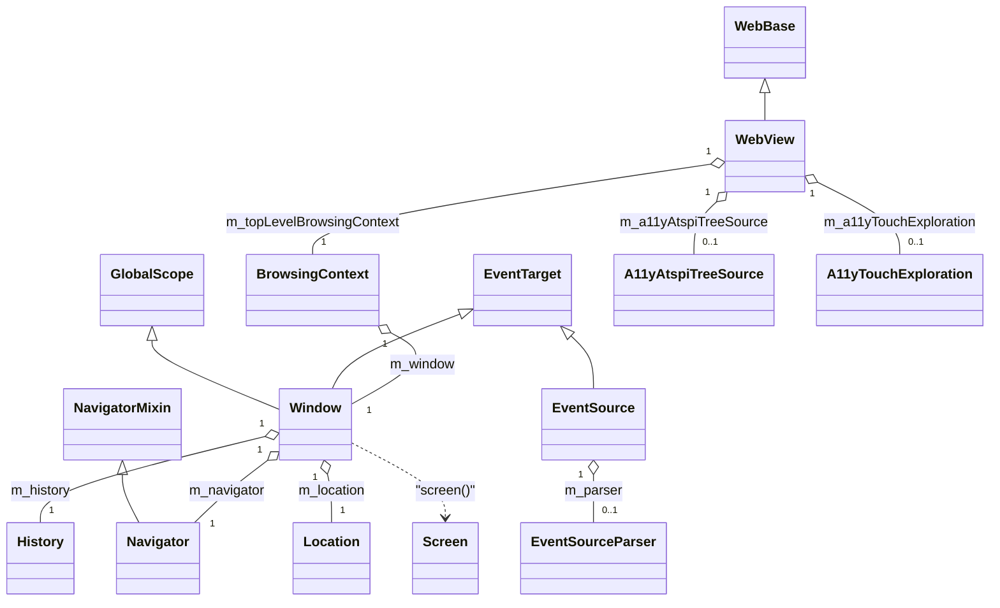
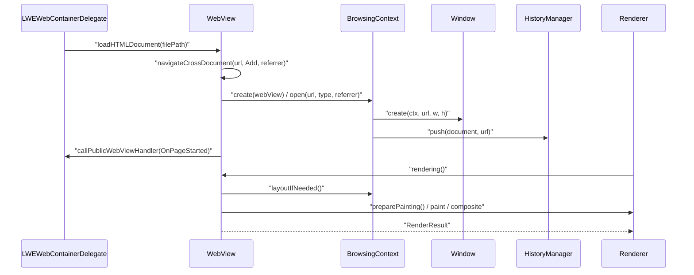

# Functional Requirements: core-page

> **Relevant source files**
>
> - [src/core/page/WebView.h](src:src/core/page/WebView.h)
> - [src/core/page/WebView.cpp](src:src/core/page/WebView.cpp)
> - [src/core/page/WebBase.h](src:src/core/page/WebBase.h)
> - [src/core/page/WebBase.cpp](src:src/core/page/WebBase.cpp)
> - [src/core/page/BrowsingContext.h](src:src/core/page/BrowsingContext.h)
> - [src/core/page/BrowsingContext.cpp](src:src/core/page/BrowsingContext.cpp)
> - [src/core/page/Window.h](src:src/core/page/Window.h)
> - [src/core/page/Window.cpp](src:src/core/page/Window.cpp)
> - [src/core/page/Location.cpp](src:src/core/page/Location.cpp)
> - [src/core/page/History.cpp](src:src/core/page/History.cpp)
> - [src/core/page/EventSource.cpp](src:src/core/page/EventSource.cpp)
> - [src/core/page/A11yAtspiTreeSource.cpp](src:src/core/page/A11yAtspiTreeSource.cpp)

**Module**: [`WebView.cpp`](src:src/core/page/WebView.cpp)
**Version**: 2026-09-10
**Linked Design Card**: [modules/core-page.md](../modules/core-page.md)
**Analysis basis**: AST export and direct source reading

## Overview

The module centres on [`WebView`](src:src/core/page/WebView.h#L98), the per-page object created by the embedder through [`WebView::create`](src:src/core/page/WebView.cpp#L244), which owns the renderer, history manager, storage namespaces and the top-level [`BrowsingContext`](src:src/core/page/BrowsingContext.h#L56). Navigation opens a [`Window`](src:src/core/page/Window.h#L57) with its document via [`BrowsingContext::open`](src:src/core/page/BrowsingContext.cpp#L166); each frame is produced by [`WebView::rendering`](src:src/core/page/WebView.cpp#L1442) and platform input enters through [`WebView::dispatchTouchEvent`](src:src/core/page/WebView.cpp#L2254). Window-level web APIs (Location, History, Navigator, Screen, EventSource, postMessage) and the accessibility tree source [`A11yAtspiTreeSource`](src:src/core/page/A11yAtspiTreeSource.h#L54) complete the module.

## Functional Requirements

### FR-CORE-PAGE-001
**Create and destroy a page view**

| Item | Content |
|------|---------|
| **Description** | The module creates a page view bound to one engine instance, with its own message loop, timer, thread pool, renderer, history manager and Web Storage namespaces, and tears all of it down on request. |
| **Input** | `Starfish*`, locale, timezone ID, viewport width/height, default font size and name, `ScreenInfo`, custom user-agent string, built-in polyfill path (all non-null, asserted). |
| **Output** | A `WebView*`; side effects: `Renderer::create`, `HistoryManager::create`, `initStorage`, `m_webViewInstanceCount` incremented; on destroy the inspector/DevTools server are deleted, the view is paused, the browsing context disposed. |
| **Preconditions** | All pointer arguments non-null ([`WebView::create`](src:src/core/page/WebView.cpp#L244) asserts each). |
| **Postconditions** | `m_isActive == true`, `m_deviceKind == deviceKindUseTouchScreen`, `m_startUpFlag == 0` (overridable by `START_UP_FLAG` in test builds), idle-mode check interval set to the default. |
| **Source** | [`WebView::create`](src:src/core/page/WebView.cpp#L244), [`WebView::WebView`](src:src/core/page/WebView.cpp#L262), [`WebView::destroy`](src:src/core/page/WebView.cpp#L661) |

**Acceptance criteria**:
- [ ] `WebView::create` returns a view whose `renderer()`, `historyManager()`, `localStorageNamespace()` and `sessionStorageNamespace()` are non-null.
- [ ] `WebView::destroy` stops and deletes the DevTools server only when `m_cdpServer->webView() == this` ([`WebView::destroy`](src:src/core/page/WebView.cpp#L661)).
- [ ] `WebBase` builds a thread pool of `STARFISH_THREAD_POOL_SIZE` (default 6) threads bound to the message loop ([`WebBase::WebBase`](src:src/core/page/WebBase.cpp#L33)).

### FR-CORE-PAGE-002
**Navigate to a URL (cross-document or same-document)**

| Item | Content |
|------|---------|
| **Description** | The module navigates the page to a URL. A local file path is turned into a `file://` URL; when the history action is `Intact` and the URL path equals the referrer path, only the fragment/state changes (same-document); otherwise a new browsing context and script engine instance are created. |
| **Input** | `ResourceURL* url`, `HistoryManagerAction type` (Add / Replace / Intact), `ReferrerURL* referrerURL`; or a `String* filePath` for `loadHTMLDocument`. |
| **Output** | Cross-document: blob and media-source URL stores cleared, previous context disposed, root stacking context cleared, new `BrowsingContext` opened, native JS interfaces re-applied, `OnPageStarted` handler called with the URL string. Same-document: document URI updated, target element scrolled into view, `popstate` event queued with the deserialized history state. |
| **Preconditions** | `url` and `referrerURL` non-null (asserted). `navigateAsync` defers the whole operation to a message-loop idler. |
| **Postconditions** | `mainBrowsingContext()` is non-null and has an open `Window`; rendering flags re-initialised. |
| **Source** | [`WebView::navigate`](src:src/core/page/WebView.cpp#L832), [`WebView::navigateCrossDocument`](src:src/core/page/WebView.cpp#L872), [`WebView::navigateSameDocument`](src:src/core/page/WebView.cpp#L957), [`WebView::loadHTMLDocument`](src:src/core/page/WebView.cpp#L822) |

**Acceptance criteria**:
- [ ] A path not starting with `http`, `about` or `data:` is resolved to an absolute path and prefixed with `file://` ([`resolvePath`](src:src/core/page/WebView.cpp#L800)).
- [ ] `navigate(url, Intact, referrer)` with equal `getUrlPathString()` takes the same-document path and dispatches `PopStateEvent` through `dispatchEventByUA` on an idler.
- [ ] Any other combination disposes the old context and creates a new one via `BrowsingContext::create(this)`.

### FR-CORE-PAGE-003
**Open a browsing context with a window, document and session-history entry**

| Item | Content |
|------|---------|
| **Description** | A browsing context creates its `Window` (sized from the renderer for the top-level context, or from the iframe's frame box / default iframe size otherwise), which in turn creates the `HTMLDocument`, `History`, `Navigator` and `Location` objects and the script binding instance; the URL is pushed or replaced in session history according to the action. |
| **Input** | `ResourceURL* url`, `HistoryManagerAction type`, `ReferrerURL* referrerURL`. |
| **Output** | `m_window` set; document initialised with the referrer; `performance().timing().m_requestStart` stamped; `historyManager()->push` or `->replace` invoked for Add / Replace; for nested contexts the parent document's CSP is inherited. If `useSpatialNavigation()` is set, the embedded spatial-navigation script is evaluated before the document is initialised. |
| **Preconditions** | For nested contexts a source `HTMLIFrameElement` exists; `webView()->scriptEngineInstance()` is available for `ScriptBindingWindowInstance`. |
| **Postconditions** | `window()->document()` is non-null; `Intact` leaves history untouched. |
| **Source** | [`BrowsingContext::open`](src:src/core/page/BrowsingContext.cpp#L166), [`Window::Window`](src:src/core/page/Window.cpp#L99), [`BrowsingContext::historyManager`](src:src/core/page/BrowsingContext.cpp#L221) |

**Acceptance criteria**:
- [ ] Top-level window size equals renderer width/height divided by `screenInfo().devicePixelRatio`.
- [ ] A nested context without a laid-out frame uses `STARFISH_DEFAULT_IFRAME_WIDTH` / `STARFISH_DEFAULT_IFRAME_HEIGHT` ([`BrowsingContext.cpp`](src:src/core/page/BrowsingContext.cpp#L187)).
- [ ] `HistoryManagerAction::Add` results in exactly one `push(document, url)` call; `Replace` in one `replace` call.

### FR-CORE-PAGE-004
**Produce a rendered frame on demand**

| Item | Content |
|------|---------|
| **Description** | On each rendering request the module runs layout for all browsing contexts needing it, establishes/updates the stacking-context tree, paints the root stacking context onto a canvas and, when graphics buffers are required, composites, returning what was painted. |
| **Input** | `bool force`; internal dirty flags `m_needsRendering`, `m_needsPainting`, `m_needsComposite`, `m_isActive`. |
| **Output** | `RenderResult { didPaintingOrCompositing, updateRect, computedRepaintRect }`; side effects: frame-rate counter update when `m_showFps`, optional screenshot when the `SCREEN_SHOT` environment variable is set. |
| **Preconditions** | `m_needsRendering && m_isActive`; otherwise an empty result is returned. |
| **Postconditions** | Dirty flags cleared; `m_didFirstRenderingAfterWakeup` set. A document with a pending stylesheet less than 1000 ms after open is only cleared, not painted, unless `force`. |
| **Source** | [`WebView::rendering`](src:src/core/page/WebView.cpp#L1442), [`WebView::layoutIfNeeded`](src:src/core/page/WebView.cpp#L1150), [`BrowsingContext::layoutIfNeeded`](src:src/core/page/BrowsingContext.cpp#L437), [`RenderResult`](src:src/core/page/RenderResult.h#L43) |

**Acceptance criteria**:
- [ ] `rendering()` with `m_needsRendering == false` returns `didPaintingOrCompositing == false` without touching the renderer.
- [ ] Layout precedes painting: [`WebView.cpp`](src:src/core/page/WebView.cpp#L1520) calls `layoutIfNeeded()` before `renderer()->preparePainting()` at [`WebView.cpp`](src:src/core/page/WebView.cpp#L1691).
- [ ] `BrowsingContext::layoutIfNeeded` calls `buildFrameTreeIfNeeds()` (which calls `resolveStyleIfNeeds()`) before laying out ([`BrowsingContext::buildFrameTreeIfNeeds`](src:src/core/page/BrowsingContext.cpp#L355)).

### FR-CORE-PAGE-005
**Route platform input events into the page**

| Item | Content |
|------|---------|
| **Description** | Touch, mouse, wheel, key and composition events from the platform are delivered to the page. Global pointing-intercept listeners are notified first; when touch exploration is enabled and consumes the event it stops there; otherwise the main browsing context performs hit testing and DOM dispatch. Key events target the focused node, else `body`, else the root element, and are forwarded into a focused iframe's context. |
| **Input** | `TouchEventKind` + `TouchData[]`, `MouseEventKind` + `MouseData`, `KeyEventKind` + `PlatformKeyEventData`, `CompositionEventKind` + text. |
| **Output** | DOM events dispatched by the browsing context; `releaseActiveNode()` on touch end for intercept listeners; touch moves suppressed while `m_scrollOccurredDuringGesture`. |
| **Preconditions** | `touches != nullptr` (asserted); `mainBrowsingContext()` non-null for DOM dispatch. |
| **Postconditions** | Return value of `BrowsingContext::dispatchTouchEvent` indicates handling; touch cancel releases active and hovered nodes. |
| **Source** | [`WebView::dispatchTouchEvent`](src:src/core/page/WebView.cpp#L2254), [`WebView::dispatchKeyEvent`](src:src/core/page/WebView.cpp#L2393), [`BrowsingContext::dispatchTouchEvent`](src:src/core/page/BrowsingContext.cpp#L1356), [`BrowsingContext::dispatchKeyEvent`](src:src/core/page/BrowsingContext.cpp#L1989) |

**Acceptance criteria**:
- [ ] When `A11yTouchExploration::isEnabled()` and `handleTouchEvent` returns true, `BrowsingContext::dispatchTouchEvent` is not called.
- [ ] A `TouchEventCancel` releases the active and hovered node and dispatches `touchcancel` to the hit-test target ([`BrowsingContext::dispatchTouchEvent`](src:src/core/page/BrowsingContext.cpp#L1356)).
- [ ] A key event with no focused node, no body and no root element is dropped.

### FR-CORE-PAGE-006
**Notify the embedder of page lifecycle events**

| Item | Content |
|------|---------|
| **Description** | The embedder registers one handler per event kind (page started/loaded/parsed, resource load, error, progress, download, idle, URL-loading override, debugger init/wait); the engine invokes the handler with an opaque parameter, asynchronously through the message loop unless synchronous delivery is requested. |
| **Input** | `StarfishPubicWebViewHandlerKind`, `std::function<void(void*)>` (registration); kind, `void* data`, `bool sync` (invocation). |
| **Output** | Handler executed on the message loop idler (or immediately when `sync`); re-registration replaces the previous handler. |
| **Preconditions** | None; an unregistered kind is silently ignored. |
| **Postconditions** | `containsPublicWebViewHandler(kind)` is true after registration. |
| **Source** | [`WebBase::registerPublicWebViewHandler`](src:src/core/page/WebBase.cpp#L323), [`WebBase::callPublicWebViewHandler`](src:src/core/page/WebBase.cpp#L346), [`StarfishPubicWebViewHandlerKind`](src:src/core/page/WebBase.h#L43) |

**Acceptance criteria**:
- [ ] `callPublicWebViewHandler(kind, data)` with no registered handler returns without side effects.
- [ ] `navigateCrossDocument` calls `OnPageStarted` with a parameter holding the URL string ([`WebView::navigateCrossDocument`](src:src/core/page/WebView.cpp#L872)).
- [ ] `OnIdle` is invoked synchronously when entering idle mode ([`WebView.cpp`](src:src/core/page/WebView.cpp#L603)).

### FR-CORE-PAGE-007
**Provide per-origin Web Storage to the window**

| Item | Content |
|------|---------|
| **Description** | The page view creates a local and a session storage namespace from a provider rooted at the engine's local-storage file path; `window.localStorage` / `sessionStorage` return a `Storage` object bound to the document's web origin. |
| **Input** | `m_starfish->localStorageFilePath()` (namespace creation); `m_document->webOrigin()` (per-window access). |
| **Output** | `StorageNamespace*` pair on the view; a new `Storage` wrapper per call on the window. |
| **Preconditions** | `WebView` constructed (`initStorage` runs in the constructor). |
| **Postconditions** | Both namespaces non-null for the lifetime of the view. |
| **Source** | [`WebView::initStorage`](src:src/core/page/WebView.cpp#L789), [`Window::localStorage`](src:src/core/page/Window.cpp#L281), [`Window::sessionStorage`](src:src/core/page/Window.cpp#L289) |

**Acceptance criteria**:
- [ ] `localStorageNamespace()->storageInternal(origin)` is used for `localStorage`, `sessionStorageNamespace()` for `sessionStorage`.
- [ ] Two windows with the same origin under one view share the same storage namespace.

### FR-CORE-PAGE-008
**Expose Location and History with hashchange/popstate events**

| Item | Content |
|------|---------|
| **Description** | `Location` setters rebuild the URL and navigate; a URL that differs from the current document URL only by a non-empty fragment is handled as a fragment navigation (scroll + `hashchange`) instead of a reload. `History` delegates to the history manager; `go(0)` reloads. |
| **Input** | URL components (`href`, `host`, `hash`, …) for `Location`; `delta`, `state`, `title`, optional URL for `History`. |
| **Output** | Document URI updated; target element scrolled into view; `HashChangeEvent` with old/new URL dispatched by UA when the URL changed; `pushState` / `replaceState` / `go` forwarded to `HistoryManager`. |
| **Preconditions** | Document and window exist. |
| **Postconditions** | `tryFragmentNavigate` returns true only when hash non-empty and serialized URLs (fragment excluded) are equal. |
| **Source** | [`Location::tryFragmentNavigate`](src:src/core/page/Location.cpp#L112), [`Location::setHash`](src:src/core/page/Location.cpp#L171), [`Location::setHref`](src:src/core/page/Location.cpp#L125), [`History::go`](src:src/core/page/History.cpp#L59), [`History::pushState`](src:src/core/page/History.cpp#L88) |

**Acceptance criteria**:
- [ ] Setting `location.hash` to a new value dispatches exactly one `hashchange` event with `oldURL`/`newURL`; setting it to the same value dispatches none.
- [ ] `history.go(0)` calls `location()->reload()`; `go(n != 0)` calls `historyManager()->go(n)`.
- [ ] `location.href = "#frag"` on the current document does not trigger `setLocation`.

### FR-CORE-PAGE-009
**Deliver cross-window messages with origin filtering**

| Item | Content |
|------|---------|
| **Description** | A window posts a structured-cloned message to another window. `"/"` means the source origin, `"*"` any origin, otherwise the target must be a valid URL whose origin is used; delivery is asynchronous as a `MessageEvent` carrying source and origin. |
| **Input** | `Window* source`, `ScriptValue message`, `String* targetOrigin`, optional transfer list. |
| **Output** | `MessageEvent` dispatched by UA on the target window from a message-loop idler; `DOMException` (`SYNTAX_ERR`) for an invalid target origin; serialization failures re-thrown with a composed message. |
| **Preconditions** | Target window has a browsing context. |
| **Postconditions** | `event.source` is the posting window, `event.origin` its location origin. |
| **Source** | [`Window::postMessage`](src:src/core/page/Window.cpp#L305) |

**Acceptance criteria**:
- [ ] `postMessage(msg, "not a url")` throws `DOMException::SYNTAX_ERR`.
- [ ] The event is not dispatched synchronously inside `postMessage`.

### FR-CORE-PAGE-010
**Maintain a server-sent events connection**

| Item | Content |
|------|---------|
| **Description** | `EventSource` opens a `GET` request for `text/event-stream` with `Cache-Control: no-cache`, feeds response bytes to a line parser that emits `message` events, and reconnects after a delay when the connection fails until closed. |
| **Input** | Document, URL string, `EventSourceInit.withCredentials`. |
| **Output** | `readyState` transitions CONNECTING → OPEN → CLOSED; `MessageEvent`s from `onMessageEvent`; `Last-Event-ID` header set on reconnect; request aborted and timer cleared on `close`/`cancel`. |
| **Preconditions** | URL non-empty and valid against the document base URL; allowed by the document CSP `connect-src`; protocol `http`, `https` or `data`. |
| **Postconditions** | `close()` on an already-closed source is a no-op; `failed()` schedules a reconnect unless CLOSED. |
| **Source** | [`EventSource::EventSource`](src:src/core/page/EventSource.cpp#L196), [`EventSource::connect`](src:src/core/page/EventSource.cpp#L245), [`EventSource::start`](src:src/core/page/EventSource.cpp#L274), [`EventSource::close`](src:src/core/page/EventSource.cpp#L400), [`EventSourceParser::addBytes`](src:src/core/page/EventSourceParser.cpp#L47) |

**Acceptance criteria**:
- [ ] Empty URL throws `DOMException::SYNTAX_ERR`; CSP-blocked URL throws `DOMException::SECURITY_ERR`.
- [ ] Default reconnect delay is 3000 ms ([`EventSource::defaultReconnectDelay`](src:src/core/page/EventSource.cpp#L48)); a server `retry` value overrides it via `onReconnectionTimeSet`.
- [ ] `withCredentials == true` sets `RequestCredentials::Include`, otherwise `SameOrigin`.

### FR-CORE-PAGE-011
**Expose an accessibility tree and touch exploration**

| Item | Content |
|------|---------|
| **Description** | The module exposes the page as a hierarchical accessibility tree of opaque element handles (targets = interactive/labelled leaves, containers = Section/Document), with role, name, text, bounds, states, heading level, list position, range value and relations, plus hit test, highlight and activation. DOM changes mark the tree dirty and ping a registered listener. A touch-exploration controller (single tap = focus + speak, double tap = activate, swipe = next/previous) intercepts pointer events when TTS accessibility mode is active. |
| **Input** | `void*` handles, viewport CSS-px coordinates, `Document*` change notifications; touch/mouse events. |
| **Output** | Tree queries; `highlight`/`activate` (focus + simulated click); `speech()` via TTS; change-listener callbacks. |
| **Preconditions** | Built with `STARFISH_ENABLE_A11Y_ATSPI` / `STARFISH_ENABLE_A11Y_TOUCH_EXPLORATION`; `notifyPageChanged` ignores documents whose window belongs to another view. |
| **Postconditions** | Stale handles are reported invalid instead of dereferenced; `current()` returns the most recently created source and is never cleared. |
| **Source** | [`A11yAtspiTreeSource::current`](src:src/core/page/A11yAtspiTreeSource.cpp#L130), [`A11yAtspiTreeSource::notifyPageChanged`](src:src/core/page/A11yAtspiTreeSource.cpp#L142), [`A11yAtspiTreeSource::hitTest`](src:src/core/page/A11yAtspiTreeSource.cpp#L421), [`A11yAtspiTreeSource::activate`](src:src/core/page/A11yAtspiTreeSource.cpp#L877), [`A11yTouchExploration::isEnabled`](src:src/core/page/A11yTouchExploration.cpp#L58), [`A11yTouchExploration::handleTouchEvent`](src:src/core/page/A11yTouchExploration.cpp#L69) |

**Acceptance criteria**:
- [ ] `notifyPageChanged(doc)` for a document of the current view sets `m_dirty` and calls the listener once; for a foreign view it does nothing.
- [ ] `isEnabled()` is true only when TTS is in accessibility mode or `TTSMode::Forced` (false when TTS is not compiled in).
- [ ] Gesture thresholds: tap slop 20 px, double-tap slop 100 px within 300 ms, swipe ≥ 60 px within 500 ms ([`A11yTouchExploration`](src:src/core/page/A11yTouchExploration.h#L93)).

### FR-CORE-PAGE-012
**Start developer tooling from environment variables**

| Item | Content |
|------|---------|
| **Description** | When `STARFISH_ENABLE_CDP` is set in the environment, the first page view in the process starts the Chrome DevTools Protocol server on `STARFISH_CDP_PORT` (default 9222); additional views share that server. A legacy inspector can be started on a given port (default 23888). Script execution can be disabled through DevTools for the current and later documents. |
| **Input** | Environment variables `STARFISH_ENABLE_CDP`, `STARFISH_CDP_PORT`; `setupInspector(port)`; `setScriptExecutionDisabledByCDP(bool)`. |
| **Output** | `CDPServer` created and started; `Inspector` created and run; `BrowsingContext::isScriptingEnabled()` returns false while disabled. |
| **Preconditions** | Compiled with `STARFISH_ENABLE_CDP` / `STARFISH_ENABLE_INSPECTOR`; `m_cdpServer == nullptr` / `m_inspector == nullptr` (asserted). |
| **Postconditions** | `s_cdpServerStarted` prevents a second bind in the same process. |
| **Source** | [`WebView.cpp`](src:src/core/page/WebView.cpp#L394), [`WebView::setupCDPServer`](src:src/core/page/WebView.cpp#L2560), [`WebView::setupInspector`](src:src/core/page/WebView.cpp#L2551), [`WebView::setScriptExecutionDisabledByCDP`](src:src/core/page/WebView.cpp#L2567), [`BrowsingContext::isScriptingEnabled`](src:src/core/page/BrowsingContext.cpp#L99) |

**Acceptance criteria**:
- [ ] With `STARFISH_ENABLE_CDP` unset no `CDPServer` is created.
- [ ] `STARFISH_CDP_PORT=9333` results in `setupCDPServer(9333)`.
- [ ] After `setScriptExecutionDisabledByCDP(true)`, `isScriptingEnabled()` is false even if `m_isScriptingEnabled` is true.

## Non-Functional Requirements

| Item | Requirement | Source |
|------|-------------|--------|
| Performance | Rendering is skipped entirely when nothing is dirty or the view is inactive; frame-rate counter reports FPS via log when `m_showFps`. | [`WebView::rendering`](src:src/core/page/WebView.cpp#L1442), [`WebView::WebView`](src:src/core/page/WebView.cpp#L262) |
| Performance | Global pointing listeners are iterated in O(n) per event using a size-delta check for self-removal. | [`WebView::dispatchTouchEvent`](src:src/core/page/WebView.cpp#L2254) |
| Performance | Image decoding uses a dedicated thread pool of `STARFISH_IMAGE_DECODE_THREAD_THREAD_POOL_SIZE` (default 4) when multi-threaded decoding is enabled. | [`WebView.cpp`](src:src/core/page/WebView.cpp#L377) |
| Security | `postMessage` rejects invalid target origins with `SYNTAX_ERR`; `EventSource` enforces CSP `connect-src` and allows only http/https/data schemes. | [`Window::postMessage`](src:src/core/page/Window.cpp#L305), [`EventSource::connect`](src:src/core/page/EventSource.cpp#L245) |
| Security | Nested browsing contexts inherit the parent document's content security policy. | [`BrowsingContext::open`](src:src/core/page/BrowsingContext.cpp#L166) |
| Error handling | `confirm()` returns false and the text-input dialog returns empty immediately (dialogs are announced to DevTools, never blocking). | [`Window::confirm`](src:src/core/page/Window.cpp#L859) |
| Error handling | `evaluateJavaScript` returns the empty string when no browsing context exists. | [`WebView::evaluateJavaScript`](src:src/core/page/WebView.cpp#L1014) |
| Logging | `STARFISH_LOG_INFO` on destroy, pause, resume, composite-mode transitions and delayed rendering; `STARFISH_LOG_ERROR` on EventSource access-control failure and locale parse failure. | [`WebView::destroy`](src:src/core/page/WebView.cpp#L661), [`EventSource::failedAccessControlCheck`](src:src/core/page/EventSource.cpp#L374), [`WebBase::WebBase`](src:src/core/page/WebBase.cpp#L33) |

## Constraints

- `WebView` uses a precise GC descriptor; every GC-pointer member must be registered in [`WebView::operator new`](src:src/core/page/WebView.cpp#L407).
- Only one DevTools server per process; a function-local static guards the bind ([`WebView.cpp`](src:src/core/page/WebView.cpp#L393)).
- Touch slop is 20 CSS px by default (`STARFISH_TOUCH_SLOP_PX`, overridable at build time) ([`BrowsingContext.cpp`](src:src/core/page/BrowsingContext.cpp#L88)).
- `A11yAtspiTreeSource::current()` is a process-global pointer that is never cleared (single-webview assumption stated in the header) ([`A11yAtspiTreeSource::current`](src:src/core/page/A11yAtspiTreeSource.h#L60)).
- The spatial-navigation script is compiled into the binary as a string literal and evaluated only when `useSpatialNavigation()` is set ([`BrowsingContext.cpp`](src:src/core/page/BrowsingContext.cpp#L196)).
- Accessibility features are compile-time gated by `STARFISH_ENABLE_A11Y_ATSPI`, `STARFISH_ENABLE_A11Y_TOUCH_EXPLORATION` and `STARFISH_ENABLE_TTS` ([`WebView.h`](src:src/core/page/WebView.h#L84)).

## Module Design Card Linkage

| FR | Implementation | Design Card section |
|----|----------------|---------------------|
| FR-CORE-PAGE-001 | [`WebView::create`](src:src/core/page/WebView.cpp#L244) | [Public Interface](../modules/core-page.md#public-interface) |
| FR-CORE-PAGE-002 | [`WebView::navigate`](src:src/core/page/WebView.cpp#L832) | [Key Flow](../modules/core-page.md#key-flow) |
| FR-CORE-PAGE-003 | [`BrowsingContext::open`](src:src/core/page/BrowsingContext.cpp#L166) | [Key Flow](../modules/core-page.md#key-flow) |
| FR-CORE-PAGE-004 | [`WebView::rendering`](src:src/core/page/WebView.cpp#L1442) | [Key Flow](../modules/core-page.md#key-flow) |
| FR-CORE-PAGE-005 | [`WebView::dispatchTouchEvent`](src:src/core/page/WebView.cpp#L2254) | [Key Flow](../modules/core-page.md#key-flow) |
| FR-CORE-PAGE-006 | [`WebBase::callPublicWebViewHandler`](src:src/core/page/WebBase.cpp#L346) | [IPC / Message / Interface Contracts](../modules/core-page.md#ipc--message--interface-contracts) |
| FR-CORE-PAGE-007 | [`WebView::initStorage`](src:src/core/page/WebView.cpp#L789) | [Quick Navigation](../modules/core-page.md#quick-navigation) |
| FR-CORE-PAGE-008 | [`Location::setHash`](src:src/core/page/Location.cpp#L171) | [Quick Navigation](../modules/core-page.md#quick-navigation) |
| FR-CORE-PAGE-009 | [`Window::postMessage`](src:src/core/page/Window.cpp#L305) | [Public Interface](../modules/core-page.md#public-interface) |
| FR-CORE-PAGE-010 | [`EventSource::start`](src:src/core/page/EventSource.cpp#L274) | [Quick Navigation](../modules/core-page.md#quick-navigation) |
| FR-CORE-PAGE-011 | [`A11yAtspiTreeSource::notifyPageChanged`](src:src/core/page/A11yAtspiTreeSource.cpp#L142) | [IPC / Message / Interface Contracts](../modules/core-page.md#ipc--message--interface-contracts) |
| FR-CORE-PAGE-012 | [`WebView::setupCDPServer`](src:src/core/page/WebView.cpp#L2560) | [Architectural Rules](../modules/core-page.md#architectural-rules) |

## ENUM Definitions

| ENUM | Values | Used in | Source |
|------|--------|---------|--------|
| `StarfishPubicWebViewHandlerKind` | OnPageStarted, OnPageLoaded, OnPageParsed, OnLoadResource, OnReceivedError, OnProgressChanged, OnDownloadStart, OnIdle, ShouldOverrideUrlLoading, DebuggerShouldInit, DebuggerShouldContinueWaiting | Embedder handler registration/dispatch | [`StarfishPubicWebViewHandlerKind`](src:src/core/page/WebBase.h#L43) |
| `StarfishStartUpFlag` | enableComputedStyleDump, enableFrameTreeDump, enableStackingContextDump, enableHitTestDump, enableDebugGraphicsLayer, enableDebugRepaintRegion, enableRegressionTest | Test-build debug dumps in layout/rendering | [`StarfishStartUpFlag`](src:src/core/page/WebView.h#L34) |
| `StarfishDeviceKind` | deviceKindUseMouse, deviceKindUseTouchScreen | Input device kind of the view | [`StarfishDeviceKind`](src:src/core/page/WebView.h#L44) |
| `EventSource::ReadyState` | CONNECTING, OPEN, CLOSED | Server-sent events connection state | [`EventSource`](src:src/core/page/EventSource.h#L80) |
| `A11yAtspiTreeSource::Role` | Label, Button, Link, Entry, CheckBox, RadioButton, ComboBox, Image, Heading, List, ListItem, Dialog, ProgressBar, Slider, ToggleButton, Section, Document | Accessibility role reported to the bridge | [`A11yAtspiTreeSource`](src:src/core/page/A11yAtspiTreeSource.h#L101) |
| `HdrMetadataType` | Not specified in code (values not read) | Media decoding configuration | [`HdrMetadataType`](src:src/core/page/MediaCapabilities.h#L31) |

## Error Code Definitions

None found in code

## Constant Definitions

| Constant | Value | Purpose | Source |
|----------|-------|---------|-------|
| `STARFISH_TOUCH_SLOP_PX` | 20.0 | Touch-move slop before a gesture counts as a move (CSS px) | [`BrowsingContext.cpp`](src:src/core/page/BrowsingContext.cpp#L88) |
| `STARFISH_THREAD_POOL_SIZE` | 6 | Size of the per-WebBase worker thread pool | [`WebBase.cpp`](src:src/core/page/WebBase.cpp#L62) |
| `ANNOTATE_SETUP` | (empty) | No-op profiling annotation macro when Streamline is absent | [`WebView.cpp`](src:src/core/page/WebView.cpp#L95) |
| `ANNOTATE_BLUE` | 0xff00001b | Profiling annotation colour | [`WebView.cpp`](src:src/core/page/WebView.cpp#L98) |
| `STARFISH_FILLING_GRAPHICS_BUFFER_TIME_LIMIT` | 100 | Time budget for filling graphics buffers (default build) | [`WebView.cpp`](src:src/core/page/WebView.cpp#L236) |
| `STARFISH_FILLING_GRAPHICS_BUFFER_TIME_LIMIT` | 10 | Same limit under the alternate build condition | [`WebView.cpp`](src:src/core/page/WebView.cpp#L238) |
| `STARFISH_IMAGE_DECODE_THREAD_THREAD_POOL_SIZE` | 4 | Image-decode thread pool size | [`WebView.cpp`](src:src/core/page/WebView.cpp#L377) |
| `VIRTUAL` / `OVERRIDE` | (empty) | Helper macros around `DECLARE_EVENT_LISTENER` | [`Window.h`](src:src/core/page/Window.h#L315) |
| `EventSource::defaultReconnectDelay` | 3000 | Default reconnect delay in ms | [`EventSource::defaultReconnectDelay`](src:src/core/page/EventSource.cpp#L48) |
| `A11yTouchExploration::kTapSlopPx` | 20.0 | Tap slop for touch exploration | [`A11yTouchExploration`](src:src/core/page/A11yTouchExploration.h#L93) |
| `A11yTouchExploration::kDoubleTapTimeoutMs` | 300.0 | Double-tap window | [`A11yTouchExploration`](src:src/core/page/A11yTouchExploration.h#L95) |
| `A11yTouchExploration::kSwipeMinDistancePx` | 60.0 | Minimum swipe distance | [`A11yTouchExploration`](src:src/core/page/A11yTouchExploration.h#L96) |

## Message Protocol

None found in code

## Class Diagram

Inheritance from [`WebView`](src:src/core/page/WebView.h#L98), [`Window`](src:src/core/page/Window.h#L57), [`EventSource`](src:src/core/page/EventSource.h#L62), [`Navigator`](src:src/core/page/Navigator.h#L44); containment from [`WebView.h`](src:src/core/page/WebView.h#L633), [`Window::Window`](src:src/core/page/Window.cpp#L99).

## Sequence Diagram

Primary flow entry: [`WebView::loadHTMLDocument`](src:src/core/page/WebView.cpp#L822) then [`WebView::rendering`](src:src/core/page/WebView.cpp#L1442) driven by [`Renderer.cpp`](src:src/core/modules/renderer/Renderer.cpp#L468).

## Test Cases

### Positive
- `loadHTMLDocument("/tmp/a.html")` → URL becomes `file:///tmp/a.html`, a new `BrowsingContext` is opened and `OnPageStarted` handler receives the URL string ([`resolvePath`](src:src/core/page/WebView.cpp#L800), [`WebView::navigateCrossDocument`](src:src/core/page/WebView.cpp#L872)).
- `navigate(url, Add, referrer)` → `historyManager()->push(document, url)` called once ([`BrowsingContext::open`](src:src/core/page/BrowsingContext.cpp#L166)).
- `rendering()` with `m_needsRendering && m_needsPainting` → `didPaintingOrCompositing == true`, `updateRect` equals the renderer size ([`WebView::rendering`](src:src/core/page/WebView.cpp#L1442)).
- `location.hash = "#sec"` on an element with id `sec` → element scrolled into view and one `hashchange` event dispatched ([`Location::setHash`](src:src/core/page/Location.cpp#L171)).
- `postMessage(msg, "/")` → target origin resolved to the source origin; `MessageEvent` delivered on the next idler ([`Window::postMessage`](src:src/core/page/Window.cpp#L305)).
- `new EventSource("http://h/stream")` → request opened with `Accept: text/event-stream`, `Cache-Control: no-cache` ([`EventSource::start`](src:src/core/page/EventSource.cpp#L274)).
- `notifyPageChanged(doc)` for the current view → listener invoked once, tree rebuilt lazily on the next accessor ([`A11yAtspiTreeSource::notifyPageChanged`](src:src/core/page/A11yAtspiTreeSource.cpp#L142)).

### Negative
- `postMessage(msg, "::bad::")` → `DOMException` with `SYNTAX_ERR` ([`Window::postMessage`](src:src/core/page/Window.cpp#L305)).
- `new EventSource("")` → `DOMException` `SYNTAX_ERR`; URL blocked by `connect-src` → `SECURITY_ERR` ([`EventSource::EventSource`](src:src/core/page/EventSource.cpp#L196)).
- `new EventSource("ftp://h/x")` → `failedAccessControlCheck` logs an error, sets CLOSED and aborts ([`EventSource::failedAccessControlCheck`](src:src/core/page/EventSource.cpp#L374)).
- `evaluateJavaScript(s)` before any navigation → returns the empty string ([`WebView::evaluateJavaScript`](src:src/core/page/WebView.cpp#L1014)).
- `callPublicWebViewHandler(OnDownloadStart, p)` with no registered handler → no call, no error ([`WebBase::callPublicWebViewHandler`](src:src/core/page/WebBase.cpp#L346)).
- `confirm("x")` → returns false without blocking ([`Window::confirm`](src:src/core/page/Window.cpp#L859)).

### Edge
- `navigate(url, Intact, referrer)` where only the fragment differs → same-document path; `popstate` queued, no new context ([`WebView::navigate`](src:src/core/page/WebView.cpp#L832)).
- `rendering()` within 1000 ms of document open while a stylesheet is pending and `force == false` → canvas cleared only, `m_needsRendering` reset ([`WebView::rendering`](src:src/core/page/WebView.cpp#L1442)).
- Second `WebView` created in the same process with `STARFISH_ENABLE_CDP` set → no second `setupCDPServer` call ([`WebView.cpp`](src:src/core/page/WebView.cpp#L393)).
- `TouchEventMove` while `m_scrollOccurredDuringGesture` → event dropped before DOM dispatch ([`WebView::dispatchTouchEvent`](src:src/core/page/WebView.cpp#L2254)).
- Key event with no focused node, no body and no root → silently ignored ([`BrowsingContext::dispatchKeyEvent`](src:src/core/page/BrowsingContext.cpp#L1989)).
- `close()` on an already CLOSED `EventSource` → no-op ([`EventSource::close`](src:src/core/page/EventSource.cpp#L400)).
- Stale accessibility handle after a DOM change → `isValid` false, `indexInParentOf` returns SIZE_MAX ([`A11yAtspiTreeSource::indexInParentOf`](src:src/core/page/A11yAtspiTreeSource.cpp#L383)).
