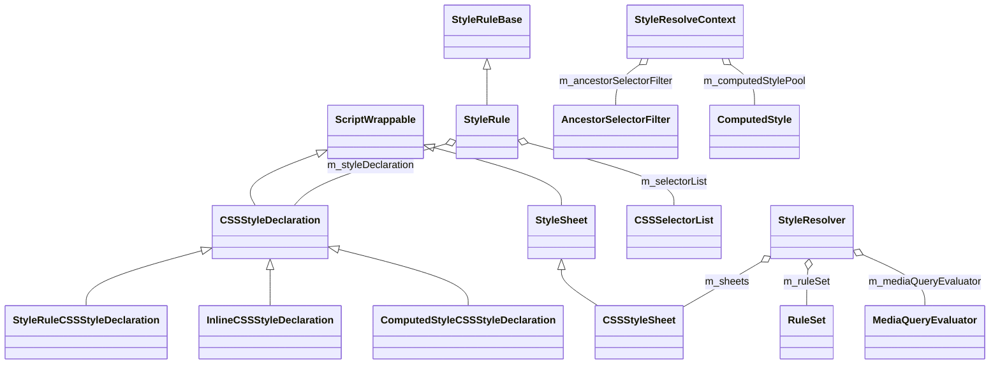
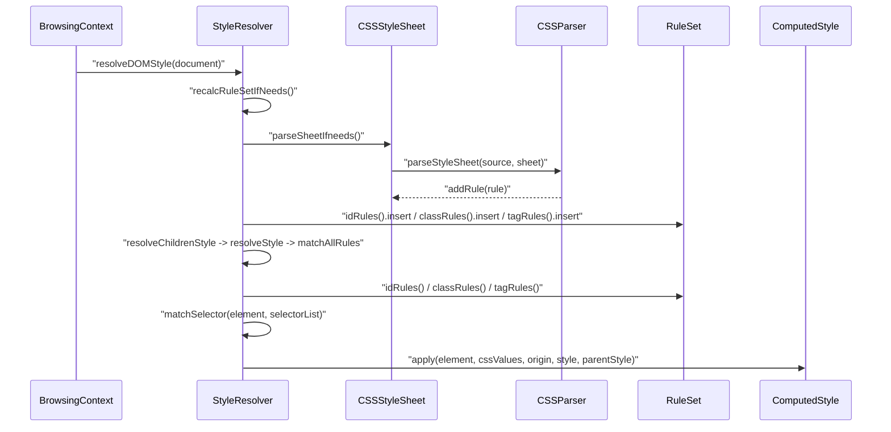

# Functional Requirements: core-style

> **Relevant source files**
>
> - [src/core/style/CSSParser.h](src:src/core/style/CSSParser.h)
> - [src/core/style/CSSParser.cpp](src:src/core/style/CSSParser.cpp)
> - [src/core/style/Style.h](src:src/core/style/Style.h)
> - [src/core/style/Style.cpp](src:src/core/style/Style.cpp)
> - [src/core/style/ComputedStyle.h](src:src/core/style/ComputedStyle.h)
> - [src/core/style/ComputedStyle.cpp](src:src/core/style/ComputedStyle.cpp)
> - [src/core/style/CSSStyleDeclaration.h](src:src/core/style/CSSStyleDeclaration.h)
> - [src/core/style/CSSStyleDeclaration.cpp](src:src/core/style/CSSStyleDeclaration.cpp)
> - [src/core/style/CSSStyleSheet.cpp](src:src/core/style/CSSStyleSheet.cpp)
> - [src/core/style/MediaQueryEvaluator.cpp](src:src/core/style/MediaQueryEvaluator.cpp)
> - [src/core/style/MediaQueryListMatcher.cpp](src:src/core/style/MediaQueryListMatcher.cpp)
> - [src/core/style/AdoptedStyleSheets.h](src:src/core/style/AdoptedStyleSheets.h)

**Module**: [`Style.h`](src:src/core/style/Style.h#L3401)
**Version**: 2026-09-10
**Linked Design Card**: [modules/core-style.md](../modules/core-style.md)
**Analysis basis**: AST export and direct source reading

## Overview

The module turns CSS source text into style rules through [`CSSParser::parseStyleSheet`](src:src/core/style/CSSParser.cpp#L2936), keeps them in an indexed [`RuleSet`](src:src/core/style/CSSStyleSheet.h#L62), and resolves a [`ComputedStyle`](src:src/core/style/ComputedStyle.h#L795) for every element through [`StyleResolver::resolveDOMStyle`](src:src/core/style/Style.cpp#L10203). It also evaluates media queries through [`MediaQueryEvaluator::eval`](src:src/core/style/MediaQueryEvaluator.cpp#L126) and exposes declarations to script through [`CSSStyleDeclaration`](src:src/core/style/CSSStyleDeclaration.h#L39).

## Functional Requirements

### FR-CORE-STYLE-001
**Parse style sheet text into style rules**

| Item | Content |
|------|---------|
| **Description** | The module tokenizes a style sheet source string, handles a leading `@charset` rule, parses the top-level rule list (style rules and `@import`, `@media`, `@font-face`, `@supports`, `@counter-style`, `@namespace`, `@keyframes` at-rules) and adds each resulting rule to the target sheet. |
| **Input** | `String* sourceString`, target `CSSStyleSheet*` |
| **Output** | `StyleRuleBase*` objects appended through `CSSStyleSheet::addRule`; `m_styleSheet` set on the parser |
| **Preconditions** | Sheet source is non-empty (`parseSheetIfneeds` skips empty source) |
| **Postconditions** | Sheet source string is reset to empty after parsing; unknown at-rules are skipped via `addUnknownAtRule` |
| **Source** | [`CSSParser::parseStyleSheet`](src:src/core/style/CSSParser.cpp#L2936), [`CSSParser::parseRules`](src:src/core/style/CSSParser.cpp#L3002), [`CSSStyleSheet::parseSheetIfneeds`](src:src/core/style/CSSStyleSheet.cpp#L201), [`CSSStyleSheet::addRule`](src:src/core/style/CSSStyleSheet.cpp#L138) |

**Acceptance criteria**:
- [ ] A sheet whose first token is `@charset` is parsed through `parseCharsetRule` before the regular rule list. [`CSSParser::parseStyleSheet`](src:src/core/style/CSSParser.cpp#L2936)
- [ ] A source whose first token is null produces no rules. [`CSSParser::parseStyleSheet`](src:src/core/style/CSSParser.cpp#L2936)
- [ ] `@media`, `@import`, `@font-face`, `@supports`, `@counter-style`, `@namespace` and `@keyframes` are dispatched to their dedicated parse functions. [`CSSParser::parseRules`](src:src/core/style/CSSParser.cpp#L3002)
- [ ] A sheet is parsed at most once; the source string is cleared afterwards. [`CSSStyleSheet::parseSheetIfneeds`](src:src/core/style/CSSStyleSheet.cpp#L201)

### FR-CORE-STYLE-002
**Parse declaration blocks and set properties**

| Item | Content |
|------|---------|
| **Description** | The module parses `property: value [!important]` declarations into a `CSSStyleDeclaration`, resolving the property name through the lookup trie and storing each value as a `CSSStyleValuePair`; custom properties (`--*`) are stored by name. |
| **Input** | Declaration text (`String*` or token stream), target `CSSStyleDeclaration*`, `allowSrcProperty` flag |
| **Output** | `CSSStyleValuePair` entries added to the declaration; `ParseResult` (`Consumed`, `ErrorFounded`, `Failed`) |
| **Preconditions** | Property name is ASCII; otherwise the declaration is logged and dropped |
| **Postconditions** | Declaration owners are notified through `notifyNeedsStyleRecalc` when a value changes |
| **Source** | [`CSSParser::parseStyleDeclaration`](src:src/core/style/CSSParser.cpp#L3102), [`CSSParser::parseDeclaration`](src:src/core/style/CSSParser.cpp#L1958), [`CSSStyleDeclaration::setProperty`](src:src/core/style/CSSStyleDeclaration.cpp#L2132), [`CSSStyleLookupTrie::lookupCSSStyle`](src:src/core/style/CSSStyleLookupTrie.cpp#L25) |

**Acceptance criteria**:
- [ ] A priority string equal to `important` (case-insensitive) marks the declaration important; `undefined` or empty priority does not. [`CSSStyleDeclaration::setProperty`](src:src/core/style/CSSStyleDeclaration.cpp#L2132)
- [ ] A property token with non-ASCII content is rejected with an error log instead of being set. [`CSSParser.cpp`](src:src/core/style/CSSParser.cpp#L1994)
- [ ] Property names are resolved to `CSSStyleValuePair::KeyKind`, with `CustomProperty` names kept as atomic strings. [`CSSStyleDeclaration::setProperty`](src:src/core/style/CSSStyleDeclaration.h#L108), [`CSSStyleValuePair::KeyKind`](src:src/core/style/Style.h#L1041)
- [ ] Setting an element's `style` attribute clears the inline declaration and re-parses the new value. [`Element::didAttributeChanged`](src:src/core/dom/Element.cpp#L596)

### FR-CORE-STYLE-003
**Parse selector lists**

| Item | Content |
|------|---------|
| **Description** | The module parses complex selector lists (compound selectors joined by combinators, including id, class, attribute, pseudo-class and pseudo-element selectors, and namespace prefixes) into `CSSSelectorList` objects, and reports whether the list was valid. |
| **Input** | Selector text via the parser's token stream; output vector `GCVector<CSSSelectorList*>&`; `bool& validSelector` |
| **Output** | Populated `CSSSelectorList` entries; `validSelector` reflects `m_failedParsing` |
| **Preconditions** | Parser was created with an origin node or execution context |
| **Postconditions** | Selector objects are shared through the selector pool keyed by `CSSSelectorPoolKey` |
| **Source** | [`CSSParser::parseSelector`](src:src/core/style/CSSParser.cpp#L886), [`CSSParser::parseComplexSelectorList`](src:src/core/style/CSSParser.cpp#L1759), [`CSSSelector`](src:src/core/style/Style.h#L3070), [`CSSSelectorList`](src:src/core/style/Style.h#L3054) |

**Acceptance criteria**:
- [ ] `parseSelector` resets `m_failedParsing` before parsing and reports validity through `validSelector`. [`CSSParser::parseSelector`](src:src/core/style/CSSParser.cpp#L886)
- [ ] Selector types cover Universal, Tag, Id, Class, PseudoElement, PseudoClass, NamespacedTag and seven attribute match forms. [`CSSSelector`](src:src/core/style/Style.h#L3070)
- [ ] DOM selector queries reuse the same parser entry through `Node::parseSelector`. [`Node::parseSelector`](src:src/core/dom/Node.cpp#L2216)
- [ ] Selector list specificity is computed on demand and cached. [`CSSStyleSheet.cpp`](src:src/core/style/CSSStyleSheet.cpp#L213)

### FR-CORE-STYLE-004
**Maintain the indexed rule set from attached sheets**

| Item | Content |
|------|---------|
| **Description** | The module tracks the style sheets attached to a document or shadow root, rebuilds the rule set lazily when flagged, filters sheets by media query, sorts rules by specificity, indexes rules by id, class, tag and universal buckets, and assigns each rule a cascade order. |
| **Input** | `CSSStyleSheet*` added/removed by DOM elements; adopted sheets; current `MediaQueryEvaluator` |
| **Output** | Populated `RuleSet`; keyframes rules and web fonts collected; `m_needsRecalcRuleSet` cleared |
| **Preconditions** | `m_needsRecalcRuleSet` is set by `addSheet` / `removeSheet` / adopted sheet changes |
| **Postconditions** | Each `StyleRule` has an order from `nextRuleSetOrder`; rules of non-matching media are absent from the rule set |
| **Source** | [`StyleResolver::addSheet`](src:src/core/style/Style.cpp#L10321), [`StyleResolver::recalcRuleSetIfNeeds`](src:src/core/style/Style.cpp#L10494), [`StyleResolver::addToRuleSet`](src:src/core/style/Style.cpp#L10748), [`RuleSet`](src:src/core/style/CSSStyleSheet.h#L62) |

**Acceptance criteria**:
- [ ] Adding a sheet appends it to `m_sheets` and marks the rule set for rebuild. [`StyleResolver::addSheet`](src:src/core/style/Style.cpp#L10321)
- [ ] Rebuild removes all rules, re-adds every sheet in `m_sheets` and `m_adoptedSheets`, then recalculates web fonts. [`StyleResolver::recalcRuleSetIfNeeds`](src:src/core/style/Style.cpp#L10494)
- [ ] A sheet whose media query set evaluates false contributes no rules. [`StyleResolver::addToRuleSet`](src:src/core/style/Style.cpp#L10748), [`CSSStyleSheet::matchesMediaQueries`](src:src/core/style/CSSStyleSheet.cpp#L316)
- [ ] A rule is inserted into `idRules`, `classRules`, `tagRules` or `universalRules` and stamped with an ascending order. [`StyleResolver::addToRuleSet`](src:src/core/style/Style.cpp#L10916)
- [ ] Rules are sorted by specificity with a stable sort. [`CSSStyleSheet::sortStyleRulesBySpecificity`](src:src/core/style/CSSStyleSheet.cpp#L302)

### FR-CORE-STYLE-005
**Match selectors against elements**

| Item | Content |
|------|---------|
| **Description** | The module decides whether a selector list matches an element, walking combinators through `matchForRelation`, checking simple selectors, attribute selectors, pseudo-classes and pseudo-elements, and records which element state the match depended on for later invalidation. |
| **Input** | `Element*`, element name/id/classes, `CSSSelectorList`, start index, `MatchResult&`, `isQueryingSelector` |
| **Output** | `StyleResolver::Match` (`SelectorMatches`, `SelectorFailsLocally`, `SelectorFailsAllSiblings`, `SelectorFailsCompletely`); `MatchResult.styleDamageFrom` and pseudo type |
| **Preconditions** | Rule set is current; for author rules the ancestor filter may pre-reject a rule |
| **Postconditions** | `MatchResult.styleDamageFrom` accumulates the `StyleDamageSource` bits used for the match |
| **Source** | [`StyleResolver::matchSelector`](src:src/core/style/Style.cpp#L8388), [`StyleResolver::matchForRelation`](src:src/core/style/Style.cpp#L8421), [`StyleResolver::checkOne`](src:src/core/style/Style.cpp#L8540), [`StyleResolver::checkPseudoClass`](src:src/core/style/Style.cpp#L8768) |

**Acceptance criteria**:
- [ ] Author rules are skipped when the ancestor filter reports that the rule's identifier hashes cannot be present on the ancestor chain. [`StyleResolver::collectMatchingRulesFromAuthorSheet`](src:src/core/style/Style.cpp#L8009), [`AncestorSelectorFilter::canIgnoreSelector`](src:src/core/style/AncestorSelectorFilter.h#L54)
- [ ] Attribute selectors are checked through `anyAttributeMatches`; pseudo-classes and pseudo-elements through their dedicated checks. [`StyleResolver::checkOne`](src:src/core/style/Style.cpp#L8540)
- [ ] The match result carries the damage source flags (`StyleDamageFromID`, `StyleDamageFromClass`, `StyleDamageFromAttribute`, ...). [`StyleResolver`](src:src/core/style/Style.h#L3401)
- [ ] DOM `querySelector`-style queries call the same matcher with `isQueryingSelector` semantics. [`SelectorQuery.cpp`](src:src/core/dom/SelectorQuery.cpp#L275)

### FR-CORE-STYLE-006
**Resolve computed style for the document tree**

| Item | Content |
|------|---------|
| **Description** | The module walks the DOM from the document, resolves a `ComputedStyle` for each element by inheriting from the parent style, collecting matching user-agent, author, host-scoped, slotted and inline rules, and applying each declaration to the computed style. |
| **Input** | `Document*`, `force` flag; per element `StyleResolveContext&`, `Element*`, parent `ComputedStyle*` |
| **Output** | `ComputedStyle*` per element; resolution of the document root through `resolveDocumentStyle` |
| **Preconditions** | `StyleResolver` owned by the document (or shadow root); rule set recalculated if needed |
| **Postconditions** | Computed styles are allocated from the context pool; inherited fields are copied from the parent through `inheritStylesFrom` |
| **Source** | [`StyleResolver::resolveDOMStyle`](src:src/core/style/Style.cpp#L10203), [`StyleResolver::resolveChildrenStyle`](src:src/core/style/Style.cpp#L10012), [`StyleResolver::resolveStyle`](src:src/core/style/Style.cpp#L2838), [`StyleResolver::matchAllRules`](src:src/core/style/Style.cpp#L8140), [`StyleResolver::apply`](src:src/core/style/Style.cpp#L3505) |

**Acceptance criteria**:
- [ ] `resolveDOMStyle` creates a `StyleResolveContext` for the document and recurses through `resolveChildrenStyle`. [`StyleResolver::resolveDOMStyle`](src:src/core/style/Style.cpp#L10203)
- [ ] The ancestor filter is pushed/popped as the walk descends and ascends. [`Style.cpp`](src:src/core/style/Style.cpp#L10051), [`Style.cpp`](src:src/core/style/Style.cpp#L10199)
- [ ] `matchAllRules` consults id, class and tag buckets, host-scoped and slotted rules, and the inline style. [`StyleResolver::matchAllRules`](src:src/core/style/Style.cpp#L8140)
- [ ] A child computed style copies the parent's inherited fields. [`ComputedStyle::inheritStylesFrom`](src:src/core/style/ComputedStyle.h#L915)
- [ ] The page triggers resolution through `BrowsingContext::resolveStyleIfNeeds`. [`BrowsingContext::resolveStyleIfNeeds`](src:src/core/page/BrowsingContext.cpp#L235)

### FR-CORE-STYLE-007
**Classify style damage between computed styles**

| Item | Content |
|------|---------|
| **Description** | The module compares an old and a new `ComputedStyle` and returns a bit set describing what must be redone (inherited propagation, frame rebuild, layout, stacking context, painting, composite, animation, SVG viewport content), plus a per-property damaged-key table. |
| **Input** | `ComputedStyle* oldStyle`, `ComputedStyle* newStyle`, `bool* damagedKeys`, `bool isSVGDescendant` |
| **Output** | `ComputedStyleDamage` bit set; `damagedKeys[KeyKindSize]` filled |
| **Preconditions** | Both styles are fully resolved |
| **Postconditions** | Callers in DOM and animation decide frame rebuild / layout / paint from the returned bits |
| **Source** | [`compareStyle`](src:src/core/style/ComputedStyle.cpp#L1190), [`ComputedStyleDamage`](src:src/core/style/ComputedStyle.h#L56) |

**Acceptance criteria**:
- [ ] `ComputedStyleDamage` distinguishes None, Inherited, RebuildFrame, Layout, EstablishesStackingContext, ComputeStackingContextProperties, Painting, Composite, Animation and SVGViewportContent. [`ComputedStyleDamage`](src:src/core/style/ComputedStyle.h#L56)
- [ ] The DOM calls `compareStyle` when an element's computed style changes. [`Element::didComputedStyleChanged`](src:src/core/dom/Element.cpp#L837)
- [ ] The animation executor uses `compareStyle` to derive damage from animated styles. [`AnimationExecutor.cpp`](src:src/core/animation/AnimationExecutor.cpp#L146)
- [ ] Transitions and animations are computed from the same damage pipeline. [`computeTransition`](src:src/core/style/ComputedStyle.h#L5159), [`computeAnimation`](src:src/core/style/ComputedStyle.h#L5164)

### FR-CORE-STYLE-008
**Arrange computed values and load style resources**

| Item | Content |
|------|---------|
| **Description** | After cascade, the module finalizes computed values relative to the parent style (font-size percentages to fixed lengths, blockification, unicode-bidi) and starts loading style-referenced resources such as background, border and mask images. |
| **Input** | `ComputedStyle* parentStyle`, `Node* current`; `Node* consumer`, previous computed style for reference reuse |
| **Output** | Mutated `ComputedStyle` fields; resource loads issued through the loader |
| **Preconditions** | The style has been produced by `resolveStyle` |
| **Postconditions** | Layout consumes the arranged style through `Frame::style` |
| **Source** | [`ComputedStyle::arrangeStyleValues`](src:src/core/style/ComputedStyle.cpp#L762), [`ComputedStyle::loadResources`](src:src/core/style/ComputedStyle.cpp#L679), [`ComputedStyle::blockify`](src:src/core/style/ComputedStyle.h#L3590) |

**Acceptance criteria**:
- [ ] The frame tree builder calls `loadResources` then `arrangeStyleValues` for each element and for pseudo-element styles. [`FrameTreeBuilder.cpp`](src:src/core/layout/FrameTreeBuilder.cpp#L237), [`FrameTreeBuilder.cpp`](src:src/core/layout/FrameTreeBuilder.cpp#L569)
- [ ] Resource loading goes through the platform loader. [`ComputedStyle.cpp`](src:src/core/style/ComputedStyle.cpp#L46)
- [ ] Frames expose the arranged style to layout. [`Frame::style`](src:src/core/layout/Frame.h#L1611)

### FR-CORE-STYLE-009
**Evaluate media queries and notify media query lists**

| Item | Content |
|------|---------|
| **Description** | The module evaluates media query sets against the media type and media feature values (viewport and screen size, device pixel ratio, color depth, monochrome, scripting), supports process-wide emulation overrides, creates `MediaQueryList` objects for `matchMedia`, and fires `change` events when media features change. |
| **Input** | `MediaQuerySet*` / `MediaQuery*` / `MediaQueryExp*`; `MediaValues` from the frame; optional viewport/device dependent result lists |
| **Output** | `bool` match result; `MediaQueryList` objects; `MediaQueryListEvent` dispatch |
| **Preconditions** | A document exists for `matchMedia` (returns null otherwise) |
| **Postconditions** | `MediaQueryList::m_matches` is updated on each `matches()` call |
| **Source** | [`MediaQueryEvaluator::eval`](src:src/core/style/MediaQueryEvaluator.cpp#L126), [`MediaQueryEvaluator::mediaTypeMatch`](src:src/core/style/MediaQueryEvaluator.cpp#L102), [`MediaQueryListMatcher::matchMedia`](src:src/core/style/MediaQueryListMatcher.cpp#L31), [`MediaQueryListMatcher::mediaFeaturesChanged`](src:src/core/style/MediaQueryListMatcher.cpp#L45), [`MediaValues`](src:src/core/style/MediaValues.h#L26) |

**Acceptance criteria**:
- [ ] An empty query list evaluates to true; otherwise the set is true if any query is true. [`MediaQueryEvaluator::eval`](src:src/core/style/MediaQueryEvaluator.cpp#L126)
- [ ] A query whose media type does not match returns the restrictor-adjusted false. [`MediaQueryEvaluator::eval`](src:src/core/style/MediaQueryEvaluator.cpp#L148)
- [ ] Media type, `prefers-color-scheme` and `prefers-reduced-motion` can be overridden process-wide and cleared. [`MediaQueryEvaluator::setMediaTypeOverride`](src:src/core/style/MediaQueryEvaluator.cpp#L65), [`MediaQueryEvaluator`](src:src/core/style/MediaQueryEvaluator.h#L35)
- [ ] `matchMedia` parses the query with `CSSParser::parseMediaQuery` and returns a new `MediaQueryList`. [`MediaQueryListMatcher::matchMedia`](src:src/core/style/MediaQueryListMatcher.cpp#L31)
- [ ] When features change, each list whose match state flipped fires a `change` event with the media text and new state. [`MediaQueryListMatcher::mediaFeaturesChanged`](src:src/core/style/MediaQueryListMatcher.cpp#L45), [`MediaQueryList::matches`](src:src/core/style/MediaQueryList.cpp#L52)

### FR-CORE-STYLE-010
**Resolve custom property references**

| Item | Content |
|------|---------|
| **Description** | The module builds a syntax tree from a value containing `var()` references and substitutes the referenced custom property values from the element's custom property list, producing the final value text to parse. |
| **Input** | `Node*`, raw value text (`OptionalUTF8String` or `CSSStyleValuePair`), `Optional<const MutablePropertyValueList*>` of custom values |
| **Output** | `CSSTokenValue` with substituted text; `CSSStyleDeclaration*` holding the resolved value |
| **Preconditions** | The value pair holds a var-function value kind |
| **Postconditions** | Resolved declaration is applied for the requested `KeyKind` with the original importance |
| **Source** | [`StyleResolver::resolveVarReferencedValue`](src:src/core/style/Style.cpp#L3344), [`StyleResolver::resolveVarValue`](src:src/core/style/Style.cpp#L3472), [`CSSVariableSyntaxTreeBuilder::build`](src:src/core/style/CSSVariableSyntaxTreeBuilder.cpp#L169), [`CSSVariableSyntaxTreeBuilder::generateStyle`](src:src/core/style/CSSVariableSyntaxTreeBuilder.cpp#L309) |

**Acceptance criteria**:
- [ ] The syntax tree distinguishes variable blocks, variables and raw values. [`CSSVariableSyntaxTreeBuilder`](src:src/core/style/CSSVariableSyntaxTreeBuilder.h#L29)
- [ ] The static entry is usable from the DOM for attribute values. [`Element.cpp`](src:src/core/dom/Element.cpp#L316)
- [ ] Declarations can report whether a key holds a var-function value. [`CSSStyleDeclaration::hasVarFunctionValueKindCSSValue`](src:src/core/style/CSSStyleDeclaration.h#L79)

### FR-CORE-STYLE-011
**Expose style declarations as CSSOM objects**

| Item | Content |
|------|---------|
| **Description** | The module provides script-visible declaration objects for style rules, inline styles and computed styles, supporting `cssText`, `length`, `item`, `getPropertyValue`, `getPropertyPriority`, `setProperty`, `removeProperty` and shorthand reconstruction; the computed variant triggers style resolution, frame tree build or layout as required by the requested property. |
| **Input** | Property names and values from script |
| **Output** | Serialized CSS text; property values; style recalc notifications |
| **Preconditions** | Declaration is bound to an element or document |
| **Postconditions** | Changes notify the owner through `notifyNeedsStyleRecalc` |
| **Source** | [`CSSStyleDeclaration`](src:src/core/style/CSSStyleDeclaration.h#L39), [`CSSStyleDeclaration::setCssText`](src:src/core/style/CSSStyleDeclaration.cpp#L2204), [`CSSStyleDeclaration::getPropertyValue`](src:src/core/style/CSSStyleDeclaration.cpp#L1880), [`ComputedStyleCSSStyleDeclaration`](src:src/core/style/CSSStyleDeclaration.h#L510) |

**Acceptance criteria**:
- [ ] Three concrete declaration kinds exist: rule-backed, inline and computed. [`StyleRuleCSSStyleDeclaration`](src:src/core/style/CSSStyleDeclaration.h#L477), [`InlineCSSStyleDeclaration`](src:src/core/style/CSSStyleDeclaration.h#L495), [`ComputedStyleCSSStyleDeclaration`](src:src/core/style/CSSStyleDeclaration.h#L510)
- [ ] The computed declaration can force style resolution, frame tree build or layout before reading a value. [`ComputedStyleCSSStyleDeclaration::resolveStyleIfNeeds`](src:src/core/style/ComputedStyleCSSStyleDeclaration.cpp#L60), [`ComputedStyleCSSStyleDeclaration::layoutIfNeeds`](src:src/core/style/ComputedStyleCSSStyleDeclaration.cpp#L42)
- [ ] `cssText` is regenerated from the stored value pairs. [`CSSStyleDeclaration::generateCSSText`](src:src/core/style/CSSStyleDeclaration.cpp#L2323)
- [ ] `removeProperty` returns the removed value text. [`CSSStyleDeclaration::removeProperty`](src:src/core/style/CSSStyleDeclaration.cpp#L2145)
- [ ] The DOM creates the computed declaration for an element on demand. [`Element.cpp`](src:src/core/dom/Element.cpp#L2412)

### FR-CORE-STYLE-012
**Manage adopted style sheets**

| Item | Content |
|------|---------|
| **Description** | The module exposes the `adoptedStyleSheets` observable array for documents and shadow roots, replaces the host's backing list from a script value, and feeds adopted sheets into the resolver's rule set alongside element-attached sheets. |
| **Input** | Script execution state, host `Node*` (Document or ShadowRoot), script array value |
| **Output** | Cached observable-array proxy; updated backing list; resolver `m_adoptedSheets` |
| **Preconditions** | Host is a Document or ShadowRoot |
| **Postconditions** | Adopted sheets are added to the rule set on the next rebuild |
| **Source** | [`AdoptedStyleSheets::observableArray`](src:src/core/style/AdoptedStyleSheets.h#L36), [`AdoptedStyleSheets::setFromObservableArray`](src:src/core/style/AdoptedStyleSheets.h#L40), [`StyleResolver::setAdoptedSheets`](src:src/core/style/Style.cpp#L10394) |

**Acceptance criteria**:
- [ ] Document and ShadowRoot delegate their `adoptedStyleSheets` getter/setter to the shared helper. [`Document.cpp`](src:src/core/dom/Document.cpp#L1950), [`ShadowRoot.cpp`](src:src/core/dom/ShadowRoot.cpp#L77)
- [ ] Rule-set rebuild iterates `m_adoptedSheets` after `m_sheets`. [`StyleResolver::recalcRuleSetIfNeeds`](src:src/core/style/Style.cpp#L10494)
- [ ] Constructable sheets are created with `CSSStyleSheetInit` options. [`CSSStyleSheet`](src:src/core/style/CSSStyleSheet.h#L105), [`CSSStyleSheetInit`](src:src/core/style/CSSStyleSheetInit.h#L29)

## Non-Functional Requirements

| Item | Requirement | Source |
|------|-------------|--------|
| Performance | Parser tokens are drawn from a fixed initial pool of `CSSTOKEN_POOL_INITIAL_SIZE` entries with an overflow vector; selectors are shared through a pool. | [`CSSParser.h`](src:src/core/style/CSSParser.h#L1708), [`CSSParser.h`](src:src/core/style/CSSParser.h#L1979), [`CSSParser.h`](src:src/core/style/CSSParser.h#L1998) |
| Performance | Ancestor selector filtering uses a `BloomFilter<12>` over identifier hashes to reject rules early. | [`AncestorSelectorFilter.h`](src:src/core/style/AncestorSelectorFilter.h#L88) |
| Performance | Computed styles are recycled through a per-context pool. | [`StyleResolveContext`](src:src/core/style/Style.h#L3357) |
| Performance | Sheet parsing and DOM style resolution are wrapped in recordable profile timers. | [`CSSStyleSheet.cpp`](src:src/core/style/CSSStyleSheet.cpp#L203), [`Style.cpp`](src:src/core/style/Style.cpp#L10205) |
| Security | Imported rules consult the content security policy. | [`StyleRule.cpp`](src:src/core/style/StyleRule.cpp#L32) |
| Error handling | Parse errors are recorded as a message string and a `m_failedParsing` flag; invalid selectors are reported through `validSelector`. | [`CSSParser::reportError`](src:src/core/style/CSSParser.cpp#L2217), [`CSSParser::parseSelector`](src:src/core/style/CSSParser.cpp#L886) |
| Logging | Unsupported property names and non-shorthand misuse are logged. | [`CSSParser.cpp`](src:src/core/style/CSSParser.cpp#L1994), [`CSSStyleDeclaration.cpp`](src:src/core/style/CSSStyleDeclaration.cpp#L2074) |

## Constraints

- `CSSParser` must be stack-allocated. [`CSSParser.h`](src:src/core/style/CSSParser.h#L1747)
- A `StyleRule` supports at most `maximumIdentifierCount = 10` identifier hashes for the ancestor filter. [`StyleRule`](src:src/core/style/StyleRule.h#L153)
- Specificity uses base 256 per component. [`CSSStyleSheet.cpp`](src:src/core/style/CSSStyleSheet.cpp#L213)
- `ComputedStyle` internals are writable only by its friends (`StyleResolver`, `Frame`, `Length`, `compareStyle`). [`ComputedStyle`](src:src/core/style/ComputedStyle.h#L795)

## Module Design Card Linkage

| FR | Implementation | Design Card section |
|----|----------------|---------------------|
| FR-CORE-STYLE-001 | [`CSSParser::parseStyleSheet`](src:src/core/style/CSSParser.cpp#L2936) | [Key Flow](../modules/core-style.md#key-flow) |
| FR-CORE-STYLE-002 | [`CSSParser::parseDeclaration`](src:src/core/style/CSSParser.cpp#L1958) | [Public Interface](../modules/core-style.md#public-interface) |
| FR-CORE-STYLE-003 | [`CSSParser::parseSelector`](src:src/core/style/CSSParser.cpp#L886) | [Public Interface](../modules/core-style.md#public-interface) |
| FR-CORE-STYLE-004 | [`StyleResolver::recalcRuleSetIfNeeds`](src:src/core/style/Style.cpp#L10494) | [Architectural Rules](../modules/core-style.md#architectural-rules) |
| FR-CORE-STYLE-005 | [`StyleResolver::matchSelector`](src:src/core/style/Style.cpp#L8388) | [Key Flow](../modules/core-style.md#key-flow) |
| FR-CORE-STYLE-006 | [`StyleResolver::resolveDOMStyle`](src:src/core/style/Style.cpp#L10203) | [Key Flow](../modules/core-style.md#key-flow) |
| FR-CORE-STYLE-007 | [`compareStyle`](src:src/core/style/ComputedStyle.cpp#L1190) | [Public Interface](../modules/core-style.md#public-interface) |
| FR-CORE-STYLE-008 | [`ComputedStyle::arrangeStyleValues`](src:src/core/style/ComputedStyle.cpp#L762) | [Public Interface](../modules/core-style.md#public-interface) |
| FR-CORE-STYLE-009 | [`MediaQueryEvaluator::eval`](src:src/core/style/MediaQueryEvaluator.cpp#L126) | [Key Flow](../modules/core-style.md#key-flow) |
| FR-CORE-STYLE-010 | [`StyleResolver::resolveVarReferencedValue`](src:src/core/style/Style.cpp#L3344) | [Quick Navigation](../modules/core-style.md#quick-navigation) |
| FR-CORE-STYLE-011 | [`CSSStyleDeclaration`](src:src/core/style/CSSStyleDeclaration.h#L39) | [Public Interface](../modules/core-style.md#public-interface) |
| FR-CORE-STYLE-012 | [`AdoptedStyleSheets::observableArray`](src:src/core/style/AdoptedStyleSheets.h#L36) | [Quick Navigation](../modules/core-style.md#quick-navigation) |

## ENUM Definitions

| ENUM | Values | Used in | Source |
|------|--------|---------|--------|
| `BorderData.InitiallyZero` | `InitiallyZeroValue` | BorderData.h | [`BorderData.h`](src:src/core/style/BorderData.h#L36) |
| `CSSAngle.Kind` | `UNSPECIFIED`, `DEG`, `GRAD`, `RAD`, `TURN` | CSSAngle.h | [`CSSAngle.h`](src:src/core/style/CSSAngle.h#L32) |
| `CSSGradientValue.SideOrConer` | `toLeft`, `toRight`, `toTop`, `toBottom` | CSSGradientValue.h | [`CSSGradientValue.h`](src:src/core/style/CSSGradientValue.h#L32) |
| `CSSLength.Kind` | `PX`, `EM`, `EX`, `INCH`, `CM`, `MM`, `PT`, `PC` … (15 total) | CSSLength.h | [`CSSLength.h`](src:src/core/style/CSSLength.h#L33) |
| `CSSNumericValue.CSSNumericBaseType` | `Length`, `Angle`, `Time`, `Frequency`, `Resolution`, `Flex`, `Percent`, `Null` | CSSNumericValue.h | [`CSSNumericValue.h`](src:src/core/style/CSSNumericValue.h#L33) |
| `CSSParser.CompoundSelectorFlags` | `HasPseudoElementForRightmostCompound`, `HasContentPseudoElement` | CSSParser.cpp | [`CSSParser.cpp`](src:src/core/style/CSSParser.cpp#L1680) |
| `CSSParser.MediaFeature` | `MediaFeatureNone`, `MediaFeatureAspectRatio`, `MediaFeatureMinWidth`, `MediaFeatureDeviceAspectRatio`, `MediaFeatureMinDeviceWidth` | CSSParser.h | [`CSSParser.h`](src:src/core/style/CSSParser.h#L1648) |
| `CSSParser.NumericSign` | `NoSign`, `PlusSign`, `MinusSign` | CSSParser.h | [`CSSParser.h`](src:src/core/style/CSSParser.h#L1751) |
| `CSSParser.LogicOp` | `And`, `Or`, `Not` | CSSParser.h | [`CSSParser.h`](src:src/core/style/CSSParser.h#L1757) |
| `CSSParser.TruthOp` | `False`, `True`, `Paren` | CSSParser.h | [`CSSParser.h`](src:src/core/style/CSSParser.h#L1763) |
| `CSSParser.AllowedRulesType` | `AllowCharsetRules`, `AllowImportRules`, `AllowNamespaceRules`, `RegularRules`, `KeyframeRules`, `ApplyRules`, `NoRules` | CSSParser.h | [`CSSParser.h`](src:src/core/style/CSSParser.h#L1769) |
| `CSSParser.RuleListType` | `TopLevelRuleList`, `RegularRuleList`, `KeyframesRuleList` | CSSParser.h | [`CSSParser.h`](src:src/core/style/CSSParser.h#L1784) |
| `CSSParser.ParseResult` | `Consumed`, `ErrorFounded`, `Failed` | CSSParser.h | [`CSSParser.h`](src:src/core/style/CSSParser.h#L1786) |
| `CSSParser.MediaQueryParserType` | `MediaQuerySetParser`, `MediaConditionParser` | CSSParser.h | [`CSSParser.h`](src:src/core/style/CSSParser.h#L1929) |
| `CSSRule.Type` | `STYLE_RULE`, `CHARSET_RULE`, `IMPORT_RULE`, `MEDIA_RULE`, `FONT_FACE_RULE`, `PAGE_RULE`, `KEYFRAMES_RULE`, `KEYFRAME_RULE` … (16 total) | CSSRule.h | [`CSSRule.h`](src:src/core/style/CSSRule.h#L36) |
| `CSSTime.Kind` | `S`, `MS` | CSSTime.h | [`CSSTime.h`](src:src/core/style/CSSTime.h#L30) |
| `CSSVariableSyntaxTreeBuilder.TokenType` | `VARIABLE`, `VARIABLEBLOCKOPEN`, `VARIABLEBLOCKCLOSE`, `COMMA`, `RAWVALUE`, `EMPTY`, `END` | CSSVariableSyntaxTreeBuilder.cpp | [`CSSVariableSyntaxTreeBuilder.cpp`](src:src/core/style/CSSVariableSyntaxTreeBuilder.cpp#L56) |
| `ComputedStyle.ComputedStyleDamage` | `ComputedStyleDamageNone`, `ComputedStyleDamageInherited`, `ComputedStyleDamageRebuildFrame`, `ComputedStyleDamageLayout`, `ComputedStyleDamageEstablishesStackingContext`, `ComputedStyleDamageComputeStackingContextProperties`, `ComputedStyleDamagePainting`, `ComputedStyleDamageComposite` … (10 total) | ComputedStyle.h | [`ComputedStyle.h`](src:src/core/style/ComputedStyle.h#L56) |
| `ComputedStyle.KeyKind` | `Order`, `ZIndex`, `FlexGrow`, `FlexShrink`, `Opacity`, `Border`, `BorderBlockStart`, `BorderBlockEnd` … (20 total) | ComputedStyle.h | [`ComputedStyle.h`](src:src/core/style/ComputedStyle.h#L91) |
| `ContentData.ContentType` | `None`, `Text`, `Image`, `Counter`, `Quote` | ContentData.h | [`ContentData.h`](src:src/core/style/ContentData.h#L132) |
| `CounterStyle.System` | `NoneSystem`, `CyclicSystem`, `FixedSystem`, `SymbolicSystem`, `AlphabeticSystem`, `NumericSystem`, `AdditiveSystem`, `ExtendsSystem` | CounterStyle.h | [`CounterStyle.h`](src:src/core/style/CounterStyle.h#L29) |
| `FlexBasisData.Type` | `Auto`, `Content`, `Width` | FlexBasisData.h | [`FlexBasisData.h`](src:src/core/style/FlexBasisData.h#L28) |
| `FontFaceSrcData.LoadFrom` | `Local`, `URL` | FontFaceSrcData.h | [`FontFaceSrcData.h`](src:src/core/style/FontFaceSrcData.h#L33) |
| `FontFaceSrcData.Format` | `Unknown`, `NotSpecified`, `SVG`, `WOFF2`, `EmbeddedOpenType`, `OpenType`, `TrueType`, `WOFF` | FontFaceSrcData.h | [`FontFaceSrcData.h`](src:src/core/style/FontFaceSrcData.h#L36) |
| `MediaQuery.RestrictorType` | `Only`, `Not`, `None` | MediaQuery.h | [`MediaQuery.h`](src:src/core/style/MediaQuery.h#L55) |
| `MediaQueryEvaluator.MediaFeaturePrefix` | `NoPrefix`, `MinPrefix`, `MaxPrefix` | MediaQueryEvaluator.cpp | [`MediaQueryEvaluator.cpp`](src:src/core/style/MediaQueryEvaluator.cpp#L58) |
| `NamedColors.NamedColorValue` | `currentColor` | NamedColors.h | [`NamedColors.h`](src:src/core/style/NamedColors.h#L179) |
| `Style.DisplayValue` | `InlineDisplayValue`, `BlockDisplayValue`, `ListItemDisplayValue`, `InlineListItemDisplayValue`, `InlineBlockDisplayValue`, `TableDisplayValue`, `InlineTableDisplayValue`, `TableRowGroupDisplayValue` … (22 total) | Style.h | [`Style.h`](src:src/core/style/Style.h#L120) |
| `Style.PositionValue` | `StaticPositionValue`, `RelativePositionValue`, `AbsolutePositionValue`, `FixedPositionValue` | Style.h | [`Style.h`](src:src/core/style/Style.h#L145) |
| `CSSTransformFunction.Kind` | `None`, `Matrix`, `Matrix3D`, `Translate`, `Translate3D`, `TranslateX`, `TranslateY`, `TranslateZ` … (19 total) | Style.h | [`Style.h`](src:src/core/style/Style.h#L915) |
| `CSSStyleValuePair.ValueKind` | `Initial`, `Inherit`, `Unset`, `Length`, `Percentage`, `Auto`, `None`, `Number` … (41 total) | Style.h | [`Style.h`](src:src/core/style/Style.h#L1052) |
| `Style.CalcParserOption` | `LengthParser`, `AngleParser`, `TimeParser`, `LineheightParser` | Style.h | [`Style.h`](src:src/core/style/Style.h#L2664) |
| `StyleTransformData.OperationType` | `Matrix`, `Translate`, `Scale`, `Rotate`, `Skew`, `None` | StyleTransformData.h | [`StyleTransformData.h`](src:src/core/style/StyleTransformData.h#L37) |
| `TextOverflowData.TextOverflowValue` | `TextOverflowClipValue`, `TextOverflowEllipsisValue` | TextOverflowData.h | [`TextOverflowData.h`](src:src/core/style/TextOverflowData.h#L29) |

## Error Code Definitions

| Error code | Value | Trigger | Recovery | Source |
|------------|-------|---------|----------|--------|
| None found in code | — | — | — | — |

## Constant Definitions

| Constant | Value | Purpose | Source |
|----------|-------|---------|--------|
| `CSSTOKENSTRING_BUILTIN_BUFFER_SIZE` | `24` | CSS style engine (CSSParser.h) | [`CSSParser.h`](src:src/core/style/CSSParser.h#L1256) |
| `CSSTOKEN_POOL_INITIAL_SIZE` | `24` | CSS style engine (CSSParser.h) | [`CSSParser.h`](src:src/core/style/CSSParser.h#L1708) |
| `MUL` | `true` | CSS style engine (CalcData.cpp) | [`CalcData.cpp`](src:src/core/style/CalcData.cpp#L102) |
| `DIV` | `false` | CSS style engine (CalcData.cpp) | [`CalcData.cpp`](src:src/core/style/CalcData.cpp#L103) |
| `ENABLE_PARALLEL_BLUR` | `0` | CSS style engine (FilterFunctions.cpp) | [`FilterFunctions.cpp`](src:src/core/style/FilterFunctions.cpp#L29) |
| `CACHEABLE_GRADIENT_ITEM_EXTENT` | `(25.0f * 25.0f)` | CSS style engine (GradientData.h) | [`GradientData.h`](src:src/core/style/GradientData.h#L27) |
| `CACHEABLE_GRADIENT_ITEM_EXTENT` | `(256.0f * 256.0f)` | CSS style engine (GradientData.h) | [`GradientData.h`](src:src/core/style/GradientData.h#L31) |

## Message Protocol

| Message ID | Direction | Payload | Handler | Mechanism | Source |
|------------|-----------|---------|---------|-----------|--------|
| None found in code | — | — | — | — | — |

## Class Diagram

Sources: [`StyleSheet`](src:src/core/style/StyleSheet.h#L31), [`CSSStyleSheet`](src:src/core/style/CSSStyleSheet.h#L105), [`CSSStyleDeclaration`](src:src/core/style/CSSStyleDeclaration.h#L39), [`StyleRule`](src:src/core/style/StyleRule.h#L153), [`StyleResolver`](src:src/core/style/Style.h#L3401), [`StyleResolveContext`](src:src/core/style/Style.h#L3357).

## Sequence Diagram

Sources: [`StyleResolver::resolveDOMStyle`](src:src/core/style/Style.cpp#L10203), [`StyleResolver::addToRuleSet`](src:src/core/style/Style.cpp#L10748), [`CSSStyleSheet::parseSheetIfneeds`](src:src/core/style/CSSStyleSheet.cpp#L201), [`StyleResolver::matchAllRules`](src:src/core/style/Style.cpp#L8140).

## Test Cases

### Positive
- Sheet text beginning with `@charset` followed by rules → charset rule consumed, remaining rules added to the sheet. [`CSSParser::parseStyleSheet`](src:src/core/style/CSSParser.cpp#L2936)
- `setProperty("color", "red", "IMPORTANT")` → declaration stored with `isImportant = true`. [`CSSStyleDeclaration::setProperty`](src:src/core/style/CSSStyleDeclaration.cpp#L2132)
- Media query set with zero queries → `eval` returns true. [`MediaQueryEvaluator::eval`](src:src/core/style/MediaQueryEvaluator.cpp#L126)
- `matchMedia("(min-width: 100px)")` with a live document → a new `MediaQueryList` bound to the parsed set. [`MediaQueryListMatcher::matchMedia`](src:src/core/style/MediaQueryListMatcher.cpp#L31)
- Element `style` attribute set to a non-empty value → inline declaration cleared and re-parsed. [`Element::didAttributeChanged`](src:src/core/dom/Element.cpp#L596)

### Negative
- Declaration whose property name contains non-ASCII characters → error logged, property not set. [`CSSParser.cpp`](src:src/core/style/CSSParser.cpp#L1994)
- Query whose media type does not match the evaluator → result is the restrictor-adjusted false. [`MediaQueryEvaluator::eval`](src:src/core/style/MediaQueryEvaluator.cpp#L148)
- `matchMedia` on a matcher without a document → returns null. [`MediaQueryListMatcher::matchMedia`](src:src/core/style/MediaQueryListMatcher.cpp#L31)
- Sheet whose media query set evaluates false → no rules added to the rule set. [`StyleResolver::addToRuleSet`](src:src/core/style/Style.cpp#L10748)

### Edge
- Source string whose first token is null → `parseStyleSheet` returns without adding rules. [`CSSParser::parseStyleSheet`](src:src/core/style/CSSParser.cpp#L2936)
- Priority string `"undefined"` → treated as not important. [`CSSStyleDeclaration::setProperty`](src:src/core/style/CSSStyleDeclaration.cpp#L2132)
- Sheet with empty source → `parseSheetIfneeds` performs no parse. [`CSSStyleSheet::parseSheetIfneeds`](src:src/core/style/CSSStyleSheet.cpp#L201)
- Null `MediaQuerySet` passed to `matchesMediaQueries` → treated as matching. [`CSSStyleSheet::matchesMediaQueries`](src:src/core/style/CSSStyleSheet.cpp#L316)
- `MediaQueryList::matches` flips its cached state only when the evaluator result differs. [`MediaQueryList::matches`](src:src/core/style/MediaQueryList.cpp#L52)
