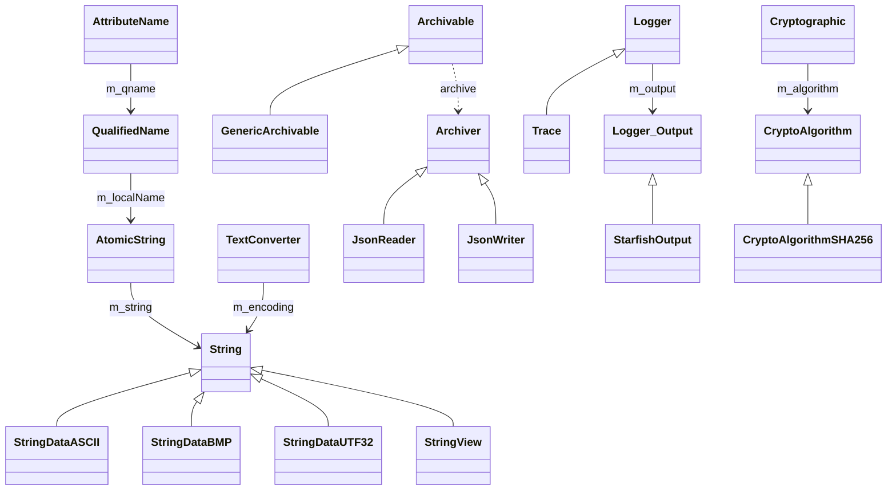
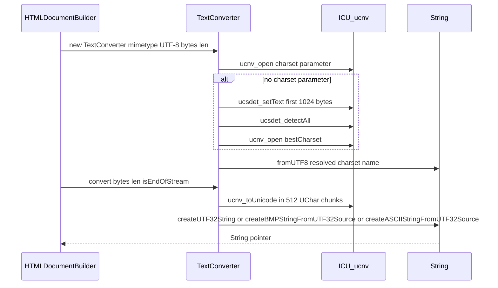

# Functional Requirements: core-util

> **Relevant source files**
>
> - [src/core/util/String.h](src:src/core/util/String.h)
> - [src/core/util/String.cpp](src:src/core/util/String.cpp)
> - [src/core/util/AtomicString.h](src:src/core/util/AtomicString.h)
> - [src/core/util/AtomicString.cpp](src:src/core/util/AtomicString.cpp)
> - [src/core/util/TextConverter.cpp](src:src/core/util/TextConverter.cpp)
> - [src/core/util/TextDecoder.cpp](src:src/core/util/TextDecoder.cpp)
> - [src/core/util/LineBreakerIteratorPool.h](src:src/core/util/LineBreakerIteratorPool.h)
> - [src/core/util/LineBreakerIteratorPool.cpp](src:src/core/util/LineBreakerIteratorPool.cpp)
> - [src/core/util/Archiver.h](src:src/core/util/Archiver.h)
> - [src/core/util/Archiver.cpp](src:src/core/util/Archiver.cpp)
> - [src/core/util/Messages.h](src:src/core/util/Messages.h)
> - [src/core/util/debug/Trace.cpp](src:src/core/util/debug/Trace.cpp)

**Module**: [`String.h`](src:src/core/util/String.h)
**Version**: 2026-09-10
**Linked Design Card**: [modules/core-util.md](../modules/core-util.md)
**Analysis basis**: AST export and direct source reading

## Overview

The module supplies the engine's string type and its interning table ([`String`](src:src/core/util/String.h#L694), [`AtomicString::createAtomicString`](src:src/core/util/AtomicString.cpp#L31)), converts incoming byte streams and script buffers to strings through ICU converters ([`TextConverter::convert`](src:src/core/util/TextConverter.cpp#L164), [`TextDecoder::decode`](src:src/core/util/TextDecoder.cpp#L97)), and pools line-break iterators for layout ([`LineBreakIteratorPool::get`](src:src/core/util/LineBreakerIteratorPool.h#L64)). It also provides the JSON archive used by service-worker state ([`Archiver`](src:src/core/util/Archiver.h#L60)), the fixed error-message format strings for script bindings ([`COMPOSE_MESSAGE`](src:src/core/util/Messages.h#L59)), and the filtered trace logger ([`Trace::Trace`](src:src/core/util/debug/Trace.cpp#L163)).

## Functional Requirements

### FR-CORE-UTIL-001
**Create strings from UTF-8 with the narrowest storage**

| Item | Content |
|------|---------|
| **Description** | The module converts a UTF-8 byte sequence into a `String` object, selecting an ASCII, BMP or UTF32 backing store according to the widest code point present, and returns the shared empty string for zero-length input. |
| **Input** | `const char* src`, `size_t len` (UTF-8 bytes). |
| **Output** | `String*` whose `bufferAccessData().bufferDataKind` is `ASCIIData`, `BMPData` or `UTF32Data`; `String::emptyString` when `len == 0`. |
| **Preconditions** | `src` points to at least `len` readable bytes. |
| **Postconditions** | Malformed lead bytes advance by one byte instead of aborting; 4-, 5- and 6-byte sequences force the UTF32 kind. |
| **Source** | [`String::fromUTF8`](src:src/core/util/String.cpp#L746), [`String::emptyString`](src:src/core/util/String.cpp#L54), [`StringBufferAccessData`](src:src/core/util/String.h#L641) |

**Acceptance criteria**:
- [ ] `fromUTF8("abc", 3)` yields a string of length 3 whose buffer kind is `ASCIIData`.
- [ ] `fromUTF8` with `len == 0` returns the same pointer as `String::emptyString`.
- [ ] Input containing a 4-byte UTF-8 sequence yields a `UTF32Data` string.
- [ ] Input containing only 2- or 3-byte sequences (no 4-byte) yields a non-ASCII string that is not `UTF32Data`.

### FR-CORE-UTIL-002
**Build strings incrementally from pieces**

| Item | Content |
|------|---------|
| **Description** | The module accumulates string fragments (whole `String` objects, `StringView` ranges, raw character arrays, single characters) and materializes one `String` on demand, tracking the widest character kind seen so the result uses the narrowest storage. |
| **Input** | Calls to `appendString`, `appendChar`, `appendSubString`; then `finalize` or `finalizeToStringView`. |
| **Output** | `String*` containing the concatenation; `String::emptyString` when no content was appended. |
| **Preconditions** | Builder pieces fit in the inline storage of `STRING_BUILDER_INLINE_STORAGE_MAX` (64) entries or spill to heap storage. |
| **Postconditions** | Each piece is typed `StringPiece`, `ConstChar` or `Char`; ASCII results are assembled with `memcpy` for ASCII pieces and per-character copy otherwise. |
| **Source** | [`StringBuilder`](src:src/core/util/String.h#L1607), [`StringBuilderPiece`](src:src/core/util/String.h#L1608), [`StringBuilder::finalize`](src:src/core/util/String.cpp#L2524), [`STRING_BUILDER_INLINE_STORAGE_MAX`](src:src/core/util/String.h#L1604) |

**Acceptance criteria**:
- [ ] `finalize()` on an untouched builder returns `String::emptyString`.
- [ ] Appending `"ab"` then `'c'` then a `String` `"d"` and finalizing yields `"abcd"`.
- [ ] Appending a BMP character to an otherwise ASCII builder produces a non-ASCII result.
- [ ] More than 64 pieces can be appended without loss.

### FR-CORE-UTIL-003
**Intern strings for pointer-equality comparison**

| Item | Content |
|------|---------|
| **Description** | The module maintains one interning table per `Starfish` instance so that equal string contents map to a single `String*`; `AtomicString` values compare by pointer. A lower-casing variant serves attribute names. |
| **Input** | `Starfish*` and a `String*`, `StringView`, `const char*` (with or without length), `const char16_t*`+length or `const char32_t*`+length. |
| **Output** | `AtomicString` wrapping the canonical `String*`; the empty `AtomicString` wraps `String::emptyString`. |
| **Preconditions** | `Starfish::m_atomicStringMap` exists and already contains `String::emptyString` (inserted in the `Starfish` constructor). |
| **Postconditions** | A `StringView` argument is copied to an owned string before insertion; a lookup uses an on-stack string so no allocation happens on a hit. |
| **Source** | [`AtomicString::createAtomicString`](src:src/core/util/AtomicString.cpp#L31), [`AtomicString::createAtomicString`](src:src/core/util/AtomicString.cpp#L58), [`AtomicString::createAttrAtomicString`](src:src/core/util/AtomicString.cpp#L102), [`AtomicStringMap`](src:src/core/util/AtomicString.h#L28), [`Starfish.cpp`](src:src/Starfish.cpp#L85) |

**Acceptance criteria**:
- [ ] Two calls with equal contents return `AtomicString`s for which `operator==` is true and `string()` pointers are identical.
- [ ] A default-constructed `AtomicString` satisfies `isEmptyAtomicString()`.
- [ ] Interning a `StringView` does not store the view itself (`isStringView()` is false on the stored string).
- [ ] `createAttrAtomicString` on `"ID"` returns the same `AtomicString` as on `"id"` for ASCII input.

### FR-CORE-UTIL-004
**Detect charset and convert byte streams to strings**

| Item | Content |
|------|---------|
| **Description** | The module opens a converter either from an explicit charset name or from a `charset=` parameter in a mimetype; when absent it detects the charset from up to 1024 leading bytes, preferring a 100-confidence match or the caller's preferred encoding. It then converts arbitrary-length byte chunks, buffering incomplete sequences across calls. |
| **Input** | Either `String* charsetName`, or `String* mimetype`, `String* preferredEncoding`, `const char* bytes`, `size_t len`; then repeated `convert(bytes, len, isEndOfStream)`. |
| **Output** | `String*` in the narrowest storage kind; `encoding()` returns the resolved charset name. |
| **Preconditions** | ICU converter tables for the requested charset are available. |
| **Postconditions** | Unknown charset names log `TextConverter: Unknown encoding` and leave the converter null, in which case `convert` falls back to `String::fromUTF8`; on the final chunk of a UTF-8 converter the bytes bypass ICU and go through `fromUTF8`; the converter is closed by a GC finalizer. |
| **Source** | [`TextConverter::TextConverter`](src:src/core/util/TextConverter.cpp#L46), [`TextConverter::TextConverter`](src:src/core/util/TextConverter.cpp#L61), [`TextConverter::convert`](src:src/core/util/TextConverter.cpp#L164), [`textConverterClear`](src:src/core/util/TextConverter.cpp#L25) |

**Acceptance criteria**:
- [ ] Mimetype `text/html; charset=euc-kr` opens a converter and `encoding()` reports ICU's canonical name for it.
- [ ] An unknown charset name logs an error and `convert` returns the input interpreted as UTF-8.
- [ ] With no charset parameter, detection considers at most 1024 bytes and selects a match with confidence 100 when one exists.
- [ ] `convert` with `len == 0` and a null converter returns `String::emptyString`.
- [ ] A multi-byte sequence split across two `convert` calls is decoded correctly on the second call.

### FR-CORE-UTIL-005
**Expose script-visible text decoding and encoding**

| Item | Content |
|------|---------|
| **Description** | The module provides `TextDecoder` and `TextEncoder` objects bound to an execution context: the decoder converts byte buffers with optional BOM skipping and a fatal mode; the encoder produces a `Uint8Array` from a string. |
| **Input** | Decoder: `ExecutionContext*`, `String* label`, `TextDecoderOptions` (`fatal`, `ignoreBOM`), then bytes plus `TextDecodeOptions` (`stream`). Encoder: `ExecutionContext*`, `String* label`, then `Optional<String*>`. |
| **Output** | Decoder returns `String*`; encoder returns `ScriptUint8Array`. `encoding()`, `fatal()`, `ignoreBOM()` report configuration. |
| **Preconditions** | The label names a charset ICU can open. |
| **Postconditions** | An unopenable label throws `DOMException` with `SCRIPT_RANGE_ERR`; in fatal mode a decoded `0xFFFD` throws `DOMException` with `SCRIPT_TYPE_ERR`; native converters are released by a GC finalizer. |
| **Source** | [`TextDecoder`](src:src/core/util/TextDecoder.h#L82), [`TextDecoder::TextDecoder`](src:src/core/util/TextDecoder.cpp#L53), [`TextDecoder::decode`](src:src/core/util/TextDecoder.cpp#L97), [`TextEncoder::encode`](src:src/core/util/TextEncoder.cpp#L68), [`TextEncoder::TextEncoder`](src:src/core/util/TextEncoder.cpp#L48) |

**Acceptance criteria**:
- [ ] Constructing `TextDecoder` with an unknown label throws a `DOMException` range error.
- [ ] Decoding bytes containing an invalid sequence with `fatal == true` throws a `DOMException` type error.
- [ ] `TextEncoder::encode` with no input returns an empty `Uint8Array`.
- [ ] `fatal()` and `ignoreBOM()` reflect the options passed at construction.

### FR-CORE-UTIL-006
**Pool line-break iterators per locale and mode**

| Item | Content |
|------|---------|
| **Description** | The module returns an ICU line-break iterator for a (locale, `LineBreakIteratorMode`) pair, reusing a pooled iterator when one exists and otherwise opening one from the locale with a `@break=` keyword (UAX14 mode) or from embedded custom UAX14 rules (loose/normal/strict, CJK-dependent). The pool has a fixed capacity and evicts the oldest entry. |
| **Input** | `const std::string& locale`, `LineBreakIteratorMode mode`, `bool isCJK`. |
| **Output** | `UBreakIterator*`, or `nullptr` when ICU cannot open an iterator even for the fallback locale. |
| **Preconditions** | A `LineBreakIteratorPool` was created by `Starfish` with capacity `STARFISH_LINE_BREAK_ITERATOR_POOL_SIZE` (4 unless overridden). |
| **Postconditions** | When the locale from the web page is invalid, the code retries `ubrk_open` with the raw locale string and logs `Falling back to the default locale` on second failure; pooled iterators are closed on pool destruction. |
| **Source** | [`LineBreakIteratorPool::get`](src:src/core/util/LineBreakerIteratorPool.h#L64), [`LineBreakIteratorPool::put`](src:src/core/util/LineBreakerIteratorPool.h#L91), [`openLineBreakIterator`](src:src/core/util/LineBreakerIteratorPool.cpp#L514), [`makeRule`](src:src/core/util/LineBreakerIteratorPool.cpp#L449), [`makeLocaleWithBreakKeyword`](src:src/core/util/LineBreakerIteratorPool.cpp#L482), [`Starfish.cpp`](src:src/Starfish.cpp#L81) |

**Acceptance criteria**:
- [ ] Two `get` calls with the same locale and mode return the same `UBreakIterator*`.
- [ ] A fifth distinct (locale, mode) pair on a capacity-4 pool evicts and closes the first entry.
- [ ] Mode `LineBreakIteratorModeUAX14Loose` with `isCJK == true` opens an iterator from the loose CJK rule text rather than from the locale.
- [ ] An unopenable locale produces the fallback log message and `nullptr`.

### FR-CORE-UTIL-007
**Archive objects to and from JSON**

| Item | Content |
|------|---------|
| **Description** | The module defines an `Archivable` contract (`archiveId`, `archive`) and an `Archiver` abstraction with `JsonWriter` and `JsonReader` implementations, so a single `archive` member function on a data object both serializes to and deserializes from JSON. Enumerations are stored as their underlying integers and nested `Archivable` objects are dispatched through a single registered handler. |
| **Input** | Writer: sequence of `StartObject`/`Member`/`operator&`/`EndObject` calls. Reader: `const char* json`. |
| **Output** | Writer: `GetString()`/`GetSize()` of the pretty-printed JSON. Reader: values written into the referenced members; `HasError()` true when parsing failed. |
| **Preconditions** | `STARFISH_ENABLE_SERVICE_WORKER` is defined; `Archiver::setArchivableHandler` has been called before `MemberArchivable` is used. |
| **Postconditions** | `JsonReader` sets its error flag when `rapidjson::Document::Parse` reports an error; an `ExecuteScope` destructor logs `[ R|W ] key ( name )` for each member archived while the archiver is in error. |
| **Source** | [`Archivable`](src:src/core/util/Archivable.h#L28), [`Archiver`](src:src/core/util/Archiver.h#L60), [`Archiver::MemberEnum`](src:src/core/util/Archiver.h#L116), [`Archiver::MemberArchivable`](src:src/core/util/Archiver.h#L131), [`JsonReader::JsonReader`](src:src/core/util/Archiver.cpp#L80), [`JsonWriter::GetString`](src:src/core/util/Archiver.cpp#L376), [`GenericArchivable`](src:src/core/util/Archivable.h#L57) |

**Acceptance criteria**:
- [ ] Writing an object with one `unsigned` member and reading the output back restores the same value.
- [ ] `JsonReader("not json")` reports `HasError() == true` and `operator bool()` false.
- [ ] `MemberEnum` writes the numeric underlying value and restores the enumerator on read.
- [ ] `IntegerArchivable` and `StringArchivable` round-trip their `value` member under the `value` key.

### FR-CORE-UTIL-008
**Compose script error messages from fixed format strings**

| Item | Content |
|------|---------|
| **Description** | The module centralizes the wording of exceptions raised by script bindings (constructor without `new`, failed execution, type mismatch, invalid size, origin mismatch, boundary violations) and provides a macro that allocates an exact-size buffer and formats the arguments into it. |
| **Input** | A format string macro such as `FAILED_TO_EXECUTE` or `INVALID_SIZE` plus `const char*` arguments. |
| **Output** | A `char*` local named by the caller holding the formatted text. |
| **Preconditions** | All variadic arguments are `const char*` (they are summed with `strlen`). |
| **Postconditions** | Buffer size equals the sum of the lengths of the format string and all arguments plus one. |
| **Source** | [`COMPOSE_MESSAGE`](src:src/core/util/Messages.h#L59), [`bufferSize`](src:src/core/util/Message.cpp#L25), [`FAILED_TO_EXECUTE`](src:src/core/util/Messages.h#L27), [`INVALID_SIZE`](src:src/core/util/Messages.h#L45), [`HTMLMediaElement.cpp`](src:src/core/dom/HTMLMediaElement.cpp#L591) |

**Acceptance criteria**:
- [ ] `COMPOSE_MESSAGE(msg, FAILED_TO_EXECUTE, "addTextTrack", "HTMLMediaElement", reason)` yields `Failed to execute 'addTextTrack' on 'HTMLMediaElement': <reason>`.
- [ ] `bufferSize({"ab", "cde"})` returns 5.
- [ ] `ILLEGAL_INVOKE` expands to `Illegal invocation` with no placeholders.

### FR-CORE-UTIL-009
**Emit filtered trace output with process and thread headers**

| Item | Content |
|------|---------|
| **Description** | In debug builds the module prints trace lines tagged by an identifier, prefixed with a coloured process id, a per-thread letter, a seconds.milliseconds timestamp, the identifier truncated to 10 characters, an indentation string for scoped traces, and the code location with the `Starfish::` prefix stripped. Output is suppressed unless the identifier is enabled. |
| **Input** | `TRACE(id, ...)`, `TRACE_SCOPE(id, ...)`, `TRACEF(id, fmt, ...)` macros; enablement via `LogOption::setExternalIsEnabled` or the `TRACE` option in `GlobalOptions`. |
| **Output** | Text written to `std::cout` by `StarfishOutput::flush` when the `Trace` object is destroyed. |
| **Preconditions** | `ENABLE_TRACE` is defined (build without `NDEBUG`). |
| **Postconditions** | Thread letters cycle through 26 values; `IndentCounter` increases indentation for the lifetime of a `TRACE_SCOPE`; disabled ids produce no output and no formatting work beyond the enablement check. |
| **Source** | [`Trace::Trace`](src:src/core/util/debug/Trace.cpp#L163), [`writeHeader`](src:src/core/util/debug/Trace.cpp#L150), [`writeProcessHeader`](src:src/core/util/debug/Trace.cpp#L109), [`LogOption::isEnabled`](src:src/core/util/debug/Logger.cpp#L91), [`Logger::flush`](src:src/core/util/debug/Logger.cpp#L163), [`TRACE_SCOPE`](src:src/core/util/debug/Trace.h#L58), [`IndentCounter`](src:src/core/util/debug/Logger.h#L151) |

**Acceptance criteria**:
- [ ] With `TRACE=HOST` set in the environment, `TRACE_SCOPE(HOST)` prints a line containing `(HOST` and the calling function name.
- [ ] With no enabling option, `TRACE(HOST, "x")` prints nothing.
- [ ] `Logger::print("%d items", 3)` writes `3 items`; a lone `%` followed by a non-`%` character in `print` without arguments asserts.
- [ ] In a build with `NDEBUG`, `TRACE_SCOPE` expands to nothing.

### FR-CORE-UTIL-010
**Read runtime options from environment variables**

| Item | Content |
|------|---------|
| **Description** | The module exposes a process-wide `GlobalOptions` singleton that parses environment values into groups of positive and negative tokens with optional `*` wildcard, answers `has(key, subKey)` queries, and returns raw values with `get`. A separate `LoggerOption` reads `STARFISH_LOG` to build a filter set for log locations. |
| **Input** | Environment variables read via `getenv`; programmatic `set(key, value)`. |
| **Output** | `bool` from `has`, `std::string` from `get`; log line `[ key = value ]` on parse. |
| **Preconditions** | None. |
| **Postconditions** | Parsed values are stored per key in `m_valueGroup`; `LoggerOption::parseEnv` logs `LOGGER FILTER: ON (...)` when the variable is present. |
| **Source** | [`GlobalOptions::instance`](src:src/core/util/GlobalOptions.cpp#L27), [`GlobalOptions::readEnvironmentValue`](src:src/core/util/GlobalOptions.cpp#L51), [`GlobalOptions::parse`](src:src/core/util/GlobalOptions.cpp#L56), [`GlobalOptions::has`](src:src/core/util/GlobalOptions.cpp#L81), [`ValueGroup`](src:src/core/util/GlobalOptions.h#L31), [`LoggerOption::parseEnv`](src:src/core/util/ProgramOptions.cpp#L58) |

**Acceptance criteria**:
- [ ] After `set("TRACE", "HOST")`, `has("TRACE", "HOST")` is true and `has("TRACE", "OTHER")` is false.
- [ ] `get("TRACE")` returns the raw string that was parsed.
- [ ] `LoggerOption::parseEnv` with `STARFISH_LOG` unset leaves filtering off.

### FR-CORE-UTIL-011
**Compute SHA-2 digests with selectable output encoding**

| Item | Content |
|------|---------|
| **Description** | The module hashes byte strings with SHA-256, SHA-384 or SHA-512 (OpenSSL on non-Windows, bcrypt on Windows) and returns the digest raw, Base64-encoded or hex-encoded. |
| **Input** | `CryptoAlgorithmType` (`Sha256`, `Sha384`, `Sha512`), one or more `update(const std::string&)` calls, `DigestEncodingType` (`None`, `Base64`, `Hex`). |
| **Output** | `std::string` digest. |
| **Preconditions** | `hashType` is one of the three supported values (`NUM_SUPPORTED_CRYPTO_ALGORITHM_TYPE` is 3). |
| **Postconditions** | Multiple `update` calls accumulate into a single digest. |
| **Source** | [`Cryptographic`](src:src/core/util/Cryptographic.h#L46), [`Cryptographic::update`](src:src/core/util/Cryptographic.cpp#L337), [`Cryptographic::digest`](src:src/core/util/Cryptographic.cpp#L342), [`CryptoAlgorithmSHA256`](src:src/core/util/Cryptographic.cpp#L156), [`CryptoAlgorithmType`](src:src/core/util/Cryptographic.h#L25) |

**Acceptance criteria**:
- [ ] `Cryptographic(Sha256, "abc").digest(Hex)` returns a 64-character hex string.
- [ ] `update("a")` followed by `update("bc")` yields the same digest as a single `update("abc")`.
- [ ] `digest(Base64)` returns Base64 text of the raw digest.

### FR-CORE-UTIL-012
**Generate typed 32-bit identifiers**

| Item | Content |
|------|---------|
| **Description** | The module produces `Id<T>` values that are distinct per tag type, using a random strategy by default (or a sequence strategy that wraps with a warning), distinguishes generated (`UNIQUE`) ids from default-constructed (`SHARED`) ones, and integrates with `Archiver` through `MemberId`. |
| **Input** | `Id<T>::generate()`; optional `IDGenerator` strategy. |
| **Output** | `Id<T>` with `m_id != ID_INITIAL_VALUE`; `toString()` decimal text; `isValid()`, `isUnique()`. |
| **Preconditions** | `RandomEngine::instance()` is seeded (from `time(NULL)` in its constructor). |
| **Postconditions** | `sequence()` resets to `ID_INITIAL_VALUE` after reaching `UINT_MAX` and logs a warning. |
| **Source** | [`Id::generate`](src:src/core/util/Id.h#L79), [`IDGenerator`](src:src/core/util/Id.h#L31), [`IDGenerator::random`](src:src/core/util/Id.cpp#L37), [`IDGenerator::sequence`](src:src/core/util/Id.cpp#L26), [`CreatedIdType`](src:src/core/util/Id.h#L27), [`Archiver::MemberId`](src:src/core/util/Archiver.h#L109), [`RandomEngine::RandomEngine`](src:src/core/util/RandomEngine.cpp#L25) |

**Acceptance criteria**:
- [ ] A default-constructed `Id<T>` is falsy and `isValid()` is false.
- [ ] `Id<T>::generate()` returns an id with `isUnique() == true`.
- [ ] Two ids with equal `m_id` compare equal with `operator==`.
- [ ] Archiving an `Id<T>` with `MemberId("id", id)` and reading it back restores the same value.

## Non-Functional Requirements

| Item | Requirement | Source |
|------|-------------|--------|
| Performance | Strings use the narrowest storage (ASCII, BMP, UTF32) and interning lookups use on-stack strings to avoid allocation on hits; `StringBuilder` keeps up to 64 pieces inline. | [`StringDataOnStackASCII`](src:src/core/util/String.h#L1145), [`AtomicString::createAtomicString`](src:src/core/util/AtomicString.cpp#L58), [`STRING_BUILDER_INLINE_STORAGE_MAX`](src:src/core/util/String.h#L1604) |
| Performance | Line-break iterators are cached (capacity 4 by default) and charset detection inspects at most 1024 bytes. | [`LineBreakIteratorPool::get`](src:src/core/util/LineBreakerIteratorPool.h#L64), [`TextConverter::TextConverter`](src:src/core/util/TextConverter.cpp#L61) |
| Security | Not specified in code. | — |
| Error handling | Unknown charsets are logged and degrade to UTF-8; iterator open failures fall back to the raw locale then return `nullptr`; `TextDecoder`/`TextEncoder` throw `DOMException` on bad labels; `JsonReader` exposes parse failures via `HasError`. | [`TextConverter::TextConverter`](src:src/core/util/TextConverter.cpp#L46), [`openLineBreakIterator`](src:src/core/util/LineBreakerIteratorPool.cpp#L514), [`TextDecoder::TextDecoder`](src:src/core/util/TextDecoder.cpp#L53), [`JsonReader::HasError`](src:src/core/util/Archiver.h#L156) |
| Logging | Errors go through `STARFISH_LOG_ERROR`; trace output is compiled only without `NDEBUG` and filtered by identifier through `LogOption`. | [`StarfishBase.h`](src:src/StarfishBase.h#L416), [`ENABLE_TRACE`](src:src/core/util/debug/Trace.h#L33), [`LogOption::isEnabled`](src:src/core/util/debug/Logger.cpp#L91) |

## Constraints

- `Archivable`/`Archiver` compile only under `STARFISH_ENABLE_SERVICE_WORKER`. [`Archivable.h`](src:src/core/util/Archivable.h#L20)
- `BloomFilter<keyBits>` requires `keyBits <= 16`. [`BloomFilter`](src:src/core/util/BloomFilter.h#L58)
- `GenericArchivable` archive ids are truncated to `MAX_TYPE_NAME` (30) characters. [`MAX_TYPE_NAME`](src:src/core/util/Archivable.h#L48)
- `AtomicString::createAtomicString` from `char16_t` supports BMP characters only (source comment). [`AtomicString.h`](src:src/core/util/AtomicString.h#L58)
- `URL::createObjectURL(MediaSource*)` exists only under `STARFISH_ENABLE_MULTIMEDIA`. [`URL.h`](src:src/core/util/URL.h#L41)
- `COMPOSE_MESSAGE` arguments must be `const char*` because sizes are computed with `strlen`. [`bufferSize`](src:src/core/util/Message.cpp#L25)

## Module Design Card Linkage

| FR | Implementation | Design Card section |
|----|----------------|---------------------|
| FR-CORE-UTIL-001 | [`String::fromUTF8`](src:src/core/util/String.cpp#L746) | [Public Interface](../modules/core-util.md#public-interface) |
| FR-CORE-UTIL-002 | [`StringBuilder::finalize`](src:src/core/util/String.cpp#L2524) | [Quick Navigation](../modules/core-util.md#quick-navigation) |
| FR-CORE-UTIL-003 | [`AtomicString::createAtomicString`](src:src/core/util/AtomicString.cpp#L31) | [Architectural Rules](../modules/core-util.md#architectural-rules) |
| FR-CORE-UTIL-004 | [`TextConverter::convert`](src:src/core/util/TextConverter.cpp#L164) | [Key Flow](../modules/core-util.md#key-flow) |
| FR-CORE-UTIL-005 | [`TextDecoder::decode`](src:src/core/util/TextDecoder.cpp#L97) | [Public Interface](../modules/core-util.md#public-interface) |
| FR-CORE-UTIL-006 | [`LineBreakIteratorPool::get`](src:src/core/util/LineBreakerIteratorPool.h#L64) | [Key Flow](../modules/core-util.md#key-flow) |
| FR-CORE-UTIL-007 | [`Archiver`](src:src/core/util/Archiver.h#L60) | [IPC / Message / Interface Contracts](../modules/core-util.md#ipc--message--interface-contracts) |
| FR-CORE-UTIL-008 | [`COMPOSE_MESSAGE`](src:src/core/util/Messages.h#L59) | [Architectural Rules](../modules/core-util.md#architectural-rules) |
| FR-CORE-UTIL-009 | [`Trace::Trace`](src:src/core/util/debug/Trace.cpp#L163) | [Key Flow](../modules/core-util.md#key-flow) |
| FR-CORE-UTIL-010 | [`GlobalOptions::parse`](src:src/core/util/GlobalOptions.cpp#L56) | [Quick Navigation](../modules/core-util.md#quick-navigation) |
| FR-CORE-UTIL-011 | [`Cryptographic::digest`](src:src/core/util/Cryptographic.cpp#L342) | [Dependencies](../modules/core-util.md#dependencies) |
| FR-CORE-UTIL-012 | [`Id::generate`](src:src/core/util/Id.h#L79) | [Public Interface](../modules/core-util.md#public-interface) |

## ENUM Definitions

| ENUM | Values | Used in | Source |
|------|--------|---------|--------|
| `JsonReaderStackItem::State` | `BeforeStart`, `Started`, `Closed` | JSON reader traversal state | [`State`](src:src/core/util/Archiver.cpp#L58) |
| `AttributeName::MatchType` | `MatchName`, `MatchNS`, `MatchAll` | Attribute lookup semantics | [`MatchType`](src:src/core/util/AttributeName.h#L28) |
| `LineBreakIteratorMode` | `LineBreakIteratorModeUAX14`, `LineBreakIteratorModeUAX14Loose`, `LineBreakIteratorModeUAX14Normal`, `LineBreakIteratorModeUAX14Strict` | Line-break rule selection | [`LineBreakIteratorMode`](src:src/core/util/LineBreakerIteratorPool.h#L28) |
| `PassRef::AdoptTag` | `Adopt` | Reference adoption tag | [`AdoptTag`](src:src/core/util/RefPtr.h#L77) |
| `PassRefPtr::AdoptTag` | `Adopt` | Pointer adoption tag | [`AdoptTag`](src:src/core/util/RefPtr.h#L279) |
| `CharDirection` | `Ltr`, `Rtl`, `Mixed`, `Neutral` | Text direction of a string or run | [`CharDirection`](src:src/core/util/String.h#L590) |
| `CharCategory` | `NoCategory`, `Other_NotAssigned`, `Letter_Uppercase`, `Letter_Lowercase`, `Letter_Titlecase`, `Letter_Modifier`, `Letter_Other`, `Mark_NonSpacing`, `Mark_Enclosing`, `Mark_SpacingCombining`, `Number_DecimalDigit`, `Number_Letter`, `Number_Other`, `Separator_Space`, `Separator_Line`, `Separator_Paragraph`, `Other_Control`, `Other_Format`, `Other_PrivateUse`, `Other_Surrogate` | Unicode general category queries | [`CharCategory`](src:src/core/util/String.h#L597) |
| `StringBufferAccessData::BufferDataKind` | `ASCIIData`, `BMPData`, `UTF32Data` | Storage kind of a `String` | [`BufferDataKind`](src:src/core/util/String.h#L642) |
| `SimpleStringBufferHolder::TakeBuffer` | `TakeBufferValue` | Buffer-ownership transfer tag | [`TakeBuffer`](src:src/core/util/String.h#L1063) |
| `StringBuilderPiece::Type` | `StringPiece`, `ConstChar`, `Char` | Piece kind inside `StringBuilder` | [`Type`](src:src/core/util/String.h#L1617) |
| `SegmentedString::LookAheadResult` | `DidNotMatch`, `DidMatch`, `NotEnoughCharacters` | Tokenizer look-ahead | [`LookAheadResult`](src:src/core/util/String.h#L1990) |
| `SegmentedString::FastPathFlags` | `NoFastPath`, `Use8BitAdvanceAndUpdateLineNumbers`, `Use8BitAdvance` | Tokenizer advance fast path | [`FastPathFlags`](src:src/core/util/String.h#L2135) |
| `CryptoAlgorithmType` | `None`, `Sha256`, `Sha384`, `Sha512` | Hash selection | [`CryptoAlgorithmType`](src:src/core/util/Cryptographic.h#L25) |
| `DigestEncodingType` | `None`, `Base64`, `Hex` | Digest output encoding | [`DigestEncodingType`](src:src/core/util/Cryptographic.h#L34) |
| `CreatedIdType` | `UNIQUE`, `SHARED` | Whether an `Id` was generated | [`CreatedIdType`](src:src/core/util/Id.h#L27) |

## Error Code Definitions

None found in code.

## Constant Definitions

54 constants are recorded for this module; the 36 most relevant are listed (the remaining 18 are `CLR_*` terminal colour codes in `Trace.cpp` lines 39-55).

| Constant | Value | Purpose | Source |
|----------|-------|---------|-------|
| `MAX_TYPE_NAME` | `30` | Archive id buffer length in `GenericArchivable` | [`MAX_TYPE_NAME`](src:src/core/util/Archivable.h#L48) |
| `DOCUMENT` | `reinterpret_cast<rapidjson::Document*>(mDocument)` | Reader document accessor | [`DOCUMENT`](src:src/core/util/Archiver.cpp#L75) |
| `STACK` | `(reinterpret_cast<JsonReaderStack*>(mStack))` | Reader stack accessor | [`STACK`](src:src/core/util/Archiver.cpp#L76) |
| `TOP` | `(STACK->top())` | Current reader stack item | [`TOP`](src:src/core/util/Archiver.cpp#L77) |
| `CURRENT` | `(*TOP.value)` | Current JSON value | [`CURRENT`](src:src/core/util/Archiver.cpp#L78) |
| `WRITER` | `reinterpret_cast<rapidjson::PrettyWriter<rapidjson::StringBuffer>*>(mWriter)` | Writer accessor | [`WRITER`](src:src/core/util/Archiver.cpp#L358) |
| `STREAM` | `reinterpret_cast<rapidjson::StringBuffer*>(mStream)` | Writer buffer accessor | [`STREAM`](src:src/core/util/Archiver.cpp#L360) |
| `NUM_SUPPORTED_CRYPTO_ALGORITHM_TYPE` | `3` | Number of hash algorithms | [`NUM_SUPPORTED_CRYPTO_ALGORITHM_TYPE`](src:src/core/util/Cryptographic.h#L32) |
| `ID_INITIAL_VALUE` | `0` | Invalid/initial `Id` value | [`ID_INITIAL_VALUE`](src:src/core/util/Id.h#L29) |
| `CALLED_CONSTRUCTOR_WITHOUT_NEW` | `"Constructor '%s' requires 'new'"` | Script error text | [`CALLED_CONSTRUCTOR_WITHOUT_NEW`](src:src/core/util/Messages.h#L25) |
| `FAILED_TO_CONSTRUCT` | `"Failed to construct '%s': %s"` | Script error text | [`FAILED_TO_CONSTRUCT`](src:src/core/util/Messages.h#L26) |
| `FAILED_TO_EXECUTE` | `"Failed to execute '%s' on '%s': %s"` | Script error text | [`FAILED_TO_EXECUTE`](src:src/core/util/Messages.h#L27) |
| `FAILED_TO_SET_PROPERTY` | `"Failed to set the '%s' property on '%s': %s"` | Script error text | [`FAILED_TO_SET_PROPERTY`](src:src/core/util/Messages.h#L28) |
| `ILLEGAL_INVOKE` | `"Illegal invocation"` | Script error text | [`ILLEGAL_INVOKE`](src:src/core/util/Messages.h#L29) |
| `ARGS_NOT_ENOUGH` | `"needs %s parameter, but only %s present."` | Script error detail | [`ARGS_NOT_ENOUGH`](src:src/core/util/Messages.h#L32) |
| `ARG_TYPE_IS_NONFINITE` | `"The provided double value is non-finite"` | Script error detail | [`ARG_TYPE_IS_NONFINITE`](src:src/core/util/Messages.h#L33) |
| `ARG_TYPE_MISMATCH` | `"parameter %s ('%s') is not a(n) %s."` | Script error detail | [`ARG_TYPE_MISMATCH`](src:src/core/util/Messages.h#L34) |
| `ARG_TYPE_MISMATCH_2` | `"parameter %s ('%s') must be either a '%s' or '%s' element."` | Script error detail | [`ARG_TYPE_MISMATCH_2`](src:src/core/util/Messages.h#L35) |
| `ARG_TYPE_MISMATCH_WITH_INDEXABLE_TYPE` | `"The parameter %s ('%s') is neither an array, nor does it have indexed properties."` | Script error detail | [`ARG_TYPE_MISMATCH_WITH_INDEXABLE_TYPE`](src:src/core/util/Messages.h#L37) |
| `ARG_TYPE_MISMATCH_WITH_ENUM` | `"The provided value is not a valid enum value of type %s."` | Script error detail | [`ARG_TYPE_MISMATCH_WITH_ENUM`](src:src/core/util/Messages.h#L40) |
| `SIGNATURE_NOT_FOUND` | `"No function was found that matched the signature provided."` | Script error detail | [`SIGNATURE_NOT_FOUND`](src:src/core/util/Messages.h#L42) |
| `QUERY_SELECTOR_IS_EMPTY` | `"The provided selector is empty."` | Script error detail | [`QUERY_SELECTOR_IS_EMPTY`](src:src/core/util/Messages.h#L44) |
| `INVALID_SIZE` | `"The value provided %s, which is an invalid size."` | Script error detail | [`INVALID_SIZE`](src:src/core/util/Messages.h#L45) |
| `INVALID_TARGET_ORIGIN` | `"Invalid target origin '%s' in a call to '%s'"` | Script error detail | [`INVALID_TARGET_ORIGIN`](src:src/core/util/Messages.h#L46) |
| `INVALID_DATA_CLONE` | `"'%s' could not be cloned."` | Script error detail | [`INVALID_DATA_CLONE`](src:src/core/util/Messages.h#L47) |
| `ORIGINS_ARE_NOT_MATCHED` | `"The target origin provided('%s') does not match the recipient window's origin('%s')"` | Script error detail | [`ORIGINS_ARE_NOT_MATCHED`](src:src/core/util/Messages.h#L48) |
| `NOT_POSITIVE` | `"The value provided (%s) is not positive or 0."` | Script error detail | [`NOT_POSITIVE`](src:src/core/util/Messages.h#L51) |
| `EXCEED_MIN_BOUNDARY` | `"The value provided (%s) is less than the minimum boundary (%s)."` | Script error detail | [`EXCEED_MIN_BOUNDARY`](src:src/core/util/Messages.h#L52) |
| `EXCEED_MAX_BOUNDARY` | `"The value provided (%s) is greater than the maximum boundary (%s)."` | Script error detail | [`EXCEED_MAX_BOUNDARY`](src:src/core/util/Messages.h#L54) |
| `CHECK_REF_COUNTED_LIFECYCLE` | `0` (with `NDEBUG`) / `1` (otherwise) | Enables ref-count lifecycle assertions | [`CHECK_REF_COUNTED_LIFECYCLE`](src:src/core/util/RefCounted.h#L31), [`CHECK_REF_COUNTED_LIFECYCLE`](src:src/core/util/RefCounted.h#L33) |
| `STRING_BUILDER_INLINE_STORAGE_MAX` | `64` | Inline piece capacity of `StringBuilder` | [`STRING_BUILDER_INLINE_STORAGE_MAX`](src:src/core/util/String.h#L1604) |
| `TYPE_LENGTH_LIMIT` | `5` | Width of the trace tag column | [`TYPE_LENGTH_LIMIT`](src:src/core/util/debug/Trace.cpp#L33) |
| `TRACE_ID_LENGTH_LIMIT` | `10` | Width of the trace id column | [`TRACE_ID_LENGTH_LIMIT`](src:src/core/util/debug/Trace.cpp#L34) |
| `CLR_RESET` | `"\033[0m"` | Terminal colour reset | [`CLR_RESET`](src:src/core/util/debug/Trace.cpp#L35) |
| `CLR_DIM` | `"\033[0;2m"` | Dim header colour | [`CLR_DIM`](src:src/core/util/debug/Trace.cpp#L36) |
| `ENABLE_TRACE` | defined when `NDEBUG` is not defined | Compiles trace macros in | [`ENABLE_TRACE`](src:src/core/util/debug/Trace.h#L33) |

## Message Protocol

None found in code.

## Class Diagram

Sources: [`StringDataASCII`](src:src/core/util/String.h#L1099), [`StringDataBMP`](src:src/core/util/String.h#L1312), [`StringDataUTF32`](src:src/core/util/String.h#L1252), [`StringView`](src:src/core/util/String.h#L1436), [`AtomicString`](src:src/core/util/AtomicString.h#L98), [`QualifiedName`](src:src/core/util/QualifiedName.h#L27), [`AttributeName`](src:src/core/util/AttributeName.h#L25), [`TextConverter`](src:src/core/util/TextConverter.h#L27), [`GenericArchivable`](src:src/core/util/Archivable.h#L57), [`JsonReader`](src:src/core/util/Archiver.h#L150), [`JsonWriter`](src:src/core/util/Archiver.h#L197), [`Trace`](src:src/core/util/debug/Trace.h#L25), [`StarfishOutput`](src:src/core/util/debug/Trace.cpp#L57), [`Logger::Output`](src:src/core/util/debug/Logger.h#L49), [`Cryptographic`](src:src/core/util/Cryptographic.h#L46), [`CryptoAlgorithmSHA256`](src:src/core/util/Cryptographic.cpp#L156).

## Sequence Diagram

Sources: [`HTMLDocumentBuilder.cpp`](src:src/core/dom/builder/html/HTMLDocumentBuilder.cpp#L434), [`TextConverter::TextConverter`](src:src/core/util/TextConverter.cpp#L61), [`TextConverter::convert`](src:src/core/util/TextConverter.cpp#L164), [`String::createBMPStringFromUTF32Source`](src:src/core/util/String.cpp#L922), [`String::createASCIIStringFromUTF32Source`](src:src/core/util/String.cpp#L906).

## Test Cases

### Positive
- `String::fromUTF8("hello", 5)` → length 5, `ASCIIData` kind. [`String::fromUTF8`](src:src/core/util/String.cpp#L746)
- `StringBuilder` with `appendString("ab", 2)`, `appendChar('c')`, `finalize()` → `"abc"`. [`StringBuilder::finalize`](src:src/core/util/String.cpp#L2524)
- `createAtomicString(sf, "div")` twice → identical `string()` pointers. [`AtomicString::createAtomicString`](src:src/core/util/AtomicString.cpp#L58)
- `TextConverter(mimetype "text/html; charset=utf-8", "UTF-8", bytes, len)` then `convert(bytes, len, true)` → same result as `fromUTF8(bytes, len)`. [`TextConverter::convert`](src:src/core/util/TextConverter.cpp#L164)
- `LineBreakIteratorPool(4).get("en", LineBreakIteratorModeUAX14, false)` twice → same `UBreakIterator*`. [`LineBreakIteratorPool::get`](src:src/core/util/LineBreakerIteratorPool.h#L64)
- `JsonWriter` archive of `IntegerArchivable("n", 7)` then `JsonReader` of `GetString()` → value 7 restored. [`GenericArchivable::archive`](src:src/core/util/Archivable.h#L77)
- `COMPOSE_MESSAGE(msg, ILLEGAL_INVOKE)` → `"Illegal invocation"`. [`COMPOSE_MESSAGE`](src:src/core/util/Messages.h#L59)
- `Cryptographic(Sha256, "abc").digest(Hex)` → 64 hex characters. [`Cryptographic::digest`](src:src/core/util/Cryptographic.cpp#L342)
- `Id<T>::generate()` → `isValid()` and `isUnique()` true. [`Id::generate`](src:src/core/util/Id.h#L79)

### Negative
- `TextConverter(String "no-such-charset")` → `STARFISH_LOG_ERROR` and `convert` returns UTF-8 interpretation. [`TextConverter::TextConverter`](src:src/core/util/TextConverter.cpp#L46)
- `TextDecoder(ctx, "no-such-label")` → throws `DOMException` `SCRIPT_RANGE_ERR`. [`TextDecoder::TextDecoder`](src:src/core/util/TextDecoder.cpp#L53)
- `TextDecoder` with `fatal` on invalid bytes → throws `DOMException` `SCRIPT_TYPE_ERR`. [`TextDecoder::decode`](src:src/core/util/TextDecoder.cpp#L97)
- `JsonReader("{bad json")` → `HasError()` true, `operator bool()` false. [`JsonReader::JsonReader`](src:src/core/util/Archiver.cpp#L80)
- `openLineBreakIterator` with an unopenable locale on both attempts → log `Falling back to the default locale` and `nullptr`. [`openLineBreakIterator`](src:src/core/util/LineBreakerIteratorPool.cpp#L514)
- `Logger::print("50% done")` without arguments → assertion (`%` not followed by `%`). [`Logger::print`](src:src/core/util/debug/Logger.cpp#L147)

### Edge
- `String::fromUTF8(ptr, 0)` → `String::emptyString` pointer. [`String::fromUTF8`](src:src/core/util/String.cpp#L746)
- `StringBuilder::finalize()` with no pieces → `String::emptyString`. [`StringBuilder::finalize`](src:src/core/util/String.cpp#L2524)
- Multi-byte sequence split across two `convert` calls with `isEndOfStream == false` then `true` → decoded once, no partial characters. [`TextConverter::convert`](src:src/core/util/TextConverter.cpp#L164)
- Fifth distinct (locale, mode) on a capacity-4 pool → first entry closed and removed. [`LineBreakIteratorPool::put`](src:src/core/util/LineBreakerIteratorPool.h#L91)
- `IDGenerator::sequence()` at `UINT_MAX` → warning logged and counter restarts from 1. [`IDGenerator::sequence`](src:src/core/util/Id.cpp#L26)
- `GenericArchivable` constructed with an id longer than 30 characters → id truncated to `MAX_TYPE_NAME`. [`GenericArchivable`](src:src/core/util/Archivable.h#L57)
- Trace with an id longer than 10 characters → header shows only the first 10. [`writeHeader`](src:src/core/util/debug/Trace.cpp#L150)
