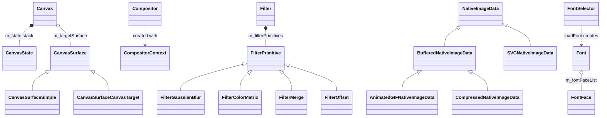
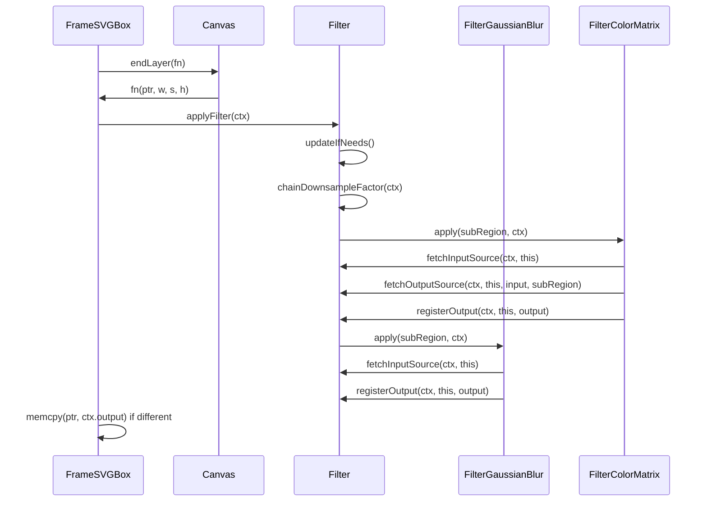

# Functional Requirements: modules-canvas

> **Relevant source files**
>
> - [src/core/modules/canvas/Canvas.h](src:src/core/modules/canvas/Canvas.h)
> - [src/core/modules/canvas/Canvas.cpp](src:src/core/modules/canvas/Canvas.cpp)
> - [src/core/modules/canvas/Compositor.h](src:src/core/modules/canvas/Compositor.h)
> - [src/core/modules/canvas/Compositor.cpp](src:src/core/modules/canvas/Compositor.cpp)
> - [src/core/modules/canvas/CompositorFactory.h](src:src/core/modules/canvas/CompositorFactory.h)
> - [src/core/modules/canvas/BlendMode.h](src:src/core/modules/canvas/BlendMode.h)
> - [src/core/modules/canvas/ShadowBlur.cpp](src:src/core/modules/canvas/ShadowBlur.cpp)
> - [src/core/modules/canvas/filter/Filter.h](src:src/core/modules/canvas/filter/Filter.h)
> - [src/core/modules/canvas/filter/Filter.cpp](src:src/core/modules/canvas/filter/Filter.cpp)
> - [src/core/modules/canvas/filter/FilterPrimitive.h](src:src/core/modules/canvas/filter/FilterPrimitive.h)
> - [src/core/modules/canvas/font/Font.cpp](src:src/core/modules/canvas/font/Font.cpp)
> - [src/core/modules/canvas/image/ImageDecoder.cpp](src:src/core/modules/canvas/image/ImageDecoder.cpp)

**Module**: [`Canvas.h`](src:src/core/modules/canvas/Canvas.h)
**Version**: 2026-09-10
**Linked Design Card**: [modules/modules-canvas.md](../modules/modules-canvas.md)
**Analysis basis**: AST export and direct source reading

## Overview

The module defines the abstract drawing surface [`Canvas`](src:src/core/modules/canvas/Canvas.h#L296), its pixel backing [`CanvasSurface`](src:src/core/modules/canvas/Canvas.h#L155) and the screen [`Compositor`](src:src/core/modules/canvas/Compositor.h#L48), and dispatches their creation to a Cairo, GL or mock implementation chosen by the renderer type in [`Compositor::create3D`](src:src/core/modules/canvas/Compositor.cpp#L34) and [`CanvasSurface::create`](src:src/core/modules/canvas/Canvas.cpp#L300). It also owns the SVG filter engine ([`Filter::applyFilter`](src:src/core/modules/canvas/filter/Filter.cpp#L300)), the shadow blur ([`ShadowBlur::process`](src:src/core/modules/canvas/ShadowBlur.cpp#L216)), font resolution ([`FontSelector::loadFont`](src:src/core/modules/canvas/font/Font.cpp#L181)) and image decoding ([`decodeBuffer`](src:src/core/modules/canvas/image/ImageDecoder.cpp#L849)).

## Functional Requirements

### FR-MODULES-CANVAS-001
**Renderer-type dispatch for drawing surface and canvas creation**

| Item | Content |
|------|---------|
| **Description** | The module creates a pixel-backed drawing surface whose implementation matches the active renderer: a GL surface for `kOpenGL`, a heap-allocated simple surface for `kSoftware`, and always the simple surface in `STARFISH_HEADLESS` builds. A `Canvas` is then created on that surface, on a `NativeImageData`, or on a raw pixel buffer by the platform backend. |
| **Input** | `Renderer* renderer`, width, height, `additionalPixelRatio`, `CanvasSurfaceFlag` (`PlainElement`, `PreferEGLImage`, `PreferUnitedTexture`, `PreferRetainCPUBufferWhenUnmap`); for canvas targets, a caller-owned `uint8_t*` buffer with stride. |
| **Output** | A `CanvasSurface*` (`CanvasSurfaceGL`, `CanvasSurfaceSimple`, or `CanvasSurfaceCanvasTarget`); a `Canvas*` from `Canvas::create`. `CanvasSurfaceSimple` adds its buffer size to `g_totalAllocatedCanvasSurfaceSize`. |
| **Preconditions** | `renderer->starfish()->rendererType()` is `kOpenGL` or `kSoftware` (non-headless); the simple surface requires the renderer's `WebView` screen info for the device pixel ratio. |
| **Postconditions** | The simple surface's buffer dimensions are `max(1, w * devicePixelRatio)` by `max(1, h * devicePixelRatio)` with stride `bufferWidth * 4`; a GC finalizer detaches the buffer. An unmatched renderer type triggers `STARFISH_RELEASE_ASSERT_SHOULD_NOT_BE_HERE`. |
| **Source** | [`CanvasSurface::create`](src:src/core/modules/canvas/Canvas.cpp#L300), [`CanvasSurfaceSimple`](src:src/core/modules/canvas/Canvas.cpp#L85), [`CanvasSurface::createCanvasTarget`](src:src/core/modules/canvas/Canvas.cpp#L321), [`Canvas::create`](src:src/core/modules/canvas/Canvas.h#L307) |

**Acceptance criteria**:
- [ ] With renderer type `kOpenGL` (non-headless build), `CanvasSurface::create` returns the result of `CanvasSurfaceFactory::createGL`. [`CanvasSurface::create`](src:src/core/modules/canvas/Canvas.cpp#L300)
- [ ] With renderer type `kSoftware`, or in a `STARFISH_HEADLESS` build, `CanvasSurface::create` returns a `CanvasSurfaceSimple`. [`CanvasSurfaceFactory::createSimple`](src:src/core/modules/canvas/Canvas.cpp#L327)
- [ ] `CanvasSurfaceSimple::attachNativeBuffer` reallocates only when width, height or device pixel ratio changed, and returns `true` in that case. [`CanvasSurfaceSimple`](src:src/core/modules/canvas/Canvas.cpp#L123)
- [ ] `CanvasSurface::createCanvasTarget` wraps the caller's buffer with pixel ratio 1 and no allocation. [`CanvasSurfaceCanvasTarget`](src:src/core/modules/canvas/Canvas.cpp#L202)
- [ ] The whole-area `mapBuffer()` overload asserts that the mapped region equals the full buffer. [`CanvasSurface::mapBuffer`](src:src/core/modules/canvas/Canvas.h#L193)

### FR-MODULES-CANVAS-002
**Compositor creation and capability queries**

| Item | Content |
|------|---------|
| **Description** | The module provides a single entry point for creating the screen compositor (3D) or a surface-targeted compositor (2D), for creating and destroying the compositor context, and for querying the maximum texture size and whether filter effects are supported for a texture of a given size. Each entry dispatches to the GL, Cairo or mock factory according to the renderer type. |
| **Input** | `WebView*`, `CompositorContext*`, optional `CanvasSurface*` (2D), `Renderer*` (context lifecycle), `Starfish*` plus texture width/height (capability queries). |
| **Output** | `Compositor*`, `CompositorContext*`, `uint32_t` maximum texture size, `bool` filter support. |
| **Preconditions** | Renderer type is `kOpenGL` or `kSoftware`; headless builds assert `kHeadless`. |
| **Postconditions** | The returned compositor implements the abstract drawing interface (`drawSurface`, `beginOpacityLayer`, `setBlendMode`, `clipPath`, ...). Unmatched renderer types hit `STARFISH_RELEASE_ASSERT_SHOULD_NOT_BE_HERE`; `maximumTextureSize` then returns 0 and `supportsFilterEffect` returns `false`. |
| **Source** | [`Compositor::create3D`](src:src/core/modules/canvas/Compositor.cpp#L34), [`Compositor::create2D`](src:src/core/modules/canvas/Compositor.cpp#L51), [`Compositor::initCompositorContext`](src:src/core/modules/canvas/Compositor.cpp#L69), [`Compositor::maximumTextureSize`](src:src/core/modules/canvas/Compositor.cpp#L103), [`Compositor::supportsFilterEffect`](src:src/core/modules/canvas/Compositor.cpp#L120), [`CompositorFactory`](src:src/core/modules/canvas/CompositorFactory.h#L35) |

**Acceptance criteria**:
- [ ] `Compositor::create3D` with `kOpenGL` returns `CompositorFactory::create3dGl(...)`; with `kSoftware` returns `CompositorFactory::create3dCairo(...)`. [`Compositor::create3D`](src:src/core/modules/canvas/Compositor.cpp#L34)
- [ ] In `STARFISH_HEADLESS` builds every entry point routes to the `*Mock` factory function and asserts `kHeadless`. [`Compositor::initCompositorContext`](src:src/core/modules/canvas/Compositor.cpp#L69)
- [ ] `Compositor::currentClipRect` returns a disengaged `Optional` by default (compositor does not track the clip). [`Compositor::currentClipRect`](src:src/core/modules/canvas/Compositor.h#L93)
- [ ] `CompositorFactory::create2dGl` is not supported and asserts. [`CompositorFactory::create2dGl`](src:src/platform/canvas/CompositorGL.cpp#L5870)

### FR-MODULES-CANVAS-003
**Canvas drawing-state stack**

| Item | Content |
|------|---------|
| **Description** | A canvas keeps a stack of `CanvasState` objects. `save()` pushes a state that inherits fill/stroke sources, font, opacity, transforms, composite operator, blend mode, dashes, text settings, smoothing flags and shadow data from the previous state; `restore()` pops it. Popped states are recycled through a memory pool. |
| **Input** | `save()` / `restore()` calls; setters that mutate `lastState()`. |
| **Output** | `m_state` grows/shrinks; `m_stateMemoryPool` receives zeroed states; `m_shouldApplyCanvasFillStrokeSource` becomes `true` after restore. |
| **Preconditions** | `lastState()` requires a non-empty stack (`STARFISH_ASSERT(m_state.size() != 0)`). |
| **Postconditions** | A fresh `CanvasState` has `globalAlpha` 1.0, `SourceOver` / `Normal`, `CanvasTextAlign::Start`, `CanvasTextBaseline::Alphabetic`, `CanvasDirection::Inherit`, image smoothing enabled with `Low` quality, identity path matrix, visible, `CanvasLayerMode::Mask`, layer opacity 1.0. `save()` resets `m_maskPattern` / `m_maskPatternData` to `nullptr` rather than inheriting them. After restore, the pool is trimmed while `m_state.size() * 2 < m_stateMemoryPool.size()`. |
| **Source** | [`CanvasState`](src:src/core/modules/canvas/Canvas.h#L92), [`CanvasState::CanvasState`](src:src/core/modules/canvas/Canvas.cpp#L342), [`Canvas::save`](src:src/core/modules/canvas/Canvas.cpp#L372), [`Canvas::restore`](src:src/core/modules/canvas/Canvas.cpp#L411), [`Canvas::lastState`](src:src/core/modules/canvas/Canvas.h#L728) |

**Acceptance criteria**:
- [ ] `save()` on a non-empty stack copies the listed fields from `m_state.back()` into the new top state. [`Canvas::save`](src:src/core/modules/canvas/Canvas.cpp#L372)
- [ ] `save()` reuses a pooled state when `m_stateMemoryPool` is non-empty instead of allocating. [`Canvas::save`](src:src/core/modules/canvas/Canvas.cpp#L372)
- [ ] `restore()` zero-fills the popped state with `memset` before pooling it. [`Canvas::restore`](src:src/core/modules/canvas/Canvas.cpp#L411)
- [ ] `CanvasState` is allocated with a typed GC descriptor marking `m_fillSource`, `m_strokeSource`, `m_font`, `m_dashes`, `m_canvasFontOrginalStr`, `m_maskPatternData`. [`CanvasState::fillGCDescriptor`](src:src/core/modules/canvas/Canvas.h#L141)

### FR-MODULES-CANVAS-004
**Compositing operators and blend modes**

| Item | Content |
|------|---------|
| **Description** | The module enumerates the Porter-Duff style composite operators and the separable/non-separable blend modes used by canvas and compositor drawing, together with their CSS keyword tables, and stores the current pair in the canvas state. |
| **Input** | `CanvasCompositeOperator` and `BlendMode` values via `Canvas::setCompositeOperator`; `BlendMode` via `Compositor::setBlendMode`. |
| **Output** | `CanvasState::m_compositeOperator` / `m_blendMode`; backend-applied compositing. |
| **Preconditions** | None specified in code. |
| **Postconditions** | `canvasCompositeOperatorNames` has 14 entries (`"clear"` ... `"plus-lighter"`) matching the 14 enumerators; `blendModeNames` has 16 entries (`"normal"` ... `"luminosity"`) matching the 16 enumerators. |
| **Source** | [`CanvasCompositeOperator`](src:src/core/modules/canvas/Canvas.h#L52), [`CanvasCompositing::canvasCompositeOperatorNames`](src:src/core/modules/canvas/Canvas.h#L76), [`BlendMode`](src:src/core/modules/canvas/BlendMode.h#L26), [`CanvasBlend::blendModeNames`](src:src/core/modules/canvas/BlendMode.h#L46), [`Canvas::setCompositeOperator`](src:src/core/modules/canvas/Canvas.h#L378), [`Compositor::setBlendMode`](src:src/core/modules/canvas/Compositor.h#L121) |

**Acceptance criteria**:
- [ ] `sizeOfCanvasCompositeOperatorNames` equals 14 and `sizeOfBlendModeNames` equals 16. [`CanvasCompositing::sizeOfCanvasCompositeOperatorNames`](src:src/core/modules/canvas/Canvas.h#L86), [`CanvasBlend::sizeOfBlendModeNames`](src:src/core/modules/canvas/BlendMode.h#L53)
- [ ] A new `CanvasState` starts with `CanvasCompositeOperator::SourceOver` and `BlendMode::Normal`. [`CanvasState::CanvasState`](src:src/core/modules/canvas/Canvas.cpp#L342)
- [ ] `FilterMerge::apply` draws its first input with `Copy` and subsequent inputs with `SourceOver`, both with `BlendMode::Normal`. [`FilterMerge::apply`](src:src/core/modules/canvas/filter/FilterMerge.cpp#L74)

### FR-MODULES-CANVAS-005
**Shadow rendering for rectangles, text, paths and images**

| Item | Content |
|------|---------|
| **Description** | Using the current state's `CanvasShadowData`, the canvas draws a shadow for filled/stroked rectangles, text, paths and images. With radius 0 it redraws the shape offset by the shadow offset in the shadow color (alpha multiplied by the source alpha); with a positive radius it renders the shape into a scratch image, box-blurs it with `ShadowBlur`, and composites the result. The visible bounds of a shadow are computable for layout. |
| **Input** | Shape geometry (rect, text with string width, `Path*`, or `NativeImageData*`), `CanvasShadowData` (`offsetX`, `offsetY`, `radius`, `spreadDistance`, `color`, `inset`). |
| **Output** | Shadow pixels drawn through `drawRectInner` / `drawTextInner` / `drawImageInner`; `computeVisibleShadowRect` returns the owner rect united with the shadow extent. |
| **Preconditions** | Text shadows need `lastState()->m_font` for `m_fontHeight`; blurred paths use `fillBoundingRect` or `strokeBoundingRect`. |
| **Postconditions** | Blur radius offset is `min(RADIUS_LIMIT, radius) * 2`; the blur kernel size is clamped to at least 2 and at most `RADIUS_LIMIT` (500). `ShadowBlur::process` returns without work when `stdDeviation <= 0`. For inset shadows `computeVisibleShadowRect` returns the owner rect unchanged. |
| **Source** | [`Canvas::drawRectShadowInner`](src:src/core/modules/canvas/Canvas.cpp#L424), [`Canvas::drawTextShadowInner`](src:src/core/modules/canvas/Canvas.cpp#L663), [`Canvas::drawPathShadowInner`](src:src/core/modules/canvas/Canvas.cpp#L765), [`Canvas::drawImageShadow`](src:src/core/modules/canvas/Canvas.cpp#L849), [`ShadowBlur::process`](src:src/core/modules/canvas/ShadowBlur.cpp#L216), [`computeVisibleShadowRect`](src:src/core/modules/canvas/Canvas.cpp#L41), [`CanvasShadowData`](src:src/core/modules/canvas/CanvasShadowData.h#L25) |

**Acceptance criteria**:
- [ ] Radius 0, fill: the shadow is `drawRectInner(offsetX + x, offsetY + y, w, h)` in the shadow color whose alpha is multiplied by the fill color alpha when the fill has alpha. [`Canvas::drawRectShadowInner`](src:src/core/modules/canvas/Canvas.cpp#L424)
- [ ] Radius > 0 with `radius < min(w, h) / 2` and fill: the fast path blurs a `ceil(radiusOffset)`-square scratch image and draws the center with a color sampled from the blurred buffer's last pixel. [`Canvas::drawRectShadowInner`](src:src/core/modules/canvas/Canvas.cpp#L466)
- [ ] Image shadows multiply the blurred alpha by the source image alpha per pixel before drawing. [`Canvas::drawImageShadow`](src:src/core/modules/canvas/Canvas.cpp#L849)
- [ ] `ShadowBlur::computeKernelSizeAtStdDeviation` never returns more than 500. [`clampedToKernelSize`](src:src/core/modules/canvas/ShadowBlur.cpp#L198)
- [ ] `computeVisibleShadowRect` expands the owner rect by `offset - kernel(radius/2) - spread` on each side for non-inset shadows. [`computeVisibleShadowRect`](src:src/core/modules/canvas/Canvas.cpp#L41)

### FR-MODULES-CANVAS-006
**SVG filter chain construction from filter element children**

| Item | Content |
|------|---------|
| **Description** | A `Filter` owned by an `SVGFilterElement` lazily rebuilds its ordered list of filter primitives from the element's child nodes whenever it has been marked for update. Each supported `SVGFE*Element` child yields one `FilterPrimitive` subclass; other children are skipped. The rebuild also records whether any primitive needs the original source graphic kept alive. |
| **Input** | `SVGFilterElement* owner` (constructor); `setNeedsUpdate()` calls from the element when paint-server-like attributes change. |
| **Output** | `m_filterPrimitives` (a `GCVector<FilterPrimitive*>`), `m_shouldMaintainSourceBuffer`, `m_needsUpdate` cleared. |
| **Preconditions** | `m_owner` non-null and has child nodes; otherwise the list is empty. |
| **Postconditions** | Supported types: feGaussianBlur, feColorMatrix, feComponentTransfer, feMerge, feComposite, feMorphology, feOffset, feFlood, feTurbulence, feDisplacementMap. `m_shouldMaintainSourceBuffer` is the OR of each primitive's `shouldMaintainSourceBuffer(isFirst)`; the default returns `true` for a non-first primitive whose `in` or `in2` is `"SourceGraphic"`, and `FilterMerge` returns `true` when any merge input is `"SourceGraphic"`. |
| **Source** | [`Filter::updateIfNeeds`](src:src/core/modules/canvas/filter/Filter.cpp#L356), [`Filter::rebuildFiter`](src:src/core/modules/canvas/filter/Filter.cpp#L407), [`Filter::createFilterPrimitive`](src:src/core/modules/canvas/filter/Filter.cpp#L430), [`FilterPrimitive::shouldMaintainSourceBuffer`](src:src/core/modules/canvas/filter/FilterPrimitive.h#L41), [`FilterMerge::shouldMaintainSourceBuffer`](src:src/core/modules/canvas/filter/FilterMerge.cpp#L64), [`SVGFilterElement::filter`](src:src/core/dom/svg/SVGFilterElement.cpp#L149) |

**Acceptance criteria**:
- [ ] `filterPrimitives()` and `shouldMaintainSourceBuffer()` call `updateIfNeeds()` before returning. [`Filter::filterPrimitives`](src:src/core/modules/canvas/filter/Filter.h#L178)
- [ ] `createFilterPrimitive` returns a disengaged `Optional` for an unsupported primitive element, and `rebuildFiter` does not add it. [`Filter::createFilterPrimitive`](src:src/core/modules/canvas/filter/Filter.cpp#L430)
- [ ] `SVGFilterElement::attributeOfPaintServerLikeUpdated` marks the filter for update; the rebuild happens on the next `applyFilter` / `computeBias`. [`SVGFilterElement::attributeOfPaintServerLikeUpdated`](src:src/core/dom/svg/SVGFilterElement.cpp#L142), [`Filter::setNeedsUpdate`](src:src/core/modules/canvas/filter/Filter.h#L150)

### FR-MODULES-CANVAS-007
**Filter chain application with named buffer routing**

| Item | Content |
|------|---------|
| **Description** | Given a source RGBA buffer and target box, the filter applies each primitive in order. Primitives fetch their input by the `in` / `in2` name (falling back to the previous output, or to the source graphic for the first primitive), obtain an output buffer (a fresh zeroed buffer when the subregion does not cover the whole area or the source must be preserved), and publish the result under their `result` name. When the last primitive is a Gaussian blur with a wide enough kernel and all primitives are resolution-independent, the chain runs at half resolution and the result is upsampled. |
| **Input** | `Filter::FilterApplyContext` (target `FrameSVGBox`, `src`, `width`, `stride`, `height`, viewport scale X/Y, `isAlphaImage`). |
| **Output** | `ctx.output` points at the final buffer (either `src` in place or a new `FilterSourceBuffer`); the caller copies it back when it differs from `src`. |
| **Preconditions** | `ctx.sources[0]` is `"SourceGraphic"` (asserted); the target has an outermost SVG viewport box. |
| **Postconditions** | `registerOutput` sets `ctx.output`, and registers the buffer under `f->output()` unless `f` is the last primitive or its result name is empty; `registerSource` ignores `"SourceGraphic"` and replaces an existing entry of the same name. Downsampling uses factor 2 only when `kernelMin / 2 >= 16`, `width / 2 >= 16`, `height / 2 >= 16`; `feMorphology` in the chain disables it. |
| **Source** | [`Filter::applyFilter`](src:src/core/modules/canvas/filter/Filter.cpp#L300), [`Filter::fetchInputSource`](src:src/core/modules/canvas/filter/Filter.cpp#L91), [`Filter::fetchOutputSource`](src:src/core/modules/canvas/filter/Filter.cpp#L125), [`Filter::registerOutput`](src:src/core/modules/canvas/filter/Filter.cpp#L144), [`Filter::FilterApplyContext::registerSource`](src:src/core/modules/canvas/filter/Filter.cpp#L75), [`Filter::chainDownsampleFactor`](src:src/core/modules/canvas/filter/Filter.cpp#L244), [`FilterPrimitive::apply`](src:src/core/modules/canvas/filter/FilterPrimitive.h#L38) |

**Acceptance criteria**:
- [ ] For the first primitive, `fetchInputSource` returns `ctx.sourceGraphic()` regardless of its `in` attribute. [`Filter::fetchInputSource`](src:src/core/modules/canvas/filter/Filter.cpp#L91)
- [ ] For a later primitive whose `in` names an unknown result, `fetchInputSource` returns `ctx.output` (previous result). [`Filter::fetchInputSource`](src:src/core/modules/canvas/filter/Filter.cpp#L91)
- [ ] `fetchOutputSource` returns the input buffer itself when the subregion covers all and the source graphic need not be maintained; otherwise, when the input is `ctx.src`, it allocates a new buffer and zero-fills it if the subregion is partial. [`Filter::fetchOutputSource`](src:src/core/modules/canvas/filter/Filter.cpp#L125)
- [ ] With an empty primitive list `chainDownsampleFactor` returns 1 and `applyFilter` leaves `ctx.output` as the source graphic. [`Filter::chainDownsampleFactor`](src:src/core/modules/canvas/filter/Filter.cpp#L244)
- [ ] `FilterColorMatrix::apply` handles `matrix` (20 values), `saturate` (1 value), `hueRotate` (1 value) and `luminanceToAlpha`, converting to unmultiplied alpha before and premultiplied alpha after when the port requires it. [`FilterColorMatrix::apply`](src:src/core/modules/canvas/filter/FilterColorMatrix.cpp#L233)
- [ ] `FilterFlood::apply` fills the (optionally clipped) output with `m_floodColor` through a temporary `Canvas`. [`FilterFlood::apply`](src:src/core/modules/canvas/filter/FilterFlood.cpp#L80)

### FR-MODULES-CANVAS-008
**Filter frame-rect bias computation**

| Item | Content |
|------|---------|
| **Description** | Before painting, the filter reports how much the filtered result may extend beyond (maximum bias) or be confined within (minimum bias) the target's unadjusted frame rect, by folding each primitive's `computeBias` result in order. A primitive that can shrink the previous result resets accumulated biases. |
| **Input** | Target `FrameSVGBox`, `unadjustedFrameRectByFilter`, `candidateFilterFrameRect`, viewport scale pair. |
| **Output** | `Filter::FilterBias` with optional `maximumBias` and `minimumBias` rects; the context's `currentVisibleRect` is updated by each primitive. |
| **Preconditions** | The primitive list is up to date (`updateIfNeeds()` is called first). |
| **Postconditions** | Gaussian blur and morphology return a `maximumBias` grown by their kernel/radius on each side; offset returns a `minimumBias` translated by `dx`/`dy`; turbulence returns the candidate frame rect as `minimumBias`; the default primitive returns no bias. Successive biases of the same kind are united. |
| **Source** | [`Filter::computeBias`](src:src/core/modules/canvas/filter/Filter.cpp#L364), [`Filter::FilterBias`](src:src/core/modules/canvas/filter/Filter.h#L161), [`FilterPrimitive::computeBias`](src:src/core/modules/canvas/filter/FilterPrimitive.h#L75), [`FilterGaussianBlur::computeBias`](src:src/core/modules/canvas/filter/FilterGaussianBlur.cpp#L1106), [`FilterMorphology::computeBias`](src:src/core/modules/canvas/filter/FilterMorphology.cpp#L189), [`FilterOffset::computeBias`](src:src/core/modules/canvas/filter/FilterOffset.cpp#L55), [`FilterTurbulence::computeBias`](src:src/core/modules/canvas/filter/FilterTurbulence.cpp#L75), [`FilterDisplacementMap::canShrinkPreviousResult`](src:src/core/modules/canvas/filter/FilterDisplacementMap.cpp#L57) |

**Acceptance criteria**:
- [ ] A blur whose `in` is `"SourceGraphic"` starts from `candidateFilterFrameRect`; otherwise from `currentVisibleRect`; both are expanded by `kernel` on the left/top and `2 * kernel` in size. [`FilterGaussianBlur::computeBias`](src:src/core/modules/canvas/filter/FilterGaussianBlur.cpp#L1106)
- [ ] When a primitive's `canShrinkPreviousResult()` is true, both accumulated biases are reset to `NullOption` before its own bias is applied. [`Filter::computeBias`](src:src/core/modules/canvas/filter/Filter.cpp#L364)
- [ ] `FilterGaussianBlur::computeKernelSize` returns `(0, 0)` when either standard deviation is `<= 0`. [`FilterGaussianBlur::computeKernelSize`](src:src/core/modules/canvas/filter/FilterGaussianBlur.cpp#L1059)

### FR-MODULES-CANVAS-009
**Image decoding, downscaling and encoding**

| Item | Content |
|------|---------|
| **Description** | The module decodes an in-memory image buffer into RGBA/BGRA pixels, detecting PNG, JPEG, GIF and (when enabled) WebP by signature bytes, optionally reading only the image size, and downscaling large images by 1/2, 1/4 or 1/8 or by the device pixel ratio. It also steps through animated GIF frames and encodes pixel buffers to PNG or JPEG. |
| **Input** | `std::vector<char>` input bytes, `needsDownScaleImageResourceLargerThan` (pixel-count threshold), `devicePixelRatio`; for encoding, `uint8_t* src`, width, height, `ImageColorSpace` (`RGBA` / `BGRA`). |
| **Output** | `ImageDecoder::DecodeResult` (`m_isSuccessful`, `m_isAnimatedGIF`, `m_buffer`, `m_width`, `m_height`, `m_stride`, `delay`); `std::vector<uint8_t>` encoded bytes. |
| **Preconditions** | `PORT_IMAGEDECODER_BACKEND_MISC` build (the `_MOCK` backend returns empty results); WebP requires `STARFISH_ENABLE_WEBP`. |
| **Postconditions** | Unknown formats return a default `DecodeResult` (`m_isSuccessful == false`). GIF results are never downscaled. Downscale applies when the threshold is non-zero and `width * height >= threshold`: 1/8 above 7680x4320, 1/4 above 3840x2160, 1/2 above 1920x1080; otherwise when `devicePixelRatio < 1` and both dimensions exceed 128, scale equals the ratio. JPEG library errors longjmp to a handler that frees the buffer and returns `m_isSuccessful == false`. |
| **Source** | [`decodeBuffer`](src:src/core/modules/canvas/image/ImageDecoder.cpp#L849), [`scaleDownIfNeeds`](src:src/core/modules/canvas/image/ImageDecoder.cpp#L797), [`isPNGFormat`](src:src/core/modules/canvas/image/ImageDecoder.cpp#L61), [`isJPGFormat`](src:src/core/modules/canvas/image/ImageDecoder.cpp#L71), [`isGIFFormat`](src:src/core/modules/canvas/image/ImageDecoder.cpp#L85), [`ImageDecoder::decode`](src:src/core/modules/canvas/image/ImageDecoder.cpp#L888), [`ImageDecoder::decodeJustImageSize`](src:src/core/modules/canvas/image/ImageDecoder.cpp#L881), [`ImageDecoder::nextFrameOfAnimatedGIF`](src:src/core/modules/canvas/image/ImageDecoder.cpp#L937), [`jpeg_error_handle`](src:src/core/modules/canvas/image/ImageDecoder.cpp#L377), [`ImageEncoder::encodePNG`](src:src/core/modules/canvas/image/ImageEncoder.cpp#L85), [`ImageEncoder::encodeJPEG`](src:src/core/modules/canvas/image/ImageEncoder.cpp#L107) |

**Acceptance criteria**:
- [ ] A buffer starting with bytes `137 80 78 71` is decoded as PNG; `255 216 255` as JPEG; `71 73 70` as GIF; `'R' 'I' 'F' 'F'` as WebP when enabled. [`decodeBuffer`](src:src/core/modules/canvas/image/ImageDecoder.cpp#L849)
- [ ] `decodeJustImageSize()` calls `decodeBuffer` with `full == false` and `decode()` with `full == true`. [`ImageDecoder::decodeJustImageSize`](src:src/core/modules/canvas/image/ImageDecoder.cpp#L881)
- [ ] When the downscaled buffer differs from the original, the original buffer is freed. [`decodeBuffer`](src:src/core/modules/canvas/image/ImageDecoder.cpp#L849)
- [ ] `ImageDecoder::isAnimatedGIF` decodes the GIF header and frees any returned buffer before reporting the flag. [`ImageDecoder::isAnimatedGIF`](src:src/core/modules/canvas/image/ImageDecoder.cpp#L895)
- [ ] `prepareAnimatedGIF` returns `false` when `m_loopCount == 0` or the GIF cannot be opened (logs "Could not open GIF file"). [`ImageDecoder::prepareAnimatedGIF`](src:src/core/modules/canvas/image/ImageDecoder.cpp#L905)

### FR-MODULES-CANVAS-010
**Font selection and caching**

| Item | Content |
|------|---------|
| **Description** | The document-scoped font selector resolves a family-name list plus size/style/weight/letter-spacing/kerning into a `Font` whose face list is built, per family, from the platform face cache, the platform font selector, or a matching web font (remote or local); it always appends the WebView's initial fallback family last. Results are cached at the `Font` level and at the face-list level. |
| **Input** | `String* familyNameArray[]`, count, `size`, `style`, `weight`, `letterSpacing`, `FontKerningValue`. |
| **Output** | `Font*` with `m_fontFaceList`, `m_spaceWidth = measureText(" ")`; entries inserted into `m_fontCache`, `m_fontFaceListCache`, `PlatformFontCache` and `m_webFontLocalSrcCache`. |
| **Preconditions** | Platform selector and cache exist; `document()->webView()->initialFontFamilyDatas()[1]` names an installed family (`STARFISH_RELEASE_ASSERT(fontPath.length())`). |
| **Postconditions** | A remote web font not yet requested is requested with `RequestDestination::Font` and `SyncIfAlreadyLoaded`; if not yet loaded and not failed, `m_seenUnresolvedWebFontIndex` records the position. Family names absent from the platform are remembered in `m_absencePlatformFontNames` to skip later lookups. `clearCache(name)` removes all cache entries whose key contains the lower-cased name. |
| **Source** | [`FontSelector::loadFont`](src:src/core/modules/canvas/font/Font.cpp#L181), [`FontSelector::loadFromPlatform`](src:src/core/modules/canvas/font/Font.cpp#L161), [`PlatformFontCache::lookupFaceCache`](src:src/core/modules/canvas/font/Font.cpp#L120), [`PlatformFontCache::insertFaceCache`](src:src/core/modules/canvas/font/Font.cpp#L133), [`FontSelector::clearCache`](src:src/core/modules/canvas/font/Font.cpp#L358), [`FontSelector`](src:src/core/modules/canvas/font/Font.h#L287), [`FontFaceList`](src:src/core/modules/canvas/font/Font.h#L89) |

**Acceptance criteria**:
- [ ] A second `loadFont` with identical arguments returns the cached `Font*` without creating a new one. [`FontSelector::loadFont`](src:src/core/modules/canvas/font/Font.cpp#L181)
- [ ] A family name whose platform lookup returned an empty path is added to `m_absencePlatformFontNames` and later returns `nullptr` without querying the platform. [`FontSelector::loadFromPlatform`](src:src/core/modules/canvas/font/Font.cpp#L161)
- [ ] Web fonts are scored 1 for a family match plus 1 each for matching specified style and weight; the highest score wins. [`FontSelector::loadFont`](src:src/core/modules/canvas/font/Font.cpp#L243)
- [ ] The fallback face from the initial font family is always the last entry of the face list, and `face != nullptr` is release-asserted. [`FontSelector::loadFont`](src:src/core/modules/canvas/font/Font.cpp#L311)

## Non-Functional Requirements

| Item | Requirement | Source |
|------|-------------|--------|
| Performance | Painting tiles default to `STARFISH_CANVAS_SURFACE_TILE_SIZE` (128) unless overridden at build time; the comment documents measured frame-rate gains for larger tiles. | [`STARFISH_CANVAS_SURFACE_TILE_SIZE`](src:src/core/modules/canvas/Canvas.cpp#L79) |
| Performance | Filter chains ending in a wide Gaussian blur are evaluated at half resolution and upsampled. | [`Filter::chainDownsampleFactor`](src:src/core/modules/canvas/filter/Filter.cpp#L244) |
| Performance | Blur and turbulence use architecture-specific intrinsics on x86 and ARM NEON; turbulence uses `ParallelJobExecutor`. | [`FilterGaussianBlur.cpp`](src:src/core/modules/canvas/filter/FilterGaussianBlur.cpp#L36), [`FilterTurbulence.cpp`](src:src/core/modules/canvas/filter/FilterTurbulence.cpp#L1098) |
| Performance | Large decoded images are downscaled by 1/2, 1/4 or 1/8 by pixel count; JPEG uses `JDCT_IFAST` with fancy upsampling disabled when downscaling. | [`scaleDownIfNeeds`](src:src/core/modules/canvas/image/ImageDecoder.cpp#L797), [`ImageDecoder.cpp`](src:src/core/modules/canvas/image/ImageDecoder.cpp#L258) |
| Performance | Canvas states are pooled and reused across `save` / `restore`. | [`Canvas::restore`](src:src/core/modules/canvas/Canvas.cpp#L411) |
| Security | Not specified in code |  |
| Error handling | Unsupported renderer types and unimplemented canvas path operations fail through `STARFISH_RELEASE_ASSERT_SHOULD_NOT_BE_HERE` / `STARFISH_UNSUPPORTED`. | [`Compositor::create3D`](src:src/core/modules/canvas/Compositor.cpp#L34), [`Canvas::beginPath`](src:src/core/modules/canvas/Canvas.h#L545) |
| Error handling | JPEG library errors are caught with `setjmp` / `longjmp`; the decode result is marked unsuccessful and the buffer freed. | [`jpeg_error_handle`](src:src/core/modules/canvas/image/ImageDecoder.cpp#L377), [`decodeJPG`](src:src/core/modules/canvas/image/ImageDecoder.cpp#L394) |
| Error handling | Missing fallback font path or face is a release assertion. | [`FontSelector::loadFont`](src:src/core/modules/canvas/font/Font.cpp#L328) |
| Logging | `ShadowBlur::process` is timed with `LongTaskFinder` (1 ms threshold). Decoder logs downscale decisions with `STARFISH_LOG_INFO` and JPEG/GIF failures with `STARFISH_LOG_ERROR`. | [`ShadowBlur::process`](src:src/core/modules/canvas/ShadowBlur.cpp#L222), [`LongTaskFinder`](src:src/core/modules/profiling/Profiling.h#L52), [`scaleDownIfNeeds`](src:src/core/modules/canvas/image/ImageDecoder.cpp#L840), [`ImageDecoder::prepareAnimatedGIF`](src:src/core/modules/canvas/image/ImageDecoder.cpp#L927) |

## Constraints

- Canvas dimensions are bounded by `STARFISH_CANVAS_LENGTH_MAX` (65535). [`STARFISH_CANVAS_LENGTH_MAX`](src:src/core/modules/canvas/Canvas.h#L23)
- `BufferedNativeImageData` instances are tracked in a main-thread-only global list (`STARFISH_ASSERT(isMainThread())`) and must not be freed with `GC_FREE`; `operator delete` only clears the vtable slot. [`BufferedNativeImageData::everyNativeImageInstances`](src:src/core/modules/canvas/image/BufferedNativeImageData.cpp#L94), [`BufferedNativeImageData`](src:src/core/modules/canvas/image/BufferedNativeImageData.h#L83)
- `NativeImageData`, `BufferedNativeImageData` and `SVGNativeImageData` delete `operator new`; instances come only from the platform `create` / `attach` functions. [`NativeImageData`](src:src/core/modules/canvas/image/NativeImageData.h#L190)
- Filter subregions are normalized to the unit square `[0,1]` before use. [`FilterPrimitive::normalizeSubRegion`](src:src/core/modules/canvas/filter/FilterPrimitive.cpp#L42)
- Premultiplied-alpha conversion helpers are no-ops unless `PORT_CANVAS_NEEDS_PREMULTIPLIED_ALPHA` is defined; the pixel alpha index is asserted to be 3. [`convertImageBufferAsPremultipliedAlphaIfNeeds`](src:src/core/modules/canvas/Canvas.h#L751), [`convertPixelAsPremultiplyAlpha`](src:src/core/modules/canvas/Canvas.h#L740)
- Images smaller than `ExtraSmallNativeImageSize` (16) in both dimensions may be tested for emptiness by layout. [`ExtraSmallNativeImageSize`](src:src/core/modules/canvas/image/NativeImageData.h#L34), [`NativeImageData::isEmptyImage`](src:src/core/modules/canvas/image/NativeImageData.h#L91)

## Module Design Card Linkage

| FR | Implementation | Design Card section |
|----|----------------|---------------------|
| FR-MODULES-CANVAS-001 | [`CanvasSurface::create`](src:src/core/modules/canvas/Canvas.cpp#L300) | [Key Flow: Tile surface creation](../modules/modules-canvas.md#key-flow) |
| FR-MODULES-CANVAS-002 | [`Compositor::create3D`](src:src/core/modules/canvas/Compositor.cpp#L34) | [Key Flow: Compositor creation](../modules/modules-canvas.md#key-flow) |
| FR-MODULES-CANVAS-003 | [`Canvas::save`](src:src/core/modules/canvas/Canvas.cpp#L372) | [Quick Navigation](../modules/modules-canvas.md#quick-navigation) |
| FR-MODULES-CANVAS-004 | [`BlendMode`](src:src/core/modules/canvas/BlendMode.h#L26) | [Public Interface](../modules/modules-canvas.md#public-interface) |
| FR-MODULES-CANVAS-005 | [`Canvas::drawImageShadow`](src:src/core/modules/canvas/Canvas.cpp#L849) | [Key Flow: Blurred image shadow](../modules/modules-canvas.md#key-flow) |
| FR-MODULES-CANVAS-006 | [`Filter::rebuildFiter`](src:src/core/modules/canvas/filter/Filter.cpp#L407) | [Architectural Rules](../modules/modules-canvas.md#architectural-rules) |
| FR-MODULES-CANVAS-007 | [`Filter::applyFilter`](src:src/core/modules/canvas/filter/Filter.cpp#L300) | [Key Flow: SVG filter application](../modules/modules-canvas.md#key-flow) |
| FR-MODULES-CANVAS-008 | [`Filter::computeBias`](src:src/core/modules/canvas/filter/Filter.cpp#L364) | [Public Interface](../modules/modules-canvas.md#public-interface) |
| FR-MODULES-CANVAS-009 | [`decodeBuffer`](src:src/core/modules/canvas/image/ImageDecoder.cpp#L849) | [Dependencies: External libraries](../modules/modules-canvas.md#dependencies) |
| FR-MODULES-CANVAS-010 | [`FontSelector::loadFont`](src:src/core/modules/canvas/font/Font.cpp#L181) | [Key Flow: Font resolution](../modules/modules-canvas.md#key-flow) |

## ENUM Definitions

| ENUM | Values | Used in | Source |
|------|--------|---------|--------|
| `CanvasSurface::CanvasSurfaceFlag` | `PlainElement`, `PreferEGLImage`, `PreferUnitedTexture`, `PreferRetainCPUBufferWhenUnmap` | `CanvasSurface::create`, `attachNativeBuffer`, `FrameReplacedCanvas` | [`CanvasSurfaceFlag`](src:src/core/modules/canvas/Canvas.h#L161) |
| `Filter::FilterApplyContext::FixedSourcePlace` | `SourceGraphic` | `FilterApplyContext::sourceGraphic` | [`FixedSourcePlace`](src:src/core/modules/canvas/filter/Filter.h#L96) |
| `FontStyle` | `FontStyleNormal`, `FontStyleItalic`, `FontStyleOblique` | Font style matching | [`FontStyle`](src:src/core/modules/canvas/font/Font.h#L31) |
| `FontWeight` | `FontWeightStart`, `FontWeightNormal`, `FontWeightEnd` | Font weight matching | [`FontWeight`](src:src/core/modules/canvas/font/Font.h#L37) |
| `FontKerningValue` | `FontKerningAutoValue`, `FontKerningNormalValue`, `FontKerningNoneValue` | `Font::m_fontKerning`, `FontSelector::loadFont` | [`FontKerningValue`](src:src/core/modules/canvas/font/Font.h#L43) |
| `NativeImageData::PreserveAspectRatioAlign` | `None`, `xMinYMin`, `xMidYMin`, `xMaxYMin`, `xMinYMid`, `xMidYMid`, `xMaxYMid`, `xMinYMax`, `xMidYMax`, `xMaxYMax` | `NativeImageData::m_preserveAspectRatioAlign` | [`PreserveAspectRatioAlign`](src:src/core/modules/canvas/image/NativeImageData.h#L38) |
| `NativeImageData::PreserveAspectRatioMeetOrSlice` | `Meet`, `Slice` | `NativeImageData::m_preserveAspectRatioMeetOrSlice` | [`PreserveAspectRatioMeetOrSlice`](src:src/core/modules/canvas/image/NativeImageData.h#L51) |
| `CanvasCompositeOperator` | `Clear`, `Copy`, `SourceOver`, `DestinationOver`, `SourceIn`, `DestinationIn`, `SourceOut`, `DestinationOut`, `SourceAtop`, `DestinationAtop`, `XOR`, `Lighter`, `PlusDarker`, `PlusLighter` | `CanvasState::m_compositeOperator` | [`CanvasCompositeOperator`](src:src/core/modules/canvas/Canvas.h#L52) |
| `BlendMode` | `Normal`, `Multiply`, `Screen`, `Overlay`, `Darken`, `Lighten`, `ColorDodge`, `ColorBurn`, `HardLight`, `SoftLight`, `Difference`, `Exclusion`, `Hue`, `Saturation`, `Color`, `Luminosity` | `CanvasState::m_blendMode`, `Compositor::setBlendMode` | [`BlendMode`](src:src/core/modules/canvas/BlendMode.h#L26) |
| `CanvasLayerMode` | `SubLayer`, `Mask` | `Canvas::beginLayer`, `CanvasState::m_layerMode` | [`CanvasLayerMode`](src:src/core/modules/canvas/Canvas.h#L69) |
| `Canvas::CanvasFlag` | `PlainElement`, `CanvasElement` | `Canvas::create` | [`CanvasFlag`](src:src/core/modules/canvas/Canvas.h#L303) |
| `CanvasFillStrokeSourceType` | `Invalid`, `Color`, `CanvasStyle` | `CanvasFillStrokeSource::m_type` | [`CanvasFillStrokeSourceType`](src:src/core/modules/canvas/CanvasFillStrokeSource.h#L29) |
| `ImageDecoder::GifDisposeMethod` | `None`, `Background`, `Restor` | Animated GIF frame disposal | [`GifDisposeMethod`](src:src/core/modules/canvas/image/ImageDecoder.h#L81) |
| `ImageEncoder::ImageColorSpace` | `RGBA`, `BGRA` | `encodePNG`, `encodeJPEG` | [`ImageColorSpace`](src:src/core/modules/canvas/image/ImageEncoder.h#L27) |

## Error Code Definitions

None found in code

## Constant Definitions

| Constant | Value | Purpose | Source |
|----------|-------|---------|--------|
| `STARFISH_CANVAS_LENGTH_MAX` | `65535` | Upper bound for canvas dimensions | [`STARFISH_CANVAS_LENGTH_MAX`](src:src/core/modules/canvas/Canvas.h#L23) |
| `STARFISH_CANVAS_SURFACE_TILE_SIZE` | `128` (default when not predefined) | Painting tile size; initializes `CanvasSurface::g_canvasSurfaceTileSize` | [`STARFISH_CANVAS_SURFACE_TILE_SIZE`](src:src/core/modules/canvas/Canvas.cpp#L79) |
| `NEEDS_UNPREMULTIPLIED` | defined under `PORT_CANVAS_BACKEND_CAIRO` | Enables unpremultiply step in `Canvas::drawImageShadow` | [`NEEDS_UNPREMULTIPLIED`](src:src/core/modules/canvas/Canvas.cpp#L847) |
| `ShadowBlur::RADIUS_LIMIT` | `500.f` | Clamp for shadow blur radius and kernel size | [`ShadowBlur::RADIUS_LIMIT`](src:src/core/modules/canvas/ShadowBlur.cpp#L34) |
| `SPACE_SIZE_DENOMINATOR` | `60` | Font space-size computation | [`SPACE_SIZE_DENOMINATOR`](src:src/core/modules/canvas/font/Font.h#L187) |
| `ESCARGOT` | `// for GCutil` (defined if absent) | Enables GC utility headers in `BufferedNativeImageData.cpp` | [`ESCARGOT`](src:src/core/modules/canvas/image/BufferedNativeImageData.cpp#L21) |
| `NEEDS_PREMULTIPLIED_ALPHA` | defined under `PORT_CANVAS_BACKEND_CAIRO` | Decoder premultiplies alpha for the Cairo backend | [`NEEDS_PREMULTIPLIED_ALPHA`](src:src/core/modules/canvas/image/ImageDecoder.cpp#L25) |
| `PNG_SKIP_SETJMP_CHECK` | defined | libpng configuration before include | [`PNG_SKIP_SETJMP_CHECK`](src:src/core/modules/canvas/image/ImageDecoder.cpp#L28) |
| `STARFISH_ENABLE_WEBP` | defined when `<webp/decode.h>` is included | Enables WebP detection and decoding | [`STARFISH_ENABLE_WEBP`](src:src/core/modules/canvas/image/ImageDecoder.cpp#L52) |
| `GIF_DISPOSE_SHIFT` | `2` | GIF graphics-control disposal bit shift | [`GIF_DISPOSE_SHIFT`](src:src/core/modules/canvas/image/ImageDecoder.cpp#L55) |
| `GIF_TRANSPARENT_MASK` | `0x01` | GIF transparency flag mask | [`GIF_TRANSPARENT_MASK`](src:src/core/modules/canvas/image/ImageDecoder.cpp#L56) |
| `GIF_DISPOSE_MASK` | `0x07` | GIF disposal method mask | [`GIF_DISPOSE_MASK`](src:src/core/modules/canvas/image/ImageDecoder.cpp#L57) |
| `ExtraSmallNativeImageSize` | `16` | Threshold for empty-image check on tiny images | [`ExtraSmallNativeImageSize`](src:src/core/modules/canvas/image/NativeImageData.h#L34) |
| `FilterTurbulence::s_perlinNoise` | `4096` | Perlin noise table size | [`FilterTurbulence`](src:src/core/modules/canvas/filter/FilterTurbulence.h#L62) |
| `FilterTurbulence::s_randMaximum` | `2147483647` | Park-Miller random generator modulus | [`FilterTurbulence`](src:src/core/modules/canvas/filter/FilterTurbulence.h#L63) |
| `FilterTurbulence::s_randAmplitude` | `16807` | Park-Miller random generator multiplier | [`FilterTurbulence`](src:src/core/modules/canvas/filter/FilterTurbulence.h#L64) |
| `FilterTurbulence::s_blockSize` | `256` | Noise lattice block size | [`FilterTurbulence`](src:src/core/modules/canvas/filter/FilterTurbulence.h#L68) |

## Message Protocol

None found in code

## Class Diagram

Inheritance and containment as declared in [`Canvas`](src:src/core/modules/canvas/Canvas.h#L296), [`CanvasSurfaceSimple`](src:src/core/modules/canvas/Canvas.cpp#L85), [`CanvasSurfaceCanvasTarget`](src:src/core/modules/canvas/Canvas.cpp#L202), [`Filter`](src:src/core/modules/canvas/filter/Filter.h#L40), [`FilterPrimitive`](src:src/core/modules/canvas/filter/FilterPrimitive.h#L27), [`BufferedNativeImageData`](src:src/core/modules/canvas/image/BufferedNativeImageData.h#L35), [`AnimatedGIFNativeImageData`](src:src/core/modules/canvas/image/AnimatedGIFNativeImageData.h#L27), [`CompressedNativeImageData`](src:src/core/modules/canvas/image/CompressedNativeImageData.h#L27), [`SVGNativeImageData`](src:src/core/modules/canvas/image/SVGNativeImageData.h#L29), [`Font`](src:src/core/modules/canvas/font/Font.h#L103), [`FontSelector`](src:src/core/modules/canvas/font/Font.h#L287).

## Sequence Diagram

Primary flow: [`FrameSVGBox::paintContent`](src:src/core/layout/svg/FrameSVGBox.cpp#L702) → [`Canvas::endLayer`](src:src/core/modules/canvas/Canvas.h#L408) → [`Filter::applyFilter`](src:src/core/modules/canvas/filter/Filter.cpp#L300) → [`FilterColorMatrix::apply`](src:src/core/modules/canvas/filter/FilterColorMatrix.cpp#L233) / [`FilterGaussianBlur::apply`](src:src/core/modules/canvas/filter/FilterGaussianBlur.cpp#L1141).

## Test Cases

### Positive

- Renderer type `kSoftware`, `CanvasSurface::create(renderer, 100, 50, 1, PlainElement)` with device pixel ratio 2 → a `CanvasSurfaceSimple` with `bufferWidth() == 200`, `bufferHeight() == 100`, `bufferStride() == 800`. [`CanvasSurfaceSimple`](src:src/core/modules/canvas/Canvas.cpp#L123)
- Renderer type `kOpenGL`, `Compositor::create3D(webView, ctx)` → returns the object created by `CompositorFactory::create3dGl`. [`Compositor::create3D`](src:src/core/modules/canvas/Compositor.cpp#L34)
- `save()` after `setGlobalAlpha(0.5f)` → the new top state has `m_globalAlpha == 0.5f`. [`Canvas::save`](src:src/core/modules/canvas/Canvas.cpp#L372)
- Filter element with children feColorMatrix then feGaussianBlur → `filterPrimitives()` has 2 entries of types `FilterColorMatrix`, `FilterGaussianBlur` in that order. [`Filter::rebuildFiter`](src:src/core/modules/canvas/filter/Filter.cpp#L407)
- Second primitive with `in="blurred"` and an earlier primitive with `result="blurred"` → `fetchInputSource` returns the buffer registered under `"blurred"`. [`Filter::fetchInputSource`](src:src/core/modules/canvas/filter/Filter.cpp#L91)
- PNG bytes (`137 80 78 71 ...`) → `decode()` returns `m_isSuccessful == true` with non-null `m_buffer`. [`decodeBuffer`](src:src/core/modules/canvas/image/ImageDecoder.cpp#L849)
- Same `loadFont` arguments twice → same `Font*` returned. [`FontSelector::loadFont`](src:src/core/modules/canvas/font/Font.cpp#L181)
- Shadow with radius 0, offset (3, 4), fill color alpha 0.5, shadow color alpha 1.0 → shadow rect drawn at (x+3, y+4) with alpha 0.5. [`Canvas::drawRectShadowInner`](src:src/core/modules/canvas/Canvas.cpp#L424)

### Negative

- Unknown image signature bytes → `decode()` returns a default `DecodeResult` with `m_isSuccessful == false` and `m_buffer == nullptr`. [`decodeBuffer`](src:src/core/modules/canvas/image/ImageDecoder.cpp#L849)
- Corrupt JPEG that triggers a library error → `m_isSuccessful == false`, dimensions 0, buffer freed. [`decodeJPG`](src:src/core/modules/canvas/image/ImageDecoder.cpp#L394)
- Filter element child that is not a supported `SVGFE*Element` → not added to `m_filterPrimitives`. [`Filter::createFilterPrimitive`](src:src/core/modules/canvas/filter/Filter.cpp#L430)
- `FontSelector::loadFromPlatform` for a family already in `m_absencePlatformFontNames` → returns `nullptr` without calling `findFont`. [`FontSelector::loadFromPlatform`](src:src/core/modules/canvas/font/Font.cpp#L161)
- `ImageDecoder::prepareAnimatedGIF` with `m_loopCount == 0` → returns `false`. [`ImageDecoder::prepareAnimatedGIF`](src:src/core/modules/canvas/image/ImageDecoder.cpp#L905)
- `CompositorFactory::create2dGl` invoked → release assertion (not supported on the GL backend). [`CompositorFactory::create2dGl`](src:src/platform/canvas/CompositorGL.cpp#L5870)

### Edge

- `ShadowBlur::process(0)` → returns immediately with no blur. [`ShadowBlur::process`](src:src/core/modules/canvas/ShadowBlur.cpp#L216)
- Shadow radius 10000 → `radiusOffset == 1000` (`min(500, radius) * 2`) and kernel size clamped to 500. [`Canvas::drawImageShadow`](src:src/core/modules/canvas/Canvas.cpp#L860), [`clampedToKernelSize`](src:src/core/modules/canvas/ShadowBlur.cpp#L198)
- Filter subregion `(-0.5, -0.5, 2, 2)` → `normalizeSubRegion` yields `(0, 0, 1, 1)` and `subRegionCoversAll` is `true`. [`FilterPrimitive::normalizeSubRegion`](src:src/core/modules/canvas/filter/FilterPrimitive.cpp#L42), [`FilterPrimitive::subRegionCoversAll`](src:src/core/modules/canvas/filter/FilterPrimitive.h#L85)
- Chain ending in feGaussianBlur but containing feMorphology → `chainDownsampleFactor` returns 1 (full resolution). [`Filter::chainDownsampleFactor`](src:src/core/modules/canvas/filter/Filter.cpp#L244)
- Blur kernel where `kernelMin / 2 < 16` or a dimension `/ 2 < 16` → factor 1. [`Filter::chainDownsampleFactor`](src:src/core/modules/canvas/filter/Filter.cpp#L292)
- `FilterMerge` with zero inputs → output buffer zero-filled. [`FilterMerge::apply`](src:src/core/modules/canvas/filter/FilterMerge.cpp#L81)
- Decoded image 4000x2200 with threshold 1 → scaled by 1/4; GIF of the same size → not scaled. [`scaleDownIfNeeds`](src:src/core/modules/canvas/image/ImageDecoder.cpp#L797), [`decodeBuffer`](src:src/core/modules/canvas/image/ImageDecoder.cpp#L859)
- `devicePixelRatio == 0.5` and image 200x200 below the threshold → scaled to 100x100. [`scaleDownIfNeeds`](src:src/core/modules/canvas/image/ImageDecoder.cpp#L814)
- `restore()` leaving 1 state with 3 pooled states → pool trimmed to 2. [`Canvas::restore`](src:src/core/modules/canvas/Canvas.cpp#L419)
- `computeVisibleShadowRect` with `inset == true` → returns the owner rect unchanged. [`computeVisibleShadowRect`](src:src/core/modules/canvas/Canvas.cpp#L41)
