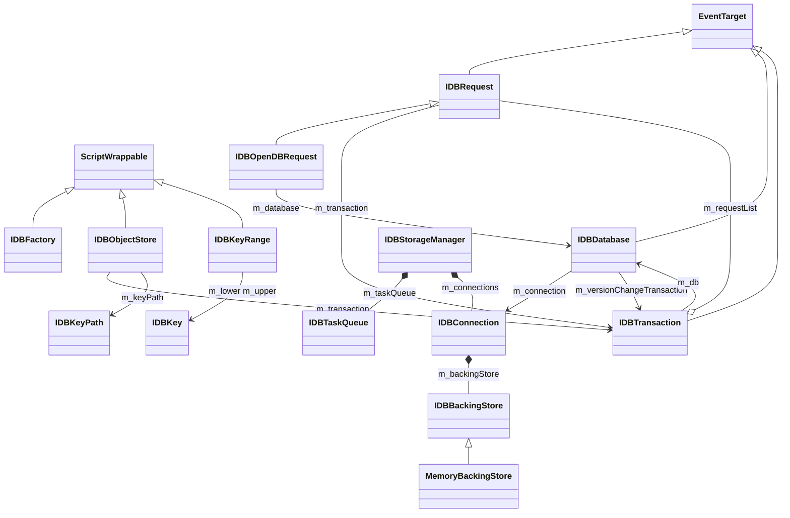
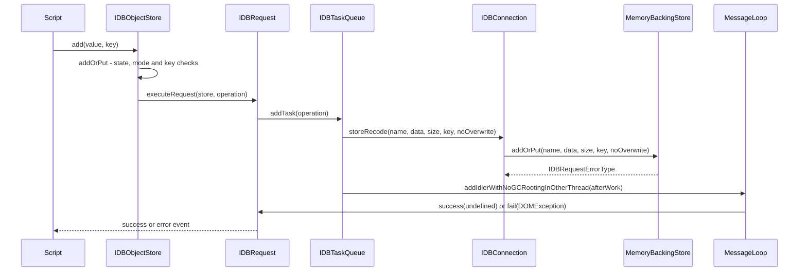

# Functional Requirements: modules-indexeddb

> **Relevant source files**
>
> - [src/core/modules/indexeddb/IDBFactory.cpp](src:src/core/modules/indexeddb/IDBFactory.cpp)
> - [src/core/modules/indexeddb/IDBConnection.cpp](src:src/core/modules/indexeddb/IDBConnection.cpp)
> - [src/core/modules/indexeddb/IDBStorageManager.cpp](src:src/core/modules/indexeddb/IDBStorageManager.cpp)
> - [src/core/modules/indexeddb/IDBTaskQueue.cpp](src:src/core/modules/indexeddb/IDBTaskQueue.cpp)
> - [src/core/modules/indexeddb/IDBDatabase.cpp](src:src/core/modules/indexeddb/IDBDatabase.cpp)
> - [src/core/modules/indexeddb/IDBTransaction.h](src:src/core/modules/indexeddb/IDBTransaction.h)
> - [src/core/modules/indexeddb/IDBObjectStore.cpp](src:src/core/modules/indexeddb/IDBObjectStore.cpp)
> - [src/core/modules/indexeddb/IDBRequest.cpp](src:src/core/modules/indexeddb/IDBRequest.cpp)
> - [src/core/modules/indexeddb/IDBKey.cpp](src:src/core/modules/indexeddb/IDBKey.cpp)
> - [src/core/modules/indexeddb/IDBKeyRange.cpp](src:src/core/modules/indexeddb/IDBKeyRange.cpp)
> - [src/core/modules/indexeddb/MemoryBackingStore.cpp](src:src/core/modules/indexeddb/MemoryBackingStore.cpp)
> - [src/core/modules/indexeddb/IDBConfig.h](src:src/core/modules/indexeddb/IDBConfig.h)

**Module**: [`IDBFactory.cpp`](src:src/core/modules/indexeddb/IDBFactory.cpp#L33)
**Version**: 2026-09-10
**Linked Design Card**: [modules/modules-indexeddb.md](../modules/modules-indexeddb.md)
**Analysis basis**: AST export and direct source reading

## Overview

The module exposes an `IDBFactory` from which script opens databases, obtains transactions and object stores, and issues `add`/`put`/`get` requests. [`IDBFactory::open`](src:src/core/modules/indexeddb/IDBFactory.cpp#L54) [`IDBObjectStore::addOrPut`](src:src/core/modules/indexeddb/IDBObjectStore.cpp#L78) Each request is executed on a single `IDBTaskQueue` worker thread and its result is posted back to the request's context thread. [`IDBTaskQueue::worker`](src:src/core/modules/indexeddb/IDBTaskQueue.cpp#L63) Records are written through the `IDBBackingStore` interface, whose only implementation stores one file per key under `$HOME/starfish-data/indexedDB/<database>/<store>/`. [`MemoryBackingStore::addOrPut`](src:src/core/modules/indexeddb/MemoryBackingStore.cpp#L56) [`IDBStorageManager::getLocalStoragePath`](src:src/core/modules/indexeddb/IDBStorageManager.cpp#L83)

## Functional Requirements

### FR-MODULES-INDEXEDDB-001
**Provide the IndexedDB factory and start the storage manager per global scope**

| Item | Content |
|------|---------|
| **Description** | The module provides a process-wide `IDBStorageManager` singleton that owns the worker task queue and the list of open connections, and an `IDBFactory` object bound to an execution context. Callers start the manager before creating a factory; starting and disposing are idempotent. |
| **Input** | `ExecutionContext*` for the factory; no input for `instance()`, `start()`, `dispose()`. |
| **Output** | A running worker thread (`IDBTaskQueue::run`) after `start()`; the queue is destroyed on `dispose()`; the base and IndexedDB data directories are created when the singleton is first constructed. |
| **Preconditions** | `IDBStorageManager` must be constructed on the main thread (`STARFISH_ASSERT(isMainThread())`). Build must define `STARFISH_ENABLE_IDB`. |
| **Postconditions** | `m_isStared` is true after `start()` and false after `dispose()`; a second `start()` or `dispose()` returns without effect. |
| **Source** | [`IDBStorageManager::instance`](src:src/core/modules/indexeddb/IDBStorageManager.cpp#L33), [`IDBStorageManager::start`](src:src/core/modules/indexeddb/IDBStorageManager.cpp#L54), [`IDBStorageManager::dispose`](src:src/core/modules/indexeddb/IDBStorageManager.cpp#L66), [`IDBFactory`](src:src/core/modules/indexeddb/IDBFactory.cpp#L33) |

**Acceptance criteria**:
- [ ] The singleton constructor creates the local storage directory and the IndexedDB subdirectory. [`IDBStorageManager.cpp`](src:src/core/modules/indexeddb/IDBStorageManager.cpp#L45)
- [ ] `start()` launches the worker thread exactly once even when called repeatedly. [`IDBStorageManager.cpp`](src:src/core/modules/indexeddb/IDBStorageManager.cpp#L58)
- [ ] `dispose()` resets the task queue only if the manager was started. [`IDBStorageManager.cpp`](src:src/core/modules/indexeddb/IDBStorageManager.cpp#L70)
- [ ] `Window::indexedDB` and `WorkerGlobalScope::indexedDB` call `start()` before constructing their `IDBFactory`. [`Window::indexedDB`](src:src/core/page/Window.cpp#L1157) [`WorkerGlobalScope::indexedDB`](src:src/core/modules/worker/WorkerGlobalScope.cpp#L267)

### FR-MODULES-INDEXEDDB-002
**Open a database asynchronously with version negotiation**

| Item | Content |
|------|---------|
| **Description** | `IDBFactory::open` returns an `IDBOpenDBRequest` immediately and queues the open operation. On the worker thread the stored version is compared with the requested one: a lower request fails with `VersionError`; a higher request records the new version and marks the request as needing an upgrade; an omitted version defaults to the stored version (or 1 for a new database). |
| **Input** | `String* name`, `Optional<unsigned long long> version`. |
| **Output** | `IDBOpenDBRequest*`; later an `IDBDatabase` set as the request result and a `success` event, optionally preceded by an `upgradeneeded` event, or an `error` event. |
| **Preconditions** | `version`, when given, must not be 0; otherwise a `DOMException` with code `SCRIPT_TYPE_ERR` is thrown synchronously. |
| **Postconditions** | On success an `IDBConnection` exists in `IDBStorageManager::m_connections` with `version` set and its backing store opened; when upgrading, the version string is written to the origin's storage under the database name. |
| **Source** | [`IDBFactory::open`](src:src/core/modules/indexeddb/IDBFactory.cpp#L54), [`IDBConnection::openDatabase`](src:src/core/modules/indexeddb/IDBConnection.cpp#L50) |

**Acceptance criteria**:
- [ ] `open(name, 0)` throws a `DOMException` with code `SCRIPT_TYPE_ERR`. [`IDBFactory.cpp`](src:src/core/modules/indexeddb/IDBFactory.cpp#L59) [`SCRIPT_TYPE_ERR`](src:src/core/dom/DOMException.h#L61)
- [ ] A new database with no version argument is opened at version 1. [`IDBConnection.cpp`](src:src/core/modules/indexeddb/IDBConnection.cpp#L59)
- [ ] Requesting a version lower than the stored version sets `IDBRequestErrorType::VersionError` and no connection is created. [`IDBConnection.cpp`](src:src/core/modules/indexeddb/IDBConnection.cpp#L74)
- [ ] Requesting a higher version writes the new version string and sets `upgradeNeeded`. [`IDBConnection.cpp`](src:src/core/modules/indexeddb/IDBConnection.cpp#L83)
- [ ] On completion an `IDBDatabase` is created with the negotiated version, `upgradeNeeded()` fires when flagged, then `successOpenRequest()` runs. [`IDBFactory.cpp`](src:src/core/modules/indexeddb/IDBFactory.cpp#L92)
- [ ] On error `failOpenRequest` sets the request error and dispatches `error`. [`IDBOpenDBRequest::failOpenRequest`](src:src/core/modules/indexeddb/IDBOpenDBRequest.cpp#L48)

### FR-MODULES-INDEXEDDB-003
**Identify databases by origin and name and persist their version**

| Item | Content |
|------|---------|
| **Description** | A database is identified by a hash combining the serialized web origin and the database name. The current version of each database is kept as a string in an origin-scoped `StorageMemory` keyed by database name. |
| **Input** | `WebOrigin* origin`, `String* name`. |
| **Output** | `IDBDatabaseIdentifier::hash`; a version string stored via `StorageInternal::setItem`. |
| **Preconditions** | The origin must be available from the execution context. |
| **Postconditions** | Two identifiers compare equal when their hashes are equal. The `StorageMemory` is created lazily once per worker-thread `IDBConnectionData`. |
| **Source** | [`IDBDatabaseIdentifier`](src:src/core/modules/indexeddb/IDBDatabaseIdentifier.cpp#L33), [`IDBConnectionData::storageKey`](src:src/core/modules/indexeddb/IDBConnection.cpp#L38) |

**Acceptance criteria**:
- [ ] The identifier hash combines `origin->serialize()->hashValue()` and `name->hashValue()`. [`IDBDatabaseIdentifier.cpp`](src:src/core/modules/indexeddb/IDBDatabaseIdentifier.cpp#L36)
- [ ] Equality is hash equality. [`IDBDatabaseIdentifier::operator==`](src:src/core/modules/indexeddb/IDBDatabaseIdentifier.cpp#L40)
- [ ] The storage key is a `StorageMemory` of type `StorageType::Local` for the request's origin. [`IDBConnectionData::storageKey`](src:src/core/modules/indexeddb/IDBConnection.cpp#L44) [`StorageMemory`](src:src/core/storage/StorageInternal.h#L56)
- [ ] The stored version is parsed with `std::istringstream` from the value stored under the database name. [`IDBConnection.cpp`](src:src/core/modules/indexeddb/IDBConnection.cpp#L62)

### FR-MODULES-INDEXEDDB-004
**Execute requests on a dedicated worker thread and complete them on the context thread**

| Item | Content |
|------|---------|
| **Description** | Every asynchronous operation is an `IDBTaskQueueItem` holding a main-work function, an after-work function and a payload. The worker thread pops items in FIFO order, runs the main work with a thread-local `IDBConnectionData`, marks the request processed, then posts the after-work to the request's execution context through its message loop, where the request is removed from its transaction and marked done. |
| **Input** | `std::unique_ptr<IDBTaskQueueItem>` via `addTask`. |
| **Output** | Side effects of `mainWork` on the worker thread; `afterWork` executed on the context thread; `IDBRequest::processed` and `IDBRequest::done` set. |
| **Preconditions** | The queue must not be stopped (`addTask` drops items after `stop()`). The script engine must support threading (`Escargot::Globals::supportsThreading()` is release-asserted). |
| **Postconditions** | Payload is released in the after-work callback with `GC_FREE`. The thread is joined in `stop()`. |
| **Source** | [`IDBTaskQueue::worker`](src:src/core/modules/indexeddb/IDBTaskQueue.cpp#L63), [`IDBTaskQueue::addTask`](src:src/core/modules/indexeddb/IDBTaskQueue.cpp#L145), [`IDBTaskQueueItem`](src:src/core/modules/indexeddb/IDBTaskQueue.h#L40) |

**Acceptance criteria**:
- [ ] Items are executed in insertion order (`push_back` / `front` + `pop_front`). [`IDBTaskQueue.cpp`](src:src/core/modules/indexeddb/IDBTaskQueue.cpp#L83)
- [ ] `setProcessed(true)` is called after `mainWork` on the worker thread. [`IDBTaskQueue.cpp`](src:src/core/modules/indexeddb/IDBTaskQueue.cpp#L92)
- [ ] The completion is scheduled with `addIdlerWithNoGCRootingInOtherThread` on the context's message loop. [`IDBTaskQueue.cpp`](src:src/core/modules/indexeddb/IDBTaskQueue.cpp#L103) [`addIdlerWithNoGCRootingInOtherThread`](src:src/core/modules/message_loop/MessageLoopInterface.h#L26)
- [ ] In the completion callback the request is removed from its transaction (if any), `setDone(true)` is called, then `afterWork` runs. [`IDBTaskQueue.cpp`](src:src/core/modules/indexeddb/IDBTaskQueue.cpp#L111)
- [ ] `stop()` sets the stopped flag, wakes the worker and joins the thread. [`IDBTaskQueue::stop`](src:src/core/modules/indexeddb/IDBTaskQueue.cpp#L126)
- [ ] `IDBRequest::executeRequest` asserts the transaction is `Active`, adds the request to the transaction and enqueues the item. [`IDBRequest::executeRequest`](src:src/core/modules/indexeddb/IDBRequest.cpp#L84)

### FR-MODULES-INDEXEDDB-005
**Create transactions with mode, durability and an Active/Inactive state**

| Item | Content |
|------|---------|
| **Description** | `IDBDatabase::transaction` creates an `IDBTransaction` with the requested mode (`readonly`, `readwrite`, `versionchange`) and durability (`default`, `strict`, `relaxed`), recording the requested store names on the database. A transaction starts `Active`, holds a request list, and reports its mode and durability as strings. A version-change transaction is created by `startVersionChangeTransaction` during an upgrade. |
| **Input** | `DOMStringOrSequenceOfDOMString storeNames`, `String* mode`, `IDBTransactionOptions`. |
| **Output** | `IDBTransaction*` with `state() == State::Active`. |
| **Preconditions** | `mode` and durability strings must be one of the recognised names; unknown strings hit `STARFISH_ASSERT_NOT_REACHED` and fall back to `ReadOnly` / `Default`. |
| **Postconditions** | Store names are appended to `IDBDatabase::objectStoreNames`; only one version-change transaction may exist per database (`STARFISH_ASSERT(!m_versionChangeTransaction)`). |
| **Source** | [`IDBDatabase::transaction`](src:src/core/modules/indexeddb/IDBDatabase.cpp#L58), [`IDBTransaction`](src:src/core/modules/indexeddb/IDBTransaction.cpp#L30), [`IDBDatabase::startVersionChangeTransaction`](src:src/core/modules/indexeddb/IDBDatabase.cpp#L127) |

**Acceptance criteria**:
- [ ] A newly constructed transaction has `State::Active`, no error and the database's store-name list. [`IDBTransaction.cpp`](src:src/core/modules/indexeddb/IDBTransaction.cpp#L35)
- [ ] The two-argument constructor defaults to `ReadOnly` / `Default`. [`IDBTransaction`](src:src/core/modules/indexeddb/IDBTransaction.cpp#L44)
- [ ] `mode()` and `durability()` return the string names via `IDBUtils`. [`IDBTransaction::mode`](src:src/core/modules/indexeddb/IDBTransaction.cpp#L56) [`IDBUtils::transactionModeToString`](src:src/core/modules/indexeddb/IDBUtils.cpp#L57)
- [ ] `startVersionChangeTransaction` sets the mode to `VersionChange` and must run on the context thread. [`IDBDatabase.cpp`](src:src/core/modules/indexeddb/IDBDatabase.cpp#L133)
- [ ] `addRequest` / `removeRequest` maintain the request list. [`IDBTransaction::addRequest`](src:src/core/modules/indexeddb/IDBTransaction.cpp#L66) [`IDBTransaction::removeRequest`](src:src/core/modules/indexeddb/IDBTransaction.cpp#L71)

### FR-MODULES-INDEXEDDB-006
**Create object stores only during an active version-change transaction**

| Item | Content |
|------|---------|
| **Description** | `IDBDatabase::createObjectStore` creates an `IDBObjectStore` bound to the version-change transaction, registers its name, and attaches an optional key path. |
| **Input** | `String* name`, `IDBObjectStoreParameters` (`keyPath`, `autoIncrement`). |
| **Output** | `IDBObjectStore*`; name appended to `objectStoreNames`; key path set when supplied. |
| **Preconditions** | A version-change transaction exists (else `INVALID_STATE_ERR`) and is `Active` (else `TransactionInactiveError`). A supplied key path must be a single string (else `SYNTAX_ERR`). |
| **Postconditions** | The store reports the given name and the transaction it belongs to; `autoIncrement` is false and `m_deleted` is false at construction. |
| **Source** | [`IDBDatabase::createObjectStore`](src:src/core/modules/indexeddb/IDBDatabase.cpp#L80), [`IDBObjectStore`](src:src/core/modules/indexeddb/IDBObjectStore.cpp#L39) |

**Acceptance criteria**:
- [ ] Without a version-change transaction a `DOMException` with `INVALID_STATE_ERR` is thrown. [`IDBDatabase.cpp`](src:src/core/modules/indexeddb/IDBDatabase.cpp#L85) [`INVALID_STATE_ERR`](src:src/core/dom/DOMException.h#L40)
- [ ] With an inactive version-change transaction a `TransactionInactiveError` `DOMException` is thrown. [`IDBDatabase.cpp`](src:src/core/modules/indexeddb/IDBDatabase.cpp#L90)
- [ ] A key path that is not a single string is invalid and raises `SYNTAX_ERR`. [`IDBKeyPath::isValid`](src:src/core/modules/indexeddb/IDBKeyPath.cpp#L48) [`IDBDatabase.cpp`](src:src/core/modules/indexeddb/IDBDatabase.cpp#L101)
- [ ] The store is obtained from the version-change transaction and its name is recorded. [`IDBDatabase.cpp`](src:src/core/modules/indexeddb/IDBDatabase.cpp#L114)

### FR-MODULES-INDEXEDDB-007
**Store a record with add or put, honouring the no-overwrite rule**

| Item | Content |
|------|---------|
| **Description** | `put` and `add` both call `addOrPut`; `add` sets `noOverwrite`. The value is serialized, the key is derived either from the explicit `key` argument (out-of-line keys) or from the store's key path (in-line keys), and the write is queued. On the worker the record is written through the connection's backing store; `add` on an existing non-empty record yields `OverWriteError`, reported to script as `ConstraintError`. |
| **Input** | `ScriptValue value`, `ScriptValue key`, `bool noOverwrite`. |
| **Output** | `IDBRequest*`; later `success(undefined)` or `fail(DOMException)`. |
| **Preconditions** | Store not deleted; transaction `Active`; transaction mode not `ReadOnly`; key valid; for in-line keys the `key` argument must be null/undefined. |
| **Postconditions** | Record bytes are written to the per-key file; the request is completed on the context thread. |
| **Source** | [`IDBObjectStore::addOrPut`](src:src/core/modules/indexeddb/IDBObjectStore.cpp#L78), [`IDBConnection::storeRecode`](src:src/core/modules/indexeddb/IDBConnection.cpp#L107), [`MemoryBackingStore::addOrPut`](src:src/core/modules/indexeddb/MemoryBackingStore.cpp#L56) |

**Acceptance criteria**:
- [ ] A deleted store throws `INVALID_STATE_ERR`. [`IDBObjectStore.cpp`](src:src/core/modules/indexeddb/IDBObjectStore.cpp#L85)
- [ ] A non-active transaction throws `TransactionInactiveError`; a read-only transaction throws `ReadOnlyError`. [`IDBObjectStore.cpp`](src:src/core/modules/indexeddb/IDBObjectStore.cpp#L90)
- [ ] Supplying a key to a store with a key path throws `DataError` ("The store uses in-line keys."). [`IDBObjectStore.cpp`](src:src/core/modules/indexeddb/IDBObjectStore.cpp#L114)
- [ ] The value is serialized with `MemorySerializer::serialize` before queueing. [`IDBObjectStore.cpp`](src:src/core/modules/indexeddb/IDBObjectStore.cpp#L125) [`MemorySerializer::serialize`](src:src/core/serialize/MemorySerializer.h#L152)
- [ ] With `noOverwrite` and an existing file of non-zero size the backing store returns `OverWriteError`. [`MemoryBackingStore.cpp`](src:src/core/modules/indexeddb/MemoryBackingStore.cpp#L78)
- [ ] `OverWriteError` becomes a `ConstraintError` `DOMException`. [`IDBRequest.cpp`](src:src/core/modules/indexeddb/IDBRequest.cpp#L61)
- [ ] A write of fewer bytes than requested returns `Unknown`. [`MemoryBackingStore.cpp`](src:src/core/modules/indexeddb/MemoryBackingStore.cpp#L85)

### FR-MODULES-INDEXEDDB-008
**Retrieve a record by exact key**

| Item | Content |
|------|---------|
| **Description** | `IDBObjectStore::get` converts the query to a key range (null disallowed) and queues a read. The connection serves only single-key ("only") ranges; the backing store reads the file for that key. A missing file completes with `undefined`; existing bytes are deserialized on the context thread and delivered as the result. |
| **Input** | `ScriptValue query`. |
| **Output** | `IDBRequest*`; later `success(value)`, `success(undefined)` when absent, or `fail(DOMException)` if deserialization throws. |
| **Preconditions** | Store not deleted; transaction `Active`; query is a valid, non-null key. |
| **Postconditions** | The read buffer is freed after completion. |
| **Source** | [`IDBObjectStore::get`](src:src/core/modules/indexeddb/IDBObjectStore.cpp#L175), [`IDBConnection::retrieveValue`](src:src/core/modules/indexeddb/IDBConnection.cpp#L116), [`MemoryBackingStore::get`](src:src/core/modules/indexeddb/MemoryBackingStore.cpp#L89) |

**Acceptance criteria**:
- [ ] Null/undefined query throws `DataError` ("The key is undefined or null."). [`IDBKeyRange.cpp`](src:src/core/modules/indexeddb/IDBKeyRange.cpp#L38)
- [ ] A range that is not "only" makes `retrieveValue` return false. [`IDBConnection.cpp`](src:src/core/modules/indexeddb/IDBConnection.cpp#L121)
- [ ] If the record file cannot be opened, `get` returns true with `dataSize` unchanged and the request completes with `undefined`. [`MemoryBackingStore.cpp`](src:src/core/modules/indexeddb/MemoryBackingStore.cpp#L104) [`IDBObjectStore.cpp`](src:src/core/modules/indexeddb/IDBObjectStore.cpp#L221)
- [ ] Stored bytes are deserialized with `MemorySerializer::deserialize`; a thrown `DOMException` is routed to `fail`. [`IDBObjectStore.cpp`](src:src/core/modules/indexeddb/IDBObjectStore.cpp#L225) [`MemorySerializer::deserialize`](src:src/core/serialize/MemorySerializer.h#L155)
- [ ] When the worker reports failure, an error is logged and the request is neither succeeded nor failed. [`IDBObjectStore::get`](src:src/core/modules/indexeddb/IDBObjectStore.cpp#L236)

### FR-MODULES-INDEXEDDB-009
**Convert script values to keys and reject invalid keys**

| Item | Content |
|------|---------|
| **Description** | `IDBKey::convertValueToKey` maps finite numbers to `Number` keys, strings to `String` keys, null/undefined to `Null` keys, and everything else (including Infinity/NaN) to `Invalid`. `IDBKeyPath::extractKey` reads the first non-null own property named by the key path and converts it. `IDBKey::checkInvalid` raises `DataError` for invalid keys; `IDBKey::toString` yields the string used for storage. |
| **Input** | `ScriptValue value`; for key paths, the object value and the path strings. |
| **Output** | `IDBKey*` with a `Type`; `Optional<String*>` from `toString`. |
| **Preconditions** | Date, binary and array keys are not supported (`STARFISH_UNSUPPORTED`). |
| **Postconditions** | `toString` returns a value only for `String` and `Number` keys. |
| **Source** | [`IDBKey::convertValueToKey`](src:src/core/modules/indexeddb/IDBKey.cpp#L29), [`IDBKey::checkInvalid`](src:src/core/modules/indexeddb/IDBKey.cpp#L97), [`IDBKeyPath::extractKey`](src:src/core/modules/indexeddb/IDBKeyPath.cpp#L53) |

**Acceptance criteria**:
- [ ] Infinity or NaN produces `Type::Invalid`. [`IDBKey.cpp`](src:src/core/modules/indexeddb/IDBKey.cpp#L38)
- [ ] A string value produces a `String` key; null/undefined produce a `Null` key. [`IDBKey.cpp`](src:src/core/modules/indexeddb/IDBKey.cpp#L43)
- [ ] Any other type produces `Type::Invalid`. [`IDBKey.cpp`](src:src/core/modules/indexeddb/IDBKey.cpp#L52)
- [ ] `checkInvalid` throws `DataError` ("The key is invalid.") for invalid keys. [`IDBKey.cpp`](src:src/core/modules/indexeddb/IDBKey.cpp#L99)
- [ ] `extractKey` returns `Invalid` when no key-path property is present or non-null. [`IDBKeyPath.cpp`](src:src/core/modules/indexeddb/IDBKeyPath.cpp#L72)
- [ ] Number keys are stringified with `String::fromDouble`; other types are unimplemented. [`IDBKey::toString`](src:src/core/modules/indexeddb/IDBKey.cpp#L85)

### FR-MODULES-INDEXEDDB-010
**Persist records as one file per key under the storage directory**

| Item | Content |
|------|---------|
| **Description** | The backing store root is `$HOME/starfish-data/indexedDB` (falling back to `/tmp/starfish-data/indexedDB` when `HOME` is unset or empty). Opening a database creates `<root>/<database>`; each write creates `<root>/<database>/<store>` and writes the record to a file named by the 64-bit hash of the key string. Reads open the same path. |
| **Input** | Database name, store name, `IDBKey*`, record bytes. |
| **Output** | Directories and files on disk; `IDBRequestErrorType` for writes; buffer and size for reads. |
| **Preconditions** | `IDBKey::toString` must yield a value; otherwise the write returns `Unknown` and the read returns false. |
| **Postconditions** | `MemoryBackingStore::m_openPath` holds the database directory as a non-GC string. |
| **Source** | [`IDBStorageManager::getLocalStoragePath`](src:src/core/modules/indexeddb/IDBStorageManager.cpp#L83), [`IDB_LOCAL_STORAGE_DIR_PATH`](src:src/core/modules/indexeddb/IDBConfig.h#L27), [`MemoryBackingStore::open`](src:src/core/modules/indexeddb/MemoryBackingStore.cpp#L44) |

**Acceptance criteria**:
- [ ] The data directory is `HOME` + `/starfish-data`, or `/tmp/starfish-data` when `HOME` is missing or empty. [`IDBStorageManager.cpp`](src:src/core/modules/indexeddb/IDBStorageManager.cpp#L87)
- [ ] The IndexedDB root appends `"/indexedDB"`. [`IDBStorageManager::getIDBLocalStoragePath`](src:src/core/modules/indexeddb/IDBStorageManager.cpp#L101)
- [ ] `open` joins root and database name and creates that directory. [`MemoryBackingStore::open`](src:src/core/modules/indexeddb/MemoryBackingStore.cpp#L46)
- [ ] The record file name is `String::fromInt64(keyString->hashValue())` inside the store directory. [`MemoryBackingStore.cpp`](src:src/core/modules/indexeddb/MemoryBackingStore.cpp#L65)
- [ ] Writes use `PlatformFile::FileMode::Write`; reads use `PlatformFile::FileMode::Read`. [`MemoryBackingStore.cpp`](src:src/core/modules/indexeddb/MemoryBackingStore.cpp#L72) [`MemoryBackingStore.cpp`](src:src/core/modules/indexeddb/MemoryBackingStore.cpp#L103) [`PlatformFile::open`](src:src/platform/file/PlatformFile.h#L47)
- [ ] A short read frees the buffer and returns false. [`MemoryBackingStore.cpp`](src:src/core/modules/indexeddb/MemoryBackingStore.cpp#L110)

### FR-MODULES-INDEXEDDB-011
**Report request outcome through success and error events with mapped exceptions**

| Item | Content |
|------|---------|
| **Description** | `IDBRequest` is an `EventTarget` with `success` and `error` events and a `readyState` of `pending` or `done`. `success` stores the result, re-activates an inactive transaction while the event is dispatched, then sets it inactive again; `fail` does the same with the error. Worker error types are mapped to `DOMException` objects with names `VersionError`, `ConstraintError` or an unknown-error code. `IDBOpenDBRequest` adds an `upgradeneeded` event. |
| **Input** | `ScriptValue result` or `DOMException* error`; `IDBRequestErrorType`. |
| **Output** | Events dispatched via `dispatchEventIdleTimeByUA`; `result`, `error`, `done` accessors. |
| **Preconditions** | `success`/`fail` must run on the context thread and the request must have a transaction. |
| **Postconditions** | Transaction state is `Inactive` after dispatch. |
| **Source** | [`IDBRequest::success`](src:src/core/modules/indexeddb/IDBRequest.cpp#L98), [`IDBRequest::fail`](src:src/core/modules/indexeddb/IDBRequest.cpp#L120), [`IDBRequest::errorCodeToDOMException`](src:src/core/modules/indexeddb/IDBRequest.cpp#L48) |

**Acceptance criteria**:
- [ ] `readyState()` returns `"pending"` or `"done"`. [`IDBRequest::readyState`](src:src/core/modules/indexeddb/IDBRequest.cpp#L72)
- [ ] `Unknown` maps to a `DOMException` with code `DOM_EXCEPTION` and message "Unknown Error". [`IDBRequest.cpp`](src:src/core/modules/indexeddb/IDBRequest.cpp#L51) [`DOM_EXCEPTION`](src:src/core/dom/DOMException.h#L31)
- [ ] `VersionError` maps to name `VersionError`; `OverWriteError` maps to name `ConstraintError`. [`IDBRequest.cpp`](src:src/core/modules/indexeddb/IDBRequest.cpp#L55)
- [ ] The `error` event is created with `EventInit(true, true)`; the `success` event uses default init. [`IDBRequest::dispatchErrorEvent`](src:src/core/modules/indexeddb/IDBRequest.cpp#L153) [`IDBRequest::dispatchSuccessEvent`](src:src/core/modules/indexeddb/IDBRequest.cpp#L145)
- [ ] `upgradeNeeded` starts the version-change transaction, sets the database as result and dispatches `upgradeneeded`. [`IDBOpenDBRequest::upgradeNeeded`](src:src/core/modules/indexeddb/IDBOpenDBRequest.cpp#L59) [`StaticStrings.h`](src:src/StaticStrings.h#L835)
- [ ] `successOpenRequest` sets `done` and the database as result before dispatching `success`. [`IDBOpenDBRequest::successOpenRequest`](src:src/core/modules/indexeddb/IDBOpenDBRequest.cpp#L37)

## Non-Functional Requirements

| Item | Requirement | Source |
|------|-------------|--------|
| Performance | All storage operations are serialized on one worker thread; the worker blocks on a condition variable when the queue is empty. | [`IDBTaskQueue.cpp`](src:src/core/modules/indexeddb/IDBTaskQueue.cpp#L79) |
| Concurrency | `IDBConnection` and `MemoryBackingStore` are not thread-safe and are called only from the worker thread; completion callbacks assert `isContextThread()`. | [`IDBConnection`](src:src/core/modules/indexeddb/IDBConnection.h#L47) [`IDBRequest.cpp`](src:src/core/modules/indexeddb/IDBRequest.cpp#L102) |
| Security | Database identity is scoped by web origin (hash of serialized origin plus name); the version store is per origin. Not otherwise specified in code. | [`IDBDatabaseIdentifier`](src:src/core/modules/indexeddb/IDBDatabaseIdentifier.cpp#L33) [`IDBConnectionData::storageKey`](src:src/core/modules/indexeddb/IDBConnection.cpp#L38) |
| Error handling | Synchronous precondition failures throw `DOMException`; asynchronous failures are carried as `IDBRequestErrorType` and mapped to `DOMException` on the context thread. A failed `get` at the connection level only logs. | [`IDBRequest::errorCodeToDOMException`](src:src/core/modules/indexeddb/IDBRequest.cpp#L48) [`IDBObjectStore::get`](src:src/core/modules/indexeddb/IDBObjectStore.cpp#L236) |
| Logging | `TRACE(IDB, ...)` on open, add/put, get and request completion; `STARFISH_LOG_ERROR` on `get` failure. | [`MemoryBackingStore::open`](src:src/core/modules/indexeddb/MemoryBackingStore.cpp#L53) [`IDBObjectStore::get`](src:src/core/modules/indexeddb/IDBObjectStore.cpp#L236) |
| Memory | Task payloads use `new (NoGC)` and `GC_FREE`; read buffers use `malloc`/`free`. | [`IDBFactory.cpp`](src:src/core/modules/indexeddb/IDBFactory.cpp#L66) [`MemoryBackingStore.cpp`](src:src/core/modules/indexeddb/MemoryBackingStore.cpp#L109) |

## Constraints

- The module compiles only when `STARFISH_ENABLE_IDB` is defined; the build option `IDB=1` sets it and turns `STARFISH_ENABLE_THREADING` on. [`config.cmake`](src:build/config.cmake#L399) [`config.cmake`](src:build/config.cmake#L404)
- The worker requires a script engine built with threading support (`Escargot::Globals::supportsThreading()` release assertion). [`IDBTaskQueue.cpp`](src:src/core/modules/indexeddb/IDBTaskQueue.cpp#L67)
- Only `String` and `Number` keys can be stored; `Date`, binary and array keys are rejected as invalid. [`IDBKey.cpp`](src:src/core/modules/indexeddb/IDBKey.cpp#L48) [`IDBKey.cpp`](src:src/core/modules/indexeddb/IDBKey.cpp#L92)
- Key paths must be a single string; sequence key paths are unimplemented. [`IDBKeyPath.cpp`](src:src/core/modules/indexeddb/IDBKeyPath.cpp#L42)
- `get` serves only exact-key ("only") ranges. [`IDBConnection.cpp`](src:src/core/modules/indexeddb/IDBConnection.cpp#L121)
- `IDBFactory::deleteDatabase` and `IDBDatabase::close` are `STARFISH_UNIMPLEMENTED`; `IDBIndex` and `IDBCursor` define only constructors and accessors. [`IDBFactory::deleteDatabase`](src:src/core/modules/indexeddb/IDBFactory.cpp#L114) [`IDBDatabase::close`](src:src/core/modules/indexeddb/IDBDatabase.cpp#L138) [`IDBIndex`](src:src/core/modules/indexeddb/IDBIndex.cpp#L28) [`IDBCursor`](src:src/core/modules/indexeddb/IDBCursor.cpp#L28)
- Transaction commit/abort and the `Committing`/`Finished` states are declared but no code transitions into them. [`IDBTransaction::State`](src:src/core/modules/indexeddb/IDBTransaction.h#L37) [`IDBRequest.cpp`](src:src/core/modules/indexeddb/IDBRequest.cpp#L116)
- The database version store is an in-memory `StorageMemory`, so recorded versions do not outlive the worker thread's `IDBConnectionData`. [`IDBConnection.cpp`](src:src/core/modules/indexeddb/IDBConnection.cpp#L41) [`IDBTaskQueue.cpp`](src:src/core/modules/indexeddb/IDBTaskQueue.cpp#L72)

## Module Design Card Linkage

| FR | Implementation | Design Card section |
|----|----------------|---------------------|
| FR-MODULES-INDEXEDDB-001 | `IDBStorageManager`, `IDBFactory` constructor | [Public Interface](../modules/modules-indexeddb.md#public-interface) |
| FR-MODULES-INDEXEDDB-002 | `IDBFactory::open`, `IDBConnection::openDatabase` | [Key Flow](../modules/modules-indexeddb.md#key-flow) |
| FR-MODULES-INDEXEDDB-003 | `IDBDatabaseIdentifier`, `IDBConnectionData::storageKey` | [Dependencies](../modules/modules-indexeddb.md#dependencies) |
| FR-MODULES-INDEXEDDB-004 | `IDBTaskQueue`, `IDBRequest::executeRequest` | [Architectural Rules](../modules/modules-indexeddb.md#architectural-rules) |
| FR-MODULES-INDEXEDDB-005 | `IDBDatabase::transaction`, `IDBTransaction`, `IDBUtils` | [Quick Navigation](../modules/modules-indexeddb.md#quick-navigation) |
| FR-MODULES-INDEXEDDB-006 | `IDBDatabase::createObjectStore` | [Architectural Rules](../modules/modules-indexeddb.md#architectural-rules) |
| FR-MODULES-INDEXEDDB-007 | `IDBObjectStore::addOrPut`, `IDBConnection::storeRecode`, `MemoryBackingStore::addOrPut` | [Key Flow](../modules/modules-indexeddb.md#key-flow) |
| FR-MODULES-INDEXEDDB-008 | `IDBObjectStore::get`, `IDBConnection::retrieveValue`, `MemoryBackingStore::get` | [Key Flow](../modules/modules-indexeddb.md#key-flow) |
| FR-MODULES-INDEXEDDB-009 | `IDBKey`, `IDBKeyPath`, `IDBKeyRange` | [Quick Navigation](../modules/modules-indexeddb.md#quick-navigation) |
| FR-MODULES-INDEXEDDB-010 | `IDBStorageManager::getLocalStoragePath`, `MemoryBackingStore` | [Quick Navigation](../modules/modules-indexeddb.md#quick-navigation) |
| FR-MODULES-INDEXEDDB-011 | `IDBRequest`, `IDBOpenDBRequest` | [Public Interface](../modules/modules-indexeddb.md#public-interface) |

## ENUM Definitions

| ENUM | Values | Used in | Source |
|------|--------|---------|--------|
| `IDBRequestErrorType` | `None`, `Unknown`, `VersionError`, `OverWriteError` | Worker-to-request error transport; mapped in `errorCodeToDOMException` | [`IDBRequestErrorType`](src:src/core/modules/indexeddb/IDBRequest.h#L35) |
| `IDBRequestReadyState` | `Pending`, `Done` | `IDBRequest::readyState` | [`IDBRequestReadyState`](src:src/core/modules/indexeddb/IDBRequest.h#L42) |
| `IDBTransactionMode` | `ReadOnly`, `ReadWrite`, `VersionChange` | `IDBTransaction`, `IDBUtils`, write-permission check in `addOrPut` | [`IDBTransactionMode`](src:src/core/modules/indexeddb/IDBTransaction.h#L32) |
| `IDBTransaction::State` | `Active`, `Inactive`, `Committing`, `Finished` | Transaction state checks in `IDBObjectStore`, `IDBDatabase`, `IDBRequest` | [`IDBTransaction::State`](src:src/core/modules/indexeddb/IDBTransaction.h#L37) |
| `IDBTransactionDurability` | `Default`, `Strict`, `Relaxed` | `IDBTransactionOptions`, `IDBUtils` | [`IDBTransactionDurability`](src:src/core/modules/indexeddb/IDBDatabase.h#L35) |
| `IDBKey::Type` | `Invalid`, `Array`, `Binary`, `String`, `Date`, `Number`, `Null` | Key conversion and validity | [`IDBKey::Type`](src:src/core/modules/indexeddb/IDBKey.h#L31) |
| `IDBKeyPath::Type` | `Null`, `String` | Key-path validity | [`IDBKeyPath::Type`](src:src/core/modules/indexeddb/IDBKeyPath.h#L33) |

## Error Code Definitions

| Error code | Value | Trigger | Recovery | Source |
|------------|-------|---------|----------|--------|
| `IDBRequestErrorType::None` | 0 (first enumerator) | Operation succeeded | Request completes with `success` | [`IDBRequest.h`](src:src/core/modules/indexeddb/IDBRequest.h#L36) |
| `IDBRequestErrorType::Unknown` | 1 | Key not stringifiable, file open failure, or short write in the backing store | Mapped to `DOMException` code `DOM_EXCEPTION` "Unknown Error"; request fails | [`IDBRequest.h`](src:src/core/modules/indexeddb/IDBRequest.h#L37) [`MemoryBackingStore.cpp`](src:src/core/modules/indexeddb/MemoryBackingStore.cpp#L62) |
| `IDBRequestErrorType::VersionError` | 2 | Requested version lower than stored version on open | `DOMException` named `VersionError`; open request fails | [`IDBRequest.h`](src:src/core/modules/indexeddb/IDBRequest.h#L38) [`IDBConnection.cpp`](src:src/core/modules/indexeddb/IDBConnection.cpp#L75) |
| `IDBRequestErrorType::OverWriteError` | 3 | `add` to a key whose record file already has non-zero size | `DOMException` named `ConstraintError`; request fails | [`IDBRequest.h`](src:src/core/modules/indexeddb/IDBRequest.h#L39) [`MemoryBackingStore.cpp`](src:src/core/modules/indexeddb/MemoryBackingStore.cpp#L79) |

## Constant Definitions

| Constant | Value | Purpose | Source |
|----------|-------|---------|--------|
| `IDB_LOCAL_STORAGE_DIR_PATH` | `"/indexedDB"` | Subdirectory appended to the local storage path for IndexedDB files | [`IDB_LOCAL_STORAGE_DIR_PATH`](src:src/core/modules/indexeddb/IDBConfig.h#L27) |
| `VIRTUAL` | (empty) | Temporarily defined around `DECLARE_EVENT_LISTENER(upgradeneeded)` and undefined afterwards | [`IDBOpenDBRequest.h`](src:src/core/modules/indexeddb/IDBOpenDBRequest.h#L61) |
| `OVERRIDE` | (empty) | Temporarily defined around `DECLARE_EVENT_LISTENER(upgradeneeded)` and undefined afterwards | [`IDBOpenDBRequest.h`](src:src/core/modules/indexeddb/IDBOpenDBRequest.h#L62) |
| `VIRTUAL` | (empty) | Temporarily defined around `DECLARE_EVENT_LISTENER(success)` / `(error)` and undefined afterwards | [`IDBRequest.h`](src:src/core/modules/indexeddb/IDBRequest.h#L85) |
| `OVERRIDE` | (empty) | Temporarily defined around `DECLARE_EVENT_LISTENER(success)` / `(error)` and undefined afterwards | [`IDBRequest.h`](src:src/core/modules/indexeddb/IDBRequest.h#L86) |

## Message Protocol

None found in code. Work items cross only a thread boundary inside the process. [`IDBTaskQueue::addTask`](src:src/core/modules/indexeddb/IDBTaskQueue.cpp#L145)

## Class Diagram

Sources: [`IDBRequest`](src:src/core/modules/indexeddb/IDBRequest.h#L47), [`IDBOpenDBRequest`](src:src/core/modules/indexeddb/IDBOpenDBRequest.h#L41), [`IDBDatabase`](src:src/core/modules/indexeddb/IDBDatabase.h#L57), [`IDBTransaction`](src:src/core/modules/indexeddb/IDBTransaction.h#L34), [`IDBObjectStore`](src:src/core/modules/indexeddb/IDBObjectStore.h#L34), [`IDBFactory`](src:src/core/modules/indexeddb/IDBFactory.h#L39), [`IDBKeyRange`](src:src/core/modules/indexeddb/IDBKeyRange.h#L31), [`MemoryBackingStore`](src:src/core/modules/indexeddb/MemoryBackingStore.h#L36), [`IDBStorageManager`](src:src/core/modules/indexeddb/IDBStorageManager.h#L32), [`IDBConnection`](src:src/core/modules/indexeddb/IDBConnection.h#L51).

## Sequence Diagram

Entry symbol: [`IDBObjectStore::add`](src:src/core/modules/indexeddb/IDBObjectStore.cpp#L67); completion is posted in [`IDBTaskQueue.cpp`](src:src/core/modules/indexeddb/IDBTaskQueue.cpp#L103) and delivered by [`IDBRequest::success`](src:src/core/modules/indexeddb/IDBRequest.cpp#L98) / [`IDBRequest::fail`](src:src/core/modules/indexeddb/IDBRequest.cpp#L120).

## Test Cases

### Positive
- `indexedDB.open("db")` on a fresh origin → request result is an `IDBDatabase` with version 1; `upgradeneeded` then `success` fire. [`IDBConnection.cpp`](src:src/core/modules/indexeddb/IDBConnection.cpp#L59) [`IDBFactory.cpp`](src:src/core/modules/indexeddb/IDBFactory.cpp#L98)
- `open("db", 3)` after `open("db", 2)` → `upgradeNeeded` is set and the stored version string becomes `"3"`. [`IDBConnection.cpp`](src:src/core/modules/indexeddb/IDBConnection.cpp#L83)
- `createObjectStore("s", {keyPath: "id"})` inside `upgradeneeded` → store created, `"s"` appended to `objectStoreNames`, key path attached. [`IDBDatabase.cpp`](src:src/core/modules/indexeddb/IDBDatabase.cpp#L114)
- `store.put({id: "a"})` in a `readwrite` transaction → file `<root>/db/s/<hash("a")>` written; request `success` with `undefined`. [`IDBObjectStore.cpp`](src:src/core/modules/indexeddb/IDBObjectStore.cpp#L121) [`MemoryBackingStore.cpp`](src:src/core/modules/indexeddb/MemoryBackingStore.cpp#L83)
- `store.get("a")` after the put → request result is the deserialized value. [`IDBObjectStore.cpp`](src:src/core/modules/indexeddb/IDBObjectStore.cpp#L225)
- `transaction.mode` for a transaction created with `"readwrite"` → `"readwrite"`. [`IDBUtils::transactionModeToType`](src:src/core/modules/indexeddb/IDBUtils.cpp#L71) [`IDBUtils::transactionModeToString`](src:src/core/modules/indexeddb/IDBUtils.cpp#L57)

### Negative
- `open("db", 0)` → synchronous `DOMException` with code `SCRIPT_TYPE_ERR`. [`IDBFactory.cpp`](src:src/core/modules/indexeddb/IDBFactory.cpp#L59)
- `open("db", 1)` when stored version is 2 → `error` event with a `VersionError` `DOMException`. [`IDBConnection.cpp`](src:src/core/modules/indexeddb/IDBConnection.cpp#L74) [`IDBRequest.cpp`](src:src/core/modules/indexeddb/IDBRequest.cpp#L55)
- `createObjectStore` outside `upgradeneeded` → `DOMException` `INVALID_STATE_ERR`. [`IDBDatabase.cpp`](src:src/core/modules/indexeddb/IDBDatabase.cpp#L85)
- `store.add(value)` in a `readonly` transaction → `ReadOnlyError`. [`IDBObjectStore.cpp`](src:src/core/modules/indexeddb/IDBObjectStore.cpp#L97)
- `store.put(value, "k")` on a store with a key path → `DataError` "The store uses in-line keys.". [`IDBObjectStore.cpp`](src:src/core/modules/indexeddb/IDBObjectStore.cpp#L114)
- `store.add(value, "k")` twice → second request fails with `ConstraintError`. [`MemoryBackingStore.cpp`](src:src/core/modules/indexeddb/MemoryBackingStore.cpp#L78) [`IDBRequest.cpp`](src:src/core/modules/indexeddb/IDBRequest.cpp#L61)
- `store.get(null)` → synchronous `DataError` "The key is undefined or null.". [`IDBKeyRange.cpp`](src:src/core/modules/indexeddb/IDBKeyRange.cpp#L38)
- `store.put(value, NaN)` → `DataError` "The key is invalid.". [`IDBKey.cpp`](src:src/core/modules/indexeddb/IDBKey.cpp#L38) [`IDBKey.cpp`](src:src/core/modules/indexeddb/IDBKey.cpp#L99)

### Edge
- `store.get("missing")` where no file exists → `get` returns true with size 0; request `success` with `undefined`. [`MemoryBackingStore.cpp`](src:src/core/modules/indexeddb/MemoryBackingStore.cpp#L104) [`IDBObjectStore.cpp`](src:src/core/modules/indexeddb/IDBObjectStore.cpp#L221)
- `HOME` unset or empty → data directory is `/tmp/starfish-data`. [`IDBStorageManager.cpp`](src:src/core/modules/indexeddb/IDBStorageManager.cpp#L88)
- `addTask` after `stop()` → item is dropped silently. [`IDBTaskQueue.cpp`](src:src/core/modules/indexeddb/IDBTaskQueue.cpp#L148)
- `start()` called twice → second call returns without starting another thread. [`IDBStorageManager.cpp`](src:src/core/modules/indexeddb/IDBStorageManager.cpp#L58)
- `createObjectStore("s", {keyPath: ["a", "b"]})` → key path type `Null`, `isValid()` false, `SYNTAX_ERR` thrown. [`IDBKeyPath.cpp`](src:src/core/modules/indexeddb/IDBKeyPath.cpp#L42) [`IDBDatabase.cpp`](src:src/core/modules/indexeddb/IDBDatabase.cpp#L101)
- `store.put(42)` on a key-path store where `42` is not an object → `extractKey` still looks up the property on `scriptValueAsObject(value)` because the `Invalid` key created for non-objects is not returned. [`IDBKeyPath.cpp`](src:src/core/modules/indexeddb/IDBKeyPath.cpp#L58)
- `store.put(value, "k")` with a key whose `toString` is unimplemented cannot occur for supported key types; a `Null` key reaching the backing store returns `Unknown`. [`IDBKey.cpp`](src:src/core/modules/indexeddb/IDBKey.cpp#L92) [`MemoryBackingStore.cpp`](src:src/core/modules/indexeddb/MemoryBackingStore.cpp#L61)
