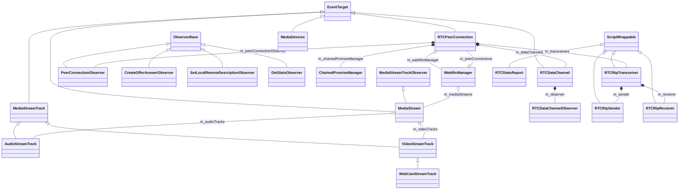
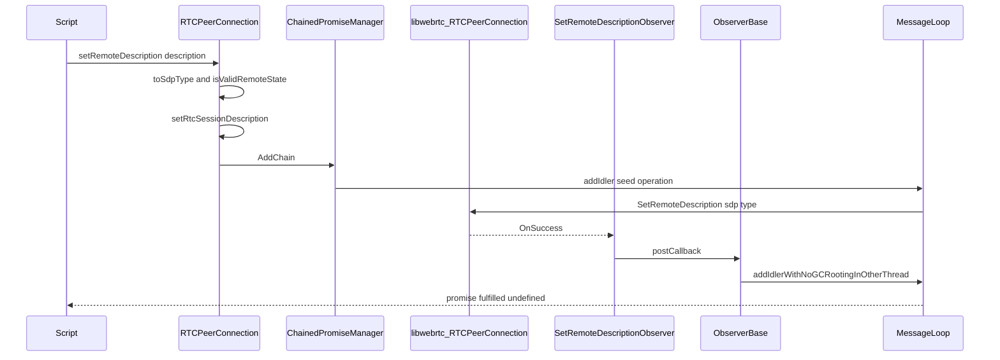

# Functional Requirements: modules-mediastream

> **Relevant source files**
>
> - [src/core/modules/mediastream/RTCPeerConnection.h](src:src/core/modules/mediastream/RTCPeerConnection.h)
> - [src/core/modules/mediastream/RTCPeerConnection.cpp](src:src/core/modules/mediastream/RTCPeerConnection.cpp)
> - [src/core/modules/mediastream/MediaStream.h](src:src/core/modules/mediastream/MediaStream.h)
> - [src/core/modules/mediastream/MediaStream.cpp](src:src/core/modules/mediastream/MediaStream.cpp)
> - [src/core/modules/mediastream/MediaStreamTrack.h](src:src/core/modules/mediastream/MediaStreamTrack.h)
> - [src/core/modules/mediastream/MediaStreamTrack.cpp](src:src/core/modules/mediastream/MediaStreamTrack.cpp)
> - [src/core/modules/mediastream/MediaDevices.h](src:src/core/modules/mediastream/MediaDevices.h)
> - [src/core/modules/mediastream/MediaDevices.cpp](src:src/core/modules/mediastream/MediaDevices.cpp)
> - [src/core/modules/mediastream/RTCDataChannel.h](src:src/core/modules/mediastream/RTCDataChannel.h)
> - [src/core/modules/mediastream/RTCDataChannel.cpp](src:src/core/modules/mediastream/RTCDataChannel.cpp)
> - [src/core/modules/mediastream/WebRtcManager.cpp](src:src/core/modules/mediastream/WebRtcManager.cpp)
> - [src/core/modules/mediastream/RTCConfiguration.cpp](src:src/core/modules/mediastream/RTCConfiguration.cpp)

**Module**: [`RTCPeerConnection.cpp`](src:src/core/modules/mediastream/RTCPeerConnection.cpp)
**Version**: 2026-09-10
**Linked Design Card**: [modules/modules-mediastream.md](../modules/modules-mediastream.md)
**Analysis basis**: AST export and direct source reading

## Overview

The module exposes camera/microphone capture, media stream containers and peer-to-peer connections to script, with each object wrapping a `libwebrtc` backend object ([`RTCPeerConnection`](src:src/core/modules/mediastream/RTCPeerConnection.h#L332), [`MediaStream`](src:src/core/modules/mediastream/MediaStream.h#L42)). A per-navigator [`WebRtcManager`](src:src/core/modules/mediastream/WebRtcManager.h#L36) owns the backend factory and the registry of live objects, and [`ChainedPromiseManager`](src:src/core/modules/mediastream/RTCPeerConnection.h#L314) serializes asynchronous negotiation steps. The whole module is compiled only under `STARFISH_ENABLE_WEBRTC` ([`RTCPeerConnection.h`](src:src/core/modules/mediastream/RTCPeerConnection.h#L20)).

## Functional Requirements

### FR-MODULES-MEDIASTREAM-001
**Acquire local audio/video as a MediaStream**

| Item | Content |
|------|---------|
| **Description** | `MediaDevices.getUserMedia` asynchronously builds a new `MediaStream` containing an audio track and/or a camera video track according to the requested constraints and resolves a promise with it. |
| **Input** | `MediaStreamConstraints` with `audio` and `video` members, each either a boolean or a `MediaTrackConstraints` dictionary (width/height may be given as `ConstrainULongRange` with `exact`). |
| **Output** | Promise fulfilled with the `MediaStream`; or rejected with `DOMException` (`SCRIPT_TYPE_ERR` when neither audio nor video is enabled, `INVALID_STATE_ERR` when the document is not fully active, `DOM_EXCEPTION` when the camera track has no backend). |
| **Preconditions** | `Navigator::mediaDevices` has created the singleton `MediaDevices`; the work is queued on the message loop idler. |
| **Postconditions** | The stream and its tracks are registered with `WebRtcManager`; default capture size is 640x480 at 30 fps unless exact width/height constraints are given. |
| **Source** | [`MediaDevices::getUserMedia`](src:src/core/modules/mediastream/MediaDevices.cpp#L71), [`MediaStreamConstraints::isEnable`](src:src/core/modules/mediastream/MediaDevices.h#L40), [`MediaDevices::kWidth`](src:src/core/modules/mediastream/MediaDevices.h#L78) |

**Acceptance criteria**:
- [ ] `{audio:false, video:false}` rejects with `SCRIPT_TYPE_ERR` ([`MediaDevices.cpp`](src:src/core/modules/mediastream/MediaDevices.cpp#L93)).
- [ ] `{video:true}` creates a `WebCamStreamTrack` with `kWidth`, `kHeight`, `kFps` ([`MediaDevices.cpp`](src:src/core/modules/mediastream/MediaDevices.cpp#L123)).
- [ ] `{video:{width:{exact:w}, height:{exact:h}}}` uses `w` and `h` as capture size ([`MediaDevices.cpp`](src:src/core/modules/mediastream/MediaDevices.cpp#L135)).
- [ ] `{audio:true}` adds an `AudioStreamTrack` created through `WebRtcManager::createAudioTrack` ([`AudioStreamTrack::AudioStreamTrack`](src:src/core/modules/mediastream/MediaStreamTrack.cpp#L98)).

### FR-MODULES-MEDIASTREAM-002
**Manage tracks inside a MediaStream**

| Item | Content |
|------|---------|
| **Description** | A `MediaStream` keeps separate sets of audio and video tracks, mirrors add/remove operations on its backend stream, and exposes its backend id. |
| **Input** | `MediaStreamTrack*` for `addTrack`/`removeTrack`; optional backend stream or track list at construction. |
| **Output** | `getAudioTracks`, `getVideoTracks`, `getTracks` return the current sets; `id` returns the backend stream id. |
| **Preconditions** | The track has a non-null backend; the stream has a backend created by the peer connection factory. |
| **Postconditions** | Added tracks record the stream in their `m_attachedMediaStreams`; when a track is disposed it removes itself from every attached stream. |
| **Source** | [`MediaStream::addTrack`](src:src/core/modules/mediastream/MediaStream.cpp#L364), [`MediaStream::removeTrack`](src:src/core/modules/mediastream/MediaStream.cpp#L389), [`MediaStream::getTracks`](src:src/core/modules/mediastream/MediaStream.cpp#L356), [`MediaStream::id`](src:src/core/modules/mediastream/MediaStream.cpp#L336) |

**Acceptance criteria**:
- [ ] `addTrack(nullptr)` is a no-op ([`MediaStream.cpp`](src:src/core/modules/mediastream/MediaStream.cpp#L366)).
- [ ] A track whose backend is null is not added ([`MediaStream.cpp`](src:src/core/modules/mediastream/MediaStream.cpp#L372)).
- [ ] Constructing from a backend stream wraps each backend audio/video track as `AudioStreamTrack`/`VideoStreamTrack` ([`MediaStream::MediaStream`](src:src/core/modules/mediastream/MediaStream.cpp#L229)).
- [ ] Disposing an `AudioStreamTrack` calls `removeAudioTrack` on every attached stream ([`AudioStreamTrack::dispose`](src:src/core/modules/mediastream/MediaStreamTrack.cpp#L130)).
- [ ] `readyState` reports "ended" when disposed, otherwise "live"/"ended" from the backend state ([`AudioStreamTrack::readyState`](src:src/core/modules/mediastream/MediaStreamTrack.cpp#L146)).

### FR-MODULES-MEDIASTREAM-003
**Create and configure a peer connection**

| Item | Content |
|------|---------|
| **Description** | Constructing `RTCPeerConnection` validates the supplied `RTCConfiguration`, converts it to the backend configuration (unified-plan semantics), creates the backend peer connection through the shared factory, registers the observer, and initializes all state strings to their initial values. |
| **Input** | `RTCConfiguration` (ice servers, ice transport policy, bundle policy, rtcp mux policy, peer identity, certificates, ice candidate pool size). |
| **Output** | A live `RTCPeerConnection` registered with `WebRtcManager`; `DOMException` thrown on invalid configuration or backend failure. |
| **Preconditions** | An `ExecutionContext` with a document, window and navigator. |
| **Postconditions** | `connectionState`, `iceGatheringState`, `iceConnectionState` are "new" and `signalingState` is "stable". |
| **Source** | [`RTCPeerConnection::RTCPeerConnection`](src:src/core/modules/mediastream/RTCPeerConnection.cpp#L670), [`RTCPeerConnection::initializePeerConnection`](src:src/core/modules/mediastream/RTCPeerConnection.cpp#L714), [`RTCPeerConnection::setConfiguration`](src:src/core/modules/mediastream/RTCPeerConnection.cpp#L1429), [`RTCConfiguration::genBackend`](src:src/core/modules/mediastream/RTCConfiguration.cpp#L139) |

**Acceptance criteria**:
- [ ] A configuration whose policies are not valid throws `SCRIPT_TYPE_ERR` ([`RTCConfiguration::isValid`](src:src/core/modules/mediastream/RTCConfiguration.cpp#L130), [`RTCPeerConnection.cpp`](src:src/core/modules/mediastream/RTCPeerConnection.cpp#L1438)).
- [ ] Changing `bundlePolicy` or `rtcpMuxPolicy` after they were set throws `INVALID_MODIFICATION_ERR` ([`RTCPeerConnection.cpp`](src:src/core/modules/mediastream/RTCPeerConnection.cpp#L1484)).
- [ ] `rtcpMuxPolicy` "negotiate" throws `NOT_SUPPORTED_ERR` ([`RTCPeerConnection.cpp`](src:src/core/modules/mediastream/RTCPeerConnection.cpp#L1497)).
- [ ] A `turn`/`turns` server without matching username/credential throws `INVALID_ACCESS_ERR`; `http:`/`https:`/`relative-url` server URLs throw `SYNTAX_ERR` ([`RTCPeerConnection.cpp`](src:src/core/modules/mediastream/RTCPeerConnection.cpp#L1512)).
- [ ] `setConfiguration` on a closed connection throws `INVALID_STATE_ERR` ([`RTCPeerConnection.cpp`](src:src/core/modules/mediastream/RTCPeerConnection.cpp#L1433)).
- [ ] `getDefaultIceServers` returns an empty list ([`RTCPeerConnection::getDefaultIceServers`](src:src/core/modules/mediastream/RTCPeerConnection.cpp#L1415)).

### FR-MODULES-MEDIASTREAM-004
**Negotiate sessions with offers and answers**

| Item | Content |
|------|---------|
| **Description** | `createOffer`, `createAnswer`, `setLocalDescription` and `setRemoteDescription` return promises, check the signaling state, and run one at a time through `ChainedPromiseManager`; results from the backend settle the promise on the main thread. |
| **Input** | `RTCOfferOptions`/`RTCAnswerOptions`; `RTCSessionDescriptionInit` with `type` (offer, pranswer, answer, rollback) and `sdp`. |
| **Output** | `createOffer`/`createAnswer` fulfil with a `{type, sdp}` object; description setters fulfil with undefined; rejections carry `DOMException`. |
| **Preconditions** | Connection is not closed and has a backend. |
| **Postconditions** | Last created offer/answer text is cached; on successful description set, each transceiver is marked as represented in the local or remote description and as "sent before" when its current direction is sendrecv/sendonly. |
| **Source** | [`RTCPeerConnection::createOffer`](src:src/core/modules/mediastream/RTCPeerConnection.cpp#L789), [`RTCPeerConnection::createAnswer`](src:src/core/modules/mediastream/RTCPeerConnection.cpp#L847), [`RTCPeerConnection::setLocalDescription`](src:src/core/modules/mediastream/RTCPeerConnection.cpp#L989), [`RTCPeerConnection::setRemoteDescription`](src:src/core/modules/mediastream/RTCPeerConnection.cpp#L1198), [`RTCPeerConnection::setRtcSessionDescription`](src:src/core/modules/mediastream/RTCPeerConnection.cpp#L1067), [`ChainedPromiseManager::AddChain`](src:src/core/modules/mediastream/RTCPeerConnection.cpp#L595) |

**Acceptance criteria**:
- [ ] `createOffer` on a closed connection rejects with `INVALID_STATE_ERR` ([`RTCPeerConnection.cpp`](src:src/core/modules/mediastream/RTCPeerConnection.cpp#L792)).
- [ ] `createOffer` rejects when signaling state is neither "stable" nor "have-local-offer"; `createAnswer` rejects when it is neither "have-remote-offer" nor "have-local-pranswer" ([`RTCPeerConnection.cpp`](src:src/core/modules/mediastream/RTCPeerConnection.cpp#L817), [`RTCPeerConnection.cpp`](src:src/core/modules/mediastream/RTCPeerConnection.cpp#L875)).
- [ ] A "rollback" type is rejected with "rollback is not supported" ([`RTCPeerConnection.cpp`](src:src/core/modules/mediastream/RTCPeerConnection.cpp#L1013), [`RTCSessionDescriptionInit::toSdpType`](src:src/core/modules/mediastream/RTCSessionDescription.cpp#L97)).
- [ ] `setLocalDescription` with an answer whose sdp differs from the last created answer rejects with `INVALID_MODIFICATION_ERR`; an empty sdp is replaced by the last created offer/answer ([`RTCPeerConnection.cpp`](src:src/core/modules/mediastream/RTCPeerConnection.cpp#L1037)).
- [ ] `setRemoteDescription` with an offer in an invalid signaling state rejects with `INVALID_STATE_ERR` ([`RTCPeerConnection::isValidRemoteState`](src:src/core/modules/mediastream/RTCPeerConnection.cpp#L2063)).
- [ ] Queued operations are executed strictly in order and all pending ones are rejected once the connection is closed ([`RTCPeerConnection.cpp`](src:src/core/modules/mediastream/RTCPeerConnection.cpp#L604)).
- [ ] Successful offer creation fulfils with an object carrying `type` and `sdp` ([`RTCPeerConnection::createSessionDescriptionInitObject`](src:src/core/modules/mediastream/RTCPeerConnection.cpp#L962)).

### FR-MODULES-MEDIASTREAM-005
**Exchange ICE candidates**

| Item | Content |
|------|---------|
| **Description** | Locally gathered ICE candidates are delivered to script as `icecandidate` events; remote candidates supplied by script are validated and added to the backend. |
| **Input** | `RTCIceCandidateInit` (`candidate`, optional `sdpMid`, optional `sdpMLineIndex`, optional `usernameFragment`). |
| **Output** | `addIceCandidate` promise fulfilled with undefined, or rejected with `SCRIPT_TYPE_ERR`, `NOT_SUPPORTED_ERR` (empty candidate string) or "OperationError". `RTCPeerConnectionIceEvent` dispatched with an `RTCIceCandidate`. |
| **Preconditions** | Backend peer connection exists. |
| **Postconditions** | Backend has the candidate registered via `AddCandidate`. |
| **Source** | [`RTCPeerConnection::addIceCandidate`](src:src/core/modules/mediastream/RTCPeerConnection.cpp#L1309), [`PeerConnectionObserver::OnIceCandidate`](src:src/core/modules/mediastream/RTCPeerConnection.cpp#L427), [`RTCIceCandidate::RTCIceCandidate`](src:src/core/modules/mediastream/RTCIceCandidate.cpp#L42) |

**Acceptance criteria**:
- [ ] Non-empty candidate with neither `sdpMid` nor `sdpMLineIndex` rejects with `SCRIPT_TYPE_ERR` ([`RTCPeerConnection.cpp`](src:src/core/modules/mediastream/RTCPeerConnection.cpp#L1314)).
- [ ] Empty candidate string rejects with `NOT_SUPPORTED_ERR` ([`RTCPeerConnection.cpp`](src:src/core/modules/mediastream/RTCPeerConnection.cpp#L1357)).
- [ ] A candidate the backend cannot parse rejects with "OperationError" ([`RTCPeerConnection.cpp`](src:src/core/modules/mediastream/RTCPeerConnection.cpp#L1370)).
- [ ] Constructing `RTCIceCandidate` without `sdpMid` and `sdpMLineIndex` throws `SCRIPT_TYPE_ERR` ([`RTCIceCandidate.cpp`](src:src/core/modules/mediastream/RTCIceCandidate.cpp#L52)).
- [ ] Each backend candidate produces one `icecandidate` event on the main thread ([`RTCPeerConnection.cpp`](src:src/core/modules/mediastream/RTCPeerConnection.cpp#L430)).

### FR-MODULES-MEDIASTREAM-006
**Attach and detach media tracks on a peer connection**

| Item | Content |
|------|---------|
| **Description** | `addTrack`, `removeTrack` and `addTransceiver` map script tracks to backend senders/transceivers, reuse an unused sender of the same kind when possible, and adjust transceiver direction accordingly. |
| **Input** | `MediaStreamTrack*` plus associated `MediaStream` list; or a kind string ("audio"/"video") with `RTCRtpTransceiverInit`. |
| **Output** | `RTCRtpSender*` / `RTCRtpTransceiver*` wrappers; `getSenders`, `getReceivers`, `getTransceivers` list current wrappers. Exceptions: `INVALID_STATE_ERR` (closed), `INVALID_ACCESS_ERR` (track already sent or backend failure), `SCRIPT_TYPE_ERR` (bad kind or direction). |
| **Preconditions** | Connection open; track has a backend. |
| **Postconditions** | A transceiver wrapper exists for every backend transceiver touched; direction changes recvonly→sendrecv / inactive→sendonly on add and sendrecv→recvonly / sendonly→inactive on remove. |
| **Source** | [`RTCPeerConnection::addTrack`](src:src/core/modules/mediastream/RTCPeerConnection.cpp#L1721), [`RTCPeerConnection::removeTrack`](src:src/core/modules/mediastream/RTCPeerConnection.cpp#L1832), [`RTCPeerConnection::addTransceiver`](src:src/core/modules/mediastream/RTCPeerConnection.cpp#L1891), [`RTCPeerConnection::getOrCreateRTCRtpTransceiver`](src:src/core/modules/mediastream/RTCPeerConnection.cpp#L902), [`RTCRtpSender::setTrack`](src:src/core/modules/mediastream/RTCRtpSender.cpp#L78) |

**Acceptance criteria**:
- [ ] Adding a track that is already attached to a live sender throws `INVALID_ACCESS_ERR` ([`RTCPeerConnection.cpp`](src:src/core/modules/mediastream/RTCPeerConnection.cpp#L1754)).
- [ ] An unused sender of the same kind that has never sent is reused instead of creating a new backend sender ([`RTCPeerConnection.cpp`](src:src/core/modules/mediastream/RTCPeerConnection.cpp#L1762)).
- [ ] `removeTrack` with an unknown sender throws `INVALID_ACCESS_ERR`; with a stopped transceiver it returns silently ([`RTCPeerConnection.cpp`](src:src/core/modules/mediastream/RTCPeerConnection.cpp#L1857)).
- [ ] `addTransceiver` with a kind other than "audio"/"video" throws `SCRIPT_TYPE_ERR`; an invalid `direction` string in the init dictionary throws `SCRIPT_TYPE_ERR` ([`RTCPeerConnection.cpp`](src:src/core/modules/mediastream/RTCPeerConnection.cpp#L1908), [`RTCRtpTransceiverInit::toLibwebrtcRTCRtpTransceiverDirection`](src:src/core/modules/mediastream/RTCRtpTransceiverInit.cpp#L55)).
- [ ] `setParameters` rejects when the associated transceiver is stopping and read-only fields differ from the last returned parameters ([`RTCRtpSender::setParameters`](src:src/core/modules/mediastream/RTCRtpSender.cpp#L105), [`RTCRtpSendParameters::validRTCRtpSendParameters`](src:src/core/modules/mediastream/RTCRtpSendParameters.cpp#L77)).

### FR-MODULES-MEDIASTREAM-007
**Send data over data channels**

| Item | Content |
|------|---------|
| **Description** | `createDataChannel` validates the label and init dictionary, creates a backend data channel and wraps it; remotely announced channels are wrapped on `OnDataChannel` and announced through a `datachannel` event; `send` forwards string payloads to the backend and state transitions are dispatched as events. |
| **Input** | Label string, `RTCDataChannelInit` (ordered, maxPacketLifeTime, maxRetransmits, protocol, negotiated, id); payload `String*` for `send`. |
| **Output** | `RTCDataChannel*`; events named after the backend state ("connecting", "open", "closing", "closed"); `DOMException` on invalid arguments. |
| **Preconditions** | Connection is not closed. |
| **Postconditions** | Channel is tracked in `m_dataChannels` and disposed with the connection. |
| **Source** | [`RTCPeerConnection::createDataChannel`](src:src/core/modules/mediastream/RTCPeerConnection.cpp#L1602), [`RTCDataChannel::send`](src:src/core/modules/mediastream/RTCDataChannel.cpp#L256), [`RTCDataChannelObserver::OnStateChange`](src:src/core/modules/mediastream/RTCDataChannel.cpp#L61), [`PeerConnectionObserver::OnDataChannel`](src:src/core/modules/mediastream/RTCPeerConnection.cpp#L299) |

**Acceptance criteria**:
- [ ] Label or protocol longer than 65535 characters throws `SCRIPT_TYPE_ERR` ([`RTCPeerConnection.cpp`](src:src/core/modules/mediastream/RTCPeerConnection.cpp#L1614)).
- [ ] `negotiated=true` without `id`, both `maxPacketLifeTime` and `maxRetransmits` set, or `id >= 65535` throw `SCRIPT_TYPE_ERR` ([`RTCPeerConnection.cpp`](src:src/core/modules/mediastream/RTCPeerConnection.cpp#L1642)).
- [ ] `readyState` maps the backend state to "connecting"/"open"/"closing"/"closed" ([`RTCDataChannel::readyState`](src:src/core/modules/mediastream/RTCDataChannel.cpp#L233), [`DataStateString`](src:src/core/modules/mediastream/RTCDataChannel.cpp#L41)).
- [ ] Incoming messages are not delivered: `OnMessage` body is compiled out ([`RTCDataChannelObserver::OnMessage`](src:src/core/modules/mediastream/RTCDataChannel.cpp#L97)).
- [ ] `ordered`, `maxPacketLifeTime`, `maxRetransmits`, `negotiated` getters are marked unsupported and return defaults ([`RTCDataChannel::ordered`](src:src/core/modules/mediastream/RTCDataChannel.cpp#L196)).

### FR-MODULES-MEDIASTREAM-008
**Surface connection state changes and remote media as events**

| Item | Content |
|------|---------|
| **Description** | Backend observer callbacks update the cached signaling, ICE gathering, ICE connection and connection state strings and dispatch the matching DOM events; remote transceivers produce `track` events carrying receiver, track, streams and transceiver. |
| **Input** | `libwebrtc` state enums and transceiver/receiver objects from the backend, possibly on a worker thread. |
| **Output** | Events `signalingstatechange`, `connectionstatechange`, `iceconnectionstatechange`, `icegatheringstatechange`, `negotiationneeded`, `track`, `datachannel`, `icecandidate` dispatched by user agent on the connection. |
| **Preconditions** | Connection is neither closed nor disposed at the time the posted callback runs. |
| **Postconditions** | State getters return the new string; `signalingState`, `iceConnectionState`, `connectionState` return "closed" once the connection is closed. |
| **Source** | [`ObserverBase::postCallback`](src:src/core/modules/mediastream/RTCPeerConnection.cpp#L107), [`PeerConnectionObserver::OnSignalingState`](src:src/core/modules/mediastream/RTCPeerConnection.cpp#L147), [`PeerConnectionObserver::OnPeerConnectionState`](src:src/core/modules/mediastream/RTCPeerConnection.cpp#L194), [`PeerConnectionObserver::OnTrack`](src:src/core/modules/mediastream/RTCPeerConnection.cpp#L243), [`RTCPeerConnection::signalingState`](src:src/core/modules/mediastream/RTCPeerConnection.cpp#L1386) |

**Acceptance criteria**:
- [ ] Callbacks arriving off the main thread are queued with `addIdlerWithNoGCRootingInOtherThread` and run on the main thread ([`RTCPeerConnection.cpp`](src:src/core/modules/mediastream/RTCPeerConnection.cpp#L116)).
- [ ] Signaling states map to "stable", "have-local-offer", "have-remote-offer", "have-local-pranswer", "have-remote-pranswer", "closed" ([`RTCPeerConnection.cpp`](src:src/core/modules/mediastream/RTCPeerConnection.cpp#L155)).
- [ ] ICE connection states map to "closed", "failed", "disconnected", "new", "checking", "completed", "connected" ([`RTCPeerConnection.cpp`](src:src/core/modules/mediastream/RTCPeerConnection.cpp#L348)).
- [ ] `OnTrack` adds the remote track to each receiver stream and dispatches `RTCTrackEvent` ([`RTCPeerConnection.cpp`](src:src/core/modules/mediastream/RTCPeerConnection.cpp#L267), [`RTCTrackEventInit`](src:src/core/modules/mediastream/RTCTrackEvent.h#L37)).
- [ ] `OnAddStream`, `OnRemoveStream`, `OnAddTrack`, `OnRemoveTrack` are unsupported and produce no event ([`PeerConnectionObserver::OnAddStream`](src:src/core/modules/mediastream/RTCPeerConnection.cpp#L456)).

### FR-MODULES-MEDIASTREAM-009
**Report connection statistics**

| Item | Content |
|------|---------|
| **Description** | `getStats` requests statistics from the backend for the whole connection or for the single sender/receiver matching a selector track and resolves with an `RTCStatsReport` map keyed by stats id. |
| **Input** | Optional `MediaStreamTrack*` selector. |
| **Output** | Promise fulfilled with `RTCStatsReport` (map-like); rejected with `INVALID_ACCESS_ERR` when zero or more than one sender/receiver matches the selector or the backend reports an error. |
| **Preconditions** | Backend peer connection exists. |
| **Postconditions** | Only "peer-connection" typed stats are converted to script values; other types are unsupported and yield undefined. |
| **Source** | [`RTCPeerConnection::getStats`](src:src/core/modules/mediastream/RTCPeerConnection.cpp#L1946), [`GetStatsObserver::OnSuccess`](src:src/core/modules/mediastream/RTCPeerConnection.cpp#L564), [`RTCStats::createScriptValueFromMediaRTCStats`](src:src/core/modules/mediastream/RTCStats.cpp#L51), [`RTCStatsReport::set`](src:src/core/modules/mediastream/RTCStatsReport.cpp#L90) |

**Acceptance criteria**:
- [ ] Selector matching no sender/receiver rejects with "No fit sender or receiver exists." ([`RTCPeerConnection::getStats`](src:src/core/modules/mediastream/RTCPeerConnection.cpp#L1970)).
- [ ] Selector matching more than one rejects with "More than one fit sender or receiver exists." ([`RTCPeerConnection::getStats`](src:src/core/modules/mediastream/RTCPeerConnection.cpp#L1973)).
- [ ] Each returned stats entry is stored under its id; timestamp is converted from microseconds to milliseconds ([`RTCStats::fillStats`](src:src/core/modules/mediastream/RTCStats.cpp#L71)).
- [ ] "peer-connection" stats expose `dataChannelsOpened` and `dataChannelsClosed` ([`RTCPeerConnectionStats`](src:src/core/modules/mediastream/RTCPeerConnectionStats.h#L29)).

### FR-MODULES-MEDIASTREAM-010
**Render received media through the platform player**

| Item | Content |
|------|---------|
| **Description** | When a media element plays a `MediaStream`, the platform player asks the stream to play its first video and audio track; the stream registers a renderer on the backend video track that converts each frame to ARGB and forwards it to the player. |
| **Input** | `MediaStreamTrack*` to play; backend `RTCVideoFrame` frames. |
| **Output** | ARGB pixel buffer (`PIXEL_STRIDE` 4 bytes per pixel) with width/height, delivered through `MediaPlayerWebRtc::onFrame`. Audio frames update sample metadata only; delivery to the player is disabled. |
| **Preconditions** | `setMediaPlayer` has been called by the platform player; the track has a backend. |
| **Postconditions** | `stopVideoTrack`/`stopAudioTrack` remove the renderer and release the frame buffer. |
| **Source** | [`MediaStream::playVideoTrack`](src:src/core/modules/mediastream/MediaStream.cpp#L441), [`MediaStream::VideoFrameObserver::OnFrame`](src:src/core/modules/mediastream/MediaStream.cpp#L161), [`MediaStream::AudioTrackObserver::UpdateFrame`](src:src/core/modules/mediastream/MediaStream.cpp#L79), [`MediaStream::setMediaPlayer`](src:src/core/modules/mediastream/MediaStream.h#L210) |

**Acceptance criteria**:
- [ ] The frame buffer is reallocated only when width or height changes ([`MediaStream::VideoFrameObserver::setSize`](src:src/core/modules/mediastream/MediaStream.cpp#L150)).
- [ ] Frame conversion and buffer access are guarded by `imageLock` ([`MediaStream.cpp`](src:src/core/modules/mediastream/MediaStream.cpp#L165)).
- [ ] `playVideoTrack` on a track with null backend logs a warning and registers nothing ([`MediaStream.cpp`](src:src/core/modules/mediastream/MediaStream.cpp#L450)).
- [ ] Audio frames are not forwarded to the player (call is commented out) ([`MediaStream.cpp`](src:src/core/modules/mediastream/MediaStream.cpp#L93)).

### FR-MODULES-MEDIASTREAM-011
**Release backend resources deterministically**

| Item | Content |
|------|---------|
| **Description** | `close` stops all transceivers and closes the backend; `dispose` releases data channels, transceivers and the backend and unregisters the connection from `WebRtcManager`, which in turn disposes all streams and tracks and drops the factory when the last peer connection is gone. |
| **Input** | None (invoked by script `close`, by destructor/finalizer, or by `WebRtcManager::dispose`). |
| **Output** | Backend references set to null; repeated dispose calls only log a warning. |
| **Preconditions** | Object not already disposed. |
| **Postconditions** | `isClosed()` is true; `WebRtcManager::isDisposed()` becomes true when no peer connection remains. |
| **Source** | [`RTCPeerConnection::close`](src:src/core/modules/mediastream/RTCPeerConnection.cpp#L1567), [`RTCPeerConnection::dispose`](src:src/core/modules/mediastream/RTCPeerConnection.cpp#L753), [`WebRtcManager::deletePeerConnection`](src:src/core/modules/mediastream/WebRtcManager.cpp#L109), [`WebRtcManager::deletePeerConnectionFactory`](src:src/core/modules/mediastream/WebRtcManager.cpp#L54) |

**Acceptance criteria**:
- [ ] `close` on an already closed connection returns without action ([`RTCPeerConnection.cpp`](src:src/core/modules/mediastream/RTCPeerConnection.cpp#L1570)).
- [ ] `isClosed` is true when `m_closed` is set, the backend is null, or the backend state is closed ([`RTCPeerConnection::isClosed`](src:src/core/modules/mediastream/RTCPeerConnection.cpp#L2018)).
- [ ] When the peer connection count reaches zero, all registered audio tracks, video tracks, streams and connections are disposed and the factory is released ([`WebRtcManager.cpp`](src:src/core/modules/mediastream/WebRtcManager.cpp#L56)).
- [ ] Disposing a `MediaStream` stops observers and disposes all its tracks ([`MediaStream::dispose`](src:src/core/modules/mediastream/MediaStream.cpp#L286)).

## Non-Functional Requirements

| Item | Requirement | Source |
|------|-------------|--------|
| Performance | Video frame buffer reuse: buffer reallocated only on size change; one ARGB conversion per frame under a mutex | [`MediaStream::VideoFrameObserver::setSize`](src:src/core/modules/mediastream/MediaStream.cpp#L150) |
| Thread safety | Backend callbacks are moved to the main thread before allocating garbage-collected memory; `ChainedPromiseManager::AddChain` asserts main thread | [`ObserverBase::postCallback`](src:src/core/modules/mediastream/RTCPeerConnection.cpp#L107), [`RTCPeerConnection.cpp`](src:src/core/modules/mediastream/RTCPeerConnection.cpp#L597) |
| Security | TURN server credentials are validated against credential type before use; `peerIdentity` cannot be changed after construction | [`RTCPeerConnection.cpp`](src:src/core/modules/mediastream/RTCPeerConnection.cpp#L1449) |
| Error handling | Failures are reported as `DOMException` codes (`INVALID_STATE_ERR`, `SCRIPT_TYPE_ERR`, `INVALID_MODIFICATION_ERR`, `INVALID_ACCESS_ERR`, `NOT_SUPPORTED_ERR`, `SYNTAX_ERR`, `DOM_EXCEPTION`) either thrown or used to reject promises | [`DOMException.h`](src:src/core/dom/DOMException.h#L31), [`RTCPeerConnection::toDomException`](src:src/core/modules/mediastream/RTCPeerConnection.cpp#L2057) |
| Logging | `STARFISH_LOG_WARN` on repeated dispose and null backend; `STARFISH_LOG_ERROR` on argument violations; `WEBRTC_LOGI`/`WEBRTC_LOGE` macros expand to nothing | [`RTCPeerConnection::dispose`](src:src/core/modules/mediastream/RTCPeerConnection.cpp#L756), [`RTCPeerConnection.h`](src:src/core/modules/mediastream/RTCPeerConnection.h#L52) |

## Constraints

- Compiled only when `STARFISH_ENABLE_WEBRTC` is defined; the build enables it with `WEBRTC=1`, which also requires WebSocket support and switches the compiler to C++14 ([`RTCPeerConnection.h`](src:src/core/modules/mediastream/RTCPeerConnection.h#L20), [`config.cmake`](src:build/config.cmake#L330), [`config.cmake`](src:build/config.cmake#L441)).
- The Linux build has WebRTC disabled by default pending an openssl dependency ([`config.cmake`](src:build/config.cmake#L324)).
- Backend session descriptions always use unified-plan semantics ([`RTCPeerConnection.cpp`](src:src/core/modules/mediastream/RTCPeerConnection.cpp#L721)).
- Unsupported features are explicit: rollback descriptions, non-muxed RTCP, `sctp()` (returns null), `currentLocalDescription`, `getRemoteStreams`, incoming data channel messages, certificates in configuration ([`RTCPeerConnection::sctp`](src:src/core/modules/mediastream/RTCPeerConnection.cpp#L1594), [`RTCPeerConnection::currentLocalDescription`](src:src/core/modules/mediastream/RTCPeerConnection.cpp#L1184), [`RTCPeerConnection.cpp`](src:src/core/modules/mediastream/RTCPeerConnection.cpp#L676)).
- `RTCSctpTransport`, `RTCDtlsTransport` and `RTCIceTransport` wrappers hold no backend object (backend constructor commented out) ([`RTCSctpTransport::RTCSctpTransport`](src:src/core/modules/mediastream/RTCSctpTransport.cpp#L31)).
- The first recording and playout audio devices and the first video device are always selected ([`WebRtcManager.cpp`](src:src/core/modules/mediastream/WebRtcManager.cpp#L136), [`MediaStreamTrack.cpp`](src:src/core/modules/mediastream/MediaStreamTrack.cpp#L259)).

## Module Design Card Linkage

| FR | Implementation | Design Card section |
|----|----------------|---------------------|
| FR-MODULES-MEDIASTREAM-001 | [`MediaDevices::getUserMedia`](src:src/core/modules/mediastream/MediaDevices.cpp#L71) | [Key Flow](../modules/modules-mediastream.md#key-flow) |
| FR-MODULES-MEDIASTREAM-002 | [`MediaStream::addTrack`](src:src/core/modules/mediastream/MediaStream.cpp#L364) | [Public Interface](../modules/modules-mediastream.md#public-interface) |
| FR-MODULES-MEDIASTREAM-003 | [`RTCPeerConnection::setConfiguration`](src:src/core/modules/mediastream/RTCPeerConnection.cpp#L1429) | [Quick Navigation](../modules/modules-mediastream.md#quick-navigation) |
| FR-MODULES-MEDIASTREAM-004 | [`ChainedPromiseManager::AddChain`](src:src/core/modules/mediastream/RTCPeerConnection.cpp#L595) | [Key Flow](../modules/modules-mediastream.md#key-flow) |
| FR-MODULES-MEDIASTREAM-005 | [`RTCPeerConnection::addIceCandidate`](src:src/core/modules/mediastream/RTCPeerConnection.cpp#L1309) | [Public Interface](../modules/modules-mediastream.md#public-interface) |
| FR-MODULES-MEDIASTREAM-006 | [`RTCPeerConnection::addTrack`](src:src/core/modules/mediastream/RTCPeerConnection.cpp#L1721) | [Public Interface](../modules/modules-mediastream.md#public-interface) |
| FR-MODULES-MEDIASTREAM-007 | [`RTCPeerConnection::createDataChannel`](src:src/core/modules/mediastream/RTCPeerConnection.cpp#L1602) | [Quick Navigation](../modules/modules-mediastream.md#quick-navigation) |
| FR-MODULES-MEDIASTREAM-008 | [`ObserverBase::postCallback`](src:src/core/modules/mediastream/RTCPeerConnection.cpp#L107) | [Architectural Rules](../modules/modules-mediastream.md#architectural-rules) |
| FR-MODULES-MEDIASTREAM-009 | [`RTCPeerConnection::getStats`](src:src/core/modules/mediastream/RTCPeerConnection.cpp#L1946) | [Quick Navigation](../modules/modules-mediastream.md#quick-navigation) |
| FR-MODULES-MEDIASTREAM-010 | [`MediaStream::VideoFrameObserver::OnFrame`](src:src/core/modules/mediastream/MediaStream.cpp#L161) | [Key Flow](../modules/modules-mediastream.md#key-flow) |
| FR-MODULES-MEDIASTREAM-011 | [`WebRtcManager::deletePeerConnectionFactory`](src:src/core/modules/mediastream/WebRtcManager.cpp#L54) | [Architectural Rules](../modules/modules-mediastream.md#architectural-rules) |

## ENUM Definitions

| ENUM | Values | Used in | Source |
|------|--------|---------|--------|
| `RTCIceTransportState` | New, Checking, Connected, Completed, Disconnected, Failed, Closed | `RTCIceTransport::state` | [`RTCIceTransportState`](src:src/core/modules/mediastream/RTCIceTransport.h#L34) |
| `RTCRtpTransceiverDirection` | Sendrecv, Sendonly, Recvonly, Inactive, Stopped | `RTCRtpTransceiver::direction`, `RTCPeerConnection::addTrack` | [`RTCRtpTransceiverDirection`](src:src/core/modules/mediastream/RTCRtpTransceiverInit.h#L33) |
| `RTCSignalingState` | Stable, HaveLocalOffer, HaveRemoteOffer, HaveLocalPranswer, HaveRemotePranswer, Closed | `RTCPeerConnection.h` | [`RTCSignalingState`](src:src/core/modules/mediastream/RTCPeerConnection.h#L75) |
| `RTCIceGatheringState` | New, Gathering, Complete | `RTCPeerConnection.h` | [`RTCIceGatheringState`](src:src/core/modules/mediastream/RTCPeerConnection.h#L84) |
| `RTCPeerConnectionState` | Closed, Failed, Disconnected, New, Connecting, Connected | `RTCPeerConnection.h` | [`RTCPeerConnectionState`](src:src/core/modules/mediastream/RTCPeerConnection.h#L90) |
| `RTCIceConnectionState` | Closed, Failed, Disconnected, New, Checking, Completed, Connected | `RTCPeerConnection.h` | [`RTCIceConnectionState`](src:src/core/modules/mediastream/RTCPeerConnection.h#L99) |
| `RTCSdpType` | Offer, Pranswer, Answer, Rollback | `RTCSessionDescriptionInit::toSdpType`, `RTCPeerConnection::toRtcSdpType` | [`RTCSdpType`](src:src/core/modules/mediastream/RTCSessionDescription.h#L34) |
| `RTCIceTransportPolicy` | Relay, All, NoHost, None | `RTCConfiguration::genBackend` | [`RTCIceTransportPolicy`](src:src/core/modules/mediastream/RTCConfiguration.h#L35) |
| `RTCBundlePolicy` | Balanced, MaxCompat, MaxBundle | `RTCConfiguration::genBackend` | [`RTCBundlePolicy`](src:src/core/modules/mediastream/RTCConfiguration.h#L37) |
| `RTCRtcpMuxPolicy` | Negotiate, Require | `RTCPeerConnection::setConfiguration` | [`RTCRtcpMuxPolicy`](src:src/core/modules/mediastream/RTCConfiguration.h#L43) |
| `RTCIceCredentialType` | Password, OAuth | `RTCPeerConnection::setConfiguration` | [`RTCIceCredentialType`](src:src/core/modules/mediastream/RTCIceServer.h#L34) |
| `RTCErrorDetailType` | DataChannelFailure, DtlsFailure, FingerprintFailure, IdpBadScriptFailure, IdpExecutionFailure, IdpLoadFailure, IdpNeedLogin, IdpTimeout, IdpTlsFailure, IdpTokenExpired, IdpTokenInvalid, SctpFailure, SdpSyntaxError, HardwareEncoderNotAvailable, HardwareEncoderError | `RTCErrorInit` | [`RTCErrorDetailType`](src:src/core/modules/mediastream/RTCError.h#L33) |
| `RTCDtlsTransportState` | New, Connecting, Connected, Closed, Failed | `RTCDtlsTransport::stateStr` | [`RTCDtlsTransportState`](src:src/core/modules/mediastream/RTCDtlsTransport.h#L33) |
| `RTCSctpTransportState` | Connecting, Connected, Closed | `RTCSctpTransport::state` | [`RTCSctpTransportState`](src:src/core/modules/mediastream/RTCSctpTransport.h#L30) |
| `MediaStreamTrack::Kind` | Audio, Video, None | `MediaStream::addTrack`, `MediaStreamTrack::kindString` | [`MediaStreamTrack::Kind`](src:src/core/modules/mediastream/MediaStreamTrack.h#L47) |

## Error Code Definitions

None found in code (the module reuses `DOMException` codes such as [`INVALID_STATE_ERR`](src:src/core/dom/DOMException.h#L40) and [`SCRIPT_TYPE_ERR`](src:src/core/dom/DOMException.h#L61); no module-specific error constants are defined).

## Constant Definitions

| Constant | Value | Purpose | Source |
|----------|-------|---------|-------|
| `STARFISH_WEBRTC_DEBUG` | defined (empty) | Enables debug-only declarations in the peer connection header | [`STARFISH_WEBRTC_DEBUG`](src:src/core/modules/mediastream/RTCPeerConnection.h#L45) |
| `WEBRTC_LOGI` | expands to nothing | Debug log macro | [`WEBRTC_LOGI`](src:src/core/modules/mediastream/RTCPeerConnection.h#L52) |
| `VIRTUAL` / `OVERRIDE` | defined empty around `DECLARE_EVENT_LISTENER` blocks | Event listener declaration helpers | [`RTCPeerConnection.h`](src:src/core/modules/mediastream/RTCPeerConnection.h#L376), [`RTCDataChannel.h`](src:src/core/modules/mediastream/RTCDataChannel.h#L87), [`RTCDtlsTransport.h`](src:src/core/modules/mediastream/RTCDtlsTransport.h#L57), [`RTCSctpTransport.h`](src:src/core/modules/mediastream/RTCSctpTransport.h#L54) |
| `MediaStream::PIXEL_STRIDE` | 4 | Bytes per pixel of the ARGB frame buffer | [`MediaStream::PIXEL_STRIDE`](src:src/core/modules/mediastream/MediaStream.h#L44) |
| `MediaDevices::kWidth` | 640 | Default capture width | [`MediaDevices::kWidth`](src:src/core/modules/mediastream/MediaDevices.h#L78) |
| `MediaDevices::kHeight` | 480 | Default capture height | [`MediaDevices::kHeight`](src:src/core/modules/mediastream/MediaDevices.h#L79) |
| `MediaDevices::kFps` | 30 | Default capture frame rate | [`MediaDevices::kFps`](src:src/core/modules/mediastream/MediaDevices.h#L80) |
| `MediaStream::m_mediaStreamLabel` | "MediaStream" | Prefix of generated backend stream ids | [`MediaStream::m_mediaStreamLabel`](src:src/core/modules/mediastream/MediaStream.h#L175) |
| `MediaStreamTrack::m_audioTrackLabel` / `m_videoTrackLabel` | "AudioTrack" / "VideoTrack" | Labels passed to the backend when creating tracks | [`MediaStreamTrack::m_audioTrackLabel`](src:src/core/modules/mediastream/MediaStreamTrack.h#L44) |

## Message Protocol

None found in code.

## Class Diagram

Inheritance from [`RTCPeerConnection`](src:src/core/modules/mediastream/RTCPeerConnection.h#L332), [`MediaStream`](src:src/core/modules/mediastream/MediaStream.h#L42), [`MediaStreamTrack`](src:src/core/modules/mediastream/MediaStreamTrack.h#L42), [`RTCDataChannel`](src:src/core/modules/mediastream/RTCDataChannel.h#L66), [`ObserverBase`](src:src/core/modules/mediastream/RTCPeerConnection.h#L127); containment from the member lists of [`RTCPeerConnection.h`](src:src/core/modules/mediastream/RTCPeerConnection.h#L440), [`RTCRtpTransceiver.h`](src:src/core/modules/mediastream/RTCRtpTransceiver.h#L103) and [`WebRtcManager.h`](src:src/core/modules/mediastream/WebRtcManager.h#L76).

## Sequence Diagram

Primary flow entry: [`RTCPeerConnection::setRemoteDescription`](src:src/core/modules/mediastream/RTCPeerConnection.cpp#L1198) through [`RTCPeerConnection::setRtcSessionDescription`](src:src/core/modules/mediastream/RTCPeerConnection.cpp#L1067), settled by [`SetLocalRemoteDescriptionObserver::OnSuccess`](src:src/core/modules/mediastream/RTCPeerConnection.cpp#L518).

## Test Cases

### Positive
- `getUserMedia({audio:true, video:true})` on a fully active document → promise fulfilled with a `MediaStream` holding one audio and one video track ([`MediaDevices.cpp`](src:src/core/modules/mediastream/MediaDevices.cpp#L113)).
- `new RTCPeerConnection({iceServers:[{urls:"stun:host"}]})` → state strings "new"/"stable"/"new"/"new" ([`RTCPeerConnection.cpp`](src:src/core/modules/mediastream/RTCPeerConnection.cpp#L736)).
- `createOffer()` in "stable" state → promise fulfilled with `{type, sdp}` and `m_lastCreatedOffer` cached ([`CreateOfferAnswerObserver::OnSuccess`](src:src/core/modules/mediastream/RTCPeerConnection.cpp#L474)).
- `addIceCandidate({candidate:"...", sdpMid:"0"})` with a parseable candidate → backend `AddCandidate` invoked and promise fulfilled ([`RTCPeerConnection.cpp`](src:src/core/modules/mediastream/RTCPeerConnection.cpp#L1379)).
- `createDataChannel("chat")` on an open connection → `RTCDataChannel` returned and tracked ([`RTCPeerConnection.cpp`](src:src/core/modules/mediastream/RTCPeerConnection.cpp#L1670)).
- `addTrack(track, [stream])` with no reusable sender → new backend sender and matching transceiver wrapper ([`RTCPeerConnection.cpp`](src:src/core/modules/mediastream/RTCPeerConnection.cpp#L1808)).
- `getStats()` without selector → `RTCStatsReport` with one entry per backend stats object ([`GetStatsObserver::OnSuccess`](src:src/core/modules/mediastream/RTCPeerConnection.cpp#L564)).

### Negative
- `getUserMedia({audio:false, video:false})` → rejected with `SCRIPT_TYPE_ERR` ([`MediaDevices.cpp`](src:src/core/modules/mediastream/MediaDevices.cpp#L93)).
- `new RTCPeerConnection({rtcpMuxPolicy:"negotiate"})` → `NOT_SUPPORTED_ERR` thrown ([`RTCPeerConnection.cpp`](src:src/core/modules/mediastream/RTCPeerConnection.cpp#L1497)).
- `createAnswer()` in "stable" state → rejected with `INVALID_STATE_ERR` ([`RTCPeerConnection.cpp`](src:src/core/modules/mediastream/RTCPeerConnection.cpp#L875)).
- `setLocalDescription({type:"rollback"})` → rejected with "rollback is not supported" ([`RTCPeerConnection.cpp`](src:src/core/modules/mediastream/RTCPeerConnection.cpp#L1013)).
- `createDataChannel(label)` with `label.length > 65535` → `SCRIPT_TYPE_ERR` thrown ([`RTCPeerConnection.cpp`](src:src/core/modules/mediastream/RTCPeerConnection.cpp#L1614)).
- `removeTrack(senderNotOwned)` → `INVALID_ACCESS_ERR` thrown ([`RTCPeerConnection.cpp`](src:src/core/modules/mediastream/RTCPeerConnection.cpp#L1857)).
- `addTransceiver("text")` → `SCRIPT_TYPE_ERR` thrown ([`RTCPeerConnection.cpp`](src:src/core/modules/mediastream/RTCPeerConnection.cpp#L1908)).
- `getStats(trackNotAttached)` → rejected with "No fit sender or receiver exists." ([`RTCPeerConnection::getStats`](src:src/core/modules/mediastream/RTCPeerConnection.cpp#L1970)).

### Edge
- `setLocalDescription({type:"offer", sdp:""})` → uses the last created offer sdp ([`RTCPeerConnection.cpp`](src:src/core/modules/mediastream/RTCPeerConnection.cpp#L1049)).
- `addIceCandidate({candidate:""})` → rejected with `NOT_SUPPORTED_ERR` (end-of-candidates not supported) ([`RTCPeerConnection.cpp`](src:src/core/modules/mediastream/RTCPeerConnection.cpp#L1357)).
- `close()` called twice → second call returns immediately ([`RTCPeerConnection.cpp`](src:src/core/modules/mediastream/RTCPeerConnection.cpp#L1570)).
- `close()` while offers are queued → all unsettled queued promises rejected with "The peer connection is closed." ([`RTCPeerConnection.cpp`](src:src/core/modules/mediastream/RTCPeerConnection.cpp#L604)).
- Backend state callback arriving after `close()` → callback returns without dispatching an event ([`RTCPeerConnection.cpp`](src:src/core/modules/mediastream/RTCPeerConnection.cpp#L151)).
- `getUserMedia({video:true})` with zero video devices → `WebCamStreamTrack` backend null → rejected with "Failed to create a WebCamStream" ([`MediaStreamTrack.cpp`](src:src/core/modules/mediastream/MediaStreamTrack.cpp#L269), [`MediaDevices.cpp`](src:src/core/modules/mediastream/MediaDevices.cpp#L143)).
- Video frame with changed dimensions → frame buffer reallocated before conversion ([`MediaStream::VideoFrameObserver::setSize`](src:src/core/modules/mediastream/MediaStream.cpp#L150)).
- Last `RTCPeerConnection` disposed → factory released and all streams/tracks disposed ([`WebRtcManager.cpp`](src:src/core/modules/mediastream/WebRtcManager.cpp#L56)).
