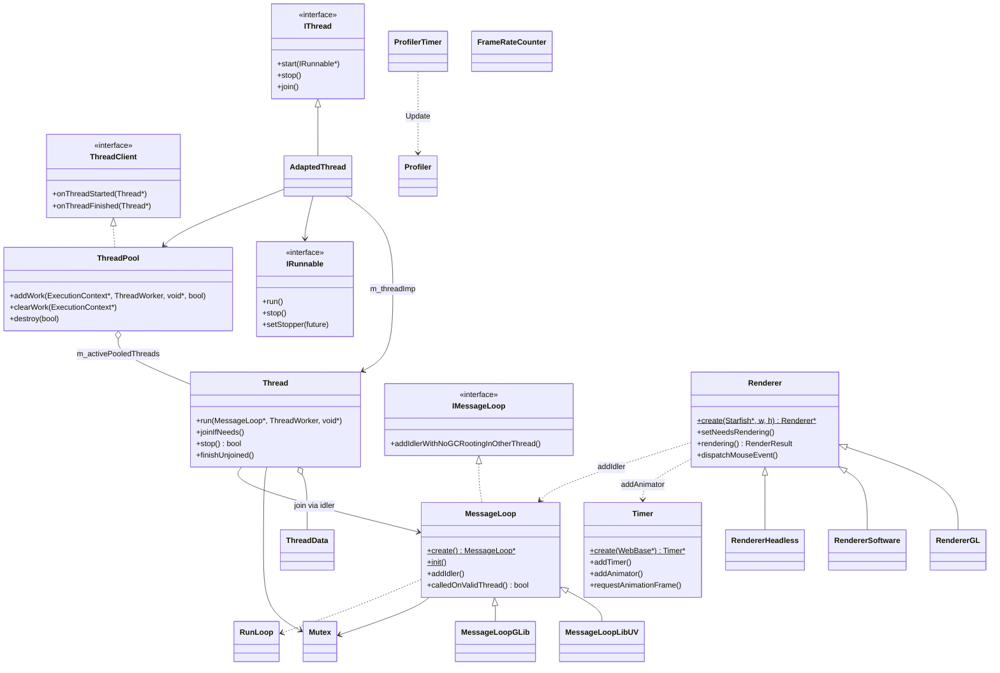
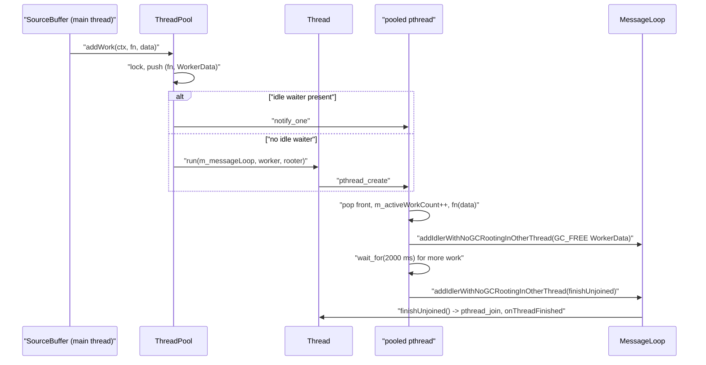

# Functional Requirements: modules-runtime

> **Relevant source files**
>
> - [src/core/modules/threading/Thread.cpp](src:src/core/modules/threading/Thread.cpp)
> - [src/core/modules/threading/Thread.h](src:src/core/modules/threading/Thread.h)
> - [src/core/modules/threading/ThreadPool.cpp](src:src/core/modules/threading/ThreadPool.cpp)
> - [src/core/modules/threading/AdaptedThread.cpp](src:src/core/modules/threading/AdaptedThread.cpp)
> - [src/core/modules/threading/ParallelJobExecutor.h](src:src/core/modules/threading/ParallelJobExecutor.h)
> - [src/core/modules/threading/Mutex.cpp](src:src/core/modules/threading/Mutex.cpp)
> - [src/core/modules/message_loop/MessageLoop.cpp](src:src/core/modules/message_loop/MessageLoop.cpp)
> - [src/core/modules/message_loop/MessageLoop.h](src:src/core/modules/message_loop/MessageLoop.h)
> - [src/core/modules/message_loop/Timer.cpp](src:src/core/modules/message_loop/Timer.cpp)
> - [src/core/modules/profiling/Profiling.cpp](src:src/core/modules/profiling/Profiling.cpp)
> - [src/core/modules/profiling/FrameRateCounter.cpp](src:src/core/modules/profiling/FrameRateCounter.cpp)
> - [src/core/modules/renderer/Renderer.cpp](src:src/core/modules/renderer/Renderer.cpp)

**Module**: [`Thread.cpp`](src:src/core/modules/threading/Thread.cpp#L34)
**Version**: 2026-09-10
**Linked Design Card**: [modules/modules-runtime.md](../modules/modules-runtime.md)
**Analysis basis**: AST export and direct source reading

## Overview

The module provides the engine's execution substrate: threads whose completion is joined back on the owning message loop ([`Thread::run`](src:src/core/modules/threading/Thread.cpp#L144)), a bounded pool for short tasks ([`ThreadPool::addWork`](src:src/core/modules/threading/ThreadPool.cpp#L88)), and factories that pick the event-loop backend at compile time ([`MessageLoop::create`](src:src/core/modules/message_loop/MessageLoop.cpp#L32), [`Timer::create`](src:src/core/modules/message_loop/Timer.cpp#L28)). It also hosts elapsed-time profiling helpers ([`ProfilerTimer::~ProfilerTimer`](src:src/core/modules/profiling/Profiling.cpp#L144)) and the per-WebView `Renderer`, which selects a GL, software or headless backend ([`Renderer::create`](src:src/core/modules/renderer/Renderer.cpp#L71)), schedules frames through the timer ([`Renderer::setNeedsRendering`](src:src/core/modules/renderer/Renderer.cpp#L416)) and normalizes input events before handing them to the page ([`Renderer::dispatchMouseEvent`](src:src/core/modules/renderer/Renderer.cpp#L199)).

## Functional Requirements

### FR-MODULES-RUNTIME-001
**Register and identify the main thread**

| Item | Content |
|------|---------|
| **Description** | The module records the calling thread as the engine main thread once and lets any code ask whether it is currently on that thread, obtain the current native thread ID, or query the number of online cores. |
| **Input** | None for `registerMainThread` / `isMainThread` / `mainThreadID`; the operating system reports the thread ID and core count. |
| **Output** | `g_mainTid` set; `isMainThread()` returns `g_mainTid == getCurrentThreadID()`; `numberOfCores()` returns at least 1. |
| **Preconditions** | `registerMainThread()` has been called (done by `MessageLoop::init`). |
| **Postconditions** | Subsequent `isMainThread()` calls compare against the recorded ID; the ID is never re-registered by the module itself. |
| **Source** | [`registerMainThread`](src:src/core/modules/threading/Thread.cpp#L68), [`isMainThread`](src:src/core/modules/threading/Thread.cpp#L73), [`getCurrentThreadID`](src:src/core/modules/threading/Thread.cpp#L38), [`numberOfCores`](src:src/core/modules/threading/Thread.cpp#L51), [`MessageLoop::init`](src:src/core/modules/message_loop/MessageLoop.cpp#L54) |

**Acceptance criteria**:
- [ ] After `MessageLoop::init()` on thread T, `isMainThread()` returns true on T and false on any other thread.
- [ ] `numberOfCores()` returns 1 when the platform query returns a non-positive value.
- [ ] `getCurrentThreadID()` uses `GetCurrentThreadId` on Windows, `gettid` on Android and `syscall(SYS_gettid)` elsewhere; other platforms fail to compile.

### FR-MODULES-RUNTIME-002
**Run a worker function on a dedicated thread and join it back on the owning loop**

| Item | Content |
|------|---------|
| **Description** | A `Thread` runs a plain worker or a stoppable worker on a new native thread bound to a `MessageLoop`; when the worker returns, the thread schedules its own join on that loop so the creator never blocks on completion unless it asks to. A stoppable worker can be signalled to finish early. |
| **Input** | `MessageLoop* msgLoop`, `ThreadWorker fn` or `StoppableThreadWorker fn`, `void* data`, optional `ThreadClient*` observer. |
| **Output** | `m_alive` set true on successful `pthread_create`; on completion an idler is posted with `addIdlerWithNoGCRootingInOtherThread` that runs `finishUnjoined()`; `ThreadClient::onThreadStarted` / `onThreadFinished` fire; `stop()` returns true only if a stoppable worker is alive. |
| **Preconditions** | Caller is on `msgLoop`'s thread (`calledOnValidThread()`); the thread is not already alive; exactly one of `fn` / `stoppableFn` is non-null. |
| **Postconditions** | `ThreadData` is allocated uncollectable and freed in `finishUnjoined`; after join `m_threadData` is null and `isAlive()` is false. |
| **Source** | [`Thread::run`](src:src/core/modules/threading/Thread.cpp#L144), [`Thread::finishUnjoined`](src:src/core/modules/threading/Thread.cpp#L91), [`Thread::stop`](src:src/core/modules/threading/Thread.cpp#L237), [`Thread::cleanupHandler`](src:src/core/modules/threading/Thread.cpp#L218), [`ThreadData`](src:src/core/modules/threading/Thread.h#L44) |

**Acceptance criteria**:
- [ ] Calling `run` from a thread other than the loop's owner trips `STARFISH_ASSERT(msgLoop->calledOnValidThread())`.
- [ ] Calling `run` while `isAlive()` is true trips `STARFISH_RELEASE_ASSERT(!m_alive)`.
- [ ] A stoppable worker receives a `std::future<void>` that becomes ready when `stop()` or `finishUnjoined()` is called while the thread is alive.
- [ ] `stop()` returns false for a plain (non-stoppable) worker or when the thread is not alive.
- [ ] `joinIfNeeds()` blocks in `pthread_join` and then notifies the `ThreadClient` with `onThreadFinished`.

### FR-MODULES-RUNTIME-003
**Queue short-lived work on a bounded thread pool with lingering workers**

| Item | Content |
|------|---------|
| **Description** | A `ThreadPool` owns a fixed set of `Thread` slots and a FIFO work queue. Work is either handed to an idle lingering worker or started on a free slot; a worker that finds the queue empty waits `kWorkerLingerDuration` (2000 ms) before exiting. Work can be cleared per `ExecutionContext`, and destruction can optionally wait for in-flight jobs. |
| **Input** | `size_t maxThreadCount`, `MessageLoop* ml` at construction; `addWork(ExecutionContext* ctx, ThreadWorker fn, void* data, bool dataPointerComesFromNoGC)`; `clearWork(ctx)`; `destroy(bool waitForActiveWork)`. |
| **Output** | Work executed on a pooled thread; `WorkerData` freed on the owning loop via `addIdlerWithNoGCRootingInOtherThread`; when `dataPointerComesFromNoGC` is true, `data` is `GC_FREE`d if the pool is closed or the job is cleared before running. |
| **Preconditions** | `addWork`, `clearWork`, `destroy` are called on the pool's `MessageLoop` thread. |
| **Postconditions** | After `destroy()`, `m_isClosed` is true, the queue is empty, all lingering workers are woken, and every unpooled `Thread` observed through `ThreadClient` has been joined. |
| **Source** | [`ThreadPool::addWork`](src:src/core/modules/threading/ThreadPool.cpp#L88), [`ThreadPool::destroy`](src:src/core/modules/threading/ThreadPool.cpp#L44), [`ThreadPool::clearWorkLocked`](src:src/core/modules/threading/ThreadPool.cpp#L195), [`ThreadPool::onThreadFinished`](src:src/core/modules/threading/ThreadPool.cpp#L78), [`ThreadPool.cpp`](src:src/core/modules/threading/ThreadPool.cpp#L30) |

**Acceptance criteria**:
- [ ] `addWork` on a closed pool returns without queuing and frees `data` when `dataPointerComesFromNoGC` is true.
- [ ] When `m_idleWaiterCount > 0`, `addWork` wakes one waiter instead of starting a new thread.
- [ ] A worker whose `wait_for` times out with an empty queue exits; one that is woken by new work continues consuming.
- [ ] `clearWork(nullptr)` removes every queued job; `clearWork(ctx)` removes only jobs whose `WorkerData::ctx == ctx`.
- [ ] `destroy(true)` returns only after `m_activeWorkCount` reaches zero.

### FR-MODULES-RUNTIME-004
**Adapt runnable objects and parallel jobs onto engine threads**

| Item | Content |
|------|---------|
| **Description** | `AdaptedThread` runs an `IRunnable` (`run` / `stop` / `setStopper`) on a stoppable `Thread` registered with a `ThreadPool` as its `ThreadClient`; `ParallelJobExecutor<T>` fans one worker function out over up to `numberOfCores()` threads with a parameter slot per thread and joins them all synchronously. |
| **Input** | `AdaptedThread(ThreadPool*)`, `start(IRunnable*)`; `ParallelJobExecutor(WebView*, ParallelJobWorker, int requestWorkerSize)`, `parameters(i)`, `execute()`. |
| **Output** | `IRunnable::setStopper` receives the stop future before `run()`; `AdaptedThread::stop` forwards to `IRunnable::stop`; `execute()` returns after every thread has been joined. |
| **Preconditions** | `ParallelJobExecutor` construction and `execute()` occur on the main thread; a non-null worker is supplied. |
| **Postconditions** | `requestWorkerSize` of 0 or above the core count is clamped to `numberOfCores()`; threads are reused from `WebView::parallelJobExecutorThreadPool()` and created on demand. |
| **Source** | [`AdaptedThread::start`](src:src/core/modules/threading/AdaptedThread.cpp#L45), [`AdaptedThread::stop`](src:src/core/modules/threading/AdaptedThread.cpp#L80), [`IRunnable`](src:src/core/modules/threading/IRunnable.h#L25), [`ParallelJobExecutor`](src:src/core/modules/threading/ParallelJobExecutor.h#L33), [`ParallelJobExecutor::execute`](src:src/core/modules/threading/ParallelJobExecutor.h#L73) |

**Acceptance criteria**:
- [ ] `AdaptedThread::start` creates a new `Thread` bound to the pool and runs it with `m_threadPool->messageLoop()`.
- [ ] `AdaptedThread::run` skips `IRunnable::run` if `m_isAlive` is already false.
- [ ] `ParallelJobExecutor` constructed off the main thread trips `STARFISH_ASSERT(isMainThread())`.
- [ ] `execute()` starts `numberOfThread()` threads and then calls `joinIfNeeds()` on each in order.

### FR-MODULES-RUNTIME-005
**Provide mutual exclusion primitives whose native resources are released by the collector**

| Item | Content |
|------|---------|
| **Description** | `Mutex` wraps a `pthread_mutex_t` and is allocated through a finalizer-backed `operator new` so the native mutex is destroyed when the object is collected; `Locker<T>` is a stack-only RAII guard; `Semaphore` wraps a `sem_t` and registers a finalizer that destroys it. |
| **Input** | `Mutex(const char* name)`, `lock()` / `unlock()`; `Locker<T>(T&)`; `Semaphore(size_t cnt)`, `lock()` / `unlock()`. |
| **Output** | Locked / unlocked native primitives; in debug builds a named mutex logs each lock and unlock. |
| **Preconditions** | `Mutex` is created via default `new` or `new (NoGC)`; any other placement is rejected. |
| **Postconditions** | `pthread_mutex_destroy` runs via finalizer or destructor; `operator delete` on a `Mutex` is a no-op. |
| **Source** | [`Mutex::operator new`](src:src/core/modules/threading/Mutex.cpp#L31), [`Mutex::clearNativeResources`](src:src/core/modules/threading/Mutex.cpp#L46), [`Mutex::lock`](src:src/core/modules/threading/Mutex.cpp#L66), [`Locker`](src:src/core/modules/threading/Locker.h#L26), [`Semaphore::Semaphore`](src:src/core/modules/threading/Semaphore.cpp#L25) |

**Acceptance criteria**:
- [ ] `new (placement) Mutex` with `placement != NoGC` trips `STARFISH_ASSERT(placement == NoGC)`.
- [ ] `Locker<Mutex>` locks in its constructor and unlocks in its destructor.
- [ ] `Semaphore(cnt)` initializes the semaphore with `cnt`; `lock()` waits and `unlock()` posts.

### FR-MODULES-RUNTIME-006
**Create backend-specific message loops and post idle tasks to them**

| Item | Content |
|------|---------|
| **Description** | `MessageLoop` is an abstract loop whose concrete type (libuv or GLib) is chosen at compile time; it exposes idle-task posting for the owning thread (`addIdler`) and for other threads (`addIdlerWithNoGCRootingInOtherThread`), a thread-affinity check, and process-wide static entry points to initialize, run, stop, and run a functor synchronously on the main thread. `RunLoop` is the matching abstract native loop used for workers. |
| **Input** | `create()`, `createForWorker(RunLoop*)`, `init()`, `run()`, `stop()`, `runOnMainThreadSync(functor)`, `runWithProcessMainThreadPausedSync(functor)`, `addIdler(globalScope, fn, data...)`, `removeIdler(handle)`, `clearPendingIdlers(globalScope)`. |
| **Output** | A `MessageLoopLibUV` or `MessageLoopGLib` instance; idler handles (`MessageLoopInvalidID` = `SIZE_MAX` reserved); `calledOnValidThread()` true only on the creating thread. |
| **Preconditions** | Exactly one of `PORT_EVENTLOOP_BACKEND_LIBUV` / `PORT_EVENTLOOP_BACKEND_GLIB` is defined. |
| **Postconditions** | `init()` registers the main thread before backend initialization; the base `runLoop()` is unreachable and must be overridden by backends that support it. |
| **Source** | [`MessageLoop::create`](src:src/core/modules/message_loop/MessageLoop.cpp#L32), [`MessageLoop::createForWorker`](src:src/core/modules/message_loop/MessageLoop.cpp#L44), [`MessageLoop::init`](src:src/core/modules/message_loop/MessageLoop.cpp#L54), [`MessageLoop::runOnMainThreadSync`](src:src/core/modules/message_loop/MessageLoop.cpp#L88), [`MessageLoop::calledOnValidThread`](src:src/core/modules/message_loop/MessageLoop.cpp#L141), [`MessageLoop::addIdler`](src:src/core/modules/message_loop/MessageLoop.h#L72), [`IMessageLoop::addIdlerWithNoGCRootingInOtherThread`](src:src/core/modules/message_loop/MessageLoopInterface.h#L26), [`RunLoop::create`](src:src/core/modules/message_loop/RunLoop.cpp#L28) |

**Acceptance criteria**:
- [ ] With `PORT_EVENTLOOP_BACKEND_LIBUV`, `MessageLoop::create()` returns a `MessageLoopLibUV`; with `PORT_EVENTLOOP_BACKEND_GLIB`, a `MessageLoopGLib`; with neither, compilation fails.
- [ ] `calledOnValidThread()` is true on the thread that constructed the loop and false elsewhere.
- [ ] `MessageLoop::init()` calls `registerMainThread()` before the backend `init()`.
- [ ] Calling the base `MessageLoop::runLoop()` trips `STARFISH_ASSERT_NOT_REACHED()`.
- [ ] `isCallerInsideBackendEventLoop()` returning false is treated as "unconfirmed" and is not used to gate behavior.

### FR-MODULES-RUNTIME-007
**Schedule timers, animators and animation-frame requests**

| Item | Content |
|------|---------|
| **Description** | `Timer` is an abstract per-`WebBase` scheduler with backend-specific implementations for one-shot or repeating timers and per-frame animators; the base class implements `requestAnimationFrame` bookkeeping and asks the owner to render. |
| **Input** | `addTimer(delay, globalScope, handler, data, repetitive)`, `removeTimer(id)`, `addAnimator(globalScope, handler, data)`, `removeGenericAnimator(id)`, `requestAnimationFrame(globalScope, handler, data)`, `cancelAnimationFrame(id)`, `clear(globalScope)`. |
| **Output** | Request IDs (`TimerInvalidID` = `SIZE_MAX` reserved); `requestAnimationFrame` appends a `RequestAnimationFrameData` entry with a monotonically increasing ID and calls `WebBase::setNeedsRendering()`. |
| **Preconditions** | A `WebBase` owner exists; backend macro selected as in FR-006. |
| **Postconditions** | `cancelAnimationFrame(id)` removes the first matching entry and leaves others intact. |
| **Source** | [`Timer::create`](src:src/core/modules/message_loop/Timer.cpp#L28), [`Timer::addTimer`](src:src/core/modules/message_loop/Timer.h#L43), [`Timer::addAnimator`](src:src/core/modules/message_loop/Timer.h#L48), [`Timer::requestAnimationFrame`](src:src/core/modules/message_loop/Timer.cpp#L58), [`Timer::cancelAnimationFrame`](src:src/core/modules/message_loop/Timer.cpp#L74), [`Timer.h`](src:src/core/modules/message_loop/Timer.h#L31) |

**Acceptance criteria**:
- [ ] Two consecutive `requestAnimationFrame` calls return IDs n and n+1.
- [ ] `requestAnimationFrame` triggers `m_webBase->setNeedsRendering()` exactly once per call.
- [ ] `cancelAnimationFrame` with an unknown ID leaves `m_requestAnimationFrameHandler` unchanged.
- [ ] `Timer::create(webBase)` returns `TimerLibUV` or `TimerGLib` according to the backend macro.

### FR-MODULES-RUNTIME-008
**Measure elapsed time, detect long tasks and report per-kind profiles**

| Item | Content |
|------|---------|
| **Description** | The module supplies millisecond and microsecond wall clocks, a scoped `ProfilerTimer` that logs its lifetime and optionally accumulates it into a global `Profiler` by `ProfileKind`, a scoped `LongTaskFinder` that logs only when a threshold is exceeded, a `FrameRateCounter` that computes frames per second over one-second windows and can draw the value, and a builder-based layout flow logger. |
| **Input** | `ProfilerTimer(msg)` / `ProfilerTimer(kind, msg)`; `LongTaskFinder(msg, loggingTimeInMS)`; `Profiler::Update(kind, elapsedMs)`; `FrameRateCounter::update()`, `setObserver(fn)`, `drawFps(Canvas*)` / `drawFps(Compositor*)`; `INSTALL_LAYOUT_FLOW_LOGGER(...)`. |
| **Output** | Log lines `did <msg> in <t> ms` and `found long task <msg> in <t> ms`; `Profiler::report()` prints total and per-kind percentages; `FrameRateCounter::fps()` and observer callback every >1000 ms; indented `[Start]`/`[End]` layout trace lines. |
| **Preconditions** | Profile accumulation into `g_profiler` requires `STARFISH_ENABLE_PROFILE`; `INSTALL_PROFILE_TIMER` expands to code only under `STARFISH_ENABLE_PROFILE_TIMER`. |
| **Postconditions** | `Profiler::~Profiler` calls `report()`; `Profiler::start()` resets all per-kind records to zero. |
| **Source** | [`tickCount`](src:src/core/modules/profiling/Profiling.cpp#L107), [`longTickCount`](src:src/core/modules/profiling/Profiling.cpp#L114), [`ProfilerTimer::~ProfilerTimer`](src:src/core/modules/profiling/Profiling.cpp#L144), [`LongTaskFinder::~LongTaskFinder`](src:src/core/modules/profiling/Profiling.cpp#L156), [`Profiler::report`](src:src/core/modules/profiling/Profiling.cpp#L204), [`FrameRateCounter::update`](src:src/core/modules/profiling/FrameRateCounter.cpp#L39), [`LoggerDirector::constructLogger`](src:src/core/modules/profiling/Logger.h#L137) |

**Acceptance criteria**:
- [ ] `ProfilerTimer(kind, msg)` sets `m_needToRecord` true; the single-argument form records as `ProfileKind::kMISC` without updating the profiler.
- [ ] `LongTaskFinder` with `loggingTimeInMS = 1` logs only when the scope took at least 1 ms.
- [ ] `FrameRateCounter::update()` recomputes `fps` only when more than 1000 ms elapsed since the window start, then resets the frame count.
- [ ] `Profiler::report()` lists Style, Layout, Paint, Script and MISC in that order.
- [ ] `Logger::installLogger` increments the shared indent counter and the destructor decrements it.

### FR-MODULES-RUNTIME-009
**Select a rendering backend and schedule frames through the timer**

| Item | Content |
|------|---------|
| **Description** | `Renderer::create` picks a GL, software or headless implementation from `Starfish::rendererType()`. `setNeedsRendering` either forwards to an embedder-supplied callback or registers a single animator that calls `rendering()` each frame and keeps running while the WebView needs continuous rendering. `rendering()` delegates to `WebView::rendering()` and notifies the finished-callback when painting or compositing happened. Backends override `preparePainting` / `prepareCompositor` to produce a `Canvas` / `Compositor` for the target buffer. |
| **Input** | `Starfish* starfish`, `width`, `height`; registered callbacks (`registerRenderingPrepareCallback`, `registerRenderingFinishedCallback`, `registerSetNeedsRenderingCallback`, `registerCanRenderingCallback`); `resizeTo(w, h)`, `setDevicePixelRatio(dpr)`, `pause()`, `resume()`, `destroy()`. |
| **Output** | A `RendererGL`, `RendererSoftware` or `RendererHeadless`; a `RenderResult` from `rendering()`; `m_renderingAnimator` handle while a frame is pending. |
| **Preconditions** | `canRendering()` is true (callback absent or returns true); renderer width and height are non-zero for a frame to be produced. |
| **Postconditions** | `destroy()` removes the animator, clears the stacking context, drops native callbacks and deletes the compositor context; `RendererGL::pause` releases the GL painting surface. |
| **Source** | [`Renderer::create`](src:src/core/modules/renderer/Renderer.cpp#L71), [`Renderer::setNeedsRendering`](src:src/core/modules/renderer/Renderer.cpp#L416), [`Renderer::rendering`](src:src/core/modules/renderer/Renderer.cpp#L459), [`Renderer::destroy`](src:src/core/modules/renderer/Renderer.cpp#L165), [`Renderer::clearResources`](src:src/core/modules/renderer/Renderer.cpp#L403), [`RendererGL`](src:src/core/modules/renderer/RendererGL.cpp#L62), [`RendererSoftware`](src:src/core/modules/renderer/RendererSoftware.cpp#L47), [`RendererHeadless`](src:src/core/modules/renderer/RendererHeadless.cpp#L54) |

**Acceptance criteria**:
- [ ] `rendererType() == kOpenGL` yields `RendererGL`, `kSoftware` yields `RendererSoftware`; in `STARFISH_HEADLESS` builds only `kHeadless` is accepted.
- [ ] A second `setNeedsRendering()` while `m_renderingAnimator != TimerInvalidID` registers no additional animator.
- [ ] The animator returns true (keeps running) only when `webView()->needsContinuousRendering()` is true and no `m_setNeedsRenderingCallback` is set.
- [ ] `rendering()` with `canRendering()` false returns an empty `RenderResult` without calling the WebView.
- [ ] `m_renderingFinishedCallback` is invoked only when `renderResult.didPaintingOrCompositing` is true.

### FR-MODULES-RUNTIME-010
**Normalize and dispatch input events and host window callbacks**

| Item | Content |
|------|---------|
| **Description** | The renderer converts embedder coordinates to page coordinates by dividing by the device pixel ratio, throttles mouse-move events, tracks modifier-key state from key events, optionally drives a keyboard-controlled virtual cursor, and forwards touch, mouse, wheel, key and composition events to the `WebView`. Host-side window handlers (dropdown menu, alert, menu item selected) are registered by kind and invoked asynchronously on the message loop. |
| **Input** | `dispatchTouchEvent(kind, touches, count)`, `dispatchMouseEvent(kind, data, isSimulation)`, `dispatchMouseWheelEvent(x, y, z, isVertical)`, `dispatchKeyEvent(kind, data)`, `dispatchCompositionEvent(kind, data, node)`, `registerCallbackHandler(kind, handler)`, `callHandler(kind, param)`. |
| **Output** | Scaled events delivered to `WebView::dispatch*Event`; `m_eventModifierData` updated for Shift/Alt/Ctrl/Meta; an idler posted with `MessageLoop::addIdler` that runs the registered handler. |
| **Preconditions** | A `WebView` is attached (`setWebView`); `webView()->screenInfo().devicePixelRatio` is non-zero. |
| **Postconditions** | Touch coordinates are scaled on a local copy so callers may reuse the same array; `m_lastMouseMoveEventFiredTime` is updated after a delivered move. |
| **Source** | [`Renderer::dispatchTouchEvent`](src:src/core/modules/renderer/Renderer.cpp#L180), [`Renderer::dispatchMouseEvent`](src:src/core/modules/renderer/Renderer.cpp#L199), [`Renderer::dispatchKeyEvent`](src:src/core/modules/renderer/Renderer.cpp#L253), [`Renderer::registerCallbackHandler`](src:src/core/modules/renderer/Renderer.cpp#L488), [`Renderer::callHandler`](src:src/core/modules/renderer/Renderer.cpp#L499), [`WindowHandlerKind`](src:src/core/modules/renderer/Renderer.h#L30) |

**Acceptance criteria**:
- [ ] A non-simulated mouse move arriving less than 100 ms after the previous delivered move is dropped; with the left button held the limit is 16 ms.
- [ ] A mouse move at the same screen position as the last one is dropped regardless of timing.
- [ ] `dispatchKeyEvent(KeyEventDown, ShiftLeftKey)` sets the shift modifier; the matching `KeyEventUp` clears it.
- [ ] `callHandler` for a kind with no registered handler posts nothing; with a handler it runs on the next idle pass of `webView()->messageLoop()`.
- [ ] With `STARFISH_ENABLE_VIRTUAL_CURSOR` and no active IME, arrow keys move the cursor and Space/Enter synthesize mouse down/up.

## Non-Functional Requirements

| Item | Requirement | Source |
|------|-------------|--------|
| Performance | Pool workers linger 2000 ms after the queue empties so consecutive jobs reuse the OS thread instead of paying thread creation again. | [`ThreadPool.cpp`](src:src/core/modules/threading/ThreadPool.cpp#L30) |
| Performance | Hover mouse moves are throttled to one per 100 ms and drag moves to one per 16 ms to cap hit-test, layout and paint cost. | [`Renderer.cpp`](src:src/core/modules/renderer/Renderer.cpp#L44) |
| Performance | `ParallelJobExecutor` never allocates more threads than `numberOfCores()`. | [`ParallelJobExecutor`](src:src/core/modules/threading/ParallelJobExecutor.h#L33) |
| Security | Not specified in code | — |
| Error handling | `pthread_create` failure trips `STARFISH_RELEASE_ASSERT_SHOULD_NOT_BE_HERE()`; an unknown renderer type does the same. | [`Thread::run`](src:src/core/modules/threading/Thread.cpp#L144), [`Renderer::create`](src:src/core/modules/renderer/Renderer.cpp#L71) |
| Error handling | A renderer with zero width or height logs `Renderer size error` instead of rendering. | [`Renderer::setNeedsRendering`](src:src/core/modules/renderer/Renderer.cpp#L416) |
| Logging | Named mutexes log every lock/unlock in non-`NDEBUG` builds; thread counts are logged under `STARFISH_MESSAGELOOP_DEBUG`. | [`Mutex::lock`](src:src/core/modules/threading/Mutex.cpp#L66), [`Thread::run`](src:src/core/modules/threading/Thread.cpp#L144) |
| Logging | Scoped timers emit `did <msg> in <t> ms`; long tasks emit `found long task <msg> in <t> ms`. | [`ProfilerTimer::~ProfilerTimer`](src:src/core/modules/profiling/Profiling.cpp#L144), [`LongTaskFinder::~LongTaskFinder`](src:src/core/modules/profiling/Profiling.cpp#L156) |

## Constraints

- Thread, pool and loop mutations must run on the owning loop's thread; violations are assertion failures ([`Thread::run`](src:src/core/modules/threading/Thread.cpp#L144), [`ThreadPool::addWork`](src:src/core/modules/threading/ThreadPool.cpp#L88)).
- Exactly one event-loop backend macro must be defined; otherwise `MessageLoop::create`, `MessageLoop::init`, `Timer::create` fail to compile ([`MessageLoop::create`](src:src/core/modules/message_loop/MessageLoop.cpp#L32)).
- `Mutex` cannot be placed with a GC-collectable placement other than `NoGC` ([`Mutex::operator new`](src:src/core/modules/threading/Mutex.cpp#L37)).
- `Thread::run` accepts either a plain or a stoppable worker, never both ([`Thread::run`](src:src/core/modules/threading/Thread.cpp#L144)).
- Headless builds accept only `StarfishRendererType::kHeadless` ([`Renderer::create`](src:src/core/modules/renderer/Renderer.cpp#L71)).
- `ThreadPool::destroy(true)` must only be used by pools whose jobs never call back into the destroying thread ([`ThreadPool`](src:src/core/modules/threading/ThreadPool.h#L36), comment at line 48).

## Module Design Card Linkage

| FR | Implementation | Design Card section |
|----|----------------|---------------------|
| FR-MODULES-RUNTIME-001 | [`registerMainThread`](src:src/core/modules/threading/Thread.cpp#L68), [`isMainThread`](src:src/core/modules/threading/Thread.cpp#L73) | [Architectural Rules](../modules/modules-runtime.md#architectural-rules) |
| FR-MODULES-RUNTIME-002 | [`Thread::run`](src:src/core/modules/threading/Thread.cpp#L144) | [Key Flow](../modules/modules-runtime.md#key-flow) |
| FR-MODULES-RUNTIME-003 | [`ThreadPool::addWork`](src:src/core/modules/threading/ThreadPool.cpp#L88) | [Key Flow](../modules/modules-runtime.md#key-flow) |
| FR-MODULES-RUNTIME-004 | [`AdaptedThread::start`](src:src/core/modules/threading/AdaptedThread.cpp#L45), [`ParallelJobExecutor::execute`](src:src/core/modules/threading/ParallelJobExecutor.h#L73) | [Public Interface](../modules/modules-runtime.md#public-interface) |
| FR-MODULES-RUNTIME-005 | [`Mutex::operator new`](src:src/core/modules/threading/Mutex.cpp#L31) | [Architectural Rules](../modules/modules-runtime.md#architectural-rules) |
| FR-MODULES-RUNTIME-006 | [`MessageLoop::create`](src:src/core/modules/message_loop/MessageLoop.cpp#L32) | [Key Flow](../modules/modules-runtime.md#key-flow) |
| FR-MODULES-RUNTIME-007 | [`Timer::requestAnimationFrame`](src:src/core/modules/message_loop/Timer.cpp#L58) | [Quick Navigation](../modules/modules-runtime.md#quick-navigation) |
| FR-MODULES-RUNTIME-008 | [`ProfilerTimer::~ProfilerTimer`](src:src/core/modules/profiling/Profiling.cpp#L144) | [Architectural Rules](../modules/modules-runtime.md#architectural-rules) |
| FR-MODULES-RUNTIME-009 | [`Renderer::setNeedsRendering`](src:src/core/modules/renderer/Renderer.cpp#L416) | [Key Flow](../modules/modules-runtime.md#key-flow) |
| FR-MODULES-RUNTIME-010 | [`Renderer::dispatchMouseEvent`](src:src/core/modules/renderer/Renderer.cpp#L199) | [Architectural Rules](../modules/modules-runtime.md#architectural-rules) |

## ENUM Definitions

| ENUM | Values | Used in | Source |
|------|--------|---------|--------|
| `WindowHandlerKind` | `WindowHandlerShowDropdownMenu`, `WindowHandlerShowAlert`, `WindowHandlerOnDropdownMenuItemSelected` | `Renderer::registerCallbackHandler`, `Renderer::callHandler`, `HTMLSelectElement.cpp`, `LWEWebContainerDelegate.cpp` | [`WindowHandlerKind`](src:src/core/modules/renderer/Renderer.h#L30) |
| `TouchEventKind` | `TouchEventStart`, `TouchEventMove`, `TouchEventEnd`, `TouchEventCancel` | `Renderer::dispatchTouchEvent` | [`TouchEventKind`](src:src/core/modules/renderer/Renderer.h#L71) |
| `MouseEventKind` | `MouseEventDown`, `MouseEventMove`, `MouseEventUp`, `MouseEventEnter`, `MouseEventOut` | `Renderer::dispatchMouseEvent` | [`MouseEventKind`](src:src/core/modules/renderer/Renderer.h#L78) |
| `KeyEventKind` | `KeyEventDown`, `KeyEventPress`, `KeyEventUp` | `Renderer::dispatchKeyEvent` | [`KeyEventKind`](src:src/core/modules/renderer/Renderer.h#L86) |
| `CompositionEventKind` | `CompositionEventStart`, `CompositionEventUpdate`, `CompositionEventEnd` | `Renderer::dispatchCompositionEvent` | [`CompositionEventKind`](src:src/core/modules/renderer/Renderer.h#L88) |
| `ProfileKind` | `kStyle`, `kLayout`, `kPaint`, `kScript`, `kMISC` | `ProfilerTimer`, `Profiler::Update`, `Profiler::report` | [`ProfileKind`](src:src/core/modules/profiling/Profiling.h#L31) |

## Error Code Definitions

None found in code

## Constant Definitions

| Constant | Value | Purpose | Source |
|----------|-------|---------|--------|
| `kWorkerLingerDuration` | `2000` ms | Idle wait before a pool worker exits | [`ThreadPool.cpp`](src:src/core/modules/threading/ThreadPool.cpp#L30) |
| `MessageLoopInvalidID` | `SIZE_MAX` | Reserved invalid idler handle | [`MessageLoop.h`](src:src/core/modules/message_loop/MessageLoop.h#L34) |
| `TimerInvalidID` | `SIZE_MAX` | Reserved invalid timer / animator handle | [`Timer.h`](src:src/core/modules/message_loop/Timer.h#L31) |
| `MOUSE_MOVE_EVENT_THRESHOLD` | `100` | Minimum ms between delivered hover mouse moves | [`Renderer.cpp`](src:src/core/modules/renderer/Renderer.cpp#L44) |
| `MOUSE_MOVE_DRAG_EVENT_THRESHOLD` | `16` | Minimum ms between delivered drag mouse moves | [`Renderer.cpp`](src:src/core/modules/renderer/Renderer.cpp#L48) |
| `Renderer::kEmptyContextOrUnknown` | `0` | Sentinel for "no current GL context" | [`Renderer.h`](src:src/core/modules/renderer/Renderer.h#L191) |
| `virtualCursorInitialSpeed` / `virtualCursorMaxSpeed` | `1` / `30` | Virtual cursor acceleration bounds (pixels per key press) | [`Renderer.cpp`](src:src/core/modules/renderer/Renderer.cpp#L261) |
| `g_virtualCursorPNGDataSize` | `607` | Byte length of the embedded cursor PNG | [`VirtualCursorData.cpp`](src:src/core/modules/renderer/VirtualCursorData.cpp#L80) |
| `LayoutFlowLoggerBuilder::INDENT_COUNTER` | `0` (initial) | Shared indent depth for layout flow logs | [`LayoutFlowLoggerBuilder.cpp`](src:src/core/modules/profiling/LayoutFlowLoggerBuilder.cpp#L29) |
| `DELTA_EPOCH_IN_MICROSECS` | `11644473600000000` (`Ui64` on MSVC, `ULL` otherwise) | Windows FILETIME to Unix epoch offset for `gettimeofday` replacement | [`Profiling.cpp`](src:src/core/modules/profiling/Profiling.cpp#L53) |
| `STARFISH_ENABLE_PROFILE_TIMER` | defined when `STARFISH_ENABLE_PROFILING` is defined | Enables `INSTALL_PROFILE_TIMER` macros | [`Profiling.h`](src:src/core/modules/profiling/Profiling.h#L104) |

## Message Protocol

None found in code

## Class Diagram

## Sequence Diagram

## Test Cases

### Positive
- `MessageLoop::init()` on thread T, then `isMainThread()` on T → true ([`isMainThread`](src:src/core/modules/threading/Thread.cpp#L73)).
- `Thread::run(loop, fn, data)` from the loop's thread with a fresh `Thread` → `isAlive()` true; after `fn` returns and the loop runs idlers → `isAlive()` false and `onThreadFinished` observed ([`Thread::run`](src:src/core/modules/threading/Thread.cpp#L144)).
- `ThreadPool::addWork` twice within 2000 ms on a pool of size 1 → second job runs on the same lingering worker, no second `pthread_create` ([`ThreadPool::addWork`](src:src/core/modules/threading/ThreadPool.cpp#L88)).
- `Thread::stop()` on a live stoppable worker → returns true and the worker's future becomes ready ([`Thread::stop`](src:src/core/modules/threading/Thread.cpp#L237)).
- `Timer::requestAnimationFrame` twice → IDs differ by one and `setNeedsRendering` called twice ([`Timer::requestAnimationFrame`](src:src/core/modules/message_loop/Timer.cpp#L58)).
- `Renderer::create` with `rendererType() == kSoftware` on a non-headless build → `RendererSoftware` instance ([`Renderer::create`](src:src/core/modules/renderer/Renderer.cpp#L71)).
- `dispatchMouseEvent(MouseEventMove, p1)` then 150 ms later `dispatchMouseEvent(MouseEventMove, p2)` → both delivered, coordinates divided by device pixel ratio ([`Renderer::dispatchMouseEvent`](src:src/core/modules/renderer/Renderer.cpp#L199)).
- `ProfilerTimer(ProfileKind::kLayout, "x")` scope with `STARFISH_ENABLE_PROFILE` → `g_profiler` Layout record increases ([`ProfilerTimer::~ProfilerTimer`](src:src/core/modules/profiling/Profiling.cpp#L144)).

### Negative
- `Thread::run` called from a non-owning thread → `STARFISH_ASSERT(msgLoop->calledOnValidThread())` fails ([`Thread::run`](src:src/core/modules/threading/Thread.cpp#L144)).
- `Thread::run` on an already alive thread → `STARFISH_RELEASE_ASSERT(!m_alive)` fails ([`Thread::run`](src:src/core/modules/threading/Thread.cpp#L144)).
- `new (GC) Mutex` → `STARFISH_ASSERT(placement == NoGC)` fails ([`Mutex::operator new`](src:src/core/modules/threading/Mutex.cpp#L37)).
- `ParallelJobExecutor` constructed off the main thread → `STARFISH_ASSERT(isMainThread())` fails ([`ParallelJobExecutor`](src:src/core/modules/threading/ParallelJobExecutor.h#L33)).
- `Renderer::create` in a headless build with `rendererType() != kHeadless` → assertion failure ([`Renderer::create`](src:src/core/modules/renderer/Renderer.cpp#L71)).
- `Thread::stop()` on a plain (non-stoppable) worker → returns false ([`Thread::stop`](src:src/core/modules/threading/Thread.cpp#L237)).
- `MessageLoop::runLoop()` on the base class → `STARFISH_ASSERT_NOT_REACHED()` ([`MessageLoop::runLoop`](src:src/core/modules/message_loop/MessageLoop.cpp#L135)).

### Edge
- `ThreadPool::addWork(..., dataPointerComesFromNoGC=true)` after `destroy()` → `data` freed, nothing queued ([`ThreadPool::addWork`](src:src/core/modules/threading/ThreadPool.cpp#L88)).
- `ThreadPool::clearWork(nullptr)` with mixed contexts queued → queue empty ([`ThreadPool::clearWorkLocked`](src:src/core/modules/threading/ThreadPool.cpp#L195)).
- `numberOfCores()` when the platform returns 0 or negative → 1 ([`numberOfCores`](src:src/core/modules/threading/Thread.cpp#L51)).
- `dispatchMouseEvent(MouseEventMove)` at identical screen coordinates → dropped even after the throttle window ([`Renderer::dispatchMouseEvent`](src:src/core/modules/renderer/Renderer.cpp#L199)).
- Drag move (left button held) 20 ms after the previous → delivered; 10 ms after → dropped ([`Renderer.cpp`](src:src/core/modules/renderer/Renderer.cpp#L48)).
- `setNeedsRendering()` when the renderer's `starfish()` is null at animator time → animator resets `m_renderingAnimator` and stops ([`Renderer::setNeedsRendering`](src:src/core/modules/renderer/Renderer.cpp#L416)).
- `FrameRateCounter::update()` exactly 1000 ms after the window start → no recomputation (requires `dt > 1000`) ([`FrameRateCounter::update`](src:src/core/modules/profiling/FrameRateCounter.cpp#L39)).
- `Timer::cancelAnimationFrame(unknownId)` → handler list unchanged ([`Timer::cancelAnimationFrame`](src:src/core/modules/message_loop/Timer.cpp#L74)).
- `LongTaskFinder("x", 1)` scope finishing in 0.5 ms → no log line ([`LongTaskFinder::~LongTaskFinder`](src:src/core/modules/profiling/Profiling.cpp#L156)).
