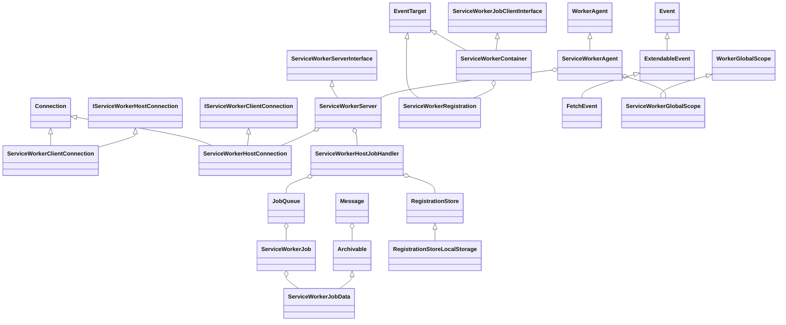
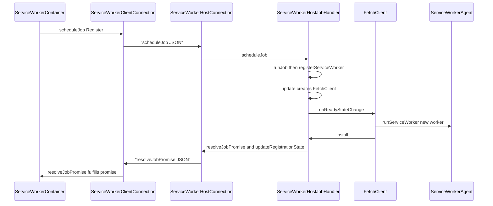

# Functional Requirements: modules-serviceworker

> **Relevant source files**
>
> - [src/core/modules/serviceworker/ServiceWorkerContainer.cpp](src:src/core/modules/serviceworker/ServiceWorkerContainer.cpp)
> - [src/core/modules/serviceworker/host/ServiceWorkerHostJobHandler.cpp](src:src/core/modules/serviceworker/host/ServiceWorkerHostJobHandler.cpp)
> - [src/core/modules/serviceworker/host/ServiceWorkerHostConnection.cpp](src:src/core/modules/serviceworker/host/ServiceWorkerHostConnection.cpp)
> - [src/core/modules/serviceworker/client/ServiceWorkerClientConnection.cpp](src:src/core/modules/serviceworker/client/ServiceWorkerClientConnection.cpp)
> - [src/core/modules/serviceworker/client/ServiceWorkerProcessManager.cpp](src:src/core/modules/serviceworker/client/ServiceWorkerProcessManager.cpp)
> - [src/core/modules/serviceworker/host/ServiceWorkerServer.cpp](src:src/core/modules/serviceworker/host/ServiceWorkerServer.cpp)
> - [src/core/modules/serviceworker/host/ServiceWorkerAgent.cpp](src:src/core/modules/serviceworker/host/ServiceWorkerAgent.cpp)
> - [src/core/modules/serviceworker/host/ServiceWorkerFetchJob.cpp](src:src/core/modules/serviceworker/host/ServiceWorkerFetchJob.cpp)
> - [src/core/modules/serviceworker/client/FetchEventHandler.cpp](src:src/core/modules/serviceworker/client/FetchEventHandler.cpp)
> - [src/core/modules/serviceworker/Message.cpp](src:src/core/modules/serviceworker/Message.cpp)
> - [src/core/modules/serviceworker/RegistrationStore.cpp](src:src/core/modules/serviceworker/RegistrationStore.cpp)
> - [src/core/modules/serviceworker/ConnectionInterface.h](src:src/core/modules/serviceworker/ConnectionInterface.h)

**Module**: [`ServiceWorkerContainer.cpp`](src:src/core/modules/serviceworker/ServiceWorkerContainer.cpp)
**Version**: 2026-09-10
**Linked Design Card**: [modules/modules-serviceworker.md](../modules/modules-serviceworker.md)
**Analysis basis**: AST export and direct source reading

## Overview

The module exposes `navigator.serviceWorker` as [`ServiceWorkerContainer`](src:src/core/modules/serviceworker/ServiceWorkerContainer.h#L51), which turns `register()`/`getRegistration()`/`unregister()` calls into [`ServiceWorkerJob`](src:src/core/modules/serviceworker/ServiceWorkerJob.h#L36) and [`ServiceWorkerRequest`](src:src/core/modules/serviceworker/ServiceWorkerRequest.h#L29) objects sent to a host over a socket [`Connection`](src:src/core/modules/worker/util/network/Connection.h#L31). On the host, [`ServiceWorkerHostJobHandler`](src:src/core/modules/serviceworker/host/ServiceWorkerHostJobHandler.h#L50) keeps one [`JobQueue`](src:src/core/modules/serviceworker/JobQueue.h#L32) per scope, runs the register → update → install → activate life-cycle, and runs worker scripts inside a [`ServiceWorkerGlobalScope`](src:src/core/modules/serviceworker/host/ServiceWorkerGlobalScope.h#L39) created by [`ServiceWorkerAgent::runServiceWorker`](src:src/core/modules/serviceworker/host/ServiceWorkerAgent.cpp#L138). Page resource loads are intercepted by [`ServiceWorkerFetchTask`](src:src/core/modules/serviceworker/client/ServiceWorkerFetchTask.h#L32) and answered through a [`FetchEvent`](src:src/core/modules/serviceworker/host/FetchEvent.h#L55) dispatched by [`ServiceWorkerFetchJob`](src:src/core/modules/serviceworker/host/ServiceWorkerFetchJob.h#L37).

## Functional Requirements

### FR-MODULES-SERVICEWORKER-001
**Register a service worker from a page**

| Item | Content |
|------|---------|
| **Description** | Accepts a script URL and optional `RegistrationOptions` (scope, type, updateViaCache), validates both URLs, builds a `Register` job and hands it to the host. |
| **Input** | `String* rawScriptURL`, [`RegistrationOptions`](src:src/core/modules/serviceworker/RegistrationOptions.h#L31) (`scope`, `m_type`, `m_updateViaCache`); the calling page's `ExecutionContext` as service worker environment. |
| **Output** | A `Promise*`; on success a [`ServiceWorkerJob`](src:src/core/modules/serviceworker/ServiceWorkerJob.h#L36) with generated `ServiceWorkerJobId`, `contextId`, `clientOrigin`, `referrerURL` is stored in `m_jobMap` and sent via `scheduleJob`; on validation failure the promise is rejected with a `DOMException`. |
| **Preconditions** | `STARFISH_WEBWORKER_NOT_HOST` build (otherwise `scheduleJob` is `STARFISH_UNSUPPORTED`, [`ServiceWorkerContainer.cpp`](src:src/core/modules/serviceworker/ServiceWorkerContainer.cpp#L284)). |
| **Postconditions** | Job is queued on the page message loop and sent with message name `scheduleJob` through the origin's connection ([`ServiceWorkerContainer::scheduleJob`](src:src/core/modules/serviceworker/ServiceWorkerContainer.cpp#L267)). |
| **Source** | [`ServiceWorkerContainer::registerServiceWorker`](src:src/core/modules/serviceworker/ServiceWorkerContainer.cpp#L87), [`ServiceWorkerContainer::startRegister`](src:src/core/modules/serviceworker/ServiceWorkerContainer.cpp#L129), [`ServiceWorkerContainer::createJob`](src:src/core/modules/serviceworker/ServiceWorkerContainer.cpp#L238) |

**Acceptance criteria**:
- [ ] An empty script URL rejects the promise with `SCRIPT_TYPE_ERR` and message "serviceWorker.register() cannot be called with an empty script URL" ([`ServiceWorkerContainer.cpp`](src:src/core/modules/serviceworker/ServiceWorkerContainer.cpp#L143)).
- [ ] A script or scope URL whose protocol is not HTTP(S) rejects with `SCRIPT_TYPE_ERR` ([`ServiceWorkerContainer.cpp`](src:src/core/modules/serviceworker/ServiceWorkerContainer.cpp#L159), [`ServiceWorkerContainer.cpp`](src:src/core/modules/serviceworker/ServiceWorkerContainer.cpp#L192)).
- [ ] A script or scope path containing `%2f` or `%5c` (case-insensitive) rejects with `SCRIPT_TYPE_ERR` ([`ServiceWorkerContainer.cpp`](src:src/core/modules/serviceworker/ServiceWorkerContainer.cpp#L172), [`ServiceWorkerContainer.cpp`](src:src/core/modules/serviceworker/ServiceWorkerContainer.cpp#L209)).
- [ ] When no scope is given, the scope defaults to `./` resolved against the script URL's base ([`ServiceWorkerContainer.cpp`](src:src/core/modules/serviceworker/ServiceWorkerContainer.cpp#L184)).
- [ ] The job carries `workerType` and `updateViaCacheMode` from the options ([`ServiceWorkerContainer.cpp`](src:src/core/modules/serviceworker/ServiceWorkerContainer.cpp#L225)).

### FR-MODULES-SERVICEWORKER-002
**Serialize jobs per scope on the host**

| Item | Content |
|------|---------|
| **Description** | Receives jobs from clients, places each in the `JobQueue` of its scope URL, and runs the first job asynchronously on the host message loop, dispatching by job type. |
| **Input** | [`ServiceWorkerJob`](src:src/core/modules/serviceworker/ServiceWorkerJob.h#L36) reconstructed from `ServiceWorkerJobData` with its host connection set ([`ServiceWorkerHostConnection.cpp`](src:src/core/modules/serviceworker/host/ServiceWorkerHostConnection.cpp#L192)). |
| **Output** | Invocation of `registerServiceWorker`, `update` or `unregisterServiceWorker` via an idler; for `Unregister` also `tryTerminate` on the server ([`ServiceWorkerHostJobHandler.cpp`](src:src/core/modules/serviceworker/host/ServiceWorkerHostJobHandler.cpp#L371)). |
| **Preconditions** | Job queue for the scope is empty. |
| **Postconditions** | `finishJob` dequeues the job and runs the next one if any ([`ServiceWorkerHostJobHandler::finishJob`](src:src/core/modules/serviceworker/host/ServiceWorkerHostJobHandler.cpp#L1185)). |
| **Source** | [`ServiceWorkerHostJobHandler::scheduleJob`](src:src/core/modules/serviceworker/host/ServiceWorkerHostJobHandler.cpp#L219), [`ServiceWorkerHostJobHandler::runJob`](src:src/core/modules/serviceworker/host/ServiceWorkerHostJobHandler.cpp#L339), [`JobQueue::enqueueJob`](src:src/core/modules/serviceworker/JobQueue.cpp#L32) |

**Acceptance criteria**:
- [ ] A new `JobQueue` is created the first time a scope URL is seen ([`ServiceWorkerHostJobHandler.cpp`](src:src/core/modules/serviceworker/host/ServiceWorkerHostJobHandler.cpp#L236)).
- [ ] Scheduling while the scope's queue is non-empty is reported as `STARFISH_UNSUPPORTED` ([`ServiceWorkerHostJobHandler.cpp`](src:src/core/modules/serviceworker/host/ServiceWorkerHostJobHandler.cpp#L256)).
- [ ] `runJob` never executes inline; it posts through [`ServiceWorkerHostJobHandler::queueTask`](src:src/core/modules/serviceworker/host/ServiceWorkerHostJobHandler.cpp#L389) to `MessageLoop::addIdler`.
- [ ] `finishJob` asserts the finished job is the queue head before dequeuing ([`ServiceWorkerHostJobHandler.cpp`](src:src/core/modules/serviceworker/host/ServiceWorkerHostJobHandler.cpp#L1198)).

### FR-MODULES-SERVICEWORKER-003
**Fetch the worker script and install a new worker**

| Item | Content |
|------|---------|
| **Description** | For a Register/Update job, reuses an equivalent existing registration or creates one, fetches the script as a `Script` destination request, creates a `ServiceWorkerData`, starts its global scope, fires `install`, and moves the worker to the waiting slot. |
| **Input** | Job data (`scopeURL`, `scriptURL`, `workerType`, `updateViaCacheMode`); existing [`ServiceWorkerRegistrationData`](src:src/core/modules/serviceworker/ServiceWorkerRegistrationData.h#L35) if any. |
| **Output** | Registration state transitions Installing → Waiting; worker state Installing → Installed; `resolveJobPromise` and `updatefound` broadcast to clients; `install` `ExtendableEvent` dispatched in the worker scope. |
| **Preconditions** | Registration exists for the scope (created by [`ServiceWorkerHostJobHandler::setRegistration`](src:src/core/modules/serviceworker/host/ServiceWorkerHostJobHandler.cpp#L312) if absent). |
| **Postconditions** | The new worker is `registration->waitingWorker()`; `finishJob` is called ([`ServiceWorkerHostJobHandler.cpp`](src:src/core/modules/serviceworker/host/ServiceWorkerHostJobHandler.cpp#L652)). |
| **Source** | [`ServiceWorkerHostJobHandler::registerServiceWorker`](src:src/core/modules/serviceworker/host/ServiceWorkerHostJobHandler.cpp#L396), [`ServiceWorkerHostJobHandler::update`](src:src/core/modules/serviceworker/host/ServiceWorkerHostJobHandler.cpp#L461), [`ServiceWorkerHostJobHandler::install`](src:src/core/modules/serviceworker/host/ServiceWorkerHostJobHandler.cpp#L534) |

**Acceptance criteria**:
- [ ] If the newest worker has the same `scriptURL`, `workerType` and `updateViaCacheMode`, the job is resolved with the existing registration without fetching ([`ServiceWorkerHostJobHandler.cpp`](src:src/core/modules/serviceworker/host/ServiceWorkerHostJobHandler.cpp#L409)).
- [ ] `update` on a missing registration rejects with `SCRIPT_TYPE_ERR` "Cannot update a null/nonexistent service worker registration" ([`ServiceWorkerHostJobHandler.cpp`](src:src/core/modules/serviceworker/host/ServiceWorkerHostJobHandler.cpp#L474)).
- [ ] An `Update` job whose newest worker has a different script URL rejects with `SCRIPT_TYPE_ERR` ([`ServiceWorkerHostJobHandler.cpp`](src:src/core/modules/serviceworker/host/ServiceWorkerHostJobHandler.cpp#L490)).
- [ ] The script fetch uses `RequestDestination::Script` and `RequestSyncLevel::NeverSync` ([`ServiceWorkerHostJobHandler.cpp`](src:src/core/modules/serviceworker/host/ServiceWorkerHostJobHandler.cpp#L512)); the new `ServiceWorkerData` receives `registrationId`, `clientContextId`, URLs and type, then [`ServiceWorkerAgent::runServiceWorker`](src:src/core/modules/serviceworker/host/ServiceWorkerAgent.cpp#L138) is called before `install` ([`ServiceWorkerHostJobHandler.cpp`](src:src/core/modules/serviceworker/host/ServiceWorkerHostJobHandler.cpp#L168)).
- [ ] `install` broadcasts `fireEventRequest(scriptURL, "updatefound")` to every connection ([`ServiceWorkerHostJobHandler.cpp`](src:src/core/modules/serviceworker/host/ServiceWorkerHostJobHandler.cpp#L588)) and dispatches an `install` event on the installing worker's global object ([`ServiceWorkerHostJobHandler.cpp`](src:src/core/modules/serviceworker/host/ServiceWorkerHostJobHandler.cpp#L616)).

### FR-MODULES-SERVICEWORKER-004
**Activate a waiting worker, including skipWaiting and waitUntil**

| Item | Content |
|------|---------|
| **Description** | Promotes the waiting worker to active when no active worker exists or when the active worker has no pending events and the waiting worker requested `skipWaiting`; fires `activate` and marks the worker `Activated`. |
| **Input** | A [`ServiceWorkerRegistrationData`](src:src/core/modules/serviceworker/ServiceWorkerRegistrationData.h#L35) with a waiting worker; `skipWaiting` flag on [`ServiceWorkerData.h`](src:src/core/modules/serviceworker/ServiceWorkerData.h#L107). |
| **Output** | Registration state `Active` set to the waiting worker, `Waiting` cleared; worker state `Activating` then `Activated`; `activate` `ExtendableEvent` dispatched. |
| **Preconditions** | `registration->waitingWorker() != nullptr`; active worker is not currently `Activating` ([`ServiceWorkerHostJobHandler.cpp`](src:src/core/modules/serviceworker/host/ServiceWorkerHostJobHandler.cpp#L681)). |
| **Postconditions** | Registration is persisted when it becomes Active ([`ServiceWorkerHostJobHandler.cpp`](src:src/core/modules/serviceworker/host/ServiceWorkerHostJobHandler.cpp#L1090)). |
| **Source** | [`ServiceWorkerHostJobHandler::tryActivate`](src:src/core/modules/serviceworker/host/ServiceWorkerHostJobHandler.cpp#L668), [`ServiceWorkerHostJobHandler::activate`](src:src/core/modules/serviceworker/host/ServiceWorkerHostJobHandler.cpp#L714), [`ServiceWorkerGlobalScope::skipWaiting`](src:src/core/modules/serviceworker/host/ServiceWorkerGlobalScope.cpp#L132), [`ExtendableEvent::waitUntil`](src:src/core/modules/serviceworker/host/ExtendableEvent.cpp#L43) |

**Acceptance criteria**:
- [ ] `skipWaiting()` sets `setSkipWaiting(true)` on the scope's worker data, calls `tryActivate` on its registration and fulfills the returned promise, all inside an `IdleTask` ([`ServiceWorkerGlobalScope.cpp`](src:src/core/modules/serviceworker/host/ServiceWorkerGlobalScope.cpp#L165)).
- [ ] `waitUntil()` throws `INVALID_STATE_ERR` if the event is not trusted or not active ([`ExtendableEvent.cpp`](src:src/core/modules/serviceworker/host/ExtendableEvent.cpp#L47)); each promise increments a pending count and, when the count returns to zero, `tryActivate` is invoked for the worker's registration ([`ExtendableEvent::enqueueWaitUntilMicrotask`](src:src/core/modules/serviceworker/host/ExtendableEvent.cpp#L87)).
- [ ] `activate` dispatches an `activate` event on the active worker's global object unless `shouldSkipEvent` returns true ([`ServiceWorkerHostJobHandler.cpp`](src:src/core/modules/serviceworker/host/ServiceWorkerHostJobHandler.cpp#L803)), then sets state `Activated` ([`ServiceWorkerHostJobHandler.cpp`](src:src/core/modules/serviceworker/host/ServiceWorkerHostJobHandler.cpp#L829)).

### FR-MODULES-SERVICEWORKER-005
**Unregister a registration and terminate the host when idle**

| Item | Content |
|------|---------|
| **Description** | Processes an `Unregister` job: checks origin, marks the registration uninstalling, removes it from persistent storage, resolves the promise, and clears the registration if no client uses it. |
| **Input** | Job with `scopeURL` and `clientOrigin` ([`ServiceWorkerJobData`](src:src/core/modules/serviceworker/ServiceWorkerJobData.h#L29)); created on the page by [`ServiceWorkerRegistration::unregister`](src:src/core/modules/serviceworker/ServiceWorkerRegistration.cpp#L129). |
| **Output** | `resolveJobPromise(job, registration)` or `(job, nullptr)`; workers terminated and marked `Redundant`; registration erased from `m_scopeToRegistrationMap`. |
| **Preconditions** | `clientOrigin` equals the scope URL's origin. |
| **Postconditions** | After the job, [`ServiceWorkerServer::tryTerminate`](src:src/core/modules/serviceworker/host/ServiceWorkerServer.cpp#L145) destroys the server if the registration map is empty. |
| **Source** | [`ServiceWorkerHostJobHandler::unregisterServiceWorker`](src:src/core/modules/serviceworker/host/ServiceWorkerHostJobHandler.cpp#L1125), [`ServiceWorkerHostJobHandler::tryClearRegistration`](src:src/core/modules/serviceworker/host/ServiceWorkerHostJobHandler.cpp#L873), [`ServiceWorkerHostJobHandler::clearRegistration`](src:src/core/modules/serviceworker/host/ServiceWorkerHostJobHandler.cpp#L918) |

**Acceptance criteria**:
- [ ] Mismatched origin rejects with `SECURITY_ERR` "Script origin does not match the registering client's origin" ([`ServiceWorkerHostJobHandler.cpp`](src:src/core/modules/serviceworker/host/ServiceWorkerHostJobHandler.cpp#L1142)).
- [ ] Unknown scope resolves the promise with `nullptr` registration ([`ServiceWorkerHostJobHandler.cpp`](src:src/core/modules/serviceworker/host/ServiceWorkerHostJobHandler.cpp#L1159)).
- [ ] `tryClearRegistration` returns false while any client id maps to the registration or any worker has pending events ([`ServiceWorkerHostJobHandler.cpp`](src:src/core/modules/serviceworker/host/ServiceWorkerHostJobHandler.cpp#L883)).
- [ ] `clearRegistration` terminates installing/waiting/active workers, sets each to `Redundant`, nulls the corresponding registration slot and erases the scope ([`ServiceWorkerHostJobHandler.cpp`](src:src/core/modules/serviceworker/host/ServiceWorkerHostJobHandler.cpp#L927)).
- [ ] `tryTerminate` returns false and leaves the server running while registrations remain ([`ServiceWorkerServer.cpp`](src:src/core/modules/serviceworker/host/ServiceWorkerServer.cpp#L164)).

### FR-MODULES-SERVICEWORKER-006
**Propagate registration and worker state to page objects**

| Item | Content |
|------|---------|
| **Description** | Broadcasts registration-slot changes, worker state changes, and named events from the host to every connected client; the client applies them to `ServiceWorkerRegistration`/`ServiceWorker` objects and fires `statechange`/`updatefound` DOM events. |
| **Input** | Host: `updateRegistrationState(registration, target, source)`, `updateWorkerState(worker, state)`, `fireEventRequest(scriptURL, eventName)`. Client: messages `updateRegistrationState`, `updateWorkerState`, `fireEventRequest`. |
| **Output** | On the page: `registration->setInstallingWorker/WaitingWorker/ActiveWorker`, `registrationObject->updateRegistrationState`; `workerObj->data()->state = state` and a `statechange` event; the named event dispatched on every registration object. |
| **Preconditions** | Client has active global scopes whose base URI matches the worker script origin ([`ServiceWorkerProcessManager::getSettingsObjects`](src:src/core/modules/serviceworker/client/ServiceWorkerProcessManager.cpp#L276)). |
| **Postconditions** | Page-side work is queued on the page message loop via `addIdler` ([`ServiceWorkerClientConnection.cpp`](src:src/core/modules/serviceworker/client/ServiceWorkerClientConnection.cpp#L285)). |
| **Source** | [`ServiceWorkerHostJobHandler::updateRegistrationState`](src:src/core/modules/serviceworker/host/ServiceWorkerHostJobHandler.cpp#L1017), [`ServiceWorkerHostJobHandler::updateWorkerState`](src:src/core/modules/serviceworker/host/ServiceWorkerHostJobHandler.cpp#L1099), [`ServiceWorkerClientConnection::updateRegistrationState`](src:src/core/modules/serviceworker/client/ServiceWorkerClientConnection.cpp#L249), [`ServiceWorkerClientConnection::updateWorkerState`](src:src/core/modules/serviceworker/client/ServiceWorkerClientConnection.cpp#L362), [`ServiceWorkerClientConnection::fireEventRequest`](src:src/core/modules/serviceworker/client/ServiceWorkerClientConnection.cpp#L441) |

**Acceptance criteria**:
- [ ] Every state change is sent to all connections returned by `getConnections` ([`ServiceWorkerHostJobHandler.cpp`](src:src/core/modules/serviceworker/host/ServiceWorkerHostJobHandler.cpp#L1116)).
- [ ] `updateWorkerState` on the client aborts silently when the settings object has no active service worker ([`ServiceWorkerClientConnection.cpp`](src:src/core/modules/serviceworker/client/ServiceWorkerClientConnection.cpp#L413)); otherwise it fires `statechange` via `dispatchEventByUA` ([`ServiceWorkerClientConnection.cpp`](src:src/core/modules/serviceworker/client/ServiceWorkerClientConnection.cpp#L432)).
- [ ] `updateRegistrationState` on the client matches by `registration->id` and stops after the first match ([`ServiceWorkerClientConnection.cpp`](src:src/core/modules/serviceworker/client/ServiceWorkerClientConnection.cpp#L312)); an unknown target state triggers `STARFISH_RELEASE_ASSERT_SHOULD_NOT_BE_HERE` ([`ServiceWorkerClientConnection.cpp`](src:src/core/modules/serviceworker/client/ServiceWorkerClientConnection.cpp#L348)).
- [ ] When the registration becomes Active on the page, [`ServiceWorkerRegistration::updateRegistrationState`](src:src/core/modules/serviceworker/ServiceWorkerRegistration.cpp#L79) starts the fetch event handler for the scope ([`ServiceWorkerRegistration::handleTaskSource`](src:src/core/modules/serviceworker/ServiceWorkerRegistration.cpp#L181)).

### FR-MODULES-SERVICEWORKER-007
**Resolve getRegistration by longest matching scope**

| Item | Content |
|------|---------|
| **Description** | Answers `navigator.serviceWorker.getRegistration(clientURL)` by asking the host for the registration whose scope is the longest prefix of the client URL, then fulfills the promise with a `ServiceWorkerRegistration` or `undefined`. |
| **Input** | `String* rawClientURL` (resolved against the page base URL); a [`ServiceWorkerRequest`](src:src/core/modules/serviceworker/ServiceWorkerRequest.h#L29) named `matchRegistration` with a [`RequestTask`](src:src/core/modules/serviceworker/ServiceWorkerRequest.h#L53) continuation. |
| **Output** | Host: `resolveRequest(request, registration-or-null)`; client: promise fulfilled with a new `ServiceWorkerRegistration` carrying the data, or `scriptUndefined()`. |
| **Preconditions** | Client URL is same-origin with the page ([`ServiceWorkerContainer.cpp`](src:src/core/modules/serviceworker/ServiceWorkerContainer.cpp#L329)). |
| **Postconditions** | The request is found again by `request->id` in the container's `m_requestMap` when the reply arrives ([`ServiceWorkerClientConnection.cpp`](src:src/core/modules/serviceworker/client/ServiceWorkerClientConnection.cpp#L179)). |
| **Source** | [`ServiceWorkerContainer::getRegistration`](src:src/core/modules/serviceworker/ServiceWorkerContainer.cpp#L292), [`ServiceWorkerContainer::matchRegistration`](src:src/core/modules/serviceworker/ServiceWorkerContainer.cpp#L431), [`ServiceWorkerHostJobHandler::matchRegistration`](src:src/core/modules/serviceworker/host/ServiceWorkerHostJobHandler.cpp#L1209) |

**Acceptance criteria**:
- [ ] Empty client URL rejects with `SCRIPT_TYPE_ERR`; cross-origin client URL rejects with `SECURITY_ERR` "Origin of clientURL is not client's origin" ([`ServiceWorkerContainer.cpp`](src:src/core/modules/serviceworker/ServiceWorkerContainer.cpp#L311), [`ServiceWorkerContainer.cpp`](src:src/core/modules/serviceworker/ServiceWorkerContainer.cpp#L331)).
- [ ] The host picks the registration key that is a prefix of the client URL and has the greatest length ([`ServiceWorkerHostJobHandler.cpp`](src:src/core/modules/serviceworker/host/ServiceWorkerHostJobHandler.cpp#L1230)), and returns `nullptr` if that registration is uninstalling ([`ServiceWorkerHostJobHandler.cpp`](src:src/core/modules/serviceworker/host/ServiceWorkerHostJobHandler.cpp#L1266)).
- [ ] `getRegistrations()` is not implemented: it is `STARFISH_UNSUPPORTED` and fulfills with an empty array ([`ServiceWorkerContainer::getRegistrations`](src:src/core/modules/serviceworker/ServiceWorkerContainer.cpp#L390)).

### FR-MODULES-SERVICEWORKER-008
**Establish the host process/thread and its socket connection**

| Item | Content |
|------|---------|
| **Description** | On first use per origin, the client starts the service worker host (separate process or in-process thread), then opens a pair-protocol socket to the host's `ipc://` address; the host binds the same address and registers its connection with the I/O runnable. |
| **Input** | Serialized origin string; build flags `STARFISH_USE_WORKER_PROCESS`, `SERVICE_WORKER_USE_SINGLE_HOST_CONNECTION`; optional embedder executor from [`WorkerSettings::serviceWorkerProcessExecutor`](src:src/core/modules/worker/WorkerSettings.h#L34). |
| **Output** | A connected [`ServiceWorkerClientConnection`](src:src/core/modules/serviceworker/client/ServiceWorkerClientConnection.h#L36) stored in `ProcessData` per origin; on the host a bound [`ServiceWorkerHostConnection`](src:src/core/modules/serviceworker/host/ServiceWorkerHostConnection.h#L38). |
| **Preconditions** | [`ServiceWorkerProcessManager::init`](src:src/core/modules/serviceworker/client/ServiceWorkerProcessManager.cpp#L89) has run (creates `WorkerIPCAddress`, `PushServiceAgent`, `RegistrationManager`). |
| **Postconditions** | Subsequent `getConnection` calls for the same origin reuse the stored connection ([`ServiceWorkerProcessManager.cpp`](src:src/core/modules/serviceworker/client/ServiceWorkerProcessManager.cpp#L245)). |
| **Source** | [`ServiceWorkerProcessManager::getConnection`](src:src/core/modules/serviceworker/client/ServiceWorkerProcessManager.cpp#L188), [`ServiceWorkerProcessManager::startWorkerOnThread`](src:src/core/modules/serviceworker/client/ServiceWorkerProcessManager.cpp#L123), [`ServiceWorkerServer::start`](src:src/core/modules/serviceworker/host/ServiceWorkerServer.cpp#L83), [`ServiceWorkerAgent`](src:src/core/modules/serviceworker/host/ServiceWorkerAgent.cpp#L71) |

**Acceptance criteria**:
- [ ] Under `STARFISH_USE_WORKER_PROCESS`, if no embedder executor is set and no IPC handle file exists, `./Starfish-serviceworker --debug-worker=<DEBUG_WORKER>` is launched with [`ProcessUtil::launchProcess`](src:src/platform/process/base/Process.cpp#L43) ([`ServiceWorkerProcessManager.cpp`](src:src/core/modules/serviceworker/client/ServiceWorkerProcessManager.cpp#L229)); an executor failure logs "Fail to launch Service Worker process" ([`ServiceWorkerProcessManager.cpp`](src:src/core/modules/serviceworker/client/ServiceWorkerProcessManager.cpp#L220)).
- [ ] Without `STARFISH_USE_WORKER_PROCESS`, a detached thread creates a `ServiceWorkerAgent` and pumps a `MessageQueue` with a 500 ms poll until the stop future is set ([`ServiceWorkerProcessManager.cpp`](src:src/core/modules/serviceworker/client/ServiceWorkerProcessManager.cpp#L121), [`ServiceWorkerProcessManager::destroy`](src:src/core/modules/serviceworker/client/ServiceWorkerProcessManager.cpp#L113)).
- [ ] The connection name is `"ipc"` under `SERVICE_WORKER_USE_SINGLE_HOST_CONNECTION`, otherwise the Base64-encoded origin ([`ServiceWorkerProcessManager.cpp`](src:src/core/modules/serviceworker/client/ServiceWorkerProcessManager.cpp#L198)); the host's origin-specific `start(programOptions)` also Base64-encodes `origin` ([`ServiceWorkerServer.cpp`](src:src/core/modules/serviceworker/host/ServiceWorkerServer.cpp#L96)).
- [ ] The host constructor acquires the IPC handle directory and creates the server; `destroy` releases it ([`ServiceWorkerAgent.cpp`](src:src/core/modules/serviceworker/host/ServiceWorkerAgent.cpp#L85), [`ServiceWorkerAgent::destroy`](src:src/core/modules/serviceworker/host/ServiceWorkerAgent.cpp#L103)).
- [ ] On window teardown the client sends `updateServiceWorkerClient` with `Unregister` unless `--leave-ipc-handle` is set ([`ServiceWorkerProcessManager::deregisterActiveGlobalScope`](src:src/core/modules/serviceworker/client/ServiceWorkerProcessManager.cpp#L344)).

### FR-MODULES-SERVICEWORKER-009
**Intercept page resource requests with fetch events**

| Item | Content |
|------|---------|
| **Description** | For pages whose scope has an activated registration, forwards each resource request to the host as a `fetchEvent`; the host dispatches a `FetchEvent` to the worker, collects the `respondWith` response, writes it to a file and returns the path; the page reads the file into the resource request. |
| **Input** | `ResourceRequest*` (URL, base URL, destination, method, headers) → [`FetchEventRequestData`](src:src/core/modules/serviceworker/FetchEventData.h#L34); response → [`FetchEventResponseData`](src:src/core/modules/serviceworker/FetchEventData.h#L65) (`isSuccessful`, `isCached`, `cachePath`, `responsePath`). |
| **Output** | `ServiceWorkerFetchTask::request` returns true when the request is handled by the worker; `onResponse` fills the resource request and calls `handleResponseEOF`, or `handleError` on failure. |
| **Preconditions** | A `FetchEventHandler` exists for the page global scope and was started with a connection and scope ([`FetchEventHandler::start`](src:src/core/modules/serviceworker/client/FetchEventHandler.cpp#L49)); `fetchFromServiceWorker` is true ([`ServiceWorkerProcessManager.cpp`](src:src/core/modules/serviceworker/client/ServiceWorkerProcessManager.cpp#L331)). |
| **Postconditions** | The fetch task is erased from `m_fetchTaskMap` after the response ([`FetchEventHandler.cpp`](src:src/core/modules/serviceworker/client/FetchEventHandler.cpp#L87)); non-cached temporary response files are removed after reading ([`ServiceWorkerFetchTask.cpp`](src:src/core/modules/serviceworker/client/ServiceWorkerFetchTask.cpp#L96)). |
| **Source** | [`ServiceWorkerFetchTask::request`](src:src/core/modules/serviceworker/client/ServiceWorkerFetchTask.cpp#L58), [`FetchEventHandler::addFetch`](src:src/core/modules/serviceworker/client/FetchEventHandler.cpp#L33), [`ServiceWorkerHostJobHandler::handleFetch`](src:src/core/modules/serviceworker/host/ServiceWorkerHostJobHandler.cpp#L1304), [`ServiceWorkerFetchJob::handleFetch`](src:src/core/modules/serviceworker/host/ServiceWorkerFetchJob.cpp#L50), [`FetchEvent::respondWith`](src:src/core/modules/serviceworker/host/FetchEvent.cpp#L44) |

**Acceptance criteria**:
- [ ] Requests issued before the handler is started are buffered in `m_pendingTasks` and sent when `start` runs ([`FetchEventHandler.cpp`](src:src/core/modules/serviceworker/client/FetchEventHandler.cpp#L37)).
- [ ] Each task gets a monotonically increasing `fetchTaskId` ([`FetchEventHandler::fetchTaskId`](src:src/core/modules/serviceworker/client/FetchEventHandler.cpp#L101)) which is echoed back in the response and used to find the task ([`FetchEventHandler::respondFetchEvent`](src:src/core/modules/serviceworker/client/FetchEventHandler.cpp#L71)).
- [ ] The host returns `nullptr` (no interception) for `Embed`/`Object` destinations ([`ServiceWorkerFetchJob.cpp`](src:src/core/modules/serviceworker/host/ServiceWorkerFetchJob.cpp#L72)); the dispatched event is cancelable and carries request, preloadResponse, clientId and handled promise ([`ServiceWorkerFetchJob.cpp`](src:src/core/modules/serviceworker/host/ServiceWorkerFetchJob.cpp#L121)).
- [ ] `respondWith` throws `INVALID_STATE_ERR` if called before dispatch or a second time ([`FetchEvent.cpp`](src:src/core/modules/serviceworker/host/FetchEvent.cpp#L46)); a non-`Response` result sets `respondWithError` ([`FetchEvent.cpp`](src:src/core/modules/serviceworker/host/FetchEvent.cpp#L114)).
- [ ] `failJob` rejects the handled promise with `NETWORK_ERR` and sends `isSuccessful = false` ([`ServiceWorkerFetchJob::failJob`](src:src/core/modules/serviceworker/host/ServiceWorkerFetchJob.cpp#L175)); `successJob` writes a non-cached response into a `temp` cache directory and reports `responsePath`, or reports `cachePath` with `isCached = true` ([`ServiceWorkerFetchJob::successJob`](src:src/core/modules/serviceworker/host/ServiceWorkerFetchJob.cpp#L192)).
- [ ] Unknown global scope or fetch task ids are logged with `STARFISH_LOG_WARN` and dropped ([`ServiceWorkerHostJobHandler.cpp`](src:src/core/modules/serviceworker/host/ServiceWorkerHostJobHandler.cpp#L1313), [`FetchEventHandler.cpp`](src:src/core/modules/serviceworker/client/FetchEventHandler.cpp#L77)).

### FR-MODULES-SERVICEWORKER-010
**Persist registrations and scripts and restart workers from disk**

| Item | Content |
|------|---------|
| **Description** | Stores each activated registration and its main script under the service worker data directory, keeps an index file, and on the client side uses that index to restart the worker context for a page whose scope is already registered. |
| **Input** | [`ServiceWorkerRegistrationData`](src:src/core/modules/serviceworker/ServiceWorkerRegistrationData.h#L35), scope, script URL and script text; root path from [`StoragePathProvider::getServiceWorkerDataDirectoryPath`](src:src/StoragePathProvider.h#L33). |
| **Output** | Files `<root>/<scopeHash>/registration` (a `Message("registration")` JSON), `<root>/<scopeHash>/script`, and `<root>/registrationList` (JSON array of [`RegistrationStoreData`](src:src/core/modules/serviceworker/RegistrationStore.h#L34)). |
| **Preconditions** | Host: `m_registrationStore->load` fills the scope map at start-up ([`ServiceWorkerHostJobHandler.cpp`](src:src/core/modules/serviceworker/host/ServiceWorkerHostJobHandler.cpp#L216)). Client: `RegistrationManager` loaded the list ([`RegistrationManager.cpp`](src:src/core/modules/serviceworker/client/RegistrationManager.cpp#L34)). |
| **Postconditions** | A page in a registered scope triggers `startServiceWorkerContext` and the host runs the worker with `forceBypassCache = true`, loading the script from the store ([`ServiceWorkerScriptController::loadJavaScriptFromCache`](src:src/core/modules/serviceworker/host/ServiceWorkerScriptController.cpp#L93)). |
| **Source** | [`RegistrationStoreLocalStorage::add`](src:src/core/modules/serviceworker/RegistrationStore.cpp#L177), [`RegistrationStoreLocalStorage::saveWorkerScripts`](src:src/core/modules/serviceworker/RegistrationStore.cpp#L247), [`RegistrationStoreLocalStorage::loadRegistrationList`](src:src/core/modules/serviceworker/RegistrationStore.cpp#L89), [`RegistrationManager::startRegisteredServiceWorkerContext`](src:src/core/modules/serviceworker/client/RegistrationManager.cpp#L54) |

**Acceptance criteria**:
- [ ] The store names are `registration` and `script` ([`RegistrationStore.cpp`](src:src/core/modules/serviceworker/RegistrationStore.cpp#L36)); the per-scope directory is `<root>/<scope hash>` ([`RegistrationStoreLocalStorage::getInstalledSWDirPath`](src:src/core/modules/serviceworker/RegistrationStore.cpp#L303)); the list path is `<root>/registrationList` ([`RegistrationStoreLocalStorage::updateListPath`](src:src/core/modules/serviceworker/RegistrationStore.cpp#L332)).
- [ ] `remove` deletes the registration file, drops the entry and rewrites the list ([`RegistrationStoreLocalStorage::remove`](src:src/core/modules/serviceworker/RegistrationStore.cpp#L225)).
- [ ] `loadWorkerScript` returns no value when the scope is unknown or the script file is missing ([`RegistrationStoreLocalStorage::loadWorkerScript`](src:src/core/modules/serviceworker/RegistrationStore.cpp#L277)); `loadJavaScriptFromCache` maps that to `ScriptLoadResult::FileError` and an evaluation failure to `ScriptError` ([`ServiceWorkerScriptController.cpp`](src:src/core/modules/serviceworker/host/ServiceWorkerScriptController.cpp#L98)).
- [ ] On the client, `registerActiveGlobalScope` checks `isActivatedRegistration(scope)` and, if true, obtains the connection, sends `startServiceWorkerContext` and starts the fetch handler ([`ServiceWorkerProcessManager.cpp`](src:src/core/modules/serviceworker/client/ServiceWorkerProcessManager.cpp#L323)).

### FR-MODULES-SERVICEWORKER-011
**Serialize messages as typed JSON objects**

| Item | Content |
|------|---------|
| **Description** | Encodes a named message with a list of `Archivable` parameters into JSON and decodes it back, reconstructing each parameter's concrete type from an `_archiveId` tag. |
| **Input** | Message name (`const char*`) and up to N `Archivable*` params (the client helper accepts two, [`ServiceWorkerClientConnection::sendMessage`](src:src/core/modules/serviceworker/client/ServiceWorkerClientConnection.cpp#L119)). |
| **Output** | JSON object `{ "name", "params": [ { "_archiveId", ...fields } ] }` written through `JsonWriter` and sent with a trailing NUL (`GetSize() + 1`, [`ServiceWorkerHostConnection.cpp`](src:src/core/modules/serviceworker/host/ServiceWorkerHostConnection.cpp#L74)); on read, new instances of the registered types. |
| **Preconditions** | `Message::init` installed `Message::archive` as the archiver's archivable handler ([`Message::init`](src:src/core/modules/serviceworker/Message.cpp#L110)) — called by both [`ServiceWorkerServer.cpp`](src:src/core/modules/serviceworker/host/ServiceWorkerServer.cpp#L72) and [`ServiceWorkerProcessManager::init`](src:src/core/modules/serviceworker/client/ServiceWorkerProcessManager.cpp#L94). |
| **Postconditions** | `Message::param(i)` yields the reconstructed object; the caller downcasts by message name. |
| **Source** | [`Message::archive`](src:src/core/modules/serviceworker/Message.cpp#L76), [`Message::archive`](src:src/core/modules/serviceworker/Message.cpp#L142), [`Archivable`](src:src/core/util/Archivable.h#L28) |

**Acceptance criteria**:
- [ ] A null parameter is written as `_archiveId = TypeName::Null` and read back as `nullptr` ([`Message.cpp`](src:src/core/modules/serviceworker/Message.cpp#L154)); objects without `_archiveId` are skipped on read ([`Message.cpp`](src:src/core/modules/serviceworker/Message.cpp#L149)).
- [ ] `TypeName::String` and `TypeName::Integer` map to `StringArchivable` / `IntegerArchivable` ([`Message.cpp`](src:src/core/modules/serviceworker/Message.cpp#L172)).
- [ ] The registered types are exactly: `ServiceWorkerRequest`, `ServiceWorkerJobData`, `ServiceWorkerRegistrationData`, `ServiceWorkerData`, `ExceptionData`, `UpdateRegistrationState`, `UpdateWorkerStateData`, `ContextRequestData`, `FetchEventRequestData`, `FetchEventResponseData` ([`Message.cpp`](src:src/core/modules/serviceworker/Message.cpp#L192)); an unknown id logs an error and leaves the slot unarchived ([`Message.cpp`](src:src/core/modules/serviceworker/Message.cpp#L205)).
- [ ] `ServiceWorkerJobData` archives `id`, `contextId`, `type`, `workerType`, `updateViaCacheMode`, `scopeURL`, `scriptURL`, `referrerURL`, `clientOrigin` ([`ServiceWorkerJobData::archive`](src:src/core/modules/serviceworker/ServiceWorkerJobData.cpp#L37)); `ServiceWorkerRegistrationData` archives nested `installingWorker`/`waitingWorker`/`activeWorker` ([`ServiceWorkerRegistrationData.cpp`](src:src/core/modules/serviceworker/ServiceWorkerRegistrationData.cpp#L69)).

### FR-MODULES-SERVICEWORKER-012
**Provide cache storage inside the worker scope**

| Item | Content |
|------|---------|
| **Description** | Loads a JavaScript cache polyfill into every service worker global scope and backs it with native operations (`open`, `put`, `matchAll`, `cache_storage_keys`) that read and write response files under the service worker data directory. |
| **Input** | Cache name, `Request`/`Response` objects, `RequestInfo`; optional `CACHE_MODULE_PATH` global option pointing to an external polyfill file. |
| **Output** | Promises fulfilled with a wrapped `FetchCacheStream`, `undefined`, an array of matched responses, or an array of cache names; files `<root>/<origin hash>/<cacheName>/<url hash>`. |
| **Preconditions** | `CachePolyfillLoader::load` succeeded during [`ServiceWorkerGlobalScope::initCacheStorage`](src:src/core/modules/serviceworker/host/ServiceWorkerGlobalScope.cpp#L83) (failure is a release assertion). |
| **Postconditions** | Each native operation runs as an `IdleTask` subclass whose `end` fulfills or rejects the promise ([`Internal.cpp`](src:src/core/modules/serviceworker/host/Internal.cpp#L53)). |
| **Source** | [`CachePolyfillLoader::load`](src:src/core/modules/serviceworker/cache/CachePolyfillLoader.cpp#L74), [`Internal::open`](src:src/core/modules/serviceworker/host/Internal.cpp#L124), [`Internal::matchAll`](src:src/core/modules/serviceworker/host/Internal.cpp#L204), [`Internal::cache_storage_keys`](src:src/core/modules/serviceworker/host/Internal.cpp#L268), [`FetchCacheStream::open`](src:src/core/modules/serviceworker/FetchCacheStream.cpp#L84) |

**Acceptance criteria**:
- [ ] Without `CACHE_MODULE_PATH` the embedded `s_js2c_cache_min_js` is evaluated; with it the file is read and evaluated, and a read or evaluation failure logs an error and returns false ([`CachePolyfillLoader.cpp`](src:src/core/modules/serviceworker/cache/CachePolyfillLoader.cpp#L80)).
- [ ] `FetchCacheStream::open` rejects an empty cache name and creates `<root>/<originHash>/<cacheName>` ([`FetchCacheStream.cpp`](src:src/core/modules/serviceworker/FetchCacheStream.cpp#L87)).
- [ ] `cache_storage_keys` lists the sub-directories of `<root>/<url hash>` as cache names ([`FetchCacheStream::getKeys`](src:src/core/modules/serviceworker/FetchCacheStream.cpp#L204)).
- [ ] The worker scope also exposes a local-storage backed `CustomStorage` ([`ServiceWorkerGlobalScope::workerStorage`](src:src/core/modules/serviceworker/host/ServiceWorkerGlobalScope.cpp#L75)).

## Non-Functional Requirements

| Item | Requirement | Source |
|------|-------------|--------|
| Performance | JSON was deliberately chosen over a binary format because life-cycle messaging is stated to be not performance-sensitive; a binary/IDL approach is noted for future fetch/cache traffic. Fetch responses are transferred by file path rather than inline. | [`Message.cpp`](src:src/core/modules/serviceworker/Message.cpp#L79), [`ServiceWorkerFetchJob.cpp`](src:src/core/modules/serviceworker/host/ServiceWorkerFetchJob.cpp#L205) |
| Performance | In-thread host mode polls its queue with a 500 ms timeout (`kMessageQueueTimeout`) and checks the stop future for 1 ms per iteration. | [`ServiceWorkerProcessManager.cpp`](src:src/core/modules/serviceworker/client/ServiceWorkerProcessManager.cpp#L121) |
| Security | `register()` requires HTTP(S) script and scope URLs and rejects `%2f`/`%5c` path segments; `getRegistration()` requires same-origin client URL; `unregister` requires the job's client origin to equal the scope origin. | [`ServiceWorkerContainer::startRegister`](src:src/core/modules/serviceworker/ServiceWorkerContainer.cpp#L129), [`ServiceWorkerContainer.cpp`](src:src/core/modules/serviceworker/ServiceWorkerContainer.cpp#L329), [`ServiceWorkerHostJobHandler.cpp`](src:src/core/modules/serviceworker/host/ServiceWorkerHostJobHandler.cpp#L1139) |
| Security | Fetch event request headers are made immutable before dispatch. | [`ServiceWorkerFetchJob.cpp`](src:src/core/modules/serviceworker/host/ServiceWorkerFetchJob.cpp#L119) |
| Error handling | Host-side failures are returned to the page as `ExceptionData` (a `DOMException::Code` plus message) and rejected on the job promise; unknown message names assert; unknown archive ids and missing fetch tasks/global scopes are logged and ignored. | [`ExceptionData`](src:src/core/modules/serviceworker/ExceptionData.h#L27), [`ServiceWorkerContainer::rejectJobPromise`](src:src/core/modules/serviceworker/ServiceWorkerContainer.cpp#L565), [`ServiceWorkerHostConnection.cpp`](src:src/core/modules/serviceworker/host/ServiceWorkerHostConnection.cpp#L214) |
| Error handling | Messages received while the server is terminating are dropped (a TODO notes that a reject should be sent). | [`ServiceWorkerHostConnection.cpp`](src:src/core/modules/serviceworker/host/ServiceWorkerHostConnection.cpp#L171) |
| Logging | `TRACE_SCOPE`/`TRACE` with channels `HOST`, `CLIENT`, `SVCWORKER`, `IPC`, `CACHE`, `INTERNAL`; `STARFISH_LOG_ERROR`/`STARFISH_LOG_WARN` for launch, archive, store and fetch failures. | [`ServiceWorkerHostConnection.cpp`](src:src/core/modules/serviceworker/host/ServiceWorkerHostConnection.cpp#L188), [`ServiceWorkerProcessManager.cpp`](src:src/core/modules/serviceworker/client/ServiceWorkerProcessManager.cpp#L220), [`RegistrationStore.cpp`](src:src/core/modules/serviceworker/RegistrationStore.cpp#L104) |

## Constraints

- The whole module is compiled only when `STARFISH_ENABLE_SERVICE_WORKER` is defined; `host/` additionally requires `STARFISH_WEBWORKER_HOST` ([`ServiceWorkerServer.h`](src:src/core/modules/serviceworker/host/ServiceWorkerServer.h#L20)); `Connection` itself requires `STARFISH_USE_WORKER_PROCESS` ([`Connection.h`](src:src/core/modules/worker/util/network/Connection.h#L20)). The build sets these in [`config.cmake`](src:build/config.cmake#L394) and [`worker.cmake`](src:build/worker.cmake#L36).
- Only one job may be pending per scope queue ([`ServiceWorkerHostJobHandler.cpp`](src:src/core/modules/serviceworker/host/ServiceWorkerHostJobHandler.cpp#L256)).
- Comments state Starfish is not used with multiple execution contexts, so state broadcasts assume a single settings object per origin ([`ServiceWorkerClientConnection.cpp`](src:src/core/modules/serviceworker/client/ServiceWorkerClientConnection.cpp#L265)).
- `getRegistrations()`, `ServiceWorkerGlobalScope::serviceWorker()` and scheduling jobs on the host side are `STARFISH_UNSUPPORTED` ([`ServiceWorkerContainer.cpp`](src:src/core/modules/serviceworker/ServiceWorkerContainer.cpp#L404), [`ServiceWorkerGlobalScope.cpp`](src:src/core/modules/serviceworker/host/ServiceWorkerGlobalScope.cpp#L114), [`ServiceWorkerContainer.cpp`](src:src/core/modules/serviceworker/ServiceWorkerContainer.cpp#L284)).
- `shouldSkipEvent` and `serviceWorkerHasNoPendingEvents` currently always return true ([`ServiceWorkerHostJobHandler.cpp`](src:src/core/modules/serviceworker/host/ServiceWorkerHostJobHandler.cpp#L832), [`ServiceWorkerHostJobHandler.cpp`](src:src/core/modules/serviceworker/host/ServiceWorkerHostJobHandler.cpp#L849)); `abortServiceWorkerScript` only asserts its argument ([`ServiceWorkerAgent::abortServiceWorkerScript`](src:src/core/modules/serviceworker/host/ServiceWorkerAgent.cpp#L241)).
- Every worker is created with locale `"ko-KR"` and time zone `"Asia/Seoul"` ([`ServiceWorkerAgent.cpp`](src:src/core/modules/serviceworker/host/ServiceWorkerAgent.cpp#L151)).
- Notification and push sub-features are gated by `STARFISH_ENABLE_SERVICE_WORKER_NOTIFICATION` ([`Notification.h`](src:src/core/modules/serviceworker/notification/Notification.h#L20)) and exposed through [`PushManager`](src:src/core/modules/serviceworker/push/PushManager.h#L33) / [`PushServiceAgent`](src:src/core/modules/serviceworker/push/PushServiceAgent.h#L33).

## Module Design Card Linkage

| FR | Implementation | Design Card section |
|----|----------------|---------------------|
| FR-MODULES-SERVICEWORKER-001 | [`ServiceWorkerContainer::startRegister`](src:src/core/modules/serviceworker/ServiceWorkerContainer.cpp#L129) | [Key Flow](../modules/modules-serviceworker.md#key-flow), [Public Interface](../modules/modules-serviceworker.md#public-interface) |
| FR-MODULES-SERVICEWORKER-002 | [`ServiceWorkerHostJobHandler::scheduleJob`](src:src/core/modules/serviceworker/host/ServiceWorkerHostJobHandler.cpp#L219) | [Architectural Rules](../modules/modules-serviceworker.md#architectural-rules) |
| FR-MODULES-SERVICEWORKER-003 | [`ServiceWorkerHostJobHandler::install`](src:src/core/modules/serviceworker/host/ServiceWorkerHostJobHandler.cpp#L534) | [Key Flow](../modules/modules-serviceworker.md#key-flow) |
| FR-MODULES-SERVICEWORKER-004 | [`ServiceWorkerHostJobHandler::activate`](src:src/core/modules/serviceworker/host/ServiceWorkerHostJobHandler.cpp#L714) | [Quick Navigation](../modules/modules-serviceworker.md#quick-navigation) |
| FR-MODULES-SERVICEWORKER-005 | [`ServiceWorkerHostJobHandler::unregisterServiceWorker`](src:src/core/modules/serviceworker/host/ServiceWorkerHostJobHandler.cpp#L1125) | [Architectural Rules](../modules/modules-serviceworker.md#architectural-rules) |
| FR-MODULES-SERVICEWORKER-006 | [`ServiceWorkerClientConnection::updateRegistrationState`](src:src/core/modules/serviceworker/client/ServiceWorkerClientConnection.cpp#L249) | [IPC / Message / Interface Contracts](../modules/modules-serviceworker.md#ipc--message--interface-contracts) |
| FR-MODULES-SERVICEWORKER-007 | [`ServiceWorkerHostJobHandler::matchRegistration`](src:src/core/modules/serviceworker/host/ServiceWorkerHostJobHandler.cpp#L1209) | [Quick Navigation](../modules/modules-serviceworker.md#quick-navigation) |
| FR-MODULES-SERVICEWORKER-008 | [`ServiceWorkerProcessManager::getConnection`](src:src/core/modules/serviceworker/client/ServiceWorkerProcessManager.cpp#L188) | [IPC / Message / Interface Contracts](../modules/modules-serviceworker.md#ipc--message--interface-contracts), [Key Flow](../modules/modules-serviceworker.md#key-flow) |
| FR-MODULES-SERVICEWORKER-009 | [`ServiceWorkerFetchJob::handleFetch`](src:src/core/modules/serviceworker/host/ServiceWorkerFetchJob.cpp#L50) | [Key Flow](../modules/modules-serviceworker.md#key-flow) |
| FR-MODULES-SERVICEWORKER-010 | [`RegistrationStoreLocalStorage::add`](src:src/core/modules/serviceworker/RegistrationStore.cpp#L177) | [Quick Navigation](../modules/modules-serviceworker.md#quick-navigation) |
| FR-MODULES-SERVICEWORKER-011 | [`Message::archive`](src:src/core/modules/serviceworker/Message.cpp#L142) | [IPC / Message / Interface Contracts](../modules/modules-serviceworker.md#ipc--message--interface-contracts) |
| FR-MODULES-SERVICEWORKER-012 | [`Internal::open`](src:src/core/modules/serviceworker/host/Internal.cpp#L124) | [Public Interface](../modules/modules-serviceworker.md#public-interface) |

## ENUM Definitions

| ENUM | Values | Used in | Source |
|------|--------|---------|--------|
| `ServiceWorkerState` | `Parsed`, `Installing`, `Installed`, `Activating`, `Activated`, `Redundant` | `ServiceWorkerData::state`, `updateWorkerState`, `UpdateWorkerStateData` | [`ServiceWorkerState`](src:src/core/modules/serviceworker/ServiceWorkerTypes.h#L38) |
| `ServiceWorkerRegistrationState` | `Installing = 0`, `Waiting`, `Active` | `updateRegistrationState` on host and client, `UpdateRegistrationState` | [`ServiceWorkerRegistrationState`](src:src/core/modules/serviceworker/ServiceWorkerTypes.h#L47) |
| `ServiceWorkerJobType` | `Register`, `Unregister`, `Update` | `ServiceWorkerJobData::type`, `runJob` dispatch | [`ServiceWorkerJobType`](src:src/core/modules/serviceworker/ServiceWorkerTypes.h#L53) |
| `ServiceWorkerUpdateViaCache` | `Imports`, `All`, `None` | `RegistrationOptions`, `ServiceWorkerJobData`, `ServiceWorkerRegistrationData` | [`ServiceWorkerUpdateViaCache`](src:src/core/modules/serviceworker/ServiceWorkerUpdateViaCache.h#L27) |
| `ServiceWorkerRunningState` | `Running`, `Terminating`, `NotRunning` | `ServiceWorkerData::runningState`, `terminateServiceWorker` | [`ServiceWorkerRunningState`](src:src/core/modules/serviceworker/ServiceWorkerData.h#L32) |
| `ServiceWorkerClientRequestType` | `Register = 0`, `Unregister` | `ContextRequestData::type`, `updateServiceWorkerClient` | [`ServiceWorkerClientRequestType`](src:src/core/modules/serviceworker/MessageServiceWorker.h#L69) |
| `ServiceWorkerContainer::State` | `Started`, `Stopped`, `Disposed` | `ServiceWorkerContainer::m_state` | [`ServiceWorkerContainer::State`](src:src/core/modules/serviceworker/ServiceWorkerContainer.h#L96) |
| `NotificationPermission` | `Default`, `Denied`, `Granted` | `NotificationJob::m_permission` | [`NotificationPermission`](src:src/core/modules/serviceworker/notification/NotificationOptions.h#L28) |
| `NotificationDirection` | `Auto`, `Ltr`, `Rtl` | notification options | [`NotificationDirection`](src:src/core/modules/serviceworker/notification/NotificationOptions.h#L29) |

## Error Code Definitions

| Error code | Value | Trigger | Recovery | Source |
|------------|-------|---------|----------|--------|
| None found in code | — | — | — | — |

No `ERR_`/`ERROR_`/`EXIT_` constants or `error_code` values are defined in this module. Errors are carried as [`ExceptionData`](src:src/core/modules/serviceworker/ExceptionData.h#L27) whose `code` is a `DOMException::Code` ([`DOMException.h`](src:src/core/dom/DOMException.h#L29)); the module uses `SCRIPT_TYPE_ERR`, `SECURITY_ERR`, `NETWORK_ERR` and `INVALID_STATE_ERR` as described in the FRs above.

## Constant Definitions

| Constant | Value | Purpose | Source |
|----------|-------|---------|--------|
| `SERVICE_WORKER_THREAD_POOL_SIZE` | `1` | Thread pool size define in the process manager (defined; no use found in the file) | [`SERVICE_WORKER_THREAD_POOL_SIZE`](src:src/core/modules/serviceworker/client/ServiceWorkerProcessManager.cpp#L77) |
| `kMessageQueueTimeout` | `500` | Poll timeout (ms) of the in-thread host `MessageQueue::run` | [`kMessageQueueTimeout`](src:src/core/modules/serviceworker/client/ServiceWorkerProcessManager.cpp#L121) |
| `RegistrationStoreLocalStorage::s_storeName` | `"registration"` | File name of the serialized registration per scope | [`s_storeName`](src:src/core/modules/serviceworker/RegistrationStore.cpp#L36) |
| `RegistrationStoreLocalStorage::s_scriptName` | `"script"` | File name of the stored worker main script | [`s_scriptName`](src:src/core/modules/serviceworker/RegistrationStore.cpp#L37) |
| `WORKER_IPC_PROCESS_NAME` | `"ipc"` | IPC handle name used for the single-host-connection mode (defined in modules-workers) | [`WORKER_IPC_PROCESS_NAME`](src:src/core/modules/worker/WorkerConfig.h#L27) |

## Message Protocol

| Message ID | Direction | Payload | Handler | Mechanism | Source |
|------------|-----------|---------|---------|-----------|--------|
| `scheduleJob` | Client → Host | `ServiceWorkerJobData` | `ServiceWorkerHostJobHandler::scheduleJob` after wrapping in `ServiceWorkerJob` and `setHostConnection` | JSON `Message` over pair socket | [`ServiceWorkerClientConnection::scheduleJob`](src:src/core/modules/serviceworker/client/ServiceWorkerClientConnection.cpp#L73), [`ServiceWorkerHostConnection.cpp`](src:src/core/modules/serviceworker/host/ServiceWorkerHostConnection.cpp#L191) |
| `matchRegistration` | Client → Host | `ServiceWorkerRequest`, `StringArchivable` client URL | `ServiceWorkerHostJobHandler::matchRegistration`, then reply `resolveRequest` | JSON `Message` over pair socket | [`ServiceWorkerClientConnection::matchRegistration`](src:src/core/modules/serviceworker/client/ServiceWorkerClientConnection.cpp#L81), [`ServiceWorkerHostConnection.cpp`](src:src/core/modules/serviceworker/host/ServiceWorkerHostConnection.cpp#L197) |
| `updateServiceWorkerClient` | Client → Host | `ContextRequestData` (`contextId`, `registrationId`, `type`) | `ServiceWorkerHostJobHandler::updateServiceWorkerClient` (adds/removes client→registration mapping) | JSON `Message` over pair socket | [`ServiceWorkerClientConnection::updateServiceWorkerClient`](src:src/core/modules/serviceworker/client/ServiceWorkerClientConnection.cpp#L92), [`ServiceWorkerHostConnection.cpp`](src:src/core/modules/serviceworker/host/ServiceWorkerHostConnection.cpp#L204) |
| `fetchEvent` | Client → Host | `FetchEventRequestData` (`contextId`, `fetchTaskId`, `baseURL`, `url`, `scopeURL`, `destination`, `method`, `headerMap`) | `ServiceWorkerHostJobHandler::handleFetch` → `ServiceWorkerFetchJob` | JSON `Message` over pair socket | [`ServiceWorkerClientConnection::fetchEvent`](src:src/core/modules/serviceworker/client/ServiceWorkerClientConnection.cpp#L101), [`ServiceWorkerHostConnection.cpp`](src:src/core/modules/serviceworker/host/ServiceWorkerHostConnection.cpp#L207) |
| `startServiceWorkerContext` | Client → Host | `ServiceWorkerData` (`scriptURL`, `scopeURL`, `state`, `registrationId`, `clientContextId`) | `ServiceWorkerHostJobHandler::startServiceWorkerContext` → `ServiceWorkerAgent::runServiceWorker(data, true)` | JSON `Message` over pair socket | [`ServiceWorkerClientConnection::startServiceWorkerContext`](src:src/core/modules/serviceworker/client/ServiceWorkerClientConnection.cpp#L110), [`ServiceWorkerHostConnection.cpp`](src:src/core/modules/serviceworker/host/ServiceWorkerHostConnection.cpp#L210) |
| `resolveJobPromise` | Host → Client | `ServiceWorkerJobData`, nullable `ServiceWorkerRegistrationData` | `ServiceWorkerClientConnection::resolveJobPromise` → `ServiceWorkerContainer::resolveJobPromise` | JSON `Message` over pair socket | [`ServiceWorkerHostConnection::resolveJobPromise`](src:src/core/modules/serviceworker/host/ServiceWorkerHostConnection.cpp#L62), [`ServiceWorkerClientConnection.cpp`](src:src/core/modules/serviceworker/client/ServiceWorkerClientConnection.cpp#L155) |
| `rejectJobPromise` | Host → Client | `ServiceWorkerJobData`, `ExceptionData` (`code`, `message`) | `ServiceWorkerClientConnection::rejectJobPromise` → `ServiceWorkerContainer::rejectJobPromise` | JSON `Message` over pair socket | [`ServiceWorkerHostConnection::rejectJobPromise`](src:src/core/modules/serviceworker/host/ServiceWorkerHostConnection.cpp#L77), [`ServiceWorkerClientConnection.cpp`](src:src/core/modules/serviceworker/client/ServiceWorkerClientConnection.cpp#L163) |
| `resolveRequest` | Host → Client | `ServiceWorkerRequest`, nullable `Archivable` result | Finds the container by `contextId`, the request by `id`, runs its `RequestTask` | JSON `Message` over pair socket | [`ServiceWorkerHostConnection::resolveRequest`](src:src/core/modules/serviceworker/host/ServiceWorkerHostConnection.cpp#L94), [`ServiceWorkerClientConnection.cpp`](src:src/core/modules/serviceworker/client/ServiceWorkerClientConnection.cpp#L170) |
| `updateRegistrationState` | Host → Client | `UpdateRegistrationState` (`registration`, `target`, `source`) | `ServiceWorkerClientConnection::updateRegistrationState` | JSON `Message` over pair socket | [`ServiceWorkerHostConnection::onUpdateRegistrationState`](src:src/core/modules/serviceworker/host/ServiceWorkerHostConnection.cpp#L109), [`ServiceWorkerClientConnection.cpp`](src:src/core/modules/serviceworker/client/ServiceWorkerClientConnection.cpp#L186) |
| `updateWorkerState` | Host → Client | `UpdateWorkerStateData` (`scriptURL`, `state`) | `ServiceWorkerClientConnection::updateWorkerState` (fires `statechange`) | JSON `Message` over pair socket | [`ServiceWorkerHostConnection::onUpdateWorkerState`](src:src/core/modules/serviceworker/host/ServiceWorkerHostConnection.cpp#L138), [`ServiceWorkerClientConnection.cpp`](src:src/core/modules/serviceworker/client/ServiceWorkerClientConnection.cpp#L189) |
| `fireEventRequest` | Host → Client | two `StringArchivable` (`scriptURL`, `eventName`) | `ServiceWorkerClientConnection::fireEventRequest` (dispatches the named event on registration objects) | JSON `Message` over pair socket | [`ServiceWorkerHostConnection::fireEventRequest`](src:src/core/modules/serviceworker/host/ServiceWorkerHostConnection.cpp#L151), [`ServiceWorkerClientConnection.cpp`](src:src/core/modules/serviceworker/client/ServiceWorkerClientConnection.cpp#L194) |
| `respondFetchEvent` | Host → Client | `FetchEventResponseData` (`contextId`, `fetchTaskId`, `url`, `isCached`, `isSuccessful`, `cachePath`, `responsePath`) | `ServiceWorkerClientConnection::respondFetchEvent` → `FetchEventHandler::respondFetchEvent` | JSON `Message` over pair socket | [`ServiceWorkerHostConnection::respondFetchEvent`](src:src/core/modules/serviceworker/host/ServiceWorkerHostConnection.cpp#L124), [`ServiceWorkerClientConnection.cpp`](src:src/core/modules/serviceworker/client/ServiceWorkerClientConnection.cpp#L199) |
| `registration` | Host → disk (not IPC) | `ServiceWorkerRegistrationData` | Read back by `RegistrationStoreLocalStorage::get` | Same `Message` JSON archive written to a file | [`RegistrationStoreLocalStorage::add`](src:src/core/modules/serviceworker/RegistrationStore.cpp#L177), [`RegistrationStoreLocalStorage::get`](src:src/core/modules/serviceworker/RegistrationStore.cpp#L201) |

Message names are string literals; no numeric opcodes are defined in code. Transport details: [`Connection`](src:src/core/modules/worker/util/network/Connection.h#L31) over [`SocketNN`](src:src/core/modules/worker/util/network/SocketNN.h#L31) `kPairProtocol` ([`Connection.cpp`](src:src/core/modules/worker/util/network/Connection.cpp#L49)), address `ipc://<handle path>` from [`WorkerIPCAddress::createIPCAddress`](src:src/core/modules/worker/WorkerIPCAddress.cpp#L53).

## Class Diagram

Inheritance and containment shown are declared in [`ServiceWorkerClientConnection.h`](src:src/core/modules/serviceworker/client/ServiceWorkerClientConnection.h#L36), [`ServiceWorkerHostConnection.h`](src:src/core/modules/serviceworker/host/ServiceWorkerHostConnection.h#L38), [`ServiceWorkerServer.h`](src:src/core/modules/serviceworker/host/ServiceWorkerServer.h#L45), [`ServiceWorkerHostJobHandler.h`](src:src/core/modules/serviceworker/host/ServiceWorkerHostJobHandler.h#L113), [`ServiceWorkerContainer.h`](src:src/core/modules/serviceworker/ServiceWorkerContainer.h#L51), [`FetchEvent.h`](src:src/core/modules/serviceworker/host/FetchEvent.h#L55), [`ServiceWorkerAgent.h`](src:src/core/modules/serviceworker/host/ServiceWorkerAgent.h#L39) and [`RegistrationStore.h`](src:src/core/modules/serviceworker/RegistrationStore.h#L66).

## Sequence Diagram

The chain starts at [`ServiceWorkerContainer::scheduleJob`](src:src/core/modules/serviceworker/ServiceWorkerContainer.cpp#L267) and ends with the promise fulfilled in [`ServiceWorkerContainer::resolveJobPromise`](src:src/core/modules/serviceworker/ServiceWorkerContainer.cpp#L482); the host steps are [`ServiceWorkerHostJobHandler::update`](src:src/core/modules/serviceworker/host/ServiceWorkerHostJobHandler.cpp#L461), [`FetchClient`](src:src/core/modules/serviceworker/host/ServiceWorkerHostJobHandler.cpp#L60) and [`ServiceWorkerHostJobHandler::install`](src:src/core/modules/serviceworker/host/ServiceWorkerHostJobHandler.cpp#L534).

## Test Cases

### Positive
- `register("sw.js")` from an `https://` page with no options → job scope is `./` relative to the script, `scheduleJob` message sent, promise later fulfilled with a `ServiceWorkerRegistration` whose `installing` is set ([`ServiceWorkerContainer.cpp`](src:src/core/modules/serviceworker/ServiceWorkerContainer.cpp#L184), [`ServiceWorkerContainer.cpp`](src:src/core/modules/serviceworker/ServiceWorkerContainer.cpp#L544)).
- Host receives `scheduleJob` for a new scope → `JobQueue` created, `registerServiceWorker` → `update` → script fetched → `install` fires `updatefound` on all connections and `install` on the worker, worker ends in `Installed`/Waiting ([`ServiceWorkerHostJobHandler::install`](src:src/core/modules/serviceworker/host/ServiceWorkerHostJobHandler.cpp#L534)).
- Worker calls `self.skipWaiting()` with no active worker → `tryActivate` → `activate` → `activate` event dispatched, state `Activated`, registration written to disk ([`ServiceWorkerGlobalScope::skipWaiting`](src:src/core/modules/serviceworker/host/ServiceWorkerGlobalScope.cpp#L132), [`ServiceWorkerHostJobHandler.cpp`](src:src/core/modules/serviceworker/host/ServiceWorkerHostJobHandler.cpp#L1090)).
- `getRegistration("/app/page")` with registrations for `/` and `/app/` → host returns the `/app/` registration; promise fulfilled with a registration object carrying that scope ([`ServiceWorkerHostJobHandler.cpp`](src:src/core/modules/serviceworker/host/ServiceWorkerHostJobHandler.cpp#L1241)).
- Page in an already-registered scope opens → `startServiceWorkerContext` sent; host loads the script from the store and runs it; subsequent resource requests are answered from the worker's `respondWith` response file ([`ServiceWorkerProcessManager.cpp`](src:src/core/modules/serviceworker/client/ServiceWorkerProcessManager.cpp#L323), [`ServiceWorkerFetchTask::onResponse`](src:src/core/modules/serviceworker/client/ServiceWorkerFetchTask.cpp#L76)).
- `Message("resolveJobPromise")` with a `ServiceWorkerJobData` and `nullptr` → JSON with two params, second `_archiveId = Null`; reading back yields the job data and a null second param ([`Message::archive`](src:src/core/modules/serviceworker/Message.cpp#L142)).

### Negative
- `register("")` → promise rejected with `SCRIPT_TYPE_ERR` before any message is sent ([`ServiceWorkerContainer.cpp`](src:src/core/modules/serviceworker/ServiceWorkerContainer.cpp#L143)).
- `register("ftp://host/sw.js")` or a script path containing `%2F` → rejected with `SCRIPT_TYPE_ERR` ([`ServiceWorkerContainer.cpp`](src:src/core/modules/serviceworker/ServiceWorkerContainer.cpp#L159), [`ServiceWorkerContainer.cpp`](src:src/core/modules/serviceworker/ServiceWorkerContainer.cpp#L172)).
- `getRegistration("https://other.example/")` from a different origin → rejected with `SECURITY_ERR` ([`ServiceWorkerContainer.cpp`](src:src/core/modules/serviceworker/ServiceWorkerContainer.cpp#L331)).
- `Update` job whose newest worker has a different script URL → `rejectJobPromise` with `SCRIPT_TYPE_ERR` and the job is finished ([`ServiceWorkerHostJobHandler.cpp`](src:src/core/modules/serviceworker/host/ServiceWorkerHostJobHandler.cpp#L490)).
- `unregister()` whose job `clientOrigin` differs from the scope origin → `SECURITY_ERR` ([`ServiceWorkerHostJobHandler.cpp`](src:src/core/modules/serviceworker/host/ServiceWorkerHostJobHandler.cpp#L1139)).
- `respondWith()` called twice, or a `respondWith` promise resolving to a non-`Response` → second call throws `INVALID_STATE_ERR`; non-response sets `respondWithError` and the page receives `isSuccessful = false` and `handleError` ([`FetchEvent::respondWith`](src:src/core/modules/serviceworker/host/FetchEvent.cpp#L53), [`ServiceWorkerFetchJob::failJob`](src:src/core/modules/serviceworker/host/ServiceWorkerFetchJob.cpp#L175)).
- `waitUntil()` on an event that is no longer active → throws `INVALID_STATE_ERR` ([`ExtendableEvent.cpp`](src:src/core/modules/serviceworker/host/ExtendableEvent.cpp#L54)).
- Host receives a message with an unknown name → error logged and `STARFISH_ASSERT_NOT_REACHED` ([`ServiceWorkerHostConnection.cpp`](src:src/core/modules/serviceworker/host/ServiceWorkerHostConnection.cpp#L214)).

### Edge
- Second `register()` for the same scope while the first job is still queued → `STARFISH_UNSUPPORTED` on the host ([`ServiceWorkerHostJobHandler.cpp`](src:src/core/modules/serviceworker/host/ServiceWorkerHostJobHandler.cpp#L256)).
- `register()` with identical script URL, worker type and updateViaCache as the newest worker → resolved immediately with the existing registration, no fetch ([`ServiceWorkerHostJobHandler.cpp`](src:src/core/modules/serviceworker/host/ServiceWorkerHostJobHandler.cpp#L409)).
- `unregister()` for a scope that has no registration → promise resolved with `null` registration ([`ServiceWorkerHostJobHandler.cpp`](src:src/core/modules/serviceworker/host/ServiceWorkerHostJobHandler.cpp#L1159)).
- `unregister()` while a client is still mapped to the registration → registration marked uninstalling and removed from disk, but workers are not terminated until `tryClearRegistration` succeeds; `matchRegistration` returns `nullptr` for it ([`ServiceWorkerHostJobHandler.cpp`](src:src/core/modules/serviceworker/host/ServiceWorkerHostJobHandler.cpp#L883), [`ServiceWorkerHostJobHandler.cpp`](src:src/core/modules/serviceworker/host/ServiceWorkerHostJobHandler.cpp#L1266)).
- Message arrives while `ServiceWorkerServer::tryTerminate` has set terminating → data ignored ([`ServiceWorkerHostConnection.cpp`](src:src/core/modules/serviceworker/host/ServiceWorkerHostConnection.cpp#L171)).
- Fetch requests issued before the handler is started → buffered and sent in order on `start` ([`FetchEventHandler.cpp`](src:src/core/modules/serviceworker/client/FetchEventHandler.cpp#L62)).
- `respondFetchEvent` for an unknown `fetchTaskId` → warning logged, no resource request touched ([`FetchEventHandler.cpp`](src:src/core/modules/serviceworker/client/FetchEventHandler.cpp#L77)).
- Reply `resolveJobPromise` arrives after the owning window was deregistered → `findServiceWorkerContainer` yields no value and the reply is dropped ([`ServiceWorkerClientConnection.cpp`](src:src/core/modules/serviceworker/client/ServiceWorkerClientConnection.cpp#L217)).
- `FetchCacheStream::open` with an empty cache name → returns false and the `caches.open` promise is rejected ([`FetchCacheStream.cpp`](src:src/core/modules/serviceworker/FetchCacheStream.cpp#L87), [`Internal.cpp`](src:src/core/modules/serviceworker/host/Internal.cpp#L58)).
