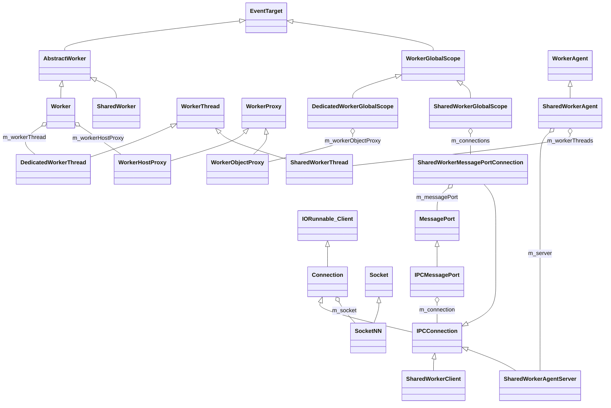
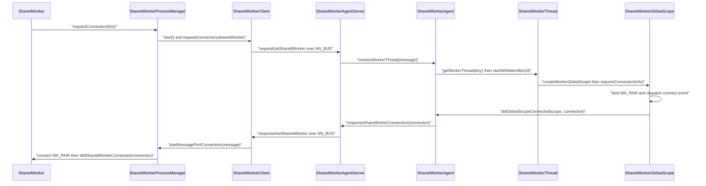

# Functional Requirements: modules-workers

> **Relevant source files**
>
> - [src/core/modules/worker/Worker.cpp](src:src/core/modules/worker/Worker.cpp)
> - [src/core/modules/worker/WorkerThread.cpp](src:src/core/modules/worker/WorkerThread.cpp)
> - [src/core/modules/worker/WorkerProxy.cpp](src:src/core/modules/worker/WorkerProxy.cpp)
> - [src/core/modules/worker/WorkerGlobalScope.cpp](src:src/core/modules/worker/WorkerGlobalScope.cpp)
> - [src/core/modules/worker/PerProcess.cpp](src:src/core/modules/worker/PerProcess.cpp)
> - [src/core/modules/worker/WorkerIPCAddress.cpp](src:src/core/modules/worker/WorkerIPCAddress.cpp)
> - [src/core/modules/worker/util/network/SocketNN.cpp](src:src/core/modules/worker/util/network/SocketNN.cpp)
> - [src/core/modules/worker/util/network/IORunnable.cpp](src:src/core/modules/worker/util/network/IORunnable.cpp)
> - [src/core/modules/sharedworker/IPCMessageHandler.cpp](src:src/core/modules/sharedworker/IPCMessageHandler.cpp)
> - [src/core/modules/sharedworker/SharedWorkerMessage.cpp](src:src/core/modules/sharedworker/SharedWorkerMessage.cpp)
> - [src/core/modules/sharedworker/SharedWorkerClient.cpp](src:src/core/modules/sharedworker/SharedWorkerClient.cpp)
> - [src/core/modules/sharedworker/host/SharedWorkerAgent.cpp](src:src/core/modules/sharedworker/host/SharedWorkerAgent.cpp)

**Module**: [`Worker.cpp`](src:src/core/modules/worker/Worker.cpp#L30)
**Version**: 2026-09-10
**Linked Design Card**: [modules/modules-workers.md](../modules/modules-workers.md)
**Analysis basis**: AST export and direct source reading

## Overview

The module implements dedicated workers as in-process threads driven by [`WorkerThread::start`](src:src/core/modules/worker/WorkerThread.cpp#L145) and [`WorkerHost::run`](src:src/core/modules/worker/WorkerHost.cpp#L41), and shared workers as a separate host process reached over nanomsg sockets created in [`SocketNN::SocketNN`](src:src/core/modules/worker/util/network/SocketNN.cpp#L48). Control traffic between page processes and the host uses string-identified messages dispatched by [`IPCMessageHandler::onReceiveMessage`](src:src/core/modules/sharedworker/IPCMessageHandler.cpp#L51); each accepted shared-worker connection then gets a dedicated pair socket whose address is built by [`WorkerIPCAddress::createIPCAddress`](src:src/core/modules/worker/WorkerIPCAddress.cpp#L53).

## Functional Requirements

### FR-MODULES-WORKERS-001
**Create a dedicated worker on its own thread with an isolated script environment**

| Item | Content |
|------|---------|
| **Description** | Constructing a `Worker` resolves the script URL against the owner's base URL, captures the owner's URL/base URL/locale/timezone/user agent into `WorkerHostInitData`, and starts a new thread that creates a `WebWorker`, its own script engine instance and a `DedicatedWorkerGlobalScope` for that script. |
| **Input** | `ExecutionContext*` of the creating page or parent worker, `String* scriptURL`, optional `WorkerOptions` (name, type, credentials). |
| **Output** | A running `DedicatedWorkerThread` with a `WorkerHostProxy`; a `DOMException` `SYNTAX_ERR` is thrown when the URL is invalid. |
| **Preconditions** | `WorkerThread::start` is called on the owner's message-loop thread; the script engine supports threading (`Escargot::Globals::supportsThreading()`). |
| **Postconditions** | `WorkerThread` state is `Running`; the worker thread has registered its `RunLoop` via `onWorkerRunLoopStarted`; the global scope has been created by `createWorkerGlobalScope` on the worker thread. |
| **Source** | [`Worker::Worker`](src:src/core/modules/worker/Worker.cpp#L30), [`AbstractWorker::resolveURL`](src:src/core/modules/worker/AbstractWorker.cpp#L48), [`WorkerThread::WorkerThread`](src:src/core/modules/worker/WorkerThread.cpp#L96), [`WorkerHost::run`](src:src/core/modules/worker/WorkerHost.cpp#L41), [`WorkerHost::WorkerHost`](src:src/core/modules/worker/WorkerHost.cpp#L63), [`WebWorker::createGlobalScope`](src:src/core/modules/worker/WebWorker.cpp#L110) |

**Acceptance criteria**:
- [ ] `new Worker(ctx, "relative.js")` yields `scriptURL()` resolved against `ctx->baseURL()`; an unparsable URL throws `DOMException` with `SYNTAX_ERR`. [`AbstractWorker::resolveURL`](src:src/core/modules/worker/AbstractWorker.cpp#L48)
- [ ] After construction, `workerThread()->isRunning()` is true and the `WorkerHostInitData` carries the owner's `locale`, `timezoneID`, `userAgent`, `url`, `baseURL`. [`WorkerThread::WorkerThread`](src:src/core/modules/worker/WorkerThread.cpp#L96)
- [ ] The worker thread constructs a `WebWorker` with the captured locale/timezone/user agent and a fresh `ScriptEngineInstance` before creating the global scope. [`WorkerHost::WorkerHost`](src:src/core/modules/worker/WorkerHost.cpp#L63), [`WebWorker::ensureScriptEngineInstance`](src:src/core/modules/worker/WebWorker.cpp#L87)
- [ ] The dedicated global scope is initialised with a `WorkerObjectProxy` that entangles back to the `Worker` object and its `WorkerHostProxy`. [`DedicatedWorkerThread::createWorkerGlobalScope`](src:src/core/modules/worker/DedicatedWorkerThread.cpp#L48), [`DedicatedWorkerGlobalScope::initialize`](src:src/core/modules/worker/DedicatedWorkerGlobalScope.cpp#L50)

### FR-MODULES-WORKERS-002
**Exchange structured-clone messages between a page and its dedicated worker across threads**

| Item | Content |
|------|---------|
| **Description** | `postMessage` on either side serialises the value with transfer list on the caller's thread, posts an idler to the peer's message loop, and dispatches a `MessageEvent` on the entangled `EventTarget`; the serialized buffer is freed back on the originating thread. Messages sent before the worker script has finished loading are queued and flushed after `onScriptLoadFinished`. |
| **Input** | `ScriptValue message`, `GCVector<ScriptObject>& transfer` or `StructuredSerializeOptions`. |
| **Output** | `MessageEvent` dispatched on `DedicatedWorkerGlobalScope` (page → worker) or on `Worker` (worker → page). |
| **Preconditions** | Caller runs on its own context thread (`isContextThread()` assert); proxies are entangled via `entangleTarget`. |
| **Postconditions** | `SerializeWithTransferResult` is removed from the sender's `m_serializedMessages` via `onPostMessageDone`; nothing is dispatched if either proxy is closed. |
| **Source** | [`WorkerProxy::postMessage`](src:src/core/modules/worker/WorkerProxy.cpp#L74), [`WorkerProxy::postMessageToEntangledEventTarget`](src:src/core/modules/worker/WorkerProxy.cpp#L87), [`WorkerHostProxy::postSerializedMessage`](src:src/core/modules/worker/WorkerHostProxy.cpp#L118), [`WorkerHostProxy::handleQueuedEarlyMessages`](src:src/core/modules/worker/WorkerHostProxy.cpp#L102), [`WorkerObjectProxy::postSerializedMessage`](src:src/core/modules/worker/WorkerObjectProxy.cpp#L59) |

**Acceptance criteria**:
- [ ] `Worker::postMessage` before script load completes stores the message in `m_queuedEarlyMessages`; after `onScriptLoadFinished` every queued message is delivered in order. [`WorkerHostProxy::postSerializedMessage`](src:src/core/modules/worker/WorkerHostProxy.cpp#L118), [`WorkerHostProxy::onScriptLoadFinished`](src:src/core/modules/worker/WorkerHostProxy.cpp#L68)
- [ ] `Worker::postMessage` after `terminate()` is a no-op. [`Worker::postMessage`](src:src/core/modules/worker/Worker.cpp#L41)
- [ ] `DedicatedWorkerGlobalScope::postMessage` after `dispose()` is a no-op. [`DedicatedWorkerGlobalScope::postMessage`](src:src/core/modules/worker/DedicatedWorkerGlobalScope.cpp#L79)
- [ ] The receiving idler dispatches a `MessageEvent` on `entangledEventTarget()` only when the entangled proxy is not closed, then frees the serialized buffer on the owner thread. [`WorkerProxy::postMessageToEntangledEventTarget`](src:src/core/modules/worker/WorkerProxy.cpp#L87), [`WorkerProxy::onPostMessageDone`](src:src/core/modules/worker/WorkerProxy.cpp#L45)

### FR-MODULES-WORKERS-003
**Terminate a dedicated worker and release its thread, proxies and child workers**

| Item | Content |
|------|---------|
| **Description** | `Worker::terminate` closes the host proxy, asks the worker global scope to terminate, clears pending posts and serialized messages, then stops the worker run loop and its `Thread`; the controlling thread waits up to one second for the worker thread to finish before cancelling it, terminates registered child worker threads, and joins. `DedicatedWorkerGlobalScope::close()` from inside the worker performs the same via `WorkerObjectProxy::terminateWorker`. |
| **Input** | `Worker::terminate()` (page side) or `DedicatedWorkerGlobalScope::close()` (worker side). |
| **Output** | `WorkerThread` state `Terminated`; `Worker::destroy` nulls `m_workerHostProxy` and `m_workerThread` when the thread finishes. |
| **Preconditions** | `WorkerThread` is in state `Running`. |
| **Postconditions** | Pending idlers keyed on `workerMessageLoopGlobalScope()` are cleared; `WorkerHost::dispose` clears timers, pending idlers, disposes the global scope and destroys the `WebWorker`. |
| **Source** | [`Worker::terminate`](src:src/core/modules/worker/Worker.cpp#L60), [`WorkerThread::terminate`](src:src/core/modules/worker/WorkerThread.cpp#L156), [`WorkerThread::workerMainThreadWork`](src:src/core/modules/worker/WorkerThread.cpp#L109), [`WorkerThread::terminateChildThreads`](src:src/core/modules/worker/WorkerThread.cpp#L234), [`WorkerHost::dispose`](src:src/core/modules/worker/WorkerHost.cpp#L76), [`DedicatedWorkerGlobalScope::close`](src:src/core/modules/worker/DedicatedWorkerGlobalScope.cpp#L101), [`WorkerObjectProxy::terminateWorker`](src:src/core/modules/worker/WorkerObjectProxy.cpp#L65) |

**Acceptance criteria**:
- [ ] Calling `Worker::terminate()` twice performs the shutdown once (`m_wasTerminated` guard). [`Worker::terminate`](src:src/core/modules/worker/Worker.cpp#L60)
- [ ] `WorkerThread::terminate()` on a non-running thread returns without effect. [`WorkerThread::terminate`](src:src/core/modules/worker/WorkerThread.cpp#L156)
- [ ] If the worker thread does not signal completion within 1 s of the stop request, `destroyWorkerThread` cancels it (`pthread_cancel`) before joining. [`WorkerThread::workerMainThreadWork`](src:src/core/modules/worker/WorkerThread.cpp#L109), [`WorkerThread::destroyWorkerThread`](src:src/core/modules/worker/WorkerThread.cpp#L188)
- [ ] Nested workers created inside a dedicated worker are registered as child threads and terminated with the parent. [`WorkerObjectProxy::addChildWorker`](src:src/core/modules/worker/WorkerObjectProxy.cpp#L87), [`WorkerThread::terminateChildThreads`](src:src/core/modules/worker/WorkerThread.cpp#L234)
- [ ] `WorkerHostProxy::initialize` returns false once termination was requested, causing the worker side to close its proxy instead of loading the script. [`WorkerHostProxy::initialize`](src:src/core/modules/worker/WorkerHostProxy.cpp#L42), [`DedicatedWorkerGlobalScope::initialize`](src:src/core/modules/worker/DedicatedWorkerGlobalScope.cpp#L50)

### FR-MODULES-WORKERS-004
**Provide the worker global scope environment (script import, timers, location, navigator)**

| Item | Content |
|------|---------|
| **Description** | `WorkerGlobalScope` creates an `ExecutionContext` for the script URL, a `WorkerScriptController`, `WorkerLocation` and `WorkerNavigator`; it loads the main script and `importScripts` synchronously through `ResourceRequest`, exposes timers on the `WebWorker` timer, and forwards `fetch`, `btoa`/`atob`, `queueMicrotask`, `structuredClone`, `performance` and `indexedDB`. |
| **Input** | `ResourceURL* url`, `String* charSet` at initialisation; script URLs for `importScripts`; timer handlers and delays. |
| **Output** | Evaluated scripts; `DOMException` (`SYNTAX_ERR`, `NETWORK_ERR`, `SCRIPT_ERROR`, `NOT_SUPPORTED_ERR`) on import failure; timer IDs. |
| **Preconditions** | `m_scriptBindingInstance` has been set by the concrete global scope constructor before `initGlobalScope`. |
| **Postconditions** | `loadMainScript()` returns true on `ScriptLoadResult::Success`, false when a `DOMException` was raised. |
| **Source** | [`WorkerGlobalScope::initGlobalScope`](src:src/core/modules/worker/WorkerGlobalScope.cpp#L58), [`WorkerGlobalScope::importScript`](src:src/core/modules/worker/WorkerGlobalScope.cpp#L161), [`WorkerGlobalScope::loadMainScript`](src:src/core/modules/worker/WorkerGlobalScope.cpp#L183), [`WorkerScriptController::loadJavaScriptInternal`](src:src/core/modules/worker/WorkerScriptController.cpp#L105), [`WorkerGlobalScope::setTimeout`](src:src/core/modules/worker/WorkerGlobalScope.cpp#L118), [`WorkerLocation::WorkerLocation`](src:src/core/modules/worker/WorkerLocation.cpp#L29) |

**Acceptance criteria**:
- [ ] Script fetch is issued with `RequestDestination::Script` and `RequestSyncLevel::AlwaysSync`; HTTP status 200 with successful evaluation yields `Success`, evaluation failure yields `ScriptError`, other outcomes yield `NetworkError`. [`WorkerScriptController::loadJavaScriptInternal`](src:src/core/modules/worker/WorkerScriptController.cpp#L105), [`WorkerScriptController.cpp`](src:src/core/modules/worker/WorkerScriptController.cpp#L47)
- [ ] `importScript` maps `NetworkError` to `NETWORK_ERR`, `ScriptError` to `SCRIPT_ERROR`, any other non-success to `NOT_SUPPORTED_ERR`, and an invalid URL to `SYNTAX_ERR`. [`WorkerGlobalScope::importScript`](src:src/core/modules/worker/WorkerGlobalScope.cpp#L161)
- [ ] `importScripts` with an empty list returns immediately; empty strings in the list are skipped. [`WorkerGlobalScope::importScripts`](src:src/core/modules/worker/WorkerGlobalScope.cpp#L144)
- [ ] `WorkerLocation::search()` and `hash()` return the empty string when the URL component is only `?` or `#`. [`WorkerLocation::search`](src:src/core/modules/worker/WorkerLocation.cpp#L78), [`WorkerLocation::hash`](src:src/core/modules/worker/WorkerLocation.cpp#L85)
- [ ] `terminate()` on the global scope sets `m_closing` once and clears all pending idlers on the worker message loop. [`WorkerGlobalScope::terminate`](src:src/core/modules/worker/WorkerGlobalScope.cpp#L95)

### FR-MODULES-WORKERS-005
**Initialise per-process worker infrastructure (manager, thread pool, I/O poll thread)**

| Item | Content |
|------|---------|
| **Description** | `Starfish` creates one `WorkerManager` per process: `WorkerHostManager` (thread pool size 5) in the host build or `WorkerClientManager` (thread pool size 2) in the page build. Each owns a single `PerProcess` which, on `initialize()`, creates a `MessageLoop`, a `ThreadPool`, and an `IORunnable` running on an `AdaptedThread` with a 300 ms poll timeout. The client manager also initialises the shared-worker and service-worker process managers. |
| **Input** | `Starfish*`; build flags `STARFISH_USE_WORKER_PROCESS`, `STARFISH_WEBWORKER_HOST`, `STARFISH_ENABLE_SHARED_WORKER`, `STARFISH_ENABLE_SERVICE_WORKER`. |
| **Output** | `PerProcess` with `ioRunnable()`, `threadPool()`, `messageLoop()`, `workerSettings()` accessors. |
| **Preconditions** | Only one `PerProcess` may ever be constructed in a process (static assert). |
| **Postconditions** | `PerProcess::destroy` stops and joins the I/O thread, destroys the pool and the loop; `WorkerClientManager::destroy` first destroys the shared/service worker process managers. |
| **Source** | [`WorkerManager::create`](src:src/core/modules/worker/WorkerManager.cpp#L32), [`WorkerManager::WorkerManager`](src:src/core/modules/worker/WorkerManager.cpp#L41), [`WorkerHostManager::WorkerHostManager`](src:src/core/modules/worker/WorkerHostManager.cpp#L31), [`WorkerClientManager::WorkerClientManager`](src:src/core/modules/worker/client/WorkerClientManager.cpp#L31), [`PerProcess::PerProcess`](src:src/core/modules/worker/PerProcess.cpp#L42), [`PerProcess::initialize`](src:src/core/modules/worker/PerProcess.cpp#L60), [`PerProcess::destroy`](src:src/core/modules/worker/PerProcess.cpp#L79) |

**Acceptance criteria**:
- [ ] Under `STARFISH_WEBWORKER_HOST` the manager reports `isWorkerHostManager()==true` and pool size 5; otherwise `isWorkerClientManager()==true` and pool size 2. [`WorkerManager::create`](src:src/core/modules/worker/WorkerManager.cpp#L32), [`WorkerHostManager::s_threadPoolSize`](src:src/core/modules/worker/WorkerHostManager.h#L43), [`WorkerClientManager::s_threadPoolSize`](src:src/core/modules/worker/client/WorkerClientManager.h#L44)
- [ ] `PerProcess::initialize()` called twice creates the loop, pool and I/O thread only once. [`PerProcess::initialize`](src:src/core/modules/worker/PerProcess.cpp#L60)
- [ ] The `IORunnable` is created with `IO_EVENT_POLLING_TIMEOUT_MS` (300). [`PerProcess.cpp`](src:src/core/modules/worker/PerProcess.cpp#L40)
- [ ] `PerProcess::destroy()` on an uninitialised instance returns without touching thread or pool. [`PerProcess::destroy`](src:src/core/modules/worker/PerProcess.cpp#L79)
- [ ] The host `WorkerAgent` is a process singleton: `create` returns the existing instance, `instance()` release-asserts it exists, `destroy` frees it. [`WorkerAgent::create`](src:src/core/modules/sharedworker/host/SharedWorkerAgent.cpp#L44), [`WorkerAgent::instance`](src:src/core/modules/worker/WorkerAgent.cpp#L33), [`WorkerAgent::destroy`](src:src/core/modules/worker/WorkerAgent.cpp#L61)

### FR-MODULES-WORKERS-006
**Transport bytes between processes over nanomsg sockets with message-loop delivery**

| Item | Content |
|------|---------|
| **Description** | `SocketNN` wraps one nanomsg socket (`nn_socket`, `nn_bind`, `nn_connect`, `nn_send`, `nn_recv`, `nn_shutdown`, `nn_close`) and converts failures to `Socket::Exception` carrying `nn_errno`. `Connection` owns a `SocketNN` (`AF_SP`, pair by default) and sends blocking on the first call, non-blocking afterwards. `IORunnable` polls all registered client sockets with `nn_poll`, receives whole messages (`NN_MSG`, `NN_DONTWAIT`) and delivers each buffer to `Client::onReceived` on the client's message loop; on loop exit it notifies `onStopped` and closes all sockets. |
| **Input** | Protocol (`kBusProtocol` = `NN_BUS`, `kPairProtocol` = `NN_PAIR`), `ipc://` address string, byte buffers. |
| **Output** | Bytes delivered to `IORunnable::Client::onReceived(Socket*, const char*, size_t)`; `-1` from `send`/`recv` on `EAGAIN`. |
| **Preconditions** | `IORunnable` is running on the per-process I/O thread; at most `MAX_LISTEN_SOCKET` (50) clients. |
| **Postconditions** | Poll set is rebuilt whenever `addClient`/`removeClient` sets `m_isFdUpdateNeeded`; a non-`ETIMEDOUT` socket error terminates the loop. |
| **Source** | [`SocketNN::SocketNN`](src:src/core/modules/worker/util/network/SocketNN.cpp#L48), [`SocketNN::send`](src:src/core/modules/worker/util/network/SocketNN.cpp#L132), [`SocketNN::recv`](src:src/core/modules/worker/util/network/SocketNN.cpp#L144), [`Connection::send`](src:src/core/modules/worker/util/network/Connection.cpp#L60), [`IORunnable::run`](src:src/core/modules/worker/util/network/IORunnable.cpp#L59), [`IORunnable::addClient`](src:src/core/modules/worker/util/network/IORunnable.cpp#L201), [`IORunnable::removeClient`](src:src/core/modules/worker/util/network/IORunnable.cpp#L214) |

**Acceptance criteria**:
- [ ] Constructing `SocketNN` with `NN_PAIR`/`NN_REQ`/`NN_REP` sets poll events `NN_POLLIN|NN_POLLOUT`; `NN_PUB`/`NN_PUSH` sets `NN_POLLOUT`; `NN_SUB`/`NN_PULL`/`NN_BUS` sets `NN_POLLIN`; any other protocol throws. [`SocketNN::SocketNN`](src:src/core/modules/worker/util/network/SocketNN.cpp#L48)
- [ ] `SocketNN::send`/`recv` return -1 when `nn_errno()==EAGAIN` and throw `SocketNN::Exception` for any other negative result. [`SocketNN::send`](src:src/core/modules/worker/util/network/SocketNN.cpp#L132), [`SocketNN::recv`](src:src/core/modules/worker/util/network/SocketNN.cpp#L144)
- [ ] `Connection::send` uses `SCK_WAIT` for the first send and `SCK_DONTWAIT` afterwards; exceptions are logged, not propagated. [`Connection::send`](src:src/core/modules/worker/util/network/Connection.cpp#L60)
- [ ] `Connection::onReceived` asserts the buffer contains a NUL byte so it can be treated as a string. [`Connection::onReceived`](src:src/core/modules/worker/util/network/Connection.cpp#L86)
- [ ] Received buffers are delivered on `client->messageLoop()` when non-null, otherwise on the process loop, and only while the runnable is not stopped. [`IORunnable::run`](src:src/core/modules/worker/util/network/IORunnable.cpp#L59)
- [ ] `IPCConnection::bind`/`connect` register with the `IORunnable` first and unregister on socket failure, returning false; `connect` waits one second after `nn_connect`. [`IPCConnection::bind`](src:src/core/modules/sharedworker/IPCConnection.cpp#L43), [`IPCConnection::connect`](src:src/core/modules/sharedworker/IPCConnection.cpp#L64)

### FR-MODULES-WORKERS-007
**Derive and manage `ipc://` addresses under the shared-worker storage directory**

| Item | Content |
|------|---------|
| **Description** | `WorkerIPCAddress` turns a resource directory (`<storage>/shared_worker`) into nanomsg addresses of the form `ipc://<dir>/<last>`. The host `acquire`s the directory (creating missing ancestors and clearing the handle directory) and `release`s it on shutdown. The control bus uses `last = "ipc"`; per-connection pair sockets use `last = <identifier>` where the identifier is a hash of a generated ID that does not collide with an existing handle file. |
| **Input** | Resource directory path from `StoragePathProvider::getSharedWorkerDataDirectoryPath()`; suffix string. |
| **Output** | Address string; created/cleared/removed directories on disk. |
| **Preconditions** | `STARFISH_USE_WORKER_PROCESS` build. |
| **Postconditions** | `getIPCHandlePath()` exists and is empty after `acquire`; removed after `release`. |
| **Source** | [`WorkerIPCAddress::getIPCHandlePath`](src:src/core/modules/worker/WorkerIPCAddress.cpp#L44), [`WorkerIPCAddress::createIPCAddress`](src:src/core/modules/worker/WorkerIPCAddress.cpp#L53), [`WorkerIPCAddress::acquire`](src:src/core/modules/worker/WorkerIPCAddress.cpp#L63), [`WorkerIPCAddress::release`](src:src/core/modules/worker/WorkerIPCAddress.cpp#L72), [`WorkerConfig.h`](src:src/core/modules/worker/WorkerConfig.h#L27), [`SharedWorkerAgent::createIdentifier`](src:src/core/modules/sharedworker/host/SharedWorkerAgent.cpp#L127), [`StoragePathProvider::getSharedWorkerDataDirectoryPath`](src:src/StoragePathProvider.cpp#L60) |

**Acceptance criteria**:
- [ ] `createIPCAddress("ipc")` with directory `/data/shared_worker` returns `ipc:///data/shared_worker/ipc`. [`WorkerIPCAddress::createIPCAddress`](src:src/core/modules/worker/WorkerIPCAddress.cpp#L53)
- [ ] `acquire()` creates every missing ancestor of the resource directory (`mkdir 0755`) and clears the handle directory if it already exists. [`WorkerIPCAddress::acquire`](src:src/core/modules/worker/WorkerIPCAddress.cpp#L63), [`LocalStorageHelper::File::mkdirIfNotExists`](src:src/core/modules/worker/util/LocalStorageHelper.cpp#L45), [`LocalStorageHelper::File::createClearDirectory`](src:src/core/modules/worker/util/LocalStorageHelper.cpp#L72)
- [ ] `createIdentifier()` loops until `<handlePath>/<identifier>` does not exist on disk. [`SharedWorkerAgent::createIdentifier`](src:src/core/modules/sharedworker/host/SharedWorkerAgent.cpp#L127)
- [ ] The host constructs the bus address with `WORKER_IPC_PROCESS_NAME` and the pair address with `std::to_string(identifier)`. [`SharedWorkerAgent::SharedWorkerAgent`](src:src/core/modules/sharedworker/host/SharedWorkerAgent.cpp#L64), [`SharedWorkerGlobalScope::createMessagePortConnection`](src:src/core/modules/sharedworker/host/SharedWorkerGlobalScope.cpp#L115)

### FR-MODULES-WORKERS-008
**Serialise control messages with tagged fields and dispatch them by message ID**

| Item | Content |
|------|---------|
| **Description** | An `IPCMessage` serialises to a buffer that starts with its string message ID, followed by fields each prefixed by an `IPCMessageTag` byte (`kBoolean`, `kUInt32`, `kSizeNumber`, `kString`; strings add a `size_t` length), and ends with a terminator. `IPCMessageHandler` sends such buffers over a `Connection` and, on receipt, reads the ID and invokes the handler registered for that ID; unknown IDs or malformed buffers are ignored. Three messages are defined: `requestGetSharedWorker`, `responseGetSharedWorker`, `requestCloseSharedWorker`. |
| **Input** | `IPCMessage&` to send; `(const char*, size_t)` received buffer. |
| **Output** | Bytes passed to `Connection::send`; handler invocation with an `IPCMessageDeserializer*`. |
| **Preconditions** | Handlers registered via `setMessageReceiveHandler(id, fn)`. |
| **Postconditions** | `IPCMessageDeserializer::isError()` reflects reader underflow/type mismatch; typed `read*` return default values when the tag does not match. |
| **Source** | [`IPCMessageTag`](src:src/core/modules/sharedworker/IPCMessageSerializer.h#L29), [`IPCMessageSerializer::IPCMessageSerializer`](src:src/core/modules/sharedworker/IPCMessageSerializer.cpp#L28), [`IPCMessageSerializer::writeString`](src:src/core/modules/sharedworker/IPCMessageSerializer.cpp#L52), [`IPCMessageDeserializer::checkTag`](src:src/core/modules/sharedworker/IPCMessageSerializer.cpp#L87), [`IPCMessageHandler::sendMessage`](src:src/core/modules/sharedworker/IPCMessageHandler.cpp#L42), [`IPCMessageHandler::onReceiveMessage`](src:src/core/modules/sharedworker/IPCMessageHandler.cpp#L51), [`RequestGetSharedWorker::serialize`](src:src/core/modules/sharedworker/SharedWorkerMessage.cpp#L56) |

**Acceptance criteria**:
- [ ] `requestGetSharedWorker` serialises, in order: `clientID` (u32), `pid` (u32), `sharedWorkerKey` (size), `name`, `baseURL`, `url`, `locale`, `timezoneID`, `userAgent` (strings); `deserialize` reads the same order. [`RequestGetSharedWorker::serialize`](src:src/core/modules/sharedworker/SharedWorkerMessage.cpp#L56), [`RequestGetSharedWorker::deserialize`](src:src/core/modules/sharedworker/SharedWorkerMessage.cpp#L73)
- [ ] `responseGetSharedWorker` carries `clientID` (u32), `pid` (u32), `ipcAddress` (string); `requestCloseSharedWorker` carries `pid` (u32) taken from the current process. [`ResponseGetSharedWorker::serialize`](src:src/core/modules/sharedworker/SharedWorkerMessage.cpp#L95), [`RequestCloseSharedWorker::RequestCloseSharedWorker`](src:src/core/modules/sharedworker/SharedWorkerMessage.cpp#L115)
- [ ] `sendMessage` does nothing when the serializer reports an error; otherwise it appends a terminator before sending. [`IPCMessageHandler::sendMessage`](src:src/core/modules/sharedworker/IPCMessageHandler.cpp#L42)
- [ ] `onReceiveMessage` returns silently when the deserializer is in error, the message ID is empty, or no handler is registered for the ID. [`IPCMessageHandler::onReceiveMessage`](src:src/core/modules/sharedworker/IPCMessageHandler.cpp#L51)
- [ ] `readUInt32`/`readSize`/`readBool`/`readString` return `0`/`false`/empty when the next tag byte is not the expected tag. [`IPCMessageDeserializer::readUInt32`](src:src/core/modules/sharedworker/IPCMessageSerializer.cpp#L108), [`IPCMessageDeserializer::readString`](src:src/core/modules/sharedworker/IPCMessageSerializer.cpp#L128)

### FR-MODULES-WORKERS-009
**Request a shared worker from the page process and pace outstanding control requests**

| Item | Content |
|------|---------|
| **Description** | Constructing a `SharedWorker` computes a `SharedWorkerKey` (hash of storage key, script URL, name), a per-object `clientID`, entangles its `MessagePort` with an `IPCMessagePort`, and asks `SharedWorkerProcessManager` to connect. The manager lazily initialises `PerProcess`, connects a `SharedWorkerClient` bus socket to `ipc://<storage>/shared_worker/ipc`, sends `requestGetSharedWorker`, and records the object by `clientID`. When `responseGetSharedWorker` arrives with this process's pid, it creates a `SharedWorkerMessagePortConnection`, connects the pair socket, and starts both ports. |
| **Input** | `ExecutionContext*`, `String* scriptURL`, `DOMStringOrWorkerOptions` (name or options). |
| **Output** | `SharedWorker` whose `port()` becomes active after `didSharedWorkerConnected`; `DOMException` `SECURITY_ERR` when no storage key is available. |
| **Preconditions** | `STARFISH_ENABLE_SHARED_WORKER` page build; `WorkerClientManager` has called `SharedWorkerProcessManager::init`. |
| **Postconditions** | `m_sharedWorkers[clientID]` holds the object; `m_connections` holds the pair connection; only one control request is in flight at a time. |
| **Source** | [`SharedWorker::SharedWorker`](src:src/core/modules/sharedworker/SharedWorker.cpp#L38), [`SharedWorkerKey::SharedWorkerKey`](src:src/core/modules/sharedworker/SharedWorkerKey.cpp#L28), [`SharedWorkerProcessManager::start`](src:src/core/modules/sharedworker/SharedWorkerProcessManager.cpp#L64), [`SharedWorkerProcessManager::requestConnection`](src:src/core/modules/sharedworker/SharedWorkerProcessManager.cpp#L86), [`SharedWorkerClient::sendMessage`](src:src/core/modules/sharedworker/SharedWorkerClient.cpp#L103), [`SharedWorkerProcessManager::startMessagePortConnection`](src:src/core/modules/sharedworker/SharedWorkerProcessManager.cpp#L157), [`SharedWorker::didSharedWorkerConnected`](src:src/core/modules/sharedworker/SharedWorker.cpp#L73) |

**Acceptance criteria**:
- [ ] A string argument sets only `name`; a `WorkerOptions` argument replaces the whole options object. [`SharedWorker::SharedWorker`](src:src/core/modules/sharedworker/SharedWorker.cpp#L38)
- [ ] Missing storage key throws `DOMException` `SECURITY_ERR` "Cannot get storage key". [`SharedWorker::SharedWorker`](src:src/core/modules/sharedworker/SharedWorker.cpp#L38)
- [ ] Two `SharedWorker` objects with equal storage key, URL and name produce equal `SharedWorkerKey.hash`. [`SharedWorkerKey::operator==`](src:src/core/modules/sharedworker/SharedWorkerKey.cpp#L37)
- [ ] While a request is outstanding (`m_requestFlag`), further non-forced messages are copied into `m_requestMessages` and one is flushed per received bus message; `requestClose` bypasses the queue (`force=true`). [`SharedWorkerClient::sendMessage`](src:src/core/modules/sharedworker/SharedWorkerClient.cpp#L103), [`SharedWorkerClient::sendPendingMessage`](src:src/core/modules/sharedworker/SharedWorkerClient.cpp#L124), [`SharedWorkerClient::requestClose`](src:src/core/modules/sharedworker/SharedWorkerClient.cpp#L77)
- [ ] A `responseGetSharedWorker` whose `pid` differs from the current process, or whose `clientID` is unknown, is ignored. [`SharedWorkerProcessManager::startMessagePortConnection`](src:src/core/modules/sharedworker/SharedWorkerProcessManager.cpp#L157)
- [ ] On connection the `IPCMessagePort` receives the pair connection and both entangled ports are started. [`SharedWorker::didSharedWorkerConnected`](src:src/core/modules/sharedworker/SharedWorker.cpp#L73)

### FR-MODULES-WORKERS-010
**Host shared workers: reuse threads by key, allocate connection identifiers, answer with a data-channel address**

| Item | Content |
|------|---------|
| **Description** | In the host process `WorkerAgent::create` builds a `SharedWorkerAgent` that acquires the IPC directory and binds a `SharedWorkerAgentServer` bus socket. On `requestGetSharedWorker` the agent finds or creates a `SharedWorkerThread` keyed by `sharedWorkerKey`, records a `MessagePortConnectionInfo` with a fresh identifier, and either starts the thread with that identifier or posts the connection to the running global scope. The `SharedWorkerGlobalScope` binds a pair socket for the identifier, dispatches a `connect` `MessageEvent` carrying a new `MessagePort`, and the agent replies with `responseGetSharedWorker`. |
| **Input** | `RequestGetSharedWorker` message (clientID, pid, key, name, `WorkerHostInitData`). |
| **Output** | `responseGetSharedWorker` on the bus; running `SharedWorkerThread`; `connect` event in the worker script. |
| **Preconditions** | `STARFISH_ENABLE_SHARED_WORKER && STARFISH_WEBWORKER_HOST` build; `connectWorkerThread` runs on the agent message loop. |
| **Postconditions** | `m_workerThreads[key]` holds a non-terminated thread; `m_connectionInfos` holds the info until closed by pid or key. |
| **Source** | [`WorkerAgent::create`](src:src/core/modules/sharedworker/host/SharedWorkerAgent.cpp#L44), [`SharedWorkerAgent::SharedWorkerAgent`](src:src/core/modules/sharedworker/host/SharedWorkerAgent.cpp#L64), [`SharedWorkerAgent::getWorkerThread`](src:src/core/modules/sharedworker/host/SharedWorkerAgent.cpp#L105), [`SharedWorkerAgent::connectWorkerThread`](src:src/core/modules/sharedworker/host/SharedWorkerAgent.cpp#L157), [`SharedWorkerThread::createWorkerGlobalScope`](src:src/core/modules/sharedworker/host/SharedWorkerThread.cpp#L52), [`SharedWorkerGlobalScope::requestConnection`](src:src/core/modules/sharedworker/host/SharedWorkerGlobalScope.cpp#L130), [`SharedWorkerAgent::didGlobalScopeConnected`](src:src/core/modules/sharedworker/host/SharedWorkerAgent.cpp#L174), [`SharedWorkerAgentServer::responseShareWorkerConnection`](src:src/core/modules/sharedworker/host/SharedWorkerAgentServer.cpp#L77) |

**Acceptance criteria**:
- [ ] A request whose key matches a non-terminated thread reuses it; a terminated entry is erased and a new `SharedWorkerThread` is created with the request's name, key and init data. [`SharedWorkerAgent::getWorkerThread`](src:src/core/modules/sharedworker/host/SharedWorkerAgent.cpp#L105)
- [ ] For a thread that is not yet running, `startWithIdentifier(info->identifier)` is used; otherwise `requestSharedWorkerConnection(info)` which queues until the global scope exists. [`SharedWorkerAgent::connectWorkerThread`](src:src/core/modules/sharedworker/host/SharedWorkerAgent.cpp#L157), [`SharedWorkerThread::requestSharedWorkerConnection`](src:src/core/modules/sharedworker/host/SharedWorkerThread.cpp#L102), [`SharedWorkerThread::createdWorkerGlobalScope`](src:src/core/modules/sharedworker/host/SharedWorkerThread.cpp#L116)
- [ ] If the main script fails to load, the global scope asks the agent to terminate the thread for its key. [`SharedWorkerGlobalScope::initialize`](src:src/core/modules/sharedworker/host/SharedWorkerGlobalScope.cpp#L53), [`SharedWorkerAgent::terminateWorkerThreadInOtherThread`](src:src/core/modules/sharedworker/host/SharedWorkerAgent.cpp#L248)
- [ ] `requestConnection` creates a `MessagePort`, binds the pair connection, entangles the port with an `IPCMessagePort` bound to that connection, dispatches a `connect` event whose `ports` contains the port, then notifies the agent. [`SharedWorkerGlobalScope::requestConnection`](src:src/core/modules/sharedworker/host/SharedWorkerGlobalScope.cpp#L130), [`SharedWorkerGlobalScope::createConnectMessageEvent`](src:src/core/modules/sharedworker/host/SharedWorkerGlobalScope.cpp#L157)
- [ ] The reply is posted to the agent message loop and sent with the connection's `clientID`, `pid` and `ipcAddress`. [`SharedWorkerAgent::didGlobalScopeConnected`](src:src/core/modules/sharedworker/host/SharedWorkerAgent.cpp#L174), [`ResponseGetSharedWorker::ResponseGetSharedWorker`](src:src/core/modules/sharedworker/SharedWorkerMessage.cpp#L87)

### FR-MODULES-WORKERS-011
**Bridge `MessagePort` traffic over a per-connection pair socket**

| Item | Content |
|------|---------|
| **Description** | `IPCMessagePort` is a `MessagePort` whose dispatch step sends the structured-clone buffer (`MemorySerializer::serializeWithTransfer`) over its `IPCConnection` instead of enqueuing locally. `SharedWorkerMessagePortConnection` receives raw buffers on the port's execution-context thread, wraps them into a `SerializeWithTransferResult` with `MemorySerializer::deserializeWithTransfer`, and dispatches a `MessageEvent` on the local `MessagePort`. |
| **Input** | `SerializeWithTransferResult*` from `MessagePort.postMessage`; raw `(data, size)` from the socket. |
| **Output** | Bytes on the pair socket; `MessageEvent` on the peer `MessagePort`. |
| **Preconditions** | The connection is in state `Start` (`isRunning()`); the port's serializer is `MemorySerializer::serializeWithTransfer`. |
| **Postconditions** | Nothing is sent or dispatched when the connection is absent or not running. |
| **Source** | [`IPCMessagePort::IPCMessagePort`](src:src/core/modules/sharedworker/IPCMessagePort.cpp#L30), [`IPCMessagePort::registerDispatchMessageTask`](src:src/core/modules/sharedworker/IPCMessagePort.cpp#L43), [`SharedWorkerMessagePortConnection::SharedWorkerMessagePortConnection`](src:src/core/modules/sharedworker/SharedWorkerMessagePortConnection.cpp#L36), [`SharedWorkerMessagePortConnection::onReceived`](src:src/core/modules/sharedworker/SharedWorkerMessagePortConnection.cpp#L49), [`SharedWorkerMessagePortConnection::messageLoop`](src:src/core/modules/sharedworker/SharedWorkerMessagePortConnection.cpp#L71) |

**Acceptance criteria**:
- [ ] `registerDispatchMessageTask` with a null or non-running connection returns without sending. [`IPCMessagePort::registerDispatchMessageTask`](src:src/core/modules/sharedworker/IPCMessagePort.cpp#L43)
- [ ] The bytes sent are exactly `serializedData->internal()->data()`/`size()` of the `SerializedRawScriptValueData`. [`IPCMessagePort::registerDispatchMessageTask`](src:src/core/modules/sharedworker/IPCMessagePort.cpp#L43)
- [ ] `onReceived` asserts it runs on the port's context thread and drops data when the connection is not running. [`SharedWorkerMessagePortConnection::onReceived`](src:src/core/modules/sharedworker/SharedWorkerMessagePortConnection.cpp#L49)
- [ ] The connection reports the owning `WebBase` message loop so `IORunnable` delivers on the port's thread. [`SharedWorkerMessagePortConnection::messageLoop`](src:src/core/modules/sharedworker/SharedWorkerMessagePortConnection.cpp#L71)
- [ ] Pair connections use `SocketNN::kPairProtocol`; bus connections use `SocketNN::kBusProtocol`. [`SharedWorkerMessagePortConnection::SharedWorkerMessagePortConnection`](src:src/core/modules/sharedworker/SharedWorkerMessagePortConnection.cpp#L36), [`SharedWorkerClient::SharedWorkerClient`](src:src/core/modules/sharedworker/SharedWorkerClient.cpp#L35)

### FR-MODULES-WORKERS-012
**Close shared-worker connections per process and terminate idle shared worker threads**

| Item | Content |
|------|---------|
| **Description** | When a page process shuts down its worker infrastructure, `SharedWorkerProcessManager::closeConnection` sends `requestCloseSharedWorker` (if any shared workers exist), closes and destroys all pair connections, and `destroy` closes the bus client. The host handles the request by closing every connection whose `pid` matches on each thread and dropping the matching connection infos; a `SharedWorkerGlobalScope` with no remaining connections asks the agent to terminate its thread. `SharedWorkerAgent::destroy` notifies the registered state handler with `Terminated`, closes the server and releases the IPC directory. |
| **Input** | `WorkerClientManager::destroy()` (client); `requestCloseSharedWorker{pid}` (host); `SharedWorkerGlobalScope::close()` from script. |
| **Output** | Closed sockets, terminated `SharedWorkerThread`s, removed IPC handle directory, `WorkerAgentState::Terminated` callback. |
| **Preconditions** | Host handlers run on the agent message loop; global-scope closes run on the worker context thread. |
| **Postconditions** | `m_workerThreads` no longer contains the key; `m_connectionInfos` contains no entries for the pid/key. |
| **Source** | [`SharedWorkerProcessManager::closeConnection`](src:src/core/modules/sharedworker/SharedWorkerProcessManager.cpp#L95), [`SharedWorkerProcessManager::destroy`](src:src/core/modules/sharedworker/SharedWorkerProcessManager.cpp#L126), [`SharedWorkerAgent::closeSharedWorker`](src:src/core/modules/sharedworker/host/SharedWorkerAgent.cpp#L211), [`SharedWorkerThread::closeSharedWorkerConnection`](src:src/core/modules/sharedworker/host/SharedWorkerThread.cpp#L163), [`SharedWorkerGlobalScope::closeConnection`](src:src/core/modules/sharedworker/host/SharedWorkerGlobalScope.cpp#L172), [`SharedWorkerAgent::terminateWorkerThread`](src:src/core/modules/sharedworker/host/SharedWorkerAgent.cpp#L273), [`SharedWorkerAgent::destroy`](src:src/core/modules/sharedworker/host/SharedWorkerAgent.cpp#L85) |

**Acceptance criteria**:
- [ ] `closeConnection` sends `requestCloseSharedWorker` only when `m_sharedWorkers` is non-empty, then clears the map and destroys every pair connection. [`SharedWorkerProcessManager::closeConnection`](src:src/core/modules/sharedworker/SharedWorkerProcessManager.cpp#L95)
- [ ] `destroy` on a manager that never started returns without effect. [`SharedWorkerProcessManager::destroy`](src:src/core/modules/sharedworker/SharedWorkerProcessManager.cpp#L126)
- [ ] On the host, a close for a pid arriving before the global scope exists is remembered in `m_pendingClosePids` and applied when the scope is created. [`SharedWorkerThread::closeSharedWorkerConnection`](src:src/core/modules/sharedworker/host/SharedWorkerThread.cpp#L163), [`SharedWorkerThread::createdWorkerGlobalScope`](src:src/core/modules/sharedworker/host/SharedWorkerThread.cpp#L116)
- [ ] After removing the last connection, `closeConnection` requests thread termination for the worker's key; `terminateWorkerThread` terminates the thread, erases it and removes its connection infos. [`SharedWorkerGlobalScope::closeConnection`](src:src/core/modules/sharedworker/host/SharedWorkerGlobalScope.cpp#L172), [`SharedWorkerAgent::terminateWorkerThread`](src:src/core/modules/sharedworker/host/SharedWorkerAgent.cpp#L273)
- [ ] `SharedWorkerAgent::destroy` invokes the state handler with `Terminated` (if registered), closes the server, releases the IPC directory and frees the singleton. [`SharedWorkerAgent::destroy`](src:src/core/modules/sharedworker/host/SharedWorkerAgent.cpp#L85), [`WorkerAgentState`](src:src/core/modules/worker/WorkerAgent.h#L31)

## Non-Functional Requirements

| Item | Requirement | Source |
|------|-------------|--------|
| Performance | I/O thread polls sockets with a 300 ms `nn_poll` timeout and a 1 ms condition-variable wait per iteration; up to 50 sockets per poll set. | [`PerProcess.cpp`](src:src/core/modules/worker/PerProcess.cpp#L40), [`IORunnable::run`](src:src/core/modules/worker/util/network/IORunnable.cpp#L59), [`IORunnable.cpp`](src:src/core/modules/worker/util/network/IORunnable.cpp#L35) |
| Performance | Worker thread shutdown waits at most 1 s before forced cancellation; bus `connect` sleeps 1 s after `nn_connect`. | [`WorkerThread::workerMainThreadWork`](src:src/core/modules/worker/WorkerThread.cpp#L109), [`IPCConnection::connect`](src:src/core/modules/sharedworker/IPCConnection.cpp#L64) |
| Performance | Thread pool size: 5 in the host process, 2 in a page process, default 1. | [`WorkerHostManager::s_threadPoolSize`](src:src/core/modules/worker/WorkerHostManager.h#L43), [`WorkerClientManager::s_threadPoolSize`](src:src/core/modules/worker/client/WorkerClientManager.h#L44), [`WorkerSettings::m_threadPoolSize`](src:src/core/modules/worker/WorkerSettings.h#L43) |
| Security | A `SharedWorker` requires a storage key for its execution context; otherwise `SECURITY_ERR`. Shared workers are partitioned by (storage key, URL, name). | [`SharedWorker::SharedWorker`](src:src/core/modules/sharedworker/SharedWorker.cpp#L38), [`SharedWorkerKey::SharedWorkerKey`](src:src/core/modules/sharedworker/SharedWorkerKey.cpp#L28) |
| Security | IPC handle directories are created with mode `0755`; a page process only acts on bus replies addressed to its own pid. | [`LocalStorageHelper::File::mkdirIfNotExists`](src:src/core/modules/worker/util/LocalStorageHelper.cpp#L45), [`SharedWorkerProcessManager::startMessagePortConnection`](src:src/core/modules/sharedworker/SharedWorkerProcessManager.cpp#L157) |
| Error handling | Socket errors surface as `Socket::Exception` with `nn_errno`; `Connection::send` logs and swallows; `IORunnable` exits its loop on any non-`ETIMEDOUT` error; `bind`/`connect` return false and unregister. | [`SocketNN::Exception::what`](src:src/core/modules/worker/util/network/SocketNN.cpp#L43), [`Connection::send`](src:src/core/modules/worker/util/network/Connection.cpp#L60), [`IORunnable::run`](src:src/core/modules/worker/util/network/IORunnable.cpp#L59), [`IPCConnection::bind`](src:src/core/modules/sharedworker/IPCConnection.cpp#L43) |
| Error handling | Malformed or unknown control messages are dropped without error; script load failures map to `DOMException` codes. | [`IPCMessageHandler::onReceiveMessage`](src:src/core/modules/sharedworker/IPCMessageHandler.cpp#L51), [`WorkerGlobalScope::importScript`](src:src/core/modules/worker/WorkerGlobalScope.cpp#L161) |
| Logging | `TRACE`/`TRACEF` categories `IPC`, `SHAREDWORKER`, `SOCKET`, `CONNECTION`, `WORKER`, `HOST`, `PERPROC`, `LOCALSTORAGE`; `STARFISH_LOG_ERROR` on bind/connect/send/mkdir failure; `STARFISH_LOG_INFO` on receive failure. Trace enablement is driven by the `TRACE` global option. | [`Connection::send`](src:src/core/modules/worker/util/network/Connection.cpp#L60), [`SocketNN::recv`](src:src/core/modules/worker/util/network/SocketNN.cpp#L144), [`PerProcess::PerProcess`](src:src/core/modules/worker/PerProcess.cpp#L42) |

## Constraints

- Dedicated workers require `STARFISH_ENABLE_WORKER`; the process model (`PerProcess`, `IORunnable`, `SocketNN`, `WorkerIPCAddress`, `WorkerManager`) requires `STARFISH_USE_WORKER_PROCESS`; shared-worker code requires `STARFISH_ENABLE_SHARED_WORKER`; host-only classes (`SharedWorkerAgent`, `SharedWorkerAgentServer`, `SharedWorkerThread`, `SharedWorkerGlobalScope`, `WorkerAgent`, `WorkerHostManager`) additionally require `STARFISH_WEBWORKER_HOST`. [`Worker.h`](src:src/core/modules/worker/Worker.h#L20), [`PerProcess.h`](src:src/core/modules/worker/PerProcess.h#L20), [`IPCConnection.h`](src:src/core/modules/sharedworker/IPCConnection.h#L20), [`SharedWorkerAgent.h`](src:src/core/modules/sharedworker/host/SharedWorkerAgent.h#L20), [`worker.cmake`](src:build/worker.cmake#L12)
- Worker thread cancellation is implemented only for `OS_POSIX && !STARFISH_ANDROID`; other platforms hit `STARFISH_UNSUPPORTED`. [`WorkerThread::initializeWorkerThread`](src:src/core/modules/worker/WorkerThread.cpp#L178)
- Exactly one `PerProcess` per process; `WorkerAgent` and `SharedWorkerProcessManager` are singletons. [`PerProcess::PerProcess`](src:src/core/modules/worker/PerProcess.cpp#L42), [`WorkerAgent::g_workerAgentInstance`](src:src/core/modules/worker/WorkerAgent.cpp#L31), [`SharedWorkerProcessManager::instance`](src:src/core/modules/sharedworker/SharedWorkerProcessManager.cpp#L40)
- `IORunnable` handles at most 50 sockets (`MAX_LISTEN_SOCKET`). [`IORunnable.cpp`](src:src/core/modules/worker/util/network/IORunnable.cpp#L35)
- `WebWorker::createGlobalScope` is instantiated only for `DedicatedWorkerGlobalScope`, `SharedWorkerGlobalScope` (host + shared) and `ServiceWorkerGlobalScope` (host + service). [`WebWorker.cpp`](src:src/core/modules/worker/WebWorker.cpp#L133)
- `WorkerDummyClass.h` supplies stand-in `Document`, `XMLSerializer`, `DOMParser` (host process build) and `WorkerGlobalScope` (non-worker build) whose members release-assert if called. [`WorkerDummyClass.h`](src:src/core/modules/worker/WorkerDummyClass.h#L32), [`WorkerDummyClass.h`](src:src/core/modules/worker/WorkerDummyClass.h#L92)

## Module Design Card Linkage

| FR | Implementation | Design Card section |
|----|----------------|---------------------|
| FR-MODULES-WORKERS-001 | [`Worker::Worker`](src:src/core/modules/worker/Worker.cpp#L30), [`WorkerHost::run`](src:src/core/modules/worker/WorkerHost.cpp#L41) | [Key Flow](../modules/modules-workers.md#key-flow) |
| FR-MODULES-WORKERS-002 | [`WorkerProxy::postMessageToEntangledEventTarget`](src:src/core/modules/worker/WorkerProxy.cpp#L87) | [Architectural Rules](../modules/modules-workers.md#architectural-rules) |
| FR-MODULES-WORKERS-003 | [`Worker::terminate`](src:src/core/modules/worker/Worker.cpp#L60), [`WorkerThread::workerMainThreadWork`](src:src/core/modules/worker/WorkerThread.cpp#L109) | [Quick Navigation](../modules/modules-workers.md#quick-navigation) |
| FR-MODULES-WORKERS-004 | [`WorkerGlobalScope::initGlobalScope`](src:src/core/modules/worker/WorkerGlobalScope.cpp#L58) | [Public Interface](../modules/modules-workers.md#public-interface) |
| FR-MODULES-WORKERS-005 | [`WorkerManager::create`](src:src/core/modules/worker/WorkerManager.cpp#L32), [`PerProcess::initialize`](src:src/core/modules/worker/PerProcess.cpp#L60) | [Architectural Rules](../modules/modules-workers.md#architectural-rules) |
| FR-MODULES-WORKERS-006 | [`SocketNN::SocketNN`](src:src/core/modules/worker/util/network/SocketNN.cpp#L48), [`IORunnable::run`](src:src/core/modules/worker/util/network/IORunnable.cpp#L59) | [IPC / Message / Interface Contracts](../modules/modules-workers.md#ipc--message--interface-contracts) |
| FR-MODULES-WORKERS-007 | [`WorkerIPCAddress::createIPCAddress`](src:src/core/modules/worker/WorkerIPCAddress.cpp#L53) | [IPC / Message / Interface Contracts](../modules/modules-workers.md#ipc--message--interface-contracts) |
| FR-MODULES-WORKERS-008 | [`IPCMessageHandler::onReceiveMessage`](src:src/core/modules/sharedworker/IPCMessageHandler.cpp#L51) | [IPC / Message / Interface Contracts](../modules/modules-workers.md#ipc--message--interface-contracts) |
| FR-MODULES-WORKERS-009 | [`SharedWorker::SharedWorker`](src:src/core/modules/sharedworker/SharedWorker.cpp#L38), [`SharedWorkerClient::sendMessage`](src:src/core/modules/sharedworker/SharedWorkerClient.cpp#L103) | [Key Flow](../modules/modules-workers.md#key-flow) |
| FR-MODULES-WORKERS-010 | [`SharedWorkerAgent::connectWorkerThread`](src:src/core/modules/sharedworker/host/SharedWorkerAgent.cpp#L157) | [Key Flow](../modules/modules-workers.md#key-flow) |
| FR-MODULES-WORKERS-011 | [`IPCMessagePort::registerDispatchMessageTask`](src:src/core/modules/sharedworker/IPCMessagePort.cpp#L43) | [Key Flow](../modules/modules-workers.md#key-flow) |
| FR-MODULES-WORKERS-012 | [`SharedWorkerAgent::closeSharedWorker`](src:src/core/modules/sharedworker/host/SharedWorkerAgent.cpp#L211) | [Architectural Rules](../modules/modules-workers.md#architectural-rules) |

## ENUM Definitions

| ENUM | Values | Used in | Source |
|------|--------|---------|--------|
| `WorkerType` | `Classic`, `Module` | `WorkerOptions`, `WorkerTypeUtils`, service worker registration data | [`WorkerType`](src:src/core/modules/worker/WorkerType.h#L30) |
| `IPCMessageTag` (`: char`) | `kUndefine = 0`, `kBoolean`, `kUInt32`, `kSizeNumber`, `kString` | `IPCMessageSerializer`, `IPCMessageDeserializer` | [`IPCMessageTag`](src:src/core/modules/sharedworker/IPCMessageSerializer.h#L29) |
| `ScriptLoadResult` | `NotHandled`, `Success`, `NetworkError`, `FileError`, `ScriptError` | `WorkerScriptController`, `WorkerGlobalScope::importScript` | [`ScriptLoadResult`](src:src/core/modules/worker/WorkerScriptController.h#L32) |
| `WorkerAgentState` | `None`, `Terminated` | `WorkerAgent` state handler, `LWEWorkerDelegate` | [`WorkerAgentState`](src:src/core/modules/worker/WorkerAgent.h#L31) |
| `WorkerThread::State` | `None`, `Running`, `Terminated` | `WorkerThread` | [`WorkerThread::State`](src:src/core/modules/worker/WorkerThread.h#L56) |
| `IPCConnection::State` | `None`, `Start`, `Stop` | `IPCConnection` | [`IPCConnection::State`](src:src/core/modules/sharedworker/IPCConnection.h#L32) |
| `LocalStorageHelper::File::Type` (`: uint8_t`) | `UNKNOWN = 0`, `REGULAR = 1`, `DIRECTORY = 2` | `LocalStorageHelper::File::getFileNamesInDirectory` | [`LocalStorageHelper::File::Type`](src:src/core/modules/worker/util/LocalStorageHelper.h#L37) |

## Error Code Definitions

None found in code (the module raises `DOMException` codes defined outside the module and `Socket::Exception` carrying `nn_errno`; no `ERR_`/`ERROR_`/`EXIT_` constants or `error_code` values are defined here).

## Constant Definitions

| Constant | Value | Purpose | Source |
|----------|-------|---------|--------|
| `WORKER_IPC_PROCESS_NAME` | `"ipc"` | Suffix of the control-bus IPC address | [`WORKER_IPC_PROCESS_NAME`](src:src/core/modules/worker/WorkerConfig.h#L27) |
| `IO_EVENT_POLLING_TIMEOUT_MS` | `300` | `nn_poll` timeout passed to `IORunnable` | [`IO_EVENT_POLLING_TIMEOUT_MS`](src:src/core/modules/worker/PerProcess.cpp#L40) |
| `MAX_LISTEN_SOCKET` | `50` | Size of the `nn_pollfd` array | [`MAX_LISTEN_SOCKET`](src:src/core/modules/worker/util/network/IORunnable.cpp#L35) |
| `SCK_WAIT` | `0` | Blocking send flag | [`SCK_WAIT`](src:src/core/modules/worker/util/network/SocketNN.h#L27) |
| `SCK_DONTWAIT` | `1` | Non-blocking send flag | [`SCK_DONTWAIT`](src:src/core/modules/worker/util/network/SocketNN.h#L28) |
| `SOCKETNN_INVALID_END_POINT` | `-1` | Sentinel for `IPCConnection::m_endpointId` | [`SOCKETNN_INVALID_END_POINT`](src:src/core/modules/worker/util/network/SocketNN.h#L29) |
| `RECV_TIMEOUT` | `1000` | Defined in `Connection.cpp` (no use found in the file) | [`RECV_TIMEOUT`](src:src/core/modules/worker/util/network/Connection.cpp#L39) |
| `COLOR_SEND` | `"\033[0;36m"` | Trace colour for sends | [`COLOR_SEND`](src:src/core/modules/worker/util/network/Connection.cpp#L40) |
| `COLOR_RECV` | `"\033[0;32m"` | Trace colour for receives | [`COLOR_RECV`](src:src/core/modules/worker/util/network/Connection.cpp#L41) |
| `COLOR_RESET` | `"\033[0m"` | Trace colour reset | [`COLOR_RESET`](src:src/core/modules/worker/util/network/Connection.cpp#L42) |
| `SocketNN::kBusProtocol` | `NN_BUS` | Control-bus socket protocol | [`SocketNN::kBusProtocol`](src:src/core/modules/worker/util/network/SocketNN.cpp#L35) |
| `SocketNN::kPairProtocol` | `NN_PAIR` | Data-channel socket protocol | [`SocketNN::kPairProtocol`](src:src/core/modules/worker/util/network/SocketNN.cpp#L36) |
| `WorkerHostManager::s_threadPoolSize` | `5` | Host process thread pool size | [`WorkerHostManager::s_threadPoolSize`](src:src/core/modules/worker/WorkerHostManager.h#L43) |
| `WorkerClientManager::s_threadPoolSize` | `2` | Page process thread pool size | [`WorkerClientManager::s_threadPoolSize`](src:src/core/modules/worker/client/WorkerClientManager.h#L44) |
| `VIRTUAL` / `OVERRIDE` | (empty) | Temporarily defined around `DECLARE_EVENT_LISTENER` blocks | [`AbstractWorker.h`](src:src/core/modules/worker/AbstractWorker.h#L43), [`Worker.h`](src:src/core/modules/worker/Worker.h#L58), [`WorkerGlobalScope.h`](src:src/core/modules/worker/WorkerGlobalScope.h#L152), [`DedicatedWorkerGlobalScope.h`](src:src/core/modules/worker/DedicatedWorkerGlobalScope.h#L64), [`SharedWorkerGlobalScope.h`](src:src/core/modules/sharedworker/host/SharedWorkerGlobalScope.h#L67) |

## Message Protocol

| Message ID | Direction | Payload | Handler | Mechanism | Source |
|------------|-----------|---------|---------|-----------|--------|
| `requestGetSharedWorker` | page process → host | `clientID:u32, pid:u32, sharedWorkerKey:size_t, name:string, baseURL:string, url:string, locale:string, timezoneID:string, userAgent:string` | `onRequestSharedWorkerMessage` → `SharedWorkerAgent::connectWorkerThread` | nanomsg `NN_BUS` at `ipc://<storage>/shared_worker/ipc` | [`RequestGetSharedWorker`](src:src/core/modules/sharedworker/SharedWorkerMessage.h#L36), [`SharedWorkerAgentServer.cpp`](src:src/core/modules/sharedworker/host/SharedWorkerAgentServer.cpp#L59) |
| `responseGetSharedWorker` | host → all bus peers (filtered by `pid`) | `clientID:u32, pid:u32, ipcAddress:string` | `onResponseGetSharedWorker` → `SharedWorkerProcessManager::startMessagePortConnection` | nanomsg `NN_BUS` | [`ResponseGetSharedWorker`](src:src/core/modules/sharedworker/SharedWorkerMessage.h#L63), [`SharedWorkerClient.cpp`](src:src/core/modules/sharedworker/SharedWorkerClient.cpp#L83) |
| `requestCloseSharedWorker` | page process → host | `pid:u32` | `onRequestCloseSharedWorkerMessage` → `SharedWorkerAgent::closeSharedWorker` | nanomsg `NN_BUS` | [`RequestCloseSharedWorker`](src:src/core/modules/sharedworker/SharedWorkerMessage.h#L86), [`SharedWorkerAgentServer.cpp`](src:src/core/modules/sharedworker/host/SharedWorkerAgentServer.cpp#L84) |
| (untagged structured-clone payload) | page `MessagePort` ↔ shared worker `MessagePort` | raw `MemorySerializer::serializeWithTransfer` buffer | `SharedWorkerMessagePortConnection::onReceived` → `MessagePort::dispatchEventByUA(MessageEvent)` | nanomsg `NN_PAIR` at `ipc://<storage>/shared_worker/ipc/<identifier>` | [`IPCMessagePort::registerDispatchMessageTask`](src:src/core/modules/sharedworker/IPCMessagePort.cpp#L43), [`SharedWorkerMessagePortConnection::onReceived`](src:src/core/modules/sharedworker/SharedWorkerMessagePortConnection.cpp#L49) |

## Class Diagram

Inheritance from [`AbstractWorker`](src:src/core/modules/worker/AbstractWorker.h#L28), [`WorkerThread`](src:src/core/modules/worker/WorkerThread.h#L54), [`WorkerProxy`](src:src/core/modules/worker/WorkerProxy.h#L34), [`WorkerGlobalScope`](src:src/core/modules/worker/WorkerGlobalScope.h#L42), [`Connection`](src:src/core/modules/worker/util/network/Connection.h#L31), [`IPCConnection`](src:src/core/modules/sharedworker/IPCConnection.h#L30), [`SocketNN`](src:src/core/modules/worker/util/network/SocketNN.h#L31), [`IPCMessagePort`](src:src/core/modules/sharedworker/IPCMessagePort.h#L31) and [`SharedWorkerAgent`](src:src/core/modules/sharedworker/host/SharedWorkerAgent.h#L61).

## Sequence Diagram

Flow entry: [`SharedWorker::SharedWorker`](src:src/core/modules/sharedworker/SharedWorker.cpp#L38); host handler: [`SharedWorkerAgent::connectWorkerThread`](src:src/core/modules/sharedworker/host/SharedWorkerAgent.cpp#L157); completion: [`SharedWorker::didSharedWorkerConnected`](src:src/core/modules/sharedworker/SharedWorker.cpp#L73).

## Test Cases

### Positive
- `new Worker(ctx, "w.js")` → `workerThread()->isRunning()` is true and `WorkerHostInitData.url` equals the resolved URL string. [`Worker::Worker`](src:src/core/modules/worker/Worker.cpp#L30), [`WorkerThread::WorkerThread`](src:src/core/modules/worker/WorkerThread.cpp#L96)
- `worker.postMessage(v)` after the worker script loaded → one `MessageEvent` dispatched on `DedicatedWorkerGlobalScope` on the worker thread. [`WorkerProxy::postMessageToEntangledEventTarget`](src:src/core/modules/worker/WorkerProxy.cpp#L87)
- `worker.postMessage(v)` before script load, then script loads → the message is delivered once from `m_queuedEarlyMessages`. [`WorkerHostProxy::handleQueuedEarlyMessages`](src:src/core/modules/worker/WorkerHostProxy.cpp#L102)
- Serialise `RequestGetSharedWorker` then deserialise → all nine fields round-trip and `isError()` is false. [`RequestGetSharedWorker::serialize`](src:src/core/modules/sharedworker/SharedWorkerMessage.cpp#L56), [`RequestGetSharedWorker::deserialize`](src:src/core/modules/sharedworker/SharedWorkerMessage.cpp#L73)
- `WorkerIPCAddress("/s/shared_worker").createIPCAddress("ipc")` → `"ipc:///s/shared_worker/ipc"`. [`WorkerIPCAddress::createIPCAddress`](src:src/core/modules/worker/WorkerIPCAddress.cpp#L53)
- Two page processes request the same (storage key, URL, name) → the host reuses one `SharedWorkerThread` and dispatches two `connect` events. [`SharedWorkerAgent::getWorkerThread`](src:src/core/modules/sharedworker/host/SharedWorkerAgent.cpp#L105), [`SharedWorkerGlobalScope::requestConnection`](src:src/core/modules/sharedworker/host/SharedWorkerGlobalScope.cpp#L130)
- `port.postMessage(v)` on a connected `SharedWorker` → bytes written to the pair socket and a `MessageEvent` dispatched on the worker's `MessagePort`. [`IPCMessagePort::registerDispatchMessageTask`](src:src/core/modules/sharedworker/IPCMessagePort.cpp#L43), [`SharedWorkerMessagePortConnection::onReceived`](src:src/core/modules/sharedworker/SharedWorkerMessagePortConnection.cpp#L49)

### Negative
- `new Worker(ctx, "http://[bad")` → `DOMException` `SYNTAX_ERR` "Invalid URL". [`AbstractWorker::resolveURL`](src:src/core/modules/worker/AbstractWorker.cpp#L48)
- `importScripts(["missing.js"])` with non-200 response → `DOMException` `NETWORK_ERR`; a script that throws → `SCRIPT_ERROR`. [`WorkerGlobalScope::importScript`](src:src/core/modules/worker/WorkerGlobalScope.cpp#L161)
- `new SharedWorker(ctx, url)` in a context without storage key → `DOMException` `SECURITY_ERR`. [`SharedWorker::SharedWorker`](src:src/core/modules/sharedworker/SharedWorker.cpp#L38)
- Bus message with unknown ID or truncated payload → `onReceiveMessage` returns; no handler runs. [`IPCMessageHandler::onReceiveMessage`](src:src/core/modules/sharedworker/IPCMessageHandler.cpp#L51)
- `IPCConnection::bind` on an unwritable address → returns false, client removed from `IORunnable`, error logged. [`IPCConnection::bind`](src:src/core/modules/sharedworker/IPCConnection.cpp#L43)
- `SocketNN(AF_SP, <unknown protocol>)` → throws `SocketNN::Exception`. [`SocketNN::SocketNN`](src:src/core/modules/worker/util/network/SocketNN.cpp#L48)
- `responseGetSharedWorker` with another process's pid → ignored by `startMessagePortConnection`. [`SharedWorkerProcessManager::startMessagePortConnection`](src:src/core/modules/sharedworker/SharedWorkerProcessManager.cpp#L157)

### Edge
- `worker.terminate()` twice → second call is a no-op; `postMessage` afterwards is dropped. [`Worker::terminate`](src:src/core/modules/worker/Worker.cpp#L60), [`Worker::postMessage`](src:src/core/modules/worker/Worker.cpp#L41)
- Worker thread stuck in script for more than 1 s after `terminate()` → thread is cancelled via `pthread_cancel` and joined. [`WorkerThread::workerMainThreadWork`](src:src/core/modules/worker/WorkerThread.cpp#L109)
- `IPCMessagePort` posts while connection is `Stop` → nothing sent. [`IPCMessagePort::registerDispatchMessageTask`](src:src/core/modules/sharedworker/IPCMessagePort.cpp#L43)
- Second `requestConnection` issued before the first reply → queued in `m_requestMessages`, sent when the first reply arrives. [`SharedWorkerClient::sendMessage`](src:src/core/modules/sharedworker/SharedWorkerClient.cpp#L103)
- `requestCloseSharedWorker` for a pid arrives before the shared worker's global scope exists → pid stored in `m_pendingClosePids` and applied in `createdWorkerGlobalScope`. [`SharedWorkerThread::closeSharedWorkerConnection`](src:src/core/modules/sharedworker/host/SharedWorkerThread.cpp#L163)
- Last client of a shared worker closes → `closeConnection` empties `m_connections` and the thread is terminated and removed from `m_workerThreads`. [`SharedWorkerGlobalScope::closeConnection`](src:src/core/modules/sharedworker/host/SharedWorkerGlobalScope.cpp#L172), [`SharedWorkerAgent::terminateWorkerThread`](src:src/core/modules/sharedworker/host/SharedWorkerAgent.cpp#L273)
- `WorkerLocation` for URL ending in `?` or `#` → `search()`/`hash()` return empty strings. [`WorkerLocation::search`](src:src/core/modules/worker/WorkerLocation.cpp#L78)
- `PerProcess::initialize()` called from both `WorkerClientManager` and `SharedWorkerProcessManager::start` → single I/O thread. [`PerProcess::initialize`](src:src/core/modules/worker/PerProcess.cpp#L60)
