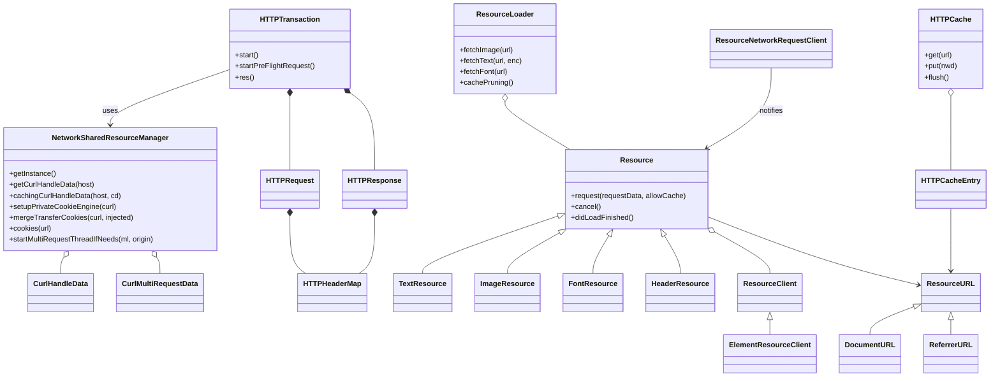
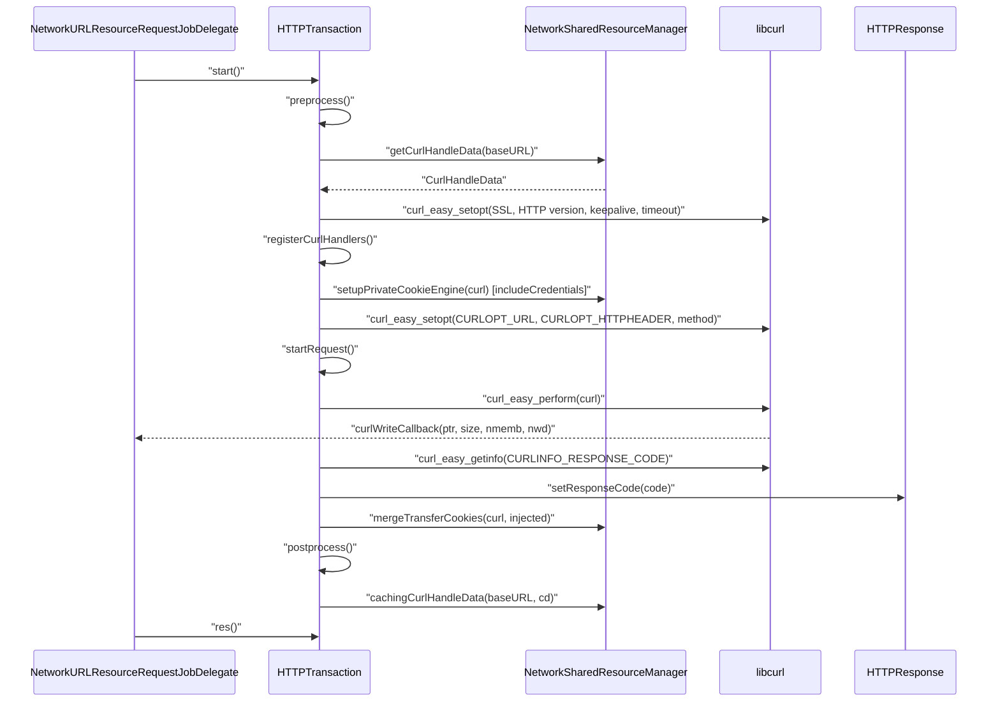

# Functional Requirements: platform-network-loader

> **Relevant source files**
>
> - [src/platform/network/http/HTTPTransaction.cpp](src:src/platform/network/http/HTTPTransaction.cpp)
> - [src/platform/network/http/HTTPTransaction.h](src:src/platform/network/http/HTTPTransaction.h)
> - [src/platform/network/curl/NetworkSharedResourceManager.cpp](src:src/platform/network/curl/NetworkSharedResourceManager.cpp)
> - [src/platform/network/curl/NetworkSharedResourceManager.h](src:src/platform/network/curl/NetworkSharedResourceManager.h)
> - [src/platform/network/http/HTTPCache.cpp](src:src/platform/network/http/HTTPCache.cpp)
> - [src/platform/network/http/HTTPCacheEntry.cpp](src:src/platform/network/http/HTTPCacheEntry.cpp)
> - [src/platform/network/http/HTTPHeaderMap.h](src:src/platform/network/http/HTTPHeaderMap.h)
> - [src/platform/network/http/HTTPStatus.h](src:src/platform/network/http/HTTPStatus.h)
> - [src/platform/network/http/HTTPUtil.cpp](src:src/platform/network/http/HTTPUtil.cpp)
> - [src/platform/loader/ResourceLoader.cpp](src:src/platform/loader/ResourceLoader.cpp)
> - [src/platform/loader/Resource.cpp](src:src/platform/loader/Resource.cpp)
> - [src/platform/loader/ResourceURL.cpp](src:src/platform/loader/ResourceURL.cpp)

**Module**: [`HTTPTransaction.cpp`](src:src/platform/network/http/HTTPTransaction.cpp)
**Version**: 2026-09-10
**Linked Design Card**: [modules/platform-network-loader.md](../modules/platform-network-loader.md)
**Analysis basis**: AST export and direct source reading

## Overview

The network half of the module wraps one libcurl easy handle per transfer in [`HTTPTransaction`](src:src/platform/network/http/HTTPTransaction.h#L46) and centralizes handle reuse, share handles, the cookie store and per-origin multi workers in the singleton [`NetworkSharedResourceManager`](src:src/platform/network/curl/NetworkSharedResourceManager.h#L53). An optional disk cache ([`HTTPCache`](src:src/platform/network/http/HTTPCache.h#L31), compiled under `STARFISH_ENABLE_HTTPCACHE`) stores responses with cache-control and freshness metadata. The loader half gives each document a [`ResourceLoader`](src:src/platform/loader/ResourceLoader.h#L40) that creates typed [`Resource`](src:src/platform/loader/Resource.h#L36) objects, deduplicates image and font loads, notifies [`ResourceClient`](src:src/platform/loader/ResourceClient.h#L27) observers, and fires window `onload` once pending resources reach zero ([`ResourceLoader::fireDocumentOnLoadEventIfNeeded`](src:src/platform/loader/ResourceLoader.cpp#L538)).

## Functional Requirements

### FR-PLATFORM-NETWORK-LOADER-001
**Execute an HTTP request over libcurl**

| Item | Content |
|------|---------|
| **Description** | The module performs a single HTTP(S) request described by an `HTTPRequest` (URL, base URL, method, headers, entity body, credentials flag), streams the response through caller-supplied callbacks, records the response status code and returns the libcurl result code. |
| **Input** | [`HTTPRequest`](src:src/platform/network/http/HTTPRequest.h#L27) set via [`HTTPTransaction::setHTTPRequest`](src:src/platform/network/http/HTTPTransaction.h#L67); write/header/progress/upload callbacks set via [`HTTPTransaction::setWriteCallbackAndData`](src:src/platform/network/http/HTTPTransaction.h#L112) and siblings. |
| **Output** | `CURLcode` from [`HTTPTransaction::res`](src:src/platform/network/http/HTTPTransaction.h#L95); [`HTTPResponse`](src:src/platform/network/http/HTTPResponse.h#L29) with response code, canonical headers, last `Location`, response time; request time stamped on the request. |
| **Preconditions** | An `HTTPRequest` has been attached; `NetworkSharedResourceManager::getInstance()` is reachable. |
| **Postconditions** | Method mapped to curl options (POST→`CURLOPT_POSTFIELDS`, GET→`CURLOPT_HTTPGET`, HEAD→`CURLOPT_NOBODY`, PUT→`CURLOPT_UPLOAD`, PATCH/other→`CURLOPT_CUSTOMREQUEST`); redirects followed up to 128; the header list is freed; the easy handle is returned to the per-host cache on success or destroyed on failure. |
| **Source** | [`HTTPTransaction::start`](src:src/platform/network/http/HTTPTransaction.cpp#L196), [`HTTPTransaction::startRequest`](src:src/platform/network/http/HTTPTransaction.cpp#L420), [`HTTPTransaction::postprocess`](src:src/platform/network/http/HTTPTransaction.cpp#L174) |

**Acceptance criteria**:
- [ ] A POST request sets `CURLOPT_POSTFIELDSIZE`/`CURLOPT_POSTFIELDS` from the entity body and appends an empty `Expect:` header when the caller did not set one ([`HTTPTransaction.cpp`](src:src/platform/network/http/HTTPTransaction.cpp#L229)).
- [ ] After the transfer, `CURLINFO_RESPONSE_CODE` is copied into the response ([`HTTPTransaction::updateTransactionStatus`](src:src/platform/network/http/HTTPTransaction.cpp#L346)).
- [ ] When `res() != CURLE_OK`, the handle is cleaned up and not cached ([`HTTPTransaction::postprocess`](src:src/platform/network/http/HTTPTransaction.cpp#L183)).
- [ ] Response header lines are split at the first `:`, HTTP-whitespace-trimmed, canonicalized and appended to the response header map ([`HTTPTransaction::didReceiveHeader`](src:src/platform/network/http/HTTPTransaction.cpp#L329)).

### FR-PLATFORM-NETWORK-LOADER-002
**Configure transport, TLS checking and connection options**

| Item | Content |
|------|---------|
| **Description** | Before each transfer the module applies a fixed set of connection options and decides whether TLS peer/host checking is disabled, based on build flags, the `IGNORE_SSL_VERIFY` environment variable and a process-wide runtime toggle. |
| **Input** | Build macros `STARFISH_IGNORE_SSL_VERIFYPEER`, `STARFISH_ENABLE_TEST`, `STARFISH_ANDROID`; env vars `IGNORE_SSL_VERIFY`, `STARFISH_CURL_CA_BUNDLE`, `NETWORK_LOG_VERBOSE`; [`setGlobalIgnoreSSLVerify`](src:src/platform/network/http/HTTPTransaction.cpp#L39); `m_timeout`, `m_proxyURL`, `m_useHttp2`. |
| **Output** | Options set on the easy handle: `CURLOPT_SSL_VERIFYPEER`/`VERIFYHOST` 0 when checking is disabled; `CURLOPT_CAINFO` on Android; `CURLOPT_HTTP_VERSION` 2.0 or 1.1; TCP keepalive (idle 60 s, interval 30 s); `CURLOPT_NOSIGNAL`; `CURLOPT_TIMEOUT_MS` (caller value or 10 min); `CURLOPT_AUTOREFERER`; 64 KiB buffers; `CURLOPT_PROXY`; `CURLOPT_ACCEPT_ENCODING ""`. |
| **Preconditions** | A curl handle has been obtained from the handle cache. |
| **Postconditions** | `m_ignoreSSLVerify` is true if any of the three sources requests it; when true and the transfer ends in `CURLE_RECV_ERROR`, the result is remapped to `CURLE_OK`. |
| **Source** | [`HTTPTransaction::HTTPTransaction`](src:src/platform/network/http/HTTPTransaction.cpp#L49), [`HTTPTransaction::preprocess`](src:src/platform/network/http/HTTPTransaction.cpp#L88), [`globalIgnoreSSLVerify`](src:src/platform/network/http/HTTPTransaction.cpp#L44) |

**Acceptance criteria**:
- [ ] With `IGNORE_SSL_VERIFY` set to a non-empty value, `m_ignoreSSLVerify` is true ([`HTTPTransaction.cpp`](src:src/platform/network/http/HTTPTransaction.cpp#L75)).
- [ ] After `setGlobalIgnoreSSLVerify(true)`, every newly constructed transaction starts with checking disabled ([`HTTPTransaction.cpp`](src:src/platform/network/http/HTTPTransaction.cpp#L79)).
- [ ] With `m_timeout == 0`, `CURLOPT_TIMEOUT_MS` is 600000 ([`HTTPTransaction.cpp`](src:src/platform/network/http/HTTPTransaction.cpp#L137)).
- [ ] `useHttp2()` true selects `CURL_HTTP_VERSION_2_0`, otherwise `CURL_HTTP_VERSION_1_1` ([`HTTPTransaction.cpp`](src:src/platform/network/http/HTTPTransaction.cpp#L123)).

### FR-PLATFORM-NETWORK-LOADER-003
**Issue a CORS preflight request**

| Item | Content |
|------|---------|
| **Description** | The module sends an `OPTIONS` preflight for the attached request, carrying only client/general headers plus `Access-Control-Request-Method` and a sorted, lower-cased `Access-Control-Request-Headers` list, without cookies or redirects. |
| **Input** | Attached `HTTPRequest` (method, headers, URL). |
| **Output** | Response code recorded in `HTTPResponse`; `isPreflightReqeustDone()` becomes true; `inPreflightRequest()` is true only while the transfer runs. |
| **Preconditions** | `HTTPRequest` attached; handle obtainable. |
| **Postconditions** | `CURLOPT_FOLLOWLOCATION` 0, `CURLOPT_MAXREDIRS` 0, `CURLOPT_COOKIEJAR`/`CURLOPT_COOKIEFILE` empty, non-cookie share handle used; header list freed; handle returned or destroyed. |
| **Source** | [`HTTPTransaction::startPreFlightRequest`](src:src/platform/network/http/HTTPTransaction.cpp#L285), [`HTTPHeaderMap::generateCurlListToPreflightRequest`](src:src/platform/network/http/HTTPHeaderMap.cpp#L152), [`HTTPHeaderMap::generateAccessControlRequestHeaders`](src:src/platform/network/http/HTTPHeaderMap.cpp#L168) |

**Acceptance criteria**:
- [ ] The outgoing method is `OPTIONS` via `CURLOPT_CUSTOMREQUEST` ([`HTTPTransaction.cpp`](src:src/platform/network/http/HTTPTransaction.cpp#L291)).
- [ ] `Access-Control-Request-Method: <original method>` is appended ([`HTTPTransaction.cpp`](src:src/platform/network/http/HTTPTransaction.cpp#L302)).
- [ ] Non client/general header names are emitted lower-cased, sorted and comma-joined ([`HTTPHeaderMap::generateAccessControlRequestHeaders`](src:src/platform/network/http/HTTPHeaderMap.cpp#L168)).
- [ ] The write callback discards body bytes while `inPreflightRequest()` is true ([`NetworkURLResourceRequestJobDelegate::curlWriteCallback`](src:src/core/modules/resource_request/NetworkURLResourceRequestJobDelegate.cpp#L778)).

### FR-PLATFORM-NETWORK-LOADER-004
**Share and reuse libcurl handles per host**

| Item | Content |
|------|---------|
| **Description** | The module keeps a process-wide multimap of idle easy handles keyed by host, hands one out (reset) for a new transfer or creates a new one, and prunes handles idle for more than 60 s. It also owns two `CURLSH` share handles exporting DNS and SSL-session data. |
| **Input** | Host string (`HTTPRequest::baseURL`) on get/put; `tickCount()` for idle accounting. |
| **Output** | [`CurlHandleData`](src:src/platform/network/curl/NetworkSharedResourceManager.h#L35) with a usable `CURL*`; share handles via [`NetworkSharedResourceManager::curlShareHandle`](src:src/platform/network/curl/NetworkSharedResourceManager.h#L61) and [`NetworkSharedResourceManager::curlNonCookieShareHandle`](src:src/platform/network/curl/NetworkSharedResourceManager.h#L62). |
| **Preconditions** | Singleton constructed: `curl_global_init(CURL_GLOBAL_ALL)`, share handles created with lock callbacks, OpenSSL locks installed on non-Windows/non-Android. |
| **Postconditions** | A cache hit removes the entry and calls `curl_easy_reset`; caching prunes first when the map exceeds 12 entries or 0.5 s elapsed since the last prune; idle handles over 60 s are `curl_easy_cleanup`ed. |
| **Source** | [`NetworkSharedResourceManager::getCurlHandleData`](src:src/platform/network/curl/NetworkSharedResourceManager.cpp#L661), [`NetworkSharedResourceManager::cachingCurlHandleData`](src:src/platform/network/curl/NetworkSharedResourceManager.cpp#L680), [`NetworkSharedResourceManager::pruningIfNeed`](src:src/platform/network/curl/NetworkSharedResourceManager.cpp#L691), [`NetworkSharedResourceManager::NetworkSharedResourceManager`](src:src/platform/network/curl/NetworkSharedResourceManager.cpp#L353) |

**Acceptance criteria**:
- [ ] Requesting a handle for a host with a cached entry returns that handle after `curl_easy_reset` and removes it from the map ([`NetworkSharedResourceManager.cpp`](src:src/platform/network/curl/NetworkSharedResourceManager.cpp#L667)).
- [ ] Requesting a handle for an unknown host returns a fresh `curl_easy_init()` handle ([`NetworkSharedResourceManager.cpp`](src:src/platform/network/curl/NetworkSharedResourceManager.cpp#L674)).
- [ ] Both share handles export `CURL_LOCK_DATA_DNS` and `CURL_LOCK_DATA_SSL_SESSION` and neither exports `CURL_LOCK_DATA_COOKIE` ([`NetworkSharedResourceManager.cpp`](src:src/platform/network/curl/NetworkSharedResourceManager.cpp#L371)).
- [ ] `clearAllCurlHandleDataCache` destroys every cached handle ([`NetworkSharedResourceManager::clearAllCurlHandleDataCache`](src:src/platform/network/curl/NetworkSharedResourceManager.cpp#L718)).

### FR-PLATFORM-NETWORK-LOADER-005
**Maintain the process-wide cookie store**

| Item | Content |
|------|---------|
| **Description** | The module hosts all cookies in a master easy handle that never performs transfers, optionally backed by a Netscape-format file; it seeds each credentialed transfer with a snapshot, merges changed and deleted cookies back after the transfer, and serves `document.cookie` reads/writes and embedder cookie management. |
| **Input** | Cookie store file path ([`NetworkSharedResourceManager::setCookieStoreFilePath`](src:src/platform/network/curl/NetworkSharedResourceManager.h#L64)); the transfer's `CURL*`; `document.cookie` string and URL; Netscape cookie lines. |
| **Output** | `curl_slist` snapshots ([`NetworkSharedResourceManager::allCookies`](src:src/platform/network/curl/NetworkSharedResourceManager.h#L82)); `Cookie` header string for a URL ([`NetworkSharedResourceManager::cookies`](src:src/platform/network/curl/NetworkSharedResourceManager.cpp#L733)); file flushed via `CURLOPT_COOKIELIST "FLUSH"`. |
| **Preconditions** | Access to the master handle happens under the `CURL_LOCK_DATA_COOKIE` mutex ([`NetworkSharedResourceManager::resourceMutex`](src:src/platform/network/curl/NetworkSharedResourceManager.cpp#L656)). |
| **Postconditions** | After merge, only lines that differ from the injected snapshot are written to the master; cookies present in the snapshot but absent from the transfer's store are re-added as already-expired lines (deletion); the store is flushed when a file path is set. |
| **Source** | [`NetworkSharedResourceManager::masterCookieHandleLocked`](src:src/platform/network/curl/NetworkSharedResourceManager.cpp#L476), [`NetworkSharedResourceManager::setupPrivateCookieEngine`](src:src/platform/network/curl/NetworkSharedResourceManager.cpp#L508), [`NetworkSharedResourceManager::mergeTransferCookies`](src:src/platform/network/curl/NetworkSharedResourceManager.cpp#L561), [`NetworkSharedResourceManager::setCookies`](src:src/platform/network/curl/NetworkSharedResourceManager.cpp#L765) |

**Acceptance criteria**:
- [ ] With a non-empty store path, the master handle sets `CURLOPT_COOKIEFILE`/`CURLOPT_COOKIEJAR` to that path and issues `CURLOPT_COOKIELIST "RELOAD"`; with an empty path it enables an in-memory engine only ([`NetworkSharedResourceManager.cpp`](src:src/platform/network/curl/NetworkSharedResourceManager.cpp#L486)).
- [ ] `initCookieSession` issues `CURLOPT_COOKIELIST "SESS"` on the master handle ([`NetworkSharedResourceManager::initCookieSession`](src:src/platform/network/curl/NetworkSharedResourceManager.cpp#L466)).
- [ ] `clearCookies` issues `CURLOPT_COOKIELIST "ALL"` and flushes ([`NetworkSharedResourceManager::clearCookies`](src:src/platform/network/curl/NetworkSharedResourceManager.cpp#L778)).
- [ ] `cookies(url)` returns only cookies whose domain/path match the URL's hostname and pathname ([`NetworkSharedResourceManager.cpp`](src:src/platform/network/curl/NetworkSharedResourceManager.cpp#L152)).
- [ ] `hasCookies` is true iff the master store list is non-empty ([`NetworkSharedResourceManager::hasCookies`](src:src/platform/network/curl/NetworkSharedResourceManager.cpp#L753)).

### FR-PLATFORM-NETWORK-LOADER-006
**Run same-origin transfers on a per-origin multi worker**

| Item | Content |
|------|---------|
| **Description** | When a transaction is created with a `CurlMultiRequestData`, its easy handle is queued to a per-origin worker thread that drives a libcurl multi handle with pipelining/multiplexing and at most one connection per host; the calling thread blocks on a mutex until the worker publishes the result. |
| **Input** | Origin string, `MessageLoop*`, [`CurlMultiRequestData`](src:src/platform/network/curl/NetworkSharedResourceManager.h#L40) (mutex, `CURL*`, result slot). |
| **Output** | `CurlMultiRequestData::m_result` set from `CURLMSG_DONE`; the request mutex unlocked to release the waiting transaction. |
| **Preconditions** | [`NetworkSharedResourceManager::startMultiRequestThreadIfNeeds`](src:src/platform/network/curl/NetworkSharedResourceManager.cpp#L881) has created or restarted the origin's [`CurlMultiData`](src:src/platform/network/curl/NetworkSharedResourceManager.h#L123). |
| **Postconditions** | The worker exits after roughly 3 s with no pending requests and marks itself `m_finishing`; a later append restarts it via a message-loop idler; on manager destruction all workers are stopped and joined. |
| **Source** | [`NetworkSharedResourceManager::curlMultiWorker`](src:src/platform/network/curl/NetworkSharedResourceManager.cpp#L788), [`NetworkSharedResourceManager::appendPendingMultiRequest`](src:src/platform/network/curl/NetworkSharedResourceManager.cpp#L902), [`HTTPTransaction::startRequest`](src:src/platform/network/http/HTTPTransaction.cpp#L420) |

**Acceptance criteria**:
- [ ] The multi handle is created with `CURLMOPT_PIPELINING = CURLPIPE_MULTIPLEX` and `CURLMOPT_MAX_HOST_CONNECTIONS = 1` ([`NetworkSharedResourceManager.cpp`](src:src/platform/network/curl/NetworkSharedResourceManager.cpp#L797)).
- [ ] Each queued handle gets `CURLOPT_PRIVATE` pointing at its `CurlMultiRequestData` so completion can be routed back ([`NetworkSharedResourceManager.cpp`](src:src/platform/network/curl/NetworkSharedResourceManager.cpp#L806)).
- [ ] With no running transfers the loop sleeps 50 ms per iteration and exits after `3 * 1000 * 1000 / sleepTime` idle iterations when nothing is pending ([`NetworkSharedResourceManager.cpp`](src:src/platform/network/curl/NetworkSharedResourceManager.cpp#L851)).
- [ ] Remaining request mutexes are unlocked when the worker exits so no caller stays blocked ([`NetworkSharedResourceManager.cpp`](src:src/platform/network/curl/NetworkSharedResourceManager.cpp#L860)).

### FR-PLATFORM-NETWORK-LOADER-007
**Cache HTTP responses on disk with freshness rules**

| Item | Content |
|------|---------|
| **Description** | Under `STARFISH_ENABLE_HTTPCACHE`, the module stores response bodies as files in a locked cache directory, indexes them with cache-control, content and freshness metadata, serves entries by URL with LRU ordering, evicts by size, expires stale entries and persists the index on flush. |
| **Input** | Cache directory path; `NetworkURLWorkerData` (request URL, response body and headers); cache mode `LOAD_DEFAULT` or `LOAD_NO_CACHE`. |
| **Output** | `Optional<HTTPCacheEntry*>` from [`HTTPCache::get`](src:src/platform/network/http/HTTPCache.cpp#L257); entry files and `"/index.txt"` written by [`HTTPCache::flush`](src:src/platform/network/http/HTTPCache.cpp#L464). |
| **Preconditions** | Directory created/opened and `flock`-locked; if the index cannot be restored the directory is cleared ([`HTTPCache::HTTPCache`](src:src/platform/network/http/HTTPCache.cpp#L52)); table-mutating calls run on the main thread. |
| **Postconditions** | `put` rejects when: an entry exists, content length is 0, block size exceeds `MAX_ENTRY_FILE_SIZE`, `no-store`, or `max-age == 0` without ETag, or space cannot be reclaimed; total block size stays under `DEFAULT_HTTP_CACHE_SIZE`. |
| **Source** | [`HTTPCache::put`](src:src/platform/network/http/HTTPCache.cpp#L323), [`HTTPCache::pruneAsNeededForCacheSpace`](src:src/platform/network/http/HTTPCache.cpp#L509), [`HTTPCache::expire`](src:src/platform/network/http/HTTPCache.cpp#L589), [`HTTPCacheEntry::isFresh`](src:src/platform/network/http/HTTPCacheEntry.cpp#L179) |

**Acceptance criteria**:
- [ ] `get` returns nothing in `LOAD_NO_CACHE` mode or when the entry fails `canUse()`/`isConsistent()`; a hit moves the URL to the LRU tail ([`HTTPCache::get`](src:src/platform/network/http/HTTPCache.cpp#L257)).
- [ ] An entry is fresh when `maxAge` exceeds the current age computed from `Date`, `Age`, request/response times and resident time ([`HTTPCacheEntry::isFresh`](src:src/platform/network/http/HTTPCacheEntry.cpp#L179)).
- [ ] `shouldReValidate` is true when not fresh, an ETag exists, or `must-revalidate`/`no-cache` is set; `shouldExpire` requires `usingCount == 0` and (`no-store` or stale without ETag) ([`HTTPCacheEntry::shouldReValidate`](src:src/platform/network/http/HTTPCacheEntry.h#L59)).
- [ ] `flush` runs `expire`, reserves index space, checks consistency (clearing the directory if inconsistent), writes one `toString()` line per LRU item and unlocks ([`HTTPCache::flush`](src:src/platform/network/http/HTTPCache.cpp#L464)).
- [ ] On start the index is consumed and deleted; a mismatch between file count and index rows aborts restoration ([`HTTPCache::initFromIndexFileIfPossible`](src:src/platform/network/http/HTTPCache.cpp#L137)).
- [ ] `setCacheMode` accepts only `LOAD_DEFAULT` and `LOAD_NO_CACHE` ([`HTTPCache::setCacheMode`](src:src/platform/network/http/HTTPCache.h#L60)).

### FR-PLATFORM-NETWORK-LOADER-008
**Canonicalize headers and classify status codes**

| Item | Content |
|------|---------|
| **Description** | The module maps case-insensitive raw header names onto a fixed set of known spellings, converts header maps to libcurl lists, parses `Cache-Control` directives and freshness/content headers, and provides the status-code table with reason phrases and 2xx/3xx classification. |
| **Input** | Raw header name/value strings; `Cache-Control` directive string; a `HeaderMap`; a numeric response code. |
| **Output** | Canonical name from [`HTTPUtil::tryToConvertToHeaderMapString`](src:src/platform/network/http/HTTPUtil.cpp#L29); [`CacheControl`](src:src/platform/network/http/HTTPUtil.h#L33), [`HTTPFreshnessInfo`](src:src/platform/network/http/HTTPUtil.h#L62), [`HTTPContentInfo`](src:src/platform/network/http/HTTPUtil.h#L47); reason phrase from [`httpStatusCodeToText`](src:src/platform/network/http/HTTPStatus.h#L100); `curl_slist` from [`HTTPHeaderMap::generateCurlList`](src:src/platform/network/http/HTTPHeaderMap.cpp#L126). |
| **Preconditions** | None. |
| **Postconditions** | Unknown names pass through unchanged; unknown codes in [200, 300) map to `"OK"`, other unknown codes to the empty string. |
| **Source** | [`FOR_EACH_HTTPHEADERS`](src:src/platform/network/http/HTTPHeaderMap.h#L28), [`STARFISH_ENUM_HTTP_STATUS`](src:src/platform/network/http/HTTPStatus.h#L33), [`HTTPUtil::parseCacheControl`](src:src/platform/network/http/HTTPUtil.cpp#L205), [`HTTPResponse::isSuccessfulResponseStatus`](src:src/platform/network/http/HTTPResponse.cpp#L40) |

**Acceptance criteria**:
- [ ] `parseCacheControl("no-cache, max-age=60")` yields `noCache == true` and `maxAge == 60`; `no-store` and `must-revalidate` set their flags ([`HTTPUtil::parseCacheControl`](src:src/platform/network/http/HTTPUtil.cpp#L205)).
- [ ] `getHTTPFreshnessInfoFromHeaders` fills `date`/`lastModified` (seconds) from parsed dates, `age` as an integer and `etag` verbatim ([`HTTPUtil::getHTTPFreshnessInfoFromHeaders`](src:src/platform/network/http/HTTPUtil.cpp#L243)).
- [ ] `isSuccessfulResponseStatus` is true for [200, 300) and `isRedirectionResponseStatus` for [300, 400) ([`HTTPResponse::isRedirectionResponseStatus`](src:src/platform/network/http/HTTPResponse.cpp#L49)).
- [ ] Each entry of the header map becomes one `"Name: value"` list item ([`HTTPHeaderMap::generateCurlList`](src:src/platform/network/http/HTTPHeaderMap.cpp#L126)).

### FR-PLATFORM-NETWORK-LOADER-009
**Fetch typed document resources and notify observers**

| Item | Content |
|------|---------|
| **Description** | For a document, the module creates generic, text, image, font or header-only resources for a URL, issues the underlying `ResourceRequest` with a type-specific `Accept` header, tracks state transitions and forwards header/data/finished/failed/canceled notifications to registered clients, including element `load`/`error` events. |
| **Input** | `ResourceURL*`, optional preferred encoding; `RequestData` (referrer, sync level, URL) and `allowCache` on [`Resource::request`](src:src/platform/loader/Resource.cpp#L60); `ResourceClient` observers. |
| **Output** | [`TextResource::text`](src:src/platform/loader/TextResource.h#L70) (decoded, concatenated), [`ImageResource::imageData`](src:src/platform/loader/ImageResource.h#L72) (decoded native image, or an SVG rendered through a mock iframe), [`FontResource::fontFace`](src:src/platform/loader/FontResource.h#L54); [`Resource::State`](src:src/platform/loader/Resource.h#L42) and [`Resource::requestErrorType`](src:src/platform/loader/Resource.h#L237). |
| **Preconditions** | `request` is called once in `BeforeSend`; `requestData->m_referrer` is set. |
| **Postconditions** | State becomes `Receiving`, then exactly one of `Finished`/`Failed`/`Canceled`; clients are cleared after the terminal callback; on cancel pending idlers are removed and the request aborted unless another resource depends on it. |
| **Source** | [`ResourceLoader::fetchImage`](src:src/platform/loader/ResourceLoader.cpp#L75), [`Resource::request`](src:src/platform/loader/Resource.cpp#L60), [`ResourceNetworkRequestClient::onProgressEvent`](src:src/platform/loader/Resource.h#L280), [`ElementResourceClient::didLoadFinished`](src:src/platform/loader/ElementResourceClient.cpp#L34) |

**Acceptance criteria**:
- [ ] `fetchImage` records the current device pixel ratio on the resource ([`ResourceLoader::fetchImage`](src:src/platform/loader/ResourceLoader.cpp#L75)).
- [ ] `prepare()` sets `Accept` to `*/*` (generic/image), `application/x-font-ttf,application/x-font-woff` (font) or the text list (text) ([`FontResource::prepare`](src:src/platform/loader/FontResource.h#L38), [`TextResource::prepare`](src:src/platform/loader/TextResource.h#L41)).
- [ ] A form-submitting document URL over HTTP(S) sets `Content-type`, `Accept-Charset`, `Origin`, `Pragma`/`Cache-Control: no-cache`, and encodes the form data set as GET query or POST body ([`Resource.cpp`](src:src/platform/loader/Resource.cpp#L77)).
- [ ] `ProgressState::Load` triggers `didDataReceived` then `didLoadFinished`; `InError`/`TimeOut` trigger `didLoadFailed` ([`Resource.h`](src:src/platform/loader/Resource.h#L280)).
- [ ] `TextResource::didDataReceived` creates a converter from the response MIME type and document charset (or the preferred encoding) on first data and appends converted text ([`TextResource::didDataReceived`](src:src/platform/loader/TextResource.cpp#L29)).
- [ ] `FontResource::didLoadFinished` fails the resource when `FontFace::create` returns null ([`FontResource::didLoadFinished`](src:src/platform/loader/FontResource.cpp#L32)).
- [ ] `ElementResourceClient` dispatches `load`/`error` synchronously when `needsSyncEventDispatch`, otherwise after the remaining transform/opacity animation time via a timer that `cancelDispatchedEventIfExists` can cancel ([`ElementResourceClient::didLoadFailed`](src:src/platform/loader/ElementResourceClient.cpp#L59), [`ElementResourceClient::cancelDispatchedEventIfExists`](src:src/platform/loader/ElementResourceClient.cpp#L84)).

### FR-PLATFORM-NETWORK-LOADER-010
**Deduplicate and prune in-memory image and font resources**

| Item | Content |
|------|---------|
| **Description** | Per document, the module keeps URL-keyed image and font resource caches; a second request for a cached URL reuses the original resource (immediately, via idler, or by watching an in-flight load) instead of issuing a new network request, and periodically evicts unreferenced or least-recently-used images when the cache grows beyond configured fractions of `STARFISH_RESOURCE_CACHE_SIZE`. |
| **Input** | `Resource*` and `RequestSyncLevel` on [`ResourceLoader::requestResourcePreprocess`](src:src/platform/loader/ResourceLoader.cpp#L435); frame tree and computed styles during [`ResourceLoader::cachePruning`](src:src/platform/loader/ResourceLoader.cpp#L289). |
| **Output** | `true` on cache hit (no network); [`Resource::didCacheHit`](src:src/platform/loader/Resource.h#L167) copies decoded data and error type into the new resource; `m_resourceCacheSize` updated. |
| **Preconditions** | Sync level is not `AlwaysSync`; `cachePruning` is called after rendering. |
| **Postconditions** | New image/font resources register a `ResourceLoaderTracer` that accounts content size on finish and removes cache entries on cancel; a cached original hit by another resource is marked `m_isReferencedByAnoterResource`. |
| **Source** | [`ResourceLoader::cacheHit`](src:src/platform/loader/ResourceLoader.cpp#L504), [`ResourceLoaderTracer`](src:src/platform/loader/ResourceLoader.cpp#L178), [`ResourceWatcher`](src:src/platform/loader/ResourceLoader.cpp#L232), [`ResourceLoader.cpp`](src:src/platform/loader/ResourceLoader.cpp#L45) |

**Acceptance criteria**:
- [ ] A hit on a `Finished` original with `SyncIfAlreadyLoaded` calls `didCacheHit` synchronously; with `NeverSync` it is deferred to a message-loop idler ([`ResourceLoader::cacheHit`](src:src/platform/loader/ResourceLoader.cpp#L504)).
- [ ] A hit on a `Failed` original defers `didLoadFailed` on the new resource; a hit on an in-flight original attaches a `ResourceWatcher` ([`ResourceLoader.cpp`](src:src/platform/loader/ResourceLoader.cpp#L523)).
- [ ] Pruning runs only when cache size exceeds 75% and downloaded content exceeds 50% of `STARFISH_RESOURCE_CACHE_SIZE`; it first removes finished images not referenced by the frame tree, then LRU images until 25% is reclaimed or the size drops under 50% ([`ResourceLoader::cachePruning`](src:src/platform/loader/ResourceLoader.cpp#L294)).
- [ ] `clearImageResourceCache` empties the lookup table and LRU list without cancelling in-flight requests ([`ResourceLoader::clearImageResourceCache`](src:src/platform/loader/ResourceLoader.h#L77)).

### FR-PLATFORM-NETWORK-LOADER-011
**Track document open state, onload and load progress**

| Item | Content |
|------|---------|
| **Description** | While a document is opening, the module counts pending resources that affect `window.onload` (propagating counts to the top-level browsing context), fires the document's `load` event exactly once when the count reaches zero after parsing, and reports coarse load progress and per-resource completion to the embedder. |
| **Input** | [`ResourceLoader::markDocumentOpenState`](src:src/platform/loader/ResourceLoader.cpp#L704), [`ResourceLoader::notifyEndParseDocument`](src:src/platform/loader/ResourceLoader.h#L59), resource completions via [`DocumentOnLoadChecker`](src:src/platform/loader/ResourceLoader.cpp#L94) and [`ResourceAliveChecker`](src:src/platform/loader/ResourceLoader.cpp#L132), [`ResourceLoader::setLoadProgressState`](src:src/platform/loader/ResourceLoader.cpp#L662). |
| **Output** | `Window` `load` event dispatched by UA; `readyState` set to complete; `OnProgressChanged` (10 at start, up to 99, 100 at `DomContentLoaded`), `OnLoadResource` and `OnPageLoaded` public handlers invoked. |
| **Preconditions** | `m_isDocumentInOpenState` true and `m_onLoadFired` false. |
| **Postconditions** | `m_isDocumentInOpenState` cleared and `m_onLoadFired` set before scheduling the event; child browsing contexts notify their source element instead of `OnPageLoaded`. |
| **Source** | [`ResourceLoader::fireDocumentOnLoadEventIfNeeded`](src:src/platform/loader/ResourceLoader.cpp#L538), [`ResourceLoader::decreasePendingResourceCountWhileDocumentOpening`](src:src/platform/loader/ResourceLoader.cpp#L415), [`ResourceLoader::updateLoadProgress`](src:src/platform/loader/ResourceLoader.cpp#L673) |

**Acceptance criteria**:
- [ ] A resource requested while the document is open and marked as affecting onload increments the pending count and gains a `DocumentOnLoadChecker` and a leading `ResourceAliveChecker` ([`ResourceLoader.cpp`](src:src/platform/loader/ResourceLoader.cpp#L438)).
- [ ] `DocumentOnLoadChecker` decrements the count at most once per resource regardless of finish/fail/cancel ([`ResourceLoader.cpp`](src:src/platform/loader/ResourceLoader.cpp#L119)).
- [ ] `cancelAllOfPendingRequests` resets the pending count and cancels each resource in `m_currentLoadingResources` ([`ResourceLoader::cancelAllOfPendingRequests`](src:src/platform/loader/ResourceLoader.cpp#L635)).
- [ ] Progress never reports 100 before `DomContentLoaded`; intermediate values are capped at 99 ([`ResourceLoader.cpp`](src:src/platform/loader/ResourceLoader.cpp#L688)).

### FR-PLATFORM-NETWORK-LOADER-012
**Parse and manipulate resource URLs**

| Item | Content |
|------|---------|
| **Description** | The module parses absolute or base-relative URL strings into protocol and component offsets, exposes typed protocol predicates and component getters/setters, percent-encodes/decodes strings, computes origins and referrer strings under a referrer policy, and distinguishes document URLs (with form submit data) from referrer URLs. |
| **Input** | URL string and optional base URL; component strings for setters; `ReferrerPolicy`. |
| **Output** | [`ResourceURL::Protocol`](src:src/platform/loader/ResourceURL.h#L35); `isValid()`; `urlString`, `origin`, `href`, `protocol`, `host`, `port`, `pathname`, `search`, `hash`; [`ReferrerURL::referrerString`](src:src/platform/loader/ResourceURL.cpp#L1366). |
| **Preconditions** | None. |
| **Postconditions** | Component end offsets (`m_protocolEnd` … `m_hashEnd`) are consistent with `m_urlString`; ports above `MAX_PORT_NUMBER` or with more than `MAX_PORT_DIGITS` digits are invalid. |
| **Source** | [`ResourceURL::parseURLString`](src:src/platform/loader/ResourceURL.cpp#L611), [`ResourceURL::resolvePositions`](src:src/platform/loader/ResourceURL.cpp#L492), [`ResourceURL::isValidURL`](src:src/platform/loader/ResourceURL.cpp#L368), [`ResourceURL::isValidPort`](src:src/platform/loader/ResourceURL.cpp#L780) |

**Acceptance criteria**:
- [ ] `isHTTPFamilyURL` is true for `http:` and `https:` URLs only ([`ResourceURL::isHTTPFamilyURL`](src:src/platform/loader/ResourceURL.h#L134)).
- [ ] `aboutBlankURL()` yields a URL whose string is `about:blank` ([`ResourceURL::aboutBlankURL`](src:src/platform/loader/ResourceURL.h#L86)).
- [ ] `isDefaultPortForProtocol` recognizes the protocol's default port so it is omitted from serialization ([`ResourceURL::isDefaultPortForProtocol`](src:src/platform/loader/ResourceURL.cpp#L1248)).
- [ ] `mergeDocumentURIWithURIString` resolves a relative reference against the document URI ([`ResourceURL::mergeDocumentURIWithURIString`](src:src/platform/loader/ResourceURL.cpp#L804)).

## Non-Functional Requirements

| Item | Requirement | Source |
|------|-------------|--------|
| Performance | Idle libcurl handles are reused per host and pruned only after 60 s idle so media segment fetches keep TCP/TLS connections warm; the handle map is pruned when it exceeds 12 entries or every 0.5 s. | [`NetworkSharedResourceManager.cpp`](src:src/platform/network/curl/NetworkSharedResourceManager.cpp#L42) |
| Performance | Transfer buffers are 64 KiB; TCP keepalive idle 60 s / interval 30 s. | [`HTTPTransaction::preprocess`](src:src/platform/network/http/HTTPTransaction.cpp#L130) |
| Performance | Per-origin multi worker limits to one connection per host and sleeps 50 ms between polls when idle. | [`NetworkSharedResourceManager::curlMultiWorker`](src:src/platform/network/curl/NetworkSharedResourceManager.cpp#L788) |
| Performance | In-memory image cache pruning is bounded by `STARFISH_RESOURCE_CACHE_SIZE` (4 MiB default) fractions; disk cache bounded by `DEFAULT_HTTP_CACHE_SIZE` (50 MiB) and per-entry `MAX_ENTRY_FILE_SIZE` (4%). | [`ResourceLoader.cpp`](src:src/platform/loader/ResourceLoader.cpp#L45), [`HTTPCache.cpp`](src:src/platform/network/http/HTTPCache.cpp#L44) |
| Security | TLS peer/host checking is on unless disabled by `STARFISH_IGNORE_SSL_VERIFYPEER`/`STARFISH_ENABLE_TEST`, the `IGNORE_SSL_VERIFY` environment variable, or the runtime toggle. | [`HTTPTransaction::HTTPTransaction`](src:src/platform/network/http/HTTPTransaction.cpp#L69) |
| Security | Cookies are never attached to non-credentialed or preflight requests; cookie state is not exported via `CURLSH`. | [`HTTPTransaction::start`](src:src/platform/network/http/HTTPTransaction.cpp#L214), [`NetworkSharedResourceManager.cpp`](src:src/platform/network/curl/NetworkSharedResourceManager.cpp#L369) |
| Security | The cache directory is exclusively locked (`flock LOCK_EX | LOCK_NB`); an inconsistent cache is wiped rather than served. | [`HTTPCache::lock`](src:src/platform/network/http/HTTPCache.cpp#L82), [`HTTPCache::flush`](src:src/platform/network/http/HTTPCache.cpp#L480) |
| Error handling | Failed transfers (`res() != CURLE_OK`) drop the handle; `CURLE_RECV_ERROR` is tolerated only when TLS checking is disabled; consumers map `CURLE_OPERATION_TIMEDOUT`, `CURLE_COULDNT_RESOLVE_HOST`, `CURLE_COULDNT_CONNECT`, `CURLE_UNSUPPORTED_PROTOCOL` to typed request errors. | [`HTTPTransaction::postprocess`](src:src/platform/network/http/HTTPTransaction.cpp#L174), [`NetworkURLWorkerHelper::responseHandler`](src:src/core/modules/resource_request/NetworkURLResourceRequestJobDelegate.cpp#L318) |
| Error handling | Image decode failure or empty body marks the resource `Failed`; a missing `FontFace` fails the font resource. | [`ImageResource::didLoadFinished`](src:src/platform/loader/ImageResource.cpp#L137), [`FontResource::didLoadFinished`](src:src/platform/loader/FontResource.cpp#L32) |
| Logging | Cache failures are logged with `STARFISH_LOG_ERROR` (`[HTTPCache] ...`); pruning results with `STARFISH_LOG_INFO`; per-request curl statistics and cookie dumps only under `STARFISH_ENABLE_TEST`. | [`HTTPCache::put`](src:src/platform/network/http/HTTPCache.cpp#L360), [`ResourceLoader::cachePruning`](src:src/platform/loader/ResourceLoader.cpp#L380), [`HTTPTransaction::printCurlRequestDump`](src:src/platform/network/http/HTTPTransaction.cpp#L440) |

## Constraints

- The disk cache exists only when `STARFISH_ENABLE_HTTPCACHE` is defined ([`HTTPCache.h`](src:src/platform/network/http/HTTPCache.h#L19)); it is enabled in [`config.cmake`](src:build/config.cmake#L127).
- `HTTPCache` table operations assert the main thread ([`HTTPCache::get`](src:src/platform/network/http/HTTPCache.cpp#L259)).
- `HTTPTransaction::abort` is not implemented and asserts if called ([`HTTPTransaction::abort`](src:src/platform/network/http/HTTPTransaction.h#L61)).
- Cache block size uses `BLKGETSIZE`, and directory locking uses `flock`, so the cache is POSIX/Linux-specific ([`HTTPCache.cpp`](src:src/platform/network/http/HTTPCache.cpp#L50)).
- OpenSSL locking callbacks are installed only on non-Windows, non-Android builds; Android requires `STARFISH_CURL_CA_BUNDLE` to be set ([`NetworkSharedResourceManager.cpp`](src:src/platform/network/curl/NetworkSharedResourceManager.cpp#L39), [`HTTPTransaction.cpp`](src:src/platform/network/http/HTTPTransaction.cpp#L120)).
- Multi-threaded image decoding is compiled only under `STARFISH_ENABLE_MULTI_THREAD_IMAGE_DECODING`; garbage-collected image sweep in `cachePruning` is skipped on Windows ([`ImageResource.cpp`](src:src/platform/loader/ImageResource.cpp#L191), [`ResourceLoader.cpp`](src:src/platform/loader/ResourceLoader.cpp#L347)).

## Module Design Card Linkage

| FR | Implementation | Design Card section |
|----|----------------|---------------------|
| FR-PLATFORM-NETWORK-LOADER-001 | [`HTTPTransaction::start`](src:src/platform/network/http/HTTPTransaction.cpp#L196) | [Key Flow](../modules/platform-network-loader.md#key-flow) |
| FR-PLATFORM-NETWORK-LOADER-002 | [`HTTPTransaction::preprocess`](src:src/platform/network/http/HTTPTransaction.cpp#L88) | [IPC / Message / Interface Contracts](../modules/platform-network-loader.md#ipc--message--interface-contracts) |
| FR-PLATFORM-NETWORK-LOADER-003 | [`HTTPTransaction::startPreFlightRequest`](src:src/platform/network/http/HTTPTransaction.cpp#L285) | [IPC / Message / Interface Contracts](../modules/platform-network-loader.md#ipc--message--interface-contracts) |
| FR-PLATFORM-NETWORK-LOADER-004 | [`NetworkSharedResourceManager::getCurlHandleData`](src:src/platform/network/curl/NetworkSharedResourceManager.cpp#L661) | [Architectural Rules](../modules/platform-network-loader.md#architectural-rules) |
| FR-PLATFORM-NETWORK-LOADER-005 | [`NetworkSharedResourceManager::mergeTransferCookies`](src:src/platform/network/curl/NetworkSharedResourceManager.cpp#L561) | [IPC / Message / Interface Contracts](../modules/platform-network-loader.md#ipc--message--interface-contracts) |
| FR-PLATFORM-NETWORK-LOADER-006 | [`NetworkSharedResourceManager::curlMultiWorker`](src:src/platform/network/curl/NetworkSharedResourceManager.cpp#L788) | [Key Flow](../modules/platform-network-loader.md#key-flow) |
| FR-PLATFORM-NETWORK-LOADER-007 | [`HTTPCache::put`](src:src/platform/network/http/HTTPCache.cpp#L323) | [IPC / Message / Interface Contracts](../modules/platform-network-loader.md#ipc--message--interface-contracts) |
| FR-PLATFORM-NETWORK-LOADER-008 | [`HTTPUtil::tryToConvertToHeaderMapString`](src:src/platform/network/http/HTTPUtil.cpp#L29) | [Quick Navigation](../modules/platform-network-loader.md#quick-navigation) |
| FR-PLATFORM-NETWORK-LOADER-009 | [`Resource::request`](src:src/platform/loader/Resource.cpp#L60) | [Key Flow](../modules/platform-network-loader.md#key-flow) |
| FR-PLATFORM-NETWORK-LOADER-010 | [`ResourceLoader::requestResourcePreprocess`](src:src/platform/loader/ResourceLoader.cpp#L435) | [Architectural Rules](../modules/platform-network-loader.md#architectural-rules) |
| FR-PLATFORM-NETWORK-LOADER-011 | [`ResourceLoader::fireDocumentOnLoadEventIfNeeded`](src:src/platform/loader/ResourceLoader.cpp#L538) | [Public Interface](../modules/platform-network-loader.md#public-interface) |
| FR-PLATFORM-NETWORK-LOADER-012 | [`ResourceURL::parseURLString`](src:src/platform/loader/ResourceURL.cpp#L611) | [Public Interface](../modules/platform-network-loader.md#public-interface) |

## ENUM Definitions

| ENUM | Values | Used in | Source |
|------|--------|---------|--------|
| `Resource::State` | `BeforeSend`, `Receiving`, `Finished`, `Failed`, `Canceled` | Resource lifecycle, loader cache hit decisions | [`Resource::State`](src:src/platform/loader/Resource.h#L42) |
| `Resource::Type` | `ResourceType`, `ImageResourceType`, `TextResourceType`, `FontResourceType` | `Resource::type()` overrides | [`Resource::Type`](src:src/platform/loader/Resource.h#L50) |
| `ResourceURL::Protocol` | `FILE_PROTOCOL`, `BLOB_PROTOCOL`, `DATA_PROTOCOL`, `ABOUT_PROTOCOL`, `HTTP_PROTOCOL`, `HTTPS_PROTOCOL`, `JAVASCRIPT_PROTOCOL`, `WS_PROTOCOL`, `WSS_PROTOCOL`, `UNKNOWN` | URL scheme predicates | [`ResourceURL::Protocol`](src:src/platform/loader/ResourceURL.h#L35) |
| `HTTPStatusCode` | 59 values `HTTP_STATUS_CONTINUE` (100) … `HTTP_STATUS_NETWORK_AUTHENTICATION_REQUIRED` (511), generated from `STARFISH_ENUM_HTTP_STATUS`; includes `HTTP_STATUS_UNAUTHORIZED` (401) | Status classification, fetch/XHR status text, EventSource checks | [`HTTPStatusCode`](src:src/platform/network/http/HTTPStatus.h#L94) |
| `ReferrerPolicy` | `NoReferrer`, `NoReferrerWhenDowngrade`, `Origin`, `OriginWhenCrossOrigin`, `SameOrigin`, `StrictOrigin`, `StrictOriginWhenCrossOrigin`, `UnsafeUrl`, `Empty` | `ReferrerURL::referrerString` | [`ReferrerPolicy`](src:src/platform/loader/ResourceURL.h#L282) |
| `ResourceLoader::LoadProgressState` | `Normal`, `ParsingEnd`, `DomContentLoaded` | Load progress reporting | [`ResourceLoader::LoadProgressState`](src:src/platform/loader/ResourceLoader.h#L48) |

## Error Code Definitions

None found in code (no `error_code`-typed or `ERR_`/`ERROR_`/`EXIT_` constants are defined in this module). The transport result is a libcurl `CURLcode`; the consumer-side mapping is:

| Error code | Value | Trigger | Recovery | Source |
|------------|-------|---------|----------|--------|
| `CURLE_OPERATION_TIMEDOUT` | libcurl result | `CURLOPT_TIMEOUT_MS` elapsed | `handleError(ProgressState::TimeOut, RequestErrorType::TimeoutError)` | [`NetworkURLWorkerHelper::responseHandler`](src:src/core/modules/resource_request/NetworkURLResourceRequestJobDelegate.cpp#L318) |
| `CURLE_COULDNT_RESOLVE_HOST` | libcurl result | DNS failure | `RequestErrorType::HostLookupError` | [`NetworkURLResourceRequestJobDelegate.cpp`](src:src/core/modules/resource_request/NetworkURLResourceRequestJobDelegate.cpp#L331) |
| `CURLE_COULDNT_CONNECT` | libcurl result | TCP connect failure | `RequestErrorType::ConnectError` | [`NetworkURLResourceRequestJobDelegate.cpp`](src:src/core/modules/resource_request/NetworkURLResourceRequestJobDelegate.cpp#L335) |
| `CURLE_UNSUPPORTED_PROTOCOL` | libcurl result | Scheme not supported by libcurl | `RequestErrorType::UnsupportedSchemeError` | [`NetworkURLResourceRequestJobDelegate.cpp`](src:src/core/modules/resource_request/NetworkURLResourceRequestJobDelegate.cpp#L339) |
| `CURLE_ABORTED_BY_CALLBACK` / `CURLE_WRITE_ERROR` | libcurl result | Progress/write callback returned non-zero after abort | Treated as caller-initiated abort; no response handling | [`NetworkURLResourceRequestJobDelegate::networkWorker`](src:src/core/modules/resource_request/NetworkURLResourceRequestJobDelegate.cpp#L183) |
| `CURLE_RECV_ERROR` | libcurl result | Receive failure while TLS checking disabled | Remapped to `CURLE_OK` | [`HTTPTransaction.cpp`](src:src/platform/network/http/HTTPTransaction.cpp#L266) |
| other `CURLE_*` | libcurl result | Any other transfer failure | `RequestErrorType::UnknownError`, response status forced to 0 | [`NetworkURLResourceRequestJobDelegate.cpp`](src:src/core/modules/resource_request/NetworkURLResourceRequestJobDelegate.cpp#L342) |

## Constant Definitions

| Constant | Value | Purpose | Source |
|----------|-------|---------|--------|
| `STARFISH_RESOURCE_CACHE_SIZE` | `1024 * 1024 * 4` | In-memory image/font cache budget for pruning thresholds | [`ResourceLoader.cpp`](src:src/platform/loader/ResourceLoader.cpp#L45) |
| `MAX_PORT_DIGITS` | `5` | Port validation | [`ResourceURL.cpp`](src:src/platform/loader/ResourceURL.cpp#L25) |
| `MAX_PORT_NUMBER` | `65535` | Port validation | [`ResourceURL.cpp`](src:src/platform/loader/ResourceURL.cpp#L26) |
| `CURLHANDLE_CACHE_PRUNE_MINIMUM_SIZE` | `12` | Handle-cache size that forces a prune pass | [`NetworkSharedResourceManager.cpp`](src:src/platform/network/curl/NetworkSharedResourceManager.cpp#L42) |
| `CURLHANDLE_CACHE_PRUNE_MINIMUM_INTERVAL_S` | `0.5` | Minimum seconds between prune passes | [`NetworkSharedResourceManager.cpp`](src:src/platform/network/curl/NetworkSharedResourceManager.cpp#L43) |
| `CURLHANDLE_CACHE_IDLE_TIME_LIMIT_S` | `60` | Idle seconds before a cached handle is destroyed | [`NetworkSharedResourceManager.cpp`](src:src/platform/network/curl/NetworkSharedResourceManager.cpp#L50) |
| `CURLPIPE_MULTIPLEX` | `0` (fallback when the libcurl header lacks it) | Multi-handle pipelining mode | [`NetworkSharedResourceManager.cpp`](src:src/platform/network/curl/NetworkSharedResourceManager.cpp#L795), [`HTTPTransaction.cpp`](src:src/platform/network/http/HTTPTransaction.cpp#L161) |
| `CURLMOPT_MAX_HOST_CONNECTIONS` setting | `1L` | One connection per host on the multi worker | [`NetworkSharedResourceManager.cpp`](src:src/platform/network/curl/NetworkSharedResourceManager.cpp#L798) |
| `waitTime` / `sleepTime` | `1000` ms / `1000 * 50` µs | `curl_multi_wait` timeout and idle sleep in the worker loop | [`NetworkSharedResourceManager.cpp`](src:src/platform/network/curl/NetworkSharedResourceManager.cpp#L817) |
| `INDEX_FILE_NAME` | `"/index.txt"` | Disk cache index file name | [`HTTPCache.cpp`](src:src/platform/network/http/HTTPCache.cpp#L43) |
| `DEFAULT_HTTP_CACHE_SIZE` | `1024 * 1024 * 50` | Disk cache size limit | [`HTTPCache.cpp`](src:src/platform/network/http/HTTPCache.cpp#L44) |
| `MAX_ENTRY_FILE_SIZE` | `(DEFAULT_HTTP_CACHE_SIZE * 0.04)` | Largest single cacheable entry | [`HTTPCache.cpp`](src:src/platform/network/http/HTTPCache.cpp#L45) |
| `NUM_OF_COL` | `18` | Fields per index line | [`HTTPCache.cpp`](src:src/platform/network/http/HTTPCache.cpp#L46) |
| `HTTPCache::kBlockSize` | `BLKGETSIZE` | Block rounding for cache size accounting | [`HTTPCache::kBlockSize`](src:src/platform/network/http/HTTPCache.cpp#L50) |
| `HTTPCacheEntry::kSeparator` | `"\037"` | Field separator in index lines | [`HTTPCacheEntry::kSeparator`](src:src/platform/network/http/HTTPCacheEntry.cpp#L33) |
| `HTTPCache::LOAD_DEFAULT` … `LOAD_CACHE_ONLY` | `-1`, `0`, `1`, `2`, `3` | Cache mode values (only `LOAD_DEFAULT` and `LOAD_NO_CACHE` accepted by `setCacheMode`) | [`HTTPCache.h`](src:src/platform/network/http/HTTPCache.h#L34) |
| Default `CURLOPT_TIMEOUT_MS` | `10 * 60 * 1000` | Transfer timeout when none is set | [`HTTPTransaction.cpp`](src:src/platform/network/http/HTTPTransaction.cpp#L138) |
| `CURLOPT_MAXREDIRS` | `128` | Redirect limit for normal requests | [`HTTPTransaction.cpp`](src:src/platform/network/http/HTTPTransaction.cpp#L211) |
| `CURLOPT_BUFFERSIZE` / `CURLOPT_UPLOAD_BUFFERSIZE` | `1024 * 64` | Transfer buffer sizes | [`HTTPTransaction.cpp`](src:src/platform/network/http/HTTPTransaction.cpp#L144) |
| `CURLOPT_TCP_KEEPIDLE` / `CURLOPT_TCP_KEEPINTVL` | `60L` / `30L` | TCP keepalive tuning | [`HTTPTransaction.cpp`](src:src/platform/network/http/HTTPTransaction.cpp#L131) |

## Message Protocol

| Message ID | Direction | Payload | Handler | Mechanism | Source |
|------------|-----------|---------|---------|-----------|--------|
| HTTP request (GET/POST/HEAD/PUT/PATCH/custom) | Engine → origin server | URL, canonical headers (`curl_slist`), entity body | Remote HTTP server | libcurl easy handle, `curl_easy_perform` or per-origin multi handle | [`HTTPTransaction::start`](src:src/platform/network/http/HTTPTransaction.cpp#L196) |
| HTTP response | Origin server → engine | Status code (`CURLINFO_RESPONSE_CODE`), header lines, body chunks | `CURLOPT_HEADERFUNCTION` / `CURLOPT_WRITEFUNCTION` callbacks supplied by the caller | libcurl callbacks | [`HTTPTransaction::registerCurlHandlers`](src:src/platform/network/http/HTTPTransaction.cpp#L381) |
| CORS preflight `OPTIONS` | Engine → origin server | `Access-Control-Request-Method`, `Access-Control-Request-Headers`, client/general headers | Remote HTTP server | libcurl easy handle, no cookies, no redirects | [`HTTPTransaction::startPreFlightRequest`](src:src/platform/network/http/HTTPTransaction.cpp#L285) |
| Cookie store file | Engine ↔ filesystem | Netscape cookie lines | libcurl cookie engine on the master handle | `CURLOPT_COOKIEFILE`/`CURLOPT_COOKIEJAR`, `CURLOPT_COOKIELIST "RELOAD"`/`"FLUSH"` | [`NetworkSharedResourceManager::masterCookieHandleLocked`](src:src/platform/network/curl/NetworkSharedResourceManager.cpp#L476) |
| Cache index `"/index.txt"` | Engine ↔ filesystem | 18 `"\037"`-separated fields per entry | [`HTTPCache::initFromIndexFileIfPossible`](src:src/platform/network/http/HTTPCache.cpp#L137) / [`HTTPCache::flush`](src:src/platform/network/http/HTTPCache.cpp#L464) | `PlatformFile` read/write under `flock` | [`HTTPCacheEntry::toString`](src:src/platform/network/http/HTTPCacheEntry.cpp#L206) |

## Class Diagram

Inheritance and containment as declared in [`Resource`](src:src/platform/loader/Resource.h#L36), [`ResourceNetworkRequestClient`](src:src/platform/loader/Resource.h#L265), [`ElementResourceClient`](src:src/platform/loader/ElementResourceClient.h#L29), [`DocumentURL`](src:src/platform/loader/ResourceURL.h#L258), [`ReferrerURL`](src:src/platform/loader/ResourceURL.h#L294), [`HTTPTransaction`](src:src/platform/network/http/HTTPTransaction.h#L151), [`HTTPCache`](src:src/platform/network/http/HTTPCache.h#L121).

## Sequence Diagram

Flow of [`HTTPTransaction::start`](src:src/platform/network/http/HTTPTransaction.cpp#L196) as driven by [`NetworkURLResourceRequestJobDelegate::networkWorker`](src:src/core/modules/resource_request/NetworkURLResourceRequestJobDelegate.cpp#L154).

## Test Cases

### Positive
- GET request to a reachable host with `includeCredentials == true` → `res() == CURLE_OK`, response code set, handle returned to the per-host cache, cookies merged into the master store ([`HTTPTransaction::start`](src:src/platform/network/http/HTTPTransaction.cpp#L196)).
- POST with a body and no `Expect` header → `CURLOPT_POSTFIELDS` set and `Expect:` appended to the header list ([`HTTPTransaction.cpp`](src:src/platform/network/http/HTTPTransaction.cpp#L229)).
- Second `getCurlHandleData("host")` after `cachingCurlHandleData("host", cd)` → same `CURL*` returned, reset, and removed from the map ([`NetworkSharedResourceManager::getCurlHandleData`](src:src/platform/network/curl/NetworkSharedResourceManager.cpp#L661)).
- `setCookies(ctx, url, "a=b")` then `cookies(url)` → returned string contains `a=b` for matching domain/path ([`NetworkSharedResourceManager::setCookies`](src:src/platform/network/curl/NetworkSharedResourceManager.cpp#L765)).
- `HTTPCache::put` with `Content-Length > 0`, `max-age=60`, size under `MAX_ENTRY_FILE_SIZE` → entry file written, entry table and LRU list updated ([`HTTPCache::put`](src:src/platform/network/http/HTTPCache.cpp#L323)).
- `parseCacheControl("no-cache, max-age=60")` → `noCache == true`, `maxAge == 60` ([`HTTPUtil::parseCacheControl`](src:src/platform/network/http/HTTPUtil.cpp#L205)).
- `fetchImage(url)` twice with `NeverSync` while the first is `Finished` → second resource receives `didCacheHit` through an idler with no new network request ([`ResourceLoader::cacheHit`](src:src/platform/loader/ResourceLoader.cpp#L504)).
- Document opened, one onload-affecting resource finishes, parse ends → `load` event dispatched once and `OnPageLoaded` called for the top-level context ([`ResourceLoader::fireDocumentOnLoadEventIfNeeded`](src:src/platform/loader/ResourceLoader.cpp#L538)).
- `httpStatusCodeToText(401)` → `"Unauthorized"` ([`HTTPStatus.h`](src:src/platform/network/http/HTTPStatus.h#L56)).

### Negative
- Transfer returning `CURLE_COULDNT_RESOLVE_HOST` → handle destroyed, not cached; consumer reports `RequestErrorType::HostLookupError` ([`HTTPTransaction::postprocess`](src:src/platform/network/http/HTTPTransaction.cpp#L183), [`NetworkURLResourceRequestJobDelegate.cpp`](src:src/core/modules/resource_request/NetworkURLResourceRequestJobDelegate.cpp#L331)).
- Transfer exceeding `CURLOPT_TIMEOUT_MS` → `CURLE_OPERATION_TIMEDOUT` mapped to `ProgressState::TimeOut` / `RequestErrorType::TimeoutError` ([`NetworkURLWorkerHelper::responseHandler`](src:src/core/modules/resource_request/NetworkURLResourceRequestJobDelegate.cpp#L318)).
- `HTTPCache::put` for a response with `Cache-Control: no-store` → nothing stored ([`HTTPCache.cpp`](src:src/platform/network/http/HTTPCache.cpp#L352)).
- `HTTPCache::setCacheMode(LOAD_CACHE_ONLY)` → assertion failure (`STARFISH_ASSERT_NOT_REACHED`) ([`HTTPCache::setCacheMode`](src:src/platform/network/http/HTTPCache.h#L60)).
- Cache directory already locked by another process → `lock()` fails, `good()` false, `getInstance` returns empty ([`HTTPCache::lock`](src:src/platform/network/http/HTTPCache.cpp#L82)).
- Image response whose bytes cannot be decoded → `Resource::didLoadFailed`, element receives `error` ([`ImageResource::didLoadFinished`](src:src/platform/loader/ImageResource.cpp#L341), [`ElementResourceClient::didLoadFailed`](src:src/platform/loader/ElementResourceClient.cpp#L59)).
- `FontFace::create` returns null → font resource `Failed` ([`FontResource::didLoadFinished`](src:src/platform/loader/FontResource.cpp#L32)).
- `HTTPTransaction::abort()` called → release assertion ([`HTTPTransaction::abort`](src:src/platform/network/http/HTTPTransaction.h#L61)).

### Edge
- `IGNORE_SSL_VERIFY` set and transfer ends in `CURLE_RECV_ERROR` → result remapped to `CURLE_OK` ([`HTTPTransaction.cpp`](src:src/platform/network/http/HTTPTransaction.cpp#L266)).
- Cookie injected into a transfer but absent afterwards (server deleted it) → deletion line with expiry `1` written to the master store ([`NetworkSharedResourceManager::mergeTransferCookies`](src:src/platform/network/curl/NetworkSharedResourceManager.cpp#L596)).
- Multi worker idle for over 3 s with an empty queue → thread marks `m_finishing` and exits; a later `appendPendingMultiRequest` restarts it via an idler ([`NetworkSharedResourceManager::appendPendingMultiRequest`](src:src/platform/network/curl/NetworkSharedResourceManager.cpp#L902)).
- Handle cache holding 13 entries → next `cachingCurlHandleData` prunes handles idle over 60 s before inserting ([`NetworkSharedResourceManager::pruningIfNeed`](src:src/platform/network/curl/NetworkSharedResourceManager.cpp#L691)).
- Index file row count differs from cache directory file count → restoration fails and the directory is cleared ([`HTTPCache::initFromIndexFileIfPossible`](src:src/platform/network/http/HTTPCache.cpp#L160)).
- Cached entry with `usingCount == 0`, stale and no ETag → removed by `expire()` and its LRU item dropped ([`HTTPCache::expire`](src:src/platform/network/http/HTTPCache.cpp#L589)).
- Resource canceled while another resource depends on it → `m_isCanceledButContinueLoadingDueToCache` set, request not aborted, watcher re-attached ([`Resource::didLoadCanceled`](src:src/platform/loader/Resource.cpp#L290), [`ResourceWatcher`](src:src/platform/loader/ResourceLoader.cpp#L232)).
- SVG image response (MIME subtype contains `svg`, or `.svg` URL with `<svg`/`<?xml` prefix) → rendered through a mock iframe with `m_imageData == nullptr` ([`ImageResource.cpp`](src:src/platform/loader/ImageResource.cpp#L161)).
- Load progress update when `DomContentLoaded` → reports 100 and resets; otherwise capped at 99 ([`ResourceLoader::updateLoadProgress`](src:src/platform/loader/ResourceLoader.cpp#L673)).
