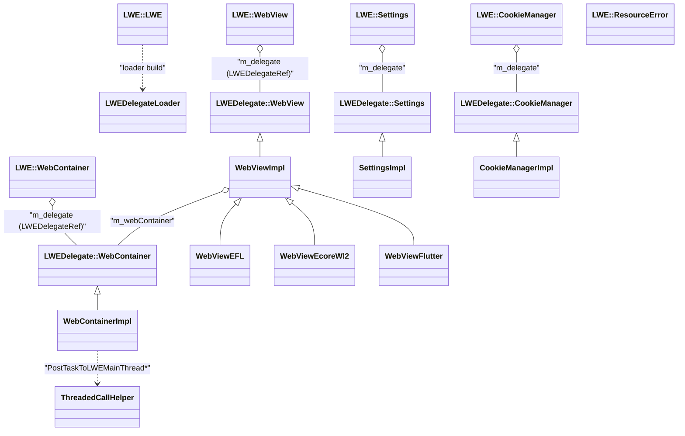

# Functional Requirements: public-embedder-api

> **Relevant source files**
>
> - [inc/LWEWebView.h](src:inc/LWEWebView.h)
> - [inc/LWEWorker.h](src:inc/LWEWorker.h)
> - [inc/PlatformIntegrationData.h](src:inc/PlatformIntegrationData.h)
> - [src/public/LWEWebView.cpp](src:src/public/LWEWebView.cpp)
> - [src/public/LWEWorker.cpp](src:src/public/LWEWorker.cpp)
> - [src/public/LWEDelegateLoader.cpp](src:src/public/LWEDelegateLoader.cpp)
> - [src/public/LWELoaderUtils.cpp](src:src/public/LWELoaderUtils.cpp)
> - [src/public/APIRecorder.cpp](src:src/public/APIRecorder.cpp)
> - [src/public/contract/LWEDelegateContract.h](src:src/public/contract/LWEDelegateContract.h)
> - [src/public/delegate/LWEDelegate.cpp](src:src/public/delegate/LWEDelegate.cpp)
> - [src/public/delegate/LWEWebContainerDelegate.cpp](src:src/public/delegate/LWEWebContainerDelegate.cpp)
> - [src/public/bridge/android/AndroidBridge.cpp](src:src/public/bridge/android/AndroidBridge.cpp)

**Module**: [`LWEWebView.h`](src:inc/LWEWebView.h#L97)
**Version**: 2026-09-10
**Linked Design Card**: [modules/public-embedder-api.md](../modules/public-embedder-api.md)
**Analysis basis**: AST export and direct source reading

## Overview

The module exports the `LWE::` namespace API that embedders link against: engine lifecycle in [`LWE`](src:inc/LWEWebView.h#L97), rendering surfaces in [`WebContainer`](src:inc/LWEWebView.h#L290) and [`WebView`](src:inc/LWEWebView.h#L536), and worker hosts in [`ServiceWorker`](src:inc/LWEWorker.h#L52) / [`SharedWorker`](src:inc/LWEWorker.h#L113). Each public object holds an opaque [`LWEDelegateRef`](src:inc/LWEWebView.h#L49) and forwards to an `LWEDelegate::` implementation that is either linked directly or resolved through [`LWEDelegateLoader::load`](src:src/public/LWEDelegateLoader.cpp#L56) after an ABI epoch check against [`kDelegateAbiEpoch`](src:src/public/contract/LWEDelegateContract.h#L21). Platform bridges under `src/public/bridge/` supply the windowed [`WebView::Create`](src:src/public/bridge/efl/LWEWebViewEFL.cpp#L2157) implementations and the Android Java facade [`WebView`](src:src/public/bridge/android/java/com/samsung/android/lightweightwebengine/WebView.java#L33).

## Functional Requirements

### FR-PUBLIC-EMBEDDER-API-001
**Engine lifecycle control (Initialize / IsInitialized / Finalize)**

| Item | Content |
|------|---------|
| **Description** | The module initializes the engine once per process from a storage directory and a bit-flag option set, reports whether initialization has happened, and finalizes the engine when no WebView instances remain. Option flags select a separate LWE thread and incremental GC; certain backends (`uv_cairo_gl`, `flutter`, `uv_worker`) force thread mode and `glib_headless` selects the headless renderer. |
| **Input** | `storageDirectoryPath` (C string), `InitializeOption` bit flags (`None`, `PreferSeparateThread`, `PreferIncrementalGC`) |
| **Output** | Engine instance created on the LWE main thread; `IsInitialized()` returns true; `GetVersion` fills major/minor/patch; `IsUsingSeparateThread` reports thread mode; `Finalize` destroys the instance and the script engine |
| **Preconditions** | `Initialize` requires the engine not yet initialized; `Finalize` requires it initialized and `webViewInstanceCount() == 0` |
| **Postconditions** | `g_starfishInstance` is set (or cleared after `Finalize`); in loader builds `Finalize` also calls `LWEDelegateLoader::unload` |
| **Source** | [`LWE::Initialize`](src:src/public/LWEWebView.cpp#L68), [`LWE::Initialize`](src:src/public/delegate/LWEDelegate.cpp#L88), [`LWE::Finalize`](src:src/public/delegate/LWEDelegate.cpp#L158), [`InitializeOption`](src:inc/LWEWebView.h#L58) |

**Acceptance criteria**:
- [ ] Calling `Initialize` with `PreferIncrementalGC` on a POSIX build sets `GC_ENABLE_INCREMENTAL=1` before the engine is created ([`LWE::Initialize`](src:src/public/delegate/LWEDelegate.cpp#L88)).
- [ ] `IsInitialized()` returns false before `Initialize` and, in loader builds, also when no library is loaded ([`LWE::IsInitialized`](src:src/public/LWEWebView.cpp#L83)).
- [ ] A second `Initialize` without `Finalize` trips `STARFISH_RELEASE_ASSERT(!IsInitialized())` ([`LWE::Initialize`](src:src/public/delegate/LWEDelegate.cpp#L88)).
- [ ] `Finalize` with a live WebView trips `STARFISH_RELEASE_ASSERT(webViewInstanceCount() == 0)` ([`LWE::Finalize`](src:src/public/delegate/LWEDelegate.cpp#L158)).

### FR-PUBLIC-EMBEDDER-API-002
**Updated-library preference and fallback loading**

| Item | Content |
|------|---------|
| **Description** | In loader builds the module can prefer a separately delivered implementation library. When the embedder opts in, the `VERSION` file under the updated mount path is compared (major.minor.patch) with the default path; the updated library is loaded only if newer, and any failure falls back to the default library. |
| **Input** | `SetVersionPreference(bool)`; build-time paths `STARFISH_API_UWE_MOUNT_PATH`, `STARFISH_API_DEFAULT_PATH`, `STARFISH_API_TARGET_NAME`; `VERSION` files |
| **Output** | `dlopen` handle for either `Updated` or `Default` library source; console messages "Try to load updated/default LWE..." and fallback notice |
| **Preconditions** | `SetVersionPreference` is called before `Initialize` (documented remark); `STARFISH_API_ENABLE_LOADER` defined |
| **Postconditions** | `LWEDelegateLoader::isLoaded()` is true on success; a missing `VERSION` file reads as `0.0.0` |
| **Source** | [`LWELoaderUtils::shouldUseUpdatedLibrary`](src:src/public/LWELoaderUtils.cpp#L70), [`LWELoaderUtils::openLWELibrary`](src:src/public/LWELoaderUtils.cpp#L84), [`LWEDelegateLoader::load`](src:src/public/LWEDelegateLoader.cpp#L56), [`readVersion`](src:src/public/LWELoaderUtils.cpp#L52) |

**Acceptance criteria**:
- [ ] With preference false, `shouldUseUpdatedLibrary` returns false without reading any file ([`LWELoaderUtils::shouldUseUpdatedLibrary`](src:src/public/LWELoaderUtils.cpp#L70)).
- [ ] With preference true and updated version greater than default, the updated path is tried first ([`LWEDelegateLoader::load`](src:src/public/LWEDelegateLoader.cpp#L56)).
- [ ] If the updated library fails to open or validate, "Updated LWE validation failed; falling back to default LWE." is printed and the default library is tried ([`LWEDelegateLoader::tryLoadAndValidate`](src:src/public/LWEDelegateLoader.cpp#L66)).
- [ ] In non-loader builds `SetVersionPreference` has no effect ([`LWE::SetVersionPreference`](src:src/public/LWEWebView.cpp#L59)).

### FR-PUBLIC-EMBEDDER-API-003
**ABI epoch validation and ProcTable resolution**

| Item | Content |
|------|---------|
| **Description** | After opening an implementation library the loader resolves `LWEDelegate_GetAbiEpoch`, rejects the library if the symbol is missing or its value differs from `kDelegateAbiEpoch`, and otherwise resolves every `LWEDelegate_*` C wrapper into six static ProcTables (CookieManager, LWE, ResourceError, Settings, WebContainer, WebView). A library missing any required symbol is closed and all tables are reset to null. |
| **Input** | `dlopen` handle; expected epoch `kDelegateAbiEpoch = 1` |
| **Output** | Populated `kLWEProcTable`, `kWebContainerProcTable`, `kWebViewProcTable`, `kSettingsProcTable`, `kCookieManagerProcTable`, `kResourceErrorProcTable`; or `false` with error text on stderr |
| **Preconditions** | Library opened by `openLWELibrary` |
| **Postconditions** | `getSafeInstance()` aborts the process if used while not loaded |
| **Source** | [`LWEDelegateLoader::validateAbiEpoch`](src:src/public/LWEDelegateLoader.cpp#L86), [`LWEDelegateLoader::loadProcTables`](src:src/public/LWEDelegateLoader.cpp#L106), [`LWEDelegateLoader::discardFailedLibrary`](src:src/public/LWEDelegateLoader.cpp#L113), [`LWEDelegateLoader::getSafeInstance`](src:src/public/LWEDelegateLoader.cpp#L47), [`LWEDelegate_GetAbiEpoch`](src:src/public/delegate/LWEDelegate.cpp#L214) |

**Acceptance criteria**:
- [ ] A library without `LWEDelegate_GetAbiEpoch` is rejected with "LWE delegate ABI epoch symbol is missing." ([`LWEDelegateLoader::validateAbiEpoch`](src:src/public/LWEDelegateLoader.cpp#L86)).
- [ ] A library returning an epoch other than 1 is rejected with the "expected/got" message ([`kDelegateAbiEpoch`](src:src/public/contract/LWEDelegateContract.h#L21)).
- [ ] `loadWebContainerProcTable` returns false unless all six creation symbols resolve ([`LWEDelegateLoader::loadWebContainerProcTable`](src:src/public/LWEDelegateLoader.cpp#L219)).
- [ ] `unload()` is a no-op by design (comment: `dlclose` does not end the LWE main thread) ([`LWEDelegateLoader::unload`](src:src/public/LWEDelegateLoader.cpp#L125)).

### FR-PUBLIC-EMBEDDER-API-004
**WebContainer creation for buffer, platform-image, GL and headless rendering**

| Item | Content |
|------|---------|
| **Description** | The module creates a `WebContainer` in one of several rendering modes: software buffer (`Create`; Tizen 5.0 compat variant takes a caller buffer), platform image with prepare/flush callbacks (`CreateWithPlatformImage`), OpenGL with embedder-supplied context hooks (`CreateGL`, `CreateGLWithPlatformImage`), and headless (`CreateHeadless`). Embedder callbacks are wrapped so they receive the public `WebContainer*` rather than the delegate pointer. |
| **Input** | Width/height, device pixel ratio, default font name, locale, timezone id; `RendererGLConfiguration` callbacks (`onMakeCurrent`, `onSwapBuffers` required; shared-context, proc-address and extension hooks optional); prepare-image and flush callbacks |
| **Output** | Heap-allocated public `WebContainer` owning an `LWEDelegate::WebContainer` created on the LWE main thread |
| **Preconditions** | Engine initialized; `defaultFontName`, `locale`, `timezoneID` non-null (asserted on the implementation side) |
| **Postconditions** | Test builds record a header event with the creation parameters; the container is released only via `Destroy()` |
| **Source** | [`WebContainer::CreateGL`](src:src/public/LWEWebView.cpp#L617), [`WebContainer::CreateWithPlatformImage`](src:src/public/LWEWebView.cpp#L574), [`WebContainer::CreateHeadless`](src:src/public/LWEWebView.cpp#L869), [`WebContainer::Create`](src:src/public/delegate/LWEWebContainerDelegate.cpp#L441), [`RendererGLConfiguration`](src:inc/LWEWebView.h#L326) |

**Acceptance criteria**:
- [ ] `CreateGL` forwards only the optional GL hooks that the embedder set (each `if (config.onX)` guard) ([`WebContainer::CreateGL`](src:src/public/LWEWebView.cpp#L617)).
- [ ] The Tizen 5.0 compat header declares `Create(void* buffer, unsigned bufferWidth, unsigned bufferHeight, unsigned bufferStride, ...)` and the source maps it to `CreateWithBuffer` ([`WebContainer`](src:compat/tizen_5.0/inc/LWEWebView.h#L280), [`WebContainer::Create`](src:src/public/LWEWebView.cpp#L524)).
- [ ] Building with `STARFISH_TIZEN_VERSION_5_0` against the non-compat header fails with "Version Mismatch" ([`LWEWebView.cpp`](src:src/public/LWEWebView.cpp#L44)).
- [ ] `Destroy()` cancels pending asynchronous `EvaluateJavaScript` callbacks with an empty string before destroying the engine view ([`WebContainerImpl::Destroy`](src:src/public/delegate/LWEWebContainerDelegate.cpp#L1092)).

### FR-PUBLIC-EMBEDDER-API-005
**Windowed WebView creation through platform bridges**

| Item | Content |
|------|---------|
| **Description** | The module creates a window-attached `WebView` from a native window handle and geometry. Each platform bridge (EFL, Ecore_Wl2, Ecore_X, tcore_wl, X11, Flutter) provides the `LWEDelegate::WebView::Create` implementation returning a `WebViewImpl` subclass; the generic fallback returns null. The public `WebView` exposes `Unwrap()` for the platform object and `FetchWebContainer()` for the underlying container. |
| **Input** | `void* win`, x, y, width, height, device pixel ratio, default font name, locale, timezone id |
| **Output** | Public `WebView` wrapping the bridge's `WebViewImpl`; `Unwrap()` platform object; `FetchWebContainer()` public `WebContainer` |
| **Preconditions** | Engine initialized; a platform bridge compiled in |
| **Postconditions** | On EFL, threaded builds present frames through `ThreadedTbmPresenter` and register an AT-SPI2 plug when the screen reader is enabled |
| **Source** | [`WebView::Create`](src:src/public/LWEWebView.cpp#L1631), [`WebViewImpl`](src:src/public/delegate/LWEWebViewDelegateImpl.h#L26), [`WebView::Create`](src:src/public/bridge/efl/LWEWebViewEFL.cpp#L2157), [`WebViewEFL`](src:src/public/bridge/efl/LWEWebViewEFL.cpp#L865), [`WebView::Create`](src:src/public/delegate/LWEWebViewDelegate.cpp#L30) |

**Acceptance criteria**:
- [ ] `WebView::Create` on EFL returns a `WebViewEFL` instance ([`WebView::Create`](src:src/public/bridge/efl/LWEWebViewEFL.cpp#L2157)).
- [ ] Without a bridge, `LWEDelegate::WebView::Create` returns `nullptr` ([`WebView::Create`](src:src/public/delegate/LWEWebViewDelegate.cpp#L30)).
- [ ] `FetchWebContainer()` wraps the delegate's container via `CreateWebContainer` ([`WebView::FetchWebContainer`](src:src/public/LWEWebView.cpp#L1980), [`WebContainer::CreateWebContainer`](src:src/public/LWEWebView.cpp#L730)).
- [ ] `WebView::Destroy()` destroys the delegate and deletes the wrapper ([`WebView::Destroy`](src:src/public/LWEWebView.cpp#L1762)).

### FR-PUBLIC-EMBEDDER-API-006
**Navigation and script execution**

| Item | Content |
|------|---------|
| **Description** | The module loads content by URL or raw data, controls history (`Reload`, `StopLoading`, `GoBack`, `GoForward`, `CanGoBack`, `CanGoForward`, `ClearHistory`), evaluates JavaScript synchronously or with a completion callback, and exposes native functions to page script through `AddJavaScriptInterface` / `RemoveJavascriptInterface`. Navigation is posted asynchronously to the engine message loop; synchronous evaluation blocks until the LWE main thread returns. |
| **Input** | URL or data strings; script text; exposed object and function names with a `std::function<std::string(const std::string&)>` callback |
| **Output** | Page load started; `GetURL()`/`GetTitle()` reflect state; evaluation result string (sync) or callback (async) |
| **Preconditions** | Container or view created |
| **Postconditions** | Test builds record `LoadURL` and `EvaluateJavaScript` events |
| **Source** | [`WebContainer::LoadURL`](src:src/public/LWEWebView.cpp#L992), [`WebContainerImpl::LoadURL`](src:src/public/delegate/LWEWebContainerDelegate.cpp#L850), [`WebContainerImpl::EvaluateJavaScript`](src:src/public/delegate/LWEWebContainerDelegate.cpp#L999), [`WebContainerImpl::AddJavaScriptInterface`](src:src/public/delegate/LWEWebContainerDelegate.cpp#L969), [`JavaScriptNativeHandler`](src:src/public/delegate/JavaScriptNativeHandler.h#L30) |

**Acceptance criteria**:
- [ ] `LoadURL` returns immediately; the load runs via `PostTaskToLWEMainThreadAsync` on the view's message loop ([`WebContainerImpl::LoadURL`](src:src/public/delegate/LWEWebContainerDelegate.cpp#L850)).
- [ ] Synchronous `EvaluateJavaScript` returns the UTF-8 result of the engine evaluation ([`WebContainerImpl::EvaluateJavaScript`](src:src/public/delegate/LWEWebContainerDelegate.cpp#L999)).
- [ ] `WebView` navigation methods forward to the same delegate surface as `WebContainer` ([`WebView::LoadURL`](src:src/public/LWEWebView.cpp#L1679), [`WebViewImpl::LoadURL`](src:src/public/delegate/LWEWebViewDelegateImpl.cpp#L44)).

### FR-PUBLIC-EMBEDDER-API-007
**Embedder event handler registration**

| Item | Content |
|------|---------|
| **Description** | Embedders register callbacks for page lifecycle (started, parsed, loaded, progress), resource loading and errors (`ResourceError` with code, description, URL), URL-override decisions, downloads, dropdown menus, alerts, soft-keyboard show/hide, idle, rendering control (`RegisterSetNeedsRenderingCallback`, `RegisterCanRenderingHandler`), screen matrix, debugger init/wait decisions, and custom file resource access. Each wrapper asserts that the delegate pointer matches and passes the public instance back. |
| **Input** | `std::function` callbacks typed per handler (see `WebContainer`/`WebView` declarations) |
| **Output** | Callback invocations carrying the public `WebContainer*` / `WebView*` plus event payload |
| **Preconditions** | Container or view created |
| **Postconditions** | Handler stored on the implementation side; `ResourceError` copies are created through the delegate factory |
| **Source** | [`WebContainer::RegisterOnPageLoadedHandler`](src:src/public/LWEWebView.cpp#L1194), [`WebContainer::RegisterOnReceivedErrorHandler`](src:src/public/LWEWebView.cpp#L1167), [`WebContainer::RegisterSetNeedsRenderingCallback`](src:src/public/LWEWebView.cpp#L1585), [`WebContainer::RegisterCustomFileResourceRequestHandlers`](src:src/public/LWEWebView.cpp#L1307), [`ResourceError`](src:src/public/LWEWebView.cpp#L145) |

**Acceptance criteria**:
- [ ] `RegisterOnPageLoadedHandler` invokes the embedder callback with `this` (public object) and the URL ([`WebContainer::RegisterOnPageLoadedHandler`](src:src/public/LWEWebView.cpp#L1194)).
- [ ] `ResourceError::GetErrorCode/GetDescription/GetUrl` return the values passed at construction ([`ResourceError::GetErrorCode`](src:src/public/LWEWebView.cpp#L189), [`ResourceErrorImpl`](src:src/public/delegate/ResourceErrorDelegate.cpp#L24)).
- [ ] The five custom-file callbacks (resolve, open, read, length, close) are forwarded as a set ([`WebContainer::RegisterCustomFileResourceRequestHandlers`](src:src/public/LWEWebView.cpp#L1307)).

### FR-PUBLIC-EMBEDDER-API-008
**Input event dispatch**

| Item | Content |
|------|---------|
| **Description** | Embedders inject mouse (move/down/up/wheel), multi-touch (start/move/end with interleaved points and ids), keyboard (down/press/up by `KeyValue`) and IME composition (start/update/end) events into the page, and control scroll position, focus, resize and device pixel ratio. |
| **Input** | `MouseButtonValue`, `MouseButtonsValue`, coordinates, wheel delta; `float* points`, `int* ids`, `pointCount`; `KeyValue`; composition strings; scroll offsets; size; DPR |
| **Output** | Corresponding DOM events dispatched by the engine; `GetScrollX/Y`, `Width/Height`, `GetDevicePixelRatio` reflect state |
| **Preconditions** | Container created |
| **Postconditions** | Not specified in code |
| **Source** | [`WebContainer::DispatchMouseMoveEvent`](src:src/public/LWEWebView.cpp#L1394), [`WebContainer::DispatchTouchStartEvent`](src:src/public/LWEWebView.cpp#L1439), [`WebContainer::DispatchKeyDownEvent`](src:src/public/LWEWebView.cpp#L1460), [`WebContainer::DispatchCompositionStartEvent`](src:src/public/LWEWebView.cpp#L1484), [`WebContainerImpl::DispatchMouseMoveEvent`](src:src/public/delegate/LWEWebContainerDelegate.cpp#L1609), [`KeyValue`](src:inc/PlatformIntegrationData.h#L7) |

**Acceptance criteria**:
- [ ] Touch dispatch accepts `pointCount` points as `[x0,y0,x1,y1,...]` with one id per point ([`WebContainer::DispatchTouchStartEvent`](src:inc/LWEWebView.h#L480)).
- [ ] `MouseButtonsValue` is a bit set (`LeftButtonDown=1`, `RightButtonDown=2`, `MiddleButtonDown=4`) ([`MouseButtonsValue`](src:inc/PlatformIntegrationData.h#L246)).
- [ ] On Android, JNI key codes are mapped to `KeyValue` before dispatch ([`virtualKeyCodeToKeyValue`](src:src/public/bridge/android/AndroidBridge.cpp#L80)).

### FR-PUBLIC-EMBEDDER-API-009
**Settings store and cookie management**

| Item | Content |
|------|---------|
| **Description** | `Settings` is a copyable string key/value store with typed accessors (user agent, proxy, cache mode, default font size, TTS mode/language, colors, web security mode, idle-mode job and interval, HTTP/2, scrollbar, external popup, spatial navigation) and `IterateSettings`. The two-argument constructor seeds defaults (font size 16, white background, black foreground, `webSecurityMode=Enable`, idle interval 3000 ms, booleans spelled `True`/`False`). `CookieManager` is a process singleton offering `GetCookie`, `HasCookies`, `ClearCookies`, obtainable only after engine initialization. |
| **Input** | Setting key/value strings or typed setters; cookie URL |
| **Output** | Updated store returned by `GetSetting`; container settings applied via `SetSettings`; cookie string / boolean |
| **Preconditions** | `CookieManager::GetInstance` requires `LWE::Initialize` to have run |
| **Postconditions** | `CookieManager::Destroy` frees the singleton; test builds record `SetSettings` and `ClearCookies` events |
| **Source** | [`Settings`](src:inc/LWEWebView.h#L215), [`SettingsImpl`](src:src/public/delegate/SettingsDelegate.cpp#L96), [`SettingsImpl::UpdateSetting`](src:src/public/delegate/SettingsDelegate.cpp#L136), [`ToBoolString`](src:src/public/delegate/SettingsBoolean.h#L37), [`CookieManager::GetInstance`](src:src/public/LWEWebView.cpp#L486), [`CookieManager::GetInstance`](src:src/public/delegate/CookieManagerDelegate.cpp#L70) |

**Acceptance criteria**:
- [ ] `GetSetting` of an unknown key returns an empty string ([`SettingsImpl::GetSetting`](src:src/public/delegate/SettingsDelegate.cpp#L143)).
- [ ] `ParseBool` accepts `true` in any letter case and rejects any other length/spelling ([`ParseBool`](src:src/public/delegate/SettingsBoolean.h#L42)).
- [ ] Copy-constructing `Settings` clones the underlying map ([`Settings`](src:src/public/LWEWebView.cpp#L233), [`SettingsImpl`](src:src/public/delegate/SettingsDelegate.cpp#L131)).
- [ ] `CookieManager::GetInstance` before initialization logs an error and asserts ([`CookieManager::GetInstance`](src:src/public/delegate/CookieManagerDelegate.cpp#L70)).
- [ ] Repeated `GetInstance` returns the same public pointer until `Destroy` ([`CookieManager::GetInstance`](src:src/public/LWEWebView.cpp#L486), [`CookieManager::Destroy`](src:src/public/LWEWebView.cpp#L510)).

### FR-PUBLIC-EMBEDDER-API-010
**Worker host lifecycle (ServiceWorker / SharedWorker)**

| Item | Content |
|------|---------|
| **Description** | In worker-host builds the module exposes `ServiceWorker` or `SharedWorker` (selected by `STARFISH_ENABLE_SERVICE_WORKER` / `STARFISH_ENABLE_SHARED_WORKER`) with `SetVersionPreference`, `Initialize`, `RegisterOnStatusChangedHandler` and `Finalize`. Initialization loads the worker implementation library (same epoch check, `LWEWorkerProcTable`), initializes the engine in separate-thread mode and starts the `WorkerAgent`; state changes are relayed as `WorkerProcessState`. |
| **Input** | Storage directory path; status callback |
| **Output** | Worker agent started; callback receives `WorkerProcessState::Terminated` or `None`; `Finalize` destroys the agent and finalizes the engine |
| **Preconditions** | Exactly one of the two worker defines set (otherwise `#error`); `SetVersionPreference` before `Initialize` |
| **Postconditions** | Worker loader `unload()` closes the handle and clears the table (unlike the main loader) |
| **Source** | [`ServiceWorker`](src:inc/LWEWorker.h#L52), [`initializeWorkerProcess`](src:src/public/LWEWorker.cpp#L49), [`LWEWorkerDelegateLoader::load`](src:src/public/LWEWorkerDelegateLoader.cpp#L51), [`LWEWorker::Initialize`](src:src/public/delegate/LWEWorkerDelegate.cpp#L55), [`LWEWorker::RegisterOnStatusChangedHandler`](src:src/public/delegate/LWEWorkerDelegate.cpp#L74), [`WorkerProcessState`](src:inc/LWEWorker.h#L44) |

**Acceptance criteria**:
- [ ] `LWEWorker::Initialize` passes `kInitializeOptionPreferSeparateThread` to the engine ([`LWEWorker::Initialize`](src:src/public/delegate/LWEWorkerDelegate.cpp#L55)).
- [ ] The worker loader resolves the three `LWEWorkerDelegate_LWEWorker_*` symbols and fails if any is missing ([`LWEWorkerDelegateLoader::loadLWEWorkerProcTable`](src:src/public/LWEWorkerDelegateLoader.cpp#L129)).
- [ ] The launcher calls `SetVersionPreference(true)` then `Initialize`, registers the status handler and finally `Finalize` ([`ServiceWorkerEntry.cpp`](src:src/launcher/ServiceWorkerEntry.cpp#L76), [`SharedWorkerEntry.cpp`](src:src/launcher/SharedWorkerEntry.cpp#L71)).

### FR-PUBLIC-EMBEDDER-API-011
**Android Java facade and JNI bridge**

| Item | Content |
|------|---------|
| **Description** | On Android the module provides a Java `WebView` (a `SurfaceView`) together with `WebViewClient`, `WebChromeClient`, `WebSettings`, `DownloadListener` and resource request/response/error types. `LweWebViewImpl` loads the native libraries, declares the `native` methods, and `AndroidBridge.cpp` implements them: `create` initializes the engine if needed, builds a GL `WebContainer`, applies `IdleModeJob::ForceGC`, and installs asset-backed file handlers; native-to-Java events (`onPageStarted`, `onReceivedError`, `shouldOverrideUrlLoading`, `showDropdownMenu`, `showAlert`, soft keyboard, GL make-current/swap) are delivered through cached method ids. |
| **Input** | Java calls with a `long` native handle; `AssetManager`; geometry, DPR, user agent, locale, timezone, storage path |
| **Output** | Native `WebContainer` handle; Java callbacks; `WebViewClient.ERROR_*` codes reported to the client |
| **Preconditions** | `System.loadLibrary("lwe")` and dependencies succeed; `init` called once to cache method ids |
| **Postconditions** | `g_webViews` maps each `WebContainer*` to its Java object |
| **Source** | [`WebView`](src:src/public/bridge/android/java/com/samsung/android/lightweightwebengine/WebView.java#L33), [`LweWebViewImpl`](src:src/public/bridge/android/java/com/samsung/android/lightweightwebengine/internal/LweWebViewImpl.java#L67), [`Java_com_samsung_android_lightweightwebengine_internal_LweWebViewImpl_init`](src:src/public/bridge/android/AndroidBridge.cpp#L123), [`Java_com_samsung_android_lightweightwebengine_internal_LweWebViewImpl_create`](src:src/public/bridge/android/AndroidBridge.cpp#L637), [`WindowGlue`](src:src/public/bridge/android/AndroidBridge.cpp#L34) |

**Acceptance criteria**:
- [ ] `create` calls `LWE::Initialize(storagePath)` only when `IsInitialized()` is false ([`Java_com_samsung_android_lightweightwebengine_internal_LweWebViewImpl_create`](src:src/public/bridge/android/AndroidBridge.cpp#L637)).
- [ ] Paths under `/android_asset/` are opened via `AAssetManager_open`, others via `fopen` ([`Java_com_samsung_android_lightweightwebengine_internal_LweWebViewImpl_create`](src:src/public/bridge/android/AndroidBridge.cpp#L637)).
- [ ] `init` is idempotent: a second call returns early once `g_jvm` is set ([`Java_com_samsung_android_lightweightwebengine_internal_LweWebViewImpl_init`](src:src/public/bridge/android/AndroidBridge.cpp#L123)).
- [ ] Native callbacks attach the current thread to the VM when `GetEnv` reports it detached ([`AndroidBridge.cpp`](src:src/public/bridge/android/AndroidBridge.cpp#L179)).

### FR-PUBLIC-EMBEDDER-API-012
**Test-build API call recording**

| Item | Content |
|------|---------|
| **Description** | In `STARFISH_ENABLE_TEST` builds the public API records a header (creation parameters) and subsequent API events (`LoadURL`, `EvaluateJavaScript`, `SetSettings`, `SetGCFrequency`, `ClearCookies`, ...) as JSON lines to a file named by the `STARFISH_API_RECORD` environment variable or, failing that, by the first line of `/tmp/starfish_api_record`. In production builds all recording macros expand to no-ops. |
| **Input** | Environment variables `STARFISH_API_RECORD`, `STARFISH_API_RECORD_NO_FLUSH`; trigger file; API calls |
| **Output** | Output file with timestamped JSON events; strings JSON-escaped and truncated at 65535 characters by default |
| **Preconditions** | `STARFISH_API_RECORD_INIT()` called from `LWE::Initialize`; recording is enabled only if a path resolves and the file opens |
| **Postconditions** | `initialize()` is a no-op after its first call; `finalize()` runs from the singleton destructor |
| **Source** | [`APIRecorder`](src:src/public/APIRecorder.h#L34), [`APIRecorder::initialize`](src:src/public/APIRecorder.cpp#L79), [`APIRecorder::recordHeader`](src:src/public/APIRecorder.cpp#L124), [`APIRecorder::recordEvent`](src:src/public/APIRecorder.cpp#L141), [`STARFISH_API_RECORD_EVENT_STR`](src:src/public/APIRecorder.h#L90), [`escapeJsonString`](src:src/public/APIRecorder.cpp#L39) |

**Acceptance criteria**:
- [ ] With neither variable nor trigger file, `isRecording()` stays false and no file is created ([`APIRecorder::initialize`](src:src/public/APIRecorder.cpp#L79)).
- [ ] A failed `fopen` prints "[APIRecorder] Failed to open: <path>" to stderr ([`APIRecorder::initialize`](src:src/public/APIRecorder.cpp#L79)).
- [ ] Control characters below 0x20 are emitted as `\uXXXX` ([`escapeJsonString`](src:src/public/APIRecorder.cpp#L39)).
- [ ] Non-test builds compile every `STARFISH_API_RECORD_*` macro to `((void)0)` ([`APIRecorder.h`](src:src/public/APIRecorder.h#L117)).

## Non-Functional Requirements

| Item | Requirement | Source |
|------|-------------|--------|
| Performance | Navigation requests are posted asynchronously to the engine message loop; only queries and creation block the caller. The dedicated LWE thread is created with at least a 4 MB stack. | [`WebContainerImpl::LoadURL`](src:src/public/delegate/LWEWebContainerDelegate.cpp#L850), [`THREAD_MINIMUM_STACK_SIZE`](src:src/public/delegate/ThreadedCallHelper.cpp#L27) |
| Performance | Idle-mode housekeeping (`ClearDrawnBuffers`, `ForceGC`, `DropDecodedImageBuffer`, `ClearFontCache`) is configurable per container; default `IdleModeMiddle`, check interval 3000 ms. | [`IdleModeJob`](src:inc/PlatformIntegrationData.h#L260), [`IdleModeCheckDefaultIntervalInMS`](src:inc/PlatformIntegrationData.h#L274) |
| Security | The implementation library is accepted only after the ABI epoch handshake; a mismatched or symbol-incomplete library is closed and the default library is used. `webSecurityMode` defaults to `Enable`. | [`LWEDelegateLoader::tryLoadAndValidate`](src:src/public/LWEDelegateLoader.cpp#L66), [`SettingsImpl`](src:src/public/delegate/SettingsDelegate.cpp#L96) |
| Error handling | Loader failures are reported on stderr and surface as `LWE_ASSERT(false)` in debug builds; `getSafeInstance()` aborts when the library is not loaded; misuse before initialization is caught by release asserts. | [`LWE::Initialize`](src:src/public/LWEWebView.cpp#L68), [`LWEDelegateLoader::getSafeInstance`](src:src/public/LWEDelegateLoader.cpp#L47), [`CookieManager::GetInstance`](src:src/public/delegate/CookieManagerDelegate.cpp#L70) |
| Logging | Loader progress and failures go to `std::cout`/`std::cerr`; implementation side uses `STARFISH_LOG_INFO`/`STARFISH_LOG_ERROR`; Android uses `Log.e` for library load failures. | [`LWELoaderUtils::openLWELibrary`](src:src/public/LWELoaderUtils.cpp#L84), [`LWE::Initialize`](src:src/public/delegate/LWEDelegate.cpp#L88), [`LweWebViewImpl`](src:src/public/bridge/android/java/com/samsung/android/lightweightwebengine/internal/LweWebViewImpl.java#L67) |

## Constraints

- The `LWE` class shares its name with the enclosing namespace; code under `using namespace LWE;` must qualify the namespace as `::LWE::`. [`LWE`](src:inc/LWEWebView.h#L97)
- `src/public/contract/*.h` is a binary compatibility boundary: changes must be append-only and a breaking change must increment `kDelegateAbiEpoch` exactly once; the main engine and both worker contracts share one epoch. [`kDelegateAbiEpoch`](src:src/public/contract/LWEDelegateContract.h#L21), [`uwe.md`](src:docs/uwe.md#L14)
- `SettingsBoolean.h` is deliberately not part of the shared contract so the API and implementation libraries cannot disagree on boolean spelling. [`SettingsBoolean.h`](src:src/public/delegate/SettingsBoolean.h#L30)
- The Tizen 5.0 compat header and the current header are mutually exclusive per build (`#error` on mismatch). [`LWEWebView.cpp`](src:src/public/LWEWebView.cpp#L44)
- `LWEDelegateLoader::unload` intentionally does not `dlclose` the library. [`LWEDelegateLoader::unload`](src:src/public/LWEDelegateLoader.cpp#L125)
- Loader paths and target library name are build-time definitions (`STARFISH_API_DEFAULT_PATH`, `STARFISH_API_UWE_MOUNT_PATH`, `STARFISH_API_TARGET_NAME`). [`starfish_public_api.cmake`](src:build/starfish_public_api.cmake#L68)
- `LWE_EXPORT` resolves to `dllexport` only while building the engine itself (`STARFISH_EXPORTS`), otherwise `dllimport` on MSVC, or default visibility elsewhere. [`LWEWebView.h`](src:inc/LWEWebView.h#L29)

## Module Design Card Linkage

| FR | Implementation | Design Card section |
|----|----------------|---------------------|
| FR-PUBLIC-EMBEDDER-API-001 | [`LWE::Initialize`](src:src/public/LWEWebView.cpp#L68), [`LWE::Initialize`](src:src/public/delegate/LWEDelegate.cpp#L88) | [Key Flow](../modules/public-embedder-api.md#key-flow) |
| FR-PUBLIC-EMBEDDER-API-002 | [`LWELoaderUtils::shouldUseUpdatedLibrary`](src:src/public/LWELoaderUtils.cpp#L70), [`LWEDelegateLoader::load`](src:src/public/LWEDelegateLoader.cpp#L56) | [Architectural Rules](../modules/public-embedder-api.md#architectural-rules) |
| FR-PUBLIC-EMBEDDER-API-003 | [`LWEDelegateLoader::validateAbiEpoch`](src:src/public/LWEDelegateLoader.cpp#L86) | [IPC / Message / Interface Contracts](../modules/public-embedder-api.md#ipc--message--interface-contracts) |
| FR-PUBLIC-EMBEDDER-API-004 | [`WebContainer::CreateGL`](src:src/public/LWEWebView.cpp#L617), [`WebContainer::Create`](src:src/public/delegate/LWEWebContainerDelegate.cpp#L441) | [Key Flow](../modules/public-embedder-api.md#key-flow) |
| FR-PUBLIC-EMBEDDER-API-005 | [`WebView::Create`](src:src/public/LWEWebView.cpp#L1631), [`WebViewImpl`](src:src/public/delegate/LWEWebViewDelegateImpl.h#L26) | [Public Interface](../modules/public-embedder-api.md#public-interface) |
| FR-PUBLIC-EMBEDDER-API-006 | [`WebContainerImpl::LoadURL`](src:src/public/delegate/LWEWebContainerDelegate.cpp#L850), [`WebContainerImpl::EvaluateJavaScript`](src:src/public/delegate/LWEWebContainerDelegate.cpp#L999) | [Key Flow](../modules/public-embedder-api.md#key-flow) |
| FR-PUBLIC-EMBEDDER-API-007 | [`WebContainer::RegisterOnPageLoadedHandler`](src:src/public/LWEWebView.cpp#L1194) | [Architectural Rules](../modules/public-embedder-api.md#architectural-rules) |
| FR-PUBLIC-EMBEDDER-API-008 | [`WebContainer::DispatchMouseMoveEvent`](src:src/public/LWEWebView.cpp#L1394) | [Quick Navigation](../modules/public-embedder-api.md#quick-navigation) |
| FR-PUBLIC-EMBEDDER-API-009 | [`SettingsImpl`](src:src/public/delegate/SettingsDelegate.cpp#L96), [`CookieManager::GetInstance`](src:src/public/LWEWebView.cpp#L486) | [Quick Navigation](../modules/public-embedder-api.md#quick-navigation) |
| FR-PUBLIC-EMBEDDER-API-010 | [`initializeWorkerProcess`](src:src/public/LWEWorker.cpp#L49), [`LWEWorker::Initialize`](src:src/public/delegate/LWEWorkerDelegate.cpp#L55) | [IPC / Message / Interface Contracts](../modules/public-embedder-api.md#ipc--message--interface-contracts) |
| FR-PUBLIC-EMBEDDER-API-011 | [`Java_com_samsung_android_lightweightwebengine_internal_LweWebViewImpl_create`](src:src/public/bridge/android/AndroidBridge.cpp#L637) | [Key Flow](../modules/public-embedder-api.md#key-flow) |
| FR-PUBLIC-EMBEDDER-API-012 | [`APIRecorder::initialize`](src:src/public/APIRecorder.cpp#L79) | [Quick Navigation](../modules/public-embedder-api.md#quick-navigation) |

## ENUM Definitions

| ENUM | Values | Used in | Source |
|------|--------|---------|--------|
| `InitializeOption` | None, PreferSeparateThread, PreferIncrementalGC | `LWE::Initialize` option bit flags | [`InitializeOption`](src:inc/LWEWebView.h#L58) |
| `InitializeOption` (Tizen 5.0 compat copy) | None, PreferSeparateThread, PreferIncrementalGC | compat header | [`InitializeOption`](src:compat/tizen_5.0/inc/LWEWebView.h#L50) |
| `WorkerProcessState` | None, Terminated | Worker status callback | [`WorkerProcessState`](src:inc/LWEWorker.h#L44) |
| `KeyValue` | UnidentifiedKey, AltLeftKey, AltRightKey, ControlLeftKey, ControlRightKey, CapsLockKey, FnKey, FnLockKey, HyperKey, MetaKey, NumLockKey, ScrollLockKey, ShiftLeftKey, ShiftRightKey, SuperKey, SymbolKey, SymbolLockKey, EnterKey, TabKey, ArrowDownKey, ... (ASCII-printable range shares char codes) | `DispatchKey*Event` | [`KeyValue`](src:inc/PlatformIntegrationData.h#L7) |
| `MouseButtonValue` | NoButton=0, LeftButton=0, MiddleButton=1, RightButton=2 | `DispatchMouse*Event` | [`MouseButtonValue`](src:inc/PlatformIntegrationData.h#L239) |
| `MouseButtonsValue` | NoButtonDown=0, LeftButtonDown=1, RightButtonDown=2, MiddleButtonDown=4 | `DispatchMouse*Event` | [`MouseButtonsValue`](src:inc/PlatformIntegrationData.h#L246) |
| `TTSMode` | Default=0, Forced=1 | `Settings::SetTTSMode` | [`TTSMode`](src:inc/PlatformIntegrationData.h#L253) |
| `WebSecurityMode` | Enable=0, Disable=1 | `Settings::SetWebSecurityMode` | [`WebSecurityMode`](src:inc/PlatformIntegrationData.h#L258) |
| `IdleModeJob` | ClearDrawnBuffers=1, ForceGC=2, DropDecodedImageBuffer=4, ClearFontCache=8, IdleModeFull, IdleModeMiddle, IdleModeNone=0, IdleModeDefault=IdleModeMiddle | `Settings::SetIdleModeJob` | [`IdleModeJob`](src:inc/PlatformIntegrationData.h#L260) |
| `LWELibrarySource` | Default, Updated | Loader library selection | [`LWELibrarySource`](src:src/public/LWELoaderUtils.h#L29) |
| `ImeComposingStatus` (Java) | NORMAL, COMPOSING_START, COMPOSING_END | Android IME composition tracking | [`ImeComposingStatus`](src:src/public/bridge/android/java/com/samsung/android/lightweightwebengine/internal/LweWebViewImpl.java#L93) |
| `Owner` (Ecore_Wl2 `FboPresenter`) | FREE, ENGINE, READY, PRESENTING | Frame buffer ownership state | [`Owner`](src:src/public/bridge/ecore_wl2/LWEWebViewEcoreWl2.cpp#L190) |
| `Owner` (EFL `ThreadedTbmPresenter`) | FREE, ENGINE, READY, DISPLAYING | TBM buffer ownership state | [`Owner`](src:src/public/bridge/efl/LWEWebViewEFL.cpp#L153) |
| `PORT_WINDOW_BACKEND` | GB, GL, HEADLESS | Flutter bridge window backend | [`PORT_WINDOW_BACKEND`](src:src/public/bridge/flutter/LWEWebViewFlutter.cpp#L82) |
| `PORT_COMPOSITOR_BACKEND` | CAIRO, GL, MOCK | Flutter bridge compositor backend | [`PORT_COMPOSITOR_BACKEND`](src:src/public/bridge/flutter/LWEWebViewFlutter.cpp#L83) |

## Error Code Definitions

| Error code | Value | Trigger | Recovery | Source |
|------------|-------|---------|----------|--------|
| `ERROR_UNKNOWN` | -1 | Generic load failure reported to `WebViewClient.onReceivedError` | Not specified in code | [`ERROR_UNKNOWN`](src:src/public/bridge/android/java/com/samsung/android/lightweightwebengine/WebViewClient.java#L27) |
| `ERROR_HOST_LOOKUP` | -2 | Host lookup failure | Not specified in code | [`ERROR_HOST_LOOKUP`](src:src/public/bridge/android/java/com/samsung/android/lightweightwebengine/WebViewClient.java#L28) |
| `ERROR_UNSUPPORTED_AUTH_SCHEME` | -3 | Unsupported authentication scheme | Not specified in code | [`ERROR_UNSUPPORTED_AUTH_SCHEME`](src:src/public/bridge/android/java/com/samsung/android/lightweightwebengine/WebViewClient.java#L29) |
| `ERROR_AUTHENTICATION` | -4 | Authentication failure | Not specified in code | [`ERROR_AUTHENTICATION`](src:src/public/bridge/android/java/com/samsung/android/lightweightwebengine/WebViewClient.java#L30) |
| `ERROR_PROXY_AUTHENTICATION` | -5 | Proxy authentication failure | Not specified in code | [`ERROR_PROXY_AUTHENTICATION`](src:src/public/bridge/android/java/com/samsung/android/lightweightwebengine/WebViewClient.java#L31) |
| `ERROR_CONNECT` | -6 | Connection failure | Not specified in code | [`ERROR_CONNECT`](src:src/public/bridge/android/java/com/samsung/android/lightweightwebengine/WebViewClient.java#L32) |
| `ERROR_IO` | -7 | I/O failure | Not specified in code | [`ERROR_IO`](src:src/public/bridge/android/java/com/samsung/android/lightweightwebengine/WebViewClient.java#L33) |
| `ERROR_TIMEOUT` | -8 | Timeout | Not specified in code | [`ERROR_TIMEOUT`](src:src/public/bridge/android/java/com/samsung/android/lightweightwebengine/WebViewClient.java#L34) |
| `ERROR_REDIRECT_LOOP` | -9 | Redirect loop | Not specified in code | [`ERROR_REDIRECT_LOOP`](src:src/public/bridge/android/java/com/samsung/android/lightweightwebengine/WebViewClient.java#L35) |
| `ERROR_UNSUPPORTED_SCHEME` | -10 | Unsupported URL scheme | Not specified in code | [`ERROR_UNSUPPORTED_SCHEME`](src:src/public/bridge/android/java/com/samsung/android/lightweightwebengine/WebViewClient.java#L36) |
| `ERROR_FAILED_SSL_HANDSHAKE` | -11 | SSL handshake failure | Not specified in code | [`ERROR_FAILED_SSL_HANDSHAKE`](src:src/public/bridge/android/java/com/samsung/android/lightweightwebengine/WebViewClient.java#L37) |
| `ERROR_BAD_URL` | -12 | Malformed URL | Not specified in code | [`ERROR_BAD_URL`](src:src/public/bridge/android/java/com/samsung/android/lightweightwebengine/WebViewClient.java#L38) |
| `ERROR_FILE` | -13 | File error | Not specified in code | [`ERROR_FILE`](src:src/public/bridge/android/java/com/samsung/android/lightweightwebengine/WebViewClient.java#L39) |
| `ERROR_FILE_NOT_FOUND` | -14 | File not found | Not specified in code | [`ERROR_FILE_NOT_FOUND`](src:src/public/bridge/android/java/com/samsung/android/lightweightwebengine/WebViewClient.java#L40) |
| `ERROR_TOO_MANY_REQUESTS` | -15 | Too many requests | Not specified in code | [`ERROR_TOO_MANY_REQUESTS`](src:src/public/bridge/android/java/com/samsung/android/lightweightwebengine/WebViewClient.java#L41) |

## Constant Definitions

42 constants were extracted for this module's files; the 40 listed below omit two duplicate `LWE_EXPORT` spellings from the compat header.

| Constant | Value | Purpose | Source |
|----------|-------|---------|--------|
| `LWE_EXPORT` | `__declspec(dllexport)` (when `STARFISH_EXPORTS`) | Public symbol visibility, MSVC engine build | [`LWE_EXPORT`](src:inc/LWEWebView.h#L30) |
| `LWE_EXPORT` | `__declspec(dllimport)` | Public symbol visibility, MSVC embedder build | [`LWE_EXPORT`](src:inc/LWEWebView.h#L32) |
| `LWE_EXPORT` | `__attribute__((visibility("default")))` | Public symbol visibility, non-MSVC | [`LWE_EXPORT`](src:inc/LWEWebView.h#L35) |
| `LWE_DEFAULT_FONT_SIZE` | 16 | Default font size (public header) | [`LWE_DEFAULT_FONT_SIZE`](src:inc/LWEWebView.h#L190) |
| `LWE_MIN_FONT_SIZE` | 1 | Minimum font size | [`LWE_MIN_FONT_SIZE`](src:inc/LWEWebView.h#L191) |
| `LWE_MAX_FONT_SIZE` | 72 | Maximum font size | [`LWE_MAX_FONT_SIZE`](src:inc/LWEWebView.h#L192) |
| `LWE_EXPORT` | `__declspec(dllexport)` | Worker header visibility, MSVC | [`LWE_EXPORT`](src:inc/LWEWorker.h#L30) |
| `LWE_EXPORT` | `__declspec(dllimport)` | Worker header visibility, MSVC embedder | [`LWE_EXPORT`](src:inc/LWEWorker.h#L32) |
| `LWE_EXPORT` | `__attribute__((visibility("default")))` | Worker header visibility, non-MSVC | [`LWE_EXPORT`](src:inc/LWEWorker.h#L35) |
| `TIZEN_COMPAT_HEADER_5_0` | (defined) | Marks the Tizen 5.0 compat header | [`TIZEN_COMPAT_HEADER_5_0`](src:compat/tizen_5.0/inc/LWEWebView.h#L85) |
| `LWE_DEFAULT_FONT_SIZE` | 16 | Compat header default font size | [`LWE_DEFAULT_FONT_SIZE`](src:compat/tizen_5.0/inc/LWEWebView.h#L180) |
| `LWE_MIN_FONT_SIZE` | 1 | Compat header minimum | [`LWE_MIN_FONT_SIZE`](src:compat/tizen_5.0/inc/LWEWebView.h#L181) |
| `LWE_MAX_FONT_SIZE` | 72 | Compat header maximum | [`LWE_MAX_FONT_SIZE`](src:compat/tizen_5.0/inc/LWEWebView.h#L182) |
| `LWE_EXPORT` | `__attribute__((visibility("default")))` | Compat header visibility, non-MSVC | [`LWE_EXPORT`](src:compat/tizen_5.0/inc/LWEWebView.h#L27) |
| `EXPORT_UNMANAGED_API` | `__declspec(dllexport)` | Contract symbol export, MSVC | [`EXPORT_UNMANAGED_API`](src:src/public/contract/LWEDelegateConfig.h#L24) |
| `EXPORT_UNMANAGED_API` | `__attribute__((visibility("default")))` | Contract symbol export, non-MSVC | [`EXPORT_UNMANAGED_API`](src:src/public/contract/LWEDelegateConfig.h#L26) |
| `LWE_DEFAULT_FONT_SIZE` | 16 | Implementation-side default | [`LWE_DEFAULT_FONT_SIZE`](src:src/public/delegate/LWEWebContainerDelegate.cpp#L59) |
| `LWE_MIN_FONT_SIZE` | 1 | Implementation-side minimum | [`LWE_MIN_FONT_SIZE`](src:src/public/delegate/LWEWebContainerDelegate.cpp#L60) |
| `LWE_MAX_FONT_SIZE` | 72 | Implementation-side maximum | [`LWE_MAX_FONT_SIZE`](src:src/public/delegate/LWEWebContainerDelegate.cpp#L61) |
| `LWE_DEFAULT_FONT_SIZE` | 16 | Settings default seed | [`LWE_DEFAULT_FONT_SIZE`](src:src/public/delegate/SettingsDelegate.cpp#L29) |
| `THREAD_MINIMUM_STACK_SIZE` | `4 * 1024 * 1024` | Minimum LWE thread stack (4 MB) | [`THREAD_MINIMUM_STACK_SIZE`](src:src/public/delegate/ThreadedCallHelper.cpp#L27) |
| `STARFISH_ENABLE_PROFILE_TIMER` | (defined) | Profile timer in Ecore_Wl2 bridge | [`STARFISH_ENABLE_PROFILE_TIMER`](src:src/public/bridge/ecore_wl2/LWEWebViewEcoreWl2.cpp#L22) |
| `STARFISH_ENABLE_PROFILE_TIMER` | (defined) | Profile timer in Ecore_X bridge | [`STARFISH_ENABLE_PROFILE_TIMER`](src:src/public/bridge/ecore_x/LWEWebViewEcoreX.cpp#L22) |
| `STARFISH_ENABLE_PROFILE_TIMER` | (defined) | Profile timer in EFL bridge | [`STARFISH_ENABLE_PROFILE_TIMER`](src:src/public/bridge/efl/LWEWebViewEFL.cpp#L32) |
| `STARFISH_ENABLE_PROFILE_TIMER` | (defined) | Profile timer in Flutter bridge | [`STARFISH_ENABLE_PROFILE_TIMER`](src:src/public/bridge/flutter/LWEWebViewFlutter.cpp#L40) |
| `STARFISH_ENABLE_PROFILE_TIMER` | (defined) | Profile timer in tcore_wl bridge | [`STARFISH_ENABLE_PROFILE_TIMER`](src:src/public/bridge/tcore_wl/LWEWebViewTcoreWl.cpp#L22) |
| `STARFISH_ENABLE_PROFILE_TIMER` | (defined) | Profile timer in X11 bridge | [`STARFISH_ENABLE_PROFILE_TIMER`](src:src/public/bridge/x11/LWEWebViewX11.cpp#L22) |
| `GC_CPP_H` | (defined) | Suppress GC C++ header in X11 bridge | [`GC_CPP_H`](src:src/public/bridge/x11/LWEWebViewX11.cpp#L25) |
| `VCONFKEY_SETAPPL_ACCESSIBILITY_TTS` | `"db/setting/accessibility/tts"` | vconf key watched for screen reader | [`VCONFKEY_SETAPPL_ACCESSIBILITY_TTS`](src:src/public/bridge/efl/A11yAtspiBridge.cpp#L54) |
| `VCONFKEY_SETAPPL_ACCESSIBILITY_TTS_TEMPORARY` | `"db/setting/accessibility/tts/temporary"` | Temporary TTS vconf key | [`VCONFKEY_SETAPPL_ACCESSIBILITY_TTS_TEMPORARY`](src:src/public/bridge/efl/A11yAtspiBridge.cpp#L59) |
| `STARFISH_ATK_PLUG_TYPE` | `(starfish_atk_plug_get_type())` | GType of the ATK plug | [`STARFISH_ATK_PLUG_TYPE`](src:src/public/bridge/efl/A11yAtspiBridge.cpp#L188) |
| `STARFISH_ATK_NODE_TYPE` | `(starfish_atk_node_get_type())` | GType of ATK tree nodes | [`STARFISH_ATK_NODE_TYPE`](src:src/public/bridge/efl/A11yAtspiBridge.cpp#L407) |
| `EVAS_GL_NO_GL_H_CHECK` | (defined) | Evas_GL header configuration | [`EVAS_GL_NO_GL_H_CHECK`](src:src/public/bridge/efl/LWEWebViewEFL.cpp#L53) |
| `EGL_NATIVE_SURFACE_TIZEN` | `0x32A1` | EGL extension enum | [`EGL_NATIVE_SURFACE_TIZEN`](src:src/public/bridge/efl/LWEWebViewEFL.cpp#L64) |
| `EGL_IMAGE_PRESERVED_KHR` | `0x30D2` | EGL extension enum | [`EGL_IMAGE_PRESERVED_KHR`](src:src/public/bridge/efl/LWEWebViewEFL.cpp#L67) |
| `EFL_BETA_API_SUPPORT` | (defined) | Enable EFL beta API (EFL bridge) | [`EFL_BETA_API_SUPPORT`](src:src/public/bridge/efl/LWEWebViewEFL.cpp#L75) |
| `ANNOTATE_SETUP` | (defined) | Streamline annotation setup (EFL) | [`ANNOTATE_SETUP`](src:src/public/bridge/efl/LWEWebViewEFL.cpp#L103) |
| `ANNOTATE_GREEN` | `0x00ff001b` | Streamline annotation color (EFL) | [`ANNOTATE_GREEN`](src:src/public/bridge/efl/LWEWebViewEFL.cpp#L106) |
| `EVAS_GL_OPTIONS_DIRECT_MEMORY_OPTIMIZE` | `(1 << 12)` | Evas_GL option flag | [`EVAS_GL_OPTIONS_DIRECT_MEMORY_OPTIMIZE`](src:src/public/bridge/efl/LWEWebViewEFL.cpp#L981) |
| `EVAS_GL_OPTIONS_DIRECT_OVERRIDE` | `(1 << 13)` | Evas_GL option flag | [`EVAS_GL_OPTIONS_DIRECT_OVERRIDE`](src:src/public/bridge/efl/LWEWebViewEFL.cpp#L982) |

Additional compile-time constants seen in code: [`kDelegateAbiEpoch`](src:src/public/contract/LWEDelegateContract.h#L21) = 1, [`kInitializeOptionPreferSeparateThread`](src:src/public/contract/LWEDelegate.h#L30) = `1 << 0`, [`kInitializeOptionPreferIncrementalGC`](src:src/public/contract/LWEDelegate.h#L31) = `1 << 1`, [`IdleModeCheckDefaultIntervalInMS`](src:inc/PlatformIntegrationData.h#L274) = 3000.

## Message Protocol

| Message ID | Direction | Payload | Handler | Mechanism | Source |
|------------|-----------|---------|---------|-----------|--------|
| `org.a11y.atspi.Accessible.DoGesture` | Accessibility daemon → engine process (EFL bridge) | INT32 type, startX, endX, startY, endY, state; UINT32 eventTime; reply BOOLEAN consumed | `a11yDbusFilter` → `handleA11yGesture` | D-Bus method call on the AT-SPI2 bus | [`a11yDbusFilter`](src:src/public/bridge/efl/A11yAtspiBridge.cpp#L1309) |

The `LWEDelegate_*` / `LWEWorkerDelegate_*` C symbols are a shared-library function table (in-process), not a message protocol; see the Design Card's contract section.

## Class Diagram



Sources: [`WebContainer`](src:inc/LWEWebView.h#L290), [`WebView`](src:inc/LWEWebView.h#L536), [`LWEDelegateLoader`](src:src/public/LWEDelegateLoader.h#L36), [`WebContainerImpl`](src:src/public/delegate/LWEWebContainerDelegate.cpp#L200), [`WebViewImpl`](src:src/public/delegate/LWEWebViewDelegateImpl.h#L26), [`WebViewEFL`](src:src/public/bridge/efl/LWEWebViewEFL.cpp#L865), [`WebViewEcoreWl2`](src:src/public/bridge/ecore_wl2/LWEWebViewEcoreWl2.cpp#L556), [`WebViewFlutter`](src:src/public/bridge/flutter/LWEWebViewFlutter.cpp#L85), [`SettingsImpl`](src:src/public/delegate/SettingsDelegate.cpp#L33), [`CookieManagerImpl`](src:src/public/delegate/CookieManagerDelegate.cpp#L30), [`ThreadedCallHelper`](src:src/public/delegate/ThreadedCallHelper.h#L33).

## Sequence Diagram

```mermaid
sequenceDiagram
    participant Embedder as "Embedder (src/shell/MiniBrowser.cpp)"
    participant LWE_API as "LWE::LWE / LWE::WebContainer (LWEWebView.cpp)"
    participant LWEDelegateLoader
    participant LWEDelegate_Impl as "LWEDelegate::LWE / WebContainerImpl"
    participant ThreadedCallHelper
    participant Starfish_Engine as "Starfish::Starfish / Starfish::WebView"
    Embedder->>LWE_API: "LWE::Initialize(storageDir, option)"
    LWE_API->>LWEDelegateLoader: "load() : dlopen, validateAbiEpoch, loadProcTables"
    LWE_API->>LWEDelegate_Impl: "kLWEProcTable.Initialize(path, optionBits)"
    LWEDelegate_Impl->>ThreadedCallHelper: "Initialize(isThreadMode); PostTaskToLWEMainThreadSync"
    ThreadedCallHelper->>Starfish_Engine: "new Starfish::Starfish(config)"
    Embedder->>LWE_API: "WebContainer::CreateGL(args, glConfig)"
    LWE_API->>LWEDelegate_Impl: "kWebContainerProcTable.CreateGL(wrapped callbacks)"
    LWEDelegate_Impl->>ThreadedCallHelper: "PostTaskToLWEMainThreadSync"
    ThreadedCallHelper->>Starfish_Engine: "createStarfishWebViewInstance(...)"
    Embedder->>LWE_API: "LoadURL(url)"
    LWE_API->>LWEDelegate_Impl: "WebContainerImpl::LoadURL(url)"
    LWEDelegate_Impl->>ThreadedCallHelper: "PostTaskToLWEMainThreadAsync(messageLoop)"
    ThreadedCallHelper->>Starfish_Engine: "loadHTMLDocument(url)"
    Embedder->>LWE_API: "Destroy(); LWE::Finalize()"
    LWE_API->>LWEDelegate_Impl: "WebContainerImpl::Destroy(); LWE::Finalize()"
```

Entry symbols: [`LWE::Initialize`](src:src/public/LWEWebView.cpp#L68), [`WebContainer::CreateGL`](src:src/public/LWEWebView.cpp#L617), [`WebContainerImpl::LoadURL`](src:src/public/delegate/LWEWebContainerDelegate.cpp#L850), [`LWE::Finalize`](src:src/public/delegate/LWEDelegate.cpp#L158).

## Test Cases

### Positive
- `LWE::Initialize("/tmp/starfish_storage/")` then `LWE::IsInitialized()` → returns true; `GetVersion` fills three integers ([`LWE::IsInitialized`](src:src/public/delegate/LWEDelegate.cpp#L183), [`LWE::GetVersion`](src:src/public/delegate/LWEDelegate.cpp#L200)).
- Loader build with a valid implementation library exporting epoch 1 → `LWEDelegateLoader::load()` returns true and `isLoaded()` is true ([`LWEDelegateLoader::tryLoadAndValidate`](src:src/public/LWEDelegateLoader.cpp#L66)).
- `WebContainer::CreateGL` with `onMakeCurrent`/`onSwapBuffers` set → non-null container; `LoadURL` then `GetURL` reflects the load ([`WebContainer::CreateGL`](src:src/public/LWEWebView.cpp#L617)).
- `Settings s("defaultUA", "ua"); s.GetDefaultUserAgent()` → `"defaultUA"`; `GetWebSecurityMode()` → `Enable` ([`SettingsImpl`](src:src/public/delegate/SettingsDelegate.cpp#L96)).
- `CookieManager::GetInstance()` twice after initialization → identical pointer ([`CookieManager::GetInstance`](src:src/public/LWEWebView.cpp#L486)).
- `ServiceWorker::Initialize(dataDir)` then `RegisterOnStatusChangedHandler(cb)` → callback receives `Terminated` when the worker agent terminates ([`LWEWorker::RegisterOnStatusChangedHandler`](src:src/public/delegate/LWEWorkerDelegate.cpp#L74)).
- Test build with `STARFISH_API_RECORD=/tmp/out.json` → file contains a header event followed by `LoadURL` events ([`APIRecorder::recordHeader`](src:src/public/APIRecorder.cpp#L124)).

### Negative
- Implementation library missing `LWEDelegate_GetAbiEpoch` → load fails with "LWE delegate ABI epoch symbol is missing."; default library tried next ([`LWEDelegateLoader::validateAbiEpoch`](src:src/public/LWEDelegateLoader.cpp#L86)).
- Implementation library returning epoch 2 → rejected with mismatch message ([`LWEDelegateLoader::validateAbiEpoch`](src:src/public/LWEDelegateLoader.cpp#L86)).
- `CookieManager::GetInstance()` before `LWE::Initialize` → error log and release assert ([`CookieManager::GetInstance`](src:src/public/delegate/CookieManagerDelegate.cpp#L70)).
- `LWEDelegateLoader::getSafeInstance()` while not loaded → `abort()` ([`LWEDelegateLoader::getSafeInstance`](src:src/public/LWEDelegateLoader.cpp#L47)).
- `WebContainer::Create` with null `defaultFontName` → release assert on the implementation side ([`WebContainer::Create`](src:src/public/delegate/LWEWebContainerDelegate.cpp#L441)).
- `Settings::GetSetting("missing-key")` → empty string ([`SettingsImpl::GetSetting`](src:src/public/delegate/SettingsDelegate.cpp#L143)).
- `LWE::Finalize()` while a WebView exists → release assert on `webViewInstanceCount() == 0` ([`LWE::Finalize`](src:src/public/delegate/LWEDelegate.cpp#L158)).

### Edge
- Updated `VERSION` equal to default version → `shouldUseUpdatedLibrary` returns false (strictly greater required) ([`LWELoaderUtils::shouldUseUpdatedLibrary`](src:src/public/LWELoaderUtils.cpp#L70)).
- Missing `VERSION` file → treated as `0.0.0` ([`readVersion`](src:src/public/LWELoaderUtils.cpp#L52)).
- `ParseBool("TRUE")` → true; `ParseBool("yes")` → false; `ParseBool("")` → false ([`ParseBool`](src:src/public/delegate/SettingsBoolean.h#L42)).
- `Destroy()` while an asynchronous `EvaluateJavaScript` is pending → callback invoked once with an empty string, idler removed ([`WebContainerImpl::Destroy`](src:src/public/delegate/LWEWebContainerDelegate.cpp#L1092)).
- `APIRecorder::initialize()` called twice → second call returns immediately ([`APIRecorder::initialize`](src:src/public/APIRecorder.cpp#L79)).
- JNI `init` called a second time → returns early because `g_jvm` is already set ([`Java_com_samsung_android_lightweightwebengine_internal_LweWebViewImpl_init`](src:src/public/bridge/android/AndroidBridge.cpp#L123)).
- `LWEDelegateLoader::unload()` → returns without closing the library (documented FIXME) ([`LWEDelegateLoader::unload`](src:src/public/LWEDelegateLoader.cpp#L125)).
