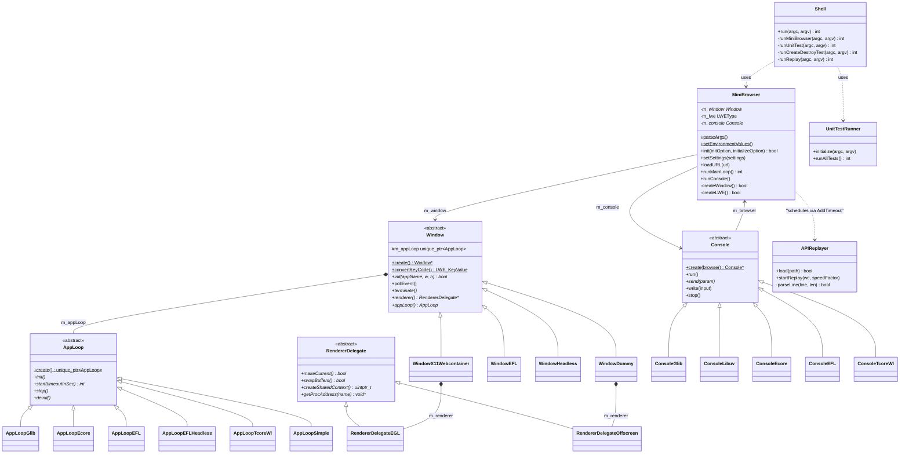

# Functional Requirements: shell

> **Relevant source files**
>
> - [src/shell/Shell.cpp](src:src/shell/Shell.cpp)
> - [src/shell/Shell.h](src:src/shell/Shell.h)
> - [src/shell/MiniBrowser.cpp](src:src/shell/MiniBrowser.cpp)
> - [src/shell/MiniBrowser.h](src:src/shell/MiniBrowser.h)
> - [src/shell/Window.h](src:src/shell/Window.h)
> - [src/shell/AppLoop.h](src:src/shell/AppLoop.h)
> - [src/shell/Console.cpp](src:src/shell/Console.cpp)
> - [src/shell/UnitTestRunner.cpp](src:src/shell/UnitTestRunner.cpp)
> - [src/shell/APIReplayer.cpp](src:src/shell/APIReplayer.cpp)
> - [src/shell/x11_webcontainer/WindowX11Webcontainer.cpp](src:src/shell/x11_webcontainer/WindowX11Webcontainer.cpp)
> - [src/shell/glib/AppLoopGlib.cpp](src:src/shell/glib/AppLoopGlib.cpp)
> - [src/shell/windows/StarfishShell.cpp](src:src/shell/windows/StarfishShell.cpp)

**Module**: [`Shell.cpp`](src:src/shell/Shell.cpp)
**Version**: 2026-09-10
**Linked Design Card**: [modules/shell.md](../modules/shell.md)
**Analysis basis**: AST export and direct source reading

## Overview
The shell module produces the `Starfish` executable whose `main` constructs a `Shell` and dispatches on the first argument between the mini browser, the gtest runner, a create/destroy stress loop and API-trace replay. [`main`](src:src/shell/Shell.cpp#L355) [`Shell::run`](src:src/shell/Shell.cpp#L74)
The mini browser drives the engine only through the public `LWE::` API: it initializes the engine, creates an `LWE::WebContainer` (headless or GL) or an `LWE::WebView` depending on the compile-time backend, and forwards window input into `Dispatch*Event` calls. [`MiniBrowser::init`](src:src/shell/MiniBrowser.cpp#L214) [`MiniBrowser::createLWE`](src:src/shell/MiniBrowser.cpp#L349)
Each windowing backend supplies its own `Window`, `AppLoop` and `Console` implementation under a `STARFISH_SHELL_*` preprocessor guard; a separate Win32 shell with its own `wmain` hosts the engine on Windows. [`Window::create`](src:src/shell/Window.h#L50) [`AppLoop::create`](src:src/shell/AppLoop.h#L29) [`wmain`](src:src/shell/windows/StarfishShell.cpp#L934)

## Functional Requirements

### FR-SHELL-001
**Dispatch the executable by first argument into mini browser, unit-test, create-destroy-test or replay mode**

| Item | Content |
|------|---------|
| **Description** | The executable selects its mode from `argv[1]`: `unit-test` runs the gtest suites, `create-destroy-test` repeatedly runs the mini browser with a timeout, `replay` (test builds only) replays a recorded API trace, and any other value is treated as a URL for the mini browser. With no argument the usage text `please specify url` is printed. |
| **Input** | `argc`, `argv` from the process. |
| **Output** | Integer process exit status; for the mini browser this is the value of the `EXIT_CODE` environment variable read after the loop ends. |
| **Preconditions** | `Shell` constructor has disabled stdout/stderr buffering and tuned `mallopt` thresholds. |
| **Postconditions** | Exactly one sub-mode has run to completion; `create-destroy-test` has run the mini browser `repeat-count` times with `--timeout=<interval>`. |
| **Source** | [`Shell::run`](src:src/shell/Shell.cpp#L74), [`Shell::runCreateDestroyTest`](src:src/shell/Shell.cpp#L104), [`Shell::getExitCode`](src:src/shell/Shell.cpp#L297), [`Shell::printUsage`](src:src/shell/Shell.cpp#L273) |

**Acceptance criteria**:
- [ ] `./Starfish` with no arguments prints `please specify url` and returns 0 (`return false`). [`Shell::run`](src:src/shell/Shell.cpp#L74)
- [ ] `./Starfish unit-test [gtest args]` returns the gtest run result. [`Shell::runUnitTest`](src:src/shell/Shell.cpp#L97)
- [ ] `./Starfish create-destroy-test N I URL` with `argc != 5` prints the usage line and returns 0; otherwise runs the mini browser N times. [`Shell::runCreateDestroyTest`](src:src/shell/Shell.cpp#L104)
- [ ] `./Starfish <url> [options]` runs the mini browser and returns `atoi(getenv("EXIT_CODE"))`. [`Shell::runMiniBrowser`](src:src/shell/Shell.cpp#L129)

### FR-SHELL-002
**Parse mini-browser command-line options into environment, geometry, settings and run options**

| Item | Content |
|------|---------|
| **Description** | Arguments after the URL are matched by exact string or prefix and stored in four structures: `EnvironmentValues` (dump/debug flags, screenshot, hide-window, network log, SSL bypass, GL compositor scale), `InitOption` (geometry `--width=`, `--height=`, `--posX=`, `--posY=`, `--device-pixel-ratio=`), `Settings` (`--useragent=`, `--disable-web-security`, `--tts-forced`, `--tts-language=`, `--needs-download-webfont-early`, `--needs-downscale-image-resource-larger-than=`, `--scrollbar-unvisible`, `--use-external-popup`, `--use-spatial-navigation`, `--use-http2`, `--show-fps`, `--enable-video-overlay`) and `OtherOptions` (`--crash-test`, `--disable-console`, `--timeout=`, `--storage-dir=`, `--prefer-isolated-thread`, `--prefer-incremental-gc`). Unrecognized options are ignored. |
| **Input** | `argc`, `argv` (`argv[1]` is the URL and is skipped). |
| **Output** | Populated `EnvironmentValues`, `InitOption`, `Settings`, `OtherOptions`. |
| **Preconditions** | `init.geometry` pre-set to `{0, 0, 1920, 1080}` by the caller. |
| **Postconditions** | `--pixel-test` and `--ref-test` take effect only when `SHELL_ENABLE_TEST` is defined; `--hide-window` also sets the `enableRegressionTest` start-up flag. |
| **Source** | [`MiniBrowser::parseArgs`](src:src/shell/MiniBrowser.cpp#L47), [`StarfishStartUpFlag`](src:src/shell/MiniBrowser.cpp#L34), [`kDefaultWidth`](src:src/shell/Shell.cpp#L51) |

**Acceptance criteria**:
- [ ] `--width=800 --height=600` yields `init.geometry.width == 800`, `height == 600`. [`MiniBrowser.cpp`](src:src/shell/MiniBrowser.cpp#L75)
- [ ] `--dump-frame-tree` sets bit `1 << 2` in `env.flag`. [`StarfishStartUpFlag`](src:src/shell/MiniBrowser.cpp#L34)
- [ ] `--timeout=5` yields `others.timeout == 5`. [`MiniBrowser.cpp`](src:src/shell/MiniBrowser.cpp#L138)
- [ ] `--prefer-isolated-thread` sets `others.preferIsolatedThread = false`, which makes the caller omit `PreferSeparateThread` from the `LWE::InitializeOption`. [`Shell::runMiniBrowser`](src:src/shell/Shell.cpp#L129)

### FR-SHELL-003
**Export test and debug switches to the engine through process environment variables**

| Item | Content |
|------|---------|
| **Description** | Before engine creation the shell publishes `EnvironmentValues` as environment variables: `SCREEN_SHOT`, `SCREEN_SHOT_FILE`, `EXIT_AFTER_SCREEN_SHOT=1`, `SCREEN_SHOT_WIDTH`, `SCREEN_SHOT_HEIGHT`, `HIDE_WINDOW=1`, `NETWORK_LOG_VERBOSE=1`, `IGNORE_SSL_VERIFY=1`, `LWE_GL_COMPOSITOR_SCALE`, `PIXEL_TEST=1`, `REF_TEST_STATE=1` (which also sets `HIDE_WINDOW=1`), `START_UP_FLAG=<flag>` and `EXIT_CODE=0`. The shell itself reads `GC_FREQUENCY` (forwarded to `LWE::LWE::SetGCFrequency`), `HOME` (storage directory base), `SCREEN_SHOT`/`HIDE_WINDOW` (window visibility hint in test builds) and `EXIT_CODE` (exit status). |
| **Input** | `EnvironmentValues` from FR-SHELL-002. |
| **Output** | `setenv` side effects visible to the engine library in the same process. |
| **Preconditions** | Called before `MiniBrowser::init`. |
| **Postconditions** | `START_UP_FLAG` and `EXIT_CODE` are always set; the others only when the matching option was given. |
| **Source** | [`MiniBrowser::setEnvironmentValues`](src:src/shell/MiniBrowser.cpp#L150), [`MiniBrowser.cpp`](src:src/shell/MiniBrowser.cpp#L230), [`MiniBrowser.cpp`](src:src/shell/MiniBrowser.cpp#L336), [`MiniBrowser::storageDir`](src:src/shell/MiniBrowser.cpp#L518) |

**Acceptance criteria**:
- [ ] `--screen-shot=out.png` results in `SCREEN_SHOT=out.png`, `SCREEN_SHOT_FILE=out.png`, `EXIT_AFTER_SCREEN_SHOT=1`. [`MiniBrowser.cpp`](src:src/shell/MiniBrowser.cpp#L152)
- [ ] `--ref-test` in a test build results in `REF_TEST_STATE=1` and `HIDE_WINDOW=1`. [`MiniBrowser.cpp`](src:src/shell/MiniBrowser.cpp#L186)
- [ ] `GC_FREQUENCY=16` in the environment leads to `LWE::LWE::SetGCFrequency(16)` after `Initialize`. [`MiniBrowser.cpp`](src:src/shell/MiniBrowser.cpp#L230)
- [ ] Without `--storage-dir=`, the storage path is `$HOME/Starfish-storage`, falling back to `/tmp/Starfish-storage` when `HOME` is unset or empty. [`MiniBrowser::storageDir`](src:src/shell/MiniBrowser.cpp#L518)

### FR-SHELL-004
**Initialize the engine and create the backend-specific `LWE::WebContainer` or `LWE::WebView`**

| Item | Content |
|------|---------|
| **Description** | `MiniBrowser::init` creates the backend window first, then calls `LWE::LWE::SetVersionPreference(true)`, `LWE::LWE::Initialize(storageDir, option)`, prints `LWE Version: M.m.p`, and creates the engine handle: `LWE::WebContainer::CreateGL` with a `RendererGLConfiguration` bound to the window's `RendererDelegate` (x11_webcontainer), `LWE::WebView::Create` on the native window handle (efl, x11, ecore_x, ecore_wl2, tcore_wl), or `LWE::WebContainer::CreateHeadless` (efl_headless, tcore_headless, glib_headless). Container arguments are fixed to font `serif`, locale `ko-KR`, timezone `Asia/Seoul`. Settings from FR-SHELL-002 are then applied via `LWE::Settings`. |
| **Input** | `InitOption` (geometry, scale factor), `LWE::InitializeOption`, `Settings`. |
| **Output** | `m_lwe` handle of type `LWEType`; `false` when the window or the handle cannot be created. |
| **Preconditions** | Backend selected at build time through one `STARFISH_SHELL_*` define. |
| **Postconditions** | Window handlers for resize, motion, button, scroll, key, exit and composition are bound to `LWE::WebContainer` dispatch calls (x11_webcontainer); EFL binds a focus-in handler and adds the unwrapped view as an auto-fit child. |
| **Source** | [`MiniBrowser::init`](src:src/shell/MiniBrowser.cpp#L214), [`MiniBrowser::createLWE`](src:src/shell/MiniBrowser.cpp#L349), [`MiniBrowser::setSettings`](src:src/shell/MiniBrowser.cpp#L242), [`LWEType`](src:src/shell/MiniBrowser.h#L42), [`WebContainer::CreateGL`](src:inc/LWEWebView.h#L361), [`WebContainer::CreateHeadless`](src:inc/LWEWebView.h#L375), [`WebView::Create`](src:inc/LWEWebView.h#L575) |

**Acceptance criteria**:
- [ ] When `Window::init` fails, `MiniBrowser::init` returns `false` before `LWE::LWE::Initialize` is called. [`MiniBrowser::init`](src:src/shell/MiniBrowser.cpp#L219)
- [ ] In an `x11_webcontainer` build, `CreateGL` returning null makes `createLWE` return `false`. [`MiniBrowser.cpp`](src:src/shell/MiniBrowser.cpp#L392)
- [ ] `--useragent=UA` results in `SetUserAgentString("UA")` on the `LWE::Settings` passed to `SetSettings`. [`MiniBrowser.cpp`](src:src/shell/MiniBrowser.cpp#L245)
- [ ] `--disable-web-security` results in `SetWebSecurityMode(LWE::WebSecurityMode::Disable)`. [`MiniBrowser.cpp`](src:src/shell/MiniBrowser.cpp#L249)

### FR-SHELL-005
**Run the backend main loop with optional timeout and signal-driven stop**

| Item | Content |
|------|---------|
| **Description** | `AppLoop::start(timeoutInSec)` blocks in the backend's event loop until `stop()` is called. GLib: `g_main_loop_run`, one-shot `g_timeout_add_seconds` timer, `SIGINT`/`SIGTERM` via `g_unix_signal_add`. Ecore/EFL headless: `ecore_main_loop_begin` with `ecore_timer_add`. EFL: `elm_run`/`elm_exit`. tizen-core: `tizen_core_task_run` with `tizen_core_add_timer`. libuv build: a `usleep(100)` polling loop with a `SIGINT` handler. |
| **Input** | `timeoutInSec` (0 = no timeout) from `--timeout=`. |
| **Output** | `start` returns 0 (libuv variant returns 1 if `sigaction` fails). |
| **Preconditions** | `AppLoop::init` called from `Window::init`. |
| **Postconditions** | Pending timeout sources are removed in `stop()`; signal sources are removed in `deinit()` from the `Window` destructor. |
| **Source** | [`AppLoop`](src:src/shell/AppLoop.h#L27), [`AppLoopGlib::start`](src:src/shell/glib/AppLoopGlib.cpp#L89), [`AppLoopGlib::stop`](src:src/shell/glib/AppLoopGlib.cpp#L106), [`AppLoopEcore::start`](src:src/shell/ecore/AppLoopEcore.cpp#L59), [`AppLoopEFL::start`](src:src/shell/efl/AppLoopEFL.cpp#L58), [`AppLoopEFLHeadless::start`](src:src/shell/efl/AppLoopEFLHeadless.cpp#L57), [`AppLoopTcoreWl::start`](src:src/shell/tcore_wl/AppLoopTcoreWl.cpp#L63), [`AppLoopSimple::start`](src:src/shell/libuv/AppLoopLibuv.cpp#L85), [`MiniBrowser::runMainLoopWithTimeout`](src:src/shell/MiniBrowser.cpp#L321) |

**Acceptance criteria**:
- [ ] `--timeout=3` on a GLib backend quits the loop after a 3-second one-shot timer. [`AppLoopGlib::start`](src:src/shell/glib/AppLoopGlib.cpp#L89)
- [ ] `SIGINT` or `SIGTERM` on a GLib backend calls `stop()` and removes the signal source. [`AppLoopGlib::onSignal`](src:src/shell/glib/AppLoopGlib.cpp#L74)
- [ ] `stop()` on a running GLib loop calls `g_main_loop_quit` only if the loop is running. [`AppLoopGlib::stop`](src:src/shell/glib/AppLoopGlib.cpp#L106)
- [ ] The libuv-build loop exits when `doneFlag` is set or the elapsed time reaches `timeoutInSec * 1000` ms. [`AppLoopSimple::start`](src:src/shell/libuv/AppLoopLibuv.cpp#L85)

### FR-SHELL-006
**Translate X11 window, pointer, key and input-method events into engine dispatch calls**

| Item | Content |
|------|---------|
| **Description** | The `x11_webcontainer` window opens the X display, creates a simple window with `StructureNotify`, button, pointer-motion and key masks, registers `WM_DELETE_WINDOW`, opens an XIM/XIC, and watches the X connection fd from the GLib loop. `pollEvent` maps `ConfigureNotify` to the size handler, `MotionNotify` to the motion handler, `Button1` press/release to the button handler, `Button4`/`Button5` to the scroll handler (delta -1/+1), `KeyPress`/`KeyRelease` through `XmbLookupString` (printable single byte to key handler, multi-byte to composition-end handler, keysyms in `[INPUT::LEFT, INPUT::CODE_END)` to key handler), and `ClientMessage` with `WM_DELETE_WINDOW` to the exit handler plus `AppLoop::stop`. `Window::convertKeyCode` maps ASCII `HT`, `BS`, `CR`, `ESC`, `DEL` and arrow keysyms to `LWE::KeyValue`. |
| **Input** | X events on the display connection; `XMODIFIERS` environment variable for `XSetLocaleModifiers`. |
| **Output** | Calls to `DispatchMouseMoveEvent`, `DispatchMouseDownEvent`, `DispatchMouseUpEvent`, `DispatchMouseWheelEvent`, `DispatchKeyDownEvent`/`DispatchKeyPressEvent`/`DispatchKeyUpEvent`, `DispatchCompositionUpdateEvent`/`DispatchCompositionEndEvent`, `ResizeTo`. |
| **Preconditions** | `XOpenDisplay(nullptr)` succeeds; otherwise `init` prints `Cannot open display` and returns `false`. |
| **Postconditions** | Window is mapped only when the `HINT_VISIBLE` hint is set (default 1); `terminate` destroys the IC/IM, window and closes the display. |
| **Source** | [`WindowX11Webcontainer::init`](src:src/shell/x11_webcontainer/WindowX11Webcontainer.cpp#L318), [`WindowX11Webcontainer::pollEvent`](src:src/shell/x11_webcontainer/WindowX11Webcontainer.cpp#L459), [`WindowX11Webcontainer::registerX11Fd`](src:src/shell/x11_webcontainer/WindowX11Webcontainer.cpp#L389), [`Window::convertKeyCode`](src:src/shell/x11_webcontainer/WindowX11Webcontainer.cpp#L602), [`MiniBrowser.cpp`](src:src/shell/MiniBrowser.cpp#L396), [`INPUT`](src:src/shell/WindowKeyType.h#L25) |

**Acceptance criteria**:
- [ ] A `Button1` press produces `DispatchMouseDownEvent(NoButton, LeftButtonDown, x, y)` at the queried pointer position; the release produces `DispatchMouseUpEvent(NoButton, NoButtonDown, x, y)`. [`MiniBrowser.cpp`](src:src/shell/MiniBrowser.cpp#L407)
- [ ] A `Button4` press produces `DispatchMouseWheelEvent(x, y, -1)`; `Button5` produces delta `+1`. [`WindowX11Webcontainer.cpp`](src:src/shell/x11_webcontainer/WindowX11Webcontainer.cpp#L494)
- [ ] Key code `0xff51` (`INPUT::LEFT`) is converted to `LWE::KeyValue::ArrowLeftKey`; ASCII `HT` to `TabKey`. [`Window::convertKeyCode`](src:src/shell/x11_webcontainer/WindowX11Webcontainer.cpp#L602)
- [ ] `WM_DELETE_WINDOW` prints `Exit` and stops the app loop. [`WindowX11Webcontainer.cpp`](src:src/shell/x11_webcontainer/WindowX11Webcontainer.cpp#L557), [`MiniBrowser.cpp`](src:src/shell/MiniBrowser.cpp#L440)
- [ ] With `SCREEN_SHOT` or `HIDE_WINDOW` set in a test build the window is created unmapped (`XUnmapWindow`). [`MiniBrowser.cpp`](src:src/shell/MiniBrowser.cpp#L336), [`WindowX11Webcontainer.cpp`](src:src/shell/x11_webcontainer/WindowX11Webcontainer.cpp#L342)

### FR-SHELL-007
**Provide GL context callbacks to the engine through `RendererDelegate` (EGL on-screen, EGL offscreen, WGL)**

| Item | Content |
|------|---------|
| **Description** | `RendererDelegate` declares `makeCurrent`, `swapBuffers`, `createSharedContext`, `destroyContext`, `clearCurrentContext`, `makeCurrentWithContext`, `getProcAddress`, `isSupportedExtension`; `MiniBrowser::createLWE` wires each into the matching `LWE::WebContainer::RendererGLConfiguration` callback. `RendererDelegateEGL` (x11_webcontainer) creates an EGL window surface with RGBA8, ES2-renderable config and an ES 3 context falling back to ES 2. `RendererDelegateOffscreen` (dummy window for x11/ecore/tcore_wl) lazily creates a 1x1 pbuffer context. `RendererWGL` (Windows) creates a WGL context, resolves entry points via `wglGetProcAddress` then `opengl32.dll`, and can capture the back buffer to BMP inside `swapBuffers`. |
| **Input** | Native window (`XWindow`, `HWND`) or none (pbuffer). |
| **Output** | GL context handles (`uintptr_t`, `UINTPTR_MAX` on failure), booleans, function pointers, extension query result. |
| **Preconditions** | `eglGetDisplay(EGL_DEFAULT_DISPLAY)` and `eglInitialize` succeed. |
| **Postconditions** | `deinitialize`/destructor destroy surface and context and call `eglTerminate`. |
| **Source** | [`RendererDelegate`](src:src/shell/RendererDelegate.h#L27), [`RendererDelegateEGL`](src:src/shell/x11_webcontainer/WindowX11Webcontainer.cpp#L169), [`createEGLDisplay`](src:src/shell/x11_webcontainer/WindowX11Webcontainer.cpp#L63), [`createGLContext`](src:src/shell/x11_webcontainer/WindowX11Webcontainer.cpp#L142), [`RendererDelegateOffscreen`](src:src/shell/dummy/WindowDummy.cpp#L35), [`WindowDummy::renderer`](src:src/shell/dummy/WindowDummy.cpp#L217), [`RendererWGL`](src:src/shell/windows/RendererWGL.h#L26), [`RendererWGL::getProcAddress`](src:src/shell/windows/RendererWGL.cpp#L301), [`MiniBrowser.cpp`](src:src/shell/MiniBrowser.cpp#L360) |

**Acceptance criteria**:
- [ ] `createSharedContext` returns `UINTPTR_MAX` when both ES 3 and ES 2 context creation fail. [`RendererDelegateEGL::createSharedContext`](src:src/shell/x11_webcontainer/WindowX11Webcontainer.cpp#L226)
- [ ] `isSupportedExtension(name)` returns true only if `name` is a substring of `eglQueryString(EGL_EXTENSIONS)`. [`RendererDelegateEGL::isSupportedExtension`](src:src/shell/x11_webcontainer/WindowX11Webcontainer.cpp#L264)
- [ ] `WindowDummy::renderer` returns null after an offscreen EGL initialization failure and prints a diagnostic. [`WindowDummy::renderer`](src:src/shell/dummy/WindowDummy.cpp#L217)
- [ ] `WindowEFL::renderer` and `WindowHeadless::renderer` return null (no GL callbacks for `LWE::WebView` and headless builds). [`WindowEFL`](src:src/shell/efl/WindowEFL.cpp#L30), [`WindowHeadless`](src:src/shell/headless/WindowHeadless.cpp#L30)

### FR-SHELL-008
**Accept interactive stdin commands and JavaScript on a console thread**

| Item | Content |
|------|---------|
| **Description** | Unless `--disable-console` is given, `Console::run` starts a pthread that waits on stdin with `select` (100 ms slices) and reads lines with `fgets`; each line is wrapped in a `Param` and handed to the backend `send`, which schedules `Console::write` on the main loop (GLib idle + timeout, libuv `uv_async_send`, Ecore animator, tizen-core idle job). `write` interprets `\reload`, `\rotate <0|90|180|270>` and `\dpr <float>` as browser commands and evaluates any other input as JavaScript, printing the result. |
| **Input** | Lines from `stdin`. |
| **Output** | `MiniBrowser::reload`, `setRotate`, `setDevicePixelRatio`, or `puts(evaluateJavaScript(input))`. |
| **Preconditions** | `MiniBrowser::runConsole` called after `init`. |
| **Postconditions** | Thread exits on EOF, on non-`EINTR` `select`/`fgets` errors, or when `stop()` clears `m_running`; destructor joins the thread. |
| **Source** | [`Console::run`](src:src/shell/Console.cpp#L52), [`Console::write`](src:src/shell/Console.cpp#L114), [`Console::~Console`](src:src/shell/Console.cpp#L39), [`ConsoleGlib`](src:src/shell/glib/ConsoleGlib.cpp#L36), [`ConsoleLibuv`](src:src/shell/libuv/ConsoleLibuv.cpp#L33), [`ConsoleEcore`](src:src/shell/ecore/ConsoleEcore.cpp#L33), [`ConsoleEFL`](src:src/shell/efl/ConsoleEFL.cpp#L33), [`ConsoleTcoreWl`](src:src/shell/tcore_wl/ConsoleTcoreWl.cpp#L33), [`MiniBrowser::runConsole`](src:src/shell/MiniBrowser.cpp#L326) |

**Acceptance criteria**:
- [ ] Input `\rotate 90` calls `setRotate(90)`; `\rotate 45` is ignored. [`Console.cpp`](src:src/shell/Console.cpp#L123)
- [ ] Input `\dpr 0` is ignored; `\dpr 1.3` calls `setDevicePixelRatio(1.3)`. [`Console.cpp`](src:src/shell/Console.cpp#L129)
- [ ] Input `1+1` is passed to `evaluateJavaScript` and the result is printed. [`Console.cpp`](src:src/shell/Console.cpp#L137)
- [ ] When stdin reaches EOF the reader thread terminates instead of spinning. [`Console.cpp`](src:src/shell/Console.cpp#L85)

### FR-SHELL-009
**Run the embedded gtest suites in `unit-test` mode**

| Item | Content |
|------|---------|
| **Description** | `UnitTestRunner::initialize` calls `testing::InitGoogleTest(&argc, argv)` and `runAllTests` returns `testing::UnitTest::GetInstance()->Run()` on Linux and Tizen; other platforms return 0. Suites compiled into the executable cover `LWE::LWE` lifecycle (`LWETest`), `LWE::Settings` (`SettingsTest`), `LWE::CookieManager` (`CookieManagerTest`), `LWE::WebContainer` (`WebContainerTest`), `LWE::WebView` (`WebViewTest`) and the API recorder/replayer (`APIRecorderTest`). Fixtures use `Window::create` with `HINT_VISIBLE = 0` and storage `/tmp/starfish_storage/`. |
| **Input** | gtest command-line arguments after `unit-test`. |
| **Output** | gtest exit status. |
| **Preconditions** | Built with `STARFISH_LINUX` or `STARFISH_TIZEN`; gtest linked from `third_party/googletest`. |
| **Postconditions** | Each fixture finalizes the engine in `TearDown`. |
| **Source** | [`UnitTestRunner::initialize`](src:src/shell/UnitTestRunner.cpp#L37), [`UnitTestRunner::runAllTests`](src:src/shell/UnitTestRunner.cpp#L44), [`LWETest`](src:src/shell/test/LWETest.cpp#L63), [`SettingsTest`](src:src/shell/test/SettingsTest.cpp#L30), [`CookieManagerTest`](src:src/shell/test/CookieManagerTest.cpp#L83), [`WebContainerCreationTest`](src:src/shell/test/WebContainerTest.cpp#L104), [`WebViewCreationTest`](src:src/shell/test/WebViewTest.cpp#L32), [`APIRecorderRecordingTest`](src:src/shell/test/APIRecorderTest.cpp#L68) |

**Acceptance criteria**:
- [ ] `./Starfish unit-test --gtest_filter=LWETest.*` runs only the filtered suite (arguments forwarded to `InitGoogleTest`). [`UnitTestRunner::initialize`](src:src/shell/UnitTestRunner.cpp#L37)
- [ ] `LWETestWitoutInit.GetGCFrequency` expects the process to die with `SIGABRT` when the engine is not initialized. [`LWETest.cpp`](src:src/shell/test/LWETest.cpp#L127)
- [ ] `APIRecorderRecordingTest` sets `STARFISH_API_RECORD` before creating the container and removes it afterwards. [`APIRecorderTest.cpp`](src:src/shell/test/APIRecorderTest.cpp#L78)

### FR-SHELL-010
**Replay a recorded embedder API trace against a `LWE::WebContainer`**

| Item | Content |
|------|---------|
| **Description** | `./Starfish replay <recording.jsonl> [--speed=<factor>] [MiniBrowser options]` exports `STARFISH_API_REPLAY` and `STARFISH_API_REPLAY_SPEED`, then runs the mini browser on `about:blank` with `--disable-console`. After the container exists, a 100 ms `AddTimeout` loads the file; each non-empty line is parsed for `type`, `ts_us` and type-specific fields (a `header` line carries `w`, `h`, `dpr`). `startReplay` schedules every event with `AddTimeout` at `ts_us / speedFactor` relative to the schedule start and `dispatchEvent` re-issues the corresponding `LWE::WebContainer` call (`LoadURL`, `LoadData`, `Reload`, `GoBack`, `ResizeTo`, `DispatchMouse*Event`, `DispatchKey*Event`, `DispatchComposition*Event`, `EvaluateJavaScript`, `SetSettings`, `ScrollTo`, ...). |
| **Input** | JSONL file path, optional speed factor. |
| **Output** | Engine calls on the live container; stderr lines `[APIReplayer] Loaded N events` and `[APIReplayer] Scheduled N events`. |
| **Preconditions** | `STARFISH_ENABLE_TEST` build and a `WebContainer` backend (`x11_webcontainer` or headless). |
| **Postconditions** | `load` returns `false` when the file is missing or yields no events. |
| **Source** | [`Shell::runReplay`](src:src/shell/Shell.cpp#L307), [`MiniBrowser.cpp`](src:src/shell/MiniBrowser.cpp#L489), [`APIReplayer::load`](src:src/shell/APIReplayer.cpp#L189), [`APIReplayer::parseLine`](src:src/shell/APIReplayer.cpp#L215), [`APIReplayer::startReplay`](src:src/shell/APIReplayer.cpp#L407), [`ReplayEvent`](src:src/shell/APIReplayer.h#L33), [`ReplayHeader`](src:src/shell/APIReplayer.h#L47) |

**Acceptance criteria**:
- [ ] `./Starfish replay` with fewer than 3 arguments prints the usage line and returns 0. [`Shell::runReplay`](src:src/shell/Shell.cpp#L307)
- [ ] `--speed=2` halves every event delay. [`APIReplayer::startReplay`](src:src/shell/APIReplayer.cpp#L407)
- [ ] A missing recording file makes `load` return `false` (`APIReplayerParserTest.LoadReturnsFalseForMissingFile`). [`APIReplayerParserTest`](src:src/shell/test/APIRecorderTest.cpp#L407)
- [ ] A `header` line without `w`/`h`/`dpr` yields 1920x1080 and dpr 1.0. [`APIReplayer::parseLine`](src:src/shell/APIReplayer.cpp#L215)

### FR-SHELL-011
**Host the engine in a Win32 window with screenshot and timeout options**

| Item | Content |
|------|---------|
| **Description** | The Windows shell (`starfish.windows_shell`) parses `[URL-or-file] [--screenshot=FILE.bmp] [--screenshot-frames=N] [--window-size=WxH] [--timeout-ms=N]`; a bare path is converted to a `file:///` URL and no URL yields a built-in `data:text/html` smoke page. It registers the `StarfishWin32OpenGLShell` window class, creates a 1280x720 `WS_OVERLAPPEDWINDOW`, initializes `RendererWGL`, calls `LWE::LWE::Initialize(LOCALAPPDATA-based storage, PreferSeparateThread)`, creates the container with `LWE::WebContainer::CreateGL`, disables web security, focuses the container and runs the Win32 message loop. `windowProc` forwards size, mouse, wheel, key and IME messages to the container; page-loaded posts `kMessagePageLoaded` to arm a screenshot; `--timeout-ms` posts quit code 3. |
| **Input** | Wide-character `argv`; `LOCALAPPDATA` environment variable. |
| **Output** | Process exit code (2 on bad arguments, 1 on window/GL failure, 3 on timeout, otherwise the `PostQuitMessage` code); optional BMP file. |
| **Preconditions** | Built with `STARFISH_WINDOWS_BUILD_SHELL=ON`; `Starfish.dll` available. |
| **Postconditions** | `destroyWebContainer` blurs, destroys and calls `LWE::LWE::Finalize`; window class unregistered. |
| **Source** | [`wmain`](src:src/shell/windows/StarfishShell.cpp#L934), [`Shell::run`](src:src/shell/windows/StarfishShell.cpp#L296), [`Shell::parseArguments`](src:src/shell/windows/StarfishShell.cpp#L419), [`commandLineURL`](src:src/shell/windows/StarfishShell.cpp#L205), [`defaultSmokeURL`](src:src/shell/windows/StarfishShell.cpp#L193), [`Shell::createWebContainer`](src:src/shell/windows/StarfishShell.cpp#L477), [`Shell::windowProc`](src:src/shell/windows/StarfishShell.cpp#L593), [`Shell::createWindow`](src:src/shell/windows/StarfishShell.cpp#L807), [`storageDirectory`](src:src/shell/windows/StarfishShell.cpp#L73), [`RendererWGL::requestScreenshot`](src:src/shell/windows/RendererWGL.cpp#L196) |

**Acceptance criteria**:
- [ ] An unknown `--option` prints `unknown option` and the usage text and returns 2. [`StarfishShell.cpp`](src:src/shell/windows/StarfishShell.cpp#L445)
- [ ] Two positional URLs print `more than one URL` and return 2. [`StarfishShell.cpp`](src:src/shell/windows/StarfishShell.cpp#L451)
- [ ] `--timeout-ms=N` elapsing posts quit code 3 and logs frames presented. [`StarfishShell.cpp`](src:src/shell/windows/StarfishShell.cpp#L740)
- [ ] `WM_CLOSE` posts quit code 0 and keeps the HWND for teardown after the loop. [`StarfishShell.cpp`](src:src/shell/windows/StarfishShell.cpp#L764)

## Non-Functional Requirements
| Item | Requirement | Source |
|---|---|---|
| Performance | `mallopt(M_MMAP_THRESHOLD, 2048)` and `mallopt(M_MMAP_MAX, 1024*1024)` are applied at shell start; the libuv-build loop polls every 100 us; console thread wakes every 100 ms. | [`Shell::Shell`](src:src/shell/Shell.cpp#L58), [`AppLoopLibuv.cpp`](src:src/shell/libuv/AppLoopLibuv.cpp#L106), [`Console.cpp`](src:src/shell/Console.cpp#L69) |
| Security | `--disable-web-security` and `--ignore-ssl-verify` are opt-in on the Linux shell; the Windows shell always sets `WebSecurityMode::Disable`. | [`MiniBrowser.cpp`](src:src/shell/MiniBrowser.cpp#L249), [`StarfishShell.cpp`](src:src/shell/windows/StarfishShell.cpp#L571) |
| Error handling | Window/EGL/container creation failures return `false` and abort the run; `WindowEFL::init` calls `exit(-1)` when the window cannot be created; the X11 shell prints `Cannot open display`. | [`MiniBrowser::init`](src:src/shell/MiniBrowser.cpp#L214), [`WindowEFL::init`](src:src/shell/efl/WindowEFL.cpp#L65), [`WindowX11Webcontainer.cpp`](src:src/shell/x11_webcontainer/WindowX11Webcontainer.cpp#L330) |
| Logging | stdout/stderr are unbuffered; `LWE Version: M.m.p` is printed after init; Windows shell logs `[StarfishShell] ...` and page lifecycle events to stderr; crash handler prints `[STARFISH_TEST] Got signal` (string is relied on by the test runner). | [`Shell::Shell`](src:src/shell/Shell.cpp#L58), [`MiniBrowser.cpp`](src:src/shell/MiniBrowser.cpp#L228), [`sigHandler`](src:src/shell/Shell.cpp#L216) |
| Crash diagnostics | On x86_64 Linux test builds, `SIGSEGV`/`SIGABRT` print a libbacktrace stack and re-raise to produce a core dump; `--crash-test` raises `SIGINT` after 5 seconds. | [`Shell::setBacktraceHandler`](src:src/shell/Shell.cpp#L253), [`Shell::runCrashTestThread`](src:src/shell/Shell.cpp#L278) |

## Constraints
- One backend per build: `-DSHELL=` selects exactly one of `efl`, `efl_headless`, `x11`, `ecore_x`, `ecore_wl2`, `tcore_wl`, `tcore_headless`, `glib_headless`, `x11_webcontainer`; README documents `x11` (default) and `glib_headless`. [`SET_STARFISH_SHELL_DEFINES`](src:build/starfish_shell_defines.cmake#L3) [`README.md`](src:README.md#L101)
- GLib-based `AppLoop`/`Console` additionally require `STARFISH_GLIB_CAIRO_GL` or `STARFISH_GLIB_HEADLESS`; the libuv variants require `STARFISH_UV_CAIRO_GL`. [`AppLoopGlib.cpp`](src:src/shell/glib/AppLoopGlib.cpp#L22) [`AppLoopLibuv.cpp`](src:src/shell/libuv/AppLoopLibuv.cpp#L22)
- Container locale/timezone/font are hard-coded to `ko-KR`, `Asia/Seoul`, `serif` in the Linux mini browser and `sans-serif` in the Windows shell. [`MiniBrowser.cpp`](src:src/shell/MiniBrowser.cpp#L352) [`StarfishShell.cpp`](src:src/shell/windows/StarfishShell.cpp#L496)
- The default storage directory `$HOME/Starfish-storage` is shared by every Starfish process on the machine; test drivers are expected to pass `--storage-dir=`. [`OtherOptions`](src:src/shell/MiniBrowser.h#L97)
- The Windows shell entry point is `wmain` and the target links with `/ENTRY:wmainCRTStartup`. [`windows.cmake`](src:build/windows.cmake#L398)

## Module Design Card Linkage
| FR | Implementation | Design Card section |
|---|---|---|
| FR-SHELL-001 | [`Shell::run`](src:src/shell/Shell.cpp#L74) | [Key Flow](../modules/shell.md#key-flow) |
| FR-SHELL-002 | [`MiniBrowser::parseArgs`](src:src/shell/MiniBrowser.cpp#L47) | [Quick Navigation](../modules/shell.md#quick-navigation) |
| FR-SHELL-003 | [`MiniBrowser::setEnvironmentValues`](src:src/shell/MiniBrowser.cpp#L150) | [IPC / Message / Interface Contracts](../modules/shell.md#ipc--message--interface-contracts) |
| FR-SHELL-004 | [`MiniBrowser::createLWE`](src:src/shell/MiniBrowser.cpp#L349) | [Architectural Rules](../modules/shell.md#architectural-rules) |
| FR-SHELL-005 | [`AppLoopGlib::start`](src:src/shell/glib/AppLoopGlib.cpp#L89) | [Public Interface](../modules/shell.md#public-interface) |
| FR-SHELL-006 | [`WindowX11Webcontainer::pollEvent`](src:src/shell/x11_webcontainer/WindowX11Webcontainer.cpp#L459) | [Key Flow](../modules/shell.md#key-flow) |
| FR-SHELL-007 | [`RendererDelegateEGL`](src:src/shell/x11_webcontainer/WindowX11Webcontainer.cpp#L169) | [Dependencies](../modules/shell.md#dependencies) |
| FR-SHELL-008 | [`Console::write`](src:src/shell/Console.cpp#L114) | [Architectural Rules](../modules/shell.md#architectural-rules) |
| FR-SHELL-009 | [`UnitTestRunner::runAllTests`](src:src/shell/UnitTestRunner.cpp#L44) | [Source Files](../modules/shell.md#source-files) |
| FR-SHELL-010 | [`APIReplayer::startReplay`](src:src/shell/APIReplayer.cpp#L407) | [Key Flow](../modules/shell.md#key-flow) |
| FR-SHELL-011 | [`wmain`](src:src/shell/windows/StarfishShell.cpp#L934) | [IPC / Message / Interface Contracts](../modules/shell.md#ipc--message--interface-contracts) |

## ENUM Definitions
| ENUM | Values | Used in | Source |
|---|---|---|---|
| `StarfishStartUpFlag` | `enableComputedStyleDump = 1<<1`, `enableFrameTreeDump = 1<<2`, `enableStackingContextDump = 1<<3`, `enableHitTestDump = 1<<4`, `enableDebugGraphicsLayer = 1<<5`, `enableDebugRepaintRegion = 1<<6`, `enableRegressionTest = 1<<7` | `MiniBrowser::parseArgs` (bit-or into `env.flag`, exported as `START_UP_FLAG`) | [`StarfishStartUpFlag`](src:src/shell/MiniBrowser.cpp#L34) |
| `INPUT` | `NONE = 0`, `RELEASE`, `PRESS`, `ACTION_END`, `MOUSE_LBUTTON`, `TYPE_END`, `LEFT = 0xff51`, `UP = 0xff52`, `RIGHT = 0xff53`, `DOWN = 0xff54`, `CODE_END` | `Window` handler signatures, `WindowX11Webcontainer::pollEvent`, `Window::convertKeyCode` | [`INPUT`](src:src/shell/WindowKeyType.h#L25) |
| `MOD` | `SHIFT = 1<<0`, `CONTROL = 1<<2` | Declared in `WindowKeyType.h`; no reference found in `src/shell/` | [`MOD`](src:src/shell/WindowKeyType.h#L44) |
| `ASCII` | `NUL = 0`, `SOH`, `STX`, ... (control characters `HT`, `BS`, `CR`, `ESC`, `DEL` are matched) | `Window::convertKeyCode` (x11_webcontainer) | [`ASCII`](src:src/shell/WindowKeyType.h#L49) |

## Error Code Definitions
| Error code | Value | Trigger | Recovery | Source |
|---|---|---|---|---|
| `EXIT_CODE` (environment variable) | `"0"` set by the shell; overwritten by the engine binding | Read after the main loop ends and returned from `main` | Not specified in code | [`Shell::getExitCode`](src:src/shell/Shell.cpp#L297), [`MiniBrowser.cpp`](src:src/shell/MiniBrowser.cpp#L193) |
| Windows shell quit codes | `2` bad arguments, `1` window/GL/container failure, `3` `--timeout-ms` elapsed, `0` normal close | `Shell::run`, `WM_TIMER`, `WM_CLOSE` | Not specified in code | [`Shell::run`](src:src/shell/windows/StarfishShell.cpp#L296), [`StarfishShell.cpp`](src:src/shell/windows/StarfishShell.cpp#L740) |

## Constant Definitions
| Constant | Value | Purpose | Source |
|---|---|---|---|
| `SHELL_ENABLE_ELEMENTARY_GL` | defined when `STARFISH_SHELL_EFL` | EFL accel preference branch in `WindowEFL::initConfig` | [`SHELL_ENABLE_ELEMENTARY_GL`](src:src/shell/ShellConfig.h#L25) |
| `SHELL_X86_64` | defined on amd64/x86_64 compilers | Gate for the backtrace handler | [`SHELL_X86_64`](src:src/shell/ShellConfig.h#L30) |
| `SHELL_ENABLE_BACKTRACE` | defined when `STARFISH_ENABLE_TEST && SHELL_X86_64 && STARFISH_SHELL_ENABLE_BACKTRACE` | Compiles `Shell::setBacktraceHandler` | [`SHELL_ENABLE_BACKTRACE`](src:src/shell/ShellConfig.h#L35) |
| `SHELL_ENABLE_TEST` | defined when `STARFISH_ENABLE_TEST` | Enables `--pixel-test`/`--ref-test` parsing | [`SHELL_ENABLE_TEST`](src:src/shell/ShellConfig.h#L39) |
| `SHELL_TIZEN` | defined when `STARFISH_TIZEN` | Tizen-specific EFL window setup | [`SHELL_TIZEN`](src:src/shell/ShellConfig.h#L43) |
| `SHELL_ENABLE_TRANSPARENT_WINDOW` | defined when `STARFISH_ENABLE_TRANSPARENT_WINDOW` | Alpha EFL window on Tizen | [`SHELL_ENABLE_TRANSPARENT_WINDOW`](src:src/shell/ShellConfig.h#L47) |
| `kDefaultWidth` / `kDefaultHeight` | `1920` / `1080` | Default mini-browser geometry | [`kDefaultWidth`](src:src/shell/Shell.cpp#L51) |
| `HINT_VISIBLE` | `0x0001` | `Window::setInitHint` key for initial visibility | [`HINT_VISIBLE`](src:src/shell/Window.h#L34) |
| `kWindowClassName` | `L"StarfishWin32OpenGLShell"` | Win32 window class | [`kWindowClassName`](src:src/shell/windows/StarfishShell.cpp#L28) |
| `kShellBuildID` | `"win32-libtuv-20260821-1"` | Logged at Windows shell start | [`kShellBuildID`](src:src/shell/windows/StarfishShell.cpp#L29) |
| `kTimeoutTimerId` / `kNudgeTimerId` | `1` / `2` | `WM_TIMER` ids | [`kTimeoutTimerId`](src:src/shell/windows/StarfishShell.cpp#L245) |
| `kMessagePageLoaded` | `WM_APP + 1` | Cross-thread page-loaded notification | [`kMessagePageLoaded`](src:src/shell/windows/StarfishShell.cpp#L253) |
| `kDefaultCaptureWidth` / `kDefaultCaptureHeight` | `1280` / `800` | Screenshot client-area size | [`kDefaultCaptureWidth`](src:src/shell/windows/StarfishShell.cpp#L258) |

## Message Protocol
| Message ID | Direction | Payload | Handler | Mechanism | Source |
|---|---|---|---|---|---|
| X11 `ClientMessage` with `WM_DELETE_WINDOW` atom | X server → shell | `XEvent.xclient.data.l[0]` | `WindowX11Webcontainer::pollEvent` → exit handler → `AppLoop::stop` | Xlib event queue on a GLib fd watch | [`WindowX11Webcontainer.cpp`](src:src/shell/x11_webcontainer/WindowX11Webcontainer.cpp#L557) |
| X11 `ConfigureNotify` / `MotionNotify` / `ButtonPress` / `ButtonRelease` / `KeyPress` / `KeyRelease` | X server → shell | `XEvent` | `WindowX11Webcontainer::pollEvent` → `Window` handlers → `LWE::WebContainer::Dispatch*Event` | Xlib event queue | [`WindowX11Webcontainer::pollEvent`](src:src/shell/x11_webcontainer/WindowX11Webcontainer.cpp#L459) |
| `kMessagePageLoaded` (`WM_APP + 1`) | engine callback thread → UI thread | none | `Shell::windowProc` (arms screenshot, starts nudge timer) | `PostMessageW` | [`kMessagePageLoaded`](src:src/shell/windows/StarfishShell.cpp#L253) |
| `WM_SIZE`, `WM_MOUSEMOVE`, `WM_LBUTTONDOWN/UP`, `WM_MOUSEWHEEL`, `WM_KEYDOWN/UP`, `WM_IME_*`, `WM_TIMER`, `WM_CLOSE`, `WM_DESTROY` | Win32 → shell | `WPARAM`/`LPARAM` | `Shell::windowProc` → `LWE::WebContainer` | Win32 message loop | [`Shell::windowProc`](src:src/shell/windows/StarfishShell.cpp#L593) |
| JSONL replay record (`type`, `ts_us`, fields) | recording file → shell → `LWE::WebContainer` | one JSON object per line | `APIReplayer::parseLine` / `dispatchEvent` | `fgets` + `AddTimeout` scheduling | [`APIReplayer::parseLine`](src:src/shell/APIReplayer.cpp#L215) |
| `Console::Param` | stdin thread → main loop | `{ Console*, std::string input }` | `Console::write` | backend `send` (`g_idle_add_full`, `uv_async_send`, `ecore_animator_add`, `tizen_core_add_idle_job`) | [`Console::Param`](src:src/shell/Console.h#L33) |

## Class Diagram

Inheritance and containment as declared in [`Window`](src:src/shell/Window.h#L36), [`AppLoop`](src:src/shell/AppLoop.h#L27), [`Console`](src:src/shell/Console.h#L31), [`RendererDelegate`](src:src/shell/RendererDelegate.h#L27), [`WindowX11Webcontainer`](src:src/shell/x11_webcontainer/WindowX11Webcontainer.cpp#L270), [`WindowEFL`](src:src/shell/efl/WindowEFL.cpp#L30), [`WindowHeadless`](src:src/shell/headless/WindowHeadless.cpp#L30), [`WindowDummy`](src:src/shell/dummy/WindowDummy.cpp#L190), [`AppLoopGlib`](src:src/shell/glib/AppLoopGlib.cpp#L35), [`AppLoopEcore`](src:src/shell/ecore/AppLoopEcore.cpp#L31), [`AppLoopEFL`](src:src/shell/efl/AppLoopEFL.cpp#L30), [`AppLoopEFLHeadless`](src:src/shell/efl/AppLoopEFLHeadless.cpp#L29), [`AppLoopTcoreWl`](src:src/shell/tcore_wl/AppLoopTcoreWl.cpp#L32), [`AppLoopSimple`](src:src/shell/libuv/AppLoopLibuv.cpp#L57), [`ConsoleGlib`](src:src/shell/glib/ConsoleGlib.cpp#L36), [`ConsoleLibuv`](src:src/shell/libuv/ConsoleLibuv.cpp#L33), [`ConsoleEcore`](src:src/shell/ecore/ConsoleEcore.cpp#L33), [`ConsoleEFL`](src:src/shell/efl/ConsoleEFL.cpp#L33), [`ConsoleTcoreWl`](src:src/shell/tcore_wl/ConsoleTcoreWl.cpp#L33). The Windows `Shell` class and `RendererWGL` live in a separate executable and are not part of this hierarchy ([`RendererWGL`](src:src/shell/windows/RendererWGL.h#L26)).

## Sequence Diagram
```mermaid
sequenceDiagram
    participant main
    participant Shell
    participant MiniBrowser
    participant Window
    participant AppLoop
    participant Console
    participant LWE_WebContainer as "LWE::WebContainer"
    main->>Shell: "run(argc, argv)"
    Shell->>MiniBrowser: "parseArgs(argc, argv, env, init, settings, others)"
    Shell->>MiniBrowser: "setEnvironmentValues(env) - setenv START_UP_FLAG, EXIT_CODE, ..."
    Shell->>MiniBrowser: "setStorageDirOverride(others.storageDir)"
    Shell->>MiniBrowser: "init(init, initOption)"
    MiniBrowser->>Window: "create()"
    Window->>AppLoop: "create()"
    MiniBrowser->>Window: "init(Starfish, width, height)"
    Window->>AppLoop: "init()"
    MiniBrowser->>LWE_WebContainer: "LWE::LWE::SetVersionPreference(true); Initialize(storageDir, option); GetVersion(...)"
    MiniBrowser->>LWE_WebContainer: "CreateGL(args, config) / CreateHeadless(...) / WebView::Create(handle, ...)"
    MiniBrowser->>Window: "set*EventHandler(lambda -> Dispatch*Event)"
    Shell->>MiniBrowser: "setSettings(settings) -> GetSettings / SetSettings"
    Shell->>MiniBrowser: "loadURL(argv[1]) -> LoadURL"
    Shell->>MiniBrowser: "focus() -> Focus"
    Shell->>MiniBrowser: "runConsole()"
    MiniBrowser->>Console: "create(this); run()"
    Shell->>MiniBrowser: "runMainLoop() / runMainLoopWithTimeout(timeout)"
    MiniBrowser->>AppLoop: "start(timeoutInSec)"
    AppLoop-->>MiniBrowser: "returns after stop()"
    Shell->>Shell: "getExitCode() - getenv EXIT_CODE"
    Shell-->>main: "exit status"
```
Primary flow of [`Shell::runMiniBrowser`](src:src/shell/Shell.cpp#L129) with [`MiniBrowser::init`](src:src/shell/MiniBrowser.cpp#L214), [`MiniBrowser::createLWE`](src:src/shell/MiniBrowser.cpp#L349) and [`MiniBrowser::runMainLoop`](src:src/shell/MiniBrowser.cpp#L316).

## Test Cases
### Positive
- `./Starfish https://example.org --width=800 --height=600 --timeout=5` → window 800x600, engine created, main loop ends after 5 s, exit status from `EXIT_CODE` (default 0). [`Shell::runMiniBrowser`](src:src/shell/Shell.cpp#L129)
- `./Starfish unit-test` → `InitGoogleTest` then `UnitTest::Run()`, exit status equals gtest result. [`Shell::runUnitTest`](src:src/shell/Shell.cpp#L97)
- `./Starfish create-destroy-test 3 2 about:blank` → mini browser runs three times, each with `--timeout=2`. [`Shell::runCreateDestroyTest`](src:src/shell/Shell.cpp#L104)
- `./Starfish replay trace.jsonl --speed=2 --timeout=10` (test build) → `STARFISH_API_REPLAY=trace.jsonl`, `STARFISH_API_REPLAY_SPEED=2.000000`, events scheduled at half delay. [`Shell::runReplay`](src:src/shell/Shell.cpp#L307)
- Console input `\reload` → `LWE::WebContainer::Reload` (or `WebView::Reload`). [`Console.cpp`](src:src/shell/Console.cpp#L121)
- X11 `KeyPress` of Tab with an active XIC → `DispatchKeyDownEvent(TabKey)` then `DispatchKeyPressEvent(TabKey)`. [`Window::convertKeyCode`](src:src/shell/x11_webcontainer/WindowX11Webcontainer.cpp#L602)
- Windows: `StarfishShell page.html --screenshot=out.bmp --window-size=1280x800` → `file:///` URL, fixed client size, BMP captured on the frame after page load. [`Shell::parseArguments`](src:src/shell/windows/StarfishShell.cpp#L419)

### Negative
- `./Starfish` (no arguments) → prints `please specify url`, returns 0. [`Shell::run`](src:src/shell/Shell.cpp#L74)
- `./Starfish create-destroy-test 3 2` (4 args) → prints usage, returns 0. [`Shell::runCreateDestroyTest`](src:src/shell/Shell.cpp#L104)
- `DISPLAY` unavailable on `x11_webcontainer` → `XOpenDisplay` null, `Cannot open display`, `MiniBrowser::init` returns `false`, `runMiniBrowser` returns 0 without initializing the engine. [`WindowX11Webcontainer.cpp`](src:src/shell/x11_webcontainer/WindowX11Webcontainer.cpp#L328)
- `APIReplayer::load("/nonexistent")` → `[APIReplayer] Failed to open`, returns `false`. [`APIReplayer::load`](src:src/shell/APIReplayer.cpp#L189)
- Windows: `StarfishShell --bogus` → `unknown option: --bogus`, usage, exit 2. [`StarfishShell.cpp`](src:src/shell/windows/StarfishShell.cpp#L445)
- Windows: `--timeout-ms=1000` with a page that never loads → `--timeout-ms elapsed`, exit 3. [`StarfishShell.cpp`](src:src/shell/windows/StarfishShell.cpp#L740)
- `LWETestWitoutInit.SetGCFrequency` → calling `SetGCFrequency` before `Initialize` aborts with `SIGABRT`. [`LWETest.cpp`](src:src/shell/test/LWETest.cpp#L133)

### Edge
- `--rotate 45` via console → not one of 0/90/180/270, ignored. [`Console.cpp`](src:src/shell/Console.cpp#L125)
- `\dpr -1` via console → `dpr > 0` fails, ignored. [`Console.cpp`](src:src/shell/Console.cpp#L131)
- stdin redirected from `/dev/null` → `fgets` returns null with `feof`, console thread exits instead of busy-looping. [`Console.cpp`](src:src/shell/Console.cpp#L85)
- `HOME` unset → storage directory `/tmp/Starfish-storage`. [`MiniBrowser.cpp`](src:src/shell/MiniBrowser.cpp#L524)
- `--hide-window` → `HIDE_WINDOW=1` and `enableRegressionTest` flag; in test builds the X11 window is created unmapped. [`MiniBrowser.cpp`](src:src/shell/MiniBrowser.cpp#L87)
- ES 3 context creation fails → falls back to an ES 2 context before reporting failure. [`createGLContext`](src:src/shell/x11_webcontainer/WindowX11Webcontainer.cpp#L142)
- `--speed=0` for replay → `speedFactor > 0.0f` is false, events use their original `ts_us` delays. [`APIReplayer::startReplay`](src:src/shell/APIReplayer.cpp#L407)
- GLib `stop()` called when the loop is not running → `g_main_loop_quit` is skipped. [`AppLoopGlib::stop`](src:src/shell/glib/AppLoopGlib.cpp#L106)
