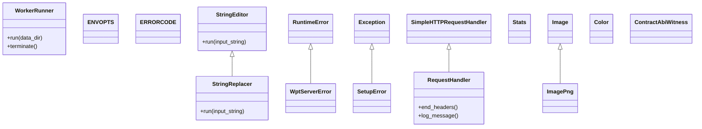
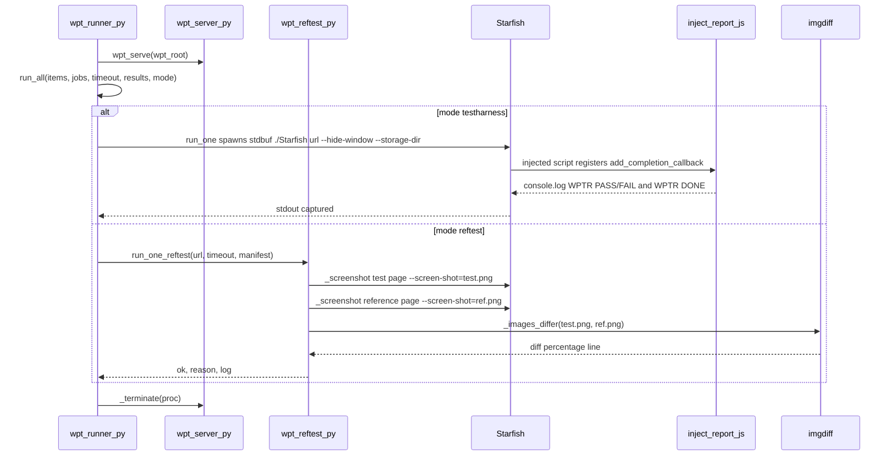

# Functional Requirements: support-tools

> **Relevant source files**
>
> - [tool/runner/test_runner.py](src:tool/runner/test_runner.py)
> - [tool/runner/execution_worker.py](src:tool/runner/execution_worker.py)
> - [tool/drivers/run_test.py](src:tool/drivers/run_test.py)
> - [tool/drivers/basics/starfish_basic_test.py](src:tool/drivers/basics/starfish_basic_test.py)
> - [tool/drivers/basics/starfish_pixel_test.py](src:tool/drivers/basics/starfish_pixel_test.py)
> - [tool/drivers/basics/parallel.py](src:tool/drivers/basics/parallel.py)
> - [tool/wpt/scripts/wpt_runner.py](src:tool/wpt/scripts/wpt_runner.py)
> - [tool/wpt/scripts/wpt_server.py](src:tool/wpt/scripts/wpt_server.py)
> - [tool/wpt/scripts/wpt_reftest.py](src:tool/wpt/scripts/wpt_reftest.py)
> - [tool/wpt/scripts/wpt_status.py](src:tool/wpt/scripts/wpt_status.py)
> - [tool/wpt/inject_report.js](src:tool/wpt/inject_report.js)
> - [tool/lint/check_contract_abi.py](src:tool/lint/check_contract_abi.py)

**Module**: [`test_runner.py`](src:tool/runner/test_runner.py)
**Version**: 2026-09-10
**Linked Design Card**: [modules/support-tools.md](../modules/support-tools.md)
**Analysis basis**: AST export and direct source reading

## Overview

The support-tools module is the developer and CI tooling of Starfish: a suite orchestrator that spawns per-case drivers and exits with `ERRORCODE` values [`run_test`](src:tool/runner/test_runner.py#L55), drivers that launch the `./Starfish` shell once per test case and judge stdout or a screenshot [`case_runner`](src:tool/drivers/basics/starfish_basic_test.py#L98), a Web Platform Tests family that runs URLs against an on-demand `wpt serve` and reads `WPTR` report lines [`run_one`](src:tool/wpt/scripts/wpt_runner.py#L227), and PR gates for source formatting and delegate-contract ABI stability [`compare`](src:tool/lint/check_contract_abi.py#L964).

## Functional Requirements

### FR-SUPPORT-TOOLS-001
**Test-suite orchestration by name with unified exit codes**

| Item | Content |
|------|---------|
| **Description** | `test_runner.py` exposes every module-level function as a named suite; the caller passes suite names on the command line (or none to run `test_all`). Each suite invokes `tool/drivers/run_test.py` as a child process with a test kind, `.res` list, backend and process count, counts the non-commented list lines, and stops the whole run with `ERRORCODE.TEST_FAILED` on the first failing suite. Unknown suite names stop with `ERRORCODE.TEST_STOPPED`. Options set `TC_TIMEOUT`, `TC_FORCE_ENABLE` and `TC_TEST_RESULT_FILE` in the environment for the drivers. |
| **Input** | `test_suite_names` (nargs `*`), `-t/--timeout N`, `-f/--force`, `--out-pass-list`, `--out-pass-list-filename F` |
| **Output** | Per-suite console lines, count of test cases run, process exit code 0 / 1 / 2 |
| **Preconditions** | Run from the repository root; `./Starfish` built; for `wpt_serve_*` suites a WPT checkout at `DEFAULT_WPT_ROOT` |
| **Postconditions** | Environment variables from `ENVOPTS` are set for child drivers; `sys.exit(ERRORCODE.TEST_FAILED)` on any failing suite |
| **Source** | [`test_runner.py`](src:tool/runner/test_runner.py#L496), [`run_test`](src:tool/runner/test_runner.py#L55), [`ENVOPTS`](src:tool/drivers/basics/constants.py#L6), [`ERRORCODE`](src:tool/drivers/basics/constants.py#L12) |

**Acceptance criteria**:
- [ ] `./tool/runner/test_runner.py internal_test` runs `basic tool/reftest/cairo/internal.res common -p8`, `basic internal_manual.res common --font-dep -p8` and `csswg tool/pixel_test/svg.res cairo -p8` in that order. [`internal_test`](src:tool/runner/test_runner.py#L77)
- [ ] A non-zero return from `run_test.py` prints `test <name> is failed` and exits with code 1. [`run_test`](src:tool/runner/test_runner.py#L55)
- [ ] An unknown suite name prints `There is no test named '<name>'.` and exits with code 2. [`test_runner.py`](src:tool/runner/test_runner.py#L496)
- [ ] `-t N` sets `TC_TIMEOUT=N`; `-f` sets `TC_FORCE_ENABLE=True`; `--out-pass-list` sets `TC_TEST_RESULT_FILE`. [`ENVOPTS`](src:tool/drivers/basics/constants.py#L6)
- [ ] `update_result.py -r SUITE LIST_FILE` re-runs `test_runner.py --force --out-pass-list` and then uncomments list entries found in the pass file. [`update_file`](src:tool/runner/update_result.py#L17)

### FR-SUPPORT-TOOLS-002
**Parallel per-case execution of the Starfish shell from `.res` lists**

| Item | Content |
|------|---------|
| **Description** | `run_test.py` maps a `test_kind` (`dom_conformance`, `vendor_basic`, `vendor_pixel`, `csswg`, `csswg_with_remote`, `bidi`, `wpt_basic`, `wpt_ref`, `basic`, `pixel`, `multi_basic`) to a driver. The text-based driver reads the list through a multiprocessing pool, launches `./Starfish <tc> --hide-window --width=800 --height=600 [--regression-test] --disable-console --timeout=<n> --storage-dir=<tmp>` per case, and hands stdout/stderr to a per-suite `tc_handler` that decides PASS/FAIL. A missing test file, a `[STARFISH_TEST] Got signal` line, or a Python-side timeout is reported as FAIL. |
| **Input** | `test_kind`, `list_file`, `backend`, `--font-dep`, `-p/--proc N`, `--out-file F`; environment `TC_TIMEOUT`, `TC_FORCE_ENABLE`, `TC_REPLACE_STR*`, `TC_TEST_RESULT_FILE` |
| **Output** | `Total/Pass/Fail` summary line, `Elapsed time <ms>`, exit 0 when `fail_cnt == 0` else 1 |
| **Preconditions** | `list_file` exists; `./Starfish` executable in the working directory |
| **Postconditions** | Per-case temporary `--storage-dir` removed; optional pass-list file written by the pool |
| **Source** | [`run_test.py`](src:tool/drivers/run_test.py#L99), [`case_runner`](src:tool/drivers/basics/starfish_basic_test.py#L98), [`run_test_pool`](src:tool/drivers/basics/parallel.py#L26), [`open_subprocess`](src:tool/drivers/basics/starfish_basic_test.py#L72) |

**Acceptance criteria**:
- [ ] `#`-prefixed list lines are skipped unless `TC_FORCE_ENABLE` is set, in which case the leading `#` is stripped and the line runs. [`run_test_pool`](src:tool/drivers/basics/parallel.py#L26)
- [ ] `TC_REPLACE_STR*` environment values of the form `old\new` are applied to every list line before execution. [`StringReplacer`](src:tool/drivers/basics/parallel.py#L15)
- [ ] When `TC_TIMEOUT` is set, the child is started in its own session and the whole process group is SIGKILLed on expiry, then the case is reported as `ERROR : Timeout`. [`open_subprocess`](src:tool/drivers/basics/starfish_basic_test.py#L72)
- [ ] Without `TC_TIMEOUT`, `--timeout=180` is still passed to the shell as native watchdog. [`DEFAULT_NATIVE_TIMEOUT_SEC`](src:tool/drivers/basics/starfish_basic_test.py#L38)
- [ ] The DOM-conformance handler compares `Success|failure|Skipped` tokens; the vendor handler compares `PASS|FAIL` tokens against `<tc>-expected.txt` after slicing stdout at `wptTestEnd() called`. [`tc_handler`](src:tool/drivers/tests/dom_conformance_test.py#L11), [`tc_handler`](src:tool/drivers/tests/vendor_test.py#L11)
- [ ] `wpt_ref` runs `./Starfish <tc> --ref-test --width=800 --height=600 --disable-console` with a 5 s timer and passes only when stdout ends with `STARFISH_RTPASS` and has no `STARFISH_RTERROR`. [`wpt_reftest_case_runner`](src:tool/drivers/tests/wpt_test.py#L107), [`TIMEOUT_SEC`](src:tool/drivers/tests/wpt_test.py#L23)

### FR-SUPPORT-TOOLS-003
**Golden-image pixel comparison with `imgdiff`**

| Item | Content |
|------|---------|
| **Description** | The pixel driver runs `./Starfish <tc> --hide-window --pixel-test|--regression-test --width= --height= --screen-shot=<idx>_<name>__starfish_result.png --disable-console --storage-dir=<tmp>`, then runs `tool/imgdiff/imgdiff <result> <expected>` and passes the printed `diff:` line to the handler. On failure it copies result, expected and a generated diff image under `out/<tc>*.png`. `imgdiff` itself compares two PNGs of equal size and prints `diff: X.XX% passed` or `diff: X.XX% failed[imgdiff-fail]`. |
| **Input** | `list_path`, `--width`, `--height`, `--ahem_font`; expected PNG located by an `expected_namer(tc_file, backend)` |
| **Output** | Handler verdict per case; `Check images: out/<tc>*.png` on failure; `imgdiff` stdout line and exit code |
| **Preconditions** | `tool/imgdiff/imgdiff` built; expected image exists (otherwise the case fails with `ERRSTR`) |
| **Postconditions** | Result PNG removed after comparison; temporary storage dir removed |
| **Source** | [`case_runner`](src:tool/drivers/basics/starfish_pixel_test.py#L92), [`pixel_diff`](src:tool/drivers/basics/starfish_pixel_test.py#L66), [`main`](src:tool/imgdiff/imgdiff.cpp#L217) |

**Acceptance criteria**:
- [ ] Missing test file or missing expected PNG yields the handler call with `" diff: 100.0% failed"`. [`ERRSTR`](src:tool/drivers/basics/starfish_pixel_test.py#L17)
- [ ] If the shell exits without writing the screenshot, `ERROR : Starfish error` plus captured stdout/stderr are printed and the case fails. [`case_runner`](src:tool/drivers/basics/starfish_pixel_test.py#L92)
- [ ] Images of different size print `diff: 100.0% failed[imgdiff-fail] (image size diffrent)`. [`main`](src:tool/imgdiff/imgdiff.cpp#L217)
- [ ] The legacy shell flow `pixel_test.sh` captures with `./run.sh <tc> --screen-shot=./out.png --pixel-test --width=W --height=H` and compares with `tool/imgdiff/imgdiff`. [`pixel_test.sh`](src:tool/pixel_test/pixel_test.sh#L59)
- [ ] For `http` test URLs the expected image path is derived by `default_http_expected_namer`; otherwise `<tc>_expected.png`. [`default_expected_namer`](src:tool/drivers/basics/starfish_pixel_test.py#L195)

### FR-SUPPORT-TOOLS-004
**WPT testharness execution under an on-demand `wpt serve` with `WPTR` verdicts**

| Item | Content |
|------|---------|
| **Description** | `wpt_runner.py` collects URLs from a `.res` file or directory, starts `wpt serve --no-h2 --inject-script tool/wpt/inject_report.js` (unless `--no-serve`), and runs each URL in the shell with `stdbuf -oL -eL ./Starfish <url> --hide-window --width=800 --height=600 --storage-dir=<tmp>` on a thread pool. The injected script registers `add_completion_callback` and prints `WPTR PASS|FAIL <name>` per subtest and `WPTR DONE status=<n> count=<n>`. A test passes only when `status == 0`, `count > 0` and no `WPTR FAIL` line exists. |
| **Input** | `res` path, `--wpt-root`, `-j/--jobs` (8), `--timeout` (15 s), `-f/--force`, `--results F`, `--resume`, `--no-serve`, `--mode`, `-v/--verbose`, `--log-lines` (100) |
| **Output** | `[PASS]`/`[FAIL]` line per URL, per-list table, `PASS n/total`, failure-reason histogram, optional 3-column `PASS|FAIL\treason\turl` results file; function returns 0 |
| **Preconditions** | `<wpt-root>/wpt` exists; hosts file maps `web-platform.test`; ports 8000/8001/8443/8444 free or reclaimable |
| **Postconditions** | `wpt serve` process group terminated and ports checked free; per-invocation storage dirs deleted |
| **Source** | [`main`](src:tool/wpt/scripts/wpt_runner.py#L482), [`run_one`](src:tool/wpt/scripts/wpt_runner.py#L227), [`run_all`](src:tool/wpt/scripts/wpt_runner.py#L383), [`wpt_serve`](src:tool/wpt/scripts/wpt_server.py#L127), [`emit`](src:tool/wpt/inject_report.js#L22) |

**Acceptance criteria**:
- [ ] Failure reasons are exactly one of `TIMEOUT`, `SHELL_ERROR`, `NO_COMPLETION`, `HARNESS_STATUS_<n>`, `NO_SUBTESTS`, `SUBTESTS_FAILED`, or `INTERNAL_ERROR: <msg>` for testharness mode. [`run_one`](src:tool/wpt/scripts/wpt_runner.py#L227), [`run_all`](src:tool/wpt/scripts/wpt_runner.py#L383)
- [ ] A timeout whose log contains `failed to open[7] <url>` and no `WPTR` text is retried up to 5 times before being reported as `TIMEOUT`. [`CONNECT_REFUSED_RETRIES`](src:tool/wpt/scripts/wpt_runner.py#L212), [`_is_connect_refused_on_navigation`](src:tool/wpt/scripts/wpt_runner.py#L215)
- [ ] `--resume` skips URLs already present in the third column of `--results` and appends new verdicts. [`load_done`](src:tool/wpt/scripts/wpt_runner.py#L371)
- [ ] `wpt_serve` raises `WptServerError` when `./wpt` is missing, when the server exits during startup, or when `/` is not healthy three consecutive times within 60 s. [`wpt_serve`](src:tool/wpt/scripts/wpt_server.py#L127), [`WptServerError`](src:tool/wpt/scripts/wpt_server.py#L122)
- [ ] `test_runner._wpt_serve_run` runs the `tool/wpt/testharness_lists/*.res` groups with `verbose=True`, starts daemon binaries via `WorkerRunner` for worker suites and shares one storage dir between daemon and clients. [`_wpt_serve_run`](src:tool/runner/test_runner.py#L257), [`WorkerRunner::run`](src:tool/runner/execution_worker.py#L30)
- [ ] `--verbose` prints the last `--log-lines` lines of captured shell output only for crash-type reasons (`TC_CRASH`, `SIGNAL_CRASH`, `REF_LOAD_FAIL`, `SHELL_ERROR`, `NO_COMPLETION`, `TIMEOUT`, `INTERNAL_ERROR`). [`CRASH_REASONS`](src:tool/wpt/scripts/wpt_runner.py#L351)

### FR-SUPPORT-TOOLS-005
**WPT reftest and crashtest execution from `MANIFEST.json`**

| Item | Content |
|------|---------|
| **Description** | In `--mode reftest`, `wpt_runner` ensures `imgdiff` and `MANIFEST.json` exist, resolves each test URL's references and relations (`==`, `!=`) from the manifest, screenshots test and reference pages with `--screen-shot=`, and compares them with `imgdiff`, reading the printed percentage (any value > 0 means "differ"). In `--mode crashtest`, the URL gets the `__starfish_crashtest=1` query marker and passes when the shell prints `WPTR CRASHOK` and was not killed by a signal. `wpt_manifest_lists.py` generates the per-spec `.res` lists for both modes from the manifest. |
| **Input** | `--mode reftest|crashtest`, `.res` lists (URLs only), `MANIFEST.json`, `--wpt-root`, `--out-dir` (for list generation) |
| **Output** | Reftest reasons `OK`, `NO_REFERENCE`, `TIMEOUT`, `SHELL_ERROR`, `TC_CRASH`, `REF_LOAD_FAIL(<reason>)`, `IMGDIFF_TIMEOUT`, `IMGDIFF_ERROR: <msg>`, `IMG_MISMATCH`, `IMG_UNEXPECTED_MATCH`; crashtest reasons `OK`, `TIMEOUT`, `SHELL_ERROR`, `SIGNAL_CRASH`, `NO_COMPLETION`; `<spec>.res` files |
| **Preconditions** | `tool/imgdiff/imgdiff` executable; `<wpt-root>/wpt` present so the manifest can be built with `wpt manifest --no-download` |
| **Postconditions** | Temporary `reftest_<pid>_<tid>_test.png` / `_ref.png` removed on every exit path |
| **Source** | [`run_reftest`](src:tool/wpt/scripts/wpt_reftest.py#L291), [`resolve_references`](src:tool/wpt/scripts/wpt_reftest.py#L160), [`_images_differ`](src:tool/wpt/scripts/wpt_reftest.py#L253), [`run_one_crashtest`](src:tool/wpt/scripts/wpt_runner.py#L302), [`main`](src:tool/wpt/scripts/wpt_manifest_lists.py#L58) |

**Acceptance criteria**:
- [ ] A test URL without a manifest entry yields `NO_REFERENCE`. [`run_reftest`](src:tool/wpt/scripts/wpt_reftest.py#L291)
- [ ] A `==` reference that differs yields `IMG_MISMATCH`; a `!=` reference that matches yields `IMG_UNEXPECTED_MATCH`; every listed reference must satisfy its relation for `OK`. [`run_reftest`](src:tool/wpt/scripts/wpt_reftest.py#L291)
- [ ] `imgdiff` non-zero exit raises `RuntimeError` which becomes `IMGDIFF_ERROR: ...`; a hung `imgdiff` becomes `IMGDIFF_TIMEOUT`. [`_images_differ`](src:tool/wpt/scripts/wpt_reftest.py#L253)
- [ ] Missing `imgdiff` aborts before the batch with a `SystemExit` naming `ninja -C <build> install_pixel_test_dep`. [`ensure_imgdiff`](src:tool/wpt/scripts/wpt_reftest.py#L132)
- [ ] The crashtest marker is inserted into the URL query component even when the URL has a fragment. [`_with_crashtest_marker`](src:tool/wpt/scripts/wpt_runner.py#L289)
- [ ] The injected script treats a page whose root element carries `test-wait` or `reftest-wait` as still running and prints `WPTR CRASHOK` once the class is removed (or immediately if the root element is gone). [`inject_report.js`](src:tool/wpt/inject_report.js#L46)
- [ ] `test_runner.wpt_serve_reftest` / `wpt_serve_crashtest` stop with `TEST_STOPPED` and print the `wpt_manifest_lists.py` command when the list directory is absent. [`_wpt_manifest_run`](src:tool/runner/test_runner.py#L416)

### FR-SUPPORT-TOOLS-006
**WPT status reporting, list annotation and dashboard data**

| Item | Content |
|------|---------|
| **Description** | `wpt_status.py` enumerates un-curated tests per spec directory from `MANIFEST.json` (`testharness`, `reftest`, `crashtest`), runs them in the shell, keeps each subtest's name and status, scores at the subtest level, and writes a self-contained HTML report plus optional JSON metrics. `wpt_update_data.py` appends a metrics file into a cumulative `data.json` (replacing same-date entries); `wpt_generate_dashboard.py` renders `index.html` from it. `wpt_annotate.py` comments failing URLs in `.res` lists as `# [auto-fail:<CATEGORY>] <url>` using a `wpt_runner --results` file. `wpt_audit.py` probes every legacy list URL against the running server and reports/remaps dead entries. |
| **Input** | `wpt_status.py`: `--targets`, `--only DIR`, `--wpt-root`, `--manifest`, `-j`, `--timeout`, `--limit`, `-o`, `--output-json`, `--no-serve`, `--test-types`; `wpt_annotate.py RESULTS_FILE RES_DIR_OR_FILE`; `wpt_update_data.py --metrics F --data-file F`; `wpt_generate_dashboard.py --data-file F -o F` |
| **Output** | `report.html`, metrics JSON, updated `data.json`, `index.html`, rewritten `.res` files, console summaries |
| **Preconditions** | Manifest present or buildable; server reachable or `--no-serve` |
| **Postconditions** | Files written at the given paths; `wpt_annotate` leaves blank and already-commented lines untouched |
| **Source** | [`main`](src:tool/wpt/scripts/wpt_status.py#L567), [`run_test`](src:tool/wpt/scripts/wpt_status.py#L180), [`score`](src:tool/wpt/scripts/wpt_status.py#L252), [`annotate_file`](src:tool/wpt/scripts/wpt_annotate.py#L63), [`append_metric`](src:tool/wpt/scripts/wpt_update_data.py#L59), [`generate_html`](src:tool/wpt/scripts/wpt_generate_dashboard.py#L53), [`audit`](src:tool/wpt/scripts/wpt_audit.py#L89) |

**Acceptance criteria**:
- [ ] `--test-types` rejects any value outside `testharness`, `reftest`, `crashtest` with a parser error. [`TEST_TYPES`](src:tool/wpt/scripts/wpt_status.py#L72)
- [ ] Harness status codes 0/1/2/3 map to `OK`/`ERROR`/`TIMEOUT`/`PRECONDITION_FAILED`; missing `WPTR DONE` gives `ERROR` with message `no harness completion`. [`HARNESS_STATUS`](src:tool/wpt/scripts/wpt_status.py#L79), [`run_test`](src:tool/wpt/scripts/wpt_status.py#L180)
- [ ] A result with subtests scores `(#PASS, #subtests)`; without subtests it scores `(1,1)` when status is `OK`/`PASS`, else `(0,1)`. [`score`](src:tool/wpt/scripts/wpt_status.py#L252)
- [ ] `wpt_annotate` prefixes FAIL lines with `# [auto-fail:<category>] ` where the category is the reason text before the first `:`. [`MARK_FMT`](src:tool/wpt/scripts/wpt_annotate.py#L41), [`reason_category`](src:tool/wpt/scripts/wpt_runner.py#L142)
- [ ] `wpt_update_data` exits 1 on a corrupted `data.json` or unreadable metrics file. [`load_data`](src:tool/wpt/scripts/wpt_update_data.py#L33), [`load_metrics`](src:tool/wpt/scripts/wpt_update_data.py#L48)
- [ ] `wpt_manifest_lists` names each list `<spec dir with / replaced by _>.res` and prints target dirs missing from the manifest. [`list_name`](src:tool/wpt/scripts/wpt_manifest_lists.py#L47)

### FR-SUPPORT-TOOLS-007
**UWE delegate contract ABI gate**

| Item | Content |
|------|---------|
| **Description** | `check_contract_abi.py` exports the delegate contract headers (`src/public/contract`, `inc/PlatformIntegrationData.h`, `inc/LWEWorker.h`) plus `contract_shim.cpp` from a git base ref and from the working tree into two temporary trees, compiles the shim in each with identical flags, dumps both `.so` files with `abidw`, and classifies the difference as `unchanged`, `append` or `breaking`. The tracked surface (classes marked `EXPORT_UNMANAGED_API`, nested structs, `*ProcTable`, enums, `LWE(Worker)?Delegate_*` wrappers) is parsed from each side's own header text. A `breaking` verdict fails unless every item is named in lines added to `tool/lint/contract_abi/breaking_changes.md` since the base, and `kDelegateAbiEpoch` must be incremented exactly once for an intentional break. |
| **Input** | `--base REF` (default `origin/master`), `--verbose`, `--verify-checker` (runs built-in fixture scenarios) |
| **Output** | Coverage summary, verdict list, exit 0 (unchanged/append/waived), 1 (unwaived breaking or epoch policy violation), 2 (setup failure) |
| **Preconditions** | `abidw >= 2.0`, `abidiff`, `g++`, `git` available; base ref resolvable |
| **Postconditions** | Temporary trees removed; no files in the repository modified |
| **Source** | [`main`](src:tool/lint/check_contract_abi.py#L1270), [`compare`](src:tool/lint/check_contract_abi.py#L964), [`parse_contract_surface`](src:tool/lint/check_contract_abi.py#L261), [`classify_fingerprints`](src:tool/lint/check_contract_abi.py#L517), [`unwaived_breaking_items`](src:tool/lint/check_contract_abi.py#L839), [`abi_epoch_policy_errors`](src:tool/lint/check_contract_abi.py#L858) |

**Acceptance criteria**:
- [ ] The shim is compiled with `-std=c++11 -g3 -fvisibility=hidden -femit-class-debug-always -DSTARFISH_WEBWORKER_HOST -shared -fPIC` and only `-I<tree>/src -I<tree>/inc`; any include resolved outside the tree is a setup error. [`COMPILE_FLAGS`](src:tool/lint/check_contract_abi.py#L128), [`assert_no_include_leak`](src:tool/lint/check_contract_abi.py#L334)
- [ ] Every interface named in the headers must be emitted in the ABI dump, otherwise `SetupError` (exit 2). [`assert_coverage_sane`](src:tool/lint/check_contract_abi.py#L473), [`SetupError`](src:tool/lint/check_contract_abi.py#L145)
- [ ] The shim touches every interface through a real virtual call and names every by-value enum/struct in `ContractAbiWitness`; each `extern "C"` wrapper is asserted against its ProcTable member via `CONTRACT_ABI_CHECK_WRAPPER`. [`ContractAbiWitness`](src:tool/lint/contract_abi/contract_shim.cpp#L201), [`CONTRACT_ABI_CHECK_WRAPPER`](src:tool/lint/contract_abi/contract_shim.cpp#L110)
- [ ] The checker cross-checks its structural verdict against `abidiff` and treats disagreement as a setup failure. [`run_abidiff`](src:tool/lint/check_contract_abi.py#L748), [`compare_trees`](src:tool/lint/check_contract_abi.py#L772)
- [ ] `--verify-checker` runs the fixture set (`unchanged`, `reorder`, `removed`, `appended`, `return_type`, `const`, `struct_insert`, `enum_renumber`, ...) and reports each expected verdict. [`run_verify_checker`](src:tool/lint/check_contract_abi.py#L1175), [`FIXTURES`](src:tool/lint/check_contract_abi.py#L1043)
- [ ] `pr_ci.yml` invokes the checker with `--base <merge-base sha>`. [`pr_ci.yml`](src:.github/workflows/pr_ci.yml#L92)

### FR-SUPPORT-TOOLS-008
**Source formatting gate**

| Item | Content |
|------|---------|
| **Description** | `check_tidy.py` walks the given directories, runs `clang-format -style=file` on each eligible source file, and either reports a unified diff per mismatching file (default) or rewrites the file (`--update`). It prints totals of files, lines and errors and exits 1 when any error was found. |
| **Input** | `--clang-format PATH`, `--update`, `dir ...` (default `.`) |
| **Output** | Coloured diff/report lines, totals, exit code 0 or 1 |
| **Preconditions** | `clang-format` executable on `PATH` or given via `--clang-format` |
| **Postconditions** | With `--update`, files are reformatted in place |
| **Source** | [`main`](src:tool/lint/check_tidy.py#L113), [`check_tidy`](src:tool/lint/check_tidy.py#L63), [`Stats`](src:tool/lint/check_tidy.py#L50) |

**Acceptance criteria**:
- [ ] Exit status is 1 if and only if `stats.errors > 0`. [`main`](src:tool/lint/check_tidy.py#L113)
- [ ] Only files accepted by `is_checked_by_clang` are formatted. [`is_checked_by_clang`](src:tool/lint/check_tidy.py#L58)
- [ ] `pr_ci.yml` runs `./tool/lint/check_tidy.py` as a PR step. [`pr_ci.yml`](src:.github/workflows/pr_ci.yml#L47)

### FR-SUPPORT-TOOLS-009
**CI smoke checks for rendering and the UWE dynamic loader**

| Item | Content |
|------|---------|
| **Description** | `check_render_bmp.py` reads a 32bpp BMP screenshot and asserts that the paint colour `#1040c0`, the image colour `#ffd000` and dark glyph ink each cover a minimum fraction of pixels. `execution_test.py` runs `./Starfish about:blank --screen-shot=dummy.png` and fails on non-zero exit. `uwe_loader_test.py` plants impl `.so` and `VERSION` files under `<repo>/update/` for each scenario in `SCENARIOS`, re-runs the shell, and checks required/forbidden output substrings plus exit 0. `uwe_worker_loader_test.py` does the same for `Starfish-sharedworker` and `Starfish-serviceworker`, interrupting each daemon with SIGINT after 2 s. |
| **Input** | `check_render_bmp.py bmp [--require paint,image,font]`; loader tests take no options and run from the repo root |
| **Output** | Diagnostic pixel percentages, `render check OK` or `ERROR:` lines; `[PASS]`/`[FAIL] <scenario>` lines and `n/m scenarios passed.`; exit 0/1 |
| **Preconditions** | BMP written by the shell's `--screenshot`; for loader tests a build with `ENABLE_DYNAMIC_LOADER=1` and the impl `.so` discoverable |
| **Postconditions** | `update/` directory and `VERSION` restored to a clean state; scratch directory removed |
| **Source** | [`main`](src:tool/ci/check_render_bmp.py#L86), [`read_bmp`](src:tool/ci/check_render_bmp.py#L43), [`check_error`](src:tool/runner/execution_test.py#L34), [`run_scenario`](src:tool/runner/uwe_loader_test.py#L237), [`run_worker`](src:tool/runner/uwe_worker_loader_test.py#L175) |

**Acceptance criteria**:
- [ ] Colour matching uses a per-channel tolerance of 8; thresholds are 0.2 % (paint), 0.02 % (image), 0.01 % (ink) of total pixels. [`TOLERANCE`](src:tool/ci/check_render_bmp.py#L30), [`MIN_PAINT_FRACTION`](src:tool/ci/check_render_bmp.py#L38)
- [ ] An unreadable or empty BMP returns exit 1 with an `ERROR:` line. [`main`](src:tool/ci/check_render_bmp.py#L86)
- [ ] Loader scenarios cover: updated impl selected, lower version ignored, unloadable file falls back, incompatible ABI epoch falls back, missing ABI epoch falls back, missing symbol falls back. [`SCENARIOS`](src:tool/runner/uwe_loader_test.py#L168)
- [ ] Worker loader scenarios run for both entries of `WORKERS` and a daemon still alive after SIGKILL is reported as a failure. [`WORKERS`](src:tool/runner/uwe_worker_loader_test.py#L45), [`run_worker`](src:tool/runner/uwe_worker_loader_test.py#L175)
- [ ] `dynamic_loader.yml` runs the three scripts under `xvfb-run`. [`dynamic_loader.yml`](src:.github/workflows/dynamic_loader.yml#L72)

### FR-SUPPORT-TOOLS-010
**Web API documentation generation and coverage/perf helpers**

| Item | Content |
|------|---------|
| **Description** | `docs/generator/run.py` walks `root_path` for `.idl` files (skipping `unimpl_*`), builds a merged interface representation with `gen_ir_from_file`/`merge_irs`/`apply_types`, and renders one `autogen_<Interface>.html` per implemented, non-partial interface plus `autogen_webapi_main.html`; `webapi_main.js` builds the page UI and summary, optionally merging MDN data fetched at load time. Coverage helpers turn spec lists and `.raw.csv` logs into tables and Excel XML; perf helpers serve smoke pages on loopback and collect POSTed results; `gen_webm.py` writes a WebM init segment and 5 clusters; `equiv.cpp` asserts byte-identical output of two AVC NALU scan algorithms. |
| **Input** | `run.py root_path`; `genTable.js TCName spec.txt file.raw.csv`; `genDomMethods.js file.html`; `csv2xml.py file.csv`; `gen_webm.py [out_dir]` |
| **Output** | HTML pages under `docs/webpages/webapi/`, `.xml` next to the CSV, `/tmp/sf-test/init.webm` and `seg0..4.webm`, results text files under `/tmp/sf-*` |
| **Preconditions** | Jinja2 importable (otherwise the generator prints `Error: Jinja2 not found` and exits); Node.js for the JS helpers |
| **Postconditions** | Generated files overwritten at their fixed paths |
| **Source** | [`prerun_all`](src:docs/generator/run.py#L18), [`generate_html`](src:docs/generator/run.py#L44), [`buildUI`](src:docs/webpages/webapi/webapi_main.js#L1), [`run`](src:tool/coverage/genTable.js#L18), [`csv2xml.py`](src:tool/coverage/csv2xml.py#L5), [`H`](src:tool/perf_tools/mse-smoke/server.py#L4), [`init_segment`](src:tool/perf_tools/mse-smoke/gen_webm.py#L41), [`main`](src:tool/perf_tools/mp4-avc-equiv/equiv.cpp#L195) |

**Acceptance criteria**:
- [ ] Interfaces flagged `unimplemented` or `partial_interface` are excluded from the generated index; interfaces with any unimplemented member are marked `has_unimplemented`. [`generate_html`](src:docs/generator/run.py#L44), [`has_unimplemented_in_interface`](src:docs/generator/run.py#L32)
- [ ] `run.py` exits 1 when `root_path` is not a directory. [`run.py`](src:docs/generator/run.py#L82)
- [ ] `genTable.js` exits with a usage message unless exactly three arguments are given. [`main`](src:tool/coverage/genTable.js#L6)
- [ ] The perf servers answer `/page.html` (or `/test.html`, `/bench.html`, `*.webm` for mse-smoke) with 200 and anything else with 404, and append POST bodies prefixed `RESULT>>>` on stdout. [`H`](src:tool/perf_tools/measure-bench/server.py#L7), [`H`](src:tool/perf_tools/mse-smoke/server.py#L4)

## Non-Functional Requirements

| Item | Requirement | Source |
|------|-------------|--------|
| Performance | WPT runs default to 8 parallel shells with a 15 s per-test timeout (20 s in CI suites); Khronos WebGL suites use 4 jobs and a 480 s timeout; text drivers run through a multiprocessing pool sized by `-p` | [`main`](src:tool/wpt/scripts/wpt_runner.py#L482), [`_wpt_serve_run`](src:tool/runner/test_runner.py#L257), [`KHRONOS_WEBGL_JOBS`](src:tool/runner/test_runner.py#L138), [`run_test_pool`](src:tool/drivers/basics/parallel.py#L26) |
| Security | The ABI shim is compiled and inspected only, never linked, loaded or executed, because it is built from PR-provided headers; `wpt_audit` disables TLS certificate checks for its probes | [`contract_shim.cpp`](src:tool/lint/contract_abi/contract_shim.cpp#L14), [`_NOVERIFY`](src:tool/wpt/scripts/wpt_audit.py#L48) |
| Error handling | Per-item exceptions inside the WPT thread pool are converted to `INTERNAL_ERROR` verdicts so one bad item cannot abort the batch; setup problems in the ABI checker raise `SetupError` and exit 2 | [`run_all`](src:tool/wpt/scripts/wpt_runner.py#L383), [`SetupError`](src:tool/lint/check_contract_abi.py#L145) |
| Logging | `wpt serve` output goes to `/tmp/wpt_serve.log`; crash-type WPT failures can print the shell's captured output tail with `--verbose`; results files are opened line-buffered so partial progress survives a kill | [`wpt_serve`](src:tool/wpt/scripts/wpt_server.py#L127), [`_tail_lines`](src:tool/wpt/scripts/wpt_runner.py#L361), [`run_all`](src:tool/wpt/scripts/wpt_runner.py#L383) |
| Isolation | Each shell invocation uses a private `--storage-dir` under a `starfish-storage-` temp prefix, removed afterwards | [`isolated_storage_dir`](src:tool/wpt/scripts/wpt_runner.py#L74), [`case_runner`](src:tool/drivers/basics/starfish_basic_test.py#L98) |

## Constraints

- Scripts must be run from the repository root: the shell is invoked as `./Starfish` relative to `REPO_ROOT`, and the UWE loader resolves `./update/` and `./VERSION` against the current working directory. [`STARFISH`](src:tool/wpt/scripts/wpt_runner.py#L59), [`UPDATE_DIR`](src:tool/runner/uwe_loader_test.py#L53)
- WPT tooling requires `web-platform.test` in the hosts file and ports 8000, 8001, 8443, 8444; a stale server on 8000 is reclaimed before start. [`REQUIRED_PORTS`](src:tool/wpt/scripts/wpt_server.py#L45), [`_reclaim_ports`](src:tool/wpt/scripts/wpt_server.py#L99)
- `no_proxy`/`NO_PROXY` are extended with `.web-platform.test,.not-web-platform.test` for both the server and each shell. [`run_one`](src:tool/wpt/scripts/wpt_runner.py#L227)
- The `__starfish_crashtest=1` literal must stay identical in `wpt_runner.py` and `inject_report.js`. [`CRASHTEST_QUERY`](src:tool/wpt/scripts/wpt_runner.py#L137)
- `imgdiff` prints percentages rounded to two decimals and applies a per-channel tolerance, so a handful of differing pixels on a large image can read as `0.00%`. [`_images_differ`](src:tool/wpt/scripts/wpt_reftest.py#L253)
- `docs/generator/run.py` and `tool/reftest/draw_mem_chart.py` use Python 2 `print` statements. [`run.py`](src:docs/generator/run.py#L14), [`draw_mem_chart.py`](src:tool/reftest/draw_mem_chart.py#L50)

## Module Design Card Linkage

| FR | Implementation | Design Card section |
|----|----------------|---------------------|
| FR-SUPPORT-TOOLS-001 | [`run_test`](src:tool/runner/test_runner.py#L55), [`test_runner.py`](src:tool/runner/test_runner.py#L496) | [Public Interface](../modules/support-tools.md#public-interface), [Key Flow](../modules/support-tools.md#key-flow) |
| FR-SUPPORT-TOOLS-002 | [`case_runner`](src:tool/drivers/basics/starfish_basic_test.py#L98), [`run_test_pool`](src:tool/drivers/basics/parallel.py#L26) | [Key Flow](../modules/support-tools.md#key-flow), [Architectural Rules](../modules/support-tools.md#architectural-rules) |
| FR-SUPPORT-TOOLS-003 | [`pixel_diff`](src:tool/drivers/basics/starfish_pixel_test.py#L66), [`main`](src:tool/imgdiff/imgdiff.cpp#L217) | [IPC / Message / Interface Contracts](../modules/support-tools.md#ipc--message--interface-contracts) |
| FR-SUPPORT-TOOLS-004 | [`run_one`](src:tool/wpt/scripts/wpt_runner.py#L227), [`wpt_serve`](src:tool/wpt/scripts/wpt_server.py#L127), [`emit`](src:tool/wpt/inject_report.js#L22) | [IPC / Message / Interface Contracts](../modules/support-tools.md#ipc--message--interface-contracts), [Key Flow](../modules/support-tools.md#key-flow) |
| FR-SUPPORT-TOOLS-005 | [`run_reftest`](src:tool/wpt/scripts/wpt_reftest.py#L291), [`run_one_crashtest`](src:tool/wpt/scripts/wpt_runner.py#L302) | [Quick Navigation](../modules/support-tools.md#quick-navigation) |
| FR-SUPPORT-TOOLS-006 | [`main`](src:tool/wpt/scripts/wpt_status.py#L567), [`annotate_file`](src:tool/wpt/scripts/wpt_annotate.py#L63) | [Public Interface](../modules/support-tools.md#public-interface) |
| FR-SUPPORT-TOOLS-007 | [`compare`](src:tool/lint/check_contract_abi.py#L964), [`ContractAbiWitness`](src:tool/lint/contract_abi/contract_shim.cpp#L201) | [Key Flow](../modules/support-tools.md#key-flow), [Dependencies](../modules/support-tools.md#dependencies) |
| FR-SUPPORT-TOOLS-008 | [`check_tidy`](src:tool/lint/check_tidy.py#L63) | [Public Interface](../modules/support-tools.md#public-interface) |
| FR-SUPPORT-TOOLS-009 | [`main`](src:tool/ci/check_render_bmp.py#L86), [`run_scenario`](src:tool/runner/uwe_loader_test.py#L237) | [Public Interface](../modules/support-tools.md#public-interface) |
| FR-SUPPORT-TOOLS-010 | [`generate_html`](src:docs/generator/run.py#L44), [`run`](src:tool/coverage/genTable.js#L18) | [Source Files](../modules/support-tools.md#source-files) |

## ENUM Definitions

None found in code (the module is Python/JavaScript/shell; the two C++ files declare no `enum`).

## Error Code Definitions

| Error code | Value | Trigger | Recovery | Source |
|------------|-------|---------|----------|--------|
| `ERRORCODE.TEST_PASSED` | 0 | All suites passed | — | [`ERRORCODE`](src:tool/drivers/basics/constants.py#L12) |
| `ERRORCODE.TEST_FAILED` | 1 | A driver returned non-zero or a WPT suite had `npass != len(items)` | Fix the failing cases or annotate the list | [`run_test`](src:tool/runner/test_runner.py#L55), [`_wpt_serve_run`](src:tool/runner/test_runner.py#L257) |
| `ERRORCODE.TEST_STOPPED` | 2 | Unknown suite name, `wpt serve` failure, or missing reftest/crashtest list directory | Fix hosts file / generate lists / correct the name | [`test_runner.py`](src:tool/runner/test_runner.py#L496), [`_wpt_manifest_run`](src:tool/runner/test_runner.py#L416) |
| `check_contract_abi.py` exit 1 | 1 | `breaking` verdict without waiver, or ABI epoch policy violation | Add waiver lines and bump `kDelegateAbiEpoch` once | [`compare`](src:tool/lint/check_contract_abi.py#L964) |
| `check_contract_abi.py` exit 2 | 2 | `SetupError` (missing tool, unresolvable base, coverage or abidiff disagreement) | Install `abidw >= 2.0` / `abidiff` / `g++`, fix the base ref | [`main`](src:tool/lint/check_contract_abi.py#L1270), [`SetupError`](src:tool/lint/check_contract_abi.py#L145) |
| WPT reason tokens | `TIMEOUT`, `SHELL_ERROR`, `NO_COMPLETION`, `HARNESS_STATUS_<n>`, `NO_SUBTESTS`, `SUBTESTS_FAILED`, `SIGNAL_CRASH`, `TC_CRASH`, `NO_REFERENCE`, `REF_LOAD_FAIL(...)`, `IMGDIFF_TIMEOUT`, `IMGDIFF_ERROR`, `IMG_MISMATCH`, `IMG_UNEXPECTED_MATCH`, `INTERNAL_ERROR` | Per-test verdict reasons written to `--results` | Investigate with `--verbose`; annotate with `wpt_annotate.py` | [`run_one`](src:tool/wpt/scripts/wpt_runner.py#L227), [`run_one_crashtest`](src:tool/wpt/scripts/wpt_runner.py#L302), [`run_reftest`](src:tool/wpt/scripts/wpt_reftest.py#L291) |

## Constant Definitions

| Constant | Value | Purpose | Source |
|----------|-------|---------|--------|
| `SCRIPT_PATH` | directory of `run.py` (computed) | Base for locating the IDL reader and output pages | [`SCRIPT_PATH`](src:docs/generator/run.py#L7) |
| `REPO_ROOT` | two levels above `tool/repo_paths.py` (computed) | Repository root anchor for all tools | [`REPO_ROOT`](src:tool/repo_paths.py#L29) |
| `HOST` | `"web-platform.test"` | WPT server host name | [`HOST`](src:tool/wpt/scripts/wpt_server.py#L42) |
| `HTTP_PORT` | `8000` | WPT HTTP port probed for health | [`HTTP_PORT`](src:tool/wpt/scripts/wpt_server.py#L43) |
| `REQUIRED_PORTS` | `(8000, 8001, 8443, 8444)` | Ports that must be free before/after `wpt serve` | [`REQUIRED_PORTS`](src:tool/wpt/scripts/wpt_server.py#L45) |
| `STARFISH_CMD_PREFIX` | `["stdbuf", "-oL", "-eL"]` | Force line-buffered shell output | [`STARFISH_CMD_PREFIX`](src:tool/wpt/scripts/wpt_runner.py#L70) |
| `CRASHTEST_QUERY` | `"__starfish_crashtest=1"` | Crashtest path gate shared with `inject_report.js` | [`CRASHTEST_QUERY`](src:tool/wpt/scripts/wpt_runner.py#L137) |
| `CONNECT_REFUSED_RETRIES` | `5` | Bounded retries for connect-refused navigation | [`CONNECT_REFUSED_RETRIES`](src:tool/wpt/scripts/wpt_runner.py#L212) |
| `CRASH_REASONS` | `TC_CRASH, SIGNAL_CRASH, REF_LOAD_FAIL, SHELL_ERROR, NO_COMPLETION, TIMEOUT, INTERNAL_ERROR` | Reasons whose captured log is shown under `--verbose` | [`CRASH_REASONS`](src:tool/wpt/scripts/wpt_runner.py#L351) |
| `TEST_TYPES` | `("testharness", "reftest", "crashtest")` | Allowed `--test-types` values | [`TEST_TYPES`](src:tool/wpt/scripts/wpt_status.py#L72) |
| `HARNESS_STATUS` | `{0: OK, 1: ERROR, 2: TIMEOUT, 3: PRECONDITION_FAILED}` | Harness status code names | [`HARNESS_STATUS`](src:tool/wpt/scripts/wpt_status.py#L79) |
| `MARK_FMT` | `"# [auto-fail:%s] "` | Annotation prefix for failing `.res` lines | [`MARK_FMT`](src:tool/wpt/scripts/wpt_annotate.py#L41) |
| `DEFAULT_NATIVE_TIMEOUT_SEC` | `180` | Shell `--timeout=` when `TC_TIMEOUT` is unset | [`DEFAULT_NATIVE_TIMEOUT_SEC`](src:tool/drivers/basics/starfish_basic_test.py#L38) |
| `TIMEOUT_SEC` | `5` | Legacy `--ref-test` driver timer | [`TIMEOUT_SEC`](src:tool/drivers/tests/wpt_test.py#L23) |
| `ERRSTR` | `" diff: 100.0% failed"` | Synthetic failure line for the pixel handler | [`ERRSTR`](src:tool/drivers/basics/starfish_pixel_test.py#L17) |
| `KHRONOS_WEBGL_JOBS` | `4` | Parallelism for Khronos WebGL suites | [`KHRONOS_WEBGL_JOBS`](src:tool/runner/test_runner.py#L138) |
| `KHRONOS_WEBGL_TIMEOUT_SEC` | `480` | Per-test timeout for Khronos WebGL suites | [`KHRONOS_WEBGL_TIMEOUT_SEC`](src:tool/runner/test_runner.py#L148) |
| `TOLERANCE` | `8` | Per-channel colour tolerance in the render check | [`TOLERANCE`](src:tool/ci/check_render_bmp.py#L30) |
| `PAINT_COLOR` / `IMAGE_COLOR` | `(0x10,0x40,0xc0)` / `(0xff,0xd0,0x00)` | Expected fill and image colours | [`PAINT_COLOR`](src:tool/ci/check_render_bmp.py#L32) |
| `MIN_PAINT_FRACTION` / `MIN_IMAGE_FRACTION` / `MIN_INK_FRACTION` | `0.002` / `0.0002` / `0.0001` | Minimum pixel fractions asserted | [`MIN_PAINT_FRACTION`](src:tool/ci/check_render_bmp.py#L38) |
| `CONTRACT_DIR` | `"src/public/contract"` | Header directory tracked by the ABI gate | [`CONTRACT_DIR`](src:tool/lint/check_contract_abi.py#L104) |
| `EXTRA_HEADERS` | `("inc/PlatformIntegrationData.h", "inc/LWEWorker.h")` | Additional headers exported for the ABI gate | [`EXTRA_HEADERS`](src:tool/lint/check_contract_abi.py#L107) |
| `WAIVER_REL_PATH` | `"tool/lint/contract_abi/breaking_changes.md"` | Waiver file for intentional breaks | [`WAIVER_REL_PATH`](src:tool/lint/check_contract_abi.py#L109) |
| `ABIDW_FLAGS` | `--load-all-types --type-id-style hash --no-show-locs ...` | Flags for `abidw` | [`ABIDW_FLAGS`](src:tool/lint/check_contract_abi.py#L117) |
| `COMPILE_FLAGS` | `-std=c++11 -g3 -fvisibility=hidden -femit-class-debug-always -DSTARFISH_WEBWORKER_HOST -shared -fPIC` | Flags for compiling the shim | [`COMPILE_FLAGS`](src:tool/lint/check_contract_abi.py#L128) |
| `WITNESS_STRUCT` | `"ContractAbiWitness"` | Name of the shim witness struct | [`WITNESS_STRUCT`](src:tool/lint/check_contract_abi.py#L115) |
| `UPDATE_DIR` / `DEFAULT_VERSION_PATH` | `<repo>/update` / `<repo>/VERSION` | Paths planted by the loader scenarios | [`UPDATE_DIR`](src:tool/runner/uwe_loader_test.py#L53) |
| Perf server ports | `8802` (measure-bench), `8801` (style-smoke), `8799` (mse-smoke) | Loopback HTTP ports | [`server.py`](src:tool/perf_tools/measure-bench/server.py#L37), [`server.py`](src:tool/perf_tools/style-smoke/server.py#L37), [`server.py`](src:tool/perf_tools/mse-smoke/server.py#L68) |

## Message Protocol

| Message ID | Direction | Payload | Handler | Mechanism | Source |
|------------|-----------|---------|---------|-----------|--------|
| `WPTR PASS <name>` / `WPTR FAIL <name>` | page (inside Starfish) → driver | subtest name | `run_one` counts via `RE_PASS`/`RE_FAIL`; `wpt_status.run_test` records name+status | child-process stdout pipe | [`emit`](src:tool/wpt/inject_report.js#L22), [`RE_PASS`](src:tool/wpt/scripts/wpt_runner.py#L127) |
| `WPTR DONE status=<n> count=<n>` | page → driver | harness status, subtest count | `run_one` (verdict), `wpt_status.run_test` | child-process stdout pipe | [`RE_DONE`](src:tool/wpt/scripts/wpt_runner.py#L129), [`run_test`](src:tool/wpt/scripts/wpt_status.py#L180) |
| `WPTR CRASHOK` | page → driver | none | `run_one_crashtest` via `RE_CRASHOK` | child-process stdout pipe | [`RE_CRASHOK`](src:tool/wpt/scripts/wpt_runner.py#L130), [`inject_report.js`](src:tool/wpt/inject_report.js#L46) |
| `?__starfish_crashtest=1` | driver → page | URL query marker | `inject_report.js` crashtest gate | URL of the spawned shell | [`_with_crashtest_marker`](src:tool/wpt/scripts/wpt_runner.py#L289) |
| `[STARFISH_TEST] Got signal <n>, pid 
` | shell → driver | signal number, pid | `starfish_basic_test.case_runner` raises "Starfish Got signal" | child-process stdout pipe | [`Shell.cpp`](src:src/shell/Shell.cpp#L226), [`case_runner`](src:tool/drivers/basics/starfish_basic_test.py#L98) |
| `STARFISH_RTPASS` / `STARFISH_RTERROR <msg>` / `STARFISH_RTCAPTURED <path>` | engine → driver | optional message / captured PNG path | `wpt_test._isPass`, `_detectError`, `_gen_diff` | child-process stdout pipe | [`RE_RTERROR`](src:tool/drivers/tests/wpt_test.py#L20), [`WebView.cpp`](src:src/core/page/WebView.cpp#L225) |
| `wptTestEnd() called` | binding → driver | none | `vendor_test.tc_handler` slices output | child-process stdout pipe | [`WindowCustomBinding.cpp`](src:src/binding/WindowCustomBinding.cpp#L776), [`tc_handler`](src:tool/drivers/tests/vendor_test.py#L11) |
| `diff: <pct>% passed|failed[imgdiff-fail]` | `imgdiff` → driver | difference percentage | `_images_differ` (`_DIFF_RE`), `pixel_diff` handler | child-process stdout pipe | [`main`](src:tool/imgdiff/imgdiff.cpp#L217), [`_DIFF_RE`](src:tool/wpt/scripts/wpt_reftest.py#L250) |
| `--data-dir=<dir>` | driver → worker daemon | shared storage directory | `Starfish-sharedworker` / `Starfish-serviceworker` | command-line argument of spawned daemon | [`WorkerRunner::run`](src:tool/runner/execution_worker.py#L30) |
| HTTP `POST /` body | page → perf server | free-text result | `H.do_POST` appends to `results.txt` | HTTP on 127.0.0.1 | [`H`](src:tool/perf_tools/measure-bench/server.py#L7) |

## Class Diagram

Sources: [`WorkerRunner`](src:tool/runner/execution_worker.py#L24), [`ENVOPTS`](src:tool/drivers/basics/constants.py#L6), [`ERRORCODE`](src:tool/drivers/basics/constants.py#L12), [`StringEditor`](src:tool/drivers/basics/parallel.py#L10), [`StringReplacer`](src:tool/drivers/basics/parallel.py#L15), [`WptServerError`](src:tool/wpt/scripts/wpt_server.py#L122), [`SetupError`](src:tool/lint/check_contract_abi.py#L145), [`RequestHandler`](src:tool/runner/http_server.py#L14), [`Stats`](src:tool/lint/check_tidy.py#L50), [`Image`](src:tool/imgdiff/imgdiff.cpp#L79), [`ImagePng`](src:tool/imgdiff/imgdiff.cpp#L93), [`Color`](src:tool/imgdiff/imgdiff.cpp#L36), [`ContractAbiWitness`](src:tool/lint/contract_abi/contract_shim.cpp#L201).

## Sequence Diagram

Entry: [`main`](src:tool/wpt/scripts/wpt_runner.py#L482) → [`run_all`](src:tool/wpt/scripts/wpt_runner.py#L383) → [`run_one`](src:tool/wpt/scripts/wpt_runner.py#L227) / [`run_reftest`](src:tool/wpt/scripts/wpt_reftest.py#L291).

## Test Cases

### Positive
- `.res` list with one active URL whose page prints `WPTR PASS a`, `WPTR DONE status=0 count=1` → `[PASS] <url> (PASS: 1)` and results line `PASS\tOK\t<url>`. [`run_one`](src:tool/wpt/scripts/wpt_runner.py#L227)
- Reftest whose `==` reference renders identically (`diff: 0.00% passed`) → `OK`. [`run_reftest`](src:tool/wpt/scripts/wpt_reftest.py#L291)
- Crashtest page without `test-wait` class → `WPTR CRASHOK` printed at load, verdict `OK`. [`inject_report.js`](src:tool/wpt/inject_report.js#L46)
- `test_runner.py internal_test` with all three driver runs returning 0 → prints `<n> test cases rans successfully`, exit 0. [`internal_test`](src:tool/runner/test_runner.py#L77)
- Pixel test where `imgdiff` prints `diff: 0.00% passed` → handler returns pass, result PNG deleted. [`pixel_diff`](src:tool/drivers/basics/starfish_pixel_test.py#L66)
- Contract headers unchanged between base and working tree → verdict `unchanged`, exit 0. [`compare`](src:tool/lint/check_contract_abi.py#L964)
- BMP with paint, image and ink fractions above thresholds → `render check OK`, exit 0. [`main`](src:tool/ci/check_render_bmp.py#L86)

### Negative
- Page prints `WPTR FAIL x` and `WPTR DONE status=0 count=2` → `SUBTESTS_FAILED`, `[FAIL] <url> (PASS: 1, FAIL: 1)`. [`run_one`](src:tool/wpt/scripts/wpt_runner.py#L227)
- Shell exceeds `--timeout` with no connect-refused fingerprint → `TIMEOUT` with captured log. [`run_one`](src:tool/wpt/scripts/wpt_runner.py#L227)
- Crashtest shell killed by a signal (negative return code) → `SIGNAL_CRASH`. [`run_one_crashtest`](src:tool/wpt/scripts/wpt_runner.py#L302)
- `imgdiff` exits non-zero (unreadable PNG) → `IMGDIFF_ERROR: ...`, batch continues. [`_images_differ`](src:tool/wpt/scripts/wpt_reftest.py#L253)
- Unknown suite name passed to `test_runner.py` → message and exit 2. [`test_runner.py`](src:tool/runner/test_runner.py#L496)
- Test HTML file missing on disk → `ERROR : TC file does not exist`, handler called with `FAIL`. [`case_runner`](src:tool/drivers/basics/starfish_basic_test.py#L98)
- A virtual method reordered in a contract header without a waiver line → `breaking`, exit 1. [`classify_fingerprints`](src:tool/lint/check_contract_abi.py#L517), [`unwaived_breaking_items`](src:tool/lint/check_contract_abi.py#L839)
- `abidw` older than 2.0 → `SetupError`, exit 2. [`check_abidw_version`](src:tool/lint/check_contract_abi.py#L162)
- `wpt_status.py --test-types foo` → argparse error. [`main`](src:tool/wpt/scripts/wpt_status.py#L567)

### Edge
- `WPTR DONE status=0 count=0` → `NO_SUBTESTS` (not a pass). [`run_one`](src:tool/wpt/scripts/wpt_runner.py#L227)
- Timeout log containing `failed to open[7] <url>` and no `WPTR` → retried; the sixth failure is reported as `TIMEOUT`. [`_is_connect_refused_on_navigation`](src:tool/wpt/scripts/wpt_runner.py#L215)
- Crashtest URL already containing a query and a fragment → marker appended with `&` inside the query, fragment preserved. [`_with_crashtest_marker`](src:tool/wpt/scripts/wpt_runner.py#L289)
- `--force` with a commented line `# [auto-fail:TIMEOUT] http://...` → the first `http` token is re-included. [`read_res`](src:tool/wpt/scripts/wpt_runner.py#L154)
- Reftest with multiple references where the first `==` matches and a later `!=` also matches → `IMG_UNEXPECTED_MATCH`. [`run_reftest`](src:tool/wpt/scripts/wpt_reftest.py#L291)
- Crashtest page that removes `document.documentElement` → treated as done (no wait class to observe). [`inject_report.js`](src:tool/wpt/inject_report.js#L46)
- Base ref predating the checker → bootstrap smoke test path instead of a full comparison. [`base_predates_checker`](src:tool/lint/check_contract_abi.py#L931), [`bootstrap_smoke_test`](src:tool/lint/check_contract_abi.py#L935)
- `wpt_update_data` receives a metric with a date already present → the older record is replaced, count unchanged. [`append_metric`](src:tool/wpt/scripts/wpt_update_data.py#L59)
- `--verbose` on a crash with fewer captured lines than `--log-lines` → header reports the actual line count, not the cap. [`run_all`](src:tool/wpt/scripts/wpt_runner.py#L383)
