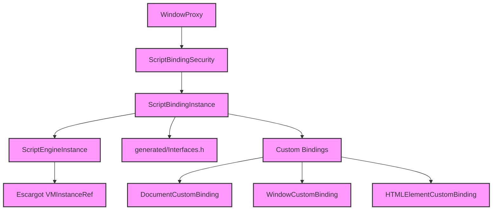

# Module Design Card — binding

> **Relevant source files**
> - [`ScriptEngineInstance.h`](src:src/binding/ScriptEngineInstance.h)
> - [`ScriptBindingInstance.h`](src:src/binding/ScriptBindingInstance.h)
> - [`ScriptBindingSecurity.h`](src:src/binding/ScriptBindingSecurity.h)
> - [`ScriptWrappable.h`](src:src/binding/ScriptWrappable.h)
> - [`WindowProxy.h`](src:src/binding/WindowProxy.h)
> - [`DocumentHoldable.h`](src:src/binding/DocumentHoldable.h)
> - [`WebViewHoldable.h`](src:src/binding/WebViewHoldable.h)
> - [`WindowHoldable.h`](src:src/binding/WindowHoldable.h)
> - [`StarfishHoldable.h`](src:src/binding/StarfishHoldable.h)
> - [`ObservableArray.h`](src:src/binding/ObservableArray.h)
> - [`Iterable.h`](src:src/binding/Iterable.h)
> - [`Maplike.h`](src:src/binding/Maplike.h)
> - [`WindowCustomBinding.cpp`](src:src/binding/WindowCustomBinding.cpp)
> - [`DocumentCustomBinding.cpp`](src:src/binding/DocumentCustomBinding.cpp)
> - [`HTMLElementCustomBinding.cpp`](src:src/binding/HTMLElementCustomBinding.cpp)
> - [`EventTargetCustomBinding.cpp`](src:src/binding/EventTargetCustomBinding.cpp)
> - [`XMLHttpRequestCustomBinding.cpp`](src:src/binding/XMLHttpRequestCustomBinding.cpp)
> - (22 additional binding files)

## Module Boundary

**Rationale:** JavaScript engine binding layer — Escargot integration, custom DOM bindings, script engine, security [`module-groups.yaml`](src:code2spec/.analysis/state/delta/module-groups.yaml)
**Confidence:** 0.93

## Source Files

38 files in `src/binding/` including script engine instance, binding security, custom bindings for DOM interfaces, holdable wrappers, and iterable/maplike support.

## Public Interface

| Component | Class | Source |
|---|---|---|
| Script Engine | `ScriptEngineInstance` | [`ScriptEngineInstance.h`](src:src/binding/ScriptEngineInstance.h#L33) |
| Script Binding | `ScriptBindingInstance` | [`ScriptBindingInstance.h`](src:src/binding/ScriptBindingInstance.h#L44) |
| Security | `ScriptBindingSecurity` | [`ScriptBindingSecurity.h`](src:src/binding/ScriptBindingSecurity.h) |
| Window Proxy | `WindowProxy` | [`WindowProxy.h`](src:src/binding/WindowProxy.h) |

## Key Flow

## Architectural Rules

- `ScriptEngineInstance` wraps `Escargot::VMInstanceRef*` [`ScriptEngineInstance.h`](src:src/binding/ScriptEngineInstance.h#L31)
- All binding objects are GC-managed (inherit `gc`) [`ScriptEngineInstance.h`](src:src/binding/ScriptEngineInstance.h#L33)
- Bindings generated from `.idl` files at cmake time [`ScriptBindingInstance.h`](src:src/binding/ScriptBindingInstance.h#L36)
- `STARFISH_ENUM_BINDING_NAMES` macro declares all binding functions [`ScriptBindingInstance.h`](src:src/binding/ScriptBindingInstance.h#L58)

## Dependencies

| Dependency | Type |
|---|---|
| Escargot (JS engine) | External (third_party) |
| core-engine (DOM) | Internal |
| generated/Interfaces.h | Generated |

## IPC / Message / Interface Contracts

- `ScriptEngineInstance` manages microtask queue draining and macro task counter. [`ScriptBindingInstance.h`](src:src/binding/ScriptBindingInstance.h#L43)
- `WindowProxy` enforces cross-origin security boundary per HTML spec. [`WindowProxy.h`](src:src/binding/WindowProxy.h)

## Quick Navigation

- [FR Document](../functional-requirements/binding-fr.md)
- [Architecture](../02-architecture.md)
