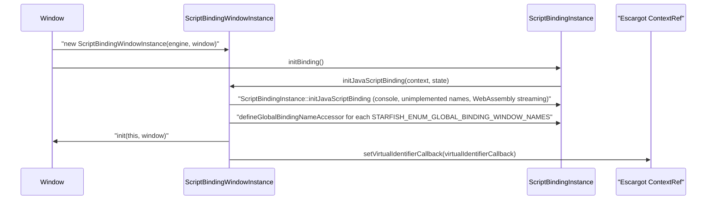
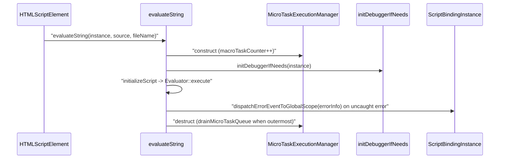
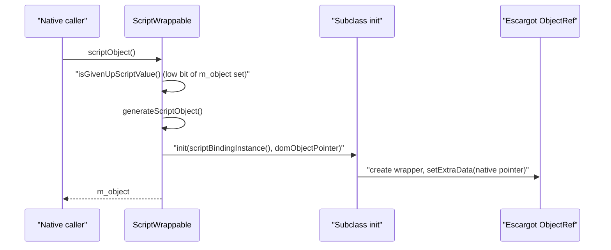

# Module Design Card: binding

> **Relevant source files**
>
> - [src/binding/CharacterDataCustomBinding.cpp](src:src/binding/CharacterDataCustomBinding.cpp)
> - [src/binding/DocumentCustomBinding.cpp](src:src/binding/DocumentCustomBinding.cpp)
> - [src/binding/DocumentHoldable.cpp](src:src/binding/DocumentHoldable.cpp)
> - [src/binding/DocumentHoldable.h](src:src/binding/DocumentHoldable.h)
> - [src/binding/EventTargetCustomBinding.cpp](src:src/binding/EventTargetCustomBinding.cpp)
> - [src/binding/GeolocationCustomBinding.cpp](src:src/binding/GeolocationCustomBinding.cpp)
> - [src/binding/HTMLElementCustomBinding.cpp](src:src/binding/HTMLElementCustomBinding.cpp)
> - [src/binding/HTMLInputElementCustomBinding.cpp](src:src/binding/HTMLInputElementCustomBinding.cpp)
> - [src/binding/ImageDataCustomBinding.cpp](src:src/binding/ImageDataCustomBinding.cpp)
> - [src/binding/Iterable.h](src:src/binding/Iterable.h)
> - [src/binding/IterationSource.h](src:src/binding/IterationSource.h)
> - [src/binding/Maplike.h](src:src/binding/Maplike.h)
> - [src/binding/MediaStreamCustomBinding.cpp](src:src/binding/MediaStreamCustomBinding.cpp)
> - [src/binding/ObservableArray.cpp](src:src/binding/ObservableArray.cpp)
> - [src/binding/ObservableArray.h](src:src/binding/ObservableArray.h)
> - [src/binding/ScriptBindingInstance.cpp](src:src/binding/ScriptBindingInstance.cpp)
> - [src/binding/ScriptBindingInstance.h](src:src/binding/ScriptBindingInstance.h)
> - [src/binding/ScriptBindingSecurity.cpp](src:src/binding/ScriptBindingSecurity.cpp)
> - [src/binding/ScriptBindingSecurity.h](src:src/binding/ScriptBindingSecurity.h)
> - [src/binding/ScriptBindingWindowInstance.cpp](src:src/binding/ScriptBindingWindowInstance.cpp)
> - [src/binding/ScriptBindingWindowInstance.h](src:src/binding/ScriptBindingWindowInstance.h)
> - [src/binding/ScriptBindingWorkerInstance.cpp](src:src/binding/ScriptBindingWorkerInstance.cpp)
> - [src/binding/ScriptBindingWorkerInstance.h](src:src/binding/ScriptBindingWorkerInstance.h)
> - [src/binding/ScriptEngineInstance.cpp](src:src/binding/ScriptEngineInstance.cpp)
> - [src/binding/ScriptEngineInstance.h](src:src/binding/ScriptEngineInstance.h)
> - [src/binding/ScriptWrappable.cpp](src:src/binding/ScriptWrappable.cpp)
> - [src/binding/ScriptWrappable.h](src:src/binding/ScriptWrappable.h)
> - [src/binding/StarfishHoldable.h](src:src/binding/StarfishHoldable.h)
> - [src/binding/URLSearchParamsCustomBinding.cpp](src:src/binding/URLSearchParamsCustomBinding.cpp)
> - [src/binding/WebViewHoldable.cpp](src:src/binding/WebViewHoldable.cpp)
> - [src/binding/WebViewHoldable.h](src:src/binding/WebViewHoldable.h)
> - [src/binding/WindowCustomBinding.cpp](src:src/binding/WindowCustomBinding.cpp)
> - [src/binding/WindowHoldable.cpp](src:src/binding/WindowHoldable.cpp)
> - [src/binding/WindowHoldable.h](src:src/binding/WindowHoldable.h)
> - [src/binding/WindowProxy.cpp](src:src/binding/WindowProxy.cpp)
> - [src/binding/WindowProxy.h](src:src/binding/WindowProxy.h)
> - [src/binding/WorkerGlobalScopeCustomBinding.cpp](src:src/binding/WorkerGlobalScopeCustomBinding.cpp)
> - [src/binding/XMLHttpRequestCustomBinding.cpp](src:src/binding/XMLHttpRequestCustomBinding.cpp)
> - [src/core/page/Window.cpp](src:src/core/page/Window.cpp)
> - [src/core/page/Window.h](src:src/core/page/Window.h)
> - [src/core/page/WebView.cpp](src:src/core/page/WebView.cpp)
> - [src/core/page/WebBase.h](src:src/core/page/WebBase.h)
> - [src/core/dom/ExecutionContext.h](src:src/core/dom/ExecutionContext.h)
> - [src/core/dom/EventTarget.h](src:src/core/dom/EventTarget.h)
> - [src/core/dom/HTMLScriptElement.cpp](src:src/core/dom/HTMLScriptElement.cpp)
> - [src/core/dom/CustomElementRegistry.cpp](src:src/core/dom/CustomElementRegistry.cpp)
> - [src/core/util/Messages.h](src:src/core/util/Messages.h)
> - [src/core/util/URLSearchParams.h](src:src/core/util/URLSearchParams.h)
> - [src/core/fetch/Headers.h](src:src/core/fetch/Headers.h)
> - [src/core/storage/Storage.h](src:src/core/storage/Storage.h)
> - [src/core/style/AdoptedStyleSheets.cpp](src:src/core/style/AdoptedStyleSheets.cpp)
> - [src/core/extra/Avplay.h](src:src/core/extra/Avplay.h)
> - [src/core/cdp/CDPDispatcher.cpp](src:src/core/cdp/CDPDispatcher.cpp)
> - [src/core/modules/location/Geolocation.h](src:src/core/modules/location/Geolocation.h)
> - [src/core/modules/mediastream/RTCStatsReport.h](src:src/core/modules/mediastream/RTCStatsReport.h)
> - [src/core/modules/resource_request/ResourceRequestJob.cpp](src:src/core/modules/resource_request/ResourceRequestJob.cpp)
> - [src/core/modules/worker/WebWorker.cpp](src:src/core/modules/worker/WebWorker.cpp)
> - [src/core/modules/worker/WorkerGlobalScope.cpp](src:src/core/modules/worker/WorkerGlobalScope.cpp)
> - [src/core/modules/worker/WorkerScriptController.cpp](src:src/core/modules/worker/WorkerScriptController.cpp)
> - [src/core/modules/worker/DedicatedWorkerGlobalScope.cpp](src:src/core/modules/worker/DedicatedWorkerGlobalScope.cpp)
> - [src/public/delegate/LWEDelegate.cpp](src:src/public/delegate/LWEDelegate.cpp)
> - [inc/LWEWebView.h](src:inc/LWEWebView.h)
> - [build/binding.cmake](src:build/binding.cmake)

**Module**: `binding` — 38 files under `src/binding/`
**Role**: Bridges the engine's native objects to the Escargot JavaScript engine: every script-exposed native object derives from [`ScriptWrappable`](src:src/binding/ScriptWrappable.h#L419), each global scope (window or worker) owns a [`ScriptBindingInstance`](src:src/binding/ScriptBindingInstance.h#L68) that wraps one Escargot context, and each `WebView`/worker owns a [`ScriptEngineInstance`](src:src/binding/ScriptEngineInstance.h#L33) that wraps one Escargot VM.
**Module Boundary**: JS engine custom binding directory (CustomBinding, Holdable naming)
**Confidence**: 0.9
**Core selection**: All approved modules are Core (boundary approved in W1 human review)
**Generated**: 2026-09-10

The hand-written files in this directory complement generated code: the per-interface `binding<Name>` functions, the `STARFISH_ENUM_BINDING_CLASSES` / `STARFISH_ENUM_BINDING_NAMES` lists and `binding/generated/Interfaces.h` are produced at build time from `.idl` files into `starfish_generated/binding/generated` ([`binding.cmake`](src:build/binding.cmake#L19), [`binding.cmake`](src:build/binding.cmake#L49)); they are not part of this module's checked-in sources.

## Source Files

Engine and context lifecycle
- [src/binding/ScriptEngineInstance.h](src:src/binding/ScriptEngineInstance.h), [src/binding/ScriptEngineInstance.cpp](src:src/binding/ScriptEngineInstance.cpp)
- [src/binding/ScriptBindingInstance.h](src:src/binding/ScriptBindingInstance.h), [src/binding/ScriptBindingInstance.cpp](src:src/binding/ScriptBindingInstance.cpp)
- [src/binding/ScriptBindingWindowInstance.h](src:src/binding/ScriptBindingWindowInstance.h), [src/binding/ScriptBindingWindowInstance.cpp](src:src/binding/ScriptBindingWindowInstance.cpp)
- [src/binding/ScriptBindingWorkerInstance.h](src:src/binding/ScriptBindingWorkerInstance.h), [src/binding/ScriptBindingWorkerInstance.cpp](src:src/binding/ScriptBindingWorkerInstance.cpp)

Wrapping, value conversion, script execution
- [src/binding/ScriptWrappable.h](src:src/binding/ScriptWrappable.h), [src/binding/ScriptWrappable.cpp](src:src/binding/ScriptWrappable.cpp)
- [src/binding/WindowProxy.h](src:src/binding/WindowProxy.h), [src/binding/WindowProxy.cpp](src:src/binding/WindowProxy.cpp)
- [src/binding/ScriptBindingSecurity.h](src:src/binding/ScriptBindingSecurity.h), [src/binding/ScriptBindingSecurity.cpp](src:src/binding/ScriptBindingSecurity.cpp)

Collection helpers
- [src/binding/Iterable.h](src:src/binding/Iterable.h), [src/binding/IterationSource.h](src:src/binding/IterationSource.h), [src/binding/Maplike.h](src:src/binding/Maplike.h)
- [src/binding/ObservableArray.h](src:src/binding/ObservableArray.h), [src/binding/ObservableArray.cpp](src:src/binding/ObservableArray.cpp)

Owner-access mixins
- [src/binding/StarfishHoldable.h](src:src/binding/StarfishHoldable.h)
- [src/binding/WebViewHoldable.h](src:src/binding/WebViewHoldable.h), [src/binding/WebViewHoldable.cpp](src:src/binding/WebViewHoldable.cpp)
- [src/binding/WindowHoldable.h](src:src/binding/WindowHoldable.h), [src/binding/WindowHoldable.cpp](src:src/binding/WindowHoldable.cpp)
- [src/binding/DocumentHoldable.h](src:src/binding/DocumentHoldable.h), [src/binding/DocumentHoldable.cpp](src:src/binding/DocumentHoldable.cpp)

Hand-written bindings
- [src/binding/WindowCustomBinding.cpp](src:src/binding/WindowCustomBinding.cpp)
- [src/binding/WorkerGlobalScopeCustomBinding.cpp](src:src/binding/WorkerGlobalScopeCustomBinding.cpp)
- [src/binding/EventTargetCustomBinding.cpp](src:src/binding/EventTargetCustomBinding.cpp)
- [src/binding/DocumentCustomBinding.cpp](src:src/binding/DocumentCustomBinding.cpp)
- [src/binding/CharacterDataCustomBinding.cpp](src:src/binding/CharacterDataCustomBinding.cpp)
- [src/binding/HTMLElementCustomBinding.cpp](src:src/binding/HTMLElementCustomBinding.cpp)
- [src/binding/HTMLInputElementCustomBinding.cpp](src:src/binding/HTMLInputElementCustomBinding.cpp)
- [src/binding/ImageDataCustomBinding.cpp](src:src/binding/ImageDataCustomBinding.cpp)
- [src/binding/MediaStreamCustomBinding.cpp](src:src/binding/MediaStreamCustomBinding.cpp)
- [src/binding/GeolocationCustomBinding.cpp](src:src/binding/GeolocationCustomBinding.cpp)
- [src/binding/URLSearchParamsCustomBinding.cpp](src:src/binding/URLSearchParamsCustomBinding.cpp)
- [src/binding/XMLHttpRequestCustomBinding.cpp](src:src/binding/XMLHttpRequestCustomBinding.cpp)

## Public Interface

| Function/Class | Signature | Main callers | Source |
|---|---|---|---|
| `ScriptWrappable` | `class ScriptWrappable : public gc` — `scriptObject()`, `scriptValue()`, pure virtual `init()`, `scriptBindingInstance()` | Every script-exposed class in core-dom, core-fetch, modules-*; e.g. [`Geolocation`](src:src/core/modules/location/Geolocation.h#L36), [`Headers`](src:src/core/fetch/Headers.h#L35) | [`ScriptWrappable`](src:src/binding/ScriptWrappable.h#L419) |
| `ScriptWrappable::scriptObject` | `ScriptObject scriptObject()` — lazily creates the wrapper on first use | 668 `scriptBindingInstance()`/`scriptValue()` call sites outside the module | [`ScriptWrappable::scriptObject`](src:src/binding/ScriptWrappable.h#L445) |
| `ScriptBindingInstance` | `class ScriptBindingInstance : public gc` — `initBinding()`, `scriptContext()`, `engineInstance()`, `fn<Name>()` accessors | [`ExecutionContext::scriptBindingInstance`](src:src/core/dom/ExecutionContext.h#L66), [`EventTarget::scriptBindingInstance`](src:src/core/dom/EventTarget.h#L144) | [`ScriptBindingInstance`](src:src/binding/ScriptBindingInstance.h#L68) |
| `ScriptBindingWindowInstance` | `ScriptBindingWindowInstance(ScriptEngineInstance*, Window*)` | [`Window.cpp`](src:src/core/page/Window.cpp#L122) | [`ScriptBindingWindowInstance`](src:src/binding/ScriptBindingWindowInstance.h#L26) |
| `ScriptBindingWorkerInstance` | `ScriptBindingWorkerInstance<T>(ScriptEngineInstance*, T* workerGlobalScope)` for `DedicatedWorkerGlobalScope`, `SharedWorkerGlobalScope`, `ServiceWorkerGlobalScope` | [`DedicatedWorkerGlobalScope.cpp`](src:src/core/modules/worker/DedicatedWorkerGlobalScope.cpp#L45) | [`ScriptBindingWorkerInstance`](src:src/binding/ScriptBindingWorkerInstance.h#L30) |
| `ScriptEngineInstance` | `ScriptEngineInstance(const char* locale, const char* timezone)`; `drainMicroTaskQueue()`, `enterIdleMode()`, `dispose()` | [`WebView::ensureScriptEngineInstance`](src:src/core/page/WebView.cpp#L746), [`WebWorker.cpp`](src:src/core/modules/worker/WebWorker.cpp#L92) | [`ScriptEngineInstance`](src:src/binding/ScriptEngineInstance.h#L33) |
| `MicroTaskExecutionManager` | RAII guard `MicroTaskExecutionManager(ScriptEngineInstance*)`; drains microtasks when the outermost guard exits | [`ResourceRequestJob.cpp`](src:src/core/modules/resource_request/ResourceRequestJob.cpp#L196) and 13 other sites | [`MicroTaskExecutionManager`](src:src/binding/ScriptEngineInstance.h#L62) |
| `staticallyInitScriptEngine` | `void staticallyInitScriptEngine()` / `staticallyDestroyScriptEngine()` | [`LWEDelegate.cpp`](src:src/public/delegate/LWEDelegate.cpp#L144) | [`staticallyInitScriptEngine`](src:src/binding/ScriptWrappable.h#L111) |
| `evaluateString` | `ScriptValue evaluateString(ScriptBindingInstance*, String* string, String* fileName = "", bool* result = nullptr)` | [`HTMLScriptElement.cpp`](src:src/core/dom/HTMLScriptElement.cpp#L282), [`WorkerScriptController.cpp`](src:src/core/modules/worker/WorkerScriptController.cpp#L136) | [`evaluateString`](src:src/binding/ScriptWrappable.h#L248) |
| `initModule` / `executeModule` | `Optional<ScriptModule> initModule(...)`, `bool executeModule(ScriptBindingInstance*, ScriptModule)` | core-dom script loading (3 / 4 sites) | [`initModule`](src:src/binding/ScriptWrappable.h#L251) |
| `callScriptFunction` | `ScriptValue callScriptFunction(ScriptBindingInstance*, ScriptValue fn, ScriptValue* argv, size_t argc, ScriptValue thisValue)` | MutationObserver, ResizeObserver, ReadableStream, BaseAudioContext, Avplay | [`callScriptFunction`](src:src/binding/ScriptWrappable.h#L223) |
| `createScriptFunction` | `ScriptValue createScriptFunction(ScriptBindingInstance*, String** argNames, size_t argc, String* functionBody, bool& error)` | Timer bindings in this module; attribute event handlers | [`createScriptFunction`](src:src/binding/ScriptWrappable.h#L213) |
| `toBrowserString` / `toJSString` | `String* toBrowserString(ScriptBindingInstance*, ValueRef*, bool* = nullptr)`; `ScriptString toJSString(String*)` | 13 / many sites across core | [`toBrowserString`](src:src/binding/ScriptWrappable.h#L174) |
| `createScriptValue` | overloads for `bool`, `int`, `double`, `String*`, `ScriptObject`, typed arrays | Generated bindings and core classes | [`createScriptValue`](src:src/binding/ScriptWrappable.h#L196) |
| `Promise` | `class Promise : public gc` — `fulfill()`, `reject()`, `then()`, `setOnSettled()` | 104 `Promise(` sites (RTCPeerConnection, PushManager, AudioContext, …) | [`Promise`](src:src/binding/ScriptWrappable.h#L544) |
| `enqueueMicrotask` | `void enqueueMicrotask(ScriptBindingInstance*, void (*fn)(void*), void* data)` | [`CustomElementRegistry.cpp`](src:src/core/dom/CustomElementRegistry.cpp#L698), Document, ServiceWorkerFetchJob | [`enqueueMicrotask`](src:src/binding/ScriptWrappable.h#L358) |
| `fetchExecutionContext` / `fetchScriptBindingInstance` | `ExecutionContext* fetchExecutionContext(Escargot::ContextRef*)` | Native functions receiving only an execution state | [`fetchExecutionContext`](src:src/binding/ScriptWrappable.h#L161) |
| `ScriptBindingSecurity::canAccess` | `static bool canAccess(Document* source, Document* target)` | [`Window.cpp`](src:src/core/page/Window.cpp#L275), `WindowProxy` | [`ScriptBindingSecurity::canAccess`](src:src/binding/ScriptBindingSecurity.h#L35) |
| `WindowProxy` | `class WindowProxy : public ScriptWrappable` — `updateSource(Window*)`, `window()` | [`Window.cpp`](src:src/core/page/Window.cpp#L131); `Window::parent()/top()/frames()` | [`WindowProxy`](src:src/binding/WindowProxy.h#L30) |
| `ObservableArray::create` | `static ScriptProxyObject create(ExecutionStateRef*, ScriptWrappable* host, const ObservableArrayCallbacks*)` | [`AdoptedStyleSheets.cpp`](src:src/core/style/AdoptedStyleSheets.cpp#L189) | [`ObservableArray::create`](src:src/binding/ObservableArray.h#L72) |
| `Iterable` / `Maplike` | `class Iterable<KeyType, ValueType>` with `startIteration()`; `Maplike` adds `get/set/has/deleteItem/clear` | [`Headers`](src:src/core/fetch/Headers.h#L35), [`URLSearchParams`](src:src/core/util/URLSearchParams.h#L52), [`RTCStatsReport`](src:src/core/modules/mediastream/RTCStatsReport.h#L32) | [`Iterable`](src:src/binding/Iterable.h#L28) |
| `DocumentHoldable` / `WindowHoldable` / `WebViewHoldable` / `StarfishHoldable` | Mixins exposing `document()`, `window()`, `webView()`, `starfish()` | 85 / 11 / 27 / 4 references, e.g. [`Storage`](src:src/core/storage/Storage.h#L34), [`Avplay`](src:src/core/extra/Avplay.h#L50) | [`DocumentHoldable`](src:src/binding/DocumentHoldable.h#L31) |

## IPC / Message / Interface Contracts

- **Remote script debugger (network listener, compile-time gated).** When `STARFISH_ENABLE_DEBUGGER` is defined, the first script evaluation in a window context whose scripting is enabled and that has no running debugger asks the embedder for consent, then starts the engine's remote debugger on a port that is reset to `6501` for the top-level browsing context and incremented after each successful start, retrying while the embedder answers "continue waiting". [`initDebuggerIfNeeds`](src:src/binding/ScriptWrappable.cpp#L1431), port constant at [`ScriptWrappable.cpp`](src:src/binding/ScriptWrappable.cpp#L1440). The start call passes the option string `--port=<port>;--accept-timeout=<ms>` (accept timeout `1000`) to the Escargot context ([`ScriptBindingWindowInstance::startDebugger`](src:src/binding/ScriptBindingWindowInstance.cpp#L330)); once running, a 100 ms interval timer pumps debugger events ([`ScriptBindingWindowInstance::pumpDebuggerEvents`](src:src/binding/ScriptBindingWindowInstance.cpp#L340), interval at [`ScriptWrappable.cpp`](src:src/binding/ScriptWrappable.cpp#L1462)). A comment in core-cdp describes this as "a separate remote TCP protocol (port 6501, STARFISH_ENABLE_DEBUGGER)" ([`CDPDispatcher.cpp`](src:src/core/cdp/CDPDispatcher.cpp#L840)); the wire format is owned by the Escargot library and is not specified in this repository's code. Console output is mirrored to the attached debugger with prefixes such as `console.log : ` ([`printToDebuggerInConsole`](src:src/binding/ScriptBindingInstance.cpp#L338)).
- **Embedder consent callbacks for the debugger (in-process, not IPC).** Before listening and on each failed accept, the module calls the public WebView handlers `DebuggerShouldInit` and `DebuggerShouldContinueWaiting` with the page URL and the port; the embedder registers them through [`RegisterDebuggerShouldInitHandler`](src:inc/LWEWebView.h#L950). [`StarfishPubicWebViewHandlerKind`](src:src/core/page/WebBase.h#L43), [`WebBase::callPublicWebViewHandler`](src:src/core/page/WebBase.h#L192)

The debugger listener is the only boundary in this module that crosses the process; everything else (script evaluation, promise settlement, microtask draining, custom element construction) is a synchronous in-process call between native code and the embedded JavaScript engine. Worker global scopes get their own `ScriptBindingWorkerInstance` on their own `ScriptEngineInstance`, but message passing between them belongs to the worker modules, not to this one.

## Key Flow

Entry: [`Window.cpp`](src:src/core/page/Window.cpp#L143) calls [`ScriptBindingInstance::initBinding`](src:src/binding/ScriptBindingInstance.cpp#L288), which dispatches to [`ScriptBindingWindowInstance::initJavaScriptBinding`](src:src/binding/ScriptBindingWindowInstance.cpp#L245).

Entry: [`evaluateString`](src:src/binding/ScriptWrappable.cpp#L1529), called from [`HTMLScriptElement.cpp`](src:src/core/dom/HTMLScriptElement.cpp#L282); errors are reported through [`ScriptBindingInstance::dispatchErrorEventToGlobalScope`](src:src/binding/ScriptBindingInstance.h#L86) and [`loggingJSErrorInfo`](src:src/binding/ScriptWrappable.cpp#L465).

Entry: [`ScriptWrappable::scriptObject`](src:src/binding/ScriptWrappable.h#L445) → [`ScriptWrappable::generateScriptObject`](src:src/binding/ScriptWrappable.cpp#L744).

## Architectural Rules

- [ ] A native object stores either its own pointer tagged with bit 1 (no wrapper yet) or the real Escargot object in `m_object`; wrappers are created lazily on the first `scriptObject()` call and the tag bit is asserted clear on construction. [`ScriptWrappable::ScriptWrappable`](src:src/binding/ScriptWrappable.cpp#L738), [`ScriptWrappable::giveUpScriptValue`](src:src/binding/ScriptWrappable.h#L453)
- [ ] Every script-exposed class implements `init`, `is<Name>` and `scriptBindingInstance` via [`DECLARE_SCRIPT_BINDING_REQUIRED_FUNCTIONS`](src:src/binding/ScriptWrappable.h#L365); the Escargot object's `extraData` always points back to the `ScriptWrappable`, which is how [`toScriptWrappable`](src:src/binding/ScriptWrappable.cpp#L772) and the [`CHECK_TYPEOF`](src:src/binding/ScriptWrappable.h#L386) family recover the native object.
- [ ] Any native code path that may run script wraps itself in a [`MicroTaskExecutionManager`](src:src/binding/ScriptEngineInstance.h#L62); [`enqueueMicrotask`](src:src/binding/ScriptWrappable.cpp#L2273) asserts `macroTaskCounter() != 0`, and the platform hook aborts in test builds when a job is enqueued with no active macro task ([`EscargotStarfishPlatform`](src:src/binding/ScriptWrappable.cpp#L52)).
- [ ] Uncaught script errors never propagate as C++ exceptions: `evaluateString`, `executeModule`, `callScriptFunction` and `createScriptFunction` convert the engine's error result into an `ErrorEventInit` dispatched to the owning global scope and log it. [`dispatchErrorEventToWindow`](src:src/binding/ScriptWrappable.cpp#L894), [`callScriptFunction`](src:src/binding/ScriptWrappable.cpp#L995)
- [ ] Hand-written native functions throw `TypeError` through [`THROW_EXCEPTION`](src:src/binding/ScriptWrappable.h#L375) using messages from [`Messages.h`](src:src/core/util/Messages.h#L59) (e.g. [`ILLEGAL_INVOKE`](src:src/core/util/Messages.h#L29)), and rethrow native `DOMException*` as script exceptions (e.g. [`sendXMLHttpRequestFunction`](src:src/binding/XMLHttpRequestCustomBinding.cpp#L30)).
- [ ] Interface constructors are exposed on the global object through lazily-resolved accessors: `binding<Name>(instance)` is invoked only on first access of `fn<Name>()` / `value<Name>()`. [`FOR_EACH_BINDING_DECLARATION`](src:src/binding/ScriptBindingInstance.h#L116), [`GlobalBindingNameAccessorPropertyData`](src:src/binding/ScriptBindingInstance.cpp#L240)
- [ ] Cross-document access to a `Window` or `Location` passes through [`ScriptBindingSecurity::canAccess`](src:src/binding/ScriptBindingSecurity.cpp#L35); a `WindowProxy` denies all but a fixed allow-list of properties (`window`, `closed`, `frames`, `length`, `location`, `opener`, `parent`, `self`, `top`, `postMessage`, `blur`, `close`, `focus`, `picker`, `pagePopupController`) with `SECURITY_ERR`. [`WindowProxy::init`](src:src/binding/WindowProxy.cpp#L53)
- [ ] Script evaluation is a no-op returning `undefined` when the owning context reports scripting disabled. [`evaluateString`](src:src/binding/ScriptWrappable.cpp#L1529), [`ScriptBindingWindowInstance::isScriptingEnabled`](src:src/binding/ScriptBindingWindowInstance.cpp#L314)

## Dependencies

### Internal modules

| Module | File(s) | Purpose | Source |
|---|---|---|---|
| core-page | `core/page/Window.h`, `WebView.h`, `WebBase.h`, `BrowsingContext.h`, `Location.h`, `GlobalScope.h` | Owner objects of binding instances; console, public WebView handlers, scripting-enabled flag | [`ScriptBindingWindowInstance.cpp`](src:src/binding/ScriptBindingWindowInstance.cpp#L21) |
| core-dom | `core/dom/Document.h`, `DOMException.h`, `ExecutionContext.h`, `EventTarget.h`, `ErrorEvent.h`, `WebOrigin.h`, `HTMLElement.h`, `CustomElementRegistry.h`, `MessageEvent.h`, … | Execution context lookup, error events, DOM types wrapped by custom bindings | [`ScriptWrappable.cpp`](src:src/binding/ScriptWrappable.cpp#L26) |
| modules-runtime | `core/modules/message_loop/MessageLoop.h`, `Timer.h`, `core/modules/renderer/Renderer.h` | Timers behind `setTimeout`/`setInterval`, idle scheduling | [`ScriptEngineInstance.cpp`](src:src/binding/ScriptEngineInstance.cpp#L24) |
| modules-workers | `core/modules/worker/WorkerGlobalScope.h`, `DedicatedWorkerGlobalScope.h`, `sharedworker/host/SharedWorkerGlobalScope.h`, `SharedWorkerProcessManager.h`, `WebWorker.h` | Worker global scopes bound by `ScriptBindingWorkerInstance` | [`ScriptBindingWorkerInstance.cpp`](src:src/binding/ScriptBindingWorkerInstance.cpp#L25) |
| modules-serviceworker | `core/modules/serviceworker/host/ServiceWorkerGlobalScope.h` | Service worker global scope binding | [`ScriptBindingWorkerInstance.cpp`](src:src/binding/ScriptBindingWorkerInstance.cpp#L27) |
| core-fetch | `core/fetch/Response.h`, `ResponseData.h` | `WebAssembly.compileStreaming` / `instantiateStreaming` source (under `STARFISH_ENABLE_WASM`) | [`ScriptBindingInstance.cpp`](src:src/binding/ScriptBindingInstance.cpp#L35) |
| core-extras | `core/extra/Console.h`, `Avplay.h`, `core/xml/XMLHttpRequest.h` | Console sink, TV `webapis.avplay` object, XHR send binding | [`ScriptBindingInstance.cpp`](src:src/binding/ScriptBindingInstance.cpp#L25) |
| core-util | `core/util/URLSearchParams.h`, `Messages.h` | URLSearchParams constructor binding; exception message text | [`URLSearchParamsCustomBinding.cpp`](src:src/binding/URLSearchParamsCustomBinding.cpp#L28) |
| modules-web-apis | `core/modules/location/Geolocation.h`, `Geoposition.h`, `PositionError.h`, `core/modules/resource_request/ResourceRequest.h` | Geolocation callbacks; XHR binary request body | [`GeolocationCustomBinding.cpp`](src:src/binding/GeolocationCustomBinding.cpp#L56) |
| modules-mediastream | `core/modules/mediastream/MediaStream.h` | MediaStream constructor overloads | [`mediastreamConstructor`](src:src/binding/MediaStreamCustomBinding.cpp#L30) |
| core-dom-canvas | `core/dom/canvas/ImageData.h` | ImageData constructor binding | [`imagedataConstructor`](src:src/binding/ImageDataCustomBinding.cpp#L29) |
| core-storage-fileapi | `core/fileapi/File.h` | `HTMLInputElement.files` array | [`filesHTMLInputElementGetterFunction`](src:src/binding/HTMLInputElementCustomBinding.cpp#L33) |
| core-layout | `core/layout/Frame.h`, `FrameBox.h` | Test-only geometry helpers on `window` | [`Window::postInit`](src:src/binding/WindowCustomBinding.cpp#L1285) |
| engine-entry | `Starfish.h`, `StarfishConfig.h`, `StarfishBase.h` | Root object, build configuration, assertion macros | [`ScriptWrappable.h`](src:src/binding/ScriptWrappable.h#L24) |

### External libraries

| Library | Version | Purpose | Source |
|---|---|---|---|
| Escargot (`<EscargotPublic.h>`) | Not specified in code | JavaScript engine: VM, contexts, values, promises, proxies, module loading, remote debugger | [`ScriptWrappable.cpp`](src:src/binding/ScriptWrappable.cpp#L46) |
| GC (`<GCUtil.h>`, `gc` base, `GC_MALLOC`) | Not specified in code | Garbage-collected allocation of wrappers and binding instances | [`ScriptWrappable.h`](src:src/binding/ScriptWrappable.h#L25) |
| libpng (`<png.h>`) | Not specified in code | Test-only pixel checks on `window` (`STARFISH_ENABLE_TEST`) | [`WindowCustomBinding.cpp`](src:src/binding/WindowCustomBinding.cpp#L43) |
| Tizen `app_common.h` | Not specified in code | Code-cache directory for the VM on Tizen (`STARFISH_TIZEN`) | [`ScriptEngineInstance.cpp`](src:src/binding/ScriptEngineInstance.cpp#L27) |
| Tizen Device API loader (`TizenDeviceAPILoaderForEscargot.h`) | Not specified in code | Device API extension manager per context (`TIZEN_DEVICE_API`) | [`ScriptBindingInstance.cpp`](src:src/binding/ScriptBindingInstance.cpp#L46) |

## Quick Navigation

| To change… | Location |
|---|---|
| VM creation options (code cache limits, string compression flag) | [`ScriptEngineInstance::ScriptEngineInstance`](src:src/binding/ScriptEngineInstance.cpp#L33) |
| Global objects installed in every context (`console`, unimplemented interface names, WebAssembly streaming) | [`ScriptBindingInstance::initJavaScriptBinding`](src:src/binding/ScriptBindingInstance.cpp#L525) |
| Window-specific globals, `webapis.avplay`, virtual identifier lookup (`self`, indexed/named frames) | [`ScriptBindingWindowInstance::initJavaScriptBinding`](src:src/binding/ScriptBindingWindowInstance.cpp#L245), [`virtualIdentifierCallback`](src:src/binding/ScriptBindingWindowInstance.cpp#L39) |
| Worker-specific globals | [`ScriptBindingWorkerInstance::initJavaScriptBinding`](src:src/binding/ScriptBindingWorkerInstance.cpp#L144) |
| Debugger port, accept timeout, event pump interval | [`initDebuggerIfNeeds`](src:src/binding/ScriptWrappable.cpp#L1431), [`ScriptBindingWindowInstance::startDebugger`](src:src/binding/ScriptBindingWindowInstance.cpp#L330) |
| Script parse/execute path and uncaught-error reporting | [`evaluateString`](src:src/binding/ScriptWrappable.cpp#L1529), [`initializeScript`](src:src/binding/ScriptWrappable.cpp#L1492), [`loggingJSErrorInfo`](src:src/binding/ScriptWrappable.cpp#L465) |
| Module resolution (import maps, base URL, loaded-module list) | [`EscargotStarfishPlatform::loadModule`](src:src/binding/ScriptWrappable.cpp#L92) |
| Microtask draining policy | [`ScriptEngineInstance::drainMicroTaskQueue`](src:src/binding/ScriptEngineInstance.cpp#L76), [`MicroTaskExecutionManager::~MicroTaskExecutionManager`](src:src/binding/ScriptEngineInstance.cpp#L98) |
| Cross-origin property allow-list on `WindowProxy` | [`WindowProxy::init`](src:src/binding/WindowProxy.cpp#L53) |
| Same-origin decision | [`ScriptBindingSecurity::canAccess`](src:src/binding/ScriptBindingSecurity.cpp#L35) |
| `setTimeout` / `setInterval` / `postMessage` / `requestAnimationFrame` on `window` | [`setTimeoutWindowFunction`](src:src/binding/WindowCustomBinding.cpp#L111), [`postMessageWindowFunction`](src:src/binding/WindowCustomBinding.cpp#L228), [`requestAnimationFrameWindowFunction`](src:src/binding/WindowCustomBinding.cpp#L294) |
| Test-only `window.*` helpers (`screenShot`, `simulateClick`, `testEnd`, …) | [`Window::postInit`](src:src/binding/WindowCustomBinding.cpp#L1285) |
| Custom element `super()` construction rules | [`htmlelementConstructor`](src:src/binding/HTMLElementCustomBinding.cpp#L32) |
| Observable array proxy traps | [`setTrap`](src:src/binding/ObservableArray.cpp#L70), [`definePropertyTrap`](src:src/binding/ObservableArray.cpp#L102), [`deletePropertyTrap`](src:src/binding/ObservableArray.cpp#L142) |

## FR Linkage

- [FR-BINDING-001](../functional-requirements/binding-fr.md#fr-binding-001): Initialize the JavaScript engine and per-owner VM instances
- [FR-BINDING-002](../functional-requirements/binding-fr.md#fr-binding-002): Initialize a script context for a window or worker global scope
- [FR-BINDING-003](../functional-requirements/binding-fr.md#fr-binding-003): Expose native objects to script through lazily created wrappers
- [FR-BINDING-004](../functional-requirements/binding-fr.md#fr-binding-004): Evaluate classic scripts and modules and report uncaught errors
- [FR-BINDING-005](../functional-requirements/binding-fr.md#fr-binding-005): Create and invoke script functions from native code
- [FR-BINDING-006](../functional-requirements/binding-fr.md#fr-binding-006): Schedule microtasks and settle promises from native code
- [FR-BINDING-007](../functional-requirements/binding-fr.md#fr-binding-007): Attach the remote script debugger on demand
- [FR-BINDING-008](../functional-requirements/binding-fr.md#fr-binding-008): Enforce same-origin access to Window and Location
- [FR-BINDING-009](../functional-requirements/binding-fr.md#fr-binding-009): Provide timer, messaging and animation-frame bindings for global scopes
- [FR-BINDING-010](../functional-requirements/binding-fr.md#fr-binding-010): Provide hand-written constructors and accessors for selected interfaces
- [FR-BINDING-011](../functional-requirements/binding-fr.md#fr-binding-011): Provide observable-array, iterable and maplike helpers
- [FR-BINDING-012](../functional-requirements/binding-fr.md#fr-binding-012): Give native objects access to their owning document, window, view and engine
