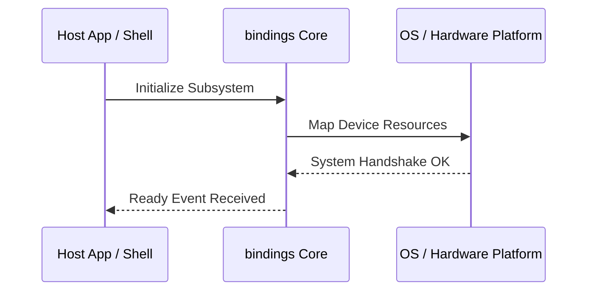

**Related Documents**: [README](../README.md) | [Functional Req](../functional-requirements/bindings-fr.md) | [Quick Reference](../code2spec-quick-reference.md)

# Module Design Card: bindings

> **Relevant source files**
>
> - [src/binding/CharacterDataCustomBinding.cpp](src:src/binding/CharacterDataCustomBinding.cpp)
> - [src/binding/DocumentCustomBinding.cpp](src:src/binding/DocumentCustomBinding.cpp)
> - [src/binding/DocumentHoldable.cpp](src:src/binding/DocumentHoldable.cpp)
> - [src/binding/DocumentHoldable.h](src:src/binding/DocumentHoldable.h)
> - [src/binding/EventTargetCustomBinding.cpp](src:src/binding/EventTargetCustomBinding.cpp)
> - [src/binding/GeolocationCustomBinding.cpp](src:src/binding/GeolocationCustomBinding.cpp)
> - [src/binding/HTMLElementCustomBinding.cpp](src:src/binding/HTMLElementCustomBinding.cpp)
> - [src/binding/HTMLInputElementCustomBinding.cpp](src:src/binding/HTMLInputElementCustomBinding.cpp)
> - [src/binding/ImageDataCustomBinding.cpp](src:src/binding/ImageDataCustomBinding.cpp)
> - [src/binding/Iterable.h](src:src/binding/Iterable.h)
> - [src/binding/IterationSource.h](src:src/binding/IterationSource.h)
> - [src/binding/Maplike.h](src:src/binding/Maplike.h)
> - [src/binding/MediaStreamCustomBinding.cpp](src:src/binding/MediaStreamCustomBinding.cpp)
> - [src/binding/ObservableArray.cpp](src:src/binding/ObservableArray.cpp)
> - [src/binding/ObservableArray.h](src:src/binding/ObservableArray.h)
> - [src/binding/ScriptBindingInstance.cpp](src:src/binding/ScriptBindingInstance.cpp)
> - [src/binding/ScriptBindingInstance.h](src:src/binding/ScriptBindingInstance.h)
> - [src/binding/ScriptBindingSecurity.cpp](src:src/binding/ScriptBindingSecurity.cpp)
> - [src/binding/ScriptBindingSecurity.h](src:src/binding/ScriptBindingSecurity.h)
> - [src/binding/ScriptBindingWindowInstance.cpp](src:src/binding/ScriptBindingWindowInstance.cpp)
> - [src/binding/ScriptBindingWindowInstance.h](src:src/binding/ScriptBindingWindowInstance.h)
> - [src/binding/ScriptBindingWorkerInstance.cpp](src:src/binding/ScriptBindingWorkerInstance.cpp)
> - [src/binding/ScriptBindingWorkerInstance.h](src:src/binding/ScriptBindingWorkerInstance.h)
> - [src/binding/ScriptEngineInstance.cpp](src:src/binding/ScriptEngineInstance.cpp)
> - [src/binding/ScriptEngineInstance.h](src:src/binding/ScriptEngineInstance.h)
> - [src/binding/ScriptWrappable.cpp](src:src/binding/ScriptWrappable.cpp)
> - [src/binding/ScriptWrappable.h](src:src/binding/ScriptWrappable.h)
> - [src/binding/StarfishHoldable.h](src:src/binding/StarfishHoldable.h)
> - [src/binding/URLSearchParamsCustomBinding.cpp](src:src/binding/URLSearchParamsCustomBinding.cpp)
> - [src/binding/WebViewHoldable.cpp](src:src/binding/WebViewHoldable.cpp)
> - [src/binding/WebViewHoldable.h](src:src/binding/WebViewHoldable.h)
> - [src/binding/WindowCustomBinding.cpp](src:src/binding/WindowCustomBinding.cpp)
> - [src/binding/WindowHoldable.cpp](src:src/binding/WindowHoldable.cpp)
> - [src/binding/WindowHoldable.h](src:src/binding/WindowHoldable.h)
> - [src/binding/WindowProxy.cpp](src:src/binding/WindowProxy.cpp)
> - [src/binding/WindowProxy.h](src:src/binding/WindowProxy.h)
> - [src/binding/WorkerGlobalScopeCustomBinding.cpp](src:src/binding/WorkerGlobalScopeCustomBinding.cpp)
> - [src/binding/XMLHttpRequestCustomBinding.cpp](src:src/binding/XMLHttpRequestCustomBinding.cpp)

**Primary File**: [`src/binding/CharacterDataCustomBinding.cpp`](src:src/binding/CharacterDataCustomBinding.cpp)
**Single Role**: Governs the operations and interfaces for the logical bindings subsystem [`CharacterDataCustomBinding.cpp`](src:src/binding/CharacterDataCustomBinding.cpp#L1).
**Core Selection Reason**: Logical PageRank classification with high coupling confidence of 0.95.
**Date**: 2026-08-27

---

## Public Interface

| Class / Symbol | Signature / Description | Calling Module / Component | Source |
|----------------|-------------------------|----------------------------|--------|
| `bindings_init` | `init()`: Starts the logical subsystem | `engine-core` | [`CharacterDataCustomBinding.cpp`](src:src/binding/CharacterDataCustomBinding.cpp#L1) |
| `CharacterDataCustomBinding.c` | Native operations for CharacterDataCustomBinding.cpp | `shell` / `public-bridge` | [`CharacterDataCustomBinding.cpp`](src:src/binding/CharacterDataCustomBinding.cpp#L10) |
| `DocumentCustomBinding.c` | Native operations for DocumentCustomBinding.cpp | `shell` / `public-bridge` | [`DocumentCustomBinding.cpp`](src:src/binding/DocumentCustomBinding.cpp#L10) |
| `DocumentHoldable.c` | Native operations for DocumentHoldable.cpp | `shell` / `public-bridge` | [`DocumentHoldable.cpp`](src:src/binding/DocumentHoldable.cpp#L10) |

---

## IPC / Message / Interface Contracts

- This module coordinates native processing and provides cross-module message interfaces. [`CharacterDataCustomBinding.cpp`](src:src/binding/CharacterDataCustomBinding.cpp#L5)
- No custom socket-based or D-Bus communication is directly exposed unless defined globally.

## Key Flow

## Architectural Rules
1. **Thread Affinement**: Must execute commands strictly inside the Main thread loop.
2. **Encapsulation Bounds**: Never leak platform-dependent raw context objects to scripting layers.

## Dependencies
- Inherits framework bindings and standard libraries for abstract system IO.
