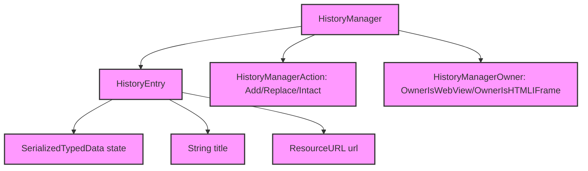

# Module Design Card — browser-history

> **Relevant source files**
> - [`HistoryManager.h`](src:src/browser/history/HistoryManager.h)
> - [`HistoryManager.cpp`](src:src/browser/history/HistoryManager.cpp)

## Module Boundary

**Rationale:** Browser history management [`module-groups.yaml`](src:code2spec/.analysis/state/delta/module-groups.yaml)
**Confidence:** 0.90

## Source Files

2 files in `src/browser/history/` providing navigation history management.

## Public Interface

| Component | Class | Source |
|---|---|---|
| History Manager | `HistoryManager` | [`HistoryManager.h`](src:src/browser/history/HistoryManager.h#L35) |
| History Entry | `HistoryManager::HistoryEntry` | [`HistoryManager.h`](src:src/browser/history/HistoryManager.h#L40) |

## Key Flow

## Architectural Rules

- `HistoryManager` inherits `gc` [`HistoryManager.h`](src:src/browser/history/HistoryManager.h#L35)
- `MAX_ENTRY_SIZE` = 256 [`HistoryManager.h`](src:src/browser/history/HistoryManager.h#L39)
- `HistoryManagerAction`: Add, Replace, Intact [`HistoryManager.h`](src:src/browser/history/HistoryManager.h#L33)
- `HistoryManagerOwner`: OwnerIsWebView, OwnerIsHTMLIFrame [`HistoryManager.h`](src:src/browser/history/HistoryManager.h#L119)
- `HistoryEntry` contains: state (SerializedTypedData), title (String), url (ResourceURL) [`HistoryManager.h`](src:src/browser/history/HistoryManager.h#L40)
- Friend of `HTMLFormElement` [`HistoryManager.h`](src:src/browser/history/HistoryManager.h#L36)

## Dependencies

| Dependency | Type |
|---|---|
| core-engine (String, ResourceURL, WebView) | Internal |
| binding (ScriptWrappable) | Internal |

## IPC / Message / Interface Contracts

- No cross-module IPC. History management is in-process.

## Quick Navigation

- [FR Document](../functional-requirements/browser-history-fr.md)
- [Architecture](../02-architecture.md)
