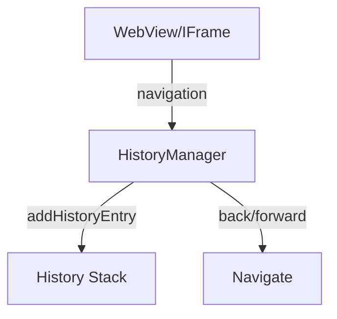

# Module Design Card: browser-history

> **Relevant source files**
> - [`HistoryManager.h`](src/browser/history/HistoryManager.h#L1)
> - [`HistoryManager.cpp`](src/browser/history/HistoryManager.cpp#L1)

## Module Boundary
Browser session history management for navigation.

**Confidence**: 0.95

## Source Files
2 files in `src/browser/history/`

## Public Interface
- `HistoryManager` — Session history with HistoryManagerOwner enum (OwnerIsWebView, OwnerIsHTMLIFrame). [`HistoryManager.h:119`](src/browser/history/HistoryManager.h#L119)
- Operations: addHistoryEntry, checkHistoryEntry, pushReplaceStateInternal.

## Key Flow

## Architectural Rules
- HistoryManagerOwner: OwnerIsWebView or OwnerIsHTMLIFrame. [`HistoryManager.h:119`](src/browser/history/HistoryManager.h#L119)

## Dependencies
- Depends on: engine-core

## IPC / Message / Interface Contracts
- This module does not have cross-module IPC.

## Quick Navigation
- [FR Document](../functional-requirements/browser-history-fr.md)
- [Architecture](../02-architecture.md)
