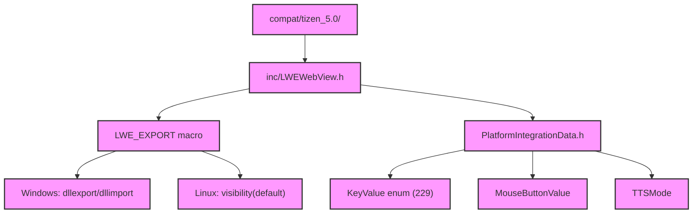

# Module Design Card — compat-headers

> **Relevant source files**
> - [`inc/LWEWebView.h`](src:inc/LWEWebView.h)
> - [`inc/LWEWorker.h`](src:inc/LWEWorker.h)
> - [`inc/PlatformIntegrationData.h`](src:inc/PlatformIntegrationData.h)
> - [`compat/tizen_5.0/inc/LWEWebView.h`](src:compat/tizen_5.0/inc/LWEWebView.h)

## Module Boundary

**Rationale:** Compatibility and public header files for embedders [`module-groups.yaml`](src:code2spec/.analysis/state/delta/module-groups.yaml)
**Confidence:** 0.90

## Source Files

4 files: `inc/LWEWebView.h`, `inc/LWEWorker.h`, `inc/PlatformIntegrationData.h`, and `compat/tizen_5.0/inc/LWEWebView.h`.

## Public Interface

| Component | Source |
|---|---|
| LWEWebView (public) | [`inc/LWEWebView.h`](src:inc/LWEWebView.h) |
| LWEWorker (public) | [`inc/LWEWorker.h`](src:inc/LWEWorker.h) |
| PlatformIntegrationData | [`inc/PlatformIntegrationData.h`](src:inc/PlatformIntegrationData.h) |
| Tizen 5.0 compat | [`compat/tizen_5.0/inc/LWEWebView.h`](src:compat/tizen_5.0/inc/LWEWebView.h) |

## Key Flow

## Architectural Rules

- `LWE_EXPORT` macro: `dllexport`/`dllimport` on MSVC, `visibility("default")` on GCC [`LWEWebView.h`](src:inc/LWEWebView.h#L29)
- `STARFISH_EXPORTS` defined only when building the DLL [`LWEWebView.h`](src:inc/LWEWebView.h#L29)
- `LWEDelegateRef = std::unique_ptr<void, std::function<void(void*)>>` [`LWEWebView.h`](src:inc/LWEWebView.h#L49)
- Font size constants: `LWE_DEFAULT_FONT_SIZE=16`, `LWE_MIN_FONT_SIZE=1`, `LWE_MAX_FONT_SIZE=72` [`LWEWebView.h`](src:compat/tizen_5.0/inc/LWEWebView.h#L180)
- KeyValue enum: 229 key values [`PlatformIntegrationData.h`](src:inc/PlatformIntegrationData.h#L7)
- MouseButtonValue: NoButton, LeftButton, MiddleButton, RightButton [`PlatformIntegrationData.h`](src:inc/PlatformIntegrationData.h#L239)
- TTSMode: Default, Forced [`PlatformIntegrationData.h`](src:inc/PlatformIntegrationData.h#L253)

## Dependencies

| Dependency | Type |
|---|---|
| C++ standard library | External |

## IPC / Message / Interface Contracts

- Headers define the embedding API surface. No runtime IPC.

## Quick Navigation

- [FR Document](../functional-requirements/compat-headers-fr.md)
- [Architecture](../02-architecture.md)
