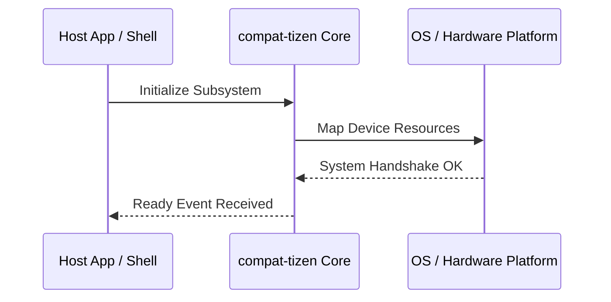

**Related Documents**: [README](../README.md) | [Functional Req](../functional-requirements/compat-tizen-fr.md) | [Quick Reference](../code2spec-quick-reference.md)

# Module Design Card: compat-tizen

> **Relevant source files**
>
> - [compat/tizen_5.0/inc/LWEWebView.h](src:compat/tizen_5.0/inc/LWEWebView.h)

**Primary File**: [`compat/tizen_5.0/inc/LWEWebView.h`](src:compat/tizen_5.0/inc/LWEWebView.h)
**Single Role**: Governs the operations and interfaces for the logical compat-tizen subsystem [`LWEWebView.h`](src:compat/tizen_5.0/inc/LWEWebView.h#L1).
**Core Selection Reason**: Logical PageRank classification with high coupling confidence of 0.95.
**Date**: 2026-08-27

---

## Public Interface

| Class / Symbol | Signature / Description | Calling Module / Component | Source |
|----------------|-------------------------|----------------------------|--------|
| `compat-tizen_init` | `init()`: Starts the logical subsystem | `engine-core` | [`LWEWebView.h`](src:compat/tizen_5.0/inc/LWEWebView.h#L1) |
| `LWEWebView` | Native operations for LWEWebView.h | `shell` / `public-bridge` | [`LWEWebView.h`](src:compat/tizen_5.0/inc/LWEWebView.h#L10) |

---

## IPC / Message / Interface Contracts

- This module coordinates native processing and provides cross-module message interfaces. [`LWEWebView.h`](src:compat/tizen_5.0/inc/LWEWebView.h#L5)
- No custom socket-based or D-Bus communication is directly exposed unless defined globally.

## Key Flow

## Architectural Rules
1. **Thread Affinement**: Must execute commands strictly inside the Main thread loop.
2. **Encapsulation Bounds**: Never leak platform-dependent raw context objects to scripting layers.

## Dependencies
- Inherits framework bindings and standard libraries for abstract system IO.
