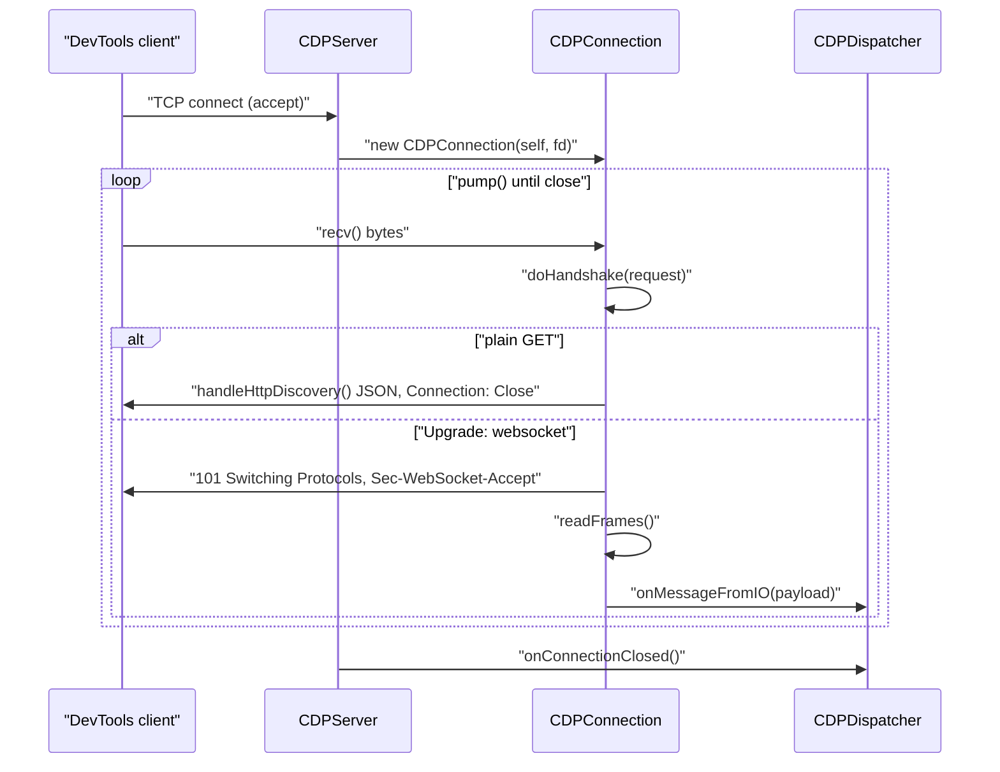
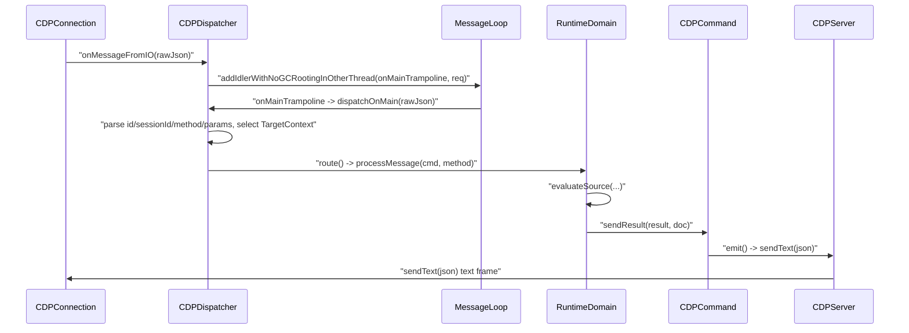
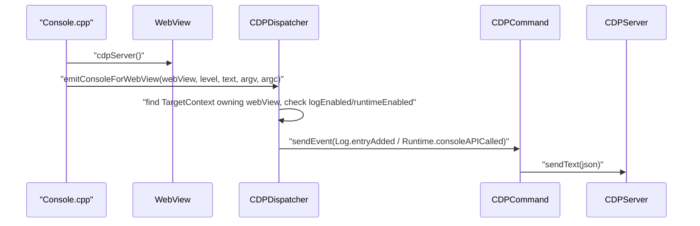
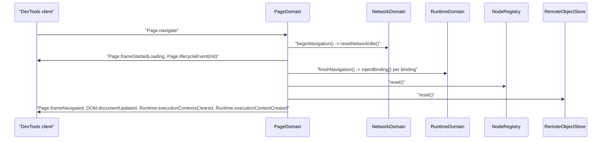

# Module Design Card: core-cdp

> **Relevant source files**
>
> - [src/core/cdp/Base64.cpp](src:src/core/cdp/Base64.cpp)
> - [src/core/cdp/Base64.h](src:src/core/cdp/Base64.h)
> - [src/core/cdp/CDPCommand.cpp](src:src/core/cdp/CDPCommand.cpp)
> - [src/core/cdp/CDPCommand.h](src:src/core/cdp/CDPCommand.h)
> - [src/core/cdp/CDPConnection.cpp](src:src/core/cdp/CDPConnection.cpp)
> - [src/core/cdp/CDPConnection.h](src:src/core/cdp/CDPConnection.h)
> - [src/core/cdp/CDPDispatcher.cpp](src:src/core/cdp/CDPDispatcher.cpp)
> - [src/core/cdp/CDPDispatcher.h](src:src/core/cdp/CDPDispatcher.h)
> - [src/core/cdp/CDPServer.cpp](src:src/core/cdp/CDPServer.cpp)
> - [src/core/cdp/CDPServer.h](src:src/core/cdp/CDPServer.h)
> - [src/core/cdp/CDPSession.h](src:src/core/cdp/CDPSession.h)
> - [src/core/cdp/NodeRegistry.cpp](src:src/core/cdp/NodeRegistry.cpp)
> - [src/core/cdp/NodeRegistry.h](src:src/core/cdp/NodeRegistry.h)
> - [src/core/cdp/RemoteObject.cpp](src:src/core/cdp/RemoteObject.cpp)
> - [src/core/cdp/RemoteObject.h](src:src/core/cdp/RemoteObject.h)
> - [src/core/cdp/Sha1.cpp](src:src/core/cdp/Sha1.cpp)
> - [src/core/cdp/Sha1.h](src:src/core/cdp/Sha1.h)
> - [src/core/cdp/TargetContext.h](src:src/core/cdp/TargetContext.h)
> - [src/core/cdp/domains/AccessibilityDomain.cpp](src:src/core/cdp/domains/AccessibilityDomain.cpp)
> - [src/core/cdp/domains/AccessibilityDomain.h](src:src/core/cdp/domains/AccessibilityDomain.h)
> - [src/core/cdp/domains/AnimationDomain.cpp](src:src/core/cdp/domains/AnimationDomain.cpp)
> - [src/core/cdp/domains/AnimationDomain.h](src:src/core/cdp/domains/AnimationDomain.h)
> - [src/core/cdp/domains/CSSDomain.cpp](src:src/core/cdp/domains/CSSDomain.cpp)
> - [src/core/cdp/domains/CSSDomain.h](src:src/core/cdp/domains/CSSDomain.h)
> - [src/core/cdp/domains/DOMDebuggerDomain.cpp](src:src/core/cdp/domains/DOMDebuggerDomain.cpp)
> - [src/core/cdp/domains/DOMDebuggerDomain.h](src:src/core/cdp/domains/DOMDebuggerDomain.h)
> - [src/core/cdp/domains/DOMDomain.cpp](src:src/core/cdp/domains/DOMDomain.cpp)
> - [src/core/cdp/domains/DOMDomain.h](src:src/core/cdp/domains/DOMDomain.h)
> - [src/core/cdp/domains/DOMSnapshotDomain.cpp](src:src/core/cdp/domains/DOMSnapshotDomain.cpp)
> - [src/core/cdp/domains/DOMSnapshotDomain.h](src:src/core/cdp/domains/DOMSnapshotDomain.h)
> - [src/core/cdp/domains/DOMStorageDomain.cpp](src:src/core/cdp/domains/DOMStorageDomain.cpp)
> - [src/core/cdp/domains/DOMStorageDomain.h](src:src/core/cdp/domains/DOMStorageDomain.h)
> - [src/core/cdp/domains/EmulationDomain.cpp](src:src/core/cdp/domains/EmulationDomain.cpp)
> - [src/core/cdp/domains/EmulationDomain.h](src:src/core/cdp/domains/EmulationDomain.h)
> - [src/core/cdp/domains/FetchDomain.cpp](src:src/core/cdp/domains/FetchDomain.cpp)
> - [src/core/cdp/domains/FetchDomain.h](src:src/core/cdp/domains/FetchDomain.h)
> - [src/core/cdp/domains/InputDomain.cpp](src:src/core/cdp/domains/InputDomain.cpp)
> - [src/core/cdp/domains/InputDomain.h](src:src/core/cdp/domains/InputDomain.h)
> - [src/core/cdp/domains/LogDomain.cpp](src:src/core/cdp/domains/LogDomain.cpp)
> - [src/core/cdp/domains/LogDomain.h](src:src/core/cdp/domains/LogDomain.h)
> - [src/core/cdp/domains/MemoryDomain.cpp](src:src/core/cdp/domains/MemoryDomain.cpp)
> - [src/core/cdp/domains/MemoryDomain.h](src:src/core/cdp/domains/MemoryDomain.h)
> - [src/core/cdp/domains/NetworkDomain.cpp](src:src/core/cdp/domains/NetworkDomain.cpp)
> - [src/core/cdp/domains/NetworkDomain.h](src:src/core/cdp/domains/NetworkDomain.h)
> - [src/core/cdp/domains/OverlayDomain.cpp](src:src/core/cdp/domains/OverlayDomain.cpp)
> - [src/core/cdp/domains/OverlayDomain.h](src:src/core/cdp/domains/OverlayDomain.h)
> - [src/core/cdp/domains/PageDomain.cpp](src:src/core/cdp/domains/PageDomain.cpp)
> - [src/core/cdp/domains/PageDomain.h](src:src/core/cdp/domains/PageDomain.h)
> - [src/core/cdp/domains/PerformanceDomain.cpp](src:src/core/cdp/domains/PerformanceDomain.cpp)
> - [src/core/cdp/domains/PerformanceDomain.h](src:src/core/cdp/domains/PerformanceDomain.h)
> - [src/core/cdp/domains/RuntimeDomain.cpp](src:src/core/cdp/domains/RuntimeDomain.cpp)
> - [src/core/cdp/domains/RuntimeDomain.h](src:src/core/cdp/domains/RuntimeDomain.h)
> - [src/core/cdp/domains/StorageDomain.cpp](src:src/core/cdp/domains/StorageDomain.cpp)
> - [src/core/cdp/domains/StorageDomain.h](src:src/core/cdp/domains/StorageDomain.h)
> - [src/core/cdp/domains/TargetDomain.cpp](src:src/core/cdp/domains/TargetDomain.cpp)
> - [src/core/cdp/domains/TargetDomain.h](src:src/core/cdp/domains/TargetDomain.h)
> - [src/core/cdp/domains/TracingDomain.cpp](src:src/core/cdp/domains/TracingDomain.cpp)
> - [src/core/cdp/domains/TracingDomain.h](src:src/core/cdp/domains/TracingDomain.h)
> - [src/core/page/WebView.h](src:src/core/page/WebView.h)
> - [src/core/page/WebView.cpp](src:src/core/page/WebView.cpp)
> - [src/core/page/WebBase.h](src:src/core/page/WebBase.h)
> - [src/core/page/Window.cpp](src:src/core/page/Window.cpp)
> - [src/core/extra/Console.cpp](src:src/core/extra/Console.cpp)
> - [src/core/animation/AnimationApplier.cpp](src:src/core/animation/AnimationApplier.cpp)
> - [src/platform/loader/Resource.cpp](src:src/platform/loader/Resource.cpp)
> - [src/platform/loader/ResourceLoader.cpp](src:src/platform/loader/ResourceLoader.cpp)
> - [src/core/modules/threading/Thread.h](src:src/core/modules/threading/Thread.h)
> - [src/core/modules/message_loop/MessageLoopInterface.h](src:src/core/modules/message_loop/MessageLoopInterface.h)
> - [build/config.cmake](src:build/config.cmake)
> - [build/android.cmake](src:build/android.cmake)
> - [CDP_DESIGN.md](src:CDP_DESIGN.md)
> - [docs/CDP.md](src:docs/CDP.md)
> - [docs/CDP_DOMAINS.md](src:docs/CDP_DOMAINS.md)

**Module**: `core-cdp` — 58 files under `src/core/cdp/` (18 files) and `src/core/cdp/domains/` (40 files)
**Role**: Runs a Chrome DevTools Protocol server on a TCP socket, upgrades each client to a WebSocket, and routes `Domain.method` JSON commands to twenty per-domain handler classes that operate on the owning `WebView`. [`CDPServer`](src:src/core/cdp/CDPServer.h#L38), [`CDPDispatcher::route`](src:src/core/cdp/CDPDispatcher.cpp#L390)
**Module Boundary**: Chrome DevTools Protocol server directory (CDPServer, dispatcher, connection) with per-domain handlers in domains/
**Confidence**: 0.92
**Core selection**: All approved modules are Core (boundary approved in W1 human review)
**Generated**: 2026-09-10

Design documentation for this module is kept in-repo at [CDP_DESIGN.md](src:CDP_DESIGN.md), [docs/CDP.md](src:docs/CDP.md) and [docs/CDP_DOMAINS.md](src:docs/CDP_DOMAINS.md). System-level context: [System Architecture](../02-architecture.md), [External Interfaces](../05-external-interfaces.md).

## Source Files

### Transport, dispatch and shared state (`src/core/cdp/`)
- [src/core/cdp/CDPServer.h](src:src/core/cdp/CDPServer.h), [src/core/cdp/CDPServer.cpp](src:src/core/cdp/CDPServer.cpp) — TCP listen/accept loop on an IO thread, owns the dispatcher and the single live connection
- [src/core/cdp/CDPConnection.h](src:src/core/cdp/CDPConnection.h), [src/core/cdp/CDPConnection.cpp](src:src/core/cdp/CDPConnection.cpp) — HTTP discovery, WebSocket handshake, frame decode/encode
- [src/core/cdp/CDPDispatcher.h](src:src/core/cdp/CDPDispatcher.h), [src/core/cdp/CDPDispatcher.cpp](src:src/core/cdp/CDPDispatcher.cpp) — IO-to-main-thread hand-off, JSON envelope parsing, `Domain.method` routing, target contexts, engine event bridges, inline handling of IO/Security/Browser/Profiler/Schema and other small domains
- [src/core/cdp/CDPCommand.h](src:src/core/cdp/CDPCommand.h), [src/core/cdp/CDPCommand.cpp](src:src/core/cdp/CDPCommand.cpp) — per-request context; serializes result/error/event documents
- [src/core/cdp/CDPSession.h](src:src/core/cdp/CDPSession.h) — per-target session state (enable flags, ids, registries of scripts/bindings/streams/resources)
- [src/core/cdp/TargetContext.h](src:src/core/cdp/TargetContext.h) — per-WebView bundle of session, node registry and remote-object store
- [src/core/cdp/NodeRegistry.h](src:src/core/cdp/NodeRegistry.h), [src/core/cdp/NodeRegistry.cpp](src:src/core/cdp/NodeRegistry.cpp) — `Node*` to `nodeId` mapping and DOM node serialization
- [src/core/cdp/RemoteObject.h](src:src/core/cdp/RemoteObject.h), [src/core/cdp/RemoteObject.cpp](src:src/core/cdp/RemoteObject.cpp) — `objectId` handle table and JavaScript value serialization
- [src/core/cdp/Base64.h](src:src/core/cdp/Base64.h), [src/core/cdp/Base64.cpp](src:src/core/cdp/Base64.cpp) — base64 encoder
- [src/core/cdp/Sha1.h](src:src/core/cdp/Sha1.h), [src/core/cdp/Sha1.cpp](src:src/core/cdp/Sha1.cpp) — SHA1 digest for the WebSocket handshake

### Domain handlers (`src/core/cdp/domains/`)
- [src/core/cdp/domains/AccessibilityDomain.h](src:src/core/cdp/domains/AccessibilityDomain.h), [src/core/cdp/domains/AccessibilityDomain.cpp](src:src/core/cdp/domains/AccessibilityDomain.cpp)
- [src/core/cdp/domains/AnimationDomain.h](src:src/core/cdp/domains/AnimationDomain.h), [src/core/cdp/domains/AnimationDomain.cpp](src:src/core/cdp/domains/AnimationDomain.cpp)
- [src/core/cdp/domains/CSSDomain.h](src:src/core/cdp/domains/CSSDomain.h), [src/core/cdp/domains/CSSDomain.cpp](src:src/core/cdp/domains/CSSDomain.cpp)
- [src/core/cdp/domains/DOMDebuggerDomain.h](src:src/core/cdp/domains/DOMDebuggerDomain.h), [src/core/cdp/domains/DOMDebuggerDomain.cpp](src:src/core/cdp/domains/DOMDebuggerDomain.cpp)
- [src/core/cdp/domains/DOMDomain.h](src:src/core/cdp/domains/DOMDomain.h), [src/core/cdp/domains/DOMDomain.cpp](src:src/core/cdp/domains/DOMDomain.cpp)
- [src/core/cdp/domains/DOMSnapshotDomain.h](src:src/core/cdp/domains/DOMSnapshotDomain.h), [src/core/cdp/domains/DOMSnapshotDomain.cpp](src:src/core/cdp/domains/DOMSnapshotDomain.cpp)
- [src/core/cdp/domains/DOMStorageDomain.h](src:src/core/cdp/domains/DOMStorageDomain.h), [src/core/cdp/domains/DOMStorageDomain.cpp](src:src/core/cdp/domains/DOMStorageDomain.cpp)
- [src/core/cdp/domains/EmulationDomain.h](src:src/core/cdp/domains/EmulationDomain.h), [src/core/cdp/domains/EmulationDomain.cpp](src:src/core/cdp/domains/EmulationDomain.cpp)
- [src/core/cdp/domains/FetchDomain.h](src:src/core/cdp/domains/FetchDomain.h), [src/core/cdp/domains/FetchDomain.cpp](src:src/core/cdp/domains/FetchDomain.cpp)
- [src/core/cdp/domains/InputDomain.h](src:src/core/cdp/domains/InputDomain.h), [src/core/cdp/domains/InputDomain.cpp](src:src/core/cdp/domains/InputDomain.cpp)
- [src/core/cdp/domains/LogDomain.h](src:src/core/cdp/domains/LogDomain.h), [src/core/cdp/domains/LogDomain.cpp](src:src/core/cdp/domains/LogDomain.cpp)
- [src/core/cdp/domains/MemoryDomain.h](src:src/core/cdp/domains/MemoryDomain.h), [src/core/cdp/domains/MemoryDomain.cpp](src:src/core/cdp/domains/MemoryDomain.cpp)
- [src/core/cdp/domains/NetworkDomain.h](src:src/core/cdp/domains/NetworkDomain.h), [src/core/cdp/domains/NetworkDomain.cpp](src:src/core/cdp/domains/NetworkDomain.cpp)
- [src/core/cdp/domains/OverlayDomain.h](src:src/core/cdp/domains/OverlayDomain.h), [src/core/cdp/domains/OverlayDomain.cpp](src:src/core/cdp/domains/OverlayDomain.cpp)
- [src/core/cdp/domains/PageDomain.h](src:src/core/cdp/domains/PageDomain.h), [src/core/cdp/domains/PageDomain.cpp](src:src/core/cdp/domains/PageDomain.cpp)
- [src/core/cdp/domains/PerformanceDomain.h](src:src/core/cdp/domains/PerformanceDomain.h), [src/core/cdp/domains/PerformanceDomain.cpp](src:src/core/cdp/domains/PerformanceDomain.cpp)
- [src/core/cdp/domains/RuntimeDomain.h](src:src/core/cdp/domains/RuntimeDomain.h), [src/core/cdp/domains/RuntimeDomain.cpp](src:src/core/cdp/domains/RuntimeDomain.cpp)
- [src/core/cdp/domains/StorageDomain.h](src:src/core/cdp/domains/StorageDomain.h), [src/core/cdp/domains/StorageDomain.cpp](src:src/core/cdp/domains/StorageDomain.cpp)
- [src/core/cdp/domains/TargetDomain.h](src:src/core/cdp/domains/TargetDomain.h), [src/core/cdp/domains/TargetDomain.cpp](src:src/core/cdp/domains/TargetDomain.cpp)
- [src/core/cdp/domains/TracingDomain.h](src:src/core/cdp/domains/TracingDomain.h), [src/core/cdp/domains/TracingDomain.cpp](src:src/core/cdp/domains/TracingDomain.cpp)

## Public Interface

### Entry points used from outside the module

| Function/Class | Signature | Main callers | Source |
|---|---|---|---|
| `CDPServer::CDPServer` | `CDPServer(WebView* webView, uint16_t port)` | [`WebView::setupCDPServer`](src:src/core/page/WebView.cpp#L2560) | [`CDPServer::CDPServer`](src:src/core/cdp/CDPServer.cpp#L37) |
| `CDPServer::start` | `void start()` | [`WebView::setupCDPServer`](src:src/core/page/WebView.cpp#L2560) | [`CDPServer::start`](src:src/core/cdp/CDPServer.cpp#L59) |
| `CDPServer::stop` | `void stop()` | WebView teardown at [`WebView.cpp`](src:src/core/page/WebView.cpp#L672) | [`CDPServer::stop`](src:src/core/cdp/CDPServer.cpp#L70) |
| `CDPServer::dispatcher` | `CDPDispatcher* dispatcher()` | [`emitCDPConsole`](src:src/core/extra/Console.cpp#L39), [`Window::emitCDPDialog`](src:src/core/page/Window.cpp#L824), [`cdpNetwork`](src:src/platform/loader/Resource.cpp#L40) | [`CDPServer::dispatcher`](src:src/core/cdp/CDPServer.h#L46) |
| `CDPServer::sendText` | `void sendText(const std::string& utf8json)` | [`CDPCommand::emit`](src:src/core/cdp/CDPCommand.cpp#L42) | [`CDPServer::sendText`](src:src/core/cdp/CDPServer.cpp#L87) |
| `CDPDispatcher::emitConsoleForWebView` | `void emitConsoleForWebView(WebView*, const char* level, const std::string& text, Escargot::ValueRef** argv = nullptr, size_t argc = 0)` | [`emitCDPConsole`](src:src/core/extra/Console.cpp#L39) | [`CDPDispatcher::emitConsoleForWebView`](src:src/core/cdp/CDPDispatcher.cpp#L1594) |
| `CDPDispatcher::emitBindingCalled` | `void emitBindingCalled(WebView*, const std::string& name, const std::string& payload)` | [`bindingNativeCallback`](src:src/core/cdp/domains/RuntimeDomain.cpp#L289) | [`CDPDispatcher::emitBindingCalled`](src:src/core/cdp/CDPDispatcher.cpp#L1701) |
| `CDPDispatcher::emitChildFrameLoaded` | `void emitChildFrameLoaded(WebView* webView)` | [`ResourceLoader.cpp`](src:src/platform/loader/ResourceLoader.cpp#L598) | [`CDPDispatcher::emitChildFrameLoaded`](src:src/core/cdp/CDPDispatcher.cpp#L1735) |
| `CDPDispatcher::emitJavaScriptDialogOpening` | `void emitJavaScriptDialogOpening(WebView*, const std::string& url, const std::string& message, const char* type, const std::string& defaultText)` | [`Window::emitCDPDialog`](src:src/core/page/Window.cpp#L824) | [`CDPDispatcher::emitJavaScriptDialogOpening`](src:src/core/cdp/CDPDispatcher.cpp#L1763) |
| `CDPDispatcher::network` | `NetworkDomain* network()` | [`cdpNetwork`](src:src/platform/loader/Resource.cpp#L40) | [`CDPDispatcher::network`](src:src/core/cdp/CDPDispatcher.h#L140) |
| `CDPDispatcher::animation` | `AnimationDomain* animation()` | [`AnimationApplier.cpp`](src:src/core/animation/AnimationApplier.cpp#L66) | [`CDPDispatcher::animation`](src:src/core/cdp/CDPDispatcher.h#L156) |
| `NetworkDomain::onResourceWillBeSent` | `std::string onResourceWillBeSent(WebView* wv, Resource* res, const std::string& postData)` | [`Resource.cpp`](src:src/platform/loader/Resource.cpp#L154) | [`NetworkDomain::onResourceWillBeSent`](src:src/core/cdp/domains/NetworkDomain.cpp#L461) |
| `NetworkDomain::onResourceResponse` | `void onResourceResponse(WebView* wv, const std::string& requestId, Resource* res, ResourceRequest* rr)` | [`Resource.cpp`](src:src/platform/loader/Resource.cpp#L200) | [`NetworkDomain::onResourceResponse`](src:src/core/cdp/domains/NetworkDomain.cpp#L587) |
| `NetworkDomain::onResourceData` | `void onResourceData(WebView* wv, const std::string& requestId, const char* buf, size_t length)` | [`Resource.cpp`](src:src/platform/loader/Resource.cpp#L218) | [`NetworkDomain::onResourceData`](src:src/core/cdp/domains/NetworkDomain.cpp#L683) |
| `NetworkDomain::onResourceFinished` / `onResourceFailed` | `void onResourceFinished(WebView*, const std::string& requestId)` / `void onResourceFailed(WebView*, const std::string& requestId)` | [`Resource.cpp`](src:src/platform/loader/Resource.cpp#L273), [`Resource.cpp`](src:src/platform/loader/Resource.cpp#L284) | [`NetworkDomain::onResourceFinished`](src:src/core/cdp/domains/NetworkDomain.cpp#L693), [`NetworkDomain::onResourceFailed`](src:src/core/cdp/domains/NetworkDomain.cpp#L724) |
| `NetworkDomain::shouldBlockRequest` | `bool shouldBlockRequest(WebView* wv, Resource* res, std::string& errorText)` | [`Resource.cpp`](src:src/platform/loader/Resource.cpp#L165) | [`NetworkDomain::shouldBlockRequest`](src:src/core/cdp/domains/NetworkDomain.cpp#L778) |
| `NetworkDomain::applyExtraHTTPHeaders` | `void applyExtraHTTPHeaders(WebView* wv, ResourceRequest* rr)` | [`Resource.cpp`](src:src/platform/loader/Resource.cpp#L146) | [`NetworkDomain::applyExtraHTTPHeaders`](src:src/core/cdp/domains/NetworkDomain.cpp#L826) |
| `AnimationDomain::emitAnimationStarted` | `void emitAnimationStarted(WebView* webView, const std::string& animationName, double durationMs)` | [`AnimationApplier.cpp`](src:src/core/animation/AnimationApplier.cpp#L66) | [`AnimationDomain::emitAnimationStarted`](src:src/core/cdp/domains/AnimationDomain.cpp#L111) |
| `WebView::cdpServer` / `WebView::setSharedCDPServer` | `CDPServer* cdpServer() const` / `void setSharedCDPServer(CDPServer* server)` | all bridges above; [`CDPDispatcher.cpp`](src:src/core/cdp/CDPDispatcher.cpp#L148) | [`WebView::cdpServer`](src:src/core/page/WebView.h#L336), [`WebView::setSharedCDPServer`](src:src/core/page/WebView.h#L345) |

### Domain handlers

Every handler is constructed with a `CDPDispatcher*` and exposes `void processMessage(CDPCommand& cmd, const std::string& method)`; [`CDPDispatcher::route`](src:src/core/cdp/CDPDispatcher.cpp#L390) is the only caller. The method-name column lists the `method == "..."` branches present in each handler.

| Domain | Class | `processMessage` | Methods handled |
|---|---|---|---|
| Target | [`TargetDomain`](src:src/core/cdp/domains/TargetDomain.h#L30) | [`TargetDomain::processMessage`](src:src/core/cdp/domains/TargetDomain.cpp#L95) | setDiscoverTargets, setAutoAttach, getTargets, getBrowserContexts, createBrowserContext, disposeBrowserContext, getTargetInfo, attachToTarget, attachToBrowserTarget, createTarget, closeTarget, activateTarget, detachFromTarget |
| Page | [`PageDomain`](src:src/core/cdp/domains/PageDomain.h#L33) | [`PageDomain::processMessage`](src:src/core/cdp/domains/PageDomain.cpp#L1367) | enable, disable, setBypassCSP, getFrameTree, navigate, reload, getNavigationHistory, navigateToHistoryEntry, resetNavigationHistory, captureScreenshot, captureSnapshot, printToPDF, addScriptToEvaluateOnNewDocument, removeScriptToEvaluateOnNewDocument, createIsolatedWorld, setDocumentContent, setLifecycleEventsEnabled, setInterceptFileChooserDialog, handleJavaScriptDialog, getLayoutMetrics, getResourceTree, getResourceContent, getAppManifest, getManifestIcons, getInstallabilityErrors, generateTestReport, bringToFront, crash, startScreencast, stopScreencast, screencastFrameAck |
| Runtime | [`RuntimeDomain`](src:src/core/cdp/domains/RuntimeDomain.h#L32) | [`RuntimeDomain::processMessage`](src:src/core/cdp/domains/RuntimeDomain.cpp#L67) | enable, disable, runIfWaitingForDebugger, evaluate, callFunctionOn, getProperties, releaseObject, queryObjects, compileScript, runScript, globalLexicalScopeNames, getHeapUsage, addBinding, removeBinding |
| DOM | [`DOMDomain`](src:src/core/cdp/domains/DOMDomain.h#L30) | [`DOMDomain::processMessage`](src:src/core/cdp/domains/DOMDomain.cpp#L87) | enable, disable, getDocument, getFlattenedDocument, requestChildNodes, requestNode, querySelector, querySelectorAll, describeNode, resolveNode, getAttributes, setAttributeValue, removeAttribute, getOuterHTML, setOuterHTML, setNodeName, setNodeValue, removeNode, moveTo, copyTo, focus, scrollIntoViewIfNeeded, getBoxModel, getContentQuads, getNodeForLocation, getNodeStackTraces, performSearch, getSearchResults, discardSearchResults, pushNodesByBackendIdsToFrontend, collectClassNamesFromSubtree, setFileInputFiles, markUndoableState, undo, redo |
| DOMDebugger | [`DOMDebuggerDomain`](src:src/core/cdp/domains/DOMDebuggerDomain.h#L30) | [`DOMDebuggerDomain::processMessage`](src:src/core/cdp/domains/DOMDebuggerDomain.cpp#L58) | getEventListeners |
| Log | [`LogDomain`](src:src/core/cdp/domains/LogDomain.h#L30) | [`LogDomain::processMessage`](src:src/core/cdp/domains/LogDomain.cpp#L31) | enable, disable, clear |
| Network | [`NetworkDomain`](src:src/core/cdp/domains/NetworkDomain.h#L37) | [`NetworkDomain::processMessage`](src:src/core/cdp/domains/NetworkDomain.cpp#L978) | enable, disable, getResponseBody, getRequestPostData, searchInResponseBody, replayXHR, getCookies, getAllCookies, setCookie, setCookies, deleteCookies, clearBrowserCookies, clearBrowserCache, setCacheDisabled, setExtraHTTPHeaders, setUserAgentOverride, emulateNetworkConditions, setBlockedURLs, getCertificate |
| Fetch | [`FetchDomain`](src:src/core/cdp/domains/FetchDomain.h#L37) | [`FetchDomain::processMessage`](src:src/core/cdp/domains/FetchDomain.cpp#L119) | enable, disable, continueRequest, fulfillRequest, failRequest |
| Input | [`InputDomain`](src:src/core/cdp/domains/InputDomain.h#L32) | [`InputDomain::processMessage`](src:src/core/cdp/domains/InputDomain.cpp#L159) | dispatchKeyEvent, dispatchMouseEvent, dispatchTouchEvent, dispatchDragEvent, insertText, imeSetComposition, synthesizeTapGesture, synthesizeScrollGesture, synthesizePinchGesture |
| Emulation | [`EmulationDomain`](src:src/core/cdp/domains/EmulationDomain.h#L43) | [`EmulationDomain::processMessage`](src:src/core/cdp/domains/EmulationDomain.cpp#L82) | setDeviceMetricsOverride, clearDeviceMetricsOverride, setUserAgentOverride, setGeolocationOverride, clearGeolocationOverride, setEmulatedMedia, setScriptExecutionDisabled, setVisibleSize |
| CSS | [`CSSDomain`](src:src/core/cdp/domains/CSSDomain.h#L41) | [`CSSDomain::processMessage`](src:src/core/cdp/domains/CSSDomain.cpp#L254) | enable, disable, getComputedStyleForNode, getInlineStylesForNode, getMatchedStylesForNode, getStyleSheetText, setStyleSheetText, setStyleTexts, setPropertyText, createStyleSheet, addRule |
| DOMSnapshot | [`DOMSnapshotDomain`](src:src/core/cdp/domains/DOMSnapshotDomain.h#L37) | [`DOMSnapshotDomain::processMessage`](src:src/core/cdp/domains/DOMSnapshotDomain.cpp#L112) | enable, disable, getSnapshot |
| DOMStorage | [`DOMStorageDomain`](src:src/core/cdp/domains/DOMStorageDomain.h#L38) | [`DOMStorageDomain::processMessage`](src:src/core/cdp/domains/DOMStorageDomain.cpp#L91) | enable, disable, getDOMStorageItems, setDOMStorageItem, removeDOMStorageItem, clear |
| Storage | [`StorageDomain`](src:src/core/cdp/domains/StorageDomain.h#L39) | [`StorageDomain::processMessage`](src:src/core/cdp/domains/StorageDomain.cpp#L147) | getCookies, setCookies, clearCookies, clearDataForOrigin, getStorageKeyForFrame, setStorageBucketTracking, trackCacheStorageForOrigin, untrackCacheStorageForOrigin, trackIndexedDBForOrigin, untrackIndexedDBForOrigin |
| Accessibility | [`AccessibilityDomain`](src:src/core/cdp/domains/AccessibilityDomain.h#L30) | [`AccessibilityDomain::processMessage`](src:src/core/cdp/domains/AccessibilityDomain.cpp#L315) | enable, disable, getRootAXNode, getFullAXTree |
| Performance | [`PerformanceDomain`](src:src/core/cdp/domains/PerformanceDomain.h#L35) | [`PerformanceDomain::processMessage`](src:src/core/cdp/domains/PerformanceDomain.cpp#L51) | enable, disable, getMetrics, setTimeDomain |
| Memory | [`MemoryDomain`](src:src/core/cdp/domains/MemoryDomain.h#L36) | [`MemoryDomain::processMessage`](src:src/core/cdp/domains/MemoryDomain.cpp#L74) | getDOMCounters, getDOMCountersForLeakDetection, forciblyPurgeJavaScriptMemory, getAllTimeSamplingProfile, getBrowserSamplingProfile, setPressureNotificationsSuppressed, simulatePressureNotification |
| Animation | [`AnimationDomain`](src:src/core/cdp/domains/AnimationDomain.h#L43) | [`AnimationDomain::processMessage`](src:src/core/cdp/domains/AnimationDomain.cpp#L34) | enable, disable, getPlaybackRate, setPlaybackRate, getCurrentTime, setPaused, setTiming, seekAnimations, releaseAnimations, resolveAnimation |
| Tracing | [`TracingDomain`](src:src/core/cdp/domains/TracingDomain.h#L30) | [`TracingDomain::processMessage`](src:src/core/cdp/domains/TracingDomain.cpp#L71) | start, end, getCategories, requestMemoryDump |
| Overlay | [`OverlayDomain`](src:src/core/cdp/domains/OverlayDomain.h#L47) | [`OverlayDomain::processMessage`](src:src/core/cdp/domains/OverlayDomain.cpp#L37) | enable, disable, setInspectMode, getHighlightObjectForTest |

Domains without a handler class (IO, Security, Browser, Profiler, Schema and the remaining names in [`kDomains`](src:src/core/cdp/CDPDispatcher.cpp#L1387)) are handled inline inside [`CDPDispatcher::route`](src:src/core/cdp/CDPDispatcher.cpp#L390).

## IPC / Message / Interface Contracts

- **Transport — TCP listener.** The IO thread creates an `AF_INET`/`SOCK_STREAM` socket with `SO_REUSEADDR`, binds `INADDR_ANY` on the configured port, listens with backlog 1 and accepts clients in a loop; one `CDPConnection` is live at a time and is pumped until it closes. [`CDPServer::acceptLoop`](src:src/core/cdp/CDPServer.cpp#L97). The port comes from the `STARFISH_CDP_PORT` environment variable, default `9222`, and the server is only created when the `STARFISH_ENABLE_CDP` environment variable is set, by the first `WebView` in the process. [`WebView.cpp`](src:src/core/page/WebView.cpp#L394)
- **HTTP discovery endpoints.** A plain `GET` (no WebSocket upgrade headers) is answered with `HTTP/1.1 200 OK`, `Connection: Close`, `Content-Type: application/json; charset=UTF-8` and the socket is closed: `/json/version` returns `{"Browser":"Starfish/1.0","Protocol-Version":"1.3","User-Agent":"Starfish/1.0","webSocketDebuggerUrl":"ws://127.0.0.1:<port>/"}`; `/json`, `/json/list`, `/json/list/` return a one-element array with `id` `TID-0000000001`, `type` `page`, `url` `about:blank` and `webSocketDebuggerUrl` `ws://127.0.0.1:<port>/devtools/page/TID-0000000001`; any other path returns `{}`. [`CDPConnection::handleHttpDiscovery`](src:src/core/cdp/CDPConnection.cpp#L103), [`CDPConnection::sendHttp`](src:src/core/cdp/CDPConnection.cpp#L66)
- **WebSocket upgrade.** When the request carries `Upgrade: websocket` and a `Sec-WebSocket-Key`, the server replies `HTTP/1.1 101 Switching Protocols` with `Sec-WebSocket-Accept` = base64(sha1(key + `258EAFA5-E914-47DA-95CA-C5AB0DC85B11`)) and switches the connection to `State::Live`. [`CDPConnection::doHandshake`](src:src/core/cdp/CDPConnection.cpp#L134), [`kWsGuid`](src:src/core/cdp/CDPConnection.cpp#L37), [`cdpSha1`](src:src/core/cdp/Sha1.cpp#L32), [`cdpBase64Encode`](src:src/core/cdp/Base64.cpp#L29)
- **WebSocket framing.** Inbound frames are decoded with 7/16/64-bit payload lengths and optional 4-byte masking; opcode `0x1` (text) is forwarded to the dispatcher, `0x9` (ping) is answered with a pong (`0x8A`), `0x8` (close) is answered with a close frame (`0x88 0x00`) and ends the connection; continuation and pong frames are ignored. [`CDPConnection::readFrames`](src:src/core/cdp/CDPConnection.cpp#L176). Outbound messages are single unmasked text frames (`0x81`) with the same length encoding. [`CDPConnection::sendText`](src:src/core/cdp/CDPConnection.cpp#L248)
- **Command envelope (client to server).** Each text frame is one JSON object: optional integer `id`, optional string `sessionId`, string `method` in `Domain.method` form, optional object `params`. Unparseable JSON is dropped; a missing `method` yields error `-32600`; a `method` without `.` yields `-32601`; an unknown `sessionId` yields `-32001`. The `sessionId` selects the target context before routing (`""` or `"STARTUP"` and the browser session id resolve to the initial target). [`CDPDispatcher::dispatchOnMain`](src:src/core/cdp/CDPDispatcher.cpp#L264), [`CDPDispatcher::route`](src:src/core/cdp/CDPDispatcher.cpp#L390)
- **Response and event envelope (server to client).** Results are `{"id":<id>,"result":{...}}`, errors are `{"id":<id>,"error":{"code":<int>,"message":"..."}}`, events are `{"method":"Domain.event","params":{...}}`; when the originating command or session carries a `sessionId` it is appended to the document before serialization. [`CDPCommand::sendResult`](src:src/core/cdp/CDPCommand.cpp#L58), [`CDPCommand::sendError`](src:src/core/cdp/CDPCommand.cpp#L82), [`CDPCommand::sendEvent`](src:src/core/cdp/CDPCommand.cpp#L97), [`CDPCommand::emit`](src:src/core/cdp/CDPCommand.cpp#L42)
- **Session attach handshake.** `Target.setAutoAttach` (connection level, first time) or `Target.attachToTarget` issues a session id of the form `SID-<n>0000000` and emits `Target.attachedToTarget` with `sessionId`, `targetInfo` and `waitingForDebugger:false` before the command result. [`TargetDomain.cpp`](src:src/core/cdp/domains/TargetDomain.cpp#L143), [`TargetDomain.cpp`](src:src/core/cdp/domains/TargetDomain.cpp#L307). Targets spawned by `Target.createTarget` get session ids of the form `SID-<n>1111111`. [`TargetDomain.cpp`](src:src/core/cdp/domains/TargetDomain.cpp#L404)
- **Server-initiated events emitted by the module** (each gated on the session's matching enable flag): `Runtime.consoleAPICalled` and `Log.entryAdded` ([`CDPDispatcher::emitConsoleForWebView`](src:src/core/cdp/CDPDispatcher.cpp#L1594)), `Runtime.bindingCalled` ([`CDPDispatcher::emitBindingCalled`](src:src/core/cdp/CDPDispatcher.cpp#L1701)), `Page.javascriptDialogOpening` ([`CDPDispatcher::emitJavaScriptDialogOpening`](src:src/core/cdp/CDPDispatcher.cpp#L1763)), `Page.frameStartedLoading`, `Page.lifecycleEvent`, `Page.frameNavigated`, `DOM.documentUpdated`, `Runtime.executionContextsCleared`, `Runtime.executionContextCreated`, `Page.loadEventFired` ([`PageDomain::beginNavigation`](src:src/core/cdp/domains/PageDomain.cpp#L1058), [`PageDomain::finishNavigation`](src:src/core/cdp/domains/PageDomain.cpp#L1120)), `Network.requestWillBeSent` / `responseReceived` / `loadingFinished` / `loadingFailed` ([`NetworkDomain::onResourceWillBeSent`](src:src/core/cdp/domains/NetworkDomain.cpp#L461), [`NetworkDomain::emitLoadingFailed`](src:src/core/cdp/domains/NetworkDomain.cpp#L791)), `Fetch.requestPaused` ([`FetchDomain::emitNavigationPaused`](src:src/core/cdp/domains/FetchDomain.cpp#L78)), `Animation.animationStarted` ([`AnimationDomain::emitAnimationStarted`](src:src/core/cdp/domains/AnimationDomain.cpp#L111)), `Page.screencastFrame` ([`PageDomain::emitScreencastFrame`](src:src/core/cdp/domains/PageDomain.cpp#L983)).
- **Thread hand-off (in-process, not a network contract).** Text frames received on the IO thread are wrapped in a `CDPMessageReq` and posted to the initial WebView's main-thread message loop; connection loss is posted the same way and resets connection-scoped state. [`CDPDispatcher::onMessageFromIO`](src:src/core/cdp/CDPDispatcher.cpp#L195), [`CDPDispatcher::onConnectionClosed`](src:src/core/cdp/CDPDispatcher.cpp#L214), [`CDPDispatcher::resetConnectionState`](src:src/core/cdp/CDPDispatcher.cpp#L229)

Architecturally this module is the process's external debugging/automation boundary: a remote client on another process or host drives the engine over one TCP/WebSocket connection, while all engine access happens on the main thread after a message-loop hand-off, so domain handlers never touch engine state from the IO thread. Console, dialog, network and animation bridges from other modules are plain in-process calls into the dispatcher that become server-to-client events.

## Key Flow

Entry: [`CDPServer::acceptLoop`](src:src/core/cdp/CDPServer.cpp#L97) accepts sockets and drives [`CDPConnection::pump`](src:src/core/cdp/CDPConnection.cpp#L270) until the peer closes.

Entry: [`CDPDispatcher::onMessageFromIO`](src:src/core/cdp/CDPDispatcher.cpp#L195) hands the frame to the main thread, where [`CDPDispatcher::dispatchOnMain`](src:src/core/cdp/CDPDispatcher.cpp#L264) parses the envelope and [`CDPDispatcher::route`](src:src/core/cdp/CDPDispatcher.cpp#L390) invokes, for example, [`RuntimeDomain::processMessage`](src:src/core/cdp/domains/RuntimeDomain.cpp#L67).

Entry: [`emitCDPConsole`](src:src/core/extra/Console.cpp#L39) forwards page console output to [`CDPDispatcher::emitConsoleForWebView`](src:src/core/cdp/CDPDispatcher.cpp#L1594), which emits events only for the session that owns the WebView.

Entry: [`PageDomain::beginNavigation`](src:src/core/cdp/domains/PageDomain.cpp#L1058) and [`PageDomain::finishNavigation`](src:src/core/cdp/domains/PageDomain.cpp#L1120) bracket a top-level navigation and invalidate node/object handles.

## Architectural Rules

- [ ] Every file in the module is compiled only when `STARFISH_ENABLE_CDP` is defined; the header guards combine the feature flag with the include guard, and the build option is off by default. [`CDPServer.h`](src:src/core/cdp/CDPServer.h#L20), [`config.cmake`](src:build/config.cmake#L163)
- [ ] Only the IO thread touches sockets; all JSON parsing, routing and engine access run on the main thread after a message-loop hand-off, and `start`/`stop` assert `isMainThread()`. [`CDPDispatcher::onMessageFromIO`](src:src/core/cdp/CDPDispatcher.cpp#L195), [`CDPServer::start`](src:src/core/cdp/CDPServer.cpp#L59)
- [ ] There is at most one live client connection; `m_conn` is guarded by `m_connMutex` and `m_connAlive` so the main thread's `sendText` cannot race with IO-thread teardown. [`CDPServer::sendText`](src:src/core/cdp/CDPServer.cpp#L87), [`CDPServer.h`](src:src/core/cdp/CDPServer.h#L73)
- [ ] Each domain handler is a plain class holding a `CDPDispatcher*`, exposing `processMessage(CDPCommand&, const std::string&)`, and replying to an unknown method with error `-32601 "'method' wasn't found"`. [`LogDomain`](src:src/core/cdp/domains/LogDomain.h#L30), [`LogDomain.cpp`](src:src/core/cdp/domains/LogDomain.cpp#L50)
- [ ] Per-target state is selected from the command's `sessionId` before routing (`m_current`), so handlers read `session()`, `webView()`, `nodeRegistry()` and `remoteObjectStore()` from the dispatcher instead of receiving them as parameters. [`CDPDispatcher.cpp`](src:src/core/cdp/CDPDispatcher.cpp#L301), [`CDPDispatcher::session`](src:src/core/cdp/CDPDispatcher.h#L120)
- [ ] `CDPSession` and `TargetContext` live on the plain heap; the GC-managed `NodeRegistry` and `RemoteObjectStore` inherit `gc` and their pointers are rooted with `GC_add_roots` when a context is created and unrooted in `destroyContext`. [`CDPDispatcher.cpp`](src:src/core/cdp/CDPDispatcher.cpp#L151), [`NodeRegistry`](src:src/core/cdp/NodeRegistry.h#L31), [`TargetContext`](src:src/core/cdp/TargetContext.h#L34)
- [ ] Server-initiated events are emitted only when the session's corresponding enable flag is set (`runtimeEnabled`, `logEnabled`, `pageEnabled`, `networkEnabled`, ...). [`CDPDispatcher.cpp`](src:src/core/cdp/CDPDispatcher.cpp#L1717), [`CDPSession.h`](src:src/core/cdp/CDPSession.h#L114)
- [ ] Node and remote-object handles are invalidated on every cross-document navigation and connection-scoped session state is recreated when the client disconnects. [`PageDomain.cpp`](src:src/core/cdp/domains/PageDomain.cpp#L1146), [`CDPDispatcher::resetConnectionState`](src:src/core/cdp/CDPDispatcher.cpp#L229)

## Dependencies

### Internal modules

| Module | File(s) | Purpose | Source |
|---|---|---|---|
| engine-entry | `src/Starfish.h`, `src/StarfishConfig.h` | Engine-wide definitions (`Optional`, GC map aliases, logging/assert macros) | [`CDPServer.cpp`](src:src/core/cdp/CDPServer.cpp#L22) |
| core-page | `src/core/page/WebView.h`, `BrowsingContext.h`, `Window.h`, `WebBase.h` | Owning WebView, message loop and thread pool, browsing contexts and documents that handlers inspect | [`CDPServer.cpp`](src:src/core/cdp/CDPServer.cpp#L27), [`CDPDispatcher.cpp`](src:src/core/cdp/CDPDispatcher.cpp#L53), [`RuntimeDomain.cpp`](src:src/core/cdp/domains/RuntimeDomain.cpp#L33) |
| core-dom | `src/core/dom/Document.h`, `Node.h`, `Element.h`, `EventTarget.h` | DOM tree traversal and serialization for DOM/CSS/Accessibility domains | [`NodeRegistry.cpp`](src:src/core/cdp/NodeRegistry.cpp#L26), [`RemoteObject.cpp`](src:src/core/cdp/RemoteObject.cpp#L27), [`DOMDebuggerDomain.cpp`](src:src/core/cdp/domains/DOMDebuggerDomain.cpp#L30) |
| binding | `src/binding/ScriptBindingInstance.h`, `ScriptWrappable.h` | JavaScript context access for Runtime evaluation and remote-object serialization | [`RemoteObject.cpp`](src:src/core/cdp/RemoteObject.cpp#L25) |
| modules-runtime | `src/core/modules/threading/Thread.h`, `ThreadPool.h`, `message_loop/Timer.h`, `renderer/Renderer.h` | IO thread creation, timers for network-idle and screencast, renderer readback for screenshots/input | [`CDPServer.cpp`](src:src/core/cdp/CDPServer.cpp#L28), [`NetworkDomain.cpp`](src:src/core/cdp/domains/NetworkDomain.cpp#L32), [`InputDomain.cpp`](src:src/core/cdp/domains/InputDomain.cpp#L28) |
| platform-network-loader | `src/platform/loader/Resource.h`, `ResourceLoader.h`, `platform/network/http/HTTPCache.h` | Real request/response data for Network events, cache toggling | [`NetworkDomain.cpp`](src:src/core/cdp/domains/NetworkDomain.cpp#L36), [`NetworkDomain.cpp`](src:src/core/cdp/domains/NetworkDomain.cpp#L42) |
| core-style | `src/core/style/CSSStyleDeclaration.h` | Computed/inline style reporting for the CSS domain | [`CSSDomain.cpp`](src:src/core/cdp/domains/CSSDomain.cpp#L36) |
| core-storage-fileapi | `src/core/storage/StorageInternal.h`, `StorageNamespace.h` | DOMStorage/Storage domain access to web storage | [`StorageDomain.cpp`](src:src/core/cdp/domains/StorageDomain.cpp#L33) |
| core-csp | `src/core/csp/ContentSecurityPolicy.h` | `Page.setBypassCSP` toggles policy enforcement | [`PageDomain.cpp`](src:src/core/cdp/domains/PageDomain.cpp#L41) |
| platform-base | `src/platform/event/PlatformKeyEventData.h` | Key event synthesis for the Input domain | [`InputDomain.cpp`](src:src/core/cdp/domains/InputDomain.cpp#L31) |

### External libraries

| Library | Version | Purpose | Source |
|---|---|---|---|
| rapidjson (bundled under `third_party/escargot/third_party/rapidjson`) | Not specified in code | JSON parsing and serialization of all protocol messages | [`CDPCommand.h`](src:src/core/cdp/CDPCommand.h#L23), [`android.cmake`](src:build/android.cmake#L135) |
| Escargot (`EscargotPublic.h`) | Not specified in code | JavaScript engine API used by Runtime evaluation, bindings and remote objects | [`RemoteObject.cpp`](src:src/core/cdp/RemoteObject.cpp#L30) |
| Boehm GC (`<gc.h>`, `GC_add_roots`) | Not specified in code | Rooting of GC-held registries owned by plain-heap contexts | [`CDPDispatcher.cpp`](src:src/core/cdp/CDPDispatcher.cpp#L60) |
| libcurl (`<curl/curl.h>`) | Not specified in code | Used by the Network domain implementation | [`NetworkDomain.cpp`](src:src/core/cdp/domains/NetworkDomain.cpp#L48) |
| cairo (`<cairo.h>`, `<cairo-pdf.h>`) | Not specified in code | Page screenshot / PDF output | [`PageDomain.cpp`](src:src/core/cdp/domains/PageDomain.cpp#L51) |
| POSIX sockets (`<sys/socket.h>`, `<netinet/in.h>`, `<unistd.h>`) | Not specified in code | TCP listener and per-connection I/O | [`CDPServer.cpp`](src:src/core/cdp/CDPServer.cpp#L31), [`CDPConnection.cpp`](src:src/core/cdp/CDPConnection.cpp#L32) |

## Quick Navigation

| To change… | Location |
|---|---|
| Default port / environment variables that start the server | [`WebView.cpp`](src:src/core/page/WebView.cpp#L394), [`WebView::setupCDPServer`](src:src/core/page/WebView.cpp#L2560) |
| Socket options, backlog, accept loop behaviour | [`CDPServer::acceptLoop`](src:src/core/cdp/CDPServer.cpp#L97) |
| HTTP discovery JSON (`/json/version`, `/json`) | [`CDPConnection::handleHttpDiscovery`](src:src/core/cdp/CDPConnection.cpp#L103) |
| WebSocket handshake headers | [`CDPConnection::doHandshake`](src:src/core/cdp/CDPConnection.cpp#L134) |
| Inbound / outbound frame encoding | [`CDPConnection::readFrames`](src:src/core/cdp/CDPConnection.cpp#L176), [`CDPConnection::sendText`](src:src/core/cdp/CDPConnection.cpp#L248) |
| Envelope parsing and top-level error codes | [`CDPDispatcher::dispatchOnMain`](src:src/core/cdp/CDPDispatcher.cpp#L264) |
| Add or remove a routed domain | [`CDPDispatcher::route`](src:src/core/cdp/CDPDispatcher.cpp#L390), [`kDomains`](src:src/core/cdp/CDPDispatcher.cpp#L1387), [`CDPDispatcher::CDPDispatcher`](src:src/core/cdp/CDPDispatcher.cpp#L77) |
| Response / event JSON shape | [`CDPCommand::sendResult`](src:src/core/cdp/CDPCommand.cpp#L58), [`CDPCommand::sendEvent`](src:src/core/cdp/CDPCommand.cpp#L97) |
| Session, target, frame and loader identifiers | [`CDPSession::CDPSession`](src:src/core/cdp/CDPSession.h#L104), [`TargetDomain.cpp`](src:src/core/cdp/domains/TargetDomain.cpp#L143) |
| DOM node serialization | [`NodeRegistry::serializeNode`](src:src/core/cdp/NodeRegistry.cpp#L78) |
| JavaScript value serialization (RemoteObject) | [`serializeRemoteObject`](src:src/core/cdp/RemoteObject.cpp#L110), [`RemoteObjectStore`](src:src/core/cdp/RemoteObject.h#L36) |
| Navigation lifecycle events | [`PageDomain::beginNavigation`](src:src/core/cdp/domains/PageDomain.cpp#L1058), [`PageDomain::finishNavigation`](src:src/core/cdp/domains/PageDomain.cpp#L1120) |
| Real network event bridge and request blocking | [`NetworkDomain::onResourceWillBeSent`](src:src/core/cdp/domains/NetworkDomain.cpp#L461), [`NetworkDomain::shouldBlockUrl`](src:src/core/cdp/domains/NetworkDomain.cpp#L751) |
| Console / dialog / binding event bridges | [`CDPDispatcher::emitConsoleForWebView`](src:src/core/cdp/CDPDispatcher.cpp#L1594), [`CDPDispatcher::emitJavaScriptDialogOpening`](src:src/core/cdp/CDPDispatcher.cpp#L1763), [`RuntimeDomain::injectBinding`](src:src/core/cdp/domains/RuntimeDomain.cpp#L320) |
| Disconnect clean-up | [`CDPDispatcher::resetConnectionState`](src:src/core/cdp/CDPDispatcher.cpp#L229) |

## FR Linkage

- [FR-CORE-CDP-001](../functional-requirements/core-cdp-fr.md#fr-core-cdp-001): Accept DevTools clients on a TCP port
- [FR-CORE-CDP-002](../functional-requirements/core-cdp-fr.md#fr-core-cdp-002): Serve HTTP discovery endpoints
- [FR-CORE-CDP-003](../functional-requirements/core-cdp-fr.md#fr-core-cdp-003): Upgrade a connection to WebSocket
- [FR-CORE-CDP-004](../functional-requirements/core-cdp-fr.md#fr-core-cdp-004): Decode and encode WebSocket frames
- [FR-CORE-CDP-005](../functional-requirements/core-cdp-fr.md#fr-core-cdp-005): Parse command envelopes and route by domain and method
- [FR-CORE-CDP-006](../functional-requirements/core-cdp-fr.md#fr-core-cdp-006): Marshal work to the main thread and reset state on disconnect
- [FR-CORE-CDP-007](../functional-requirements/core-cdp-fr.md#fr-core-cdp-007): Manage targets and sessions
- [FR-CORE-CDP-008](../functional-requirements/core-cdp-fr.md#fr-core-cdp-008): Evaluate JavaScript and serialize remote objects
- [FR-CORE-CDP-009](../functional-requirements/core-cdp-fr.md#fr-core-cdp-009): Expose the DOM tree through node handles
- [FR-CORE-CDP-010](../functional-requirements/core-cdp-fr.md#fr-core-cdp-010): Announce navigation lifecycle to the client
- [FR-CORE-CDP-011](../functional-requirements/core-cdp-fr.md#fr-core-cdp-011): Forward engine console, dialog, binding and animation events
- [FR-CORE-CDP-012](../functional-requirements/core-cdp-fr.md#fr-core-cdp-012): Report real network activity and apply network overrides
