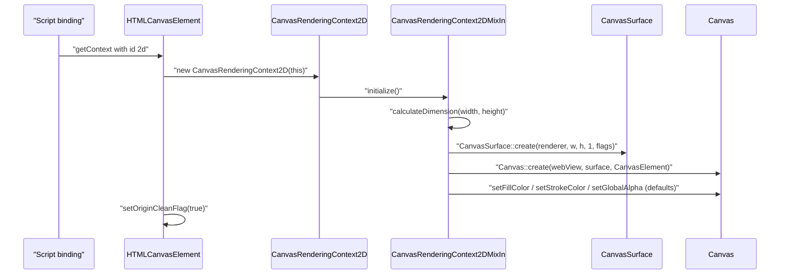
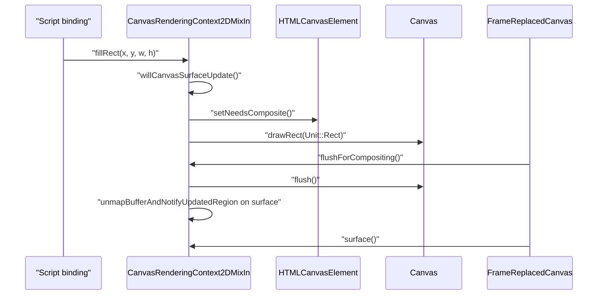
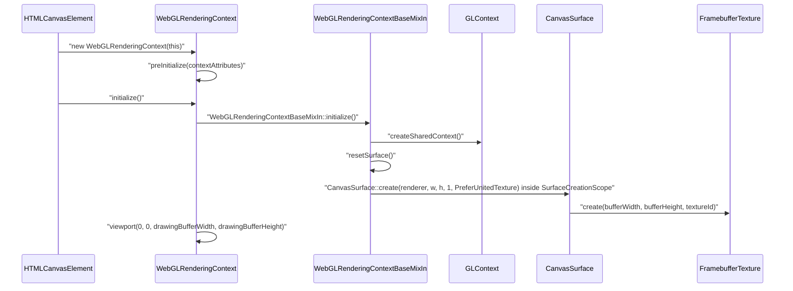
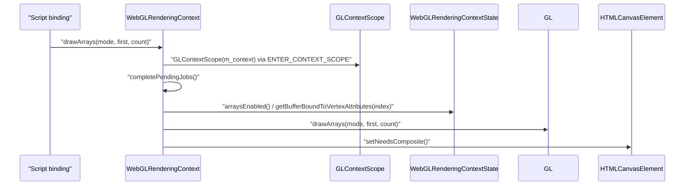

# Module Design Card: core-dom-canvas

> **Relevant source files**
>
> - [src/core/dom/canvas/CanvasDirection.h](src:src/core/dom/canvas/CanvasDirection.h)
> - [src/core/dom/canvas/CanvasFillRule.h](src:src/core/dom/canvas/CanvasFillRule.h)
> - [src/core/dom/canvas/CanvasGradient.cpp](src:src/core/dom/canvas/CanvasGradient.cpp)
> - [src/core/dom/canvas/CanvasGradient.h](src:src/core/dom/canvas/CanvasGradient.h)
> - [src/core/dom/canvas/CanvasImageSource.cpp](src:src/core/dom/canvas/CanvasImageSource.cpp)
> - [src/core/dom/canvas/CanvasImageSource.h](src:src/core/dom/canvas/CanvasImageSource.h)
> - [src/core/dom/canvas/CanvasLineCap.h](src:src/core/dom/canvas/CanvasLineCap.h)
> - [src/core/dom/canvas/CanvasLineJoin.h](src:src/core/dom/canvas/CanvasLineJoin.h)
> - [src/core/dom/canvas/CanvasPath.cpp](src:src/core/dom/canvas/CanvasPath.cpp)
> - [src/core/dom/canvas/CanvasPath.h](src:src/core/dom/canvas/CanvasPath.h)
> - [src/core/dom/canvas/CanvasPathInterfaceMixIn.h](src:src/core/dom/canvas/CanvasPathInterfaceMixIn.h)
> - [src/core/dom/canvas/CanvasPattern.cpp](src:src/core/dom/canvas/CanvasPattern.cpp)
> - [src/core/dom/canvas/CanvasPattern.h](src:src/core/dom/canvas/CanvasPattern.h)
> - [src/core/dom/canvas/CanvasRenderingContext.cpp](src:src/core/dom/canvas/CanvasRenderingContext.cpp)
> - [src/core/dom/canvas/CanvasRenderingContext.h](src:src/core/dom/canvas/CanvasRenderingContext.h)
> - [src/core/dom/canvas/CanvasRenderingContext2D.cpp](src:src/core/dom/canvas/CanvasRenderingContext2D.cpp)
> - [src/core/dom/canvas/CanvasRenderingContext2D.h](src:src/core/dom/canvas/CanvasRenderingContext2D.h)
> - [src/core/dom/canvas/CanvasRenderingContext2DMixIn.cpp](src:src/core/dom/canvas/CanvasRenderingContext2DMixIn.cpp)
> - [src/core/dom/canvas/CanvasRenderingContext2DMixIn.h](src:src/core/dom/canvas/CanvasRenderingContext2DMixIn.h)
> - [src/core/dom/canvas/CanvasTextAlign.h](src:src/core/dom/canvas/CanvasTextAlign.h)
> - [src/core/dom/canvas/CanvasTextBaseline.h](src:src/core/dom/canvas/CanvasTextBaseline.h)
> - [src/core/dom/canvas/HTMLCanvasElement.cpp](src:src/core/dom/canvas/HTMLCanvasElement.cpp)
> - [src/core/dom/canvas/HTMLCanvasElement.h](src:src/core/dom/canvas/HTMLCanvasElement.h)
> - [src/core/dom/canvas/ImageBitmapRenderingContext.cpp](src:src/core/dom/canvas/ImageBitmapRenderingContext.cpp)
> - [src/core/dom/canvas/ImageBitmapRenderingContext.h](src:src/core/dom/canvas/ImageBitmapRenderingContext.h)
> - [src/core/dom/canvas/ImageData.cpp](src:src/core/dom/canvas/ImageData.cpp)
> - [src/core/dom/canvas/ImageData.h](src:src/core/dom/canvas/ImageData.h)
> - [src/core/dom/canvas/ImageSmoothingQuality.cpp](src:src/core/dom/canvas/ImageSmoothingQuality.cpp)
> - [src/core/dom/canvas/ImageSmoothingQuality.h](src:src/core/dom/canvas/ImageSmoothingQuality.h)
> - [src/core/dom/canvas/Path2D.cpp](src:src/core/dom/canvas/Path2D.cpp)
> - [src/core/dom/canvas/Path2D.h](src:src/core/dom/canvas/Path2D.h)
> - [src/core/dom/canvas/TextMetrics.cpp](src:src/core/dom/canvas/TextMetrics.cpp)
> - [src/core/dom/canvas/TextMetrics.h](src:src/core/dom/canvas/TextMetrics.h)
> - [src/core/dom/canvas/webgl/WebGL2RenderingContext.cpp](src:src/core/dom/canvas/webgl/WebGL2RenderingContext.cpp)
> - [src/core/dom/canvas/webgl/WebGL2RenderingContext.h](src:src/core/dom/canvas/webgl/WebGL2RenderingContext.h)
> - [src/core/dom/canvas/webgl/WebGLActiveInfo.h](src:src/core/dom/canvas/webgl/WebGLActiveInfo.h)
> - [src/core/dom/canvas/webgl/WebGLBuffer.cpp](src:src/core/dom/canvas/webgl/WebGLBuffer.cpp)
> - [src/core/dom/canvas/webgl/WebGLBuffer.h](src:src/core/dom/canvas/webgl/WebGLBuffer.h)
> - [src/core/dom/canvas/webgl/WebGLContextAttributes.cpp](src:src/core/dom/canvas/webgl/WebGLContextAttributes.cpp)
> - [src/core/dom/canvas/webgl/WebGLContextAttributes.h](src:src/core/dom/canvas/webgl/WebGLContextAttributes.h)
> - [src/core/dom/canvas/webgl/WebGLExtensions.cpp](src:src/core/dom/canvas/webgl/WebGLExtensions.cpp)
> - [src/core/dom/canvas/webgl/WebGLExtensions.h](src:src/core/dom/canvas/webgl/WebGLExtensions.h)
> - [src/core/dom/canvas/webgl/WebGLFramebuffer.h](src:src/core/dom/canvas/webgl/WebGLFramebuffer.h)
> - [src/core/dom/canvas/webgl/WebGLOES_VertexArrayObject.cpp](src:src/core/dom/canvas/webgl/WebGLOES_VertexArrayObject.cpp)
> - [src/core/dom/canvas/webgl/WebGLOES_VertexArrayObject.h](src:src/core/dom/canvas/webgl/WebGLOES_VertexArrayObject.h)
> - [src/core/dom/canvas/webgl/WebGLObject.cpp](src:src/core/dom/canvas/webgl/WebGLObject.cpp)
> - [src/core/dom/canvas/webgl/WebGLObject.h](src:src/core/dom/canvas/webgl/WebGLObject.h)
> - [src/core/dom/canvas/webgl/WebGLProgram.cpp](src:src/core/dom/canvas/webgl/WebGLProgram.cpp)
> - [src/core/dom/canvas/webgl/WebGLProgram.h](src:src/core/dom/canvas/webgl/WebGLProgram.h)
> - [src/core/dom/canvas/webgl/WebGLRenderbuffer.h](src:src/core/dom/canvas/webgl/WebGLRenderbuffer.h)
> - [src/core/dom/canvas/webgl/WebGLRenderingContext.cpp](src:src/core/dom/canvas/webgl/WebGLRenderingContext.cpp)
> - [src/core/dom/canvas/webgl/WebGLRenderingContext.h](src:src/core/dom/canvas/webgl/WebGLRenderingContext.h)
> - [src/core/dom/canvas/webgl/WebGLRenderingContextBaseMixIn.cpp](src:src/core/dom/canvas/webgl/WebGLRenderingContextBaseMixIn.cpp)
> - [src/core/dom/canvas/webgl/WebGLRenderingContextBaseMixIn.h](src:src/core/dom/canvas/webgl/WebGLRenderingContextBaseMixIn.h)
> - [src/core/dom/canvas/webgl/WebGLRenderingContextState.cpp](src:src/core/dom/canvas/webgl/WebGLRenderingContextState.cpp)
> - [src/core/dom/canvas/webgl/WebGLRenderingContextState.h](src:src/core/dom/canvas/webgl/WebGLRenderingContextState.h)
> - [src/core/dom/canvas/webgl/WebGLShader.cpp](src:src/core/dom/canvas/webgl/WebGLShader.cpp)
> - [src/core/dom/canvas/webgl/WebGLShader.h](src:src/core/dom/canvas/webgl/WebGLShader.h)
> - [src/core/dom/canvas/webgl/WebGLShaderPrecisionFormat.h](src:src/core/dom/canvas/webgl/WebGLShaderPrecisionFormat.h)
> - [src/core/dom/canvas/webgl/WebGLTexture.cpp](src:src/core/dom/canvas/webgl/WebGLTexture.cpp)
> - [src/core/dom/canvas/webgl/WebGLTexture.h](src:src/core/dom/canvas/webgl/WebGLTexture.h)
> - [src/core/dom/canvas/webgl/WebGLUniformLocation.h](src:src/core/dom/canvas/webgl/WebGLUniformLocation.h)
> - [src/core/dom/canvas/webgl/WebGLUtils.cpp](src:src/core/dom/canvas/webgl/WebGLUtils.cpp)
> - [src/core/dom/canvas/webgl/WebGLUtils.h](src:src/core/dom/canvas/webgl/WebGLUtils.h)
> - [src/core/dom/canvas/webgl/gl/FramebufferTexture.cpp](src:src/core/dom/canvas/webgl/gl/FramebufferTexture.cpp)
> - [src/core/dom/canvas/webgl/gl/FramebufferTexture.h](src:src/core/dom/canvas/webgl/gl/FramebufferTexture.h)
> - [src/core/dom/canvas/webgl/gl/GLContext.cpp](src:src/core/dom/canvas/webgl/gl/GLContext.cpp)
> - [src/core/dom/canvas/webgl/gl/GLContext.h](src:src/core/dom/canvas/webgl/gl/GLContext.h)
> - [src/core/dom/canvas/webgl/gl/SurfaceCreationScope.cpp](src:src/core/dom/canvas/webgl/gl/SurfaceCreationScope.cpp)
> - [src/core/dom/canvas/webgl/gl/SurfaceCreationScope.h](src:src/core/dom/canvas/webgl/gl/SurfaceCreationScope.h)
> - [src/core/dom/canvas/HTMLCanvasElement.idl](src:src/core/dom/canvas/HTMLCanvasElement.idl)
> - [src/core/dom/canvas/CanvasRenderingContext2D.idl](src:src/core/dom/canvas/CanvasRenderingContext2D.idl)
> - [src/core/dom/canvas/webgl/WebGLRenderingContext.idl](src:src/core/dom/canvas/webgl/WebGLRenderingContext.idl)
> - [src/core/dom/canvas/webgl/WebGL2RenderingContext.idl](src:src/core/dom/canvas/webgl/WebGL2RenderingContext.idl)
> - [build/binding.cmake](src:build/binding.cmake)
> - [build/config.cmake](src:build/config.cmake)
> - [src/core/layout/FrameReplacedCanvas.cpp](src:src/core/layout/FrameReplacedCanvas.cpp)
> - [src/core/layout/svg/FrameSVGBox.cpp](src:src/core/layout/svg/FrameSVGBox.cpp)
> - [src/core/dom/HTMLDocument.cpp](src:src/core/dom/HTMLDocument.cpp)
> - [src/core/page/WindowOrWorkerGlobalScope.cpp](src:src/core/page/WindowOrWorkerGlobalScope.cpp)
> - [src/binding/ImageDataCustomBinding.cpp](src:src/binding/ImageDataCustomBinding.cpp)
> - [src/binding/ScriptWrappable.h](src:src/binding/ScriptWrappable.h)
> - [src/platform/canvas/CanvasCairo.cpp](src:src/platform/canvas/CanvasCairo.cpp)
> - [src/platform/canvas/CompositorGL.cpp](src:src/platform/canvas/CompositorGL.cpp)
> - [src/platform/canvas/gl/GL.h](src:src/platform/canvas/gl/GL.h)
> - [src/core/modules/canvas/Canvas.h](src:src/core/modules/canvas/Canvas.h)
> - [src/core/modules/canvas/Path.h](src:src/core/modules/canvas/Path.h)
> - [src/core/modules/canvas/Compositor.h](src:src/core/modules/canvas/Compositor.h)
> - [src/core/modules/canvas/image/NativeImageData.h](src:src/core/modules/canvas/image/NativeImageData.h)
> - [src/core/modules/canvas/image/ImageEncoder.h](src:src/core/modules/canvas/image/ImageEncoder.h)
> - [src/core/modules/renderer/Renderer.h](src:src/core/modules/renderer/Renderer.h)
> - [src/core/serialize/Serializer.h](src:src/core/serialize/Serializer.h)
> - [src/core/dom/HTMLElement.h](src:src/core/dom/HTMLElement.h)

**Module**: `core-dom-canvas` — 70 files under `src/core/dom/canvas/`, `src/core/dom/canvas/webgl/`, `src/core/dom/canvas/webgl/gl/`
**Role**: Implements the `<canvas>` element and its script-visible rendering contexts (2D, bitmap renderer, WebGL, WebGL2), translating drawing calls into operations on the platform `Canvas`/`CanvasSurface` or a shared GL context. [`HTMLCanvasElement::getContext`](src:src/core/dom/canvas/HTMLCanvasElement.cpp#L125)
**Module Boundary**: Canvas 2D rendering-context DOM directory including its webgl/ subdirectory (WebGL2RenderingContext, shaders, buffers)
**Confidence**: 0.92
**Core selection**: All approved modules are Core (boundary approved in W1 human review)
**Generated**: 2026-09-10

## Source Files

### `src/core/dom/canvas/` (element, 2D context, helpers)
- [src/core/dom/canvas/HTMLCanvasElement.h](src:src/core/dom/canvas/HTMLCanvasElement.h), [src/core/dom/canvas/HTMLCanvasElement.cpp](src:src/core/dom/canvas/HTMLCanvasElement.cpp)
- [src/core/dom/canvas/CanvasRenderingContext.h](src:src/core/dom/canvas/CanvasRenderingContext.h), [src/core/dom/canvas/CanvasRenderingContext.cpp](src:src/core/dom/canvas/CanvasRenderingContext.cpp)
- [src/core/dom/canvas/CanvasRenderingContext2D.h](src:src/core/dom/canvas/CanvasRenderingContext2D.h), [src/core/dom/canvas/CanvasRenderingContext2D.cpp](src:src/core/dom/canvas/CanvasRenderingContext2D.cpp)
- [src/core/dom/canvas/CanvasRenderingContext2DMixIn.h](src:src/core/dom/canvas/CanvasRenderingContext2DMixIn.h), [src/core/dom/canvas/CanvasRenderingContext2DMixIn.cpp](src:src/core/dom/canvas/CanvasRenderingContext2DMixIn.cpp)
- [src/core/dom/canvas/ImageBitmapRenderingContext.h](src:src/core/dom/canvas/ImageBitmapRenderingContext.h), [src/core/dom/canvas/ImageBitmapRenderingContext.cpp](src:src/core/dom/canvas/ImageBitmapRenderingContext.cpp)
- [src/core/dom/canvas/CanvasPath.h](src:src/core/dom/canvas/CanvasPath.h), [src/core/dom/canvas/CanvasPath.cpp](src:src/core/dom/canvas/CanvasPath.cpp), [src/core/dom/canvas/CanvasPathInterfaceMixIn.h](src:src/core/dom/canvas/CanvasPathInterfaceMixIn.h), [src/core/dom/canvas/Path2D.h](src:src/core/dom/canvas/Path2D.h), [src/core/dom/canvas/Path2D.cpp](src:src/core/dom/canvas/Path2D.cpp)
- [src/core/dom/canvas/CanvasGradient.h](src:src/core/dom/canvas/CanvasGradient.h), [src/core/dom/canvas/CanvasGradient.cpp](src:src/core/dom/canvas/CanvasGradient.cpp), [src/core/dom/canvas/CanvasPattern.h](src:src/core/dom/canvas/CanvasPattern.h), [src/core/dom/canvas/CanvasPattern.cpp](src:src/core/dom/canvas/CanvasPattern.cpp)
- [src/core/dom/canvas/CanvasImageSource.h](src:src/core/dom/canvas/CanvasImageSource.h), [src/core/dom/canvas/CanvasImageSource.cpp](src:src/core/dom/canvas/CanvasImageSource.cpp)
- [src/core/dom/canvas/ImageData.h](src:src/core/dom/canvas/ImageData.h), [src/core/dom/canvas/ImageData.cpp](src:src/core/dom/canvas/ImageData.cpp)
- [src/core/dom/canvas/TextMetrics.h](src:src/core/dom/canvas/TextMetrics.h), [src/core/dom/canvas/TextMetrics.cpp](src:src/core/dom/canvas/TextMetrics.cpp)
- [src/core/dom/canvas/ImageSmoothingQuality.h](src:src/core/dom/canvas/ImageSmoothingQuality.h), [src/core/dom/canvas/ImageSmoothingQuality.cpp](src:src/core/dom/canvas/ImageSmoothingQuality.cpp)
- Enum headers: [src/core/dom/canvas/CanvasDirection.h](src:src/core/dom/canvas/CanvasDirection.h), [src/core/dom/canvas/CanvasFillRule.h](src:src/core/dom/canvas/CanvasFillRule.h), [src/core/dom/canvas/CanvasLineCap.h](src:src/core/dom/canvas/CanvasLineCap.h), [src/core/dom/canvas/CanvasLineJoin.h](src:src/core/dom/canvas/CanvasLineJoin.h), [src/core/dom/canvas/CanvasTextAlign.h](src:src/core/dom/canvas/CanvasTextAlign.h), [src/core/dom/canvas/CanvasTextBaseline.h](src:src/core/dom/canvas/CanvasTextBaseline.h)

### `src/core/dom/canvas/webgl/` (WebGL / WebGL2 contexts and objects)
- [src/core/dom/canvas/webgl/WebGLRenderingContext.h](src:src/core/dom/canvas/webgl/WebGLRenderingContext.h), [src/core/dom/canvas/webgl/WebGLRenderingContext.cpp](src:src/core/dom/canvas/webgl/WebGLRenderingContext.cpp)
- [src/core/dom/canvas/webgl/WebGL2RenderingContext.h](src:src/core/dom/canvas/webgl/WebGL2RenderingContext.h), [src/core/dom/canvas/webgl/WebGL2RenderingContext.cpp](src:src/core/dom/canvas/webgl/WebGL2RenderingContext.cpp)
- [src/core/dom/canvas/webgl/WebGLRenderingContextBaseMixIn.h](src:src/core/dom/canvas/webgl/WebGLRenderingContextBaseMixIn.h), [src/core/dom/canvas/webgl/WebGLRenderingContextBaseMixIn.cpp](src:src/core/dom/canvas/webgl/WebGLRenderingContextBaseMixIn.cpp)
- [src/core/dom/canvas/webgl/WebGLRenderingContextState.h](src:src/core/dom/canvas/webgl/WebGLRenderingContextState.h), [src/core/dom/canvas/webgl/WebGLRenderingContextState.cpp](src:src/core/dom/canvas/webgl/WebGLRenderingContextState.cpp)
- [src/core/dom/canvas/webgl/WebGLContextAttributes.h](src:src/core/dom/canvas/webgl/WebGLContextAttributes.h), [src/core/dom/canvas/webgl/WebGLContextAttributes.cpp](src:src/core/dom/canvas/webgl/WebGLContextAttributes.cpp)
- [src/core/dom/canvas/webgl/WebGLExtensions.h](src:src/core/dom/canvas/webgl/WebGLExtensions.h), [src/core/dom/canvas/webgl/WebGLExtensions.cpp](src:src/core/dom/canvas/webgl/WebGLExtensions.cpp), [src/core/dom/canvas/webgl/WebGLOES_VertexArrayObject.h](src:src/core/dom/canvas/webgl/WebGLOES_VertexArrayObject.h), [src/core/dom/canvas/webgl/WebGLOES_VertexArrayObject.cpp](src:src/core/dom/canvas/webgl/WebGLOES_VertexArrayObject.cpp)
- [src/core/dom/canvas/webgl/WebGLObject.h](src:src/core/dom/canvas/webgl/WebGLObject.h), [src/core/dom/canvas/webgl/WebGLObject.cpp](src:src/core/dom/canvas/webgl/WebGLObject.cpp), [src/core/dom/canvas/webgl/WebGLBuffer.h](src:src/core/dom/canvas/webgl/WebGLBuffer.h), [src/core/dom/canvas/webgl/WebGLBuffer.cpp](src:src/core/dom/canvas/webgl/WebGLBuffer.cpp), [src/core/dom/canvas/webgl/WebGLProgram.h](src:src/core/dom/canvas/webgl/WebGLProgram.h), [src/core/dom/canvas/webgl/WebGLProgram.cpp](src:src/core/dom/canvas/webgl/WebGLProgram.cpp), [src/core/dom/canvas/webgl/WebGLShader.h](src:src/core/dom/canvas/webgl/WebGLShader.h), [src/core/dom/canvas/webgl/WebGLShader.cpp](src:src/core/dom/canvas/webgl/WebGLShader.cpp), [src/core/dom/canvas/webgl/WebGLTexture.h](src:src/core/dom/canvas/webgl/WebGLTexture.h), [src/core/dom/canvas/webgl/WebGLTexture.cpp](src:src/core/dom/canvas/webgl/WebGLTexture.cpp), [src/core/dom/canvas/webgl/WebGLFramebuffer.h](src:src/core/dom/canvas/webgl/WebGLFramebuffer.h), [src/core/dom/canvas/webgl/WebGLRenderbuffer.h](src:src/core/dom/canvas/webgl/WebGLRenderbuffer.h)
- [src/core/dom/canvas/webgl/WebGLActiveInfo.h](src:src/core/dom/canvas/webgl/WebGLActiveInfo.h), [src/core/dom/canvas/webgl/WebGLUniformLocation.h](src:src/core/dom/canvas/webgl/WebGLUniformLocation.h), [src/core/dom/canvas/webgl/WebGLShaderPrecisionFormat.h](src:src/core/dom/canvas/webgl/WebGLShaderPrecisionFormat.h)
- [src/core/dom/canvas/webgl/WebGLUtils.h](src:src/core/dom/canvas/webgl/WebGLUtils.h), [src/core/dom/canvas/webgl/WebGLUtils.cpp](src:src/core/dom/canvas/webgl/WebGLUtils.cpp)

### `src/core/dom/canvas/webgl/gl/` (GL context and offscreen framebuffer plumbing)
- [src/core/dom/canvas/webgl/gl/GLContext.h](src:src/core/dom/canvas/webgl/gl/GLContext.h), [src/core/dom/canvas/webgl/gl/GLContext.cpp](src:src/core/dom/canvas/webgl/gl/GLContext.cpp)
- [src/core/dom/canvas/webgl/gl/FramebufferTexture.h](src:src/core/dom/canvas/webgl/gl/FramebufferTexture.h), [src/core/dom/canvas/webgl/gl/FramebufferTexture.cpp](src:src/core/dom/canvas/webgl/gl/FramebufferTexture.cpp)
- [src/core/dom/canvas/webgl/gl/SurfaceCreationScope.h](src:src/core/dom/canvas/webgl/gl/SurfaceCreationScope.h), [src/core/dom/canvas/webgl/gl/SurfaceCreationScope.cpp](src:src/core/dom/canvas/webgl/gl/SurfaceCreationScope.cpp)

Script-facing interfaces are declared in `.idl` files next to the sources (for example [`HTMLCanvasElement.idl`](src:src/core/dom/canvas/HTMLCanvasElement.idl#L10), [`CanvasRenderingContext2D.idl`](src:src/core/dom/canvas/CanvasRenderingContext2D.idl#L10), [`WebGLRenderingContext.idl`](src:src/core/dom/canvas/webgl/WebGLRenderingContext.idl#L4), [`WebGL2RenderingContext.idl`](src:src/core/dom/canvas/webgl/WebGL2RenderingContext.idl#L598)); the build globs all `src/*.idl` files for binding generation. [`binding.cmake`](src:build/binding.cmake#L28)

## Public Interface

| Function/Class | Signature | Main callers | Source |
|---|---|---|---|
| `HTMLCanvasElement` | `class HTMLCanvasElement : public HTMLElement` | [`HTMLDocument::createHTMLElement`](src:src/core/dom/HTMLDocument.cpp#L108) (line 283 `new HTMLCanvasElement`) | [`HTMLCanvasElement`](src:src/core/dom/canvas/HTMLCanvasElement.h#L39) |
| `HTMLCanvasElement::getContext` | `Optional<RenderingContextBindindingUnion> getContext(String* contextId, GCVector<ScriptValue> arguments)` | Generated script binding ([`HTMLCanvasElement.idl`](src:src/core/dom/canvas/HTMLCanvasElement.idl#L10)) | [`HTMLCanvasElement::getContext`](src:src/core/dom/canvas/HTMLCanvasElement.cpp#L125) |
| `HTMLCanvasElement::canvasRenderingContext` | `CanvasRenderingContext* canvasRenderingContext()` | [`FrameReplacedCanvas::willCompositeStackingContext`](src:src/core/layout/FrameReplacedCanvas.cpp#L66), [`FrameReplacedCanvas::contentSurface`](src:src/core/layout/FrameReplacedCanvas.cpp#L75) | [`HTMLCanvasElement::canvasRenderingContext`](src:src/core/dom/canvas/HTMLCanvasElement.h#L73) |
| `HTMLCanvasElement::width` / `height` | `uint32_t width()` / `uint32_t height()` | [`FrameReplacedCanvas::intrinsicSize`](src:src/core/layout/FrameReplacedCanvas.cpp#L50), [`CanvasImageSourceUtils::checkUsability`](src:src/core/dom/canvas/CanvasImageSource.cpp#L41) | [`HTMLCanvasElement::width`](src:src/core/dom/canvas/HTMLCanvasElement.cpp#L95) |
| `HTMLCanvasElement::toDataURL` | `String* toDataURL(String* type, ScriptValue quality)` | Generated script binding | [`HTMLCanvasElement::toDataURL`](src:src/core/dom/canvas/HTMLCanvasElement.cpp#L193) |
| `CanvasRenderingContext` | `class CanvasRenderingContext : public ScriptWrappable` (pure virtual `initialize`, `surface`, `flushForReadback`, `onResize`) | [`FrameReplacedCanvas::willCompositeStackingContext`](src:src/core/layout/FrameReplacedCanvas.cpp#L66) calls `flushForCompositing`; [`FrameReplacedCanvas::contentSurface`](src:src/core/layout/FrameReplacedCanvas.cpp#L75) calls `surface` | [`CanvasRenderingContext`](src:src/core/dom/canvas/CanvasRenderingContext.h#L29) |
| `CanvasRenderingContext2D` | `class CanvasRenderingContext2D : public CanvasRenderingContext2DMixIn` | [`HTMLCanvasElement::getContext`](src:src/core/dom/canvas/HTMLCanvasElement.cpp#L125); generated binding ([`CanvasRenderingContext2D.idl`](src:src/core/dom/canvas/CanvasRenderingContext2D.idl#L10)) | [`CanvasRenderingContext2D`](src:src/core/dom/canvas/CanvasRenderingContext2D.h#L29) |
| `CanvasRenderingContext2DMixIn::fillRect` | `void fillRect(float x, float y, float w, float h)` | Generated script binding | [`CanvasRenderingContext2DMixIn::fillRect`](src:src/core/dom/canvas/CanvasRenderingContext2DMixIn.cpp#L875) |
| `CanvasRenderingContext2DMixIn::drawImage` | `void drawImage(CanvasImageSource image, float sx, float sy, float sw, float sh, float dx, float dy, float dw, float dh)` | Generated script binding | [`CanvasRenderingContext2DMixIn::drawImage`](src:src/core/dom/canvas/CanvasRenderingContext2DMixIn.cpp#L1432) |
| `CanvasRenderingContext2DMixIn::getImageData` | `ImageData* getImageData(int32_t sx, int32_t sy, int32_t sw, int32_t sh)` | Generated script binding | [`CanvasRenderingContext2DMixIn::getImageData`](src:src/core/dom/canvas/CanvasRenderingContext2DMixIn.cpp#L1554) |
| `CanvasImageSourceUtils::checkUsability` / `toNativeImageData` | `static DOMExceptionOr<bool> checkUsability(ExecutionContext*, CanvasImageSource)` / `static std::pair<NativeImageData*, bool> toNativeImageData(ExecutionContext*, CanvasImageSource&)` | [`WindowOrWorkerGlobalScope.cpp`](src:src/core/page/WindowOrWorkerGlobalScope.cpp#L349) (createImageBitmap path) | [`CanvasImageSourceUtils`](src:src/core/dom/canvas/CanvasImageSource.h#L34) |
| `ImageData` | `ImageData(ExecutionContext*, ScriptUint8ClampedArray data, uint32_t sw, Optional<uint32_t> sh)` | [`imagedataConstructor`](src:src/binding/ImageDataCustomBinding.cpp#L29) | [`ImageData`](src:src/core/dom/canvas/ImageData.h#L29) |
| `CanvasGradient` | `CanvasGradient(ExecutionContext*, double x0, double y0, double x1, double y1)`; `nativeGradient()` | [`createLinearGradient`](src:src/core/layout/svg/FrameSVGBox.cpp#L905) (SVG paint), [`CanvasCairo.cpp`](src:src/platform/canvas/CanvasCairo.cpp#L398) | [`CanvasGradient`](src:src/core/dom/canvas/CanvasGradient.h#L30) |
| `CanvasPattern` | `CanvasPattern(ExecutionContext*, NativeImageData* image, bool repeatX, bool repeatY)`; `nativePattern()` | [`CanvasCairo.cpp`](src:src/platform/canvas/CanvasCairo.cpp#L427) | [`CanvasPattern`](src:src/core/dom/canvas/CanvasPattern.h#L31) |
| `CanvasLineCap` / `CanvasLineJoin` / `ImageSmoothingQuality` | `using CanvasLineCap = StrokeLineCap;` / `using CanvasLineJoin = StrokeLineJoin;` / `enum class ImageSmoothingQuality` | [`Canvas.h`](src:src/core/modules/canvas/Canvas.h#L32), [`CanvasCairo.cpp`](src:src/platform/canvas/CanvasCairo.cpp#L31) | [`CanvasLineCap`](src:src/core/dom/canvas/CanvasLineCap.h#L26), [`ImageSmoothingQuality`](src:src/core/dom/canvas/ImageSmoothingQuality.h#L24) |
| `WebGLRenderingContext` | `class WebGLRenderingContext : public WebGLRenderingContextBaseMixIn` | [`HTMLCanvasElement::getContext`](src:src/core/dom/canvas/HTMLCanvasElement.cpp#L125); generated binding ([`WebGLRenderingContext.idl`](src:src/core/dom/canvas/webgl/WebGLRenderingContext.idl#L4)) | [`WebGLRenderingContext`](src:src/core/dom/canvas/webgl/WebGLRenderingContext.h#L68) |
| `WebGL2RenderingContext` | `class WebGL2RenderingContext : public WebGLRenderingContext` | [`HTMLCanvasElement::getContext`](src:src/core/dom/canvas/HTMLCanvasElement.cpp#L125); generated binding ([`WebGL2RenderingContext.idl`](src:src/core/dom/canvas/webgl/WebGL2RenderingContext.idl#L598)) | [`WebGL2RenderingContext`](src:src/core/dom/canvas/webgl/WebGL2RenderingContext.h#L95) |
| `WebGLRenderingContext::setGLError` / `executeInContextScope` / `getState` | `void setGLError(GLenum code, const char* message = nullptr)` / `bool executeInContextScope(std::function<void()>)` / `WebGLRenderingContextState* getState()` | [`OES_vertex_array_object::bindVertexArrayOES`](src:src/core/dom/canvas/webgl/WebGLOES_VertexArrayObject.cpp#L105) | [`WebGLRenderingContext::setGLError`](src:src/core/dom/canvas/webgl/WebGLRenderingContext.h#L313) |
| `SurfaceCreationScope` | `explicit SurfaceCreationScope(std::shared_ptr<TextureCreationDelegate> delegate)`; static `hasDelegate()` / `delegate()` | [`CanvasSurfaceGL`](src:src/platform/canvas/CompositorGL.cpp#L2795) (friend class; [`ensureGenerateTexture`](src:src/platform/canvas/CompositorGL.cpp#L3038)) | [`SurfaceCreationScope`](src:src/core/dom/canvas/webgl/gl/SurfaceCreationScope.h#L42) |
| `GLContextScope::getCurrentGLContext` | `static GLContext getCurrentGLContext()` | [`CompositorGL.cpp`](src:src/platform/canvas/CompositorGL.cpp#L2867) | [`GLContextScope::getCurrentGLContext`](src:src/core/dom/canvas/webgl/gl/GLContext.h#L59) |

## IPC / Message / Interface Contracts

- No cross-module IPC or message contract is identifiable in code for this module.

`ImageData` implements the in-process `Serializable` interface ([`ImageData::serialize`](src:src/core/dom/canvas/ImageData.h#L43), [`SerializedImageData`](src:src/core/dom/canvas/ImageData.h#L73)) so it can be structured-cloned by the serializer in `core-extras`; this is a data-format hook, not a process boundary or message channel.

## Key Flow

### 2D context creation

Entry symbol: [`HTMLCanvasElement::getContext`](src:src/core/dom/canvas/HTMLCanvasElement.cpp#L125); the context constructor calls [`CanvasRenderingContext2DMixIn::initialize`](src:src/core/dom/canvas/CanvasRenderingContext2DMixIn.cpp#L289), which sizes the buffer with [`CanvasRenderingContext::calculateDimension`](src:src/core/dom/canvas/CanvasRenderingContext.cpp#L35).

### 2D drawing and presentation

Entry symbol: [`CanvasRenderingContext2DMixIn::fillRect`](src:src/core/dom/canvas/CanvasRenderingContext2DMixIn.cpp#L875); presentation is driven by [`FrameReplacedCanvas::willCompositeStackingContext`](src:src/core/layout/FrameReplacedCanvas.cpp#L66) calling [`CanvasRenderingContext2DMixIn::flushForCompositing`](src:src/core/dom/canvas/CanvasRenderingContext2DMixIn.cpp#L349).

### WebGL context creation

Entry symbol: [`HTMLCanvasElement::getContext`](src:src/core/dom/canvas/HTMLCanvasElement.cpp#L125) (branch at line 151) -> [`WebGLRenderingContext::preInitialize`](src:src/core/dom/canvas/webgl/WebGLRenderingContext.cpp#L121) -> [`WebGLRenderingContextBaseMixIn::initialize`](src:src/core/dom/canvas/webgl/WebGLRenderingContextBaseMixIn.cpp#L50) -> [`WebGLRenderingContextBaseMixIn::resetSurface`](src:src/core/dom/canvas/webgl/WebGLRenderingContextBaseMixIn.cpp#L77); the compositor-side surface calls back into [`FramebufferTexture::create`](src:src/core/dom/canvas/webgl/gl/FramebufferTexture.cpp#L125) through [`SurfaceCreationScope`](src:src/core/dom/canvas/webgl/gl/SurfaceCreationScope.h#L42).

### WebGL draw call

Entry symbol: [`WebGLRenderingContext::drawArrays`](src:src/core/dom/canvas/webgl/WebGLRenderingContext.cpp#L906); it validates against [`WebGLRenderingContextState::arraysEnabled`](src:src/core/dom/canvas/webgl/WebGLRenderingContextState.cpp#L33) and records failures with [`WebGLRenderingContext::setGLError`](src:src/core/dom/canvas/webgl/WebGLRenderingContext.cpp#L3775).

## Architectural Rules

- [ ] The whole module is compiled only when `STARFISH_ENABLE_CANVAS` is defined; the `webgl/` subtree additionally requires `STARFISH_ENABLE_WEBGL` (both flags are set in the build configuration). [`CanvasRenderingContext.h`](src:src/core/dom/canvas/CanvasRenderingContext.h#L23), [`WebGLObject.h`](src:src/core/dom/canvas/webgl/WebGLObject.h#L23), [`config.cmake`](src:build/config.cmake#L129), [`config.cmake`](src:build/config.cmake#L362)
- [ ] A canvas element latches exactly one context kind: once `m_contextMode` leaves `CanvasContextModeNone`, `getContext` returns the existing context for the same kind and `nullptr` for any other kind. [`HTMLCanvasElement::getContext`](src:src/core/dom/canvas/HTMLCanvasElement.cpp#L125), [`CanvasContextMode`](src:src/core/dom/canvas/HTMLCanvasElement.h#L43)
- [ ] Every concrete rendering context derives from `CanvasRenderingContext` and must implement `initialize`, `surface`, `flushForReadback`, and `onResize`; layout only talks to this abstract interface. [`CanvasRenderingContext::initialize`](src:src/core/dom/canvas/CanvasRenderingContext.h#L58), [`FrameReplacedCanvas::willCompositeStackingContext`](src:src/core/layout/FrameReplacedCanvas.cpp#L66)
- [ ] Script-wrappable objects in this module are allocated through typed-GC descriptors (`operator new` with `GC_MALLOC_EXPLICITLY_TYPED` or `BEGIN_IMPLEMENT_NEW_WITH_GC_DESC`), and each GC-pointer member is registered in `fillGCDescriptor`. [`CanvasRenderingContext2D.h`](src:src/core/dom/canvas/CanvasRenderingContext2D.h#L41), [`WebGLObject.h`](src:src/core/dom/canvas/webgl/WebGLObject.h#L69)
- [ ] 2D drawing uses `float` rather than `double` for geometry, as documented in the header comment ("Canvas-related calculation with double type cause a bug in cairo occasionally"). [`CanvasRenderingContext2DMixIn.h`](src:src/core/dom/canvas/CanvasRenderingContext2DMixIn.h#L82)
- [ ] Every public WebGL entry point first enters the context's GL scope through `ENTER_CONTEXT_SCOPE`, which bails out with the given value when `GLContextScope` reports an error. [`WebGLRenderingContext.cpp`](src:src/core/dom/canvas/webgl/WebGLRenderingContext.cpp#L307), [`GLContextScope`](src:src/core/dom/canvas/webgl/gl/GLContext.h#L45)
- [ ] WebGL objects passed in by script are rejected with `GL_INVALID_OPERATION` unless they were created by the same context (`isFromCurrentContext`); errors are queued in `m_GLErrors` and surfaced by `getError`, and `setGLError` is intended only for `WebGLRenderingContext` and the extension classes. [`WebGLRenderingContext::isFromCurrentContext`](src:src/core/dom/canvas/webgl/WebGLRenderingContext.cpp#L3842), [`WebGLRenderingContext::getError`](src:src/core/dom/canvas/webgl/WebGLRenderingContext.cpp#L333), [`WebGLRenderingContext.h`](src:src/core/dom/canvas/webgl/WebGLRenderingContext.h#L312)
- [ ] Origin-clean tracking gates read-back: `toDataURL` and `getImageData` throw `SECURITY_ERR` when the context's origin-clean flag is false, and `drawImage`/`createPattern` clear the flag when the source is not same-origin. [`HTMLCanvasElement::toDataURL`](src:src/core/dom/canvas/HTMLCanvasElement.cpp#L193), [`CanvasRenderingContext2DMixIn::getImageData`](src:src/core/dom/canvas/CanvasRenderingContext2DMixIn.cpp#L1554), [`CanvasRenderingContext::setOriginCleanFlag`](src:src/core/dom/canvas/CanvasRenderingContext.h#L47)

## Dependencies

### Internal modules

| Module | File(s) | Purpose | Source |
|---|---|---|---|
| core-dom | `core/dom/ExecutionContext.h`, `core/dom/DOMException.h`, `core/dom/Document.h`, `core/dom/HTMLElement.h`, `core/dom/DOMMatrix.h`, `core/dom/ImageBitmap.h`, `core/dom/HTMLImageElement.h` | Element base class, execution context, DOM exceptions, image sources | [`HTMLElement`](src:src/core/dom/HTMLElement.h#L27), [`CanvasRenderingContext2DMixIn.h`](src:src/core/dom/canvas/CanvasRenderingContext2DMixIn.h#L30) |
| core-dom-svg | `core/dom/svg/SVGImageElement.h` | SVG image as a canvas image source | [`CanvasImageSourceUtils::checkUsability`](src:src/core/dom/canvas/CanvasImageSource.cpp#L41) |
| modules-canvas | `core/modules/canvas/Canvas.h`, `Path.h`, `NativeGradient.h`, `NativePattern.h`, `Compositor.h`, `image/NativeImageData.h`, `image/ImageEncoder.h` | Platform-neutral drawing backend (`Canvas`, `CanvasSurface`, `Path`), gradient/pattern natives, PNG/JPEG encoding | [`CanvasSurface`](src:src/core/modules/canvas/Canvas.h#L155), [`Canvas`](src:src/core/modules/canvas/Canvas.h#L296), [`Path`](src:src/core/modules/canvas/Path.h#L30), [`ImageEncoder`](src:src/core/modules/canvas/image/ImageEncoder.h#L25) |
| platform-canvas | `platform/canvas/gl/GLTypes.h`, `platform/canvas/gl/IncludeGL.h`, `platform/canvas/gl/GL.h` | GL type definitions and the `GL` function-dispatch class used by WebGL | [`GL`](src:src/platform/canvas/gl/GL.h#L34), [`WebGLRenderingContext.cpp`](src:src/core/dom/canvas/webgl/WebGLRenderingContext.cpp#L57) |
| modules-runtime | `core/modules/renderer/Renderer.h` | Shared GL context creation / make-current, access to `GL` | [`Renderer::createSharedContext`](src:src/core/modules/renderer/Renderer.h#L174), [`GLContext::createSharedContext`](src:src/core/dom/canvas/webgl/gl/GLContext.cpp#L41) |
| binding | `binding/ScriptWrappable.h`, `binding/ScriptBindingInstance.h`, `binding/generated/*Union.h` | Script-wrappable base, binding instance, generated union types for overloaded arguments | [`ScriptWrappable`](src:src/binding/ScriptWrappable.h#L419), [`HTMLCanvasElement.cpp`](src:src/core/dom/canvas/HTMLCanvasElement.cpp#L27) |
| core-util | `core/util/String.h`, `core/util/GCDescriptor.h`, `core/util/debug/Trace.h` | Strings, GC descriptor macros, tracing | [`WebGLObject.h`](src:src/core/dom/canvas/webgl/WebGLObject.h#L27) |
| core-style | `core/style/Style.h`, `core/style/CSSParser.h`, `core/style/StrokeLineCap.h`, `core/style/StrokeLineJoin.h` | Font shorthand parsing for `setFont`, color parsing, line cap/join enums | [`CanvasRenderingContext2DMixIn::setFont`](src:src/core/dom/canvas/CanvasRenderingContext2DMixIn.cpp#L1953), [`CanvasLineCap`](src:src/core/dom/canvas/CanvasLineCap.h#L26) |
| core-page | `core/page/WebView.h`, `core/page/Window.h` | Renderer access via `webView()`, disposer registration on the window | [`WebGLRenderingContextBaseMixIn::initialize`](src:src/core/dom/canvas/webgl/WebGLRenderingContextBaseMixIn.cpp#L50) |
| core-layout | `core/layout/FrameDocument.h` (included); `FrameReplacedCanvas.cpp` (caller) | Layout frame that sizes, composites, and reads the canvas surface | [`FrameReplacedCanvas::contentSurface`](src:src/core/layout/FrameReplacedCanvas.cpp#L75) |
| core-extras | `core/serialize/Serializer.h` | `Serializable` base for `ImageData` structured cloning | [`Serializable`](src:src/core/serialize/Serializer.h#L61), [`ImageData`](src:src/core/dom/canvas/ImageData.h#L29) |
| engine-entry | `StarfishConfig.h`, `Starfish.h`, `StarfishBase.h`, `StaticStrings.h` | Build flags, engine root, static attribute names (`m_width`, `m_height`) | [`HTMLCanvasElement::didAttributeChanged`](src:src/core/dom/canvas/HTMLCanvasElement.cpp#L40) |

### External libraries

| Library | Version | Purpose | Source |
|---|---|---|---|
| Escargot (`EscargotPublic.h`) | Not specified in code | Script values, array buffers, `Evaluator` used for context-attribute parsing and pixel buffers | [`CanvasRenderingContext2DMixIn.cpp`](src:src/core/dom/canvas/CanvasRenderingContext2DMixIn.cpp#L51), [`WebGLExtensions.cpp`](src:src/core/dom/canvas/webgl/WebGLExtensions.cpp#L32) |
| Skia (`SkMatrix.h`) | Not specified in code | Matrix math for `ellipse` path steps and pattern transforms | [`CanvasPath.cpp`](src:src/core/dom/canvas/CanvasPath.cpp#L57), [`CanvasPattern.cpp`](src:src/core/dom/canvas/CanvasPattern.cpp#L20) |
| GC library (`GC_*` API) | Not specified in code | Typed allocation and finalizers for script-wrappable objects | [`CanvasRenderingContext2D.h`](src:src/core/dom/canvas/CanvasRenderingContext2D.h#L52), [`CanvasRenderingContext2DMixIn.cpp`](src:src/core/dom/canvas/CanvasRenderingContext2DMixIn.cpp#L279) |
| CheckedArithmetic (Escargot third_party) | Not specified in code | Overflow-checked size computation for `ImageData` buffers | [`CanvasRenderingContext2DMixIn.cpp`](src:src/core/dom/canvas/CanvasRenderingContext2DMixIn.cpp#L64) |
| GL headers (via `platform/canvas/gl/IncludeGL.h`) | Not specified in code | `GL_*` constants and direct `glBindVertexArray` call in the OES extension | [`WebGL2RenderingContext.h`](src:src/core/dom/canvas/webgl/WebGL2RenderingContext.h#L26), [`WebGLOES_VertexArrayObject.cpp`](src:src/core/dom/canvas/webgl/WebGLOES_VertexArrayObject.cpp#L125) |

## Quick Navigation

| To change… | Location |
|---|---|
| Which context ids `getContext` accepts and how a context is created | [`HTMLCanvasElement::getContext`](src:src/core/dom/canvas/HTMLCanvasElement.cpp#L125) |
| Default canvas size (300x150) and attribute-driven resize | [`HTMLCanvasElement.h`](src:src/core/dom/canvas/HTMLCanvasElement.h#L29), [`HTMLCanvasElement::didAttributeChanged`](src:src/core/dom/canvas/HTMLCanvasElement.cpp#L40) |
| Drawing-buffer clamping to the compositor's maximum texture size | [`CanvasRenderingContext::calculateDimension`](src:src/core/dom/canvas/CanvasRenderingContext.cpp#L35) |
| 2D default state (line width, caps, font, shadows) | [`CanvasRenderingContext2DMixIn::initialize`](src:src/core/dom/canvas/CanvasRenderingContext2DMixIn.cpp#L289) |
| Fill-rule handling for `fill`/`clip`/`isPointInPath` | [`CanvasRenderingContext2DMixIn::fill`](src:src/core/dom/canvas/CanvasRenderingContext2DMixIn.cpp#L1806), [`CanvasFillRule`](src:src/core/dom/canvas/CanvasFillRule.h#L24) |
| Path segment construction (arc, ellipse, bezier) | [`CanvasPath`](src:src/core/dom/canvas/CanvasPath.h#L32) |
| Image-source usability and origin tainting | [`CanvasImageSourceUtils::checkUsability`](src:src/core/dom/canvas/CanvasImageSource.cpp#L41), [`CanvasImageSourceUtils::toNativeImageData`](src:src/core/dom/canvas/CanvasImageSource.cpp#L107) |
| Pixel read-back / `ImageData` layout | [`CanvasRenderingContext2DMixIn::getImageData`](src:src/core/dom/canvas/CanvasRenderingContext2DMixIn.cpp#L1554), [`ImageData::initialize`](src:src/core/dom/canvas/ImageData.cpp#L89) |
| Font shorthand parsing for the 2D `font` property | [`CanvasRenderingContext2DMixIn::setFont`](src:src/core/dom/canvas/CanvasRenderingContext2DMixIn.cpp#L1953) |
| WebGL context attributes parsed from script | [`WebGLRenderingContext::preInitialize`](src:src/core/dom/canvas/webgl/WebGLRenderingContext.cpp#L121), [`WebGLContextAttributes`](src:src/core/dom/canvas/webgl/WebGLContextAttributes.h#L35) |
| Offscreen framebuffer / surface creation for WebGL | [`WebGLRenderingContextBaseMixIn::resetSurface`](src:src/core/dom/canvas/webgl/WebGLRenderingContextBaseMixIn.cpp#L77), [`FramebufferTexture::create`](src:src/core/dom/canvas/webgl/gl/FramebufferTexture.cpp#L125) |
| Which WebGL extensions are exposed | [`WebGLExtensionRegistry::initialize`](src:src/core/dom/canvas/webgl/WebGLExtensions.cpp#L51) |
| Per-frame clear behaviour (`preserveDrawingBuffer`) | [`WebGLRenderingContext::completePendingJobs`](src:src/core/dom/canvas/webgl/WebGLRenderingContext.cpp#L3907) |
| WebGL error queue and context-scope guard | [`WebGLRenderingContext::setGLError`](src:src/core/dom/canvas/webgl/WebGLRenderingContext.cpp#L3775), [`WebGLRenderingContext.cpp`](src:src/core/dom/canvas/webgl/WebGLRenderingContext.cpp#L307) |
| WebGL2-only objects (sync, sampler, query, VAO) | [`WebGL2RenderingContext.h`](src:src/core/dom/canvas/webgl/WebGL2RenderingContext.h#L34) |

## FR Linkage

- [FR-CORE-DOM-CANVAS-001](../functional-requirements/core-dom-canvas-fr.md#fr-core-dom-canvas-001): Rendering context acquisition on a canvas element
- [FR-CORE-DOM-CANVAS-002](../functional-requirements/core-dom-canvas-fr.md#fr-core-dom-canvas-002): Canvas dimensions, defaults, and resize propagation
- [FR-CORE-DOM-CANVAS-003](../functional-requirements/core-dom-canvas-fr.md#fr-core-dom-canvas-003): 2D drawing-state defaults, save/restore, and transforms
- [FR-CORE-DOM-CANVAS-004](../functional-requirements/core-dom-canvas-fr.md#fr-core-dom-canvas-004): Path construction and fill/stroke/clip with fill rules
- [FR-CORE-DOM-CANVAS-005](../functional-requirements/core-dom-canvas-fr.md#fr-core-dom-canvas-005): Fill and stroke styles: colors, gradients, patterns
- [FR-CORE-DOM-CANVAS-006](../functional-requirements/core-dom-canvas-fr.md#fr-core-dom-canvas-006): Image drawing with source usability and origin tainting
- [FR-CORE-DOM-CANVAS-007](../functional-requirements/core-dom-canvas-fr.md#fr-core-dom-canvas-007): Pixel access (ImageData) and data-URL export
- [FR-CORE-DOM-CANVAS-008](../functional-requirements/core-dom-canvas-fr.md#fr-core-dom-canvas-008): Text drawing and measurement
- [FR-CORE-DOM-CANVAS-009](../functional-requirements/core-dom-canvas-fr.md#fr-core-dom-canvas-009): WebGL context creation on a shared GL context with an offscreen framebuffer
- [FR-CORE-DOM-CANVAS-010](../functional-requirements/core-dom-canvas-fr.md#fr-core-dom-canvas-010): WebGL object lifecycle, validation, and error reporting
- [FR-CORE-DOM-CANVAS-011](../functional-requirements/core-dom-canvas-fr.md#fr-core-dom-canvas-011): WebGL draw submission, per-frame presentation, and read-back
- [FR-CORE-DOM-CANVAS-012](../functional-requirements/core-dom-canvas-fr.md#fr-core-dom-canvas-012): WebGL extensions and WebGL2 feature set
