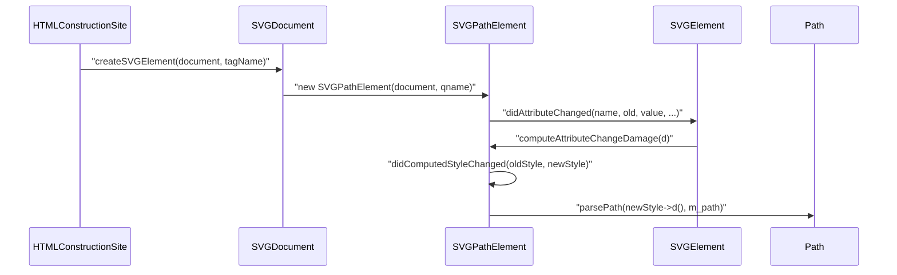
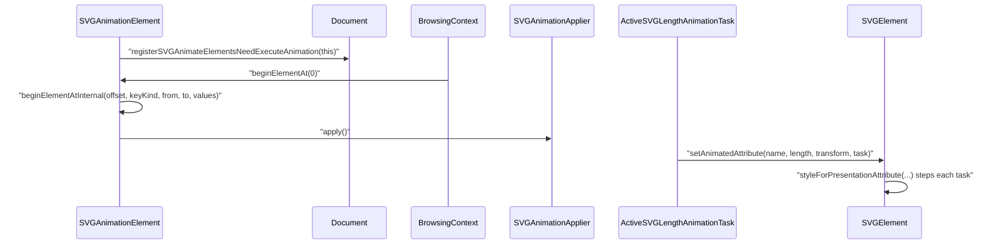
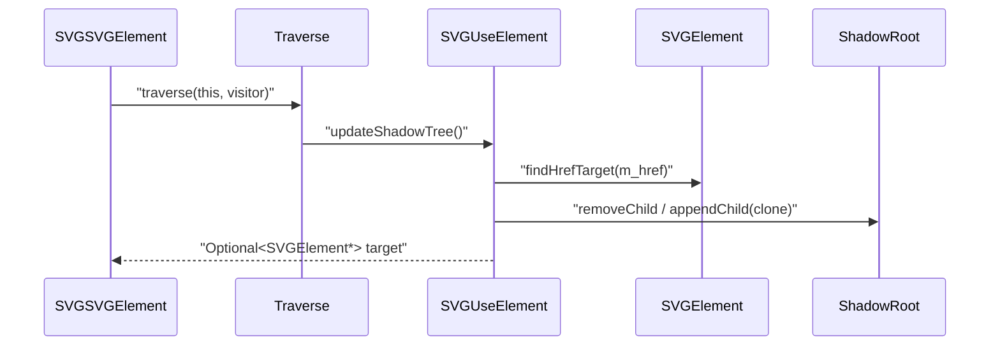

# Module Design Card: core-dom-svg

> **Relevant source files**
>
> - [src/core/dom/svg/SVGAngle.cpp](src:src/core/dom/svg/SVGAngle.cpp)
> - [src/core/dom/svg/SVGAngle.h](src:src/core/dom/svg/SVGAngle.h)
> - [src/core/dom/svg/SVGAnimateElement.cpp](src:src/core/dom/svg/SVGAnimateElement.cpp)
> - [src/core/dom/svg/SVGAnimateElement.h](src:src/core/dom/svg/SVGAnimateElement.h)
> - [src/core/dom/svg/SVGAnimateMotionElement.cpp](src:src/core/dom/svg/SVGAnimateMotionElement.cpp)
> - [src/core/dom/svg/SVGAnimateMotionElement.h](src:src/core/dom/svg/SVGAnimateMotionElement.h)
> - [src/core/dom/svg/SVGAnimateTransformElement.cpp](src:src/core/dom/svg/SVGAnimateTransformElement.cpp)
> - [src/core/dom/svg/SVGAnimateTransformElement.h](src:src/core/dom/svg/SVGAnimateTransformElement.h)
> - [src/core/dom/svg/SVGAnimatedAngle.cpp](src:src/core/dom/svg/SVGAnimatedAngle.cpp)
> - [src/core/dom/svg/SVGAnimatedAngle.h](src:src/core/dom/svg/SVGAnimatedAngle.h)
> - [src/core/dom/svg/SVGAnimatedBoolean.cpp](src:src/core/dom/svg/SVGAnimatedBoolean.cpp)
> - [src/core/dom/svg/SVGAnimatedBoolean.h](src:src/core/dom/svg/SVGAnimatedBoolean.h)
> - [src/core/dom/svg/SVGAnimatedEnumeration.cpp](src:src/core/dom/svg/SVGAnimatedEnumeration.cpp)
> - [src/core/dom/svg/SVGAnimatedEnumeration.h](src:src/core/dom/svg/SVGAnimatedEnumeration.h)
> - [src/core/dom/svg/SVGAnimatedInteger.cpp](src:src/core/dom/svg/SVGAnimatedInteger.cpp)
> - [src/core/dom/svg/SVGAnimatedInteger.h](src:src/core/dom/svg/SVGAnimatedInteger.h)
> - [src/core/dom/svg/SVGAnimatedLength.cpp](src:src/core/dom/svg/SVGAnimatedLength.cpp)
> - [src/core/dom/svg/SVGAnimatedLength.h](src:src/core/dom/svg/SVGAnimatedLength.h)
> - [src/core/dom/svg/SVGAnimatedLengthList.cpp](src:src/core/dom/svg/SVGAnimatedLengthList.cpp)
> - [src/core/dom/svg/SVGAnimatedLengthList.h](src:src/core/dom/svg/SVGAnimatedLengthList.h)
> - [src/core/dom/svg/SVGAnimatedNumber.cpp](src:src/core/dom/svg/SVGAnimatedNumber.cpp)
> - [src/core/dom/svg/SVGAnimatedNumber.h](src:src/core/dom/svg/SVGAnimatedNumber.h)
> - [src/core/dom/svg/SVGAnimatedNumberList.cpp](src:src/core/dom/svg/SVGAnimatedNumberList.cpp)
> - [src/core/dom/svg/SVGAnimatedNumberList.h](src:src/core/dom/svg/SVGAnimatedNumberList.h)
> - [src/core/dom/svg/SVGAnimatedString.cpp](src:src/core/dom/svg/SVGAnimatedString.cpp)
> - [src/core/dom/svg/SVGAnimatedString.h](src:src/core/dom/svg/SVGAnimatedString.h)
> - [src/core/dom/svg/SVGAnimatedTransformList.cpp](src:src/core/dom/svg/SVGAnimatedTransformList.cpp)
> - [src/core/dom/svg/SVGAnimatedTransformList.h](src:src/core/dom/svg/SVGAnimatedTransformList.h)
> - [src/core/dom/svg/SVGAnimationElement.cpp](src:src/core/dom/svg/SVGAnimationElement.cpp)
> - [src/core/dom/svg/SVGAnimationElement.h](src:src/core/dom/svg/SVGAnimationElement.h)
> - [src/core/dom/svg/SVGCircleElement.cpp](src:src/core/dom/svg/SVGCircleElement.cpp)
> - [src/core/dom/svg/SVGCircleElement.h](src:src/core/dom/svg/SVGCircleElement.h)
> - [src/core/dom/svg/SVGClipPathElement.cpp](src:src/core/dom/svg/SVGClipPathElement.cpp)
> - [src/core/dom/svg/SVGClipPathElement.h](src:src/core/dom/svg/SVGClipPathElement.h)
> - [src/core/dom/svg/SVGComponentTransferFunctionElement.cpp](src:src/core/dom/svg/SVGComponentTransferFunctionElement.cpp)
> - [src/core/dom/svg/SVGComponentTransferFunctionElement.h](src:src/core/dom/svg/SVGComponentTransferFunctionElement.h)
> - [src/core/dom/svg/SVGDefsElement.h](src:src/core/dom/svg/SVGDefsElement.h)
> - [src/core/dom/svg/SVGDocument.cpp](src:src/core/dom/svg/SVGDocument.cpp)
> - [src/core/dom/svg/SVGDocument.h](src:src/core/dom/svg/SVGDocument.h)
> - [src/core/dom/svg/SVGElement.cpp](src:src/core/dom/svg/SVGElement.cpp)
> - [src/core/dom/svg/SVGElement.h](src:src/core/dom/svg/SVGElement.h)
> - [src/core/dom/svg/SVGEllipseElement.cpp](src:src/core/dom/svg/SVGEllipseElement.cpp)
> - [src/core/dom/svg/SVGEllipseElement.h](src:src/core/dom/svg/SVGEllipseElement.h)
> - [src/core/dom/svg/SVGFEColorMatrixElement.cpp](src:src/core/dom/svg/SVGFEColorMatrixElement.cpp)
> - [src/core/dom/svg/SVGFEColorMatrixElement.h](src:src/core/dom/svg/SVGFEColorMatrixElement.h)
> - [src/core/dom/svg/SVGFEComponentTransferElement.cpp](src:src/core/dom/svg/SVGFEComponentTransferElement.cpp)
> - [src/core/dom/svg/SVGFEComponentTransferElement.h](src:src/core/dom/svg/SVGFEComponentTransferElement.h)
> - [src/core/dom/svg/SVGFECompositeElement.cpp](src:src/core/dom/svg/SVGFECompositeElement.cpp)
> - [src/core/dom/svg/SVGFECompositeElement.h](src:src/core/dom/svg/SVGFECompositeElement.h)
> - [src/core/dom/svg/SVGFEDisplacementMapElement.cpp](src:src/core/dom/svg/SVGFEDisplacementMapElement.cpp)
> - [src/core/dom/svg/SVGFEDisplacementMapElement.h](src:src/core/dom/svg/SVGFEDisplacementMapElement.h)
> - [src/core/dom/svg/SVGFEFloodElement.cpp](src:src/core/dom/svg/SVGFEFloodElement.cpp)
> - [src/core/dom/svg/SVGFEFloodElement.h](src:src/core/dom/svg/SVGFEFloodElement.h)
> - [src/core/dom/svg/SVGFEGaussianBlurElement.cpp](src:src/core/dom/svg/SVGFEGaussianBlurElement.cpp)
> - [src/core/dom/svg/SVGFEGaussianBlurElement.h](src:src/core/dom/svg/SVGFEGaussianBlurElement.h)
> - [src/core/dom/svg/SVGFEMergeElement.cpp](src:src/core/dom/svg/SVGFEMergeElement.cpp)
> - [src/core/dom/svg/SVGFEMergeElement.h](src:src/core/dom/svg/SVGFEMergeElement.h)
> - [src/core/dom/svg/SVGFEMergeNodeElement.cpp](src:src/core/dom/svg/SVGFEMergeNodeElement.cpp)
> - [src/core/dom/svg/SVGFEMergeNodeElement.h](src:src/core/dom/svg/SVGFEMergeNodeElement.h)
> - [src/core/dom/svg/SVGFEMorphologyElement.cpp](src:src/core/dom/svg/SVGFEMorphologyElement.cpp)
> - [src/core/dom/svg/SVGFEMorphologyElement.h](src:src/core/dom/svg/SVGFEMorphologyElement.h)
> - [src/core/dom/svg/SVGFEOffsetElement.cpp](src:src/core/dom/svg/SVGFEOffsetElement.cpp)
> - [src/core/dom/svg/SVGFEOffsetElement.h](src:src/core/dom/svg/SVGFEOffsetElement.h)
> - [src/core/dom/svg/SVGFETurbulenceElement.cpp](src:src/core/dom/svg/SVGFETurbulenceElement.cpp)
> - [src/core/dom/svg/SVGFETurbulenceElement.h](src:src/core/dom/svg/SVGFETurbulenceElement.h)
> - [src/core/dom/svg/SVGFilterElement.cpp](src:src/core/dom/svg/SVGFilterElement.cpp)
> - [src/core/dom/svg/SVGFilterElement.h](src:src/core/dom/svg/SVGFilterElement.h)
> - [src/core/dom/svg/SVGFilterPrimitiveStandardAttributes.cpp](src:src/core/dom/svg/SVGFilterPrimitiveStandardAttributes.cpp)
> - [src/core/dom/svg/SVGFilterPrimitiveStandardAttributes.h](src:src/core/dom/svg/SVGFilterPrimitiveStandardAttributes.h)
> - [src/core/dom/svg/SVGGElement.h](src:src/core/dom/svg/SVGGElement.h)
> - [src/core/dom/svg/SVGGradientElement.cpp](src:src/core/dom/svg/SVGGradientElement.cpp)
> - [src/core/dom/svg/SVGGradientElement.h](src:src/core/dom/svg/SVGGradientElement.h)
> - [src/core/dom/svg/SVGImageElement.cpp](src:src/core/dom/svg/SVGImageElement.cpp)
> - [src/core/dom/svg/SVGImageElement.h](src:src/core/dom/svg/SVGImageElement.h)
> - [src/core/dom/svg/SVGLength.cpp](src:src/core/dom/svg/SVGLength.cpp)
> - [src/core/dom/svg/SVGLength.h](src:src/core/dom/svg/SVGLength.h)
> - [src/core/dom/svg/SVGLengthList.cpp](src:src/core/dom/svg/SVGLengthList.cpp)
> - [src/core/dom/svg/SVGLengthList.h](src:src/core/dom/svg/SVGLengthList.h)
> - [src/core/dom/svg/SVGLineElement.cpp](src:src/core/dom/svg/SVGLineElement.cpp)
> - [src/core/dom/svg/SVGLineElement.h](src:src/core/dom/svg/SVGLineElement.h)
> - [src/core/dom/svg/SVGLinearGradientElement.cpp](src:src/core/dom/svg/SVGLinearGradientElement.cpp)
> - [src/core/dom/svg/SVGLinearGradientElement.h](src:src/core/dom/svg/SVGLinearGradientElement.h)
> - [src/core/dom/svg/SVGMPathElement.cpp](src:src/core/dom/svg/SVGMPathElement.cpp)
> - [src/core/dom/svg/SVGMPathElement.h](src:src/core/dom/svg/SVGMPathElement.h)
> - [src/core/dom/svg/SVGMarkerElement.cpp](src:src/core/dom/svg/SVGMarkerElement.cpp)
> - [src/core/dom/svg/SVGMarkerElement.h](src:src/core/dom/svg/SVGMarkerElement.h)
> - [src/core/dom/svg/SVGMaskElement.cpp](src:src/core/dom/svg/SVGMaskElement.cpp)
> - [src/core/dom/svg/SVGMaskElement.h](src:src/core/dom/svg/SVGMaskElement.h)
> - [src/core/dom/svg/SVGNumber.cpp](src:src/core/dom/svg/SVGNumber.cpp)
> - [src/core/dom/svg/SVGNumber.h](src:src/core/dom/svg/SVGNumber.h)
> - [src/core/dom/svg/SVGNumberList.cpp](src:src/core/dom/svg/SVGNumberList.cpp)
> - [src/core/dom/svg/SVGNumberList.h](src:src/core/dom/svg/SVGNumberList.h)
> - [src/core/dom/svg/SVGPathElement.cpp](src:src/core/dom/svg/SVGPathElement.cpp)
> - [src/core/dom/svg/SVGPathElement.h](src:src/core/dom/svg/SVGPathElement.h)
> - [src/core/dom/svg/SVGPolygonElement.cpp](src:src/core/dom/svg/SVGPolygonElement.cpp)
> - [src/core/dom/svg/SVGPolygonElement.h](src:src/core/dom/svg/SVGPolygonElement.h)
> - [src/core/dom/svg/SVGPolylineElement.cpp](src:src/core/dom/svg/SVGPolylineElement.cpp)
> - [src/core/dom/svg/SVGPolylineElement.h](src:src/core/dom/svg/SVGPolylineElement.h)
> - [src/core/dom/svg/SVGRadialGradientElement.cpp](src:src/core/dom/svg/SVGRadialGradientElement.cpp)
> - [src/core/dom/svg/SVGRadialGradientElement.h](src:src/core/dom/svg/SVGRadialGradientElement.h)
> - [src/core/dom/svg/SVGRectElement.cpp](src:src/core/dom/svg/SVGRectElement.cpp)
> - [src/core/dom/svg/SVGRectElement.h](src:src/core/dom/svg/SVGRectElement.h)
> - [src/core/dom/svg/SVGSVGElement.cpp](src:src/core/dom/svg/SVGSVGElement.cpp)
> - [src/core/dom/svg/SVGSVGElement.h](src:src/core/dom/svg/SVGSVGElement.h)
> - [src/core/dom/svg/SVGScriptElement.cpp](src:src/core/dom/svg/SVGScriptElement.cpp)
> - [src/core/dom/svg/SVGScriptElement.h](src:src/core/dom/svg/SVGScriptElement.h)
> - [src/core/dom/svg/SVGStopElement.cpp](src:src/core/dom/svg/SVGStopElement.cpp)
> - [src/core/dom/svg/SVGStopElement.h](src:src/core/dom/svg/SVGStopElement.h)
> - [src/core/dom/svg/SVGStyleElement.cpp](src:src/core/dom/svg/SVGStyleElement.cpp)
> - [src/core/dom/svg/SVGStyleElement.h](src:src/core/dom/svg/SVGStyleElement.h)
> - [src/core/dom/svg/SVGSwitchElement.cpp](src:src/core/dom/svg/SVGSwitchElement.cpp)
> - [src/core/dom/svg/SVGSwitchElement.h](src:src/core/dom/svg/SVGSwitchElement.h)
> - [src/core/dom/svg/SVGSymbolElement.cpp](src:src/core/dom/svg/SVGSymbolElement.cpp)
> - [src/core/dom/svg/SVGSymbolElement.h](src:src/core/dom/svg/SVGSymbolElement.h)
> - [src/core/dom/svg/SVGTSpanElement.cpp](src:src/core/dom/svg/SVGTSpanElement.cpp)
> - [src/core/dom/svg/SVGTSpanElement.h](src:src/core/dom/svg/SVGTSpanElement.h)
> - [src/core/dom/svg/SVGTextElement.cpp](src:src/core/dom/svg/SVGTextElement.cpp)
> - [src/core/dom/svg/SVGTextElement.h](src:src/core/dom/svg/SVGTextElement.h)
> - [src/core/dom/svg/SVGTransform.cpp](src:src/core/dom/svg/SVGTransform.cpp)
> - [src/core/dom/svg/SVGTransform.h](src:src/core/dom/svg/SVGTransform.h)
> - [src/core/dom/svg/SVGTransformList.cpp](src:src/core/dom/svg/SVGTransformList.cpp)
> - [src/core/dom/svg/SVGTransformList.h](src:src/core/dom/svg/SVGTransformList.h)
> - [src/core/dom/svg/SVGUnitTypes.h](src:src/core/dom/svg/SVGUnitTypes.h)
> - [src/core/dom/svg/SVGUseElement.cpp](src:src/core/dom/svg/SVGUseElement.cpp)
> - [src/core/dom/svg/SVGUseElement.h](src:src/core/dom/svg/SVGUseElement.h)
> - [src/core/dom/Document.h](src:src/core/dom/Document.h)
> - [src/core/dom/Document.cpp](src:src/core/dom/Document.cpp)
> - [src/core/dom/Element.cpp](src:src/core/dom/Element.cpp)
> - [src/core/dom/DOMParser.cpp](src:src/core/dom/DOMParser.cpp)
> - [src/core/dom/parser/HTMLConstructionSite.cpp](src:src/core/dom/parser/HTMLConstructionSite.cpp)
> - [src/core/page/BrowsingContext.cpp](src:src/core/page/BrowsingContext.cpp)
> - [src/core/animation/AnimationTask.h](src:src/core/animation/AnimationTask.h)
> - [src/core/animation/AnimationTask.cpp](src:src/core/animation/AnimationTask.cpp)
> - [src/core/animation/SVGAnimationApplier.cpp](src:src/core/animation/SVGAnimationApplier.cpp)
> - [src/core/layout/svg/FrameTreeBuilderSVG.cpp](src:src/core/layout/svg/FrameTreeBuilderSVG.cpp)
> - [src/core/layout/svg/FrameSVGBox.cpp](src:src/core/layout/svg/FrameSVGBox.cpp)
> - [src/core/layout/svg/FrameSVGPathBox.cpp](src:src/core/layout/svg/FrameSVGPathBox.cpp)
> - [src/core/layout/svg/FrameSVGSVGBox.cpp](src:src/core/layout/svg/FrameSVGSVGBox.cpp)
> - [src/core/layout/FrameReplaced.cpp](src:src/core/layout/FrameReplaced.cpp)
> - [src/core/layout/StackingContext.cpp](src:src/core/layout/StackingContext.cpp)
> - [src/core/style/Style.cpp](src:src/core/style/Style.cpp)
> - [src/core/modules/canvas/filter/Filter.cpp](src:src/core/modules/canvas/filter/Filter.cpp)
> - [src/core/modules/canvas/filter/FilterGaussianBlur.cpp](src:src/core/modules/canvas/filter/FilterGaussianBlur.cpp)
> - [src/platform/loader/ImageResource.cpp](src:src/platform/loader/ImageResource.cpp)
> - [src/platform/canvas/image/SVGNativeImageDataImpl.cpp](src:src/platform/canvas/image/SVGNativeImageDataImpl.cpp)
> - [src/core/modules/canvas/filter/FilterColorMatrix.cpp](src:src/core/modules/canvas/filter/FilterColorMatrix.cpp)

**Module**: `core-dom-svg` — 125 files under `src/core/dom/svg/`
**Role**: Implements the SVG element subtree of the DOM: the [`SVGElement`](src:src/core/dom/svg/SVGElement.h#L97) base class (derived from `Element`), the concrete `SVG*Element` classes created by the tag-name factory [`SVGDocument::createSVGElement`](src:src/core/dom/svg/SVGDocument.cpp#L67), the script-exposed value types such as [`SVGLength`](src:src/core/dom/svg/SVGLength.h#L30) and [`SVGAnimatedLength`](src:src/core/dom/svg/SVGAnimatedLength.h#L28), and the declarative animation elements rooted at [`SVGAnimationElement`](src:src/core/dom/svg/SVGAnimationElement.h#L52).
**Module Boundary**: SVG element DOM subtree (SVGAngle, SVGAnimateElement, ...) is a large self-contained sibling directory (125 files)
**Confidence**: 0.93
**Core selection**: All approved modules are Core (boundary approved in W1 human review)
**Generated**: 2026-09-10

## Source Files

### Base element, document and factory (6 files)
- [src/core/dom/svg/SVGDocument.cpp](src:src/core/dom/svg/SVGDocument.cpp)
- [src/core/dom/svg/SVGDocument.h](src:src/core/dom/svg/SVGDocument.h)
- [src/core/dom/svg/SVGElement.cpp](src:src/core/dom/svg/SVGElement.cpp)
- [src/core/dom/svg/SVGElement.h](src:src/core/dom/svg/SVGElement.h)
- [src/core/dom/svg/SVGSVGElement.cpp](src:src/core/dom/svg/SVGSVGElement.cpp)
- [src/core/dom/svg/SVGSVGElement.h](src:src/core/dom/svg/SVGSVGElement.h)

### Element hierarchy (shapes, structure, text, paint servers) (48 files)
- [src/core/dom/svg/SVGCircleElement.cpp](src:src/core/dom/svg/SVGCircleElement.cpp)
- [src/core/dom/svg/SVGCircleElement.h](src:src/core/dom/svg/SVGCircleElement.h)
- [src/core/dom/svg/SVGClipPathElement.cpp](src:src/core/dom/svg/SVGClipPathElement.cpp)
- [src/core/dom/svg/SVGClipPathElement.h](src:src/core/dom/svg/SVGClipPathElement.h)
- [src/core/dom/svg/SVGDefsElement.h](src:src/core/dom/svg/SVGDefsElement.h)
- [src/core/dom/svg/SVGEllipseElement.cpp](src:src/core/dom/svg/SVGEllipseElement.cpp)
- [src/core/dom/svg/SVGEllipseElement.h](src:src/core/dom/svg/SVGEllipseElement.h)
- [src/core/dom/svg/SVGGElement.h](src:src/core/dom/svg/SVGGElement.h)
- [src/core/dom/svg/SVGGradientElement.cpp](src:src/core/dom/svg/SVGGradientElement.cpp)
- [src/core/dom/svg/SVGGradientElement.h](src:src/core/dom/svg/SVGGradientElement.h)
- [src/core/dom/svg/SVGImageElement.cpp](src:src/core/dom/svg/SVGImageElement.cpp)
- [src/core/dom/svg/SVGImageElement.h](src:src/core/dom/svg/SVGImageElement.h)
- [src/core/dom/svg/SVGLineElement.cpp](src:src/core/dom/svg/SVGLineElement.cpp)
- [src/core/dom/svg/SVGLineElement.h](src:src/core/dom/svg/SVGLineElement.h)
- [src/core/dom/svg/SVGLinearGradientElement.cpp](src:src/core/dom/svg/SVGLinearGradientElement.cpp)
- [src/core/dom/svg/SVGLinearGradientElement.h](src:src/core/dom/svg/SVGLinearGradientElement.h)
- [src/core/dom/svg/SVGMPathElement.cpp](src:src/core/dom/svg/SVGMPathElement.cpp)
- [src/core/dom/svg/SVGMPathElement.h](src:src/core/dom/svg/SVGMPathElement.h)
- [src/core/dom/svg/SVGMarkerElement.cpp](src:src/core/dom/svg/SVGMarkerElement.cpp)
- [src/core/dom/svg/SVGMarkerElement.h](src:src/core/dom/svg/SVGMarkerElement.h)
- [src/core/dom/svg/SVGMaskElement.cpp](src:src/core/dom/svg/SVGMaskElement.cpp)
- [src/core/dom/svg/SVGMaskElement.h](src:src/core/dom/svg/SVGMaskElement.h)
- [src/core/dom/svg/SVGPathElement.cpp](src:src/core/dom/svg/SVGPathElement.cpp)
- [src/core/dom/svg/SVGPathElement.h](src:src/core/dom/svg/SVGPathElement.h)
- [src/core/dom/svg/SVGPolygonElement.cpp](src:src/core/dom/svg/SVGPolygonElement.cpp)
- [src/core/dom/svg/SVGPolygonElement.h](src:src/core/dom/svg/SVGPolygonElement.h)
- [src/core/dom/svg/SVGPolylineElement.cpp](src:src/core/dom/svg/SVGPolylineElement.cpp)
- [src/core/dom/svg/SVGPolylineElement.h](src:src/core/dom/svg/SVGPolylineElement.h)
- [src/core/dom/svg/SVGRadialGradientElement.cpp](src:src/core/dom/svg/SVGRadialGradientElement.cpp)
- [src/core/dom/svg/SVGRadialGradientElement.h](src:src/core/dom/svg/SVGRadialGradientElement.h)
- [src/core/dom/svg/SVGRectElement.cpp](src:src/core/dom/svg/SVGRectElement.cpp)
- [src/core/dom/svg/SVGRectElement.h](src:src/core/dom/svg/SVGRectElement.h)
- [src/core/dom/svg/SVGScriptElement.cpp](src:src/core/dom/svg/SVGScriptElement.cpp)
- [src/core/dom/svg/SVGScriptElement.h](src:src/core/dom/svg/SVGScriptElement.h)
- [src/core/dom/svg/SVGStopElement.cpp](src:src/core/dom/svg/SVGStopElement.cpp)
- [src/core/dom/svg/SVGStopElement.h](src:src/core/dom/svg/SVGStopElement.h)
- [src/core/dom/svg/SVGStyleElement.cpp](src:src/core/dom/svg/SVGStyleElement.cpp)
- [src/core/dom/svg/SVGStyleElement.h](src:src/core/dom/svg/SVGStyleElement.h)
- [src/core/dom/svg/SVGSwitchElement.cpp](src:src/core/dom/svg/SVGSwitchElement.cpp)
- [src/core/dom/svg/SVGSwitchElement.h](src:src/core/dom/svg/SVGSwitchElement.h)
- [src/core/dom/svg/SVGSymbolElement.cpp](src:src/core/dom/svg/SVGSymbolElement.cpp)
- [src/core/dom/svg/SVGSymbolElement.h](src:src/core/dom/svg/SVGSymbolElement.h)
- [src/core/dom/svg/SVGTSpanElement.cpp](src:src/core/dom/svg/SVGTSpanElement.cpp)
- [src/core/dom/svg/SVGTSpanElement.h](src:src/core/dom/svg/SVGTSpanElement.h)
- [src/core/dom/svg/SVGTextElement.cpp](src:src/core/dom/svg/SVGTextElement.cpp)
- [src/core/dom/svg/SVGTextElement.h](src:src/core/dom/svg/SVGTextElement.h)
- [src/core/dom/svg/SVGUseElement.cpp](src:src/core/dom/svg/SVGUseElement.cpp)
- [src/core/dom/svg/SVGUseElement.h](src:src/core/dom/svg/SVGUseElement.h)

### Filter elements (28 files)
- [src/core/dom/svg/SVGComponentTransferFunctionElement.cpp](src:src/core/dom/svg/SVGComponentTransferFunctionElement.cpp)
- [src/core/dom/svg/SVGComponentTransferFunctionElement.h](src:src/core/dom/svg/SVGComponentTransferFunctionElement.h)
- [src/core/dom/svg/SVGFEColorMatrixElement.cpp](src:src/core/dom/svg/SVGFEColorMatrixElement.cpp)
- [src/core/dom/svg/SVGFEColorMatrixElement.h](src:src/core/dom/svg/SVGFEColorMatrixElement.h)
- [src/core/dom/svg/SVGFEComponentTransferElement.cpp](src:src/core/dom/svg/SVGFEComponentTransferElement.cpp)
- [src/core/dom/svg/SVGFEComponentTransferElement.h](src:src/core/dom/svg/SVGFEComponentTransferElement.h)
- [src/core/dom/svg/SVGFECompositeElement.cpp](src:src/core/dom/svg/SVGFECompositeElement.cpp)
- [src/core/dom/svg/SVGFECompositeElement.h](src:src/core/dom/svg/SVGFECompositeElement.h)
- [src/core/dom/svg/SVGFEDisplacementMapElement.cpp](src:src/core/dom/svg/SVGFEDisplacementMapElement.cpp)
- [src/core/dom/svg/SVGFEDisplacementMapElement.h](src:src/core/dom/svg/SVGFEDisplacementMapElement.h)
- [src/core/dom/svg/SVGFEFloodElement.cpp](src:src/core/dom/svg/SVGFEFloodElement.cpp)
- [src/core/dom/svg/SVGFEFloodElement.h](src:src/core/dom/svg/SVGFEFloodElement.h)
- [src/core/dom/svg/SVGFEGaussianBlurElement.cpp](src:src/core/dom/svg/SVGFEGaussianBlurElement.cpp)
- [src/core/dom/svg/SVGFEGaussianBlurElement.h](src:src/core/dom/svg/SVGFEGaussianBlurElement.h)
- [src/core/dom/svg/SVGFEMergeElement.cpp](src:src/core/dom/svg/SVGFEMergeElement.cpp)
- [src/core/dom/svg/SVGFEMergeElement.h](src:src/core/dom/svg/SVGFEMergeElement.h)
- [src/core/dom/svg/SVGFEMergeNodeElement.cpp](src:src/core/dom/svg/SVGFEMergeNodeElement.cpp)
- [src/core/dom/svg/SVGFEMergeNodeElement.h](src:src/core/dom/svg/SVGFEMergeNodeElement.h)
- [src/core/dom/svg/SVGFEMorphologyElement.cpp](src:src/core/dom/svg/SVGFEMorphologyElement.cpp)
- [src/core/dom/svg/SVGFEMorphologyElement.h](src:src/core/dom/svg/SVGFEMorphologyElement.h)
- [src/core/dom/svg/SVGFEOffsetElement.cpp](src:src/core/dom/svg/SVGFEOffsetElement.cpp)
- [src/core/dom/svg/SVGFEOffsetElement.h](src:src/core/dom/svg/SVGFEOffsetElement.h)
- [src/core/dom/svg/SVGFETurbulenceElement.cpp](src:src/core/dom/svg/SVGFETurbulenceElement.cpp)
- [src/core/dom/svg/SVGFETurbulenceElement.h](src:src/core/dom/svg/SVGFETurbulenceElement.h)
- [src/core/dom/svg/SVGFilterElement.cpp](src:src/core/dom/svg/SVGFilterElement.cpp)
- [src/core/dom/svg/SVGFilterElement.h](src:src/core/dom/svg/SVGFilterElement.h)
- [src/core/dom/svg/SVGFilterPrimitiveStandardAttributes.cpp](src:src/core/dom/svg/SVGFilterPrimitiveStandardAttributes.cpp)
- [src/core/dom/svg/SVGFilterPrimitiveStandardAttributes.h](src:src/core/dom/svg/SVGFilterPrimitiveStandardAttributes.h)

### Animation elements (8 files)
- [src/core/dom/svg/SVGAnimateElement.cpp](src:src/core/dom/svg/SVGAnimateElement.cpp)
- [src/core/dom/svg/SVGAnimateElement.h](src:src/core/dom/svg/SVGAnimateElement.h)
- [src/core/dom/svg/SVGAnimateMotionElement.cpp](src:src/core/dom/svg/SVGAnimateMotionElement.cpp)
- [src/core/dom/svg/SVGAnimateMotionElement.h](src:src/core/dom/svg/SVGAnimateMotionElement.h)
- [src/core/dom/svg/SVGAnimateTransformElement.cpp](src:src/core/dom/svg/SVGAnimateTransformElement.cpp)
- [src/core/dom/svg/SVGAnimateTransformElement.h](src:src/core/dom/svg/SVGAnimateTransformElement.h)
- [src/core/dom/svg/SVGAnimationElement.cpp](src:src/core/dom/svg/SVGAnimationElement.cpp)
- [src/core/dom/svg/SVGAnimationElement.h](src:src/core/dom/svg/SVGAnimationElement.h)

### Value and list types (SVG*, SVGAnimated*) (35 files)
- [src/core/dom/svg/SVGAngle.cpp](src:src/core/dom/svg/SVGAngle.cpp)
- [src/core/dom/svg/SVGAngle.h](src:src/core/dom/svg/SVGAngle.h)
- [src/core/dom/svg/SVGAnimatedAngle.cpp](src:src/core/dom/svg/SVGAnimatedAngle.cpp)
- [src/core/dom/svg/SVGAnimatedAngle.h](src:src/core/dom/svg/SVGAnimatedAngle.h)
- [src/core/dom/svg/SVGAnimatedBoolean.cpp](src:src/core/dom/svg/SVGAnimatedBoolean.cpp)
- [src/core/dom/svg/SVGAnimatedBoolean.h](src:src/core/dom/svg/SVGAnimatedBoolean.h)
- [src/core/dom/svg/SVGAnimatedEnumeration.cpp](src:src/core/dom/svg/SVGAnimatedEnumeration.cpp)
- [src/core/dom/svg/SVGAnimatedEnumeration.h](src:src/core/dom/svg/SVGAnimatedEnumeration.h)
- [src/core/dom/svg/SVGAnimatedInteger.cpp](src:src/core/dom/svg/SVGAnimatedInteger.cpp)
- [src/core/dom/svg/SVGAnimatedInteger.h](src:src/core/dom/svg/SVGAnimatedInteger.h)
- [src/core/dom/svg/SVGAnimatedLength.cpp](src:src/core/dom/svg/SVGAnimatedLength.cpp)
- [src/core/dom/svg/SVGAnimatedLength.h](src:src/core/dom/svg/SVGAnimatedLength.h)
- [src/core/dom/svg/SVGAnimatedLengthList.cpp](src:src/core/dom/svg/SVGAnimatedLengthList.cpp)
- [src/core/dom/svg/SVGAnimatedLengthList.h](src:src/core/dom/svg/SVGAnimatedLengthList.h)
- [src/core/dom/svg/SVGAnimatedNumber.cpp](src:src/core/dom/svg/SVGAnimatedNumber.cpp)
- [src/core/dom/svg/SVGAnimatedNumber.h](src:src/core/dom/svg/SVGAnimatedNumber.h)
- [src/core/dom/svg/SVGAnimatedNumberList.cpp](src:src/core/dom/svg/SVGAnimatedNumberList.cpp)
- [src/core/dom/svg/SVGAnimatedNumberList.h](src:src/core/dom/svg/SVGAnimatedNumberList.h)
- [src/core/dom/svg/SVGAnimatedString.cpp](src:src/core/dom/svg/SVGAnimatedString.cpp)
- [src/core/dom/svg/SVGAnimatedString.h](src:src/core/dom/svg/SVGAnimatedString.h)
- [src/core/dom/svg/SVGAnimatedTransformList.cpp](src:src/core/dom/svg/SVGAnimatedTransformList.cpp)
- [src/core/dom/svg/SVGAnimatedTransformList.h](src:src/core/dom/svg/SVGAnimatedTransformList.h)
- [src/core/dom/svg/SVGLength.cpp](src:src/core/dom/svg/SVGLength.cpp)
- [src/core/dom/svg/SVGLength.h](src:src/core/dom/svg/SVGLength.h)
- [src/core/dom/svg/SVGLengthList.cpp](src:src/core/dom/svg/SVGLengthList.cpp)
- [src/core/dom/svg/SVGLengthList.h](src:src/core/dom/svg/SVGLengthList.h)
- [src/core/dom/svg/SVGNumber.cpp](src:src/core/dom/svg/SVGNumber.cpp)
- [src/core/dom/svg/SVGNumber.h](src:src/core/dom/svg/SVGNumber.h)
- [src/core/dom/svg/SVGNumberList.cpp](src:src/core/dom/svg/SVGNumberList.cpp)
- [src/core/dom/svg/SVGNumberList.h](src:src/core/dom/svg/SVGNumberList.h)
- [src/core/dom/svg/SVGTransform.cpp](src:src/core/dom/svg/SVGTransform.cpp)
- [src/core/dom/svg/SVGTransform.h](src:src/core/dom/svg/SVGTransform.h)
- [src/core/dom/svg/SVGTransformList.cpp](src:src/core/dom/svg/SVGTransformList.cpp)
- [src/core/dom/svg/SVGTransformList.h](src:src/core/dom/svg/SVGTransformList.h)
- [src/core/dom/svg/SVGUnitTypes.h](src:src/core/dom/svg/SVGUnitTypes.h)

## Public Interface

| Function/Class | Signature | Main callers | Source |
|---|---|---|---|
| `SVGDocument::createSVGElement` | `static Element* createSVGElement(Document* document, const QualifiedName& localName)` | [`HTMLConstructionSite::createElement`](src:src/core/dom/parser/HTMLConstructionSite.cpp#L928), [`Document::createElementNS`](src:src/core/dom/Document.cpp#L1144), [`Element::clone`](src:src/core/dom/Element.cpp#L2148), [`buildDocumentFromXML`](src:src/core/dom/DOMParser.cpp#L51) | [`SVGDocument::createSVGElement`](src:src/core/dom/svg/SVGDocument.cpp#L67) |
| `SVGElement` | `class SVGElement : public Element` | [`FrameTreeBuilder::buildSVGFrameTree`](src:src/core/layout/svg/FrameTreeBuilderSVG.cpp#L63), [`isSVGElementFrameTreeBuilderNeverFrames`](src:src/core/style/Style.cpp#L9681) | [`SVGElement`](src:src/core/dom/svg/SVGElement.h#L97) |
| `SVGElement::setAnimatedAttribute` | `void setAnimatedAttribute(AtomicString s, Optional<Length> rawLengthValue, Optional<StyleTransformData*> rawStringValue, ActiveSVGLengthAnimationTask* task)` | [`ActiveSVGLengthAnimationTask::execute`](src:src/core/animation/AnimationTask.cpp#L1768) | [`SVGElement::setAnimatedAttribute`](src:src/core/dom/svg/SVGElement.h#L249) |
| `SVGElement::removeAllAnimatedAttributesByTask` | `void removeAllAnimatedAttributesByTask(ActiveSVGLengthAnimationTask* task)` | [`ActiveSVGLengthAnimationTask::detachFromElement`](src:src/core/animation/AnimationTask.cpp#L1920) | [`SVGElement::removeAllAnimatedAttributesByTask`](src:src/core/dom/svg/SVGElement.h#L282) |
| `SVGElement::animatedLengthAttribute` | `Optional<Length> animatedLengthAttribute(AtomicString s) const` | [`FrameSVGBox.cpp`](src:src/core/layout/svg/FrameSVGBox.cpp#L147) | [`SVGElement::animatedLengthAttribute`](src:src/core/dom/svg/SVGElement.h#L298) |
| `SVGElement::clipPathElement` / `maskElement` / `filterElement` | `Optional<SVGClipPathElement*> clipPathElement(); Optional<SVGMaskElement*> maskElement(); Optional<SVGFilterElement*> filterElement()` | [`FrameSVGBox.cpp`](src:src/core/layout/svg/FrameSVGBox.cpp#L449), [`StackingContext.cpp`](src:src/core/layout/StackingContext.cpp#L193) | [`SVGElement::clipPathElement`](src:src/core/dom/svg/SVGElement.cpp#L536), [`SVGElement::maskElement`](src:src/core/dom/svg/SVGElement.cpp#L551), [`SVGElement::filterElement`](src:src/core/dom/svg/SVGElement.cpp#L569) |
| `SVGElement::needsGeometryAttributes` / `isShapeElement` / `isStructuralElement` | `virtual bool needsGeometryAttributes(); virtual bool isShapeElement(); virtual bool isStructuralElement()` | [`FrameSVGBox.cpp`](src:src/core/layout/svg/FrameSVGBox.cpp#L71) | [`SVGElement::needsGeometryAttributes`](src:src/core/dom/svg/SVGElement.h#L142), [`SVGElement::isShapeElement`](src:src/core/dom/svg/SVGElement.h#L188), [`SVGElement::isStructuralElement`](src:src/core/dom/svg/SVGElement.h#L194) |
| `SVGElement::hasViewBox` / `viewBox` | `virtual bool hasViewBox() const; virtual Unit::Rect viewBox() const` | [`FrameSVGSVGBox.cpp`](src:src/core/layout/svg/FrameSVGSVGBox.cpp#L161), [`FrameReplaced::contentSizeConsiderContainingBlockWidth`](src:src/core/layout/FrameReplaced.cpp#L404), [`SVGNativeImageDataImpl.cpp`](src:src/platform/canvas/image/SVGNativeImageDataImpl.cpp#L79) | [`SVGElement::hasViewBox`](src:src/core/dom/svg/SVGElement.h#L219), [`SVGSVGElement::viewBox`](src:src/core/dom/svg/SVGSVGElement.h#L83) |
| `SVGSVGElement::preserveAspectRatioAlign` | `NativeImageData::PreserveAspectRatioAlign preserveAspectRatioAlign()` | [`FrameSVGSVGBox.cpp`](src:src/core/layout/svg/FrameSVGSVGBox.cpp#L310) | [`SVGSVGElement::preserveAspectRatioAlign`](src:src/core/dom/svg/SVGSVGElement.cpp#L145) |
| `SVGSVGElement::connectUseElements` | `void connectUseElements()` | [`StyleResolver::resolveChildrenStyle`](src:src/core/style/Style.cpp#L10012) | [`SVGSVGElement::connectUseElements`](src:src/core/dom/svg/SVGSVGElement.cpp#L192) |
| `SVGSVGElement::useElementsPair` | `const GCVector<std::pair<SVGUseElement*, SVGElement*>>& useElementsPair()` | [`SVGElement::didNodeRemoved`](src:src/core/dom/svg/SVGElement.cpp#L289) | [`SVGSVGElement::useElementsPair`](src:src/core/dom/svg/SVGSVGElement.h#L110) |
| `SVGPathElement::path` | `Optional<Path*> path()` | [`FrameSVGPathBox::path`](src:src/core/layout/svg/FrameSVGPathBox.cpp#L51) | [`SVGPathElement::path`](src:src/core/dom/svg/SVGPathElement.h#L33) |
| `SVGPathElement::parsePath` | `static void parsePath(String* d, Path* path)` | [`SVGPathElement::didComputedStyleChanged`](src:src/core/dom/svg/SVGPathElement.cpp#L747), [`SVGAnimateMotionElement::beginElementAt`](src:src/core/dom/svg/SVGAnimateMotionElement.cpp#L69) | [`SVGPathElement::parsePath`](src:src/core/dom/svg/SVGPathElement.cpp#L396) |
| `SVGAnimationElement::beginElementAt` | `virtual void beginElementAt(float offset)` | [`BrowsingContext::resolveStyleIfNeeds`](src:src/core/page/BrowsingContext.cpp#L235) | [`SVGAnimationElement::beginElementAt`](src:src/core/dom/svg/SVGAnimationElement.cpp#L257) |
| `SVGAnimationElement::animationKeyframes` / `attributeNameAsString` | `Optional<AnimationKeyframes*> animationKeyframes(); Optional<String*> attributeNameAsString()` | [`SVGAnimationApplier::apply`](src:src/core/animation/SVGAnimationApplier.cpp#L47) | [`SVGAnimationElement::animationKeyframes`](src:src/core/dom/svg/SVGAnimationElement.h#L99), [`SVGAnimationElement::attributeNameAsString`](src:src/core/dom/svg/SVGAnimationElement.h#L104) |
| `SVGFilterElement::filter` | `Filter* filter()` | [`FrameSVGBox.cpp`](src:src/core/layout/svg/FrameSVGBox.cpp#L778) | [`SVGFilterElement::filter`](src:src/core/dom/svg/SVGFilterElement.cpp#L149) |
| `SVGFEGaussianBlurElement` (filter primitive accessors) | `class SVGFEGaussianBlurElement : public SVGFilterPrimitiveStandardAttributes` | [`FilterGaussianBlur.cpp`](src:src/core/modules/canvas/filter/FilterGaussianBlur.cpp#L1145), [`Filter::chainDownsampleFactor`](src:src/core/modules/canvas/filter/Filter.cpp#L244) | [`SVGFEGaussianBlurElement`](src:src/core/dom/svg/SVGFEGaussianBlurElement.h#L28) |
| `SVGAnimatedNumberList` | `class SVGAnimatedNumberList : public ScriptWrappable` | [`FilterColorMatrix.cpp`](src:src/core/modules/canvas/filter/FilterColorMatrix.cpp#L31) and sibling filter files | [`SVGAnimatedNumberList`](src:src/core/dom/svg/SVGAnimatedNumberList.h#L28) |
| `SVGLength` | `class SVGLength : public ScriptWrappable` | [`SVGAnimatedLength`](src:src/core/dom/svg/SVGAnimatedLength.h#L28), the `STARFISH_SVG_ANIMATED_LENGTH_GETTER` macro | [`SVGLength`](src:src/core/dom/svg/SVGLength.h#L30) |
| `SVGUseElement::updateShadowTree` | `Optional<SVGElement*> updateShadowTree()` | [`SVGSVGElement::connectUseElements`](src:src/core/dom/svg/SVGSVGElement.cpp#L192) | [`SVGUseElement::updateShadowTree`](src:src/core/dom/svg/SVGUseElement.cpp#L68) |

## IPC / Message / Interface Contracts

- No cross-module IPC or message contract is identifiable in code for this module.

## Key Flow

Entry point: [`SVGDocument::createSVGElement`](src:src/core/dom/svg/SVGDocument.cpp#L67) instantiates the concrete element; attribute changes reach [`SVGElement::didAttributeChanged`](src:src/core/dom/svg/SVGElement.cpp#L197), and the path geometry is rebuilt in [`SVGPathElement::didComputedStyleChanged`](src:src/core/dom/svg/SVGPathElement.cpp#L747).

Entry point: [`SVGAnimationElement::beginElement`](src:src/core/dom/svg/SVGAnimationElement.cpp#L252) is called from [`SVGAnimationElement::didNodeInsertedToDocumentTree`](src:src/core/dom/svg/SVGAnimationElement.cpp#L91); the pending list is drained in [`BrowsingContext::resolveStyleIfNeeds`](src:src/core/page/BrowsingContext.cpp#L235), and animated values are consumed by [`SVGElement::styleForPresentationAttribute`](src:src/core/dom/svg/SVGElement.cpp#L364).

Entry point: [`SVGSVGElement::connectUseElements`](src:src/core/dom/svg/SVGSVGElement.cpp#L192) rebuilds `m_useElementsPair` by calling [`SVGUseElement::updateShadowTree`](src:src/core/dom/svg/SVGUseElement.cpp#L68) for each `use` descendant.

## Architectural Rules

- [ ] Every concrete `SVG*Element` overrides `operator new` and builds a GC descriptor through `fillGCDescriptor`, marking pointer members so they are traced. [`SVGElement::operator new`](src:src/core/dom/svg/SVGElement.cpp#L47), [`SVGSVGElement::operator new`](src:src/core/dom/svg/SVGSVGElement.cpp#L40)
- [ ] The SVG element constructor asserts that the qualified name is in the SVG namespace; elements are created only through the tag-name factory. [`SVGElement::SVGElement`](src:src/core/dom/svg/SVGElement.cpp#L36), [`SVGDocument::createSVGElement`](src:src/core/dom/svg/SVGDocument.cpp#L67)
- [ ] Attribute-change damage (style recalc / layout / painting) is decided centrally per attribute family via `needs*Attributes()` predicates that subclasses override; subclasses extend rather than replace this logic by calling the base first. [`SVGElement::computeAttributeChangeDamage`](src:src/core/dom/svg/SVGElement.cpp#L61), [`SVGPathElement::computeAttributeChangeDamage`](src:src/core/dom/svg/SVGPathElement.cpp#L725)
- [ ] Presentation attributes are converted into `CSSStyleValuePair` entries in `styleForPresentationAttribute`; an active animated value for an attribute takes precedence over the attribute string. [`SVGElement::styleForPresentationAttribute`](src:src/core/dom/svg/SVGElement.cpp#L364), [`SVGElement::animatedAttributeAsStyleValue`](src:src/core/dom/svg/SVGElement.cpp#L645)
- [ ] `SVGAnimatedLength` objects are created lazily per attribute through the `STARFISH_SVG_ANIMATED_LENGTH_GETTER` macros; the `animVal` `SVGLength` points back to the `baseVal` object as its source. [`SVGElement.h`](src:src/core/dom/svg/SVGElement.h#L31), [`SVGLength::value`](src:src/core/dom/svg/SVGLength.cpp#L113)
- [ ] Paint-server-like elements (`isPaintServerLikeElement()` true: clip-path, mask, filter, gradient) register their clients on the `Document` and notify them on `id` change or removal. [`SVGElement::didAttributeChanged`](src:src/core/dom/svg/SVGElement.cpp#L197), [`SVGElement::attributeOfPaintServerLikeUpdated`](src:src/core/dom/svg/SVGElement.cpp#L636), [`getElementByURLAndRegisterUsageToDocument`](src:src/core/dom/svg/SVGElement.cpp#L518)
- [ ] Script-facing value types (`SVGLength`, `SVGTransformList`, `SVGAnimatedEnumeration`) reject writes when read-only or out of range by throwing `DOMException`. [`SVGLength::throwIfReadOnly`](src:src/core/dom/svg/SVGLength.cpp#L62), [`SVGAnimatedEnumeration::setBaseVal`](src:src/core/dom/svg/SVGAnimatedEnumeration.cpp#L60)
- [ ] Declarative animations are not started synchronously on insertion; they are queued on the `Document` and begun during the next style resolution. [`SVGAnimationElement::beginElement`](src:src/core/dom/svg/SVGAnimationElement.cpp#L252), [`Document::registerSVGAnimateElementsNeedExecuteAnimation`](src:src/core/dom/Document.h#L703)

## Dependencies

### Internal modules

| Module | File(s) | Purpose | Source |
|---|---|---|---|
| core-dom | `core/dom/Element.h`, `core/dom/Document.h`, `core/dom/Traverse.h`, `core/dom/DOMException.h`, `core/dom/ShadowRoot.h`, `core/dom/XMLDocument.h`, `core/dom/DOMMatrix.h` | Base `Element`/`XMLDocument` classes, tree traversal, paint-client registry, exceptions | [`SVGElement.h`](src:src/core/dom/svg/SVGElement.h#L23), [`SVGDocument.h`](src:src/core/dom/svg/SVGDocument.h#L23), [`SVGLength.cpp`](src:src/core/dom/svg/SVGLength.cpp#L32) |
| core-style | `core/style/Style.h`, `core/style/CSSParser.h`, `core/style/CSSStyleDeclaration.h`, `core/style/ComputedStyle.h`, `core/style/StyleAnimationData.h`, `core/style/FilterFunctions.h` | Tokenizing/parsing attribute strings into `CSSStyleValuePair`, computed style access, animation keyframe data | [`SVGElement.h`](src:src/core/dom/svg/SVGElement.h#L28), [`SVGElement.cpp`](src:src/core/dom/svg/SVGElement.cpp#L29), [`SVGAnimationElement.h`](src:src/core/dom/svg/SVGAnimationElement.h#L24) |
| engine-entry | `StarfishConfig.h`, `Starfish.h`, `StaticStrings.h` | Engine configuration, `StaticStrings` attribute/tag-name atoms, assertion and logging macros | [`SVGElement.cpp`](src:src/core/dom/svg/SVGElement.cpp#L20), [`SVGAnimationElement.cpp`](src:src/core/dom/svg/SVGAnimationElement.cpp#L24) |
| binding | `binding/ScriptWrappable.h`, `binding/DocumentHoldable.h` | Script-wrappable base for `SVGLength`, `SVGAnimated*`, list types | [`SVGAnimatedLength.h`](src:src/core/dom/svg/SVGAnimatedLength.h#L23), [`SVGLength.h`](src:src/core/dom/svg/SVGLength.h#L23) |
| core-animation | `core/animation/AnimationTask.h`, `core/animation/AnimationExecutor.h`, `core/animation/SVGAnimationApplier.h`, `core/animation/CubicBezier.h` | Stepping active SVG animation tasks, applying keyframes to the target element | [`SVGElement.cpp`](src:src/core/dom/svg/SVGElement.cpp#L32), [`SVGAnimationElement.cpp`](src:src/core/dom/svg/SVGAnimationElement.cpp#L26) |
| core-page | `core/page/BrowsingContext.h`, `core/page/Window.h`, `core/page/WebView.h` | Style-resolve tick, layout-if-needed, animation executor registration | [`SVGElement.cpp`](src:src/core/dom/svg/SVGElement.cpp#L22), [`SVGAnimationElement.cpp`](src:src/core/dom/svg/SVGAnimationElement.cpp#L33) |
| core-layout | `core/layout/FrameBox.h`, `core/layout/svg/FrameSVGSVGBox.h` | Resolving unit lengths against the laid-out viewport | [`SVGLength.cpp`](src:src/core/dom/svg/SVGLength.cpp#L27) |
| modules-canvas | `core/modules/canvas/Path.h`, `core/modules/canvas/image/NativeImageData.h`, `core/modules/canvas/filter/Filter.h` | Path geometry for `d` attribute, preserveAspectRatio enums, filter graph | [`SVGPathElement.cpp`](src:src/core/dom/svg/SVGPathElement.cpp#L26), [`SVGElement.h`](src:src/core/dom/svg/SVGElement.h#L29), [`SVGFilterElement.cpp`](src:src/core/dom/svg/SVGFilterElement.cpp#L24) |
| platform-network-loader | `platform/loader/ResourceLoader.h`, `platform/loader/ElementResourceClient.h` | Fetching external images and scripts referenced by `image`/`script` elements | [`SVGImageElement.cpp`](src:src/core/dom/svg/SVGImageElement.cpp#L26), [`SVGScriptElement.cpp`](src:src/core/dom/svg/SVGScriptElement.cpp#L38) |
| core-dom-parser | `core/dom/parser/HTMLParser.h`, `core/dom/parser/PreloadScanner.h` | Parser interaction for `script` element execution | [`SVGScriptElement.cpp`](src:src/core/dom/svg/SVGScriptElement.cpp#L27) |
| core-csp | `core/csp/ContentSecurityPolicy.h` | Policy checks before script execution | [`SVGScriptElement.cpp`](src:src/core/dom/svg/SVGScriptElement.cpp#L34) |
| core-fetch, core-extras, core-util, modules-web-apis | `core/fetch/RequestData.h`, `core/extra/MimeType.h`, `core/util/Cryptographic.h`, `core/modules/resource_request/ResourceRequest.h` | Request construction, script type checks, nonce/hash handling | [`SVGScriptElement.cpp`](src:src/core/dom/svg/SVGScriptElement.cpp#L28) |
| modules-runtime | `core/modules/message_loop/MessageLoop.h` | Deferred work for image/style/script loading | [`SVGImageElement.cpp`](src:src/core/dom/svg/SVGImageElement.cpp#L24), [`SVGStyleElement.cpp`](src:src/core/dom/svg/SVGStyleElement.cpp#L30) |

### External libraries

| Library | Version | Purpose | Source |
|---|---|---|---|
| GC (`GC_MALLOC_EXPLICITLY_TYPED`, `GC_make_descriptor`) | Not specified in code | Typed garbage-collected allocation of every SVG element and value object; the header is reached through the engine-entry headers, not included directly by this module | [`SVGElement::operator new`](src:src/core/dom/svg/SVGElement.cpp#L47) |

No `#include <...>` system or third-party headers appear directly in the module files.

## Quick Navigation

| To change… | Location |
|---|---|
| Which tag names map to which element classes | [`SVGDocument::createSVGElement`](src:src/core/dom/svg/SVGDocument.cpp#L67) |
| Which attribute changes trigger style recalc / layout / painting | [`SVGElement::computeAttributeChangeDamage`](src:src/core/dom/svg/SVGElement.cpp#L61) |
| How presentation attributes become CSS values | [`SVGElement::styleForPresentationAttribute`](src:src/core/dom/svg/SVGElement.cpp#L364) |
| `preserveAspectRatio` parsing | [`SVGElement::didAttributeChanged`](src:src/core/dom/svg/SVGElement.cpp#L197) |
| `viewBox` parsing and default aspect handling | [`SVGSVGElement::parseViewBox`](src:src/core/dom/svg/SVGSVGElement.cpp#L59), [`SVGSVGElement::preserveAspectRatioAlign`](src:src/core/dom/svg/SVGSVGElement.cpp#L145) |
| Path `d` grammar (commands, arc flags, number lexing) | [`SVGPathElement::parsePath`](src:src/core/dom/svg/SVGPathElement.cpp#L396), [`lex`](src:src/core/dom/svg/SVGPathElement.cpp#L316), [`lexArcFlag`](src:src/core/dom/svg/SVGPathElement.cpp#L292), [`paintPathArcCommand`](src:src/core/dom/svg/SVGPathElement.cpp#L75) |
| Length unit parsing and unit conversion | [`SVGLength::setValueAsString`](src:src/core/dom/svg/SVGLength.cpp#L280), [`SVGLength::value`](src:src/core/dom/svg/SVGLength.cpp#L159) |
| Animation timing attributes (`dur`, `begin`, `fill`, `repeatCount`, `calcMode`, `keySplines`) | [`SVGAnimationElement::didAttributeChanged`](src:src/core/dom/svg/SVGAnimationElement.cpp#L114), [`SVGAnimationElement::parseDur`](src:src/core/dom/svg/SVGAnimationElement.cpp#L495) |
| How an animation is started and applied | [`SVGAnimationElement::beginElementAtInternal`](src:src/core/dom/svg/SVGAnimationElement.cpp#L268) |
| `animateTransform` type handling | [`SVGAnimateTransformElement::parseType`](src:src/core/dom/svg/SVGAnimateTransformElement.cpp#L95), [`SVGAnimateTransformElement::parseFromTo`](src:src/core/dom/svg/SVGAnimateTransformElement.cpp#L117) |
| `animateMotion` path sampling | [`SVGAnimateMotionElement::beginElementAt`](src:src/core/dom/svg/SVGAnimateMotionElement.cpp#L69), [`SVGAnimateMotionElement::computePoint`](src:src/core/dom/svg/SVGAnimateMotionElement.cpp#L117) |
| `use` element shadow cloning | [`SVGUseElement::updateShadowTree`](src:src/core/dom/svg/SVGUseElement.cpp#L68) |
| Enumeration-to-attribute string mapping | [`SVGAnimatedEnumeration::updateAttribute`](src:src/core/dom/svg/SVGAnimatedEnumeration.cpp#L97) |
| Transform list <-> `transform` attribute sync | [`SVGTransformList::updateListByAttribute`](src:src/core/dom/svg/SVGTransformList.cpp#L314), [`SVGTransformList::updateAttributeByList`](src:src/core/dom/svg/SVGTransformList.cpp#L309) |

## FR Linkage

- [FR-CORE-DOM-SVG-001](../functional-requirements/core-dom-svg-fr.md#fr-core-dom-svg-001): Create SVG elements from qualified tag names
- [FR-CORE-DOM-SVG-002](../functional-requirements/core-dom-svg-fr.md#fr-core-dom-svg-002): Translate attribute changes into style, layout and paint invalidation
- [FR-CORE-DOM-SVG-003](../functional-requirements/core-dom-svg-fr.md#fr-core-dom-svg-003): Expose presentation attributes as CSS style values
- [FR-CORE-DOM-SVG-004](../functional-requirements/core-dom-svg-fr.md#fr-core-dom-svg-004): Parse `viewBox` and `preserveAspectRatio` on the root `svg` element
- [FR-CORE-DOM-SVG-005](../functional-requirements/core-dom-svg-fr.md#fr-core-dom-svg-005): Parse path data into a geometric `Path`
- [FR-CORE-DOM-SVG-006](../functional-requirements/core-dom-svg-fr.md#fr-core-dom-svg-006): Provide script-facing length values with unit conversion and read-only protection
- [FR-CORE-DOM-SVG-007](../functional-requirements/core-dom-svg-fr.md#fr-core-dom-svg-007): Expose base/animated value pairs (`SVGAnimated*`)
- [FR-CORE-DOM-SVG-008](../functional-requirements/core-dom-svg-fr.md#fr-core-dom-svg-008): Start declarative animations from `animate`, `animateTransform` and `animateMotion`
- [FR-CORE-DOM-SVG-009](../functional-requirements/core-dom-svg-fr.md#fr-core-dom-svg-009): Resolve `clip-path`, `mask` and `filter` references and track paint clients
- [FR-CORE-DOM-SVG-010](../functional-requirements/core-dom-svg-fr.md#fr-core-dom-svg-010): Instantiate `use` element targets in a shadow tree
