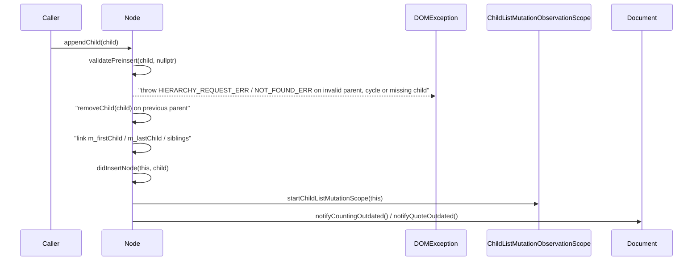
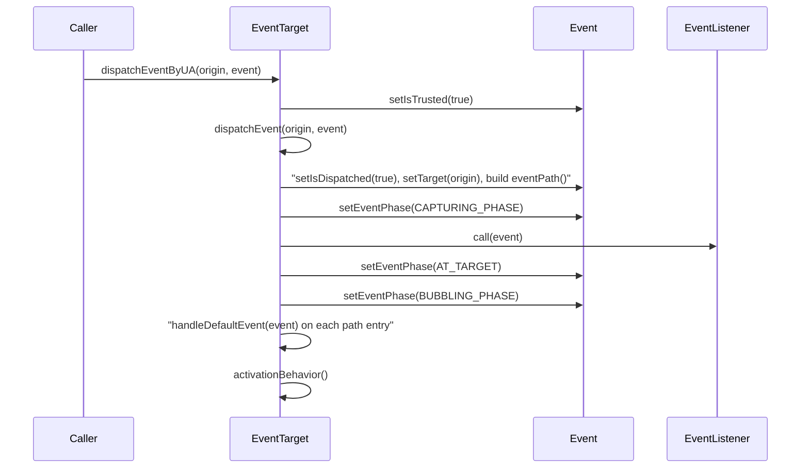
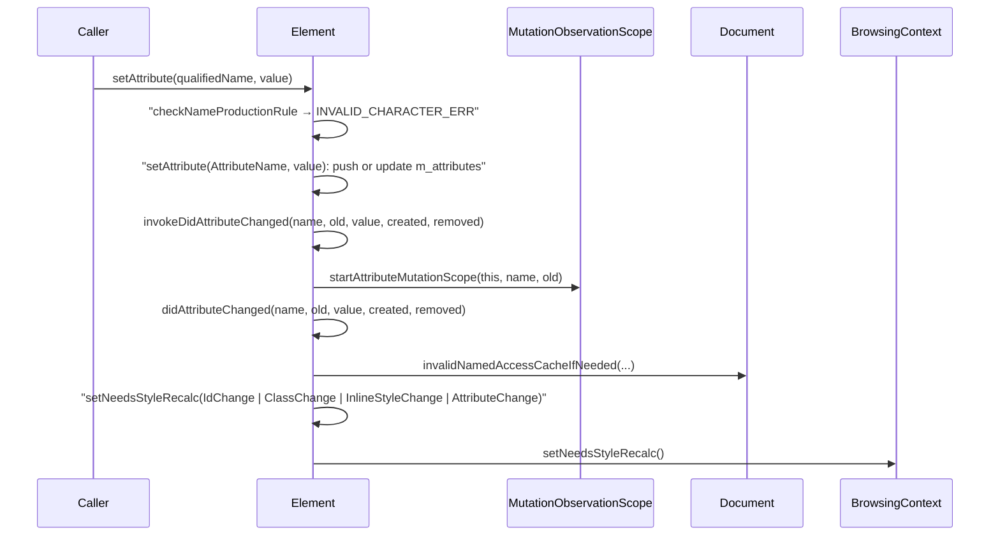
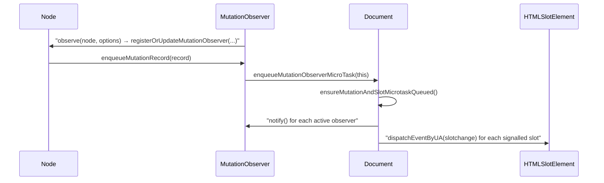

# Module Design Card: core-dom

> **Relevant source files**
>
> - [src/core/dom/AnimationEvent.h](src:src/core/dom/AnimationEvent.h)
> - [src/core/dom/Attr.cpp](src:src/core/dom/Attr.cpp)
> - [src/core/dom/Attr.h](src:src/core/dom/Attr.h)
> - [src/core/dom/Attribute.cpp](src:src/core/dom/Attribute.cpp)
> - [src/core/dom/Attribute.h](src:src/core/dom/Attribute.h)
> - [src/core/dom/CDATASection.cpp](src:src/core/dom/CDATASection.cpp)
> - [src/core/dom/CDATASection.h](src:src/core/dom/CDATASection.h)
> - [src/core/dom/CSS.cpp](src:src/core/dom/CSS.cpp)
> - [src/core/dom/CSS.h](src:src/core/dom/CSS.h)
> - [src/core/dom/CharacterData.cpp](src:src/core/dom/CharacterData.cpp)
> - [src/core/dom/CharacterData.h](src:src/core/dom/CharacterData.h)
> - [src/core/dom/CloseEvent.cpp](src:src/core/dom/CloseEvent.cpp)
> - [src/core/dom/CloseEvent.h](src:src/core/dom/CloseEvent.h)
> - [src/core/dom/Comment.cpp](src:src/core/dom/Comment.cpp)
> - [src/core/dom/Comment.h](src:src/core/dom/Comment.h)
> - [src/core/dom/CompositionEvent.h](src:src/core/dom/CompositionEvent.h)
> - [src/core/dom/CustomElementRegistry.cpp](src:src/core/dom/CustomElementRegistry.cpp)
> - [src/core/dom/CustomElementRegistry.h](src:src/core/dom/CustomElementRegistry.h)
> - [src/core/dom/CustomEvent.h](src:src/core/dom/CustomEvent.h)
> - [src/core/dom/DOMException.cpp](src:src/core/dom/DOMException.cpp)
> - [src/core/dom/DOMException.h](src:src/core/dom/DOMException.h)
> - [src/core/dom/DOMExceptionOr.h](src:src/core/dom/DOMExceptionOr.h)
> - [src/core/dom/DOMImplementation.cpp](src:src/core/dom/DOMImplementation.cpp)
> - [src/core/dom/DOMImplementation.h](src:src/core/dom/DOMImplementation.h)
> - [src/core/dom/DOMMatrix.cpp](src:src/core/dom/DOMMatrix.cpp)
> - [src/core/dom/DOMMatrix.h](src:src/core/dom/DOMMatrix.h)
> - [src/core/dom/DOMMatrix2DInit.h](src:src/core/dom/DOMMatrix2DInit.h)
> - [src/core/dom/DOMMatrixInit.cpp](src:src/core/dom/DOMMatrixInit.cpp)
> - [src/core/dom/DOMMatrixInit.h](src:src/core/dom/DOMMatrixInit.h)
> - [src/core/dom/DOMMatrixReadOnly.cpp](src:src/core/dom/DOMMatrixReadOnly.cpp)
> - [src/core/dom/DOMMatrixReadOnly.h](src:src/core/dom/DOMMatrixReadOnly.h)
> - [src/core/dom/DOMParser.cpp](src:src/core/dom/DOMParser.cpp)
> - [src/core/dom/DOMParser.h](src:src/core/dom/DOMParser.h)
> - [src/core/dom/DOMPoint.cpp](src:src/core/dom/DOMPoint.cpp)
> - [src/core/dom/DOMPoint.h](src:src/core/dom/DOMPoint.h)
> - [src/core/dom/DOMPointReadOnly.cpp](src:src/core/dom/DOMPointReadOnly.cpp)
> - [src/core/dom/DOMPointReadOnly.h](src:src/core/dom/DOMPointReadOnly.h)
> - [src/core/dom/DOMQuad.cpp](src:src/core/dom/DOMQuad.cpp)
> - [src/core/dom/DOMQuad.h](src:src/core/dom/DOMQuad.h)
> - [src/core/dom/DOMRect.cpp](src:src/core/dom/DOMRect.cpp)
> - [src/core/dom/DOMRect.h](src:src/core/dom/DOMRect.h)
> - [src/core/dom/DOMRectInit.h](src:src/core/dom/DOMRectInit.h)
> - [src/core/dom/DOMRectList.cpp](src:src/core/dom/DOMRectList.cpp)
> - [src/core/dom/DOMRectList.h](src:src/core/dom/DOMRectList.h)
> - [src/core/dom/DOMRectReadOnly.cpp](src:src/core/dom/DOMRectReadOnly.cpp)
> - [src/core/dom/DOMRectReadOnly.h](src:src/core/dom/DOMRectReadOnly.h)
> - [src/core/dom/DOMStringList.cpp](src:src/core/dom/DOMStringList.cpp)
> - [src/core/dom/DOMStringList.h](src:src/core/dom/DOMStringList.h)
> - [src/core/dom/DOMStringMap.cpp](src:src/core/dom/DOMStringMap.cpp)
> - [src/core/dom/DOMStringMap.h](src:src/core/dom/DOMStringMap.h)
> - [src/core/dom/DOMTokenList.cpp](src:src/core/dom/DOMTokenList.cpp)
> - [src/core/dom/DOMTokenList.h](src:src/core/dom/DOMTokenList.h)
> - [src/core/dom/Document.cpp](src:src/core/dom/Document.cpp)
> - [src/core/dom/Document.h](src:src/core/dom/Document.h)
> - [src/core/dom/DocumentFragment.cpp](src:src/core/dom/DocumentFragment.cpp)
> - [src/core/dom/DocumentFragment.h](src:src/core/dom/DocumentFragment.h)
> - [src/core/dom/DocumentType.h](src:src/core/dom/DocumentType.h)
> - [src/core/dom/Element.cpp](src:src/core/dom/Element.cpp)
> - [src/core/dom/Element.h](src:src/core/dom/Element.h)
> - [src/core/dom/ErrorEvent.h](src:src/core/dom/ErrorEvent.h)
> - [src/core/dom/Event.cpp](src:src/core/dom/Event.cpp)
> - [src/core/dom/Event.h](src:src/core/dom/Event.h)
> - [src/core/dom/EventTarget.cpp](src:src/core/dom/EventTarget.cpp)
> - [src/core/dom/EventTarget.h](src:src/core/dom/EventTarget.h)
> - [src/core/dom/EventTargetWithExecutionContext.h](src:src/core/dom/EventTargetWithExecutionContext.h)
> - [src/core/dom/ExecutionContext.cpp](src:src/core/dom/ExecutionContext.cpp)
> - [src/core/dom/ExecutionContext.h](src:src/core/dom/ExecutionContext.h)
> - [src/core/dom/FocusEvent.h](src:src/core/dom/FocusEvent.h)
> - [src/core/dom/FocusOptions.h](src:src/core/dom/FocusOptions.h)
> - [src/core/dom/HTMLAnchorElement.cpp](src:src/core/dom/HTMLAnchorElement.cpp)
> - [src/core/dom/HTMLAnchorElement.h](src:src/core/dom/HTMLAnchorElement.h)
> - [src/core/dom/HTMLAreaElement.cpp](src:src/core/dom/HTMLAreaElement.cpp)
> - [src/core/dom/HTMLAreaElement.h](src:src/core/dom/HTMLAreaElement.h)
> - [src/core/dom/HTMLAudioElement.h](src:src/core/dom/HTMLAudioElement.h)
> - [src/core/dom/HTMLBRElement.h](src:src/core/dom/HTMLBRElement.h)
> - [src/core/dom/HTMLBaseElement.cpp](src:src/core/dom/HTMLBaseElement.cpp)
> - [src/core/dom/HTMLBaseElement.h](src:src/core/dom/HTMLBaseElement.h)
> - [src/core/dom/HTMLBodyElement.cpp](src:src/core/dom/HTMLBodyElement.cpp)
> - [src/core/dom/HTMLBodyElement.h](src:src/core/dom/HTMLBodyElement.h)
> - [src/core/dom/HTMLButtonElement.cpp](src:src/core/dom/HTMLButtonElement.cpp)
> - [src/core/dom/HTMLButtonElement.h](src:src/core/dom/HTMLButtonElement.h)
> - [src/core/dom/HTMLCollection.cpp](src:src/core/dom/HTMLCollection.cpp)
> - [src/core/dom/HTMLCollection.h](src:src/core/dom/HTMLCollection.h)
> - [src/core/dom/HTMLCustomElement.cpp](src:src/core/dom/HTMLCustomElement.cpp)
> - [src/core/dom/HTMLCustomElement.h](src:src/core/dom/HTMLCustomElement.h)
> - [src/core/dom/HTMLDListElement.h](src:src/core/dom/HTMLDListElement.h)
> - [src/core/dom/HTMLDataElement.cpp](src:src/core/dom/HTMLDataElement.cpp)
> - [src/core/dom/HTMLDataElement.h](src:src/core/dom/HTMLDataElement.h)
> - [src/core/dom/HTMLDialogElement.cpp](src:src/core/dom/HTMLDialogElement.cpp)
> - [src/core/dom/HTMLDialogElement.h](src:src/core/dom/HTMLDialogElement.h)
> - [src/core/dom/HTMLDivElement.cpp](src:src/core/dom/HTMLDivElement.cpp)
> - [src/core/dom/HTMLDivElement.h](src:src/core/dom/HTMLDivElement.h)
> - [src/core/dom/HTMLDocument.cpp](src:src/core/dom/HTMLDocument.cpp)
> - [src/core/dom/HTMLDocument.h](src:src/core/dom/HTMLDocument.h)
> - [src/core/dom/HTMLElement.cpp](src:src/core/dom/HTMLElement.cpp)
> - [src/core/dom/HTMLElement.h](src:src/core/dom/HTMLElement.h)
> - [src/core/dom/HTMLFieldSetElement.cpp](src:src/core/dom/HTMLFieldSetElement.cpp)
> - [src/core/dom/HTMLFieldSetElement.h](src:src/core/dom/HTMLFieldSetElement.h)
> - [src/core/dom/HTMLFontElement.cpp](src:src/core/dom/HTMLFontElement.cpp)
> - [src/core/dom/HTMLFontElement.h](src:src/core/dom/HTMLFontElement.h)
> - [src/core/dom/HTMLFormControlsCollection.cpp](src:src/core/dom/HTMLFormControlsCollection.cpp)
> - [src/core/dom/HTMLFormControlsCollection.h](src:src/core/dom/HTMLFormControlsCollection.h)
> - [src/core/dom/HTMLFormElement.cpp](src:src/core/dom/HTMLFormElement.cpp)
> - [src/core/dom/HTMLFormElement.h](src:src/core/dom/HTMLFormElement.h)
> - [src/core/dom/HTMLFrameElement.h](src:src/core/dom/HTMLFrameElement.h)
> - [src/core/dom/HTMLFrameSetElement.h](src:src/core/dom/HTMLFrameSetElement.h)
> - [src/core/dom/HTMLHRElement.h](src:src/core/dom/HTMLHRElement.h)
> - [src/core/dom/HTMLHeadElement.h](src:src/core/dom/HTMLHeadElement.h)
> - [src/core/dom/HTMLHeadingElement.cpp](src:src/core/dom/HTMLHeadingElement.cpp)
> - [src/core/dom/HTMLHeadingElement.h](src:src/core/dom/HTMLHeadingElement.h)
> - [src/core/dom/HTMLHtmlElement.cpp](src:src/core/dom/HTMLHtmlElement.cpp)
> - [src/core/dom/HTMLHtmlElement.h](src:src/core/dom/HTMLHtmlElement.h)
> - [src/core/dom/HTMLHyperlinkContainer.cpp](src:src/core/dom/HTMLHyperlinkContainer.cpp)
> - [src/core/dom/HTMLHyperlinkContainer.h](src:src/core/dom/HTMLHyperlinkContainer.h)
> - [src/core/dom/HTMLIFrameElement.cpp](src:src/core/dom/HTMLIFrameElement.cpp)
> - [src/core/dom/HTMLIFrameElement.h](src:src/core/dom/HTMLIFrameElement.h)
> - [src/core/dom/HTMLImageElement.cpp](src:src/core/dom/HTMLImageElement.cpp)
> - [src/core/dom/HTMLImageElement.h](src:src/core/dom/HTMLImageElement.h)
> - [src/core/dom/HTMLInputElement.cpp](src:src/core/dom/HTMLInputElement.cpp)
> - [src/core/dom/HTMLInputElement.h](src:src/core/dom/HTMLInputElement.h)
> - [src/core/dom/HTMLLIElement.cpp](src:src/core/dom/HTMLLIElement.cpp)
> - [src/core/dom/HTMLLIElement.h](src:src/core/dom/HTMLLIElement.h)
> - [src/core/dom/HTMLLabelElement.cpp](src:src/core/dom/HTMLLabelElement.cpp)
> - [src/core/dom/HTMLLabelElement.h](src:src/core/dom/HTMLLabelElement.h)
> - [src/core/dom/HTMLLegendElement.cpp](src:src/core/dom/HTMLLegendElement.cpp)
> - [src/core/dom/HTMLLegendElement.h](src:src/core/dom/HTMLLegendElement.h)
> - [src/core/dom/HTMLLinkElement.cpp](src:src/core/dom/HTMLLinkElement.cpp)
> - [src/core/dom/HTMLLinkElement.h](src:src/core/dom/HTMLLinkElement.h)
> - [src/core/dom/HTMLListContainer.cpp](src:src/core/dom/HTMLListContainer.cpp)
> - [src/core/dom/HTMLListContainer.h](src:src/core/dom/HTMLListContainer.h)
> - [src/core/dom/HTMLMapElement.cpp](src:src/core/dom/HTMLMapElement.cpp)
> - [src/core/dom/HTMLMapElement.h](src:src/core/dom/HTMLMapElement.h)
> - [src/core/dom/HTMLMediaElement.cpp](src:src/core/dom/HTMLMediaElement.cpp)
> - [src/core/dom/HTMLMediaElement.h](src:src/core/dom/HTMLMediaElement.h)
> - [src/core/dom/HTMLMetaElement.cpp](src:src/core/dom/HTMLMetaElement.cpp)
> - [src/core/dom/HTMLMetaElement.h](src:src/core/dom/HTMLMetaElement.h)
> - [src/core/dom/HTMLModElement.cpp](src:src/core/dom/HTMLModElement.cpp)
> - [src/core/dom/HTMLModElement.h](src:src/core/dom/HTMLModElement.h)
> - [src/core/dom/HTMLOListElement.cpp](src:src/core/dom/HTMLOListElement.cpp)
> - [src/core/dom/HTMLOListElement.h](src:src/core/dom/HTMLOListElement.h)
> - [src/core/dom/HTMLObjectElement.cpp](src:src/core/dom/HTMLObjectElement.cpp)
> - [src/core/dom/HTMLObjectElement.h](src:src/core/dom/HTMLObjectElement.h)
> - [src/core/dom/HTMLOptGroupElement.cpp](src:src/core/dom/HTMLOptGroupElement.cpp)
> - [src/core/dom/HTMLOptGroupElement.h](src:src/core/dom/HTMLOptGroupElement.h)
> - [src/core/dom/HTMLOptionElement.cpp](src:src/core/dom/HTMLOptionElement.cpp)
> - [src/core/dom/HTMLOptionElement.h](src:src/core/dom/HTMLOptionElement.h)
> - [src/core/dom/HTMLOptionsCollection.cpp](src:src/core/dom/HTMLOptionsCollection.cpp)
> - [src/core/dom/HTMLOptionsCollection.h](src:src/core/dom/HTMLOptionsCollection.h)
> - [src/core/dom/HTMLOutputElement.cpp](src:src/core/dom/HTMLOutputElement.cpp)
> - [src/core/dom/HTMLOutputElement.h](src:src/core/dom/HTMLOutputElement.h)
> - [src/core/dom/HTMLParagraphElement.h](src:src/core/dom/HTMLParagraphElement.h)
> - [src/core/dom/HTMLParamElement.cpp](src:src/core/dom/HTMLParamElement.cpp)
> - [src/core/dom/HTMLParamElement.h](src:src/core/dom/HTMLParamElement.h)
> - [src/core/dom/HTMLPreElement.h](src:src/core/dom/HTMLPreElement.h)
> - [src/core/dom/HTMLQuoteElement.cpp](src:src/core/dom/HTMLQuoteElement.cpp)
> - [src/core/dom/HTMLQuoteElement.h](src:src/core/dom/HTMLQuoteElement.h)
> - [src/core/dom/HTMLScriptElement.cpp](src:src/core/dom/HTMLScriptElement.cpp)
> - [src/core/dom/HTMLScriptElement.h](src:src/core/dom/HTMLScriptElement.h)
> - [src/core/dom/HTMLSelectElement.cpp](src:src/core/dom/HTMLSelectElement.cpp)
> - [src/core/dom/HTMLSelectElement.h](src:src/core/dom/HTMLSelectElement.h)
> - [src/core/dom/HTMLSlotElement.cpp](src:src/core/dom/HTMLSlotElement.cpp)
> - [src/core/dom/HTMLSlotElement.h](src:src/core/dom/HTMLSlotElement.h)
> - [src/core/dom/HTMLSourceElement.cpp](src:src/core/dom/HTMLSourceElement.cpp)
> - [src/core/dom/HTMLSourceElement.h](src:src/core/dom/HTMLSourceElement.h)
> - [src/core/dom/HTMLSpanElement.h](src:src/core/dom/HTMLSpanElement.h)
> - [src/core/dom/HTMLStyleElement.cpp](src:src/core/dom/HTMLStyleElement.cpp)
> - [src/core/dom/HTMLStyleElement.h](src:src/core/dom/HTMLStyleElement.h)
> - [src/core/dom/HTMLTBodyElement.h](src:src/core/dom/HTMLTBodyElement.h)
> - [src/core/dom/HTMLTDElement.h](src:src/core/dom/HTMLTDElement.h)
> - [src/core/dom/HTMLTFootElement.h](src:src/core/dom/HTMLTFootElement.h)
> - [src/core/dom/HTMLTHElement.h](src:src/core/dom/HTMLTHElement.h)
> - [src/core/dom/HTMLTHeadElement.h](src:src/core/dom/HTMLTHeadElement.h)
> - [src/core/dom/HTMLTableCaptionElement.cpp](src:src/core/dom/HTMLTableCaptionElement.cpp)
> - [src/core/dom/HTMLTableCaptionElement.h](src:src/core/dom/HTMLTableCaptionElement.h)
> - [src/core/dom/HTMLTableCellElement.cpp](src:src/core/dom/HTMLTableCellElement.cpp)
> - [src/core/dom/HTMLTableCellElement.h](src:src/core/dom/HTMLTableCellElement.h)
> - [src/core/dom/HTMLTableColElement.cpp](src:src/core/dom/HTMLTableColElement.cpp)
> - [src/core/dom/HTMLTableColElement.h](src:src/core/dom/HTMLTableColElement.h)
> - [src/core/dom/HTMLTableColGroupElement.cpp](src:src/core/dom/HTMLTableColGroupElement.cpp)
> - [src/core/dom/HTMLTableColGroupElement.h](src:src/core/dom/HTMLTableColGroupElement.h)
> - [src/core/dom/HTMLTableElement.cpp](src:src/core/dom/HTMLTableElement.cpp)
> - [src/core/dom/HTMLTableElement.h](src:src/core/dom/HTMLTableElement.h)
> - [src/core/dom/HTMLTablePartElement.cpp](src:src/core/dom/HTMLTablePartElement.cpp)
> - [src/core/dom/HTMLTablePartElement.h](src:src/core/dom/HTMLTablePartElement.h)
> - [src/core/dom/HTMLTableRowElement.cpp](src:src/core/dom/HTMLTableRowElement.cpp)
> - [src/core/dom/HTMLTableRowElement.h](src:src/core/dom/HTMLTableRowElement.h)
> - [src/core/dom/HTMLTableSectionElement.cpp](src:src/core/dom/HTMLTableSectionElement.cpp)
> - [src/core/dom/HTMLTableSectionElement.h](src:src/core/dom/HTMLTableSectionElement.h)
> - [src/core/dom/HTMLTemplateElement.cpp](src:src/core/dom/HTMLTemplateElement.cpp)
> - [src/core/dom/HTMLTemplateElement.h](src:src/core/dom/HTMLTemplateElement.h)
> - [src/core/dom/HTMLTextAreaElement.cpp](src:src/core/dom/HTMLTextAreaElement.cpp)
> - [src/core/dom/HTMLTextAreaElement.h](src:src/core/dom/HTMLTextAreaElement.h)
> - [src/core/dom/HTMLTextEditable.cpp](src:src/core/dom/HTMLTextEditable.cpp)
> - [src/core/dom/HTMLTextEditable.h](src:src/core/dom/HTMLTextEditable.h)
> - [src/core/dom/HTMLTitleElement.cpp](src:src/core/dom/HTMLTitleElement.cpp)
> - [src/core/dom/HTMLTitleElement.h](src:src/core/dom/HTMLTitleElement.h)
> - [src/core/dom/HTMLTrackElement.cpp](src:src/core/dom/HTMLTrackElement.cpp)
> - [src/core/dom/HTMLTrackElement.h](src:src/core/dom/HTMLTrackElement.h)
> - [src/core/dom/HTMLUListElement.cpp](src:src/core/dom/HTMLUListElement.cpp)
> - [src/core/dom/HTMLUListElement.h](src:src/core/dom/HTMLUListElement.h)
> - [src/core/dom/HTMLUnknownElement.cpp](src:src/core/dom/HTMLUnknownElement.cpp)
> - [src/core/dom/HTMLUnknownElement.h](src:src/core/dom/HTMLUnknownElement.h)
> - [src/core/dom/HTMLVideoElement.cpp](src:src/core/dom/HTMLVideoElement.cpp)
> - [src/core/dom/HTMLVideoElement.h](src:src/core/dom/HTMLVideoElement.h)
> - [src/core/dom/ImageBitmap.cpp](src:src/core/dom/ImageBitmap.cpp)
> - [src/core/dom/ImageBitmap.h](src:src/core/dom/ImageBitmap.h)
> - [src/core/dom/ImageBitmapOptions.cpp](src:src/core/dom/ImageBitmapOptions.cpp)
> - [src/core/dom/ImageBitmapOptions.h](src:src/core/dom/ImageBitmapOptions.h)
> - [src/core/dom/InputEvent.h](src:src/core/dom/InputEvent.h)
> - [src/core/dom/IntersectionObserver.cpp](src:src/core/dom/IntersectionObserver.cpp)
> - [src/core/dom/IntersectionObserver.h](src:src/core/dom/IntersectionObserver.h)
> - [src/core/dom/IntersectionObserverEntry.cpp](src:src/core/dom/IntersectionObserverEntry.cpp)
> - [src/core/dom/IntersectionObserverEntry.h](src:src/core/dom/IntersectionObserverEntry.h)
> - [src/core/dom/KeyboardEvent.cpp](src:src/core/dom/KeyboardEvent.cpp)
> - [src/core/dom/KeyboardEvent.h](src:src/core/dom/KeyboardEvent.h)
> - [src/core/dom/MediaError.cpp](src:src/core/dom/MediaError.cpp)
> - [src/core/dom/MediaError.h](src:src/core/dom/MediaError.h)
> - [src/core/dom/MediaQueryListEvent.h](src:src/core/dom/MediaQueryListEvent.h)
> - [src/core/dom/MessageChannel.cpp](src:src/core/dom/MessageChannel.cpp)
> - [src/core/dom/MessageChannel.h](src:src/core/dom/MessageChannel.h)
> - [src/core/dom/MessageEvent.cpp](src:src/core/dom/MessageEvent.cpp)
> - [src/core/dom/MessageEvent.h](src:src/core/dom/MessageEvent.h)
> - [src/core/dom/MessagePort.cpp](src:src/core/dom/MessagePort.cpp)
> - [src/core/dom/MessagePort.h](src:src/core/dom/MessagePort.h)
> - [src/core/dom/MouseEvent.h](src:src/core/dom/MouseEvent.h)
> - [src/core/dom/MutationObservationScope.cpp](src:src/core/dom/MutationObservationScope.cpp)
> - [src/core/dom/MutationObservationScope.h](src:src/core/dom/MutationObservationScope.h)
> - [src/core/dom/MutationObserver.cpp](src:src/core/dom/MutationObserver.cpp)
> - [src/core/dom/MutationObserver.h](src:src/core/dom/MutationObserver.h)
> - [src/core/dom/MutationRecord.cpp](src:src/core/dom/MutationRecord.cpp)
> - [src/core/dom/MutationRecord.h](src:src/core/dom/MutationRecord.h)
> - [src/core/dom/NamedNodeMap.cpp](src:src/core/dom/NamedNodeMap.cpp)
> - [src/core/dom/NamedNodeMap.h](src:src/core/dom/NamedNodeMap.h)
> - [src/core/dom/Node.cpp](src:src/core/dom/Node.cpp)
> - [src/core/dom/Node.h](src:src/core/dom/Node.h)
> - [src/core/dom/NodeFilter.h](src:src/core/dom/NodeFilter.h)
> - [src/core/dom/NodeIterator.cpp](src:src/core/dom/NodeIterator.cpp)
> - [src/core/dom/NodeIterator.h](src:src/core/dom/NodeIterator.h)
> - [src/core/dom/NodeList.cpp](src:src/core/dom/NodeList.cpp)
> - [src/core/dom/NodeList.h](src:src/core/dom/NodeList.h)
> - [src/core/dom/NodeListImpl.cpp](src:src/core/dom/NodeListImpl.cpp)
> - [src/core/dom/NodeListImpl.h](src:src/core/dom/NodeListImpl.h)
> - [src/core/dom/PointerEvent.h](src:src/core/dom/PointerEvent.h)
> - [src/core/dom/ProcessingInstruction.cpp](src:src/core/dom/ProcessingInstruction.cpp)
> - [src/core/dom/ProcessingInstruction.h](src:src/core/dom/ProcessingInstruction.h)
> - [src/core/dom/ProgressEvent.h](src:src/core/dom/ProgressEvent.h)
> - [src/core/dom/PseudoElement.cpp](src:src/core/dom/PseudoElement.cpp)
> - [src/core/dom/PseudoElement.h](src:src/core/dom/PseudoElement.h)
> - [src/core/dom/Range.cpp](src:src/core/dom/Range.cpp)
> - [src/core/dom/Range.h](src:src/core/dom/Range.h)
> - [src/core/dom/Scrolling.cpp](src:src/core/dom/Scrolling.cpp)
> - [src/core/dom/Scrolling.h](src:src/core/dom/Scrolling.h)
> - [src/core/dom/SelectorQuery.cpp](src:src/core/dom/SelectorQuery.cpp)
> - [src/core/dom/SelectorQuery.h](src:src/core/dom/SelectorQuery.h)
> - [src/core/dom/ShadowRoot.cpp](src:src/core/dom/ShadowRoot.cpp)
> - [src/core/dom/ShadowRoot.h](src:src/core/dom/ShadowRoot.h)
> - [src/core/dom/ShadowRootInit.h](src:src/core/dom/ShadowRootInit.h)
> - [src/core/dom/StructuredSerializeOptions.h](src:src/core/dom/StructuredSerializeOptions.h)
> - [src/core/dom/Text.cpp](src:src/core/dom/Text.cpp)
> - [src/core/dom/Text.h](src:src/core/dom/Text.h)
> - [src/core/dom/TextTrack.cpp](src:src/core/dom/TextTrack.cpp)
> - [src/core/dom/TextTrack.h](src:src/core/dom/TextTrack.h)
> - [src/core/dom/TextTrackCue.cpp](src:src/core/dom/TextTrackCue.cpp)
> - [src/core/dom/TextTrackCue.h](src:src/core/dom/TextTrackCue.h)
> - [src/core/dom/TextTrackCueList.cpp](src:src/core/dom/TextTrackCueList.cpp)
> - [src/core/dom/TextTrackCueList.h](src:src/core/dom/TextTrackCueList.h)
> - [src/core/dom/TextTrackList.cpp](src:src/core/dom/TextTrackList.cpp)
> - [src/core/dom/TextTrackList.h](src:src/core/dom/TextTrackList.h)
> - [src/core/dom/Touch.cpp](src:src/core/dom/Touch.cpp)
> - [src/core/dom/Touch.h](src:src/core/dom/Touch.h)
> - [src/core/dom/TouchEvent.cpp](src:src/core/dom/TouchEvent.cpp)
> - [src/core/dom/TouchEvent.h](src:src/core/dom/TouchEvent.h)
> - [src/core/dom/TouchList.cpp](src:src/core/dom/TouchList.cpp)
> - [src/core/dom/TouchList.h](src:src/core/dom/TouchList.h)
> - [src/core/dom/TransitionEvent.cpp](src:src/core/dom/TransitionEvent.cpp)
> - [src/core/dom/TransitionEvent.h](src:src/core/dom/TransitionEvent.h)
> - [src/core/dom/Traverse.h](src:src/core/dom/Traverse.h)
> - [src/core/dom/TreeWalker.cpp](src:src/core/dom/TreeWalker.cpp)
> - [src/core/dom/TreeWalker.h](src:src/core/dom/TreeWalker.h)
> - [src/core/dom/UIEvent.cpp](src:src/core/dom/UIEvent.cpp)
> - [src/core/dom/UIEvent.h](src:src/core/dom/UIEvent.h)
> - [src/core/dom/VTTCue.h](src:src/core/dom/VTTCue.h)
> - [src/core/dom/WebOrigin.cpp](src:src/core/dom/WebOrigin.cpp)
> - [src/core/dom/WebOrigin.h](src:src/core/dom/WebOrigin.h)
> - [src/core/dom/XMLDocument.h](src:src/core/dom/XMLDocument.h)
> - [src/core/dom/builder/DocumentBuilder.h](src:src/core/dom/builder/DocumentBuilder.h)
> - [src/core/dom/builder/html/HTMLDocumentBuilder.cpp](src:src/core/dom/builder/html/HTMLDocumentBuilder.cpp)
> - [src/core/dom/builder/html/HTMLDocumentBuilder.h](src:src/core/dom/builder/html/HTMLDocumentBuilder.h)
> - [src/core/dom/picker.js](src:src/core/dom/picker.js)
> - [src/core/dom/xml/XMLSerializer.cpp](src:src/core/dom/xml/XMLSerializer.cpp)
> - [src/core/dom/xml/XMLSerializer.h](src:src/core/dom/xml/XMLSerializer.h)
> - [src/binding/ScriptWrappable.h](src:src/binding/ScriptWrappable.h)
> - [src/binding/DocumentHoldable.h](src:src/binding/DocumentHoldable.h)
> - [src/core/dom/svg/SVGDocument.h](src:src/core/dom/svg/SVGDocument.h)

**Module**: `core-dom` — 291 files under src/core/dom (top-level), src/core/dom/builder, src/core/dom/builder/html, src/core/dom/xml
**Role**: Implements the DOM tree (Node, Element, Document, CharacterData), event targets and event dispatch, exceptions, observers, custom elements and the HTML element classes that the rest of the engine renders and scripts against. [`Node`](src:src/core/dom/Node.h#L140)
**Module Boundary**: DOM tree/node/element/event implementation directory (keywords: element, event, node, document); svg/canvas/parser subtrees split out as their own review surfaces; builder/ and xml/ leaf helpers stay with the DOM directory
**Confidence**: 0.92
**Core selection**: All approved modules are Core (boundary approved in W1 human review)
**Generated**: 2026-09-10

## Source Files

**src/core/dom/** (286 files)

- [src/core/dom/AnimationEvent.h](src:src/core/dom/AnimationEvent.h)
- [src/core/dom/Attr.cpp](src:src/core/dom/Attr.cpp)
- [src/core/dom/Attr.h](src:src/core/dom/Attr.h)
- [src/core/dom/Attribute.cpp](src:src/core/dom/Attribute.cpp)
- [src/core/dom/Attribute.h](src:src/core/dom/Attribute.h)
- [src/core/dom/CDATASection.cpp](src:src/core/dom/CDATASection.cpp)
- [src/core/dom/CDATASection.h](src:src/core/dom/CDATASection.h)
- [src/core/dom/CSS.cpp](src:src/core/dom/CSS.cpp)
- [src/core/dom/CSS.h](src:src/core/dom/CSS.h)
- [src/core/dom/CharacterData.cpp](src:src/core/dom/CharacterData.cpp)
- [src/core/dom/CharacterData.h](src:src/core/dom/CharacterData.h)
- [src/core/dom/CloseEvent.cpp](src:src/core/dom/CloseEvent.cpp)
- [src/core/dom/CloseEvent.h](src:src/core/dom/CloseEvent.h)
- [src/core/dom/Comment.cpp](src:src/core/dom/Comment.cpp)
- [src/core/dom/Comment.h](src:src/core/dom/Comment.h)
- [src/core/dom/CompositionEvent.h](src:src/core/dom/CompositionEvent.h)
- [src/core/dom/CustomElementRegistry.cpp](src:src/core/dom/CustomElementRegistry.cpp)
- [src/core/dom/CustomElementRegistry.h](src:src/core/dom/CustomElementRegistry.h)
- [src/core/dom/CustomEvent.h](src:src/core/dom/CustomEvent.h)
- [src/core/dom/DOMException.cpp](src:src/core/dom/DOMException.cpp)
- [src/core/dom/DOMException.h](src:src/core/dom/DOMException.h)
- [src/core/dom/DOMExceptionOr.h](src:src/core/dom/DOMExceptionOr.h)
- [src/core/dom/DOMImplementation.cpp](src:src/core/dom/DOMImplementation.cpp)
- [src/core/dom/DOMImplementation.h](src:src/core/dom/DOMImplementation.h)
- [src/core/dom/DOMMatrix.cpp](src:src/core/dom/DOMMatrix.cpp)
- [src/core/dom/DOMMatrix.h](src:src/core/dom/DOMMatrix.h)
- [src/core/dom/DOMMatrix2DInit.h](src:src/core/dom/DOMMatrix2DInit.h)
- [src/core/dom/DOMMatrixInit.cpp](src:src/core/dom/DOMMatrixInit.cpp)
- [src/core/dom/DOMMatrixInit.h](src:src/core/dom/DOMMatrixInit.h)
- [src/core/dom/DOMMatrixReadOnly.cpp](src:src/core/dom/DOMMatrixReadOnly.cpp)
- [src/core/dom/DOMMatrixReadOnly.h](src:src/core/dom/DOMMatrixReadOnly.h)
- [src/core/dom/DOMParser.cpp](src:src/core/dom/DOMParser.cpp)
- [src/core/dom/DOMParser.h](src:src/core/dom/DOMParser.h)
- [src/core/dom/DOMPoint.cpp](src:src/core/dom/DOMPoint.cpp)
- [src/core/dom/DOMPoint.h](src:src/core/dom/DOMPoint.h)
- [src/core/dom/DOMPointReadOnly.cpp](src:src/core/dom/DOMPointReadOnly.cpp)
- [src/core/dom/DOMPointReadOnly.h](src:src/core/dom/DOMPointReadOnly.h)
- [src/core/dom/DOMQuad.cpp](src:src/core/dom/DOMQuad.cpp)
- [src/core/dom/DOMQuad.h](src:src/core/dom/DOMQuad.h)
- [src/core/dom/DOMRect.cpp](src:src/core/dom/DOMRect.cpp)
- [src/core/dom/DOMRect.h](src:src/core/dom/DOMRect.h)
- [src/core/dom/DOMRectInit.h](src:src/core/dom/DOMRectInit.h)
- [src/core/dom/DOMRectList.cpp](src:src/core/dom/DOMRectList.cpp)
- [src/core/dom/DOMRectList.h](src:src/core/dom/DOMRectList.h)
- [src/core/dom/DOMRectReadOnly.cpp](src:src/core/dom/DOMRectReadOnly.cpp)
- [src/core/dom/DOMRectReadOnly.h](src:src/core/dom/DOMRectReadOnly.h)
- [src/core/dom/DOMStringList.cpp](src:src/core/dom/DOMStringList.cpp)
- [src/core/dom/DOMStringList.h](src:src/core/dom/DOMStringList.h)
- [src/core/dom/DOMStringMap.cpp](src:src/core/dom/DOMStringMap.cpp)
- [src/core/dom/DOMStringMap.h](src:src/core/dom/DOMStringMap.h)
- [src/core/dom/DOMTokenList.cpp](src:src/core/dom/DOMTokenList.cpp)
- [src/core/dom/DOMTokenList.h](src:src/core/dom/DOMTokenList.h)
- [src/core/dom/Document.cpp](src:src/core/dom/Document.cpp)
- [src/core/dom/Document.h](src:src/core/dom/Document.h)
- [src/core/dom/DocumentFragment.cpp](src:src/core/dom/DocumentFragment.cpp)
- [src/core/dom/DocumentFragment.h](src:src/core/dom/DocumentFragment.h)
- [src/core/dom/DocumentType.h](src:src/core/dom/DocumentType.h)
- [src/core/dom/Element.cpp](src:src/core/dom/Element.cpp)
- [src/core/dom/Element.h](src:src/core/dom/Element.h)
- [src/core/dom/ErrorEvent.h](src:src/core/dom/ErrorEvent.h)
- [src/core/dom/Event.cpp](src:src/core/dom/Event.cpp)
- [src/core/dom/Event.h](src:src/core/dom/Event.h)
- [src/core/dom/EventTarget.cpp](src:src/core/dom/EventTarget.cpp)
- [src/core/dom/EventTarget.h](src:src/core/dom/EventTarget.h)
- [src/core/dom/EventTargetWithExecutionContext.h](src:src/core/dom/EventTargetWithExecutionContext.h)
- [src/core/dom/ExecutionContext.cpp](src:src/core/dom/ExecutionContext.cpp)
- [src/core/dom/ExecutionContext.h](src:src/core/dom/ExecutionContext.h)
- [src/core/dom/FocusEvent.h](src:src/core/dom/FocusEvent.h)
- [src/core/dom/FocusOptions.h](src:src/core/dom/FocusOptions.h)
- [src/core/dom/HTMLAnchorElement.cpp](src:src/core/dom/HTMLAnchorElement.cpp)
- [src/core/dom/HTMLAnchorElement.h](src:src/core/dom/HTMLAnchorElement.h)
- [src/core/dom/HTMLAreaElement.cpp](src:src/core/dom/HTMLAreaElement.cpp)
- [src/core/dom/HTMLAreaElement.h](src:src/core/dom/HTMLAreaElement.h)
- [src/core/dom/HTMLAudioElement.h](src:src/core/dom/HTMLAudioElement.h)
- [src/core/dom/HTMLBRElement.h](src:src/core/dom/HTMLBRElement.h)
- [src/core/dom/HTMLBaseElement.cpp](src:src/core/dom/HTMLBaseElement.cpp)
- [src/core/dom/HTMLBaseElement.h](src:src/core/dom/HTMLBaseElement.h)
- [src/core/dom/HTMLBodyElement.cpp](src:src/core/dom/HTMLBodyElement.cpp)
- [src/core/dom/HTMLBodyElement.h](src:src/core/dom/HTMLBodyElement.h)
- [src/core/dom/HTMLButtonElement.cpp](src:src/core/dom/HTMLButtonElement.cpp)
- [src/core/dom/HTMLButtonElement.h](src:src/core/dom/HTMLButtonElement.h)
- [src/core/dom/HTMLCollection.cpp](src:src/core/dom/HTMLCollection.cpp)
- [src/core/dom/HTMLCollection.h](src:src/core/dom/HTMLCollection.h)
- [src/core/dom/HTMLCustomElement.cpp](src:src/core/dom/HTMLCustomElement.cpp)
- [src/core/dom/HTMLCustomElement.h](src:src/core/dom/HTMLCustomElement.h)
- [src/core/dom/HTMLDListElement.h](src:src/core/dom/HTMLDListElement.h)
- [src/core/dom/HTMLDataElement.cpp](src:src/core/dom/HTMLDataElement.cpp)
- [src/core/dom/HTMLDataElement.h](src:src/core/dom/HTMLDataElement.h)
- [src/core/dom/HTMLDialogElement.cpp](src:src/core/dom/HTMLDialogElement.cpp)
- [src/core/dom/HTMLDialogElement.h](src:src/core/dom/HTMLDialogElement.h)
- [src/core/dom/HTMLDivElement.cpp](src:src/core/dom/HTMLDivElement.cpp)
- [src/core/dom/HTMLDivElement.h](src:src/core/dom/HTMLDivElement.h)
- [src/core/dom/HTMLDocument.cpp](src:src/core/dom/HTMLDocument.cpp)
- [src/core/dom/HTMLDocument.h](src:src/core/dom/HTMLDocument.h)
- [src/core/dom/HTMLElement.cpp](src:src/core/dom/HTMLElement.cpp)
- [src/core/dom/HTMLElement.h](src:src/core/dom/HTMLElement.h)
- [src/core/dom/HTMLFieldSetElement.cpp](src:src/core/dom/HTMLFieldSetElement.cpp)
- [src/core/dom/HTMLFieldSetElement.h](src:src/core/dom/HTMLFieldSetElement.h)
- [src/core/dom/HTMLFontElement.cpp](src:src/core/dom/HTMLFontElement.cpp)
- [src/core/dom/HTMLFontElement.h](src:src/core/dom/HTMLFontElement.h)
- [src/core/dom/HTMLFormControlsCollection.cpp](src:src/core/dom/HTMLFormControlsCollection.cpp)
- [src/core/dom/HTMLFormControlsCollection.h](src:src/core/dom/HTMLFormControlsCollection.h)
- [src/core/dom/HTMLFormElement.cpp](src:src/core/dom/HTMLFormElement.cpp)
- [src/core/dom/HTMLFormElement.h](src:src/core/dom/HTMLFormElement.h)
- [src/core/dom/HTMLFrameElement.h](src:src/core/dom/HTMLFrameElement.h)
- [src/core/dom/HTMLFrameSetElement.h](src:src/core/dom/HTMLFrameSetElement.h)
- [src/core/dom/HTMLHRElement.h](src:src/core/dom/HTMLHRElement.h)
- [src/core/dom/HTMLHeadElement.h](src:src/core/dom/HTMLHeadElement.h)
- [src/core/dom/HTMLHeadingElement.cpp](src:src/core/dom/HTMLHeadingElement.cpp)
- [src/core/dom/HTMLHeadingElement.h](src:src/core/dom/HTMLHeadingElement.h)
- [src/core/dom/HTMLHtmlElement.cpp](src:src/core/dom/HTMLHtmlElement.cpp)
- [src/core/dom/HTMLHtmlElement.h](src:src/core/dom/HTMLHtmlElement.h)
- [src/core/dom/HTMLHyperlinkContainer.cpp](src:src/core/dom/HTMLHyperlinkContainer.cpp)
- [src/core/dom/HTMLHyperlinkContainer.h](src:src/core/dom/HTMLHyperlinkContainer.h)
- [src/core/dom/HTMLIFrameElement.cpp](src:src/core/dom/HTMLIFrameElement.cpp)
- [src/core/dom/HTMLIFrameElement.h](src:src/core/dom/HTMLIFrameElement.h)
- [src/core/dom/HTMLImageElement.cpp](src:src/core/dom/HTMLImageElement.cpp)
- [src/core/dom/HTMLImageElement.h](src:src/core/dom/HTMLImageElement.h)
- [src/core/dom/HTMLInputElement.cpp](src:src/core/dom/HTMLInputElement.cpp)
- [src/core/dom/HTMLInputElement.h](src:src/core/dom/HTMLInputElement.h)
- [src/core/dom/HTMLLIElement.cpp](src:src/core/dom/HTMLLIElement.cpp)
- [src/core/dom/HTMLLIElement.h](src:src/core/dom/HTMLLIElement.h)
- [src/core/dom/HTMLLabelElement.cpp](src:src/core/dom/HTMLLabelElement.cpp)
- [src/core/dom/HTMLLabelElement.h](src:src/core/dom/HTMLLabelElement.h)
- [src/core/dom/HTMLLegendElement.cpp](src:src/core/dom/HTMLLegendElement.cpp)
- [src/core/dom/HTMLLegendElement.h](src:src/core/dom/HTMLLegendElement.h)
- [src/core/dom/HTMLLinkElement.cpp](src:src/core/dom/HTMLLinkElement.cpp)
- [src/core/dom/HTMLLinkElement.h](src:src/core/dom/HTMLLinkElement.h)
- [src/core/dom/HTMLListContainer.cpp](src:src/core/dom/HTMLListContainer.cpp)
- [src/core/dom/HTMLListContainer.h](src:src/core/dom/HTMLListContainer.h)
- [src/core/dom/HTMLMapElement.cpp](src:src/core/dom/HTMLMapElement.cpp)
- [src/core/dom/HTMLMapElement.h](src:src/core/dom/HTMLMapElement.h)
- [src/core/dom/HTMLMediaElement.cpp](src:src/core/dom/HTMLMediaElement.cpp)
- [src/core/dom/HTMLMediaElement.h](src:src/core/dom/HTMLMediaElement.h)
- [src/core/dom/HTMLMetaElement.cpp](src:src/core/dom/HTMLMetaElement.cpp)
- [src/core/dom/HTMLMetaElement.h](src:src/core/dom/HTMLMetaElement.h)
- [src/core/dom/HTMLModElement.cpp](src:src/core/dom/HTMLModElement.cpp)
- [src/core/dom/HTMLModElement.h](src:src/core/dom/HTMLModElement.h)
- [src/core/dom/HTMLOListElement.cpp](src:src/core/dom/HTMLOListElement.cpp)
- [src/core/dom/HTMLOListElement.h](src:src/core/dom/HTMLOListElement.h)
- [src/core/dom/HTMLObjectElement.cpp](src:src/core/dom/HTMLObjectElement.cpp)
- [src/core/dom/HTMLObjectElement.h](src:src/core/dom/HTMLObjectElement.h)
- [src/core/dom/HTMLOptGroupElement.cpp](src:src/core/dom/HTMLOptGroupElement.cpp)
- [src/core/dom/HTMLOptGroupElement.h](src:src/core/dom/HTMLOptGroupElement.h)
- [src/core/dom/HTMLOptionElement.cpp](src:src/core/dom/HTMLOptionElement.cpp)
- [src/core/dom/HTMLOptionElement.h](src:src/core/dom/HTMLOptionElement.h)
- [src/core/dom/HTMLOptionsCollection.cpp](src:src/core/dom/HTMLOptionsCollection.cpp)
- [src/core/dom/HTMLOptionsCollection.h](src:src/core/dom/HTMLOptionsCollection.h)
- [src/core/dom/HTMLOutputElement.cpp](src:src/core/dom/HTMLOutputElement.cpp)
- [src/core/dom/HTMLOutputElement.h](src:src/core/dom/HTMLOutputElement.h)
- [src/core/dom/HTMLParagraphElement.h](src:src/core/dom/HTMLParagraphElement.h)
- [src/core/dom/HTMLParamElement.cpp](src:src/core/dom/HTMLParamElement.cpp)
- [src/core/dom/HTMLParamElement.h](src:src/core/dom/HTMLParamElement.h)
- [src/core/dom/HTMLPreElement.h](src:src/core/dom/HTMLPreElement.h)
- [src/core/dom/HTMLQuoteElement.cpp](src:src/core/dom/HTMLQuoteElement.cpp)
- [src/core/dom/HTMLQuoteElement.h](src:src/core/dom/HTMLQuoteElement.h)
- [src/core/dom/HTMLScriptElement.cpp](src:src/core/dom/HTMLScriptElement.cpp)
- [src/core/dom/HTMLScriptElement.h](src:src/core/dom/HTMLScriptElement.h)
- [src/core/dom/HTMLSelectElement.cpp](src:src/core/dom/HTMLSelectElement.cpp)
- [src/core/dom/HTMLSelectElement.h](src:src/core/dom/HTMLSelectElement.h)
- [src/core/dom/HTMLSlotElement.cpp](src:src/core/dom/HTMLSlotElement.cpp)
- [src/core/dom/HTMLSlotElement.h](src:src/core/dom/HTMLSlotElement.h)
- [src/core/dom/HTMLSourceElement.cpp](src:src/core/dom/HTMLSourceElement.cpp)
- [src/core/dom/HTMLSourceElement.h](src:src/core/dom/HTMLSourceElement.h)
- [src/core/dom/HTMLSpanElement.h](src:src/core/dom/HTMLSpanElement.h)
- [src/core/dom/HTMLStyleElement.cpp](src:src/core/dom/HTMLStyleElement.cpp)
- [src/core/dom/HTMLStyleElement.h](src:src/core/dom/HTMLStyleElement.h)
- [src/core/dom/HTMLTBodyElement.h](src:src/core/dom/HTMLTBodyElement.h)
- [src/core/dom/HTMLTDElement.h](src:src/core/dom/HTMLTDElement.h)
- [src/core/dom/HTMLTFootElement.h](src:src/core/dom/HTMLTFootElement.h)
- [src/core/dom/HTMLTHElement.h](src:src/core/dom/HTMLTHElement.h)
- [src/core/dom/HTMLTHeadElement.h](src:src/core/dom/HTMLTHeadElement.h)
- [src/core/dom/HTMLTableCaptionElement.cpp](src:src/core/dom/HTMLTableCaptionElement.cpp)
- [src/core/dom/HTMLTableCaptionElement.h](src:src/core/dom/HTMLTableCaptionElement.h)
- [src/core/dom/HTMLTableCellElement.cpp](src:src/core/dom/HTMLTableCellElement.cpp)
- [src/core/dom/HTMLTableCellElement.h](src:src/core/dom/HTMLTableCellElement.h)
- [src/core/dom/HTMLTableColElement.cpp](src:src/core/dom/HTMLTableColElement.cpp)
- [src/core/dom/HTMLTableColElement.h](src:src/core/dom/HTMLTableColElement.h)
- [src/core/dom/HTMLTableColGroupElement.cpp](src:src/core/dom/HTMLTableColGroupElement.cpp)
- [src/core/dom/HTMLTableColGroupElement.h](src:src/core/dom/HTMLTableColGroupElement.h)
- [src/core/dom/HTMLTableElement.cpp](src:src/core/dom/HTMLTableElement.cpp)
- [src/core/dom/HTMLTableElement.h](src:src/core/dom/HTMLTableElement.h)
- [src/core/dom/HTMLTablePartElement.cpp](src:src/core/dom/HTMLTablePartElement.cpp)
- [src/core/dom/HTMLTablePartElement.h](src:src/core/dom/HTMLTablePartElement.h)
- [src/core/dom/HTMLTableRowElement.cpp](src:src/core/dom/HTMLTableRowElement.cpp)
- [src/core/dom/HTMLTableRowElement.h](src:src/core/dom/HTMLTableRowElement.h)
- [src/core/dom/HTMLTableSectionElement.cpp](src:src/core/dom/HTMLTableSectionElement.cpp)
- [src/core/dom/HTMLTableSectionElement.h](src:src/core/dom/HTMLTableSectionElement.h)
- [src/core/dom/HTMLTemplateElement.cpp](src:src/core/dom/HTMLTemplateElement.cpp)
- [src/core/dom/HTMLTemplateElement.h](src:src/core/dom/HTMLTemplateElement.h)
- [src/core/dom/HTMLTextAreaElement.cpp](src:src/core/dom/HTMLTextAreaElement.cpp)
- [src/core/dom/HTMLTextAreaElement.h](src:src/core/dom/HTMLTextAreaElement.h)
- [src/core/dom/HTMLTextEditable.cpp](src:src/core/dom/HTMLTextEditable.cpp)
- [src/core/dom/HTMLTextEditable.h](src:src/core/dom/HTMLTextEditable.h)
- [src/core/dom/HTMLTitleElement.cpp](src:src/core/dom/HTMLTitleElement.cpp)
- [src/core/dom/HTMLTitleElement.h](src:src/core/dom/HTMLTitleElement.h)
- [src/core/dom/HTMLTrackElement.cpp](src:src/core/dom/HTMLTrackElement.cpp)
- [src/core/dom/HTMLTrackElement.h](src:src/core/dom/HTMLTrackElement.h)
- [src/core/dom/HTMLUListElement.cpp](src:src/core/dom/HTMLUListElement.cpp)
- [src/core/dom/HTMLUListElement.h](src:src/core/dom/HTMLUListElement.h)
- [src/core/dom/HTMLUnknownElement.cpp](src:src/core/dom/HTMLUnknownElement.cpp)
- [src/core/dom/HTMLUnknownElement.h](src:src/core/dom/HTMLUnknownElement.h)
- [src/core/dom/HTMLVideoElement.cpp](src:src/core/dom/HTMLVideoElement.cpp)
- [src/core/dom/HTMLVideoElement.h](src:src/core/dom/HTMLVideoElement.h)
- [src/core/dom/ImageBitmap.cpp](src:src/core/dom/ImageBitmap.cpp)
- [src/core/dom/ImageBitmap.h](src:src/core/dom/ImageBitmap.h)
- [src/core/dom/ImageBitmapOptions.cpp](src:src/core/dom/ImageBitmapOptions.cpp)
- [src/core/dom/ImageBitmapOptions.h](src:src/core/dom/ImageBitmapOptions.h)
- [src/core/dom/InputEvent.h](src:src/core/dom/InputEvent.h)
- [src/core/dom/IntersectionObserver.cpp](src:src/core/dom/IntersectionObserver.cpp)
- [src/core/dom/IntersectionObserver.h](src:src/core/dom/IntersectionObserver.h)
- [src/core/dom/IntersectionObserverEntry.cpp](src:src/core/dom/IntersectionObserverEntry.cpp)
- [src/core/dom/IntersectionObserverEntry.h](src:src/core/dom/IntersectionObserverEntry.h)
- [src/core/dom/KeyboardEvent.cpp](src:src/core/dom/KeyboardEvent.cpp)
- [src/core/dom/KeyboardEvent.h](src:src/core/dom/KeyboardEvent.h)
- [src/core/dom/MediaError.cpp](src:src/core/dom/MediaError.cpp)
- [src/core/dom/MediaError.h](src:src/core/dom/MediaError.h)
- [src/core/dom/MediaQueryListEvent.h](src:src/core/dom/MediaQueryListEvent.h)
- [src/core/dom/MessageChannel.cpp](src:src/core/dom/MessageChannel.cpp)
- [src/core/dom/MessageChannel.h](src:src/core/dom/MessageChannel.h)
- [src/core/dom/MessageEvent.cpp](src:src/core/dom/MessageEvent.cpp)
- [src/core/dom/MessageEvent.h](src:src/core/dom/MessageEvent.h)
- [src/core/dom/MessagePort.cpp](src:src/core/dom/MessagePort.cpp)
- [src/core/dom/MessagePort.h](src:src/core/dom/MessagePort.h)
- [src/core/dom/MouseEvent.h](src:src/core/dom/MouseEvent.h)
- [src/core/dom/MutationObservationScope.cpp](src:src/core/dom/MutationObservationScope.cpp)
- [src/core/dom/MutationObservationScope.h](src:src/core/dom/MutationObservationScope.h)
- [src/core/dom/MutationObserver.cpp](src:src/core/dom/MutationObserver.cpp)
- [src/core/dom/MutationObserver.h](src:src/core/dom/MutationObserver.h)
- [src/core/dom/MutationRecord.cpp](src:src/core/dom/MutationRecord.cpp)
- [src/core/dom/MutationRecord.h](src:src/core/dom/MutationRecord.h)
- [src/core/dom/NamedNodeMap.cpp](src:src/core/dom/NamedNodeMap.cpp)
- [src/core/dom/NamedNodeMap.h](src:src/core/dom/NamedNodeMap.h)
- [src/core/dom/Node.cpp](src:src/core/dom/Node.cpp)
- [src/core/dom/Node.h](src:src/core/dom/Node.h)
- [src/core/dom/NodeFilter.h](src:src/core/dom/NodeFilter.h)
- [src/core/dom/NodeIterator.cpp](src:src/core/dom/NodeIterator.cpp)
- [src/core/dom/NodeIterator.h](src:src/core/dom/NodeIterator.h)
- [src/core/dom/NodeList.cpp](src:src/core/dom/NodeList.cpp)
- [src/core/dom/NodeList.h](src:src/core/dom/NodeList.h)
- [src/core/dom/NodeListImpl.cpp](src:src/core/dom/NodeListImpl.cpp)
- [src/core/dom/NodeListImpl.h](src:src/core/dom/NodeListImpl.h)
- [src/core/dom/PointerEvent.h](src:src/core/dom/PointerEvent.h)
- [src/core/dom/ProcessingInstruction.cpp](src:src/core/dom/ProcessingInstruction.cpp)
- [src/core/dom/ProcessingInstruction.h](src:src/core/dom/ProcessingInstruction.h)
- [src/core/dom/ProgressEvent.h](src:src/core/dom/ProgressEvent.h)
- [src/core/dom/PseudoElement.cpp](src:src/core/dom/PseudoElement.cpp)
- [src/core/dom/PseudoElement.h](src:src/core/dom/PseudoElement.h)
- [src/core/dom/Range.cpp](src:src/core/dom/Range.cpp)
- [src/core/dom/Range.h](src:src/core/dom/Range.h)
- [src/core/dom/Scrolling.cpp](src:src/core/dom/Scrolling.cpp)
- [src/core/dom/Scrolling.h](src:src/core/dom/Scrolling.h)
- [src/core/dom/SelectorQuery.cpp](src:src/core/dom/SelectorQuery.cpp)
- [src/core/dom/SelectorQuery.h](src:src/core/dom/SelectorQuery.h)
- [src/core/dom/ShadowRoot.cpp](src:src/core/dom/ShadowRoot.cpp)
- [src/core/dom/ShadowRoot.h](src:src/core/dom/ShadowRoot.h)
- [src/core/dom/ShadowRootInit.h](src:src/core/dom/ShadowRootInit.h)
- [src/core/dom/StructuredSerializeOptions.h](src:src/core/dom/StructuredSerializeOptions.h)
- [src/core/dom/Text.cpp](src:src/core/dom/Text.cpp)
- [src/core/dom/Text.h](src:src/core/dom/Text.h)
- [src/core/dom/TextTrack.cpp](src:src/core/dom/TextTrack.cpp)
- [src/core/dom/TextTrack.h](src:src/core/dom/TextTrack.h)
- [src/core/dom/TextTrackCue.cpp](src:src/core/dom/TextTrackCue.cpp)
- [src/core/dom/TextTrackCue.h](src:src/core/dom/TextTrackCue.h)
- [src/core/dom/TextTrackCueList.cpp](src:src/core/dom/TextTrackCueList.cpp)
- [src/core/dom/TextTrackCueList.h](src:src/core/dom/TextTrackCueList.h)
- [src/core/dom/TextTrackList.cpp](src:src/core/dom/TextTrackList.cpp)
- [src/core/dom/TextTrackList.h](src:src/core/dom/TextTrackList.h)
- [src/core/dom/Touch.cpp](src:src/core/dom/Touch.cpp)
- [src/core/dom/Touch.h](src:src/core/dom/Touch.h)
- [src/core/dom/TouchEvent.cpp](src:src/core/dom/TouchEvent.cpp)
- [src/core/dom/TouchEvent.h](src:src/core/dom/TouchEvent.h)
- [src/core/dom/TouchList.cpp](src:src/core/dom/TouchList.cpp)
- [src/core/dom/TouchList.h](src:src/core/dom/TouchList.h)
- [src/core/dom/TransitionEvent.cpp](src:src/core/dom/TransitionEvent.cpp)
- [src/core/dom/TransitionEvent.h](src:src/core/dom/TransitionEvent.h)
- [src/core/dom/Traverse.h](src:src/core/dom/Traverse.h)
- [src/core/dom/TreeWalker.cpp](src:src/core/dom/TreeWalker.cpp)
- [src/core/dom/TreeWalker.h](src:src/core/dom/TreeWalker.h)
- [src/core/dom/UIEvent.cpp](src:src/core/dom/UIEvent.cpp)
- [src/core/dom/UIEvent.h](src:src/core/dom/UIEvent.h)
- [src/core/dom/VTTCue.h](src:src/core/dom/VTTCue.h)
- [src/core/dom/WebOrigin.cpp](src:src/core/dom/WebOrigin.cpp)
- [src/core/dom/WebOrigin.h](src:src/core/dom/WebOrigin.h)
- [src/core/dom/XMLDocument.h](src:src/core/dom/XMLDocument.h)
- [src/core/dom/picker.js](src:src/core/dom/picker.js)

**src/core/dom/builder/** (1 files)

- [src/core/dom/builder/DocumentBuilder.h](src:src/core/dom/builder/DocumentBuilder.h)

**src/core/dom/builder/html/** (2 files)

- [src/core/dom/builder/html/HTMLDocumentBuilder.cpp](src:src/core/dom/builder/html/HTMLDocumentBuilder.cpp)
- [src/core/dom/builder/html/HTMLDocumentBuilder.h](src:src/core/dom/builder/html/HTMLDocumentBuilder.h)

**src/core/dom/xml/** (2 files)

- [src/core/dom/xml/XMLSerializer.cpp](src:src/core/dom/xml/XMLSerializer.cpp)
- [src/core/dom/xml/XMLSerializer.h](src:src/core/dom/xml/XMLSerializer.h)

## Public Interface

Class hierarchy for the entry points below: [`ScriptWrappable`](src:src/binding/ScriptWrappable.h#L419) → [`EventTarget`](src:src/core/dom/EventTarget.h#L137) → [`Node`](src:src/core/dom/Node.h#L140) → [`Element`](src:src/core/dom/Element.h#L125) → [`HTMLElement`](src:src/core/dom/HTMLElement.h#L27); [`Document`](src:src/core/dom/Document.h#L102) and [`CharacterData`](src:src/core/dom/CharacterData.h#L29) also derive from `Node`.

| Function/Class | Signature | Main callers | Source |
|---|---|---|---|
| `Node::appendChild` | `Node* appendChild(Node* child)` | core-cdp (`src/core/cdp/domains/DOMDomain.cpp` L930/L1019, `CSSDomain.cpp` L514/L605); inside the module by `Node::cloneNode` and the fragment-insertion loops | [`Node::appendChild`](src:src/core/dom/Node.cpp#L1620) |
| `Node::insertBefore` / `replaceChild` | `Node* insertBefore(Node* child, Optional<Node*> childRef = nullptr)` / `Node* replaceChild(Node* child, Node* childToRemove)` | core-cdp (`DOMDomain.cpp` L928, L1021) | [`Node::insertBefore`](src:src/core/dom/Node.cpp#L1669) |
| `Node::removeChild` | `Node* removeChild(Node* child)` | core-cdp (`DOMDomain.cpp` L924, `CSSDomain.cpp` L603); inside the module by `appendChild`/`insertBefore` when re-parenting | [`Node::removeChild`](src:src/core/dom/Node.cpp#L1897) |
| `Node::querySelector` / `querySelectorAll` | `Element* querySelector(String* selector)` / `NodeList* querySelectorAll(String* selector)` | core-style (`src/core/style/CSSParser.cpp`, `Style.cpp`), core-cdp (`RuntimeDomain.cpp`, `DOMDomain.cpp`, `PageDomain.cpp`) | [`Node::querySelector`](src:src/core/dom/Node.cpp#L2240) |
| `Node::setNeedsStyleRecalc` | `void setNeedsStyleRecalc(StyleChangeReason reason = JustNeedsRecalcSelf, bool scheduleRendering = true)` | core-page (`src/core/page/Window.cpp`, `BrowsingContext.cpp`), core-style (`CSSStyleSheet.cpp`, `Style.cpp`) | [`Node::setNeedsStyleRecalc`](src:src/core/dom/Node.cpp#L2393) |
| `Node::style` / `Node::frame` | `ComputedStyle* style() const` / `Frame* frame()` | core-layout (`src/core/layout/FrameTreeBuilder.cpp`, `FrameTableSectionBox.cpp`, `FrameReplacedIFrame.cpp`, `FrameInputBox.cpp`) | [`Node::style`](src:src/core/dom/Node.h#L653) |
| `Element::getAttribute` / `setAttribute` | `Optional<String*> getAttribute(String* qualifiedName)` / `void setAttribute(String* qualifiedName, String* value)` | core-style (`CSSStyleDeclaration.cpp`, `CSSStyleSheet.cpp`, `Style.cpp`), platform-network-loader (`src/platform/loader/ImageResource.cpp`), core-cdp (`DOMDomain.cpp`, `PageDomain.cpp`, `OverlayDomain.cpp`, `AccessibilityDomain.cpp`) | [`Element::setAttribute`](src:src/core/dom/Element.cpp#L376) |
| `Element::getBoundingClientRect` | `DOMRect* getBoundingClientRect(bool layoutIfNeeds = true)` | core-layout (`src/core/layout/FrameBox.cpp`), core-page (`A11yAtspiTreeSource.cpp`, `A11yTouchExploration.cpp`), core-cdp (`DOMSnapshotDomain.cpp`, `OverlayDomain.cpp`) | [`Element::getBoundingClientRect`](src:src/core/dom/Element.cpp#L1866) |
| `Document::createElement` / `createElementNS` | `Element* createElement(String* name)` / `Element* createElementNS(Optional<String*> namespaceString, String* qualifiedName)` | core-cdp (`DOMDomain.cpp` L1007, `CSSDomain.cpp` L503) | [`Document::createElement`](src:src/core/dom/Document.cpp#L1037) |
| `Document::getElementById` | `Element* getElementById(String* id)` | core-page (`src/core/page/WebView.cpp`, `Window.cpp`, `Location.cpp`, `A11yAtspiTreeSource.cpp`), modules-web-apis (`src/core/modules/tts/TextAlternativeHelper.cpp`) | [`Document::getElementById`](src:src/core/dom/Document.cpp#L956) |
| `Document::hasMutationObserversOfType` | `bool hasMutationObserversOfType(MutationObserverOptionType type) const` | core-style (`src/core/style/CSSStyleDeclaration.cpp` L2107) | [`Document::hasMutationObserversOfType`](src:src/core/dom/Document.cpp#L2663) |
| `EventTarget::addEventListener` / `removeEventListener` | `bool addEventListener(const String* eventType, EventListener* listener, bool useCapture = false)` | core-style (`src/core/style/MediaQueryList.cpp` L70), shell (`src/shell/test/WebContainerTest.cpp`) | [`EventTarget::addEventListener`](src:src/core/dom/EventTarget.cpp#L135) |
| `EventTarget::dispatchEventByUA` | `bool dispatchEventByUA(EventTarget* origin, Event* event, bool onlyTarget = false)` | core-page (`Window.cpp` L353/L435/L924, `BrowsingContext.cpp` L965/L1007), modules-media (`MediaSource.cpp`), modules-serviceworker, modules-workers (`WorkerProxy.cpp`) | [`EventTarget::dispatchEventByUA`](src:src/core/dom/EventTarget.cpp#L255) |
| `DOMException` | `DOMException(ExecutionContext* executionContext, Code code, const char* message = nullptr)` | 55 files outside the module construct it (e.g. `src/browser/history/HistoryManager.cpp`, `src/core/modules/mediasource/SourceBuffer.cpp`, `src/core/modules/webaudio/AudioNode.cpp`) | [`DOMException`](src:src/core/dom/DOMException.h#L27) |
| `ExecutionContext` | `ExecutionContext(GlobalScope* globalScope, ScriptBindingInstance* instance, ResourceURL* uri, String* charSet, void* documentOrWorkerGlobalScope, bool hasDocument)` | Most-included module header outside the module (151 include sites across src/) | [`ExecutionContext`](src:src/core/dom/ExecutionContext.h#L39) |
| `CustomElementRegistry` | `CustomElementRegistry(ExecutionContext* executionContext)` | core-page constructs it in `Window::customElements` (`src/core/page/Window.cpp` L959); binding (`src/binding/HTMLElementCustomBinding.cpp` L43/L51/L109) calls `find`, `peekConstructionStack`, `createCustomElement` | [`CustomElementRegistry`](src:src/core/dom/CustomElementRegistry.h#L141) |
| `WebOrigin::isSameOrigin` | `bool isSameOrigin(const WebOrigin* otherWebOrigin) const` | binding (`src/binding/ScriptBindingSecurity.cpp`); `WebOrigin.h` has 17 include sites outside the module | [`WebOrigin::isSameOrigin`](src:src/core/dom/WebOrigin.h#L45) |
| `XMLSerializer::serializeToXML` | `static String* serializeToXML(Node* e, bool includeSelf)` | core-extras (`src/core/xml/XMLHttpRequest.cpp` L598), modules-workers (`src/core/modules/worker/WorkerDummyClass.h`) | [`XMLSerializer::serializeToXML`](src:src/core/dom/xml/XMLSerializer.cpp#L178) |

## IPC / Message / Interface Contracts
- MessagePort/MessageChannel message passing: [`MessageChannel::MessageChannel`](src:src/core/dom/MessageChannel.cpp#L27) creates two ports and entangles them via [`MessagePort::entangle`](src:src/core/dom/MessagePort.cpp#L67). [`MessagePort::postMessage`](src:src/core/dom/MessagePort.cpp#L99) serializes the message and transfer list through the port's `m_serializer` into a `SerializeWithTransferResult`, throws `DATA_CLONE_ERR` if the port itself is in the transfer list, and hands the record to the entangled port's `dispatchMessageEvent`. Delivery is asynchronous: [`MessagePort::registerDispatchMessageTask`](src:src/core/dom/MessagePort.cpp#L143) posts an idler on the message loop that constructs a [`MessageEvent`](src:src/core/dom/MessageEvent.h#L104) and dispatches it with `dispatchEventByUA`. Ports are [`Transferable`](src:src/core/dom/MessagePort.h#L61) (`transfer()` / `transferReceive()`), and the shared-worker module (`src/core/modules/sharedworker/IPCMessagePort.cpp`, `SharedWorkerMessagePortConnection.cpp`) builds on this class to cross the worker boundary.
- Candidate: `picker.js` posts a JSON-serialized argument object to an iframe's `contentWindow.postMessage(..., '*')` after a 100 ms timeout; confidence=LOW (generic window.postMessage in an embedded script string; no matching receiver is in this module). [`picker.js`](src:src/core/dom/picker.js#L48)

The MessagePort contract decouples the sender from the receiver in time (message-loop idler) and in ownership (structured serialization with transfer), which is what allows the same class to serve both same-context MessageChannel use and the shared-worker connection classes outside this module. DOM event dispatch ([`EventTarget::dispatchEvent`](src:src/core/dom/EventTarget.cpp#L422)) and the mutation/intersection observer callbacks are in-process mechanisms and are not treated as IPC here.

## Key Flow

### Child insertion with pre-insertion validation and mutation observation

Entry symbol: [`Node::appendChild`](src:src/core/dom/Node.cpp#L1620); the validity rules live in [`Node::validatePreinsert`](src:src/core/dom/Node.cpp#L1367) and the post-insertion hook is the static [`didInsertNode`](src:src/core/dom/Node.cpp#L1593).

### Event dispatch (capture, target, bubble, default action)

Entry symbol: [`EventTarget::dispatchEventByUA`](src:src/core/dom/EventTarget.cpp#L255), which marks the event trusted and calls the private [`EventTarget::dispatchEvent`](src:src/core/dom/EventTarget.cpp#L422); script-initiated dispatch enters through the public [`EventTarget::dispatchEvent`](src:src/core/dom/EventTarget.cpp#L286), which sets `isTrusted` to false first.

### Attribute change → style invalidation

Entry symbol: [`Element::setAttribute`](src:src/core/dom/Element.cpp#L376); the id/class/style branches are in [`Element::didAttributeChanged`](src:src/core/dom/Element.cpp#L596) and the scheduling step is [`Node::setNeedsStyleRecalc`](src:src/core/dom/Node.cpp#L2393).

### Mutation observer delivery through a microtask

Entry symbol: [`MutationObserver::observe`](src:src/core/dom/MutationObserver.cpp#L118); registration is stored on the node by [`Node::registerOrUpdateMutationObserver`](src:src/core/dom/Node.h#L925) and delivery is coalesced by [`Document::ensureMutationAndSlotMicrotaskQueued`](src:src/core/dom/Document.cpp#L2692).

## Architectural Rules
- [ ] Every DOM node derives from `EventTarget` and `DocumentHoldable`; every node type must implement `nodeType()`, `nodeName()` and `clone()` (pure virtual). [`Node`](src:src/core/dom/Node.h#L140)
- [ ] Attributes are only modified through `Element::setAttribute` / `removeAttribute` family functions ("DO NOT MODIFY ATTRIBUTES WITHOUT THESE FUNCTIONS"), and every attribute change passes through `invokeDidAttributeChanged`, which opens an attribute mutation scope and asserts that `didAttributeChanged` was chained. [`Element::invokeDidAttributeChanged`](src:src/core/dom/Element.cpp#L323)
- [ ] Tree insertions and removals must validate against the pre-insertion rules before touching sibling links; violations are reported as `DOMException` with `HIERARCHY_REQUEST_ERR` or `NOT_FOUND_ERR`. [`Node::validatePreinsert`](src:src/core/dom/Node.cpp#L1367)
- [ ] Style invalidation from DOM changes goes through `Node::setNeedsStyleRecalc` with a `StyleChangeReason` whose bit values "MUST uses same bit with StyleResolver::StyleDamageFrom"; the node does nothing if it is not in a rendering document. [`Node::StyleChangeReason`](src:src/core/dom/Node.h#L533)
- [ ] Adding a `NodeState` value requires updating both `ComputedStyle::m_styleDamageSourceNodeStateMap` and `Node::m_state` (comment above the enum). [`Node::NodeState`](src:src/core/dom/Node.h#L451)
- [ ] Events dispatched by the engine use `dispatchEventByUA` (sets `isTrusted` true); events dispatched from script use `dispatchEvent` (sets `isTrusted` false). Dispatching an event whose type was never initialized throws `INVALID_STATE_ERR`. [`EventTarget::dispatchEvent`](src:src/core/dom/EventTarget.cpp#L286)
- [ ] Listener lists are copied before invocation so listeners may be removed during dispatch; removed listeners are flagged with `markRemoved()` and skipped. [`EventTarget::dispatchEventForTarget`](src:src/core/dom/EventTarget.cpp#L842)
- [ ] Mutation observer callbacks and `slotchange` events are delivered from a single coalesced microtask per document, observers first and then slots. [`Document::ensureMutationAndSlotMicrotaskQueued`](src:src/core/dom/Document.cpp#L2692)
- [ ] Rarely-used per-node data (child node lists, collection caches, mutation observer registrations) is kept out of `Node` in a lazily allocated `RareNodeMembers` / `RareElementMembers` object. [`RareNodeMembers`](src:src/core/dom/Node.h#L59)

## Dependencies
### Internal modules
| Module | File(s) | Purpose | Source |
|---|---|---|---|
| binding | `src/binding/ScriptWrappable.h` (37 includes), `ScriptBindingInstance.h`, `DocumentHoldable.h`, `WindowProxy.h` | Base class for all script-visible DOM objects; document back-pointer mixin | [`ScriptWrappable`](src:src/binding/ScriptWrappable.h#L419) |
| core-page | `src/core/page/Window.h` (33), `BrowsingContext.h` (22), `WebView.h` (19), `WebBase.h` (7) | Window/browsing-context access for scheduling style recalc, layout, focus and event dispatch | [`Node::setNeedsStyleRecalc`](src:src/core/dom/Node.cpp#L2393) |
| core-style | `src/core/style/Style.h`, `CSSParser.h`, `ComputedStyle.h`, `StyleRule.h` | Computed style storage on nodes, selector parsing for `querySelector` | [`Node::parseSelector`](src:src/core/dom/Node.cpp#L2216) |
| core-layout | `src/core/layout/Frame.h`, `FrameBox.h`, `FrameBlockBox.h`, `StackingContext.h` | Frame tree pointer on nodes, frame removal on `removeChild`, frame tree build scheduling | [`Node::setNeedsFrameTreeBuild`](src:src/core/dom/Node.cpp#L2267) |
| modules-runtime | `src/core/modules/message_loop/MessageLoop.h` (14), `Timer.h` | Idler/timer scheduling for parsing, message-port delivery | [`MessagePort::registerDispatchMessageTask`](src:src/core/dom/MessagePort.cpp#L143) |
| core-csp | `src/core/csp/ContentSecurityPolicy.h` (14) | Content security policy held by document and execution context | [`ExecutionContext`](src:src/core/dom/ExecutionContext.h#L39) |
| platform-network-loader | `src/platform/loader/ResourceLoader.h`, `ResourceURL.h`, `ElementResourceClient.h`, `ImageResource.h` | Resource loading for documents, images, scripts, media | [`Document::endDocumentParsing`](src:src/core/dom/Document.cpp#L686) |
| core-dom-svg | `SVGDocument.h` | `createElementNS` delegates SVG-namespace elements to `SVGDocument::createSVGElement` | [`Document::createElementNS`](src:src/core/dom/Document.cpp#L1144) |
| core-dom-parser | `HTMLParser` used by `HTMLDocumentBuilder` | HTML tokenizing/tree construction driven by the builder | [`HTMLDocumentBuilder::build`](src:src/core/dom/builder/html/HTMLDocumentBuilder.cpp#L563) |
| core-util | `src/core/util/AttributeName.h`, `String.h`, `URL.h` | Attribute-name matching mode, string utilities | [`Element::setAttribute`](src:src/core/dom/Element.cpp#L347) |
| core-animation | `src/core/animation/AnimationExecutor.h`, `TimingOptions.h` | `Element::animate` and document animation executor | [`Element::animate`](src:src/core/dom/Element.cpp#L2577) |
| core-extras | `src/core/extra/MimeType.h`, `TimeRange.h`, `Console.h`; `src/core/serialize/Serializer.h` (5) | MIME handling for media/object elements; structured serialization for message ports | [`MessagePort::postMessage`](src:src/core/dom/MessagePort.cpp#L99) |
| platform-multimedia | `src/platform/multimedia/MediaPlayer.h`, `MediaPlayerAudio.h`, `MediaPlayerWebRtc.h` | Media playback backend for `HTMLMediaElement` | [`HTMLMediaElement`](src:src/core/dom/HTMLMediaElement.h#L230) |

### External libraries
| Library | Version | Purpose | Source |
|---|---|---|---|
| Escargot (`<EscargotPublic.h>`) | Not specified in code | Script engine API used to build the records array passed to mutation observer callbacks and for custom element construction | [`MutationObserver::notify`](src:src/core/dom/MutationObserver.cpp#L227) |
| Skia matrix (`<SkMatrix.h>`, `<SkMatrix44.h>`) | Not specified in code | Backing matrix for `DOMMatrixReadOnly` / `DOMMatrix` | [`DOMMatrixReadOnly`](src:src/core/dom/DOMMatrixReadOnly.h#L33) |
| rapidxml (`<../third_party/rapidxml/rapidxml.hpp>`, `rapidxml_print.hpp`) | Not specified in code | XML parsing for `DOMParser` and serialization for `XMLSerializer` | [`XMLSerializer::serializeToXML`](src:src/core/dom/xml/XMLSerializer.cpp#L178) |
| Boehm GC (`gc` base class, `GC_MALLOC_EXPLICITLY_TYPED`, `GC_set_bit`) | Not specified in code | Garbage-collected allocation with explicit type descriptors for DOM objects | [`Node::fillGCDescriptor`](src:src/core/dom/Node.h#L948) |

## Quick Navigation
| To change… | Location |
|---|---|
| Pre-insertion validity rules / hierarchy errors | [`Node::validatePreinsert`](src:src/core/dom/Node.cpp#L1367) |
| Child linking on append/insert/remove | [`Node::appendChild`](src:src/core/dom/Node.cpp#L1620), [`Node::insertBefore`](src:src/core/dom/Node.cpp#L1669), [`Node::removeChild`](src:src/core/dom/Node.cpp#L1897) |
| Event path construction, phases and default actions | [`EventTarget::dispatchEvent`](src:src/core/dom/EventTarget.cpp#L422) |
| Listener registration and duplicate detection | [`EventTarget::addEventListener`](src:src/core/dom/EventTarget.cpp#L135) |
| Attribute storage and change hooks | [`Element::setAttribute`](src:src/core/dom/Element.cpp#L347), [`Element::didAttributeChanged`](src:src/core/dom/Element.cpp#L596) |
| Element creation by tag name / namespace | [`Document::createElement`](src:src/core/dom/Document.cpp#L1037), [`Document::validateAndExtractQualifiedName`](src:src/core/dom/Document.cpp#L1067), [`HTMLDocument::createHTMLElement`](src:src/core/dom/HTMLDocument.cpp#L108) |
| Style / frame-tree / layout invalidation from DOM | [`Node::setNeedsStyleRecalc`](src:src/core/dom/Node.cpp#L2393), [`Node::setNeedsFrameTreeBuild`](src:src/core/dom/Node.cpp#L2267), [`Node::setNeedsLayout`](src:src/core/dom/Node.cpp#L2492) |
| Exception codes and names | [`DOMException::Code`](src:src/core/dom/DOMException.h#L29), [`DOMException::name`](src:src/core/dom/DOMException.cpp#L153) |
| Custom element definition and upgrade | [`CustomElementRegistry::define`](src:src/core/dom/CustomElementRegistry.cpp#L222), [`CustomElementRegistry::upgrade`](src:src/core/dom/CustomElementRegistry.cpp#L522) |
| Mutation observer options and delivery | [`MutationObserver::observe`](src:src/core/dom/MutationObserver.cpp#L118), [`Document::ensureMutationAndSlotMicrotaskQueued`](src:src/core/dom/Document.cpp#L2692) |
| Selector-based queries | [`Node::parseSelector`](src:src/core/dom/Node.cpp#L2216), [`SelectorQuery::queryFirst`](src:src/core/dom/SelectorQuery.cpp#L109) |
| Shadow root attachment | [`Element::attachShadow`](src:src/core/dom/Element.cpp#L2753) |
| Document ready state and DOMContentLoaded | [`Document::setReadyState`](src:src/core/dom/Document.cpp#L1502), [`Document::notifyDomContentLoaded`](src:src/core/dom/Document.cpp#L758) |
| Message port delivery | [`MessagePort::postMessage`](src:src/core/dom/MessagePort.cpp#L99) |
| Generic tree traversal helpers | [`Traverse`](src:src/core/dom/Traverse.h#L28) |

## FR Linkage
- [FR-CORE-DOM-001](../functional-requirements/core-dom-fr.md#fr-core-dom-001): Maintain the node tree with validated insertion and removal
- [FR-CORE-DOM-002](../functional-requirements/core-dom-fr.md#fr-core-dom-002): Create elements and nodes from a document
- [FR-CORE-DOM-003](../functional-requirements/core-dom-fr.md#fr-core-dom-003): Store element attributes and react to their changes
- [FR-CORE-DOM-004](../functional-requirements/core-dom-fr.md#fr-core-dom-004): Register event listeners and dispatch events along the tree path
- [FR-CORE-DOM-005](../functional-requirements/core-dom-fr.md#fr-core-dom-005): Report DOM failures as typed exceptions
- [FR-CORE-DOM-006](../functional-requirements/core-dom-fr.md#fr-core-dom-006): Query nodes by selector, id, tag and class
- [FR-CORE-DOM-007](../functional-requirements/core-dom-fr.md#fr-core-dom-007): Observe tree, attribute and character-data mutations
- [FR-CORE-DOM-008](../functional-requirements/core-dom-fr.md#fr-core-dom-008): Define, create and upgrade custom elements
- [FR-CORE-DOM-009](../functional-requirements/core-dom-fr.md#fr-core-dom-009): Schedule style, frame-tree and layout work from DOM changes
- [FR-CORE-DOM-010](../functional-requirements/core-dom-fr.md#fr-core-dom-010): Track document parsing and ready state
- [FR-CORE-DOM-011](../functional-requirements/core-dom-fr.md#fr-core-dom-011): Edit character data and text nodes
- [FR-CORE-DOM-012](../functional-requirements/core-dom-fr.md#fr-core-dom-012): Pass messages between entangled message ports
