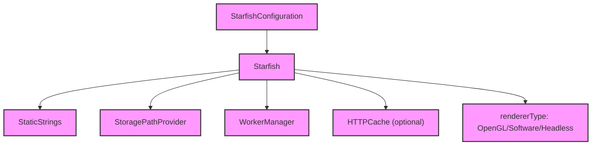

# Module Design Card — core-engine

> **Relevant source files**
> - [`Starfish.h`](src:src/Starfish.h)
> - [`Starfish.cpp`](src:src/Starfish.cpp)
> - [`StarfishBase.h`](src:src/StarfishBase.h)
> - [`StarfishConfig.h`](src:src/StarfishConfig.h)
> - [`StarfishInfo.h`](src:src/StarfishInfo.h)
> - [`StarfishPlatform.h`](src:src/StarfishPlatform.h)
> - [`StaticStrings.h`](src:src/StaticStrings.h)
> - [`StaticStrings.cpp`](src:src/StaticStrings.cpp)
> - [`StoragePathProvider.h`](src:src/StoragePathProvider.h)
> - [`StoragePathProvider.cpp`](src:src/StoragePathProvider.cpp)

## Module Boundary

**Rationale:** Core engine entry point, base types, configuration, static strings, storage path provider [`module-groups.yaml`](src:code2spec/.analysis/state/delta/module-groups.yaml)
**Confidence:** 0.95

## Source Files

10 files in `src/` providing the root `Starfish` class, base type definitions, configuration, static strings, and storage path management.

## Public Interface

| Component | Class | Source |
|---|---|---|
| Engine Root | `Starfish` | [`Starfish.h`](src:src/Starfish.h#L58) |
| Configuration | `StarfishConfiguration` | [`Starfish.h`](src:src/Starfish.h#L49) |
| Static Strings | `StaticStrings` | [`StaticStrings.h`](src:src/StaticStrings.h) |
| Storage Path | `StoragePathProvider` | [`StoragePathProvider.h`](src:src/StoragePathProvider.h) |

## Key Flow

## Architectural Rules

- `Starfish` inherits `gc` (BDWGC) [`Starfish.h`](src:src/Starfish.h#L58)
- `BDWGC_FREE_SPACE_DIVISOR` default: 12 [`Starfish.h`](src:src/Starfish.h#L40)
- Renderer types: kOpenGL, kSoftware, kHeadless [`Starfish.h`](src:src/Starfish.h#L43)
- `StarfishConfiguration`: storageDirectoryPath, gcFrequency, isThreadMode, backend, rendererType [`Starfish.h`](src:src/Starfish.h#L49)
- Constructor is NOT thread-safe [`Starfish.h`](src:src/Starfish.h#L57)
- `STARFISH_LINE_BREAK_ITERATOR_POOL_SIZE` = 4 [`Starfish.cpp`](src:src/Starfish.cpp#L81)
- HTTP cache gated by `STARFISH_ENABLE_HTTPCACHE` [`Starfish.cpp`](src:src/Starfish.cpp#L32)

## Dependencies

| Dependency | Type |
|---|---|
| BDWGC | External |
| Escargot | External (third_party) |
| platform-network (HTTPCache) | Internal |
| platform-message-loop | Internal |
| binding | Internal |

## IPC / Message / Interface Contracts

- No cross-module IPC. Engine core is in-process.

## Quick Navigation

- [FR Document](../functional-requirements/core-engine-fr.md)
- [Architecture](../02-architecture.md)
