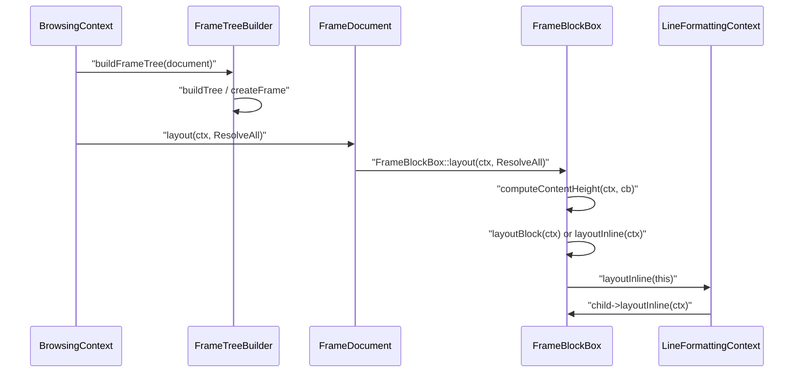
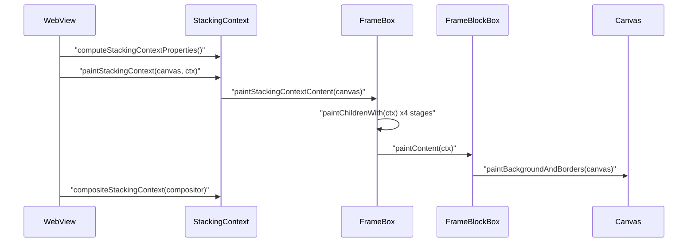
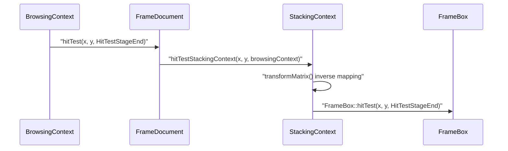

# Module Design Card: core-layout

> **Relevant source files**
>
> - [src/core/layout/ComputeOverflow.h](src:src/core/layout/ComputeOverflow.h)
> - [src/core/layout/Frame.cpp](src:src/core/layout/Frame.cpp)
> - [src/core/layout/Frame.h](src:src/core/layout/Frame.h)
> - [src/core/layout/FrameBlockBox.cpp](src:src/core/layout/FrameBlockBox.cpp)
> - [src/core/layout/FrameBlockBox.h](src:src/core/layout/FrameBlockBox.h)
> - [src/core/layout/FrameBlockBoxBlockLayout.cpp](src:src/core/layout/FrameBlockBoxBlockLayout.cpp)
> - [src/core/layout/FrameBlockBoxInlineLayout.cpp](src:src/core/layout/FrameBlockBoxInlineLayout.cpp)
> - [src/core/layout/FrameBlockBoxInlineLayout.h](src:src/core/layout/FrameBlockBoxInlineLayout.h)
> - [src/core/layout/FrameBox.cpp](src:src/core/layout/FrameBox.cpp)
> - [src/core/layout/FrameBox.h](src:src/core/layout/FrameBox.h)
> - [src/core/layout/FrameButtonBox.cpp](src:src/core/layout/FrameButtonBox.cpp)
> - [src/core/layout/FrameButtonBox.h](src:src/core/layout/FrameButtonBox.h)
> - [src/core/layout/FrameCounterText.cpp](src:src/core/layout/FrameCounterText.cpp)
> - [src/core/layout/FrameCounterText.h](src:src/core/layout/FrameCounterText.h)
> - [src/core/layout/FrameDocument.cpp](src:src/core/layout/FrameDocument.cpp)
> - [src/core/layout/FrameDocument.h](src:src/core/layout/FrameDocument.h)
> - [src/core/layout/FrameFlexibleBox.cpp](src:src/core/layout/FrameFlexibleBox.cpp)
> - [src/core/layout/FrameFlexibleBox.h](src:src/core/layout/FrameFlexibleBox.h)
> - [src/core/layout/FrameGridBox.cpp](src:src/core/layout/FrameGridBox.cpp)
> - [src/core/layout/FrameGridBox.h](src:src/core/layout/FrameGridBox.h)
> - [src/core/layout/FrameInline.cpp](src:src/core/layout/FrameInline.cpp)
> - [src/core/layout/FrameInline.h](src:src/core/layout/FrameInline.h)
> - [src/core/layout/FrameInputBox.cpp](src:src/core/layout/FrameInputBox.cpp)
> - [src/core/layout/FrameInputBox.h](src:src/core/layout/FrameInputBox.h)
> - [src/core/layout/FrameLineBreak.h](src:src/core/layout/FrameLineBreak.h)
> - [src/core/layout/FrameOptGroupBox.cpp](src:src/core/layout/FrameOptGroupBox.cpp)
> - [src/core/layout/FrameOptGroupBox.h](src:src/core/layout/FrameOptGroupBox.h)
> - [src/core/layout/FrameOptionBox.cpp](src:src/core/layout/FrameOptionBox.cpp)
> - [src/core/layout/FrameOptionBox.h](src:src/core/layout/FrameOptionBox.h)
> - [src/core/layout/FrameQuoteText.cpp](src:src/core/layout/FrameQuoteText.cpp)
> - [src/core/layout/FrameQuoteText.h](src:src/core/layout/FrameQuoteText.h)
> - [src/core/layout/FrameReplaced.cpp](src:src/core/layout/FrameReplaced.cpp)
> - [src/core/layout/FrameReplaced.h](src:src/core/layout/FrameReplaced.h)
> - [src/core/layout/FrameReplacedCanvas.cpp](src:src/core/layout/FrameReplacedCanvas.cpp)
> - [src/core/layout/FrameReplacedCanvas.h](src:src/core/layout/FrameReplacedCanvas.h)
> - [src/core/layout/FrameReplacedIFrame.cpp](src:src/core/layout/FrameReplacedIFrame.cpp)
> - [src/core/layout/FrameReplacedIFrame.h](src:src/core/layout/FrameReplacedIFrame.h)
> - [src/core/layout/FrameReplacedImage.cpp](src:src/core/layout/FrameReplacedImage.cpp)
> - [src/core/layout/FrameReplacedImage.h](src:src/core/layout/FrameReplacedImage.h)
> - [src/core/layout/FrameReplacedObject.cpp](src:src/core/layout/FrameReplacedObject.cpp)
> - [src/core/layout/FrameReplacedObject.h](src:src/core/layout/FrameReplacedObject.h)
> - [src/core/layout/FrameReplacedVideo.cpp](src:src/core/layout/FrameReplacedVideo.cpp)
> - [src/core/layout/FrameReplacedVideo.h](src:src/core/layout/FrameReplacedVideo.h)
> - [src/core/layout/FrameSelectBox.cpp](src:src/core/layout/FrameSelectBox.cpp)
> - [src/core/layout/FrameSelectBox.h](src:src/core/layout/FrameSelectBox.h)
> - [src/core/layout/FrameTableBox.cpp](src:src/core/layout/FrameTableBox.cpp)
> - [src/core/layout/FrameTableBox.h](src:src/core/layout/FrameTableBox.h)
> - [src/core/layout/FrameTableCaptionBox.cpp](src:src/core/layout/FrameTableCaptionBox.cpp)
> - [src/core/layout/FrameTableCaptionBox.h](src:src/core/layout/FrameTableCaptionBox.h)
> - [src/core/layout/FrameTableCellBox.cpp](src:src/core/layout/FrameTableCellBox.cpp)
> - [src/core/layout/FrameTableCellBox.h](src:src/core/layout/FrameTableCellBox.h)
> - [src/core/layout/FrameTableColBox.cpp](src:src/core/layout/FrameTableColBox.cpp)
> - [src/core/layout/FrameTableColBox.h](src:src/core/layout/FrameTableColBox.h)
> - [src/core/layout/FrameTableObjectBox.cpp](src:src/core/layout/FrameTableObjectBox.cpp)
> - [src/core/layout/FrameTableObjectBox.h](src:src/core/layout/FrameTableObjectBox.h)
> - [src/core/layout/FrameTableRowBox.cpp](src:src/core/layout/FrameTableRowBox.cpp)
> - [src/core/layout/FrameTableRowBox.h](src:src/core/layout/FrameTableRowBox.h)
> - [src/core/layout/FrameTableSectionBox.cpp](src:src/core/layout/FrameTableSectionBox.cpp)
> - [src/core/layout/FrameTableSectionBox.h](src:src/core/layout/FrameTableSectionBox.h)
> - [src/core/layout/FrameText.h](src:src/core/layout/FrameText.h)
> - [src/core/layout/FrameTreeBuilder.cpp](src:src/core/layout/FrameTreeBuilder.cpp)
> - [src/core/layout/FrameTreeBuilder.h](src:src/core/layout/FrameTreeBuilder.h)
> - [src/core/layout/LayoutRepaintTracker.cpp](src:src/core/layout/LayoutRepaintTracker.cpp)
> - [src/core/layout/LayoutRepaintTracker.h](src:src/core/layout/LayoutRepaintTracker.h)
> - [src/core/layout/LayoutUtil.h](src:src/core/layout/LayoutUtil.h)
> - [src/core/layout/RepaintRegionTracker.cpp](src:src/core/layout/RepaintRegionTracker.cpp)
> - [src/core/layout/RepaintRegionTracker.h](src:src/core/layout/RepaintRegionTracker.h)
> - [src/core/layout/StackingContext.cpp](src:src/core/layout/StackingContext.cpp)
> - [src/core/layout/StackingContext.h](src:src/core/layout/StackingContext.h)
> - [src/core/layout/svg/FrameSVGBox.cpp](src:src/core/layout/svg/FrameSVGBox.cpp)
> - [src/core/layout/svg/FrameSVGBox.h](src:src/core/layout/svg/FrameSVGBox.h)
> - [src/core/layout/svg/FrameSVGCircleBox.cpp](src:src/core/layout/svg/FrameSVGCircleBox.cpp)
> - [src/core/layout/svg/FrameSVGCircleBox.h](src:src/core/layout/svg/FrameSVGCircleBox.h)
> - [src/core/layout/svg/FrameSVGClipPathBox.cpp](src:src/core/layout/svg/FrameSVGClipPathBox.cpp)
> - [src/core/layout/svg/FrameSVGClipPathBox.h](src:src/core/layout/svg/FrameSVGClipPathBox.h)
> - [src/core/layout/svg/FrameSVGEllipseBox.cpp](src:src/core/layout/svg/FrameSVGEllipseBox.cpp)
> - [src/core/layout/svg/FrameSVGEllipseBox.h](src:src/core/layout/svg/FrameSVGEllipseBox.h)
> - [src/core/layout/svg/FrameSVGImageBox.h](src:src/core/layout/svg/FrameSVGImageBox.h)
> - [src/core/layout/svg/FrameSVGInvisibleBox.cpp](src:src/core/layout/svg/FrameSVGInvisibleBox.cpp)
> - [src/core/layout/svg/FrameSVGInvisibleBox.h](src:src/core/layout/svg/FrameSVGInvisibleBox.h)
> - [src/core/layout/svg/FrameSVGLineBox.cpp](src:src/core/layout/svg/FrameSVGLineBox.cpp)
> - [src/core/layout/svg/FrameSVGLineBox.h](src:src/core/layout/svg/FrameSVGLineBox.h)
> - [src/core/layout/svg/FrameSVGMaskBox.cpp](src:src/core/layout/svg/FrameSVGMaskBox.cpp)
> - [src/core/layout/svg/FrameSVGMaskBox.h](src:src/core/layout/svg/FrameSVGMaskBox.h)
> - [src/core/layout/svg/FrameSVGPathBox.cpp](src:src/core/layout/svg/FrameSVGPathBox.cpp)
> - [src/core/layout/svg/FrameSVGPathBox.h](src:src/core/layout/svg/FrameSVGPathBox.h)
> - [src/core/layout/svg/FrameSVGPolygonBox.cpp](src:src/core/layout/svg/FrameSVGPolygonBox.cpp)
> - [src/core/layout/svg/FrameSVGPolygonBox.h](src:src/core/layout/svg/FrameSVGPolygonBox.h)
> - [src/core/layout/svg/FrameSVGPolylineBox.cpp](src:src/core/layout/svg/FrameSVGPolylineBox.cpp)
> - [src/core/layout/svg/FrameSVGPolylineBox.h](src:src/core/layout/svg/FrameSVGPolylineBox.h)
> - [src/core/layout/svg/FrameSVGRectBox.cpp](src:src/core/layout/svg/FrameSVGRectBox.cpp)
> - [src/core/layout/svg/FrameSVGRectBox.h](src:src/core/layout/svg/FrameSVGRectBox.h)
> - [src/core/layout/svg/FrameSVGSVGBox.cpp](src:src/core/layout/svg/FrameSVGSVGBox.cpp)
> - [src/core/layout/svg/FrameSVGSVGBox.h](src:src/core/layout/svg/FrameSVGSVGBox.h)
> - [src/core/layout/svg/FrameSVGTextBox.cpp](src:src/core/layout/svg/FrameSVGTextBox.cpp)
> - [src/core/layout/svg/FrameSVGTextBox.h](src:src/core/layout/svg/FrameSVGTextBox.h)
> - [src/core/layout/svg/FrameSVGUseBox.cpp](src:src/core/layout/svg/FrameSVGUseBox.cpp)
> - [src/core/layout/svg/FrameSVGUseBox.h](src:src/core/layout/svg/FrameSVGUseBox.h)
> - [src/core/layout/svg/FrameSVGViewportContextBox.cpp](src:src/core/layout/svg/FrameSVGViewportContextBox.cpp)
> - [src/core/layout/svg/FrameSVGViewportContextBox.h](src:src/core/layout/svg/FrameSVGViewportContextBox.h)
> - [src/core/layout/svg/FrameTreeBuilderSVG.cpp](src:src/core/layout/svg/FrameTreeBuilderSVG.cpp)
> - [src/core/page/BrowsingContext.cpp](src:src/core/page/BrowsingContext.cpp)
> - [src/core/page/BrowsingContext.h](src:src/core/page/BrowsingContext.h)
> - [src/core/page/WebView.cpp](src:src/core/page/WebView.cpp)
> - [src/core/page/WebView.h](src:src/core/page/WebView.h)
> - [src/core/dom/Document.cpp](src:src/core/dom/Document.cpp)
> - [src/core/dom/Node.cpp](src:src/core/dom/Node.cpp)
> - [src/core/modules/canvas/Canvas.h](src:src/core/modules/canvas/Canvas.h)
> - [src/StarfishConfig.h](src:src/StarfishConfig.h)

**Module**: `core-layout` — 101 files under `src/core/layout/` and `src/core/layout/svg/`
**Role**: Builds the frame tree from the DOM, lays frames out into fixed-point box geometry, establishes stacking contexts, paints and hit-tests them, and tracks repaint regions; the root of the frame class hierarchy is [`Frame`](src:src/core/layout/Frame.h#L1203).
**Module Boundary**: Layout engine directory (Frame, box, block, inline) including its svg/ layout subdirectory which shares the Frame* naming
**Confidence**: 0.92
**Core selection**: All approved modules are Core (boundary approved in W1 human review)
**Generated**: 2026-09-10

## Source Files

### Frame hierarchy and layout core (`src/core/layout/`)
- [src/core/layout/Frame.h](src:src/core/layout/Frame.h), [src/core/layout/Frame.cpp](src:src/core/layout/Frame.cpp)
- [src/core/layout/FrameBox.h](src:src/core/layout/FrameBox.h), [src/core/layout/FrameBox.cpp](src:src/core/layout/FrameBox.cpp)
- [src/core/layout/FrameBlockBox.h](src:src/core/layout/FrameBlockBox.h), [src/core/layout/FrameBlockBox.cpp](src:src/core/layout/FrameBlockBox.cpp)
- [src/core/layout/FrameBlockBoxBlockLayout.cpp](src:src/core/layout/FrameBlockBoxBlockLayout.cpp)
- [src/core/layout/FrameBlockBoxInlineLayout.h](src:src/core/layout/FrameBlockBoxInlineLayout.h), [src/core/layout/FrameBlockBoxInlineLayout.cpp](src:src/core/layout/FrameBlockBoxInlineLayout.cpp)
- [src/core/layout/FrameDocument.h](src:src/core/layout/FrameDocument.h), [src/core/layout/FrameDocument.cpp](src:src/core/layout/FrameDocument.cpp)
- [src/core/layout/FrameInline.h](src:src/core/layout/FrameInline.h), [src/core/layout/FrameInline.cpp](src:src/core/layout/FrameInline.cpp)
- [src/core/layout/FrameText.h](src:src/core/layout/FrameText.h), [src/core/layout/FrameLineBreak.h](src:src/core/layout/FrameLineBreak.h)
- [src/core/layout/FrameCounterText.h](src:src/core/layout/FrameCounterText.h), [src/core/layout/FrameCounterText.cpp](src:src/core/layout/FrameCounterText.cpp)
- [src/core/layout/FrameQuoteText.h](src:src/core/layout/FrameQuoteText.h), [src/core/layout/FrameQuoteText.cpp](src:src/core/layout/FrameQuoteText.cpp)
- [src/core/layout/LayoutUtil.h](src:src/core/layout/LayoutUtil.h), [src/core/layout/ComputeOverflow.h](src:src/core/layout/ComputeOverflow.h)

### Formatting contexts: flex, grid, table
- [src/core/layout/FrameFlexibleBox.h](src:src/core/layout/FrameFlexibleBox.h), [src/core/layout/FrameFlexibleBox.cpp](src:src/core/layout/FrameFlexibleBox.cpp)
- [src/core/layout/FrameGridBox.h](src:src/core/layout/FrameGridBox.h), [src/core/layout/FrameGridBox.cpp](src:src/core/layout/FrameGridBox.cpp)
- [src/core/layout/FrameTableObjectBox.h](src:src/core/layout/FrameTableObjectBox.h), [src/core/layout/FrameTableObjectBox.cpp](src:src/core/layout/FrameTableObjectBox.cpp)
- [src/core/layout/FrameTableBox.h](src:src/core/layout/FrameTableBox.h), [src/core/layout/FrameTableBox.cpp](src:src/core/layout/FrameTableBox.cpp)
- [src/core/layout/FrameTableCaptionBox.h](src:src/core/layout/FrameTableCaptionBox.h), [src/core/layout/FrameTableCaptionBox.cpp](src:src/core/layout/FrameTableCaptionBox.cpp)
- [src/core/layout/FrameTableCellBox.h](src:src/core/layout/FrameTableCellBox.h), [src/core/layout/FrameTableCellBox.cpp](src:src/core/layout/FrameTableCellBox.cpp)
- [src/core/layout/FrameTableColBox.h](src:src/core/layout/FrameTableColBox.h), [src/core/layout/FrameTableColBox.cpp](src:src/core/layout/FrameTableColBox.cpp)
- [src/core/layout/FrameTableRowBox.h](src:src/core/layout/FrameTableRowBox.h), [src/core/layout/FrameTableRowBox.cpp](src:src/core/layout/FrameTableRowBox.cpp)
- [src/core/layout/FrameTableSectionBox.h](src:src/core/layout/FrameTableSectionBox.h), [src/core/layout/FrameTableSectionBox.cpp](src:src/core/layout/FrameTableSectionBox.cpp)

### Replaced and form-control frames
- [src/core/layout/FrameReplaced.h](src:src/core/layout/FrameReplaced.h), [src/core/layout/FrameReplaced.cpp](src:src/core/layout/FrameReplaced.cpp)
- [src/core/layout/FrameReplacedCanvas.h](src:src/core/layout/FrameReplacedCanvas.h), [src/core/layout/FrameReplacedCanvas.cpp](src:src/core/layout/FrameReplacedCanvas.cpp)
- [src/core/layout/FrameReplacedIFrame.h](src:src/core/layout/FrameReplacedIFrame.h), [src/core/layout/FrameReplacedIFrame.cpp](src:src/core/layout/FrameReplacedIFrame.cpp)
- [src/core/layout/FrameReplacedImage.h](src:src/core/layout/FrameReplacedImage.h), [src/core/layout/FrameReplacedImage.cpp](src:src/core/layout/FrameReplacedImage.cpp)
- [src/core/layout/FrameReplacedObject.h](src:src/core/layout/FrameReplacedObject.h), [src/core/layout/FrameReplacedObject.cpp](src:src/core/layout/FrameReplacedObject.cpp)
- [src/core/layout/FrameReplacedVideo.h](src:src/core/layout/FrameReplacedVideo.h), [src/core/layout/FrameReplacedVideo.cpp](src:src/core/layout/FrameReplacedVideo.cpp)
- [src/core/layout/FrameButtonBox.h](src:src/core/layout/FrameButtonBox.h), [src/core/layout/FrameButtonBox.cpp](src:src/core/layout/FrameButtonBox.cpp)
- [src/core/layout/FrameInputBox.h](src:src/core/layout/FrameInputBox.h), [src/core/layout/FrameInputBox.cpp](src:src/core/layout/FrameInputBox.cpp)
- [src/core/layout/FrameSelectBox.h](src:src/core/layout/FrameSelectBox.h), [src/core/layout/FrameSelectBox.cpp](src:src/core/layout/FrameSelectBox.cpp)
- [src/core/layout/FrameOptGroupBox.h](src:src/core/layout/FrameOptGroupBox.h), [src/core/layout/FrameOptGroupBox.cpp](src:src/core/layout/FrameOptGroupBox.cpp)
- [src/core/layout/FrameOptionBox.h](src:src/core/layout/FrameOptionBox.h), [src/core/layout/FrameOptionBox.cpp](src:src/core/layout/FrameOptionBox.cpp)

### Tree building, stacking contexts, repaint tracking
- [src/core/layout/FrameTreeBuilder.h](src:src/core/layout/FrameTreeBuilder.h), [src/core/layout/FrameTreeBuilder.cpp](src:src/core/layout/FrameTreeBuilder.cpp)
- [src/core/layout/StackingContext.h](src:src/core/layout/StackingContext.h), [src/core/layout/StackingContext.cpp](src:src/core/layout/StackingContext.cpp)
- [src/core/layout/LayoutRepaintTracker.h](src:src/core/layout/LayoutRepaintTracker.h), [src/core/layout/LayoutRepaintTracker.cpp](src:src/core/layout/LayoutRepaintTracker.cpp)
- [src/core/layout/RepaintRegionTracker.h](src:src/core/layout/RepaintRegionTracker.h), [src/core/layout/RepaintRegionTracker.cpp](src:src/core/layout/RepaintRegionTracker.cpp)

### SVG layout (`src/core/layout/svg/`)
- [src/core/layout/svg/FrameSVGBox.h](src:src/core/layout/svg/FrameSVGBox.h), [src/core/layout/svg/FrameSVGBox.cpp](src:src/core/layout/svg/FrameSVGBox.cpp)
- [src/core/layout/svg/FrameSVGSVGBox.h](src:src/core/layout/svg/FrameSVGSVGBox.h), [src/core/layout/svg/FrameSVGSVGBox.cpp](src:src/core/layout/svg/FrameSVGSVGBox.cpp)
- [src/core/layout/svg/FrameSVGCircleBox.h](src:src/core/layout/svg/FrameSVGCircleBox.h), [src/core/layout/svg/FrameSVGCircleBox.cpp](src:src/core/layout/svg/FrameSVGCircleBox.cpp)
- [src/core/layout/svg/FrameSVGClipPathBox.h](src:src/core/layout/svg/FrameSVGClipPathBox.h), [src/core/layout/svg/FrameSVGClipPathBox.cpp](src:src/core/layout/svg/FrameSVGClipPathBox.cpp)
- [src/core/layout/svg/FrameSVGEllipseBox.h](src:src/core/layout/svg/FrameSVGEllipseBox.h), [src/core/layout/svg/FrameSVGEllipseBox.cpp](src:src/core/layout/svg/FrameSVGEllipseBox.cpp)
- [src/core/layout/svg/FrameSVGImageBox.h](src:src/core/layout/svg/FrameSVGImageBox.h)
- [src/core/layout/svg/FrameSVGInvisibleBox.h](src:src/core/layout/svg/FrameSVGInvisibleBox.h), [src/core/layout/svg/FrameSVGInvisibleBox.cpp](src:src/core/layout/svg/FrameSVGInvisibleBox.cpp)
- [src/core/layout/svg/FrameSVGLineBox.h](src:src/core/layout/svg/FrameSVGLineBox.h), [src/core/layout/svg/FrameSVGLineBox.cpp](src:src/core/layout/svg/FrameSVGLineBox.cpp)
- [src/core/layout/svg/FrameSVGMaskBox.h](src:src/core/layout/svg/FrameSVGMaskBox.h), [src/core/layout/svg/FrameSVGMaskBox.cpp](src:src/core/layout/svg/FrameSVGMaskBox.cpp)
- [src/core/layout/svg/FrameSVGPathBox.h](src:src/core/layout/svg/FrameSVGPathBox.h), [src/core/layout/svg/FrameSVGPathBox.cpp](src:src/core/layout/svg/FrameSVGPathBox.cpp)
- [src/core/layout/svg/FrameSVGPolygonBox.h](src:src/core/layout/svg/FrameSVGPolygonBox.h), [src/core/layout/svg/FrameSVGPolygonBox.cpp](src:src/core/layout/svg/FrameSVGPolygonBox.cpp)
- [src/core/layout/svg/FrameSVGPolylineBox.h](src:src/core/layout/svg/FrameSVGPolylineBox.h), [src/core/layout/svg/FrameSVGPolylineBox.cpp](src:src/core/layout/svg/FrameSVGPolylineBox.cpp)
- [src/core/layout/svg/FrameSVGRectBox.h](src:src/core/layout/svg/FrameSVGRectBox.h), [src/core/layout/svg/FrameSVGRectBox.cpp](src:src/core/layout/svg/FrameSVGRectBox.cpp)
- [src/core/layout/svg/FrameSVGTextBox.h](src:src/core/layout/svg/FrameSVGTextBox.h), [src/core/layout/svg/FrameSVGTextBox.cpp](src:src/core/layout/svg/FrameSVGTextBox.cpp)
- [src/core/layout/svg/FrameSVGUseBox.h](src:src/core/layout/svg/FrameSVGUseBox.h), [src/core/layout/svg/FrameSVGUseBox.cpp](src:src/core/layout/svg/FrameSVGUseBox.cpp)
- [src/core/layout/svg/FrameSVGViewportContextBox.h](src:src/core/layout/svg/FrameSVGViewportContextBox.h), [src/core/layout/svg/FrameSVGViewportContextBox.cpp](src:src/core/layout/svg/FrameSVGViewportContextBox.cpp)
- [src/core/layout/svg/FrameTreeBuilderSVG.cpp](src:src/core/layout/svg/FrameTreeBuilderSVG.cpp)

## Public Interface

| Function/Class | Signature | Main callers | Source |
|---|---|---|---|
| `FrameTreeBuilder::buildFrameTree` | `static void buildFrameTree(Document* document)` | src/core/page/BrowsingContext.cpp (`buildFrameTreeIfNeeds`) | [`FrameTreeBuilder::buildFrameTree`](src:src/core/layout/FrameTreeBuilder.cpp#L1241) |
| `FrameTreeBuilder::clearTree` | `static void clearTree(Node* current)` | src/core/dom/Node.cpp | [`FrameTreeBuilder::clearTree`](src:src/core/layout/FrameTreeBuilder.cpp#L152) |
| `FrameTreeBuilder::buildSVGFrameTree` | `static Frame* buildSVGFrameTree(SVGElement* svgElement, Optional<Frame*> parentFrame, bool force)` | src/core/layout/FrameTreeBuilder.cpp (tree build), includers of FrameTreeBuilder.h | [`FrameTreeBuilder::buildSVGFrameTree`](src:src/core/layout/svg/FrameTreeBuilderSVG.cpp#L63) |
| `FrameDocument` | `FrameDocument(Node* node)` | src/core/dom/Document.cpp | [`FrameDocument`](src:src/core/layout/FrameDocument.h#L31) |
| `LayoutContext` | `LayoutContext(Starfish* starfish, FrameDocument* frameDocument)` | src/core/page/BrowsingContext.cpp (`layoutIfNeeded`, `layoutSVGViewportsNeedingContentLayout`) | [`LayoutContext`](src:src/core/layout/Frame.h#L284) |
| `Frame::layout` | `virtual void layout(LayoutContext& ctx, LayoutWantToResolve resolveWhat)` | src/core/page/BrowsingContext.cpp | [`Frame::layout`](src:src/core/layout/Frame.h#L1847) |
| `Frame::hitTest` | `virtual Frame* hitTest(LayoutUnit x, LayoutUnit y, HitTestStage stage)` | src/core/page/BrowsingContext.cpp | [`Frame::hitTest`](src:src/core/layout/Frame.h#L2110) |
| `Frame::markNeedsLayout` | `void markNeedsLayout()` | src/core/dom (includers of Frame.h / FrameBlockBox.h) | [`Frame::markNeedsLayout`](src:src/core/layout/Frame.h#L2002) |
| `FrameBox::stackingContext` | `StackingContext* stackingContext()` | src/core/dom/Element.cpp, src/core/dom/Node.cpp, src/core/dom/Scrolling.cpp (includers of StackingContext.h) | [`FrameBox::stackingContext`](src:src/core/layout/FrameBox.h#L324) |
| `FrameBox::absoluteRect` | `LayoutRect absoluteRect(FrameBox* top)` | src/core/dom/Range.cpp, src/core/dom/HTMLElement.cpp (includers of FrameBox.h) | [`FrameBox::absoluteRect`](src:src/core/layout/FrameBox.h#L951) |
| `FrameBlockBox::scrollWidth` | `LayoutUnit scrollWidth()` | src/core/dom/Element.cpp, src/core/dom/Node.cpp (includers of FrameBlockBox.h) | [`FrameBlockBox::scrollWidth`](src:src/core/layout/FrameBlockBox.h#L752) |
| `FrameBlockBox::computeScrollRectIfNeeded` | `void computeScrollRectIfNeeded()` | src/core/page/BrowsingContext.cpp | [`FrameBlockBox::computeScrollRectIfNeeded`](src:src/core/layout/FrameBlockBox.h#L939) |
| `StackingContext::computeStackingContextProperties` | `void computeStackingContextProperties()` | src/core/page/WebView.cpp (`layoutIfNeeded`) | [`StackingContext::computeStackingContextProperties`](src:src/core/layout/StackingContext.h#L197) |
| `StackingContext::paintStackingContext` | `void paintStackingContext(Canvas* canvas, PaintingStackingContextContext& ctx)` | src/core/page/WebView.cpp (`rendering`) | [`StackingContext::paintStackingContext`](src:src/core/layout/StackingContext.h#L223) |
| `StackingContext::compositeStackingContext` | `void compositeStackingContext(Compositor* compositor)` | src/core/page/WebView.cpp (`rendering`) | [`StackingContext::compositeStackingContext`](src:src/core/layout/StackingContext.h#L228) |
| `StackingContext::hitTestStackingContext` | `Frame* hitTestStackingContext(LayoutUnit x, LayoutUnit y, BrowsingContext* from)` | src/core/layout/FrameDocument.cpp (`FrameDocument::hitTest`) | [`StackingContext::hitTestStackingContext`](src:src/core/layout/StackingContext.h#L230) |
| `LayoutRepaintTracker::traceRepaintRegion` | `bool traceRepaintRegion(FrameDocument* fd)` | src/core/page/BrowsingContext.cpp (`computeLayoutPaintingDirty`) | [`LayoutRepaintTracker::traceRepaintRegion`](src:src/core/layout/LayoutRepaintTracker.cpp#L404) |
| `RepaintRegionTracker` | `RepaintRegionTracker(const RepaintRegionTrackerContext& oldContext, RepaintRegionTrackerContext& newContext, FrameBox* rootFrame, bool needsFullPainting, PrevDrawnStackingContextInfoMap& prevDrawnStackingContextInfoMap, LayoutUnit sx, LayoutUnit sy, bool wc)` | src/core/page/WebView.cpp (`rendering`) | [`RepaintRegionTracker`](src:src/core/layout/RepaintRegionTracker.cpp#L87) |
| `FrameSVGSVGBox::layoutSVGContent` | `void layoutSVGContent(LayoutContext& ctx)` | src/core/page/BrowsingContext.cpp (`layoutSVGViewportsNeedingContentLayout`) | [`FrameSVGSVGBox::layoutSVGContent`](src:src/core/layout/svg/FrameSVGSVGBox.h#L66) |
| `LayoutUnit` | `class LayoutUnit` | src/StarfishConfig.h, src/core/style/Length.h | [`LayoutUnit`](src:src/core/layout/LayoutUtil.h#L142) |

## IPC / Message / Interface Contracts

- No cross-module IPC or message contract is identifiable in code for this module.

## Key Flow

Entry symbol: [`BrowsingContext::layoutIfNeeded`](src:src/core/page/BrowsingContext.h#L297) builds the tree via [`FrameTreeBuilder::buildFrameTree`](src:src/core/layout/FrameTreeBuilder.cpp#L1241), then calls [`FrameDocument::layout`](src:src/core/layout/FrameDocument.cpp#L46), which delegates to [`FrameBlockBox::layout`](src:src/core/layout/FrameBlockBox.cpp#L601); [`FrameBlockBox::computeContentHeight`](src:src/core/layout/FrameBlockBox.cpp#L195) selects [`FrameBlockBox::layoutBlock`](src:src/core/layout/FrameBlockBoxBlockLayout.cpp#L127) or [`FrameBlockBox::layoutInline`](src:src/core/layout/FrameBlockBoxInlineLayout.cpp#L4004), the latter driving [`LineFormattingContext::layoutInline`](src:src/core/layout/FrameBlockBoxInlineLayout.cpp#L3466).

Entry symbol: [`WebView::rendering`](src:src/core/page/WebView.cpp#L1442) calls [`StackingContext::paintStackingContext`](src:src/core/layout/StackingContext.cpp#L2535) on the root context; [`FrameBox::paintStackingContextContent`](src:src/core/layout/FrameBox.cpp#L3578) runs [`FrameBox::paintChildrenWith`](src:src/core/layout/FrameBox.cpp#L3565) once per `PaintingStage`, reaching [`FrameBlockBox::paintContent`](src:src/core/layout/FrameBlockBoxInlineLayout.cpp#L4930).

Entry symbol: [`FrameDocument::hitTest`](src:src/core/layout/FrameDocument.cpp#L124) forwards to [`StackingContext::hitTestStackingContext`](src:src/core/layout/StackingContext.cpp#L3275), which inverts the context's transform before testing frame rectangles with [`FrameBox::hitTest`](src:src/core/layout/FrameBox.h#L903).

## Architectural Rules

- [ ] Every layout object derives from the garbage-collected base `Frame : public gc`; the concrete type is queried through virtual `isFrameX()` predicates rather than RTTI. [`Frame`](src:src/core/layout/Frame.h#L1203), [`Frame::isFrameBox`](src:src/core/layout/Frame.h#L1225)
- [ ] All geometry is stored in fixed-point `LayoutUnit` with denominator 64. [`kFixedPointDenominator`](src:src/core/layout/LayoutUtil.h#L136), [`LayoutUnit`](src:src/core/layout/LayoutUtil.h#L142)
- [ ] `Frame::layout`, `Frame::computePreferredWidth`, `Frame::layoutInline` and `Frame::hitTest` are virtual with unreachable-asserting defaults; each concrete frame class overrides the operations it supports. [`Frame::layout`](src:src/core/layout/Frame.h#L1847), [`Frame::computePreferredWidth`](src:src/core/layout/Frame.h#L1877), [`Frame::layoutInline`](src:src/core/layout/Frame.h#L1882)
- [ ] Frame class selection is driven by the node type and the computed `display` value in one factory function. [`FrameTreeBuilder::createFrame`](src:src/core/layout/FrameTreeBuilder.cpp#L798)
- [ ] A block box chooses its inner formatting context (table, flex, grid, block flow, inline flow) in `computeContentHeight`; block flow is selected when the first child is block-level and in normal flow. [`FrameBlockBox::computeContentHeight`](src:src/core/layout/FrameBlockBox.cpp#L195), [`FrameBlockBox::hasBlockFlow`](src:src/core/layout/FrameBlockBox.h#L859)
- [ ] Painting proceeds in a fixed stage order: normal-flow blocks, non-positioned floats, replaced blocks, then normal-flow inlines. [`PaintingStage`](src:src/core/layout/Frame.h#L71), [`FrameBox::paintStackingContextContent`](src:src/core/layout/FrameBox.cpp#L3578)
- [ ] A `StackingContext` is created for a box only when `needToEstablishStackingContext()` is true; the root element of the top-level browsing context gets a context with a null parent. [`FrameBox::establishesStackingContextIfNeedsAndComputingPaintingFlags`](src:src/core/layout/FrameBox.cpp#L3600), [`StackingContext`](src:src/core/layout/StackingContext.h#L149)
- [ ] Layout is incremental: a frame is re-laid out only when `needsLayout()` is set or a `LayoutDamager` check finds a damaging container/viewport change. [`Frame::shouldLayout`](src:src/core/layout/Frame.cpp#L2169), [`LayoutDamager`](src:src/core/layout/Frame.cpp#L2059)

## Dependencies

### Internal modules

| Module | File(s) | Purpose | Source |
|---|---|---|---|
| core-dom | src/core/layout/Frame.cpp, src/core/layout/FrameTreeBuilder.cpp, src/core/layout/FrameBox.cpp | `Node`/`Document` access for building frames and reading node state | [`Frame.cpp`](src:src/core/layout/Frame.cpp#L21), [`FrameTreeBuilder.cpp`](src:src/core/layout/FrameTreeBuilder.cpp#L21) |
| core-style | src/core/layout/Frame.cpp, src/core/layout/Frame.h | `ComputedStyle` values (display, position, margins, overflow) that drive layout | [`Frame.cpp`](src:src/core/layout/Frame.cpp#L27), [`Frame::style`](src:src/core/layout/Frame.h#L1611) |
| core-page | src/core/layout/FrameBox.cpp, src/core/layout/FrameBlockBoxInlineLayout.cpp, src/core/layout/StackingContext.h | `WebView`/`BrowsingContext` state (previous stacking-context info, render results) | [`FrameBox.cpp`](src:src/core/layout/FrameBox.cpp#L41), [`StackingContext.h`](src:src/core/layout/StackingContext.h#L23) |
| modules-canvas | src/core/layout/FrameBox.cpp, src/core/layout/FrameBlockBoxInlineLayout.cpp, src/core/layout/FrameReplacedImage.cpp | `Canvas` drawing and native image data used by paint routines | [`FrameBox.cpp`](src:src/core/layout/FrameBox.cpp#L35), [`FrameReplacedImage.cpp`](src:src/core/layout/FrameReplacedImage.cpp#L26) |
| core-dom-svg | src/core/layout/svg/FrameTreeBuilderSVG.cpp | `SVGElement` tree used to build SVG frames | [`FrameTreeBuilderSVG.cpp`](src:src/core/layout/svg/FrameTreeBuilderSVG.cpp#L23) |
| core-dom-canvas | src/core/layout/FrameReplacedCanvas.cpp | `HTMLCanvasElement` / rendering context for canvas replaced frames | [`FrameReplacedCanvas.cpp`](src:src/core/layout/FrameReplacedCanvas.cpp#L30) |
| engine-entry | src/core/layout/FrameBox.cpp, src/core/layout/FrameBlockBoxInlineLayout.cpp | `Starfish` instance (line-break iterator pool, static strings) and global config | [`FrameBlockBoxInlineLayout.cpp`](src:src/core/layout/FrameBlockBoxInlineLayout.cpp#L21), [`FrameBox.cpp`](src:src/core/layout/FrameBox.cpp#L20) |
| core-util | src/core/layout/Frame.h | `PoolAllocator` for `LayoutContext` per-layout allocations | [`Frame.h`](src:src/core/layout/Frame.h#L23) |
| core-animation | src/core/layout/StackingContext.cpp | Animation task/executor queries when computing stacking-context properties | [`StackingContext.cpp`](src:src/core/layout/StackingContext.cpp#L32) |
| platform-network-loader | src/core/layout/FrameBox.cpp, src/core/layout/FrameReplacedImage.cpp | `ResourceLoader` for background/replaced image resources | [`FrameReplacedImage.cpp`](src:src/core/layout/FrameReplacedImage.cpp#L31) |
| platform-multimedia | src/core/layout/FrameReplacedVideo.cpp | `MediaPlayer` for video replaced frames | [`FrameReplacedVideo.cpp`](src:src/core/layout/FrameReplacedVideo.cpp#L30) |
| binding | src/core/layout/FrameReplacedCanvas.cpp | Generated union type for canvas rendering contexts | [`FrameReplacedCanvas.cpp`](src:src/core/layout/FrameReplacedCanvas.cpp#L31) |

### External libraries

| Library | Version | Purpose | Source |
|---|---|---|---|
| ICU (`UBreakIterator`, `ubrk_*`) | Not specified in code | Line-break iteration when tokenizing text for inline layout | [`tokenizeText`](src:src/core/layout/FrameBlockBoxInlineLayout.cpp#L3055), [`FrameBlockBoxInlineLayout.cpp`](src:src/core/layout/FrameBlockBoxInlineLayout.cpp#L3081) |
| Skia (`SkMatrix`, via `core/modules/canvas/Canvas.h`) | Not specified in code | Transform matrices for stacking contexts and SVG layout | [`Canvas.h`](src:src/core/modules/canvas/Canvas.h#L25), [`StackingContext::computeTransformMatrix`](src:src/core/layout/StackingContext.cpp#L593) |
| Boehm GC (`gc` base class, `GC_word`, `GCVector`) | Not specified in code | Garbage-collected allocation of all frame and stacking-context objects | [`Frame`](src:src/core/layout/Frame.h#L1203), [`StackingContext`](src:src/core/layout/StackingContext.h#L146) |

## Quick Navigation

| To change… | Location |
|---|---|
| Which frame class is created for a DOM node / display value | [`FrameTreeBuilder::createFrame`](src:src/core/layout/FrameTreeBuilder.cpp#L798) |
| Block box width/height resolution and formatting-context dispatch | [`FrameBlockBox::layout`](src:src/core/layout/FrameBlockBox.cpp#L601), [`FrameBlockBox::computeContentHeight`](src:src/core/layout/FrameBlockBox.cpp#L195) |
| Block-flow child placement and margin collapsing | [`FrameBlockBox::layoutBlock`](src:src/core/layout/FrameBlockBoxBlockLayout.cpp#L127) |
| Line breaking, word insertion, inline box placement | [`LineFormattingContext`](src:src/core/layout/FrameBlockBox.h#L1170), [`LineFormattingContext::insertWord`](src:src/core/layout/FrameBlockBoxInlineLayout.cpp#L2553) |
| Text tokenization (white space, ICU line breaks) | [`tokenizeText`](src:src/core/layout/FrameBlockBoxInlineLayout.cpp#L3055), [`LineFormattingContext::handleTextToken`](src:src/core/layout/FrameBlockBoxInlineLayout.cpp#L2976) |
| Preferred (min/max) width computation | [`FrameBlockBox::computePreferredWidth`](src:src/core/layout/FrameBlockBoxInlineLayout.cpp#L4537), [`PreferredWidthContext`](src:src/core/layout/Frame.h#L899) |
| Flex / grid / table algorithms | [`FrameFlexibleBox::layoutFlex`](src:src/core/layout/FrameFlexibleBox.cpp#L1933), [`FrameGridBox::layoutGrid`](src:src/core/layout/FrameGridBox.cpp#L2308), [`FrameTableBox::layoutTable`](src:src/core/layout/FrameTableBox.cpp#L79) |
| Background, border, shadow painting | [`FrameBox::paintBackgroundAndBorders`](src:src/core/layout/FrameBox.cpp#L953), [`FrameBox::paintBorders`](src:src/core/layout/FrameBox.cpp#L2302) |
| Stacking-context creation and graphics-buffer decisions | [`FrameBox::establishesStackingContextIfNeedsAndComputingPaintingFlags`](src:src/core/layout/FrameBox.cpp#L3600), [`StackingContext::computeStackingContextProperties`](src:src/core/layout/StackingContext.cpp#L707) |
| Paint order of a stacking context (opacity, blend, transform) | [`StackingContext::paintStackingContext`](src:src/core/layout/StackingContext.cpp#L2535) |
| Hit testing through transforms and iframes | [`StackingContext::hitTestStackingContext`](src:src/core/layout/StackingContext.cpp#L3275) |
| Repaint-region tracking after layout / before rendering | [`LayoutRepaintTracker::traceRepaintRegion`](src:src/core/layout/LayoutRepaintTracker.cpp#L404), [`RepaintRegionTracker::notifyDirty`](src:src/core/layout/RepaintRegionTracker.cpp#L173) |
| SVG viewport and shape layout | [`FrameSVGSVGBox::layoutSVGContent`](src:src/core/layout/svg/FrameSVGSVGBox.cpp#L252), [`FrameSVGBox::layout`](src:src/core/layout/svg/FrameSVGBox.cpp#L373) |

## FR Linkage

- [FR-CORE-LAYOUT-001](../functional-requirements/core-layout-fr.md#fr-core-layout-001): Build the frame tree from the DOM according to node type and display value
- [FR-CORE-LAYOUT-002](../functional-requirements/core-layout-fr.md#fr-core-layout-002): Lay out the document root to the window viewport size
- [FR-CORE-LAYOUT-003](../functional-requirements/core-layout-fr.md#fr-core-layout-003): Resolve block box size and select the inner formatting context
- [FR-CORE-LAYOUT-004](../functional-requirements/core-layout-fr.md#fr-core-layout-004): Place block-flow children with margin collapsing
- [FR-CORE-LAYOUT-005](../functional-requirements/core-layout-fr.md#fr-core-layout-005): Lay out inline content into line boxes
- [FR-CORE-LAYOUT-006](../functional-requirements/core-layout-fr.md#fr-core-layout-006): Tokenize text for inline layout
- [FR-CORE-LAYOUT-007](../functional-requirements/core-layout-fr.md#fr-core-layout-007): Compute preferred widths for shrink-to-fit sizing
- [FR-CORE-LAYOUT-008](../functional-requirements/core-layout-fr.md#fr-core-layout-008): Skip layout of undamaged frames
- [FR-CORE-LAYOUT-009](../functional-requirements/core-layout-fr.md#fr-core-layout-009): Establish stacking contexts and compute their compositing properties
- [FR-CORE-LAYOUT-010](../functional-requirements/core-layout-fr.md#fr-core-layout-010): Paint a stacking context in stage order
- [FR-CORE-LAYOUT-011](../functional-requirements/core-layout-fr.md#fr-core-layout-011): Hit-test a point to a frame
- [FR-CORE-LAYOUT-012](../functional-requirements/core-layout-fr.md#fr-core-layout-012): Lay out SVG viewport content
