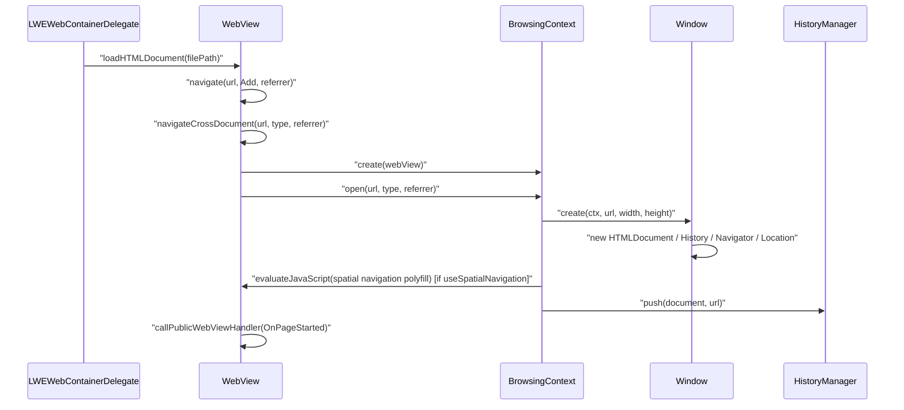
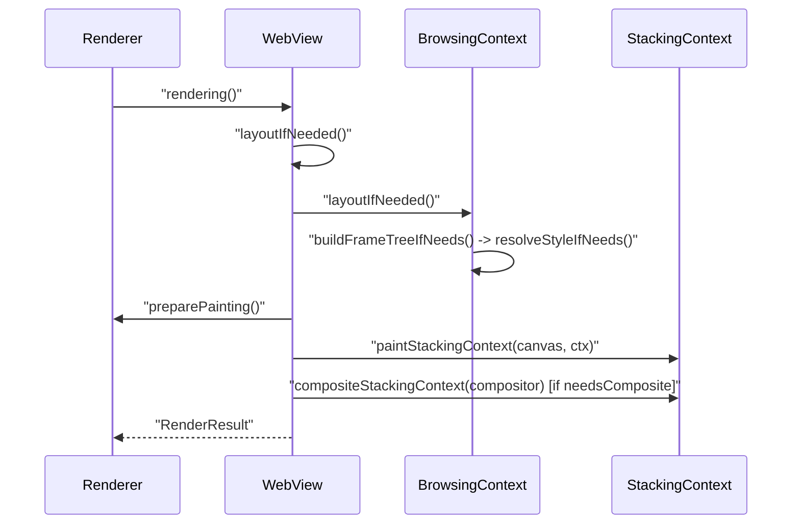
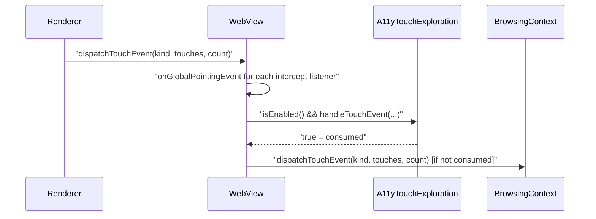

# Module Design Card: core-page

> **Relevant source files**
>
> - [src/core/page/A11yAtspiTreeSource.cpp](src:src/core/page/A11yAtspiTreeSource.cpp)
> - [src/core/page/A11yAtspiTreeSource.h](src:src/core/page/A11yAtspiTreeSource.h)
> - [src/core/page/A11yTouchExploration.cpp](src:src/core/page/A11yTouchExploration.cpp)
> - [src/core/page/A11yTouchExploration.h](src:src/core/page/A11yTouchExploration.h)
> - [src/core/page/BrowsingContext.cpp](src:src/core/page/BrowsingContext.cpp)
> - [src/core/page/BrowsingContext.h](src:src/core/page/BrowsingContext.h)
> - [src/core/page/EventSource.cpp](src:src/core/page/EventSource.cpp)
> - [src/core/page/EventSource.h](src:src/core/page/EventSource.h)
> - [src/core/page/EventSourceParser.cpp](src:src/core/page/EventSourceParser.cpp)
> - [src/core/page/EventSourceParser.h](src:src/core/page/EventSourceParser.h)
> - [src/core/page/GlobalScope.h](src:src/core/page/GlobalScope.h)
> - [src/core/page/HashChangeEvent.cpp](src:src/core/page/HashChangeEvent.cpp)
> - [src/core/page/HashChangeEvent.h](src:src/core/page/HashChangeEvent.h)
> - [src/core/page/History.cpp](src:src/core/page/History.cpp)
> - [src/core/page/History.h](src:src/core/page/History.h)
> - [src/core/page/Location.cpp](src:src/core/page/Location.cpp)
> - [src/core/page/Location.h](src:src/core/page/Location.h)
> - [src/core/page/MediaCapabilities.cpp](src:src/core/page/MediaCapabilities.cpp)
> - [src/core/page/MediaCapabilities.h](src:src/core/page/MediaCapabilities.h)
> - [src/core/page/Navigator.cpp](src:src/core/page/Navigator.cpp)
> - [src/core/page/Navigator.h](src:src/core/page/Navigator.h)
> - [src/core/page/NavigatorMixin.cpp](src:src/core/page/NavigatorMixin.cpp)
> - [src/core/page/NavigatorMixin.h](src:src/core/page/NavigatorMixin.h)
> - [src/core/page/PopStateEvent.cpp](src:src/core/page/PopStateEvent.cpp)
> - [src/core/page/PopStateEvent.h](src:src/core/page/PopStateEvent.h)
> - [src/core/page/RenderResult.h](src:src/core/page/RenderResult.h)
> - [src/core/page/Screen.cpp](src:src/core/page/Screen.cpp)
> - [src/core/page/Screen.h](src:src/core/page/Screen.h)
> - [src/core/page/ScrollOptions.h](src:src/core/page/ScrollOptions.h)
> - [src/core/page/WebBase.cpp](src:src/core/page/WebBase.cpp)
> - [src/core/page/WebBase.h](src:src/core/page/WebBase.h)
> - [src/core/page/WebView.cpp](src:src/core/page/WebView.cpp)
> - [src/core/page/WebView.h](src:src/core/page/WebView.h)
> - [src/core/page/Window.cpp](src:src/core/page/Window.cpp)
> - [src/core/page/Window.h](src:src/core/page/Window.h)
> - [src/core/page/WindowOrWorkerGlobalScope.cpp](src:src/core/page/WindowOrWorkerGlobalScope.cpp)
> - [src/core/page/WindowOrWorkerGlobalScope.h](src:src/core/page/WindowOrWorkerGlobalScope.h)
> - [src/core/page/spatial-navigation-polyfill.js](src:src/core/page/spatial-navigation-polyfill.js)
> - [src/core/modules/renderer/Renderer.cpp](src:src/core/modules/renderer/Renderer.cpp)
> - [src/public/delegate/LWEWebContainerDelegate.cpp](src:src/public/delegate/LWEWebContainerDelegate.cpp)
> - [src/public/bridge/efl/A11yAtspiBridge.cpp](src:src/public/bridge/efl/A11yAtspiBridge.cpp)
> - [src/core/cdp/domains/TargetDomain.cpp](src:src/core/cdp/domains/TargetDomain.cpp)
> - [src/core/cdp/domains/InputDomain.cpp](src:src/core/cdp/domains/InputDomain.cpp)
> - [src/core/dom/Document.cpp](src:src/core/dom/Document.cpp)
> - [src/core/dom/Element.cpp](src:src/core/dom/Element.cpp)
> - [src/core/dom/HTMLSelectElement.cpp](src:src/core/dom/HTMLSelectElement.cpp)
> - [src/browser/history/HistoryManager.cpp](src:src/browser/history/HistoryManager.cpp)
> - [src/platform/loader/ResourceLoader.cpp](src:src/platform/loader/ResourceLoader.cpp)
> - [src/core/inspector/Inspector.cpp](src:src/core/inspector/Inspector.cpp)

**Module**: `core-page` — 38 files under `src/core/page/`
**Role**: Owns the per-page engine object [`WebView`](src:src/core/page/WebView.h#L98) that creates the top-level [`BrowsingContext`](src:src/core/page/BrowsingContext.h#L56), opens a [`Window`](src:src/core/page/Window.h#L57) with its document, drives the rendering pass via [`WebView::rendering`](src:src/core/page/WebView.cpp#L1442), routes platform input into the page, and exposes the window-level web APIs (Navigator, Location, History, Screen, EventSource) plus the accessibility tree source.
**Module Boundary**: Page/window/navigator and accessibility tree directory (WebView, Window, A11y*)
**Confidence**: 0.9
**Core selection**: All approved modules are Core (boundary approved in W1 human review)
**Generated**: 2026-09-10

## Source Files

Page object and browsing context:
- [src/core/page/WebBase.h](src:src/core/page/WebBase.h), [src/core/page/WebBase.cpp](src:src/core/page/WebBase.cpp)
- [src/core/page/WebView.h](src:src/core/page/WebView.h), [src/core/page/WebView.cpp](src:src/core/page/WebView.cpp)
- [src/core/page/BrowsingContext.h](src:src/core/page/BrowsingContext.h), [src/core/page/BrowsingContext.cpp](src:src/core/page/BrowsingContext.cpp)
- [src/core/page/RenderResult.h](src:src/core/page/RenderResult.h)

Window global scope and window-level APIs:
- [src/core/page/GlobalScope.h](src:src/core/page/GlobalScope.h)
- [src/core/page/Window.h](src:src/core/page/Window.h), [src/core/page/Window.cpp](src:src/core/page/Window.cpp)
- [src/core/page/WindowOrWorkerGlobalScope.h](src:src/core/page/WindowOrWorkerGlobalScope.h), [src/core/page/WindowOrWorkerGlobalScope.cpp](src:src/core/page/WindowOrWorkerGlobalScope.cpp)
- [src/core/page/ScrollOptions.h](src:src/core/page/ScrollOptions.h)
- [src/core/page/Navigator.h](src:src/core/page/Navigator.h), [src/core/page/Navigator.cpp](src:src/core/page/Navigator.cpp)
- [src/core/page/NavigatorMixin.h](src:src/core/page/NavigatorMixin.h), [src/core/page/NavigatorMixin.cpp](src:src/core/page/NavigatorMixin.cpp)
- [src/core/page/MediaCapabilities.h](src:src/core/page/MediaCapabilities.h), [src/core/page/MediaCapabilities.cpp](src:src/core/page/MediaCapabilities.cpp)
- [src/core/page/Screen.h](src:src/core/page/Screen.h), [src/core/page/Screen.cpp](src:src/core/page/Screen.cpp)

Navigation state and events:
- [src/core/page/Location.h](src:src/core/page/Location.h), [src/core/page/Location.cpp](src:src/core/page/Location.cpp)
- [src/core/page/History.h](src:src/core/page/History.h), [src/core/page/History.cpp](src:src/core/page/History.cpp)
- [src/core/page/HashChangeEvent.h](src:src/core/page/HashChangeEvent.h), [src/core/page/HashChangeEvent.cpp](src:src/core/page/HashChangeEvent.cpp)
- [src/core/page/PopStateEvent.h](src:src/core/page/PopStateEvent.h), [src/core/page/PopStateEvent.cpp](src:src/core/page/PopStateEvent.cpp)

Server-sent events:
- [src/core/page/EventSource.h](src:src/core/page/EventSource.h), [src/core/page/EventSource.cpp](src:src/core/page/EventSource.cpp)
- [src/core/page/EventSourceParser.h](src:src/core/page/EventSourceParser.h), [src/core/page/EventSourceParser.cpp](src:src/core/page/EventSourceParser.cpp)

Accessibility:
- [src/core/page/A11yAtspiTreeSource.h](src:src/core/page/A11yAtspiTreeSource.h), [src/core/page/A11yAtspiTreeSource.cpp](src:src/core/page/A11yAtspiTreeSource.cpp)
- [src/core/page/A11yTouchExploration.h](src:src/core/page/A11yTouchExploration.h), [src/core/page/A11yTouchExploration.cpp](src:src/core/page/A11yTouchExploration.cpp)

Embedded script:
- [src/core/page/spatial-navigation-polyfill.js](src:src/core/page/spatial-navigation-polyfill.js) — included as a C string literal by [`BrowsingContext::open`](src:src/core/page/BrowsingContext.cpp#L166) (include at [`BrowsingContext.cpp`](src:src/core/page/BrowsingContext.cpp#L196))

## Public Interface

| Function/Class | Signature | Main callers | Source |
|---|---|---|---|
| `WebView::create` | `static WebView* create(Starfish*, const char* locale, const char* timezoneID, uint32_t w, uint32_t h, uint32_t defaultFontSize, String* defaultFontName, const ScreenInfo&, String* customUserAgentString, String* builtinPolyfillPathString)` | [`LWEWebContainerDelegate.cpp`](src:src/public/delegate/LWEWebContainerDelegate.cpp#L187), [`TargetDomain.cpp`](src:src/core/cdp/domains/TargetDomain.cpp#L66) | [`WebView::create`](src:src/core/page/WebView.h#L106) |
| `WebView::destroy` | `void destroy()` | public-embedder-api | [`WebView::destroy`](src:src/core/page/WebView.h#L113) |
| `WebView::loadHTMLDocument` / `navigate` / `navigateAsync` | `void loadHTMLDocument(String* filePath)`; `void navigate(ResourceURL*, HistoryManagerAction, ReferrerURL*)`; `void navigateAsync(...)` | [`LWEWebContainerDelegate.cpp`](src:src/public/delegate/LWEWebContainerDelegate.cpp#L854), [`HistoryManager.cpp`](src:src/browser/history/HistoryManager.cpp#L131) | [`WebView::navigate`](src:src/core/page/WebView.h#L160) |
| `WebView::rendering` | `RenderResult rendering(bool force = false)` | [`Renderer.cpp`](src:src/core/modules/renderer/Renderer.cpp#L468) | [`WebView::rendering`](src:src/core/page/WebView.h#L603) |
| `WebView::dispatchTouchEvent` / `dispatchKeyEvent` / `dispatchMouseEvent` | `void dispatchTouchEvent(TouchEventKind, TouchData*, size_t)`; `void dispatchKeyEvent(KeyEventKind, PlatformKeyEventData)` | [`Renderer.cpp`](src:src/core/modules/renderer/Renderer.cpp#L196), [`InputDomain.cpp`](src:src/core/cdp/domains/InputDomain.cpp#L233) | [`WebView::dispatchTouchEvent`](src:src/core/page/WebView.h#L432) |
| `WebView::evaluateJavaScript` | `String* evaluateJavaScript(String* s)` | [`HTMLSelectElement.cpp`](src:src/core/dom/HTMLSelectElement.cpp#L583), [`Inspector.cpp`](src:src/core/inspector/Inspector.cpp#L188) | [`WebView::evaluateJavaScript`](src:src/core/page/WebView.h#L358) |
| `WebView::mainBrowsingContext` | `BrowsingContext* mainBrowsingContext()` | 21 files outside the module (core-dom, core-layout, core-cdp, modules-runtime) | [`WebView::mainBrowsingContext`](src:src/core/page/WebView.h#L128) |
| `WebView::localStorageNamespace` / `sessionStorageNamespace` | `StorageNamespace* localStorageNamespace()` | [`Window::localStorage`](src:src/core/page/Window.cpp#L281) | [`WebView::localStorageNamespace`](src:src/core/page/WebView.h#L144) |
| `WebView::setupCDPServer` / `cdpServer` | `void setupCDPServer(uint16_t portNumber = 9222)`; `CDPServer* cdpServer() const` | core-cdp, [`Window::emitCDPDialog`](src:src/core/page/Window.cpp#L824) | [`WebView::setupCDPServer`](src:src/core/page/WebView.h#L350) |
| `WebBase::registerPublicWebViewHandler` | `void registerPublicWebViewHandler(StarfishPubicWebViewHandlerKind, std::function<void(void*)>)` | [`LWEWebContainerDelegate.cpp`](src:src/public/delegate/LWEWebContainerDelegate.cpp#L1263) | [`WebBase::registerPublicWebViewHandler`](src:src/core/page/WebBase.h#L187) |
| `WebBase::callPublicWebViewHandler` | `void callPublicWebViewHandler(StarfishPubicWebViewHandlerKind, void* data, bool sync = false)` | [`Document.cpp`](src:src/core/dom/Document.cpp#L860), [`ResourceLoader.cpp`](src:src/platform/loader/ResourceLoader.cpp#L659) | [`WebBase::callPublicWebViewHandler`](src:src/core/page/WebBase.h#L192) |
| `WebBase::userAgent` | `String* userAgent()` | [`NavigatorMixin::userAgent`](src:src/core/page/NavigatorMixin.cpp#L39) | [`WebBase::userAgent`](src:src/core/page/WebBase.h#L185) |
| `BrowsingContext::create` | `static BrowsingContext* create(WebView*)`; `static BrowsingContext* create(HTMLIFrameElement*, bool isScriptingEnabled = true)` | [`WebView::navigateCrossDocument`](src:src/core/page/WebView.cpp#L872), core-dom (iframe) | [`BrowsingContext::create`](src:src/core/page/BrowsingContext.h#L67) |
| `BrowsingContext::open` | `void open(ResourceURL* url, HistoryManagerAction type, ReferrerURL* referrerURL)` | [`WebView::navigateCrossDocument`](src:src/core/page/WebView.cpp#L872) | [`BrowsingContext::open`](src:src/core/page/BrowsingContext.h#L339) |
| `BrowsingContext::hitTest` / `setFocusedNode` / `layoutIfNeeded` | `Node* hitTest(float x, float y)`; `void setFocusedNode(Node*, bool byMouseEvent)`; `bool layoutIfNeeded()` | core-dom, core-layout, core-cdp | [`BrowsingContext::hitTest`](src:src/core/page/BrowsingContext.h#L197) |
| `BrowsingContext::isScriptingEnabled` | `bool isScriptingEnabled()` | binding, core-dom | [`BrowsingContext::isScriptingEnabled`](src:src/core/page/BrowsingContext.h#L302) |
| `Window::create` | `static Window* create(BrowsingContext*, ResourceURL* url, uint32_t initialWidth, uint32_t initialHeight)` | [`BrowsingContext::open`](src:src/core/page/BrowsingContext.cpp#L166) | [`Window::create`](src:src/core/page/Window.h#L64) |
| `Window::postMessage` | `void postMessage(Window* source, ScriptValue message, String* targetOrigin)` | binding | [`Window::postMessage`](src:src/core/page/Window.h#L252) |
| `A11yAtspiTreeSource::current` / `notifyPageChanged` | `static A11yAtspiTreeSource* current()`; `static void notifyPageChanged(Document*)` | [`A11yAtspiBridge.cpp`](src:src/public/bridge/efl/A11yAtspiBridge.cpp#L166), [`Element.cpp`](src:src/core/dom/Element.cpp#L343) | [`A11yAtspiTreeSource::current`](src:src/core/page/A11yAtspiTreeSource.h#L60) |
| `EventSource` | `EventSource(Document* document, String* url, const EventSourceInit& init)` | binding (script constructor) | [`EventSource`](src:src/core/page/EventSource.h#L62) |

## IPC / Message / Interface Contracts

- Candidate: [`WebView`](src:src/core/page/WebView.cpp#L394) starts the Chrome DevTools Protocol server when the `STARFISH_ENABLE_CDP` environment variable is set, on the port given by `STARFISH_CDP_PORT` (default 9222); only the first WebView in the process binds the socket, later tabs share it through [`WebView::setSharedCDPServer`](src:src/core/page/WebView.h#L345). The wire protocol itself lives in [core-cdp](core-cdp.md); confidence=MEDIUM (this module only owns server start/stop via [`WebView::setupCDPServer`](src:src/core/page/WebView.cpp#L2560) and teardown in [`WebView::destroy`](src:src/core/page/WebView.cpp#L661)).
- Candidate: [`A11yAtspiTreeSource`](src:src/core/page/A11yAtspiTreeSource.h#L54) is the engine-side data source consumed by the EFL AT-SPI bridge ([`A11yAtspiBridge.cpp`](src:src/public/bridge/efl/A11yAtspiBridge.cpp#L166), which includes `<dbus/dbus.h>` and `<atk-bridge.h>`). The header states the bridge runs on the same main loop and calls are direct and synchronous; change notification is a process-local function pointer set by [`A11yAtspiTreeSource::setChangeListener`](src:src/core/page/A11yAtspiTreeSource.h#L175); confidence=LOW for this module (the external bus boundary is in public-embedder-api, not here).
- Embedder notifications ([`StarfishPubicWebViewHandlerKind`](src:src/core/page/WebBase.h#L43): OnPageStarted, OnPageLoaded, OnPageParsed, OnLoadResource, OnReceivedError, OnProgressChanged, OnDownloadStart, OnIdle, ShouldOverrideUrlLoading, DebuggerShouldInit, DebuggerShouldContinueWaiting) are in-process `std::function` callbacks dispatched by [`WebBase::callPublicWebViewHandler`](src:src/core/page/WebBase.cpp#L346), asynchronously via the message loop unless `sync` is true. They are not an IPC boundary.

Architecturally, this module is the anchor from which process-external interfaces are started (DevTools socket) or fed (accessibility tree), while the transport for each lives in a neighbouring module.

## Key Flow

Entry: [`WebView::loadHTMLDocument`](src:src/core/page/WebView.cpp#L822) resolves the path, then [`WebView::navigate`](src:src/core/page/WebView.cpp#L832) chooses [`WebView::navigateCrossDocument`](src:src/core/page/WebView.cpp#L872), which reaches [`BrowsingContext::open`](src:src/core/page/BrowsingContext.cpp#L166) and [`Window::create`](src:src/core/page/Window.cpp#L93).

Entry: [`WebView::rendering`](src:src/core/page/WebView.cpp#L1442), called from [`Renderer.cpp`](src:src/core/modules/renderer/Renderer.cpp#L468); layout at [`WebView.cpp`](src:src/core/page/WebView.cpp#L1520), painting at [`WebView.cpp`](src:src/core/page/WebView.cpp#L1705), compositing at [`WebView.cpp`](src:src/core/page/WebView.cpp#L1806).

Entry: [`WebView::dispatchTouchEvent`](src:src/core/page/WebView.cpp#L2254) forwards to [`BrowsingContext::dispatchTouchEvent`](src:src/core/page/BrowsingContext.cpp#L1356) unless [`A11yTouchExploration::handleTouchEvent`](src:src/core/page/A11yTouchExploration.cpp#L69) consumed it.

## Architectural Rules

- [ ] Every page-level object descends from a single `WebView`; `BrowsingContext`, `A11yAtspiTreeSource` and `A11yTouchExploration` inherit `WebViewHoldable`, and `Window` inherits `GlobalScope` holding the `WebBase`. [`BrowsingContext`](src:src/core/page/BrowsingContext.h#L56), [`GlobalScope`](src:src/core/page/GlobalScope.h#L32)
- [ ] A cross-document navigation disposes the previous browsing context, clears blob/media-source URL stores and the root stacking context, and recreates the script engine instance before opening the new context. [`WebView::navigateCrossDocument`](src:src/core/page/WebView.cpp#L872)
- [ ] Same-document navigation (`HistoryManagerAction::Intact` with equal path) never reloads; it updates the document URI, scrolls to the fragment and queues a `popstate` event on the message loop. [`WebView::navigateSameDocument`](src:src/core/page/WebView.cpp#L957), [`WebView::navigate`](src:src/core/page/WebView.cpp#L832)
- [ ] Embedder callbacks are dispatched asynchronously through the message loop idler unless the caller passes `sync = true`. [`WebBase::callPublicWebViewHandler`](src:src/core/page/WebBase.cpp#L346)
- [ ] `WebView` uses a precise GC descriptor: every GC-pointer member must be registered with `GC_set_bit` in `WebView::operator new`. [`WebView::operator new`](src:src/core/page/WebView.cpp#L407)
- [ ] Rendering is skipped when `m_needsRendering` is false or the view is inactive; a pending stylesheet within 1000 ms of document open delays painting and only clears the canvas. [`WebView::rendering`](src:src/core/page/WebView.cpp#L1442)
- [ ] Script execution disabled through DevTools is read live by `BrowsingContext::isScriptingEnabled`, so it applies to the current and subsequently navigated documents. [`BrowsingContext::isScriptingEnabled`](src:src/core/page/BrowsingContext.cpp#L99), [`WebView::setScriptExecutionDisabledByCDP`](src:src/core/page/WebView.cpp#L2567)
- [ ] Only the first `WebView` in the process starts the DevTools server; the guard is a function-local static. [`WebView.cpp`](src:src/core/page/WebView.cpp#L393)

## Dependencies

### Internal modules

| Module | File(s) | Purpose | Source |
|---|---|---|---|
| [core-dom](core-dom.md) | `core/dom/Document.h`, `HTMLDocument.h`, `Element.h`, `MouseEvent.h`, `TouchEvent.h`, `MessageEvent.h`, `Scrolling.h` | Document creation, event targets, hit-test targets | [`WebView.cpp`](src:src/core/page/WebView.cpp#L54), [`Window.cpp`](src:src/core/page/Window.cpp#L31) |
| [core-layout](core-layout.md) | `core/layout/Frame.h`, `FrameTreeBuilder.h`, `StackingContext.h`, `RepaintRegionTracker.h` | Frame tree build, layout, stacking-context painting | [`WebView.cpp`](src:src/core/page/WebView.cpp#L36), [`BrowsingContext.cpp`](src:src/core/page/BrowsingContext.cpp#L57) |
| [core-style](core-style.md) | `core/style/Style.h`, `ComputedStyle.h`, `MediaQueryList.h`, `CSSParser.h` | Style resolution, `matchMedia` | [`WebView.cpp`](src:src/core/page/WebView.cpp#L33), [`Window.cpp`](src:src/core/page/Window.cpp#L72) |
| [core-cdp](core-cdp.md) | `core/cdp/CDPServer.h`, `CDPDispatcher.h` | DevTools server start/stop, dialog events | [`WebView.cpp`](src:src/core/page/WebView.cpp#L81), [`Window.cpp`](src:src/core/page/Window.cpp#L65) |
| [modules-runtime](modules-runtime.md) | `core/modules/message_loop/MessageLoop.h`, `Timer.h`, `threading/ThreadPool.h`, `renderer/Renderer.h` | Message loop idlers, timers, thread pool, renderer canvas | [`WebView.cpp`](src:src/core/page/WebView.cpp#L43), [`WebBase.cpp`](src:src/core/page/WebBase.cpp#L24) |
| modules-canvas | `core/modules/canvas/Canvas.h`, `Compositor.h`, `image/BufferedNativeImageData.h` | Painting surface and compositor | [`WebView.cpp`](src:src/core/page/WebView.cpp#L41) |
| modules-web-apis | `core/modules/tts/TTS.h`, `TextAlternativeHelper.h`, `resource_request/…` | Speech output for touch exploration | [`A11yTouchExploration.cpp`](src:src/core/page/A11yTouchExploration.cpp#L34) |
| core-storage-fileapi | `core/storage/StorageNamespace.h`, `WebStorageNamespaceProvider.h`, `core/fileapi/Blob.h` | Web Storage namespaces, blob URL store | [`WebView.cpp`](src:src/core/page/WebView.cpp#L71), [`WebBase.cpp`](src:src/core/page/WebBase.cpp#L23) |
| core-extras | `core/inspector/Inspector.h`, `core/serialize/Serializer.h`, `core/extra/Console.h`, `Performance.h` | Legacy inspector, structured serialization, console | [`WebView.cpp`](src:src/core/page/WebView.cpp#L79), [`Window.cpp`](src:src/core/page/Window.cpp#L68) |
| core-csp | `core/csp/ContentSecurityPolicy.h` | `connect-src` check for EventSource, iframe CSP inheritance | [`EventSource.cpp`](src:src/core/page/EventSource.cpp#L34) |
| core-animation | `core/animation/AnimationExecutor.h`, `AnimationTask.h` | Active animation registration | [`WebView.cpp`](src:src/core/page/WebView.cpp#L52) |
| core-util | `core/util/URL.h`, `RandomEngine.h` | URL parsing, random engine | [`WebView.cpp`](src:src/core/page/WebView.cpp#L49), [`WebBase.cpp`](src:src/core/page/WebBase.cpp#L29) |
| engine-entry | `browser/history/HistoryManager.h` | Session history push/replace/go | [`WebView.cpp`](src:src/core/page/WebView.cpp#L77) |
| [binding](../02-architecture.md) | `binding/ScriptEngineInstance.h`, `ScriptBindingInstance.h`, `ScriptBindingWindowInstance.h`, `WebViewHoldable.h` | Script engine instance per page, window binding | [`WebView.cpp`](src:src/core/page/WebView.cpp#L78), [`Window.cpp`](src:src/core/page/Window.cpp#L25) |
| platform-network-loader | `platform/loader/ResourceLoader.h`, `platform/network/http/HTTPHeaderMap.h` | Resource loading, HTTP header names | [`EventSource.cpp`](src:src/core/page/EventSource.cpp#L31) |
| [platform-multimedia](../02-architecture.md) | `platform/multimedia/MediaPlayer.h`, `StreamInfo.h` | Codec support query for `decodingInfo` | [`MediaCapabilities.cpp`](src:src/core/page/MediaCapabilities.cpp#L29) |
| platform-base | `platform/event/PlatformKeyEventData.h`, `platform/file/PlatformFile.h` | Key event payload, absolute path resolution | [`WebView.cpp`](src:src/core/page/WebView.cpp#L67) |

### External libraries

| Library | Version | Purpose | Source |
|---|---|---|---|
| Skia (`<SkMatrix.h>`) | Not specified in code | Transform matrix in `PrevDrawnStackingContextInfo` | [`RenderResult.h`](src:src/core/page/RenderResult.h#L71) |
| ICU (`uloc_getName`, `uloc_getDefault`) | Not specified in code | Locale canonicalisation in `WebBase` constructor | [`WebBase.cpp`](src:src/core/page/WebBase.cpp#L50) |
| Boehm GC (`GC_set_bit`, `GC_MALLOC_ATOMIC`) | Not specified in code | Precise GC descriptor for `WebView` | [`WebView::operator new`](src:src/core/page/WebView.cpp#L407) |
| Escargot (`EscargotPublic.h`) | Not specified in code | Script engine public API | [`WebView.cpp`](src:src/core/page/WebView.cpp#L85) |
| POSIX `<sys/utsname.h>` / Win32 `<Windows.h>` | Not specified in code | `navigator.platform` string | [`NavigatorMixin::platform`](src:src/core/page/NavigatorMixin.cpp#L44) |
| POSIX `<sys/ioctl.h>`, `<net/if.h>` | Not specified in code | Test-only network state toggle | [`Window::setNetworkState`](src:src/core/page/Window.cpp#L609) |

## Quick Navigation

| To change… | Location |
|---|---|
| WebView construction defaults (device kind, start-up flag, image-decode pool, CDP start) | [`WebView::WebView`](src:src/core/page/WebView.cpp#L262) |
| Web Storage namespace creation | [`WebView::initStorage`](src:src/core/page/WebView.cpp#L789) |
| File path → `file://` URL resolution for `loadHTMLDocument` | [`resolvePath`](src:src/core/page/WebView.cpp#L800) |
| Cross- vs same-document navigation decision | [`WebView::navigate`](src:src/core/page/WebView.cpp#L832) |
| Window/document creation and history push on open | [`BrowsingContext::open`](src:src/core/page/BrowsingContext.cpp#L166) |
| Rendering pass (layout → paint → composite, screenshot env vars) | [`WebView::rendering`](src:src/core/page/WebView.cpp#L1442) |
| Touch routing and accessibility interception | [`WebView::dispatchTouchEvent`](src:src/core/page/WebView.cpp#L2254) |
| Key event target selection (focused node → body → root) | [`BrowsingContext::dispatchKeyEvent`](src:src/core/page/BrowsingContext.cpp#L1989) |
| Embedder callback kinds | [`StarfishPubicWebViewHandlerKind`](src:src/core/page/WebBase.h#L43) |
| `hashchange` dispatch on fragment change | [`Location::setHash`](src:src/core/page/Location.cpp#L171) |
| Cross-window `postMessage` origin check and delivery | [`Window::postMessage`](src:src/core/page/Window.cpp#L305) |
| Server-sent events reconnect delay and headers | [`EventSource::start`](src:src/core/page/EventSource.cpp#L274) |
| Accessibility target predicate and tree rebuild | [`A11yAtspiTreeSource::ensureTree`](src:src/core/page/A11yAtspiTreeSource.cpp#L293) |
| Touch-exploration gesture thresholds | [`A11yTouchExploration`](src:src/core/page/A11yTouchExploration.h#L93) |

## FR Linkage

- [FR-CORE-PAGE-001](../functional-requirements/core-page-fr.md#fr-core-page-001): Create and destroy a page view
- [FR-CORE-PAGE-002](../functional-requirements/core-page-fr.md#fr-core-page-002): Navigate to a URL (cross-document or same-document)
- [FR-CORE-PAGE-003](../functional-requirements/core-page-fr.md#fr-core-page-003): Open a browsing context with a window, document and session-history entry
- [FR-CORE-PAGE-004](../functional-requirements/core-page-fr.md#fr-core-page-004): Produce a rendered frame on demand
- [FR-CORE-PAGE-005](../functional-requirements/core-page-fr.md#fr-core-page-005): Route platform input events into the page
- [FR-CORE-PAGE-006](../functional-requirements/core-page-fr.md#fr-core-page-006): Notify the embedder of page lifecycle events
- [FR-CORE-PAGE-007](../functional-requirements/core-page-fr.md#fr-core-page-007): Provide per-origin Web Storage to the window
- [FR-CORE-PAGE-008](../functional-requirements/core-page-fr.md#fr-core-page-008): Expose Location and History with hashchange/popstate events
- [FR-CORE-PAGE-009](../functional-requirements/core-page-fr.md#fr-core-page-009): Deliver cross-window messages with origin filtering
- [FR-CORE-PAGE-010](../functional-requirements/core-page-fr.md#fr-core-page-010): Maintain a server-sent events connection
- [FR-CORE-PAGE-011](../functional-requirements/core-page-fr.md#fr-core-page-011): Expose an accessibility tree and touch exploration
- [FR-CORE-PAGE-012](../functional-requirements/core-page-fr.md#fr-core-page-012): Start developer tooling from environment variables
