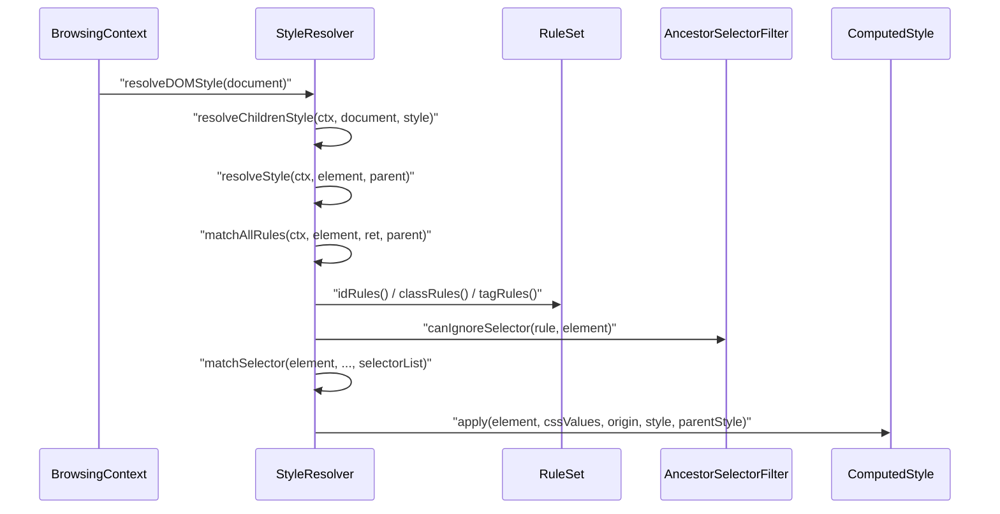
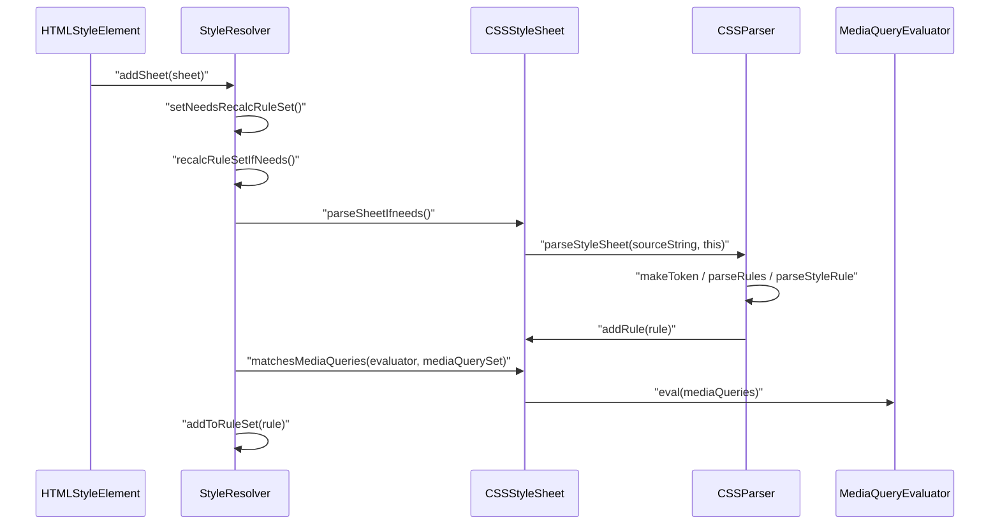
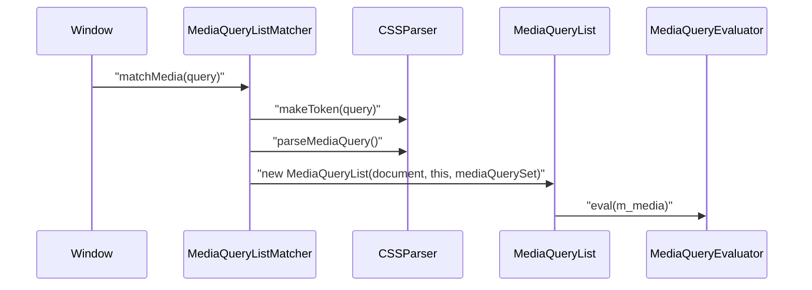

# Module Design Card: core-style

> **Relevant source files**
>
> - [src/core/style/AdoptedStyleSheets.cpp](src:src/core/style/AdoptedStyleSheets.cpp)
> - [src/core/style/AdoptedStyleSheets.h](src:src/core/style/AdoptedStyleSheets.h)
> - [src/core/style/AncestorSelectorFilter.cpp](src:src/core/style/AncestorSelectorFilter.cpp)
> - [src/core/style/AncestorSelectorFilter.h](src:src/core/style/AncestorSelectorFilter.h)
> - [src/core/style/Angle.cpp](src:src/core/style/Angle.cpp)
> - [src/core/style/Angle.h](src:src/core/style/Angle.h)
> - [src/core/style/BorderData.h](src:src/core/style/BorderData.h)
> - [src/core/style/BorderImage.cpp](src:src/core/style/BorderImage.cpp)
> - [src/core/style/BorderImage.h](src:src/core/style/BorderImage.h)
> - [src/core/style/BorderImageLength.h](src:src/core/style/BorderImageLength.h)
> - [src/core/style/BorderRadiusData.h](src:src/core/style/BorderRadiusData.h)
> - [src/core/style/BorderValue.h](src:src/core/style/BorderValue.h)
> - [src/core/style/CSSAngle.cpp](src:src/core/style/CSSAngle.cpp)
> - [src/core/style/CSSAngle.h](src:src/core/style/CSSAngle.h)
> - [src/core/style/CSSCounterFunction.h](src:src/core/style/CSSCounterFunction.h)
> - [src/core/style/CSSFilterFunction.cpp](src:src/core/style/CSSFilterFunction.cpp)
> - [src/core/style/CSSFilterFunction.h](src:src/core/style/CSSFilterFunction.h)
> - [src/core/style/CSSGradientValue.cpp](src:src/core/style/CSSGradientValue.cpp)
> - [src/core/style/CSSGradientValue.h](src:src/core/style/CSSGradientValue.h)
> - [src/core/style/CSSKeywordValue.cpp](src:src/core/style/CSSKeywordValue.cpp)
> - [src/core/style/CSSKeywordValue.h](src:src/core/style/CSSKeywordValue.h)
> - [src/core/style/CSSLength.cpp](src:src/core/style/CSSLength.cpp)
> - [src/core/style/CSSLength.h](src:src/core/style/CSSLength.h)
> - [src/core/style/CSSNumericValue.cpp](src:src/core/style/CSSNumericValue.cpp)
> - [src/core/style/CSSNumericValue.h](src:src/core/style/CSSNumericValue.h)
> - [src/core/style/CSSParser.cpp](src:src/core/style/CSSParser.cpp)
> - [src/core/style/CSSParser.h](src:src/core/style/CSSParser.h)
> - [src/core/style/CSSProperty.cpp](src:src/core/style/CSSProperty.cpp)
> - [src/core/style/CSSProperty.h](src:src/core/style/CSSProperty.h)
> - [src/core/style/CSSRule.h](src:src/core/style/CSSRule.h)
> - [src/core/style/CSSRuleList.cpp](src:src/core/style/CSSRuleList.cpp)
> - [src/core/style/CSSRuleList.h](src:src/core/style/CSSRuleList.h)
> - [src/core/style/CSSStyleDeclaration.cpp](src:src/core/style/CSSStyleDeclaration.cpp)
> - [src/core/style/CSSStyleDeclaration.h](src:src/core/style/CSSStyleDeclaration.h)
> - [src/core/style/CSSStyleLookupTrie.cpp](src:src/core/style/CSSStyleLookupTrie.cpp)
> - [src/core/style/CSSStyleLookupTrie.h](src:src/core/style/CSSStyleLookupTrie.h)
> - [src/core/style/CSSStyleRule.cpp](src:src/core/style/CSSStyleRule.cpp)
> - [src/core/style/CSSStyleRule.h](src:src/core/style/CSSStyleRule.h)
> - [src/core/style/CSSStyleSheet.cpp](src:src/core/style/CSSStyleSheet.cpp)
> - [src/core/style/CSSStyleSheet.h](src:src/core/style/CSSStyleSheet.h)
> - [src/core/style/CSSStyleSheetInit.h](src:src/core/style/CSSStyleSheetInit.h)
> - [src/core/style/CSSStyleValue.cpp](src:src/core/style/CSSStyleValue.cpp)
> - [src/core/style/CSSStyleValue.h](src:src/core/style/CSSStyleValue.h)
> - [src/core/style/CSSTime.cpp](src:src/core/style/CSSTime.cpp)
> - [src/core/style/CSSTime.h](src:src/core/style/CSSTime.h)
> - [src/core/style/CSSTokenValue.h](src:src/core/style/CSSTokenValue.h)
> - [src/core/style/CSSUnitValue.cpp](src:src/core/style/CSSUnitValue.cpp)
> - [src/core/style/CSSUnitValue.h](src:src/core/style/CSSUnitValue.h)
> - [src/core/style/CSSVariableSyntaxTreeBuilder.cpp](src:src/core/style/CSSVariableSyntaxTreeBuilder.cpp)
> - [src/core/style/CSSVariableSyntaxTreeBuilder.h](src:src/core/style/CSSVariableSyntaxTreeBuilder.h)
> - [src/core/style/CalcData.cpp](src:src/core/style/CalcData.cpp)
> - [src/core/style/CalcData.h](src:src/core/style/CalcData.h)
> - [src/core/style/ComputedStyle.cpp](src:src/core/style/ComputedStyle.cpp)
> - [src/core/style/ComputedStyle.h](src:src/core/style/ComputedStyle.h)
> - [src/core/style/ComputedStyleCSSStyleDeclaration.cpp](src:src/core/style/ComputedStyleCSSStyleDeclaration.cpp)
> - [src/core/style/ContentData.cpp](src:src/core/style/ContentData.cpp)
> - [src/core/style/ContentData.h](src:src/core/style/ContentData.h)
> - [src/core/style/CounterBaseList.h](src:src/core/style/CounterBaseList.h)
> - [src/core/style/CounterStyle.cpp](src:src/core/style/CounterStyle.cpp)
> - [src/core/style/CounterStyle.h](src:src/core/style/CounterStyle.h)
> - [src/core/style/FilterFunctions.cpp](src:src/core/style/FilterFunctions.cpp)
> - [src/core/style/FilterFunctions.h](src:src/core/style/FilterFunctions.h)
> - [src/core/style/FlexBasisData.h](src:src/core/style/FlexBasisData.h)
> - [src/core/style/FlowRelativeBorderData.cpp](src:src/core/style/FlowRelativeBorderData.cpp)
> - [src/core/style/FlowRelativeBorderData.h](src:src/core/style/FlowRelativeBorderData.h)
> - [src/core/style/FlowRelativeLengthData.h](src:src/core/style/FlowRelativeLengthData.h)
> - [src/core/style/FontFaceSrcData.h](src:src/core/style/FontFaceSrcData.h)
> - [src/core/style/GradientData.cpp](src:src/core/style/GradientData.cpp)
> - [src/core/style/GradientData.h](src:src/core/style/GradientData.h)
> - [src/core/style/GridAreaData.cpp](src:src/core/style/GridAreaData.cpp)
> - [src/core/style/GridAreaData.h](src:src/core/style/GridAreaData.h)
> - [src/core/style/GridLength.cpp](src:src/core/style/GridLength.cpp)
> - [src/core/style/GridLength.h](src:src/core/style/GridLength.h)
> - [src/core/style/GridTrackSize.cpp](src:src/core/style/GridTrackSize.cpp)
> - [src/core/style/GridTrackSize.h](src:src/core/style/GridTrackSize.h)
> - [src/core/style/ImageValue.cpp](src:src/core/style/ImageValue.cpp)
> - [src/core/style/ImageValue.h](src:src/core/style/ImageValue.h)
> - [src/core/style/Length.cpp](src:src/core/style/Length.cpp)
> - [src/core/style/Length.h](src:src/core/style/Length.h)
> - [src/core/style/LengthData.h](src:src/core/style/LengthData.h)
> - [src/core/style/LengthUtil.cpp](src:src/core/style/LengthUtil.cpp)
> - [src/core/style/LengthUtil.h](src:src/core/style/LengthUtil.h)
> - [src/core/style/ListStyleData.cpp](src:src/core/style/ListStyleData.cpp)
> - [src/core/style/ListStyleData.h](src:src/core/style/ListStyleData.h)
> - [src/core/style/MatrixTransform.h](src:src/core/style/MatrixTransform.h)
> - [src/core/style/MediaList.cpp](src:src/core/style/MediaList.cpp)
> - [src/core/style/MediaList.h](src:src/core/style/MediaList.h)
> - [src/core/style/MediaQuery.cpp](src:src/core/style/MediaQuery.cpp)
> - [src/core/style/MediaQuery.h](src:src/core/style/MediaQuery.h)
> - [src/core/style/MediaQueryEvaluator.cpp](src:src/core/style/MediaQueryEvaluator.cpp)
> - [src/core/style/MediaQueryEvaluator.h](src:src/core/style/MediaQueryEvaluator.h)
> - [src/core/style/MediaQueryList.cpp](src:src/core/style/MediaQueryList.cpp)
> - [src/core/style/MediaQueryList.h](src:src/core/style/MediaQueryList.h)
> - [src/core/style/MediaQueryListMatcher.cpp](src:src/core/style/MediaQueryListMatcher.cpp)
> - [src/core/style/MediaQueryListMatcher.h](src:src/core/style/MediaQueryListMatcher.h)
> - [src/core/style/MediaQueryResult.h](src:src/core/style/MediaQueryResult.h)
> - [src/core/style/MediaQuerySet.cpp](src:src/core/style/MediaQuerySet.cpp)
> - [src/core/style/MediaQuerySet.h](src:src/core/style/MediaQuerySet.h)
> - [src/core/style/MediaValues.cpp](src:src/core/style/MediaValues.cpp)
> - [src/core/style/MediaValues.h](src:src/core/style/MediaValues.h)
> - [src/core/style/MutablePropertyValue.h](src:src/core/style/MutablePropertyValue.h)
> - [src/core/style/MutablePropertyValueList.cpp](src:src/core/style/MutablePropertyValueList.cpp)
> - [src/core/style/MutablePropertyValueList.h](src:src/core/style/MutablePropertyValueList.h)
> - [src/core/style/NamedColors.cpp](src:src/core/style/NamedColors.cpp)
> - [src/core/style/NamedColors.h](src:src/core/style/NamedColors.h)
> - [src/core/style/ObjectSizingData.h](src:src/core/style/ObjectSizingData.h)
> - [src/core/style/OutlineData.h](src:src/core/style/OutlineData.h)
> - [src/core/style/PositionedMaskData.cpp](src:src/core/style/PositionedMaskData.cpp)
> - [src/core/style/PositionedMaskData.h](src:src/core/style/PositionedMaskData.h)
> - [src/core/style/RectData.h](src:src/core/style/RectData.h)
> - [src/core/style/RotateTransform.h](src:src/core/style/RotateTransform.h)
> - [src/core/style/ScaleTransform.h](src:src/core/style/ScaleTransform.h)
> - [src/core/style/ShadowData.cpp](src:src/core/style/ShadowData.cpp)
> - [src/core/style/ShadowData.h](src:src/core/style/ShadowData.h)
> - [src/core/style/SkewTransform.h](src:src/core/style/SkewTransform.h)
> - [src/core/style/StrokeLineCap.cpp](src:src/core/style/StrokeLineCap.cpp)
> - [src/core/style/StrokeLineCap.h](src:src/core/style/StrokeLineCap.h)
> - [src/core/style/StrokeLineJoin.cpp](src:src/core/style/StrokeLineJoin.cpp)
> - [src/core/style/StrokeLineJoin.h](src:src/core/style/StrokeLineJoin.h)
> - [src/core/style/Style.cpp](src:src/core/style/Style.cpp)
> - [src/core/style/Style.h](src:src/core/style/Style.h)
> - [src/core/style/StyleAnimationData.cpp](src:src/core/style/StyleAnimationData.cpp)
> - [src/core/style/StyleAnimationData.h](src:src/core/style/StyleAnimationData.h)
> - [src/core/style/StyleBackgroundData.cpp](src:src/core/style/StyleBackgroundData.cpp)
> - [src/core/style/StyleBackgroundData.h](src:src/core/style/StyleBackgroundData.h)
> - [src/core/style/StylePaintData.h](src:src/core/style/StylePaintData.h)
> - [src/core/style/StyleRule.cpp](src:src/core/style/StyleRule.cpp)
> - [src/core/style/StyleRule.h](src:src/core/style/StyleRule.h)
> - [src/core/style/StyleSheet.cpp](src:src/core/style/StyleSheet.cpp)
> - [src/core/style/StyleSheet.h](src:src/core/style/StyleSheet.h)
> - [src/core/style/StyleSheetList.cpp](src:src/core/style/StyleSheetList.cpp)
> - [src/core/style/StyleSheetList.h](src:src/core/style/StyleSheetList.h)
> - [src/core/style/StyleTransformData.h](src:src/core/style/StyleTransformData.h)
> - [src/core/style/StyleTransformOrigin.cpp](src:src/core/style/StyleTransformOrigin.cpp)
> - [src/core/style/StyleTransformOrigin.h](src:src/core/style/StyleTransformOrigin.h)
> - [src/core/style/StyleTransitionData.cpp](src:src/core/style/StyleTransitionData.cpp)
> - [src/core/style/StyleTransitionData.h](src:src/core/style/StyleTransitionData.h)
> - [src/core/style/StyleUtil.cpp](src:src/core/style/StyleUtil.cpp)
> - [src/core/style/StyleUtil.h](src:src/core/style/StyleUtil.h)
> - [src/core/style/TextOverflowData.h](src:src/core/style/TextOverflowData.h)
> - [src/core/style/TranslateTransform.h](src:src/core/style/TranslateTransform.h)
> - [src/core/style/Unit.cpp](src:src/core/style/Unit.cpp)
> - [src/core/style/Unit.h](src:src/core/style/Unit.h)
> - [src/core/style/UnitHelper.cpp](src:src/core/style/UnitHelper.cpp)
> - [src/core/style/UnitHelper.h](src:src/core/style/UnitHelper.h)
> - [src/core/style/WebFont.h](src:src/core/style/WebFont.h)
> - [src/core/style/WillChangeData.h](src:src/core/style/WillChangeData.h)
> - [src/core/style/UserAgentStyleSheet.css](src:src/core/style/UserAgentStyleSheet.css)
> - [src/StarfishBase.h](src:src/StarfishBase.h)
> - [src/core/dom/Document.cpp](src:src/core/dom/Document.cpp)
> - [src/core/dom/Element.cpp](src:src/core/dom/Element.cpp)
> - [src/core/dom/Node.cpp](src:src/core/dom/Node.cpp)
> - [src/core/dom/CSS.cpp](src:src/core/dom/CSS.cpp)
> - [src/core/dom/SelectorQuery.cpp](src:src/core/dom/SelectorQuery.cpp)
> - [src/core/dom/ShadowRoot.cpp](src:src/core/dom/ShadowRoot.cpp)
> - [src/core/dom/HTMLStyleElement.cpp](src:src/core/dom/HTMLStyleElement.cpp)
> - [src/core/dom/HTMLLinkElement.cpp](src:src/core/dom/HTMLLinkElement.cpp)
> - [src/core/dom/DOMMatrixReadOnly.cpp](src:src/core/dom/DOMMatrixReadOnly.cpp)
> - [src/core/page/BrowsingContext.cpp](src:src/core/page/BrowsingContext.cpp)
> - [src/core/page/Window.cpp](src:src/core/page/Window.cpp)
> - [src/core/layout/Frame.h](src:src/core/layout/Frame.h)
> - [src/core/layout/FrameTreeBuilder.cpp](src:src/core/layout/FrameTreeBuilder.cpp)
> - [src/core/animation/AnimationExecutor.cpp](src:src/core/animation/AnimationExecutor.cpp)
> - [src/core/cdp/domains/EmulationDomain.cpp](src:src/core/cdp/domains/EmulationDomain.cpp)

**Module**: `core-style` — 147 files under `src/core/style/`
**Role**: Parses CSS text into style rules and declarations, matches selectors against elements, and resolves per-element computed style values that layout consumes. [`StyleResolver`](src:src/core/style/Style.h#L3401)
**Module Boundary**: CSS style system directory (style, value, media, query, border keywords), single cohesive surface
**Confidence**: 0.93
**Core selection**: All approved modules are Core (boundary approved in W1 human review)
**Generated**: 2026-09-10

## Source Files

All 147 files live in `src/core/style/`.

**Parsing and CSSOM objects** (CSSParser, CSSStyleSheet, CSSStyleDeclaration, CSSStyleRule, CSSRule, CSSRuleList, StyleSheet, StyleSheetList, StyleRule, AdoptedStyleSheets, CSSStyleLookupTrie, CSSVariableSyntaxTreeBuilder, CSSStyleSheetInit) — **Resolution** (Style, ComputedStyle, ComputedStyleCSSStyleDeclaration, AncestorSelectorFilter, StyleUtil) — **Media queries** (MediaList, MediaQuery, MediaQueryEvaluator, MediaQueryList, MediaQueryListMatcher, MediaQueryResult, MediaQuerySet, MediaValues) — **Typed values and data records** (the remaining files: CSS*Value, Length*, Unit*, Border*, Grid*, Gradient*, Filter*, Style*Data, transforms, counters, shadows).

- [src/core/style/AdoptedStyleSheets.cpp](src:src/core/style/AdoptedStyleSheets.cpp)
- [src/core/style/AdoptedStyleSheets.h](src:src/core/style/AdoptedStyleSheets.h)
- [src/core/style/AncestorSelectorFilter.cpp](src:src/core/style/AncestorSelectorFilter.cpp)
- [src/core/style/AncestorSelectorFilter.h](src:src/core/style/AncestorSelectorFilter.h)
- [src/core/style/Angle.cpp](src:src/core/style/Angle.cpp)
- [src/core/style/Angle.h](src:src/core/style/Angle.h)
- [src/core/style/BorderData.h](src:src/core/style/BorderData.h)
- [src/core/style/BorderImage.cpp](src:src/core/style/BorderImage.cpp)
- [src/core/style/BorderImage.h](src:src/core/style/BorderImage.h)
- [src/core/style/BorderImageLength.h](src:src/core/style/BorderImageLength.h)
- [src/core/style/BorderRadiusData.h](src:src/core/style/BorderRadiusData.h)
- [src/core/style/BorderValue.h](src:src/core/style/BorderValue.h)
- [src/core/style/CSSAngle.cpp](src:src/core/style/CSSAngle.cpp)
- [src/core/style/CSSAngle.h](src:src/core/style/CSSAngle.h)
- [src/core/style/CSSCounterFunction.h](src:src/core/style/CSSCounterFunction.h)
- [src/core/style/CSSFilterFunction.cpp](src:src/core/style/CSSFilterFunction.cpp)
- [src/core/style/CSSFilterFunction.h](src:src/core/style/CSSFilterFunction.h)
- [src/core/style/CSSGradientValue.cpp](src:src/core/style/CSSGradientValue.cpp)
- [src/core/style/CSSGradientValue.h](src:src/core/style/CSSGradientValue.h)
- [src/core/style/CSSKeywordValue.cpp](src:src/core/style/CSSKeywordValue.cpp)
- [src/core/style/CSSKeywordValue.h](src:src/core/style/CSSKeywordValue.h)
- [src/core/style/CSSLength.cpp](src:src/core/style/CSSLength.cpp)
- [src/core/style/CSSLength.h](src:src/core/style/CSSLength.h)
- [src/core/style/CSSNumericValue.cpp](src:src/core/style/CSSNumericValue.cpp)
- [src/core/style/CSSNumericValue.h](src:src/core/style/CSSNumericValue.h)
- [src/core/style/CSSParser.cpp](src:src/core/style/CSSParser.cpp)
- [src/core/style/CSSParser.h](src:src/core/style/CSSParser.h)
- [src/core/style/CSSProperty.cpp](src:src/core/style/CSSProperty.cpp)
- [src/core/style/CSSProperty.h](src:src/core/style/CSSProperty.h)
- [src/core/style/CSSRule.h](src:src/core/style/CSSRule.h)
- [src/core/style/CSSRuleList.cpp](src:src/core/style/CSSRuleList.cpp)
- [src/core/style/CSSRuleList.h](src:src/core/style/CSSRuleList.h)
- [src/core/style/CSSStyleDeclaration.cpp](src:src/core/style/CSSStyleDeclaration.cpp)
- [src/core/style/CSSStyleDeclaration.h](src:src/core/style/CSSStyleDeclaration.h)
- [src/core/style/CSSStyleLookupTrie.cpp](src:src/core/style/CSSStyleLookupTrie.cpp)
- [src/core/style/CSSStyleLookupTrie.h](src:src/core/style/CSSStyleLookupTrie.h)
- [src/core/style/CSSStyleRule.cpp](src:src/core/style/CSSStyleRule.cpp)
- [src/core/style/CSSStyleRule.h](src:src/core/style/CSSStyleRule.h)
- [src/core/style/CSSStyleSheet.cpp](src:src/core/style/CSSStyleSheet.cpp)
- [src/core/style/CSSStyleSheet.h](src:src/core/style/CSSStyleSheet.h)
- [src/core/style/CSSStyleSheetInit.h](src:src/core/style/CSSStyleSheetInit.h)
- [src/core/style/CSSStyleValue.cpp](src:src/core/style/CSSStyleValue.cpp)
- [src/core/style/CSSStyleValue.h](src:src/core/style/CSSStyleValue.h)
- [src/core/style/CSSTime.cpp](src:src/core/style/CSSTime.cpp)
- [src/core/style/CSSTime.h](src:src/core/style/CSSTime.h)
- [src/core/style/CSSTokenValue.h](src:src/core/style/CSSTokenValue.h)
- [src/core/style/CSSUnitValue.cpp](src:src/core/style/CSSUnitValue.cpp)
- [src/core/style/CSSUnitValue.h](src:src/core/style/CSSUnitValue.h)
- [src/core/style/CSSVariableSyntaxTreeBuilder.cpp](src:src/core/style/CSSVariableSyntaxTreeBuilder.cpp)
- [src/core/style/CSSVariableSyntaxTreeBuilder.h](src:src/core/style/CSSVariableSyntaxTreeBuilder.h)
- [src/core/style/CalcData.cpp](src:src/core/style/CalcData.cpp)
- [src/core/style/CalcData.h](src:src/core/style/CalcData.h)
- [src/core/style/ComputedStyle.cpp](src:src/core/style/ComputedStyle.cpp)
- [src/core/style/ComputedStyle.h](src:src/core/style/ComputedStyle.h)
- [src/core/style/ComputedStyleCSSStyleDeclaration.cpp](src:src/core/style/ComputedStyleCSSStyleDeclaration.cpp)
- [src/core/style/ContentData.cpp](src:src/core/style/ContentData.cpp)
- [src/core/style/ContentData.h](src:src/core/style/ContentData.h)
- [src/core/style/CounterBaseList.h](src:src/core/style/CounterBaseList.h)
- [src/core/style/CounterStyle.cpp](src:src/core/style/CounterStyle.cpp)
- [src/core/style/CounterStyle.h](src:src/core/style/CounterStyle.h)
- [src/core/style/FilterFunctions.cpp](src:src/core/style/FilterFunctions.cpp)
- [src/core/style/FilterFunctions.h](src:src/core/style/FilterFunctions.h)
- [src/core/style/FlexBasisData.h](src:src/core/style/FlexBasisData.h)
- [src/core/style/FlowRelativeBorderData.cpp](src:src/core/style/FlowRelativeBorderData.cpp)
- [src/core/style/FlowRelativeBorderData.h](src:src/core/style/FlowRelativeBorderData.h)
- [src/core/style/FlowRelativeLengthData.h](src:src/core/style/FlowRelativeLengthData.h)
- [src/core/style/FontFaceSrcData.h](src:src/core/style/FontFaceSrcData.h)
- [src/core/style/GradientData.cpp](src:src/core/style/GradientData.cpp)
- [src/core/style/GradientData.h](src:src/core/style/GradientData.h)
- [src/core/style/GridAreaData.cpp](src:src/core/style/GridAreaData.cpp)
- [src/core/style/GridAreaData.h](src:src/core/style/GridAreaData.h)
- [src/core/style/GridLength.cpp](src:src/core/style/GridLength.cpp)
- [src/core/style/GridLength.h](src:src/core/style/GridLength.h)
- [src/core/style/GridTrackSize.cpp](src:src/core/style/GridTrackSize.cpp)
- [src/core/style/GridTrackSize.h](src:src/core/style/GridTrackSize.h)
- [src/core/style/ImageValue.cpp](src:src/core/style/ImageValue.cpp)
- [src/core/style/ImageValue.h](src:src/core/style/ImageValue.h)
- [src/core/style/Length.cpp](src:src/core/style/Length.cpp)
- [src/core/style/Length.h](src:src/core/style/Length.h)
- [src/core/style/LengthData.h](src:src/core/style/LengthData.h)
- [src/core/style/LengthUtil.cpp](src:src/core/style/LengthUtil.cpp)
- [src/core/style/LengthUtil.h](src:src/core/style/LengthUtil.h)
- [src/core/style/ListStyleData.cpp](src:src/core/style/ListStyleData.cpp)
- [src/core/style/ListStyleData.h](src:src/core/style/ListStyleData.h)
- [src/core/style/MatrixTransform.h](src:src/core/style/MatrixTransform.h)
- [src/core/style/MediaList.cpp](src:src/core/style/MediaList.cpp)
- [src/core/style/MediaList.h](src:src/core/style/MediaList.h)
- [src/core/style/MediaQuery.cpp](src:src/core/style/MediaQuery.cpp)
- [src/core/style/MediaQuery.h](src:src/core/style/MediaQuery.h)
- [src/core/style/MediaQueryEvaluator.cpp](src:src/core/style/MediaQueryEvaluator.cpp)
- [src/core/style/MediaQueryEvaluator.h](src:src/core/style/MediaQueryEvaluator.h)
- [src/core/style/MediaQueryList.cpp](src:src/core/style/MediaQueryList.cpp)
- [src/core/style/MediaQueryList.h](src:src/core/style/MediaQueryList.h)
- [src/core/style/MediaQueryListMatcher.cpp](src:src/core/style/MediaQueryListMatcher.cpp)
- [src/core/style/MediaQueryListMatcher.h](src:src/core/style/MediaQueryListMatcher.h)
- [src/core/style/MediaQueryResult.h](src:src/core/style/MediaQueryResult.h)
- [src/core/style/MediaQuerySet.cpp](src:src/core/style/MediaQuerySet.cpp)
- [src/core/style/MediaQuerySet.h](src:src/core/style/MediaQuerySet.h)
- [src/core/style/MediaValues.cpp](src:src/core/style/MediaValues.cpp)
- [src/core/style/MediaValues.h](src:src/core/style/MediaValues.h)
- [src/core/style/MutablePropertyValue.h](src:src/core/style/MutablePropertyValue.h)
- [src/core/style/MutablePropertyValueList.cpp](src:src/core/style/MutablePropertyValueList.cpp)
- [src/core/style/MutablePropertyValueList.h](src:src/core/style/MutablePropertyValueList.h)
- [src/core/style/NamedColors.cpp](src:src/core/style/NamedColors.cpp)
- [src/core/style/NamedColors.h](src:src/core/style/NamedColors.h)
- [src/core/style/ObjectSizingData.h](src:src/core/style/ObjectSizingData.h)
- [src/core/style/OutlineData.h](src:src/core/style/OutlineData.h)
- [src/core/style/PositionedMaskData.cpp](src:src/core/style/PositionedMaskData.cpp)
- [src/core/style/PositionedMaskData.h](src:src/core/style/PositionedMaskData.h)
- [src/core/style/RectData.h](src:src/core/style/RectData.h)
- [src/core/style/RotateTransform.h](src:src/core/style/RotateTransform.h)
- [src/core/style/ScaleTransform.h](src:src/core/style/ScaleTransform.h)
- [src/core/style/ShadowData.cpp](src:src/core/style/ShadowData.cpp)
- [src/core/style/ShadowData.h](src:src/core/style/ShadowData.h)
- [src/core/style/SkewTransform.h](src:src/core/style/SkewTransform.h)
- [src/core/style/StrokeLineCap.cpp](src:src/core/style/StrokeLineCap.cpp)
- [src/core/style/StrokeLineCap.h](src:src/core/style/StrokeLineCap.h)
- [src/core/style/StrokeLineJoin.cpp](src:src/core/style/StrokeLineJoin.cpp)
- [src/core/style/StrokeLineJoin.h](src:src/core/style/StrokeLineJoin.h)
- [src/core/style/Style.cpp](src:src/core/style/Style.cpp)
- [src/core/style/Style.h](src:src/core/style/Style.h)
- [src/core/style/StyleAnimationData.cpp](src:src/core/style/StyleAnimationData.cpp)
- [src/core/style/StyleAnimationData.h](src:src/core/style/StyleAnimationData.h)
- [src/core/style/StyleBackgroundData.cpp](src:src/core/style/StyleBackgroundData.cpp)
- [src/core/style/StyleBackgroundData.h](src:src/core/style/StyleBackgroundData.h)
- [src/core/style/StylePaintData.h](src:src/core/style/StylePaintData.h)
- [src/core/style/StyleRule.cpp](src:src/core/style/StyleRule.cpp)
- [src/core/style/StyleRule.h](src:src/core/style/StyleRule.h)
- [src/core/style/StyleSheet.cpp](src:src/core/style/StyleSheet.cpp)
- [src/core/style/StyleSheet.h](src:src/core/style/StyleSheet.h)
- [src/core/style/StyleSheetList.cpp](src:src/core/style/StyleSheetList.cpp)
- [src/core/style/StyleSheetList.h](src:src/core/style/StyleSheetList.h)
- [src/core/style/StyleTransformData.h](src:src/core/style/StyleTransformData.h)
- [src/core/style/StyleTransformOrigin.cpp](src:src/core/style/StyleTransformOrigin.cpp)
- [src/core/style/StyleTransformOrigin.h](src:src/core/style/StyleTransformOrigin.h)
- [src/core/style/StyleTransitionData.cpp](src:src/core/style/StyleTransitionData.cpp)
- [src/core/style/StyleTransitionData.h](src:src/core/style/StyleTransitionData.h)
- [src/core/style/StyleUtil.cpp](src:src/core/style/StyleUtil.cpp)
- [src/core/style/StyleUtil.h](src:src/core/style/StyleUtil.h)
- [src/core/style/TextOverflowData.h](src:src/core/style/TextOverflowData.h)
- [src/core/style/TranslateTransform.h](src:src/core/style/TranslateTransform.h)
- [src/core/style/Unit.cpp](src:src/core/style/Unit.cpp)
- [src/core/style/Unit.h](src:src/core/style/Unit.h)
- [src/core/style/UnitHelper.cpp](src:src/core/style/UnitHelper.cpp)
- [src/core/style/UnitHelper.h](src:src/core/style/UnitHelper.h)
- [src/core/style/WebFont.h](src:src/core/style/WebFont.h)
- [src/core/style/WillChangeData.h](src:src/core/style/WillChangeData.h)

The user-agent style sheet is stored as C string literals in [src/core/style/UserAgentStyleSheet.css](src:src/core/style/UserAgentStyleSheet.css) and is included into [`Document.cpp`](src:src/core/dom/Document.cpp#L224).

## Public Interface

| Function/Class | Signature | Main callers | Source |
|---|---|---|---|
| `StyleResolver::resolveDOMStyle` | `void resolveDOMStyle(Document* document, bool force = false)` | core-page: [`BrowsingContext::resolveStyleIfNeeds`](src:src/core/page/BrowsingContext.cpp#L235) | [`StyleResolver::resolveDOMStyle`](src:src/core/style/Style.cpp#L10203) |
| `StyleResolver::addSheet` | `void addSheet(CSSStyleSheet* sheet)` | core-dom: [`Document.cpp`](src:src/core/dom/Document.cpp#L241), [`HTMLStyleElement.cpp`](src:src/core/dom/HTMLStyleElement.cpp#L164), [`HTMLLinkElement.cpp`](src:src/core/dom/HTMLLinkElement.cpp#L219) | [`StyleResolver::addSheet`](src:src/core/style/Style.cpp#L10321) |
| `StyleResolver::matchSelector` | `Match matchSelector(Element*, AtomicString elementName, AtomicString elementId, const GCAtomicTightVector<AtomicString>& elementClasses, const CSSSelectorList&, unsigned idx, MatchResult&, bool isQueryingSelector = false)` | core-dom: [`SelectorQuery.cpp`](src:src/core/dom/SelectorQuery.cpp#L275) | [`StyleResolver::matchSelector`](src:src/core/style/Style.cpp#L8388) |
| `StyleResolver::resolveVarReferencedValue` | `static CSSTokenValue resolveVarReferencedValue(Node*, OptionalUTF8String, Optional<const MutablePropertyValueList*>)` | core-dom: [`Element.cpp`](src:src/core/dom/Element.cpp#L316) | [`StyleResolver::resolveVarReferencedValue`](src:src/core/style/Style.cpp#L3344) |
| `CSSParser::parseStyleSheet` | `void parseStyleSheet(String* sourceString, CSSStyleSheet* target)` | in-module [`CSSStyleSheet::parseSheetIfneeds`](src:src/core/style/CSSStyleSheet.cpp#L201), triggered from [`Document.cpp`](src:src/core/dom/Document.cpp#L230) | [`CSSParser::parseStyleSheet`](src:src/core/style/CSSParser.cpp#L2936) |
| `CSSParser::parseStyleDeclaration` | `void parseStyleDeclaration(String* str, CSSStyleDeclaration* declaration)` | core-dom: [`Element::didAttributeChanged`](src:src/core/dom/Element.cpp#L596) | [`CSSParser::parseStyleDeclaration`](src:src/core/style/CSSParser.cpp#L3102) |
| `CSSParser::parseSelector` | `void parseSelector(GCVector<CSSSelectorList*>& list, bool& validSelector)` | core-dom: [`Node::parseSelector`](src:src/core/dom/Node.cpp#L2216) | [`CSSParser::parseSelector`](src:src/core/style/CSSParser.cpp#L886) |
| `CSSParser::parseSupportCondition` | `bool parseSupportCondition(String* str)` | core-dom: [`CSS.cpp`](src:src/core/dom/CSS.cpp#L43) | [`CSSParser::parseSupportCondition`](src:src/core/style/CSSParser.cpp#L2961) |
| `CSSParser::parseMediaQuery` | `MediaQuerySet* parseMediaQuery()` | in-module [`MediaQueryListMatcher::matchMedia`](src:src/core/style/MediaQueryListMatcher.cpp#L31) | [`CSSParser::parseMediaQuery`](src:src/core/style/CSSParser.cpp#L3197) |
| `compareStyle` | `ComputedStyleDamage compareStyle(ComputedStyle* oldStyle, ComputedStyle* newStyle, bool* damagedKeys, bool isSVGDescendant)` | core-dom: [`Element::didComputedStyleChanged`](src:src/core/dom/Element.cpp#L837); core-animation: [`AnimationExecutor.cpp`](src:src/core/animation/AnimationExecutor.cpp#L146) | [`compareStyle`](src:src/core/style/ComputedStyle.cpp#L1190) |
| `ComputedStyle::arrangeStyleValues` | `void arrangeStyleValues(ComputedStyle* parentStyle, Node* current)` | core-layout: [`FrameTreeBuilder.cpp`](src:src/core/layout/FrameTreeBuilder.cpp#L238) | [`ComputedStyle::arrangeStyleValues`](src:src/core/style/ComputedStyle.cpp#L762) |
| `ComputedStyle::loadResources` | `void loadResources(Node* consumer, ComputedStyle* prevComputedStyleValueForReferenceLoadedResources = nullptr)` | core-layout: [`FrameTreeBuilder.cpp`](src:src/core/layout/FrameTreeBuilder.cpp#L237) | [`ComputedStyle::loadResources`](src:src/core/style/ComputedStyle.cpp#L679) |
| `ComputedStyle` | `class ComputedStyle : public gc` | core-layout: [`Frame::style`](src:src/core/layout/Frame.h#L1611) | [`ComputedStyle`](src:src/core/style/ComputedStyle.h#L795) |
| `CSSStyleDeclaration::setProperty` | `void setProperty(String* name, String* value, String* priority)` | in-module [`CSSParser::parseDeclaration`](src:src/core/style/CSSParser.cpp#L1958) via the generic overload | [`CSSStyleDeclaration::setProperty`](src:src/core/style/CSSStyleDeclaration.cpp#L2132) |
| `ComputedStyleCSSStyleDeclaration` | `class ComputedStyleCSSStyleDeclaration : public CSSStyleDeclaration` | core-dom: [`Element.cpp`](src:src/core/dom/Element.cpp#L2412) | [`ComputedStyleCSSStyleDeclaration`](src:src/core/style/CSSStyleDeclaration.h#L510) |
| `MediaQueryListMatcher::matchMedia` | `MediaQueryList* matchMedia(String* query)` | core-page: [`Window::matchMedia`](src:src/core/page/Window.cpp#L1035) | [`MediaQueryListMatcher::matchMedia`](src:src/core/style/MediaQueryListMatcher.cpp#L31) |
| `MediaQueryEvaluator::setMediaTypeOverride` | `static void setMediaTypeOverride(const std::string& mediaType)` | core-cdp: [`EmulationDomain.cpp`](src:src/core/cdp/domains/EmulationDomain.cpp#L183) | [`MediaQueryEvaluator::setMediaTypeOverride`](src:src/core/style/MediaQueryEvaluator.cpp#L65) |
| `CSSStyleLookupTrie::lookupCSSStyleCamelCase` | `static CSSStyleValuePair::KeyKind lookupCSSStyleCamelCase(const char* data, unsigned length)` | core-dom: [`Element.cpp`](src:src/core/dom/Element.cpp#L2556) | [`CSSStyleLookupTrie::lookupCSSStyleCamelCase`](src:src/core/style/CSSStyleLookupTrie.cpp#L1472) |
| `AdoptedStyleSheets::observableArray` | `ScriptProxyObject observableArray(Escargot::ExecutionStateRef* state, Node* host)` | core-dom: [`Document.cpp`](src:src/core/dom/Document.cpp#L1950), [`ShadowRoot.cpp`](src:src/core/dom/ShadowRoot.cpp#L77) | [`AdoptedStyleSheets::observableArray`](src:src/core/style/AdoptedStyleSheets.h#L36) |
| `CSSTransformFunction` | `class CSSTransformFunction : public gc` | core-dom: [`DOMMatrixReadOnly.cpp`](src:src/core/dom/DOMMatrixReadOnly.cpp#L295) | [`CSSTransformFunction`](src:src/core/style/Style.h#L913) |

## IPC / Message / Interface Contracts

- No cross-module IPC or message contract is identifiable in code for this module.

## Key Flow

Entry point: [`StyleResolver::resolveDOMStyle`](src:src/core/style/Style.cpp#L10203) walks the tree through [`StyleResolver::resolveChildrenStyle`](src:src/core/style/Style.cpp#L10012) and [`StyleResolver::resolveStyle`](src:src/core/style/Style.cpp#L2838); [`StyleResolver::matchAllRules`](src:src/core/style/Style.cpp#L8140) reads the indexed [`RuleSet`](src:src/core/style/CSSStyleSheet.h#L62), rejects rules through [`AncestorSelectorFilter::canIgnoreSelector`](src:src/core/style/AncestorSelectorFilter.h#L54), matches through [`StyleResolver::matchSelector`](src:src/core/style/Style.cpp#L8388) and writes values through [`StyleResolver::apply`](src:src/core/style/Style.cpp#L3505).

Entry point: [`StyleResolver::addSheet`](src:src/core/style/Style.cpp#L10321) records the sheet; [`StyleResolver::recalcRuleSetIfNeeds`](src:src/core/style/Style.cpp#L10494) calls [`StyleResolver::addToRuleSet`](src:src/core/style/Style.cpp#L10748), which triggers [`CSSStyleSheet::parseSheetIfneeds`](src:src/core/style/CSSStyleSheet.cpp#L201) → [`CSSParser::parseStyleSheet`](src:src/core/style/CSSParser.cpp#L2936) → [`CSSParser::parseRules`](src:src/core/style/CSSParser.cpp#L3002) → [`CSSParser::parseStyleRule`](src:src/core/style/CSSParser.cpp#L2130), filters through [`CSSStyleSheet::matchesMediaQueries`](src:src/core/style/CSSStyleSheet.cpp#L316) and indexes each rule in [`StyleResolver::addToRuleSet`](src:src/core/style/Style.cpp#L10916).

Entry point: [`MediaQueryListMatcher::matchMedia`](src:src/core/style/MediaQueryListMatcher.cpp#L31) parses the query with [`CSSParser::parseMediaQuery`](src:src/core/style/CSSParser.cpp#L3197); [`MediaQueryList::matches`](src:src/core/style/MediaQueryList.cpp#L52) evaluates it through [`MediaQueryEvaluator::eval`](src:src/core/style/MediaQueryEvaluator.cpp#L126).

## Architectural Rules

- [ ] `CSSParser` is stack-allocated and instantiated per parse at each call site; it is not retained between parses. [`CSSParser.h`](src:src/core/style/CSSParser.h#L1747), [`CSSStyleSheet::parseSheetIfneeds`](src:src/core/style/CSSStyleSheet.cpp#L201)
- [ ] One `StyleResolver` is owned per `Document` (created in the `Document` constructor) and optionally per `ShadowRoot`; it is a `DocumentHoldable`. [`StyleResolver`](src:src/core/style/Style.h#L3401), [`Document.cpp`](src:src/core/dom/Document.cpp#L152)
- [ ] Rule-set rebuild is lazy: sheet changes only set a flag, and the rule set is rebuilt from `m_sheets` and `m_adoptedSheets` in `recalcRuleSetIfNeeds`. [`StyleResolver::setNeedsRecalcRuleSet`](src:src/core/style/Style.h#L3461), [`StyleResolver::recalcRuleSetIfNeeds`](src:src/core/style/Style.cpp#L10494)
- [ ] Style rules are indexed into id, class, tag and universal buckets and stamped with an ascending order before matching. [`RuleSet`](src:src/core/style/CSSStyleSheet.h#L62), [`StyleResolver::addToRuleSet`](src:src/core/style/Style.cpp#L10916)
- [ ] Sheets whose media query set does not match the current evaluator are excluded from the rule set. [`StyleResolver::addToRuleSet`](src:src/core/style/Style.cpp#L10748), [`CSSStyleSheet::matchesMediaQueries`](src:src/core/style/CSSStyleSheet.cpp#L316)
- [ ] Every `StyleRule` computes identifier hashes at construction so the ancestor filter can reject it without a full selector match. [`StyleRule.cpp`](src:src/core/style/StyleRule.cpp#L136), [`AncestorSelectorFilter::computeIdentifierHash`](src:src/core/style/AncestorSelectorFilter.cpp#L120)
- [ ] Style rules within a sheet are ordered by specificity using a stable sort with base-256 specificity numbers. [`CSSStyleSheet::sortStyleRulesBySpecificity`](src:src/core/style/CSSStyleSheet.cpp#L302), [`CSSStyleSheet.cpp`](src:src/core/style/CSSStyleSheet.cpp#L213)
- [ ] Style enumerations are declared with `ENSURE_ENUM_UNSIGNED` so they can be packed into bit-fields. [`UnitType`](src:src/core/style/Style.h#L73), [`StarfishBase.h`](src:src/StarfishBase.h#L184)

## Dependencies

### Internal modules

| Module | File(s) | Purpose | Source |
|---|---|---|---|
| core-dom | `core/dom/Document.h`, `core/dom/Element.h`, `core/dom/ShadowRoot.h` | Elements to match, document ownership, shadow scopes | [`Style.cpp`](src:src/core/style/Style.cpp#L39) |
| core-page | `core/page/Window.h`, `core/page/BrowsingContext.h` | Viewport and screen values for media queries and resolution | [`Style.cpp`](src:src/core/style/Style.cpp#L58), [`MediaValues.cpp`](src:src/core/style/MediaValues.cpp#L26) |
| core-layout | `core/layout/Frame.h` | Frame access for length/angle resolution | [`Length.cpp`](src:src/core/style/Length.cpp#L25), [`Angle.cpp`](src:src/core/style/Angle.cpp#L25) |
| core-animation | `core/animation/CubicBezier.h`, `core/animation/TimingFunction.h` | Timing functions for animation/transition style data | [`StyleAnimationData.cpp`](src:src/core/style/StyleAnimationData.cpp#L21) |
| core-util | `core/util/BloomFilter.h`, `core/util/String.h` | Bloom filter for ancestor selector filtering; string type | [`AncestorSelectorFilter.h`](src:src/core/style/AncestorSelectorFilter.h#L23), [`MediaQuery.cpp`](src:src/core/style/MediaQuery.cpp#L50) |
| modules-canvas | `core/modules/canvas/image/NativeImageData.h` | Image data for border-image and background layers | [`BorderImage.cpp`](src:src/core/style/BorderImage.cpp#L23) |
| modules-runtime | `core/modules/threading/ParallelJobExecutor.h` | Parallel execution for filter functions | [`FilterFunctions.cpp`](src:src/core/style/FilterFunctions.cpp#L26) |
| platform-network-loader | `platform/loader/ResourceLoader.h` | Loading of style resources (images, fonts, imports) | [`StyleRule.cpp`](src:src/core/style/StyleRule.cpp#L33), [`ComputedStyle.cpp`](src:src/core/style/ComputedStyle.cpp#L46) |
| core-csp | `core/csp/ContentSecurityPolicy.h` | Policy check for imported rules | [`StyleRule.cpp`](src:src/core/style/StyleRule.cpp#L32) |
| binding | `binding/ScriptWrappable.h`, `binding/DocumentHoldable.h`, `binding/ObservableArray.h` | Script-exposed CSSOM objects | [`CSSStyleDeclaration.h`](src:src/core/style/CSSStyleDeclaration.h#L23), [`StyleSheet.h`](src:src/core/style/StyleSheet.h#L23) |

### External libraries

| Library | Version | Purpose | Source |
|---|---|---|---|
| Skia (`SkMatrix.h`) | Not specified in code | Transform matrices in computed style and gradients | [`ComputedStyle.h`](src:src/core/style/ComputedStyle.h#L23), [`GradientData.h`](src:src/core/style/GradientData.h#L23) |
| Escargot (`EscargotPublic.h`) | Not specified in code | Script engine types for the adopted style sheets observable array | [`AdoptedStyleSheets.cpp`](src:src/core/style/AdoptedStyleSheets.cpp#L30) |

## Quick Navigation

| To change… | Location |
|---|---|
| Style sheet tokenizing and rule parsing | [`CSSParser::parseRules`](src:src/core/style/CSSParser.cpp#L3002) |
| Selector grammar | [`CSSParser::parseComplexSelectorList`](src:src/core/style/CSSParser.cpp#L1759) |
| Declaration parsing and unsupported-property handling | [`CSSParser::parseDeclaration`](src:src/core/style/CSSParser.cpp#L1958) |
| Property-name lookup | [`CSSStyleLookupTrie::lookupCSSStyle`](src:src/core/style/CSSStyleLookupTrie.cpp#L25) |
| Property/value kinds | [`CSSStyleValuePair`](src:src/core/style/Style.h#L1036) |
| Selector matching and pseudo-classes | [`StyleResolver::checkOne`](src:src/core/style/Style.cpp#L8540), [`StyleResolver::checkPseudoClass`](src:src/core/style/Style.cpp#L8768) |
| Applying a property to computed style | [`StyleResolver::applyProperty`](src:src/core/style/Style.cpp#L3537) |
| Computed style fields and defaults | [`ComputedStyle`](src:src/core/style/ComputedStyle.h#L795) |
| Damage classification after restyle | [`compareStyle`](src:src/core/style/ComputedStyle.cpp#L1190), [`ComputedStyleDamage`](src:src/core/style/ComputedStyle.h#L56) |
| Media feature evaluation | [`MediaQueryEvaluator::eval`](src:src/core/style/MediaQueryEvaluator.cpp#L663) |
| Custom property (var) substitution | [`CSSVariableSyntaxTreeBuilder::build`](src:src/core/style/CSSVariableSyntaxTreeBuilder.cpp#L169) |
| Adopted style sheets binding | [`AdoptedStyleSheets::setFromObservableArray`](src:src/core/style/AdoptedStyleSheets.h#L40) |

## FR Linkage
- [FR-CORE-STYLE-001](../functional-requirements/core-style-fr.md#fr-core-style-001): Parse style sheet text into style rules
- [FR-CORE-STYLE-002](../functional-requirements/core-style-fr.md#fr-core-style-002): Parse declaration blocks and set properties
- [FR-CORE-STYLE-003](../functional-requirements/core-style-fr.md#fr-core-style-003): Parse selector lists
- [FR-CORE-STYLE-004](../functional-requirements/core-style-fr.md#fr-core-style-004): Maintain the indexed rule set from attached sheets
- [FR-CORE-STYLE-005](../functional-requirements/core-style-fr.md#fr-core-style-005): Match selectors against elements
- [FR-CORE-STYLE-006](../functional-requirements/core-style-fr.md#fr-core-style-006): Resolve computed style for the document tree
- [FR-CORE-STYLE-007](../functional-requirements/core-style-fr.md#fr-core-style-007): Classify style damage between computed styles
- [FR-CORE-STYLE-008](../functional-requirements/core-style-fr.md#fr-core-style-008): Arrange computed values and load style resources
- [FR-CORE-STYLE-009](../functional-requirements/core-style-fr.md#fr-core-style-009): Evaluate media queries and notify media query lists
- [FR-CORE-STYLE-010](../functional-requirements/core-style-fr.md#fr-core-style-010): Resolve custom property references
- [FR-CORE-STYLE-011](../functional-requirements/core-style-fr.md#fr-core-style-011): Expose style declarations as CSSOM objects
- [FR-CORE-STYLE-012](../functional-requirements/core-style-fr.md#fr-core-style-012): Manage adopted style sheets
