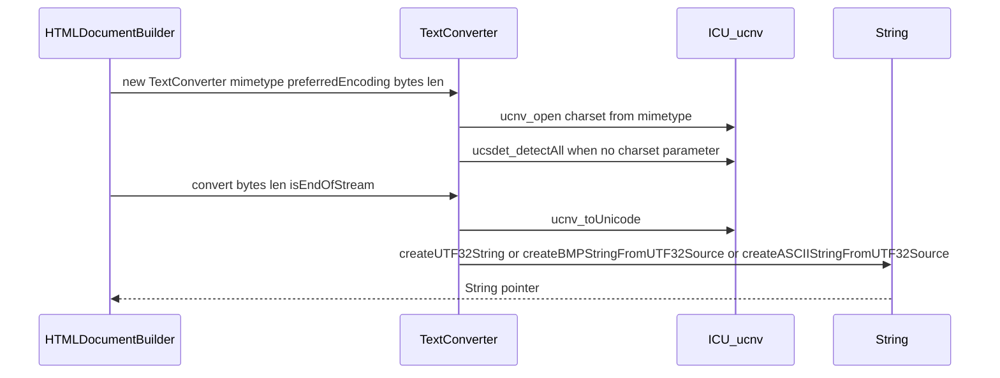
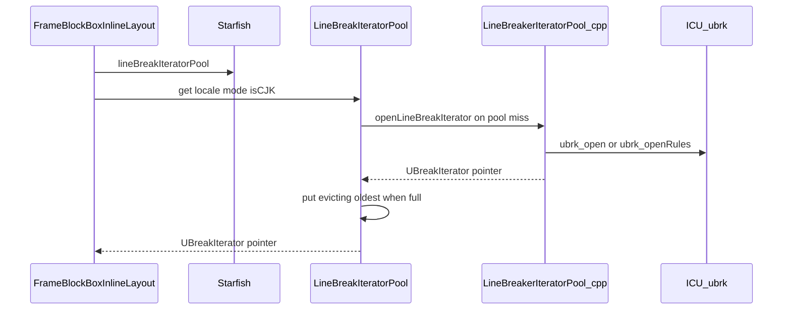
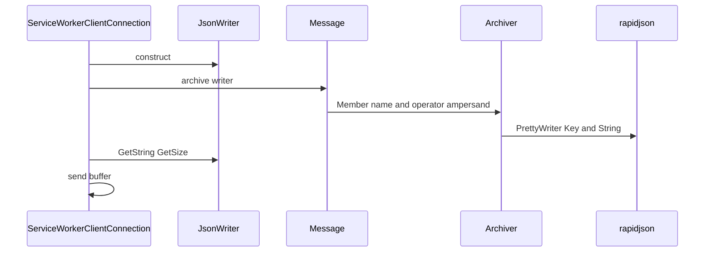
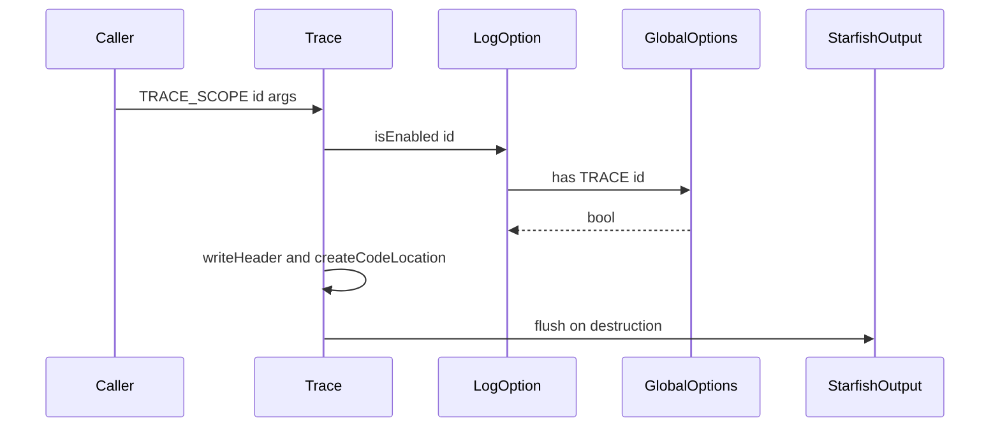

# Module Design Card: core-util

> **Relevant source files**
>
> - [src/core/util/Archivable.cpp](src:src/core/util/Archivable.cpp)
> - [src/core/util/Archivable.h](src:src/core/util/Archivable.h)
> - [src/core/util/Archiver.cpp](src:src/core/util/Archiver.cpp)
> - [src/core/util/Archiver.h](src:src/core/util/Archiver.h)
> - [src/core/util/AtomicString.cpp](src:src/core/util/AtomicString.cpp)
> - [src/core/util/AtomicString.h](src:src/core/util/AtomicString.h)
> - [src/core/util/AttributeName.cpp](src:src/core/util/AttributeName.cpp)
> - [src/core/util/AttributeName.h](src:src/core/util/AttributeName.h)
> - [src/core/util/BasicString.h](src:src/core/util/BasicString.h)
> - [src/core/util/BasicString.hpp](src:src/core/util/BasicString.hpp)
> - [src/core/util/BloomFilter.h](src:src/core/util/BloomFilter.h)
> - [src/core/util/Cryptographic.cpp](src:src/core/util/Cryptographic.cpp)
> - [src/core/util/Cryptographic.h](src:src/core/util/Cryptographic.h)
> - [src/core/util/GCDescriptor.h](src:src/core/util/GCDescriptor.h)
> - [src/core/util/GatherableString.h](src:src/core/util/GatherableString.h)
> - [src/core/util/GlobalOptions.cpp](src:src/core/util/GlobalOptions.cpp)
> - [src/core/util/GlobalOptions.h](src:src/core/util/GlobalOptions.h)
> - [src/core/util/Id.cpp](src:src/core/util/Id.cpp)
> - [src/core/util/Id.h](src:src/core/util/Id.h)
> - [src/core/util/LineBreakerIteratorPool.cpp](src:src/core/util/LineBreakerIteratorPool.cpp)
> - [src/core/util/LineBreakerIteratorPool.h](src:src/core/util/LineBreakerIteratorPool.h)
> - [src/core/util/Message.cpp](src:src/core/util/Message.cpp)
> - [src/core/util/Messages.h](src:src/core/util/Messages.h)
> - [src/core/util/PoolAllocator.cpp](src:src/core/util/PoolAllocator.cpp)
> - [src/core/util/PoolAllocator.h](src:src/core/util/PoolAllocator.h)
> - [src/core/util/ProgramOptions.cpp](src:src/core/util/ProgramOptions.cpp)
> - [src/core/util/ProgramOptions.h](src:src/core/util/ProgramOptions.h)
> - [src/core/util/QualifiedName.cpp](src:src/core/util/QualifiedName.cpp)
> - [src/core/util/QualifiedName.h](src:src/core/util/QualifiedName.h)
> - [src/core/util/RandomEngine.cpp](src:src/core/util/RandomEngine.cpp)
> - [src/core/util/RandomEngine.h](src:src/core/util/RandomEngine.h)
> - [src/core/util/RefCounted.h](src:src/core/util/RefCounted.h)
> - [src/core/util/RefPtr.h](src:src/core/util/RefPtr.h)
> - [src/core/util/String.cpp](src:src/core/util/String.cpp)
> - [src/core/util/String.h](src:src/core/util/String.h)
> - [src/core/util/TextConverter.cpp](src:src/core/util/TextConverter.cpp)
> - [src/core/util/TextConverter.h](src:src/core/util/TextConverter.h)
> - [src/core/util/TextDecoder.cpp](src:src/core/util/TextDecoder.cpp)
> - [src/core/util/TextDecoder.h](src:src/core/util/TextDecoder.h)
> - [src/core/util/TextEncoder.cpp](src:src/core/util/TextEncoder.cpp)
> - [src/core/util/TextEncoder.h](src:src/core/util/TextEncoder.h)
> - [src/core/util/TightVector.h](src:src/core/util/TightVector.h)
> - [src/core/util/URL.cpp](src:src/core/util/URL.cpp)
> - [src/core/util/URL.h](src:src/core/util/URL.h)
> - [src/core/util/URLSearchParams.cpp](src:src/core/util/URLSearchParams.cpp)
> - [src/core/util/URLSearchParams.h](src:src/core/util/URLSearchParams.h)
> - [src/core/util/Vector.h](src:src/core/util/Vector.h)
> - [src/core/util/VectorWithInlineStorage.h](src:src/core/util/VectorWithInlineStorage.h)
> - [src/core/util/debug/Logger.cpp](src:src/core/util/debug/Logger.cpp)
> - [src/core/util/debug/Logger.h](src:src/core/util/debug/Logger.h)
> - [src/core/util/debug/Trace.cpp](src:src/core/util/debug/Trace.cpp)
> - [src/core/util/debug/Trace.h](src:src/core/util/debug/Trace.h)
> - [src/Starfish.h](src:src/Starfish.h)
> - [src/Starfish.cpp](src:src/Starfish.cpp)
> - [src/StarfishConfig.h](src:src/StarfishConfig.h)
> - [src/StarfishBase.h](src:src/StarfishBase.h)
> - [src/StaticStrings.cpp](src:src/StaticStrings.cpp)
> - [src/core/dom/builder/html/HTMLDocumentBuilder.cpp](src:src/core/dom/builder/html/HTMLDocumentBuilder.cpp)
> - [src/core/page/EventSource.cpp](src:src/core/page/EventSource.cpp)
> - [src/core/layout/FrameBlockBoxInlineLayout.cpp](src:src/core/layout/FrameBlockBoxInlineLayout.cpp)
> - [src/core/layout/FrameBlockBox.h](src:src/core/layout/FrameBlockBox.h)
> - [src/core/dom/parser/HTMLTokenizer.h](src:src/core/dom/parser/HTMLTokenizer.h)
> - [src/core/dom/HTMLMediaElement.cpp](src:src/core/dom/HTMLMediaElement.cpp)
> - [src/core/dom/Document.h](src:src/core/dom/Document.h)
> - [src/core/dom/Element.cpp](src:src/core/dom/Element.cpp)
> - [src/core/style/AncestorSelectorFilter.cpp](src:src/core/style/AncestorSelectorFilter.cpp)
> - [src/core/modules/serviceworker/client/ServiceWorkerClientConnection.cpp](src:src/core/modules/serviceworker/client/ServiceWorkerClientConnection.cpp)
> - [src/core/modules/serviceworker/Message.cpp](src:src/core/modules/serviceworker/Message.cpp)
> - [src/core/modules/serviceworker/RegistrationStore.cpp](src:src/core/modules/serviceworker/RegistrationStore.cpp)
> - [src/core/modules/serviceworker/ServiceWorkerData.h](src:src/core/modules/serviceworker/ServiceWorkerData.h)
> - [src/core/modules/serviceworker/ServiceWorkerRegistrationData.cpp](src:src/core/modules/serviceworker/ServiceWorkerRegistrationData.cpp)
> - [src/core/modules/worker/PerProcess.cpp](src:src/core/modules/worker/PerProcess.cpp)
> - [src/core/modules/crypto/Crypto.cpp](src:src/core/modules/crypto/Crypto.cpp)
> - [src/core/modules/cast/CastConfig.h](src:src/core/modules/cast/CastConfig.h)

**Module**: `core-util` — 52 files under `src/core/util/` (48 files) and `src/core/util/debug/` (4 files)
**Role**: Provides the engine-wide string representation and interning, charset conversion, line-break iterator pooling, JSON archiving, script error-message formatting, and tracing utilities that every other module builds on; `String`, `AtomicString`, `QualifiedName` and `Messages.h` are pulled into every translation unit through the common configuration header. [`String`](src:src/core/util/String.h#L694), [`AtomicString`](src:src/core/util/AtomicString.h#L32), [`StarfishConfig.h`](src:src/StarfishConfig.h#L49)
**Module Boundary**: Core utility directory (string/text pools, Archivable/Archiver) plus its debug/ leaf
**Confidence**: 0.9
**Core selection**: All approved modules are Core (boundary approved in W1 human review)
**Generated**: 2026-09-10

## Source Files

### Strings and text
- [src/core/util/String.h](src:src/core/util/String.h), [src/core/util/String.cpp](src:src/core/util/String.cpp) — `String` hierarchy, `StringView`, `StringBuilder`, `StringUtils`, `SegmentedString`, `TextRun`
- [src/core/util/BasicString.h](src:src/core/util/BasicString.h), [src/core/util/BasicString.hpp](src:src/core/util/BasicString.hpp) — growable character buffer used by `ASCIIString`/`UTF16String`/`UTF32String`
- [src/core/util/AtomicString.h](src:src/core/util/AtomicString.h), [src/core/util/AtomicString.cpp](src:src/core/util/AtomicString.cpp) — interned strings
- [src/core/util/GatherableString.h](src:src/core/util/GatherableString.h) — inline-storage character accumulator for tokenizers
- [src/core/util/QualifiedName.h](src:src/core/util/QualifiedName.h), [src/core/util/QualifiedName.cpp](src:src/core/util/QualifiedName.cpp), [src/core/util/AttributeName.h](src:src/core/util/AttributeName.h), [src/core/util/AttributeName.cpp](src:src/core/util/AttributeName.cpp) — namespaced names and attribute matching
- [src/core/util/TextConverter.h](src:src/core/util/TextConverter.h), [src/core/util/TextConverter.cpp](src:src/core/util/TextConverter.cpp) — byte-stream to `String` charset conversion
- [src/core/util/TextDecoder.h](src:src/core/util/TextDecoder.h), [src/core/util/TextDecoder.cpp](src:src/core/util/TextDecoder.cpp), [src/core/util/TextEncoder.h](src:src/core/util/TextEncoder.h), [src/core/util/TextEncoder.cpp](src:src/core/util/TextEncoder.cpp) — script-visible decoder/encoder objects
- [src/core/util/LineBreakerIteratorPool.h](src:src/core/util/LineBreakerIteratorPool.h), [src/core/util/LineBreakerIteratorPool.cpp](src:src/core/util/LineBreakerIteratorPool.cpp) — pooled line-break iterators and UAX14 rule sets
- [src/core/util/Messages.h](src:src/core/util/Messages.h), [src/core/util/Message.cpp](src:src/core/util/Message.cpp) — error message format strings and `COMPOSE_MESSAGE`

### Serialization and identity
- [src/core/util/Archivable.h](src:src/core/util/Archivable.h), [src/core/util/Archivable.cpp](src:src/core/util/Archivable.cpp), [src/core/util/Archiver.h](src:src/core/util/Archiver.h), [src/core/util/Archiver.cpp](src:src/core/util/Archiver.cpp) — JSON reader/writer archive
- [src/core/util/Id.h](src:src/core/util/Id.h), [src/core/util/Id.cpp](src:src/core/util/Id.cpp) — typed 32-bit identifiers
- [src/core/util/Cryptographic.h](src:src/core/util/Cryptographic.h), [src/core/util/Cryptographic.cpp](src:src/core/util/Cryptographic.cpp) — SHA-2 digests
- [src/core/util/RandomEngine.h](src:src/core/util/RandomEngine.h), [src/core/util/RandomEngine.cpp](src:src/core/util/RandomEngine.cpp) — process-wide `std::mt19937`
- [src/core/util/URL.h](src:src/core/util/URL.h), [src/core/util/URL.cpp](src:src/core/util/URL.cpp), [src/core/util/URLSearchParams.h](src:src/core/util/URLSearchParams.h), [src/core/util/URLSearchParams.cpp](src:src/core/util/URLSearchParams.cpp) — script-visible `URL` and `URLSearchParams`

### Memory and containers
- [src/core/util/RefCounted.h](src:src/core/util/RefCounted.h), [src/core/util/RefPtr.h](src:src/core/util/RefPtr.h) — intrusive reference counting
- [src/core/util/Vector.h](src:src/core/util/Vector.h), [src/core/util/TightVector.h](src:src/core/util/TightVector.h), [src/core/util/VectorWithInlineStorage.h](src:src/core/util/VectorWithInlineStorage.h) — allocator-aware vectors
- [src/core/util/PoolAllocator.h](src:src/core/util/PoolAllocator.h), [src/core/util/PoolAllocator.cpp](src:src/core/util/PoolAllocator.cpp) — bump allocator with growing pools
- [src/core/util/BloomFilter.h](src:src/core/util/BloomFilter.h) — counting Bloom filter keyed by string hash
- [src/core/util/GCDescriptor.h](src:src/core/util/GCDescriptor.h) — macros generating typed GC descriptors

### Options and debug
- [src/core/util/GlobalOptions.h](src:src/core/util/GlobalOptions.h), [src/core/util/GlobalOptions.cpp](src:src/core/util/GlobalOptions.cpp), [src/core/util/ProgramOptions.h](src:src/core/util/ProgramOptions.h), [src/core/util/ProgramOptions.cpp](src:src/core/util/ProgramOptions.cpp) — environment-driven option maps
- [src/core/util/debug/Logger.h](src:src/core/util/debug/Logger.h), [src/core/util/debug/Logger.cpp](src:src/core/util/debug/Logger.cpp), [src/core/util/debug/Trace.h](src:src/core/util/debug/Trace.h), [src/core/util/debug/Trace.cpp](src:src/core/util/debug/Trace.cpp) — `TRACE*` macros and coloured process/thread headers

## Public Interface

| Function/Class | Signature | Main callers | Source |
|----------------|-----------|--------------|--------|
| `String::fromUTF8` | `static String* fromUTF8(const char* src, size_t len)` | TextConverter, Archiver, ~26 files including `core/util/String.h` directly and every file via `StarfishConfig.h` | [`String::fromUTF8`](src:src/core/util/String.h#L713) |
| `String::createASCIIString` | `static String* createASCIIString(const char* src, size_t len)` | HTMLDocumentBuilder, layout, DOM | [`String::createASCIIString`](src:src/core/util/String.h#L723) |
| `String::equals` / `hashValue` | `bool equals(const String* str) const; size_t hashValue() const` | AtomicString map, BloomFilter, DOM attribute lookup | [`String::equals`](src:src/core/util/String.h#L787), [`String::hashValue`](src:src/core/util/String.h#L929) |
| `String::toUTF8NonGCString` | `UTF8StringDataNonGCStd toUTF8NonGCString() const` | TextConverter, TextDecoder, LineBreakerIteratorPool | [`String::toUTF8NonGCString`](src:src/core/util/String.h#L827) |
| `StringBuilder` | `void appendString(const char* str, size_t len); String* finalize()` | 141 use sites (layout inline text, CSS, DOM serialization) | [`StringBuilder`](src:src/core/util/String.h#L1607), [`StringBuilder::finalize`](src:src/core/util/String.cpp#L2524) |
| `StringView` | `class StringView : public String` | 43 files (layout, DOM parser, style) | [`StringView`](src:src/core/util/String.h#L1436) |
| `SegmentedString` | `class SegmentedString` | HTML tokenizer (`HTMLTokenizer::nextToken`) | [`SegmentedString`](src:src/core/util/String.h#L1919), [`HTMLTokenizer.h`](src:src/core/dom/parser/HTMLTokenizer.h#L161) |
| `TextRun` | `struct TextRun` | Layout inline text boxes | [`TextRun`](src:src/core/util/String.h#L2254), [`FrameBlockBox.h`](src:src/core/layout/FrameBlockBox.h#L152) |
| `AtomicString::createAtomicString` | `static AtomicString createAtomicString(Starfish* starfish, String* str)` | 567 use sites; `StaticStrings.cpp`, DOM, style | [`AtomicString::createAtomicString`](src:src/core/util/AtomicString.h#L46), [`StaticStrings.cpp`](src:src/StaticStrings.cpp#L28) |
| `AtomicString::createAttrAtomicString` | `static AtomicString createAttrAtomicString(Starfish* starfish, String* str)` | DOM attribute name creation, GatherableString | [`AtomicString::createAttrAtomicString`](src:src/core/util/AtomicString.h#L63) |
| `QualifiedName::checkNameProductionRule` | `static bool checkNameProductionRule(String* str)` | `Element.cpp`, `DOMImplementation.cpp` | [`QualifiedName::checkNameProductionRule`](src:src/core/util/QualifiedName.h#L59), [`Element.cpp`](src:src/core/dom/Element.cpp#L380) |
| `AttributeName::isMatch` | `bool isMatch(const QualifiedName& qname) const` | `NamedNodeMap.cpp`, `Element.h` | [`AttributeName::isMatch`](src:src/core/util/AttributeName.h#L43) |
| `TextConverter` | `TextConverter(String* mimetype, String* preferredEncoding, const char* bytes, size_t len); String* convert(const char* bytes, size_t len, bool isEndOfStream)` | HTMLDocumentBuilder, EventSource, ImageResource (5 sites) | [`TextConverter`](src:src/core/util/TextConverter.h#L27), [`HTMLDocumentBuilder.cpp`](src:src/core/dom/builder/html/HTMLDocumentBuilder.cpp#L434) |
| `TextDecoder::decode` / `TextEncoder::encode` | `String* decode(const uint8_t* data, size_t length, TextDecodeOptions options); ScriptUint8Array encode(Optional<String*> input)` | Script bindings (generated) | [`TextDecoder::decode`](src:src/core/util/TextDecoder.h#L99), [`TextEncoder::encode`](src:src/core/util/TextEncoder.h#L42) |
| `LineBreakIteratorPool::get` | `UBreakIterator* get(const std::string& locale, LineBreakIteratorMode mode, bool isCJK)` | `FrameBlockBoxInlineLayout.cpp` via `Starfish::lineBreakIteratorPool` | [`LineBreakIteratorPool::get`](src:src/core/util/LineBreakerIteratorPool.h#L64), [`FrameBlockBoxInlineLayout.cpp`](src:src/core/layout/FrameBlockBoxInlineLayout.cpp#L3063) |
| `Archivable` | `virtual const char* archiveId() const = 0; virtual void archive(Archiver& ar) = 0` | 23 includers in modules-serviceworker (`ServiceWorkerData`, `ServiceWorkerJobData`, `ServiceWorkerRequest`, `ExceptionData`) | [`Archivable`](src:src/core/util/Archivable.h#L28), [`ServiceWorkerData.h`](src:src/core/modules/serviceworker/ServiceWorkerData.h#L87) |
| `JsonWriter` / `JsonReader` | `JsonWriter(); const char* GetString() const; JsonReader(const char* json)` | `ServiceWorkerClientConnection.cpp`, `RegistrationStore.cpp`, `Message.cpp` | [`JsonWriter`](src:src/core/util/Archiver.h#L197), [`JsonReader`](src:src/core/util/Archiver.h#L150) |
| `Archiver::setArchivableHandler` | `static void setArchivableHandler(ArchivableHandler_t fpArchivableHandler)` | `Message.cpp` (single call) | [`Archiver::setArchivableHandler`](src:src/core/util/Archiver.h#L141), [`Message.cpp`](src:src/core/modules/serviceworker/Message.cpp#L114) |
| `COMPOSE_MESSAGE` | `#define COMPOSE_MESSAGE(MSG, TEMPLATE_STR, ...)` | 46 sites in DOM/binding code (`HTMLMediaElement.cpp`, `HTMLFormElement.cpp`) | [`COMPOSE_MESSAGE`](src:src/core/util/Messages.h#L59), [`HTMLMediaElement.cpp`](src:src/core/dom/HTMLMediaElement.cpp#L591) |
| `TRACE_SCOPE` / `TRACE` | `#define TRACE_SCOPE(id, ...)` | 142 sites, mainly modules-serviceworker and modules-workers | [`TRACE_SCOPE`](src:src/core/util/debug/Trace.h#L58), [`ServiceWorkerRegistrationData.cpp`](src:src/core/modules/serviceworker/ServiceWorkerRegistrationData.cpp#L44) |
| `LogOption::setExternalIsEnabled` | `static void setExternalIsEnabled(std::function<bool(const std::string&)>)` | `PerProcess.cpp` | [`LogOption::setExternalIsEnabled`](src:src/core/util/debug/Logger.h#L32), [`PerProcess.cpp`](src:src/core/modules/worker/PerProcess.cpp#L44) |
| `GlobalOptions::instance` | `static GlobalOptions& instance(); bool has(const char* key, const char* subKey = nullptr, bool isAsteriskSupported = true); std::string get(const char* key)` | `CastConfig.h`, `ServiceWorkerProcessManager.cpp`, `Logger.cpp` | [`GlobalOptions::instance`](src:src/core/util/GlobalOptions.h#L40), [`CastConfig.h`](src:src/core/modules/cast/CastConfig.h#L76) |
| `Cryptographic::digest` | `std::string digest(DigestEncodingType encoding = DigestEncodingType::None)` | core-csp (`ContentSecurityPolicy.cpp`), core-dom (`HTMLScriptElement.cpp`, `SVGScriptElement.cpp`) | [`Cryptographic::digest`](src:src/core/util/Cryptographic.h#L52) |
| `Id<T>::generate` | `static Id<T> generate()` | 29 includers, mostly modules-serviceworker | [`Id::generate`](src:src/core/util/Id.h#L79) |
| `RandomEngine::instance` | `static RandomEngine& instance(); std::mt19937& mt19937()` | `Crypto.cpp`, `WebBase.cpp`, `Id.cpp` | [`RandomEngine::instance`](src:src/core/util/RandomEngine.h#L29), [`Crypto.cpp`](src:src/core/modules/crypto/Crypto.cpp#L104) |
| `BloomFilter<keyBits>` | `void add(unsigned hash); bool mayContain(unsigned hash) const` | `Document.h`, `AncestorSelectorFilter`, style | [`BloomFilter`](src:src/core/util/BloomFilter.h#L56), [`Document.h`](src:src/core/dom/Document.h#L924) |
| `URL` | `URL(ExecutionContext* executionContext, String* url); static String* createObjectURL(Blob* blob)` | 15 includers (resource_request, fetch `Body.cpp`, `HTMLMediaElement.cpp`, `WebView.cpp`) | [`URL`](src:src/core/util/URL.h#L31), [`URL::createObjectURL`](src:src/core/util/URL.cpp#L52) |
| `RefPtr` / `adoptRef` | `template <typename T> PassRef<T> adoptRef(T&)` | `CSSParser.h`, `FrameBlockBox.h`, `MutationObservationScope.h`, `HTTPCacheEntry.h` | [`RefPtr`](src:src/core/util/RefPtr.h#L402), [`adoptRef`](src:src/core/util/RefPtr.h#L176) |

## IPC / Message / Interface Contracts

- Candidate: `JsonWriter` produces a JSON document from any `Archivable` (object with `archiveId` and `archive`), and `JsonReader` parses one back; modules-serviceworker sends the writer's buffer over its client connection and reconstructs a `Message` from received bytes with `JsonReader`; confidence=MEDIUM (the transport and the message set live in modules-serviceworker, only the serialization format is defined here). [`JsonWriter::GetString`](src:src/core/util/Archiver.h#L202), [`JsonReader`](src:src/core/util/Archiver.cpp#L80), [`ServiceWorkerClientConnection.cpp`](src:src/core/modules/serviceworker/client/ServiceWorkerClientConnection.cpp#L140)
- No cross-module IPC transport, socket, or process boundary is implemented inside this module itself; `Archiver` is a pure in-process serializer whose nested-object hook is installed once by the service worker `Message` class. [`Archiver::setArchivableHandler`](src:src/core/util/Archiver.h#L141), [`Message.cpp`](src:src/core/modules/serviceworker/Message.cpp#L114)

Architecturally, `Archiver` decouples the shape of persisted or transmitted service-worker state from the wire: the same `archive` member function of each data object drives both the JSON writer (for the registration store file and connection payloads) and the JSON reader, so the format is defined once per class and the transport is chosen by the caller.

## Key Flow

Entry: [`TextConverter::TextConverter`](src:src/core/util/TextConverter.cpp#L61) followed by [`TextConverter::convert`](src:src/core/util/TextConverter.cpp#L164), called from [`HTMLDocumentBuilder.cpp`](src:src/core/dom/builder/html/HTMLDocumentBuilder.cpp#L434).

Entry: [`LineBreakIteratorPool::get`](src:src/core/util/LineBreakerIteratorPool.h#L64) reached through [`Starfish::lineBreakIteratorPool`](src:src/Starfish.h#L83); the miss path is [`openLineBreakIterator`](src:src/core/util/LineBreakerIteratorPool.cpp#L514).

Entry: [`JsonWriter::JsonWriter`](src:src/core/util/Archiver.cpp#L362) used at [`ServiceWorkerClientConnection.cpp`](src:src/core/modules/serviceworker/client/ServiceWorkerClientConnection.cpp#L126); the data object's [`Message::archive`](src:src/core/modules/serviceworker/Message.cpp#L76) drives [`Archiver::Member`](src:src/core/util/Archiver.h#L91).

Entry: [`TRACE_SCOPE`](src:src/core/util/debug/Trace.h#L58) expands to [`Trace::Trace`](src:src/core/util/debug/Trace.cpp#L163), which consults [`LogOption::isEnabled`](src:src/core/util/debug/Logger.cpp#L91) and [`GlobalOptions::has`](src:src/core/util/GlobalOptions.cpp#L81).

## Architectural Rules

- [ ] `String` is an abstract GC-managed base with concrete storage subclasses chosen by character width (ASCII, BMP, UTF32) and ownership (heap, on-stack, non-copy, non-GC); construction goes through static factories, never direct `new` of `String`. [`String`](src:src/core/util/String.h#L694), [`StringDataASCII`](src:src/core/util/String.h#L1099), [`StringDataBMP`](src:src/core/util/String.h#L1312), [`StringDataUTF32`](src:src/core/util/String.h#L1252)
- [ ] Interned strings are compared by pointer identity; equality of `AtomicString` is pointer equality of the underlying `String*` held in the per-`Starfish` `AtomicStringMap`. [`operator==`](src:src/core/util/AtomicString.h#L101), [`Starfish.h`](src:src/Starfish.h#L150)
- [ ] Objects that own native ICU handles (`TextConverter`, `TextDecoder`, `TextEncoder`) allocate with `GC_finalized_malloc` and register a finalizer that closes the converter; `operator delete` is a no-op so they are never freed manually. [`TextConverter::operator new`](src:src/core/util/TextConverter.cpp#L31), [`TextConverter::clearNativeResources`](src:src/core/util/TextConverter.cpp#L38), [`TextDecoder::operator new`](src:src/core/util/TextDecoder.cpp#L34)
- [ ] Archiving code is compiled only when `STARFISH_ENABLE_SERVICE_WORKER` is defined; both headers are wrapped in that guard. [`Archivable.h`](src:src/core/util/Archivable.h#L20), [`Archiver.h`](src:src/core/util/Archiver.h#L40)
- [ ] Every archived member is wrapped in an `Archiver::ExecuteScope`, whose destructor emits `STARFISH_LOG_ERROR` with the direction and key name if the archiver is in error, so failures are logged at the field that caused them. [`Archiver::ExecuteScope`](src:src/core/util/Archiver.h#L62)
- [ ] Script-facing error text is assembled from fixed format strings in `Messages.h` through `COMPOSE_MESSAGE`, which sizes the buffer with `bufferSize` before `snprintf`. [`COMPOSE_MESSAGE`](src:src/core/util/Messages.h#L59), [`bufferSize`](src:src/core/util/Message.cpp#L25)
- [ ] Tracing is compiled out in release builds: `ENABLE_TRACE` is defined only when `NDEBUG` is not, and otherwise all `TRACE*` macros expand to nothing. [`ENABLE_TRACE`](src:src/core/util/debug/Trace.h#L33), [`TRACE`](src:src/core/util/debug/Trace.h#L38)
- [ ] Line-break iterators are cached per (locale, mode) with a fixed capacity supplied by `Starfish` (default 4); the oldest entry is closed and evicted when the pool is full. [`LineBreakIteratorPool::put`](src:src/core/util/LineBreakerIteratorPool.h#L91), [`Starfish.cpp`](src:src/Starfish.cpp#L81)

## Dependencies

### Internal modules

| Module | File(s) | Purpose | Source |
|--------|---------|---------|--------|
| engine-entry | `src/Starfish.h`, `src/StarfishConfig.h`, `src/StarfishBase.h` | Owns the `AtomicStringMap` and `LineBreakIteratorPool` instances; provides `STARFISH_LOG_ERROR`, `STARFISH_ASSERT`, and includes ICU headers | [`AtomicString.cpp`](src:src/core/util/AtomicString.cpp#L22), [`Starfish.h`](src:src/Starfish.h#L147), [`StarfishBase.h`](src:src/StarfishBase.h#L247) |
| core-dom | `core/dom/ExecutionContext.h`, `core/dom/DOMException.h`, `core/dom/Document.h` | `TextDecoder`/`TextEncoder`/`URL` are created per execution context and throw `DOMException` on invalid labels | [`TextDecoder.cpp`](src:src/core/util/TextDecoder.cpp#L24), [`URL.cpp`](src:src/core/util/URL.cpp#L22) |
| binding | `binding/ScriptWrappable.h`, `binding/Iterable.h`, `binding/IterationSource.h` | `URL`, `URLSearchParams`, `TextDecoder`, `TextEncoder` derive from `ScriptWrappable` | [`URL`](src:src/core/util/URL.h#L31), [`URLSearchParams`](src:src/core/util/URLSearchParams.h#L52) |
| core-page | `core/page/WebBase.h`, `core/page/WebView.h` | Blob URL store lookup for `createObjectURL`/`revokeObjectURL` | [`URL.cpp`](src:src/core/util/URL.cpp#L27) |
| core-storage-fileapi | `core/fileapi/Blob.h` | `URL::createObjectURL(Blob*)` | [`URL.cpp`](src:src/core/util/URL.cpp#L23) |
| modules-media | `core/modules/mediasource/MediaSource.h` | `URL::createObjectURL(MediaSource*)` under `STARFISH_ENABLE_MULTIMEDIA` | [`URL.cpp`](src:src/core/util/URL.cpp#L24) |

### External libraries

| Library | Version | Purpose | Source |
|---------|---------|---------|--------|
| ICU (`ucnv_*`, `ucsdet_*`) | Not specified in code | Charset detection and byte-to-UTF-16 conversion | [`TextConverter.cpp`](src:src/core/util/TextConverter.cpp#L52), [`StarfishBase.h`](src:src/StarfishBase.h#L247) |
| ICU (`ubrk_*`, `uloc_*`) | Not specified in code | Line-break iterators from locale or custom UAX14 rules | [`openLineBreakIterator`](src:src/core/util/LineBreakerIteratorPool.cpp#L514) |
| Boehm GC (`gc`, `GC_finalized_malloc`, `GC_make_descriptor`) | Not specified in code | Base class for all heap utilities; finalizers for ICU handles; typed descriptors | [`TextConverter::operator new`](src:src/core/util/TextConverter.cpp#L31), [`GCDescriptor.h`](src:src/core/util/GCDescriptor.h#L23) |
| rapidjson | Not specified in code | `Document` parsing and `PrettyWriter` output behind `JsonReader`/`JsonWriter` | [`Archiver.cpp`](src:src/core/util/Archiver.cpp#L49) |
| OpenSSL (`openssl/sha.h`) | Not specified in code | SHA-256/384/512 contexts on non-Windows builds | [`Cryptographic.cpp`](src:src/core/util/Cryptographic.cpp#L29) |
| Windows bcrypt | Not specified in code | Hash provider on `OS_WINDOWS` builds | [`Cryptographic.cpp`](src:src/core/util/Cryptographic.cpp#L25) |

## Quick Navigation

| To change… | Location |
|------------|----------|
| How UTF-8 bytes become a `String` (ASCII/BMP/UTF32 selection) | [`String::fromUTF8`](src:src/core/util/String.cpp#L746) |
| String hashing used by interning and Bloom filters | [`String::hashValueSlowCase`](src:src/core/util/String.cpp#L610) |
| Piece accumulation and final buffer assembly of `StringBuilder` | [`StringBuilder::finalize`](src:src/core/util/String.cpp#L2524) |
| Interning lookup and insertion | [`AtomicString::createAtomicString`](src:src/core/util/AtomicString.cpp#L31) |
| Charset detection thresholds and preferred-encoding tie-break | [`TextConverter::TextConverter`](src:src/core/util/TextConverter.cpp#L61) |
| Streaming conversion loop and result string kind | [`TextConverter::convert`](src:src/core/util/TextConverter.cpp#L164) |
| Fatal-mode replacement-character check and BOM skipping | [`TextDecoder::decode`](src:src/core/util/TextDecoder.cpp#L97) |
| UAX14 custom rule text per mode and CJK flag | [`makeRule`](src:src/core/util/LineBreakerIteratorPool.cpp#L449) |
| Locale fallback when an iterator cannot be opened | [`openLineBreakIterator`](src:src/core/util/LineBreakerIteratorPool.cpp#L514) |
| Pool capacity and eviction | [`LineBreakIteratorPool::put`](src:src/core/util/LineBreakerIteratorPool.h#L91) |
| Archive member, enum and nested-object handling | [`Archiver::MemberEnum`](src:src/core/util/Archiver.h#L116), [`Archiver::MemberArchivable`](src:src/core/util/Archiver.h#L131) |
| JSON parse-error detection | [`JsonReader::JsonReader`](src:src/core/util/Archiver.cpp#L80) |
| Script error message wording | [`Messages.h`](src:src/core/util/Messages.h#L25) |
| Trace header layout (process id, thread letter, timestamp, id width) | [`writeHeader`](src:src/core/util/debug/Trace.cpp#L150) |
| Which trace ids are enabled | [`LogOption::s_externalIsEnabled`](src:src/core/util/debug/Logger.cpp#L75) |
| Environment variable parsing for options | [`GlobalOptions::parse`](src:src/core/util/GlobalOptions.cpp#L56) |
| Digest output encoding (Base64/Hex) | [`Cryptographic::digest`](src:src/core/util/Cryptographic.cpp#L342) |
| Id generation strategy (random vs sequence) | [`IDGenerator::random`](src:src/core/util/Id.cpp#L37), [`IDGenerator::sequence`](src:src/core/util/Id.cpp#L26) |

## FR Linkage

- [FR-CORE-UTIL-001](../functional-requirements/core-util-fr.md#fr-core-util-001): Create strings from UTF-8 with the narrowest storage
- [FR-CORE-UTIL-002](../functional-requirements/core-util-fr.md#fr-core-util-002): Build strings incrementally from pieces
- [FR-CORE-UTIL-003](../functional-requirements/core-util-fr.md#fr-core-util-003): Intern strings for pointer-equality comparison
- [FR-CORE-UTIL-004](../functional-requirements/core-util-fr.md#fr-core-util-004): Detect charset and convert byte streams to strings
- [FR-CORE-UTIL-005](../functional-requirements/core-util-fr.md#fr-core-util-005): Expose script-visible text decoding and encoding
- [FR-CORE-UTIL-006](../functional-requirements/core-util-fr.md#fr-core-util-006): Pool line-break iterators per locale and mode
- [FR-CORE-UTIL-007](../functional-requirements/core-util-fr.md#fr-core-util-007): Archive objects to and from JSON
- [FR-CORE-UTIL-008](../functional-requirements/core-util-fr.md#fr-core-util-008): Compose script error messages from fixed format strings
- [FR-CORE-UTIL-009](../functional-requirements/core-util-fr.md#fr-core-util-009): Emit filtered trace output with process and thread headers
- [FR-CORE-UTIL-010](../functional-requirements/core-util-fr.md#fr-core-util-010): Read runtime options from environment variables
- [FR-CORE-UTIL-011](../functional-requirements/core-util-fr.md#fr-core-util-011): Compute SHA-2 digests with selectable output encoding
- [FR-CORE-UTIL-012](../functional-requirements/core-util-fr.md#fr-core-util-012): Generate typed 32-bit identifiers
