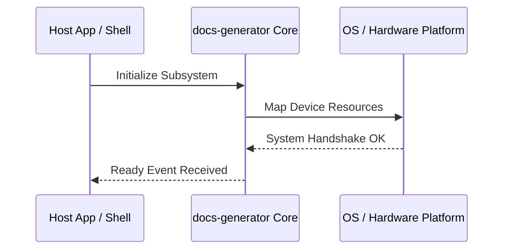

**Related Documents**: [README](../README.md) | [Functional Req](../functional-requirements/docs-generator-fr.md) | [Quick Reference](../code2spec-quick-reference.md)

# Module Design Card: docs-generator

> **Relevant source files**
>
> - [docs/generator/__init__.py](src:docs/generator/__init__.py)
> - [docs/generator/run.py](src:docs/generator/run.py)
> - [docs/webpages/webapi/webapi_main.js](src:docs/webpages/webapi/webapi_main.js)

**Primary File**: [`docs/generator/__init__.py`](src:docs/generator/__init__.py)
**Single Role**: Governs the operations and interfaces for the logical docs-generator subsystem [`__init__.py`](src:docs/generator/__init__.py#L1).
**Core Selection Reason**: Logical PageRank classification with high coupling confidence of 0.95.
**Date**: 2026-08-27

---

## Public Interface

| Class / Symbol | Signature / Description | Calling Module / Component | Source |
|----------------|-------------------------|----------------------------|--------|
| `docs-generator_init` | `init()`: Starts the logical subsystem | `engine-core` | [`__init__.py`](src:docs/generator/__init__.py#L1) |
| `__init__.` | Native operations for __init__.py | `shell` / `public-bridge` | [`__init__.py`](src:docs/generator/__init__.py#L1) |
| `run.` | Native operations for run.py | `shell` / `public-bridge` | [`run.py`](src:docs/generator/run.py#L10) |
| `webapi_main.` | Native operations for webapi_main.js | `shell` / `public-bridge` | [`webapi_main.js`](src:docs/webpages/webapi/webapi_main.js#L10) |

---

## IPC / Message / Interface Contracts

- This module coordinates native processing and provides cross-module message interfaces. [`__init__.py`](src:docs/generator/__init__.py#L1)
- No custom socket-based or D-Bus communication is directly exposed unless defined globally.

## Key Flow

## Architectural Rules
1. **Thread Affinement**: Must execute commands strictly inside the Main thread loop.
2. **Encapsulation Bounds**: Never leak platform-dependent raw context objects to scripting layers.

## Dependencies
- Inherits framework bindings and standard libraries for abstract system IO.
