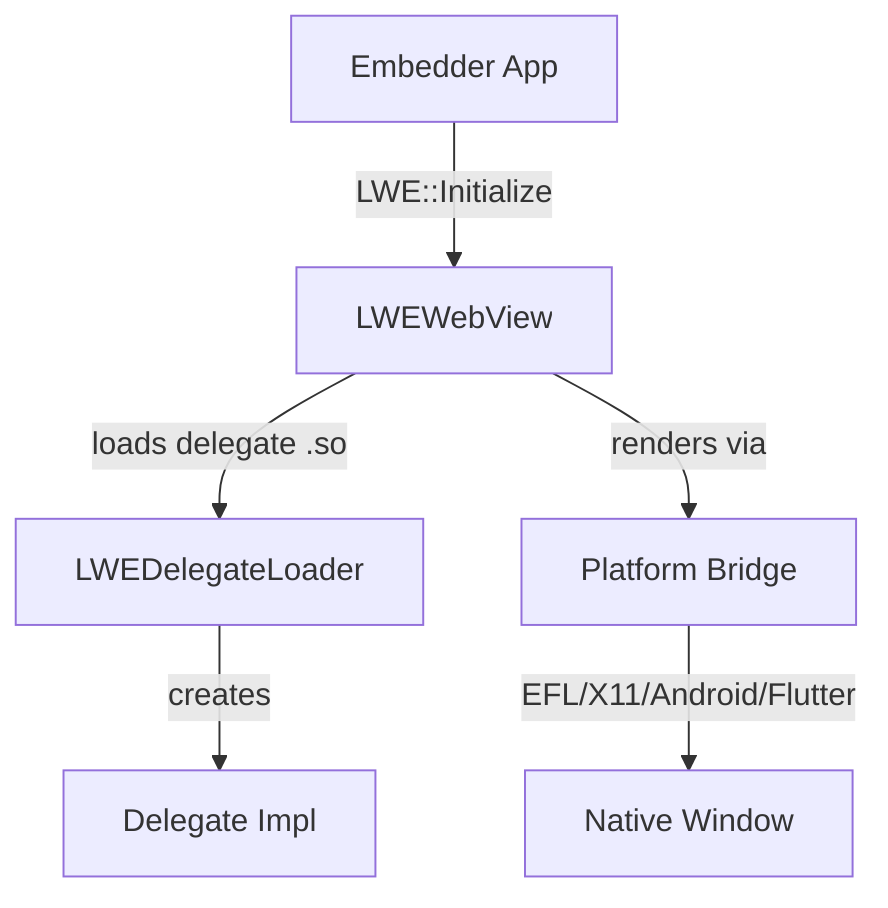

# Module Design Card: embedding-api

> **Relevant source files**
> - [`LWEWebView.h`](inc/LWEWebView.h#L20)
> - [`LWEWorker.h`](inc/LWEWorker.h#L1)
> - [`PlatformIntegrationData.h`](inc/PlatformIntegrationData.h#L7)
> - [`LWEDelegateLoader.cpp`](src/public/LWEDelegateLoader.cpp#L1)
> - [`LWEWebView.cpp`](src/public/LWEWebView.cpp#L1)
> - [`AndroidBridge.cpp`](src/public/bridge/android/AndroidBridge.cpp#L1)
> - [`LWEWebViewEFL.cpp`](src/public/bridge/efl/LWEWebViewEFL.cpp#L1)
> - [`LWEWebViewFlutter.cpp`](src/public/bridge/flutter/LWEWebViewFlutter.cpp#L1)
> - [`LWEDelegate.h`](src/public/contract/LWEDelegate.h#L1)
> - [`CookieManagerDelegate.h`](src/public/contract/CookieManagerDelegate.h#L1)

## Module Boundary
Public embedding API: LWEWebView/Worker API, per-platform bridges, delegate contracts. [`module-groups.yaml`](code2spec/.analysis/state/delta/module-groups.yaml)

**Confidence**: 0.92

## Source Files
57 files across `inc/`, `src/public/`, `src/public/bridge/`, `src/public/contract/`, `src/public/delegate/`, `compat/`

## Public Interface
- `LWE::Initialize(InitializeOption)` — Engine initialization with options (PreferSeparateThread, PreferIncrementalGC). [`LWEWebView.h:58`](inc/LWEWebView.h#L58)
- `LWEWebView` — Main WebView control (load, reload, stop, settings). [`LWEWebView.h`](inc/LWEWebView.h#L20)
- `LWEWorker` — Worker process API. [`LWEWorker.h`](inc/LWEWorker.h#L1)
- `LWEDelegate` — Core delegate contract (pure-virtual). [`LWEDelegate.h`](src/public/contract/LWEDelegate.h#L1)
- `CookieManagerDelegate` — Cookie management contract. [`CookieManagerDelegate.h`](src/public/contract/CookieManagerDelegate.h#L1)
- `PlatformIntegrationData` — Key/mouse/TTS data types. [`PlatformIntegrationData.h:7`](inc/PlatformIntegrationData.h#L7)
- `LWEDelegateLoader` — Dynamic delegate .so loading. [`LWEDelegateLoader.cpp`](src/public/LWEDelegateLoader.cpp#L1)
- `APIRecorder` — API call record/replay for testing. [`APIRecorder.cpp`](src/public/APIRecorder.cpp#L1)

## Key Flow

## Architectural Rules
- Delegate contracts are pure-virtual interfaces shared across the .so boundary. [`AGENTS.md`](AGENTS.md)
- Platform bridges inherit WebView delegate for each platform. [`src/public/bridge/`](src/public/bridge/)
- LWE_DEFAULT_FONT_SIZE=16, LWE_MIN_FONT_SIZE=1, LWE_MAX_FONT_SIZE=72. [`LWEWebView.h:190`](inc/LWEWebView.h#L190)

## Dependencies
- Depends on: engine-core (Starfish class), js-binding (ScriptBindingInstance)
- External: Android JNI, EFL Evas, X11, Flutter platform channels

## IPC / Message / Interface Contracts
- JNI bridge: AndroidBridge communicates with Java layer via JNI. [`AndroidBridge.cpp`](src/public/bridge/android/AndroidBridge.cpp#L1)
- Flutter platform channel: LWEWebViewFlutter uses PORT_WINDOW_BACKEND (GB/GL/HEADLESS) and PORT_COMPOSITOR_BACKEND (CAIRO/GL/MOCK). [`LWEWebViewFlutter.cpp:82`](src/public/bridge/flutter/LWEWebViewFlutter.cpp#L82)

## Quick Navigation
- [FR Document](../functional-requirements/embedding-api-fr.md)
- [Architecture](../02-architecture.md)
