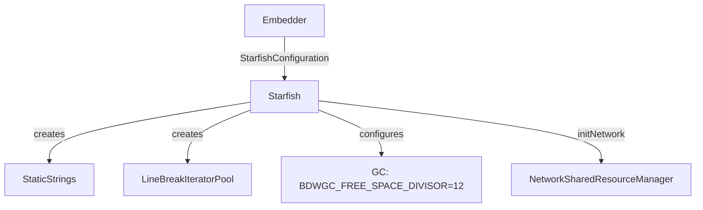

# Module Design Card: engine-core

> **Relevant source files**
> - [`Starfish.h`](src/Starfish.h#L58)
> - [`StarfishBase.h`](src/StarfishBase.h#L44)
> - [`StarfishConfig.h`](src/StarfishConfig.h#L1)
> - [`StaticStrings.h`](src/StaticStrings.h#L1)
> - [`StoragePathProvider.h`](src/StoragePathProvider.h#L1)
> - [`StarfishPlatform.h`](src/StarfishPlatform.h#L1)
> - [`StarfishInfo.h`](src/StarfishInfo.h#L1)

## Module Boundary
Core engine foundation: GC configuration, platform detection macros, static strings, storage path provider, profiling annotations.

**Confidence**: 0.95

## Source Files
11 files in `src/` (root level)

## Public Interface
- `Starfish` — Main engine class (gc-managed). [`Starfish.h:58`](src/Starfish.h#L58)
- `StarfishConfiguration` — Config struct (storageDirectoryPath, gcFrequency, isThreadMode, backend, rendererType). [`Starfish.h:49`](src/Starfish.h#L49)
- `StarfishRendererType` — kOpenGL, kSoftware, kHeadless. [`Starfish.h:43`](src/Starfish.h#L43)
- `StaticStrings` — Pre-allocated string constants.
- `StoragePathProvider` — File system path management for cache/storage.
- `Optional<T>` — Nullable value wrapper (defined in StarfishBase.h).

## Key Flow

## Architectural Rules
- Starfish class extends `gc` (Boehm GC). [`Starfish.h:58`](src/Starfish.h#L58)
- BDWGC_FREE_SPACE_DIVISOR = 12 (default GC frequency). [`Starfish.h:40`](src/Starfish.h#L40)
- StarfishConfiguration.gcFrequency controls GC free space divisor. [`Starfish.h:51`](src/Starfish.h#L51)
- Optional<T> for nullable values, not raw pointer + nullptr. [`AGENTS.md`](AGENTS.md)
- GCVector/GCTightVector for GC-managed containers. [`AGENTS.md`](AGENTS.md)
- Compiler detection: COMPILER_CLANG, COMPILER_MSVC, COMPILER_GCC. [`StarfishBase.h:84`](src/StarfishBase.h#L84)
- Uses tsl::robin_map/robin_set from third_party. [`StarfishBase.h:81`](src/StarfishBase.h#L81)

## Dependencies
- Used by: all modules (foundation)
- External: Boehm GC, tsl::robin_map

## IPC / Message / Interface Contracts
- This module does not have cross-module IPC. It provides the engine foundation.

## Quick Navigation
- [FR Document](../functional-requirements/engine-core-fr.md)
- [Architecture](../02-architecture.md)
