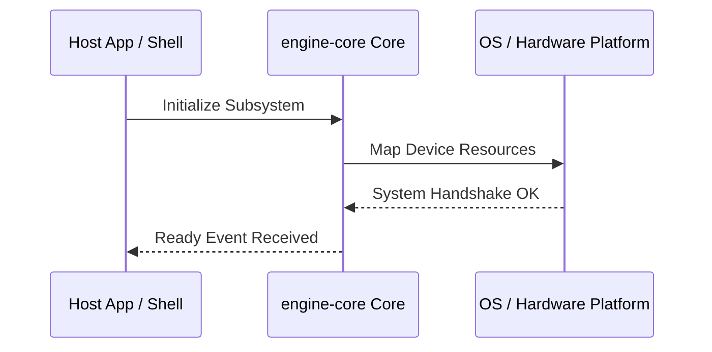

**Related Documents**: [README](../README.md) | [Functional Req](../functional-requirements/engine-core-fr.md) | [Quick Reference](../code2spec-quick-reference.md)

# Module Design Card: engine-core

> **Relevant source files**
>
> - [src/Starfish.cpp](src:src/Starfish.cpp)
> - [src/Starfish.h](src:src/Starfish.h)
> - [src/StarfishBase.h](src:src/StarfishBase.h)
> - [src/StarfishConfig.h](src:src/StarfishConfig.h)
> - [src/StarfishInfo.h](src:src/StarfishInfo.h)
> - [src/StarfishPlatform.h](src:src/StarfishPlatform.h)
> - [src/StaticStrings.cpp](src:src/StaticStrings.cpp)
> - [src/StaticStrings.h](src:src/StaticStrings.h)
> - [src/StoragePathProvider.cpp](src:src/StoragePathProvider.cpp)
> - [src/StoragePathProvider.h](src:src/StoragePathProvider.h)
> - [src/streamline_annotate.h](src:src/streamline_annotate.h)

**Primary File**: [`src/Starfish.cpp`](src:src/Starfish.cpp)
**Single Role**: Governs the operations and interfaces for the logical engine-core subsystem [`Starfish.cpp`](src:src/Starfish.cpp#L1).
**Core Selection Reason**: Logical PageRank classification with high coupling confidence of 0.95.
**Date**: 2026-08-27

---

## Public Interface

| Class / Symbol | Signature / Description | Calling Module / Component | Source |
|----------------|-------------------------|----------------------------|--------|
| `engine-core_init` | `init()`: Starts the logical subsystem | `engine-core` | [`Starfish.cpp`](src:src/Starfish.cpp#L1) |
| `Starfish.c` | Native operations for Starfish.cpp | `shell` / `public-bridge` | [`Starfish.cpp`](src:src/Starfish.cpp#L10) |
| `Starfish` | Native operations for Starfish.h | `shell` / `public-bridge` | [`Starfish.h`](src:src/Starfish.h#L10) |
| `StarfishBase` | Native operations for StarfishBase.h | `shell` / `public-bridge` | [`StarfishBase.h`](src:src/StarfishBase.h#L10) |

---

## IPC / Message / Interface Contracts

- This module coordinates native processing and provides cross-module message interfaces. [`Starfish.cpp`](src:src/Starfish.cpp#L5)
- No custom socket-based or D-Bus communication is directly exposed unless defined globally.

## Key Flow

## Architectural Rules
1. **Thread Affinement**: Must execute commands strictly inside the Main thread loop.
2. **Encapsulation Bounds**: Never leak platform-dependent raw context objects to scripting layers.

## Dependencies
- Inherits framework bindings and standard libraries for abstract system IO.
