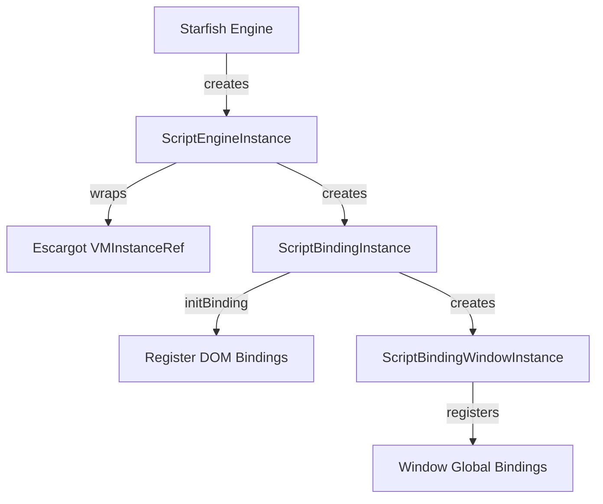

# Module Design Card: js-binding

> **Relevant source files**
> - [`ScriptEngineInstance.h`](src/binding/ScriptEngineInstance.h#L33)
> - [`ScriptBindingInstance.h`](src/binding/ScriptBindingInstance.h#L68)
> - [`ScriptBindingWindowInstance.cpp`](src/binding/ScriptBindingWindowInstance.cpp#L1)
> - [`ScriptBindingWorkerInstance.cpp`](src/binding/ScriptBindingWorkerInstance.cpp#L1)
> - [`ScriptBindingSecurity.cpp`](src/binding/ScriptBindingSecurity.cpp#L1)
> - [`ScriptWrappable.h`](src/binding/ScriptWrappable.h#L1)
> - [`ScriptEngineInstance.cpp`](src/binding/ScriptEngineInstance.cpp#L1)

## Module Boundary
JavaScript engine binding layer: custom DOM bindings, script engine instance, security, window/worker proxy, holdable GC references.

**Confidence**: 0.95

## Source Files
38 files in `src/binding/`

## Public Interface
- `ScriptEngineInstance` — Wraps Escargot VMInstanceRef, manages micro/macro tasks. [`ScriptEngineInstance.h:33`](src/binding/ScriptEngineInstance.h#L33)
- `ScriptBindingInstance` — Initializes JS bindings via `initBinding()`, defines global binding accessors. [`ScriptBindingInstance.h:68`](src/binding/ScriptBindingInstance.h#L68)
- `ScriptBindingWindowInstance` — Window-context binding with STARFISH_ENUM_GLOBAL_BINDING_WINDOW_NAMES. [`ScriptBindingWindowInstance.cpp`](src/binding/ScriptBindingWindowInstance.cpp#L1)
- `ScriptBindingWorkerInstance` — Worker-context binding (Dedicated/Shared/ServiceWorker). [`ScriptBindingWorkerInstance.cpp`](src/binding/ScriptBindingWorkerInstance.cpp#L1)
- `ScriptBindingSecurity` — Same-origin and cross-origin security checks. [`ScriptBindingSecurity.cpp`](src/binding/ScriptBindingSecurity.cpp#L1)
- `ScriptWrappable` — Base class for JS-wrapped C++ objects. [`ScriptWrappable.h`](src/binding/ScriptWrappable.h#L1)
- `*Holdable` — GC root reference management (DocumentHoldable, WindowHoldable, WebViewHoldable). [`DocumentHoldable.h`](src/binding/DocumentHoldable.h#L1)
- `*CustomBinding` — DOM interface constructor/method registration with Escargot. [`DocumentCustomBinding.cpp`](src/binding/DocumentCustomBinding.cpp#L1)

## Key Flow

## Architectural Rules
- ScriptEngineInstance wraps `Escargot::VMInstanceRef*`. [`ScriptEngineInstance.h:31`](src/binding/ScriptEngineInstance.h#L31)
- MicroTaskExecutionManager manages macro task counter and microtask draining. [`ScriptEngineInstance.h:62`](src/binding/ScriptEngineInstance.h#L62)
- STARFISH_ENUM_BINDING_NAMES macro declares binding functions. [`ScriptBindingInstance.h:58`](src/binding/ScriptBindingInstance.h#L58)
- Holdable classes manage GC root references for JS-accessible objects.

## Dependencies
- Depends on: engine-core (Starfish, gc), Escargot JS engine (third_party/escargot)
- Used by: embedding-api (via WebView)

## IPC / Message / Interface Contracts
- This module does not have cross-module IPC. It provides the JS↔C++ binding interface within the engine process.

## Quick Navigation
- [FR Document](../functional-requirements/js-binding-fr.md)
- [Architecture](../02-architecture.md)
