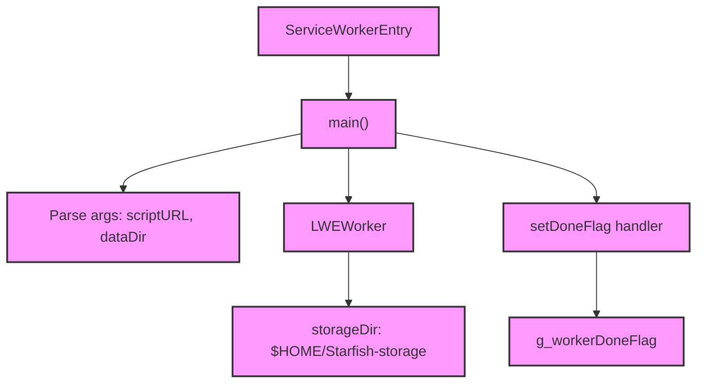

# Module Design Card — launcher

> **Relevant source files**
> - [`ServiceWorkerEntry.cpp`](src:src/launcher/ServiceWorkerEntry.cpp)
> - [`SharedWorkerEntry.cpp`](src:src/launcher/SharedWorkerEntry.cpp)

## Module Boundary

**Rationale:** Worker entry points — service worker and shared worker launchers [`module-groups.yaml`](src:code2spec/.analysis/state/delta/module-groups.yaml)
**Confidence:** 0.88

## Source Files

2 files in `src/launcher/` providing standalone entry points for service worker and shared worker processes.

## Public Interface

| Component | Entry Point | Source |
|---|---|---|
| Service Worker | `main()` | [`ServiceWorkerEntry.cpp`](src:src/launcher/ServiceWorkerEntry.cpp#L55) |
| Shared Worker | `main()` | [`SharedWorkerEntry.cpp`](src:src/launcher/SharedWorkerEntry.cpp) |

## Key Flow

## Architectural Rules

- Gated by `STARFISH_ENABLE_SERVICE_WORKER` and `STARFISH_WEBWORKER_HOST` [`ServiceWorkerEntry.cpp`](src:src/launcher/ServiceWorkerEntry.cpp#L20)
- Storage dir: `$HOME/Starfish-storage` [`ServiceWorkerEntry.cpp`](src:src/launcher/ServiceWorkerEntry.cpp#L51)
- Signal handler sets `g_workerDoneFlag` [`ServiceWorkerEntry.cpp`](src:src/launcher/ServiceWorkerEntry.cpp#L32)
- Uses `LWEWorker.h` for worker API [`ServiceWorkerEntry.cpp`](src:src/launcher/ServiceWorkerEntry.cpp#L28)

## Dependencies

| Dependency | Type |
|---|---|
| public-api (LWEWorker) | Internal |
| compat-headers (LWEWorker.h) | Internal |

## IPC / Message / Interface Contracts

- Worker process communicates with main process via `LWEWorker` API and `RegisterOnStatusChangedHandler`. [`ServiceWorkerEntry.cpp`](src:src/launcher/ServiceWorkerEntry.cpp#L28)

## Quick Navigation

- [FR Document](../functional-requirements/launcher-fr.md)
- [Architecture](../02-architecture.md)
