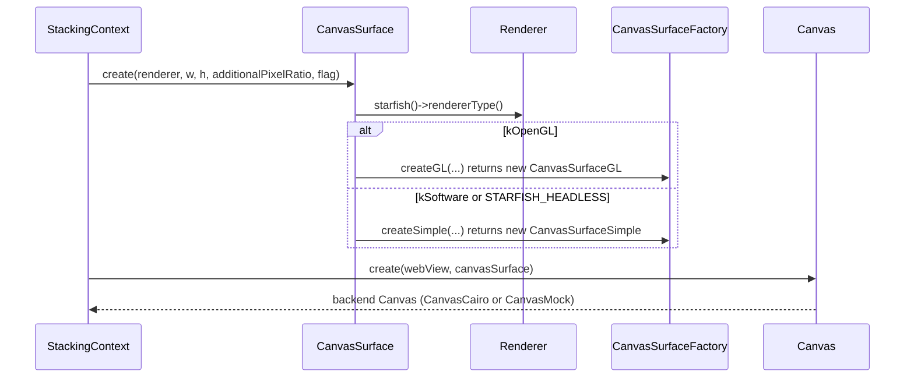
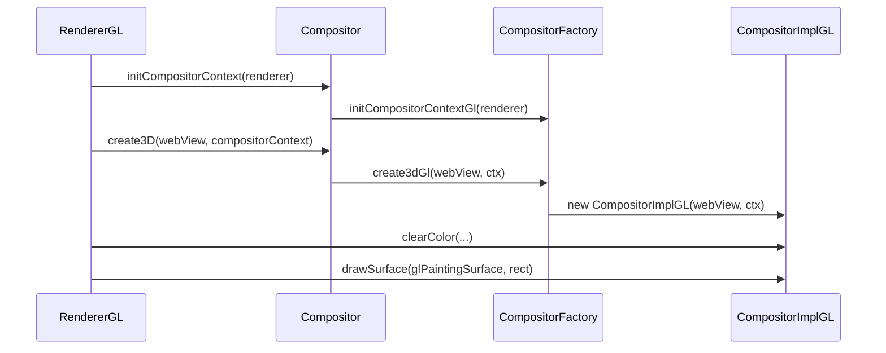
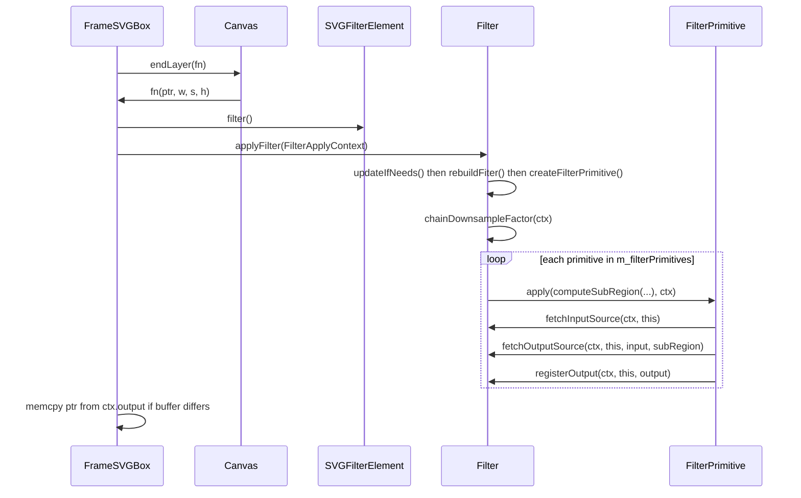
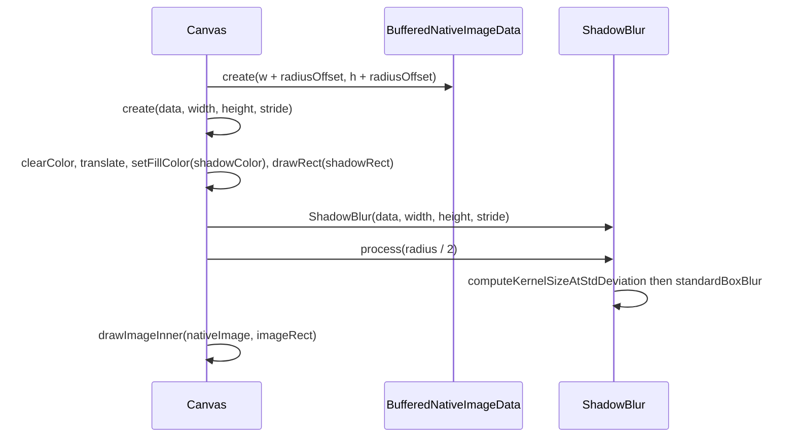
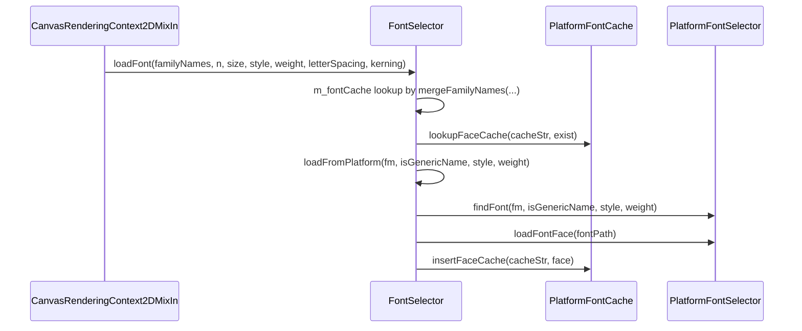

# Module Design Card: modules-canvas

> **Relevant source files**
>
> - [src/core/modules/canvas/BlendMode.cpp](src:src/core/modules/canvas/BlendMode.cpp)
> - [src/core/modules/canvas/BlendMode.h](src:src/core/modules/canvas/BlendMode.h)
> - [src/core/modules/canvas/Canvas.cpp](src:src/core/modules/canvas/Canvas.cpp)
> - [src/core/modules/canvas/Canvas.h](src:src/core/modules/canvas/Canvas.h)
> - [src/core/modules/canvas/CanvasFillStrokeSource.cpp](src:src/core/modules/canvas/CanvasFillStrokeSource.cpp)
> - [src/core/modules/canvas/CanvasFillStrokeSource.h](src:src/core/modules/canvas/CanvasFillStrokeSource.h)
> - [src/core/modules/canvas/CanvasShadowData.h](src:src/core/modules/canvas/CanvasShadowData.h)
> - [src/core/modules/canvas/Compositor.cpp](src:src/core/modules/canvas/Compositor.cpp)
> - [src/core/modules/canvas/Compositor.h](src:src/core/modules/canvas/Compositor.h)
> - [src/core/modules/canvas/CompositorFactory.h](src:src/core/modules/canvas/CompositorFactory.h)
> - [src/core/modules/canvas/NativeGradient.h](src:src/core/modules/canvas/NativeGradient.h)
> - [src/core/modules/canvas/NativePattern.h](src:src/core/modules/canvas/NativePattern.h)
> - [src/core/modules/canvas/Path.h](src:src/core/modules/canvas/Path.h)
> - [src/core/modules/canvas/ShadowBlur.cpp](src:src/core/modules/canvas/ShadowBlur.cpp)
> - [src/core/modules/canvas/ShadowBlur.h](src:src/core/modules/canvas/ShadowBlur.h)
> - [src/core/modules/canvas/TextDecorationData.cpp](src:src/core/modules/canvas/TextDecorationData.cpp)
> - [src/core/modules/canvas/TextDecorationData.h](src:src/core/modules/canvas/TextDecorationData.h)
> - [src/core/modules/canvas/filter/Filter.cpp](src:src/core/modules/canvas/filter/Filter.cpp)
> - [src/core/modules/canvas/filter/Filter.h](src:src/core/modules/canvas/filter/Filter.h)
> - [src/core/modules/canvas/filter/FilterColorMatrix.cpp](src:src/core/modules/canvas/filter/FilterColorMatrix.cpp)
> - [src/core/modules/canvas/filter/FilterColorMatrix.h](src:src/core/modules/canvas/filter/FilterColorMatrix.h)
> - [src/core/modules/canvas/filter/FilterComponentTransfer.cpp](src:src/core/modules/canvas/filter/FilterComponentTransfer.cpp)
> - [src/core/modules/canvas/filter/FilterComponentTransfer.h](src:src/core/modules/canvas/filter/FilterComponentTransfer.h)
> - [src/core/modules/canvas/filter/FilterComposite.cpp](src:src/core/modules/canvas/filter/FilterComposite.cpp)
> - [src/core/modules/canvas/filter/FilterComposite.h](src:src/core/modules/canvas/filter/FilterComposite.h)
> - [src/core/modules/canvas/filter/FilterDisplacementMap.cpp](src:src/core/modules/canvas/filter/FilterDisplacementMap.cpp)
> - [src/core/modules/canvas/filter/FilterDisplacementMap.h](src:src/core/modules/canvas/filter/FilterDisplacementMap.h)
> - [src/core/modules/canvas/filter/FilterFlood.cpp](src:src/core/modules/canvas/filter/FilterFlood.cpp)
> - [src/core/modules/canvas/filter/FilterFlood.h](src:src/core/modules/canvas/filter/FilterFlood.h)
> - [src/core/modules/canvas/filter/FilterGaussianBlur.cpp](src:src/core/modules/canvas/filter/FilterGaussianBlur.cpp)
> - [src/core/modules/canvas/filter/FilterGaussianBlur.h](src:src/core/modules/canvas/filter/FilterGaussianBlur.h)
> - [src/core/modules/canvas/filter/FilterMerge.cpp](src:src/core/modules/canvas/filter/FilterMerge.cpp)
> - [src/core/modules/canvas/filter/FilterMerge.h](src:src/core/modules/canvas/filter/FilterMerge.h)
> - [src/core/modules/canvas/filter/FilterMorphology.cpp](src:src/core/modules/canvas/filter/FilterMorphology.cpp)
> - [src/core/modules/canvas/filter/FilterMorphology.h](src:src/core/modules/canvas/filter/FilterMorphology.h)
> - [src/core/modules/canvas/filter/FilterOffset.cpp](src:src/core/modules/canvas/filter/FilterOffset.cpp)
> - [src/core/modules/canvas/filter/FilterOffset.h](src:src/core/modules/canvas/filter/FilterOffset.h)
> - [src/core/modules/canvas/filter/FilterPrimitive.cpp](src:src/core/modules/canvas/filter/FilterPrimitive.cpp)
> - [src/core/modules/canvas/filter/FilterPrimitive.h](src:src/core/modules/canvas/filter/FilterPrimitive.h)
> - [src/core/modules/canvas/filter/FilterTurbulence.cpp](src:src/core/modules/canvas/filter/FilterTurbulence.cpp)
> - [src/core/modules/canvas/filter/FilterTurbulence.h](src:src/core/modules/canvas/filter/FilterTurbulence.h)
> - [src/core/modules/canvas/font/Font.cpp](src:src/core/modules/canvas/font/Font.cpp)
> - [src/core/modules/canvas/font/Font.h](src:src/core/modules/canvas/font/Font.h)
> - [src/core/modules/canvas/image/AnimatedGIFNativeImageData.h](src:src/core/modules/canvas/image/AnimatedGIFNativeImageData.h)
> - [src/core/modules/canvas/image/BufferedNativeImageData.cpp](src:src/core/modules/canvas/image/BufferedNativeImageData.cpp)
> - [src/core/modules/canvas/image/BufferedNativeImageData.h](src:src/core/modules/canvas/image/BufferedNativeImageData.h)
> - [src/core/modules/canvas/image/CompressedNativeImageData.h](src:src/core/modules/canvas/image/CompressedNativeImageData.h)
> - [src/core/modules/canvas/image/ImageDecoder.cpp](src:src/core/modules/canvas/image/ImageDecoder.cpp)
> - [src/core/modules/canvas/image/ImageDecoder.h](src:src/core/modules/canvas/image/ImageDecoder.h)
> - [src/core/modules/canvas/image/ImageEncoder.cpp](src:src/core/modules/canvas/image/ImageEncoder.cpp)
> - [src/core/modules/canvas/image/ImageEncoder.h](src:src/core/modules/canvas/image/ImageEncoder.h)
> - [src/core/modules/canvas/image/NativeImageData.h](src:src/core/modules/canvas/image/NativeImageData.h)
> - [src/core/modules/canvas/image/SVGNativeImageData.h](src:src/core/modules/canvas/image/SVGNativeImageData.h)
> - [src/platform/canvas/CompositorGL.cpp](src:src/platform/canvas/CompositorGL.cpp)
> - [src/platform/canvas/CompositorCairo.cpp](src:src/platform/canvas/CompositorCairo.cpp)
> - [src/platform/canvas/CompositorMock.cpp](src:src/platform/canvas/CompositorMock.cpp)
> - [src/platform/canvas/CanvasCairo.cpp](src:src/platform/canvas/CanvasCairo.cpp)
> - [src/platform/canvas/CanvasMock.cpp](src:src/platform/canvas/CanvasMock.cpp)
> - [src/platform/canvas/PathCairo.cpp](src:src/platform/canvas/PathCairo.cpp)
> - [src/platform/canvas/font/FontImplCairo.cpp](src:src/platform/canvas/font/FontImplCairo.cpp)
> - [src/platform/canvas/font/FontImplCairo.h](src:src/platform/canvas/font/FontImplCairo.h)
> - [src/platform/canvas/image/NativeImageDataImpl.cpp](src:src/platform/canvas/image/NativeImageDataImpl.cpp)
> - [src/platform/canvas/image/SVGNativeImageDataImpl.cpp](src:src/platform/canvas/image/SVGNativeImageDataImpl.cpp)
> - [src/platform/canvas/image/AnimatedGIFNativeImageDataImpl.cpp](src:src/platform/canvas/image/AnimatedGIFNativeImageDataImpl.cpp)
> - [src/platform/canvas/image/CompressedNativeImageDataImpl.cpp](src:src/platform/canvas/image/CompressedNativeImageDataImpl.cpp)
> - [src/core/layout/StackingContext.cpp](src:src/core/layout/StackingContext.cpp)
> - [src/core/layout/FrameBox.cpp](src:src/core/layout/FrameBox.cpp)
> - [src/core/layout/FrameReplacedCanvas.cpp](src:src/core/layout/FrameReplacedCanvas.cpp)
> - [src/core/layout/FrameReplacedImage.cpp](src:src/core/layout/FrameReplacedImage.cpp)
> - [src/core/layout/FrameBlockBoxInlineLayout.cpp](src:src/core/layout/FrameBlockBoxInlineLayout.cpp)
> - [src/core/layout/ComputeOverflow.h](src:src/core/layout/ComputeOverflow.h)
> - [src/core/layout/svg/FrameSVGBox.cpp](src:src/core/layout/svg/FrameSVGBox.cpp)
> - [src/core/layout/svg/FrameSVGRectBox.cpp](src:src/core/layout/svg/FrameSVGRectBox.cpp)
> - [src/core/modules/renderer/RendererGL.cpp](src:src/core/modules/renderer/RendererGL.cpp)
> - [src/core/modules/renderer/RendererSoftware.cpp](src:src/core/modules/renderer/RendererSoftware.cpp)
> - [src/core/modules/profiling/Profiling.h](src:src/core/modules/profiling/Profiling.h)
> - [src/core/dom/Document.cpp](src:src/core/dom/Document.cpp)
> - [src/core/dom/svg/SVGFilterElement.cpp](src:src/core/dom/svg/SVGFilterElement.cpp)
> - [src/core/dom/canvas/HTMLCanvasElement.cpp](src:src/core/dom/canvas/HTMLCanvasElement.cpp)
> - [src/core/dom/canvas/CanvasRenderingContext2DMixIn.cpp](src:src/core/dom/canvas/CanvasRenderingContext2DMixIn.cpp)
> - [src/core/dom/canvas/CanvasImageSource.cpp](src:src/core/dom/canvas/CanvasImageSource.cpp)
> - [src/core/dom/canvas/CanvasGradient.cpp](src:src/core/dom/canvas/CanvasGradient.cpp)
> - [src/core/dom/canvas/CanvasPattern.cpp](src:src/core/dom/canvas/CanvasPattern.cpp)
> - [src/core/cdp/domains/PageDomain.cpp](src:src/core/cdp/domains/PageDomain.cpp)
> - [src/platform/loader/ImageResource.cpp](src:src/platform/loader/ImageResource.cpp)

**Module**: `modules-canvas` — 53 files under `src/core/modules/canvas/`, `src/core/modules/canvas/filter/`, `src/core/modules/canvas/font/`, `src/core/modules/canvas/image/`
**Role**: Defines the backend-independent drawing surface, compositor, filter, font and image-data abstractions that layout paints into, and dispatches their creation to the Cairo, GL or mock implementation selected by the renderer type. [`Canvas`](src:src/core/modules/canvas/Canvas.h#L296), [`Compositor::create3D`](src:src/core/modules/canvas/Compositor.cpp#L34)
**Module Boundary**: Canvas compositing/filter module directory (BlendMode, shadow, filter/ subdirectory with color-matrix/composite filters)
**Confidence**: 0.9
**Core selection**: All approved modules are Core (boundary approved in W1 human review)
**Generated**: 2026-09-10

## Source Files

### `src/core/modules/canvas/` (surface, state, compositor, shadow, paint sources)

- [src/core/modules/canvas/BlendMode.cpp](src:src/core/modules/canvas/BlendMode.cpp)
- [src/core/modules/canvas/BlendMode.h](src:src/core/modules/canvas/BlendMode.h)
- [src/core/modules/canvas/Canvas.cpp](src:src/core/modules/canvas/Canvas.cpp)
- [src/core/modules/canvas/Canvas.h](src:src/core/modules/canvas/Canvas.h)
- [src/core/modules/canvas/CanvasFillStrokeSource.cpp](src:src/core/modules/canvas/CanvasFillStrokeSource.cpp)
- [src/core/modules/canvas/CanvasFillStrokeSource.h](src:src/core/modules/canvas/CanvasFillStrokeSource.h)
- [src/core/modules/canvas/CanvasShadowData.h](src:src/core/modules/canvas/CanvasShadowData.h)
- [src/core/modules/canvas/Compositor.cpp](src:src/core/modules/canvas/Compositor.cpp)
- [src/core/modules/canvas/Compositor.h](src:src/core/modules/canvas/Compositor.h)
- [src/core/modules/canvas/CompositorFactory.h](src:src/core/modules/canvas/CompositorFactory.h)
- [src/core/modules/canvas/NativeGradient.h](src:src/core/modules/canvas/NativeGradient.h)
- [src/core/modules/canvas/NativePattern.h](src:src/core/modules/canvas/NativePattern.h)
- [src/core/modules/canvas/Path.h](src:src/core/modules/canvas/Path.h)
- [src/core/modules/canvas/ShadowBlur.cpp](src:src/core/modules/canvas/ShadowBlur.cpp)
- [src/core/modules/canvas/ShadowBlur.h](src:src/core/modules/canvas/ShadowBlur.h)
- [src/core/modules/canvas/TextDecorationData.cpp](src:src/core/modules/canvas/TextDecorationData.cpp)
- [src/core/modules/canvas/TextDecorationData.h](src:src/core/modules/canvas/TextDecorationData.h)

### `src/core/modules/canvas/filter/` (SVG filter chain and primitives)

- [src/core/modules/canvas/filter/Filter.cpp](src:src/core/modules/canvas/filter/Filter.cpp)
- [src/core/modules/canvas/filter/Filter.h](src:src/core/modules/canvas/filter/Filter.h)
- [src/core/modules/canvas/filter/FilterColorMatrix.cpp](src:src/core/modules/canvas/filter/FilterColorMatrix.cpp)
- [src/core/modules/canvas/filter/FilterColorMatrix.h](src:src/core/modules/canvas/filter/FilterColorMatrix.h)
- [src/core/modules/canvas/filter/FilterComponentTransfer.cpp](src:src/core/modules/canvas/filter/FilterComponentTransfer.cpp)
- [src/core/modules/canvas/filter/FilterComponentTransfer.h](src:src/core/modules/canvas/filter/FilterComponentTransfer.h)
- [src/core/modules/canvas/filter/FilterComposite.cpp](src:src/core/modules/canvas/filter/FilterComposite.cpp)
- [src/core/modules/canvas/filter/FilterComposite.h](src:src/core/modules/canvas/filter/FilterComposite.h)
- [src/core/modules/canvas/filter/FilterDisplacementMap.cpp](src:src/core/modules/canvas/filter/FilterDisplacementMap.cpp)
- [src/core/modules/canvas/filter/FilterDisplacementMap.h](src:src/core/modules/canvas/filter/FilterDisplacementMap.h)
- [src/core/modules/canvas/filter/FilterFlood.cpp](src:src/core/modules/canvas/filter/FilterFlood.cpp)
- [src/core/modules/canvas/filter/FilterFlood.h](src:src/core/modules/canvas/filter/FilterFlood.h)
- [src/core/modules/canvas/filter/FilterGaussianBlur.cpp](src:src/core/modules/canvas/filter/FilterGaussianBlur.cpp)
- [src/core/modules/canvas/filter/FilterGaussianBlur.h](src:src/core/modules/canvas/filter/FilterGaussianBlur.h)
- [src/core/modules/canvas/filter/FilterMerge.cpp](src:src/core/modules/canvas/filter/FilterMerge.cpp)
- [src/core/modules/canvas/filter/FilterMerge.h](src:src/core/modules/canvas/filter/FilterMerge.h)
- [src/core/modules/canvas/filter/FilterMorphology.cpp](src:src/core/modules/canvas/filter/FilterMorphology.cpp)
- [src/core/modules/canvas/filter/FilterMorphology.h](src:src/core/modules/canvas/filter/FilterMorphology.h)
- [src/core/modules/canvas/filter/FilterOffset.cpp](src:src/core/modules/canvas/filter/FilterOffset.cpp)
- [src/core/modules/canvas/filter/FilterOffset.h](src:src/core/modules/canvas/filter/FilterOffset.h)
- [src/core/modules/canvas/filter/FilterPrimitive.cpp](src:src/core/modules/canvas/filter/FilterPrimitive.cpp)
- [src/core/modules/canvas/filter/FilterPrimitive.h](src:src/core/modules/canvas/filter/FilterPrimitive.h)
- [src/core/modules/canvas/filter/FilterTurbulence.cpp](src:src/core/modules/canvas/filter/FilterTurbulence.cpp)
- [src/core/modules/canvas/filter/FilterTurbulence.h](src:src/core/modules/canvas/filter/FilterTurbulence.h)

### `src/core/modules/canvas/font/` (font selection and caching)

- [src/core/modules/canvas/font/Font.cpp](src:src/core/modules/canvas/font/Font.cpp)
- [src/core/modules/canvas/font/Font.h](src:src/core/modules/canvas/font/Font.h)

### `src/core/modules/canvas/image/` (image data, decoding, encoding)

- [src/core/modules/canvas/image/AnimatedGIFNativeImageData.h](src:src/core/modules/canvas/image/AnimatedGIFNativeImageData.h)
- [src/core/modules/canvas/image/BufferedNativeImageData.cpp](src:src/core/modules/canvas/image/BufferedNativeImageData.cpp)
- [src/core/modules/canvas/image/BufferedNativeImageData.h](src:src/core/modules/canvas/image/BufferedNativeImageData.h)
- [src/core/modules/canvas/image/CompressedNativeImageData.h](src:src/core/modules/canvas/image/CompressedNativeImageData.h)
- [src/core/modules/canvas/image/ImageDecoder.cpp](src:src/core/modules/canvas/image/ImageDecoder.cpp)
- [src/core/modules/canvas/image/ImageDecoder.h](src:src/core/modules/canvas/image/ImageDecoder.h)
- [src/core/modules/canvas/image/ImageEncoder.cpp](src:src/core/modules/canvas/image/ImageEncoder.cpp)
- [src/core/modules/canvas/image/ImageEncoder.h](src:src/core/modules/canvas/image/ImageEncoder.h)
- [src/core/modules/canvas/image/NativeImageData.h](src:src/core/modules/canvas/image/NativeImageData.h)
- [src/core/modules/canvas/image/SVGNativeImageData.h](src:src/core/modules/canvas/image/SVGNativeImageData.h)

## Public Interface

| Function/Class | Signature | Main callers | Source |
|---|---|---|---|
| `Canvas` | `class Canvas : public gc` (abstract drawing surface: state, transforms, rect/text/path/image drawing, layers) | Layout painting, e.g. [`InlineTextBox::paintInlineContent`](src:src/core/layout/FrameBlockBoxInlineLayout.cpp#L5043); implemented by [`CanvasCairo`](src:src/platform/canvas/CanvasCairo.cpp#L330) and [`CanvasMock`](src:src/platform/canvas/CanvasMock.cpp#L111) | [`Canvas`](src:src/core/modules/canvas/Canvas.h#L296) |
| `Canvas::create` | `static Canvas* create(WebView* webView, CanvasSurface* data, CanvasFlag flag = PlainElement)`; overloads for `NativeImageData*` and raw `uint8_t*` buffers | [`StackingContext::fillGraphicsBufferContentsWithoutClipRect`](src:src/core/layout/StackingContext.cpp#L1965), [`StackingContext::applyStackingContextPropertiesPostProcessing`](src:src/core/layout/StackingContext.cpp#L1354); defined per backend in [`CanvasCairo.cpp`](src:src/platform/canvas/CanvasCairo.cpp#L2568) | [`Canvas::create`](src:src/core/modules/canvas/Canvas.h#L307) |
| `Canvas::save` / `Canvas::restore` | `virtual void save(); virtual void restore();` | Layout painting and shadow helpers inside the module ([`Canvas::drawRectShadowInner`](src:src/core/modules/canvas/Canvas.cpp#L424)) | [`Canvas::save`](src:src/core/modules/canvas/Canvas.cpp#L372), [`Canvas::restore`](src:src/core/modules/canvas/Canvas.cpp#L411) |
| `Canvas::beginLayer` / `Canvas::endLayer` | `virtual void beginLayer(const Unit::Rect& layerRect, float layerOpacity, CanvasLayerMode mode) = 0; virtual void endLayer(LayerPixelModifyFunction fn = nullptr) = 0;` | [`FrameSVGBox::paintContent`](src:src/core/layout/svg/FrameSVGBox.cpp#L702) passes a pixel-modify callback that runs the SVG filter | [`Canvas::beginLayer`](src:src/core/modules/canvas/Canvas.h#L389), [`Canvas::endLayer`](src:src/core/modules/canvas/Canvas.h#L408) |
| `Canvas::drawImage` | `void drawImage(NativeImageData* data, const Unit::Rect& dst, ImageRenderingValue imageRenderingMode = ImageRenderingAutoValue)` | Layout image painting; routes SVG images to `paintContent`, others to `drawNativeImageData` | [`Canvas::drawImage`](src:src/core/modules/canvas/Canvas.h#L472) |
| `Canvas::setCompositeOperator` | `virtual void setCompositeOperator(CanvasCompositeOperator oper, BlendMode mode) = 0` | [`FilterMerge::apply`](src:src/core/modules/canvas/filter/FilterMerge.cpp#L74), 2D context | [`Canvas::setCompositeOperator`](src:src/core/modules/canvas/Canvas.h#L378) |
| `CanvasSurface::create` | `static CanvasSurface* create(Renderer* renderer, size_t w, size_t h, float additionalPixelRatio = 1, CanvasSurfaceFlag flag = PlainElement)` | [`StackingContext::fillGraphicsBufferContentsWithoutClipRect`](src:src/core/layout/StackingContext.cpp#L1965), [`FrameReplacedCanvas.cpp`](src:src/core/layout/FrameReplacedCanvas.cpp#L43) | [`CanvasSurface::create`](src:src/core/modules/canvas/Canvas.cpp#L300) |
| `CanvasSurface::mapBuffer` | `virtual MappedNativeBuffer mapBuffer(size_t bufferX, size_t bufferY, size_t bufferWidth, size_t bufferHeight) = 0` | Backend surfaces [`CanvasSurfaceGL`](src:src/platform/canvas/CompositorGL.cpp#L2795), [`CanvasSurfaceSimple`](src:src/core/modules/canvas/Canvas.cpp#L85) | [`CanvasSurface::mapBuffer`](src:src/core/modules/canvas/Canvas.h#L190) |
| `Compositor::create3D` / `Compositor::create2D` | `static Compositor* create3D(WebView* webview, CompositorContext* ctx); static Compositor* create2D(WebView* webview, CompositorContext* ctx, CanvasSurface* surface);` | [`RendererGL.cpp`](src:src/core/modules/renderer/RendererGL.cpp#L203), [`RendererSoftware.cpp`](src:src/core/modules/renderer/RendererSoftware.cpp#L137) | [`Compositor::create3D`](src:src/core/modules/canvas/Compositor.cpp#L34), [`Compositor::create2D`](src:src/core/modules/canvas/Compositor.cpp#L51) |
| `Compositor::initCompositorContext` | `static CompositorContext* initCompositorContext(Renderer* renderer)` | [`RendererGL.cpp`](src:src/core/modules/renderer/RendererGL.cpp#L85) | [`Compositor::initCompositorContext`](src:src/core/modules/canvas/Compositor.cpp#L69) |
| `Compositor::supportsFilterEffect` / `Compositor::maximumTextureSize` | `static bool supportsFilterEffect(Starfish* starfish, size_t textureWidth, size_t textureHeight); static uint32_t maximumTextureSize(Starfish* starfish);` | [`StackingContext::computeStackingContextProperties`](src:src/core/layout/StackingContext.cpp#L707) | [`Compositor::supportsFilterEffect`](src:src/core/modules/canvas/Compositor.cpp#L120), [`Compositor::maximumTextureSize`](src:src/core/modules/canvas/Compositor.cpp#L103) |
| `Compositor::drawSurface` | `virtual void drawSurface(CanvasSurface* data, const Unit::Rect& dst) = 0` | [`StackingContext::compositeStackingContext`](src:src/core/layout/StackingContext.cpp#L2839), [`RendererGL.cpp`](src:src/core/modules/renderer/RendererGL.cpp#L205) | [`Compositor::drawSurface`](src:src/core/modules/canvas/Compositor.h#L116) |
| `Filter::applyFilter` | `void applyFilter(FilterApplyContext& ctx)` | [`FrameSVGBox::paintContent`](src:src/core/layout/svg/FrameSVGBox.cpp#L702) (line 785) | [`Filter::applyFilter`](src:src/core/modules/canvas/filter/Filter.cpp#L300) |
| `Filter::computeBias` | `FilterBias computeBias(FrameSVGBox* target, const LayoutRect& unadjustedFrameRectByFilter, const Unit::Rect& candidateFilterFrameRect, const std::pair<float, float>& viewportScale)` | [`adjustFrameRectByFilter`](src:src/core/layout/svg/FrameSVGBox.cpp#L174) | [`Filter::computeBias`](src:src/core/modules/canvas/filter/Filter.cpp#L364) |
| `Filter::setNeedsUpdate` | `void setNeedsUpdate()` | [`SVGFilterElement::attributeOfPaintServerLikeUpdated`](src:src/core/dom/svg/SVGFilterElement.cpp#L142) | [`Filter::setNeedsUpdate`](src:src/core/modules/canvas/filter/Filter.h#L150) |
| `ShadowBlur::process` | `void process(float stdDeviation)` | [`FrameBox::paintBoxShadows`](src:src/core/layout/FrameBox.cpp#L1169), [`Canvas::drawImageShadow`](src:src/core/modules/canvas/Canvas.cpp#L849) | [`ShadowBlur::process`](src:src/core/modules/canvas/ShadowBlur.cpp#L216) |
| `computeVisibleShadowRect` | `LayoutRect computeVisibleShadowRect(const LayoutRect& owner, const CanvasShadowData& shadow)` | [`FrameBox::frameVisibleRect`](src:src/core/layout/FrameBox.cpp#L3686) | [`computeVisibleShadowRect`](src:src/core/modules/canvas/Canvas.cpp#L41) |
| `FontSelector::loadFont` | `Font* loadFont(String* familyNameArray[], size_t familyNameArraySize, float size, char style = 0, char weight = 4, float letterSpacing = 0, FontKerningValue fontKerning = FontKerningAutoValue)` | [`CanvasRenderingContext2DMixIn::setFont`](src:src/core/dom/canvas/CanvasRenderingContext2DMixIn.cpp#L1953) | [`FontSelector::loadFont`](src:src/core/modules/canvas/font/Font.cpp#L181) |
| `FontSelector::create` | `static FontSelector* create(Document* document, PlatformFontSelector* platformFontSelector, PlatformFontCache* platformFontCache)` | [`Document::Document`](src:src/core/dom/Document.cpp#L122) (line 148) | [`FontSelector::create`](src:src/core/modules/canvas/font/Font.h#L315) |
| `BufferedNativeImageData::create` | `static BufferedNativeImageData* create(size_t actualDeviceWidth, size_t actualDeviceHeight)` | [`FrameBox::paintBoxShadows`](src:src/core/layout/FrameBox.cpp#L1169), [`StackingContext::applyStackingContextPropertiesPostProcessing`](src:src/core/layout/StackingContext.cpp#L1354); defined in [`NativeImageDataImpl.cpp`](src:src/platform/canvas/image/NativeImageDataImpl.cpp#L149) | [`BufferedNativeImageData::create`](src:src/core/modules/canvas/image/BufferedNativeImageData.h#L42) |
| `NativeImageData::attach` | `static NativeImageData* attach(Canvas* canvas)` | [`CanvasImageSourceUtils::toNativeImageData`](src:src/core/dom/canvas/CanvasImageSource.cpp#L107) | [`NativeImageData::attach`](src:src/core/modules/canvas/image/NativeImageData.h#L56) |
| `ImageDecoder::decode` | `DecodeResult decode()` | [`ImageResource::didLoadFinished`](src:src/platform/loader/ImageResource.cpp#L137) | [`ImageDecoder::decode`](src:src/core/modules/canvas/image/ImageDecoder.cpp#L888) |
| `ImageEncoder::encodePNG` / `ImageEncoder::encodeJPEG` | `static std::vector<uint8_t> encodePNG(const uint8_t* src, size_t width, size_t height, ImageColorSpace colorSpace)` | [`HTMLCanvasElement::toDataURL`](src:src/core/dom/canvas/HTMLCanvasElement.cpp#L193), [`PageDomain.cpp`](src:src/core/cdp/domains/PageDomain.cpp#L486) | [`ImageEncoder::encodePNG`](src:src/core/modules/canvas/image/ImageEncoder.cpp#L85), [`ImageEncoder::encodeJPEG`](src:src/core/modules/canvas/image/ImageEncoder.cpp#L107) |
| `Path::create` | `static Path* create()` | [`FrameSVGRectBox.cpp`](src:src/core/layout/svg/FrameSVGRectBox.cpp#L48); defined in [`PathCairo.cpp`](src:src/platform/canvas/PathCairo.cpp#L104) | [`Path::create`](src:src/core/modules/canvas/Path.h#L32) |
| `NativeGradient::create` / `NativePattern::create` | `static std::shared_ptr<NativeGradient> create(GradientDrawingInfo* info)`; `static std::shared_ptr<NativePattern> create(...)` | [`CanvasGradient.cpp`](src:src/core/dom/canvas/CanvasGradient.cpp#L58), [`CanvasPattern.cpp`](src:src/core/dom/canvas/CanvasPattern.cpp#L51), [`FrameBox.cpp`](src:src/core/layout/FrameBox.cpp#L1833) | [`NativeGradient::create`](src:src/core/modules/canvas/NativeGradient.h#L33), [`NativePattern::create`](src:src/core/modules/canvas/NativePattern.h#L28) |

## IPC / Message / Interface Contracts

- No cross-module IPC or message contract is identifiable in code for this module. The module's boundary with `platform-canvas` is a link-time contract: this module declares the factory functions in [`CanvasSurfaceFactory`](src:src/core/modules/canvas/Canvas.h#L256) and [`CompositorFactory`](src:src/core/modules/canvas/CompositorFactory.h#L35) and the static creators [`Canvas::create`](src:src/core/modules/canvas/Canvas.h#L307), [`Path::create`](src:src/core/modules/canvas/Path.h#L32), [`FontSelector::create`](src:src/core/modules/canvas/font/Font.h#L315), [`BufferedNativeImageData::create`](src:src/core/modules/canvas/image/BufferedNativeImageData.h#L42); their bodies live in `src/platform/canvas` ([`CanvasSurfaceFactory::createGL`](src:src/platform/canvas/CompositorGL.cpp#L3695), [`CompositorFactory::create3dGl`](src:src/platform/canvas/CompositorGL.cpp#L5864), [`Canvas::create`](src:src/platform/canvas/CanvasCairo.cpp#L2568)). All calls are in-process.

## Key Flow

### Tile surface creation for layout painting

Entry symbol: [`StackingContext::fillGraphicsBufferContentsWithoutClipRect`](src:src/core/layout/StackingContext.cpp#L1965) calls [`CanvasSurface::create`](src:src/core/modules/canvas/Canvas.cpp#L300), which selects [`CanvasSurfaceFactory::createGL`](src:src/platform/canvas/CompositorGL.cpp#L3695) or [`CanvasSurfaceFactory::createSimple`](src:src/core/modules/canvas/Canvas.cpp#L327) by renderer type, then [`Canvas::create`](src:src/platform/canvas/CanvasCairo.cpp#L2568).

### Compositor creation and surface presentation

Entry symbol: [`RendererGL.cpp`](src:src/core/modules/renderer/RendererGL.cpp#L172) (`rendering`) calls [`Compositor::create3D`](src:src/core/modules/canvas/Compositor.cpp#L34), which dispatches to [`CompositorFactory::create3dGl`](src:src/platform/canvas/CompositorGL.cpp#L5864) for `kOpenGL`, [`CompositorFactory::create3dCairo`](src:src/platform/canvas/CompositorCairo.cpp#L427) for `kSoftware`, or [`CompositorFactory::create3dMock`](src:src/platform/canvas/CompositorMock.cpp#L161) under `STARFISH_HEADLESS`.

### SVG filter application on a canvas layer

Entry symbol: [`FrameSVGBox::paintContent`](src:src/core/layout/svg/FrameSVGBox.cpp#L702) builds a [`Filter::FilterApplyContext`](src:src/core/modules/canvas/filter/Filter.h#L84) inside the [`Canvas::endLayer`](src:src/core/modules/canvas/Canvas.h#L408) callback and calls [`Filter::applyFilter`](src:src/core/modules/canvas/filter/Filter.cpp#L300).

### Blurred image shadow

Entry symbol: [`Canvas::drawImageShadow`](src:src/core/modules/canvas/Canvas.cpp#L849) renders the shadow shape into a scratch [`BufferedNativeImageData`](src:src/core/modules/canvas/image/BufferedNativeImageData.h#L35), blurs it with [`ShadowBlur::process`](src:src/core/modules/canvas/ShadowBlur.cpp#L216), and composites it back.

### Font resolution

Entry symbol: [`FontSelector::loadFont`](src:src/core/modules/canvas/font/Font.cpp#L181) consults [`PlatformFontCache::lookupFaceCache`](src:src/core/modules/canvas/font/Font.cpp#L120), then [`FontSelector::loadFromPlatform`](src:src/core/modules/canvas/font/Font.cpp#L161), then the document web-font list.

## Architectural Rules

- [ ] Backend selection is by renderer type at run time: every static creator in [`Compositor.cpp`](src:src/core/modules/canvas/Compositor.cpp#L34) and [`CanvasSurface::create`](src:src/core/modules/canvas/Canvas.cpp#L300) branches on `StarfishRendererType::kOpenGL` / `kSoftware`, with `STARFISH_HEADLESS` builds routed to the mock factory; an unmatched type hits `STARFISH_RELEASE_ASSERT_SHOULD_NOT_BE_HERE`. [`Compositor::create3D`](src:src/core/modules/canvas/Compositor.cpp#L34)
- [ ] Factory functions are declared here and defined in `src/platform/canvas`: [`CanvasSurfaceFactory::createGL`](src:src/core/modules/canvas/Canvas.h#L258) is defined in [`CompositorGL.cpp`](src:src/platform/canvas/CompositorGL.cpp#L3695); the `CompositorFactory` `*Gl`/`*Cairo`/`*Mock` functions are defined in [`CompositorGL.cpp`](src:src/platform/canvas/CompositorGL.cpp#L5864), [`CompositorCairo.cpp`](src:src/platform/canvas/CompositorCairo.cpp#L420) and [`CompositorMock.cpp`](src:src/platform/canvas/CompositorMock.cpp#L154). [`CompositorFactory`](src:src/core/modules/canvas/CompositorFactory.h#L35)
- [ ] `Canvas` path/antialias operations default to `STARFISH_UNSUPPORTED` stubs; backends override what they support. [`Canvas::beginPath`](src:src/core/modules/canvas/Canvas.h#L545)
- [ ] GC-managed classes in the module use explicitly typed allocation: `operator new` builds a `GC_descr` bitmap of pointer fields once and calls `GC_MALLOC_EXPLICITLY_TYPED`; `operator new[]` is deleted. [`CanvasState`](src:src/core/modules/canvas/Canvas.h#L95), [`Filter`](src:src/core/modules/canvas/filter/Filter.cpp#L458), [`FilterPrimitive::fillGCDescriptor`](src:src/core/modules/canvas/filter/FilterPrimitive.h#L99)
- [ ] `BufferedNativeImageData` is allocated with a dedicated GC kind whose disclaim procedure disposes the decoded buffer; `operator delete` only clears the vtable slot so the disclaim procedure sees an already-disposed object. [`BufferedNativeImageData::nativeImageDataGCKind`](src:src/core/modules/canvas/image/BufferedNativeImageData.cpp#L77), [`bufferedNativeImageDataClear`](src:src/core/modules/canvas/image/BufferedNativeImageData.cpp#L47)
- [ ] Filter primitives are created only from the child nodes of the owning `SVGFilterElement`, one subclass per `SVGFE*Element` type; unknown children are skipped. [`Filter::createFilterPrimitive`](src:src/core/modules/canvas/filter/Filter.cpp#L430)
- [ ] Filter primitives read inputs and publish outputs only through `Filter::fetchInputSource` / `fetchOutputSource` / `registerOutput`; the first slot of `FilterApplyContext::sources` is always `SourceGraphic`. [`Filter::FilterApplyContext`](src:src/core/modules/canvas/filter/Filter.h#L84), [`Filter::registerOutput`](src:src/core/modules/canvas/filter/Filter.cpp#L144)
- [ ] Shadow blur kernel size is clamped to `RADIUS_LIMIT` (500) so large radii do not inflate the paint rect. [`ShadowBlur::RADIUS_LIMIT`](src:src/core/modules/canvas/ShadowBlur.cpp#L34), [`clampedToKernelSize`](src:src/core/modules/canvas/ShadowBlur.cpp#L198)

## Dependencies

### Internal modules

| Module | File(s) | Purpose | Source |
|---|---|---|---|
| core-layout | `core/layout/Frame.h`, `core/layout/svg/FrameSVGBox.h`, `core/layout/svg/FrameSVGSVGBox.h` | Filter target box, viewport scale, frame rects | [`Filter.h`](src:src/core/modules/canvas/filter/Filter.h#L23), [`Filter.cpp`](src:src/core/modules/canvas/filter/Filter.cpp#L36) |
| core-dom-svg | `core/dom/svg/SVGFilterElement.h`, `SVGFilterPrimitiveStandardAttributes.h`, `SVGFE*Element.h`, `SVGUnitTypes.h`, `SVGComponentTransferFunctionElement.h`, `SVGFETurbulenceElement.h` | Filter owner element and per-primitive attributes | [`Filter.cpp`](src:src/core/modules/canvas/filter/Filter.cpp#L34), [`FilterComponentTransfer.h`](src:src/core/modules/canvas/filter/FilterComponentTransfer.h#L24), [`FilterTurbulence.h`](src:src/core/modules/canvas/filter/FilterTurbulence.h#L30) |
| core-dom-canvas | `core/dom/canvas/CanvasLineCap.h`, `CanvasLineJoin.h`, `CanvasTextAlign.h`, `CanvasTextBaseline.h`, `CanvasDirection.h`, `ImageSmoothingQuality.h` | Enumerations stored in `CanvasState` | [`Canvas.h`](src:src/core/modules/canvas/Canvas.h#L32), [`Canvas.cpp`](src:src/core/modules/canvas/Canvas.cpp#L24) |
| core-dom | `core/dom/Document.h`, `core/dom/Node.h` | Filter node walk, font selector document, web-font list | [`Filter.h`](src:src/core/modules/canvas/filter/Filter.h#L22), [`Font.cpp`](src:src/core/modules/canvas/font/Font.cpp#L25) |
| core-style | `core/style/Style.h`, `ComputedStyle.h`, `Unit.h`, `UnitHelper.h`, `GradientData.h`, `WebFont.h`, `CSSParser.h` | Colors, rects, computed style for text decoration, gradient info, web fonts | [`TextDecorationData.cpp`](src:src/core/modules/canvas/TextDecorationData.cpp#L22), [`NativeGradient.h`](src:src/core/modules/canvas/NativeGradient.h#L23), [`Font.cpp`](src:src/core/modules/canvas/font/Font.cpp#L24) |
| core-page | `core/page/WebView.h` | Screen info (device pixel ratio), renderer access | [`Canvas.cpp`](src:src/core/modules/canvas/Canvas.cpp#L26), [`Filter.cpp`](src:src/core/modules/canvas/filter/Filter.cpp#L33) |
| modules-runtime | `core/modules/renderer/Renderer.h`, `core/modules/threading/Thread.h`, `core/modules/threading/ParallelJobExecutor.h` | Renderer type query, main-thread assertion, parallel turbulence generation | [`Canvas.cpp`](src:src/core/modules/canvas/Canvas.cpp#L27), [`BufferedNativeImageData.cpp`](src:src/core/modules/canvas/image/BufferedNativeImageData.cpp#L25), [`FilterTurbulence.cpp`](src:src/core/modules/canvas/filter/FilterTurbulence.cpp#L34) |
| platform-network-loader | `platform/loader/ResourceLoader.h` | Web-font resource requests during font loading | [`Font.cpp`](src:src/core/modules/canvas/font/Font.cpp#L27) |
| binding | `binding/DocumentHoldable.h`, `binding/generated/DOMStringOrCanvasGradientOrCanvasPatternUnion.h` | `FontSelector` base class; `CanvasStyle` union type for fill/stroke sources | [`Font.h`](src:src/core/modules/canvas/font/Font.h#L23), [`CanvasFillStrokeSource.h`](src:src/core/modules/canvas/CanvasFillStrokeSource.h#L23) |
| platform-canvas (reverse dependency) | `platform/canvas/CompositorGL.cpp`, `CompositorCairo.cpp`, `CompositorMock.cpp`, `CanvasCairo.cpp`, `CanvasMock.cpp`, `PathCairo.cpp`, `font/FontImplCairo.cpp`, `image/*Impl.cpp` | Implements the abstract classes and factory functions declared in this module | [`CompositorGL.cpp`](src:src/platform/canvas/CompositorGL.cpp#L29), [`CompositorImplGL`](src:src/platform/canvas/CompositorGL.cpp#L3702), [`CanvasCairo`](src:src/platform/canvas/CanvasCairo.cpp#L330) |

### External libraries

| Library | Version | Purpose | Source |
|---|---|---|---|
| `<SkMatrix.h>` | Not specified in code | Transform matrices for canvas state, paths and compositor | [`Canvas.h`](src:src/core/modules/canvas/Canvas.h#L25), [`Compositor.h`](src:src/core/modules/canvas/Compositor.h#L23) |
| `<png.h>` | Not specified in code | PNG decoding and encoding | [`ImageDecoder.cpp`](src:src/core/modules/canvas/image/ImageDecoder.cpp#L44), [`ImageEncoder.cpp`](src:src/core/modules/canvas/image/ImageEncoder.cpp#L21) |
| `<jpeglib.h>` | Not specified in code (`JPEG_LIB_VERSION >= 80` branch) | JPEG decoding and encoding | [`ImageDecoder.cpp`](src:src/core/modules/canvas/image/ImageDecoder.cpp#L42), [`ImageEncoder.cpp`](src:src/core/modules/canvas/image/ImageEncoder.cpp#L27) |
| `<gif_lib.h>` | Not specified in code (`GIF_LIB_VERSION` branches) | GIF and animated GIF decoding | [`ImageDecoder.cpp`](src:src/core/modules/canvas/image/ImageDecoder.cpp#L45) |
| `<webp/decode.h>` | Not specified in code | WebP decoding when `STARFISH_ENABLE_WEBP` is defined | [`ImageDecoder.cpp`](src:src/core/modules/canvas/image/ImageDecoder.cpp#L51) |
| `<cairo.h>` | Not specified in code | Used under `PORT_CANVAS_BACKEND_CAIRO` in the decoder | [`ImageDecoder.cpp`](src:src/core/modules/canvas/image/ImageDecoder.cpp#L34) |
| `<Wincodec.h>` | Not specified in code | Windows image codec path (`OS_WINDOWS`) | [`ImageDecoder.cpp`](src:src/core/modules/canvas/image/ImageDecoder.cpp#L38), [`ImageEncoder.cpp`](src:src/core/modules/canvas/image/ImageEncoder.cpp#L23) |
| GC (`GC_*` API, "GCutil") | Not specified in code | Typed allocation, custom mark procedures, disclaim procedures | [`BufferedNativeImageData.cpp`](src:src/core/modules/canvas/image/BufferedNativeImageData.cpp#L21), [`Filter.cpp`](src:src/core/modules/canvas/filter/Filter.cpp#L458) |
| CPU intrinsics (`<arm_neon.h>`, `<emmintrin.h>`, `<xmmintrin.h>`, `<immintrin.h>`) | Not specified in code | Vectorized blur and turbulence paths selected by `STARFISH_X86*` / `STARFISH_ARM_NEON` | [`FilterGaussianBlur.cpp`](src:src/core/modules/canvas/filter/FilterGaussianBlur.cpp#L36), [`FilterTurbulence.h`](src:src/core/modules/canvas/filter/FilterTurbulence.h#L34) |

## Quick Navigation

| To change… | Location |
|---|---|
| Which backend surface is created for a renderer type | [`CanvasSurface::create`](src:src/core/modules/canvas/Canvas.cpp#L300) |
| Which compositor implementation is created | [`Compositor::create3D`](src:src/core/modules/canvas/Compositor.cpp#L34), [`CompositorFactory`](src:src/core/modules/canvas/CompositorFactory.h#L35) |
| Default values of a new canvas state | [`CanvasState::CanvasState`](src:src/core/modules/canvas/Canvas.cpp#L342) |
| Which state fields are inherited on `save()` | [`Canvas::save`](src:src/core/modules/canvas/Canvas.cpp#L372) |
| Compositing operator or blend mode names | [`CanvasCompositing::canvasCompositeOperatorNames`](src:src/core/modules/canvas/Canvas.h#L76), [`CanvasBlend::blendModeNames`](src:src/core/modules/canvas/BlendMode.h#L46) |
| Shadow blur radius clamp or kernel size | [`ShadowBlur::RADIUS_LIMIT`](src:src/core/modules/canvas/ShadowBlur.cpp#L34), [`ShadowBlur::computeKernelSizeAtStdDeviation`](src:src/core/modules/canvas/ShadowBlur.cpp#L211) |
| Supported SVG filter primitive types | [`Filter::createFilterPrimitive`](src:src/core/modules/canvas/filter/Filter.cpp#L430) |
| Filter chain downsampling rule | [`Filter::chainDownsampleFactor`](src:src/core/modules/canvas/filter/Filter.cpp#L244) |
| How a primitive locates its input/output buffers | [`Filter::fetchInputSource`](src:src/core/modules/canvas/filter/Filter.cpp#L91), [`Filter::fetchOutputSource`](src:src/core/modules/canvas/filter/Filter.cpp#L125) |
| Filter subregion resolution | [`Filter::computeSubRegion`](src:src/core/modules/canvas/filter/Filter.cpp#L182), [`FilterPrimitive::normalizeSubRegion`](src:src/core/modules/canvas/filter/FilterPrimitive.cpp#L42) |
| Image format detection and decode dispatch | [`decodeBuffer`](src:src/core/modules/canvas/image/ImageDecoder.cpp#L849) |
| Large-image downscale thresholds | [`scaleDownIfNeeds`](src:src/core/modules/canvas/image/ImageDecoder.cpp#L797) |
| Font lookup order (platform cache, platform selector, web fonts) | [`FontSelector::loadFont`](src:src/core/modules/canvas/font/Font.cpp#L181) |
| Tile size used for painting surfaces | [`STARFISH_CANVAS_SURFACE_TILE_SIZE`](src:src/core/modules/canvas/Canvas.cpp#L79) |
| Native image GC lifecycle | [`BufferedNativeImageData::nativeImageDataGCKind`](src:src/core/modules/canvas/image/BufferedNativeImageData.cpp#L77) |

## FR Linkage

- [FR-MODULES-CANVAS-001](../functional-requirements/modules-canvas-fr.md#fr-modules-canvas-001): Renderer-type dispatch for drawing surface and canvas creation
- [FR-MODULES-CANVAS-002](../functional-requirements/modules-canvas-fr.md#fr-modules-canvas-002): Compositor creation and capability queries
- [FR-MODULES-CANVAS-003](../functional-requirements/modules-canvas-fr.md#fr-modules-canvas-003): Canvas drawing-state stack
- [FR-MODULES-CANVAS-004](../functional-requirements/modules-canvas-fr.md#fr-modules-canvas-004): Compositing operators and blend modes
- [FR-MODULES-CANVAS-005](../functional-requirements/modules-canvas-fr.md#fr-modules-canvas-005): Shadow rendering for rectangles, text, paths and images
- [FR-MODULES-CANVAS-006](../functional-requirements/modules-canvas-fr.md#fr-modules-canvas-006): SVG filter chain construction from filter element children
- [FR-MODULES-CANVAS-007](../functional-requirements/modules-canvas-fr.md#fr-modules-canvas-007): Filter chain application with named buffer routing
- [FR-MODULES-CANVAS-008](../functional-requirements/modules-canvas-fr.md#fr-modules-canvas-008): Filter frame-rect bias computation
- [FR-MODULES-CANVAS-009](../functional-requirements/modules-canvas-fr.md#fr-modules-canvas-009): Image decoding, downscaling and encoding
- [FR-MODULES-CANVAS-010](../functional-requirements/modules-canvas-fr.md#fr-modules-canvas-010): Font selection and caching
