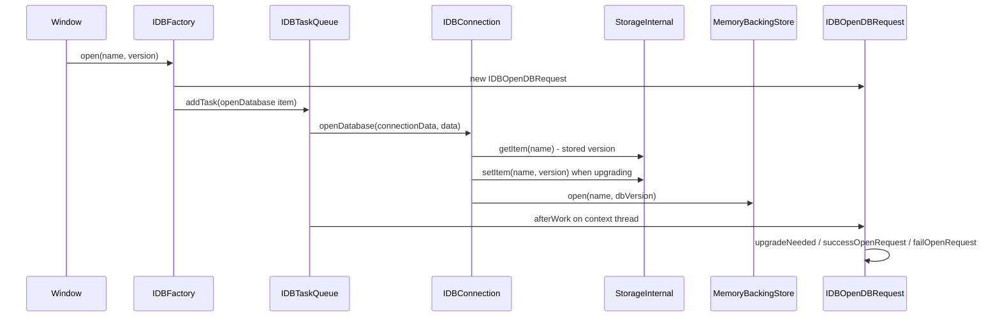
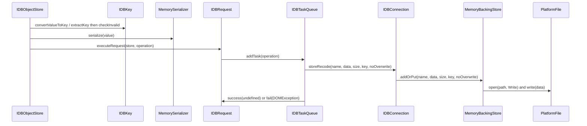
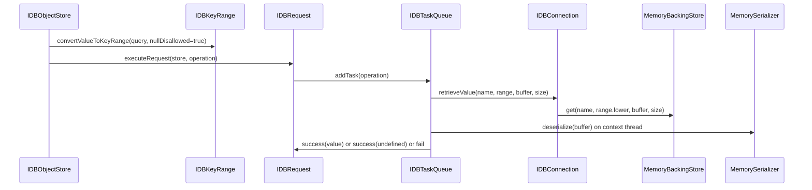

# Module Design Card: modules-indexeddb

> **Relevant source files**
>
> - [src/core/modules/indexeddb/IDBBackingStore.h](src:src/core/modules/indexeddb/IDBBackingStore.h)
> - [src/core/modules/indexeddb/IDBConfig.h](src:src/core/modules/indexeddb/IDBConfig.h)
> - [src/core/modules/indexeddb/IDBConnection.cpp](src:src/core/modules/indexeddb/IDBConnection.cpp)
> - [src/core/modules/indexeddb/IDBConnection.h](src:src/core/modules/indexeddb/IDBConnection.h)
> - [src/core/modules/indexeddb/IDBCursor.cpp](src:src/core/modules/indexeddb/IDBCursor.cpp)
> - [src/core/modules/indexeddb/IDBCursor.h](src:src/core/modules/indexeddb/IDBCursor.h)
> - [src/core/modules/indexeddb/IDBDatabase.cpp](src:src/core/modules/indexeddb/IDBDatabase.cpp)
> - [src/core/modules/indexeddb/IDBDatabase.h](src:src/core/modules/indexeddb/IDBDatabase.h)
> - [src/core/modules/indexeddb/IDBDatabaseIdentifier.cpp](src:src/core/modules/indexeddb/IDBDatabaseIdentifier.cpp)
> - [src/core/modules/indexeddb/IDBDatabaseIdentifier.h](src:src/core/modules/indexeddb/IDBDatabaseIdentifier.h)
> - [src/core/modules/indexeddb/IDBFactory.cpp](src:src/core/modules/indexeddb/IDBFactory.cpp)
> - [src/core/modules/indexeddb/IDBFactory.h](src:src/core/modules/indexeddb/IDBFactory.h)
> - [src/core/modules/indexeddb/IDBIndex.cpp](src:src/core/modules/indexeddb/IDBIndex.cpp)
> - [src/core/modules/indexeddb/IDBIndex.h](src:src/core/modules/indexeddb/IDBIndex.h)
> - [src/core/modules/indexeddb/IDBKey.cpp](src:src/core/modules/indexeddb/IDBKey.cpp)
> - [src/core/modules/indexeddb/IDBKey.h](src:src/core/modules/indexeddb/IDBKey.h)
> - [src/core/modules/indexeddb/IDBKeyPath.cpp](src:src/core/modules/indexeddb/IDBKeyPath.cpp)
> - [src/core/modules/indexeddb/IDBKeyPath.h](src:src/core/modules/indexeddb/IDBKeyPath.h)
> - [src/core/modules/indexeddb/IDBKeyRange.cpp](src:src/core/modules/indexeddb/IDBKeyRange.cpp)
> - [src/core/modules/indexeddb/IDBKeyRange.h](src:src/core/modules/indexeddb/IDBKeyRange.h)
> - [src/core/modules/indexeddb/IDBObjectStore.cpp](src:src/core/modules/indexeddb/IDBObjectStore.cpp)
> - [src/core/modules/indexeddb/IDBObjectStore.h](src:src/core/modules/indexeddb/IDBObjectStore.h)
> - [src/core/modules/indexeddb/IDBOpenDBRequest.cpp](src:src/core/modules/indexeddb/IDBOpenDBRequest.cpp)
> - [src/core/modules/indexeddb/IDBOpenDBRequest.h](src:src/core/modules/indexeddb/IDBOpenDBRequest.h)
> - [src/core/modules/indexeddb/IDBRequest.cpp](src:src/core/modules/indexeddb/IDBRequest.cpp)
> - [src/core/modules/indexeddb/IDBRequest.h](src:src/core/modules/indexeddb/IDBRequest.h)
> - [src/core/modules/indexeddb/IDBStorageManager.cpp](src:src/core/modules/indexeddb/IDBStorageManager.cpp)
> - [src/core/modules/indexeddb/IDBStorageManager.h](src:src/core/modules/indexeddb/IDBStorageManager.h)
> - [src/core/modules/indexeddb/IDBTaskQueue.cpp](src:src/core/modules/indexeddb/IDBTaskQueue.cpp)
> - [src/core/modules/indexeddb/IDBTaskQueue.h](src:src/core/modules/indexeddb/IDBTaskQueue.h)
> - [src/core/modules/indexeddb/IDBTransaction.cpp](src:src/core/modules/indexeddb/IDBTransaction.cpp)
> - [src/core/modules/indexeddb/IDBTransaction.h](src:src/core/modules/indexeddb/IDBTransaction.h)
> - [src/core/modules/indexeddb/IDBUtils.cpp](src:src/core/modules/indexeddb/IDBUtils.cpp)
> - [src/core/modules/indexeddb/IDBUtils.h](src:src/core/modules/indexeddb/IDBUtils.h)
> - [src/core/modules/indexeddb/MemoryBackingStore.cpp](src:src/core/modules/indexeddb/MemoryBackingStore.cpp)
> - [src/core/modules/indexeddb/MemoryBackingStore.h](src:src/core/modules/indexeddb/MemoryBackingStore.h)
> - [src/core/modules/indexeddb/IndexedDB.idl](src:src/core/modules/indexeddb/IndexedDB.idl)
> - [src/core/modules/indexeddb/IDBFactory.idl](src:src/core/modules/indexeddb/IDBFactory.idl)
> - [src/core/modules/indexeddb/IDBDatabase.idl](src:src/core/modules/indexeddb/IDBDatabase.idl)
> - [src/core/modules/indexeddb/IDBObjectStore.idl](src:src/core/modules/indexeddb/IDBObjectStore.idl)
> - [src/core/modules/indexeddb/IDBTransaction.idl](src:src/core/modules/indexeddb/IDBTransaction.idl)
> - [src/core/modules/indexeddb/IDBRequest.idl](src:src/core/modules/indexeddb/IDBRequest.idl)
> - [src/core/modules/indexeddb/IDBOpenDBRequest.idl](src:src/core/modules/indexeddb/IDBOpenDBRequest.idl)
> - [src/core/modules/indexeddb/IDBKeyRange.idl](src:src/core/modules/indexeddb/IDBKeyRange.idl)
> - [src/core/modules/indexeddb/IDBIndex.idl](src:src/core/modules/indexeddb/IDBIndex.idl)
> - [src/core/modules/indexeddb/IDBCursor.idl](src:src/core/modules/indexeddb/IDBCursor.idl)
> - [src/core/page/Window.cpp](src:src/core/page/Window.cpp)
> - [src/core/page/Window.h](src:src/core/page/Window.h)
> - [src/core/modules/worker/WorkerGlobalScope.cpp](src:src/core/modules/worker/WorkerGlobalScope.cpp)
> - [src/core/modules/worker/WorkerGlobalScope.h](src:src/core/modules/worker/WorkerGlobalScope.h)
> - [src/core/storage/StorageInternal.h](src:src/core/storage/StorageInternal.h)
> - [src/core/serialize/MemorySerializer.h](src:src/core/serialize/MemorySerializer.h)
> - [src/platform/file/PlatformFile.h](src:src/platform/file/PlatformFile.h)
> - [src/platform/file/PlatformDirectory.h](src:src/platform/file/PlatformDirectory.h)
> - [src/core/modules/message_loop/MessageLoopInterface.h](src:src/core/modules/message_loop/MessageLoopInterface.h)
> - [src/core/modules/threading/Thread.h](src:src/core/modules/threading/Thread.h)
> - [src/core/dom/ExecutionContext.h](src:src/core/dom/ExecutionContext.h)
> - [src/core/dom/DOMException.h](src:src/core/dom/DOMException.h)
> - [src/core/dom/EventTarget.h](src:src/core/dom/EventTarget.h)
> - [src/core/dom/WebOrigin.h](src:src/core/dom/WebOrigin.h)
> - [src/StaticStrings.h](src:src/StaticStrings.h)
> - [src/core/cdp/CDPDispatcher.cpp](src:src/core/cdp/CDPDispatcher.cpp)
> - [build/config.cmake](src:build/config.cmake)

**Module**: `modules-indexeddb` — 36 files under `src/core/modules/indexeddb/`
**Role**: Implements the script-facing IndexedDB objects (factory, database, transaction, object store, request) and executes their open/add/put/get operations on a dedicated worker thread against a file-backed store rooted at a per-user data directory. [`IDBFactory`](src:src/core/modules/indexeddb/IDBFactory.h#L39) [`IDBTaskQueue`](src:src/core/modules/indexeddb/IDBTaskQueue.h#L53) [`MemoryBackingStore`](src:src/core/modules/indexeddb/MemoryBackingStore.h#L36)
**Module Boundary**: IndexedDB directory (IDBBackingStore, database, cursor, connection)
**Confidence**: 0.92
**Core selection**: All approved modules are Core (boundary approved in W1 human review)
**Generated**: 2026-09-10

The whole module is compiled only when `STARFISH_ENABLE_IDB` is defined; the build option `IDB=1` adds that define and forces threading on. [`config.cmake`](src:build/config.cmake#L399) Every module header and source begins with the same guard. [`IDBBackingStore.h`](src:src/core/modules/indexeddb/IDBBackingStore.h#L20)

## Source Files

### `src/core/modules/indexeddb/` — script-facing objects
- [src/core/modules/indexeddb/IDBFactory.h](src:src/core/modules/indexeddb/IDBFactory.h)
- [src/core/modules/indexeddb/IDBFactory.cpp](src:src/core/modules/indexeddb/IDBFactory.cpp)
- [src/core/modules/indexeddb/IDBFactory.idl](src:src/core/modules/indexeddb/IDBFactory.idl)
- [src/core/modules/indexeddb/IndexedDB.idl](src:src/core/modules/indexeddb/IndexedDB.idl)
- [src/core/modules/indexeddb/IDBDatabase.h](src:src/core/modules/indexeddb/IDBDatabase.h)
- [src/core/modules/indexeddb/IDBDatabase.cpp](src:src/core/modules/indexeddb/IDBDatabase.cpp)
- [src/core/modules/indexeddb/IDBDatabase.idl](src:src/core/modules/indexeddb/IDBDatabase.idl)
- [src/core/modules/indexeddb/IDBTransaction.h](src:src/core/modules/indexeddb/IDBTransaction.h)
- [src/core/modules/indexeddb/IDBTransaction.cpp](src:src/core/modules/indexeddb/IDBTransaction.cpp)
- [src/core/modules/indexeddb/IDBTransaction.idl](src:src/core/modules/indexeddb/IDBTransaction.idl)
- [src/core/modules/indexeddb/IDBObjectStore.h](src:src/core/modules/indexeddb/IDBObjectStore.h)
- [src/core/modules/indexeddb/IDBObjectStore.cpp](src:src/core/modules/indexeddb/IDBObjectStore.cpp)
- [src/core/modules/indexeddb/IDBObjectStore.idl](src:src/core/modules/indexeddb/IDBObjectStore.idl)
- [src/core/modules/indexeddb/IDBIndex.h](src:src/core/modules/indexeddb/IDBIndex.h)
- [src/core/modules/indexeddb/IDBIndex.cpp](src:src/core/modules/indexeddb/IDBIndex.cpp)
- [src/core/modules/indexeddb/IDBIndex.idl](src:src/core/modules/indexeddb/IDBIndex.idl)
- [src/core/modules/indexeddb/IDBCursor.h](src:src/core/modules/indexeddb/IDBCursor.h)
- [src/core/modules/indexeddb/IDBCursor.cpp](src:src/core/modules/indexeddb/IDBCursor.cpp)
- [src/core/modules/indexeddb/IDBCursor.idl](src:src/core/modules/indexeddb/IDBCursor.idl)

### `src/core/modules/indexeddb/` — requests and events
- [src/core/modules/indexeddb/IDBRequest.h](src:src/core/modules/indexeddb/IDBRequest.h)
- [src/core/modules/indexeddb/IDBRequest.cpp](src:src/core/modules/indexeddb/IDBRequest.cpp)
- [src/core/modules/indexeddb/IDBRequest.idl](src:src/core/modules/indexeddb/IDBRequest.idl)
- [src/core/modules/indexeddb/IDBOpenDBRequest.h](src:src/core/modules/indexeddb/IDBOpenDBRequest.h)
- [src/core/modules/indexeddb/IDBOpenDBRequest.cpp](src:src/core/modules/indexeddb/IDBOpenDBRequest.cpp)
- [src/core/modules/indexeddb/IDBOpenDBRequest.idl](src:src/core/modules/indexeddb/IDBOpenDBRequest.idl)

### `src/core/modules/indexeddb/` — keys and key ranges
- [src/core/modules/indexeddb/IDBKey.h](src:src/core/modules/indexeddb/IDBKey.h)
- [src/core/modules/indexeddb/IDBKey.cpp](src:src/core/modules/indexeddb/IDBKey.cpp)
- [src/core/modules/indexeddb/IDBKeyPath.h](src:src/core/modules/indexeddb/IDBKeyPath.h)
- [src/core/modules/indexeddb/IDBKeyPath.cpp](src:src/core/modules/indexeddb/IDBKeyPath.cpp)
- [src/core/modules/indexeddb/IDBKeyRange.h](src:src/core/modules/indexeddb/IDBKeyRange.h)
- [src/core/modules/indexeddb/IDBKeyRange.cpp](src:src/core/modules/indexeddb/IDBKeyRange.cpp)
- [src/core/modules/indexeddb/IDBKeyRange.idl](src:src/core/modules/indexeddb/IDBKeyRange.idl)
- [src/core/modules/indexeddb/IDBUtils.h](src:src/core/modules/indexeddb/IDBUtils.h)
- [src/core/modules/indexeddb/IDBUtils.cpp](src:src/core/modules/indexeddb/IDBUtils.cpp)

### `src/core/modules/indexeddb/` — storage back end and worker thread
- [src/core/modules/indexeddb/IDBStorageManager.h](src:src/core/modules/indexeddb/IDBStorageManager.h)
- [src/core/modules/indexeddb/IDBStorageManager.cpp](src:src/core/modules/indexeddb/IDBStorageManager.cpp)
- [src/core/modules/indexeddb/IDBTaskQueue.h](src:src/core/modules/indexeddb/IDBTaskQueue.h)
- [src/core/modules/indexeddb/IDBTaskQueue.cpp](src:src/core/modules/indexeddb/IDBTaskQueue.cpp)
- [src/core/modules/indexeddb/IDBConnection.h](src:src/core/modules/indexeddb/IDBConnection.h)
- [src/core/modules/indexeddb/IDBConnection.cpp](src:src/core/modules/indexeddb/IDBConnection.cpp)
- [src/core/modules/indexeddb/IDBDatabaseIdentifier.h](src:src/core/modules/indexeddb/IDBDatabaseIdentifier.h)
- [src/core/modules/indexeddb/IDBDatabaseIdentifier.cpp](src:src/core/modules/indexeddb/IDBDatabaseIdentifier.cpp)
- [src/core/modules/indexeddb/IDBBackingStore.h](src:src/core/modules/indexeddb/IDBBackingStore.h)
- [src/core/modules/indexeddb/MemoryBackingStore.h](src:src/core/modules/indexeddb/MemoryBackingStore.h)
- [src/core/modules/indexeddb/MemoryBackingStore.cpp](src:src/core/modules/indexeddb/MemoryBackingStore.cpp)
- [src/core/modules/indexeddb/IDBConfig.h](src:src/core/modules/indexeddb/IDBConfig.h)

Note: the module-groups.yaml entry lists 36 files; the nine `.idl` files above live in the same directory and are listed here because they declare the script-visible surface of the same classes. [`IDBFactory.idl`](src:src/core/modules/indexeddb/IDBFactory.idl#L8)

## Public Interface

| Function/Class | Signature | Main callers | Source |
|---|---|---|---|
| `IDBStorageManager::instance` | `static IDBStorageManager& instance()` | [`Window.cpp`](src:src/core/page/Window.cpp#L155), [`Window::indexedDB`](src:src/core/page/Window.cpp#L1157), [`WorkerGlobalScope::indexedDB`](src:src/core/modules/worker/WorkerGlobalScope.cpp#L267) | [`IDBStorageManager::instance`](src:src/core/modules/indexeddb/IDBStorageManager.h#L34) |
| `IDBStorageManager::start` | `void start()` | [`Window::indexedDB`](src:src/core/page/Window.cpp#L1157), [`WorkerGlobalScope::indexedDB`](src:src/core/modules/worker/WorkerGlobalScope.cpp#L267) | [`IDBStorageManager::start`](src:src/core/modules/indexeddb/IDBStorageManager.h#L38) |
| `IDBStorageManager::dispose` | `void dispose()` | `Window` destructor [`Window.cpp`](src:src/core/page/Window.cpp#L229) | [`IDBStorageManager::dispose`](src:src/core/modules/indexeddb/IDBStorageManager.h#L40) |
| `IDBFactory` | `IDBFactory(ExecutionContext* executionContext)` | [`Window.cpp`](src:src/core/page/Window.cpp#L1161), [`WorkerGlobalScope.cpp`](src:src/core/modules/worker/WorkerGlobalScope.cpp#L271) | [`IDBFactory`](src:src/core/modules/indexeddb/IDBFactory.h#L41) |
| `IDBFactory::open` | `IDBOpenDBRequest* open(String* name, Optional<unsigned long long> version)` | Script binding declared in [`IDBFactory.idl`](src:src/core/modules/indexeddb/IDBFactory.idl#L10) | [`IDBFactory::open`](src:src/core/modules/indexeddb/IDBFactory.h#L47) |
| `IDBFactory::deleteDatabase` | `IDBOpenDBRequest* deleteDatabase(String* name)` | Script binding ([`IDBFactory.idl`](src:src/core/modules/indexeddb/IDBFactory.idl#L12)); body is `STARFISH_UNIMPLEMENTED` | [`IDBFactory::deleteDatabase`](src:src/core/modules/indexeddb/IDBFactory.cpp#L114) |
| `IDBDatabase::transaction` | `IDBTransaction* transaction(DOMStringOrSequenceOfDOMString storeNames, String* mode, const IDBTransactionOptions& options = {})` | Script binding ([`IDBDatabase.idl`](src:src/core/modules/indexeddb/IDBDatabase.idl#L13)) | [`IDBDatabase::transaction`](src:src/core/modules/indexeddb/IDBDatabase.h#L70) |
| `IDBDatabase::createObjectStore` | `IDBObjectStore* createObjectStore(String* name, IDBObjectStoreParameters options)` | Script binding ([`IDBDatabase.idl`](src:src/core/modules/indexeddb/IDBDatabase.idl#L19)) | [`IDBDatabase::createObjectStore`](src:src/core/modules/indexeddb/IDBDatabase.h#L75) |
| `IDBDatabase::startVersionChangeTransaction` | `IDBTransaction* startVersionChangeTransaction()` | [`IDBOpenDBRequest::upgradeNeeded`](src:src/core/modules/indexeddb/IDBOpenDBRequest.cpp#L59) | [`IDBDatabase::startVersionChangeTransaction`](src:src/core/modules/indexeddb/IDBDatabase.h#L78) |
| `IDBTransaction::objectStore` | `IDBObjectStore* objectStore(String* name)` | Script binding ([`IDBTransaction.idl`](src:src/core/modules/indexeddb/IDBTransaction.idl#L15)), [`IDBDatabase.cpp`](src:src/core/modules/indexeddb/IDBDatabase.cpp#L114) | [`IDBTransaction::objectStore`](src:src/core/modules/indexeddb/IDBTransaction.h#L57) |
| `IDBObjectStore::put` / `IDBObjectStore::add` | `IDBRequest* put(ScriptValue value, ScriptValue key)` / `IDBRequest* add(ScriptValue value, ScriptValue key)` | Script binding ([`IDBObjectStore.idl`](src:src/core/modules/indexeddb/IDBObjectStore.idl#L15)) | [`IDBObjectStore::put`](src:src/core/modules/indexeddb/IDBObjectStore.h#L41), [`IDBObjectStore::add`](src:src/core/modules/indexeddb/IDBObjectStore.h#L44) |
| `IDBObjectStore::get` | `IDBRequest* get(ScriptValue query)` | Script binding ([`IDBObjectStore.idl`](src:src/core/modules/indexeddb/IDBObjectStore.idl#L19)) | [`IDBObjectStore::get`](src:src/core/modules/indexeddb/IDBObjectStore.h#L49) |
| `IDBRequest::readyState` | `String* readyState() const` | Script binding ([`IDBRequest.idl`](src:src/core/modules/indexeddb/IDBRequest.idl#L15)) | [`IDBRequest::readyState`](src:src/core/modules/indexeddb/IDBRequest.h#L70) |
| `IDBRequest::executeRequest` | `void executeRequest(IDBObjectStore* source, std::unique_ptr<IDBTaskQueueItem> operation)` | [`IDBObjectStore.cpp`](src:src/core/modules/indexeddb/IDBObjectStore.cpp#L170), [`IDBObjectStore.cpp`](src:src/core/modules/indexeddb/IDBObjectStore.cpp#L247) | [`IDBRequest::executeRequest`](src:src/core/modules/indexeddb/IDBRequest.h#L67) |
| `IDBOpenDBRequest` | `IDBOpenDBRequest(ExecutionContext* executionContext)`; events `success`, `error`, `upgradeneeded` | [`IDBFactory.cpp`](src:src/core/modules/indexeddb/IDBFactory.cpp#L64) | [`IDBOpenDBRequest`](src:src/core/modules/indexeddb/IDBOpenDBRequest.h#L41) |
| `IDBBackingStore` | `virtual void open(String* name, unsigned long long version) = 0; virtual IDBRequestErrorType addOrPut(...) = 0; virtual bool get(...) = 0` | Implemented by [`MemoryBackingStore`](src:src/core/modules/indexeddb/MemoryBackingStore.h#L36); called by [`IDBConnection.cpp`](src:src/core/modules/indexeddb/IDBConnection.cpp#L113) | [`IDBBackingStore`](src:src/core/modules/indexeddb/IDBBackingStore.h#L31) |
| `IDBKeyRange::convertValueToKeyRange` | `static IDBKeyRange* convertValueToKeyRange(ExecutionContext*, ScriptValue value, bool nullDisallowed)` | [`IDBObjectStore.cpp`](src:src/core/modules/indexeddb/IDBObjectStore.cpp#L191) | [`IDBKeyRange::convertValueToKeyRange`](src:src/core/modules/indexeddb/IDBKeyRange.h#L33) |
| `IDBKey::convertValueToKey` | `static IDBKey* convertValueToKey(ScriptBindingInstance*, ScriptValue value)` | [`IDBObjectStore.cpp`](src:src/core/modules/indexeddb/IDBObjectStore.cpp#L109), [`IDBKeyPath.cpp`](src:src/core/modules/indexeddb/IDBKeyPath.cpp#L68), [`IDBKeyRange.cpp`](src:src/core/modules/indexeddb/IDBKeyRange.cpp#L50) | [`IDBKey::convertValueToKey`](src:src/core/modules/indexeddb/IDBKey.h#L41) |

The only in-engine consumers outside the module are the `indexedDB` attribute getters of `Window` and `WorkerGlobalScope`, which both start the storage manager and construct one `IDBFactory` per global scope. [`Window::indexedDB`](src:src/core/page/Window.cpp#L1157) [`WorkerGlobalScope::indexedDB`](src:src/core/modules/worker/WorkerGlobalScope.cpp#L267) The `indexedDB` attribute is declared for both `Window` and `WorkerGlobalScope` in [`IndexedDB.idl`](src:src/core/modules/indexeddb/IndexedDB.idl#L8).

## IPC / Message / Interface Contracts

- No cross-module IPC or message contract is identifiable in code for this module.

Work is handed between the context thread and the storage worker thread inside one process: `IDBTaskQueue::addTask` enqueues an item and `IDBTaskQueue::worker` posts the completion back through the execution context's message loop. This is an in-process thread hop, not an IPC boundary. [`IDBTaskQueue::addTask`](src:src/core/modules/indexeddb/IDBTaskQueue.cpp#L145) [`IDBTaskQueue::worker`](src:src/core/modules/indexeddb/IDBTaskQueue.cpp#L63) [`addIdlerWithNoGCRootingInOtherThread`](src:src/core/modules/message_loop/MessageLoopInterface.h#L26)

## Key Flow

### Opening a database

Entry symbol: [`IDBFactory::open`](src:src/core/modules/indexeddb/IDBFactory.cpp#L54); the worker step is [`IDBConnection::openDatabase`](src:src/core/modules/indexeddb/IDBConnection.cpp#L50) and the completion callback is the second lambda passed to [`IDBTaskQueueItem`](src:src/core/modules/indexeddb/IDBFactory.cpp#L80).

### Adding or putting a record

Entry symbol: [`IDBObjectStore::addOrPut`](src:src/core/modules/indexeddb/IDBObjectStore.cpp#L78); the file write is in [`MemoryBackingStore::addOrPut`](src:src/core/modules/indexeddb/MemoryBackingStore.cpp#L56).

### Getting a record

Entry symbol: [`IDBObjectStore::get`](src:src/core/modules/indexeddb/IDBObjectStore.cpp#L175); the read is in [`MemoryBackingStore::get`](src:src/core/modules/indexeddb/MemoryBackingStore.cpp#L89).

## Architectural Rules

- [ ] All backing-store and connection work runs on the single `IDBTaskQueue` worker thread; `IDBConnection` and `MemoryBackingStore` are documented as not thread-safe and callable only from that thread. [`IDBConnection`](src:src/core/modules/indexeddb/IDBConnection.h#L47) [`MemoryBackingStore`](src:src/core/modules/indexeddb/MemoryBackingStore.h#L33) [`IDBTaskQueue::worker`](src:src/core/modules/indexeddb/IDBTaskQueue.cpp#L63)
- [ ] Results are delivered back on the request's context thread through the message loop idler; `IDBRequest::success` and `IDBRequest::fail` assert `isContextThread()`. [`IDBTaskQueue.cpp`](src:src/core/modules/indexeddb/IDBTaskQueue.cpp#L103) [`IDBRequest.cpp`](src:src/core/modules/indexeddb/IDBRequest.cpp#L102)
- [ ] `IDBStorageManager` is a process-wide singleton constructed on the main thread; `start()` and `dispose()` are idempotent under `m_mutex`. [`IDBStorageManager::instance`](src:src/core/modules/indexeddb/IDBStorageManager.cpp#L33) [`IDBStorageManager::start`](src:src/core/modules/indexeddb/IDBStorageManager.cpp#L54) [`IDBStorageManager::dispose`](src:src/core/modules/indexeddb/IDBStorageManager.cpp#L66)
- [ ] Storage access goes through the `IDBBackingStore` abstract interface; `IDBConnection` owns exactly one `MemoryBackingStore` and never touches files directly. [`IDBBackingStore`](src:src/core/modules/indexeddb/IDBBackingStore.h#L31) [`IDBConnection.cpp`](src:src/core/modules/indexeddb/IDBConnection.cpp#L100)
- [ ] Every mutation or read on an object store requires its transaction to be `State::Active`; writes additionally require a non-`ReadOnly` mode. [`IDBObjectStore.cpp`](src:src/core/modules/indexeddb/IDBObjectStore.cpp#L90) [`IDBObjectStore.cpp`](src:src/core/modules/indexeddb/IDBObjectStore.cpp#L184)
- [ ] Object stores may be created only while a version-change transaction exists and is active. [`IDBDatabase.cpp`](src:src/core/modules/indexeddb/IDBDatabase.cpp#L85)
- [ ] Keys must pass `IDBKey::checkInvalid` before a request is queued; invalid keys raise a `DataError` `DOMException` synchronously. [`IDBKey::checkInvalid`](src:src/core/modules/indexeddb/IDBKey.cpp#L97)
- [ ] Task payloads (`IDBTaskQueueItemData` subclasses) are allocated with `new (NoGC)` and released with `GC_FREE` in the completion callback. [`IDBFactory.cpp`](src:src/core/modules/indexeddb/IDBFactory.cpp#L66) [`IDBObjectStore.cpp`](src:src/core/modules/indexeddb/IDBObjectStore.cpp#L141)

## Dependencies

### Internal modules

| Module | File(s) | Purpose | Source |
|---|---|---|---|
| [core-dom](core-dom.md) | `core/dom/ExecutionContext.h`, `core/dom/DOMException.h`, `core/dom/EventTarget.h`, `core/dom/WebOrigin.h`, `core/dom/DOMStringList.h`, `core/dom/Event.h` | Execution context and thread checks, exceptions thrown to script, event dispatch base class, origin hashing for database identity | [`IDBRequest`](src:src/core/modules/indexeddb/IDBRequest.h#L47) [`IDBDatabaseIdentifier.cpp`](src:src/core/modules/indexeddb/IDBDatabaseIdentifier.cpp#L36) |
| core-storage-fileapi | `core/storage/StorageInternal.h` | `StorageMemory` keyed by origin stores each database's version string under its name | [`IDBConnectionData::storageKey`](src:src/core/modules/indexeddb/IDBConnection.cpp#L38) [`StorageMemory`](src:src/core/storage/StorageInternal.h#L56) |
| core-extras | `core/serialize/MemorySerializer.h` | Serialize script values before storing, deserialize after reading | [`MemorySerializer::serialize`](src:src/core/serialize/MemorySerializer.h#L152) [`IDBObjectStore.cpp`](src:src/core/modules/indexeddb/IDBObjectStore.cpp#L125) |
| platform-base | `platform/file/PlatformFile.h`, `platform/file/PlatformDirectory.h` | Directory creation and per-record file read/write | [`PlatformFile::open`](src:src/platform/file/PlatformFile.h#L47) [`PlatformDirectoryUtil::createDirectory`](src:src/platform/file/PlatformDirectory.h#L30) |
| modules-runtime | `core/modules/message_loop/MessageLoop.h`, `core/modules/threading/Thread.h` | Post completion callbacks to the context thread; main-thread assertions | [`addIdlerWithNoGCRootingInOtherThread`](src:src/core/modules/message_loop/MessageLoopInterface.h#L26) [`isMainThread`](src:src/core/modules/threading/Thread.h#L39) |
| binding | `binding/ScriptWrappable.h`, `binding/generated/DOMStringOrSequenceOfDOMStringUnion.h` | Script-wrappable base for factory/store/range/index/cursor; union type for key paths and store names | [`IDBFactory`](src:src/core/modules/indexeddb/IDBFactory.h#L39) [`IDBKeyPath.h`](src:src/core/modules/indexeddb/IDBKeyPath.h#L22) |
| core-util | `core/util/debug/Trace.h` | `TRACE(IDB, ...)` diagnostics | [`MemoryBackingStore::open`](src:src/core/modules/indexeddb/MemoryBackingStore.cpp#L53) |
| engine-entry | `StaticStrings.h` (via `Starfish.h`) | Event names `success`, `error`, `upgradeneeded` | [`StaticStrings.h`](src:src/StaticStrings.h#L835) [`IDBOpenDBRequest.cpp`](src:src/core/modules/indexeddb/IDBOpenDBRequest.cpp#L69) |

Consumers: core-page (`Window`) and [modules-workers](modules-workers.md) (`WorkerGlobalScope`) include `IDBStorageManager.h` and `IDBFactory.h`. [`Window.cpp`](src:src/core/page/Window.cpp#L76) [`WorkerGlobalScope.cpp`](src:src/core/modules/worker/WorkerGlobalScope.cpp#L41) [core-cdp](core-cdp.md) records in a comment that the IndexedDB build flag is off in the CDP build. [`CDPDispatcher.cpp`](src:src/core/cdp/CDPDispatcher.cpp#L1296)

### External libraries

| Library | Version | Purpose | Source |
|---|---|---|---|
| Escargot (`<EscargotPublic.h>`) | Not specified in code | `Globals::supportsThreading`, `initializeThread`, `finalizeThread` bracket the worker thread | [`IDBTaskQueue.cpp`](src:src/core/modules/indexeddb/IDBTaskQueue.cpp#L23) [`IDBTaskQueue.cpp`](src:src/core/modules/indexeddb/IDBTaskQueue.cpp#L67) |
| C++ standard library (`std::thread`, `std::mutex`, `std::condition_variable`, `std::deque`, `std::atomic_bool`) | Not specified in code | Worker thread and task queue synchronization | [`IDBTaskQueue.h`](src:src/core/modules/indexeddb/IDBTaskQueue.h#L66) |
| Garbage-collected allocation (`gc` base, `new (NoGC)`, `GC_FREE`) | Not specified in code | Lifetime of keys, task payloads and connection data | [`IDBTaskQueueItemData`](src:src/core/modules/indexeddb/IDBTaskQueue.h#L35) [`IDBFactory.cpp`](src:src/core/modules/indexeddb/IDBFactory.cpp#L105) |

## Quick Navigation

| To change… | Location |
|---|---|
| Where database files live on disk (`$HOME` or `/tmp`, `/starfish-data`, `/indexedDB`) | [`IDBStorageManager::getLocalStoragePath`](src:src/core/modules/indexeddb/IDBStorageManager.cpp#L83), [`IDB_LOCAL_STORAGE_DIR_PATH`](src:src/core/modules/indexeddb/IDBConfig.h#L27) |
| How a record maps to a file name (hash of key string) | [`MemoryBackingStore.cpp`](src:src/core/modules/indexeddb/MemoryBackingStore.cpp#L65) |
| Version comparison and `VersionError` on open | [`IDBConnection.cpp`](src:src/core/modules/indexeddb/IDBConnection.cpp#L74) |
| Where the database version is persisted | [`IDBConnectionData::storageKey`](src:src/core/modules/indexeddb/IDBConnection.cpp#L38) |
| Supported key types and invalid-key rules | [`IDBKey::convertValueToKey`](src:src/core/modules/indexeddb/IDBKey.cpp#L29) |
| Key-path extraction from a stored value | [`IDBKeyPath::extractKey`](src:src/core/modules/indexeddb/IDBKeyPath.cpp#L53) |
| Query-to-range conversion for `get` | [`IDBKeyRange::convertValueToKeyRange`](src:src/core/modules/indexeddb/IDBKeyRange.cpp#L31) |
| Transaction state checks before add/put/get | [`IDBObjectStore.cpp`](src:src/core/modules/indexeddb/IDBObjectStore.cpp#L85), [`IDBObjectStore.cpp`](src:src/core/modules/indexeddb/IDBObjectStore.cpp#L179) |
| Error-type to `DOMException` mapping | [`IDBRequest::errorCodeToDOMException`](src:src/core/modules/indexeddb/IDBRequest.cpp#L48) |
| Worker loop and completion hand-off | [`IDBTaskQueue::worker`](src:src/core/modules/indexeddb/IDBTaskQueue.cpp#L63) |
| Transaction mode / durability string names | [`IDBUtils::transactionModeToType`](src:src/core/modules/indexeddb/IDBUtils.cpp#L71), [`IDBUtils::transactionDurabilityToType`](src:src/core/modules/indexeddb/IDBUtils.cpp#L43) |
| Adding a new backing store implementation | [`IDBBackingStore`](src:src/core/modules/indexeddb/IDBBackingStore.h#L31), [`IDBConnection.cpp`](src:src/core/modules/indexeddb/IDBConnection.cpp#L100) |

## FR Linkage

- [FR-MODULES-INDEXEDDB-001](../functional-requirements/modules-indexeddb-fr.md#fr-modules-indexeddb-001): Provide the IndexedDB factory and start the storage manager per global scope
- [FR-MODULES-INDEXEDDB-002](../functional-requirements/modules-indexeddb-fr.md#fr-modules-indexeddb-002): Open a database asynchronously with version negotiation
- [FR-MODULES-INDEXEDDB-003](../functional-requirements/modules-indexeddb-fr.md#fr-modules-indexeddb-003): Identify databases by origin and name and persist their version
- [FR-MODULES-INDEXEDDB-004](../functional-requirements/modules-indexeddb-fr.md#fr-modules-indexeddb-004): Execute requests on a dedicated worker thread and complete them on the context thread
- [FR-MODULES-INDEXEDDB-005](../functional-requirements/modules-indexeddb-fr.md#fr-modules-indexeddb-005): Create transactions with mode, durability and an Active/Inactive state
- [FR-MODULES-INDEXEDDB-006](../functional-requirements/modules-indexeddb-fr.md#fr-modules-indexeddb-006): Create object stores only during an active version-change transaction
- [FR-MODULES-INDEXEDDB-007](../functional-requirements/modules-indexeddb-fr.md#fr-modules-indexeddb-007): Store a record with add or put, honouring the no-overwrite rule
- [FR-MODULES-INDEXEDDB-008](../functional-requirements/modules-indexeddb-fr.md#fr-modules-indexeddb-008): Retrieve a record by exact key
- [FR-MODULES-INDEXEDDB-009](../functional-requirements/modules-indexeddb-fr.md#fr-modules-indexeddb-009): Convert script values to keys and reject invalid keys
- [FR-MODULES-INDEXEDDB-010](../functional-requirements/modules-indexeddb-fr.md#fr-modules-indexeddb-010): Persist records as one file per key under the storage directory
- [FR-MODULES-INDEXEDDB-011](../functional-requirements/modules-indexeddb-fr.md#fr-modules-indexeddb-011): Report request outcome through success and error events with mapped exceptions
